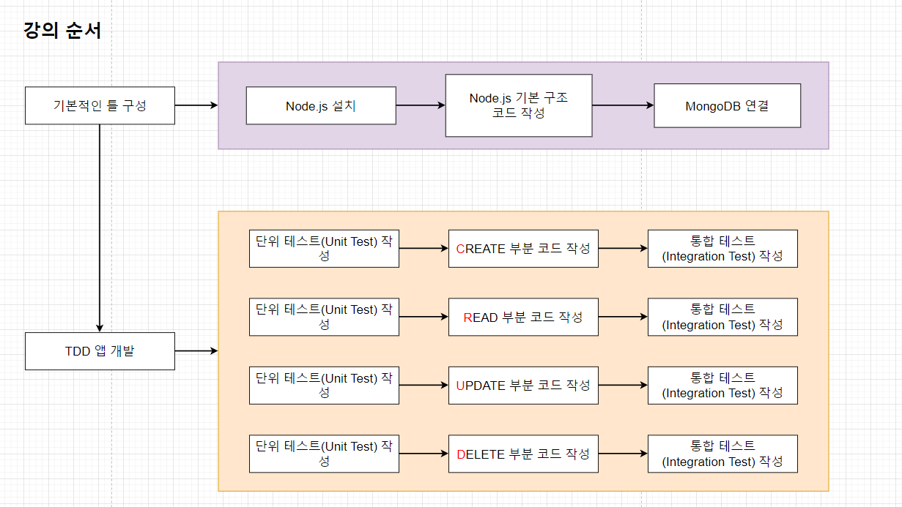

# 따라하며 배우는 TDD 개발

# Section 1. 강의 소개 & 애플리케이션 기본 구조

- 강의 소개
    
    
    
    - TDD(Test Driven Development)
    - 더 안정적인 Application을 위해서는 여러 방법으로 Test를 해줘야 더 안정적인 Application이 될 수 있다.
    - Testing으로 얻는 이점
        1. 디버깅 시간 단축 : 만약 데이터가 잘못 나왔다면 그것이 UI의 문제인지 DB의 문제인지 등, 전부 테스트를 해서 찾아야 하지만 Testing 환경이 구축되어 있다면 자동화 된 Unit Testing으로 특정 버그를 쉽게 찾아낼 수 있다. 
        2. 더욱 안정적인 Application : 많은 Test Code와 함께 작성된 코드의 Application이 되기 때문에 훨씬 안정적인 Application이 된다. 
        3. 이 밖에도 재 설계 시간의 단축, 추가로 무언가를 더 구현해야 할 때 더 용이하게 할 수 있는 등의 이점들이 있다. 
- Node.js 설치하기
    - Node.js 설치 영상. 기존에 설치되어 있어 생략함
- package.json 파일 작성하기
    
    
    
    - 추후 개발을 위한 API 종속성 추가, 환경 구축
    - Test를 위한 module들은 -dev를 통해 개발 환경에서만 사용하도록 설치한다.
        
        ```json
        {
          "name": "tdd",
          "version": "1.0.0",
          "description": "",
          "main": "server.js",
          "scripts": {
            "test": "echo \"Error: no test specified\" && exit 1"
          },
          "author": "",
          "license": "ISC",
          "dependencies": {
            "express": "^4.18.2",
            "mongoose": "^7.4.1"
          },
          "devDependencies": {
            "jest": "^29.6.2",
            "node-mocks-http": "^1.12.2",
            "supertest": "^6.3.3"
          }
        }
        ```
        
- server.js 파일 작성하기
    
    
    
    - package.json을 통해 설정한 entry point인 server.js 파일 작성한다.
    - Express 모듈을 불러온 뒤 PORT, HOST 등을 설정하고 HTTP 서버를 시작한다.
    - app.get(’/’, (req, res) ⇒ { res.send(’Hellow world’); }); 를 통해 endpoint도 설정한다.
        
        ```jsx
        const express = require('express');
        
        const PORT = 5000;
        
        const app = express();
        app.get('/', (req, res) => {
            res.send('Hello World');
        });
        
        app.listen(PORT);
        console.log(`Running on port ${PORT}`);
        ```
        
- express.json()
    - Front에서 post request로 endpoint에 요청을 보낼 때 bodyParser Module을 사용하지 않을 경우 Back에서 body 부분을 읽지 못할 수 있다.
    - 단, express 버전 4.16.0 부터는 내장 Middleware 함수로 bodyParser 모듈을 대체해줄 수 있다.
        
        ```jsx
        app.use(express.json());
        ```
        
    - 위 구문을 추가함으로서 body 부분을 json 형식으로 back endpoint에서 받을 수 있다.
- route, controller 생성
    
    
    
    - Request 시 개별 Routes를 통해 Contoller에 보내거나, 하나의 routes.js 에서 분산 처리할 수 있다.
    - 강의에서는 단순한 구조의 Application을 만들기에, Route는 분리하지 않고 controller만 분리하여 처리한다.
    - routes.js 파일
        
        ```jsx
        const express = require('express');
        const router = express.Router();
        const productController = require("./controller/product");
        router.get('/', productController.hello);
        
        module.exports = router;
        ```
        
    - product.js 파일 (controller)
        
        ```jsx
        exports.hello = (req, res) => {
            res.send("Router.js Init");
        }
        ```
        
- MongoDB Cluster 생성
    
    
    
    - Mongoose 계정, DB 생성 후 연결 확인.
    - server.js에서 mongoose 관련 connect 객체 생성
        
        ```jsx
        const express = require('express');
        const PORT = 5000;
        const app = express();
        const productRoutes = require("./routes");
        const mongoose = require('mongoose');
        
        mongoose.connect('mongodb+srv://knsol1992:<password>@cluster0.c2d9bui.mongodb.net/?retryWrites=true&w=majority',
            {
                useNewUrlParser: true,
                useUnifiedTopology: true,
            })
            .then(() => console.log('MongoDb Connected...'))
            .catch(err => console.log(err));
        
        app.use(express.json());
        app.use("/api/products", productRoutes)
        app.get('/', (req, res) => {
            res.send('Hello World');
        });
        
        app.listen(PORT);
        console.log(`Running on port ${PORT}`);
        ```
        
- Mongoose Model, Schema 생성
    - Mongoose : Mongo DB 사용을 위한 다양한 기능을 추가하고 Mongo DB를 더 편리하게 이용하기 위해 사용하는 Module.
    - Mongoose를 이용해서 데이터를 만들고 관리하기 위해 먼저 Schema를 만들고 그 Schema로 Model을 만든다.
    - 단, Mongoose는 선택 사항으로 Mongoose 없이도 Mongo DB는 사용 가능
        
        
        
        - Mongoose에서 제공하는 Model Class, Model Instance를 통해 MongoDB의 Collection, Documents에 접근 가능하다.
        
        
        
    - mongoose에서 제공하는 Schema(constructor 함수)를 이용하여 새로운 Schema를 생성한 뒤, 생성된 Schema를 통해 model까지 생성한다.
- 단위 테스트?
    - Unit Test란 개발자가 수행하고 자신이 개발 한 코드 단위(Module, 구성 요소)를 테스트하는 것이다. 소스 코드의 개별 단위를 테스트하여 사용할 준비가 되었는지 확인하는 테스트 방법으로, 개발 Life Cycle의 초기 단계에서 버그가 식별되므로 버그 수정 비용을 줄이는 데 도움이 된다.
    - Unit Test의 조건
        1. 독립적이어야 하며, 어떤 테스트도 다른 테스트에 의존하지 않아야 한다.
        2. 격리 되어야 한다. Ajax, Axios, LocalStorage 등 Test 대상이 의존하는 것을 다른 것으로 대체해야 한다.
    - Unit Test를 하는 이유
        1. 프로그램이 크고, 메모리가 많이 들고, 다른 Resource(DataBase 등)이 필요한 경우, Local 환경에서 쉽게 코드를 실행시켜보기 어렵기 때문이다. 
        2. 종속성이 있는 다른 Class에서 버그가 나는 것을 방지하기 위해서. 
- Jest?
    - Jest란 FaceBook에서 만들어진 Testing Framework이다. 최소한의 설정으로 동작하며 Test Case를 만들어 Application Code가 잘 돌아가는지 확인 해 준다. Unit Test를 위해 이용한다.
    - Jest 시작하기
        - Jest Libary 설치 : npm install jest —save-dev
        - Test Script 변경 : “test”:”jest” or “jest —watchAll
            
            ```json
            {
              "name": "tdd",
              "version": "1.0.0",
              "description": "",
              "main": "server.js",
              "scripts": {
                "test": "jest"
              },
              "author": "",
              "license": "ISC",
              "dependencies": {
                "express": "^4.18.2",
                "mongodb": "^5.7.0",
                "mongoose": "^7.4.1"
              },
              "devDependencies": {
                "jest": "^29.6.2",
                "node-mocks-http": "^1.12.2",
                "supertest": "^6.3.3"
              }
            }
            ```
            
        - Test 작성할 폴더 및 파일 기본 구조 생성
            
            
            
            
            
- Jest 파일 구조 및 사용법
    - Jest 파일의 구조는 다음과 같다.
        
        
        
        - describe : argument (name, fn) : 여러 관련 테스트를 그룹화하는 블록을 만든다.
        - it (test) : argument (name, fn, timeout ) : 개별 테스트를 수행하는 곳. 각 테스트를 작은 문장처럼 설명한다.
        - Describe (과일) : it (사과), it (바나나)
        - expect : expect 함수는 값을 테스트할 때마다 사용된다. 그리고 expect 함수 혼자서는 거의 사용 되지 않으며 matcher와 함께 사용된다.
        - matcher : 다른 방법으로 값을 테스트 하도록 matcher를 사용한다.
            
            
            
    - Jest에서 파일명에 test가 포함된 파일을 찾아 testcase를 작성하여 test를 수행한다.
        
        ```jsx
        describe("Calculation", () => {
        
            test('two plus two is four', () => {
                expect(2 + 2).toBe(4);
            });
        
            test('two plus two is not five', () => {
                expect(2 + 2).not.toBe(5);
            });                                                
        
        })
        ```
        
        
        
- jest.fn()
    - jest.fn() 이란 Mock 함수를 생성하는 함수다. Mock 함수는 단위 테스트를 작성할 때, 해당 코드가 의존하는 부분을 가짜로 대체하는 일을 해 준다.
    - Unit Test는 의존적인 부분을 구현하기 까다로운 경우가 있으며, 의존적인 부분의 상태에 따라 테스트하고자 하는 부분의 테스트 결과가 영향을 받을 수 있기에 독립적이어야 한다.
    - 그렇기에 jest.fn()를 이용해서 가짜 함수를 생성함으로 인해 의존적인 부분으로 인해 영향을 받는 테스트 상황을 해결할 수 있다. jest.fn()이 생성한 가짜 함수는 이 함수에 어떤 일들이 발생했는지, 다른 코드들에 의해서 어떻게 호출되는지를 기억하기 때문에 이 함수가 내부적으로 어떻게 사용되는지 검증할 수도 있다.
        
        
        

# Section 2. Create 단위 테스트 작성

- Create Product 함수 생성
    - Create 부분 소스 작성
        
        
        
        - TDD 주도 개발은 실제 코드 작성 전 단위 테스트 파일을 먼저 작성한 후 실제 코드를 작성하는 것을 원칙으로 한다.
        - TDD는 Test Case를 작성한 후, 테스트를 성공할 수 있게 실제 코드를 작성한다.
- Create Method로 데이터 저장하기
    
    
    
    ```jsx
    const productController = require('../../controller/product')
    const productModel = require('../../models/Product');
    
    productModel.create = jest.fn();
    
    describe("Roduct Controller Create", () => {
        it("should hava a createProdcut function", () => {
            expect(typeof productController.createProduct).toBe("function");
        });
    
        it("should call ProductModel.create", () => {
            productController.createProduct();
            expect(productModel.create).toBeCalled();
        });
    });
    ```
    
    - 개별 Model에 대한 함수 호출을 toBeCalled() 를 통해 사용한다.
    - 이 때 생성되는 Model에 대한 Mock 객체 생성은 jest.fn()을 이용해서 생성한다.
- Node.js App을 테스트하기 위한 Jest 설정
    - 이전 버전에는 Jest의 기본 Test 환경과 Mongoose의 기본 환경이 달라 Warning 문구가 출력 되었지만, 현재 버전 기준으로는 관련 Waring 문구가 출력 되지 않는다. 혹 버전 문제로 관련 Waring 문구가 출력 될 경우에는 jest.config.js 파일을 생성 후 관련 환경 설정을 입력함으로서 해결할 수 있다.
        
        ```json
        module.exports = {
            testEnvironment: "node"
        }
        ```
        
- node-mocks-http
    - Mongoose Model을 이용해서 데이터를 저장할 때는 Product.create() ⇒ Product.create(req.body) 같은 식으로 req 객체를 이용해서 요청에 함께 들어온 body를 create method에 인자로 넣어줘서 DataBase에 저장해 준다.
    - 그렇기에 Unit Test에도 req 객체가 필요하다. req 객체를 Unit Test에서 이용할 때는 다음의 과정을 거친다.
        
        
        
    - 전체 Test code는 다음과 같다.
        
        ```jsx
        const productController = require('../../controller/product')
        const productModel = require('../../models/Product');
        const httpMocks = require('node-mocks-http');
        const newProduct = require("../data/net-product.json");
        
        productModel.create = jest.fn();
        
        describe("Roduct Controller Create", () => {
            it("should hava a createProdcut function", () => {
                expect(typeof productController.createProduct).toBe("function");
            });
        
            it("should call ProductModel.create", () => {
                let req = httpMocks.createRequest();
                let res = httpMocks.createResponse();
                let next = null;
                req.body = newProduct;
                productController.createProduct(req, res, next);
                expect(productModel.create).toBeCalledWith(newProduct);
            });
        });
        ```
        
- beforeEach
    - beforeEach : 여러 개의 Test에 공통된 Code가 있다면 beforeEach를 사용하여 반복을 줄여줄 수 있다.
    - beforeEach는 범위 안에서 후행하는 모든 Test가 실행되기 이전 해당 구문을 실행한 후 개별 Test를 실행한다.
    - Scope 범위 지정은 함수 범위에 따른다.
        
        ```jsx
        const productController = require('../../controller/product')
        const productModel = require('../../models/Product');
        const httpMocks = require('node-mocks-http');
        const newProduct = require("../data/net-product.json");
        
        productModel.create = jest.fn();
        
        let req, res, next;
        
        beforeEach(() => {
            req = httpMocks.createRequest();
            res = httpMocks.createResponse();
            next = null;
        })
        describe("Roduct Controller Create", () => {
        
            beforeEach(() => {
                req.body = newProduct;
            })
        
            it("should hava a createProdcut function", () => {
                expect(typeof productController.createProduct).toBe("function");
            });
        
            it("should call ProductModel.create", () => {
                productController.createProduct(req, res, next);
                expect(productModel.create).toBeCalledWith(newProduct);
            });
        });
        ```
        
- 상태 값 전달
    
    
    
    
    
    - Controller에서의 return값에 stats 201을 sned() 했을 때, 즉. 통신이 정상적으로 이루어졌고 반환 값이 있다는 상황에서의 TestCase.
        
        
        
        - .statusCode를 통해 response의 status 값을 test할 수 있다.
        - ._isEndCalled()를 통해 response에 반환 값이 있는지, .toBeTruthy()를 통해 Trucy에 대한 check가 가능하다.
- 결과 값 전달
    
    
    
    - Unit Test 단계에서는 Test의 대상이 되는 Module 외의 값은 문제가 없다고 가정해야 하기에, Mock 함수가 어떠한 결과값(return)을 반환 할지 직접 알려줄 때는 mockReturnValue를 사용한다.
    - 반환 값이 있는 Unit에 대해 Test를 수행할 때, ._getJSONData() 등의 함수를 통해 반환 값을 특정 Type으로 받는다. 이후 toStrictEqual()을 통해 일치 여부를 판별한다.
        
        
        

# Section 3. Create 에러 처리

- Postman 설치하기
    - Postman은 개발한 API를 테스트하고, 테스트 결과를 공유하여 API 개발의 생산성을 높여주는 플랫폼이다.
        
        
        
- 임의로 데이터를 저장할 때 만나는 문제점
    - CREATE를 위한 Route를 생성한다.
        
        
        
    - 요청에 대한 결과 값을 출력할 contoller 수정
        
        
        
    - MongoDB에 데이터 저장 시 비동기로 처리하기 때문에, Promise 객체로만 확인 가능하다.
        
        
        
- async await
    
    
    
    - 비동기 문제를 해결하기 위해선 아직 Response가 오지 않은(Pending)한 상태가 아닌, 결괏값을 받은 이후에 값을 처리해 줘야 한다.
        - Async Await를 사용한다.
            
            ```jsx
            const productModel = require('../models/Product');
            
            exports.createProduct = async (req, res, next) => {
            
                const createdProduct = await productModel.create(req.body);
                console.log('createdProduct' + createdProduct)
                res.status(201).json(createdProduct);
            };
            ```
            
    - Test 모듈 역시 동일하게 Async, Await를 사용해야 한다.
        
        ```jsx
        const productController = require('../../controller/product')
        const productModel = require('../../models/Product');
        const httpMocks = require('node-mocks-http');
        const newProduct = require("../data/net-product.json");
        
        productModel.create = jest.fn();
        
        let req, res, next;
        
        beforeEach(() => {
            req = httpMocks.createRequest();
            res = httpMocks.createResponse();
            next = null;
        })
        describe("Roduct Controller Create", () => {
        
            beforeEach(() => {
                req.body = newProduct;
            })
        
            it("should hava a createProdcut function", () => {
                expect(typeof productController.createProduct).toBe("function");
            });
        
            it("should call ProductModel.create", async () => {
                await productController.createProduct(req, res, next);
                expect(productModel.create).toBeCalledWith(newProduct);
            });
        
            it("should return 201 response code", async () => {
                await productController.createProduct(req, res, next);
                expect(res.statusCode).toBe(201);
                expect(res._isEndCalled()).toBeTruthy();
            });
        
            it("should return json body in response", async() => {
                productModel.create.mockReturnValue(newProduct)
                await productController.createProduct(req, res, next);
                expect(res._getJSONData()).toStrictEqual(newProduct)
            })
        
        });
        ```
        
- 에러 처리를 위한 단위 테스트 작성
    
    
    
    - 별도 Error처리를 하지 않았을 경우 Request에 대한 Handg이 걸릴 수 있다.
    - 에러 처리를 위한 TestCase
        
        ```jsx
        it("should handle errors", async() => {
                const errorMessage = { message: "description property missing" };
                const rejectedPromise = Promise.reject(errorMessage);
                productModel.create.mockReturnValue(rejectedPromise);
                await productController.createProduct(req, res, next);
                expect(next).toBeCalledWith(errorMessage);
            });
        ```
        
        - 주의할 점은 next에 대한 mock 객체 생성 역시 필요하다.
            
            ```jsx
            next = jest.fn();
            ```
            
    - 이후 Product.js에서 try ~ catch 문으로 예외 핸들링
        
        ```jsx
        const productModel = require('../models/Product');
        
        exports.createProduct = async (req, res, next) => {
        
            try{
        
                const createdProduct = await productModel.create(req.body);
                // console.log('createdProduct' + createdProduct)
                res.status(201).json(createdProduct);
            } catch(error) {
                next(error)
            }
        
        };
        ```
        

# Section 4. Create 통합 테스트 작성

- 통합 테스트란?
    - 통합 테스트는 모듈을 통합하는 단계에서 수행하는 테스트다. Unit Test를 먼저 수행하여 모듈들이 잘 작동되는 것을 확인했다면 이제 이 모듈들을 연동하여 테스트를 수행한다. 이렇게 연동해서 테스트하는 것이 통합 테스트.
        1. 모듈들의 상호 작용이 잘 이루어지는지 검증
        2. 통합하는 과정에서 발생할 수 있는 오류 찾기
    - Supertest : nodejs http 서버를 테스트하기 위해 만들어진 모듈이다. supertest 모듈을 이용해서 통합 테스트를 쉽게 구현할 수 있다.
    
    
    
- 통합 테스트 작성하기
    
    
    
    - 통합 테스트와 Unit Test는 테스트에 있어 그 기능적 차이는 크게 없다.
- 에러 처리를 위한 통합 테스트 작성하기
    
    
    
- Express.js 에러 처리에 대해서
    - Express의 에러는 error handler를 통해 처리한다. 표준 error handler 방식은 아래와 같다.
        
        
        
        - 단, 위와 같은 방식으로 error를 핸들링 할 경우에는 비동기 요청에 대한 에러를 처리하지 못 한다. 이는 비동기 요청에 대한 response 값으로 error가 발생하지만, 위의 handler에서는 비동기 요청에 대한 controll이 존재하지 않아 error 핸들러에서 error를 받지 못 하기 때문이다.
    - 이를 해결하기 위한 방법은 setImmediate() 함수에 대한 인자로 next() 를 통한 Error를 던져주면 된다.
        
        
        
    - 요청이 발생하는 controller에서는 error 발생 시 next() 를 통해 비동기 방식으로 error를 response한다.
        
        ```jsx
        exports.createProduct = async (req, res, next) => {
            try {
                const createdProduct = await productModel.create(req.body);
                res.status(201).json(createdProduct);
            } catch (error) {
                next(error);
            }
        };
        ```
        
    - Middleware의 error handler에서 response 객체에 status code와 json 방식의 error 메시지를 return 한다.
        
        ```jsx
        app.use((error, req, res, next) => {
            res.status(500).json({ message: error.message })
        })
        ```
        
    - Endpoint인 TEST 코드에서는 전달받은 error의 메시지와 동일할 경우 Test를 통과 시킨다.
        
        ```jsx
        it("should return 500 on Post /api/products", async () => {
            const response = await request(app)
            .post('/api/products')
            .send({name: "keaunsol" })
            expect(response.statusCode).toBe(500);
        
            console.log('response.body', response.body )
            expect(response.body).toStrictEqual({ message: "Product validation failed: description: Path `description` is required."})
        })
        ```
        

# Section 5. Read

- Read 시작
    
    
    
    - CRUD의 Read에 대한 Unit Test. UnitTest의 flow는 이전과 동일하다.
- getProducts 단위 테스트 작성 (1)
    
    ```jsx
    productModel.find = jest.fn();
    ```
    
    - find mock 객체 생성
    - Read에 대한 Unit Test 모듈은 find, toHaveBeenCalledWith를 사용한다.
        
        ```jsx
        it("should call ProductModel.find({})", async () => {
               await productController.getProducts(req, res, next);
               expect(productModel.find).toHaveBeenCalledWith({})
            });
        ```
        
    - toHaveBeenCalledWith를 통해 find() 로 Read한 객체의 response 객체를 검증한다.
- getProducts 단위 테스트 작성 (2)
    - 반환 값에 대한 UnitTest역시 작성한다.
        
        ```jsx
        it("should return 200 response", async () => {
                await productController.getProducts(req, res, next);
                expect(res.statusCode).toBe(200);
                expect(res._isEndCalled()).toBeTruthy();
            })
        ```
        
    - 반환 값의 여부 뿐만 아닌, 실제 값 여부 확인 역시 이전과 동일하게 처리한다.
        
        ```jsx
        exports.getProducts = async(req, res, next) => {
            const allProducts = await productModel.find({ });
            res.status(200).json(allProducts);
        }
        ```
        
        ```jsx
        it("should return json body in response", async() => {
                productModel.find.mockReturnValue(allProdcuts)
                await productController.getProducts(req, res, next);
                expect(res._getJSONData()).toStrictEqual(allProdcuts)
            })
        ```
        
- getProducts 에러 처리 단위 테스트 작성
    
    
    
    - Read에 대한 Error Handling 역시 작성한다. 방식은 Create 때의 사용과 동일하다.
        
        ```jsx
        it("should handle errors", async () => {
            const errorMessage = { message : "Error finding product data"}
            const rejectedPromise = Promise.reject(errorMessage);
            productModel.find.mockReturnValue(rejectedPromise);
            await productController.getProducts(req, res, next);
            expect(next).toHaveBeenCalledWith(errorMessage);
        });
        ```
        
- getProducts 통합 테스트 작성
    
    
    
    - 통합 테스트 역시 이전 Create 단위에서의 테스트와 동일한 방식으로 진행한다. router 정도만 잊지 않고 추가하면 된다.
        
        ```jsx
        it("should handle errors", async () => {
            const errorMessage = { message : "Error finding product data"}
            const rejectedPromise = Promise.reject(errorMessage);
            productModel.find.mockReturnValue(rejectedPromise);
            await productController.getProducts(req, res, next);
            expect(next).toHaveBeenCalledWith(errorMessage);
        });
        ```
        
- getProductById 단위 테스트 작성 (1)
    - Parameter를 통해 Select 작업을 수행할 때는 .findBy[Id]() 형식을 사용한다.
        
        ```jsx
        exports.getProductById = async(req, res, next) => {
            await productModel.findById(req.params.productId);
        }
        ```
        
        ```jsx
        it("should call Porduct.findById", async () => {
                req.params.productId = productId;
                await productController.getProductById(req, res, next);
                expect(productModel.findById).toBeCalledWith(productId);
            });
        ```
        
    - Parameter는 MongoDB의 실제 ID값을 별도 상수로 관리한다.
- getProductById 단위 테스트 작성 (2)
    - SELECT에 대한 실제 반환 값에 대한 UnitTestCode 작성은 다음과 같다.
        
        ```jsx
        it("should return json body and response code 200", async () => {
                productModel.findById.mockReturnValue(newProduct);
                await productController.getProductById(req, res, next);
                expect(res.statusCode).toBe(200);
                expect(res._getJSONData()).toStrictEqual(newProduct);
                expect(res._isEndCalled()).toBeTruthy();
            });
        ```
        
    - 상응하는 Controller Code
        
        ```jsx
        exports.getProductById = async(req, res, next) => {
            const product = await productModel.findById(req.params.productId);
            res.status(200).json(product);
        }
        ```
        
    - 반환 값이 없을 때에 대한 UnitTest Code
        
        ```jsx
        it("should return 404 when item doesnt exist", async () => {
                productModel.findById.mockReturnValue(null);
                await productController.getProductById(req, res, next);
                expect(res.statusCode).toBe(404);
                expect(res._isEndCalled()).toBeTruthy();
        
            })
        ```
        
    - Error 핸들러는 다음과 같다.
        
        ```jsx
        it("should handle errrors", async() => {
                const errorMessage = { message: "error" };
                const rejectedPromise = Promise.reject(errorMessage);
                productModel.findById.mockReturnValue(rejectedPromise);
                await productController.getProductById(req, res, next);
                expect(next).toHaveBeenCalledWith(errorMessage);
        
            });
        ```
        
- getProductById 통합 테스트 작성 (1)
    - 위의 SELECT 절에 대한 통합 테스트는 다음과 같이 작성한다.
        
        ```jsx
        it("Get /api/product/:productId", async () => {
            const response = await request(app).get('/api/products/' + firstProduct._id);
            expect(response.statusCode).toBe(200);
            expect(response.body.name).toBe(firstProduct.name);
            expect(response.body.description).toBe(firstProduct.description);
        
        })
        ```
        
    - 이 때 주의할 점은 mongoDB의 실제 ID 값이 필요하기에, 앞서 진행한 통합 테스트에서 조회해 온 ID값을 바인딩 하는 과정이 필요하다.
        
        ```jsx
        it("GET /api/products ", async () => {
            const response = await request(app).get('/api/products');
            expect(response.statusCode).toBe(200);
            expect(Array.isArray(response.body)).toBeTruthy();
            expect(response.body[0].name).toBeDefined();
            expect(response.body[0].description).toBeDefined();
            firstProduct = response.body[0];
        
        });
        ```
        
- getProductById 통합 테스트 작성 (2)
    - SELECT절의 조회 값이 없을 때를 대비한 Test Code는 다음과 같다.
        
        ```jsx
        it("Get id doenst exist /api/product/:productId", async () => {
            const response = await request(app).get('/api/products/64cb0274a1c1ae609bc7f078');
            expect(response.statusCode).toBe(404);
        });
        ```
        
        - 이 때 주의할 점은, parameter가 cluster의 id값과 차이가 클 경우에는, not found 404가 아닌 500 error가 발생한다는 점.

# Section 6. Update

- Update 시작
    - Update 역시 Test Code는 다 동일하다.
        
        ```jsx
        it("should have an updateProduct function", () => {
                expect(typeof productController.updateProduct).toBe("function")
            });
        ```
        
- updateProduct 단위 테스트 작성 (1)
    - update 관련 Test Code는 아래와 같다.
        
        ```jsx
        it("should call productModel.findByIdAndUpdate", async() => {
                req.params.productId = productId;
                req.body = {name: "updated name", description: "update description" }
        
                await productController.updateProduct(req, res, next);
                expect(productModel.findByIdAndUpdate).toHaveBeenCalledWith(
                    productId,
                    {name: "updated name", description: "update description" },
                    { new: true }
                );
            });
        ```
        
        - findByIdAndUpdate 사용한다.
- updateProduct 단위 테스트 작성 (2)
    - returnValue 정상 확인에 대한 TestCode
        
        ```jsx
        it("should return json body and response code 200", async () => {
                req.params.productId = productId
                req.body = updatedProduct
                productModel.findByIdAndUpdate.mockReturnValue(updatedProduct)
                await productController.updateProduct(req, res, next)
                expect(res._isEndCalled()).toBeTruthy();
                expect(res.statusCode).toBe(200);
                expect(res._getJSONData()).toStrictEqual(updatedProduct)
            });
        ```
        
    - 404 Error에 대한 TestCode
        
        ```jsx
        it("should handle 404 when item doesnt exist", async () => {
                productModel.findByIdAndUpdate.mockReturnValue(null);
                await productController.updateProduct(req, res, next)
                expect(res.statusCode).toBe(404);
                expect(res._isEndCalled()).toBeTruthy();
        
            });
        ```
        
    - Error 발생에 대한 Error Handler
        
        ```jsx
        it("should handle errors", async () => {
                const errorMessage = {message: "Error"};
                const rejectPromise = Promise.reject(errorMessage)
                productModel.findByIdAndUpdate.mockReturnValue(rejectPromise)
                await productController.updateProduct(req, res, next);
                expect(next).toHaveBeenCalledWith(errorMessage);
        
            });
        ```
        
    - 작동 Controller
        
        ```jsx
        exports.updateProduct = async(req, res, next) => {
            try{
        
                let updatedProduct = await productModel.findByIdAndUpdate(
                    req.params.productId,
                    req.body,
                    { new: true }
                );
        
                if(updatedProduct) {
        
                    res.status(200).json(updatedProduct)
                } else {
                    res.status(404).send();
                }
            } catch(error) {
                next(error)
            }
        
        };
        ```
        
- updateProduct 통합 테스트 작성 (1)
    - Update 구문 통합 테스트 작동 확인을 위한 Test Code
        
        ```jsx
        it("PUT /api/products", async() => {
            const res = await request(app)
                        .put("/api/products/"+firstProduct._id)
                        .send({ name: "Keaunsol2", description: "Good2"});
            expect(res.statusCode).toBe(200)
            expect(res.body.name).toBe("Keaunsol2")
            expect(res.body.description).toBe("Good2")
        });
        ```
        
- updateProduct 통합 테스트 작성 (2)
    - 404 Error Control을 위한 TestCode
    
    ```jsx
    it("should return 404 on PUT /api/products", async () => {
        const res = await request(app)
            .put("/api/products" +"64cb0274a1c1ae609bc7f079")
            .send({ name: "Keaunsol2", description: "Good2"})
        expect(res.statusCode).toBe(404);
    
    })
    ```
    

# Section 7. Delete

- Delete 시작
    - Delete 역시 이전과 모두 동일하다.
        
        ```jsx
        exports.deleteProduct = async(req, res, next) => {};
        ```
        
        ```jsx
        it("should have a deleteProduct function", () => {
                expect(typeof productController.deleteProduct).toBe("function")
            })
        ```
        
- deleteProduct 단위 테스트 작성 (1)
    - 정상 시행에 대한 Delete Test Code
        
        ```jsx
        it("should call ProductModel.findByIdAndDelete", async() => {
            req.params.productId = productId;
            await productController.deleteProduct(req, res, next);
            expect(productModel.findByIdAndDelete).toBeCalledWith(productId);
        
        });
        ```
        
    - 200 response에 대한 Test Code
        
        ```jsx
        it("should return 200 response", async () => {
                let deletedProduct = {
                    name: "deletedProduct",
                    description: "it is deleted"
                }
        
                productModel.findByIdAndDelete.mockReturnValue(deletedProduct)
                await productController.deleteProduct(req, res, next)
                expect(res.statusCode).toBe(200)
                expect(res._getJSONData()).toStrictEqual(deletedProduct)
                expect(res._isEndCalled()).toBeTruthy();
            })
        ```
        
- deleteProduct 단위 테스트 작성 (2)
    - 404 에러 코드
        
        ```jsx
        it("should handle 404 when item doenst exist", async() => {
                productModel.findByIdAndDelete.mockReturnValue(null);
                await productController.deleteProduct(req, res, next);
                expect(res.statusCode).toBe(404);
                expect(res._isEndCalled()).toBeTruthy();
            });
        ```
        
    - 기타 에러 코드
        
        ```jsx
        it("should handle errors", async() => {
        
                const errorMessage = { message: "Error deleting" };
                const rejectPromise = Promise.reject(errorMessage);
                productModel.findByIdAndDelete.mockReturnValue(rejectPromise);
                await productController.deleteProduct(req, res, next);
                expect(next).toHaveBeenCalledWith(errorMessage);
        
            })
        ```
        
- deleteProduct 통합 테스트 작성
    - 정상 작동 통합 테스트
        
        ```jsx
        it("DELETE /api/products", async () => {
            const res = await request(app)
                .delete("/api/products/" + firstProduct._id)
                .send();
            expect(res.statusCode).toBe(200);
        });
        ```
        
    - 삭제 시 해당 값이 존재하지 않을 경우 Test Code
        
        ```jsx
        it("DELETE id doenst exist /api/products/:productId", async () => {
            const res = await request(app)
                .delete("/api/products/" + firstProduct._id)
                .send();
            expect(res.statusCode).toBe(404);
        });
        ```
        

[certificate.pdf](따라하며_배우는_TDD_개발/certificate.pdf)