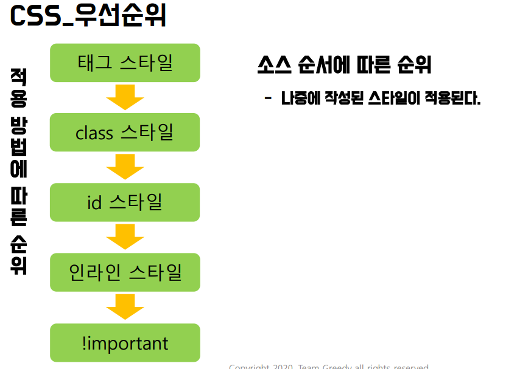

# CSS

# 1. Orientation

- 개요와 정의
    - CSS는 기본적으로 문서내용작성과 꾸미는 부분을 분리하여 내용을 수정해도 디자인을 바꿀 필요가 없고, 디자인을 수정해도 글내용을 바꿀 필요가 없게 하는데 있다.
    - style은 정해진 속성을 입력하여 웹페이지를 꾸미는 것.
    - 스타일시트는 내부 스타일시트, 외부 스타일시트, 인라인 스타일시트가 있다.
        
        
        

# 2. 선택자

- 선택자
    
    
    
    
    
    - 특정한 HTML태그를 선택할 때 사용하는 기능으로 태그를 선택하여 원하는 스타일과 기능을 적용할 수 있다.
    - 모든 선택자
        - HTML에 있는 모든 태그에 적용되는 선택자
        - body태그에 있는 요소뿐만 아니라 html, head에도 적용된다.
        - * {설정내용;} 의 형식을 가진다.
    - 태그 선택자
        - HTML 문서 내에 같은 태그를 모두 선택할 때 사용한다.
        - 태그명  {설정내용;} 의 형식을 가진다.
        - 여러 개의 태그 선택시에는 ,(쉼표)로 구별한다.
    - 아이디 선택자
        - HTML문서 내에 해당하는 아이디 속성을 가진 태그만 선택할 때 사용한다. 단, 아이디는 중복 값이 없게 해서 하나의 태그만 선택되게 해야 한다.
        - 코드 상에서는 에러가 발생하지 않지만, Javascript의 DOM에서 ID값으로 페이지 요소를 가져오기에 중복을 허용하지 않는다.
        - #아이디명 {설정내용;} 의 형식을 가진다.
    - 클래스 선택자
        - HTML문서 내에 여러 개의 태그를 동일한 클래스명으로 저장하여 선택할 때 사용한다.
        - 클래스는 id선택자와 달리 중복이 허용된다. 따라서 영역을 명확하게 하기 위해 태그 선택자와 같이 사용되는 경우도 있다.
        - .(온점)클래스명{설정내용;} 의 형식을 가진다.
    - 기본 속성 선택자
        - 기본 선택자 뒤에 []를 사용하여 속성과 속성값을 사용한다.
        - 선택자[속성]{설정내용;}의 형식을 가진다. 아래의 구분에 따라 다양하게 적용 가능하다.
            
            
            
    - 후손 선택자와 자손 선택자
        - 자손 선택자: 해당 선택자 바로 아래의 요소
        선택자>자손선택자{설정내용;} 의 형식을 가진다. 
        여러 개의 자손을 선택할 수 있다.
        - 후손 선택자: 하위 요소 전부
        선택자 후손석택자 {설정내용;} 의 형식을 가진다.
    - 동위 선택자
        - 동위 관계(형제 관계, 같은 레밸)에서 뒤에 위치한 태그를 선택할 때 사용한다.
        - 선택자a+선택자b로 동위 선택자a의 바로 뒤에 있는 한개의 선택자만 선택 가능하며
        - 선택자a~선택자b로 동위선택자 a의 뒤에 있는 선택자b를 모두 선택할 수 있다.
            
            
            
    - 반응 선택자
        - 사용자의 움직임에 따라 달라지는 선택자
        - active를 통해 사용자가 클릭한 태그를 선택할 수 있으며
        선택자 :active{설정내용;} 의 형식을 가진다.
        - hover를 통해 사용자의 마우스가 올라가 있는 태그를 선택할 수 있으며
        선택자 :hober{설정내용;} 의 형식을 가진다.
        - CSS는 정적 언어이지만, 사용자의 수요에 의해 추가된 동적 요소라고 생각하자.
    - 상태 선택자
        - 입력방식의 상태에 따라 선택되는 선택자
            
            
            
    - 일반 구조 선택자
        - 특정한 위치에 있는 태그를 선택한다. 위치로 구분한다. (1부터 시작하는 순번 개념)
            
            
            
    - 형태 구조 선택자
        - 특정한 위치에 있는 태그를 선택한다. 태그 별로 구분한다.
            
            
            
    - 문자 선택자
        - 태그 내부에서 특정 조건의 문자를 선택하는 선택자
            
            
            
    - 부정 선택자
        - 선택자에 대해 반대로 적용하는 선택자
        - 선택자에 다른 부정선택자나 가상요소를 넣을 수 없다.
        - 요소:not(선택자) 의 형태로 사용한다.
    

<aside>
💡 기본적으로 css속성은 위에서부터 아래로 적용이 되지만, css설정이 중복으로 설정된 경우에는 
태그 < 클래스 < 아이디 < 인라인 < !important 순서의 우선순위를 가진다.

</aside>

# 3. 스타일

- 글꼴 크기 관련
    
    
    
    
    
- font 속성
    - font-family
        - 폰트의 글꼴을 설정해주는 속성이다.
        - 다수의 글꼴을 선택할 수 있으며, 순서에 따라 해당하는 글꼴이 없을 시 그 다음 순서의 글꼴을 적용하며, 모든 글꼴이 없다면 브라우저 기본 글꼴이 적용된다.
        - 선택자 {font-family : ‘글꼴1’, ‘글꼴2’, ‘글꼴3’; }의 형식을 가진다.
    - font-size
        - 글자의 크기를 조절하는 속성이다.
        - 크기 단위는 em, px, pt, ex가 있다. (위 글꼴 크기 관련 참조)
        - 선택자 { font-size : 숫자단위; } 의 형식을 가진다.
    - font-weight
        - 글자의 굵기를 조절하는 속성이다.
            
            
            
    - font-variant
        - 영어를 작은 대문자로 표시해주는 속성이다.
        - 선택자 {font-variant : normal or small-caps;}의 형식으로 사용된다.
    - font-style
        - 글자를 이텔릭체로 표시하는 속성이다.
        - 선택자 {font-style : normal or italic or oblique;}의 형식으로 사용된다.
        - italic : 처음부터 기울어진 글자가 존재
        - oblique : 기본 글자를 기울여서 표시 (italic을 더 많이 사용한다.)
    - color
        - 글자색을 지정하는 속성이다.
        - 선택자{color:색상영문이름|16진수숫자|rgb값|rgba값|hsl값|hsla값;} 의 형식으로 사용한다.
    - text-decoration
        - 글자에 밑줄을 긋거나, 취소선을 긋거나, 윗 선을 긋거나, 밑줄을 삭제하는 속성
            
            
            
    - text-transform
        - 영문자를 표시할 때 대소문자를 원하는 대로 바꿀 수 있는 속성
            
            
            
    - text-shadow
        - 텍스트에 그림자 효과를 주는 속성
            
            
            
    - white-space
        - 공백을 처리하는 속성
            
            
            
    - letter(Word)-spacing
        - 간격 조정 속성
            
            
            
- 문단 속성
    - direction
        - 글자 쓰기 방향 지정 속성
            
            
            
    - text-align
        - 문자 위치를 정렬하는 속성
            
            
            
    - text-justify
        - text-align의 justify 속성에 따른 간격을 조정하기 위한 속성
            
            
            
    - text-indent
        - 문장을 들여쓰기 하는 속성
        - 선택자 { text-indent: 숫자(단위); } 의 형식으로 사용한다.
    - text-overflow
        - 영역을 벗어나는 텍스트 표시 속성
            
            
            
    - line-
        - 줄 간격 조정 속성
            
            
            
        - 위 형식으로 사용한다. 순서대로 기본값, px, em,% 단위 조정
- 목록과 링크 속성
    - list-style-type
        - 목록의 기호 스타일을 지정하는 속성
            
            
            
    - list-style-image
        - 목록을 기호 대신 이미지로 구분하는 속성
            
            
            
    - list-style-position
        - 목록 기호를 들여쓰기 하는 속성
            
            
            
    - list-style
        - 목록 스타일을 한번에 지정하는 속성
            
            
            
    
- 배경 스타일
    - background-color
        - 배경색을 지정하는 속성
            
            
            
    - background-clip
        - 배경의 범위 조절
            
            
            
    - background-image
        - 배경 요소에 이미지 파일 지정
            
            
            
    - background-repeat
        - 배경이미지 반복 출력 관련 설정
            
            
            
    - background-size
        - 배경 이미지 크기 조절 속성
            
            
            
    - background-position
        - 배경 이미지 위치 조정 속성
            
            
            
    - background-origin
        - 배경 이미지 배치 기준 지정 속성
            
            
            
    - background-attachment
        - 웹페이지의 스크롤에도 배경 이미지를 고정하기 위한 속성
            
            
            
    - background
        - 배경 이미지를 한번에 설정하는 속성
            
            
            
- 배경 그라데이션 스타일
    - 접두사
        - 웹 표준으로 지정되었지만 이전 버전과의 호환을 위해 브라우저별 접두사가 필요하다. 또한, 브라우저별 그라데이션 표현방법도 조금씩 다르다.
        
        
        
    - 선형 그라데이션
        - 색상이 수직, 수평, 대각선 방향으로 일정하게 변하는 것.
            
            
            
        - 그라데이션 방향
            
            
            
        - 그라데이션 각도, 시작과 끝 색상
            
            
            
        - 배경 그라데이션 반복(선형)
            - 그라데이션 패턴을 요소를 다 채울 때까지 반복하는 것.
                
                
                
            - 색이 뚜렷하게 구분되는 반복
                
                
                
    - 원형 그라데이션
        - 색상이 원이나 타원의 중심부터 동심원을 그리며 바깥방향으로 색상이 변경된다.
            
            
            
        - 배경 그라데이션 모양과 크기
            
            
            
        - 배경 그라데이션 위치(좌표)
            
            
            
        - 배경 그라데이션 반복(원형)
            
            
            
            - 색이 뚜렷하게 구분되는 반복
                
                
                

# 4. 레이아웃

- 레이아웃 개요
    - Height / Width 속성을 통해 콘텐츠(내용)이 차지 하고 있는 영역의 크기를 조절할 수 있다.
        
        
        
    - 블록 레벨 요소
        - 한 줄 전체를 차지하는 요소로 박스 모델이라고도 한다.
        - 한 줄에 여러 요소가 올 수 없다.
            
            
            
    - 인라인 레벨 요소
        - 한 줄에서 일부분만 차지하는 요소다.
        - 한 줄에 여러 요소가 올 수 있다.
            
            
            
    - display
        - 화면 배치 방법을 변경하는 속성
        - 박스 레밸과 인라인 레밸 요소를 변경할 수 있게 해준다.
            
            
            

- 레이아웃 테두리
    - border-style
        - 레이아웃의 테두리 스타일을 지정하는 속성
            
            
            
    - border-width
        - 레이아웃 테두리의 두께를 설정하는 요소
            
            
            
    - border-color
        - 레이아웃 테두리의 색상을 정하는 속성
            
            
            
    - border
        - 레이아웃의 테두리 두께, 스타일, 색상을 한번에 지정하는 속성
            
            
            
    - border-radius
        - 레이아웃의 모서리를 둥글게 하는 속성
            
            
            
    - box-shadow
        - 레이아웃 영역에 그림자 효과를 주는 속성
            
            
            
- 레이아웃 padding과 margin 조절
    
    
    
    
    

# 5. 포지셔닝

- 포지셔닝 개요
    - 포지셔닝이란 Box모델. inline모델을 페이지상에서 배치하는 스타일 요소다.
    - 즉, 페이지 안 요소들을 원하는 위치에 배치하는 속성.
    - position 스타일, float 스타일이 있다.
        
        
        
- 요소 배치
    - position
        - 페이지의 요소들을 자유롭게 배치해 주는 속성
        - top, left, right, bottom으로 위치를 지정한다.
            
            
            
    - visibility
        - 페이지에 특정 속성을 보이거나 보이지 않게 하는 속성.
            
            
            
    - Z-index
        - 페이지 안의 요소들을 순서대로 위로 쌓는 속성
        - 속성값이 크면 가장 위에 있는 요소이며, 작으면 밑에 있는 속성이다.
            
            
            
    - float
        - 페이지 내의 요소의 위치를 왼쪽이나 오른쪽으로 지정하는 속성
            
            
            
    - clear
        - 페이지에 float이 설정되어 있으면 그 속성이 다른 요소에도 영향을 미친다. 이를 초기화 시키는 속성
            
            
            
- 다단스타일
    - column-width
        - 단의 너비를 고정하고 다단 구성한다.
        - 너비를 기준으로 다단 개수를 나눈다.
            
            
            
    - colum-count
        - 단의 개수를 지정하여 다단을 나눈다.
            
            
            
    - column-gap
        - 다단 사이의 여백을 설정하는 속성
            
            
            
    - column-rule
        - 다단 사이의 효과를 주는 속성
            
            
            
    - column-span
        - 단을 합치는 속성
            
            
            
- 표 스타일
    - caption-side
        - 테이블 캡션에 대한 위치를 지정하는 속성이다.
            
            
            
    - height / width
        - 표의 높이와 너비를 지정하는 속성이다.
        - 테이블에 지정하면 테이블 전체의 크기를
        - <td>에 지정하면 컬럼의 너비/길이를 표시한다.
            
            
            
    - border
        - 표의 테두리 스타일을 지정하는 속성
            
            
            
    - border-collapse
        - 테두리 스타일을 변경하는 속성으로, 표 테두리를 한 개로 표시할지 두 개로 표시할지 결정한다.
            
            
            
    - border-spacing
        - 테두리를 두 개로 표현했을 때(separate)가까운 쪽의 테두리 사이의 거리를 지정하는 속성
            
            
            
    - empty-cells
        - 테두리 스타일을 두 개로 표시할 때(separate) 빈 셀에 대해 표시 여부를 결정하는 속성
            
            
            
    - table-layout
        - <td>의 너비를 width로 지정해도 셀의 내용이 길어지면 자동으로 길어지며, table의 width의 지정 값에 따라 안의 셀들이 조절된다. 이 때 <td>의 크기를 width로 고정하는 속성.
            
            
            
    - table-align
        
        
        

# 6. 변형

- 개요
    - 변형(Transition) : 시간에 따라 웹 요소의 스타일 속성이 변화(크기가 바뀌고, 요소가 이동하고, 회전)하는 것.
    - 애니메이션 : 사용자의 동작에 따라 웹 요소의 스타일 속성이 변화하는 것.
    - 2차원 변형 : 요소가 변형할 때 수직, 수평으로 이동하는 것으로, X축과 Y축으로 나누어 페이지 내에서 이동하는 것.
        
        
        
    - 3차원 변형 : 요소가 변형할 때 수평뿐만 아니라 화면상에서 앞이나 뒤로 이동하는 것이 추가된 것. X,Y축에 Z축이 더해진 것.
        
        
        
    - transform : 페이지에서 요소들을 변형시키려면 transform 속성과 변형 함수를 이용해야 한다. 변형함수는 2차원 함수와 3차원 함수로 구분된다.
        
        
        
    
- 변형함수
    - 2차원 변형함수
        
        
        
    - 3차원 변형함수
        
        
        
    - translate (좌표값) 함수
        - 요소를 페이지의 일정 좌표로 이동하는 함수
            
            
            
    - scale (좌표값) 함수
        - 요소를 일정페이지 만큼 확대/축소 시키는 함수
        - 양수는 확대, 음수는 축소.
            
            
            
    - rotate (좌표값) 함수
        - 지정한 각도만큼 요소를 시계방향(양수)이나 반대방향(음수)으로 회전시키는 함수
            
            
            
    - skew (좌표값) 함수
        - 2차원만 가능하며, 지정한 각도만큼 요소를 비틀어서 변형하는 함수.
            
            
            
- 추가 변형함수
    - transform-origin
        - 변형기준을 x,y,z축을 기준으로 했으나 특정지점을 기준으로 변형할 수 있게 하는 속성.
            
            
            
    - perspective
        - 화면에서 원근감을 갖게 하는 속성
            
            
            
    - transform-style
        - 여러가지 변형을 동시에 하는 경우, 부모 요소에서 적용한 3d변형을 하위요소에 적용하는 속성
            
            
            
    - backface-visibility
        - 회전하여 뒷면이 보일 경우 뒷면이 보이게 할 것인지 안보이게 할 것인지 설정하는 속성
            
            
            
- 트랜지션 함수
    - transition-property
        - 트랜지션을 적용할 속성을 선택하는 속성값. 여러 개를 설정하는 경우 ,(콤마)로 구분한다.
            
            
            
    - transition-duration
        - 트랜지션이 진행되는 시간을 지정하는 속성값. 시간은 밀리초(ms)와 초(s)단위로 설정한다.
        - 여러 개를 설정할 경우 ,(콤마)로 구분하며 propert값과 1:1로 대응한다.
        - 선택자 {transition-duration : 시간;; } 으로 사용한다.
    - transition-timing-function
        - 트랜지션이 진행되는 구간별로 시간을 지정하는 속성
            
            
            
    - transition-delay
        - 트랜지션이 두 개 이상 있는 경우 하나의 트랜지션이 끝난 뒤 다음 트랜지션이 시작하는 시간을 설정하는 속성
        - 선택자 { transition-delay : 시간} 으로 설정한다.
    - transition
        - 트랜지션 속성값을 한 번에 지정하는 속성
        
        
        
    
- 애니메이션 함수
    - 트랜지션처럼 시작 스타일과 끝 스타일을 부드럽게 이어주는 기능을 하는 것은 동잏하다. 하지만 애니메이션은 중간 단계의 원하는 위치에서 keyframe이라는 함수를 통해 중간 스타일을 넣을 수 있다.
    - @keyframes
        - 애니메이션의 시작지점과 끝지점의 스타일을 정하고, keyframes의 이름을 지정한다.
        - 시작 지점과 끝지점 두개만 설정할 경우 from to로 설정한다.
        - 중간에 수행해야 할 작업이 있으면 %로 구분하여 설정한다.
        - @keyframes 이름 { 선택자 { 스타일 ; } } 로 사용한다.
        
        
        
        
        
    - animation-name
        - 요소에 적용할 애니메이션을 지정하는 속성
        - keyframes에서 정한 이름을 작성한다.
        - 적용할 요소 스타일에 작성한다.
        - 선택자 { animation-name : keyframes이름; } 으로 사용한다.
    - animation-duration
        - 요소에 적용되는 애니메이션의 실행시간을 지정하는 속성
        - 선택자 { animation-duration : 시간(s); } 로 사용한다.
    - animation-direction
        - 요소에 적용되는 애니메이션을 반복할 때 처음에서 시작할지, 끝에서 역순으로 시작할지를 선택하는 속성이다.
        - animation-iteration-count와 같이 사용한다.
        
        
        
    - animation-iteration-count
        - 애니메이션을 얼마나 반복할지 설정하는 속성
        
        
        
    - animation-timing-function
        - 전체 속도를 지정할 수 있는 속성
            
            
            
    - animation
        - 애니메이션 전체속성을 지정할 수 있는 속성
        
        