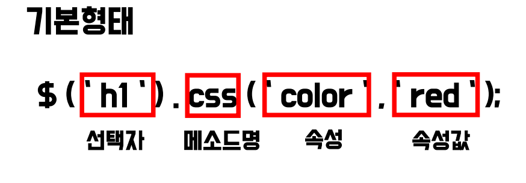

# jQuery

# 1. 개요

- 제이쿼리란?
    - 존 레식에 의해 개발된 경량 javascript 라이브러리. 복잡한 javascript 코드를 손쉽게 구현하기 위해 개발되었다.
    - DOM과 관련된 쿼리를 쉽게 구현할 수 있다.
    - ajax 통신, 이벤트 처리 등을 폭넓게 지원한다.
    - 별도의 플러그인을 통해 차트, 슬라이드 쇼, 테이블 등을 간단히 구현할 수 있다.
- 제이쿼리 연결
    - jQuery 홈페이지에서 js 파일을 다운로드 받아 연결하는 방법과 CDN을 통해 연결하는 방법이 있다.
    - CDN방식으로 head의 script 태그 안에 다운로드 받은 js파일을 읽어오는 방식을 사용한다.
    - 
    

# 2. 선택자

- 기본 선택자
    
    
    
    - 전체 선택자
        - *을 사용한다. HTML 페이지에 있는 모든 문서 객체(DOM)을 선택하는 선택자이다.
            
            
            
    - 태그 선택자
        - HTML 태그를 선택자로 지정한다. 다수의 태그 선택자를 동시에 사용하고 싶을 때는 ‘,’로 구분한다.
            
            
            
    - 아이디 선택자
        - 특정한 아이디 속성을 가지고 있는 문서 객체를 선택하는 선택자.
            
            
            
    - 클래스 선택자
        - 특정한 클래스 속성을 가진 문서 객체를 선택하는 선택자이다.
            
            
            
- 계층 선택자
    - 자손 선택자와 후손 선택자
        - 기본 선택자의 앞에 붙여 사용하며, 기본 선택자의 범위를 제한한다.
            
            
            
        
- 기본필터 선택자
    - input 타입 필터 선택자
        - input 태그의 type 속성에 따라 문서 객체를 선택할 수 있다.
        
        
        
        
        
    - checkbox의 상태에 대한 선택자
        - change
            - 해당 요소에 변화가 일어나면 발생하는 이벤트.
                
                
                
        - checked
            - checkbox가 선택되었을 때 발생하는 이벤트
                
                
                
    - input 상태에 대한 선택자
        
        
        
    - 순서에 따른 필터 선택자
        - odd: 홀수번째 요소 선택자 (인덱스 체계)
        - even: 짝수번째 요소 선택자(인덱스 체계)
        - first: 첫번째 요소 선택자
        - last: 마지막 요소 선택자
        - eq(숫자) : 인덱스번호와 일치하는 요소 리턴
            
            
            
            
            
            
            
- 속성 선택자
    - 기본 선택자의 뒤에 붙여 사용한다. 특정 속성을 가지고 있는 객체를 선택한다.
        
        
        
        
        

# 3. 메소드

- 문서 객체 메소드
    - css() 메소드
        - 문서 객체의 스타일을 검사하거나 변경할 때 사용한다. 메소드 체이닝이 가능하다.
            
            
            
    - attr() 메소드
        - 문서 객체의 특정 속성 값을 알아내거나 속성을 추가할 때 사용한다.
        - 속성 값이 세팅되어 있지 않다면, undefined를 리턴한다.
            
            
            
            
            
            
            
    - prop() 메소드
        - 속성 값의 여부를 true/false로 리턴한다.
        - 자바스크립트를 이용한 동적 제어에 많이 사용한다.
        - attr() 메소드와의 차이점은 attr은 속성값, prop는 boolean을 반환한다는 차이가 있다.
            
            
            
    - 필터링 메소드
        - 문서 객체를 선택할 수 있다.
            
            
            
- 순회(탐색) 메소드
    - Ancestors 메소드
        - 선택된 요소의 상위 요소들을 선택할 수 있는 메소드.
            
            
            
    - Descendants 메소드
        - 선택된 요소의 하위 요소들을 선택할 수 있는 메소드. children(), find()가 있다.
            
            
            
    - sideways 메소드
        
        
        
- 이벤트 메소드
    - 이벤트
        - 이벤트 핸들러의 매개인자로 event 객체를 전달할 수 있다.
        - 인라인 방식으로 event만 사용 가능하다.
            
            
            
            
            
            
            
    - 마우스 관련 메소드
        - mouseover/mouseout  /  mouseenter/mouseleave
            - 마우스로 요소 접근 시 이벤트 핸들링이 이루어진다. 단, 전자는 자식 요소에 접근시에도 이벤트 핸들링이 이루어지며, 후자는 이루어지지 않는다.
                
                
                
        - hober()
            - mouseenter와 mouseleave를 동시에 사용하는 효과. 마우스가 이벤트 객체에 접근하거나 이탈할 때 모두 발생한다.
                
                
                
    - 키보드 관련 메소드
        - keydown, keypress, keyup
            - 순서대로 키보드가 눌려질 때
            - 글자가 입력될 때(펑션키, 다양한 기능키에는 적용되지 않음)
            - 키보드가 떼어질 때 (tab키 사용 불가)
                
                
                
        - 동적으로 글자수 세기
            - 위 키보드 관련 이벤트 메소드를 이용, 글자 수를 셀 수 있다.
                
                
                
    - on() 관련 메소드
        - bind() & unbind()
            - bind() : 현재 존재하는 문서 객체만 이벤트 연결
            - unbind() : bind()로 연결 된 이벤트 제거
                
                
                
        - on() % off()
            - on() : bind() 대신에 on()으로 대체되었다. (1.7버전 이후) 기능은 유사하다.
            - off() : on()으로 연결 된 이벤트 제거
                
                
                
        - .on(events, selector, handler)
            - 선택자를 기준으로 하위 요소만 파라미터로 전달 된 selector가 이벤트 소스가 되어서 이벤트 처리를 할 수 있다.
                
                
                
        - .on(events, data, handler)
            - 이벤트 객체의 data 속성을 이용할 수 있다.
                
                
                
    - 입력(input) 관련 메소드
        - .focus(), .blur(), .change()
            
            
            
        - 정규표현식(regular expression/regex)
            
            
            
        - trigger() 메소드
            - 다른 이벤트와 이벤트 핸들러 함수를 호출하는 용도로 사용한다.
                
                
                
    - display 관련 메소드
        - 이펙트 메소드
            - Effect 메소드란
                - 페이지에 애니메이션 효과를 만들기 위한 메소드 집합
                    
                    
                    
            - animate 메소드
                - 현재의 CSS속성을 설정한 값으로 차츰 변경 되는 효과를 주는 메소드
                    
                    
                    
                    
                    
        - show() & hide() 메소드
            - 문서 객체를 확대하며 보여주거나 축소하며 사라지게 한다.
                
                
                
        - toggle 메소드
            - 하나의 클릭(input, toggle)으로 show()와 hide()를 이용할 수 있다.
            
            
            
        - fade() 메소드
            - fadeIn() : 선명해지게
            - fadeOut() : 희미해지게
                
                
                
        - slide 메소드
            - slideDown() & slideUp()
                
                
                
        - fadeTo(speed, opacity)
            
            
            
        - 기타 관련 메소드
            
            
            
- 배열 관리 메소드
    - each() 메소드
        - 배열을 관리하는 for in문과 유사한 메소드로 객체나 배열의 요소를 검사한다
        - $.each(object, function(index, item){}) 의 형식으로 사용한다.
        - → item : 해당 인덱스나 키가 가진 값.
            
            
            
    - is() 메소드
        - 매개변수로 선택자를 입력하고, 선택자 객체가 선택자와 일치하는지 판단하여 boolean으로 반환한다.
            
            
            
    - $.noConflict 메소드
        - 다수의 자바스크립트 라이브러리가 $를 함수, 또는 변수로 사용하고 있기에 jQuery 라이브러리와 충돌하는 경우가 많다.
        - 이를 방지하기 위해 사용하는 메소드로, 새로운 alias(별칭)을 부여한다.
            
            
            
    - extend 메소드
        - 객체의 내용을 추가하는 메소드
            
            
            
- Content 관련 메소드
    - html()메소드
        - 선택된 요소의 content 영역을 리턴하거나 설정하는 메소드.
        - html 태그를 태그로써 인식할 수 있다.
            
            
            
    - text() 메소드
        - 선택된 요소의 Content 영역을 리턴하거나 설정하는 메소드
        - getter로 사용 시, 태그는 무시한다.
        - setter로 사용 시, html 태그를 문자열로 인식한다. (태그로 취급하지 않는다.)
            
            
            
- class 메소드
    - addClass()
        - 선택자에 의해 선택된 요소에 클래스를 추가하는 메소드.
            
            
            
    - removeClass()
        - 선택자에 의해 선택된 요소의 클래스를 삭제하는 메소드
            
            
            
    - toggleClass()
        - 선택된 요소에 class가 있으면 삭제하고, 없으면 추가하는 메소드
            
            
            
- 객체 관련 메소드
    - 객체 생성
        
        
        
    - 객체 삽입
        - $(B).appendTo(A) : B를 A의 요소 내 뒷부분에 추가
        - $(B).prependTo(A): B를 A의 요소 내 앞부분에 추가
        - $(B).insertAfter(A): B를 A의 요소 뒤에 추가
        - $(B).insertBefore(A): B를 A의 요소 앞에 추가
            
            
            
        - $(A).append(B) : A요소 뒷부분에 B를 추가(자식)
        - $(A).prepend(B) : A요소 앞부분에 B를 추가(자식)
        - $(A).after(B) : A요소 뒷부분에 B를 추가(형제)
        - $(A).before(B) : A요소 앞부분에 B를 추가(형제)
            
            
            
    - 객체 복제
        - clone() : html 요소를 복사하는 메소드. 파라미터로 이벤트 복사여부를 지정한다. (기본값은  flase)
            
            
            
    - 객체 제거
        - empty() : 모든 자식 요소를 제거
        - remove() : DOM요소 잘라내기. 연관된 이벤트도 모두 삭제
        - detach() : DOM 요소 잘라내기. 연관된 이벤트 모두 보관
            
            