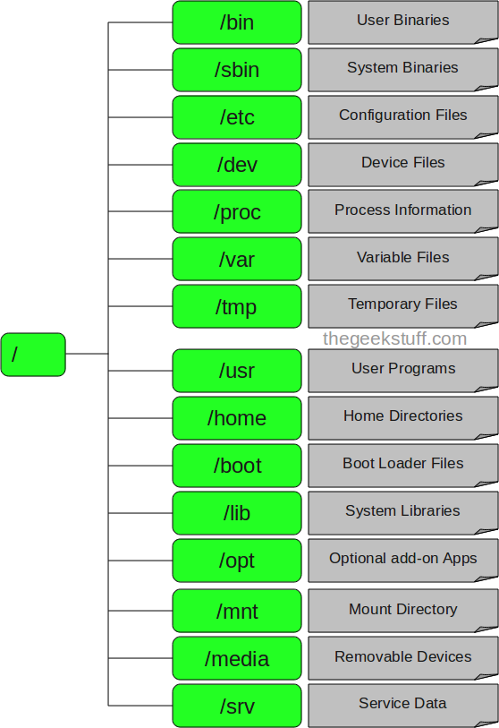
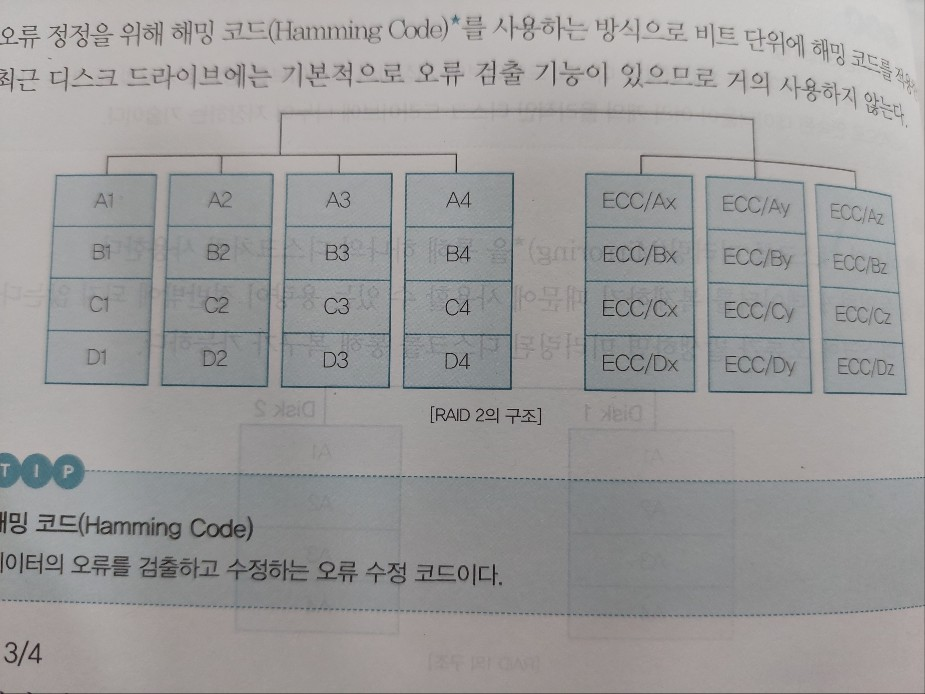
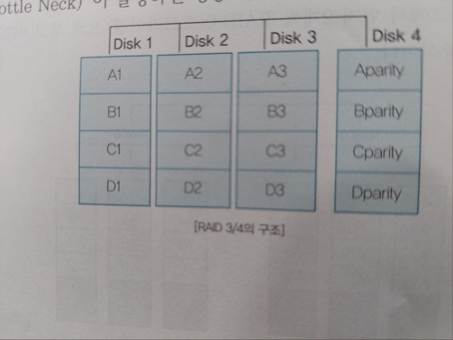

# SD 에듀



# 리눅스의 이해

- 개요
    - 배포판
        - 전 세계에 300여 개의 배포판이 있다.
        - 리눅스 커널, GNU 소프트웨어, GNU 라이브러리, 유틸리티, X 윈도 시스템 등 여러 가지 애플리케이션을 포함한다.
    - 종류 및 특징
        - 슬랙웨어(Slackware)
            - 1993년 7월에 패트릭 볼커딩(Patrick Volkerding)에 의해 만들어짐
            - 가장 오래된 배포판
            - 대표적인 배포판 : SUSE, Vector Linux, Salix OS, Porteus 등
        - 데비안(Debian)
            - 1993년 9월 이안 머독(Lan Murdock)에 의해 데비안 프로젝를 설립, 개발-배포
            - 패키지 설치 및 업그레이드가 편리
            - 대표적인 배포판 : Ubuntu, Linux Mint, Kali Linux, Knoppix, Lindows, Corel, Elementary OS 등
        - 우분투(Ubuntu)
            - 영국 캐노니컬사의 지원을 받아 개발-배포
            - 데비안 GNU/Linux에 기반한 배포판
            - 고유한 데스크톱 환경인 유니티(Unity) 사용
            - 편리한 사용자 인터페이스 제공
            - 6개월마다 새로운 버전 배포
        - 레드햇(RedHat)
            - 미국 레드햇사가 개발-배포
            - 유료인 레드햇 엔터프라이즈 리눅스(RHEL)와 무료 페도라(Fedora)로 나누어 배포
            - 대표적인 배포판 : CentOS, Fedora, RHEL, Oracle Linux, Scientific Linux, Asianux Mandrake, Mandriva Linux 등
        - RHEL(Red Hat Enterprise Linux)
            - 레드햇사가 개발-배포하는 상용 리눅스 배포판
            - 상용 패키지는 유료이지만, 소스 코드는 무료 공개
            - 계약기간 동안에는 기술지원 및 추가 비용 없이 업그레이드가 자유로움
            - 18~24개월마다 새로운 버전이 공개되며, 라이선스는 별도로 판매하지 않음
        - 페도라(Fedora)
            - 레드햇의 후원으로 개발-배포
            - RPM 기반의 소프트웨어를 포함
            - 6개월마다 새로운 버전이 배포
        - CentOS
            - 레드햇 엔터프라이즈 리눅스와 완벽하게 호환되는 기업용 무료 배포판
            - 플랫폼을 제공할 목적으로 개발, 자체 커뮤니티에 의해 관리
            - 레드햇의 기술지원은 받지 않음
        - 수세(SUSE)
            - 독일에서 개발-배포
            - 유럽에서 많이 사용
            - 풍부한 기능, 안정성과 보안 기능 포함
        - 칼리(Kali)
            - Offensive Security가 개발한 오픈 소스 리눅스 배포판
            - 백트랙처럼 수많은 해킹 도구와 설명서를 포함하고 있음
            - 백트랙은 우분투, 칼리 리눅스는 데비안 기반 배포판
    - 라이선스(License)
        - GNU(GNU is Not Unix)
            - ‘GNU는 유닉스가 아니다(GNU is Not Unix)’라는 재귀적 약어
            - 리차드 스톨만(Richard Stallman)이 설립한 자유 소프트웨어 재단(FSF)에서 진행하는 프로젝트.
        - GNU GPL(GNU General Public License)
            - FSF에서 만든 자유 소프트웨어 라이선스
            - 1989년 1차 버전에 이어, 2007년 3차 버전까지 발표
            - GPL 코드를 사용한 소프트웨어를 내부적인(개인, 기관, 단체 등) 목적으로만 사용할 때는 소스 코드를 공개할 필요가 없지만, 어떤 형태(무료 혹은 유료)로든 외부에 공표-배포할 때는 전체 소스 코드를 공개해야 한다.
        - GNU LGPL(GNU Lesser General Public License)
            - GPL보다는 훨씬 완화된(Lesser)조건의 오픈 소스 소프트웨어 라이선스
            - LGPL이 적용된 라이브러리를 이용하여 프로그램을 개발하였을 경우, 프로그램 소스 코드를 공개하지 않아도 되지만, LGPL 소스 코드를 사용하였음을 명시해야 한다.
            - LGPL 소스 코드를 단순히 이용하는 것이 아니라, 이를 수정 또는 이로부터 파생된 라이브러리를 개발하여 배포하는 경우, 전체 소스 코드를 공개해야 한다.
        - BSD(Berkeley Software Distribution)
            - 버클리 대학의 오픈 소스 소프트웨어 라이선스
            - 소프트웨어의 개작, 수정, 배포에 제한이 없다.
            - 소스 코드 공개의 의무가 없으며, 상용 소프트웨어에서도 자유롭게 사용할 수 있다.
        - 아파치 라이선스(Apache License)
            - 아파치 소프트웨어 재단에서 개발한 소프트웨어 라이선스이다.
            - 아파치 2.0 라이선스는 누구나 해당 소프트웨어에서 파생된 소프트웨어를 개발할 수 있으며, 저작권을 양도하거나 배포할 수도 있다.
            - 아파치 소프트웨어의 전체 또는 일부분을 개인적 혹은 상업적 목적으로 사용할 수 있다.
            - 재배포 시 원본 또는 수정한 소스 코드를 반드시 포함시켜야 하는 것은 아니지만, 아파치 라이선스 2.0을 포함시켜야 하며, 아파치 소프트웨어 재단에서 개발한 소프트웨어라는 것을 명시해야 한다.
        - MIT 라이선스(Massachusetts Institute of Technology License)
            - 미국 매사추세츠 대학에서 개발한 라이선스
            - BSD 라이선스를 기초로 작성된 BSD 계열 라이선스
            - 누구나 개작할 수 있고, 수정본의 재배포 시 소스 코드를 비공개할 수 있다.
            - 대표적인 소프트웨어로 X Window System(X11)이 있다.
        - MPL(Mozilla Public License)
            - 오픈 소스이며 자유 소프트웨어 라이선스.
            - 1.0 버전은 넷스케이프 커뮤니케이션즈 코퍼레이션사의 미첼 베이커에 의해 개발되었고, 1.1 버전은 모질라 재단이 개발했다.
            - 변형 BSD 라이선스와 GNU GPL 라이선스의 혼합적 성격
            - 대표적인 소프트웨어에는 모질라 애플리케이션 스위트, 모질라 파이어폭스, 모질라 선더버드 등이 있다.
            - 소스 코드와 실행 파일의 라이선스를 분리했으며, 사용한 MPL과 수정한 MPL 소프트웨어에 대한 공개 의무만 가지며, 별도의 소스 코드와 실행 파일은 독점적인 라이선스를 지닌다.
- 리눅스의 역사 및 철학
    - 역사
        - 1965년 MIT, AT&T 벨 연구소, General Electronic에서 ‘Multics’라는 운영체제를 공동 개발했다.
        - 1969년 AT&T 벨 연구소의 연구원인 켄 톰슨(Ken Thompson)이 최초 UNIX 운영체제를 개발했다.
        - 1971년 AT&T 벨 연구소의 연구원인 데이스 리치(Dennis Ritchie)가 C 언어를 개발함으로써 어셈블리 언어로 되어 있던 UNIX를 C 언어로 재코딩했다.
        - 1980년 MIT 연구소의 리차드 스톨만(Richard Stallman)이 소프트웨어 상용화에 반대하여 GNU(GNU is Not Unix) 프로젝트를 시작했다.
        - 1985년 리차드 스톨만(Richard Stallman)은 FSF(자유 소프트웨어 재단)라는 비영리단체를 설립 후 ‘GNU 선언문(manifesto)’을 발표했다.
        - 1987년 앤드류 타넨바움(Andrew Tanenbaum)이 미닉스(Minix)를 개발했다.
        - 1991년 핀란드 헬싱키 대학의 리누스 토발츠(Linus Torvalds)가 ‘Minix’의 커널 소스를 수정하여 GNU 시스템에 적합한 커널을 개발했다.
        - 1991년 9월 버전 0.01의 리눅스 커널이 핀란드 대학교와 FUNET(리서치 네트워크)의 FTP 서버(ftp.funet.fi)에 공개하였으며 1991년 10월에는 버전 0.02의 리눅스 커널을 출시했다.
        - 1994년 리눅스 커널 버전 1.0을 공개했다.
        - 1996년 리눅스 커널 버전 2.0을 공개했다.
    - 철학
        - 1991년 리누스 토발츠에 의해 최초 공식 버전 ‘0.02’를 발표했다.
        - 유닉스 시스템의 표준 인터페이스인 ‘POSIX’를 기반으로 하고 있으나, 진정한 자유 소프트웨어를 구현하기 위해 유닉스 소스 코드 사용을 배제하고, 모든 소스를 재작성했다.
        - Intel, Macintosh, SPARC, MIPS, Alpha 시스템 등에서 동작하는 최고의 이식성을 가지는 운영체제이다.
        - GNU GPL이 적용된 리눅스 소스 코드는 누구나 자유롭게 개작, 수정, 배포 가능하다.
        - GNU GPL
            - FSF(Free Software Foundation)에서 만든 라이선스
            - GNU 정신에 입각하여 모든 프로그램의 소스 코드를 공개하는 것이 목적
        - GNU 정신
            - 사람을 경쟁적으로 만들고 상업적으로 만들며, 페쇄적으로 만드는 정책에 반대하는 정신이다. 좀 더 나은 인류문화의 발전을 위해 서로 협력하고, 우정을 나누는 관계를 유지하며, 지식을 공유하자는 정신을 말한다.
- 리눅스의 특징 및 장점-단점
    - 특징
        - 오픈 소스(open source)운영체제이다.
        - 다중 사용자(multi user), 다중 작업(multi tasking)을 지원한다.
        - 강력한 네트워킹 지원 및 다양한 파일 시스템을 지원한다.
        - 뛰어난 이식성-유연성-확장성을 지니며 안정성과 보안성이 강력하다.
        - 가격 대비 성능이 우수하며, 다양한 응용 프로그램을 제공한다.
        - 다양한 배포판이 존재한다.
    - 장점 및 단점
        - 장점
            - 유닉스와 완벽한 호환
            - 안정적인 운영체제
            - POSIX(Portable Operating System Interface) 규격
            - 하드웨어 효율적 운영
        - 단점
            - 공개용, 무료 운영체제로 기술지원을 받기 어려움
            - 처음 접하는 사용자에게는 사용이 다소 어려움
            - 특정 하드웨어에 대한 지원 부족
            - 한글 지원 미흡

# 리눅스의 설치

- 리눅스 설치 및 유형
    - 배포판 다운로드
        - 리눅스 설치 파일은 해당 배포판의 홈페이지에서 다운로드 받을 수 있다.
        - 특수한 목적(임베디드)로 개발된 리눅스부터 일반 사용자(컴퓨터 또는 노트북)가 사용할 수 있는 다양한 배포판이 존재하며 이에 각 배포판의 설치환경과 설치과정이 다르다.
            
            <aside>
            💡 배포판
              - 리눅스에서 작동하는 여러 종류의 프로그램을 꾸러미(package)로 모아놓은 것 
            -  리눅스 커널에 구축된 Unix와 유사한 운영체제 제품군의 구성요소이다. 이러한 배포판은 워드 프로세서, 스프레드시트, 미디어 플레이어 및 데이터베이스 응용 프로그램과 같은 대규모 소프트웨어 응용 프로그램 모음으로 구성된다.
            
            </aside>
            
            <aside>
            💡 임베디드(Embedded)
            - 기계나 기타 제어가 필요한 시스템을 제어하기 위해 특정 기능을 수행하는 컴퓨터 시스템으로 장치 내에 존재하는 전자 시스템. 즉 전자 하드웨어와 기계 부분이 전체 장치의 일부로 내장되었다는 의미에서 임베디드(Embedded)라는 단어가 사용되었다.
            
            </aside>
            
    - 리눅스 설치 유형
        - 배포판마다 다르지만 데스크톱, 서버, 사용자 정의 유형 등으로 구분한다.
            - 최소(Minimal)
                - 필수 패키지만 설치
            - 데스크톱(Desktop)
                - 개인용 컴퓨터에 적합한 패키지 설치
                - 문서 작성, 멀티미디어, 그래픽 도구 등 설치
            - 서버(Server)
                - Basic 서버 : 서버 운영 관련 필수 패키지 설치
                - Web 서버 : 아파치 서버 관련 패키지 설치
                - FTP 서버 : 파일 전송 서버 관련 패키지 설치
                - DB 서버 : 데이터베이스 서버 관련 패키지 설치
            - 랩톱(Laptop)
                - 노트북 PC 관련 패키지 설치
            - 가상 호스트
                - 가상화 시스템 관련 패키지 설치
                - 하이퍼바이저 소프트웨어(KVM, Xen) 설치
            - Software Development Workstation
                - 소프트웨어 관리 도구를 포함한 패키지 설치
                - 소스 컴파일 도구를 포함한 패키지 설치
            - 사용자 지정(Custom)
                - 사용자에게 필요한 패키지를 직접 선택하여 설치
    - 배포판 설치
        - 사용자 지정 설치를 제외한 다른 설치 유형을 선택하게 되면 설치과정에서 자동으로 하드디스크를 재구성하므로 기존 자료는 모두 삭제된다.
        - 중요한 자료는 리눅스를 설치 전에 모두 백업해야 한다.
        - 하드웨어 정보 파악
            - 최근 리눅스 배포판들은 하드웨어 호환성이 뛰어나다.
            - 플러그 앤 플레이(Plug and Play) 기능을 이용하여 자동으로 하드웨어를 검색한다.
            - 하드웨어에 문제가 발생했을 때 오류처리의 실마리가 될 수 있다.
            - 하드웨어(H/W)
                - 중앙처리장치(CPU)
                    - 제조사 및 모델명 확인
                    - 중앙처리장치 종류 확인(32/64 비트)
                - 주기억장치(RAM)
                    - 주기억장치 용량 확인
                    - Swap 파티션 생성 시 사용
                - 하드디스크 드라이브(HDD)
                    - 하드디스크 장치 종류 확인
                    - 하드디스크 장치 파일명 확인
                        - IDE, E-IDE 인터페이스 장치명 : /dev/hda
                        - SCSI, S-ATA, SSD, USB 인터페이스 장치명 : /dev/sda
                - 네트워크 인터페이스 카드(NIC)
                    - 제조사, 모델명, 유/무선 여부
                    - 네트워크 인터페이스 정보 확인
                        - NIC 장치 파일명 : /etc/sysconfig/network-scripts/eth0
                - 비디오 카드(Video Card)
                    - 제조사 및 모델명 확인
                    - 비디오 램(RAM) 크기, 해상도와 색상 확인
                - 기타 장치
                    - 모니터, 키보드, 마우스, 프린터 등의 제조사 및 모델명 확인
            - 시스템 정보
                - ROM-BIOS : 시스템 전원을 켜고, F2 또는 Delete 키를 눌러 BIOS 화면 확인 가능
                - 장치 관리자 : 시스템 부팅 후 제어판 → 시스템 및 보안 → 장치 관리자 선택
                - 네트워크 : 호스트 이름, TCP/IP 정보(IP 주소, Subnetmask 주소, Gateway 주소, DNS 주소)
- 리눅스 부트
    - 부트 매니저(Boot Manager)
        - 부트 매니저는 사용자의 PC에 다양한 운영체제를 설치하여 사용할 경우, 부팅할 때 사용자의 PC에 설치되어 있는 운영체제 중 필요로 하는 운영체제를 선택하여 부팅하는 기능
    - 리눅스 부팅 과정
        1. ROM-BIOS 실행
            - ‘POST(Power On Self Test)’ 과정을 수행 후 하드웨어 이상 유무를 검사한 후 에러가 발생할 경우 알림
            - 부트 로더 로딩
        2. 부트 로더 실행
            - 부트 로더를 실행하여 커널을 로딩하고, 스와퍼 프로세스 호출
            - ‘LILO’와 ‘GRUB’가 있다
        3. 스와퍼 프로세스 실행
            - 장치들의 드라이버 초기화
            - ‘init’ 프로세스 실행
        4. ‘init’ 프로세스 실행
            - init’프로세스를 실행하여 ‘/etc/inittab’ 파일 읽음
        5. 부트 레벨 결정
            - 부트 레벨을 결정
        6. ‘rc.sysinit’ 스크립트 실행
            - ‘/etc/rc.d/rc.sysinit’ 스크립트를 실행하여 시스템 초기화 작업 수행
        7. ‘rcx.d’ 스크립트 실행 
            - ‘/etc/rcx/d’ 스크립트를 실행하여 해당 부트 레벨 스크립트를 순차적으로 실행
        8. X 윈도 실행
            - 부트 레벨이 ‘5’일 경우 X 윈도 환경으로 부팅
    - 부트 로더(Boot Loader)
        - ‘부트스트랩 로더(Bootstrap Loader)’의 약어
        - 컴퓨터를 사용자가 사용할 수 있도록 하드디스크에 저장된 운영체제를 주기억장치에 적재해 주는 프로그램
        - 운영체제가 실행되기 전에 미리 실행되어 커널이 안정적으로 실행되기 위한 묻는 관련 작업을 완료하는 프로그램이다.
        - 하나의 시스템에 여러 개의 운영체제가 설치되어 있을 경우 선택하여 부팅할 수 있도록 한다(멀티 부팅)
        1. 부트 로더 종류 및 특징
            - LLIO(Linux Loader) : 리눅스 운영체제에서만 사용 가능
            - GRUB(Grand Unified Bootloader)
                - 리눅스 운영체제 외에도 사용 가능
                - ‘LILO’의 단점을 보안
                - 대화형이므로 커널의 경로와 파일 이름만 알면 부팅 가능
                - 메뉴 설정 환경을 지원하며, 대화형 모드로 부트 정보를 설정 가능
        2. GRUB
            - 환경설정 파일 내용
                
                ```
                [root@localhost ~]# cat /boot/grub/grub.conf
                # grub.conf generated by anaconda
                #
                # Note that you do not have to rerun grub after making changes to this file
                # NOTICE : You have a /boot partition. This means that 
                #          all kernel and initrd paths are relative to /boot/. eg.
                #          root (hd0,0)
                #          kernel /vmlinuz-version ro root=/dev/sda3
                #          initrd /initrd-version.img
                #boot=/dev/sda
                default=0
                timeout=5
                splashimage=(hd0,0)/grub/splash.xpm.gz
                password -- md5 $1$6h8Y01$HIA5xjCDV9VznbBAZw05o1
                hiddenmenu
                title CentOS (2.6.18-308.el5)
                            root (hd0,0)
                					  kernel /vmlinuz-2.6.18-308.el5 ro root=LABEL=/
                            initrd /initrd-2.6.18-308.el5.img
                ```
                
                - default
                    - 초기 부팅화면에서 메뉴를 선택하지 않았을 경우, 기본 부팅메뉴 선택
                    - 각 메뉴의 번호는 ‘0’번부터 시작하며, 첫 번째 부팅메뉴는 ‘0’번, 두 번째는 ‘1’번과 같은 순서대로 지정
                - timeout
                    - 초기 부팅화면에서 대기 시간을 초단위로 설정
                    - 이 시간 동안에 메뉴를 선택하지 않는다면 기본 부팅메뉴(default 항목)로 부팅
                - splashimage
                    - 초기 부팅화면의 배경 이미지 설정
                - passwrod
                    - 부팅 시 GRUB 모드로 들어가기 위한 암호화된 패스워드
                    - ‘password’ 항목이 존재하지 않는다면 패스워드 없이 GRUB 메뉴로 들어갈 수 있다.
                - title
                    - 초기 부팅화면의 메뉴에 나타나는 제목이며, 간단한 설명문(comment)을 적어도 됨
                - root
                    - 해당 메뉴로 부팅 시 사용할 루트 장치를 지정
                    - 루트 장치를 설정하는 형식
                        - 형식 : ‘root’ (하드디스크의 장치명, 부트 파티션명)
                        - 예 : ‘root (hd0,0)’의 의미는 첫 번째 하드디스크의 첫 번째 파티션이 루트 장치라는 의미
                - kernel
                    - 커널 이미지 파일의 경로 지정
                        - 예 : ‘kernel /vmlinuz-2.6.18-308.el5’의 의미는 부팅 시 메모리에 로드할 kernel 이미지가  ‘kernel /vmlinuz-2.6.18-308.el5’라는 의미
                - initrd
                    - SCSI 하드디스크를 사용하는 경우에는 반드시 지정해야 하는 항목으로, 해당 메뉴로 부팅 시 사용할 ‘initrd’ 이미지를 지정
                        - 예 : ‘initrd /initrd-2.6.18-308.el5.img’의 의미는 ‘initrd’로 사용할 이미지 파일이 ‘/ initrd /initrd-2.6.18-308.el5.img’라는 의미
                        - SCSI 하드디스크로 부팅 시 ‘initrd’ 항목이 설정되어 있지 않으면 ‘kernel panic’ 오류 발생
        3. GRUB 편집 모드
            - 초기화면에서 C키 입력
                
                ```
                GNU GRUB version 0.98 (638K lower /300632K upper memory)
                
                Minimal BASH-like line editing is supported. For the first word,
                TAB lists possible command completions. Anywhere else TAB lists
                possible device or file cpmpletions. ESC at any time exits.
                
                grub>
                ```
                
            - 초기화면에서 e 키 입력
                
                ```
                GNU GRUB version 0.98 (638K lower /300632K upper memory)
                
                root (hd0,0)
                kernel /vmlinuz-2.6.18-308.el5 ro root=/dev/mapper/VolGroup
                initrd /initrd-2.6.18-308.el5.img
                
                Use the ↑ and ↓ keys to select which entry is highlighted.
                Press 'b' to boot 'e' to edit the selected command in the
                boot sequence, 'c' for a command-line, 'o' to open a new line
                after ('0' for before) the selected line, 'd' to remove the
                selected line, or escape to go back to the main menu.
                ```
                
            - 편집 모드에서 사용하는 키(key)
                - ↑ : 위로 이동
                - ↓ : 아래로 이동
                - a : 커널과 관련된 매개변수 추가
                - b : 선택된 부트 메뉴로 시스템 부팅
                - c : 대화식으로 직접 입력할 수 있는 모드
                - d : 선택된 행 삭제
                - e : 선택된 부트 메뉴 편집
                - o : 새로운 행을 커서 다음 행에 삽입
                - 0 : 새로운 행을 커서 앞 행에 삽입
                - Esc : GRUB 이전 메뉴로 이동
    - 런 레벨(Run Level)
        - 리눅스 부팅의 마지막 단계에서 모든 프로세스의 부모 프로세스인 ‘init’이 생성된다.
        - 부팅 시 ‘init’ 프로세스가 참조하는 것이 런 레벨이다.
        - 런 레벨은 0에서부터 6까지 있다.
        1. 런 레벨 실행 스크립트 파일 
            
            ```
            [root@localhost ~]# pwd
            /etc/rc.d
            [root@localhost rc.d]# ls -l
            drwxr-xr-x. 2 root root  70  10월 16일 2019 init.d
            -rw-r--r--. 1 root root  473 10월 31일 2018 rc.local
            drwxr-xr-x. 2 root root  45  10월 16일 2019 rc0.d
            drwxr-xr-x. 2 root root  45  10월 16일 2019 rc1.d
            drwxr-xr-x. 2 root root  45  10월 16일 2019 rc2.d
            drwxr-xr-x. 2 root root  45  10월 16일 2019 rc3.d
            drwxr-xr-x. 2 root root  45  10월 16일 2019 rc4.d
            drwxr-xr-x. 2 root root  45  10월 16일 2019 rc5.d
            drwxr-xr-x. 2 root root  45  10월 16일 2019 rc6.d
            ```
            
            - init.d : 여러 가지 서비스 데몬들을 시작하고 종료, 재시작하는 스크립트 파일들이 저장됨
            - rc.local : 부팅 시 자동으로 명령어 스크립트를 수행하며, 일반적으로 시스템 부팅 시 자동 실행될 명령어를 추가하여 사용하는 스크립트 파일
            - rc0.d ~ rc6.d : ‘init’ 프로세스가 런 레벨을 결정하면 각각의 런 레벨에 맞는 서비스들을 실행해야 하는데, 이때 각 런 레벨별로 실행해야 하는 서비스들을 디렉터리
        2. 런 레벨 설정 
            
            ```
            [root@localhost ~]# cat /etc/initlab
            id:runlevels:action:process
            [id:3:initdefault:]
            
            [root@localhost ~]# runlevel
            N 3
            ```
            
        3. 런 레벨 운영 모드 
            1. Halt : 시스템 종료
            2. Single User Mode : 단일 사용자 모드(CLI)
            3. Multi User Mode (Without Networking)  : 다중 사용자 모드(CLI) (네트워크 사용 불가)
            4. Multi User Mode (Only Console Login) : 다중 사용자 모드(CLI)
            5. Not Used : 사용하지 않음
            6. Multi User Mode With Display Manager : 다중 사용자 모드(GUI, X 윈도)
            7. Reboot : 재시작
    - 로그인 및 로그아웃
        1. 로그인 및 로그아웃 환경
            1. ‘GUI(X 윈도)’ 환경에서 로그인/로그아웃
            2. ‘CLI(Command Line Interface)’ 환경에서 로그인/로그아웃
        2. 로그인
            1. 로그인 과정
                - 로그인 프롬프트에서 아이디(ID) / 패스워드(Password)를 입력한다.
                    - 입력한 패스워드와 ‘/etc/passwd’파일 비교 후 일치하면 로그인 허용
            2. 프롬프트 종류
                - ‘root’ 사용자 로그인 프롬프트
                    
                    ```
                    [root@localhost ~]#
                    ```
                    
                - 일반 사용자(test) 로그인 프롬프트
                    
                    ```
                    [test@localhost ~]$
                    ```
                    
            3. 로그인 메시지 출력
                - /etc/issue
                    - 로컬 접속 시 메시지 출력
                    - 로그인 전
                - /etc/issue.net
                    - 원격 접속 시 메시지 출력
                    - 로그인 전
                - /etc/motd
                    - 로컬, 원격 접속 시 로그인 성공 후 메시지 출력
                    - 로그인 후
        3. 로그아웃 
            1. 명령어 종류
                - 로그아웃을 실행하기 위한 명령어이다.(logout, exit 명령).
                - ctrl + D 키를 입력한다
                    
                    ```
                    [root@localhost ~]# logout
                    [root@localhost ~]# exit
                    ```
                    
            2. 자동 로그아웃 설정(일정 시간 지난 후)
                - 300초 후에 자동 로그아웃
                    
                    ```
                    [root@localhost ~]# cat /etc/profile
                    ......
                    export TMOUT=300
                    ......
                    ```
                    
    - 시스템의 종료 명령어
        1. shutdown
            - 시스템을 종료하거나 재시작하는 명령어
            - 현재 실행 중인 프로세스나 저장되지 않은 데이터를 안전하게 디스크에 저장하고, 모든 파일 시스템을 ‘umount’ 시킨 후 시스템을 종료한다.
                1. 기본 형식 
                    
                    ```
                    [root@localhost ~]# shutdown [옵션][시간][경고 메시지]
                    ```
                    
                2. 옵션
                    - -c : 예약된 종료 명령 취소
                    - -h : 시스템을 안전하게 종료
                    - -k : 종료 명령을 수행하지 않고 메시지만 전달
                    - +m : ‘m’분 후에 시스템 종료
                    - -P : 시스템 강제 종료
                    - -r : 시스템 재시작
                    - -t : 지정 시간에 시스템을 종료하거나 재시작
                3. 활용
                    - 즉시 시스템 종료
                        
                        ```
                        [root@localhost ~]# shutdown -h now
                        ```
                        
                    - 5분 후에 시스템 종료
                        
                        ```
                        [root@localhost ~]# shutdown -h +5
                        ```
                        
                    - 18시에 시스템 종료
                        
                        ```
                        [root@localhost ~]# shutdown -h 18:00
                        ```
                        
                    - 즉시 시스템 재시작
                        
                        ```
                        [root@localhost ~]# shutdown -r now
                        ```
                        
                    - 5분 후에 시스템 재시작
                        
                        ```
                        [root@localhost ~]# shutdown -r +5
                        ```
                        
                    - 18시에 시스템 재시작
                        
                        ```
                        [root@localhost ~]# shutdown -r 18:00
                        ```
                        
        2. init
            - 시스템을 종료하거나 재시작하는 명령어
                - 기본 형식
                    
                    ```
                    [root@localhost ~]# init [런 레벨]
                    ```
                    
                - 활용
                    - 런 레벨을 ‘0’으로 지정할 경우에는 시스템 종료
                        
                        ```
                        [root@localhost ~]# init 0
                        ```
                        
                    - 런 레벨을 ‘6’으로 지정할 경우에는 시스템 재시작
                        
                        ```
                        [root@localhost ~]# init 6
                        ```
                        
        3. halt
            - 시스템을 종료하는 명령어
                1. 기본 형식
                    
                    ```
                    [root@localhost ~]# halt [옵션]
                    ```
                    
                2. 옵션 
                    - -f : 시스템 강제 종료(power off)
                3. 활용
                    - 옵션 없이 사용하면 모든 프로세스는 종료되지만 전원(power)은 꺼지지(off)않는다.
                        
                        ```
                        [root@localhost ~]# halt
                        ```
                        
                    - 옵션(-f)을 지정할 경우 모든 프로세스가 종료되고 전원(power)도 꺼진다(off).
                        
                        ```
                        [root@localhost ~]# halt -f
                        ```
                        
        4. poweroff
            - 시스템을 종료하는 명령어
                - 기본 형식
                    
                    ```
                    [root@localhost ~]# poweroff
                    ```
                    
    - 시스템의 재시작 명령어
        1. reboot
            - 시스템을 재시작하는 명령어이다.
                1. 기본 형식
                    
                    ```
                    [root@localhost ~]# reboot [옵션]
                    ```
                    
                2. 옵션
                    - -f : 시스템 강제 재시작
                3. 활용
                    - 시스템 재시작
                        
                        ```
                        [root@localhost ~]# reboot
                        ```
                        
                    - 시스템 강제 재시작
                        
                        ```
                        [root@localhost ~]# reboot -f
                        ```
                        
- 파일 시스템과 파티션
    - 파일 시스템
        - 컴퓨터에서 데이터를 기록하기 위해서는 미리 하드디스크의 데이터를 읽고, 쓰고, 검색을 위한 준비를 해야 하는데 파일 시스템은 그 준비의 규칙을 정리한 것으로 파일에 이름을 붙이고 저장이나 검색을 위하여 파일을 어디에 위치시킬 것인지를 나타내는 모든 조직체계이다.
            1. 파일 시스템 기능
                - 파일에 대한 다양한 종류의 접근제어 방법을 제공한다.
                - 파일의 생성-수정-삭제 등을 관리한다.
                - 파일의 무결성 유지와 보안 유지 기능을 제공한다.
                - 데이터의 백업 및 복구기능을 제공한다.
                - 데이터의 효율적 저장과 관리를 위한 방법을 제공한다.
                    - 무결성
                        - 데이터가 완전한 수명 주기를 거치며, 정확성과 일관성을 유지하고 보증하는 것을 말한다.
                        - 데이터베이스에 저장된 데이터 값과 그것이 표현하는 현실 세계의 실제값이 일치하는 정확성을 의미한다.
            2. 파일 시스템 종류
                - 리눅스 : ext, ext2, ext3, ext4
                - 저널링 : JFS, XFS, ReiserFS
                - 네트워크 : SMB, CIFS, NFS
                - 윈도 : FAT, FAT32, VFAT, NTFS
                - CD-ROM : iso9660
                - 유닉스 : HPFS, SysV
                - 클러스터링 : RedHat GFS, IBM GPFS, IBM SanFS, Compaq CFS, Oracle OCFS2
    - 파티션
        - 하나의 물리적인 디스크를 여러 개의 논리적인 디스크로 분할하는 것을 의미한다.
        - 파티션 상태를 확인하는 파일 : /proc/partitions
        1. 종류
            - 기본 파티션(Primary Partition)
                - 하나의 하드디스크에 기본 파티션과 확장 파티션 모두 4개의 파티션까지 분할 가능
                - 4개 이상의 파티션이 필요한 경우 확장 파티션 내에 논리 파티션을 만든다.
            - 확장 파티션(Extened Partition)
                - 하드디스크를 여러 개의 파티션으로 나누고자 할 때 만드는 파티션
                - 논리 파티션을 만들 수 있게 하는 공간으로 디스크당 하나만 만들 수 있음
            - 논리 파티션(Logical Partition)
                - 4개 이상의 파티션을 사용하게 되는 경우 확장 파티션 내에 논리 파티션 생성
                - 하나의 하드디스크에서 논리 파티션의 수는 최대 12개까지 생성 가능
            - 스왑 파티션(Swap Partition)
                - 하드디스크 일부를 주기억장치처럼 사용하는 가상기억장치
                - 리눅스 설치 시 반드시 필요한 영역
                - 기본 파티션 또는 논리 파티션에 생성
                - 스왑 영역의 크기는 일반적으로 주기억장치의 2배로 설정
        2. 장점
            - 부팅시간을 단축시킨다.
            - 안정성이 높아진다.
            - 백업과 업그레이드가 편리하다.
        3. 파티션 분할
            - 하나의 하드디스크 기억 공간을 별도의 데이터 영역으로 분할한다.
            - fdisk 명령어로 디스크 파티션을 생성, 수정, 삭제 등을 관리할 수 있다.
            1. 기본 형식 
                
                ```
                [root@localhost ~]# fdisk [옵션][장치명]
                ```
                
            2. 옵션
                - -a : 부팅 가능한 플래그로 지정
                - -l : 알려진 파티션 유형 목록 출력
                - -m : 이 목록 출력
                - -n : 새로운 파티션 생성
                - -t : 파티션 유형 변경
                - -w : 파티션 정보를 디스크 테이블에 기록
                - -p : 파티션 정보 확인
                - -q : 작업 종료 후 빠져나감
        4. 디스크와 장치명
            - 디스크 유형은 IDE(E-IDE), SCSI, S-ATA, SAS 등이 있다.
                - SCSI, S-ATA, SAS, USB 유형은 ‘/dev/sda’, ‘/dev/sdb’등과 같은 장치명을 사용한다.
                - IDE(E-IDE)유형은 ‘/dev/hda’, ‘/dev/hdb’등과 같은 장치명을 사용한다.
                1. 디스크 유형 및 장치명 
                    - 플로피 디스크
                        - 첫 번째 플로피 디스크 : /dev/fd0
                        - 두 번째 플로피 디스크 : /dev/fd1
                    - IDE 유형 디스크
                        - Primary Master : /dev/hda
                        - Primary Slave : /dev/hdb
                        - Secondary Master : /dev/hdc
                        - Secondary Slave : /dev/hdd
                    - SCSI 유형 디스크
                        - 첫 번째 드라이브 : /dev/sda
                        - 두 번째 드라이브 : /dev/sdb
                    - CD-ROM
                        - SCSI CD-ROM : /dev/scd0 또는 /dev/sr0
                2. 장치명 및 파티션 번호 
                    - 첫 번째 SCSI 유형 디스크의 두 번째 파티션인 경우 (/dev/sda2)
                        
                        ```
                        /dev/sd a 2
                        ```
                        
                        - sd : 하드디스크 유형 : SCSI 유형 하드디스크
                        - a : 디스크 개수 : 첫 번째 물리적인 하드디스크
                        - 2 : 파티션 번호 : 두 번째 파티션
    - 디렉터리
        - 최상위 디렉터리(/)아래로 계층적인 트리 구조로 이루어져 있다.
            
            
            
        - 트리 구조
            - 하나의 루트 디렉터리와 여러 개의 종속(서브) 디렉터리로 구성된 구조이다.
            - 윈도, UNIX, Linux 등의 운영체제에서 사용되는 디렉터리 구조이다.
            - 각 디렉터리는 서브 디렉터리나 파일을 가질 수 있다.
                - / : 최상위 디렉터리로 루트(/) 디렉터리라고 함
                - /bin : ‘System Binary’의 약어로 이진 파일이며, 리눅스에서 기본 명령어가 저장된 디렉터리
                - /usr : 시스템에 사용되는 각종 프로그램이 설치되는 디렉터리
                - /etc : 리눅스 시스템의 각종 환경설정 파일과 디렉터리가 저장된 디렉터리
                - /sbin : 시스템 관리를 위한 명령어가 저장된 디렉터리
                - /lib : 프로그램의 각종 라이브러리 파일이 저장된 디렉터리로 유틸리티(Utitilty), 패키지(Package)등의 파일 포함
                - /var :
                    - 시스템에서 사용되는 동적인 파일을 저장하는 디렉터리
                    - 각종 시스템 로그파일, 사용자 로그인에 대한 로그 기록
                    - 메일서버를 운영한다면 사용자에게 전송된 메일을 임시로 저장하는 디렉터리
                - /tmp : 임시 디렉터리로 스티키 비트(Sticky Bit)가 설정되어 있음
                - /root : 시스템 관리자(root)의 홈 디렉터리
                - /proc :
                    - 시스템의 각종 프로세서, 프로그램 정보 그리고 하드웨어 정보가 저장된 디렉터리
                    - 가상 파일 시스템으로 하드디스크에 물리적인 용량을 가지지 않는 디렉터리
                - /dev : 시스템의 각종 장치에 접근하기 위한 장치 드라이버가 저장된 디렉터리
                - /home : 일반 사용자의 홈 디렉터리
    - LVM(Logical Volume Manager)
        - 논리 볼륨 관리자라는 의미로 여러 개의 물리적인 하드디스크를 논리적인 디스크로 할당하여 유연하게 관리할 수 있도록 도와준다.
        - 여러 개의 물리적인 하드디스크를 하나의 대용량 파일 시스템으로 만든다.
        - 서버 운영 시 대용량 저장 공간이 필요할 때 주로 사용한다.
            
            
            
        - 물리적 볼륨(Physical Volume, PV)
            - 각각의 파티션을 ‘LVM’으로 사용하기 위해 형식을 변환시킨 것(/dev/hda1, /dev/hda2 등)
        - 볼륨 그룹(Volume Group, VG)
            - ‘PV’로 되어 있는 파티션을 하나의 물리적인 그룹으로 만듬.
            - ‘/dev/sda1’을 하나의 그룹으로 만들 수 있고, ‘/dev/sda1’과 ‘/dev/sda2’ 파티션 두 개를 하나의 그룹으로 만들 수도 있음
        - 논리적 그룹(Logical Volume, LV)
            - 사용자가 다루게 되는 부분
            - 마운트 포인터로 사용할 실질적인 파티션
            - 크기를 확장 및 축소 시킬 수 있음
    - RAID(Redundant Array of Independent Disks)
        - 여러 개의 물리적인 하드디스크를 하나의 논리적인 디스크로 인식하게 만드는 기술
        - 중요한 데이터를 가지고 있는 서버에 주로 사용되며 여러 개의 하드디스크에 동일한 데이터를 다른 위치에 중복해서 저장하는 기술
        - 데이터를 저장하는 방법에 따라 다양한 방법이 있으며 이 방법들을 레벨이라 한다. 레벨에 따라 성능을 향상하거나, 저장장치의 신뢰성을 높이는 데 사용한다.
            1. 종류
                1. 하드웨어 RAID 
                    - ‘RAID’ 기능을 하드웨어로 구현한 것
                    - 하드웨어 제조업체에서 여러 개의 하드디스크로 만들어 공급
                    - 안정적이지만, 고가
                2. 소프트웨어 RAID 
                    - ‘RAID’ 기능을 소프트웨어로 구현한 것
                    - 주로 운영체제 안에서 구현되며, 하드웨어 ‘RAID’ 대안
                    - 하드웨어 구성에 비해 성능향상 적고, 안정성이 떨어짐
            2. RAID 레벨 구조
                - RAID 0
                    - 빠른 데이터의 입출력을 위해 스트라이핑(Striping)을 사용한다.
                    - 하나의 디스크에 오류가 발생하면 모든 데이터를 잃어버릴 수 있다.
                        
                        
                        
                        - 스트라이핑(Striping)
                            - 성능 향상을 위해 데이터를 1개 이상의 디스크 드라이브에 저장하여 드라이브를 병렬로 사용할 수 있는 기술. 즉 논리적으로 연속된 데이터들이 여러 개의 물리적인 디스크 드라이브에 나누어 저장하는 기술
                - RAID 1
                    - 두 개 이상의 디스크를 미러링(Mirroing)을 통해 하나의 디스크처럼 사용한다.
                    - 완전히 동일하게 데이터를 복제하기 때문에 사용할 수 있는 용량이 절반밖에 되지 않는다.
                    - 하나의 디스크에 오류가 발생하면 미러링된 디스크를 통해 복구가 가능하다.
                        
                        
                        
                        - 미러링(Mirroring)
                            - 같은 데이터를 2개의 디스크에 저장하여 복사본을 만드는 기술
                            - 1개의 디스크가 고장이 발생해도 다른 디스크의 데이터는 손상되지 않아 데이터를 보호할 수 있는 기술
                - RAID 0+1
                    - ‘RAID 0’ 과 ‘RAID 1’을 결합하는 방식
                    - 최소 4개 이상의 디스크에서 먼저 2개씩 ‘RAID 0(스트라이핑)’으로 묶고 이것을 다시 ‘RAID 1(미러링)’으로 결합하는 방식
                        
                        
                        
                - RAID 2
                    - 오류 정정을 위해 해밍 코드(Hamming Code)를 사용하는 방식으로 비트 단위에 해밍 코드를 적용한다.
                    - 최근 디스크 드라이브에는 기본적으로 오류 검출 기능이 있으므로 거의 사용하지 않는다.
                        
                        
                        
                        - 해밍 코드(Hamming Code)
                            - 데이터의 오류를 검출하고 수정하는 오류 수정 코드
                - RAID 3/4
                    - 하나의 디스크를 패리티(Parity) 정보를 위해 사용하고, 나머지 디스크에 데이터를 균등하게 분산 저장하는 방식
                    - 읽기 성능은 ‘RAID 0’과 비슷하나, 쓰기는 패리티 처리로 인해 일부 성능이 저하된다.
                    - 하나의 디스크에 오류가 발생하면 패리티 디스크를 통해 복구할 수 있다.
                    - ‘RAID 4’는 ‘RAID 3’과 같으나, 블록 단위로 분산 저장하는 차이가 있으며, 모든 블록이 각 디스크에 균등하게 저장되진 않는다.
                    - 병목 현상(Bottle Neck) 이 발생하면 성능 저하가 발생할 수 있다.
                        
                        
                        
                        - 패리티(Parity)
                            - 정보의 전달 과정에서 오류가 생겼는지를 검사하기 위해 추가되는 비트
                        - 병목 현상(Bottle Neck)
                            - 시스템의 성능이나 용량이 하나의 구성요소로 인해 제한을 받는 현상을 말한다.
                - RAID 5
                    - 3개 이상의 디스크를 사용하여 하나의 디스크처럼 사용하고, 각각의 디스크에 패리티 정보를 가지고 있는 방식
                    - 하나의 디스크에 오류가 발생해도 다른 두 개의 디스크를 통해 복구할 수 있다.
                    - 패리티 디스크를 별도로 사용하지 않으므로 병목 현상이 발생하지 않는다.
                        
                        
                        
                - RAID 6
                    - 하나의 패리티를 두 개의 디스크에 분산 저장하는 방식
                    - 패리티를 이중으로 저장하기 때문에 두 개의 디스크에 오류가 발생해도 복구할 수 있다.
                    - 쓰기 속도는 패리티를 10번 쓰기 때문에 느려질 수 있지만, 안정성은 높아진다.
                        
                        
                        

# 기본 명령어

- 사용자 생성 및 계정 관리
    - 사용자 관련 명령어
        - useradd
            - 사용자 계정을 생성하는 명령어
            - 생성된 사용자 계정 정보는 ‘/etc/passwd’, ‘etc/shadow’, ‘/etc/group’파일에 저장된다.
                1. 기본 형식
                    
                    ```
                    [root@localhost ~]# useradd [옵션][계정명]
                    ```
                    
                2. 옵션
                    - -c : 사용자 계정에 설명 추가
                    - -d : 사용자 계정의 홈디렉터리 지정
                    - -e : 사용자 계정의 유효 기간 설정
                    - -f : 패스워드가 만료된 후 계정의 만료 날짜 지정
                    - -G : 사용자 계정의 새로운 그룹 추가
                    - -s : 사용자 계정의 로그인 기본 셸 지정
                3. 활용
                    - ‘test’ 계정에 ‘linux’라는 설명을 추가하여 사용자 생성
                        
                        ```
                        [root@localhost ~]# useradd -c linux test
                        [root@localhost ~]# tail -2 /etc/passwd
                        tcpdump:x:72:72::/:/sbin/nologin
                        test:x:1000:1000:linux:/home/test:/bin/bash
                        ```
                        
        - passwd
            - 사용자 계정의 패스워드 변경 및 관리하는 명령어
            - 생성된 패스워드의 정보는 암호화되어 ‘/etc/shadow’파일에 저장된다.
                1. 패스워드 변경
                    - 기본 형식
                        
                        ```
                        [root@localhost ~]# passwd [계정명]
                        ```
                        
                    - 활용
                        - ‘test’ 사용자의 패스워드를 ‘1234’로 변경
                        
                        ```
                        [root@localhost ~]# passwd test
                        New password: 1234 # 실제로는 패스워드 출력 안됨
                        Retype: 1234       # 실제로는 패스워드 출력 안됨
                        ```
                        
                2. 패스워드 관리
                    - 기본 형식
                        
                        ```
                        [root@localhost ~]# passwd [옵션][계정명]
                        ```
                        
                    - 옵션
                        - -d : 사용자 계정의 패스워드 삭제
                        - -l : 사용자 계정을 잠금(lock) - 해당 계정으로 로그인 불가능
                        - -s : 계정 상태 출력
                            - -PS : 정상
                            - -NP : 패스워드가 설정 안됨
                            - -LK : 잠금(lock) 상태이거나 NP 상태
                        - -u : 잠금(lock) 상태의 사용자 계정을 해제(unlock) - 해당 계정으로 로그인 가능
                    - 활용
                        - ‘test’ 사용자를 잠금(lock), 해제(unlock) 및 상태 출력
                        
                        ```
                        [root@localhost ~]# passwd -S
                        test PS 2020-12-31 0 99999 7 -1 (비밀번호 설정, SHA512 암호화)
                        [root@localhost ~]# passwd -l test
                        test 사용자의 비밀번호 잠금
                        passwd: 성공
                        [root@localhost ~]# passwd -S
                        test LK 1969-12-31 0 99999 7 -1 (비밀번호 잠금.)
                        [root@localhost ~]# passwd -u test
                        test 사용자의 비밀번호 잠금 해제 중
                        passwd: 성공
                        [root@localhost ~]# passwd -S
                        test PS 1969-12-31 0 99999 7 -1 (비밀번호 설정, SHA512 암호화.)
                        ```
                        
        - su
            - ‘Switch User(또는 Substitute User)’의 약어로 현재 사용자 계정에서 로그아웃하지 않고, 다른 사용자로 전환하는 명령어
            1. 기본 형식 
                
                ```
                [root@localhost ~]# su [옵션][사용자][셸 변수]
                ```
                
            2. 옵션
                - -, -l, —login : 사용자의 환경변수를 적용하여 로그인
                - -c : 셸을 실행하지 않고 주어진 명령어 실행
                - -s : 지정된 셸로 로그인
            3. 활용
                - 환경변수를 적용하지 않고 ‘root’ 사용자로 전환
                    
                    ```
                    [test@localhost ~]# su root
                    암호:
                    [root@localhost ~]# pwd
                    /home/test
                    ```
                    
                - 환경변수를 적용하고 ‘root’ 사용자로 전환
                    
                    ```
                    [test@localhost ~]# su - root
                    암호:
                    [root@localhost ~]# pwd
                    /root
                    ```
                    
    - 사용자 관련 파일
        - /etc/default/useradd 파일
            - 사용자 계정 생성 시 가장 먼저 참조하는 파일
            - ‘vi’ 편집기 또는 ‘useradd -D’ 명령어로 확인 및 변경이 가능하다.
            1. 파일 내용
                
                ```
                # useradd defaults file
                GROUP=100
                HOME=/home
                INACTIVE=-1
                EXPIRE=
                SHELL=/bin/bash
                SKEL=/etc/skel
                CREATE_MAIL_SPOOL=yes
                ```
                
            2. 설정값
                - GROUP : 새로 사용자 계정 생성 시 기본적으로 소속될 그룹의 GID 지정
                - HOME : 새로 사용자 계정 생성 시 홈 디렉터리 지정
                - INACTIVE : 새로 사용자 계정 생성 시 패스워드 사용 기간이 만료된 후 계정이 사용 불가능하게 되는 날짜 지정
                    - ‘0’이면 사용 불가능, ‘-1’이면 무한대
                - EXPIRE : 새로 사용자 계정 생성 시 패스워드 만료 날짜 지정
                    - YYYY-MM-DD 또는 YYYY/MM/DD
                - SHELL : 새로 사용자 계정 생성 시 기본 셸 지정
                    - /bin/sh : 본 셸(최초 개발된 셸), /bin/bash : 리눅스 기본 셸, /bin/ksh : 유닉스 기본 셸
                - SKEL : 새로 사용자 계정 생성 시 추가되는 홈 디렉터리에 복사할 파일들이 있는 디렉터리의 경로
                - CREATE_MAIL_SPOOL : 새로 생성되는 사용자 계정의 메일함 생성 여부 지정
        - /etc/login.defs 파일
            - 새로 사용자 계정 생성 시 두 번째로 참조하는 파일로 기본값을 정의하는 파일
            1. 파일 내용
                
                ```
                # QMAIL_DIR      Maildir
                MAIL_DIR /var/spool/mail
                
                # Password aging controls:
                PASS_MAX_DAYS    99999
                PASS_MIN_DAYS    0
                PASS_MIN_LEN     5
                PASS_WARN_AGE    7
                
                # Min/max values for automatic uid selection in useradd
                UID_MIN          1000
                UID_MAX          60000
                
                # Min/max values for automatic gid selection in groupadd
                GID_MIN          1000
                GID_MAX          60000
                
                CREATE_HOME      yes
                # The permission mask is initialized to this value. if not specified.
                # The permission mask will initialized to 022.
                USMASK           0777
                # The enables userdel to remove user groups if no members exist.
                #
                USERGROUPS_ENAB  yes
                # Use SHA512 to encrypt password.
                ENCRYPT_METHOD SHA512
                ```
                
            2. 설정값
                - MAIL_DIR : 메일 디렉터리 지정
                - PASS_MAX_DAYS : 패스워드 만료일
                - PASS_MIN_DAYS : 패스워드 변경 후 다시 변경할 수 있는 최소 일 수
                - PASS_MIN_LEN :  패스워드 최소 길이
                - PASS_WARN_AGE : 설정된 일 수가 남았을 때, 패스워드 만료 경고 메시지를 보냄
                - UID_MIN : 사용자에게 할당할 수 있는 최소 UID 번호
                - UID_MAX : 사용자에게 할당할 수 있는 최대 UID 번호
                - CREATE_HOME : 홈 디렉터리 생성 여부
                - UMASK : 사용자 계정 생성 시 홈 디렉터리의 UMASK 값을 설정
                - USERGROUPS_ENAB : ‘userdel’ 명령 시 그룹도 삭제, 즉 ‘userdel’ 명령어로 사용자가 없는 그룹을 삭제할 것인지 여부
                - ENCRYPT_METHOD : 암호화 방법
        - /etc/skel 디렉터리
            - ‘/etc/default/useradd’ 파일에서 ‘SKEL’의 값은 ‘/etc/skel’ 디렉터리를 의미한다.
            - ‘useradd’ 명령을 사용하면 ‘/etc/skel’ 디렉터리에 있는 파일들이 새롭게 생성되는 사용자의 홈 디렉터리로 복사된다.
            1. 디렉터리 내용
                
                ```
                [root@localhost ~]# ls -al /etc/skel
                -rw-r--r--. 1 root root  18 8월 31 2020 .bash_logout
                -rw-r--r--. 1 root root 193 8월 31 2020 .bash_profile
                -rw-r--r--. 1 root root 231 8월 31 202 .bashrc
                ```
                
            2. 파일 설명
                - .bash_logout : 사용자가 로그아웃하기 바로 직전에 실행하는 프로그램에 관한 배시(Bash)의 지역적인 시스템 설정과 관련된 파일
                - .bash_profile : 환경변수와 배시(Bash)가 수행될 때 실행되는 프로그램을 제어하는 지역적인 시스템 설정과 관련된 파일
                - .bashrc : 별칭(alias)과 배시(Bash)가 수행될 때 실행되는 함수를 제어하는 지역적인 시스템 설정과 관련된 파일
        - /etc/passwd 파일
            - 사용자 계정 정보를 저장하고 있는 파일로 로그인 시 사용한다.
            - 사용자 계정의 UID, GID, 홈 디렉터리 등을 저장하고 있는 파일이다.
            - 7개의 필드로 구성되어 있으며, ‘:’(colon)으로 구분한다.
            1. 파일 내용
                
                ```
                [root@localhost ~]# tail -5 /etc/passwd
                sshd:x:74:74:Pirilege-separated SSH:/var/empty/sshd:/sbin/nologin
                avahi:x:70:70:Avahi mDNS/DNS-SD Stack:/var/run/avahi-daemon:/sbin/nologin
                postfix:x:89:89::/var/spool/postfix:/sbin/nologin
                tcpdump:x:72:72::/:/sbin/nologin
                test:x:1000:1000:test:/home/test:/bin/bash
                ```
                
            2. 파일 구조
                
                ```
                username : password : uid : gid : comment : homedirectory : shell
                ```
                
                - username : 계정명
                - password : 패스워드
                - uid : UID
                - gid : GID
                - comment : 설명
                - homedirectory  : 홈 디렉터리
                - shell : 로그인 셸 종류
        - /etc/shadow 파일
            - 사용자의 패스워드가 저장되어 있는 파일
            - 사용자의 패스워드가 암호화되어 저장되며 사용자 계정의 유효기간, 만료일 등을 저장하고 있는 파일이다.
            - 9개의 필드로 구성되어 있으며, ‘:’(colon)으로 구분한다.
            1. 파일 내용
                
                ```
                [root@localhost ~]#tail -5 /etc/shadow
                sshid:!!:18185::::::
                avah:!!:18185::::::
                postfix:!!:18185::::::
                tcpdump:!!:18185::::::
                test:$6$CWA90qcuqNsVFrEw&NvfCN4S1iJHbRfgDGzaFGOxVJ0jv0::0:999999:7:::
                ```
                
            2. 파일 구조
                - username : 계정명
                - password : 암호화된 패스워드
                - lastchange : 변경 후 지난 일 수
                - mindays : 변경 최소 일
                - maxdays : 최대 유효기간
                - warndays : 만료 경고일
                - inactive : 만료 후 비활성화 기간
                - expire : 계정 만료일
                - flag :  예약
    - 사용자 계정 관리
        1. usermod
            - 사용자 계정 정보를 변경하는 명령어
            - 사용자의 계정명, UID, GID, 홈 디렉터리 등을 변경하는 명령어
            1. 기본 형식
                
                ```
                [root@localhost ~]# usermod [옵션][설정값][계정명]
                ```
                
            2. 옵션
                - -c : 설정 변경
                - -d : 사용자 홈 디렉터리 변경
                - -e : 계정 만료일 변경
                - -f : 사용자 계정 유효일 지정
                - -g : GID 변경
                - -G : 지정한 그룹에 사용자 추가
                - -s : 로그인 시 사용할 기본 셸 지정
                - -u : UID 변경
            3. 활용
                - ‘test’ 사용자의 홈 디렉터리를 ‘/home/test2’로 변경한다.
                    
                    ```
                    [root@localhost ~]# tail -2 /etc/passwd
                    tcpdump:x:72:72::/:/sbin/nologin
                    test:x:1000:1000::/home/test:/bin/bash
                    [root@localhost ~]# usermod -d /home/test2 test
                    [root@localhost ~]# tail -2 /etc/passwd
                    tcpdump:x:72:72::/:/sbin/nologin
                    test:x:1000:1000::/home/test2:/bin/bash
                    ```
                    
        2. userdel
            - 사용자 계정 정보를 삭제하는 명령어
            - 옵션 지정 없이 해당 명령어 실행 시 ‘/etc/passwd’, ‘/etc/shadow’, ‘/etc/group’ 파일의 사용자 계정 정보가 삭제된다.
            1. 기본 형식
                
                ```
                [root@localhost ~]# userdel [옵션][계정명]
                ```
                
            2. 옵션
            - -r : ‘/etc/passwd’, ‘/etc/shadow’, ‘/etc/group’ 파일의 정보와 ‘/var/spool/mail/계정 파일’과 홈 디렉터리의 모든 내용을 삭제
    - 사용자 정보 조회 명령어
        - users
            - 시스템에 로그인한 사용자의 정보를 출력하는 명령어
            1. 기본 형식 
                
                ```
                [root@localhost ~]# users
                ```
                
            2. 활용
                
                ```
                [root@localhost ~]# users
                root root
                ```
                
        - w
            - 시스템에 로그인한 사용자의 정보를 자세히 출력하는 명령어
            1. 기본 형식
                
                ```
                [root@localhost ~]# w
                ```
                
            2. 활용
                
                ```
                [root@localhost ~]# w
                17:24:35 up 8 min, 2 users, load average: 0.22, 1.50, 1.10
                USER    TTY    FROM    LOGIN@    IDLE    JCPU    PCPU    WHAT
                root    :0     :0      17:18     ?xdm?   1:09    2:07s   /user/libexec/gnome-ses
                root    :0     :0      17:23     3.00s   0.11s   0.02s   w
                ```
                
        - who
            - 시스템에 로그인한 사용자의 정보를 간단히 출력하는 명령어
            1. 기본 형식
                
                ```
                [root@localhost ~]# who [옵션]
                ```
                
            2. 옵션
                - -a : 모든 정보 출력
                - -H : 각 필드의 제목과 함께 출력
                - -u : 사용자의 ldle Time 확인
            3. 활용
                
                ```
                [root@localhost ~]# who
                root    :0    2020-06-09 17:18 (:0)
                root    pts/0 2020-06-09 17:23 (:0)
                ```
                
        - whoami
            - 시스템에 로그인한 사용자를 출력하는 명령어
            1. 기본 형식
                
                ```
                [root@localhost ~]# whoami
                ```
                
            2. 활용
                
                ```
                [root@localhost ~]# whoami
                root
                ```
                
        - id
            - 시스템에 로그인한 사용자의 UID, GID, GROUP 정보를 출력하는 명령어
            1. 기본 형식
                
                ```
                [root@localhost ~]# id
                ```
                
            2. 활용 
                
                ```
                [root@localhost ~]# id
                uid=0(root) gid=0(root) groups=0(root) context=unconfined_u:unconfined_r:unconfined_t:s0-s0:c0.c1023
                ```
                
- 그룹 생성 및 그룹 관리
    - 그룹 관리 명령어
        - groupadd
            - 그룹 생성 시 사용하는 명령어
            1. 기본 형식
                
                ```
                [root@localhost ~]# groupadd [옵션][그룹명]
                ```
                
            2. 옵션
                - -g : GID 지정
                - -o : -g 옵션과 같이 사용되며, GID 중복 허용
                - -r : 시스템 그룹 생성 시 사용하며, GID 499번 이하 값 지정
            3. 활용
                - ‘test2’ 그룹 생성
                    
                    ```
                    [root@localhost ~]# tail -2 /etc/group
                    tcpdump:x:72:
                    test:x:1000:
                    [root@localhost ~]# groupadd -g 1004 test2
                    [root@localhost ~]# tail -2 /etc/group
                    test:x:1000:
                    test2:x:1004:
                    ```
                    
        - groupdel
            - 그룹 삭제 시 사용하는 명령어
            1. 기본 형식
                
                ```
                [root@localhost ~]# groupdel [그룹명]
                ```
                
            2. 활용
                - ‘test2’ 그룹 삭제
                    
                    ```
                    [root@localhost ~]# tail 2 /etc/group
                    test:x:1000:
                    test2:x:1004:
                    [root@localhost ~]# groupdel test2
                    [root@localhost ~]# tail -2 /etc/group
                    tcpdump:x:72
                    test:x:1000:
                    ```
                    
        - groupmod
            - 그룹 정보 변경 시 사용하는 명령어
            1. 기본 형식
                
                ```
                [root@localhost ~]# groupmod [옵션][그룹명]
                ```
                
            2. 옵션 
                - -g : GID 변경
                - -n : 그룹명 변경
            3. 활용
                - ‘test2’ 그룹명을 ‘info’로 변경
                    
                    ```
                    [root@localhost ~]# tail -2 /etc/group
                    test:x:1000:
                    test2:x:1004:
                    [root@localhost ~]# groupmod -n test2 info
                    [root@localhost ~]# tail -2 /etc/group
                    test:x:1000:
                    info:x:1004:
                    ```
                    
    - 그룹 관련 파일
        - /etc/group 파일
            - 사용자 그룹 정보가 저장되어 있는 파일
            - 4개의 필드로 구성되어 있으며, 그룹명, GID, 소속된 사용자 등을 저장한다.
            1. 파일 구조
                
                ```
                groupname : password : gid : members
                ```
                
            2. 내용 설명
                - groupname : 그룹명
                - password : 패스워드
                - gid : GID
                - members : 소속된 사용자
        - /etc/gpasswd 파일
            - 그룹의 패스워드가 암호화되어 저장되어 있는 파일
            - 4개의 필드로 구성되어 있으며 그룹명, 패스워드 등을 저장한다.
            1. 파일 구조
                
                ```
                groupname : password : owner : members
                ```
                
            2. 내용 설명
                - groupname : 그룹명
                - password : 패스워드
                - owner: 소유주
                - members : 소속된 사용자
    - 그룹 정보 조회 명령어
        - groups
            - 현재 사용자가 속한 그룹 정보를 확인하는 명령어
            1. 기본 형식
                
                ```
                [root@localhost ~]# groups
                ```
                
            2. 활용
                - ‘root’ 사용자가 ‘root’, ‘test’ 그룹에 소속되어 있는 것을 확인
                    
                    ```
                    [root@localhost ~]# groups
                    root test
                    ```
                    
- 디렉터리 및 파일
    - 디렉터리 관련 명령어
        - mkdir
            - 디렉터리를 생성하는 명령어
            1. 기본 형식
                
                ```
                [root@localhost ~]# mkdir [옵션][디렉터리명]
                ```
                
            2. 옵션
                - -m : 디렉터리 생성 시 권한 설정
                - -p : 하위 디렉터리를 한 번에 생성
                - -v : 디렉터리 생성 후 생성된 디렉터리 정보 출력
            3. 활용
                - ‘test’ 디렉터리를 만들고 한 번에 ‘test1/test2/test3’ 디렉터리를 하위 디렉터리로 생성
                    
                    ```
                    [root@localhost home]# mkdir test
                    [root@localhost home]# ls
                    test
                    [root@localhost home]# mkdir -p /home/test1/test2/test3
                    [root@localhost home]# cd /home/test1/test2/test3
                    [root@localhost test3]# pwd
                    /home/test1/test2/test3
                    ```
                    
        - rmdir
            - 디렉터리 삭제 시 사용하는 명령어
            - 빈 디렉터리만 가능하며, 해당 디렉터리에 파일이나 디렉터리가 존재하면 삭제할 수 없다.
            1. 기본 형식
                
                ```
                [root@localhost home]# rmdir [디렉터리명]
                ```
                
            2. 활용
                - 디렉터리가 비어 있는 경우 rmdir 명령어 실행
                    
                    ```
                    [root@localhost home]# ls
                    test test1
                    [root@localhost home]# rmdir test1
                    [root@localhost home]# ls
                    test 
                    ```
                    
                - 디렉터리에 파일이나 디렉터리가 존재하는 경우
                    
                    ```
                    [root@localhost home]# ls
                    test test1
                    [root@localhost home]# rmdir test
                    rmdir: failed to remove 'test' : 디렉터리가 비어있지 않음  
                    ```
                    
        - cd
            - 디렉터리 이동 시 사용하는 명령어
            - 디렉터리는 절대 경로와 상대 경로로 지정할 수 있다.
                - 절대 경로 : 최초의 시작점으로 경유한 경로를 전부 기입하는 방식. 즉, 루트 디렉터리를 포함한 주소를 갖는 경로
                - 상대 경로 : 기준 경로를 기준으로 절대 경로가 구성된다. 즉, 루트 디렉터리를 포함하지 않는 주소를 갖는 경로
            1. 기본 형식
                
                ```
                [root@localhost ~]# cd [대상 디렉터리]
                ```
                
            2. 옵션(경로)
                - ~ : 현재 사용자의 홈 디렉터리로 이동
                - . : 현재 디렉터리
                - .. : 한 단계 상위 디렉터리로 이동
            3. 활용
                - ‘/root’ 디렉터리에서 ‘/home’ 디렉터리로 이동(절대 경로)
                    
                    ```
                    [root@localhost ~]# cd /home
                    [root@localhost home]# pwd
                    /home
                    [root@localhost home]# cd ..
                    [root@localhost /]# pwd
                       /
                    [root@localhost /]# cd ~
                    [root@localhost ~]# pwd
                    /root 
                    ```
                    
                - ‘/user’ 디렉터리에서 ‘/etc/yum/vars’ 디렉터리로 이동(상대 경로)/코드
                    
                    ```
                    [root@localhost /etc]# cd ./yum/vars
                    [root@localhost vars]# pwd
                    /etc/yum/vars  
                    ```
                    
        - pwd
            - 현재 작업 중인 디렉터리를 출력하는 명령어
            1. 기본 형식
                
                ```
                [root@localhost /etc]# pwd[옵션] 
                ```
                
            2. 옵션(경로)
                - -L : 심볼릭 링크 안에 있다면 그대로 심볼릭 링크의 경로를 표시(logical location)
                - -P : 심볼릭 링크 안에 있다면 심볼릭 링크가 가리키는 원래 디렉터리의 경로를 표시(physical location)
                    - 하드 링크 : 원본 파일과 동일한 I-Node 값을 가졌기 때문에 원본 파일이 삭제되더라도 원본 파일의 I-Node를 갖고 있는 링크 파일은 여전히 사용 가능
                    - 심볼릭 링크 : 원본 파일과 다른 I-Node 값을 가졌으며 원본 파일의 이름을 가리키는 링크. 따라서 원본 파일이 삭제되면 링크 파일 사용 불가능.
            3. 활용
                - 현재 작업 중인 디렉터리를 출력
                    
                    ```
                    [root@localhost lock]# pwd
                    /var/run/lock
                    [root@localhost lock]# pwd -P
                    /run/lock
                    [root@localhost lock]# pwd -L
                    /var/run/lock
                    ```
                    
    - 파일 관련 명령어
        - ls
            - 디렉터리 안의 파일이나 디렉터리 목록을 출력하는 명령어
            1. 기본 형식
                
                ```
                [root@localhost ~]# ls [옵션][디렉터리명]
                ```
                
            2. 옵션
                - -a : 숨김 파일을 포함한 모든 목록 출력
                - -d : 디렉터리 목록만 출력
                - -F : 파일이 디렉터리인 경우 /(슬러시), 실행 파일인 경우 *(별표), 소켓 파일인 경우 =(등호), 심볼릭 링크인 경우 @(골뱅이)를 파일 뒤에 표시 후 출력
                - -l : 파일의 모드, 링크 수, 소유자, 크기, 최종 수정 시간 등을 상세히 출력
                - -m : 쉼표(,)로 구분하여 출력
                - r : 파일이나 디렉터리명의 알파벳 역순으로 출력
                - -R : 하위 디렉터리 목록까지 순차적으로 출력
                - -s : 킬로바이트(kbyte_ 단위로 출력
                - -t : 최종 수정 시간을 기준으로 출력
            3. 활용
                
                ```
                [root@localhost ~]# ls -l
                합계 3
                -rw-------. 1 root root 1870 10월 16 2019 anaconda-ks.cfg
                -rw-r--r--. 1 root root 1901 10월 16 initial-setup-ks.cfg
                drwxr-xr-x. 2 root root    6 10월 16 2019 공개
                drwxr-xr-x. 2 root root    6 10월 16 2019 다운로드
                drwxr-xr-x. 2 root root    6 10월 16 2019 문서
                ```
                
        - cp
            - 파일이나 디렉터리를 복사하는 명령어
            1. 기본 형식
                
                ```
                [root@localhost ~]# cp [옵션][원본 파일/디렉터리][대상 디렉터리]
                ```
                
            2. 옵션
                - -b : 원본과 동일한 파일명이 존재할 경우, 원본 파일의 복사본 생성
                - -f : 원본과 동일한 파일명이 존재할 경우, 덮어쓰기 여부를 묻지 않고 복사
                - -i : 원본과 동일한 파일명이 존재할 경우, 덮어쓰기 여부를 묻고 복사
                - -p : 원본과 동일한 모드, 소유자, 시간 정보를 유지하고 복사
                - -P : 원본이 디렉터리 경로와 함께 지정되었을 경우, 지정된 디렉터리 경로를 그대로 복사
                - -r : 하위 디렉터리까지 모두 복사
                - -S : 원본과 동일한 파일명이 존재할 경우, 백업파일을 생성하지만, 백업파일의 끝에 붙여질 접미사(확장자)를 원하는 이름으로 지정
                - -u : 원본과 동일한 파일명이 존재할 경우, 원본 파일이 대상 파일보다 최신 파일일 경우에만 복사
            3. 활용
                
                ```
                [root@localhost ~]# ls
                passwd shadow
                [root@localhost ~]# cp -i /etc/passwd /root
                cp: overwrite './passwd'? y
                [root@localhost ~]# ls
                passwd shadow
                [root@localhost ~]# cp -b /etc/passwd /root
                cp: overwirte './passwd'? y
                [root@localhost ~]# ls
                passwd passwd~ shadow
                ```
                
        - mv
            - 파일이나 디렉터리 이동 시 사용하는 명령어
            - 파일이나 디렉터리 이름 변경 시 사용하는 명령어
            1. 기본 형식
                
                ```
                [root@localhost ~]# mv[옵션][원본 파일/디렉터리][대상 파일/디렉터리]
                ```
                
            2. 옵션
                - -b : 원본 파일과 동일한 이름의 파일이 이미 존재할 경우, 원본 파일의 복사본 만듦
                - -f : 원본 파일과 동일한 이름의 파일이 이미 존재할 경우, 덮어쓰기 여부를 묻지 않고 이동
                - -i : 원본 파일과 동일한 이름의 파일이 이미 존재할 경우, 덮어쓰기 여부를 묻고 이동
                - -u : 원본 파일과 동일한 이름의 파일이 이미 존재할 경우, 원본 파일이 대상 파일보다 최신 파일인 경우에만 이동
                - -v : 파일 옮기는 과정 출력
            3. 활용
                - ‘test2.txt’ 파일의 이름을 ‘linux.txt’로 바꾸고, ‘test1.txt’파일을 ‘/home’으로 이동
                    
                    ```
                    [root@localhost ~]# ls
                    test1.txt test2.txt
                    [root@localhost ~]# mv test2.txt linux.txt
                    [root@localhost ~]# ls
                    test1.txt linux.txt
                    [root@localhost ~]# mv test1.txt /home
                    [root@localhost ~]# ls
                    linux.txt
                    ```
                    
        - rm
            - 파일이나 디렉터리 삭제 시 사용하는 명령어
            1. 기본 형식
                
                ```
                [root@localhost ~]# rm [옵션][파일/디렉터리명]
                ```
                
            2. 옵션
                - -d : 디렉터리 삭제(디렉터리 안에 파일이나 디렉터리가 존재할 경우 삭제되지 않음)
                - -f : 삭제 여부를 묻지 않고 삭제
                - -i : 삭제 여부를 묻고 삭제
                - -r : 하위 디렉터리를 포함한 모든 파일 삭제
                - -v : 삭제 과정을 출력
            3. 활용
                
                ```
                [root@localhost ~]# ls
                test1.txt test2.txt
                [root@localhost ~]# rm -i test1.txt
                rm: remove 일반 파일 'test.txt'?
                [root@localhost ~]# rm -f test2.txt
                [root@localhost ~]# ls
                ```
                
        - touch
            - 파일 크기가 0바이트인 빈 파일을 생성하는 명령어이다.
            - 현재 시간으로 파일의 접근 시간, 수정 시간, 변경 시간 등의 타임 스탬프를 변경하는 명령어
            1. 기본 형식
                
                ```
                [root@localhost ~]# touch[옵션][설정값][파일/디렉터리명]
                ```
                
            2. 옵션
                - -a : 현재 시간으로 파일의 접근 시간, 변경 시간을 수정
                - -c : 기존에 파일이 없으면 파일이 생성되지 않음
                - -d : 지정한 시간으로 접근 시간, 수정 시간이 수정되고, 변경 시간은 현재 시간으로 수정
                - -m : 현재 시간으로 파일의 수정 시간, 변경 시간을 수정
                - -r : 지정한 파일의 접근 시간, 수정 시간으로 파일이 수정되고, 변경 시간은 현재 시간으로 수정
                - -t : 지정한 시간으로 접근 시간, 수정 시간이 수정되고, 변경 시간은 현재 시간으로 수정
            3. 활용
                - 빈 파일 생성(파일이 존재하지 않을 경우) 및 시간 변경
                    
                    ```
                    [root@localhost ~]# touch test.txt
                    [root@localhost ~]# ls -l
                    -rw-r--r--. 1root root 0 6월 10 15:54 test.txt
                    [root@localhost ~]# touch -t 202010311045 test.txt
                    [root@localhost ~]# ls -l
                    -rw-r--r--. 1 root root 0 10월 31 2020 test.txt
                    [root@localhost ~]# stat test.txt
                    Access: 2020-10-31 10:45:00.000000000 +0900
                    Modify: 2020-10-31 10:45:00.000000000 +0900
                    Change: 2020-06-10 16:00:16.629053705 +0900
                    ```
                    
        - file
            - 파일의 유형 및 속성 확인 시 사용하는 명령어
            1. 기본 형식
                
                ```
                [root@localhost ~]# file [옵션][파일/디렉터리명]
                ```
                
            2. 옵션
                - -b : 지정한 파일명은 출력하지 않고, 파일의 유형만 출력
                - -f : 파일 목록에서 지정한 파일들에 대해서만 명령 실행
                - -i : MIME 타입 문자로 출력 (ex: ascii text를 text/plain; charset=us=ascii 형태로 출력)
                - -L : 심볼릭 링크된 파일을 추적하여 원본 파일 정보 출력
                - -z : 압출된 파일의 내용 출력
            3. 활용
                
                ```
                [root@localhost ~]# file test.txt
                test.txt: ASCII text
                [root@localhost ~]# file -b test.txt
                ASCII text
                [root@localhost ~]# file /var/log/wtmp
                wtmp: data
                ```
                
        - find
            - 주어진 조건에 맞게 파일이나 디렉터리를 검색하여 경로를 출력해 주는 명령어
            1. 기본 형식
                
                ```
                [root@localhost ~]# find [경로][옵션][설정값1, 설정값2...]
                ```
                
            2. 옵션
                - -delete : 검색된 파일이나 디렉터리 삭제
                - -empty : 크기가 0인 파일이나 빈 디렉터리 검색
                - -exec : 검색된 파일에 대하여 지정된 명령 실행
                - -name : 지정된 문자열 패턴을 기준으로 검색
                - -print : 검색 결과 출력, 검색 항목은 새로운 행으로 구분
                - -size : 파일 크기를 기준으로 검색
                - -type : 파일 유형을 기준으로 검색
                - -atime : 접근 시각을 기준으로 검색
                - -ctime : 속성 변경 시각을 기준으로 검색
                - -mtime : 데이터 수정 시각을 기준으로 검색
            3. 활용
                
                ```
                [root@localhost ~]# find / -name passwd =print
                /etc/passwd
                /usr/bin/passwd
                [root@localhost ~]# find / -empty -print
                /usr/share/java-1.7.0
                /usr/share/java-1.8.0
                [root@localhost ~]# find / -name passwd -exec ls -l {} ￦;
                -rw-r--r--. 1 root root  188 6월 10 2014 /etc/pam.d/passwd
                -rw-r--r--. 1 root root 2363 6월  9 11:55 /etc/passwd
                ```
                
        - locate
            - 파일의 위치를 검색하는 명령어
            - 미리 만들어 놓은 DB 파일에서 파일을 검색하기 때문에 빠른 검색이 가능하지만 DB 파일을 업데이트하지 않으면 최근에 삭제된 파일도 검색이 되는 문제가 발생할 수도 있다. 이런 문제를 해결하려면 ‘locate’ 명령어를 사용하기 전에 ‘updatedb’명령을 실행하는 것이 좋다.
            1. 기본 형식 
            
            ```
            [root@localhost ~]# locate [옵션][파일명]
            ```
            
            1. 옵션
                - -e : 검색에서 제외할 디렉터리 지정
                - -n : 지정한 개수만큼 검색
            2. 활용
                
                ```
                [root@localhost ~]# locate passwd
                /sys/fs/cgroup/systemd/system.slice/run-user-0-gvfs.mount/tasks
                /sys/fs/cgroup/systemd/system.slice/run-user-0-gvfs.mount/cgroup.clone_children
                /etc/crypttab
                /etc/X11/applink
                [root@localhost ~]# locate -e sys
                /etc/filesystems
                /etc/rsyslog.conf
                ```
                
        - whereis
            - 명령어의 바이너리(실행 파일), 소스, 메뉴얼 파일의 위치를 검색하는 명령어
            1. 기본 형식
                
                ```
                [root@localhost ~]# whereis [검색할 명령어]
                ```
                
            2. 활용
                
                ```
                [root@localhost ~]# whereis ls
                ls: /usr/bin/ls /usr/share/man/man1/ls.1.gz /usr/share/man/man1p/ls.1p.gz
                [root@localhost ~]# whereis cp
                cp: /usr/bin/cp /usr/share/man/man1/cp.1.gz /usr/share/man/man1p/cp.1p.gz
                ```
                
        - which
            - 명령어 실행 파일(또는 링크)의 위치를 검색하는 명령어
            1. 기본 형식
                
                ```
                [root@localhost ~]# which [검색할 명령어]
                ```
                
            2. 활용
                
                ```
                [root@localhost ~]# which ls
                /usr/bin/ls
                [root@localhost ~]# which cp
                /usr/bin/cp
                ```
                
    - 파일 내용 출력 명령어
        - cat
            - 파일 내용을 출력하거나 두 개의 파일 내용을 합치는 명령어
            1. 기본 형식
                
                ```
                [root@localhost ~]# cat[옵션][파일명]
                ```
                
            2. 옵션
                - -b : 화면 왼쪽에 행 번호 출력(비어 있는 행 제외)
                - -e : 제어 문자를 ‘^’ 형태로 출력하면서, 각 행의 끝에 ‘$’ 문자 추가
                - -n : 화면 왼쪽에 행 번호 출력(비어 있는 행 포함)
                - -s : 연속되는 2개 이상의 빈 행을 한 행으로 출력
            3. 활용
                
                ```
                [root@localhost ~]# cat linux.txt
                I like linux.!
                
                I love linux.!
                I love linux.!
                [root@localhost ~]# cat -n linux.txt
                1 I like linux.!
                2
                3 I love linux.!
                4 I love linux.!
                [root@localhost ~]# cat -b linux.txt
                1 I like linux.!
                
                2 I love linux.!
                3 I love linux.!
                ```
                
        - head
            - 파일의 처음 행부터 지정한 줄 수만큼 출력하는 명령어이다.
            1. 기본 형식
                
                ```
                [root@localhost ~]# head [옵션][설정값][파일명]
                ```
                
            2. 옵션
                - -c : 처음부터 ‘Kbyte’ 단위 출력
                - -n : 처음부터 ‘n’행까지 출력
                - -q : 파일 이름을 헤더에 출력하지 않음
                - -v : 파일 이름을 헤더에 출력
            3. 활용
                
                ```
                [root@localhost ~]# cat linux.txt
                I like linux.!
                I love linux.!
                I love linux.!
                [root@localhost ~]# head -c 20 linux.txt
                I like linux.!
                I lov
                [root@localhost ~]# head -n 2 linux.txt
                I like linux.!
                I love linux.!
                ```
                
        - tail
            - 파일의 마지막 행부터 지정한 줄 수만큼 출력하는 명령어
            1. 기본 형식
                
                ```
                [root@localhost ~]# tail [옵션][설정값][파일명]
                ```
                
            2. 옵션
                - -c : 마지막부터 ‘Kbyte’ 단위 출력
                - -f : 파일의 마지막 10줄을 실시간으로 연속해서 출력
                - -F : 파일의 마지막 10줄을 실시간으로 연속해서 출력하며, 로그 파일처럼 특정 시간이 지난 후 파일이 변동하게 되면 새로운 파일을 출력
                - -n : 마지막 줄부터 ‘n’행까지 출력
                - -n +n : ‘+n’번째 줄 이후부터 출력
                - —byte : ‘n’ 바이트 만큼 출력
            3. 활용
                - 마지막 줄에서 20바이트 출력
                    
                    ```
                    [root@localhost ~]# tail -c 20 linux.txt
                    ux.!
                    I love linux.!
                    ```
                    
                - 마지막 줄부터 2행까지 출력
                    
                    ```
                    [root@localhost ~]# tail -n 2 linux.txt
                    I love linux.!
                    I love linux.!
                    ```
                    
        - more
            - 파일의 내용을 화면 단위로 출력하는 명령어
            - 화면의 위에서 아래로만 이동할 수 있다.
            1. 기본 형태
                
                ```
                [root@localhost ~]# more [파일명]
                ```
                
            2. 옵션
                - b : 한 화면씩 앞으로 이동
                - n:/문자열 : 지정한 문자열 검색
                - q : 종료(나가기)
                - v : 현재 열려져 있는 파일 위치에서 vi 편집기 실행
                - = : 현재 위치의 행 번호 출력
                - Enter : 한 행씩 아래로 이동
                - Space Bar : 한 화면씩 아래로 이동
            3. 활용
                
                ```
                [root@localhost ~]# more passwd
                root:x:0:0:root:/root:/bin/bash
                bin:x:1:1:bin:/bin:/sbin/nologin
                daemon:x:2:2:daemon:/sbin:/sbin/nologin
                .....
                --More--(52%)
                ```
                
        - less
            - 파일의 내용을 화면 단위로 출력하는 명령어
            - 화면의 위아래로만 이동 가능
            1. 기본 형식
                
                ```
                [root@localhost ~]# less
                ```
                
            2. 옵션(이동 키)
                - -c : 전체화면 갱신
                - -i : 대-소문자 구분해서 검색
                - -s : 연속되는 공백 행은 하나의 행으로 출력
                - -x : 수치를 지정해서 탭 간격 조정
                - q : 종료(나가기)
                - 행 번호 : 지정된 행 다음부터 출력
                - ↑ : 한 행 위로 이동
                - ↓ : 한 행 아래로 이동
                - Page Up : 한 화면 위로 이동
                - Page Down : 한 화면 아래로 이동
                - Enter : 한 행 아래로 이동
                - Space Bar : 한 화면 아래로 이동
            3. 활용
            
            ```
            [root@localhost ~]# less passwd
            root:x:0:0:root:/root:/bin/bash
            bin:x:1:1:bin:/bin:/sbin/nologin
            daemon:x:2:2:daemon:/sbin:/sbin/nologin
            .....
            passwd
            ```
            
        - grep
            - 파일 안에서 지정한 패턴이나 문자열을 검색한 후 그 패턴을 포함하고 있는 모든 행을 표준 출력한다.
            - 한 디렉터리 안에서 지정한 패턴을 포함하는 파일을 출력할 수도 있다.
            1. 종류
                - grep : 다중 패턴 검색
                - egrep : 정규 표현식 검색
                - fgrep : 단순 패턴 검색
            2. 기본 형식
                
                ```
                [root@localhost ~]# grep [문자열][옵션][파일명]
                ```
                
            3. 옵션
                - -c : 패턴이 일치하는 행의 수 출력
                - -i : 대-소문자를 구분하지 않음
                - -l : 패턴이 포함된 파일 이름 출력
                - -n : 행 번호 출력
                - -v : 지정한 패턴과 일치하지 않는 행만 출력
                - -w : 패턴이 전체 문자열과 일치하는 행만 출력
            4. 활용
                - 파일 안의 ‘linux’라는 문자열과 행 번호 출력
                    
                    ```
                    [root@localhost ~]# grep linux -n linux.txt
                    1:I like linux.!
                    2:I love linux.!
                    3:I love linux.!
                    ```
                    
        - wc
            - 파일 안의 행, 단어, 문자수를 출력하는 명령어
            1. 기본 형식
                
                ```
                [root@localhost ~]# wc [옵션][파일명]
                ```
                
            2. 옵션
                - -c : 문자 개수 출력
                - -l : 행 개수 출력
                - -w : 단어 개수 출력
            3. 활용
                - 행, 단어, 문자 개수를 한 번에 출력
                    
                    ```
                    [root@localhost ~]# wc linux.txt
                    3 9 45 linux.txt
                    ```
                    
                - 행의 개수만 출력
                    
                    ```
                    [root@localhost ~]# wc -l linux.txt
                    3 linux.txt
                    ```
                    
        - sort
            - 명령어 수행 결과나 파일 내용을 정렬하여 출력하는 명령어
            1. 기본 형
                
                ```
                [root@localhost ~]# sort [옵션][파일명]
                ```
                
            2. 옵션
                - -b : 선행 공백 무시
                - -c : 정렬 여부 검사
                - -f : 대소문자 구별하지 않음
                - -m : 정렬된 파일 병합
                - -n : 숫자로 한정하여 정렬
                - -o : 저장할 파일명 지정
                - -r : 역순(내림차순)으로 정렬
                - -R : 해시값을 기준으로 랜덤하게 정렬
                - -t : 필드 구분자 지정
                - -u : 정렬 후 중복된 내용 제거
            3. 활용
                - 기본(옵션이 없을 경우)은 오름차순으로 정렬
                    
                    ```
                    [root@localhost ~]# cat test.txt
                    abc
                    cde
                    bcd
                    [root@localhost ~]# sort test.txt
                    abc
                    bcd
                    cde
                    ```
                    
        - cut
            - 파일에서 특정 필드를 추출하여 출력하는 명령어
            1. 기본 형식
                
                ```
                [root@localhost ~]# cut [옵션][파일명]
                ```
                
            2. 옵션
                - -b : 바이트 단위 지정
                - -c : 문자 단위 지정
                - -d : 필드 구분자를 TAB 대신에 DELIM 사용
                - -f : 지정한 필드만 출력
                - -s : 필드 구분자를 포함하지 않는 행은 출력하지 않음
            3. 활용
                - 1 ~ 3 까지의 문자 출력
                    
                    ```
                    [root@localhost ~]# cat text.txt
                    abc def ghi       # 공백 구분자
                    abc    def    ghi # TAB 구분자
                    123 456 789       # 공백 구분자
                    123    456    789 # TAB 구분자
                    [root@localhost ~]# cut -c 1-3 test.txt
                    abc
                    abc
                    123
                    123
                    ```
                    
                - 3번째 필드만 출력
                    
                    ```
                    [root@localhost ~]# cat test.txt
                    abc def ghi       # 공백 구분자
                    abc    def    ghi # TAB 구분자
                    123 456 789       # 공백 구분자
                    123    456    789 # TAB 구분자
                    [root@localhost ~]# cut -f 3 test.txt
                    abc def ghi       # TAB 단위 행 전체 출력
                    ghi               # 3번째 탭인 'ghi' 출력
                    123 456 789       # TAB 단위로 행 전체 출력
                    789               # 3번째 탭인 '789'출력
                    ```
                    
        - split
            - 하나의 파일을 여러 개의 파일로 분할하는 명령어
            1. 기본 형 
                
                ```
                [root@localhost ~]# split [옵션][파일명]
                ```
                
            2. 옵션
                - -a : 접미사의 길이 지정
                - -b : 바이트 단위 분할
                - -l : 행 수로 분할
                - — additional-suffix : 확장자명 지정
            3. 활용
                - 바이트 단위(20바이트)로 파일을 분할
                    
                    ```
                    [root@localhost ~]# split -b 20 linux.txt
                    -rw-r--r--. 1 root root 20 10월 11 13:41 xaa
                    -rw-r--r--. 1 root root 20 10월 11 13:41 xab
                    -rw-r--r--. 1 root root  5 10월 11 13:41 xac
                    ```
                    
                - 행(3행) 수로 파일을 분할
                    
                    ```
                    [root@localhost ~]# split -l 3 linux.txt
                    -rw-r--r--. 1 root root 45 10월 11 13:43 xaa
                    ```
                    
                - 확장자명을 지정하여 파일을 분할
                
                ```
                [root@localhost ~]# split -b 20 --additional-suffix=.txt linux.txt
                -rw-r--r--. 1 root root 20  6월 11 13:49 xaa.txt
                -rw-r--r--. 1 root root 20  6월 11 13:49 xab.txt
                -rw-r--r--. 1 root root  5  6월 11 13:49 xac.txt
                ```
                
    - 파일 내용 비교 명령어
        - diff
            - 두 개의 파일을 비교하여 다른 내용을 출력하는 명령어
            - 실행 결과 차이점이 없다면 0, 차이점이 있다면 1, 에러 상황이라면 2 이상의 값을 반환
            - ‘diff3’ 명령어는 파일을 3개까지 비교하여 차이점을 출력
            1. 기본 형식
                
                ```
                [root@localhost ~]# diff [옵션][파일1][파일2]
                ```
                
            2. 옵션
                - -b : 연결되는 공백을 무시
                - -c : 두 파일 내용의 차이점을 출력
                - -d : 두 파일의 차이점을 상세히 출력
                - -i : 대-소문자 구별하지 않음
                - -r : 하위 디렉터리의 파일까지 비교하여 출력
                - -s : 두 파일의 차이점(같을 경우)이 없을 경우 알림
                - -t : 출력 행에 TAB 문자 삽ㅇ비
                - -w : 모든 공백 무시
            3. 활용
                - ‘test1.txt’와 ‘test2.txt’ 파일을 비교 (파일의 내용이 같을 경우)
                    
                    ```
                    [root@localhost ~]# cat test1.txt
                    root:x:0:0:root:/root:/bin/bash
                    bin:x:1:1:bin:/bin:/sbin/nologin
                    daemon:x:2:2:daemon:/sbin:/sbin/nologin
                    [root@localhost ~]# diff test1.txt test2.txt
                    ```
                    
                - ‘test1.txt’와 ‘test2.txt’ 파일을 비교 (파일의 내용이 다를 경우)
                    
                    ```
                    [root@localhost ~]# cat test1.txt
                    root:x:0:0:root:/root:/bin/bash
                    bin:x:1:1:bin:/bin:/sbin/nologin
                    daemon:x:2:2:daemon:/sbin:/sbin/nologin
                    [root@localhost ~]# diff test1.txt test2.txt
                    3c3
                    < daemon:x:2:2:daemon:/sbin:/sbin/nologin
                    ---
                    > daemon2020:x:2:2:daemon:/sbin:/sbin/nologin
                    ```
                    
        - cmp
            - 두 파일을 바이트 단위로 비교하여 출력하는 명령어
            1. 기본 형식
                
                ```
                [root@localhost ~]# cmp [옵션][파일1][파일2]
                ```
                
            2. 옵션
                - -b : 두 파일을 비교하여 다른 바이트 수 출력
                - -i : 최초의 Skip 바이트를 건너뜀
                - -l : 두 파일을 비교하여 다른 문자의 개수를 출력
                - -s : 아무것도 출력하지 않고, 종료 코드만 출력
                    - 0 : 파일 내용이 같음
                    - 1 : 파일 내용이 다름
                    - 2 : 파일에 접근할 수 없음
            3. 활용
                - ‘test1.txt’ 파일과 ‘test2.txt’ 파일을 비교
                
                ```
                [root@localhost ~]# cmp test1.txt test2.txt
                test1.txt test2.txt differ: byte 72, line 3
                [root@localhost ~]# cmp -l test1.txt test2.txt
                72  72  62
                73 170  60
                74  72  62
                .....
                cmp: EOF on test1.txt
                ```
                
        - comm
            - 두 파일을 행 단위로 비교하여 차이점을 출력하는 명령어
            1. 기본 형식 
                
                ```
                [root@localhost ~]# comm [옵션][파일1][파일2]
                ```
                
            2. 옵션
                - -1 : ‘파일1’에만 있는 행은 출력하지 않음
                - -2  :’파일2’에만 있는 행은 출력하지 않음
                - -3 : ‘파일1’과 ‘파일2’에 공통으로 존재하는 행은 출력하지 않음
            3. 활용
                - ‘test1.txt’ 파일과 ‘test2.txt’ 파일의 차이점을 출력
                    
                    ```
                    [root@localhost ~]# comm test1.txt test2.txt
                    		root:x:0:0:root:/root:/bin/bash
                    		bin:x:1:1:bin:/bin:/sbin/nologin
                    		daemon:x:2:2:daemon:/sbin:/sbin/nologin
                    ```
                    
                - ‘test1.txt’ 파일과 ‘test2.txt’ 파일의 차이점을 출력 (test2.txt 행은 출력하지 않음)
                    
                    ```
                    [root@localhost ~]# comm -1 test1.txt test2.txt
                    		root:x:0:0:root:/root:/bin/bash
                    		bin:x:1:1:bin:/bin:/sbin/nologin
                    daemon2020:x:2:2:daemon:/sbin:/sbin/nologin
                    ```
                    
    - 리다이렉션과 리파이프
        - 리다이렉션(Redirection)
            - 표준 입력과 출력을 재지정하는 기능
            - 표준 입력, 출력과 오류를 화면이나 파일로 출력되도록 재지정한다.
            - 표준 입력장치는 키보드, 표준 출력장치는 모니터이다.
            1. 기본 형식
                
                ```
                [root@localhost ~]# cat [파일1]>[파일2]
                ```
                
            2. 옵션
                - > :
                    - 명령을 화면에 출력하는 것이 아니라 프린터나 파일로 출력하도록 지정
                    - 지정한 파일이 존재하면 덮어쓰고, 존재하지 않으면 새로운 파일 생성
                - >> : 지정한 파일이 존재하면 명령 실행 결과를 파일에 추가하고, 존재하지 않으면 새로운 파일 생성
                - < : 키보드가 아닌 지정된 파일에서 입력 내용을 읽어옴
                - >& : 명령의 출력을 다른 명령의 입력으로 보냄
                - <& : 명령의 입력을 읽고, 다른 명령의 출력으로 보냄
            3. 활용
                - ‘test1.txt’와 ‘test3.txt’ 파일의 내용을 덮어쓰고 ‘test1.txt’의 내용을 ‘test3.txt’에 추가
                    
                    ```
                    [root@localhost ~]# cat test1.txt > test3.txt
                    [root@localhost ~]# cat test3.txt
                    root:x:0:0:root:/root:/bin/bash
                    bin:x:1:1:bin:/bin:/sbin/nologin
                    daemon:x;2:2:daemon:/sbin:/sbin/nologin
                    [root@localhost ~]# cat test1.txt >> test3.txt
                    root:x:0:0:root:/root:/bin/bash
                    bin:x:1:1:bin:/bin:/sbin/nologin
                    daemon:x;2:2:daemon:/sbin:/sbin/nologin
                    root:x:0:0:root:/root:/bin/bash
                    bin:x:1:1:bin:/bin:/sbin/nologin
                    daemon:x;2:2:daemon:/sbin:/sbin/nologin
                    ```
                    
        - 파이프(Pipe)
            - 두 개의 명령어를 연결하는 기능. 즉 프로세스와 프로세스 간의 통로
            - 명령 출력이 다른 명령의 입력으로 전달
            - 명령어와 명령어의 연결은 ‘|’ 기호를 사용
            1. 기본 형식
                
                ```
                [root@localhost ~]# [명령어1]|[명령어2]|[명령어3]
                ```
                
            2. 활용
                - ‘ps’ 명령 결과를 ‘grep’ 명령으로 보냄
                    
                    ```
                    [root@localhost ~]# ps aux | grep httpd
                    root 10439 0.0 0.0 116872 1048 pts/0 S+ 20:45 0:00 grep httpd
                    ```
                    
        - 세미콜론(;)
            - 하나의 명령어 라인에 여러 개의 명령을 실행할 수 있도록 도와준다.
            - 첫 번째 명령이 실패해도 다음 명령을 실행한다.
            1. 기본 명령
                
                ```
                [root@localhost ~]# [명령1];[명령2];[명령3]
                ```
                
            2. 활용
                - 한 번에 커널 컴파일 후 설치까지 완료
                
                ```
                [root@localhost ~]# make ; make modules ; make modules_install ; make install
                ```
                
- 기타 명령어
    - 네트워크 관련 명령어
        - ping
            - 네트워크에 연결된 호스트와 호스트 간의 연결 상태를 확인하는 명령어
            - 옵션 지정이 없는 경우 연속적으로 명령을 실행한다.
            1. 기본 형식
                
                ```
                [root@localhost ~]# ping [옵션][IP 주소/도메인]
                ```
                
            2. 옵션
                - -c : 지정한 횟수 만큼 패킷 전송
                - -d : 소켓이 사용하는 SO_DEBUG 기능을 켠다.
                - -f : 다량의 패킷을 전송
                - -i : 패킷 전송 사이에 대기 시간을 지정할 수 있음
                - -l : 패킷을 전송할 인터페이스 지정
                - -n : 호스트 이름을 찾지 않고 IP 주소만 찾아 보냄
                - -r : 패킷을 라우팅 테이블이 아닌 로컬 인터페이스에만 보냄
            3. 활용
                
                ```
                [root@localhost ~]# ping -c 3 8.8.8.8
                PING 8.8.8.8 (8.8.8.8) 56(84) bytes of data.
                64 bytes from 8.8.8.8: icmp_seq=1 ttt=128 time=41.4 ms
                64 bytes from 8.8.8.8: icmp_seq=2 ttt=128 time=41.4 ms
                64 bytes from 8.8.8.8: icmp_seq=3 ttt=128 time=41.4 ms
                
                --- 8.8.8.8 ping statistics ---
                3 packets transmitted, 3 received, 0% packet loss, time 2003ms
                rtt min/avg/max/mdev = 41.472/41.829/42.535/0.499 ms
                ```
                
        - traceroute
            - 목적지 호스트까지 경로를 출력하고, 그 정보를 기록하는 명령어
            - 목적지 호스트까지 경로에서 장애 구간을 파악할 수 있다.
            1. 기본 형식
                
                ```
                [root@localhost ~]# traceroute [옵션][IP 주소/도메인]
                ```
                
            2. 옵션
                - -m : 홉(hop) 수 지정
                - -n : 호스트 이름 검색을 하지 않음
                - -p : 시작 포트 번호 지정
                - -q : 패킷 수 지정
                - -w : 타임아웃 시간 지정
            3. 활용
                - 192.168.10.138까지의 경로를 출력
                    
                    ```
                    [root@localhost ~]# traceroute 192.168.10.138
                    traceroute to 192.168.10.138 (192.168.10.138) 30 hops max, 60 byte packets
                    1 localhost.localdomain (192.168.10.138) 0.151 ms 0.019 ms 0.015 ms
                    ```
                    
        - nslookup
            - 도메인 이름으로 IP 주소를 조회하거나 IP 주소로 도메인 이름을 조회하는 명령어
            1. 기본 형식
                
                ```
                [root@localhost ~]# nslookup [-type=record][IP 주소/도메인]
                ```
                
            2. 레코드 유형
                - a : IPv4 주소 지정
                - aaaa : IPv6 주소 지정
                - mx : 메일서버 지정
                - ns : 네임서버 지정
                - soa : 도메인에 대한 선언 부분
                - srv : 특정 서비스에 대한 특정 도메인 연결
                - txt : 도메인 이름을 텍스트 문자열에 매칭
                - ptr : 역방향 질의로 IP 주소에 대한 도메인 응답
                - cname : 별칭 지정
            3. 활용
                
                ```
                [root@localhost ~]# nslookup -type=a netnuri.com
                Server:   192.168.10.2
                Address:  192.168.10.2#53
                
                Non-authoritative anser:
                Name:    netnuri.com
                Address: 183.111.174.4
                ```
                
        - dig
            - ‘Domain Information Groper’의 약어로 ‘nslookup’ 명령어와 유사하며, 도메인 이름으로 IP 주소를 조회하거나, IP 주소로 도메인 이름을 조회하는 명령어
            - DNS 서버 구성과 도메인 설정이 완료된 후, 사용자의 입장에서 설정한 도메인 이름에 대한 DNS 질의응답이 정상적으로 이루어지는지를 확인 점검하는 경우에 많이 사용한다.
            1. 기본 형식
                
                ```
                [root@localhost ~]# dig[@server][query-type][query-class]
                ```
                
            2. 옵션(query-type)
                - @server : 질의를 위한 DNS 서버 지정. 만약 네임 서버를 명시하지 않으면 시스템의 ‘resolv.conf’에 있는 네임서버에 질의를 시도
                - domain : 질의 대상 도메인 또는 호스트 이름
                - type : 질의에 사용할 Resource Record 타입(ANY, A, AAAA, NS, MX, SOA, HNFO, TXT, AXFT 등)
            3. 유형(type)
                - a : IP 주소 정보
                - any : 지정된 도메인의 모든 정보/임의 정보
                - mx : 메일서버 정보
                - ns : 네임서버 정보
                - soa : 도메인에 대한 선언 부분
                - hinfo : 호스트 정보
                - axft : ‘Zone Transfer’(특정 네임 서버의 질의)
                - txt : 도메인 이름을 텍스트 문자열에 매칭
                - zone transfer : 해당 도메인의 ‘Zone’에 대한 복사본을 얻기 위해, ‘Primary Name Server’로부터 ‘Zone’ 데이터베이스를 읽어오는 작업
            4. 활용 
                
                ```
                [root@localhost ~]# dig netnuri.com
                .....
                ;; ANSWER SECTION:
                netnuri.com.       5       IN       A       183.111.174.4
                
                ;; Query time: 12 msec
                ;; SERVER: 192.168.10.2#53(192.168.10.2)
                ;; WHEN: 일 10월 11 22:22:32 KST 2020
                ;; MSG SIZE rcvd: 56
                [root@localhost ~]# dig @168.126.63.1 netnuri.com
                .....
                ;; ANSWER SECTION:
                netnuri.com.       1800    IN       A       183.111.174.4
                
                ;; AUTHORITY SECTION:
                com.              38342    IN      NS       k.gtld-servers.net.
                .....
                ;; Query time: 148 msec
                ;; SERVER: 168.126.63.1#53(168.126.63.1)
                ;; WHEN: 일 10월 11 22:26:04 KST 2020
                ;; MSG SIZE rcvd: 852
                ```
                
        - host
            - DNS 서버를 이용하여 도메인 이름에 대한 IP 주소를 조회하는 명령어
            - 호스트 이름을 이용하면 하위 도메인도 조회할 수 있다.
            1. 기본 형식
                
                ```
                [root@localhost ~]# host[옵션][도메인/IP주소][DNS 서버]
                ```
                
            2. 옵션
                - -a : -t any와 같은 기능
                - -d : 디버깅 모드로 출력
                - -l : zone 이하 모든 정보 출력
                - -r : 반복 처리를 하지 않음
                - -t : type을 지정하여 정보를 조회
                    - A : 호스트 IP 주소
                    - NS : 검색한 호스트의 네임 서버
                    - PTR: 도메인 이름 포인터
                    - ANY : Type의 모든 정보
                - -w : DNS 서버의 응답을 기다림
            3. 활용
                
                ```
                [root@localhost ~]# host netnuri.com
                netnuri.com has address 183.111.174.4
                netnuri.com mail is handled by 10 netnuri.com.
                ```
                
        - hostname
            - 호스트 이름을 확인하거나 변경하는 명령어
            1. 기본 형식
                
                ```
                [root@localhost ~]# hostname [옵션][파일명]
                ```
                
            2. 옵션
                - -a : 별칭 이름 출력
                - -d : 도메인 이름 출력
                - -f : FQDN 출력
                - -F : 지정한 파일에 호스트 이름 설정
                - -i : 호스트의 IP 주소 출력
                - -s : 짧은 형식의 호스트 이름 출력
                - -y : NIS 도메인 이름 출력
    - 기타 명령어
        - date
            - 시스템의 날짜를 출력하거나 변경하는 명령어
            1. 기본 형식
                
                ```
                [root@localhost ~]# date [옵션][MMDDhhmm[CC][[YY][.ss]] 또는 date [옵션] +FORMAT
                ```
                
            2. 활용
                - 날짜와 시간을 ‘2020. 12. 30. (수) 10:05:00’에서 ‘2020.10.12. (월) 13:20:00’로 변경
                    
                    ```
                    [root@localhost ~]# date
                    2020. 12. 30. (수) 10:05:00 KST
                    [root@localhost ~]# date 101213202020
                    [root@localhost ~]# date
                    2020. 10. 12. (월) 13:20:00 KST
                    ```
                    
        - rdate
            - 원격지의 타임 서버에서 시간 정보를 가져와 로컬 시스템의 시간과 동기화하는 명령어
            1. 기본 형식
                
                ```
                [root@localhost ~]# rdate [옵션][타임 서버 IP 주소/도메인]
                ```
                
            2. 옵션
                - -4 : IPv4 주소만 사용
                - -6 : IPv6 주소만 사용
                - -o : 지정한 포트로 연결
                - -p : 호스트 정보만 출력하고, 설정은 하지 않음
                - -s : 설정만 하고, 호스트 정보는 출력하지 않음
                - -u : TCP 대신 UDP 사용
                - -v : 상세한 정보 출력
            3. 활용
                
                ```
                [root@localhost ~]# rdate -p time.bora.net
                rdate: [time.bora.net]     Mon Oct 12 15:10:33 2020
                ```
                
        - cal
            - 달력을 출력하는 명령어
            1. 기본 형식
                
                ```
                [root@localhost ~]# cal [옵션][연도]
                ```
                
            2. 옵션
                - -j : 율리우스력 출력(해당 연도 1월 1일부터 현재까지 며칠인지 출력)
                - -y : 현재 연도 기준 모든 월(달) 출력
            3. 활용
                - 옵션 없이 명령어를 실행하면 현재 월(달)을 출력
                    
                    ```
                    [root@localhost ~]# cal
                           10월 2020
                    일 월 화 수 목 금 토
                                1  2  3
                    4  5  6  7  8  9  10
                    11 12 13 14 15 16 17
                    18 19 20 21 22 23 24
                    25 26 27 28 29 30 31 
                    ```
                    
        - time
            - 프로그램의 실행 시간을 출력하는 명령어
            1. 활용
                
                ```
                [root@localhost ~]# time ps
                PID    TTY    TIME     CMD
                10034  pts/0  00:00:00 ps
                real   0m0.111s
                user   0m0.003s
                sys    0m0.030s
                ```
                
                - user : user 영역에서 실행된 시간
                - sys : 커널에서 실행된 시간
                - real : 총 실행 시간
        - tty
            - 현재 사용하고 있는 단말 장치의 경로와 파일명을 출력한다.
                
                ```
                [root@localhost ~]# tty
                /dev/pts/0
                ```
                
        - clear
            - 터미널 화면을 모두 지우는 명령어
                
                ```
                [root@localhost ~]# clear
                ```
                
        - wall
            - 현재 로그인된 모든 사용자에게 터미널을 통해 메시지를 전송하는 명령어
            1. 기본 형식
                
                ```
                [root@localhost ~]# wall [메시지]
                ```
                
            2. 활용
                
                ```
                [root@localhost ~]# wall Welcome to Linux..!!
                ```
                
        - write
            - 지정된 사용자에게만 메시지를 전송하는 명령어
            - 행 단위로 다른 사용자와 의사소통을 할 수 있도록 한다.
            1. 기본 형식
                
                ```
                [root@localhost ~]# write [사용자명][tty명]
                ```
                
            2. 활용
                - ‘write’ 명령을 사용하면, 상대방의 화면에는 다음과 같은 메시지가 출력된다.
                    
                    ```
                    [root@localhost ~]# write test tty0
                    Message from yourname@yourhost on yourtty at hh:mm...
                    ```
                    
        - mesg
            - ‘mesg’ 명령은 메시지 수신 여부를 확인, 제어하는 명령어
            1. 기본 형식
                
                ```
                [root@localhost ~]# mesg [y/n]
                ```
                

# 파일 시스템 관리

- 사용자 권한 및 그룹 설정
    - 파일 및 디렉터리의 속성
        - 모든 파일과 디렉터리에는 허가권(permission)과 소유권(ownership)이 부여된다.
        1. 파일 및 디렉터리의 상세한 정보 확인
            
            ```
            [root@localhost ~]# ls -l
            -rw-r--r--. 1 root root 45 10월 11 13:44 linux.txt
            drwxr-xr-x. 1 root root 48 10월 11 13:23 gnu
            ```
            
        2. 구조
            
            ```
            - rw-r-r--. 1 root root 45 10월 11 13:44 linux.txt
            ```
            
            - - : 파일 유형
                - - : 일반 파일
                - c : 문자 파일
                - l : 심볼릭 링크 파일
                - b : 블록 장치 파일
                - d : 장치 파일
                - s : 소켓
                - p : 파이프
            - rw-r-r—. : 허가권
            - 1 : 링크 수
            - root : 소유자명
            - root : 그룹명
            - 45 : 파일 크기
            - 10월 11 13:44 : 마지막으로 변경된 시간
            - linux.txt : 파일명
    - 소유권 관련 명령어
        - chwon
            - 파일이나 디렉터리의 사용자 소유권과 그룹 소유권을 변경하는 명령어
            - 파일이나 디렉터리의 사용자 소유권과 그룹 소유권을 한 번에 변경할 수 있다.
            - - chown의 구분자 : .(마침표), ;(콜론)
            1. 기본 형식
                
                ```
                [root@localhost ~]# chown [옵셥][사용자 명][파일/디렉터리명]
                [root@localhost ~]# chown [옵션][사용자 명].[그룹명][파일/디렉터리명]
                ```
                
            2. 옵션
                - -c : 소유자 변경 정보 출력
                - -f : 오류 메시지 출력 안함
                - -R : 하위 디렉터리를 포함한 모든 파일과 디렉터리의 사용자 소유권 변경
            3. 활용
                - ‘root’ 사용자에서 ‘test’ 사용자로 변경, 소유자와 그룹 소유권을 한 번에 변경
                    
                    ```
                    [root@localhost ~]# ls -l
                    -rw-r--r--. 1 root root 45 10월 11 13:44 linux.txt
                    drwxr-xr-x. 1 root root 48 10월 11 13:23 gnu
                    [root@localhost ~]# chown test linux.txt
                    [root@localhost ~]# ls -l
                    -rw-r--r--. 1 test root 45 10월 11 13:44 linux.txt
                    drwxr-xr-x. 1 root root 48 10월 11 13:23 gnu
                    [root@localhost ~]# chown test.test gnu
                    [root@localhost ~]# ls -l
                    -rw-r--r--. 1 test root 45 10월 11 13:44 linux.txt
                    drwxr-xr-x. 1 test root 48 10월 11 13:23 gnu
                    ```
                    
        - chgrp
            - 파일이나 디렉터리의 그룹 소유권을 변경하는 명령어이다.
            1. 기본 형식
                
                ```
                [root@localhost ~]# chgrp [옵션][그룹명][파일/디렉터리명]
                ```
                
            2. 옵션
                - -R : 하위 디렉터리를 포함한 모든 파일과 디렉터리의 그룹 소유권을 변경
                - -c : 변경된 파일만 자세히 출력
                - -f : 변경되지 않은 파일에 대해선 오류 메시지를 출력하지 않음
                - -v : 작업상태를 자세히 출력
            3. 활용
                - ‘root’ 그룹에서 ‘test’ 그룹으로 소유권 변경
                    
                    ```
                    [root@localhost ~]# ls -l
                    -rw-r--r--. 1 root root 45 10월 11 13:44 linux.txt
                    drwxr-xr-x. 1 root root 48 10월 11 13:23 gnu
                    [root@localhost ~]# chgrp test linux.txt
                    [root@localhost ~]# ls -l
                    -rw-r--r--. 1 root test 45 10월 11 13:44 linux.txt
                    drwxr-xr-x. 1 root root 48 10월 11 13:23 gnu
                    ```
                    
    - 허가권 관련 명령어
        - 개요
            - 파일이나 디렉터리의 허가권을 변경 하는 명령어이다.
            - 허가권은 읽기(read), 쓰기(write), 실행(execute)으로 구분할 수 있다.
            1. 사용 모드
                - 설정 모드는 ‘기호 모드(symbolic mode)’ 또는 ‘숫자 모드(unmeric mode)’로 설정한다.
                    
                    
                    
            2. 사용 기호
                
                
                
            3. 권한
                
                
                
        - chmod
            - 파일이나 디렉터리의 허가권을 변경하는 명령어
            1. 기본 형식
                
                ```
                [root@localhost ~]# chmod [옵션][허가권][파일/디렉터리명]
                ```
                
            2. 옵션
                - -c : 소유권 변경 정보 출력
                - -R : 하위 디렉터리를 포함한 모든 파일과 디렉터리의 사용자 소유권 변경
                - -v : 각 파일의 모드 변경 상태 출력
            3. 활용
                
                ```
                [root@localhost ~]# ls -l
                -rw-r--r--. 1 root root 45 10월 11 13:44 linux.txt
                drwxr-xr-x. 1 root root 48 10월 11 13:23 gnu
                [root@localhost ~]# chmod 755 linux.txt
                [root@localhost ~]# ls -l
                -rwxr-xr-x. 1 root root 45 10월 11 13:44 linux.txt
                drwxr-xr-x. 1 root root 48 10월 11 13:23 gnu
                [root@localhost ~]# chmod u-x,g+w,o-x linux.txt
                -rw-r--r--. 1 root root 45 10월 11 13:44 linux.txt
                drwxr-xr-x. 1 root root 48 10월 11 13:23 gnu
                [root@localhost ~]# chmod a=r gnu
                -rw-r--r--. 1 root root 45 10월 11 13:44 linux.txt
                drwxr-xr-x. 1 root root 48 10월 11 13:23 gnu
                ```
                
        - umask
            - 새로 생성되는 파일이나 디렉터리의 기본 허가권을 지정하는 명령어
            - ‘umask’값이 022인 경우 Default 파일 권한은 644로, 디렉터리 권한은 755로 생성한다.
            1. 기본 허가권
                - Default umask : 022
                    - 파일 : 666
                    - 디렉터리 : 777
                - Default umask :
                    - 파일 : - 022
                    - 디렉터리 : - 022
                - Default umask : 파일/디렉터리 생성 시
                    - 파일 : 644
                    - 디렉터리 : 755
            2. 기본 형식
                
                ```
                [root@localhost ~]# umaks [옵션][설정값]
                ```
                
            3. 옵션 
                - -S : ‘umask’값을 기호로 출력
            4. 활용
                
                ```
                [root@localhost ~]# umask
                022
                [root@localhost ~]# umask -S
                u-rwx,g=rx,o=rx
                [root@localhost ~]# umask 044
                [root@localhost ~]# umask
                044
                [root@localhost ~]# umask -S
                u=rwx,g=wx,o=wx
                ```
                
    - 특수 허가권
        - 프로세스가 실행되는 동안 해당 파일을 실행한 사용자가 아닌 해당 파일을 소유한 사용자의 권한으로 실행하도록 만드는 허가권이다.
        1. 기능 
            - 낮은 수준의 사용자가 높은 수준의 자원에 접근 시 접근 제한으로 인해 발생하는 문제를 해결하기 위해 사용한다.
            - 프로세스를 실행하는 동안만 소유자를 그룹 권한으로 실행한다.
            - SetUID, SetGID 비트 : 소문자 ‘s’, 대문자 ‘S’, Sticky 비트 : 소문자 ‘t’, 대문자 ‘T’
                - 소문자 : 해당 파일에 실행 권한이 부여되어 있을 경우이며, 정상적인 권한으로 실행함
                - 대문자 : 해당 파일에 실행 권한이 부여되어 있지 않을 경우이며, 정상적인 권한으로 실행되진 않음
        2. 허가권
            - SetUID
                - 기호 : s
                - 절대값 : 4000
                - 설명 :
                    - 파일의 소유자 실행 권한에 UID 설정
                    - SetUID가 설정된 파일 실행 시, 특정 작업 수행을 위하여 일시적으로 파일 소유자의 권한을 부여하는 비트
            - SetGID
                - 기호 : s
                - 절대값 : 4000
                - 설명 :
                    - 파일의 그룹 실행 권한에 GID 설정
                    - SetGID가 설정된 파일 실행 시, 특정 작업 수행을 위하여 일시적으로 파일 소유자 그룹의 권한을 부여하는 비트
            - Sticky
                - 기호 : t
                - 절대값 : 1000
                - 설명 :
                    - 파일의 제3자 실행 권한에 Sticky Bit 설정
                    - Sticky Bit가 설정된 디렉터리 안의 파일에 모든 사용자에게 쓰기 권한이 부여되어 있을 경우에도 파일의 소유자나 ‘root’사용자가 아니면 해당 파일을 삭제할 수 없음.
                    - 누구나 파일을 생성-수정은 가능
        3. 특수 비트 활용
            - 기본 형식
                
                ```
                [root@localhost ~]# chmod [설정값][파일/디렉터리명]
                ```
                
            - 활용
                
                ```
                [root@localhost ~]# ls -l
                -rw-r--r--. 1 root root 0 10월 13 11:34 linux.txt
                drwxr-xr-x. 2 root root 6 10월 13 11:34 gnu
                [root@localhost ~]# chmod 4744 linux.txt
                [root@localhost ~]# ls -l
                -rwsr--r--. 1 root root 0 10월 13 11:34 linux.txt
                drwxr-xr-x. 2 root root 6 10월 13 11:34 gnu
                [root@localhost ~]# chmod u-x linux.txt
                [root@localhost ~]# ls -l
                -rwSr--r--. 1 root root 0 10월 13 11:34 linux.txt
                drwxr-xr-x. 2 root root 6 10월 13 11:34 gnu
                [root@localhost ~]# chmod 6754 linux.txt
                [root@localhost ~]# ls -l
                -rwsr-sr--. 1 root root 0 10월 13 11:34 linux.txt
                drwxr-xr--. 2 root root 6 10월 13 11:34 gnu
                [root@localhost ~]# chmod 1754 gnu
                [root@localhost ~]# ls - l
                -rwsr-sr--. 1 root root 0 10월 13 11:34 linux.txt
                drwxr-xr-T. 2 root root 6 10월 13 11:34 gnu
                [root@localhost ~]# chmod ug-s linux.txt
                [root@localhost ~]# ls -l
                -rwxr-xr--. 1 root root 0 10월 13 11:34 linux.txt
                drwxr-xr-T. 2 root root 6 10월 13 11:34 gnu
                
                ```
                
    - 디스크 쿼터(Disk Quota)
        - 파일 시스템별 사용자나 그룹의 사용량을 제한할 경우에 사용한다.
        1. 기능
            - 블록(block) 단위나 아이노드(I-Node)의 개수를 제한한다.
            - 사용자별, 파일 시스템별로 작동한다.
        2. 관련 파일
            
            ```
            [root@localhost ~]# cat /etc/fstab
            /dev/sdb1 /home ext4 defaults 0 0
            
            [쿼터 적용(사용자)]
            /dev/sdb1 /home ext4 defaults,usrquota 0 0
            ```
            
        3. 사용자별 쿼터 설정
            
            ```
            [root@localhost ~]# equota -u test
            Disk quotas for user test (uid 500):
              filesystem blocks soft hard inodes soft hard
              /dev/sdb1       0    0    0      0    5    3
            ```
            
            - filesystem
                - blocks
                    - 현재 사용자가 사용한 블록(단위 : KB)
                    - soft
                        - 사용자가 사용할 수 있는 최대 용량(초과 가능)
                        - 유예 기간 동안 초과 경고 메시지
                    - hard
                        - 사용자가 사용할 수 있는 최대 용량(초과 불가능)
                - inodes
                    - 현재 사용자가 사용한 파일 수(단위 : 개수)
                    - soft
                        - 사용자가 사용할 수 있는 최대 파일 수(초과 가능)
                        - 유예 기간 동안 초과 경고 메시지
                    - hard
                        - 사용자가 사용할 수 있는 최대 파일 수(초과 불가능)
        - 쿼터 관련 명령어
            - quotaon
                - 쿼터를 활성화하는 명령어
                1. 기본 형식
                    
                    ```
                    [root@localhost ~]# quotaon [옵션][사용자/그룹명]
                    ```
                    
                2. 옵션
                    - -a : 모든 파일 시스템에 대해 쿼터 적용
                    - -g : 그룹 쿼터 적용
                    - -u : 사용자 쿼터 적용
                    - -v : 쿼터 적용된 파일 시스템에 대한 상세한 정보 출력
            - quotaoff
                - 파일 시스템에 적용된 쿼터의 사용을 중지하는 명령어
                1. 기본 형식
                    
                    ```
                    [root@localhost ~]# quotaoff [옵션][사용자/그룹명]
                    ```
                    
                2. 옵션
                    - -a : 모든 파일 시스템에 대해 쿼터 중지
                    - -g : 그룹 쿼터 중지
                    - -u : 사용자 쿼터 중지
                    - -v : 쿼터 중지된 파일 시스템에 대해 상세한 정보 출력
            - quotacheck
                - 모든 파일 시스템을 점검하고, 쿼터 설정 및 기록 파일 갱신하는 명령어
                - ‘quota.user’, ‘quota.group’ 또는 ‘aquota.user’, ‘aquota.group’의 파일을 점검하고 갱신
                1. 기본 형식
                    
                    ```
                    [root@localhost ~]# quotacheck [옵션]
                    ```
                    
                2. 옵션
                    - -a : 모든 파일 시스템에 대해 점검 및 기록 갱신
                    - -g : 그룹 기록 갱신
                    - -m : 파일 시스템을 읽기 전용으로 다시 마운트하지 않음
                    - -u : 사용자 기록 갱신
                    - -v : 실행 결과를 상세히 출력
            - edquota
                - 사용자와 그룹에 대해 쿼터를 설정하고 변경하는 명령어이다.
                1. 기본 형식
                    
                    ```
                    [root@localhost ~]# edquota [옵샨][사용자/그룹명]
                    ```
                    
                2. 옵션
                    - -g : 그룹 쿼터 설정 및 변경
                    - -p : 기존 사용자의 할당량 설정을 다른 사용자에게 그대로 복사
                    - -t : 유예 기간 확인 및 변경
                    - -u : 사용자 쿼터 설정 및 변경
            - setquota
                - 터미널에서 직접 사용자나 그룹에 쿼터를 적용하는 명령어
                1. 기본 형식
                    
                    ```
                    [root@localhost ~]# setquota [옵션][사용자/그룹명][block soft limit][block hard limit][inode soft limit][inode hard limit][파티션명]
                    ```
                    
                2. 옵션
                    - -a : 해당 파일 시스템 모두 설정
                    - -g : 그룹 쿼터 설정
                    - -u : 사용자 쿼터 설정
            - repquota
                - 터미널에서 직접 사용자나 그룹에 적용된 쿼터(디스크 사용량, 적용 내용)를 요약하여 출력하는 명령어
                1. 기본 형식
                    
                    ```
                    [root@localhost ~]# repquota [옵션][사용자/그룹명/파일 시스템명]
                    ```
                    
                2. 옵션
                    - -a : /etc/mtab를 참조하여 쿼터 설정 내역 출력
                    - -g : 그룹 쿼터 설정 내용 출력
                    - -u : 사용자 쿼터 설정 내용 출력
            - xfs_quota
                - xfs 파일 시스템에서 quota를 설정하기 위해 사용하는 명령어
                - 사용자 그룹에 용량 제한을 하는 usrquota, grpquota가 있으며, 특정 폴더에 대해 용량 제한을 할 수 있는 pquota(project quota)가 있다.
                - 전문가 모드와 일반 모드가 있으며, 일반적으로 전문가 모드로 설정하게 된다.
                1. 사용 방법
                    
                    ```
                    [root@localhost ~]# xfs_quota[-V][-x][-p prog][-c cmd]...[-d project]...[path]
                    ```
                    
                2. 옵션
                    - -V : 버전 출력
                    - -x : 전문가 모드
                    - -p : 프로젝트명 지정
                    - -c : 설정할 인수 지정
                    - -d : 프로젝트 이름 또는 숫자 식별자를 지정
                3. 사용자 Quota 설정
                    
                    ```
                    [root@localhost ~]# xfs_quota -x -c 'limit -u bsoft=100m bhard=110m isoft=50 ihard=55 user1' data/disk1
                    ```
                    
                4. 그룹 Quota 설정
                    
                    ```
                    [root@localhost ~]# xfs_quota -x -c 'limit -g bsoft=100m bhard=110m isoft=50 ihard=55 group1' /data/disk1
                    ```
                    
                5. Quota 설정 확인
                    
                    ```
                    [root@localhost ~]# xfs_quota -x -c 'report -h' /data/disk1
                    User quota on /data/disk1 (/dev/sdx1)
                    		Blocks
                    User ID      Used      Soft      Hard      Warn/Grace
                    ------------ ------------------------------------------
                    root         3.5G       0        0         00[------]
                    user1        10m        0        0         00[------]
                    user2        0          0        0         00[------]
                    user3        1.2G       0        0         00[------]
                    user4        204.9M     0        0         00[------]
                    
                    Group quota on /data/disk1(/dev/sdx1)
                        Blocks
                    User ID      Used      Soft      Hard      Warn/Grace
                    ------------ ------------------------------------------
                    root         3.5G      0         0         00[-------]
                    group1       788K      0         0         00[-------]
                    group2      193.6M     0         0         00[-------]
                    group3       1.2G      0         0         00[-------]
                    ```
                    
                6. 설정 내용
                    - -u : 사용자 쿼터 설정
                    - -g : 그룹 쿼터 설정
                    - bsoft : 블록 soft 제한 용량(단위는 k, m, g, t 사용 가능, 정수만 가능)
                    - bhard : 블록 hard 제한 용량
                    - isoft : 아이노드 soft 제한
                    - ihard : 아이노드 hard 제한
                    - user1 : 제한할 사용자
                    - group1 : 제한할 그룹명
- 파일 시스템 관리 유틸리티
    - 파일 시스템 구조
        - 개요
            - 파일 시스템은 시스템에서 파일이나 자료를 쉽게 검색하고, 접근, 유지, 관리하기 위한 조직체계이다. 즉, 저장매체에는 많은 파일이 있으므로, 이러한 파일을 관리하는 방법을 의미한다.
            - 계층적 구조를 가지며, 디스크 파티션별로 하나씩 존재하고, 하드디스크나 CD-ROM과 같은 물리적 저장소를 관리한다.
                
                
                
                - Super Block
                    - 파일 시스템  관련 정보 저장
                    - 블록의 개수, 블록 그룹 개수, 아이노드(I-Node) 개수 저장
                - Group Description Table
                    - 모든 블록 그룹 관련 정보 저장
                        - 블록 비트맵과 아이노드 비트맵의 블록 번호
                        - 첫 번째 아이노드 테이블 블록의 블록 번호
                        - 빈 블록 수, 빈 디렉터리 수, 아이노드 수
                - Block/I-Node Bitmap
                    - 블록/아이노드 사용 현황을 Bit 활용하여 Map 형태로 나타낸 것
                - I-Node Table
                    - 아이노드와 관련된 정보를 테이블 형태로 나타낸 것
        - 종류
            - ext
                - 리눅스 초기 파일 시스템으로, 호환성이 없음
                - 파일 접근에 대한 타임 스탬프, 아이노드 수정 불가
            - ext2
                - 부트 섹터(Boot Sector)와 블록 그룹(Block Group)으로 구성(Block Group은 파일)
                - 파일 시스템 테이블을 정의하기 위하여 시스템 내의 각 파일을 아이노드(I-Node) 자료구조로 표현하며, 모든 정보를 ‘Super block’과 ‘Group Descriptior Table’에 저장
                - 파일에 들어 있는 데이터는 데이터 블록에 저장되며, 데이터 블록의 크기는 같음
                - ‘ext2’파일 시스템의 크기는 ‘mke2fs’명령을 통하여 파일 시스템이 만들어질 때 결정
                - 파일 시스템이 손상되었을 때, ‘fsck(File System Check)’를 이용하여 데이터를 복원할 수 있으나, 캐시에 저장된 데이터를 하드디스크에 저장하는 동안 시스템의 다운 등의 문제 발생 시 파일 시스템이 손상됨.
            - ext3
                - 커널 2.4 버전부터 지원
                - 사용자가 직접 데이터 보호 유형과 보호 수준 결정 가능
                - ‘ext2’파일 시스템의 검사 시 또는 복구 시 시간이 오래 걸리거나 시스템을 사용하지 못하는 단점을 보완하기 위하여 저널링(Journaling) 기능 추가
                    - 데이터의 신뢰성과 작업 능률을 향상시킬 수 있음
            - ext4
                - 64비트 기억공간의 제한을 없애고, ext3 파일 시스템보다 성능을 향상시켰으며, 호환성이 있는 확장 버전
                - 1EB(Exabyte) 이상의 볼륨과 16TB(Terabyte) 이상의 파일 지원
                - 지연된 할당(Allocate on Flush) 파일 시스템 기능 지원
                - 실제 파일 크기에 기반하여 블록 할당을 결정하고, 향상된 블록 할당이 가능하므로 단편화를 줄이고, 성능을 향상시킴
        - 기타 파일 시스템
            - 저널링 파일 시스템
                - JFS
                    - ‘Journaling File System’의 약어
                    - IBM사의 독자적인 저널링 파일 시스템
                - XFS
                    - ‘Extended File System’의 약어
                    - 높은 확장성과 처리량
                - ReiserFS
                    - 가장 안정적인 저널링 파일 시스템
                    - 모든 파일을 B-Tree에 저장하고, 간결한 디렉터리 지원
            - 네트워크 파일 시스템
                - SMB
                    - ‘Server Message Block’의 약어
                    - ‘SAMBA’ 파일 시스템으로 사용
                    - 리눅스와 윈도 운영체제 간 자료 및 하드웨어 공유 프로토콜
                - CIFS
                    - ‘Common Internet File System’의 약어
                    - SMB 확장 파일 시스템
                    - 네트워크에서 자료를 주고받게 해주는 프로토콜
                - NFS
                    - ‘Network File System’의 약어
                    - 썬 마이크로시스템(SUN)이 개발한 네트워크 공유 프로토콜
                    - 서로 다른 운영체제 간 파일/디렉터리 공유 가능
            - 기타 파일 시스템
                - ISO9660
                    - CD-ROM 표준 파일 시스템
                - UDF
                    - 공학 저장 기술협회(OSTA)에 의해 개발
                    - 광학 매체용 표준 파일 시스템
                    - 대부분 DVD에서 사용
                - HPFS
                    - MS사와 IBM이 공동 개발
                    - OS/2 운영체제용 파일 시스템
    - 파일 시스템 관련 명령어
        - fdisk
            - 파티션을 생성, 수정, 제거 및 파일 시스템의 유형을 지정하는 명령어
            1. 기본 형식
                
                ```
                [root@localhost ~]# fdisk [옵션][장치명]
                ```
                
            2. 옵션
                - -l : 현재 파일 시스템과 파티션 정보 출력
                - -s : 지정된 파일 시스템의 크기를 블록 단위로 출력
            3. 활용
                
                ```
                [root@localhost ~]# fdisk -l
                Device     Boot     Start     End        Blocks     Id     System
                /dev/sda1  *        2048      2099199    1048576    83     Linux
                /dev/sda2           2099200   125829119  61864960   8e     Linux LVM
                [root@localhost ~]# fdisk -s /dev/sda
                62914560
                ```
                
        - mkfs
            - 파일 시스템을 생성하는 명령어
            1. 기본 형식
                
                ```
                [root@localhost ~]# mkfs [옵션][파일 시스템 유형][장치명]
                ```
                
            2. 옵션
                - -c : 파일 시스템 불량 블록(Bad Block) 검사
                - -t : 파일 시스템의 유형 지정
                - -v : 작업 과정 출력
            3. 활용
                
                ```
                [root@localhost ~]# mkfs -t ext4 /dev/sda1
                ```
                
        - mke2fs
            - ‘mkfs’명령어의 확장 버전으로 파일 시스템을 생성하는 명령어
            1. 기본 형식
                
                ```
                [root@localhost ~]# mke2fs [옵션][파일 시스템 유형][장치명][블록 개수]
                ```
                
            2. 옵션
                - -b : 블록 크기 지정
                - -c : 불량 블록(Bad Block) 검사
                - -f : 플래그먼트(Flagment) 크기 지정
                - -i : 아이노드(I-Node) 크기 지정
                - -j : ‘ext3’ 파일 시스템 이상에서 저널링 기술 적용하여 생성
                - -S : 슈퍼 블록(Super Block) 복구 시 사용
                - -t : 파일 시스템 유형 지정
            3. 활용
                
                ```
                [root@localhost ~]# mke2fs -t ext4 /dev/sda1
                ```
                
        - mkfs.xfs
            - xfs 파일 시스템을 생성하는 명령어
            1. 사용 방법 
                
                ```
                [root@localhost ~]# mkfs.xfs [옵션][파티션명]
                ```
                
            2. 사용 예
                - ‘/dev/sdb1’ 파티션의 파일 시스템을 생성한다.
                    
                    ```
                    [root@localhost ~]# mkfs.xfs /dev/sdb1
                    ```
                    
        - fsck
            - 파일 시스템의 무결성 점검과 오류를 복구하는 명령어이다.
            - ‘lost + found’ 디렉터리에 저장된 파일을 복구하며, 복구가 완료되면 파일은 제거된다.
            1. 기본 형식
                
                ```
                [root@localhost ~]# fsck [옵션][장치명]
                ```
                
            2. 옵션
                - -A : ‘/etc/fstab’ 파일에 지정된 파일 시스템을 검사
                - -a : 검사 후 복구 여부를 묻지 않고 자동으로 복구
                - -P : 다른 파일 시스템과 루트 파일 시스템을 병렬처리 검사
                - -R : -A 옵션과 같이 사용하면 루트 파일 시스템을 제외한 모든 파일 시스템 검사
                - -r : 검사 후 복구 여부 질의
                - -s : ‘fsck’ 동작을 시리얼화, 여러 파일 시스템 검사 시 유용
                - -t : 파일 시스템 지정
            3. 활용
                
                ```
                [root@localhost ~]# fsck -t /dev/sda1
                ```
                
        - e2fsck
            - ‘fsck’ 명령어의 확장 버전
            - 파일 시스템의 무결성 점검과 오류를 복구하는 명령어
            1. 기본 형식
                
                ```
                [root@localhost ~]# e2fsck [옵션][장치명]
                ```
                
            2. 옵션
                - -c : 불량 블록(Bad Block) 검사
                - -f : 강제적으로 검사(기본적으로 깨끗한 파일 시스템은 검사하지 않음)
                - -n : 모든 질의에 대한 응답을 ‘no’로 처리
                - -p : 검사 후 복구 여부를 묻지 않고, 자동으로 복구
                - -y : 모든 질의에 대한 응답을 ‘yes’로 처리
            3. 활용
                
                ```
                [root@localhost ~]# e2fsck -c /dev/sda1
                ```
                
        - xfs_repair
            - xfs 파일 시스템을 검사 및 복구하는 명령어이다.
            1. 사용 방법
                
                ```
                [root@localhost ~]# xfs_repair [옵션][파티션명]
                ```
                
            2. 사용 예
                - ‘/dev/sdb1’ 파티션을 검사 및 복구한다.
                    
                    ```
                    [root@localhost ~]# xfs_reapir /dev/sdb1
                    ```
                    
            3. 옵션
                - -f : 검사할 파일 시스템 이미지가 장치의 일반 파일에 저장되도록 지정
                - -l : 파일 시스템의 외부 로그가 있는 장치 특수 파일을 지정
                - -L : 로그를 제로화
                - -r : 파일 시스템의 실시간 섹션이 있는 장치 특수 파일을 지정
                - -n : 파일 시스템을 수정하지 않고 검사만 함(Read Only 모드)
                - -v : 검사 내용을 자세히 출력한다.
                - -V : 버전 출력
        - mount, umount
            - 특정 장치와 디렉터리를 연결하는 명령어
            - 기본적으로 주변 장치는 자동으로 마운트되지 않으므로, 시스템 부팅 후 수동으로 마운트하여 사용하고, 사용 완료 후에는 언마운트하여 연결을 종료해야 한다.
            1. 기본 형식
                
                ```
                [root@localhost ~]# mount [옵션][장치명][마운트 포인트]
                ```
                
            2. 기본 옵션
                - -a : ‘fsfab’ 파일에 있는 모든 파일 시스템 마운트
                - -f : 실제로 마운트하지 않고, 마운트를 할 수 있는지 확인
                - -n : /etc/mtab 파일에 쓰기 작업을 하지 않고 마운트
                - -o : 추가 옵션
                - -r : 읽기 전용 마운트
                - -t : 파일 시스템 유형 지정
                - -w : 읽기/쓰기 모드로 마운트
            3. 활용(mount, umount)
                - ‘ext4’, ‘CD-ROM’ 파일 시스템 마운트와 언마운트
                    
                    ```
                    [root@localhost ~]# mount -t ext4 /dev/sdb1 /mnt
                    [root@localhost ~]# df
                    /dev/sdb1 20510288 45090 19400300 3% /mnt
                    [root@localhost ~]# mount -t iso966- /dev/sr0 /mnt
                    mount: /dev/sr0 is write-protected, mounting read-only
                    [root@localhost ~]# df
                    /dev/sr0 4480476 4480476 0 100% /cdrom
                    [root@localhost ~]# umount /dev/sdb1
                    [root@localhost ~]# umount /cdrom
                    ```
                    
                - ‘iso’ 이미지 파일을 읽기 전용 및 루프백(Loopback) 장치로, ‘/cdrom’ 디렉터리에 마운트
                    
                    ```
                    [root@localhost ~]# mount -t iso9660 -o ro,loop /dev/sr0 /cdrom
                    mount: /dev/sr0 is write-protected, mounting read-only
                    ```
                    
                - 파일 시스템 유형이 ‘ext4’인 ‘/dev/sdb1’을 ‘/mnt’ 디렉터리에 읽기 전용으로 마운트
                    
                    ```
                    [root@localhost ~]# mount -t ext4 -o ro /dev/sdb1 /mnt
                    ```
                    
        - eject
            - DVD나 CD-ROM 등의 미디어 장치를 해제하고, 꺼내는 명령어
            1. 기본 형식 
                
                ```
                [root@localhost ~]# ejected [옵션][장치명/마운트 포인트]
                ```
                
            2. 활용
                
                ```
                [root@localhost ~]# eject /dev/sr0
                ```
                
        - df
            - 시스템에 마운트된 하드디스크의 사용량과 남은 용량을 확인하는 명령어
            - 기본적으로 블록 단위(1,024 바이트)로 출력한다.
            1. 기본 형식
                
                ```
                [root@localhost ~]# df [옵션명][파일명]
                ```
                
            2. 옵션
                - -a : 모든 파일 시스템 출력(0 블록인 파일 시스템 포함)
                - -B : 블록 단위로 출력
                - -h : 읽기 쉬운 단위로 출력(KB, MB, GB)
                - -H : 1KB는 1,024 바이트지만 1,000단위로 출력
                - -i : ‘I-Node’의 남은 공간, 사용 공간, 사용 퍼센트를 출력
                - -k : KB 단위로 출력
                - -l : 로컬 파일 시스템만 출력
                - -P : POSIX에서 사용하는 형태로 출력
                - -t : 파일 시스템을 지정하여 출력
                - -T : 파일 시스템의 유형을 출력
                - -x : 지정한 파일 시스템을 제외하고, 모든 파일 시스템 정보 출력
            3. 활용
                
                ```
                [root@localhost ~]# df
                Filesystem          1K-blocks     Used     Available    Use%   Mounted On
                /dev/sr0            4480476       4480476  0            100%   /cdrom
                /dev/sdb1           20510288      45080    19400300     1%     /mnt
                [root@localhost ~]# df -h
                Filesystem                Size     Used     Available    Use%   Mounted On
                /dev/mapper/centos-root   39G      5.3G     33G          14%    /
                /dev/sr0                  4.3G     4.3G     0            100%   /cdrom
                /dev/sdb1                 20G      45M      19G          1%     /mnt
                [root@localhost ~]# df -hT
                Filesystem                Type     Size     Used     Available    Use%   Mounted On
                /dev/mapper/centos-root   sfx      39G      5.3G     33G          14%    /
                /dev/sr0                  iso9660  4.3G     4.3G     0            100%   /cdrom
                /dev/sdb1                 ext4     20G      45M     19G           1%     /mnt
                ```
                
    - 파일 시스템 관련 파일
        - /etc/fstab
            - 파일 시스템 관련 설정 정보를 저장하고 있는 파일
            - 시스템 부팅 시 파일 시스템을 자동으로 마운트 하고자 할 때, 이 파일에 설정하면 된다.
            1. 파일 내용
                
                ```
                [root@localhost ~]# df
                # Created by anaconda on Wed Oct 16 17:54:29 2019
                #
                # Accessible filesystems, by reference, are maintained under '/dev/disk'
                # See man pages fstab(5), findfs(8), mount(8) and/or blkid(8) for more info
                #
                /dev/mapper/centos-root                      /      ext3    defaults   0 0
                UUID=98cc5290-3c71-4383-8192-b6bcc3c1912c    /boot  ext3    defaults   0 0
                /dev/mapper/centos-home                      /home  ext3    defaults   0 0
                /dev/sdb1 /home ext3 defaults 0 0
                ```
                
            2. 구조
                
                ```
                /dev/sdb1 /home ext3 defaults 0 0
                ```
                
                - /dev/sdb1 : 파일 시스템 장치명
                - /home : 마운트 포인트
                - ext3: 파일 시스템 유형
                - defaults : 파일 시스템 속성(사용자 쿼터 적용)
                - 0 : Dump 설정
                    - 0 : Dump 불가능한 시스템
                    - 1 : Dump 가능 시스템
                - 0 : 파일 시스템 점검 옵션
                    - 0 : 점검하지 않음
                    - 1 : 루트 파일 시스템
                    - 2 : 일반 파일 시스템
            3. 옵션(defaults)
                - default : 기본적으로 ‘rw’, ‘suid’, ‘auto’, ‘nouser’, ‘async’ 등으로 설정
                - ro : 읽기 전용으로 마운트
                - rw : 읽기/쓰기로 마운트
                - auto : ‘-a’ 옵션으로 마운트
                - noauto : -’a’ 옵션으로 마운트하지 않음
                - exec : 실행 파일이 실행 가능하도록 마운트
                - noexec : 실행 파일이 실행되지 않게 마운트
                - user : 일반 사용자 계정의 마운트 허용
                - nouser : 일반 사용자 계정의 마운트를 허용하지 않음
                - sync : 파일 시스템에 대한 입출력이 비동기적으로 이루어지게 함
                - async : 파일 시스템에 대한 입출력이 동기적으로 이루어지게 함
                - dev : 파일 시스템의 문자, 블록, 특수장치 확인
                - suid : SetUID, SetGID 적용 허용
                - nosuid : SetUID, SetGID 적용 허용하지 않음

# 쉘(Shell) 관리

- 쉘의 특징 및 명령어
    - 셸
        - 사용자가 입력한 명령어를 해석하여 커널에 전달한다
        - 윈도(도스) 에서의 ‘command.com’과 유사한 기능을 수행한다.
        - 사용자가 로그인 시 실행되어 사용 환경을 제공한다.
        - 셸 프로그래밍 언어(스크립트 언어)이다.
        - 리다이렉션(Redirection)과 파이프(|) 기능을 수행한다.
        - 사용자 셸 프롬프트(본 셸 계열 : $, C 셸 계열 : %)이다.
            - 프롬프트 : 텍스트 기반 환경에서 사용자의 명령을 받아들일 준비가 되었음을 나타내는 표시
        - 본 셸 계열
            - 본 셸
                - /bin/sh
                - 1979년 Bell 연구소의 Steve Bourne이 개발
                - 유닉스의 기본 셸
            - 콘 셸
                - /bin/ksh
                - 1986년 AT&T사의 David Korn이 개발
                - Bell 연구소에서 개발한 본 셸의 확장 버전
                - 명령어 완성 기능, 히스토리 기능 지원
            - 배시 셸
                - /bin/bash
                - 1989년 Brain Jhan Fox가 개발
                - 본 셸을 기반으로 GNU 프로젝트에서 개발
                - POSIX 호환으로 다양한 운영체제에서 사용 가능(리눅스, 맥OS X 등)
                - 명령어 자동 완성, 명령어 편집, 히스토리, 명령어 치환 기능 등 지원
                - 리눅스의 기본 셸
            - 지 셸
                - /bin/zsh
                - 1990년 Paul Falstad가 개발
                - 본 셸의 확장 버전으로, 콘 셸의 개선 버전
                - 명령어 자동 완성, 명령어 편집, 강력한 히스토리 기능 지원
                - 탭이나 방향키를 이용하여 선택 기능 지원
        - C 셸 계열
            - C 셸
                - /bin/sch
                - 1981년 Berkley 대학의 Bill Joy가 개발
                - C 언어의 특징을 포함
                - 다양한 프로그래밍 작성 기능 지원
                - 히스토리, 별칭, 작업 제어 등의 기능 지원
            - TC 셸
                - /bin/tcsh
                - 1982년 Ken Greer가 개발
                - C 셸의 확장 버전으로, BSD 계열에서 많이 사용
                - 명령어 편집, 명령어 자동 완성, 자동 로그아웃 기능 지원
                - 사용자 로그인 상태, 터미널 모니터링 기능 지원
                - emacs, history explorer 기능 지원
    - 셸 관련 파일
        - /etc/shells
            - 사용자들이 사용 가능한 셸을 정의하는 파일이다.
            - 파일 내용
                
                ```
                [root@localhost ~]# cat /etc/shells
                /bin/sh
                /bin/bash
                /usr/bin/sh
                /usr/bin/bash
                /bin/tcsh
                /bin/csh
                ```
                
        - /etc/passwd
            - 사용자 계정 정보가 저장되는 파일이다.
            - 파일 내용
                
                ```
                [root@localhost ~]# cat /etc/passwd
                tcpdump:x:72:72::/:/sbin/nologin
                test:x:1000:1000:test:/home/test2:/bin/bash
                ```
                
    - 셸 관련 명령어
        - echo $SHELL
            - 현재 로그인한 사용자가 사용하는 셸을 확인하는 명령어
            1. 기본 형식
                
                ```
                [root@localhost ~]# echo [셸 환경변수]
                ```
                
            2. 활용
                
                ```
                [root@localhost ~]# echo $SHELL
                /bin/bash
                ```
                
        - chsh
            - 사용할 셸 종류를 변경하는 명령어
            1. 기본 형식
                
                ```
                [root@localhost ~]# chsh [옵션][셸 종류]
                ```
                
            2. 옵션
                - -l : ‘/etc/shells’ 파일의 내용을 출력
                - -s : 지정하는 셸로 변경
                - -u : 도움말 출력
            3. 활용
                
                ```
                [root@localhost ~]# chsh
                Changing shell for root.
                New shell [/bin/bash]: /bin/csh
                Shell Changed.
                [root@localhost ~]# head -2 /etc/passwd
                root:x:0:0:root:/root:/bin/csh
                bin:x:1:1:bin:/bin:/sbin/nologin
                [root@localhost ~]# chsh -s /bin/bash
                Changing shell for root.
                Shell changed.
                [root@localhost ~]# head -2 /etc/passwd
                root:x:0:0:root:/root:/bin/bash
                bin:x:1:1:bin:/bin:/sbin/nologin
                ```
                
        - usermod
            - 사용자 계정 정보를 변경하는 명령어
            1. 활용
                - ‘test’ 사용자가 사용할 셸을 C 셸(/bin/csh)로 변경
                    
                    ```
                    [root@localhost ~]# usermod -s /bin/csh test
                    [root@localhost ~]# tail -2 /etc/passwd
                    tcpdump:x:72:72::/:/sbin/nologin
                    test:x:1000:1000:test:/home/test2:/bin/csh 
                    ```
                    
- 환경 설정
    - 환경변수
        - 환경변수는 현재 사용하고 있는 셸(Bash 등)의 실행 파일에 대한 위치를 저장하는 변수를 말하며 변수명과 값으로 구성된다.
        1. 종류
            - 전역 변수
                - 전체 셀에 영향을 미치는 변수
                - 하위 셸에 기능 상속 가능
            - 지역 변수
                - 특정 사용자에게만 적용되는 변수
                - 하위 셸에 상속 불가능
        2. 주요 환경변수
            - DISPLAY : X 윈도 환경에서 화면 출력을 위해 접속할 X 서버의 주소 및 장치 번호
            - HOME : 사용자의 홈 디렉터리
            - HOSTNAME : 호스트 명
            - LANG : 기본 지원 언어
            - PS1 : 셸 프롬프트 선언 변수
            - PS2 : 2차 셸 프롬프트 선언 변수
            - PWD : 현재 작업 디렉터리
            - SHELL : 로그인 셸
            - TERM : 터미널 명
            - TMOUT : 자동 로그아웃 시간
            - USER : 사용자 명
        - 환경변수 관련 명령어
            - export
                - 환경변수 목록을 확인하는 명령어
                    
                    ```
                    [root@localhost ~]# export
                    declare -x COLORTERM="truecolor"
                    declare-x
                    .....
                    ```
                    
            - echo $변수명
                - 화면에 텍스트를 출력하는 명령어
                    
                    ```
                    [root@localhost ~]# echo $HOME
                    /root
                    ```
                    
            - export 변수명=변수값
                - 해당 변수명에 변수값을 등록하는 명령어
                    
                    ```
                    [root@localhost ~]# test=linux
                    [root@localhost ~]# export=test
                    [root@localhost ~]# echo $test
                    linux
                    [root@localhost ~]# unset test
                    [root@localhost ~]# echo $test
                    
                    [root@localhost ~]# #
                    ```
                    
            - export 변수명=$변수명:변수값
                - 현재 PATH에 경로를 추가하는 명령어
                    
                    ```
                    [root@localhost ~]# echo $PATH
                    /usr/local/bin:/usr/local/sbin:/usr/bin
                    [root@localhost ~]# export PATH=$PATH:/root/linux
                    [root@localhost ~]# echo $PATH
                    /usr/local/bin:/usr/local/sbin:/usr/bin:/root/linux
                    ```
                    
        1. 셸 프롬프트 설정
            - 기본 프롬프트 구조
                
                ```
                [사용자 명][구분자][호스트 명][현재 디렉터리][사용자 구분]
                [root@localhost ~]# 
                ```
                
                - -d : 현재 날짜를 출력(요일, 월, 일)
                - \h : 호스트 명 출력
                - \H : 도메인 명 출력
                - \n : 개행 문자(줄 바꿈)
                - \t : 24시간 단위 시간 출력(HH:MM:SS)
                - \T : 12시간 단위 시간 출력(HH:MM:SS)
                - \@ : 12시간 단위 시간 출력(오전/오후)
                - \u : 사용자 명 출력
                - \w : 현재 디렉터리 전체 절대 경로 출력
                - \W : 현재 디렉터리만 출력
                - \s : 현재 사용 중인 셸 출력
                - \\$ : 현재 사용자가 root(uid: 0) 이면‘#’, 아니면 ‘$’를 출력
    - 배시 셸(Bash Shell)관련 파일
        - 전역 설정 파일
            - /etc/profile
                - 모든 사용자의 셸 환경을 제어하는 전역 설정 파일
                - 환경변수와 배시(Bash)가 실행하는 프로그램 제어
            - /etc/bashrc
                - 별칭(alias)과 배시(Bash)가 실행하는 함수를 제어
        - 지역 설정 파일
            - ~/.bash_profile
                - 개별 사용자의 셸 환경을 제어하는 지역 설정 파일
            - ~/.bash_logout
                - 로그아웃 직전에 실행되는 설정 파일
            - ~/.bash_history
                - 사용자가 입력한 명령어가 저장되는 파일
                - 방향키로 이전 명령어를 확인할 수 있음
                - 이전에 입력했던 명령어를 재사용 가능
            - ~/.bashrc
                - 별칭(alias)과 배시(Bash)가 실행하는 함수를 지역적으로 제어
    - 배시 셸(Bash Shell)의 주요 기능
        - history 기능
            - 사용자가 사용했던 명령어를 저장하고, 필요시 재사용할 수 있게 하는 기능
            - 이전 입력했던 명령어를 방향키를 이용하여 재사용할 수 있어 복잡하거나, 긴 명령어를 입력할 때 유용한 기능
            - 명령어는 기본적으로 1,000개까지 저장되며, 사용자의 홈 디렉터리의 ‘.bash_history’ 파일에 저장된다.
        - history 명령어
            1. 기본 형식
                
                ```
                [root@localhost ~]# history [옵션]
                ```
                
            2. 옵션
                - !! : 마지막으로 실행한 명령 실행
                - !n : ‘n’번째 명령어 실행
                - !-n : 현재 행에서 ‘n’개 뺀 행의 명령 실행
                - !string : 가장 최근에 ‘string’으로 시작되는 명령 실행
                - !$, !!$ : 마지막 명령의 인자값
                - !* : 마지막 실행한 명령에 사용된 인자값
                - !?string? : 가장 최근에 문자열(string)을 포함한 단아 출력
                - n : 가장 최근에 실행한 명령을 ‘n’개 출력
                - -c : 히스토리(history) 삭제
            3. 활용
                
                ```
                [root@localhost ~]# history
                1 ifconfig
                2 clear
                3 init 0
                ......
                [root@localhost ~]#  history 3
                487 echo $PATH
                488 history
                489 history3
                [root@localhost ~]# history -c
                [root@localhost ~]# history
                history
                ```
                
        - history 관련 환경 변수
            1. 종류 
                - HISTSIZE : 히스토리 크기 지정
                - HISTFILE : 히스토리 파일 위치
                - HISTFILESIZE : 히스토리 파일 크기
                - HISTCONTROL : 중복되는 명령어에 대한 기록 유무
                - HISTTIMEFORMAT : 히스토리 명령어 수행 시간, 출력 형태 지정
            2. 활용
                - ‘history’ 크기 확인 후 재지정
                    
                    ```
                    [root@localhost ~]# echo $HISTSIZE
                    1000
                    [root@localhost ~]# export HISTSIZE=2000
                    [root@localhost ~]# echo $HISTSIZE
                    2000
                    ```
                    
                - ‘history’ 시간 설정 전-후
                    
                    ```
                    [root@localhost ~]# history
                    10 echo $PATH
                    11 history
                    12 history 3
                    [root@localhost ~]# export HISTTIMEFORMAT="%Y.%m.%d%T"
                    [root@localhost ~]# history
                    13 "2020.06.1610:45:10" ifconfig
                    14 "2020.06.1610:45:19" clear
                    15 "2020.06.1610:45:23" history
                    ```
                    
        - alias
            - 별칭으로 지정하여 작업을 편리하게 해주는 기능
            - 시스템 명령어를 단축시키기 위해 주로 사용되며, 주기적으로 사용되는 명령어에 기본 변수를 추가하기 위해 사용한다.
            1. 기본 형식
                
                ```
                [root@localhost ~]# alias [단축명령어]='명령어'
                ```
                
                - alias : alias 등록 확인
                - unalias : alias 제거
            2. 활용
                - ‘ls -l’이라는 명령어를 사용하기 위해 ‘pp’라는 단축키 등록 및 제거
                    
                    ```
                    [root@localhost ~]# alias
                    alias ll='ls-l--color=auto'
                    alias mv='mv -i'
                    alias rm='rm -i'
                    [root@localhost ~]# alias pp='ls -l'
                    [root@localhost ~]# alias
                    alias ll='ls-l--color=auto'
                    alias mv='mv -i'
                    alias pp='ls -l'
                    alias rm='rm -i'
                    [root@localhost ~]# unalias pp
                    alias ll='ls-l--color=auto'
                    alias mv='mv -i'
                    alias rm='rm-i'
                    ```
                    

# 프로세스 관리

- 프로세스의 개념 및 유형
    - 프로세스
        - 중앙처리장치(CPU)를 할당받아 실행 중인 프로그램
        - 프로세서가 할당되는 실체, 디스패치가 가능한 단위
        - 비동기적 행위를 일으키는 주체
        - 프로세스마다 고유의 프로세스 ID(PID)를 가진다.
        - 최상위 프로세스는 ‘systemd’이며 가장 먼저 실행되는 프로세스로 ‘PID’는 1이다.
    - 프로세스 유형
        - 포그라운드와 백그라운드 프로세스
            - 포그라운드(foreground)
                - 사용자가 명령어를 입력하면 터미널에서 작업을 입력한 명령을 해석하여 실행하고, 결과를 화면에 출력, 그러면 출력된 결과 화면을 보고 다시 명령을 입력하는 대화식 작업을 수행
                - 입력한 명령어의 실행이 결과가 나올 때까지 기다리는 방식
                - 화면에 수행 결과가 출력되는 일반적인 명령 실행 방식
            - 백그라운드(background)
                - 프로세스가 실행되는 동안 다른 프로세스 실행 가능
                - 백그라운드 방식으로 명령어를 실행하면 곧바로 다음 명령어를 실행 가능
                - 하나의 셸에서 여러 개의 프로세스를 동시에 실행할 수 있는 방식
                - 명령 실행 방법은 ‘&’기호를 사용
        - fork()와 exec()
            - ‘fork()’나 ‘exec()’모두 한 프로세스가 다른 프로세스를 실행시키기 위해 사용하는 시스템을 호출한다.
            - fork()
                - 새로운 프로세스를 위한 메모리를 할당하고, 기존 프로세스를 복제하는 방식
                - ‘fork()’ 실행 결과로 프로세스가 하나 더 생성되고 프로세스 ID(PID)도 다른 프로세스가 생성되는 방식
                - 원본 프로세스를 부모 프로세스(parent process)라고 함
                - 복제된 프로세스를 자식 프로세스(child process)라고 함
            - exec()
                - ‘fork()’ 처럼 새로운 프로세스를 위한 메모리를 할당하지 않고, ‘exec()’를 호출한 프로세스가 아닌 ‘exec()’에 의해 호출된 프로세스만 메모리에 남게 된다.
                - ‘exec()’ 실행의 결과로 생성되는 새로운 프로세스는 없음
                - ‘exec()’를 호출한 프로세스의 PID가 그대로 새로운 프로세스에 적용되며, ‘exec()’를 호출한 프로세스는 새로운 프로세스에 의해 덮어쓰게 된다.
        - 데몬(Daemon)
            - 리눅스 시스템 부팅 시 실행되는 백그라운드 프로세스
            - 사용자의 요청을 기다리고 있다가 요청이 오면 적절히 대응하는 프로세스
            1. 특징
                - 독립적으로 수행되며, 서비스 요청에 응답하기 위해 항상 메모리에 상주한다.
                - 대부분 데몬 프로그램은 ‘d’가 붙는다.
            2. 동작 방식
                - standalone
                    - 독립적인 실행방식으로, 메모리에 상주하고 있다가 요청이 들어오면 바로 서비스하는 방식
                    - 메모리에 상주하므로, ‘(x)inetd’ 데몬 보다 서버 부하가 적음
                    - 빠른 응답을 필요로 하는 경우에 이용
                    - 실행 스크립트 경로 : /etc/init.d
                    - 관련 서비스 : http, dns, mysql
                - (x)inetd
                    - ‘(x)inetd’는 다른 데몬들의 상위 데몬(슈퍼 데몬)
                    - ‘(x)inetd’ 자체는 메모리에 상주하는 독립 데몬으로, 여러 다른 데몬들을 제어하고 관리
                    - ‘(x)inetd’ 유형의 데몬들은 독립적으로 동작하지 못하고, ‘(x)inetd’ 데몬에 의해 활성화됨
                    - 간헐적인 서비스를 필요로 하는 경우에 이용
                    - 필요할 때마다 메모리에 적재하여 사용하고, 서비스가 종료되면 해제해야 하므로, ‘standalone’ 방식보다 서버 부하가 많음
                    - 실행 스크립트 경로 : /etc/xinetd.d
                    - 관련 서비스 : Telnet, FTP
        - 시그널(Signal
            - 운영체제에서 사용하는 제한된 형태의 프로세스 간 통신이다.
            - 특정 이벤트가 발생했을 경우 프로세스에 전달하는 신호
            - 특정 프로세스가 다른 프로세스에 메시지를 보낼 때 사용
            
            | 번호 | 시그널 | 발생 조건 |
            | --- | --- | --- |
            | 1 | SIGHUP | 터미널과 연결이 끊어졌을 때 |
            | 2 | SIGINT | 키보드로부터 오는 인터럽트 시그널(ctrl + c) |
            | 3 | SIGQUIT | 키보드로부터 오는 실행 중지 시그널(ctrl + \) |
            | 6 | SIGABRT | 비정상 종료(’abort’ 함수에 의해 발생) |
            | 9 | SIGKILL | 강제 종료 시 |
            | 14 | SIGALRM | 알람에 의해 발생 |
            | 15 | SIGTERM | 'kill’ 시스템 호출 시 |
            | 18 | SIGCONT | 중지된 프로세스 재실행 시 |
            | 19 | SIGSTOP | 'SIGCONT’ 시그널을 받을 때까지 프로세스 중지 |
            | 20 | SIGTSTP | 실행 정지 후 다시 실행을 계속하기 위해 대기시키는 시그널(ctrl + z) |
- 프로세스 관리 유틸리티
    - 프로세스 관련 명령어
        - ps
            1. 기본 형식
                
                ```
                [root@localhost ~]# ps [옵션]
                ```
                
                - -a : 로그인 셸과 터미널에 종속되지 않은 모든 프로세스 출력
                - -e : 커널 프로세스를 제외한 모든 프로세스 출력
                - -f : 풀(full) 포맷으로 출력
                - -l : 자세한 프로세스 목록 출력
                - -o : 출력 포맷을 지정(pid, tty, time, commnad 등)
                - -p : 특정 PID를 지정
                - -r : 현재 실행 중인 프로세스 출력
                - -u : 특정 사용자의 프로세스를 확인할 때 사용(사용자를 지정하지 않으면 현재 사용자 기준)
                - -x : 접속된 터미널뿐만 아니라 사용 중인 모든 프로세스 출력
            2. 활용
                - 실행 중인 프로세스 상태 확인
                    
                    ```
                    [root@localhost ~]# ps
                    PID      TTY      TIME      CMD
                    9346     pts/0    00:00:00  bash
                    9431     pts/0    00:00:00  ps
                    ```
                    
                - 특정 프로세스 ‘sshd’를 확인
                    
                    ```
                    [root@localhost ~]# ps aux | grep sshd
                    root 7292 4316  ?  Ss  12:45 0:00 /usr/sbin/sshd -D
                    root 9599 pts/0    R+  12:57 0.00 grep sshd
                    ```
                    
                - 모든 프로세스를 풀(full) 포멧으로 출력
                    
                    ```
                    [root@localhost ~]# ps aux
                    USER PID %CPU %MEM VSZ RSS TTY STAT START TIME COMMAND
                    root 3   0.0  0.0  0   0   ?   S    12:44 0.00 [ksoftirqd/0]
                    root 4   0.0  0.0  0   0   ?   S    12:44 0.00 [kworker/0:0]
                    root 9   0.4  0.0  0   0   ?   R    12:44 0.04 [rcu_sched]
                    ```
                    
                    - USER : 프로세스 소유자명
                    - PID : 프로세스 식별 번호
                    - %CPU : CPU 사용률
                    - %MEM : 메모리 사용률
                    - VSZ : 가상 메모리 사용량
                    - RSS : 실제 메모리 사용량
                    - TTY : 프로세스와 연결된 터미널
                    - STAT : 현재 프로세스 상태
                        - D : 입출력 작업이 끝나기를 기다리는 정지 상태
                        - P : 수행 가능, 수행 중인 상태
                        - R : 현재 실행 상태
                        - S : 잠든 상태
                        - T : 정지 상태(suspend), 일시 정지 상태
                        - Z : 좀비(zombie) 프로세스, 작업 종료 후 부모 프로세스로부터 회수되지 않아 아직 메모리에 적재되어 있는 상태
                    - START : 프로세스 시작 시간
                    - TIME : 총 CPU 사용 시간
                    - COMMAND : 실행 명령
                - 자세한 프로세스 목록 출력
                    
                    ```
                    [root@localhost ~]# pl -l
                    F  S  UID PID   PPID C PRI NI ADDR  SZ     WCHAN  TTY   TIME     CMD
                    4  S  0   9346  9938 0 80  0  -     29188  do_wai pts/0 00:00:00 bash
                    0  R  0   11707 3946 0 80  0  -     38309  -      pts/0 00:00:00 ps
                    ```
                    
            3. 출력 형식
                - F : 프로세스 플래그(8진수 값의 합)
                - S : 프로세스 상태
                - UID : 프로세스 소유자의 ‘UID’
                - PID : 프로세스 식별 번호
                - PPID : 부모 프로세스 식별 번호
                - C : 짧은 시간 동안 CPU 사용률
                - PRI : 프로세스 우선순위(값이 작을수록 우선순위 높음)
                - NI : 우선순위 계산 시 사용하는 ‘nice’ 값
                - ADDR : 메모리 안의 프로세스 주소
                - SZ : 프로세스 크기(단위 : 블록)
                - WCHAN : 프로세스가 대기나 수면 상태에서 기다리는 시간
                - TTY : 프로세스와 연결된 터미널
                - TIME : 총 CPU 사용 시간
                - C
        - pstree
            - 실행 중인 프로세스를 트리(tree) 구조로 출력하는 명령어
            1. 기본 형식
                
                ```
                [root@localhost ~]# pstree [옵션][PID/user]
                ```
                
            2. 옵션
                - -a : 모든 프로세스 식별자(PID) 출력
                - -c : 중복된 프로세스도 모두 출력
                - -G : ‘VT100’ 형태의 트리 구조로 출력
                - -h : 해당 프로세스와 프로세스의 부모 프로세스를 음영으로 강조하여 출력
                - -H : 지정한 PID의 프로세스와 부모 프로세스를 음영으로 강조하여 출력
                - -l : 긴 행으로 모든 정보 출력
                - -n : 프로세스 식별자(PID)를 기준으로 정렬하여 출력
                - -p : 프로세스 식별자(PID)도 출력
                - -u : 사용자 식별자(UID)도 출력
                - -U : ‘UTF-8(유니코드)’ 형태로 출력
            3. 활용
                - 실행 중인 프로세스 정보 출력
                    
                    ```
                    [root@localhost ~]# pstree
                    systemdㅜModemManagerㅡ2*[{ModemManager}]
                           ㅏNetworkManagerㅜdhclient
                           ㅣ              ㄴ2*[{NetworkManager}]
                           ㅏadrtd
                           ㅏaccountsㅡdaemonㅡㅡ2*[{accounts-daemon}]
                    [root@localhost ~]# pstree -a
                    ```
                    
                - 실행 중인 프로세스의 ‘PID’를 포함하여 출력
                    
                    ```
                    [root@localhost ~]# pstree -p
                    systemd(1)ㅜModemManager(6611)ㅜ{ModemManager}(6617)
                              ㅣ                  ㄴ{ModemManger}(6635)
                              ㅏNetworkManager(6782)ㅜdhclient(7090)
                              ㅣ                    ㅏ{NetworkManager}(6800)
                              ㅣ                    ㅏ{NetworkManager}(6803)
                    ```
                    
        - top
            - 프로세스 상태를 실시간으로 확인하거나, 모니터링하는 명령어
            - 시스템의 상태(CPU, Memory, Process)를 전반적으로 빠르게 파악할 수 있다.
            - 옵션 없이 입력하면 ‘Interval’간격(기본 3초)으로 화면을 갱신하여 정보를 출력한다.
            1. 기본 형식
                
                ```
                [root@localhost ~]# top [옵션][PID]
                ```
                
            2. 옵션(실행 전)
                - -b : 순간의 정보 확인(Batch 모드)
                - -d : 실시간 화면 출력 ‘Interval’ 시간 지정(단위: 초)
                - -n : 실행 주기 지정(반복 횟수)
                - -p : 모니터링할 프로세스 식별자(PID) 지정
            3. 옵션(실행 후 명령어)
                - a : 메모리 사용량을 기준으로 정렬
                - b : 배치(Batch) 모드로 작동
                - 1 : CPU 코어별로 사용량 출력
                - f : Sort 필드 선택 화면 → q키 누르면 ‘RES’를 기준으로 정렬
                - q : 실행 종료
                - Shift + m : 메모리 사용량 기준으로 정렬(내림차순)
                - Shift + p : CPU 사용량 기준으로 정렬(내림차순)
                - Shift + t : 프로세스의 사용 시간을 기준으로 출력
            4. 활용
                
                ```
                [root@localhost ~]# top -b -n 1
                top - 14:53:49 up 2:09, 2 users, load average: 0.02, 0.02, 0.05
                Tasks: 218 total, 2 running, 216 sleeping, 0 stopped, 0 zombie
                %Cpu(s): 7.4 us, 37.0 sy, 0.0 ni, 55.6 id, 0.0 wa, 0.0 hi, 0.0 si, 0.0 st
                KiB Mem:  1863224 total,   68336 free, 799004 used, 995884 buff/cache
                KiB Swap: 2097148 total, 2097148 free,      0 used, 761400 avail Mem
                
                 ID USER PR NI   VIRT  RES  SHR S %CPU %MEM  TIME+ COMMAND
                773 root 20  0 162012 2224 1536 R  3.8  0.1  0:00.10 top
                  2 root 20  0      0   0     0 S  0.0  0.0  0:00:01 kthreadd
                  3 root 20  0      0   0     0 S  0.0  0.0  0:00:76 ksoftirqd/0
                ```
                
        - nohup
            - 프로세스를 중단하지 않고, 백그라운드(background) 작업을 수행할 수 있게 하는 명령어
            - 사용자가 터미널을 종료해도 프로세스는 백그라운드(background)로 계속 실행한다.
            - ‘nohup’ 명령어로 프로그램을 실행시키면 ‘nohup.log’라는 로그 파일을 생성한다.
            1. 기본 형식
                
                ```
                [root@localhost ~]# nohup [실행 파일] &
                ```
                
            2. 로그 안 남기기
                
                ```
                [root@localhost ~]# nohup [실행 파일] 1>/dev/null 2&1 &
                ```
                
            3. 종료하기 
                - 해당 프로세스를 찾아서 ‘kill명령어로 종료
                    
                    ```
                    [root@localhost ~]# ps -aux | grep [실행 파일]
                    [root@localhost ~]# kill -9 [PID]
                    ```
                    
        - jobs
            - 백그라운드로 실행 중인 프로세스를 확인하는 명령어
            1. 기본 형식 
                
                ```
                [root@localhost ~]# jobs[옵션][작업번호]
                ```
                
            2. 옵션 
                - -l : 프로세스 그룹 ID를 ‘state’ 필드 앞에 출력
                - -n : 프로세스 그룹 중에 대표 프로세스 ID를 출력
                - -p : 각 프로세스 ID에 대해 한 행씩 출력
            3. 활용
                
                ```
                [root@localhost ~]# jobs
                [1]- Stopped vi
                [2]+ Stopped top
                ```
                
                - [1] : 작업 번호
                - - : 앞으로 실행될 작업
                - Stopped : 작업 일시 중단
                - vi : 실행 작업
            4. 작업 상태
                - Running : 작업이 일시 중단되지 않았고, 종료하지 않고 계속 진행 중
                - Stopped : 작업 일시 중단
                - Done : 작업이 완료되어 ‘0’을 반환하고 종료
                - Done(code) : 작업이 정상적으로 완료되었으나, ‘0’이 아닌 코드 반환
        - fg, bg
            - 프로그램을 포그라운드(foreground)와 백그라운드(background)로 실행하는 명령어
            - 포그라운드에서 백그라운드 작업으로 전환할 수 있다.
                - 실행 중인 작업을 일시 중지(Ctrl + z 키) 하고, ‘bg’ 명령을 실행한다.
                - 프로그램을 백그라운드로 실행하고자 하면 명령어 뒤애 ‘&’를 붙인다.
            - 백그라운드에서 포그라운드 작업으로 전환할 수 있다.
                - ‘fg’ 명령을 실행하여 포그라운드 작업으로 전환할 수 있다.
                - 포그라운드 작업을 종료하려면 Ctrl + c 키를 입력한다
            1. 기본 형식 
                
                ```
                [root@localhost ~]# fg %[작업 번호], bg %[작업 번호]
                ```
                
            2. 활용
                - 백그라운드 작업(vi)를 포그라운드로 전환
                    
                    ```
                    [root@localhost ~]# jobs
                    [1]- Stopped vi
                    [2]+ Stopped top
                    [root@localhost ~]# fg %1
                    ```
                    
        - nice
            - 실행할 프로그램의 우선순위를 지정하고, 우선순위 설정값을 확인하는 명령어
            - ‘nice’ 값을 지정하여 프로세스의 우선순위를 부여한다.
            - 기본 ‘nice’ 값은 보통 ‘0’, 조정 범위는 ‘-20~19’까지 가능하며, 수치가 낮을수록 우선순위가 높다
            - 일반 사용자는 ‘nice’값을 증가만 할 수 있다.
            1. 기본 형식
                
                ```
                [root@localhost ~]# nice [옵션][설정값][실행 프로그램명]
                ```
                
            2. 옵션
                - -n : ‘nice’ 값 조정 수치 지정
            3. 활용
                - ‘top’ 프로그램의 ‘nice’ 값을 10으로 설정하여 실행
                    
                    ```
                    [root@localhost ~]# nice -n 10 top
                    PID USER PR NI VIRT  RES  SHR S %CPU %MEM TIME+   COMMAND
                    133 root 30 10 1622 2272 1540 R 7.7  0.1  0:00.11 tcp
                    2   root 20 0  0    0    0    S 0.0  0.0  0:00.02 kthreadd
                    ```
                    
        - renice
            - 이미 실행 중인 프로세스의 우선순위(’nice’값)를 변경하는 명령어
            - 기본의 ‘nice’값과 상관없이 지정한 ‘nice’값을 바로 적용
            - ‘root’사용자와 해당 프로세스 소유자만 변경 가능
            - 일반 사용자는 ‘nice’값을 증가만 가능
            1. 기본 형식
                
                ```
                [root@localhost ~]# nice [옵션][설정값][PID]
                ```
                
            2. 옵션
                - -g : 사용자 명 지정
                - -u : 그룹명 지정
            3. 활용
                
                ```
                [root@localhost ~]# renice -10 14177
                317 (process ID) old priority 10, new priority -10
                [root@localhost ~]# top -l
                ID  USER PR NI  VIRT   RES  SHR  S %CPU %MEM TIME+   COMMAND
                317 root 10 -10 162012 2224 1536 R 3.8  0.1  0:00.10 top
                ```
                
        - kill
            - 프로세스에 특정한 시그널(Signal)을 보내는 명령어
            - 일반적으로 종료되지 않은 프로세스를 종료할 경우 많이 사용
            1. 기본 형식
                
                ```
                [root@localhost ~]# kill [옵션][PID]
                ```
                
            2. 옵션
                - -l : Signal의 종류를 출력
                - -s : 특정 Signal 지정(Signal 번호나 Signal 명으로 지정)
                - -1 : 프로세스 재시작
                - -9 : 프로세스 강제 종료
            3. 활용
                
                ```
                [root@localhost ~]# kill -9 317
                Died
                ```
                
        - killall
            - 프로세스 번호가 아닌 프로세스 명으로 종료시키는 명령어
            - 여러 프로세스를 한 번에 종료시키고자 할 때 사용하는 명령어
            1. 기본 형식 
                
                ```
                [root@localhost ~]# killall [옵션][프로세스 명]
                ```
                
            2. 옵션 
                - -i : 종료 전 확인
                - -I : 프로세스 명에 대소문자 구별하지 않음
                - -g : 프로세스 그룹 종료
                - -o : 지정 시간 이후 프로세스 종료
                - -l : 모든 시그널(Signal)명 출력
                - -s : ‘SIGTERM’ 대신 해당 시그널로 전송
                - -u : 해당 사용자로 실행된 프로세스만 종료
                - -v : 시그널이 성공적으로 전송될 경우 출력
                - -w : 프로세스가 종료될 때까지 대기
            3. 활용
                
                ```
                [root@localhost ~]# killall -l
                HUP INT QUIT ILL TRAP ABRT IOT BUS FPE KILL USR1 SEGV USR2 PIPE ALRM TERM STKFLT CHLD
                CONT STOP TSTP TTIN TTOU URG XCPU XFSZ VTALRM PROF WINCH IO PWR SYS UNUSED
                ```
                
    - 작업 스케줄링
        - cron
            - 주기적으로 반복되는 작업을 자동적으로 실행하는 프로그램
            - 데몬은 ‘crond’이며, 관련 파일은 ‘/etc/crontab’이다.
                - 데몬(Daemon)
                    - 리눅스 시스템이 처음 가동될 때, 실행되는 백그라운드 프로세스의 일종으로 사용자의 요청을 기다리고 있다가 요청을 하면 이에 적절한 서비스를 제공하는 프로세스를 말한다.
                    - 멀티태스킹 운영체제에서 사용자가 직접 제어하지 않고, 백그라운드에서 실행되면서 여러 작업을 하는 프로그램을 말한다.
            1. 기본 형식 
                
                ```
                [root@localhost ~]# crontab[옵션]
                ```
                
            2. 옵션 
                - -e : ‘crontab’을 설정하거나 변경
                - -l : ‘crontab’설정 내용 출력
                - -r : ‘crontab’설정 내용 제거
                - -u : 특정 사용자의 작업 스케줄 수정
            3. 설정 형식
                
                ```
                [root@localhost ~]# cat /etc/crontab
                SHELL=/bin/bash
                PATH=/sbin:bin:/usr/sbin:/usr/bin
                MAILTO=root
                
                # For details see man 4 crontabs
                
                # Example of job definition:
                #.---------------------------- minute (0-59)
                #|.-------------------------hour (0 - 23)
                #||.---------------------day of month(1 -31)
                #|||.-----------------month(1 - 12) OR jan, feb, mar, apr ...
                #||||.-------------day of week (0 -6) (Sunday=0 or 7)
                                   OR sun,mon,tue,wed,thu,fri,sat
                #|||||
                #***** user-name command to be executed
                ```
                
            4. 활용 
                - ‘/home/cron.sh’ 파일을 일요일 오전 2시 30분에 실행
                    - 분(min) : 30
                    - 시(hour) : 2
                    - 일(day) : *
                    - 월(month) : *
                    - 요일(week) : 0
                    - 실행 명령어 : /home/cron.sh
                - ‘/home/cron.sh’파일을 토요일과 일요일 오전 2시 30분과 6시 30분에 실행
                    - 분(min) : 30
                    - 시(hour) : 2,6
                    - 일(day) : *
                    - 월(month) : *
                    - 요일(week) : 6,0
                    - 실행 명령어 : /home/cron.sh

# 에디터(Editor) 관리

- 에디터의 종류 및 특징
    - 에디터
        - 리눅스는 대부분 텍스트 파일로 관리되며, 에디터는 텍스트 파일의 생성-수정-삭제 등을 지원하는 도구이다.
        - 대표적인 편집기로는 vi, pico, nano, emacs, gedit, xedit 등이 있다.
    - 에디터 종류 및 특징
        1. vi
            - 1976년 빌 조이(Bill Joy)가 개발한 텍스트 편집기로 리눅스와 유닉스에 기본적으로 포함한다.
                - 리눅스 환경에서 가장 많이 사용되는 편집기
                - 모드(mode)형 편집기로 입력모드, 편집모드, ‘ex’모드로 구성된다.
                - 줄 단위 편집기가 아니라 한 화면씩 편집하는 비주얼 편집기(visual editor)이다.
                - 그래픽 사용자 환경(GUI)과 텍스트 모드에서 모두 사용 가능하다.
        2. vim
            - 브람 무레나르(Bram Moolenaar)가 ‘vi’ 편집기와 호환되면서 다양한 기능을 추가하여 만든 텍스트 편집기로 ‘vi’라고 입력해도 자동으로 ‘vim’이 실행된다.
                - 편집 시 다양한 색상을 이용할 수 있고, 패턴 검색 시 하이라이트 기능을 제공한다.
                - 실행 모드에서 히스토리 기능, 확장된 정규 표현식, 강력한 문법 강조, 다중 되돌리기, 유니코드를 비롯한 다국어 지원 및 문법 검사 기능을 제공한다.
        3. pico
            - 아보일 카사르(Aboil Kasar)가 개발한 텍스트 편집기로 초기 리눅스 배포판에서 사용한 편집기로 무료이지만, 오픈 소스 라이선스가 아니므로 소스 수정이 불가능하다.
                - 메뉴형 편집기로, 윈도의 메모장과 유사하며, 간단하고 쉽게 사용할 수 있다.
                - 모드형 편집기가 아니기 때문에 바로 텍스트 입력-수정이 가능하다.
        4. nano
            - GNU 프로젝트에서 ‘pico’ 편집기 복제판인 ‘nano’ 편집기를 개발하였다.
                - 텍스트 모드 편집기이며 ‘Curses Libary’를 기반으로 화면 친화적인 편집기이다.
                - ‘pine’의 ‘pico’편집기와 동일한 기능으로 구성되어 있으므로, 이전 ‘pine’ 이메일 클라이언트를 사용했던 사용자라면 쉽게 사용할 수 있다.
        5. emacs
            - 리차드 스톨만(Richard Stallman)이 개발하였으며, 이후 제임스 고슬링(James Arthur Gosling)이 LISP 언어를 기반으로 ‘emacs’에 다양한 기능을 추가했다.
                - 간단한 문서 편집에서부터 프로그램 소스 코드 작성까지 가능하다.
                - 비모드형 편집기로 여러 개의 키를 조합하여 사용한다.
        6. gedit
            - X 윈도 시스템 환경에서 사용할 수 있는 오픈 소스 텍스트 편집기이다.
                - GNOME 데스크톱 환경용으로 ‘GTK+’라이브러리를 이용하여 개발할 수 있다.
                - 프로그램 코드, 마크업(markup)언어와 같은 구조화된 텍스트 편집에 용이하다.
                - 그래픽 사용자 인터페이스(GUI)용으로 텍스트 기반 터미널에서는 사용할 수 없다.
                - 윈도, MAC OS X에서도 사용 가능하다.
- 편집기(에디터) 활용
    - vi 편집기
        1. 3가지 모드
            - 입력모드
                - i, a, o, l, A, 0 키를 누른 후, 텍스트를 입력할 수 있는 상태
                - 파일의 내용을 입력하는 모드
            - 명령모드
                - Esc 키를 누른 상태
                - 복사(copy), 붙이기(paste), 제거(delete)가 가능
            - ex모드
                - Esc 키를 누른 후, :을 입력한 상태
                - 열기(open), 저장(save), 다른 이름으로 저장(save as) 사용 가능
        2. 기본 형식
            
            ```
            [root@localhost ~]# vi [옵션][파일명
            ```
            
        3. 옵션
            - -R : 읽기 전용으로 파일을 실행
            - + : 파일을 열 때 커서가 파일 본문의 마지막 행에 위치
            - -n : 파일을 열 때 커서가 파일 본문의 ‘n’행에 위치
            - -r : 손상된 파일 복구
        4. 실행 화면(편집 모드)
            
            ```
            welcome to Linux..!
            ~
            ~
            -- INSERT --
            ```
            
        - 활용
            1. 저장 및 종료
                - :q : 나가기(변경사항이 있으면 오류 발생하고 나가지지 않는다.)
                - :q! : 강제로 저장하지 않고 나가기
                - :w : 저장하기
                - :wq : 저장하고 나가기
                - :wq! : 강제로 저장하고 나가기
                - :!bash : 편집 상태를 그대로 두고, 배시 셸(Bash Shell) 실행, 재진입하려면 ‘exit’ 후 Enter
                - ZZ : 저장 후 나가기
            2. 명령모드에서 입력모드로 전환
                - a : 현재 커서 뒤에서 글자를 삽입
                - A : 현재 커서 행의 맨 뒤에서 글자를 삽입
                - i : 현재 커서 위치에서 글자를 삽입
                - I : 현재 커서 행의 맨 앞에서 글자를 삽입
                - o : 현재 커서 다음 행에서 글자를 삽입
                - O : 현재 커서 위 행에서 글자를 삽입
            3. 커서 이동
                - h : 커서를 왼쪽으로 한 칸 이동
                - l : 커서를 오른쪽으로 한 칸 이동
                - j : 커서를 아래로 한 행 이동
                - k : 커서를 위로 한 행 이동
            4. 명령모드에서 복사, 삭제, 붙여넣기, 치환, 되돌리기
                - yb : 커서 위치에서 왼쪽으로 한 단어 복사
                - yw : 커서 위치에서 오른쪽으로 한 단어 복사
                - yy : 한 행 복사(nyy: ‘n’행 복사)
                - db : 커서 위치에서 왼쪽으로 한 단어 삭제
                - dd : 한 행 삭제(ndd: ‘n’행 삭제)
                - dw : 커서 위치에서 오른쪽으로 한 단어 삭제
                - x : 커서 위치에서 한 문자 삭제
                - p : 커서가 위치한 다음 행에 붙여넣기
                - P : 커서가 위치한 위 행에 붙여넣기
                - r : 커서 위치의 문자 치환
                - u : 되돌리기
            5. 빈 행 추가, 행 합치기
                - o : 커서 다음 행에 빈 행 추가, 입력모드 전환
                - O : 커서 위 행에 빈 행 추가, 입력모드 전환
                - J : 현재 행에 이어 다음 행 합치기
            6. 파일 안 위치 검색
                - w : 한 단어 앞으로 이동
                - b : 한 단어 뒤로 이동
                - ^ : 행 맨 앞으로 이동
                - 0 : 행 맨 앞으로 이동
                - $ : 행 맨 뒤로 이동
                - G : 마지막 행으로 이동
                - nG : ‘n’번째 행으로 이동
            7. 파일 안 문자 검색
                - /linux : ‘linux’ 문자로 이동
                - n : 다음 일치 문자로 이동
                - N : 이전 일치 항목으로 이동
            8. 파일 안 문자 치환
                - ‘old’ 라는 단어를 ‘new’라는 단어로 치환
                    
                    ```
                    :%s/old/new/g
                    ```
                    
    - pico 편집기
        1. 기본 형식
            
            ```
            [root@localhost ~]# pico [옵션][파일명]
            ```
            
        2. 옵션
            - w : 긴 행에서 행이 깨지는 경우에 사용
        3. 활용
            - Ctrl + 0 : 파일 내용 저장
            - Ctrl + X : 파일 저장 후 나가기, 저장이 안되어 있으면 저장할 것인지 물어봄
            - Ctrl + R : 현재 커서 위치에 다른 파일을 불러옴
            - Ctrl + A : 현재 행의 맨 앞으로 이동
            - Ctrl + E : 현재 행의 맨 뒤로 이동
            - Ctrl + V : 이전 페이지로 이동
            - Ctrl + Y : 다음 페이지로 이동
            - Ctrl + T : 알파벳 철자 검사
            - Ctrl + C : 현재 커서에서 이 키를 누르면, 하단에 현재 라인이 몇 번째 라인인지, 전체 몇 글자 중에 몇 번째 글자인지, 전체 문서의 몇 퍼센트에 위치하는지도 알려줌
            - Ctrl + J : 현재 행이 흩어져 있는 경우에 이용, 예를 들어 행간이 많이 띄어져 있거나, 들여쓰기가 되어 있는 경우에 자동으로 정리하여 정돈된 문장으로 만들어줌
            - Ctrl + W : 이 키를 누르고 문자열을 입력하면 원하는 문자열을 검색
            - Ctrl + K : 현재 행 제거
            - Ctrl + U : 마지막으로 제거된 행 복구
            - Ctrl + L : 화면 갱신
            - Ctrl +G : 도움말 출력
    - nano 편집기
        - 사용법이 쉬우며 하단에 단축키가 설명되어 있어 별도의 학습이 없더라도 쉽게 사용 할 수 있다.
        1. 기본 형식
            
            ```
            [root@localhost ~]# nano [옵션][파일명]
            ```
            
        2. 옵션
            - -B : 저장 직전에 이전 파일을 ‘~.filename’으로 백업
            - -m : 커서 이동을 위해 마우스를 사용(마우스로 텍스트 선택 및 이동 가능)
            - +n : ‘n’번째 행부터 편집
        3. 실행 화면
            - ‘linux.txt’파일 오픈(파일 내용 : ‘Welocome to Linux..!’)
                
                ```
                GNU nano 2.3.1     file:linux.txt
                Welcome to Linux..!
                
                ^G Get Help ^O WriteOut ^R Read File ^Y Prev Page ^K Cut Text ^C Cur Pos
                ^X Exit ^J Justify ^W Where ls ^V Next Page ^U UnCut Text ^T to Spell
                ```
                
        4. 활용
            - Alt + \ : 파일의 첫 행으로
            - Alt + / : 파일의 마지막 행으로
            - Alt + ] : 현재 괄호에 매치되는 괄호 찾기
            - Alt + = : 한줄 밑으로 스크롤
            - Alt + - : 한줄 위로 스크롤
            - Alt + Space Bar : 한 단어 뒤로
            - Crtl + A : 현재 행의 시작 위치로
            - Crtl + B : 한 문자 뒤로
            - Crtl + E : 현재 행의 끝으로
            - Crtl + F : 한 문자 앞으로
            - Crtl + N : 다음 행으로
            - Crtl + P : 이전 행으로
            - Crtl + 6 : 현재 커서 위치에서 텍스트 선택 시작(다시 Crtl + 6은 종료)
            - Crtl + G(F1) : 도움말 표시
            - Crtl + X(F2) : 종료 (혹은 현재의 파일 버퍼를 닫음)
            - Crtl + 0(F3) : 파일 저장
            - Crtl + J(F4) : 행의 끝을 나란히 맞춤(한 문단을 한 행으로 붙임)
            - Crtl + R(F5) : 현재 파일에 파일을 추가
            - Crtl + W(F6) : 텍스트 검색
            - Crtl + Y(F7) : 이전 화면
            - Crtl + V(F8) : 다음 화면
            - Crtl + K(F9) : 현재의 행 또는 선택된 텍스트 제거(그리고 저장(복사))
            - Crtl + U(F10) : 이전에 자른(cut) 행에 붙이기(paste)
            - Crtl + C(F11) : 현재의 커서 위치 표시하기
            - Crtl + T(F12) : 문자 체크 시작
            - Crtl + - : 선택한 행과 컬럼(column)으로 이동
            - Crtl + \ : 검색과 대체
            - Crtl + Space Bar : 한 단어 앞으로
    - emacs 편집기
        - 확장성이 높으며, 사용자가 환경을 자유로이 설정하여 사용할 수 있는 문서 편집기
        - 유닉스 또는 리눅스 환경에서 개발하는 프로그래머들이 많이 사용
        - 단순한 편집기를 넘어서 텍스트 처리를 위한 포괄적인 통합 환경 또는 응용 프로그램 실행 환경을 제공
        1. 기본 형식
            
            ```
            [root@localhost ~]# emacs [파일명]
            ```
            
        2. 활용
            - Ctrl + x - Ctrl + f : 파일 찾기
            - Ctrl + x - Ctrl + s : 파일 저장
            - Ctrl + x - s : 현재 열려있는 버퍼 저장
            - Ctrl + x - Ctrl + c : emacs 끝내기
            - Ctrl + b : 이전(뒤) 칸으로 이동(backward-char)
            - Ctrl + f : 다음(앞) 칸으로 이동
            - Ctrl + p : 이전 줄로 이동
            - Ctrl + n : 다음 줄로 이동
            - Ctrl + a : 줄의 시작으로 이동
            - Ctrl + e : 줄의 끝으로 이동

# 소프트웨어 설치 및 관리

- 패키지 설치 및 제거
    - 패키지
        - 리눅스 시스템에서 프로그램을 설치하고 관리하는 방법에는 배포본 패키지를 설치하거나 소스 코드를 컴파일 및 설치하도록 도와주는 관리 도구이다.
            - 레드햇(RedHat) 계열
                - 배포본 : CentOS, RHEL, Fedora
                - 패키징 도구 : rpm, yum
            - 데비안(Debian) 계열
                - 배포폰 : Debian, Ununtu, Xandros, Linspire, Kail Linux
                - 패키징 도구 : dpkg, apt-get, aptitude
    - RPM(RedHat Package Manager)
        - 레드햇 사에서 개발한 패키지 관리 도구이다.
        - 패키지를 설치, 업그레이드, 제거 시 사용한다.
        - 파일 확장자명은 ‘*.rpm’이다.
        - 패키지 구성
            - 일반 패키지
                
                ```
                httpd-2.4.6-93.el7.centos.x86_64.rpm
                ```
                
                - httpd : 패키지명, 대부분의 특정 서비스를 나타내는 이름이거나, 특정 라이브러리를 의미하는 이름을 붙이는 것이 일반적
                - 2.4.6 : 버전, 주버전(2).부버전(4).패치번호(6)
                - 93 : 릴리즈 번호, 패키지를 업데이트하여 배포할 때마다 붙여지는 번호
                - 3l7.centos : CentOS 버전, CentOS에서 배포할 경우 붙여짐
                - x86_64 : 아키텍처
                    - Intel 또는 AMD 계열 64비트 CPU
                    - alpha : 알파 시스템
                    - sparc64 : 스팍 시스템 64비트
                    - ppc64 : 파워 PC용 CPU
                    - noarch : 특정 아키텍처를 의미하지 않음
                - rpm : 확장자, RPM 패키지 의미
            - 커널 패키지
                
                ```
                kernel-3.10.0-957.el7.x86_64.rpm
                ```
                
                - kernel : 패키지명, 대부분 특정 서비스를 나타내는 이름이거나, 특정 라이브러리를 의미하는 이름을 붙이는 것이 일반적
                - 3.10.0 : 버전, 주 버전(3).부 버전(10).패치 번호(0), 부 버전이 짝수면 안정, 홀수면 불안정(개발) 버전
                - 957 : 릴리즈 번호, 패키지를 업데이트하여 배포할 때마다 붙여지는 번호
                - el7 : CentOS 버전, CentOS에서 배포할 경우 붙여짐
                - x86_64 : 아키텍처, Intel 또는 AMD 계열 64비트 CPU
                - rpm : 확장자, RPM 패키지 의미
        - 기본 형식
            
            ```
            [root@localhost ~]# rpm [옵션][패키지명]
            ```
            
        - 옵션
            - -a : 모든 패키지 검색
            - -e : 패키지 제거
            - -f : 해당 파일을 포함한 패키지에 대해 질의
            - -F : -f 옵션과 같지만 파일명을 표준 입력에서 읽음
            - -h : 패키지 설치 시 해시(#)마크 출력
            - -i : 패키지 설치
            - -K : 서명 검증
            - -V : 패키지 검증
            - -q : 패키지 설치 여부 확인
            - -U : 기존 패키지 업그레이드
            - -v : 자세한 정보 출력
            - -vv : 디버깅 정보 출력
            - —force : 기존에 설치된 패키지가 존재할 경우 강제로 설치(덮어쓰기)
            - —nodeps : 의존성을 무시(설치 또는 제거 시)
            - —oldpackage : 구버전으로 다운그레이드
            - —replacepkgs : 패키지 재설치
            - —replacefiles : 설치하려는 패키지가 기존에 설치된 패키지의 파일을 교체하는 경우 rpm은 설치를 거부하나, 이 옵션을 추가하면 설치를 진행한다.
        - 활용
            - ‘httpd’ 패키지 설치 유무 확인(설치되어 있을 경우 패키지 정보 출력하나, 설치가 안 되어 있을 경우 정보 출력이 없다)
                
                ```
                [root@localhost ~]# rpm -qa httpd
                httpd-2.4.6-93.el7.centos.x86_64 
                ```
                
            - 패키지 검증(’httpd.conf’파일에 ‘test’라는 텍스트 추가 후 검증), 변조가 없는 경우에는 메시지가 출력되지 않음
                
                ```
                [root@localhost ~]# rpm -V httpd
                S.5...T. c /etc/httpd/conf/httpd.conf
                ```
                
        - 검증 코드
            - 5 : MD5 체크섬 변경
            - D : 장치 파일 변경
            - G : 그룹명 변경
            - L : 심볼릭 링크 변경
            - M : 파일 모드(파일 유형, 권한) 변경
            - S : 파일 크기 변경
            - T : 파일 수정일 변경
            - U : 사용자 변경
    - yum(Yellow dog Updater Modified)
        - 네트워크를 통해서 새로운 패키지 설치, 업데이트, 제거를 자동으로 수행하는 패키지 관리 도구이다.
        - 네트워크를 기반으로 수행하는 패키지 관리자이므로, 네트워크가 정상적으로 연결되어 있어야만 한다.
        1. 기본 형식
            
            ```
            [root@localhost ~]# yum [옵션][명령어][패키지명]
            ```
            
        2. 설치
            - -y install : 패키지 설치(설치 여부 질의에 모두 ‘y’로 처리)
            - -y update : 패키지 업데이트(설치 여부 질의에 모두 ‘y’로 처리)
            - localinstall : 로컬에 존재하는 패키지 설치
            - groupinstall : 그룹 패키지 설치
        3. 제거
            - remove : 패키지 제거
            - groupremove : 그룹 패키지 제거
        4. 확인
            - info : 패키지 정보 출력
            - search : 해당 문자열이 포함된 패키지 출력
            - check update : 업데이트가 가능한 패키지 목록 출력
            - check -update : 업데이트가 필요한 패키지 출력
            - list : 전체 패키지 정보 출력
            - grouplist : 그룹 패키지 정보 출력
            - history : 패키지 설치, 업데이트, 제거 등의 작업 이력 출력
    - dpkg(Debian Package Manager)
        - 데비안(Debian)의 저레벨(low level)패키지 관리자이다.
        - 데비안 패키지를 설치, 업데이트, 제거하는 패키지 관리자이다.
        - 파일 확장자는 ‘*.deb’이다.
        1. 패키지 구성
            
            ```
            emacs_15.04_all.deb
            ```
            
            - emacs : 패키지명, 대부분 특정 서비스를 나타내는 이름이거나, 특정 라이브러리를 의미하는 이름을 붙이는 것이 일반적
            - 15.04 : 버전, 15.04 버전
            - all : 아키텍처, 모든 아키텍처 사용 가능
            - deb : 확장자, Debian 패키지 의미
        2. 옵션
            - -c : 패키지에 포함된 파일 목록 출력
            - -i : 패키지 설치
            - -I : 패키지 정보 출력
            - -l : 설치된 패키지 목록 출력
            - -L : 설치된 패키지에 포함된 파일 목록 출력
            - -P : 패키지 제거
            - -r : 설치된 패키지만 제거
            - -S : 패키지 상세 정보 출력(버전, 관리자, 설명 등)
    - apt-get(Advanced Packaging Tool get)
        - 리눅스 시스템에서 패키지를 설치, 제거, 확인하는 데비안 패키지 관리 도구.
        - 네트워크를 기반으로 수행되는 패키지 관리자이므로, 네트워크가 정상적으로 연결되어 있어야 한다.
        - 패키지 설치, 확인을 위해 ‘/etc/apt/source.list’를 참조 할 수 있다.
        1. 기본 형식
            
            ```
            [root@localhost ~]# apt-get [옵션][명령어][패키지명]
            ```
            
        2. 옵션
            - -b : 소스 패키지를 다운로드한 후 빌드
            - -d : 압축 파일을 다운로드만 하기(설치 및 압축 해제하지 않음)
            - -f : 오류 패키지 수정
            - -u : 업그레이드 패키지 목록 출력
            - -V : 상세한 버전 정보 출력
            - -y : 모든 질의에 ‘yes’처리
        3. 명령어
            - autoremove : 사용하지 않는 모든 패키지를 자동으로 제거
            - autoclean : 다운로드한 압축 파일 중 오래된 것 지우기
            - build-dep : 소스 패키지의 빌드 의존성 설정
            - check : 의존성 오류 패키지 확인
            - clean : 다운로드한 압축 파일 지우기
            - dist-upgrade : 배포판 업그레이드
            - download : 현재 디렉터리로 바이너리 패키지 다운로드
            - install : 패키지 설치(패키지 이름은 확장자를 제외)
            - purge : 패키지와 환경설정 파일을 함께 제거
            - remove : 패키지 제거
            - source : 소스 압축 파일 다운로드
            - update : 새로운 패키지 목록 다운로드
            - upgrade : 업그레이드 실행
- 소스 파일 설치 및 제거
    - 파일 아카이브(File Archive)와 압축
        - 여러 개의 파일이나 디렉터리를 하나의 파일로 묶는 것
        - 다른 시스템으로 파일을 이동하거나 백업 시 많이 사용
        - 파일 확장자는 ‘*.tar’이다.
        1. 기본 형식
            
            ```
            [root@localhost ~]# tar [옵션][아카이브 파일명][묶을 파일명]
            ```
            
        2. 옵션
            - -A : 지정된 파일을 아카이브에 추가
            - -c : 아카이브 파일 생성(파일 묶을 때 사용)
            - -C : 대상 디렉터리 경로 지정
            - -d : 아카이브와 파일 시스템 차이점 비교
            - -e : 첫 번째 오류 발생 시 중지
            - -f : 대상 아카이브 지정(기본 옵션)
            - -j : ‘bzip2’ 압축 또는 해제
            - -J : ‘xz’ 압축 또는 해제
            - -k : 아카이브 추출 시 기존 파일 유지
            - -p : 아카이브 파일 생성 시 권한을 그대로 유지
            - -P : 최상위 ‘/’를 포함하여 절대 경로로 관련 정보를 유지
            - -r : 아카이브의 마지막에 파일 추가
            - -t : 아카이브에 포함된 내용 확인(해제하지 않음)
            - -u : 아카이브에 포함된 파일보다 새로운 파일로 업데이트
            - -U : 아카이브 추출 시 기존 파일 제거
            - -v : 처리 과정 출력
            - -w : 모든 진행 과정 확인 요청
            - -x : 아카이브에서 파일 추출(파일 묶음 해제할 때 사용)
            - -z : ‘gzip’ 압축 또는 해제
        3. 활용
            - ‘/root’ 디렉터리에 있는 모든(*) 파일을 ‘gzip’으로 압축(z)하여 ‘linux.tar’ 파일로 묶고(c) 그 과정을 출력(v)
                
                ```
                [root@localhost ~]# ls -l
                -rw-------. 1 root root 1870 10월 16 2019 anaconda-ks.cfg
                -rw-r--r--. 1 root root 1901 10월 16 2019 initial-setup-ks.cfg
                [root@localhost ~]# tar -cvzf linux.tar *
                anaconda-ks.cfg
                initial-setup-ks.cfg
                [root@localhost ~]# ls -l
                -rw-------. 1 root root 1870  10월 16 2019 anaconda-ks.cfg
                -rw-r--r--. 1 root root 1901  10월 16 2019 initial-setup-ks.cfg
                -rw-r--r--. 1 root root 488542 6월 19 17:25 linux.tar
                ```
                
    - 파일 압축과 해제
        - 대표적인 파일 압축 명령어로는 compress, gzip, bzip2, x2 등이 있다.
        - 일반적으로 많이 사용하는 명령어로는 gzip, bzip2 등이 있다.
        - gzip과 gunzip
            - 파일 확장자는 ‘*.gz’이다.
            1. 기본 형식
                
                ```
                [root@localhost ~]# gzip [옵션][파일명]
                [root@localhost ~]# gunzip [옵션][파일명]
                ```
                
            2. 옵션
                - -c : 압축 결과를 출력하고, 원본 파일은 그대로 유지
                - -d : 압축 해제(gunzip과 같음)
                - -f : 강제 압축
                - -l : 압축 파일의 정보 출력
                - -n : ‘n’은 1부터 9까지 숫자로, 1이 가장 빠르지만, 압축률은 가장 낮음
                - -r : 디렉터리를 지정 시 디렉터리에 포함된 모든 파일 압축
                - -t : 압축 파일 테스트
                - -v : 압축 혹은 해제 시 자세한 정보 출력
            3. 활용
                - ‘linux.txt’ 파일을 최대 압축(9)하고, 해제
                    
                    ```
                    [root@localhost ~]# ls -l
                    -rw-r--r--. 1 root root 2363 10월 11 19:27 linux.txt
                    [root@localhost ~]# gzip -9 linux.txt
                    [root@localhost ~]# ls -l
                    -rw-r--r--. 1 root root 955  10월 11 19:29 linux.tzt.gz
                    [root@localhost ~]# gunzip linux.txt.gz
                    [root@localhost ~]# ls -l
                    -rw-r--r--. 1 root root 2363 10월 11 19:55 linux.txt
                    ```
                    
        - bzinp2와 bunzip2
            - 확장자는 ‘*.bz2’이다.
            1. 기본 형식
                
                ```
                [root@localhost ~]# bzip2 [옵션][파일명]
                [root@localhost ~]# bunzip2 [파일명]
                ```
                
            2. 옵션
                - -c : 압축하거나 압축 해제한 파일을 표준 출력으로 보냄
                - -d : 압축 해제(bunzip2와 같음)
                - -f : 압축 혹은 해제 시 파일명이 같은 파일이 있을 경우 덮어씀
                - -k : 원본 파일 유지하며, 압축 혹은 해제
                - -v : 상세한 정보 출력
                - -z : 파일 압축
                - -1~-9 : 압축 블록 크기 지정
            3. 활용
                
                ```
                [root@localhost ~]# ls -l
                -rw-r--r--. 1 root root 2416 10월 11 20:11 linux.txt
                [root@localhost ~]# bzip2 -9 linux.txt
                -rw-r--r--. 1 root root  985 10월 11 20:11 linux.txt.bz2
                [root@localhost ~]# bunzip2 linux.txt.gz
                [root@localhost ~]# ls -l
                -rw-r--r--. 1 root root 2416 10월 11 20:15 linux.txt
                ```
                
        - xz와 unxz
            - 확장자는 ‘*.xz’이다.
            1. 기본 형식
                
                ```
                [root@localhost ~]# xz [옵션][파일명]
                [root@localhost ~]# unxz [파일명]
                ```
                
            2. 옵션
                - -d : 압축 해제(unxz와 같음)
                - -l : 압축 파일에 대한 정보 출력
                - -t : 압축 파일의 무결성 검사
                - -z : 파일 압축
            3. 활용
                
                ```
                [root@localhost ~]# ls -l
                -rw-r--r--. 1 root root 2416 10월 11 20:10 linux.txt
                [root@localhost ~]# xz linux.txt
                [root@localhost ~]# ls -l
                -rw-r--r--. 1 root root 1028 10월 11 20:15 linux.txt.xz
                [root@localhost ~]# unxz linux.txt.xz
                [root@localhost ~]# ls -l
                -rw-r--r--. 1 root root 2416 10월 11 20:17 linux.txt
                ```
                
        - compress와 uncompress
            - 확장자는 ‘*.Z’이다.
            1. 기본 형식 
                
                ```
                [root@localhost ~]# compress [옵션][파일명]
                ```
                
            2. 옵션
                - -b : 최대 비트 수 제한
                - -c : 기본 생성 파일인 ‘*.Z’파일이 아닌 지정한 파일로 생성
                - -d : 압축 해제(uncompress와 같음)
                - -f : 압축 혹은 해제 시 파일명이 같은 파일이 있을 경우 덮어씀
                - -r : 디렉터리 압축 시 하위 디렉터리의 파일들까지 압축
                - -v : 압축 과정 출력
                - -V : 버전 정보 출력
        - zip과 unzip
            - 확장자는 ‘*.zip’ 이다.
            1. 기본 형식
                
                ```
                [root@localhost ~]# zip [옵션][파일명]
                [root@localhost ~]# unzip [파일명]
                ```
                
            2. 옵션
                - -e : ‘zip’ 파일에 암호 설정
                - -r : 디렉터리까지 압축
                - -x : 압축 시 파일 제외
                - -1 : 빠른 압축(압축률 최소)
                - -9 : 높은 압축률(속도 느림)
        - 기타
            - ‘bzcat’, ‘zcat’ 등이 있으며 압축된 상태로 압축된 파일을 확인하는 명령어
    - 소스 코드 설치
        - 소스 코드를 압축 해제 후 순서에 따라 컴파일하여 프로그램을 설치한다.
        - 리눅스의 소스 코드는 대부분 C 언어로 작성되어 있다.
        1. 컴파일 순서
            - 1 단계
                - 환경설정
                - ./configure
                - 프로그램 설치과정에서 필요로 하는 ‘makefile’ 생성
                    - 시스템 파일 위치, 설치 파일 위치 등
            - 2 단계
                - 컴파일
                - make
                - ‘makefile’을 기반으로 소스 파일을 컴파일
                - ‘make’가 끝나면 소스 파일은 실행 파일로 변환
            - 3 단계
                - 파일 설치
                - make install
                - 컴파일된 실행 파일을 지정된 디렉터리에 설치
        2. CMake(Cross Platform Make)
            - 키트웨어와 컨소시엄에서 개발
            - 멀티 플랫폼을 사용할 수 있는 ‘make’를 대체할 프로그램을 만들기 위한 오픈 소스 프로젝트
            - 기존의 ‘make’ 과정을 거치지 않고 운영체제에 맞게 ‘make’ 파일을 생성하므로 ‘Meta Make’라고도 한다.
            - CMake의 특징
                - 유닉스 계열은 물론 윈도 계열의 프로그램 도구도 지원한다.
                - 소프트웨어 빌드에 특화된 언어로 독자적인 설정 스크립트를 사용한다.
                - C, C++, Java 등에 대해서는 의존관계를 분석할 수 있다.
                - MS 비주얼 스튜디오를 할 수 있다.
                - ‘eclips’용 빌드 파일을 생성할 수 있다.
                - 병렬 필드와 크로스 컴파일할 수 있다.
                - 다양한 플랫폼을 지원한다.

# 주변 장치 관리

- 주변 장치의 종류 및 특징
    - 프린터
        - LPRng
            - 버클리 프린팅 시스템으로, BSD 계열 유닉스에서 사용하기 위해 개발
            - 초기에 사용된 프린터 시스템
            - 라인 프린터 데몬을 이용하여 프린터 스풀링과 네트워크 프린터를 지원
            - 설정 파일 : /etc/printcap
        - CUPS
            - 애플이 개발한 오픈 소스 프린팅 시스템
            - 유닉스 계열에서 사용하기 위해 개발
            - 매킨토시나 윈도 등 대부분의 프린터 지원
            - HTTP 기반의 ‘IPP(Internet Printing Protocol)’을 사용하여 웹 기반으로 제어
            - 사용자 및 호스트 기반의 인증 제공
            - 환경설정 디렉터리 : /etc/cups
            - 환경설정 파일 : 프린터 데몬(cupsd.conf), 프린터 큐(printers.conf), 프린터 데몬의 클래스(classes.conf), 프린터 데몬(cupsd) 등이 있다.
    - 사운드 카드
        - OSS(Open Sound System)
            - 유닉스 계열 운영체제에서 사운드 카드를 제어하는 인터페이서
            - 현재 ‘ALSA’로 대체
            - 표준 유닉스 장치(POSIX)에 기반한 인터페이스
        - ALSA(Advanced Linux Sound Architecture)
            - 1998년 Jaroslav Kysela에 의해 시작
            - GPL 및 LGPL 라이선스 기반으로 배포
            - 사운드 카드용 장치 드라이버를 제공하기 위한 커널 요소
            - 사운드 카드를 자동으로 구성하고, 여러 가지 사운드 장치 관리 가능
            - ‘OSS’의 지원을 받아서 하드웨어 기반 미디어 합성, 다중 채널 믹싱, 전이중 통신, 다중 프로세서와의 조화, 스레드 안정 장치 드라이버 등의 기능 지원
            - 환경설정 파일 : /etc/asound.state
    - 스캐너
        - SANE(Scanner Access Now Easy)
            - 스캐너, 미디어 캠 등 이미지 관련 하드웨어를 제어하는 API
            - GPL 라이선스, 유닉스 계열, OS2, 윈도 운영체제 지원
        - XSANE(X based interface for the SANE)
            - SANE 스캐너 인터페이스를 이용한 X 윈도 기반의 스캐너 프로그램
            - ‘GTK+’라이브러리로 만들어졌으며, X 윈도의 터미널에서 ‘sance’ 명령어로 실행
            - 스캔 작업뿐만 아니라 캡처한 이미지 수정 작업도 가능
            - GPL 라이선스, 유닉스 계열, OS2, 윈도 운영체제 지원
- 주변 장치 활용
    - 프린터 관련 명령어(BSD 계열)
        - lpr
            - 프린터 작업을 요청하는 명령어. 즉 파일 내용을 출력하는 명령어
            1. 기본 형식
                
                ```
                [root@localhost ~]# lpr [옵션][파일명]
                ```
                
            2. 옵션
                - -C : 분할(burst) 페이지에서 작업 분류 지정
                - -h : 분할(burst) 페이지 인쇄 억제
                - -i : 지정한 숫자만큼 들여쓰기
                - -j : 작업번호 출력
                - -l : 제어 문자가 인쇄되도록 하는 필터 사용
                - -m : 스폴링 작업 완료 시 메일 전송
                - -P : 특정 프린터 지정(미지정 시 기본 프린터)
                - -r : 스폴링 작업 완료 시 파일 제거
                - -T : 인쇄 제목 지정(미지정 시 파일명 출력)
                - -# : 인쇄 매수 지정
        - lpq
            - 프린터 큐에 있는 작업 목록을 출력하는 명령어. 즉 현재 프린트 대기 중인 목록을 출력하는 명령어
            - ‘lpd’ 데몬 실행 후, 프린터 설정이 제대로 되었는지 확인할 때 유용하다.
            1. 기본 형식
                
                ```
                [root@localhost ~]# lpq [옵션]
                ```
                
            2. 옵션
                - -a : 모든 프린터의 작업 정보 출력
                - -l : 출력 결과를 자세히 출력
                - -P : 특정 프린터 지정
        - lprm
            - 프린터 큐에 대기 중인 작업을 제거하는 명령어
            - ‘lpq’명령을 사용하여 작업 필드의 작업번호를 확인한 후, 이 값을 이용하여 큐의 작업을 제거한다.
            - 작업번호가 지정되지 않았을 경우 가장 마지막 요청작업을 취소한다.
            1. 기본 형식
                
                ```
                [root@localhost ~]# lprm [옵션][작업번호/파일명]
                ```
                
            2. 옵션
                - - : 프린터 큐에 있는 모든 작업 취소
                - -h : 지정한 호스트의 인쇄 작업 취소
                - -P : 특정 프린터 지정
                - -U : 특정 사용자의 작업 취소
        - lpc
            - 프린터나 프린터 큐를 제어하는 명령어
            - 프린터의 상태를 확인하거나 큐를 활성화 또는 비활성화, 큐의 작업 순서 등을 변경할 수 있다.
        - lpd
            - 프린터의 데몬(Daemon)이다.
    - 프린터 관련 명령어(System V 계열)
        - lp
            - 프린터 작업을 요청하는 명령어. 즉 파일 내용을 출력하는 명령어
            1. 기본 형식
                
                ```
                [root@localhost ~]# lp [옵션][파일명]
                ```
                
            2. 옵션
                - -d : 특정 프린터 지정
                - -n : 인쇄 매수 지정
        - lpstat
            - - 프린터 큐의 상태를 출력하는 명령어
            1. 기본 형식
                
                ```
                [root@localhost ~]# lpstat
                ```
                
            2. 옵션
                - -a : 인쇄 가능한 요청상태 출력
                - -P : 프린터의 인쇄 가능 여부 출력
                - -t : 프린터 상태 정보 출력
        - cancel
            - 프린터 작업을 취소하는 명령어.
            1. 기본 형식
                
                ```
                [root@localhost ~]# cancel
                ```
                
            2. 옵션
                - -a : 모든 인쇄 작업 취소
    - 사운드 카드 관련 명령어
        - alsactl
            - ALSA 사운드 카드를 제어하는 명령어
            1. 기본 형식
                
                ```
                [root@localhost ~]# alsactl [옵션][명령어]
                ```
                
            2. 옵션
                - -d : 디버깅 모드
                - -f : 환경설정 파일 지정
            3. 명령어
                - init : 사운드 장치 초기화
                - store : 사운드 카드에 대한 정보를 환경설정 파일에 저장
                - restore : 환경설정 파일로부터 사운드 카드 정보를 다시 읽어옴
        - cdparanoia
            - 오디오 CD로부터 음악 파일을 추출하는 프로그램이다.
            1. 기본 형식
                
                ```
                [root@localhost ~]# cdparanoia [옵션]
                ```
                
            2. 옵션
                - -a : ‘Apple AIFF-C’ 포맷 추출
                - -B : 모든 트랙을 ‘cdda2wav’ 포맷으로 추출
                - -w : ‘wav’ 파일 추출
        - alsamixer
            - 커서(ncurses) 라이브러리 기반의 오디오 프로그램
                - 커서(ncurses) 라이브러리 : 텍스트 모드에서 윈도, Panel, Menu, Mouse, Color 등을 쉽게 사용할 수 있도록 도와주는 라이브러리
    - 스캐너 관련 명령어
        1. sane-fine-scanner
            - 스캐너 관련 장치 파일을 검색하는 명령어
            1. 기본 형식
                
                ```
                [root@localhost ~]# sane-fine-scanner [옵션][장치 파일명]
                ```
                
            2. 옵션
                - -p : 직렬 포트에 연결되어 있는 포트만 검색
                - -q : 스캐너 장치만 출력
                - -v : 자세한 정보 출력
        2. scanimage
            - 이미지를 스캔하는 명령어
            1. 기본 형식
                
                ```
                [root@localhost ~]# scanimage [옵션]
                ```
                
            2. 옵션
                - -d : ‘sane’ 장치 파일명 지정
                - -L : 사용 가능한 스캐너 장치 목록 출력
                - —format
                    - 이미지 형식 지정(pnm 또는 tiff)
                    - 미지정 시 ‘pnm’ 형식으로 지정
        3. scanadf
            - 자동 문서 공급 장치가 장착된 스캐너에서 여러 개의 사진을 스캔하는 명령어
            1. 기본 형식
                
                ```
                [root@localhost ~]# scanadf [옵션]
                ```
                
            2. 옵션
                - -d : ‘sane’ 장치 파일명 지정
                - -L : 사용 가능한 스캐너 장치 목록 출력
        4. xcam
            - GUI 기반으로 평판 스캐너나 카메라로부터 이미지를 스캔하주는 명령어

# X 윈도

- X 윈도 일반
    - X 윈도 특징 및 구성 요소
        - 리눅스 환경의 애플리케이션과 유틸리티에 대해 그래픽 사용자 인터페이스를 제공한다.
        - 플랫폼과 독립적으로 작동하는 그래픽 시스템
        - ‘X11’, ‘X’, ‘X 윈도 System’이라고도 한다.
        1. 특징
            - 네트워크 기반의 그래픽 환경 지원
            - 이기종 시스템 간에도 사용 가능
            - 스크롤바, 아이콘, 색상 등 그래픽 환경 자원들이 특정 형태로 정의되어 있지 않다.
            - 디스플레이 장치에 의존하지 않으며 사용자가 원하는 대로 인터페이스를 구성할 수 있다.
        2. 구조
            - 프로토콜 기반의 클라이언트/서버 시스템으로 나뉜다.
            - 서버와 클라이언트 프로그램으로 나뉘어 작동한다.
            - 서버는 클라이언트의 디스플레이에 관한 접근 허용, 클라이언트 간의 자원 공유, 네트워크 메시지 전달, 클라이언트와 입출력 장치와의 중계를 담당한다.
            - 클라이언트는 애플리케이션으로 X 서버가 제공하는 기능을 이용할 수 있다.
            - 오픈 데스크톱 환경으로 KDE, GNOME, XFCE 등이 있다.
        3. 구성 요소
            - Sever/Client
                - 2개의 개별 소프트웨어 부분에 의해 제어되는 서버/클라이언트 시스템으로, 한 부분은 클라이언트에서 실행하고, 다른 부분은 서버에서 실행
                - 클라이언트와 서버는 다른 시스템에 있거나 개인용 컴퓨터의 경우처럼 두 부분이 동일한 시스템에 상주하여 실행될 수 있음
                - X 윈도에서의 서버/클라이언트 관계는 일반 사용자가 알고 있는 것과 반대. 즉 X 윈도에서 클라이언트는 응용 프로그램을 실행하기 위해 필요한 프로그램과 자원을 제공하고, 서버는 응용 프로그램에서 수행된 결과를 출력 장치에 표시하는 역할을 한다.
            - X Protocol
                - X 윈도에서 각종 처리는 클라이언트와 서버라는 2가지 프로그램이 나누어서 하고 있다. 즉, 클라이언트는 IPC(Inter-Process Communication)를 이용하여 서버의 장치 입출력을 제어, 이러한 X 서버와 X 클라이언트의 상호 작용은 메시지 교환을 통해 이루어지는데, 메시지 형태와 사용법을 ‘X Protocol’이라 한다.
                - 서버와 클라이언트 간 통신 기본 메시지 : Request, Reply, Event, Error
            - Xlib, Xtoolkit
                - X 프로토콜은 ‘Xlib’라는 라이브러리 루틴으로부터 생성
                - 저수준의 인터페이스로 화면에 그림을 그리고 마우스에 반응하는 등의 기능만을 갖고 있음. 그래서 상위 라이브러리인 ‘Xtoolkit’을 사용
                    - Xtoolkit: Xt Intrinsics, Xaw, XView, Motif, Qt, GTK
    - X 윈도 설정과 실행
        - 그래픽 환경이 아닌 텍스트 환경에서는 몇 개의 프로그램을 실행해야 한다.
        - ‘startx’명령어는 X 윈도를 실행하는 스크립트로 시스템 환경을 초기화하고 ‘xinit’을 호출한다.
        1. 기본 형식
            
            ```
            [root@localhost ~]# startx [옵션][인자값]
            ```
            
        2. 옵션
            - — : 명령어의 인자값(argument)을 ‘xinit’으로 전달
        3. 인자값
            - -bpp 8 : 236 컬러 모드로 실행
            - -bpp 32 : 트루 컬러 모드로 실행
        4. 키 조합
            - Ctrl + Alt + F1~F4 : 터미널 전환(각각 tty1, tty2, tty3, tty4)
            - Ctrl + Alt + F7 : 상태 전환
            - Ctrl + Alt + BackSpace : 강제 종료
        5. 환경변수
            - 프로세스가 시스템에서 동작하는 방식에 영향을 주는 동적인 값
            - 셸에서 정의되고 실행하는 동안 프로그램에 필요한 변수
            - 환경변수 ‘DISPLAY’는 현재 X 윈도 출력 장치 위치를 지정한다.
        6. 환경변수 기본 형식
            
            ```
            [root@localhost ~]# export DISPLAY=IP 주소:디스플레이 번호.스크린 번호
            ```
            
    - 윈도 매니저
        - X 윈도 시스템의 형태를 갖추어 주는 프로그램
        - X 윈도에서 메뉴판 구성, 스크롤바, 아이콘, 마우스 등을 사용할 수 있도록 하는 프로그램
        - 윈도 매니저마다 각기 다른 모양과 기능, 그리고 사용하는 방법이 다르다.
        - 윈도 매니저 종류에는 fvwm, twm, mwm, Window Maker, AfterStep 등이 있다.
    - 데스크톱 환경
        - 그래픽 사용자 인터페이스로 데스크톱 관리자라고도 한다.
        - 윈도 매니저, 파일 관리자, 도움말, 제어판 등 다양한 도구를 제공하는 패키지 형태의 프로그램.
        - 아이콘 창, 도구 모음, 파일 관리자, 배경 화면, 위젯 등을 제공한다.
        - 드래그 앤 드롭(Drag&Drop)과 프로세스 간 통신을 지원한다.
        - 대표적인 데스크톱 환경에는 GNOME, KDE, LXDE, Xfce 등이 있다.
        1. GNOME
            - ‘GNU Network Object Model Environment’의 약어
            - GNU에서 개발한 공개형 데스크톱으로 오픈 소스 프로그램
            - ‘GTK+(Gimp Tool Kit+)’라이브러리 기반으로 제작한 데스크톱 환경
            - GNU와 BSD 계열 리눅스에 포함되어 배포되며 여러 유닉스 시스템에서도 작동한다.
            - 전용 윈도 관리자가 없는 대신 윈도 관리자를 선택하여 사용할 수 있다.
            - 윈도 매니저가 바뀌더라도 데스크톱의 중요 부분은 바뀌지 않는다.
            - 세션 매니저로 이전 설정을 저장하여 해당 환경을 유지한다.
            - 패널 크기 조정 및 추가, 자유로운 이동과 숨김 기능 등을 지원한다.
            - 패널, 표준 데스크톱 도구, 응용 프로그램 외에 다른 프로그램과의 상호 협약으로 동작할 수 있다.
        2. KDE
            - ‘Kool Desktop Environment’의 약어
            - 독일을 중심으로 개발한 오픈 소스 데스크톱 환경
            - 윈도 매니저, 파일 매니저, 헬프 시스템, 환경설정 시스템과 각종 응용 프로그램의 집합체로 ‘Qt’툴킷을 기반으로 한다.
            - UNIX, Linux, Solaris, IRIX, HP-UX, FreeBSD 등의 시스템에서 작동
        3. LXDE
            - ‘Light X11 Desktop Environment’의 약어
            - 우분투, Peppermeint OS, Raspbian 등의 배포판에서 사용하는 기본 데스크톱 환경
            - ‘GTK 2’라이브러리 사용하며 윈도 관리자는 ‘Openbox’를 사용한다.
            - 가볍고 빠른 데스크톱 환경과 경제성을 위해 개발되었다.
                - CPU 성능이 낮고, 메모리 용량이 적은 PC와 모바일 기기에서 사용하기 위해 개발되었다.
            - 파일 관리자인 PCMANFM은 Nautilus, Dolphin, Thunar 등을 재조합하여 가볍고 빠르다.
        4. Xfce
            - ‘XForums Common Environment’의 약어
            - 유닉스와 유닉스 계열 플랫폼을 위한 오픈 소스 소프트웨어 데스크톱 환경
            - ‘GTK+ 2’ 툴킷(Toolkit)을 기반으로 제작한 데스크톱 환경이며 Xfwm 윈도 매니저를 사용한다.
            - ‘GNOME’나 ‘KDE’같은 큰 규모의 데스크톱 환경과는 달리 소규모 시스템 자원을 활용할 수 있다.
            - 모듈 간 의존성이 낮으며, 하드디스크 공간을 적게 차지하고, 짧은 시간 안에 설치 가능하다.
        5. GNOME과 KDE의 비교
            - 그래픽 라이브러리
                - GNOME : GTK+
                - KDE : Qt
            - 설정 항목 수
                - GNOME : 필요한 것만 출력
                - KDE : 최대한 많이 출력
            - 기본 편집기
                - GNOME : gedit
                - KDE : kate
            - 기본 브라우저
                - GNOME : Web
                - KDE : konquerer
            - 파일 탐색기
                - GNOME : Nautilus
                - KDE :  Konquerer
            - 윈도 매니저
                - GNOME : Mutter 또는 Metacity
                - KDE : KWin
    - 디스프레이 매니저
        - X 윈도 시스템에서 작동하는 프로그램
        - 1988년 X11R3에서 ‘xdm’ 디스플레이 매니저를 도입했다.
        - 1989년 X11R4에서 원격에서 제어할 수 있도록 xdmcp(X Display Manager Control Protocol)가 도입되었다.
        - 로컬 또는 원격 시스템의 X 서버 접속과 세션을 담당
        - 사용자에게 그래픽 로그인 화면을 출력해 주고, 아이디와 패스워드를 입력받아 인증을 진행하고, 인증이 정상적으로 완료되면 세션을 시작할 수 있다.
        1. 종류
            - dtlogin
                - 유닉스 계열의 CDE 환경에서 디스플레이 매니저로 사용(AIX, HP-UX, Unixware, 구버전 Solaris 등)
                - ‘Motif’라이브러리 기반
                - RedHat 리눅스에 탑재
            - gdm
                - GNOME 디스플레이 매니저
                - GNU GPL 기반 라이선스
                - 그래픽 로그인 프로그램
                - ‘GTK’라이브러리 기반
                - ‘xdm’기반으로 개발하지 않고, 완전히 독립적으로 개발
            - kdm
                - KDE 디스플레이 매니저
                - 그래픽 로그인 프로그램
            - xdm
                - X 디스플레이 매니저
                - 초기 X11에 도입된 디스플레이 매니저
                - 그래픽 로그인 프로그램
                - 현재 ‘xdm’은 거의 사용되지 않음
- X 윈도 활용
    - X 클라이언트 이용
        - xhost
            - X 서버에 접속할 수 있는 클라이언트를 지정하거나 해제하는 명령어
            - X 서버에 디스플레이 요청 시 해당 요청에 대하여 허용 여부를 호스트 단위로 제어
            - 호스트 기반 인증 방식
            - 환경변수 ‘DISPLAY’로 X 서버 프로그램이 실행될 때 표시되는 클라이언트 주소를 지정한다.
            1. 기본 형식
                
                ```
                [root@localhost ~]# xhost [옵션][IP 주소/도메인명]
                ```
                
            2. 옵션
                - + : 모든 클라이언트 접속 허용
                - - : 모든 클라이언트 접속 차단
                - +[IP 주소] : 지정된 IP 주소의 클라이언트 접속 허용
                - -[IP 주소] : 지정된 IP 주소의 클라이언트 접속 차단
        - xauth
            - ‘.Xauthority’파일의 쿠키 내용을 추가, 삭제, 목록을 출력하는 명령어
            - X 클라이언트의 접속을 허용할 때 IP 주소나 호스트 명이 아닌 X 윈도 실행 시에 생성되는 키값으로 인증
            - MMC 기반 인증 방식
            - 사용자 인증 기반을 지원하기 위해 각 사용자 홈 디렉터리의 ‘$HOME/.Xauthority’에 대해 읽기 및 쓰기 권한이 있어야 한다.
            1. 기본 형식
                
                ```
                [root@localhost ~]# xauth[옵션]
                ```
                
            2. 옵션
                - list
                    - 현재 사용되는 모든 쿠키값 목록 출력
                    - 지정된 ‘출력 장치’의 쿠키값 확인
                - list [출력 장치명]
                    - 지정된 프로토콜 및 키를 지정된 출력 장치에 권한 부여
                    - 파일에 추가
    - X 윈도 응용 프로그램
        - 오피스 프로그램
            - LibreOffice
                - 오피스 프로그램 패키지
                    - LibreOffice White : 문서 편집기
                    - LibreOffice Impress : 프레젠테이션
                    - LibreOffice Calc : 스프레드시트
                    - LibreOffice Draw : 그리기 프로그램
            - gedit
                - 텍스트 편집기
            - kwrite
                - KDE 기반 텍스트 편집기
        - 그래픽 프로그램
            - GIMP
                - 이미지 편집기
            - ImageMagick
                - 이미지 생성 및 편집 프로그램(bitmap, gif, jpeg, png 등 다양한 포맷 지원)
            - eog
                - GNOME의 이미지 뷰어
            - kolurpaint
                - 우분투 이미지 편집기
            - gThumb
                - GNOME 이미지 뷰어(jpeg, gif, tif, png 등 다양한 포맷 지원)
                - 간단한 이미지 편집
            - gwenview
                - KDE용 이미지 뷰어
                - kio를 이용해 zip, rar 압축 파일도 볼 수 있음
        - 멀티미디어
            - Totem
                - GNOME 기반 사운드 및 비디오 재생 프로그램
            - RHYTHMBOX
                - 통합형 음악 관리 프로그램
            - CHEESE
                - GNOME 기반 카메라 동영상 프로그램
        - 개발 프로그램
            - ECLIPSE
                - 통합 개발 환경으로, 자바를 비롯한 다양한 언어 지원
                - OSGi를 도입하여 범용 소프트웨어 플랫폼으로 발전
        - 기타
            - Dolpgin
                - KDE용 파일 관리자
                    - KDE xx 버전에선 컹커러(konqueror)가 웹 브라우저와 파일 관리자의 역할
                - 이동 경로 표시, 파일 미리보기, 실행취소/재실행 가능
            - KSnapshot
                - 스크린샷 프로그램

# 인터넷 활용

- 네트워크의 개념
    - 통신망의 종류
        - LAN
            - ‘Local Area Network’의 약어
            - 빌딩 내 혹은 근접한 거리의 제한된 지역에서의 고속 통신망
            - LAN의 종류
                - Ethernet(IEEE802.3)
                    - 1980년 DEC, Intel, Xerox사에서 DIX Ethernet 발표
                    - IEEE에 의해 표준으로 정의
                    - 매체 접근 기술은 ‘CSMA/CD’ 사용
                - Token Ring(IEEE802.5)
                    - 1980년 초 IBM사에서 개발
                    - 데이터는 한쪽 방향으로만 전달됨
                    - 통신 회선의 길이 제한이 없으며, 확장성이 좋지 않음
                    - 매체 접근 기술은 ‘Token Passing’ 사용
                - FDD(Fiber Distributed Data Interface)
                    - 1987년 ANSI 표준 의원회에 의해 발표
                    - LAN 상의 고속 스테이션 연결이나, 백본망 연결 시 사용
                    - 이중링(dual ring) 구조 : 데이터 전송 링과 백업 링
                    - 매체 접근 기술은 ‘Token passing’ 사용
        - MAN
            - ‘Metropolitan Area Network’의 약어
            - LAN보다는 큰 규모이지만, WAN보다는 작은 규모에서의 도시권 통신망
            - 같은 도시나 지리적으로 가까운 위치에 존재하는 여러 개의 LAN을 연결한다
            - 몇 개의 LAN을 연결하여 백본 라인(backbone line)을 구성한다.
            - 라우터나 전송 장비 없이도 저렴하게 인터넷 서비스를 제공할 수 있다.
            - 전송 매체로는 광섬유 또는 동축 케이블을 사용하며 45Mbps, 100Mbps의 속도를 제공한다.
        - WAN
            - 국가, 대륙과 같은 넓은 지역을 연결하는 네트워크
            - 거리의 제한은 없으나 다양한 경로를 경유하여 도달하므로 속도가 느리고 전송 오류율이 높다.
            - WAN 프로토콜
                - HDLC
                    - 전용회선 & 회선 교환망
                    - 시리얼 인터페이스의 기본 캡슐화 프로토콜
                    - 동일 기종 간 시리얼 인터페이스 연결 시 사용(동기식)
                    - 3계층 프로토콜이 일치해야 함
                - PPP
                    - 전용회선 & 회선 교환망
                    - 이기종 간 시리얼 인터페이스 연결 시 사용
                    - 동기식, 비동기식 모두 사용 가능
                    - NCP와 LCP 프로토콜로 구성
                    - 인증, 압축, 콜백(callback), 오류 검출(error detect), 멀티 링크(multilink)
                - X.25
                    - 패킷 교환망
                    - ITU-T의 표준 통신 규약
                    - 패킷망에서 회선 종단 장치(DCE)와 데이터 단말 장치(DTE) 간의 상호 작용을 위한 프로토콜
                    - 가변 길이 프레임을 전송하는 프레임 릴레이의 근간이 됨
                - Frame-Relay
                    - 패킷 교환망
                    - 속도에 초점을 둠
                    - 프레임 단위 전송이므로, 실시간 데이터 전송이 어려움
                - ATM
                    - 패킷 교환망
                    - 프레임을 셀(cell)단위로 나누어 전송
                    - 셀 크기: 53바이트(48바이트(데이터) + 5바이트(헤더 정보))
                    - 실시간 데이터 전송 용이
        - SAN
            - ‘Storage Area Network’의 약어
            - 저장 장치를 위해 설계된 고속 네트워크
            - 광섬유(fiber) 채널로 구성되며 시스템의 종류에 영향을 받지 않고 저장 장치 간에 대용량 데이터를 전송하는 고속 네트워크
            - 서버는 클라이언트로부터 요청받은 파일 ‘I/O’ 요청을 직접 블록 ‘I/O’로 전환하여 ‘SAN’에 연결된 저장 장치에 전송한다.
    - 네트워크
        - LAN 토폴리지(Topology)
            
            
            
            - 시스템 및 장비들의 물리적인 배치 구조
            - 스타형(Star)
                - 중앙 컴퓨터에 여러 대의 컴퓨터가 허브나 스위치로 연결된 구조
                - 중앙 집중식 구조로, 네트워크 확장이 용이
                - 중앙 컴퓨터 장애 시 전체 네트워크에 영향
            - 버스형(Bus)
                - 하나의 통신 회선에 여러 대의 컴퓨터를 연결한 구조
                - 연결된 컴퓨터 수에 따라 네트워크 성능 영향
                - 단말 장치 추가 및 제거가 용이하며, 설치 비용이 저렴
                - 컴퓨터 수 증가 시 트래픽 증가로 병목현상이 발생하여 네트워크 성능 저하
                - 장애가 발생한 노드의 위치 파악 어려움
            - 링형(Ring)
                - 각 노드가 인접한 노드와 연결되어 원형을 이룬 구조
                - 이전 노드에서 전송한 데이터를 다음 노드로 재전송
                - 토큰 패싱(Token Passing) 방식으로 데이터 전송
                - 데이터 전송 시 충돌이 발생하지 않고, 노드 수가 증가하더라도 네트워크 성능 저하가 적음
                - 하나의 노드 장애가 전체 네트워크에 영향을 미침
                - 노드 추가 및 제거가 쉽지 않음
                - 분산 제어와 검사 및 복구가 가능
            - 트리형(Tree)
                - 버스형과 성형 구조의 결합 구조
                - 백본(backbone) 네트워크에 적절한 분기 장치(허브, 스위치)를 사용하여 링크를 추가할 수 있는 구조
                - 트래픽 증가 시 병목현상 발생 가능
            - 망형(Mesh)
                - 모든 노드가 서로 일대일로 연결된 구조
                - 다량의 데이터 전송 시 적합
                - 장애 발생 시 다른 노드에 영향이 적고, 우회 경로가 존재하여 가장 신뢰성이 높은 구조
                - 회선 구축 비용이 많이 듦
        - 매체 접근 방식
            - 여러 터미널들이 공유 매체에 대한 충돌-경합 발생을 제어하는 접근 방식
            1. CSMA/CD
                - ‘Carrier Sense Multuple Access/Collision Detection’의 약어
                - 단말기가 전송로의 사용 여부를 확인하고 데이터를 전송하는 방식
                    - 신호 처리 과정
                        - 1단계 : 송신 호스트는 전송로에 반송파를 감지하여 전송 가능 여부 확인
                        - 2단계 : 호스트는 전송이 가능할 경우 데이터를 전송
                        - 3단계 : 충돌이 감지될 경우 잼(jam) 신호를 브로드캐스트
                        - 4단계 : ‘Back-Off’ 알고리즘에 따라 랜덤한 시간이 지난 후에 재전송 시도
            2. Token Passing
                - ‘Token’의 흐름에 의해 전송 순서를 결정된다.
                - ‘Free Token’과 ‘Busy Token’을 이용하여 전송매체에 접근을 제어한다.
                    - 신호 처리 과정
                        - 1단계 : 송신자는 제어신호가 ‘Free Token’인지 ‘Busy Token’인지 확인
                        - 2단계 : ‘Free Token’인 경우 송신자는 ‘Free Token’을 ‘Busy Token’으로 변환하고, 데이터 전송
                        - 3단계 : 송신자는 데이터 전송이 완료되면 ‘Busy Token’을 ‘Free Token’으로 전환 후 데이터 전송 완료
    - 네트워크 장비
        - 케이블(cable)
            - 보호 피복 안에 두 개 이상의 전선이나 광섬유가 묶여 있는 것
            - 동선 케이블, 동축 케이블, 광섬유 케이블 등이 있다.
            - UTP와 STP 케이블 비교
                - UTP(Unshielded TP)
                    - 피복 여부 : 꼬임선들이 절연체로 차폐되어 있지 않음
                    - 전송 거리 : 100m
                    - 전송 속도 : 10~100Mbps
                    - 설치 및 유지 : 설치가 쉽고 취급이 용이
                    - 외부 간섭 : 전기적 간섭에 약함
                    - 설치 비용 : 매우 저렴
                    - 용도 : Ethernet
                - STP(Shielded TP)
                    - 피복 여부 : 꼬임체들이 절연체로 차폐되어 있음
                    - 전송 거리 : 100m
                    - 전송 속도 : 최대 155Mbps
                    - 설치 및 유지 : UTP보다 설치가 어려움
                    - 외부 간섭 : 전기적 간섭이 없음
                    - 설치 비용 : 저렴
                    - 용도 : Token Ring, Appletalk
            - 케이블 구성 방식
                
                ```
                100 Base T
                ```
                
                - 100 : 전송 속도(단위 : Mbps)
                - Base : 전송 방식(baseband 전송, broadband 전송)
                - T : 전송 거리(케이블 유형) (단위 : 100m, T : UTP 케이블)
            - 종류
                - 100Base TX
                    - 유형 : EIA/TIA CAT5, 2Pair
                    - 거리 : 100m
                - 100BaseFX
                    - 유형 : 62.5/125 멀티모드 광섬유
                    - 거리 : 400m
                - 100BaseCX
                    - 유형 : STP
                    - 거리 : 25m
                - 100BaseT
                    - 유형 : EIA/TIA CAT5, UTP 4 Pair
                    - 거리 : 100m
                - 100BaseSX
                    - 유형 : 62.5/50 멀티모드 광섬유
                    - 거리 : 62.5 멀티모드 : 275m, 50 멀티모드 : 550m
                - 100BaseLX
                    - 유형 : 62.5/50  멀티모드 광섬유, 9 싱글모드 광섬유
                    - 거리 : 62.5 멀티모드 : 440m, 50 멀티모드 : 550m, 9 싱글모드 : 5km
        - UTP 케이블
            - 스트레이트 케이블(straight cable)
                
                
                
            - 크로스오버 케이블(crossover cable)
                
                
                
        - LAN 카드
            - 네트워크에 접속할 수 있도록 시스템 안에 설치되는 인터페이스 장비
            - 데이터를 전기 신호로 변환하여 전송하고, 다시 전기 신호를 데이터로 변환하여 전송
            - MAC 주소를 이용하여 데이터의 수신 판별
        - 리피터(Repeater)
            - 신호의 재생 및 증폭 기능을 수행하여 신호의 송-수신 거리를 물리적으로 확장
        - 허브(Hub)
            - 신호를 노드에 전달해 주는 장비
            - 네트워크 확장, 다른 허브와의 상호 연결, 신호 증폭 등의 기능을 제공한다.
                - 더미 허브
                    - 각 노드를 집중화하는 장비
                - 인탤리전트 허브
                    - 허브 안에 자체 중앙 처리 장치 및 버퍼를 갖춘 장비
                    - SNMP 프로토콜을 이용하여 관리 가능
                - 스태커블 허브
                    - 허브의 백본 버스를 상호 연결할 수 있도록 별도의 트렁크 포트를 갖춘 장비
        - 브리지(Bridge)
            - 모든 수신 프레임을 버퍼에 저장하고, 주소에 따라 프레임을 해당 포트로 전송하는 장비
            - 큰 네트워크를 작고 관리하기 쉬운 세그먼트로 나눌 필요가 있을 경우에 사용
            - 전기적으로 신호 재생 및 패킷의 송-수신 주소를 분석하여 패킷 통과 여부를 판정
        - 스위치(Switch)
            - 브리지와 비슷한 기능을 가진 장비
            - 소프트웨어 기반인 브리지보다 빠르게 데이터를 전송.
            - 맥 주소 테이블(MAC address table)을 기반으로 프레임 전송
            - 전용 매체 교환 기술을 이용하여 트래픽 병목현상을 제거하고, 포트별로 속도를 보장
        - 라우터(Router)
            - OSI 참조모델의 물리 계층, 데이터 링크 계층, 네트워크 계층을 수행하는 장비
            - 서로 다른 통신망과 프로토콜을 사용하는 통신망을 상호 연결하는 장비
            - 통신망에서 데이터를 전송하기 위해 경로를 설정하는 장비
            - 목적지로 향하는 최적의 경로 설정 데이터를 목적지까지 전달하는 장비
        - 게이트웨이(Gateway)
            - 서로 다른 통신망과 프로토콜을 사용하는 통신망을 상호 연결하는 장비
            - 데이터 전송을 위해 두 개의 네트워크 사이에서 중계자 역할을 수행
    - 프로토콜
        - 특정 통신 기능을 수행하기 위한 통신 규약을 의미
        - 두 시스템 간의 정보 교환 시 발생하는 통신상의 오류를 처리하기 위해 합리적인 통제 수행한다.
        - 구성 요소
            - 구문(Syntax)
                - 데이터 형식, 부호화 및 신호 레벨 등
            - 의미(Semantics)
                - 특정 패턴을 어떻게 해석하고, 어떤 동작을 할 것인가 결정
                - 전송제어 및 오류제어를 위한 제어 정보
            - 타이밍(Timing)
                - 속도 일치 및 순서 제어 등
        - OSI 7계층 모델과 TCP/IP 모델
            - OSI란 국제 표준 기구에서 서로 다른 시스템 간의 통신을 허용하기 위해 개방형 시스템 간의 접속 규격(Open System Interconnection)을 정의한 것이다.
            - OSI 7계층은 네트워크가 제공하는 기능을 7계층으로 나누고, 각 계층의 기능과 프로토콜을 계층별로 구분한 것. 이 계층은 각각 고유한 기능을 가지며, 계층 간 상호 의존적
            - TCP/IP 계층은 인터넷 표준 프로토콜이지만, 각 계층이 OSI 참조 모델과 정확히 일치하지는 않는다. TCP/IP는 다양한 프로토콜의 집합체로 가장 신뢰성이 있으며 다양한 운영체제에서 제공한다.
            - 구조
                
                
                
            - 기능
                
                
                
        - 네트워크 계층 프로토콜
            - IP
                - ‘Internet Protocol’의 약어
                - 송수신 호스트가 네트워크를 통해 패킷을 주고받는데 사용하는 프로토콜
                - 비연결형, 비신뢰성 서비스 제공
                - 호스트의 논리 주소 지정
                - 최대 전송 단위(Maximum Transmission Unit)를 초과하는 패킷의 단편화 및 재조립 수행
            - ICMP
                - ‘Internet Control Message Protocol’의 약어
                - IP 전달에 대한 다양한 메시지를 전달하기 위한 프로토콜
                - 네트웤
                - 호스트 간 연결을 확인하기 위한 요청과 응답 메시지 제공
            - IGMP
                - ‘Internet Group Management Protocol’의 약어
                - 네트워크에서 장비들이 어느 멀티캐스트 그룹에 속해 있는지 알리기 위한 그룹 관리 프로토콜
                - 멀티캐스팅 및 그룹 관리
            - ARP
                - ‘Address Resolution Protocol’의 약어
                - IP주소(논리 주소)를 MAC 주소(물리 주소)로 매핑하기 위해 사용하는 프로토콜
                - ARP 요청은 브로드캐스트, 응답은 유니캐스트로 동작
            - RARP
                - ‘Reverse Address Resolution Protocol’의 약어
                - MAC주소(물리 주소)를 IP 주소(논리 주소)로 매핑하기 위해 사용하는 프로토콜
        - 전송 계층 프로토콜
            - TCP 3-Way Handshake
                - TCP 통신을 이용하여 데이터를 전송하기 위해 네트워크 연결을 설정(connection establish)하는 과정. 즉, TCP/IP 프로토콜을 이용해서 응용프로그램이 데이터를 전송하기 전에 정확한 전송을 위해 상대방 컴퓨터와 사전에 세션을 수립하는 과정
                    
                    
                    
                - SYN : 클라이언트의 접속 요청 플래그
                - SYN+ACK : 클라이언트의 접속 요청에 대한 서버의 응답 플래그
                - ACK : 서버의 응답에 대한 클라이언트의 응답 플래그
            - TCP 상태 전이
                
                
                
                - CLOSE : 포트가 닫힌 상태
                - LISTEN : 포트가 열린 상태로 요청을 기다리는 상태
                - SYN_RCV : SYN 요청을 받고 상대방의 응답을 기다리는 상태
                - ESTABLISHED : 포트 연결 상태 (세션 수립)
                - TCP
                    - 일반적 특징
                        - 애플리케이션이 네트워크 계층 문제와는 무관하게 데이터를 안정적으로 송수신할 수 있도록 하는 프로토콜
                    - 프로토콜 연결 수립
                        - 연결형
                        - 3-Way Handshaking을 수행
                    - 애플리케이션의 데이터 입력 인터페이스
                        - 스트림 기반
                        - 애플리케이션은 특정한 구조 없이 데이터를 송신
                    - 신뢰성과 승인
                        - 메시지 전송을 신뢰할 수 있음
                        - 모든 데이터에 대한 승인이 있음
                    - 재전송
                        - 모든 데이터 전송을 관리하며, 손실된 데이터는 자동으로 재전송
                    - 데이터 흐름 관리 기능
                        - 슬라이딩 윈도를 이용한 흐름 제어를 함
                        - 윈도 크기를 적절히 조정하고, 혼잡 회피 알고리즘을 사용
                    - 부하
                        - 높음
                    - 전송 속도
                        - 느림
                    - 적합한 데이터 양
                        - 소형에서 초대형 데이터
                            - 최대 수 기가 바이트
                    - 프로토콜을 사용하는 애플리케이션의 유형
                        - 신뢰할 수 있는 방법으로 데이터를 송신 해야 하는 대부분의 프로토콜과 애플리케이션
                        - 대부분의 파일/메시지 전송 프로토콜을 포함
                    - 애플리케이션과 프로토콜
                        - FTP, Telnet, SMTP, DNS, HTTP, POP, NNTP, IMAP, BGP, IRC, NFS(개선 버전)
                - UDP
                    - 일반적 특징
                        - 단순하고, 빠르며, 애플리케이션이 네트워크 계층에 접근할 수 있도록 하는 인터페이스만 제공할 뿐 다른 것은 거의 하지 않음
                    - 프로토콜 연결 수립
                        - 비연결형
                        - 3-Way Handshaking을 수행하지 않음
                    - 애플리케이션의 데이터 입력 인터페이스
                        - 메시지 기반
                        - 애플리케이션은 데이터를 별도의 패키지로 송신
                    - 신뢰성과 승인
                        - 신뢰성이 없음
                        - 승인이 없는 전송 방식
                    - 재전송
                        - 수행하지 않음
                        - 애플리케이션은 손실 데이터를 탐지하고 필요할 경우 재전송해야 함
                    - 데이터 흐름 관리 기능
                        - 없음
                    - 부하
                        - 낮음
                    - 전송 속도
                        - 빠름
                    - 적합한 데이터 양
                        - 소형에서 중형 데이터
                            - 최대 수백 바이트
                    - 프로토콜을 사용하는 애플리케이션의 유형
                        - 데이터의 완전성보다 전달 속도가 중요하고, 소량의 데이터를 송신하고, 멀티캐스트/브로드캐스트를 사용하는 애플리케이션
                    - 애플리케이션과 프로토콜
                        - 멀티미디어 애플리케이션, DNS, BOOTP, DHCP, TFTP, SNMP, RIP, NFS(초기 버전)
        - 응용 계층 프로토콜
            - FTP
                - ‘File Transfer Protocol’의 약어
                - 파일을 송수신할 때 사용하는 프로토콜
                - 계정접속과 익명접속이 있음
                - 포트 번호 : 20, 21
            - SSH
                - ‘Secure Shell’의 약어
                - 원격접속 프로토콜로, 원격지에 있는 호스트에 안전하게 접속할 수 있게 해줌
                - Telnet의 보안 취약점을 해결
                - 전송하는 데이터를 암호화하여 전송
                - 포트 번호 : 22
            - Talnet
                - 원격접속 프로토콜로, 원격지에 있는 호스트에 안전하게 접속할 수 있게 해줌
                - 전송하는 데이터를 평문으로 전송하여 노출 위험이 있음
                - 포트 번호 : 23
            - SMTP
                - ‘Simple Mail Transfer Protocol’의 약어
                - 이메일을 송신할 때 사용하는 프로토콜
                - 포트 번호 : 25
            - DHCP
                - ‘Dynamic Host Configuration Protocol’의 약어
                - 네트워크를 사용하는 호스트들에게 필요한 환경설정
                - IP 주소, 게이트웨이, DNS 주소를 동적으로 할당
                - 포트 번호 : 67, 68
            - TFTP
                - ‘Trivial File Transfer Protocol’의 약어
                - FTP보단 단순한 파일 전송 프로토콜
                - 인증 기능이 없어 보안에 취약
                - 포트 번호 : 69
            - HTTP
                - ‘Hyper Text Transfer Protocol’의 약어
                - 웹 서버와 클라이언트 간의 통신 프로토콜
                - 포트 번호 : 80
            - POP3
                - ‘Post Office Protocol 3’의 약어
                - 전자우편을 수신할 때 사용하는 프로토콜
                - 메일 읽은 후 서버에서 삭제
                - 포트 번호 : 110
            - IMAP
                - ‘Internet Message Access Protocol’의 약어
                - 전자우편을 수신할 때 사용하는 프로토콜
                - 메일 읽은 후 서버에 저장
                - 포트 번호 : 143
            - SNMP
                - ‘Simple Network Management Protocol’의 약어
                - 네트워크 장비들을 관리하고, 감시하기 위해 사용하는 프로토콜
                - 포트 번호 : 161, 162
    - IP 주소와 도메인
        - IPv4
            - 대부분의 네트워크에서 사용하는 IP 주소 체계
            - TCP/IP 프로토콜의 가장 기본적인 IP 주소 체계
            - 특징
                - 네트워크 주소(네트워크 영역을 구분)와 호스트 주소(개별 장치를 구분)로 구성된다.
                - 네트워크 주소와 호스트 주소는 서브넷 마스크로 구분한다.
                - 비신뢰성, 비연결형 프로토콜이다.
                    - 비신뢰성 : 네트워크에서 패킷 전송 오류가 발생해도 재전송 요구를 하지 않고, 그대로 폐기한다.
                    - 비연결형 : 상대측 장비와 통신 시 미리 연결을 설정하고 패킷을 전송하는 것이 아니라 패킷에 헤더만 추가하여 전송
            - 주소 체계
                - 인터넷 프로토콜(IP) 주소와 네트워크 인터페이스(MAC) 주소와 연관성을 가지지 않는다.
                - 총 비트 수 : 32비트
                - 구성 : 8비트/옥텟
                - 구분 : ‘.’
                - 표기 : 10진수
                    
                    
                    
            - 클래스 범위
                
                
                
            - 서브넷 마스크(Subnet Mask)
                - 주어진 IP 주소를 네트워크 환경에 맞게 나누어 주기 위한 이진수의 조합
                - IP 주소의 네트워크 부분과 호스트 부분으로 나뉜다.
                - 네트워크 부분은 서브넷 마스크가 2진수로 1인 부분, 호스트 부분은 서브넷 마스크가 2진수로 0인 부분을 나타낸다. 2진수로 표현했을 때 연속적으로 1이 나와야 하고, 중간에 0이 나올 수 없다.
                - 디폴트 서브넷 마스크와 변형된 서브넷 마스크로 나뉜다.
                - A 클래스 : 255.0.0.0
                - B 클래스 : 255.255.0.0
                - C 클래스 : 255.255.255.0
            - 통신 방식
                - 유니캐스트(Unicast)
                    - 단일 인터페이스를 지정하며 MAC 주소를 기반으로 상대 IP 주소를 목적지로 하는 일대일 통신 방식
                    - 유니캐스트 주소로 전송된 패킷은 그 주소에 해당하는 인터페이스에만 전달
                - 멀티캐스트(Multicast)
                    - 여러 노드에 속한 인터페이스의 집합을 지정하며 멀티캐스트 주소로 전송된 패킷은 그 주소에 해당하는 모든 인터페이스에 전달
                    - 하나 이상의 송신자가 네트워크의 특정 그룹에 패킷 전송
                - 브로드캐스트(Broadcast)
                    - 자신의 호스트가 속해 있는 네트워크 전체를 대상으로 패킷을 전송하는 일대다 통신 방식
                        
                        
                        
        - IPv6
            1. 등장 배경
                - IPng : IP Next Generation
                - IPv4의 주소 한계를 극복하기 위해 개발
                    - IPv4의 한계 : 주소 고갈 및 클래스 단위 주소 할당 방식으로 인한 주소의 낭비가 심하다
            2. 특징
                - 2의 128승 개보다 많은 주소를 할당할 수 있다(IPv4보다 주소 공간 4배 확장)
                - IPv4보다 보안이 향상되었다(IPSec 프로토콜 기능 포함)
                - MAC 주소와 ‘Prefix’를 통해서 IP 주소를 자동으로 설정한다(비용, 시간 절약 및 관리 편리)
                - 등급별, 서비스별 패킷을 구분할 수 있어 품질 보장이 용이하다(트래픽 클래스, 플로우 레이블에 의한 QoS 지원)
                - 일부 헤더를 삭제하고 확장 헤더를 도입했다.
            3. 주소 체계
                - 인터넷 프로토콜(IP) 주소와 네트워크 인터페이스(MAC)주소와 연관성을 지닌다.
                    - 총 비트 수 : 128비트
                    - 구성 : 16비트/옥텟
                    - 구분 : ‘:'
                    - 표기 : 16진수
            4. 통신 방식
                - 유니캐스트(Unicast)
                    - 단일 인터페이스를 지정하며 MAC 주소를 기반으로 상대 IP 주소를 목적지로 하는 일대일 통신 방식
                    - 유니캐스트 주소로 전송된 패킷은 그 주소에 해당하는 인터페이스에만 전달
                - 멀티캐스트(Multicast)
                    - 여러 노드에 속한 인터페이스의 집합을 지정하며 멀티캐스트 주소로 전송된 패킷은 그 주소에 해당하는 모든 인터페이스에 전달
                    - 하나 이상의 송신자가 네트워크의 특정 그룹에 패킷 전송
                - 애니캐스트(Anycast)
                    - ‘IPv6’에서 브로드캐스트의 대안으로 사용하는 통신 방식
                    - 단일 송신자와 그룹 내에서 가장 가까운 곳에 있는 일부 수신자 사이의 통신
                    - 여러 노드에 속한 인터페이스의 집합을 지정하며, 애니캐스트 주소로 전송된 패킷은 그 주소에 해당하는 인터페이스 중 하나의 인터페이스에 전달
                    - 한 호스트가 호스트 그룹을 위하여 라우팅 테이블을 효과적으로 갱신할 수 있도록 설계
                    - 어떤 게이트웨이가 가장 가까이 있는지를 결정할 수 있으며, 유니캐스트 통신인 것처럼 그 호스트에 패킷을 전송할 수 있으며, 그 호스트는 모든 라우팅 테이블이 갱신될 때까지 그룹 내의 다른 호스트에게 차례로 애니캐스트를 할 수 있음
                        
                        
                        
        - IPv4와 IPv6 비교
            - IPv4
                - 주소 길이 : 32비트
                - 표시 방법 : 8비트 단위 4부분 10진수 표기
                - 주소 개수 : 약 43억 개
                - 주소 할당 : A, B, C, D, E 클래스 단위 비순차적 할당(비효율적)
                - 품질 제어 : 베스트 에퍼트(Best Effort) 방식으로 품질 보장이 곤란
                - 보안 기능 : IPSec 프로토콜 설치
                - Plug & Play : 없음
                - 모바일  : 곤란(비효율적)
                - 웹 캐스팅 : 곤란
            - IPv6
                - 주소 길이 : 128비트
                - 표시 방법  : 16비트 단위 8부분 16진수 표기
                - 주소 개수 : 거의 무한대(약 43억 * 43억 * 43억 * 43억)
                - 주소 할당 : 규모 및 단말기 수에 따른 순차적 할당(효율적)
                - 품질 제어 : 등급별, 서비스별 패킷을 구분하여 품질보장 용이
                - 보안 기능 : 확장기능에서 기본적으로 제공
                - Plug & Play : 있음(Auto Configuration)
                - 모바일  : 용이(효율적)
                - 웹 캐스팅 : 용이(범위 필드 추가)
        - 사설 IP 주소(Private IP Address)
            - 공인 IP 주소가 아닌 사적인 용도로 사용되는 IP 주소
            - IP 주소의 부족을 해결할 수 있으며 자유로이 사용 가능
                - A 클래스 : 10.0.0.0 ~ 10.255.255.255
                - B 클래스 : 172.16.0.0 ~ 172.31.255.255
                - C 클래스 : 192.168.0.0 ~ 192.168.255.255
        - 도메인
            - 인터넷에 연결된 컴퓨터를 사람이 쉽게 기억하고 입력할 수 있도록 문자(영문, 한글 등)로 만든 인터넷 주소
            - 규칙
                - 도메인 이름의 구성 요소는 레이블(label)과 ‘.’로 이루어져 있다.
                - 레이블에 쓸 수 있는 문자 : 알파벳([A~Z], [a~z]), 숫자([0~9]), 하이픈([-])
                - 레이블은 하이픈(-)으로 시작하거나 끝날 수 없으며, 알파벳의 대소문자를 구별하지 않는다.
            - 구성 요소
                - 국가 도메인 : domain.co.kr
                    - domain : 컴퓨터 이름
                    - co : 기관 유형
                    - kr : 국가 기관(최상위 도메인)
                - 국제 도메인 : domain.org
                    - domain : 컴퓨터 이름
                    - org : 기관 유형(최상위 도메인)
            - 종류
                - 국가 도메인
                    - co : 영리기관
                    - ne : 네트워크 기관
                    - or : 비영리기관
                    - ac, hs, ms : 대학, 고등, 중학교
                    - kr, cn, jp : 국가기관
                - 국제 도메인
                    - com : 영리기관
                    - net : 네트워크 기관
                    - org : 비영리기관
                    - edu : 교육기관
                    - int : 국제기관
                    - mil : 군사기관
- 인터넷 서비스 종류 및 특징
    - 웹(Web) 서비스
        - 1989년 CERN(Coseil European polu la Rechereche Nucleaire, 유럽 입자 물리학 연구소)에서 하이퍼텍스트가 시작되었으며, 1990년 WWW라는 넥스트 플랫폼용 브라우저를 공개했다.
        - 웹 애플리케이션의 아키텍처는 주요 전송 매체인 HTTP(Hyper Text Transfer Protocol) 프로토콜을 사용하여 웹 서버와 웹 클라이언트 간 서비스 요청과 응답을 처리한다.
        - 특징
            - 인터넷에 존재하는 문서들을 언제, 어디서든지 다양한 컴퓨터 환경에서 검색하게 해준다.
            - 클라이언트(Client)/서버(Server) 모델을 기반으로 한다.
                
                
                
                - 클라이언트(Client) : 네트워크에 연결된 서버로부터 정보를 제공받는 컴퓨터
                - 서버(Server) : 네트워크에 연결된 클라이언트에게 정보를 제공하는 컴퓨터
    - 메일(Mail) 서비스
        - SMTP(Simple Mail Transfer Protocol)를 이용한 문자나 부호 기반의 메일 송수신을 위한 서비스
        - 메일 서버 간 송수신뿐만 아니라 메일 클라이언트에서 메일 서버로 메일을 송신할 때에도 사용한다.
        1. 특징
            - 메일 송신 프로토콜은 ‘SMTP’, 수신 프로토콜은 ‘POP3’, ‘IMAP’ 등이 있다.
            - 멀티미디어 전자우편 표준으로 ‘MIME(Multipurpose Internet Mail Extension)’를 사용하여 멀티미디어 데이터를 ‘ASCII’형식으로 반환하지 않고 메시지를 전송할 수 있다.
                
                
                
        2. 구성 요소
            - MTA(Mail Transfer Agent)
                - 컴퓨터 간 메일을 전송하는 서버 프로그램
                - SMTP 프로토콜을 사용하여 메일을 목적지로 전송하여 주는 역할
                - ‘Sendmail’이나 ‘Mail Exchange’등이 대표적
            - MUA(Mail User Agent)
                - 사용자가 메일을 송수신할 때 사용하는 클라이언트 프로그램
                - 윈도의 ‘Outlook Express’와 리눅스의 ‘pine’등이 대표적인 ‘MUA’ 프로그램
            - MDA(Mail Delivery Agent)
                - 메시지를 사용자의 메일에 쓰기 위해 ‘MTA’가 사용하는 프로그램
            - MRA(Mail Retrieval Agent)
                - 원격지 서버로부터 사용자의 ‘MUA’로 메일을 가져오는 프로그램
    - FTP 서비스
        - 네트워크에서 컴퓨터 사이의 파일 송수신을 위한 프로토콜
        - ‘Telnet’이나 ‘rlogin’, ‘rsh’와 같은 원격접속 프로토콜은 파일 전송이 불가능하므로 파일 전송을 위해 사용한다.
        1. 특정
            - FTP 세션은 암호화되지 않으므로 보안성이 취약하다.
            - 아이디(ID)와 패스워드가 평문(Plain Text)으로 전달되기 때문에 공격자에 의해 도청 당할 수 있다.
            - 파일 전송을 위해 두 개의 TCP 연결을 동시에 사용하며 두 번의 연결이 성립되어야 정상적으로 서비스 할 수 있다.
                - 평문(Plain Text) : 누구나 읽을 수 있는 문서로 암호화되지 않은 문서의 내용
                
                
                
        2. 명령어
            - 기본 형식
            
            ```
            [root@localhost ~]# ftp [IP 주소/도메인명][포트 번호]
            ```
            
            - 활용
                - 포트 번호를 지정하지 않았을 경우 기본 포트(21번)로 접속
                    
                    ```
                    [root@localhost ~]# ftp 192.168.10.100
                    Connected to 192.168.10.100 (192.168.10.100).
                    220 (vsFTPd 3.0.2)
                    Name (192.168.10.100:root): test
                    331 Please specify the password.
                    Password:
                    230 Login successful.
                    Remote system type is UNIX.
                    Using binary mode to transfer files.
                    ftp>
                    ```
                    
    - DNS 서비스
        - 호스트의 도메인 이름을 IP 주소로 변환하거나 반대로 변환을 수행할 수 있도록 개발
        - 특정 시스템의 IP 주소를 찾기 위해 사용자가 이해하기 쉬운 도메인 이름을 숫자로 이루어진 IP 주소로 변환해 주는 시스템
            
            
            
    - Telnet 서비스
        - TCP/IP 기반의 프로토콜로 원격지 시스템을 자신의 시스템처럼 사용할 수 있게 하는 원격 터미널 접속 서비스
        - 일종의 터미널 에뮬레이션 프로토콜로 ‘NVT(Network Virtual Terminal)’라고 불리는 가상 터미널의 개념을 사용
        1. 특징
            - 모든 데이터를 평문으로 전송하기 때문에 아이디(ID)나 패스워드(Password), 실행한 명령어와 명령어에 대한 정보가 모두 노출된다.
            - OSI 7계층의 응용 계층 프로토콜로 기본적으로 ‘TCP 23’번 포트를 사용한다.
                
                
                
        2. 명령어
            - 기본 형식
                
                ```
                [root@localhost ~]# telnet [옵션][IP 주소/도메인명][포트 번호]
                ```
                
            - 옵션
                - -a : 자동 로그인 요청
                - -d : 디버깅
                - -l : 사용자 명(username)을 지정하여 접속 요청
                - port : 접속 대상의 포트 지정(해당 서비스 활성화 여부 확인 가능)
            - 활용
                - 포트 번호를 지정하지 않았을 경우 기본 포트(23번)로 접속
                    
                    ```
                    [root@localhost ~]# telnet 192.168.10.100
                    Trying 192.168.10.100...
                    Connected to 192.168.10.100
                    Escape character is '^]'.
                    
                    Kernel 3.10.0-957.el7.x86_64 on an x86_64
                    localhost login: test
                    Password:
                    [test@localhost ~]#$
                    ```
                    
    - SSH 서비스
        - 원격 호스트에 로그온하거나 원격 호스트에서 명령을 실행하고 다른 호스트로 파일을 복사할 수 있게 해주는 용응 프로그램 또는 프로토콜이다.
            1. 특징
                - 강력한 인증 방법 및 보안상 취약한 네트워크에서 안전하게 통신할 수 있는 기능 제공
                    - 암호화 통신을 하므로, 노출되더라도 안전
                - 기존의 ‘Telnet’, ‘rsh’, ‘rlogin’ 등의 대안이 되는 프로토콜
                - OSI 7계층의 응용 계층 프로토콜, 기본적으로 ‘TCP 22’번 포트를 사용한다.
                    
                    
                    
            2. 명령어
                - 기본 형식
                    
                    ```
                    [root@localhost ~]# ssh [옵션][IP 주소/도메인명][포트 번호]
                    [root@localhost ~]# ssh [사용자명]@[IP 주소/도메인명]
                    ```
                    
                - 옵션
                    - -a : 인증 에이전트 사용 불가 지정
                    - -c : 세션 암호화에 사용할 암호 알고리즘 지정
                        - 기본 : idea
                        - none : 암호화하지 않음
                    - -l : 사용자명(username)지정
                    - -p : 포트 번호 지정
                - 활용
                    - 포트 번호를 지정하지 않았을 경우 기본 포트(22번)로 접속
                    - ‘test’ 사용자의 포트 번호 ‘2002’로 ‘192.168.10.15’ 호스트에 접속
                        
                        ```
                        [test@localhost ~]# ssh -l test 192.168.10.15 -p 2002
                        The authnticly of host '192.168.10.15 (192.168.10.15)' can't be established.
                        ECDSA key fingerprint is
                        SHA256:MUWQQnS6/5di+FbAGe72QKGRDHzpSjb4V5q97YiLv4
                        ECDSA key fingerprint is MD:5:54:bc:01:59:24:87:72:8c:ec:87:f6:cc:dc:c4:ec:11.
                        Are you sure you want to continue connecting (yes/no)? yes
                        Warning: Permanetly added '192.168.10.15' (ECDSA) to the list of known hosts.
                        test@192.168.10.15s password:
                        Last login: Wed Oct 7 16:30:40 2020 from :ffff:192.168.10.15
                        [test@localhost ~]$
                        ```
                        
                    - ‘test’ 사용자가 ‘192.168.10.15’ 호스트에 접속
                        
                        ```
                        [root@localhost ~]# ssh test@192.168.10.15
                        test@192.168.10.15's password:
                        Last login: Wed Oct 7 16:40:57 2020 from 192.168.10.15
                        [test@localhost ~]#$
                        ```
                        
    - 기타 서비스
        1. SAMBA 서비스
            - 1991년 호주의 박사과정 학생이었던 앤드루 트리젤(Andrew Tridgell)이 개발
            - 윈도 운영체제를 사용하는 컴퓨터에서 Linux 또는 UNIX 서버에 접속하여 파일이나 프린터를 공유하여 사용할 수 있도록 해주는 프로그램
            - TCP/IP를 기반으로 하여, SMB 프로토콜을 이용하여 작동
        2. NFS 서비스
            - ‘Network File System’의 약어
            - 1984년 썬 마이크로시스템즈에서 개발
            - 네트워크를 통하여 원격지 호스트의 파일 시스템을 공유하기 위한 클라이언트/서버 프로토콜.
            - 다른 시스템의 파일 시스템을 마운트하여 자신의 파일 시스템인 것처럼 사용할 수 있다.
            - NFS와 관련된 데몬들은 nfsd, rpc.mountd, rpc.lockd, rpc.statd 등이 있다.
        3. RPC 서비스
            - ‘Remote Procedure Call’의 약어
            - 서비스와 포트를 동적으로 연결 시 사용하는 프로토콜
            - 포트를 동적으로 할당받아 사용 시 ‘RPC’ 데몬인 ‘rpcbind’를 사용
- 인터넷 서비스 설정
    - 네트워크 인터페이스 설정
        - 인터페이스 종류
            - lo : 루프백 인터페이스
            - eth : 이더넷 인터페이스
            - ppp : PPP 인터페이스
            - plip : 병렬 인터페이스
            - sl : 직렬 인터페이스
        - 인터페이스 모듈 적재
            - 일반적으로 자동으로 인식되지만 그렇지 않을 경우 수동으로 설정해야 한다.
            1. 자동 적재
                - 시스템 부팅 시 모듈 정보를 저장한 환경설정 파일을 읽어서 자동으로 적재
                - 자동 적재 환경설정 파일 : /etc/modprobe.conf
            2. 수동 적재 명령어
                - lsmod : 적재되어 있는 모듈 확인
                - insmod : 적재할 모듈 삽입
                - rmmod : 적재되어 있는 모듈 삭제
                - modprobe : 모듈의 적재 및 삭제
        - 네트워크 설정 파일
            - /etc/sysconfig/network
                - 네트워크 기본 정보가 설정되어 있는 파일
                - 호스트 명, 게이트웨이 주소, 네트워크 연결 여부를 설정
                1. 설정 항목
                    - NETWORK : 네트워크 사용 유무(yes 또는 no)
                    - HOSTNAME : 호스트 명 지정(전체 도메인명 지정)
                    - GATEWAY : 게이트웨이 주소
                    - GATEWAY DEV : 게이트웨이와 연결된 장치명
                2. 활용
                    
                    ```
                    [root@localhost ~]# cat /etc/sysconfig/netnwork
                    NETWORK=yes
                    HOSTNAME=localhost.localdomain
                    GATEWAY=192.168.10.1
                    GATEWAY DEV=eth0
                    ```
                    
            - /etc/sysconfig/network-scripts/ifcfg-et0
                - 지정된 인터페이스(ifcfg-eth0)에 대한 네트워크 설정 정보를 저장
                - 장치 번호 : 첫 번째 이더넷 카드(ifcfg-et0), 두 번째 이더넷 카드(ifcfg-eth1)등으로 생성
                1. 설정 항목
                    - DEVICE : 네트워크 장치명
                    - BOOTPROTO : IP 주소 부여 방식 설정
                        - static : 고정 IP 주소 설정
                        - dhcp : 유동 IP 주소 설정(IP 주소 자동 부여)
                        - none : IP 주소를 부여하지 않음
                    - BROADCAST : 브로드캐스트 주소 설정
                    - IPADDR : IP 주소 설정
                    - NETMASK : 서브넷 마스크 설정
                    - GATEWAY : 게이트웨이 IP 주소 설정
                    - DNS1 : 첫 번째 DNS 서버 설정
                    - ONEBOOT : 시스템 부팅 시 장치 활성화 여부 설정
                    - TYPE : 네트워크 환경 유형
                2. 활용
                    - 정적 및 동적 IP 주소 설정
                        
                        ```
                        [root@localhost ~]# cat /etc/sysconfig/network-scripts/ifcfg-eth0
                        DEVICE=eth0
                        BOOTPROTO=dhcp
                        BROADCAST=192.168.10.255
                        IPADDR=192.168.10.100
                        NETMASK=255.255.255.0
                        GATEWAY=192.168.10.1
                        DNS1=168.126.63.1
                        ONBOOT=yes
                        TYPE=Ehternet
                        ```
                        
            - /etc/resolv.conf
                - 기본적으로 사용할 DNS 서버를 지정하는 파일
                1. 설정 항목
                    - search : 도메인명
                    - nameserver : 사용할 DNS 서버 지정
                2. 활용
                    - DNS 서버의 IP 주소(168.126.63.1)를 설정
                        
                        ```
                        [root@localhost ~]# cat /etc/resolv.conf
                        search domain.co.kr
                        nameserver 168.126.63.1
                        nameserver 168.126.63.2
                        ```
                        
            - /etc/hosts
                - IP 주소와 호스트 명 또는 도메인명을 매핑하는 파일
                1. 설정 항목
                    - IP 주소 : 매핑할 IP 주소
                    - 도메인명 : 매핑할 도메인명
                2. 활용
                    - 도메인(domain.co.kr)에 대한 IP 주소(192.168.10.100)를 설정
                        
                        ```
                        [root@localhost ~]# cat /etc/hosts
                        127.0.0.1 localhost localhost.localdomain
                        ::1       localhost localhost.localdomain
                        192.168.10.100 domain.co.kr
                        ```
                        
            - /etc/host.conf
                - 도메인 요청 시 DNS 서버 검색 순서를 지정하는 파일
                1. 설정 항목
                    - hosts : /etc/hosts 파일 검색
                    - bind : DNS 서버 검색
                2. 활용
                    - 시스템에서 ‘etc/hosts’파일을 먼저 검색하고 찾을 도메인이 존재하지 않으면 ‘bind’를 검색
                        
                        ```
                        [root@localhost ~]# cat /etc/host.conf
                        order hosts.bind
                        ```
                        
            - /etc/protocols
                - ‘/etc/services’파일에서 정의하는 프로토콜이 정의되어 있는 파일
                    
                    ```
                    [root@localhost ~]# cat /etc/protocols
                    # cat /etc/protocols
                    tcp 6 TCP
                    ```
                    
                    - tcp : 프로토콜
                    - 6 : 프로토콜 번호
                    - TCP : 별칭
            - /etc/services
                - 서비스가 사용하는 포트 번호를 지정하는 파일
                    
                    ```
                    [root@localhost ~]# cat /etc/services
                    # cat /etc/services
                    ftp 21/tcp
                    ```
                    
                    - ftp : 서비스
                    - 21/tcp : 사용할 포트 번호/프로토콜
    - 네트워크 설정
        - IP 주소 설정 및 관리
            1. ifconfig
                - 네트워크 인터페이스에 IP 주소를 설정하거나, 활성화/비활성화, 인터페이스 정보를 출력하는 명령어
                - 기본 형식
                    
                    ```
                    [root@localhost ~]# ifconfig [인터페이스명][IP 주소] netmask [서브넷 마스크 IP 주소] broadcast [브로드캐스트 IP 주소][활성화/비활성화]
                    ```
                    
                - 활용
                    - 인터페이스의 IP 주소 설정, 활성화 및 정보 출력
                        
                        ```
                        [root@localhost ~]# ifconfig ens33 192.168.10.150 netmask 255.255.255.0 up
                        [root@localhost ~]# ifconfig
                        ens33 : flags=4163<UP.BROADCAST.RUNNING.MULTICAST> mtu 1500
                                inet 192.168.10.150 netmask 255.255.255.0 broadcast 192.168.10.255
                                inet6 te80::3f0e:c111:7058:2a7d prefixlen 64 scopeid 0x20<link>
                                ether 00:0c:29:0c:e7:41 txqueuelen 1000 (Ethernet)
                                RX packets 326 bytes 41544 (40.5 KiB)
                                RX errors 0 dropped 0 overruns 0 frame 0
                                TX packets 358 bytes 36585 (35.7 KiB)
                                TX errors 0 dropped 0 overruns 0 carrier 0 collisions 0
                        
                        lo:flags=73<UP.LOOPBACK.RUNNING> mtu 65536
                                inet 127.0.0.1 netmask 255.0.0.0
                                inet6 ::1 prefixlen 128 scopeid 0x10<host>
                                loop txqueuelen 1000 (Local Loopback)
                                RX packets 64 bytes 5568 (5.4 KiB)
                                RX erros 0 dropped 0 overruns 0 frame 0
                                TX packets 64 bytes 5568 (5.4 KiB)
                                TX erros 0 dropped 0 overruns 0 carrier 0 collisions 0
                        ```
                        
            2. ip addr show
                - 네트워크 정보를 확인하는 명령어
        - 라우팅 테이블 설정 및 관리
            - route
                - 패킷을 전송할 수 있도록 목적지까지 경로를 설정 및 관리하는 명령어
                1. 기본 형식
                    
                    ```
                    [root@localhost ~]# route add/del -net/-host [IP 주소] netmask[서브넷 마스크 IP 주소] dev [인터페이스명]
                    ```
                    
                2. 활용
                    - 라우팅 경로 추가 및 설정 정보 확인
                        
                        ```
                        [root@localhost ~]# route add -net 192.168.10.0 netmask 255.255.255.0 dev ens333
                        [root@localhost ~]# route
                        Kernel IP routing table
                        Destination   Gateway   Genmask       Flags   Metric   Ref   Use   Iface
                        192.168.10.0  0.0.0.0   255.255.255.0 U            0     0     0   ens33
                        ```
                        
                    - 디폴트 게이트웨이로 라우팅 경로 설정 및 확인
                        
                        ```
                        [root@localhost ~]# route add default gw 192.168.10.1 dev ends33
                        [root@localhost ~]# route
                        Destination      Gateway        Genmask  Flags   Metric   Ref   Use   Iface
                        default     192.168.10.1        0.0.0.0    UG       100     0     0    ens33
                        192.168.10.0     0.0.0.0  255.255.255.0    U          0     0     0    ens33
                        ```
                        
        - 기타 명령어
            - ping
                - 네트워크 또는 호스트들의 연결 상태를 확인하는 명령어
                1. 기본 형식
                    
                    ```
                    [root@localhost ~]# ping [옵션][IP 주소/도메인명]
                    ```
                    
                2. 옵션
                    - -c : 전송할 패킷의 요청 횟수 지정
                    - -l : 전송할 패킷의 크기를 지정
                3. 활용
                    - ‘192.168.10.1’ 호스트에 ‘3회’만 패킷을 전송하여 연결 상태를 확인
                    
                    ```
                    [root@localhost ~]# ping -c 3 192.168.10.1
                    PING 192.168.10.1 (192.168.10.1) 56(84) bytes of data.
                    64 bytes from 192.168.10.2: icmp_seq=1 ttl=128 time=0.301 ms
                    64 bytes from 192.168.10.2: icmp_seq=2 ttl=128 time=0.155 ms
                    64 bytes from 192.168.10.2: icmp_seq=3 ttl=128 time=0.193 ms
                    
                    --- 192.168.10.1 ping statistics ---
                    3 packets transmitted, 3 received, 0% packet loss, time 2001ms
                    rtt min/avg/max/mdev = 0.155/0.216/0.301/0.063 ms
                    ```
                    
            - traceroute
                - 특정 네트워크 및 호스트까지 도달하는 경로를 출력하는 명령어
                1. 기본 형식
                    
                    ```
                    [root@localhost ~]# traceroute [옵션][IP 주소/도메인명]
                    ```
                    
                2. 옵션 
                    - -d : 호스트 명을 확인하지 않음
                    - -m : 최대 홉 수를 지정(기본 : 30홉)
                3. 활용
                    
                    ```
                    [root@localhost ~]# traceroute netnuri.com
                    traceroute to netnuri.com (192.168.10.100). 30 hops max, 60 byte packets
                     1 192.168.10.1 (192.168.10.1) 0.23ms 0.76ms 0.99ms
                     2 192.168.10.100 (192.168.10.1) 1.039ms 1.73ms 2.109ms
                    ```
                    
            - netstst
                - 현재 시스템의 네트워크 연결 상태를 확인하는 명령어
                - 프로토콜, 라우팅 테이블, 인터페이스 등을 확인 가능
                1. 기본 형식
                    
                    ```
                    [root@localhost ~]# netstat [옵션]
                    ```
                    
                2. 옵션
                    - -a : 현재 다른 호스트와 연결되어 있거나 대기 중인 모든 서비스 및 포트 출력
                    - -e : 이더넷 데이터 전송 통계 출력
                    - -n : IP 주소 형식으로 IP 주소와 포트 번호를 출력
                    - -r : 라우팅 테이블 출력
                    - -s : 프로토콜 통계 출력
                3. 활용
                    - 라우팅 테이블 출력
                        
                        ```
                        [root@localhost ~]# netstat -r
                        Kernel IP rounting table
                        Destination   Gateway    Genmask   Flags   MSS  Window  irtt   lface
                        default       gateway    0.0.0.0      UG     0       0     0    ens33
                        0.0.0.0  192.168.10.1    0.0.0.0      UG     0       0     0    ens33
                        ```
                        
            - arp
                - ARP 테이블을 설정하고 확인하는 명령어
                1. 기본 형식
                    
                    ```
                    [root@localhost ~]# arp [옵션]
                    ```
                    
                2. 옵션
                    - -a
                        - 지정하지 않을시 모든 테이블의 정보 출력
                        - 지정시 지정 테이블의 정보 출력
                    - -s : IP 주소와 MAC 주소를 ARP 테이블에 추가(정적(static) 설정)
                3. 활용
                    - 현재 시스템의 ARP 캐시에 등록된 모든 호스트 정보를 출력
                        
                        ```
                        [root@localhost ~]# arp -a
                        Address       HWtype          HWaddress  Flags Mask   lface
                        192.168.10.2  ether   00:50:56:e1:86:76     C          eth0   
                        192.168.10.1  ether   00:50:56:c0:00:08     C          eth0
                        ```
                        
            - ethtool
                - 네트워크 인터페이스의 물리적 연결 상태를 확인하는 명령어
                - ‘mii-tool’보다는 상세한 인터페이스 상태 정보를 확인할 수 있다.
                1. 기본 형식
                    
                    ```
                    [root@localhost ~]# ethtool [인터페이스명]
                    ```
                    
                2. 활용
                    - 이더넷 인터페이스(ens33)의 상세 정보를 출력
                        
                        ```
                        [root@localhost ~]# ethtool ens33
                        Setting for ens33:
                                Supported ports: [TP]
                                Supported link modes : 10baseT/Half 10baseT/Full
                                                       100baseT/Half 100baseT/Full
                                                       1000baseT/Full
                                Supported pause frame use: No
                                Supported auto-negotiation: Yes
                                Supported FEC modes : Not reported
                                Advertised link modes: 10baseT/Half 10baseT/Full
                                                       100baseT/Half 100baseT/Full
                                                       1000baseT/Full
                                Advertised pause frame use: No
                                Advertised auto-negotiation: Yes
                                Advertised FEC modes: Not reported
                                Speed: 1000Mb/s
                                Duplex: Full
                                Port:Twisted Pair
                                PHYAD: 0
                                Transceiver: internal
                                Auto-negotiation: on
                                MDI-X: off(auto)
                                Supports Wake-on: d
                                Wake-on: d
                                Current message level: 0x00000007(7)
                                                        drv probe link
                                Link detected: yes 
                        ```
                        
            - mii-tool
                - 네트워크 인터페이스의 속도, 전송모드 등을 확인하는 명령어
                1. 기본 형식
                    
                    ```
                    [root@localhost ~]# mii-tool[인터페이스명]
                    ```
                    
                2. 활용
                    
                    ```
                    [root@localhost ~]# mii-tool ens33
                    ens:33: negotiated 1000baseT-FD flow-control, link ok
                    ```
                    
            - ss
                - 네트워크 상태 등을 확인하는 명령어로, ‘netstat’을 대체하는 명령어
                    
                    ```
                    [root@localhost ~]# ss
                    Netid State Recv-Q Send-Q Local address:Port Peer Address:Port
                    u_str ESTAB     0     0       * 53628             * 53631
                    u_str ESTAB     0     0       * 54547             * 53801
                    u_str ESTAB     0     0       * 55021             * 55464
                    u_str ESTAB     0     0       * 54736             * 53929
                    u_str ESTAB     0     0       * 37839             * 37838
                    ```
                    

# 응용 분야

- 기술 동향
    - 리눅스 동향
        - 초기의 리눅스는 주로 서버용 운영체제로 사용되었다.
        - 유닉스 시장을 대체하는 강력한 운영체제로 대두되고 있다.
        - 오픈 소스, 자유 소프트웨어인 리눅스 운영체제를 탑재한 서버는 사용이 증가하고 있으나, 상용 리눅스 운영체제를 탑재한 서버의 사용은 감소하고 있다.
        - 활용 분야
            - 서버
                - 리눅스 관련 개발용 서버
                    - 사용자들마다 개별적으로 네트워크로 접속하여 사용할 수 있어 개발 환경에 최적화되어 있고 편리함
                    - 다양한 서버들이 기본적으로 탑재되어 있어 별도로 구매할 필요가 없음
                        - Apache, FTP, SSH, DB 서버 등
                - 데스크톱 & 개발
                    - 윈도가 일반 사용자의 편리성과 응용성에 있어서 우위를 차지하고 있으나, 리눅스 마니아들과 해커(개발자) 혹은 파워 유저들에 의해 많이 사용되고 있음
                    - 다양한 배포판이 존재하여 데스크톱용 배포판이 명확하지 않고, 사용 중 문제가 발생하거나 기술 지원이 필요할 때 이를 제공받지 못함
                    - 리눅스의 사용상 자유로움과 기본적으로 웹 브라우저, 오피스, 이미지 편집 프로그램, 음성/영상 재생 프로그램 등이 제공되고 있음
                - 임베디드
                    - 리눅스 기반으로 만든 모바일 운영체제인 안드로이드는 애플의 운영체제와 경쟁 중
                    - 모바일 분야
                        - 스마트폰 및 태블릿
                    - 전기 전자 분야
                        - 스마트 TV, 가전 기기, 자동차 블랙박스, 로봇 등
    - 리눅스 관련 기술
        - 클러스터링
            - 여러 개의 시스템을 하나의 큰 시스템으로 동작하도록 만드는 기술
            - 여러 개의 시스템을 네트워크로 연결하여 하나의 시스템처럼 동작하는 시스템
                - 여러 시스템의 프로세싱 능력을 조합하여 고성능 컴퓨팅(HPC, High Performance Computing)
                - 여러 서버에 대한 부하분산(load balancing)
                - 주 서버가 다운되었을 때 백업 서버로 동작(fail over)
            1. 구성 요소
                - 클러스터 노드
                    - 클러스터의 실질적인 작업을 처리하는 것
                    - 클러스터 노드는 클러스터에 속하도록 구성해야 함
                - 클러스터 관리자
                    - 각 노드에 대한 자원의 분배 및 관리를 할 수 있는 기능을 가짐
                    - 노드가 클러스터 관리자 기능을 갖기도 함
                    - 환경에 따라 여러 대의 클러스터 관리자가 존재
            2. 종류
                - 고계산용 클러스터(HPC Cluster)
                    - ‘High Performance Computing’ 클러스터
                    - 베어울프(Beowulf) 클러스터라고도 함
                    - 과학 계산용으로 활용
                - 부하분산 클러스터(LVS Cluster)
                    - ‘Linux Virtual Server’ 클러스터
                    - 대규모의 서비스를 제공하기 위해 사용
                    - 여러 개의 서버가 부하분산기에 연결되어 서비스 제공
                - 고가용성 클러스터(HA Cluster)
                    - 연속적인 서비스 제공을 위하여 사용
                    - 주로 금융권, 데이터 센터 등에 사용
                    - 부하분산기와 백업 서버 사이에서 주기적으로 통신하며, 이상 유무 점검
        - 임베디드 시스템
            - 컴퓨터의 소프트웨어와 하드웨어가 조합되어 특정한 목적을 수행하는 시스템
            - 미리 정해진 특정 기능을 수행하는 프로그램이 내장되어 있는 시스템
            - 개인 휴대 정보 단말기, 지리 정보 시스템, 의료 정보 단말기, 게임 기기, 자동차, 항공기 및 우주선 등의 조정 장비 등을 통침
            1. 구성 요소
                - 하드웨어(hardware) : 프로세스/컨트롤러, 메모리, 입출력 장치, 네트워크 장치, 센서, 구동기
                - 소프트웨어(software) : 운영체제, 시스템 소프트웨어, 응용 소프트웨어
            2. 특징
                - 특정 목적에 부합하는 최적화 설계가 가능
                - 실시간 처리와 높은 신뢰성을 보장
                - 소형(small), 경량(light) 및 저전력(low energy)등의 특징을 가진다.
            3. 장점, 단점
                - 장점
                    - 기능성과 확장성 우수
                    - 로열티가 없으므로 가격 경쟁력 우수, 사용자층이 넓어 오류 수정이 빠름
                    - 기존의 데스크톱의 환경과 동일하게 개발 용이
                    - PowerPC, ARM(Advanced RISC Machine), MIPS(Microprocessor without Interlocked Pipeline Stage) 등의 다양한 플랫폼 지원
                - 단점
                    - 기존의 실시간 운영체제보다 많은 메모리 요구
                    - 텍스트 기반 개발 환경으로 사용 불편
                    - 사용자 모드와 커널 모드 메모리 접근이 복잡하여 솔루션 구성이 어려움
                    - 많은 기업들과 개발자들이 독자적으로 개발하고 있어 표준화가 어려움
- 활용 기술
    - 리눅스 서버 분야
        - 서버 가상화
            - 하나의 물리적인 IT 자원이 다수의 논리적인 IT 자원으로 사용될 수 있도록 하는 기술
            - 데스크톱 가상화, 서버 가상화, 스토리지 가상화, 네트워크 가상화 등이 있다.
            1. 목적
                - 서버들을 하나의 서버로 통합하여 가상 환경으로 구동시킴으로써, 물리 서버 및 공간 절감을 목적으로 한다.
                - 하나의 서버가 오작동하더라도 다른 서버에서 동일 애플리케이션을 구동하므로 가용성을 확보할 수 있다.
                - 편리한 이중화 구성과 유연한 자원 할당으로 시스템 가용성 및 안정성 확보에 용이
                - 통합 구축, 공동 활용, 유지 관리, 전력 및 관리 비용 등 중복 투자를 방지하여 예산을 절감할 수 있다.
            2. 하이퍼바이저(Hypervisor) 운영 방식
                - 가상 머신과 하드웨어 사이에 위치하며, 다수의 가상 머신을 동작할 수 있게 해준다.
                - 하드웨어(중앙처리장치, 메모리) 자원을 각 가상 머신에 논리적으로 할당하고, 스케줄링을 담당한다.
                - 하드웨어 자원 공유 시 가상 머신 간의 고립화(isolation)을 보장한다.
                    - 하이퍼바이저 운영 방식
                        - 네이티브 방식 : 하드웨어에 직접 설치하여 실행( ex: Xen, KVM 등)
                        - 호스티드 방식 : 일반 애플리케이션처럼 실행 (ex : Vitualbox, VMware workstation 등)
            3. 오픈 소스 하이퍼바이저
                - Xen
                    - 2003년 케임브리지 대학교에서 개발
                    - 리눅스 기본 커널에 포함
                    - 기본 저장소(repositroy)를 이용한 ‘yum’ 설치 가능
                    - ‘KVM’ 설치 후 ‘Xen’ 커널로 부팅 필요
                    - 반가상화, 전가상화 모두 가능
                    - 상용화된 제품이 많음
                - KVM
                    - ‘Qumranet’에서 개발
                    - 리눅스 기본 커널 포함
                    - 기본 저장소를 이용한 ‘yum’설치 가능
                    - ‘Xen’과 호환되는 가상 장치 관리자 사용
                    - 네트워크 MAC 주소 고정 가능
                    - ‘KVM’설치 후 ‘KVM”모듈로 부팅 필요
                    - x86 시스템 기반으로 CPU 전가상화 기술 사용(인텔 VT, AMD-V 기반으로 동작하는 공개형 기술)
                - Virtual Box
                    - 이노테크(Inno Tek)가 개발(현재 오라클이 개발 중인 상용(GPL 버전))
                    - 리눅스 기본 커널에 포함되지 않음
                    - 일반 버전은 기본 저장소를 이용한 ‘yum’설치 가능
                    - 독자적인 가상 장치 관리자 사용(Xen, KVM에서 사용하는 가상 장치 관리자에 비해 디자인 우수)
                    - ‘Virtual Box’ 설치 후 ‘Virtual Box’ 모듈로 부팅 필요
                    - 전가상화만 지원
                    - 대용량 가상 머신 생성 시에도 빠른 설치 가능
                    - Mac OS 지원으로 아이폰 OS 관련 응용 프로그램 개발 시 유용
        - 클라우드 컴퓨팅
            - 공유 구성이 가능한 컴퓨팅 자원(네트워크, 서버, 스토리지, 애플리케이션 서비스)을 통합, 운영하여 네트워크를 통해 어디서나 간편하게 접근할 수 있게 하는 기술
            - 네트워크를 통해 서버, 스토리지, 데이터베이스, 소프트웨어, 분석 등의 서비스를 제공한다.
            1. 특징
                - 서비스 제공자와 직접 상호 작용하지 않고, 사용자의 개별 관리 화면을 통해 서비스를 이용할 수 있다.
                - 다양한 기기(모바일 기기 등)를 통해 서비스를 이용할 수 있다.
                - 서비스 제공자의 컴퓨팅 자원을 여러 사용자가 공유하는 유형의 서비스
                - 사용자의 필요에 따라 필요한 만큼의 서비스를 이용할 수 있다.
                - 소프트웨어와 데이터를 통합하여 관리함으로 소프트웨어 업데이트 작업 및 데이터 유지보수 효율성을 높이고, 비용을 절약할 수 있다.
                - 하드웨어에 장애가 발생하더라도 서비스를 계속 제공할 수 있으므로 낮은 가격에 높은 가용성을 제공
            2. 서비스 종류
                - IaaS(Infrastructure as a Service)
                    - 하드웨어 자원(서버, 스토리지 등)만 임대해 주는 서비스
                    - 사용자는 하드웨어를 보유하지 않고, 서버, 스토리지, 네트워크 등의 자원과 기능을 사용 가능
                    - 언제든지 자원을 쉽게 추가하거나, 삭제할 수 있음
                    - ‘Amazon Web Service’가 제공하는 ‘Amazon Elastic Compute Cloud(EC2)’등이 있음
                - SaaS(Software as a Service)
                    - 클라우드 환경에서 실행되는 응용 프로그램을 서비스 형태로 제공
                    - 기존의 패키지 소프트웨어처럼 모든 기능을 라이선스 형태로 구매하는 것이 아니라, 필요한 기능을 필요한 만큼만 임대하는 방식
                    - 네이버 클라우드, 구글 드라이브 등이 있음
                - PaaS(Platform as a Service)
                    - 소프트웨어를 개발하기 위한 플랫폼을 제공하는 서비스
                    - 사용자는 클라우드 서비스 제공자가 제공하는 애플리케이션 개발 환경을 이용하여 환경 구축의 어려움을 해결하고, 단기간에 서비스를 개발하여 제공할 수 있음
                    - 구글 앱 엔진 등이 있음
            3. 구축 환경
                - 오픈 스택(open stack)
                    - ‘IaaS’ 형태의 클라우드 컴퓨팅 오픈 소스 프로젝트
                    - ‘Open Stack Foundation’에서 유지, 보수하고 있으며, 아파치 라이선스하에 배포
                    - 5개의 코어 프로젝트: 노바, 스위프트, 클랜스, 키스톤, 호라이즌, 퀀텀이 유기적으로 연결되어 하나의 커다란 클라우드 컴퓨팅 시스템 구축
                    - 캐노니컬, 레드햇, IBM, HP, VMware 등 150개 이상의 기업이 프로젝트에 참여
                - 클라우드 스택(cloud stack)
                    - IaaS 형태의 클라우드 컴퓨팅 오픈 소스 프로젝트
                    - 시트릭스(Citrix)에서 오픈 소스로 공개한 제품
                    - 네트워크, 스토리지, 시스템들의 노드 관리
                    - 자원의 배치, 관리, 클라우드 컴퓨팅 환경을 구축하기 위해 클라우드 스택 이용
                - 유칼립투스(eucalyptus)
                    - ‘IaaS’ 형태의 클라우드 컴퓨팅 오픈 소스 프로젝트
                    - 미국 UC 산타바바라 대학에서 시작된 오픈 소스 프로젝트로 현재 ‘Eucalyptus Systems’라는 기업에서 관리
                    - 분리된 물리 자원에서 유칼립투스 컴포넌트를 운영할 수 있는 환경(스토리지, 클라우드, 백엔드 등)을 지원
                    - ‘Amazon EC2’ API와 동일한 API를 사용하고, 완벽하게 호환됨
        - 빅데이터
            - 기존 데이터베이스 관리 도구의 데이터 수집-저장-관리-분석 역량을 넘어서는 방대한 데이터를 의미
            - 다양한 종류의 대규모 데이터로부터 저렴한 비용으로 가치를 추출하고, 데이터의 빠른 수집-발굴-분석을 지원할 수 있도록 고안된 차세대 기술 및 아키텍처
            1. 3대 요소
                - 규모(volume)
                    - 수십 테라바이트(Terabyte), 수십 페타바이트(Petabyte) 이상의 규모가 빅데이터 범위에 해당
                - 속도(velocity)
                    - 데이터의 수집저장분석 등이 실시간으로 처리되어야 함
                    - 모든 데이터가 실시간을 요구하는 것은 아님
                    - 수집된 대량의 데이터를 다양한 분석 기법과 표현 기술로 분석해야 하는데, 이는 장기적이고 전략적인 차원에서 접근할 필요가 있음
                    - 통계학과 전산학에서 사용하는 데이터 마이닝, 기계 학습, 자연어 처리, 패턴 인식 등이 분석 기법에 해당
                - 다양성(variety)
                    - 데이터는 정형화 정도에 따라 정형(suructured), 반정형(semi-structured), 비정형(unstructured)
                        - 정형 데이터 : 고정된 필드에 저장되는 데이터, 일정한 형식을 갖추고 있음
                        - 반정형 데이터 : 고정된 필드에 저장되지는 않지만, ‘XML’, ‘HTML’과 같이 메타 데이터나 스키마를 포함
                        - 비정형 데이터 : 고정된 필드에 저장되지 않는 데이터를 의미하며, 빅데이터는 비정형 데이터도 처리할 수 있어야 함 (ex : 사진, 동영상, 스마트폰에 저장되는 위치 정보 등)
            2. 하둡(hadoop)
                - 대용량 데이터를 분산 처리할 수 있는 자바 기반의 오픈 소스 프레임워크
                - 분산 파일 시스템인 ‘HDFS(Hadoop Distributed File System)’에 데이터를 저장하고, 분산 처리 시스템인 맵리듀스를 이용해 데이터를 처리할 수 있다.
                - 데이터의 복제본을 저장하므로 데이터의 유실이나 장애가 발생했을 경우에도 데이터를 복구할 수 있다.
                - x86 CPU에 리눅스 시스템이면 얼마든지 설치하고, 운영할 수 있다.
                - 데이터 저장 용량이 부족할 경우 필요한 만큼 리눅스 시스템만 추가하면 된다.
                - 여러 개의 시스템에 데이터를 저장하고, 데이터가 저장된 각 시스템에서 동시에 데이터를 처리하는 방식
    - 임베디드 시스템(Embedded System)
        - 모바일
            - 1990년대 들어 무선정보통신 기술이 비약적으로 발전하면서 ‘모바일(mobile)’은 이동통신 혹은 이동 통신 기술을 기반으로 한 무선 인터넷 기술을 통칭한다.
            - 모바일 장치는 주머니에 들어갈 만한 크기의 컴퓨터 장치로 일반적으로 터치 입력을 가진 표시 화면이나 소형 키보드를 가지고 있다. (ex: 모바일 기기, 휴대용 기기, 모바일 장치 등).
            1. 모바일 운영체제
                - 모바일 기기를 구성하는 하드웨어인 중앙처리장치(CPU), 메모리, LCD 등의 자원을 효율적으로 관리-구동하게 하며, 사용자와의 인터페이스를 제공하기 위해 개발된 소프트웨어 플랫폼을 뜻한다.
                - 대표적으로 ‘안드로이드(Android)’와 ‘iOS’가 있다.
            2. 모바일 운영체제의 종류
                - 안드로이드(Android)
                    - 구글과 휴대전화 업체들이 연합하여 개발한 개방형 모바일 운영체제
                    - 2007년 11월에 최초의 구글폰인 HTC의 Dream(T-Mobile G1)에 안드로이드 1.0이 탑재되면서 시작
                    - 운영체제와 미들웨어, 사용자 인터페이스, 애플리케이션, MMS 서비스 등을 하나로 묶어 서비스를 제공하며, 다양한 애플리케이션을 만들어 설치하면 실행될 수 있도록 구성된 애플리케이션 플랫폼
                - iOS
                    - 애플 사에서 개발했으며, 아이폰(iPhone)에 적용된 전용 운영체제
                    - ‘OS X’를 기반으로 개발
                    - 초기에는 사용자가 개발한 응용 프로그램의 설치가 허용되지 않았으나, ‘2.0’버전부터 애플 앱스토어를 통해 자유롭게 사용자 응용 프로그램을 공개하고, 판매할 수 있게 되었음
                    - 2008년 6월 이후 ‘iOS’에서 소프트웨어를 개발할 수 있는 도구인 ‘SDK’ 발표
                - 타이젠(Tizen)
                    - 인텔과 삼성을 주축으로 리눅스 재단, 미고(MeeGo) 개발자 등이 합류하여 개발한 리눅스 기반의 무료 공개형 운영체제
                    - 2012년 1월 SDK 발표, 2012년 4월 ‘Lakspur’라는 코드명으로 v1.0 발표
                    - ‘웹 표준’과 ‘HTML5’ 지원
                    - 스마트폰, 태블릿, 넷북, 스마트 TV, IVI 지원
        - 스마트 TV
            - TV와 인터넷을 결합한 것으로 각종 애플리케이션을 설치하여 TV 시청 외의 다양한 기능을 갖춘 다기능 TV를 의미한다.
            - 인터넷 TV 혹은 커넥티드 TV라고도 한다.
            - TV, PC와 휴대전화 등 3개의 스크린을 자유자재로 넘나들면서 동영상을 볼 수 있다.
            - 다양한 콘텐츠를 인터넷에서 실시간으로 다운받아 볼 수 있고 뉴스, 날씨, 전자우편 등을 확인할 수 있는 커뮤니케이션 센터의 역할을 한다.
            - 스마트 TV 운영체제
                - 타이젠(Tizen)
                    - 2012년 1월 삼성전자, 인텔, 파나소닉 등이 공동 개발
                    - 다양한 전자 기기에 사용할 목적으로 개발된 오픈 소스 모바일 운영체제
                    - 리눅스 커널을 기반으로 하며, ‘HTML5’ 및 ‘C++’을 기반으로 개발
                    - 소프트웨어 개발 키트(SDK)를 통해 응용 프로그램 개발을 위한 각종 도구들과 API를 제공
                    - 다양한 가전 기기를 연결하는 사물 인터넷(IoT)에 강점
                - webOS
                    - 2009년 1월 팜이 개발했으며, 2013년 LG 전자가 인수
                    - 리눅스 커널에서 구동되는 모바일 운영체제
                    - 2014년 CES에서 ‘webOS’가 내장된 스마트 TV 등장
                    - LG 전자의 ‘webOS’ 스마트 TV는 기존 ‘webOS’의 특징인 카드 뷰(Card View)를 계승
                    - 다중작업이 편리
        - IVI
            - ‘In Vehicle Infotainment’의 약어
            - 인포테인먼트(Infotainment)란 정보(Information)와 오락(entertainment)의 합성어로 전달에 오락성을 포함한 시스템
            - 내비게이션, 계기판(instrument), 트립 컴퓨터, AV 시스템, DMB, MP3 등의 외부 기기와의 연결까지 가능한 통합적인 차량 내부 시스템
            - 최신 인포테인먼트 시스템에는 차량 관련 정보 및 정기 점검 안내, 운전자 음성인식 기능, 도난 방지 경보 기능 등의 최첨단 기술이 적용
            1. 특징
                - ‘GENIVI’ 표준 플랫폼 기반의 인포테인먼트 시스템
                - ‘CE4A’ 표준 터미널 모드와 확장 API 기술을 포함한 스마트 연동 기술을 탑재
                - ‘AUTOSAR’ 연계 소프트웨어 진단 서비스 기술을 탑재
                - 소프트웨어 품질관리 프로세스를 거쳐 품질을 확보
                - 운전자 편의성 증가 및 안전성에 도움이 된다.
            2. GENIVI
                - GENEVA In Vehicle Infotainment의 약어
                - 오픈 소스 기반 플랫폼 연합체
                - 오픈 소스 기반의 차량 멀티미디어 플랫폼 표준화 활동
                - 유럽, 북미 자동차 ‘OEM’과 자동차 부품 업체들을 중심으로 결성된 오픈 소스 기반 인포테인먼트 소프트웨어 플랫폼 구축을 위한 자동차 산업 표준 협의체.