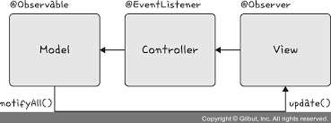

# 면접을 위한 CS 전공지식 노트

# Design Pattern And Programming Paradigm

- Design Pattern
    
    <aside>
    💡 디자인 패턴이란 프로그램을 설계할 때 발생했던 문제점들을 객체 간의 상호 관계 등을 이용하여 해결할 수 있도록 하나의 ‘규약’ 형태로 만들어 놓은 것
    
    </aside>
    
    - Singleton Pattern
        - Singleton Pattern은 하나의 Class에 오직 하나의 Instance만 가지는 패턴이다. 하나의 Class를 기반으로 여러 개의 개별적인 Instance를 만들 수 있지만, 그렇게 하지 않고 하나의 Class를 기반으로 단 하나의 Instance를 만들어 이를 기반으로 Logic을 만드는 데 쓰이며, 보통 데이터베이스 연결 모듈에 많이 사용한다.
            - ⇒ 하나의 Instance를 만들어 놓고 해당 Instance를 다른 모듈들이 공유하며 사용하기에 Instance를 생성하는 비용이 줄어드는 장점이 있지만, 의존성이 높아진다는 단점이 있다.
            - Singleton Pattern in Javascript
                - 자바스크립트에서는 leteral { } 또는 new Object로 객체를 생성하게 되면 다른 어떤 객체와도 같지 않기에 leteral { } 또는 new Object를 사용하는 것 만으로 Single Pattern을 구현할 수 있다.
                    
                    ```jsx
                    const obj = { 
                        a: 27
                    }
                    
                    const obj2 = {
                        a: 27
                    }
                    
                    console.log(obj === obj2)           // false
                    ```
                    
                - 위 코드 또한 new Object라는 Class에서 나온 단 하나의 Instance이니 어느 정도 Singleton Pattern이라 볼 수 있지만, 실제 Singleton Pattern은 보통 다음과 같은 코드로 구성된다.
                    
                    ```jsx
                    class Singleton {
                        constructor() {
                            if (!Singleton.instance) {
                                Singleton.instance = this
                            }
                            return Singleton.instance
                        }
                    
                        getInstance() {
                            return this.instance
                        }
                    }
                    
                    const a = new Singleton()
                    const b = new Singleton() 
                    console.log(a === b)                // true
                    ```
                    
            - Database Connect Module
                - 앞서 설명한 Singleton Pattern은 DB 연결 모듈이 많이 사용된다.
                    
                    ```jsx
                    const URL = 'mongodb://localhost:27017/kundolapp'
                    const createConnection = url => ({"url" : url})
                    class DB {
                        constructor(url) {
                            if(!DB.instance) {
                                DB.instance = createConnection(url)
                            }
                            return DB.instance
                        }
                        connect() {
                            return this.instance
                        }
                    }
                    
                    const c = new DB(URL)
                    const d = new DB(URL)
                    
                    console.log(c === d)              // true
                    ```
                    
                    - 위 코드처럼 DB.instance라는 하나의 Instacne를 기반으로 c, d를 생성한다. 이를 통해 데이터베이스 연결에 관한 Instance 생성 비용을 아낄 수 있다.
            - Singleton Pattern in Java
                - Java로는 중첩 Class를 이용해서 만드는 방법이 가장 대중적인 방법이다.
                    
                    ```java
                    package Java;
                    
                    class MakeSingletonClass {
                        private static class singleInstanceHolder {
                            private static final MakeSingletonClass INSTANCE = new MakeSingletonClass();
                        }
                    
                        public static MakeSingletonClass getInstance() {
                            return singleInstanceHolder.INSTANCE;
                        }
                    }
                    
                    public class Singleton {
                        public static void main(String[] args) {
                            MakeSingletonClass a = MakeSingletonClass.getInstance();
                            MakeSingletonClass b = MakeSingletonClass.getInstance();
                    
                            System.out.println(a.hashCode());
                            System.out.println(b.hashCode());
                    
                            if(a == b) {
                                System.out.println(true);
                            }
                        }
                    }
                    
                    /*
                    
                    865113938
                    865113938
                    true  
                    
                     */
                    ```
                    
            - Singleton Pattern in Mongoose
                - 실제로 Singleton Pattern은 Node.js에서 MongoDB 데이터베이스를 연결할 때 쓰는 mongoose module에서 볼 수 있다.
                - mongoose의 데이터베이스를 연결할 때 쓰는 connect() 라는 함수는 Singleton Instance를 반환한다.
                    
                    ```jsx
                    Mongoose.prototype.connect = function(uri, options, callback) {
                        const _mongoose = this instanceof Mongoose ? this : mongoose;
                        const conn = _mongoose.connection;
                    
                        return _mongoose._promiseOrCallback(callback, cb => {
                            conn.openUri(uri, options, err => {
                                if(err != null) {
                                    return cb(err);
                                }
                                return cb(null, _mongoose);
                            });
                        });
                    };
                    ```
                    
            - Singleton Pattern in MySQL
                - Node.js에서 MySQL 데이터베이스를 연결할 때도 Singleton Pattern이 사용된다.
                    
                    ```jsx
                    // 메인 모듈
                    import mysql from 'mysql'
                    const pool = mysql.createPool({
                        connectionLimit: 10,
                        host: 'example.org',
                        user: 'keaunsol',
                        password: 'secret',
                        database: 'keaunsolDB'
                    });
                    
                    pool.connect();
                    
                    // 모듈 A
                    pool.query(query, function (error, results, fields) {
                        if (error) throw error;
                        console.log('The Soluction is: ', results[0].solution);
                    });
                    
                    // 모듈 B
                    pool.query(query, function (error, results, fields) {
                        if(error) throw error;
                        console.log('The Soluction is: ', results[0].solution);
                    });
                    ```
                    
                    - 위의 코드처럼 메인 Module에서 데이터베이스 연결에 관한 Instance를 정의하고 다른 Module인 A 또는 B에서 해당 Instance를 기반으로 쿼리를 보내는 형식으로 주로 사용된다.
            - Disadvantage of Singleton Pattern
                - Singleton Pattern은 TDD(Test Driven Development)를 할 때 걸림돌이 된다. TDD를 할 때는 단위 테스트를 주로 하는데, 단위 테스트는 테스트가 서로 독립적이어야 하며 테스트를 어떤 순서로든 실행할 수 있어야 하기 때문이다.
                - 하지만 Singleton Pattern은 미리 생성된 하나의 Instance를 기반으로 구현하는 Pattern이므로 각 테스트마다 ‘독립적인’ Instance를 만들기가 어렵다.
                    
                    ## 의존성 주입
                    
                    - 또한, Singleton Pattern은 사용하기가 쉽고 굉장히 실용적이지만 Module간의 결합을 강하게 만들 수 있다는 단점이 있다. 이때 의존성 주입(DI, Dependency Injection)을 통해 Module 간의 결합을 조금 더 느슨하게 만들어 해결할 수 있다.
                        - ⇒ Main Module이 ‘직접’ 다른 하위 Module에 대한 의존성을 주기보다는 중간에 의존성 주입자(Dependency Injector)가 이 부분을 가로채 Main Module이 ‘간접’적으로 의존성을 주입하는 방식
                            - ⇒ 이를 통해 Main Module은 하위 Module에 대한 의존성이 떨어지게 된다. 이를 ‘decouping이  된다’고도 한다.
                        
                        ### 의존성 주입의 장점
                        
                        - Module들을 쉽게 교체할 수 있는 구조가 되어 Testing 하기 쉽고 Migration 하기도 수월하다. 또한, 구현할 때 추상화 Layer를 넣고 이를 기반으로 Implementation를 넣어 주기 때문에 애플리케이션 의존성 방향이 일관되고, 애플리케이션을 쉽게 추측할 수 있으며, Module 간의 관계들이 조금 더 명확해진다.
                        
                        ### 의존성 주입의 단점
                        
                        - Module들이 더욱 더 분리되므로 Class 수가 늘어나 Complexity이 증가 될 수 있으며 약간의 런타임 Penalty가 생기기도 한다.
                        
                        ### 의존성 주입 원칙
                        
                        - 의존성 주입은 ‘상위 Module은 하위 Module에서 어떠한 것도 가져오지 않아야 한다. 또한, 둘 다 추상화에 의존해야 하며, 이 때 추상화는 세부 사항에 의존하지 말아야 한다.’ 는 의존성 주입 원칙을 지켜주면서 만들어야 한다.
    - Factory Pattern
        - Factory Pattern은 객체를 사용하는 코드에서 객체 생성 부분을 떼어내 추상화한 패턴이자 상속 관계에 있는 두 Class에서 상위 Class가 중요한 뼈대를 결정하고, 하위 Class에서 객체 생성에 관한 구체적인 내용을 결정하는 패턴이다.
        - 상위 Class와 하위 Class가 분리되기 때문에 느슨한 결합을 가지며 상위 Class에서는 Instance 생성 방식에 대해 전혀 알 필요가 없기 때문에 더 많은 유연성을 갖게 된다.
        - 객체 생성 Logic이 따로 떼어져 있기 때문에 코드를 Refactoring 하더라도 한 곳만 고칠 수 있어 유지 보수성이 증가한다.
        - Factory Pattern in Javascript
            - Javascript에서 Factory Pattern을 구현한다면 간단하게 new Object()로 구현할 수 있다.
                
                ```jsx
                const num = new Object(42)
                const str = new Object('abc')
                console.log(num.constructor.name);       // Number
                console.log(str.constructor.name);       // String
                ```
                
                - 숫자를 전달하거나 문자를 전달함에 따라 다른 타입의 객체를 생성하는 것을 확인할 수 있다. 즉, 전달 받은 값에 따라 다른 객체를 생성하며 Instance의 타입 등을 정한다.
                
                ```jsx
                class Latte {
                    constructor() {
                        this.name = "latte"
                    }
                }
                
                class Espresso {
                    constructor() {
                        this.name = "Espresso"
                    }
                }
                
                class LatteFactory {
                    static createCoffe() {
                        return new Latte();
                    }
                }
                
                class EspressoFactory {
                    static createCoffe(){
                        return new Espresso()
                    }
                }
                
                const factoryList = { LatteFactory, EspressoFactory }
                
                class CoffeFactory {
                    static createCoffe(type) {
                        const factory = factoryList[type]
                        return factory.createCoffe()
                    }
                }
                
                const main = () => {
                
                    // 라떼 커피 주문
                    const coffe = CoffeFactory.createCoffe("LatteFactory")
                
                    // 커피 이름을 부른다. 
                    console.log(coffe.name)     // latte
                }
                
                main()
                ```
                
                - CoffeFactory라는 상위 Class가 중요한 뼈대를 결정하고 하위 Class인 LatteFactory가 구체적인 내용을 결정하고 있다.
                - 이는 의존성 주입이라고도 볼 수 있는데, CoffeFacotry에서 LatteFactory의 Insatance를 생성하는 것이 아닌, LatteFactory에서 생성한 Instance를 CoffeFactory에 주입하고 있기 때문이다.
                - 또한, CoffeFactory Class를 보면 static 키워드를 통해 createCoffe() Method를 static Method로 선언했는데, 이렇게 static method로 정의하면 class를 기반으로 객체를 만들지 않고 호출이 가능하며, 해당 Method에 대한 메모리 할당을 한 번만 할 수 있는 장점이 있다.
        - Factory Pattern in Java
            - 동일 코드에 대한 Java 구현
                
                ```java
                package Java;
                
                abstract class Coffee {
                    public abstract int getPrice();
                
                    @Override
                    public String toString() {
                        return "Hi this coffe is " + this.getPrice();
                    }
                }
                
                class CoffeeFactory {
                    public static Coffee getCoffe(String type, int price) {
                        if ("Latte".equalsIgnoreCase(type)) return new Latte(price);
                        
                        else if ("Americano".equalsIgnoreCase(type)) return new Americano(price);
                
                        else {
                            return new DefaultCoffe();
                        }
                    }
                }
                
                class DefaultCoffe extends Coffee {
                    private int price;
                
                    public DefaultCoffe() {
                        this.price -= 1;
                    }
                
                    @Override
                    public int getPrice() {
                        return this.price;
                    }
                }
                
                class Latte extends Coffee {
                    private int price;
                
                    public Latte(int price) {
                        this.price = price;
                    }
                
                    @Override
                    public int getPrice() {
                        return this.price;
                    }
                }
                
                class Americano extends Coffee {
                    private int price;
                
                    public Americano(int price) {
                        this.price = price;
                    }
                
                    @Override
                    public int getPrice() {
                        return this.price;
                    }
                }
                
                public class FactoryPattern {
                    
                    public static void main(String[] args) {
                        Coffee latte = CoffeeFactory.getCoffe("Latte", 4000);
                        Coffee ame = CoffeeFactory.getCoffe("Americano", 3000);
                        System.out.println("Factory latte ::" + latte);
                        System.out.println("Factory ame :: " + ame);
                    }
                }
                
                /* 
                    Factory latte ::Hi this coffe is 4000
                    Factory ame :: Hi this coffe is 3000
                */
                ```
                
                - ⇒ equalsIgnoreCase() 을 통해 문자열 비교 기반으로 Logic이 구성되었지만, 이는 Enum 또는 Map을 이용하여 if문을 사용하지 않고 Mapping 해서 구현할 수도 있다.
    - Strategy Pattern
        - Strategy Pattern은 Policy Pattern이라고도 하며, 객체의 행위를 바꾸고 싶은 경우 ‘직접’ 수정하지 않고 전략이라고 부르는 ‘캡슐화된 알고리즘’을 Context 안에서 바꿔주면서 상호 교체가 가능하게 만드는 패턴이다.
        - Strategy Pattern in Java
            
            ```java
            package Java.Design_Pattern;
            
            import java.util.ArrayList;
            import java.util.List;
            
            interface PaymentStrategy {
                public void pay(int amount);
            }
            
            class KAKAOCardStrategy implements PaymentStrategy {
                private String name;
                private String cardNumber;
                private String cvv;
                private String dateOfExpiry;
            
                public KAKAOCardStrategy(String nm, String ccNum, String cvv, String expriryDate) {
                    this.name = nm;
                    this.cardNumber = ccNum;
                    this.cvv = cvv;
                    this.dateOfExpiry = expriryDate;
                }
            
                @Override
                public void pay(int amount) {
                    System.out.println(amount + " paid using KAKAOCard.");
                }
            }
            
            class LUNACardStrategy implements PaymentStrategy {
                private String emailId;
                private String password;
            
                public LUNACardStrategy(String email, String pwd) {
                    this.emailId = email;
                    this.password = pwd;
                }
            
                @Override 
                public void pay(int amount) {
                    System.out.println(amount + " paid using LUNACard.");
                }
            }
            
            class Item {
                private String name;
                private int price;
                public Item(String name, int cost) {
                    this.name = name;
                    this.price = cost;
                }
            
                public String getName() {
                    return name;
                }
            
                public int getPrice() {
                    return price;
                }
            }
            
            class ShoppingCart {
                List<Item> items;
            
                public ShoppingCart() {
                    this.items = new ArrayList<Item>();
                }
            
                public void addItem(Item item) {
                    this.items.add(item);
                }
            
                public void removeItem(Item item) {
                    this.items.remove(item);
                }
            
                public int calculateTotal() {
                    int sum = 0;
                    for (Item item : items) {
                        sum += item.getPrice();
                    }
            
                    return sum;
                }
            
                public void pay(PaymentStrategy paymentMethod) {
                    int amount = calculateTotal();
                    paymentMethod.pay(amount);
                }
            
            }
            
            public class StrategyPattern {
                public static void main(String[] args) {
                    ShoppingCart cart = new ShoppingCart();
            
                    Item A = new Item("keaunsolA", 100);
                    Item B = new Item("keaunsolB", 300);
            
                    cart.addItem(A);
                    cart.addItem(B);
            
                    // pay by LUNACard 
                    cart.pay(new LUNACardStrategy("keaunsol@example.com", "password"));
            
                    // pay by KAKAOCard
                    cart.pay(new KAKAOCardStrategy("keaunsol Na", "123456789", "123", "12/01"));
                }
            }
            
            /*
            400 paid using LUNACard.
            400 paid using KAKAOCard.
             */
            ```
            
        - Strategy Pattern in passport
            - Strategy Pattern을 활용한 Libray로 passport가 있다.
            - passport는 Node.js에서 인증 모듈을 구현할 때 사용하는 Middleware Libray로, 여러 가지 ‘전략’을 기반으로 인증할 수 있게 해준다. 서비스 내의 회원 가입된 아이디와 비밀번호를 기반으로 인증하는 LocalStrategy 전략과 페이스북, 네이버 등 다른 서비스를 기반으로 인증하는 OAuth 전략 등을 지원한다.
                
                ```jsx
                import passport from 'passport';
                import { Strategy as LocalStrategy } from 'passport-local';
                
                passport.use(new LocalStrategy(
                    function (username, password, done) {
                        UserActivation.findOne({ username: username}, function(err, user) {
                            if(err) { return done(err); }
                
                                if(!user) {
                                    return done(null, false, { message: 'Incorect username.'
                                });
                
                                }
                
                                if(!user.validPassword(password)) {
                                    return done(null, false, { message: 'Incorect password.'
                                });
                
                                }
                
                                return done(null, user);
                        });
                    }
                ));
                ```
                
                - passport.use(new LocalStrategy( … 처럼 passport.use() 라는 method에 ‘전략’을 매개 변수로 넣어 Logic을 수행할 수 있다.
    - Observer Pattern
        
        
        
        - Observer Pattern은 주체가 어떤 객체(subject)의 상태 변화를 관찰하다가 상태 변화가 있을 때마다 Method 등을 통해 Observer 목록에 있는 Observer들에게 변화를 알려 주는 패턴이다.
        - 여기서 주체란 객체의 상태 변화를 보고 있는 관찰자이며, Observer들이란 이 객체의 상태 변화에 따라 전달되는 메서드 등을 기반으로 ‘추가 변화 사항’이 생기는 객체들을 의미한다.
        - 또한, 주체와 객체를 따로 두지 않고 상태가 변경되는 객체를 기반으로 구축하기도 한다. Observer Pattern을 활용한 서비스로는 트위터가 있다.
        - 또한 Observer Pattern은 주로 이벤트 기반 시스템에 사용하며 MVC(Model-View-Controller) Pattern에도 사용된다.
            - 예를 들어 주체라고 볼 수 있는 Model에서 변경 사항이 생겨 update() Method로 Observer인 View에 알려 주고 이를 기반으로 Controller 등이 작동하는 식
            - Observer Pattern in Java
                
                ```java
                package Java.Design_Pattern;
                
                import java.util.ArrayList;
                import java.util.List;
                
                interface Subject {
                    public void register(Observer obj);
                    public void unregister(Observer obj);
                    public void notifyObservers();
                    public Object getUpdate(Observer obj);
                }
                
                interface Observer {
                    public void update();
                }
                
                class Topic implements Subject {
                    private List<Observer> observers;
                    private String message;
                
                    public Topic() {
                        this.observers = new ArrayList<>();
                        this.message = "";
                    }
                
                    @Override 
                    public void register(Observer obj) {
                        if(!observers.contains(obj)) observers.add(obj);
                    }
                
                    @Override
                    public void unregister(Observer obj) {
                        observers.remove(obj);
                    }
                
                    @Override
                    public void notifyObservers() {
                        this.observers.forEach(Observer::update);
                    }
                
                    @Override
                    public Object getUpdate(Observer obj) {
                        return this.message;
                    }
                
                    public void postMessage(String msg) {
                        System.out.println("Message sended to Topic: " + msg);
                        this.message = msg;
                        notifyObservers();
                    }
                }
                
                class TopicSubscriber implements Observer {
                    private String name;
                    private Subject topic;
                
                    public TopicSubscriber(String name, Subject topic) {
                        this.name = name;
                        this.topic = topic;
                    }
                
                    @Override 
                    public void update() {
                        String msg = (String) topic.getUpdate(this);
                        System.out.println(name + ":: get message >> " + msg);
                    }
                }
                
                public class ObserverPattern {
                    public static void main(String[] args) {
                        Topic topic = new Topic();
                        Observer a = new TopicSubscriber("a", topic);
                        Observer b = new TopicSubscriber("b", topic);
                        Observer c = new TopicSubscriber("c", topic);
                        topic.register(a);
                        topic.register(b);
                        topic.register(c);
                
                        topic.postMessage("keaunsol is Developer");
                    }    
                }
                
                /*
                
                Message sended to Topic: keaunsol is Developer
                a:: get message >> keaunsol is Developer
                b:: get message >> keaunsol is Developer
                c:: get message >> keaunsol is Developer
                
                 */
                ```
                
                - topic을 기반으로 구현 된 Observer Pattern. topic은 주체이자 객체가 되며, class Topic implements Subject를 통해 Subject interface를 구현하며, Observer a = new TopicSubscriber(”a”, topic); 으로 Observer를 선언할 때 해당 이름과 어떠한 토픽의 Observer가 될 것인지를 정한다.
            - Observer Pattern in Javascript
                - Javascript에서의 Observer Pattern은 Proxy 객체를 통해 구현할 수도 있다.
                
                ### Proxy Object
                
                - Proxy Object는 어떠한 대상의 기본적인 동작(속성 접근, 할당, 순회, 열거, 함수 호출 등)의 작업을 가로챌 수 있는 객체를 뜻하며, Javascript에서 Proxy object는 두 개의 매개변수를 가진다.
                    - target : 프록시할 대상
                    - handler: target 동작을 가로채고 어떠한 동작을 할 것인지가 설정되어 있는 함수
                    
                    ```jsx
                    const handler = {
                        get: function(target, name) {
                            return name === 'name' ? `${target.a} ${target.b}` : target[name]
                        }
                    }
                    
                    const p = new Proxy({a: "keaunsol", b: 'Is Developer'}, handler) 
                    console.log(p.name)     // keaunsol Is Developer
                    ```
                    
                    - 위의 handler 객체처럼 특정 속성에 접근할 때 그 부분을 가로채서 어떠한 Logic을 강제할 수 있는 것이 Proxy Object
                    
                    ### Observer Pattern using Proxy Object
                    
                    ```jsx
                    function createReactiveObject(target, callback) {
                        const proxy = new Proxy(target, {
                            set(obj, prop, value) {
                                if(value !== obj[prop]) {
                                    const prev = obj[prop]
                                    obj[prop] = value
                                    callback(`${prop}이 [${prev}] >> [${value}]로 변경되었습니다. `)
                                }
                                return true
                            }
                        })
                        return proxy
                    }
                    
                    const a = {
                        "keaunsol" : "Coder"
                    }
                    
                    const b = createReactiveObject(a, console.log)
                    b.keaunsol = "Coder"
                    b.keaunsol = "Developer"
                    // keaunsol이 [Coder] >> [Developer]로 변경되었습니다.
                    ```
                    
                    - Proxy Object의 get() 함수는 속성과 함수에 대한 접근을 가로채며, has() 함수는 in 연산자의 사용을 가로챈다. set() 함수는 속성에 대한 접근을 가로챈다. set() 함수를 통해 속성에 대한 접근을 “가로채”서 keaunsol이라는 속성이 Coder에서 Developer로 되는 것을 감시할 수 있다.
            - Observer Pattern in Vue.js 3.0
                - Vue.js 3.0에서 ref나 reactive로 정의하면 해당 값이 변경되었을 때 자동으로 DOM에 있는 값이 변경되는데, 이는 Proxy Object를 이용한 Observer Pattern을 이용하여 구현한 것이다.
                    
                    ```jsx
                    function createReactiveObject(
                        target: Target,
                        isReadonly: boolean,
                        baseHandlers: ProxyHandler<any>, 
                        collectionHandlers: ProxyHandler<any>,
                        proxyMap: WeakMap<Target, any>
                    )  {
                        if(!isObject(target)) {
                            if(__DEV__) {
                                console.warn(`value cannot be made reactive: ${String(target)}`)
                            }
                            return target
                        }
                    
                        // target is alerady a Proxy, return it.
                        // exception: calling readonly() on a reactive object
                    
                        if(
                            target[ReactiveFlags.RAM] && 
                            !(isReadonly && target[ReactiveFlags.IS_REACTIVE])
                        ) {
                            return target
                        }
                    
                        // target already has corresponding proxy
                        const existingProxy = proxyMap.get(target)
                        if(existingProxy) {
                            return existingProxy
                        }
                    
                        // only a whitelist of value types can be observerd.
                        const targetType = getTargetType(target)
                        if(targetType == targetType.INVALID) {
                            return target
                        }
                    
                        const proxy = new Proxy(
                            target, 
                            targetType === targetType.COLLECTION ? collectionHandlers : baseHandlers
                        )
                    
                        proxyMap.set(target, proxy)
                        return proxy
                    }
                    ```
                    
                    - 위 코드는 실제로 Vue.js 3.0의 Observer Pattern이 담긴 코드다. proxyMap이라는 Proxy Object를 사용했고, 객체 내부의 get(), set() Method를 사용 했다.
    - Proxy Pattern And Proxy Server
        - Proxy Pattern
            - Proxy Pattern은 대상 객체(subject)에 접근하기 전 그 접근에 대한 흐름을 가로채 대상 객체 앞단의 인터페이스 역할을 하는 Design Pattern이다.
                
                
                
            - 이를 통해 객체의 속성, 변환 등을 보완하며 보안, 데이터 검증, 캐싱, 로깅에 사용한다. 이는 앞서 설명한 Proxy Object로 쓰이기도 하지만 Proxy Server로도 활용된다.
                - ⇒ Proxy Server에서의 Caching
                    - Caches 안에 정보를 담아두고, Caches 안에 있는 정보를 요구하는 요청에 대해 다시 저 멀리 있는 원격 서버에 요청하지 않고 Caches 안에 있는 데이터를 활용하는 것. 이를 통해 불필요하게 외부와 연결하지 않기 때문에 트래픽을 줄일 수 있다는 장점이 있다.
        - Proxy Server
            - Proxy Server는 Server와 Client 사이에서 Client가 자신을 통해 다른 네트워크 서버에 간접적으로 접속할 수 있게 해주는 컴퓨터 시스템이나 응용 프로그램을 가리킨다.
                
                ## Proxy Server로 쓰는 nginx
                
                - nginx는 비동기 이벤트 기반의 구조와 다수의 연결을 효과적으로 처리 가능한 Web Server이며, 주로 Node.js 서버 앞단의 Proxy Server로 활용된다.
                - Node.js Server를 구축할 때 앞단에 nginx를 둠으로서 익명 사용자가 직접적으로 서버에 접근하는 것을 차단하고, 간접적으로 한 단계를 더 거치게 만들어 보안을 강화할 수 있다.
                    
                    
                    
                    - 위 그림처럼 nginx를 Proxy Server로 둬서 실제 포트를 숨길 수 있으며, 정적 자원을 gzip 압축하거나, 메인 서버 앞단에서의 로깅을 할 수도 있다.
                
                ## Proxy Server로 쓰는 CloudFlare
                
                - CloudFlare는 웹 서버 앞단에 Proxy Server로 두어 DDOS 공격 방어나 HTTPS 구축에 사용된다.
                - 또한 서비스를 배포한 이후 해외에서 의심스러운 트래픽이 많이 발생할 경우, CloudFlare가 의심스러운 트래픽인지를 먼저 판단해 CAPTCHA 등을 기반으로 이를 일정 부분 막아주는 역할도 수행한다.
                    
                    
                    
                    - ,위 그림처럼 사용자, 크롤러, 공격자가 웹 사이트에 접속할 때, CloudFlare를 통해 공격자로부터 보호할 수 있다.
                        
                        ### DDOS 공격 방어
                        
                        - CloudFlare는 의심스러운 트래픽, 특히 사용자가 접속하는 것이 아닌 시스템을 통해 오는 트래픽을 자동으로 차단하여 DDOS 공격으로부터 보호한다. CloudFlare의 거대한 네트워크 용량과 캐싱 전략으로 소규모 DDOS 공격은 쉽게 막아낼 수 있으며, 이러한 공격에 대한 방화벽 대시보드도 제공한다.
                        
                        ### HTTPS 구축
                        
                        - CloudFlare를 사용하면 별도의 인증서 설치 없이 좀 더 손쉽게 HTTPS를 구축할 수 있다.
                        
                        ### Proxy Server of CORS And FrontEnd
                        
                        - CORS(Cross-Origin Resource Sharing)는 Server가 웹 브라우저에서 리소스를 로드할 때 다른 Origin을 통해 로드하지 못하게 하는 HTTP 헤더 기반 메커니즘이다.
                        - FrontEnd 개발 시 FrontEnd 서버를 만들어 BackEnd 서버와 통신할 때 주로 CORS 에러를 마주치는데, 이를 해결하기 위해 FrontEnd에서 Proxy Server를 만들기도 한다.
                            - ⇒ Proxy Server를 통해 FrontEnd에서 요청되는 Origin을 BackEnd 서버의 포트 번호로 변경하는 것.
    - Iterator Pattern
        - Iterator Pattern은 Iterator를 사용하여 Collection의 요소들에 접근하는 Design Pattern이다. 이를 통해 순회할 수 있는 여러 가지 자료형의 구조와는 상관없이 Iterator라는 하나의 인터페이스로 순회가 가능하다.
        - Iteraotr Pattern in Javascript
            
            ```jsx
            const mp = new Map()
            mp.set('a', 1);
            mp.set('b', 2);
            mp.set('c', 3);
            
            const st = new Set()
            st.add(1);
            st.add(2);
            st.add(3);
            
            for(let a of mp) console.log(a)
            for(let a of st) console.log(a)
            
            /*
            
            [ 'a', 1 ]
            [ 'b', 2 ]
            [ 'c', 3 ]
            1
            2
            3
            
            */
            ```
            
            - Iterator Protocol : Iterable한 객체들을 순회할 때 쓰이는 규칙
            - Iterable 한 객체 : 반복 가능한 객체로 배열을 일반화한 객체
    - Revealing Module Pattern
        - Reveraling Module Pattern은 즉시 실행 함수를 통해 private, public 같은 접근 제어자를 만드는 패턴을 말한다. Javascript는 private나 public 같은 접근 제어자가 존재하지 않고 전역 범위에서 스크립트가 실행되기에 Revealing Module Pattern을 통해 private와 public 접근 제어자를 구현하기도 한다.
            
            ```jsx
            const keaunsol = (() => {
                const a = 1
                const b = () => 2
                const public = {
                    c : 2,
                    d : () => 3
                }
                return public
            }) ()
            console.log(keaunsol)       // { c: 2, d: [Function: d] }
            console.log(keaunsol.a)     // undefined
            ```
            
            - a와 b는 다른 Module에서 사용할 수 없는 변수나 함수이며 private 범위를 가진다. c와 d는 다른 모듈에서 사용할 수 있는 변수나 함수이며 public 범위를 가진다. Revealing Module Pattern을 기반으로 만든 Javascript Module 방식으로는 CJS(CommonJS) Module 방식이 있다.
    - MVC Pattern
        - MVC Pattern은 Model, View, Controller로 이루어진 Design Pattern이다.
            
            
            
            - Application의 구성 요소를 세 가지 역할로 구분하여 개발 프로세스에서 각각의 구성 요소에만 집중해서 개발할 수 있다. 재 사용성과 확장성이 용이하다는 장점이 있고, Application이 복잡해질수록 Model과 View의 관계가 복잡해지는 단점이 있다.
                
                ### Model
                
                - model은 Application의 데이터인 Database, 상수, 변수 등을 뜻한다. View에서 데이터를 생성하거나 수정하면 Controller를 통해 Model을 생성하거나 갱신한다.
                
                ### View
                
                - View는 inputbox, checkbox, textarea 등 사용자 Interface 요소를 나타낸다. 즉, Model을 기반으로 사용자가 볼 수 있는 화면을 뜻한다. Model이 가지고 있는 정보를 따로 저장하지 않아야 하며 단순히 화면에 표시되는 정보만 가지고 있어야 한다. 또한, 변경이 일어나면 Controller에게 이를 전달해야 한다.
                
                ### Controller
                
                - Controller는 하나 이상의 Model과 하나 이상의 View를 잇는 다리 역할을 하며 이벤트 등 메인 Logic을 담당한다. 또한, Model과 View의 LifeSycle도 관리하며, Model이나 View의 변경 통지를 받으면 이를 해석하여 각각의 구성 요소에 해당 내용에 대해 알려준다.
                
                ### Example of MVC Pattern : Spring
                
                - MVC Pattern을 이용한 대표적인 Pramework로는 자바 플랫폼을 위한 오픈 소스 Application Framework인 Spring이 있다.
                    - 스프링의 WEB MVC는 웹 서비스를 구축하는 데 편리한 기능들을 많이 제공한다. @RequestParam, @RequestHeader, @PathVariable 등의 Annotation을 기반으로 사용자의 요청 값들을 쉽게 분석할 수 있으며 사용자의 어떠한 요청이 유효한 요청인지를 쉽게 거를 수 있다.
                    - 또한 재 사용 가능한 코드, 테스트, 쉽게 Redirection 할 수 있게 하는 등의 장점이 있다.
    - MVP Pattern
        - MVP Pattern은 MVC Pattern으로부터 파생되었으며, MVC의 C에 해당하는 Controller가 Presenter로 교체된 Pattern이다.
            
            
            
            - View와 Presenter는 1 : 1 관계이기 때문에 MVC Pattern보다 더 강한 결합을 지닌 Design Pattern이라고 볼 수 있다.
    - MVVM Pattern
        - MVVM Pattern은 MVC의 C에 해당하는 Controller가 View Model로 바뀐 Pattern이다.
            
            
            
            - 여기서 View Model은 View를 더 추상화한 계층이며, MVVM Pattern은 MVC Pattern과는 다르게 Command와 Data Binding을 가지는 것이 특징이다. View와 View Model 사이의 양방향 Data Binding을 지원하며 UI를 별도의 코드 수정 없이 재사용할 수 있고 단위 테스팅하기 쉽다는 장점이 있다.
            
            ### Example of MVVM Pattern : Vue
            
            - MVVM Pattern을 가진 대표적인 Framework로는 뷰(Vue.js)가 있다. Vue.js는 반응형(reactivity)이 특징인 FrontEnd Framework이다. 예를 들어 watch와 computed 등으로 쉽게 반응형적인 값들을 구축할 수 있다.
            - 함수를 사용하지 않고 값 대입 만으로도 변수가 변경되며 양방향 바인딩, html을 토대로 Component를 구축할 수 있다는 점이 특징이다. 재사용 가능한 Component 기반으로 UI를 구축할 수 있으며 BMW, Google, Louis Vuitton 등에서 사용한다.
                - Command : 여러 가지 요소에 대한 처리를 하나의 Action으로 처리할 수 있게 하는 기법
                - Data Binding : 화면에 보이는 Data와 웹 브라우저의 Memory Data를 일치 시키는 기법으로 View Model을 변경하면 View가 변경된다.
- Programming Paradigm
    
    <aside>
    💡 Programming Paradigm은 프로그래머에게 Programming의 관점을 갖게 해주는 역할을 하는 개발 방법론이다.
    
    </aside>
    
    
    
    - Declarative Programming And Functional Programming
        - Declarative Programming이란 ‘무엇을’ 풀어내는가에 집중하는 패러다임이며, “프로그램은 함수로 이루어진 것이다.”라는 명제가 담겨 있는 패러다임이기도 하다. Functional Programming은 Declarative Programming의 일종이다.
        - 예를 들어 자연수로 이루어진 배열에서 최댓값을 찾으려면 다음과 같이 Logic을 구성한다.
            
            ```
            const list = [1, 2, 3, 4, 5, 11, 12]
            const ret = list.reduce((max, num) => num > max ? num : max, 0)
            console.log(ret);       // 12
            ```
            
            - 위 코드에서 reduce()는 ‘배열’만 받아서 누적한 결괏값을 반환하는 순수 함수이다.
            - 함수형 프로그래밍은 이와 같은 작은 ‘Pure Function’들을 블록처럼 쌓아 Logic을 구현하고 ‘Higher-Order Function, HOF’를 통해 재 사용성을 높인 Programming Paradigm이다. Javascript는 단순하고 유연한 언어이며, 함수가 일급 객체이기 때문에 Object-Oriented Programming 보다는 Functional Programming 방식이 선호된다.
            
            ## Pure Function
            
            - 출력이 입력에만 의존하는 것을 의미한다.
                
                ```
                const pure = (a, b) => {
                    return a + b
                }
                ```
                
                - pure 함수는 들어오는 매개변수 a, b에만 영향을 받는다. 만약 a, b 말고 다른 전역 변수 c 등이 이 출력에 영향을 주면 순수 함수가 아니다.
            
            ## Higher-Order Function
            
            - Higher-Order Function이란 함수가 함수를 값처럼 매개변수로 받아 Logic을 생성할 수 있는 것을 말한다.
                
                ### First-Class Object
                
                - 이 때 Higher-Order Function을 쓰기 위해서는 해당 언어가 First-Class Object라는 특징을 가져야 하며 그 특징은 다음과 같다.
                    - 변수나 Method에 함수를 할당할 수 있다.
                    - 함수 안에 함수를 매개변수로 담을 수 있다.
                    - 함수가 함수를 반환할 수 있다.
                - Funtional Programming은 이외에도 Currying, 불변성 등 많은 특징이 있다.
    - Object-Oriented Programming
        - OOP, Object-Oriented Programming은 객체들의 집합으로 Programming의 상호 작용을 표현하며 Data를 객체로 취급하여 객체 내부에 선언된 Method를 활용하는 방식을 말한다. 설계에 많은 시간이 소요되며 처리 속도가 다른 Programming Paradigm에 비해 상대적으로 느리다.
        - 예를 들어 자연수로 이루어진 배열에서 최댓값을 찾으려면 다음과 같이 Logic을 구성한다.
            
            ```
            const ret = [1, 2, 3, 4, 5, 11, 12]
            class List {
                constructor(list) {
                    this.list = list
                    this.mx = list.reduce((max, num) => num > max ? num : max, 0)
                }
            
                getMax() {
                    return this.mx
                }
            }
            
            const a = new List(ret)
            console.log(a.getMax())     // 12
            ```
            
            - Class List의 Method getMax()로 list의 최댓값을 반환하는 예제
            
            ## C**haracteristic of** Object-Oriented Programming
            
            - Object-Oriented Programming은 Abstraction, Encapsulation, Inheritance, Polymorphism이라는 특징이 있다.
                
                ### Abstraction
                
                - Abstraction이란 복잡한 시스템으로부터 핵심적인 개념 또는 기능을 간추려내는 것을 의미한다.
                
                ### Encapsulation
                
                - Encapsulation는 객체의 Property와 Method를 하나로 묶고 일부를 외부에 감추어 은닉하는 것을 의미한다.
                
                ### Inheritance
                
                - Inheritance은 상위 Class의 특성을 하위 Class가 이어받아서 재 사용하거나 추가, 확장하는 것을 의미한다. 코드의 재사용 측면, 계층적인 관계 생성, 유지 보수성 측면에서 중요하다.
                
                ### Polymorphsim
                
                - Polymorphsim은 하나의 Method나 Class가 다양한 방법으로 동작하는 것을 말한다. 대표적으로 Overloading, Overriding이 있다.
                    - Overloading
                        - Overloading은 같은 이름을 가진 Method를 여러 개 두는 것을 말한다. Method의 타입, 매개변수의 유형, 개수 등으로 여러 개를 둘 수 있으며 Complie 중에 발생하는 ‘정적’ 다형성이다.
                            
                            ```java
                            package Java.ProgrammingParadigm;
                            
                            class Person {
                            
                                public void eat(String a) {
                                    System.out.println("I eat " + a);
                                }
                            
                                public void eat(String a, String b) {
                                    System.out.println("I eat " + a + " and " + b);
                                }
                            }
                            
                            public class Overloading {
                                
                                public static void main(String[] args) {
                                    Person a = new Person();
                                    a.eat("apple");
                                    a.eat("tomato", "phodo");
                                }
                            }
                            
                            /*
                            I eat apple
                            I eat tomato and phodo
                             */
                            ```
                            
                    - Overriding
                        - Overriding은 주로 Method Overriding을 말하며, 상위 Class로부터 상속 받은 Method를 하위 Class가 재 정의하는 것을 의미한다.
                        - 이는 런타임 중에 발생하는 ‘동적’ 다형성이다.
                            
                            ```
                            package Java.ProgrammingParadigm;
                            
                            class Animal {
                                public void bark() {
                                    System.out.println("mumu! mumu!");
                                }
                            }
                            
                            class Dog extends Animal {
                                @Override
                                public void bark() {
                                    System.out.println("wal!! wal!!!!");
                                }
                            }
                            
                            public class Overriding {
                                public static void main(String[] args) {
                                    Dog d = new Dog();
                                    d.bark();
                                }
                            }
                            
                            /*
                            wal!! wal!!!!
                             */
                            ```
                            
                - 설계 원칙
                    - Object-Oriented Programming을 설계할 때는 SOLID 원칙을 지켜줘야 한다. S는 Single Responsibility Principle, O는 Open-Close Principle, L은 Liskov Substitution Principle, I는 Interface Segregation Principle, D는 Dependency Inversion Principle을 의미한다.
                        
                        ### SRP, Single Responsibility Principle
                        
                        - Single Responsibility Principle은 모든 Class는 각각 하나의 책임만 가져야 하는 원칙이다. 예를 들어 A라는 Logic이 존재한다면 어떠한 Class는 A에 대한 Class여야 하고, 이를 수정한다고 했을 때도 A와 관련된 수정이어야 한다.
                        
                        ### OCP, Open-Close Principle
                        
                        - Open-Close Principle은 유지 보수 사항이 생긴다면 코드를 쉽게 확장할 수 있도록 하고 수정할 때는 닫혀 있어야 하는 원칙이다. 즉, 기존의 코드를 잘 변경하지 않으면서도 확장은 쉽게 할 수 있어야 한다.
                        
                        ### LSP, Liskov Substitution Principle
                        
                        - Liskov Substitution Principle은 Progrm의 객체는 Program의 정확성을 깨뜨리지 않으면서 하위 타입의 Instance로 바꿀 수 있어야 하는 것을 의미한다. Class는 상속이 되기 마련이고 부모, 자식이라는 계층 관계가 만들어진다. 이 때 부모 객체에 자식 객체를 넣어도 시스템이 문제 없이 돌아가게 만드는 것을 의미한다.
                        
                        ### ISP, Interface Segregation Principle
                        
                        - Interface Segregation Principle은 하나의 일반적인 Interface보다 구체적인 여러 개의 Interface를 만들어야 하는 원칙을 의미한다.
                        
                        ### DIP, Dependency Inversion Principle
                        
                        - Dependency Inversion Principle은 자신보다 변하기 쉬운 것에 의존하던 것을 추상화된 Interface나 상위 Class를 두어 변하기 쉬운 것의 변화에 영향 받지 않게 하는 원칙을 말한다. 즉, 상위 계층은 하위 계층의 변화에 대한 구현으로부터 독립해야 한다.
    - Procedural Programming
        - Procedural Programming은 Logic이 수행되어야 할 연속적인 계산 과정으로 이루어져 있다. 일이 진행되는 방식으로 그저 코드를 구현하기만 하면 되기에 코드의 가독성이 좋으며 실행 속도가 빠르다. 그렇기에 계산이 많은 작업 등에 쓰인다. 대표적으로 Fortran을 이용한 대기 과학 관련 연산 작업, 머신 러닝의 배치 작업이 있다. 단점으로는 모듈화하기 어렵고 유지 보수성이 떨어진다는 점이 있다.
            
            ```
            const ret = [1, 2, 3, 4, 5, 11, 12]
            let a = 0
            for(let i = 0; i < ret.length; i++) {
                a = Math.max(ret[i], a)
            }
            
            console.log(a)  // 12
            ```
            
    - Mixing Paradigm
        - 가장 좋은 Programming Paradigm은 없다. 비즈니스 Logic이나 서비스의 특징을 고려해서 Pradigm을 정하는 것이 좋다. 하나의 Pradigm을 기반으로 통일하여 서비스를 구축하는 것도 좋지만, 여러 Pradigm을 조합하여 상황과 맥락에 따라 Pradigm 간의 장점만 취해 개발하는 것이 좋다.
            - EX) Backend에 머신 러닝 PipeLine과 거래 관련 Logic이 있다면 머신 러닝 PipeLine은 Procedural Pragramming, 거래 관련 Logic은 Functional Programming을 적용하는 것이 좋다.

# Network

- Basic of Network
    
    <aside>
    💡 Network란 Node와 Link가 서로 연결되어 있으며 Resource를 공유하는 집합이다.
    
    Node란 Server, Router, Switch 등 Netwrok Device를 의미하고 Link는 유선 또는 무선을 의미한다.
    
    </aside>
    
    - Throughput and Latency
        - 좋은 Network란 많은 Throughput을 처리할 수 있으며  Latency이 짧고 장애 빈도가 적으며 좋은 보안을 갖춘 Network를 말한다.
            
            ## Throughput
            
            - Throughput은 Link 내에서 성공적으로 전달된 데이터의 양을 말하며 보통 얼만큼의 트래픽을 처리했는지를 나타낸다. 즉, 많은 트래픽을 처리한다는 많은 처리량을 가진다의 의미를 가진다.
                
                
                
            - 단위로는 bps(bits per second)를 사용한다. 초당 전송 또는 수신 되는 비트 수라는 의미이다. Throughput은 사용자들이 많이 접속할 때마다 커지는 Traffic, Network Device 간의 대역폭, Network 중간에 발생하는 에러, 장치의 하드웨어 Spec에 영향을 받는다.
                - Traffic : 특정 시점에 Link 내에 ‘흐르는’ 데이터의 양을 말한다. 예를 들면 서버에 저장된 파일을 Client가 다운로드할 때 발생되는 Data의 누적량.
                    
                    대역폭 : 주어진 시간 동안 네트워크 연결을 통해 흐를 수 있는 최대 비트 수 
                    
                
                ## Latency
                
                - Latency이란 요청이 처리되는 시간을 말하며 어떤 메시지가 두 장치 사이를 왕복 하는 데 걸린 시간을 말한다.
                    
                    
                    
                    - 지연 시간은 매체 타입(무선, 유선), Packet 크기, Router의 Packet 처리 시간에 영향을 받는다.
    - Network Topology And Bottleneck
        - Network Topology
            - Network Topology는 Node와 Link가 어떻게 배치되어 있는지에 대한 방식이자 연결 형태를 의미한다.
                
                ### Tree Topology
                
                
                
                - Tree Topology는 Hierarchical Topology라고 하며 Tree 형태로 배치된 Network 구성을 말한다.
                - 노드의 추가, 삭제가 쉬우며 특정 Node에 Traffic이 집중될 때 하위 Node에 영향을 끼칠 수 있다.
                
                ### Bus Topology
                
                
                
                - Bus Topology는 중앙 통신 회선 하나에 여러 개의 Node가 연결되어 공유하는 Network 구성을 말하며 근거리 통신망(LAN)에서 사용한다.
                - 설치 비용이 적고 신뢰성이 우수하며 중앙 통신 회선에 Node를 추가하거나 삭제하기 쉽다. 그러나 Spoofing이 가능한 문제점이 있다.
                    
                    ### Spoofing
                    
                    - Spoofing은 LAN 상에서 송신부의 Packet을 송신과 관련 없는 다른 Host에 가지 않도록 하는 Switching 기능을 마비 시키거나 속여서 특정 Node에 해당 Packet이 오도록 처리하는 것을 의미한다.
                        
                        
                        
                
                ### Star Topology
                
                
                
                - Star Topology는 중앙에 있는 Node에 모두 연결된 Network 구성을 말한다.
                - Node를 추가하거나 에러를 탐지하기 쉽고 Packet의 충돌 발생 가능성이 적다. 또한, 어떠한 Node에 장애가 발생해도 쉽게 에러를 발견할 수 있으며 장애 Node가 중앙 Node가 아닐 경우 다른 Node에 영향을 끼치는 것이 적다. 하지만 중앙 Node에 장애가 발생하면 전체 Network를 사용할 수 없으며 설치 비용이 고가이다.
                
                ### Ring Topology
                
                
                
                - Ring Topology는 각각의 Node가 양 옆의 두 Node와 연결하여 전체적으로 고리처럼 하나의 연속된 길을 통해 통신을 하는 망 구성 방식이다.
                - Data는 Node에서 Node로 이동을 하게 되며, 각각의 Node는 고리 모양의 길을 통해 Packet을 처리한다.
                - Node 수가 증가 되어도 Network상의 손실이 거의 없고 충돌이 발생되는 가능성이 적고 Node의 고장 발견을 쉽게 찾을 수 있다. 하지만 Network 구성 변경이 어렵고 회선에 장애가 발생하면 전체 Network에 영향을 크게 끼치는 단점이 있다.
                
                ### Mash Topology
                
                
                
                - Mesh Topology는 망형 Topology라고도 하며 그물 망처럼 연결되어 있는 구조이다.
                - 한 단말 장치에 장애가 발생해도 여러 개의 경로가 존재하므로 Network를 계속 사용할 수 있고 Traffic도 분산 처리가 가능하다. 하지만 Node의 추가가 어렵고 구축 비용과 운용 비용이 고가인 단점이 있다.
        - Bottleneck
            - Bottlenect은 전체 시스템의 성능이나 용량이 하나의 구성 요소로 인해 제한을 받는 현상을 말한다. 서비스에서 이벤트를 열었을 때 Traffic이 많이 생기고 그 Traffic을 잘 관리하지 못하면 병목 현상이 생겨 사용자는 Web Site로 들어가지 못한다.
                
                
                
                
                
    - Network Classification
        - Network는 규모를 기반으로 분류할 수 있다. 사무실과 개인적으로 소유 가능한 규모인 LAN(Local Area Network)과 서울시 등 시 정도의 규모인 MAN(Metropolitan Area Network), 그리고 세계 규모의 WAN(Wide Area Network)으로 나뉜다.
            
            
            
            ## LAN
            
            - LAN은 근거리 통신망을 의미하며 같은 건물이나 캠퍼스 같은 좁은 공간에서 운영된다. 전송 속도가 빠르고 혼잡하지 않다.
            
            ### MAN
            
            - MAN은 대도시 지역 Network를 나타내며 도시 같은 넓은 지역에서 운영된다. 전송 속도는 평균이며 LAN보다는 더 많이 혼잡하다
            
            ### WAN
            
            - WAN은 광역 네트워크를 의미하며 국가 또는 대륙 같은 더 넓은 지역에서 운영된다. 전송 속도는 낮으며 MAN보다 더 혼잡하다
    - Network Performance Analysis Command
        - Network Bottleneck의 주된 원인은 다음과 같다.
            - 네트워크 대역폭
            - Network Topology
            - Server CPU, Memory 사용량
            - 비효율적인 Network 구성
        - 이때는 Network 관련 테스트와 Network와 무관한 테스트를 통해 ‘네트워크로부터 발생한 문제점’인 것을 확인한 후 Network 성능 분석을 해봐야 한다. 이 때 사용되는 명령어들은 다음과 같다.
            
            ## Ping
            
            
            
            - Ping(Packet INternet Groper)은 Network 상태를 확인하려는 대상 Node를 향해 일정 크기의 Packet을 전송하는 명령어이다. 이를 통해 해당 Node의 Packet 수신 상태와 도달하기까지 시간 등을 알 수 있으며 해당 Node까지 Network가 잘 연결되어 있는지 확인할 수 있다.
            - ping은 TCP/IP Protocol 중에 ICMP Protocol을 통해 동작하며, 이 때문에 ICMP Protocol을 지원하지 않는 기기를 대상으로는 실행할 수 없거나 네트워크 정책상 ICMP나 traceroute를 차단하는 대상의 경우 ping 테스팅은 불가능하다.
            - ping [IP 주소 또는 Domain 주소]로 실행한다.
            
            ## netstat
            
            
            
            - netstat 명령어는 접속 되어 있는 서비스들의 Network 상태를 표시하는 데 사용되며 Network 접속, Routing Table, Network Protocol 등 리스트를 보여준다. 주로 서비스의 Port가 열려 있는지 확인할 때 사용한다.
            
            ## nslookup
            
            - nslookup은 DNS에 관련된 내용을 확인하기 위해 쓰는 명령어이다. 특정 Domain에 Mapping된 IP를 확인하기 위해 사용한다.
                
                
                
            
            ## tracert
            
            
            
            - Window에서는 tracert이고 Linux에서는 traceroute라는 명령어로 구동 된다. 목적지 Node까지 Network 경로를 확인할 때 사용하는 명령어이다. 목적지 Node까지 구간들 중 어느 구간에서 응답 시간이 느려지는지 등을 확인할 수 있다.
    - Network Protocol Standardization
        - Network Protocol이란 다른 장치들끼리 Data를 주고받기 위해 설정된 공통된 Interface를 말한다. 이러한 Protocol은 기업이나 개인이 발표해서 정하는 것이 아닌, IEEE 또는 IETF에서 지정한다.
            - IEEE802.3은 유선 LAN Protocol로, 유선으로 LAN을 구축할 때 사용되는 Protocol이다.
- TCP/IP 4 Layer Model
    
    <aside>
    💡 Internet Protocol suite는 Internet에서 컴퓨터들이 서로 정보를 주고받는 데 사용되는 Protocol의 집합이며, 이를 TCP/IP 4 Layer Model로 설명하거나 OSI 7 Layer Model로 설명하기도 한다. 
    
    TCP/IP 4 Layer Model은 Network에서 사용되는 통신 Protocol의 집합으로 계층들은 Protocol의 Networking 범위에 따라 네 개의 추상화 계층으로 구성된다.
    
    </aside>
    
    - Hierarchy
        
        
        
        - TCP/IP Layer은 네 개의 Layer을 가지고 있으며 OSI 7 Layer와 많이 비교된다.
        - TCP/IP Layer과 달리 OSI Layer는 계층을 Application Layer를 세 개로 쪼개고 Link Layer를 Data Link Layer, Physical Layer로 나눠서 표현하는 것이 다르며, Internet Layer를 Network Layer로 부른다는 점이 다르다.
        - 이 Layer들은 특정 Layer가 변경되었을 때 다른 Layer가 영향을 받지 않도록 설계되었다.
            
            
            
        - Application Layer
            - Application Layer는 FTP, HTTP, SSH, SMTP, DNS 등 응용 프로그램이 사용되는 Protocol Layer이며 웹 서비스, 이메일 등 서비스를 실질적으로 사람들에게 제공하는 층이다.
        - Transport Layer
            - Transport Layer는 송신자와 수신자를 연결하는 통신 서비스를 제공하며 연결 지향 Data Stream 지원, 신뢰성, 흐름 제어를 제공할 수 있으며 Application과 Internet Layer 사이의 Data가 전달될 때 중계 역할을 한다. 대표적으로 TCP와 UDP가 있다.
            - TCP는 Packet 사이의 순서를 보장하고 연결 지향 Protocol을 사용해서 연결, 신뢰성을 구축해서 수신 여부를 확인하며 ‘Virtual Circuit Switching’을 사용한다.
            - UDP는 순서를 보장하지 않고 수신 여부를 확인하지 않으며 단순히 Data만 주는 ‘Datagram Packet 교환 방식’을 사용한다.
                
                ### Virtual Circuit Switching
                
                - Virtual Circuit Switching은 각 Packet에는 가상 회선 식별자가 포함되며 모든 Packet을 전송하면 가상 회선이 해제되고 Packet들은 전송된 ‘순서대로’ 도착하는 방식을 말한다.
                    
                    
                    
                
                ### Datagram packet Switching
                
                - Datagram packet Switching이란 Packet이 독립적으로 이동하며 최적의 경로를 선택하여 가는데, 하나의 메시지에서 분할 된 여러 Packet은 서로 다른 경로로 전송될 수 있으며 도착한 ‘순서가 다를 수’ 있는 방식을 의미한다.
                    
                    
                    
                    ### **TCP Connection Establishment Process**
                    
                    - TCP는 신뢰성을 확보할 때 ‘3-way handshake’ 작업을 진행한다.
                        
                        
                        
                        - SYN : Client는 Server에 Client의 ISN을 담아 SYN을 보낸다. ISN은 새로운 TCP 연결의 첫 번째 Packet에 할당된 임의의 Sequence 번호를 말하며 이는 장치마다 다를 수 있다.
                            - SYN : SYNchronization, 연결 요청 플래그
                        - SYN + ACK : Server는 Client의 SYN을 수신하고 서버의 ISN을 보내며 승인 번호로 Client의 ISN + 1을 보낸다.
                            - ISN : Initial Sequence Numbers, 초기 네트워크 연결을 할 때 할당된 32비트 고유 Sequence 번호
                        - ACK : Client는 서버의 ISN + 1한 값인 승인 번호를 담아 ACK를 서버에 보낸다.
                            - ACK : ACKnowledgement, 응답 플래그
                        - 3-way handshake의 과정 유무에 따라 TCP는 신뢰성이 있는 계층, UDP는 신뢰성이 없는 계층이라고 칭해진다.
                        
                        ### TCP Connection D**isconnection Process**
                        
                        - TCP가 연결을 해제할 때는 4-way handshake 과정이 발생한다.
                            
                            
                            
                            - 1번 : Client가 Connection을 닫으려고 할 때 FIN으로 설정된 Segment를 보낸다. 그리고 Client는 FIN_WAIT_1 상태로 들어가고 Server의 응답을 기다린다.
                            - 2번 : Server는 Client로 ACK라는 승인 Segement를 보낸다. 그리고 CLOSE_WAIT 상태에 들어간다. Client가 Segement를 받으면 FIN_WAIT_2 상태에 들어간다.
                            - 3번 : Server는 ACK를 보내고 일정 시간 이후에 Client에 FIN Segment를 보낸다.
                            - 4번 : Client는 TIME_WAIT 상태가 되고 다시 서버로 ACK를 보낸다. 서버는 CLOSED 상태가 된다. 이후 Client는 어느 정도의 시간을 대기한 후 연결이 닫히고 Client와 Server의 모든 자원의 연결이 해제된다.
                                - TIME_WAIT 과정은 다음의 이유로 수행된다.
                                    1. 지연 Packet이 발생할 경우를 대비하기 위함. 
                                    2. 두 장치가 연결이 닫혔는지 확인하기 위함.  
        - Internet Layer
            - Internet Layer는 장치로부터 받은 Network Packet을 IP 주소로 지정된 목적지로 전송하기 위해 사용되는 계층이다. IP, ARP, ICMP 등이 있으며 Packet을 수신해야 할 상대의 주소를 지정하여 Data를 전달한다. 상대가 제대로 받았는지에 대해 보장하지 않는 비연결형적인 특징을 가지고 있다.
        - Link Layer
            - Link Layer는 전선, 광섬유, 무선 등으로 실질적으로 Data를 전달하며 장치 간에 신호를 주고받는 ‘규칙’을 정하는 계층이다. Network Aceess Layer라고도 한다.
            - 이를 Physical Layer와 Data Link Layer로 나누기도 하는데, Physical Layer는 무선 LAN과 유선 LAN을 통해 0과 1로 이루어진 Data를 보내는 계층을 말하며, Data Link Layer는 Internet Frame을 통해 에러 확인, 흐름 제어, 접근 제어를 담당하는 계층을 말한다.
                
                ### Wired LAN(IEEE802.3)
                
                - 유선 LAN을 이루는 Iternet은 IEEE802.3이라는 Protocol을 따르며 전이중화 통신을 사용한다.
                
                ### Full Duplex
                
                - Full Duplex 통신은 양쪽 장치가 동시에 송수신할 수 있는 방식을 말한다. 이는 송신로와 수신로로 나눠서 Data를 주고받으며 현대의 고속 Iternet은 이 방식을 기반으로 통신하고 있다.
                    
                    
                    
                    ### CSMA/CD
                    
                    - Full Duplex 이전에는 Wired LAN에 ‘Half Duplex’ 중 하나인 CSMA/CD(Carrier Sense Multiple Access with Collision Detection) 방식을 사용했다. 이 방식은 Data를 ‘보낸 이후’ 충돌이 발생한다면 일정 시간 이후 재전송하는 방식을 의미한다. 이는 수신로와 송신로를 각각 둔 것이 아니고 한 경로를 기반으로 Data를 보내기에 Data를 보낼 때 충돌에 대해 대비해야 했기 때문이다.
                    
                    ### Cables that make up wired LAN
                    
                    - Wired LAN을 이루는 케이블로는 TP 케이블이라고 하는 Twisted Pair Cable과 Fiber Optic Cable이 대표적이다.
                        
                        ### Twisted Pair Cable
                        
                        - Twisted Pair Cabl은 하나의 케이블처럼 보이지만 실제로는 여덟 개의 구리선을 두 개씩 꼬아서 묶은 케이블을 지칭한다.
                            
                            
                            
                        - 케이블은 구리선을 실드 처리하지 않고 덮은 UTP 케이블과 실드 처리하고 덮은 STP Cable로 나눠진다.
                            
                            
                            
                        - Lan Cable을 꽂을 수 있는 Connector는 RJ-45 Connector라고 한다.
                        
                        ### Fiber Optic Cable
                        
                        - Fiber Optic Cable은 광섬유로 만든 케이블이다. 레이저를 이용해서 통신하기에 구리선과는 비교할 수 없을 만큼의 장거리 및 고속 통신이 가능하다. 보통 100Gbps의 Data를 전송하며 광섬유 내부와 외부를 다른 밀도를 가지는 유리나 플라스틱 섬유로 제작해서 한 번 들어간 빛이 내부에서 계속적으로 반사하며 전진하여 반대편 끝까지 가는 원리를 이용한 것이다.
                            
                            
                            
                            - 빛의 굴절률이 높은 부분이 Core, 낮은 부분이 Cladding
                
                ### Wired LAN(IEEE802.11)
                
                - Wired Lan 장치는 수신과 송신에 같은 채널을 사용하기에 Half Duplex을 사용한다.
                    
                    ### Half Duplex
                    
                    - Half Duplex은 양쪽 장치는 서로 통신할 수 있지만, 동시에는 통신할 수 없으며 한 번에 한 방향만 통신할 수 있는 방식을 말한다.
                        
                        
                        
                    - 일반적으로 장치가 신호를 수신하기 시작하면 응답하기 전에 전송이 완료될 때까지 기다려야 한다. 또한, 둘 이상의 장치가 동시에 전송하면 충돌이 발생하여 메시지가 손실되거나 왜곡될 수 있기에 충돌 방지 시스템이 필요하다.
                    
                    ### CSMA/CA
                    
                    - CSMA/CA는 Half Duplex 중 하나로 장치에서 데이터를 보내기 전에 Carrier 감지 등으로 사전에 가능한 한 충돌을 방지하는 방식을 사용한다. 과정은 다음과 같다.
                        1. Data를 송신하기 전에 무선 매체를 살핀다
                        2. Carrier Sense : 회선이 비어있는지 판단
                        3. IFS(Inter FrameSpace) : Random 값을 기반으로 정해진 시간만큼 기다리며, 만약 Wireless 매체가 사용 중이면 점차 그 간격을 늘려가며 기다린다. 
                        4. 이후에 Data를 송신한다.
                    - 이와 반대되는 Full Duplex은 양방향 통신이 가능하므로 충돌 가능성이 없어 충돌을 감지하거나 방지하는 메커니즘이 필요하지 않다.
                        
                        ### **Frequencies that make up a Wireless LAN**
                        
                        - WLAN, Wireless Local Area Network는 무선 신호 전달 방식을 이용하여 2대 이상의 장치를 연결하는 기술이다.
                        - 비유도 매체인 공기에 주파수를 쏘아 무선 통신망을 구축하는데, 주파수 대역은 2.4GHz 대역 또는 5GHz 대역 중 하나를 써서 구축한다. 2.4GHz는 장애물에 강한 특성을 가지고 있지만 전파 간섭이 일어나는 경우가 많고, 5GHz 대역은 사용할 수 있는 채널 수도 많고 동시에 사용할 수 있기에 상대적으로 깨끗한 전파 환경을 구축할 수 있다.
                    
                    ### Wifi
                    
                    - Wifi는 전자 기기들이 무선 LAN 신호에 연결할 수 있게 하는 기술로, 이를 사용하려면 AP, Access Point가 있어야 한다. 흔히 이를 공유기라고 하며, 이를 통해 유선 LAN에 흐르는 신호를 무선 LAN 신호로 바꿔주어 신호가 닿는 범위 내에서 무선 인터넷을 사용할 수 있게 된다.
                    
                    ### BSS
                    
                    - BSS(Basic Service Set)는 기본 서비스 집합을 의미하며, 단순 공유기를 통해 Network에 접속하는 것이 아닌 동일 BSS 내에 있는 AP들과 장치들이 서로 통신이 가능한 구조를 말한다. 근거리 무선 통신을 제공하고, 하나의 AP만을 기반으로 구축이 되어 있어 사용자가 한 곳에서 다른 곳으로 자유롭게 이동하며 Network에 접속하는 것은 불가능하다.
                    
                    ### ESS
                    
                    - ESS(Extended Service Set)는 하나 이상의 연결된 BSS 그룹이다. 장거리 무선 통신을 제공하며 BSS보다 더 많은 가용성과 이동성을 지원한다. 즉, 사용자는 한 장소에서 다른 장소로 이동하며 중단 없이 네트워크에 계속 연결할 수 있다.
                        
                        
                        
                        ### Internet Frame
                        
                        - Data Link는 Internet Frame을 통해 전달 받은 Data의 에러를 검출하고 Encapsulation하며 다음과 같은 구조를 가진다.
                            
                            
                            
                            - Preamble : Internet Frame이 시작임을 알린다.
                            - SFD(Start Frame Delimiter) : 다음 Bite부터 MAC 주소 필드가 시작됨을 알린다.
                            - DMAC, SMAC : 수신, 송신, MAC 주소를 의미한다.
                            - EtherType : Data Layer 위의 계층인 IP Protocol을 정의한다.
                            - Payload : 전달 받은 Data
                            - CRC : 에러 확인 비트
                
                ### Process of sending and receiving data between layers
                
                - HTTP를 통해 Web Server에 있는 Data를 요청할 경우, 다음과 같은 방식으로 이루어진다.
                    
                    
                    
                - Application Layer에서 Transport Layer 계층으로 Client가 보내는 Request 값들이 Encapsulation 과정을 거쳐 전달되고, 다시 Link Layer를 통해 해당 Server와 통신을 하고, 해당 Server의 Link Layer로부터 Application까지 Decapsulation 과정을 거쳐 Data가 전송된다.
                    
                    ### Encapsulation Procedure
                    
                    - Encapsulation Procedure은 상위 Layer와 Data를 하위 Layer의 Data 부분에 포함 시키고 해당 Layer의 Header를 삽입하는 과정을 의미한다.
                        
                        
                        
                        - Application Layer의 Data가 Transport Layer로 전달되면서 Segment 또는 Datagram화 되며 TCP(L4) Header가 붙여지게 된다. 이후 Intenet Layer로 가면서 IP(L3) Header가 붙여지며 Packet화가 되고, 이후 Link Layer로 전달되면서 Frame Header와 Frame Trailer가 붙어 Frame화가 된다.
                    
                    ### Decapsulation
                    
                    - Decapsulation Procedure는 하위 Layer에서 상위 Layer로 가며 각 계층의 Header 부분을 제거하는 과정을 말한다.
                        
                        
                        
                    - Encapulation된 Data를 받게 되면 Link Layer에서부터 타고 올라오면서 Frame화된 Data는 다시 Packet화를 거쳐 Segment, Datagram화를 거쳐 Message화가 되는 Decapsulation 과정이 일어난다. 그 이후 최종적으로 사용자에게 Application의 PDU인 Message로 전달된다.
    - PDU
        - Network의 어떠한 Layer에서 Layer로 Data가 전달될 때 한 덩어리의 단위를 PDU(Protocol Data Unit)라고 한다.
        - PDU는 제어 관련 정보들이 포함된 Header, Data를 의미하는 Payload로 구성되어 있으며 Layer마다 부르는 명칭이 다르다.
            - Application Layer : Message
            - Transport Layer : Segment(TCP), Datagram(UDP)
            - Internet Layer : Packet
            - Link Layer : Frame(Data Link Layer), Bit(Physical Layer)
        
        
        
        - PDU 중 아래 Layer인 Bit로 송수신하는 것이 모든 PDU 중 가장 빠르고 효율성이 높다. 하지만 Application Layer에서는 문자열을 기반으로 송수신을 하는데, 그 이유는 Header에 authorization 값 등 다른 값들을 넣는 확장이 쉽기 때문이다.
- Network Device
    - Processing range of network devices
        - Network Device는 Layer별로 처리 범위를 나눌 수 있다. Physical Layer를 처리할 수 있는 기기와 Data Link Layer를 처리할 수 있는 기기 등이 있다. 그리고 상위 Layer를 처리하는 기기는 하위 Layer를 처리할 수 있지만 그 반대는 불가능하다.
            - Application Layer : L7 Switch
            - Intenet Layer : Router, L3 Switch
            - Data Link Layer : L2 Switch, Bridge
            - Physical Layer : NIC, Repeater, AP
    - Devices that handle the application layer
        
        ### L7 Switch
        
        - Switch는 여러 장비를 연결하고 데이터 통신을 중재하며 목적지가 연결된 Port로만 전기 신호를 보내 Data를 전송하는 통신 네트워크 장비다.
            
            
            
        - L7 Siwtch는 Load Balancer라고도 하며, Server의 부하를 분산하는 기기다. Client로부터 오는 요청들을 뒤쪽의 여러 Server로 나누는 역할을 하며 시스템이 처리할 수 있는 Traffic 증가를 목표로 한다.
        - URL, Server, Cache, Cookie들을 기반으로 Traffic을 분산한다. 바이러스, 불필요한 외부 Data 등을 걸러내는 필터링 기능 또한 가지고 있으며 응용 프로그램 수준의 Traffic 모니터링도 가능하다.
        - 장애가 발생한 서버를 Traffic 분산 대상에서 제외하는 과정은 정기적으로 Health Check를 이용하여 감시하며 이루어진다.
        
        ### Difference between L4 switch and L7 switch
        
        - Load Balancer로는 L7 Switch 뿐만 아니라 L4 Switch도 있다. L4 Switch는 Transport Layer를 처리하는 기기로 Stremming 관련 서비스에서는 사용할 수 없으며 Message를 기반으로 인식하지 못하고 IP와 Port를 기반으로(특히 Port를 기반으로) Traffic을 분산한다. 반면 L7 Load Balancer는 IP, Port 외에도 URL, HTTP Header, Cookie 등을 기반으로 Traffic을 분산한다.
        - AWS 등의 Cloud Service에서 L7 Switch를 이용한 Load Balancing은 ALB(Application Load Balancer) Component로 하며, L4 Switch를 이용한 Load Balancing은 NLB(Network Load Balancer) Component로 한다.
        
        ### Health Check
        
        - L4 Switch 또는 L7 Switch 모두 Health Check를 통해 정상적인 Server 또는 비정상적인 Server를 판별한다. 이 때 Health Check는 전송 주기와 재전송 횟수 등을 설정한 이후 반복적으로 Server에 요청을 보내는 것을 말한다.
        - 이 때 서버에 부하가 되지 않을 만큼 요청 횟수가 적절해야 한다. TCP, HTTP 등 다양한 방법으로 요청을 보내며 이 요청이 정상적으로 이루어졌다면 정상적인 Server로 판별한다.
        
        ### Server redundancy using load balancer
        
        - Load Balancer는 대표적인 기능으로 Server redundancy를 들 수 있다. 서비스를 안정적으로 운용하기 위해서는 2대 이상의 Server는 필수적이다.
        - Load Balancer는 2대 이상의 Server를 기반으로 가상 IP를 제공하고 이를 기반으로 안정적인 서비스를 제공한다.
            
            
            
    - Devices that handle the Internet layer
        
        ### Router
        
        - Router는 여러 개의 Network를 연결, 분할, 구분 시켜주는 역할을 하며 다른 Network에 존재하는 장치끼리 서로 Data를 주고받을 때 Packet 소모를 최소화하고 경로를 최적화 하여 최소 경로로 Packet을 Forwarding하는 Routing을 하는 장비이다.
        
        ### L3 Switch
        
        - L3 Switch란 L2 Switch의 기능과 Routing 기능을 갖춘 장비를 말한다. L3 Switch를 Router라고 해도 무방하다. Router는 소프트웨어 기반의 Routing과 하드웨어 기반의 Routing을 하는 것으로 나눠지고 하드웨어 기반의 Routing을 담당하는 장치를 L3 Switch라고 한다.
            
            
            | 구분 | L2 Switch | L3 Switch |
            | --- | --- | --- |
            | 참조 테이블 | MAC 주소 Table | Routing Table |
            | 참조 PDU | Internet Frame | IP Packet |
            | 참조 주소 | MAC 주소 | IP 주소 |
    - Devices that handle the Data Link layer
        
        ### L2 Switch
        
        
        
        - L2 Switch는 장치들의 MAC 주소를 MAC 주소 Table을 통해 관리하며, 연결된 장치로부터 Packet이 왔을 때 Packet 전송을 담당한다.
        - IP 주소를 이해하지 못해 IP 주소를 기반으로 Routing은 불가능하며 단순히 Packet의 MAC Address를 읽어 Switching 하는 역할을 한다. 목적지가 MAC Address Table에 없다면 전체 Port에 전달하고 MAC Address Table의 주소는 일정 시간 이후 삭제하는 기능도 있다.
        
        ### Bridge
        
        
        
        - Bridge는 두 개의 근거리 통신망(LAN)을 상호 접속할 수 있도록 하는 통신망 연결 장치로, Port와 Port 사이의 다리 역할을 하며 장치에서 받아온 MAC Address를 MAC Address Table로 관리한다.
        - Bridge는 통신망 범위를 확대하고 서로 다른 LAN 등으로 이루어진 하나의 통신망을 구축할 때 쓰인다.
    - Devices that handle the Physical layer
        
        ### NIC
        
        
        
        - LAN 카드라고 하는 NIC(Network Interface Card)는 2대 이상의 Computer Network를 구성하는 데 사용하며, Network와 빠른 속도로 Data를 송수신 할 수 있도록 Computer 내에 설치하는 확장 카드다.
        - 각 LAN 카드에는 각각을 구분하기 위한 고유의 식별 번호인 AMC Address가 있다.
        
        ### Repeater
        
        
        
        - Repeater는 들어오는 약해진 신호 정도를 증폭하여 다른 쪽으로 전달하는 장치를 말한다. Repeater를 통해 Packet이 더 멀리 갈 수 있지만, 광케이블의 보급에 따라 현재는 잘 쓰이지 않는 장치다.
        
        ### AP
        
        
        
        - AP(Access Point)는 Packet을 복사하는 기기다.
        - AP에 유선 LAN을 연결한 후 다른 장치에서 무선 LAN 기술을 사용하여 무선 네트워크 연결을 할 수 있다.
- IP Address
    - ARP
        - Computer와 Computer 간의 통신은 IP 주소에서 ARP를 통해 MAC Address를 찾아 MAC Address를 기반으로 통신한다.
        - ARP(Address Resolution Protocol)란 IP Address로부터 MAC 주소를 구하는 IP와 MAC 주소의 다리 역할을 하는 Protocol이다.
        - ARP를 통해 가상 주소인 IP 주소를 실제 주소인 MAC Address로 변환한다. 이와 반대로 RARP(Reverse Address Resolution Protocol)를 통해 실제 주소인 MAC 주소를 가상 주소인 IP Address로 변환하기도 한다.
            
            
            
            
            
            - 위 그림처럼 장치 A가 ARP Request Broadcast를 보내서 IP 주소인 120.70.80.3에 해당하는 MAC Address를 찾는다. 그 뒤 해당 주소에 맞는 장치 B가 ARP Reply Unicast를 통해 MAC Address 주소를 반환하는 과정을 거쳐 IP 주소에 맞는 MAC Address를 찾게 된다.
    - Hob by hob routing
        - IP 주소를 통해 통신하는 과정을 Hop by hop 통신이라고 한다. 여기서 Hop이란 통신망에서 각 Packet이 여러 개의 Router를 건너가는 모습을 비유적으로 표현한 것이다. 다음 그림처럼 수많은 Sub-Network 안에 있는 Router의 Routing Table IP를 기반으로 Packet을 전달하고 또 전달해나가며 Routing을 수행하며 최종 목적지까지 Packet을 전달한다.
            
            
            
        - 즉, 통신 장치에 있는 Routing Table의 IP를 통해 시작 주소부터 시작하여 다음 IP로 계속해서 이동하는 Routing 과정을 거쳐 Packet이 최종 목적지까지 도달하는 통신을 말한다.
            
            ### Routing Table
            
            - Routing Table은 송신지에서 수신지까지 도달하기 위해 사용되며 Router에 들어가 있는 목적지 정보들과 그 목적지로 가기 위한 방법이 들어 있는 리스트를 뜻한다. Routing Table에는 Gateway와 모든 목적지에 대해 해당 목적지에 도달하기 위해 거쳐야 할 다음 Router의 정보를 가지고 있다.
            
            ### Gateway
            
            - Gateway는 서로 다른 통신망, Protocol을 사용하는 Network 간의 통신을 가능하게 하는 관문 역할을 하는 Computer나 소프트웨어를 두루 일컫는 용어다.
                
                
                
            - 사용자는 Internet에 접속하기 위해 수많은 톨게이트인 Gateway를 거쳐야 하며 Gateway는 서로 다른 Network 상의 통신 Protocol을 변환해주는 역할을 하기도 한다.
    - IP Address System
        - IP 주소는 IPv4와 IPv6로 나뉜다. IPv4는 32Bit를 8Bit 단위로 점을 찍어 표기하며, 123.45.67.89 같은 방식으로 IP 주소를 나타낸다. IPv6는 64Bit를 16Bit 단위로 점을 찍어 표기하며, 2001:db8::ff00:42:8329같은 방식으로 IP 주소를 나타낸다.
            
            
            
        
        ### Classful Network Addressing
        
        - IP 주소 체계는 과거를 거쳐 발전해오고 있으며 처음에는 A, B, C, D, E 다섯 개의 Class로 구분하는 Classful Network Addressing을 사용했다. 앞에 있는 부분을 Network Address, 그 뒤에 있는 부분을 Host Address로 놓아 사용한다.
            
            
            
        - Class A, B, C는 일대일 통신으로 사용되고 Class D는 Multicast 통신, Class E는 앞으로 사용할 예비용으로 쓰는 방식이다.
            
            
            
            - 맨 왼쪽에 있는 비트는 ‘구분 비트’로, 앞의 그림처럼 Class A의 경우 맨 왼쪽에 있는 Bit가 0이 된다. Class B는 10이며, Class C는 110이다. 이를 통해 Class 간의 IP가 나눠진다.
            - Class A에서 가질 수 있는 IP 범위는 00000000.00000000.00000000.00000000 ~ 01111111.11111111.11111111.11111111이다. 이를 십진수로 표현하면 0.0.0.0 ~ 127.255.255.255이다.
            - 또한, Network의 첫 번째 주소는 Network 주소로 사용되고 가장 마지막 주소는 BroadCast용 주소로 Network에 속해 있는 모든 컴퓨터에 데이터를 보낼 때 사용된다.
                
                
                
                ### DHCP
                
                - DHCP(Dynamic Host Configuration Protocol)는 IP 주소 및 기타 통신 매개변수를 자동으로 할당하기 위한 Network 관리 Protocol이다. 이 기술을 통해 Network 장치의 IP 주소를 수동으로 설정할 필요 없이 Internet에 접속할 때마다 자동으로 IP 주소를 할당할 수 있다.
                - 많은 Router와 Gateway 장비에 DHCP 기능이 있으며 이를 통해 대부분의 가정용 Network에서 IP 주소를 할당한다.
                
                ### NAT
                
                - NAT(Network Address Translation)는 Packet이 Routing 장치를 통해 전송되는 동안 Pacet의 IP 주소 정보를 수정하여 IP 주소를 다른 주소로 Mapping하는 방법이다. IPv4 주소 체계만으로는 많은 주소들을 모두 감당하지 못 하는 단점이 있는데, 이를 해결하기 위해 NAT로 공인 IP와 사설 IP로 나눠 많은 주소를 처리한다.
                    
                    
                    
                    ### Router And NAT
                    
                    - NAT를 쓰는 이유는 주로 여러 대의 Host가 하나의 공인 IP 주소를 사용하여 Internet에 접속하기 위함이다. 예를 들어 Internet 회선 하나를 개통하고 인터넷 공유기를 달아 여러 PC를 연결하여 사용할 수 있는데, 이것이 가능한 이유는 인터넷 공유기에 NAT 기능이 탑재되어 있기 때문이다.
                    
                    ### **Security with NAT**
                    
                    - NAT를 이용하면 내부 Network에서 사용하는 IP 주소와 외부에 드러나는 IP 주소를 다르게 유지할 수 있기 때문에 내부 Network에 대한 어느 정도의 보안이 가능해진다.
                    
                    ### **Disadvantages of NAT**
                    
                    - NAT는 여러 명이 동시에 Internet에 접속하게 되므로 실제로 접속하는 Host 숫자에 따라서 접속 속도가 느려질 수 있다는 단점이 있다.
- HTTP
    - HTTP/1.0
        - HTTP/1.0은 기본적으로 한 연결당 하나의 요청을 처리하도록 설계되었다. 이는 RTT 증가를 불러오게 되었다.
            
            
            
            - Server로부터 파일을 가져올 때마다 TCP의 3-way handshake를 계속해서 열어야 하기 때문에 RTT가 증가하는 단점이 있었다.
                - ⇒ RTT : Packet이 목적지에 도달하고 나서 다시 출발지로 돌아오기까지 걸리는 시간이며, Packet 왕복 시간
            
            ## **How to address the increase in RTT**
            
            ### Image S**plitting**
            
            - 많은 이미지를 다운로드 받게 되면 과부하가 걸리기에 많은 이미지가 합쳐 있는 하나의 이미지를 다운로드 받고, 이를 기반으로 background-image의 position을 이용하여 이미지를 표기하는 방법
                
                ```css
                #icons>li>a {
                    background-image: url("icons.png");
                    width: 25px;
                    display: inline-block;
                    height: 25px;
                    repeat: no-repeat;
                }
                #icons>li:nth-child(1)>a {
                    background-position: 2px -8px;
                }
                #icons>li:nth-child(2)>a {
                    background-position: -29px -8px;
                }
                ```
                
                - 위 코드처럼 하나의 이미지인 icons.png를 기반으로  background - position을 통해 2개의 이미지를 설정한다.
            
            ### Code compression
            
            - 코드 압축은 코드를 압축해서 개행 문자, 빈칸을 없애 코드의 크기를 최소화하는 방법이다.
                
                ```jsx
                const express = require('express')
                const app = express()
                const port = 3000
                app.get('/', (req, res) => {
                    res.send('Hello World!')
                })
                
                app.listen(port, () => {
                    console.log(`Example app listening on port ${port}`)
                })
                ```
                
                ```jsx
                const express=require("express"),app=express(),port=3e3;app.get("/",(e,p)=>{p.send("Hello World!")}),app.listen(3e3,()=>{console.log("Example app listening on port 3000")});
                ```
                
            
            ### Image Base64 Encoding
            
            - 이미지 파일을 64진법으로 이루어진 문자열로 인코딩하는 방법이다. 이 방법을 사용하면 Server와의 연결을 열고 이미지에 대해 HTTP 요청을 할 필요가 없다는 장점이 있다. 하지만 Base64 문자열로 변환할 경우 37%정도 크기가 더 커지는 단점이 있다.
    - HTTP/1.1
        - 매번 TCP 연결을 하는 것이 아닌, 한 번 TCP 초기화를 한 이후 keep-alive라는 옵션으로 여러 개의 파일을 송수신할 수 있게 바뀌었다. HTTP/1.0에서도 keep-alive는 있었지만 표준화가 되어 있지 않았고, HTTP/1.1부터 표준화가 되어 기본 옵션으로 설정되었다.
            
            
            
            - 위 그림처럼 한 번 TCP 3-way handshake가 발생하면 그 다음부터 발생하지 않는다. 하지만 문서 안에 포함된 다수의 Resource(이미지, 동영상, css파일, js 파일 등)을 처리하려면 요청할 Resource 개수에 비례해서 대기 시간이 길어지는 단점이 있다.
            
            ### HOL Blocking
            
            - HOL Blocking(Head Of Line Blocking)은 Network에서 같은 Queue에 있는 Packet이 그 첫 번째 Packet에 의해 지연될 때 발생하는 성능 저하 현상을 말한다.
                
                
                
            
            ### Heavy Header Structure
            
            - HTTP/1.1의 Header에는 Cookie 등 많은 Metadata가 들어 있고 압축이 되지 않아 무겁다.
    - HTTP/2
        - HTTP/2는 SPDY Protocol에서 파생된 HTTP/1.x보다 지연 시간을 줄이고 응답 시간을 더 빠르게 할 수 있으며 Multiplexing, Server Push, 요청의 우선순위 처리를 지원하는 Protocol이다.
            
            ### Multiplexing
            
            - Multiplexing이란 여러 개의 Stream을 사용하여 송수신하는 것이다. 이를 통해 특정 Stream의 Packet이 손실 되었다고 하더라도 해당 Stream에만 영향을 미치고 나머지 Stream은 멀쩡하게 동작할 수 있다.
                
                
                
                
                
            - 이를 통해 단일 연결을 사용하여 병렬로 여러 요청을 받을 수 있으며 응답을 줄 수 있다. 이렇게 되면 HTTP/1.x에서 발생하는 문제인 HOL Blocking을 해결할 수 있다.
                
                ### Header Compression
                
                - HTTP/1.x에는 Header의 크기가 크다는 문제가 있었다.
                    
                    
                    
                    - 이를 HTTP/2에서는 Header Compress를 써서 해결하는데, Huffman Coding 알고리즘을 사용하는 HPACK 압축 형식을 가진다.
                
                ### Huffman Coding
                
                - Huffman Coding은 문자열을 문자 단위로 쪼개 빈도수를 세어 빈도가 높은 정보는 적은 Bit 수를 사용하여 표현하고, 빈도가 낮은 정보는 Bit 수를 많이 사용하여 표현해서 전체 Data에 필요한 Bit 양을 줄이는 원리다.
                
                ### Server Push
                
                - HTTP/1.1 에서는 Client가 Server에 요청을 해야 파일을 다운로드 받을 수 있었다면, HTTP/2는 Client의 요청 없이 서버가 바로 Resource를 Push할 수 있다.
                    
                    
                    
    - HTTPS
        
        <aside>
        💡 HTTP/2는 HTTPS 위에서 동작한다. HTTPS는 Application Layer와 Transport Layer 사이에 신뢰 계층인 SSL/TLS Layer를 넣은 신뢰할 수 있는 HTTP 요청을 의미한다. 이를 통해 통신을 암호화 한다.
        
        </aside>
        
        - SSL/TLS
            - SSL(Secure Socket Layer)은 SSL 1.0부터 SSL 2.0, SSL 3.0, TLS(Transport Layer Security Protol) 1.0, TLS 1.3까지 버전이 올라가며 마지막으로 TLS로 명칭이 변경되었으나, 보통 이를 합쳐 SSL/TLS라고 부른다.
            - SSL/TLS는 Transport Layer에서 보안을 제공하는 Protocol이다. Client와 Server가 통신할 때 SSL/TLS를 통해 제3자가 Message를 도청하거나 변조하지 못하도록 한다.
                
                
                
            - SSL/TLS를 통해 공격자가 Server인 척하며 사용자 정보를 가로채는 Network상의 ‘Interceptor’를 방지할 수 있다.
            - SSL/TLS는 Secure Session을 기반으로 Data를 암호화하며 Secure Session이 만들어질 때 인증 메커니즘, 키 교환 암호화 알고리즘, 해싱 알고리즘이 사용된다.
                
                ### Secure Session
                
                - Secure Session이란 보안이 시작되고 끝나는 동안 유지되는 세션을 말하고, SSL/TLS는 handshake를 통해 Secure Session을 생성하고 이를 기반으로 상태 정보 등을 공유한다.
                    
                    
                    
                - Client와 Server와 키를 공유하고 이를 기반으로 인증, 인증 확인 등의 작업이 일어나는 단 한 번의 1-RTT가 생긴 후 데이터를 송수신하는 것을 볼 수 있다.
                - Client에서 Cypher Suites를 Server에 전달하면 Server는 받은 Cypher Suites의 암호화 알고리즘 리스트를 제공할 수 있는지 확인한다. 제공할 수 있다면 Server에서 Client로 인증서를 보내는 인증 메커니즘이 시작되고 이후 해싱 알고리즘 등으로 암호화된 데이터의 송수신이 시작된다.
                
                ### Cypher Suites
                
                - Cypher Suites는 Protocol, AEAD Cypher Mode, 해싱 알고리즘이 나열된 규약을 말하며, 다음의 다섯 개가 있다.
                    - TLS_AES_128_GCM_SHA256
                    - TLS_AES_256_GCM_SHA384
                    - TLS_CHACHA20_POLY1305_SHA256
                    - TLS_AES_128_CCM_SHA256
                    - TLS_AES_128_CCM_8_SHA256
                        - TLS : Protocol
                        - AES_128_GCM : AEAD Cypher Mode
                        - SHA_256 : 해싱 알고리즘
                
                ### AEAD Cypher Mode
                
                - AEAD(Authenticated Encryption with Associated Data)는 Data 암호화 알고리즘이며 AES_128_GCM 등이 있다.
                - AES_128_GCM : 128 Bit의 키를 사용하는 표준 블록 암호화 기술과 병렬 계산에 용이한 암호화 알고리즘 GCM이 결합된 알고리즘
                
                ### 인증 메커니즘
                
                - Authentication Mechanism은 CA(Certificate Authorities)에서 발급한 인증서를 기반으로 이루어진다. CA에서 발급한 인증서는 안전한 연결을 시작하는 데 있어 필요한 ‘공개키’를 Client에 제공하고 사용자가 접속한 Server가 신뢰할 수 있는 Server임을 보장한다. 인증서는 서비스 정보, 공개키, 지문, 디지털 서명 등으로 이루어져 있다.
                - CA는 신뢰성이 엄격하게 공인된 기업들만 참여할 수 있으며, 대표적인 기업으로는 Comodo, GoDaddy, GlobalSign, Amazon등이 있다.
                
                ### CA Issuance Process
                
                - 자신의 서비스가 CA 인증서를 발급받으려면 자신의 사이트 정보와 공개키를 CA에 제출해야 한다. 이후 CA는 공개키를 해시한 값인 지문(finger print)를 사용하는 CA의 비밀키 등을 기반으로 CA 인증서를 발급한다.
                
                ### Encryption Algorithm
                
                - 키 교환 암호화 알고리즘으로는 대수곡선 기반의 ECDHE(Elliptic Curve Diffie-Hellman Ephermeral) 또는 모듈식 기반의 DHE(Diffie-Hellman Ephermeral)을 사용한다. 둘다 디피-헬만(Diffie-Hellman) 방식을 근간으로 만들어졌다.
                
                ### Diffie-Hellman key exchange Encryption Algorithm
                
                - Diffie-Hellman key exchange Encryption Algorithm은 암호키를 교환하는 하나의 방법이다.
                    
                    
                    
                - 앞의 식에서 g와 x와 p를 안다면 y는 구하기 쉽지만, g와 y와 p만 안다면 x를 구하기는 어렵다는 원리에 기반한 알고리즘이다.
                    
                    
                    
                - 앞의 그림처럼 처음에 공개 값을 공유하고 각자의 비밀 값과 혼합한 후 혼합 값을 공유한다. 그다음 각자의 비밀 값과 또 혼합한다. 그 이후 공통의 암호키인 PSK(Pre-Shared Key)가 생성된다.
                
                ### Hashing Algorithm
                
                - 해싱 알고리즘은 Data를 추정하기 힘든 더 작고, 섞여 있는 조각으로 만드는 알고리즘이다.  SSL/TLS는 해싱 알고리즘으로 SHA-256 알고리즘과 SHA-384 알고리즘을 사용한다.
                
                ### SHA-256 Algorithm
                
                - SHA-256 알고리즘은 해시 함수의 결과값이 256 Bit인 알고리즘이며 비트 코인을 비롯한 많은 블록체인 시스템에서도 사용한다. SHA-256 알고리즘은 해싱을 해야 할 Message에 1을 추가하는 등 전처리를 하고 전처리된 Message를 기반으로 해시를 반환한다.
                    
                    
                    
                - TLS 1.3은 사용자가 이전에 방문한 사이트로 다시 방문한다면 SSL/TLS에서 Secure Session을 만들 때 걸리는 통신을 하지 않아도 된다. 이를 0-RTT라고 한다.
        - HTTPS also helpful with SEO
            - Google은 SSL 인증서를 강조해왔고 사이트 내 모든 요소가 동일하다면 HTTPS 서비스를 하는 사이트가 그렇지 않은 사이트보다 SEO 순위가 높을 것이라고 공식적으로 밝혔다.
            - SEO(Search Engine Optimization)는 검색엔진 최적화를 뜻하며 사용자들이 검색엔진으로 웹 사이트를 검색했을 때 그 결과를 페이지 상단에 노출시켜 많은 사람이 볼 수 있도록 최적화하는 방법을 의미한다.
            
            ### C**anonical Settings**
            
            
            
            - 앞처럼 사이트 link에 canonical을 설정해야 한다.
            
            ### Meta Settings
            
            
            
            - Apple Site Meta Settings
    - HTTP/3
        - HTTP/3은 HTTP/1.1 및 HTTP/2와 함께 World Wide Web에서 정보를 교환하는데 사용되는 HTTP의 세 번째 버전이다. TCP 위에서 돌아가는 HTTP/2와는 달리 HTTP/3은 QUIC Layer 위에서 돌아가며, TCP 기반이 아닌 UDP 기반으로 돌아간다.
            
            
            
        - 또한, HTTP/2에서 장점이었던 Multiplexing을 가지고 있으며 초기 연결 설정 시 지연 시간 감소라는 장점이 있다.
        
        ### **Reduced latency when establishing an initial connection**
        
        - QUIC은 TCP를 사용하지 않기 때문에 통신을 시작할 때 3-way handshake 과정을 거치지 않는다.
            
            
            
        - QUIC은 첫 연결 설정에 1-RTT만 소요된다. Client가 Server에 어떤 신호를 한 번 주고, Server도 거기에 응답하기만 하면 바로 본 통신을 시작할 수 있다는 것.
        - QUIC은 FEC(Forward Error Correction)이 적용되었다. 이는 전송한 Packet이 손실되었다면 수신 측에서 에러를 검출하고 수정하는 방식이며, 열악한 Network 환경에서도 낮은 Packet 손실률을 자랑한다.

# Operation System

- Operation System And Computer
    - The role and structure of the operating system
        
        ### 운영체제의 역할
        
        1. CPU Scheduling과 Process 관리 : CPU 소유권을 어떤 Process에 할당할지, Process의 생성과 삭제, 자원 할당 및 반환을 관리한다. 
        2. Memory 관리 : 한정된 Memory를 어떤 Process에 얼만큼 할당해야 하는지 관리한다.
        3. 디스크 파일 관리 : 디스크 파일을 어떤 방법으로 보관할지 관리한다.
        4. I/O Device 관리 : I/O Device들인 Mouse, 키보드와 컴퓨터 간에 데이터를 주고받는 것을 관리한다. 
        
        ### 운영체제의 구조
        
        
        
        ### System Call
        
        - System Call이란 운영체제가 Kernel에 접근하기 위한 Interface이며 User Program이 운영체제의 서비스를 받기 위해 Kernel 함수를 호출할 때 사용한다.
        - User Program이 I/O 요청으로 trap을 발동하면 올바른 I/O 요청인지 확인한 후 User mode가 System Call을 통해 Kernel Mode로 변환되어 실행된다.
        - I/O 요청을 통해 fs.readFile()이 실행될 때, User mode에서 파일을 바로 읽지 않고 Kernel mode로 들어가 파일을 읽고 다시 User mode로 돌아가 그 뒤에 있는 User program의 Logic을 수행한다.
        - Process나 Thread에서 운영체제로 어떤 요청을 할 때 System call이라는 Interface와 Kernel을 거쳐 운영체제에 전달된다.
        - System call은 하나의 추상화 계층이다. 그렇기에 Network 통신이나 데이터베이스와 같은 낮은 단계의 영역 처리에 대한 부분을 많이 신경 쓰지 않고 프로그램을 구현할 수 있는 장점이 있다.
            
            ### modebit
            
            - System call이 작동할 때 modebit을 참고해서 user mode와 kernel mode를 구분한다. modebit은 1 또는 0의 값을 가지는 flag 변수로, I/O Device는 운영체제를 통해서만 작동해야 한다. modebit의 0은 kernel 모드, 1은 user mode라고 설정된다.
                
                
                
    - Elements of a computer
        
        
        
        ### CPU
        
        - CPU(Central Processing Unit)은 산술논리연산장치, Control Unit, Register로 구성되어 있는 컴퓨터 장치를 말하며, 인터럽트에 의해 단순히 메모리에 존재하는 명령어를 해석해서 실행하는 일꾼이다.
        
        ### Contol Unit
        
        - CU, Control Unit은 Process 조작을 지시하는 CPU의 한 부품이다. 입출력 장치 간 통신을 제어하고 명령어들을 읽고 해석하며 Data 처리를 위한 순서를 결정한다.
        
        ### Register
        
        - Register는 CPU 안에 있는 매우 빠른 임시 기억 장치를 가리킨다. CPU와 직접 연결되어 있으므로 연산 속도가 메모리보다 수십 배에서 수백 배까지 바르다. CPU는 자체적으로 Data를 저장할 방법이 없기에 Register를 거쳐 Data를 전달한다.
        
        ### Arithmetic Logic Unit
        
        - ALU, Arithmetic Logic Unit는 덧셈 뺼셈 같은 두 숫자의 산술 연산과 배타적 논리합, 논리곱 같은 논리 연산을 계산하는 디지털 회로이다.
            
            ### CPU operation processing
            
            
            
            1. Contol Unit가 memory에 계산할 값을 로드한다. 또한, Register에도 로드한다. 
            2. Contol Unit가 register에 있는 값을 계산하라고 ALU에 명령한다
            3. Contol Unit가 계산된 값을 다시 Register에서 memory로 계산한 값을 저장한다. 
        
        ### Interrupt
        
        - Interrupt는 어떤 신호가 들어왔을 때 CPU를 잠깐 정지시키는 것을 의미한다. 키보드, 마우스 등 IO Device로 인한 인터럽트, 0으로 숫자를 나누는 산술 연산에서의 Interupt, Process 오류 등으로 발생한다.
        - Interrupt가 발생하면 Interrupt handler 함수가 모여 있는 Interrupt Vector로 가서 Interrupt Handler 함수가 실행된다. Interrupt 간에는 우선순위가 있고 우선순위에 따라 실행되며 Interrupt는 하드웨어 Interrupt, 소프트웨어 Interrupt 두 가지로 나뉜다.
            - Interrupt Handler 함수
                - Interrupt가 발생했을 때 이를 Handlering하기 위한 함수, Kernel 내부의 IRQ를 통해 호출되며 request_irq()를 통해 Interrupt handler 함수를 등록할 수 있다.
            
            ### Hardware Interrupt
            
            - Hardware Interrupt는 키보드를 연결하거나 마우스를 연결하는 일 등의 I/O Device에서 발생하는 Interrupt를 말한다.
            - 이때 Interrupt 라인이 설계된 이후 순차적인 Interrupt 실행을 중지하고 운영체제에 System call을 요청해서 원하는 Device로 향해 Device에 있는 작은 local buffer에 접근하여 일을 수행한다.
            
            ### Software Interrupt
            
            - Software Interrupt는 trap이라고도 한다. Process 오류 등으로 Process가 System call을 호출할 때 발동한다.
        
        ### DMA Controller
        
        - DMA Controller는 I/O Device가 memory에 직접 접근할 수 있도록 하는 하드웨어 장치를 의미한다. CPU에만 너무 많은 Interrupt 요청이 들어오기 때문에 CPU 부하를 막아주며 CPU의 일을 부담하는 보조 일꾼이라고 할 수 있다. 또한, 하나의 작업을 CPU와 DMA Controller가 동시에 하는 것을 방지한다.
        
        ### Memory
        
        - Memory는 전자회로에서 Data나 상태, 명령어 등을 기록하는 장치를 말한다. 보통 RAM(Random Access Memory)를 일컬어 Memory라고도 한다. CPU는 계산을 담당하고, memory는 기억을 담당한다.
        
        ### Timer
        
        - Timer는 몇 초 안에는 작업이 끝나야 한다는 것을 정하고 특정 프로그램에 시간 제한을 다는 역할을 한다. 시간이 많이 걸리는 프로그램이 작동할 때 제한을 걸기 위해 존재한다.
        
        ### Device Controller
        
        - Device Controller는 컴퓨터와 연결되어 있는 I/O Device들의 작은 CPU를 말하고 옆에 붙어 있는 local buffer는 각 Device에서 데이터를 임시로 저장하기 위한 작은 메모리를 의미한다.
- Memory
    - Memory Layer
        
        
        
        - Register : CPU 안에 있는 작은 메모리, 휘발성, 속도 가장 빠름, 기억 용량이 가장 적음
        - Cache : L1, L2 cache를 지칭한다. 휘발성, 속도 빠름, 기억 용량이 적음.
        - 주기억장치 : RAM을 가리킨다. 휘발성, 속도 보통, 기억 용량 보통
        - 보조기억장치 : HDD, SSD를 가리킨다. 비휘발성, 속도 낮음, 기억 용량 만흥ㅁ
        - RAM은 하드디스크로부터 일정량의 데이터를 복사해서 임시 저장하고 이를 필요 시마다 CPU에 빠르게 전달하는 역할을 한다. Layer 위로 올라갈수록 가격은 비싸지지만 용량은 작아지고 속도는 빨라지는 특징이 있다. 이러한 계층이 있는 이유는 경제성과 Cache 때문이다.
        - Cache
            - Cache는 데이터를 미리 복사해 놓는 임시 저장소이자 빠른 장치와 느린 장치에서 속도 차이에 따른 병목 현상을 줄이기 위한 메모리를 말한다. 이를 통해 데이터를 접근하는 시간이 오래 걸리는 경우를 해결하고 무언가를 다시 계산하는 시간을 절약할 수 있다.
            - 실제로 Memory와 CPU 사이의 속도 차이가 너무 크기 때문에 그 중간에 Register 계층을 둬서 속도 차이를 해결한다. 이렇듯 속도 차이를 해결하기 위해 계층과 계층 사이에 있는 계층을 Caching 계층이라고 한다.
                
                ### Principle of locality
                
                - Locality는 temporal locality와 spatial locality로 나뉜다.
                    
                    ### Temporal Locality
                    
                    - Temporal Locality은 최근 사용한 데이터에 다시 접근하려는 특성을 의미한다.
                        
                        ```jsx
                        let arr - Array.from({length : 10}, () => 0);
                        console.log(arr)
                        for(let i = 0; i < 10; i += 1) {
                        	arr[i] = i;
                        }
                        console.log(arr)
                        /*
                        [
                        	0, 0, 0, 0, 0,
                        	0, 0, 0, 0, 0
                        ]
                        [
                        	0, 1, 2, 3, 4,
                        	5, 6, 7, 8, 9
                        ]
                        */
                        ```
                        
                    
                    ### Spatial Locality
                    
                    - Spatial Locality은 최근 접근한 데이터를 이루고 있는 공간이나 그 가까운 공간에 접근하는 특성을 의미한다.
                
                ### Cache hit and Cache miss
                
                - Cache에서 원하는 데이터를 찾았다면 Cache hit, 해당 데이터가 Cache에 없다면 주 메모리로 가서 데이터를 찾아오는 것을 Cache miss라고 한다.
                    
                    
                    
                - 위 그림처럼 Cache hit를 하게 되면 해당 데이터를 제어장치를 통해 가져오게 된다. Cache hit의 경우 위치도 가깝고 CPU 내부 버스를 기반으로 작동하기에 빠르다. 반면 Cache miss가 발생되면 메모리에서 가져오게 되는데, 이는 시스템 버스를 기반으로 작동하기에 느리다.
                
                ### Cache mapping
                
                - Cache mapping이란 Cache가 hit되기 위해 매핑하는 방법을 말하며 CPU의 Register와 주 메모리(RAM) 간에 데이터를 주고받을 때를 기반으로 설명한다. Register는 주 메모리에 비하면 굉장히 작고 주 메모리는 굉장히 크기 때문에 작은 Register가 Cache 계층으로써 역할을 잘 하려면 Mapping을 어떻게 하느냐가 중요하다.
                    
                    
                    | 이름 | 설명 |
                    | --- | --- |
                    | 직접 매핑
                    (directed mapping) | 메모리가 1~100이 있고 Cache가 1~10이 있다면 1:1 ~ 10, 2:1 ~ 20 이런 식으로 mapping하는 것을 말한다. 처리가 빠르지만 충돌 발생이 잦다  |
                    | 연관 매핑
                    (associative mapping) | 순서를 일치시키지 않고 관련 있는 Cache와 memory를 mapping한다. 충돌이 적지만 모든 블록을 탐색해야 해서 속도가 느리다.  |
                    | 집합 연관 매핑
                    (set associative mapping) | directed mapping과 associative mapping을 합쳐 놓은 것. 순서는 일치시키지만 집합을 둬서 저장하며 블록화되어 있기에 검색은 좀 더 효율적이다.  |
        - Cache in Web browser
            - 소프트웨어적인 대표적인 Cache로는 Web browser의 작은 저장소 쿠키, local Storage, session Storage가 있다. 이러한 것들은 보통 사용자의 커스텀한 정보나 인증 모듈 관련 사항들을 Web browser에 저장해서 추후 서버에 요청할 때 자신을 나타내는 아이덴티티나 중복 방지 요청을 위해 사용된다.
                
                ### Cookie
                
                - Cookie는 만료기한이 있는 키-값 저장소이다. same site 옵션을 strict로 설정하지 않았을 경우 다른 도메인에서 요청했을 때 자동 전송되며, 4KB까지 데이터를 저장할 수 있고 만료기한을 정할 수 있다. 쿠키를 설정할 때는 document.cookie로 쿠리를 볼 수 없게 httponly 옵션을 거는 것이 중요하며, Client 또는 Server에서 만료기한 등을 정할 수 있는데, 보통 Server에서 만료기한을 정한다.
                
                ### Local Storage
                
                - Local Storage는 만료기한이 없는 키-값 저장소이다. 10MB까지 저장할 수 있으며 Web browser를 닫아도 유지되고 도메인 단위로 저장, 생성된다. HTML5를 지원하지 않는 웹 브라우저에서는 사용할 수 없으며 Client에서만 수정 가능하다.
                
                ### Session Storage
                
                - Session Storage는 만료기한이 없는 키-값 저장소이다. 탭 단위로 Session Storage를 생성하며, 탭을 닫을 때 해당 데이터가 삭제된다. 5MB까지 저장이 가능하며 HTML5를 지원하지 않는 Web browser에서는 사용할 수 없다. Client에서만 수정 가능하다.
                
                ### Caching Layer in Database
                
                - Database System을 구축할 때도 메인 Database 위에 redis Database 계층을 Caching Layer로 둬서 성능을 향상시키기도 한다.
    - Memory Management
        - Virtual Memory
            - Virtual Memory는 메모리 관리 기법의 하나로 컴퓨터가 실제 이용 가능한 메모리 자원을 추상화하여 이를 사용하는 사용자들에게 매우 큰 메모리로 보이게 만드는 것을 말한다.
                
                
                
            - 이때 가상적으로 주어진 주소를 logical address라고 하며, 실제 메모리 상에 있는 주소를 physical address라고 한다. 가상 주소는 MMU에 의해 실제 주소로 변환되며, 이 덕분에 사용자는 실제 주소를 의식할 필요 없이 프로그램을 구축할 수 있게 된다.
            - 가상 메모리는 가상 주소와 실제 주소가 매핑되어 있고 프로세스의 주소 정보가 들어 있는 page table로 관리된다. 이때 속도 향상을 위해 TLB를 사용한다.
                - TLB : 메모리와 CPU 사이에 있는 주소 변환을 위한 Cache. Page Table에 있는 리스트를 보관하며 CPU가 Page Table까지 가지 않도록 해 속도를 향상시킬 수 있는 Cache Layer다.
        - Swapping
            
            ### Swapping
            
            - 만약 Virtual Memory에는 존재하지만 실제 Memory인 RAM에는 현재 없는 데이터나 코드에 접근할 경우 Page Fault가 발생한다. 이때 memory에서 당장 사용하지 않는 영역을 하드디스크로 옮기고 하드디스크의 일부분을 마치 메모리처럼 불러와 쓰는 것을 swapping이라고 한다. 이를 통해 마치 Page Fault가 일어나지 않은 것처럼 만든다.
                
                ### Page Fault
                
                - Page Fault란 프로세스의 주소 공간에는 존재하지만 지금 이 컴퓨터의 RAM에는 없는 데이터에 접근했을 경우에 발생한다. Page Fault와 그로 인한 Swapping은 다음 과정으로 이루어진다.
                    1. CPU는 Physical memory를 확인하여 해당 페이지가 없으면 트랩을 발생해서 운영체제에 알린다. 
                    2. 운영체제는 CPU의 동작을 잠시 멈춘다. 
                    3. 운영체제는 Page Table을 확인하여 가상 메모리에 페이지가 존재하는지 확인하고, 없으면 프로세스를 중단하고 현재 물리 메모리에 비어 있는 프레임이 있는지 찾는다. 물리 메모리에도 없다면 Swapping이 발동된다. 
                    4. 비어 있는 프레임에 해당 페이지를 로드하고, Page Table을 최신화한다. 
                    5. 중단되었던 CPU를 다시 시작한다.
        - Thrashing
            - Thrashing은 memory의 Fault rate가 높은 것을 의미하며, 이는 컴퓨터의 심각한 성능 저하를 초래한다.
                
                
                
            - Thrashing은 memory에 너무 많은 process가 동시에 올라가게 되면 swapping이 너무 많이 일어나서 발생하는 것이다. Page Fault가 일어나면 CPU 이용률이 낮아지며, CPU 이용률이 낮아지면 운영체제는 가용성을 더 높이기 위해 더 많은 Process를 memory에 올리게 된다. 이와 같은 악순환이 반복되면 Thrashing이 일어나게 된다.
            - 이를 해결하기 위한 방법으로는 HDD를 SDD로 전환하거나, working set과 PFF가 있다.
                
                ### Working set
                
                - Working set는 Process의 과거 사용 이력인 locality를 통해 결정된 Page set을 만들어서 미리 memory에 로드하는 것이다. 미리 memory에 로드하면 탐색에 드는 비용을 줄일 수 있고 swapping 또한 줄일 수 있다.
                
                ### PFF
                
                - PFF, Page Fault Frequency는 Page Fault 빈도를 조절하는 방법으로 상한선과 하한선을 만드는 방법이다. 상한선에 도달하면 프레임을 늘리고, 하한선에 도달하면 프레임을 줄인다.
        - Memory Allocation
            - Memory에 프로그램을 할당할 때는 시작 메모리 위치, 메모리의 할당 크기를 기반으로 할당하는데, 연속 할당과 불연속 할당으로 나뉜다.
                
                ### Contiguous Allocation
                
                - Contiguous Allocation은 메모리에 ‘연속적으로’ 공간을 할당하는 것을 말한다.
                - 각각의 Process를 순차적으로 공간에 할당한다.
                    
                    ### Fixed partition Allocation
                    
                    - Fixed partition Allocation은 memory를 미리 나누어 관리하는 방식이며, memory가 미리 나뉘어 있기 때문에 융통성이 없다. 또한, 내부 단편화가 발생한다.
                        - internal fragmentation : 메모리로 나눈 크기보다 프로그램이 작아서 들어가지 못하는 공간이 많이 발생하는 현상.
                    
                    ### Variable Partition Allocation
                    
                    - Variable Partition Allocation은 매 시점 프로그램의 크기에 맞게 동적으로 memory를 나눠서 사용한다. 내부 단편화는 발생하지 않지만 외부 단편화는 발생할 수 있다. 최초적합, 최적접합, 최악접합이 있다.
                        - external fragmentation : memory를 나눈 크기보다 프로그램이 커서 들어가지 못하는 공간이 많이 발생하는 현상
                
                ### Non-Contiguous Allocation
                
                - Memory를 연속적으로 할당하지 않는 Non-Contiguous Allocation은 현대 운영체제가 쓰는 방법으로 Non-Contiguous Allocation인 페이징 기법이 있다. memory를 동일한 크기의 페이지(보통 4KB)로 나누고 프로그램마다 Page Table을 두어 이를 통해 memory에 프로그램을 할당한다.
                    
                    ### Paging
                    
                    - Paging은 동일한 크기의 페이지 단위로 나누어 memory의 서로 다른 위치에 process를 할당한다. 홀의 크기가 균일하지 않은 문제가 없어지지만 주소 변환이 복잡해진다.
                    
                    ### Segmentation
                    
                    - Segmentation은 페이지 단위가 아닌 의미 단위인 Segment로 나누는 방식이다. process를 이루는 memory는 코드 영역, 데이터 영역, 스택 영역, 힙 영역으로 이루어지는데, 코드를 데이터로 나누거나 코드 내의 작은 함수를 segment로 놓고 나눌 수도 있다. 이는 공유와 보안 측면에서 장점을 가지지만 홀 크기가 균일하지 않은 단점이 있다.
                    
                    ### Paged Segmentation
                    
                    - Paged Segmentation 은 프로그램을 의미 단위인 Segment로 나눠 공유나 보안 측면에 강점을 두고 임의의 길이가 아닌 동일한 크기의 페이지 단위로 나누는 것을 말한다.
        - Page replacement algorithm
            
            ### Offline Algorithm
            
            - Offline Algorithm은 먼 미래에 참조되는 페이지와 현재 할당하는 페이지를 바꾸는 알고리즘이며, 가장 좋은 방법이다. 그러나 미래에 사용되는 Process를 알 수 있는 방법은 없기에, 다른 알고리즘과의 성능 비교에 대한 상한기준(upper_bound)를 제공한다.
            
            ### FIFO
            
            - FIFO(First In First Out)은 가장 먼저 온 페이지를 교체 영역에 가장 먼저 놓는 방법을 의미한다.
            
            ### LRU
            
            - LRU(Least Recentle Used)는 참조가 가장 오래된 페이지를 바꾼다. 오래된 것을 파악하기 위해 각 페이지마다 계수기, Stack을 두어야 하는 문제점이 있다.
            - LRU 구현을 프로그래밍으로 구현할 때는 Hash Table과 이중 연결 리스트로 구현한다.
            
            ### NUR
            
            
            
            - LRU에서 발전한 NUR(Not Used Recently) 알고리즘은 일명 clock 알고리즘이라고 한다. 먼저 0과 1을 가진 비트를 두며, 1은 최근에 참조되었음, 0은 참조되지 않음을 의미한다. 시계 방향으로 돌면서 0을 찾고, 0을 찾는 순간 해당 프로세스를 교체하고 해당 부분을 1로 바꾸는 알고리즘이다.
            
            ### LFU
            
            - LFU(Least Frequently Used) 는 가장 참조 횟수가 적은 페이지를 교체한다. 즉, 많이 사용되지 않은 것을 교체하는 것.
- Process And Thread
    
    <aside>
    💡 Process는 컴퓨터에서 실행되고 있는 프로그램을 말하며, CPU 스케줄링의 대상이 되는 작업(task)라는 용어와 거의 같은 의미로 사용된다. Thread는 프로세스 내 작업의 흐름을 지칭한다.
    
    프로그램이 메모리에 올라가면 프로세스가 되는 인스턴스화가 일어나고, 이후 운영체제의 CPU 스케줄러에 따라 CPU가 프로세스를 실행한다.
    
    </aside>
    
    - Process And Compile Process
        - Process는 프로그램이 memory에 올라가 인스턴스화된 것을 말한다.
        - 프로그램을 만드는 과정은 만드는 언어마다 다를 수 있으며 Compile 언어인 C언어의 경우 컴파일러가 컴파일 과정을 통해 소스 코드를 기계어로 번역하여 실행할 수 있는 파일을 만들게 된다.
            
            
            
        
        ### Preprocessing
        
        - 소스 코드의 주석을 제거하고 @include 등 헤더 파일을 병합하여 매크로를 치환한다.
        
        ### C**ompiler**
        
        - 오류 처리, 코드 최적화 작업을 하며 Assembly language로 변환한다.
        
        ### Assembly language
        
        - Assembly language는 목적 코드(object code)로 변환된다. 이때 확장자는 운영체제마다 다른데 리눅스에서는 .o이다.
        
        ### Linker
        
        - 프로그램 내에 있는 라이브러리 함수 또는 다른 파일들과 object code를 결합하여 실행 파일을 만든다. 실행 파일의 확장자는 .exe 또는 .out이라는 확장자를 갖는다.
            
            ### Static library And Dynamic Library
            
            - Static Library는 프로그램 빌드 시 Library가 제공하는 모든 코드를 실행 파일에 넣는 방식으로 Library를 사용한다. 시스템 환경 등 외부 의존도가 낮은 장점이 있지만 코드의 중복 등 메모리 효율성이 떨어지는 단점이 있다.
            - Dynamic Libarary는 프로그램 실행 시 필요할 때만 DLL을 참조하여 Library를 사용하는 방법이다. 메모리 효율성에서의 장점을 지니지만 외부 의존도가 높아진다.
    - State of the Process
        
        
        
        ### Create State
        
        - Create State는 Process가 생성된 상태를 의미하며 fork() 또는 exec() 함수를 통해 생성한다. 이때 PCB가 할당된다.
            
            ### fork()
            
            - fork()는 부모 Process의 주소 공간을 그대로 복사하며, 새로운 자식 Process를 생성하는 함수다.  주소 공간만 복사할 뿐이지 부모 Process의 비동기 작업 등을 상속하지는 않는다.
            
            ### exec()
            
            - exec()는 새롭게 Process를 생성하는 함수다.
        
        ### Ready State
        
        - Ready State는 메모리 공간이 충분하면 memory를 할당받고 아니면 아닌 상태로 대기 하고 있으며 CPU scheduler로부터 CPU 소유권이 넘어오기를 기다리는 상태다.
        
        ### Ready suspended State
        
        - Ready suspended State는 메모리 부족으로 일시 중단된 상태이다.
        
        ### Running State
        
        - Running State는 CPU 소유권과 memory를 할당받고 인스트럭션을 수행 중인 상태를 의미한다. 이를 CPU burst가 일어났다고도 표현한다.
        
        ### Blocked State
        
        - Blocked State는 어떤 이벤트가 발생한 이후 기다리며 Process가 차단된 상태이다. I/O Device에 의한 Interrupt로 이런 현상이 많이 발생하기도 한다.
        
        ### Blocked suspended State
        
        - Blocked suspended State는 대기 중단과 유사하다. 중단된 상태에서 Process가 실행되려고 했지만 memory 부족으로 일시 중단된 상태이다.
        
        ### Terminated State
        
        - Terminated State는 memory와 CPU 소유권을 모두 놓고 가는 상태를 말한다. 종료는 자연스럽게 종료되는 것도 있지만 부모 Process가 자식 process를 강제시키는 비자발적 종료(abort)로 종료되는 것도 있다. 자식 Process에 할당된 자원의 한게치를 넘어서거나 부모 Process가 종료되거나 사용자가 process, kill 등 여러 명령어로 process를 종료할 때 발생한다.
    - Memory Structure of Process
        
        
        
        ### Stack and Heap
        
        - Stack과 Heap은 동적 할당이 되며, 동적 할당은 Runtime 단계에서 메모리를 할당받는 것을 말한다. Stack은 지역 변수, 매개변수, 실행되는 함수에 의해 늘어나거나 줄어드는 메모리 영역이다. 함수가 호출될 때마다 호출될 때의 환경 등 특정 정보가 stack에 계속해서 저장된다.
        - 또한, 재귀 함수가 호출된다고 했을 때 새로운 Stack Frame이 매번 사용되기 때문에 함수 내의 변수 집합이 해당 함수의 다른 인스턴스 변수를 방해하지 않는다.
        - Heap은 동적으로 할당되는 변수들을 담는다. malloc(), free() 함수를 통해 관리할 수 있으며 동적으로 관리되는 자료 구조의 경우 heap 영역을 사용한다.
        
        ### Data segment and Code segment
        
        - 정적 할당되는 영역이다. 정적 할당은 Compile 단계에서 메모리를 할당하는 것을 말한다. 데이터 영역은 BSS segment와 Data segment, code/text segment로 나뉘어 저장된다.
        - BSS segment는 전역 변수 또는 static, const로 선언되어 있고 0으로 초기화 또는 초기화가 어떠한 값으로도 되어 있지 않은 변수들이 이 메모리 영역에 할당된다.
        - Data segment는 전역 변수 또는 static, const로 선언되어 있고 0이 아닌 값으로 초기화된 변수가 이 메모리 영역에 할당된다.
        - Code segment는 프로그램의 코드가 들어간다.
    - PCB
        - PCB(Process Control Block)는 운영체제에서 Process에 대한 metadata를 저장한 ‘데이터’를 말한다. 프로세스 제어 블록이라고도 한다. Process가 생성되면 운영체제는 해당 PCB를 생성한다.
        - 프로그램이 실행되면 Process가 생성되고 프로세스 주소 값들에 Stack, Heap 등의 구조를 기반으로 메모리가 할당된다. 그리고 이 Process의 메타데이터들이 PCB에 저장되어 관리된다. 이는 Process의 중요한 정보를 퐇마하고 있기에 Kernel Stack의 가장 앞부분에서 관리된다.
            
            ### Structure of PCB
            
            - Process Scheduling State : 준비, 일시중단 등 Process가 CPU에 대한 소유권을 얻은 이후의 상태
            - Process ID : Process ID, 해당 Process의 자식 Process ID
            - Process Right : Computer 자원 또는 I/O Device에 대한 권한 정보
            - Program Counter : Process에서 실행해야 할 다음 명령어의 주소에 대한 Pointer
            - CPU Register : Process를 실행하기 위해 저장해야 할 Register에 대한 정보
            - CPU Scheduling Information : CPU Scheduler에 의해 중단된 시간 등에 대한 정보
            - Account Information : Process 실행에 사용된 CPU 사용량, 실행한 유저의 정보
            - I/O State Information : 프로세스에 할당된 I/O Device 목록
            
            ### Context Switching
            
            - Context Switching은 PCB를 교환하는 과정을 의미한다. 한 Process에 할당된 시간이 끝나거나 Interrupt에 의해 발생한다. Computer는 많은 프로그램을 동시에 실행하는 것처럼 보이지만 어떠한 시점에서 실행되고 있는 Process는 단 한개이며, 많은 Process가 동시에 구동되는 것처럼 보이는 것은 다른 Process와의 Context Switching이 매우 빠른 속도로 실행되기 때문이다.
                
                
                
            - Context Switching이 일어날 때는 유휴 시간(idle time)이 발생한다. 또한 Context Switching에 드는 비용이 더 있는데, 이를 Cache Miss라고 한다.
                
                ### Cache Miss
                
                - Context Switching이 일어날 때 Process가 가지고 있는 memory 주소가 그대로 있으면 잘못된 주소 변환이 생기므로 Cache Clear 과정을 겪게 되고 이로 인해 Cache Miss가 발생한다.
                
                ### Context Switching in Thread
                
                - Context Switching은 Thread에서도 일어난다. Thread는 Stack 영역을 제외한 모든 Memory를 공유하기에 Thread Context Switching의 경우 비용과 시간이 더 적다.
    - Multi Processing
        - Multi Processing은 여러 개의 Process, 즉 Multi Process를 통해 동시에 두 가지 이상의 일을 수행할 수 있는 것을 말한다. 이를 통해 하나 이상의 일을 병렬로 처리할 수 있으며 특정 Process의 memory, process 중 일부에 문제가 발생하더라도 다른 process를 이용해 처리할 수 있으므로 신뢰성이 높다.
            
            ### Web browser
            
            - Web browser의 Multi Process 구조는 다음과 같다.
                1. Browser Process : 주소 표시줄, 북마크 막대, 뒤로 가기 버튼, 앞으로 가기 버튼 등을 담당하며 네트워크 요청이나 파일 접근 권한을 담당한다. 
                2. Renderer process : 웹 사이트가 보이는 부분의 모든 것을 제어한다.
                3. Plugin Process : 웹 사이트에서 사용하는 플러그인을 제어한다. 
                4. GPU Process : GPU를 이용해서 화면을 그리는 부분을 제어 
            
            ### IPC
            
            - Multi Process는 IPC(Inter Process Communication)이 가능하며 IPC는 Process끼리 데이터를 주고받고 공유 데이터를 관리하는 메커니즘을 의마한다.
            - IPC의 종류로는 공유 메모리, File, Socket, 익명 파이프, 명명 파이프, 메시지 큐가 있다. 이들은 모두 memory가 완전히 공유되는 thread보다는 속도가 떨어진다.
                
                ### Shared memory
                
                - Shared memory는 여러 Process에 동일한 메모리 블록에 대한 접근 권한이 부여되어 Process가 서로 통신할 수 있도록 공유 메모리를 생성해서 통신하는 것을 말한다.
                    
                    
                    
                - 기본적으로는 각 Process의 메모리를 다른 Process가 접근할 수 없지만 Shared memory를 통해 여러 Process가 하나의 메모리를 공유할 수 있다. IPC 방식 중 어떠한 매개체를 통해 데이터를 주고받는 것이 아닌 메모리 자체를 공유하기 때문에 불필요한 데이터 복사의 오버헤드가 발생하지 않아 가장 빠르며 같은 메모리 영역을 여러 프로세스가 공유하기 때문에 동기화가 필요하다.
                - 하드웨어 관점에서는 RAM을 가리키기도 한다.
                
                ### File
                
                - File은 디스크에 저장된 데이터 또는 서버에서 제공한 데이터를 말한다. 이를 기반으로 Process간 통신이 이루어진다.
                
                ### Socket
                
                - 동일한 컴퓨터의 다른 Process나 네트워크의 다른 컴퓨터로 Network Interface를 통해 전송하는 Data를 의미하며 TCP와 UDP가 있다.
                
                ### Unnamed Pipe
                
                - unnamed Pipe는 Process 간에 FIFO 방식으로 읽히는 임시 공간인 Pipe를 기반으로 data를 주고받으며, 단방향 방식의 읽기 전용, 쓰기 전용 파이프를 만들어서 작동하는 방식을 말한다.
                - 이는 부모, 자식 Process간에만 사용할 수 있으며 다른 네트워크 상에서는 사용이 불가능하다.
                
                ### Named Pipe
                
                - Named Pipe는 Pipe Server와 하나 이상의 Pipe client 간의 통신을 위한 명명된 단방향 또는 양방향 파이프를 말한다. Client/Server 통신을 위한 별도의 파이프를 제공하며, 여러 파이프를 동시에 사용할 수 있다 컴퓨터의 Process끼리 또는 다른 네트워크상의 컴퓨터와도 통신을 할 수 있다.
                
                ### Message Queue
                
                - Message Queue는 message를 queue 데이터 구조 형태로 관리하는 것을 의미한다. 이는 Kernel의 전역변수 형태 등 kernel에서 전역적으로 관리되며 다른 IPC 방식에 비해 사용 방법이 매우 직관적이고 간단하며 다른 코드의 수정 없이 단지 몇 줄의 코드를 추가시켜 간단하게 message queue에 접근할 수 있는 장점이 있다.
    - Thread and Multi Threading
        
        ### Thread
        
        - Thread는 Process의 실행 가능한 가장 작은 단위다. Process는 여러 Thread를 가질 수 있다.
            
            
            
        - Code, Data, Stack, Heap을 각각 생성하는 Process와는 달리 Thread는 Code, Data, Heap은 Thread끼리 서로 공유한다. 그 외의 영역은 각각 생성된다.
        
        ### Multi Threading
        
        - Multi Threading은 Process 내 작업을 여러 개의 Thread, Multi Thread로 처리하는 기법이며 Thread끼리 서로 자원을 공유하기 때문에 효율성이 높다.
        - 예를 들어 웹 요청을 처리할 때 새 Process를 생성하는 대신 Thread를 사용하는 웹 서버의 경우 훨씬 적은 리소스를 소비하며, 한 스레드가 중단(blocked) 되어도 다른 thread는 실행(running) 상태일 수 있기 때문에 중단되지 않은 빠른 처리가 가능하다.
        - 또한, 동시성에도 큰 장점이 있다.
        - 하지만 한 Thread에 문제가 생기면 다른 Thread에도 영향을 끼쳐 Thread로 이루어져 있는 Process에 영향을 줄 수 있는 단점이 있다.
    - Shared Resource And Critical section
        
        ### Shared Resource
        
        - Shared Resource은 시스템 안에서 각 Process, Thread가 함께 접근할 수 있는 모니터, 프린터, 메모리, 파일, 데이터 등의 자원이나 변수 등을 의미한다. 이 공유 자원을 두 개 이상의 Process가 동시에 읽거나 쓰는 상황을 경쟁 상태(race condition)라고 한다. 이는 동시에 접근을 시도할 때 접근의 타이미잉나 순서 등이 결괏값에 영향을 줄 수 있는 상태이다.
        
        ### Critical section
        
        - Critical section은 둘 이상의 Process, Thread가 공유 자원에 접근할 때 순서 등의 이유로 결과가 달라지는 코드 영역을 말한다. Critical section을 해결하기 위한 방법은 크게 Mutex, semaphore, monitor 세 가지가 있으며, 이 방법 모두 상호 배제, 한정 대기, 융통성이란 조건을 만족한다. 이 방법에 토대가 되는 메커니즘은 잠금(lock)이다.
            - 상호 배제 : 한 Process가 Critical section에 들어갔을 때 다른  Process는 들어갈 수 없다.
            - 한정 대기 : 특정 Process가 영원히 Critical section에 들어가지 못하면 안 된다.
            - 융통성 : 한 Process가 다른 Process의 일을 방해해선 안된다.
            
            ### Mutex
            
            - mutex는 Process나 Thread가 공유 자원을 lock()을 통해 잠금 설정하고, 사용한 후에는 unlock()을 통해 잠금 해제하는 객체이다. 잠금이 설정되면 다른 Process나 Thread는 잠김 코드 영역에 접근할 수 없고 해제는 그와 반대이다. 또한 mutex는 잠금 또는 잠금 해제라는 상태만을 가진다.
                
                
                
            
            ### Semaphore
            
            - Semaphore는 일반화된 mutex이다. 간단한 정수 값과 두 가지 함수 wait(P 함수라고도 한다.) 및 signal(V 함수라고도 한다)로 Critical Section에 대한 접근을 처리한다.
            - wait()는 자신의 차례가 올 때까지 기다리는 함수, signal()은 다음 Process로 순서를 넘겨주는 함수다.
                
                
                
                - Process나 Thread나 Critical Section에 접근하면 Semaphore에서 wait() 작업을 수행하고 Process나 Thread나 공유 자원을 해제하면 Semaphore에서 signal() 작업을 수행한다. Semaphore에는 조건 변수가 없고 Process나 Thread가 Semaphore 값을 수정할 때 다른 Process나 Thread는 동시에 Semaphore 값을 수정할 수 없다.
                    
                    ### Binary Semaphore
                    
                    - Binary Semaphore는 0과 1의 두 가지 값만 가질 수 있는 Semaphore다. Mutex가 잠금을 기반으로 상호배제가 일어나는 잠금 메커니즘이라면, Semaphore는 신호를 기반으로 상호 배제가 일어나는 신호 메커니즘이다.
                    
                    ### Counting Semaphore
                    
                    - Counting Semaphore는 여러 개의 값을 가질 수 있는 Semaphore이며, 여러 자원에 대한 접근을 제어하는 데 사용된다.
                
                ### Monitor
                
                - Monitor는 둘 이상의 Thread나 Process가 Critical Section에 안전하게 접근할 수 있도록 Critical Section을 숨기고 해당 접근에 대해 Interface만 제공한다.
                - Monitor는 Semaphore에 비해 구현하기 쉬우며 Monitor에서 상호 배제는 자동이지만, Semaphore에서는 상호 배제를 명시적으로 구현해야 하는 차이점이 있다.
    - Deadlock
        - Deadlock는 두 개 이상의 Process들이 서로가 가진 자원을 기다리며 중단된 상태를 말한다.
            
            ### Cause of Deadlock
            
            - 상호 배제 : 한 Process가 자원을 독점하고 있으며 다른 Process들은 접근이 불가능
            - 점유 대기  특정 process가 점유한 자원을 다른 Process가 요청하는 상태
            - 비선점 : 다른 process의 자원을 강제적으로 가져올 수 없는 상태
            - 환형 대기 : Process A는 Process B의 자원을 요구하고, Process B는 Process A의 자원을 요구하는 등 서로가 서로의 자원을 요구하는 상황
            
            ### Solution of Deadlock
            
            1. 자원을 할당할 때 조건이 성립되지 않도록 설계 
            2. Deadlock 가능성이 없을 때만 자원 할당되며, Process당 요청할 자원들의 최대치를 통해 자원 할당 가능 여부를 파악하는 ‘은행원 알고리즘’ 사용
            3. Deadlock가 발생하면 사이클이 있는지 찾아보고 이에 관련된 Process들을 한 개씩 지운다. 
            4. Deadlock는 매우 드물게 일어나기에 이를 처리하는 비용이 더 크다. 그렇기에 Deadlock이 발생하면 사용자가 작업을 종료하도록 유도한다. 
- CPU Scheduling Algorithm
    
    <aside>
    💡 CPU Scheduler는 CPU Scheduling Algorithm에 따라 Process에서 해야 하는 일을 Thread 단위로 CPU에 할당한다. 
    
    프로그램이 실행될 때는 CPU Scheduling Algorithm이 어떤 프로그램에 CPU 소유권을 줄 것인지 결정한다.
    
    </aside>
    
    - Non-Preemptive
        - Non-Preemptive는 Process가 스스로 CPU 소유권을 포기하는 방식이며, 강제로 Process를 중지하지 않는다. 따라서 Context Switching으로 인한 부하가 적다.
            
            ### FCFS
            
            - FCFS(First Come, First Serverd) 는 가장 먼저 온 것을 가장 먼저 처리하는 알고리즘이다. 길게 수행되는 Process 때문에 convoy effect가 발생하는 단점이 있다.
            
            ### SJF
            
            - SJF(Shortest Job First)는 실행 시간이 가장 짧은 프로세스를 가장 먼저 실행하는 알고리즘이다.
            - 긴 시간을 가진 Process가 실행되지 않는 현상(Starvation)이 일어나며 평균 대기 시간이 가장 짧다. 하지만 실제로는 실행 시간을 알 수 없기 때문에 과거의 실행했던 시간을 토대로 추측해서 사용한다.
            
            ### **Priority**
            
            - 기존 SJF Scheduling의 경우 긴 시간을 가진 Process가 실행되지 않는 현상이 있다. Priority는 오래된 작업일수록 우선순위를 높이는 방법(aging)을 통해 단점을 보완한 알고리즘이다.
    - Preemptive
        - Preemptive은 현대 운영체제가 쓰는 방식으로 지금 사용하고 있는 Process를 알고리즘에 의해 중단시켜 버리고 강제로 다른 Process에 CPU 소유권을 할당하는 방식이다.
        
        ### Round Robin
        
        - RR, Round Robing은 현대 컴퓨터가 쓰는 Scheduling인 Priority Scheduling의 일종으로 각 Process는 동일한 할당 시간을 주고 그 시간 안에 끝나지 않으면 다시 ready queue의 뒤로 가는 알고리즘이다.
        - 일반적으로 전체 작업 시간을 길어지지만 평균 응답 시간은 짧아진다는 특징이 있다.
        
        ### SRF
        
        - SRF(Shortest Remaining Time First)는 중간에 더 잛은 작업이 들어오면 수행하던 Process를 중지하고 해당 Process를 수행하는 알고리즘이다.
        
        ### MultiLevel Queue
        
        - MultiLevel Queue는 우선순위에 따른 준비 큐를 여러 개 사용하고, 큐마다 Round-Robin이나 FCFS 등 다른 Scheduling 알고리즘을 적용한 것을 의미한다. Queue 간 Process 이동이 안 되므로 Scheduling 부담이 적지만 유연성이 떨어지는 특징이 있다.

# Database

- Basic of DataBase
    
    <aside>
    💡 DataBase는 일정한 규칙, 혹은 규약을 통해 구조화되어 저장되는 데이터의 모음이다. 해당 Database를 제어, 관리하는 통합 시스템을 DBMS(DataBase Management System)라고 하며, DataBase 안에 있는 Data들은 특정 DBMS마다 정의된 Query Language를 통해 삽입, 삭제, 수정, 조회 등을 수행할 수 있다. 또한, DataBase는 실시간 접근과 동시 공유가 가능하다.
    
    </aside>
    
    - Entitiy
        - Entity는 사람, 장소, 물건, 사건, 개념 등 여러 개의 속성을 지닌 명사를 의미한다.
            
            ### Weak And Strong Entitiy
            
            - Entitiy는 약한 Entity와 강한 Entitiy로 나뉘어진다. A가 혼자서는 존재하지 못하고 B의 존재 여부에 따라 종속적이라면 A는 약한 Entity, B는 강한 Entity가 된다.
    - Relation
        - Relation은 DataBase에서 정보를 구분하여 저장하는 기본 단위이다. Entitiy에 관한 Data를 DataBase는 Relation 하나에 담아서 관리한다.
        - Realation은 RDBMS에서는 Table이라고 하며, NoSQL DataBase에서는 Collection이라고 한다.
            
            ### Table And Collection
            
            - DataBase의 종류는 크게 RDBMS와 NoSQL DataBase로 나눌 수 있다. MySQL과 MongoDB를 예로 들면, MySQL의 구조는 Recode-Table-DataBase로 이루어져 있으며, MongoDB DataBase의 구조는 Document-Collection-DataBase로 이루어져 있다.
    - Attribute
        - Attibute는 Relation에서 관리하는 구체적이며 고유한 이름을 갖는 정보다. 하나의 Entitiy에서 서비스의 요구 사항을 기반으로 관리해야 할 필요가 있는 Attibute들만 Entitiy의 Arribute가 된다.
    - Domain
        - Domain이란 Relation에 포함된 각각의 속성들이 가질 수 있는 값의 집합을 말한다.
    - Field And Recode
        
        
        
        - 회원이라는 Entitiy는 member라는 Table로 Attibute인 이름, 아이디 등을 가지고 있으며 name, ID, address 등의 Field를 가진다. 그리고 이 Table에 쌓이는 row 단위의 Data를 Recode라고 한다. 또한, Recode를 Tuple이라고도 한다.
            
            ### Filed Type
            
            - Filed는 Type을 갖는다. Type들은 DBMS마다 다르다.
                
                ### Number Type
                
                - Number Type으로는 TINYINT, SMALLINT, MEDIUMINT, INT, BIGINT 등이 있다.
                
                ### Date Type
                
                - Data Type으로는 DATE, DATETIME, TIMESTAMP 등이 있다.
                    
                    ### DATE
                    
                    - 날짜 부분은 있지만 시간 부분은 없는 값에 사용된다. 지원되는 범위는 1000-01-01 ~ 9999-12-31이며, 3Byte의 용량을 가진다.
                    
                    ### DATETIME
                    
                    - 날짜 및 시간 부분을 모두 포함하는 값에 사용된다. 지원되는 범위는 1000-01-01 00:00:00 에서 9999-12-31 23:59:59이다. 8Byte의 용량을 가진다.
                    
                    ### TIMESTAMP
                    
                    - 날짜 및 시간 부분을 모두 포함하는 값에 사용된다. 1970-01-01 00:00:01 에서 2038-01-19 03:14:07까지 지원한다. 4Byte의 용량을 가진다.
                
                ### Character Type
                
                - Character Type으로는 CHAR, VARCHAR, TEXT, BLOB, ENUM, SET이 있다.
                    
                    ### CHAR And VARCHAR
                    
                    - CHAR 또는 VARCHAR 모두 그 안에 수를 입력해서 몇 자까지 입력할지 정한다. CHAR(3)이라면 최대 30 글자까지 입력 가능하다.
                    - CHAR는 고정 길이 문자열이며 길이는 0에서 255사이의 값을 가진다. Recode를 저장할 때 무조건 선언한 길이 값으로 고정해서 저장한다. CHAR(100)으로 선언했다면 10글자를 저장해도 100Byte로 저장하는 식
                    - VARCHAR는 가변 길이 문자열이다. 길이는 0에서 65,535 사이의 값으로 지정할 수 있으며, 입력된 데이터에 따라 용량을 가변시켜 저장한다. VARCHAR(1000)으로 선언했어도 10글자의 이메일을 저장할 경우 10글자에 해당하는 Byte + 길이 기록용 1Byte로 저장한다.
                    - CHAR의 경우 유동적이지 않은 길이를 가진 Data의 경우에 효율적이며, 유동적인 길이를 가진 Data는 VARCHAR로 저장하는 편이 권장된다.
                    
                    ### TEXT And BLOB
                    
                    - 두 개의 Type 모두 큰 데이터를 저장할 때 쓰는 타입이다.
                    - TEXT는 큰 문자열 저장에 쓰며 주로 게시판의 본문을 저장할 때 사용한다.
                    - BLOB은 이미지, 동영상 등 큰 데이터 저장에 사용된다. 단, 보통은 Amazon의 S3를 이용하는 등 서버에 파일을 올리고 파일에 관한 경로를 VARCHAR로 저장하는 방식이 많다.
                    
                    ### ENUM And SET
                    
                    - ENUM과 SET 모두 문자열을 열거한 Type이다.
                    - ENUM은 ENUM(’x-small’, ‘small’, ‘medium’, ‘large’, ‘x-large’) 형태로 쓰이며, 이 중에서 하나만 선택하는 단일 선택만 가능하고 ENUM List에 없는 잘못된 값을 삽입하면 빈 문자열이 대신 삽입된다. ENUM을 이용하면 x-small등이 0, 1등으로 Mapping되어 Memory를 적게 사용하는 이점을 얻는다. ENUM은 최대 65,635개의 요소들을 넣을 수 있다.
                    - SET은 ENUM과 비슷하지만 여러 개의 Data를 선택할 수 있고, Bit 단위 연산을 할 수 있으며 최대 64개의 요소를 집어넣을 수 있다는 점이 다르다.
                    - ENUM이나 SET을 쓸 경우 공간적으로 이점을 얻을 수 있지만 Application의 수정에 따라 DataBase의 ENUM이나 SET에서 정의한 목록을 수정해야 한다는 단점이 있다.
    - Relaction
        - DataBase에는 여러 개의 Table이 있고, 이러한 Table은 서로의 관계가 정의되어 있다. 이러한 관계를 관계 화살표로 나타낸다.
            
            
            
        
        ### 1:1 Realaction
        
        - 1:1 관계는 사용자 별 이메일이 한 개씩 있는 경우에 해당된다. 1:1 관계는 Table을 두 개의 Table로 나눠 Table의 구조를 더 이해하기 쉽게 만들어준다.
        
        ### 1:N Relaction
        
        - 1;N 관계는 사용자 당 여러 개의 상품을 장바구니에 넣는 경우에 해당한다. 단, 하나도 넣지 않는 경우도 포함된다. 한 개체가 다른 많은 개체를 포함하는 관계
        
        ### N:M Relaction
        
        - N:M 관계는 학생도 강의를 많이 들을 수 있고, 강의도 여러 명의 학생을 포함할 수 있는 경우에 해당한다.
        - 단, N;M 관계는 Table 두 개를 직접 연결하여 구축하지 않고, 1:N, 1:M 이라는 관계를 갖는 Table 두 개로 나눠 설정한다.
    - Key
        - Table 간의 관게를 조금 더 명확하게 하고 Table 자체의 Index를 위해 설정된 장치로 Primary Key, Foreign Key, Candidate Key, Super Key, Alternate Key가 있다.
            
            
            
        
        ### Primary Key
        
        - Primary Key는 줄여 PK라고 많이 부르며, 유일성과 최소성을 만족하는 키이다.
        - Primary Key는 Table의 Data 중 고유하게 존재하는 속성이며 Primary Key에 해당하는 Data는 중복되어서는 안 된다. Primary Key는 Natural Key 또는 Artificial Key 중에 골라 설정한다.
            
            ### Natural Key
            
            - 중복된 값들을 제외하며 중복되지 않는 것을 자연스레 뽑다가 나오는 키를 Natural Key라고 한다. Natural Key는 언젠가는 변하는 속성을 가진다.
            
            ### Artificial Key
            
            - 인위적으로 생성한 키를 Artificial Key라고 한다. 인위적으로 생성하는 방법은 Oracle의 Sequence, MySQL의 auto increment 등으로 설정한다. Natural Key와 달리 변하지 않으며, 보통 Primary Key는 Artificial Key로 설정한다.
        
        ### Foreign Key
        
        - Foreign Key는 FK라고도 하며, 다른 Table의 Primary Key를 그대로 참조하는 값으로 개체와의 관계를 식별하는 데 사용된다.
        - Foreign Key는 중복되어도 괜찮다.
        
        ### Candidate Key
        
        - Candidate Key는 Primary Key가 될 수 있는 후보들이며 유일성과 최소성을 동시에 만족하는 Key이다.
        
        ### Alternate Key
        
        - Alternate Key는 Candidate Key가 두 개 이상일 경우 어느 하나를 Primary Key로 지정하고 남은 Candidate Key를 말한다.
        
        ### Supser Key
        
        - Super Key는 각 Recode들을 유일하게 식별할 수 있는 유일성을 갖춘 키이다.
- ERD And Normalization Process
    
    <aside>
    💡 ERD(Entity Relationship Diagram)는 DataBase를 구축할 때 가장 기초적인 뼈대 역할을 하며, Relation 간의 관계들을 정의한 것이다.
    
    </aside>
    
    - Importance of ERD
        - ERD는 시스템의 요구 사항을 기반으로 작성되며 ERD를 기반으로 DataBase를 구축한다. DataBase를 구축한 이후에도 Debugging 또는 비즈니스 Process 재 설계가 필요한 경우에 설계도 역할을 담당하기도 한다.
        - ERD는 관계형 구조로 표현할 수 있는 Data를 구성하는 데 유용할 수 있지만 비정형 데이터를 충분히 표현할 수 없다는 단점이 있다.
            - 비정형 데이터 : 비구조화 데이터를 말하며, 미리 정의된 데이터 모델이 없거나 미리 정의된 방식으로 정리되지 않은 정보를 말한다.
    - Normalization Process
        - Normalization 과정은 Relaction간의 잘못된 종속 관계로 인해 DataBase 이상 현상이 일어나서 이를 해결하거나, 저장 공간을 효율적으로 사용하기 위해 Relation을 여러 개로 분리하는 과정이다.
        - Normalization 과정은 Normal Form 원칙을 기반으로 Normal Form을 만들어가는 과정이며, 정규화된 정도는 NF, Normal Form으로 표현한다. 기본 Normal Form인 First Normal Form, Seond Normal Form, Third Normal Form, Boyce/Codd Normal Form이 있으며 고급 Normal Form인 Fourth Normal Form, Five Normal Form이 있다.
        
        ### Normal Form Principle
        
        - Normal Form Principle이란 같은 의미를 표현하는 Relation이지만 좀 더 좋은 구조로 만들어야 하고, 자료의 중복성은 감소해야 하고, 독립적인 관계는 별개의 Relation으로 표현해야 하며, 각각의 Relation은 독립적인 표현이 가능해야 하는 것을 말한다.
            
            ### First Normal Form
            
            - Relaction의 모든 Domain이 더 이상 분해될 수 없는 원자 값(atomic value)만으로 구성되어야 한다. Relation의 속성 값 중에서 한 개의 Primary Key에 대해 두 개 이상의 값을 가지는 반복 집합이 있어선 안 된다. 만약 반복 집합이 있다면 제거해야 한다.
            
            ### Second Normal Form
            
            - Relation이 First Normal Form이며 부분 함수의 종속성을 제거한 형태
            - 부분 함수의 종속성 제거란 Primary Key가 아닌 모든 속성이 Primary Key에 완전 함수 종속적인 것을 말한다.
            - 주의할 점은 Relation을 분해할 때 동등한 Relation으로 분해해야 하고, 정보 손실이 발생하지 않는 무손실 분해로 분해되어야 한다는 것이다.
            
            ### Third Normal Form
            
            - Second Normal Form이고 Primary Key가 아닌 모든 속성이 transitive FD를 만족하지 않는 상태를 말한다.
                - Transitive FD : A → B와 B → C가 존재하면 논리적으로 A → C가 성립하는데, 이 때 집합 C가 집합 A에 이행적으로 함수 종속이 되었다고 한다.
            
            ### Boyce/Codd Normal Form
            
            - BCNF는 Third Normal Form이고, Determinant가 Candidate Key가 아닌 함수 종속 관계를 제거하여 Relation의 함수 종속 관계에서 모든 Determinant가 Candidate Key인 상태를 말한다.
                - Determinant : 함수 종속 관계에서 특정 Dependent를 결정짓는 요소. X → Y일 때 X는 Determinant, Y는 Dependent
- Transaction And Integrity
    - Transaction
        - Transaction은 DataBase에서 하나의 논리적 기능을 수행하기 위한 작업의 단위를 말한다. DataBase에 접근하는 방법은 Query이므로, 여러 개의 Query들을 하나로 묶는 단위를 말한다.
            
            ### Atomicity
            
            - Atomicity은 Transaction과 관련된 일이 모두 수행되었거나 되지 않았거나를 보장하는 특징이다.
            - Transaction 단위로 여러 Logic들을 묶을 때 외부 API를 호출하는 것이 있으면 안 된다. 만약 있다면 Rollback이 일어났을 때 어떻게 해야 할 것인지에 대한 해결 방법이 있어야 하고, Transaction 전파를 신경 써서 관리해야 한다.
                
                ### Commit and Rollback
                
                - Commit은 여러 Query가 성공적으로 처리되었다고 확정하는 명령어이다. Transaction 단위로 수행되며 변경된 내용이 모두 영구적으로 저장되는 것을 말한다.
                - Rollback은 에러나 여러 이슈 때문에 Transaction 전으로 돌려야 할 때 사용한다. Rollback은 Transaction으로 처리한 하나의 묶음 과정을 일어나기 전으로 돌리는 일을 말한다.
                - 이러한 Commit과 Rollback으로 Data의 Integrity가 보장된다. 또한, Data 변경 전에 변경 사항을 쉽게 확인할 수 있고 해당 작업을 그룹화할 수 있다.
                
                ### Transaction Propagation
                
                - Transaction을 수행할 때는 Connection 단위로 수행하기에 Connection 객체를 넘겨서 수행해야 한다. 이를 수월하게 하기 위해 매번 Connection 객체를 넘겨서 수행하지 않고, 여러 Transaction 관련 Method의 호출을 하나의 Transaction에 묶이도록 하는 것을 Transaction Propagation이라고 한다.
                    
                    ```java
                    @Service
                    @Transactional(readOnly = true)
                    public class MemberService {
                    	private final MemberRepository memberRepository;
                    
                    	public MemberService(MemberRepository memberRepository) {
                    		this.memberRepository = memberRepository;
                    	}
                    ```
                    
            
            ### Consistency
            
            - Consistency은 허용된 방식으로만 Data를 변경해야 하는 것을 의미한다. DataBase에 기록된 모든 Data는 여러 가지 조건, 규칙에 따라 유효함을 가져야 한다.
            
            ### Isolation
            
            - Isolation은 Transaction 수행 시 서로 끼어들지 못하는 것을 말한다. 복수의 병렬 Transaction은 서로 격리되어 마치 순차적으로 실행되는 것처럼 작동되어야 하고, DataBase는 여러 사용자가 같은 Data에 접근할 수 있어야 한다.
            - Isolation은 여러 개의 격리 수준으로 나뉘어 Isolation을 보장한다.
                
                
                
            - 격리 수준은 SERIALIZABLE, REPEATABLE_READ, READ_COMMITTED, READ_UNCOMMITTED가 있으며 위로 갈수록 동시성이 강해지지만 격리성은 약해지고, 아래로 갈수록 동시성은 약해지고 격리성은 강해진다.
                
                ### Happens Depending on Isolation Level
                
                - 격리 수준에 따라 발생하는 현상은 Phantom Read, Non-Repetable Read, Dirty Read가 있다.
                    
                    ### Phantom Read
                    
                    - Phantom Read는 한 Transaction 내에서 동일한 Query를 보냈을 때 해당 조회 결과가 다른 경우를 말한다.
                    
                    ### Non-Repetable Read
                    
                    - Non-Repetable Read는 한 Transaction 내의 같은 행에 두 번 이상 조회가 발생했는데, 그 값이 다른 경우를 말한다. Phantom Read와 다른 점은 Non-Repetable Read는 행 값이 달라질 수도 있는데, Phantom Read는 다른 행이 선택될 수도 있다는 점이다.
                    
                    ### Dirty Read
                    
                    - Dirty Read는 Non-Repetable Read와 유사하며 한 Trancation이 실행 중일 때 다른 Transaction에 의해 수정되었지만 아직 Commit 되지 않은 행의 데이터를 읽을 수 있을 때 발생한다.
                
                ### Isolation Level
                
                - 격리 수준
                    
                    ### SERIALIZABLE
                    
                    - SERIALIZABLE은 Transaction을 순차적으로 진행시키는 것을 의미한다. 여러 Transaction이 동시에 같은 행에 접근할 수 없다. 이 수준은 매우 엄격한 수준으로 해당 행에 대해 격리시키고, 이후 Transaction이 이 행에 대해 일어난다면 기다려야 한다. 그렇기에 교착 상태가 일어날 확률도 많고 가장 성능이 떨어지는 격리 수준이다.
                    
                    ### REPEATABLE_READ
                    
                    - REPEATABLE_READ는 하나의 Transaction이 수정한 행을 다른 Transaction이 수정할 수 없도록 막아주지만 새로운 행을 추가하는 것은 막지 않는다. 따라서 이후에 추가된 행이 발견될 수도 있다.
                    
                    ### READ_COMMITTED
                    
                    - READ_COMMITTED는 가장 많이 사용되는 격리 수준이며 MySQL8.0, PostgreSQL, SQL Server, Oracle에서 기본값으로 설정되어 있다. READ_UNCOMMITTED와는 달리 다른 Transaction이 Commit 하지 않은 정보는 읽을 수 없다. 즉, Commit 완료된 데이터에 대해서만 조회를 허용한다.
                    - 하지만 어떤 Transaction이 접근한 행을 다른 Transaction이 수정할 수 있다. 그렇기에 Transaction A가 같은 행을 다시 읽을 때 다른 내용이 발견될 수 있다.
                    
                    ### READ_UNCOMMITTED
                    
                    - READ_UNCOMMITTED는 가장 낮은 격리 수준으로, 하나의 Transcation이 Commit 되기 이전에 다른 Transaction에 노출되는 문제가 있지만 가장 빠르다. 이는 데이터 무결성을 위해 되도록 사용하지 않는 것이 이상적이나, 몇몇 행이 제대로 조회되지 않더라고 괜찮은 거대한 양의 데이터를 어림잡아 집계 하는데는 유용하다.
                
                ### Durability
                
                - Durability은 성공적으로 수행된 Transaction은 영원히 반영되어야 하는 것을 의미한다. 이는 DataBase에 시스템 장애가 발생해도 원래 상태로 복구하는 회복 기능이 있어야 함을 뜻하며, DataBase는 이를 위해 Checksum, Rollback 등의 기능을 제공한다.
                    
                    ### Checksum
                    
                    - 중복 검사의 한 형태로, 오류 정정을 통해 송신된 자료의 무결성을 보호하는 단순한 방법
                    
                    ### Journaling
                    
                    - 파일 시스템 또는 DataBase 시스템에 변경 사항을 반영(commit)하기 전에 logging하는 것, Transcation 등 변경 사항에 대한 로그를 남기는 것
    - Integrity
        - Integrity란 데이터의 정확성, 일관성, 유효성을 유지하는 것을 의미한다. Integrity이 유지되어야 DataBase에 저장된 데이터 값과 그 값에 해당하는 현실 세계의 실제 값이 일치 하는지에 대한 신뢰가 생긴다.
            
            
            | 이름 | 설명 |
            | --- | --- |
            | 개체 무결성 | 기본키로 선택된 필드는 빈 값을 허용하지 않는다.  |
            | 참조 무결성 | 서로 참조 관계에 있는 두 Table의 데이터는 항상 일관된 값을 유지해야 한다.  |
            | 고유 무결성 | 특정 속성에 대해 고유한 값을 가지도록 조건이 주어진 경우 그 속성 값은 모두 고유한 값을 가진다.  |
            | NULL 무결성 | 특정 속성 값에 NULL이 올 수 없다는 조건이 주어진 경우 그 속성 값은 NULL이 될 수 없다. |
- Type of Database
    - RDMBS
        
        <aside>
        💡 RDBMS는 행과 열을 가지는 표 형식 데이터를 저장하는 형태의 DataBase를 가리키며 SQL을 사용하여 조작한다. MySQL, PostgreSQL, Oracle, SQL Server, MSSQL 등이 있다. RDMBS의 경우 표준 SQL은 지키지만, 각각의 제품에 특화된 SQL을 사용한다.
        
        </aside>
        
        - MySQL
            - MySQL은 대부분의 운영체제와 호환되며 현재 가장 많이 사용되는 DataBase다.
            - C, C++로 만들어졌으며 MyISAM Index 압축 기술, B-Tree 기반의 Index, Thread 기반의 메모리 할당 시스템, 매우 빠른 Join, 최대 64개의 Index를 제공한다. 대용량 DataBase를 위해 설계되어 있고 Rollback, Commit, 이중 암호 지원 보안 등의 기능을 제공하며 많은 서비스에서 사용한다.
            - MySQL Storage Engine Architecture
                
                
                
            - MySQL의 Storage Engine은 Module식 Architecture로 쉽게 Storage Engine을 바꿀 수 있으며 Data Warehousing, Trancation 처리, 고가용성 처리에 강점을 두고 있다. Storage Engine 위에는 Connector API 및 서비스 계층을 통해 MySQL DataBase와 쉽게 상호 작용할 수 있다.
            - 또한, MySQL은 Query Cache를 지원해서 입력된 Query 문에 대한 전체 결과 집합을 저장하기 때문에 사용자가 작성한 Query가 Cache에 있는 Query와 동일하면 서버는 단순히 구문 분석, 최적화 및 실행을 건너뛰고 Cache의 출력만 표시한다.
        - PostgreSQL
            - PostgreSQL은 MySQL 다음으로 개발자들이 선호하는 DataBase 기술로 널리 인정받고 있다.
            - 디스크 조각이 차지하는 영역을 회수할 수 있는 장치인 VACUUM이 특징이다. 최대 Table의 크기는 32TB이며, SQL 뿐만 아니라 JSON을 이용해서 데이터에 접근할 수 있다. 지정 시간에 복구하는 기능, 로깅, 접근 제어, 중첩된 Transaction, 백업 등을 할 수 있다.
    - NoSQL DataBase
        
        <aside>
        💡 NoSQL(Not only SQL)이라는 슬로건에서 생겨난 DataBase이다. SQL을 사용하지 않는 DataBase를 말하며, 대표적으로 MongoDB와 redis등이 있다.
        
        </aside>
        
        ### MongoDB
        
        - MongoDB는 JSON을 통해 데이터에 접근할 수 있고, Binary JSON 형태(BSON)로 데이터가 저장되며 WiredTiger Engine이 기본 Storage Engine으로 장착된 키-값 데이터 모델에서 확장된 Document 기반의 DataBase이다. 확장성이 뛰어나며 빅데이터를 저장할 때 성능이 좋고, 고가용성과 Sharding, ReplicaSet을 지원한다. 또한, Schema를 정해 놓지 않고 데이터를 삽입할 수 있기에 다양한 Domain의 DataBase를 기반으로 분석하거나 로깅 등을 구현할 때 강점을 보인다.
        - 또한, MongoDB는 Document를 생성할 때마다 다른 Collection에서 중복된 값을 지니기 힘든 유니크한 값인 ObjectID가 생성된다.
            - 이는 기본키로 Unix 시간 기반의 TimeStamp(4Byte), Random Value(5Byte), Counter(3Byte)로 이루어져 있다.
        
        ### Redis
        
        - Redis는 InMemory DataBase이자 키-값 데이터 모델 기반의 DataBase이다.
        - 기본적인 데이터 타입은 String이며, 최대 512MB까지 저장할 수 있다. 이외에도 Set, Hash등을 지원한다.
        - pub/sub 기능을 통해 채팅 시스템, 다른 DataBase 앞단에 두어 사용하는 Caching Layer, 단순한 키-값이 필요한 Session 정보 관리, 정렬된 셋(stored set) 자료 구조를 이용한 실시간 순위표 서비스에 사용한다.
- Index
    - Necessity of Index
        - Index는 데이터를 빠르게 찾을 수 있는 하나의 장치이다. Index를 설정하면 Table 안에 내가 찾고자 하는 데이터를 빠르게 찾을 수 있다.
    - B-Tree
        - Index는 보통 B-Tree라는  자료 구조로 이루어져 있다. 이는 Root Node, Leaf Node, Branch Node로 나뉜다.
            
            
            
        - Tree 탐색은 맨 위 Root Node부터 탐색이 일어나며 Branch Node를 거쳐 Reaf Node까지 내려온다. 목표 값보다 같거나 클 때까지 ≤를 기반으로 처음 Root Node에서 Branch Node를 통해 아래 Node로 내려와 정렬된 값을 기반으로 탐색한다. 이렇게 Root Node부터 시작하여 마지막 Leaf Node에 도달해서 목표 값이 가리키는 Data Pointer를 통해 결괏값을 반환하게 된다.
            
            ### **Why Indexes Are Efficient and Logarithmic Scalability**
            
            - Index가 효율적인 이유는 효율적인 단계를 거쳐 모든 요소에 접근할 수 있는 균형 잡힌 Tree 구조와 Tree 깊이의 대수확장성 때문이다.
            - 대수확장성이란 Tree 깊이가 Leaf Node 수에 비해 매우 느리게 성장하는 것을 의미한다. 기본적으로 Index가 한 깊이씩 증가할 때마다 최대 Index 항목의 수는 4배씩 증가한다.
    - How to Create Index
        
        ### MySQL
        
        - MySQL의 경우 Cluster형 Index와 Secondary Index가 있으며, Cluster형 Index는 Table 당 하나를 설정할 수 있다. Primary Key 옵션으로 Primary Key로 만들면 Cluster형 Index를 생성할 수 있고, Primary Key로 만들지 않고 unique not null 옵션을 붙이면 Cluster형 Index로 만들 수 있다.
        - create index… 명령어를 기반으로 만들면 Secondary Index를 만들 수 있다. 하나의 Index만 생성할 것이라면 Cluster형 Index를 만드는 것이 Secondary Index를 만드는 것보다 성능이 좋다.
        - Secondary Index는 보조 Index로 여러 개의 Field 값을 기반으로 Query를 많이 보낼 때 생성해야 하는 Index이다.
        
        ### MongoDB
        
        - MongoDB의 경우 Document를 만들면 자동으로 ObjectID가 형성되며, 해당 키가 Primary Key로 설정된다. 그리고 Secondary Key도 부가적으로 설정해서 Primary Key와 Secondary Key를 같이 쓰는 복합 Index를 설정할 수 있다.
    - Index Optimization Techniques
        
        ### Index is a cost
        
        - Index는 두 번 탐색하도록 강요한다. Index list, 그 다음 Collection 순으로 탐색하기 때문이며, 관련 읽기 비용이 발생한다.
        - 또한, Collection이 수정되었을 때 Index도 수정되어야 한다. 이때 B-Tree의 높이를 균형 있게 조절하는 비용도 들고, 데이터를 효율적으로 조회할 수 있도록 분산시키는 비용도 들게 된다.
        - 그렇기에 Query에 있는 Field에 Index를 모두 설정하는 것은 답이 아니다. 또한, Collection에서 가져와야 하는 양이 많을수록 Index를 사용하는 것은 비효율적이다.
        
        ### Allayws do Testing
        
        - Index Optimizing 기법은 서비스 특징에 따라 달라진다. 서비스에서 사용하는 객체의 깊이, Table의 양 등이 다르기 때문이다. 그렇기에 항상 Testing하는 것이 중요하다. explain() 함수를 통해 Index를 만들고 Query를 보낸 이후에 Testing을 하며 걸리는 시간을 최소화해야 한다.
        
        ### Composite indexes are equal, sorted, multivalued, cardinality in that order.
        
        - 보통 여러 Filed를 기반으로 조회를 할 때 Composite Index를 생성하는데, 이 Index를 생성할 때는 순서가 있고, 생성 순서에 따라 Index 성능이 달라진다. 같음, 정렬, 다중 값, Cardinality 순으로 생성해야 한다.
            1. 어떠한 값과 같음을 비교하는 == 이나 equal이라는 Query가 있다면 제일 먼저 Index로 설정한다.
            2. 정렬에 쓰는 Field라면 그 다음 Index로 설정한다. 
            3. 다중 값을 출력해야 하는 Field, 즉 Query 자체가 > 이거나 < 등 많은 값을 출력해야 하는 Query에 쓰는 Field라면 나중에 Index를 설정한다. 
            4. Unique한 값의 정도를 Cardinality라고 한다. 이 Cardinality가 높은 순서를 기반으로 Index를 생성해야 한다. 
- Kind of Join
    - Join이란 하나의 Table이 아닌 두 개 이상의 Table을 묶어서 하나의 결과물을 만드는 것을 말한다. MySQL에서는 JOIN이라는 Query로, MongoDB에서는 lookup이라는 Query로 이를 처리할 수 있다.
    - 단, MongoDB를 사용할 때 lookup은 되도록 사용하지 말아야 한다. MonoDB는 lookup에 대해 RDMBS보다 성능이 떨어진다고 여러 bnechmark test에서 알려져 있다.
    - 따라서 여러 Table을 Join하는 작업이 많을 경우 MongoDB보다는 RDBMS를 사용해야 한다.
        
        ### Inner Join
        
        - Inner Join은 두 테이블 간의 교집합을 나타낸다.
            
            ```sql
            SELECT * FROM TableA A
            INNER JOIN TableB B ON
            A.key = B.key
            ```
            
        
        ### Left Outer Join
        
        - Left Outer Join은 Table B의 일치하는 부분의 Recode와 함께 Table A를 기준으로 완전한 Recode 집합을 생성한다. 만약 Table B에 일치하는 항목이 없으면 해당 값은 null 값이 된다.
            
            ```sql
            SELECT * FROM TableA A 
            LEFT JOIN TableB B ON
            A.key = B.key
            ```
            
        
        ### Right Outer Join
        
        - Right Outer Join은 Table A에서 일치하는 부분의 Recode와 함께 Table B를 기준으로 완전한 Recode 집합을 생성한다. 만약 Table A에 일치하는 항목이 없으면 해당 값은 null값이 된다.
            
            ```sql
            SELECT * FROM TableA A
            RIGHT JOIN TableB B ON
            A.key = B.key
            ```
            
        
        ### Full Outer Join
        
        - Full Outer Join(완전 외부 조인)은 양쪽 Table에서 일치하는 Recode와 함께 Table A와 Table B의 모든 Recode 집합을 생성한다. 이때 일치하는 항목이 없으면 누락된 쪽에 null값이 포함되어 출력된다.
            
            ```sql
            SELECT * FROM TableA A
            FULL OUTER JOIN TableB B ON
            A.key = B.key
            ```
            
- Join Principle
    - Nested Loop Join
        - NLJ, Nested Loop Join은 중첩 for문과 같은 원리로 조건에 맞는 Join을 하는 방법이며, Random 접근에 대한 비용이 많이 증가하므로 대용량의 Table에서는 사용하지 않는다.
        - 예를 들어 t1, t2 Table을 Join한다고 했을 때, 첫 번째 Table에서 행을 한 번에 하나씩 읽고 그 다음 Table에서도 행을 하나씩 읽어 조건에 맞는 Recode를 찾아 결괏값을 반환한다.
        - Nested Loop Join에서 발전한, Join할 Table을 작은 블록으로 나눠서 블록 하나씩 조인하는 BNL, Block Nested Loop라는 방식도 있다.
    - Sort Merge Join
        - Sort Merge Join이란 각각의 Table을 Join할 Field 기준으로 정렬하고, 정렬이 끝난 이후에 Join 작업을 수행하는 Join이다. Join할 때 쓸 적절한 Index가 없고 대용량의 Table들을 Join하고, Join 조건으로 <, > 등 범위 비교 연산자가 있을 때 사용한다.
    - Hash Join
        
        
        
        - Hash Join은 Hash Table을 기반으로 Join하는 방법이다. 두 개의 Table을 Join한다고 했을 때 하나의 Table이 Memory에 온전히 들어간다면 보통 Nested Loop Join보다 더 효율적이다. (단, Memory에 올릴 수 없을 정도로 크다면 디스크를 사용하는 비용이 발생된다.)
        - 동등(=) Join에서만 사용할 수 있다.
        - MySQL의 경우 MySQL8.0.18 Release와 함께 이 기능을 사용할 수 있게 되었으며, MySQL의 Hash Join 단계는 Build, Probe 단계로 나뉜다.
            
            ### Build Step
            
            - Build 단계는 입력 Table 중 하나를 기반으로 memory 내 Hash Table을 Build하는 단계이다.
            - Table 간 Join에는 둘 중 Byte가 더 작은 Table을 기반으로 Table을 Build한다.
            - 또한, Join에 사용되는 Filed가 Hash Table의 key로 사용된다.
            
            ### Probe Step
            
            - Probe 단계 동안 Recode 읽기를 시작하며, 각 Recode에서 탐색 값에 일치하는 Recode를 찾아 결괏값으로 반환한다.
            - 이를 통해 각 Table은 한 번씩만 읽게 되어 Nested Loop Join보다 보통은 성능이 더 좋다. 사용 가능한 Memory 양은 시스템 변수 join_buffer_size에 의해 제어되며, Runtime 시에 조정할 수 있다.

# Data Structure

<aside>
💡 Data Structure는 효율적으로 데이터를 관리하고 수정, 삭제, 탐색, 저장할 수 있는 데이터 집합을 말한다.

</aside>

- Complexity
    - Time Complexity
        
        ### Big-O notation
        
        - Time Complexity란 문제를 해결하는 데 걸리는 시간과 입력의 함수 관계를 가리킨다. 어떠한 알고리즘의 Logic이 얼마나 오랜 시간이 걸리는지를 나타내는 데 쓰이며, 보통 Big-O Notation으로 나타낸다.
        - Big-O notation이란 입력 범위 n을 기준으로 해서 Logic이 몇 번 반복되는지 나타내는 것이다.  이는 ‘가장 영향을 많이 끼치는’ 항의 상수 인자를 빼고 나머지 항을 없앤 것이다. 입력 크기가 커질수록 연산량이 가장 많이 커지는 항은 n의 제곱항이고, 다른 것은 그에 비해 미미하기 때문에 이것만 신경 쓰면 된다는 이론이다.
        
        ### Why does time Complexity exist?
        
        - Time Complexity는 효율적인 코드로 개선하는 데 쓰이는 척도가 된다. 버튼을 누르고 화면을 나타나는데 이 Logic이 O(n²)의 Time Complexity를 가지고 9초가 걸린다면, 이를 O(n)의 Time Complexity를 가지는 알고리즘으로 개선한다면 3초가 걸리는 식이다.
        
        ### Time complexity speed comparison
        
        
        
        - 위 그림처럼 O(1)과 O(2n)은 입력 크기가 커질수록 차이가 많이 나는 것을 볼 수 있다.
    - Space Complexity
        - 공간 복잡도는 프로그램을 실행시켰을 때 필요로 하는 자원 공간의 양을 말한다. 정적 변수로 선언된 것 말고도 동적으로 재귀적인 함수로 인해 공간을 계속해서 필요로 할 경우도 포함된다.
            
            ```cpp
            int a[1004];
            ```
            
        - 예를 들어 위의 코드처럼 되어 있는 배열이 있다고 하면 a 배열은 1004 * 4Byte의 크기를 가지게 되는데, 이런 공간을 의미하는 것이다.
    - Time Complexity in Data Structures
        - 자료 구조를 사용할 때는 시간 복잡도를 잘 생각해서 사용해야 한다. 아래는 자주 쓰는 자료 구조의 시간 복잡도에 대한 도표이다.
            
            
            
- Linear Data Structure
    
    <aside>
    💡 Linear Data Structure는 요소가 일렬로 나열되어 있는 자료 구조를 말한다.
    
    </aside>
    
    - Linear List
        - Linear List는 데이터를 감싼 Node를 Pointer로 연결해서 공간적인 효율성을 극대화시킨 자료 구조이다. 삽입과 삭제가 O(1)이 걸리며 탐색에는 O(n)이 걸린다.
            
            
            
            - 위 그림처럼 prev pointer와 next pointer로 앞과 뒤의 Node를 연결시킨 것이 Linear List이며, Linear List는 Single Linear List, Doubly Linked List, Doubly Circular Linked List가 있다. 맨 앞에 있는 Node를 Head라고 한다.
                - Single Linked List : next pointer만 가진다.
                - Doubly Linked List : next pointer와 prev pointer를 가진다.
                - Doubly Circular Linked List : Doubly Linked List와 같지만 마지막 node의 next pointer가 head node를 가리킨다.
    - Array (Static Array)
        - Array는 같은 타입의 변수들로 이루어져 있고, 크기가 정해져 있으며, 인접한 memory 위치에 있는 데이터를 모아놓은 집합이다. 또한, 중복을 허용하고 순서가 있다.
        - 탐색에는 O(1)이 소요되며 random access가 가능하다. 삽입과 삭제에는 O(n)이 걸린다. 따라서 데이터 추가와 삭제를 많이 하는 것은 Linear List, 탐색을 많이 하는 것은 Array로 하는 것이 유리하다.
        - Array는 Index에 해당하는 원소를 빠르게 접근해야 하거나 간단하게 데이터를 쌓고 싶을 때 사용한다.
            
            ### Random Access And Sequential Access
            
            - Direct Access라고 하는 Random Access는 동일한 시간에 Array와 같은 순차적인 데이터가 있을 때 임의의 Index에 해당하는 데이터에 접근할 수 있는 기능이다. 이는 데이터를 저장된 순서대로 검색해야 하는 Sequential Access와는 반대이다.
                
                
                
            
            ### Compare Array and Linked List
            
            - Array은 상자를 순서대로 나열한 데이터 구조이며 몇 번째 상자인지만 알면 해당 상자의 요소를 끄집어낼 수 있다.
            - Linked List는 상자를 선으로 연결한 형태의 데이터 구조이며, 상자 안의 요소를 알기 위해서는 하나씩 상자 내부를 확인해봐야 한다는 점이 다르다.
            - 탐색은 Array가 빠르고 Linked List가 느리다. 단, 데이터의 추가 및 삭제는 Linked List가 더 빠르고 Array는 느리다.
    - Vector
        - Vector는 동적으로 요소를 할당할 수 있는 Dynamic Array다. Compile 시점에 개수를 모른다면 Vector를 사용해야 한다. 또한, 중복을 허용하고 순서가 있으며 Random Access가 가능하다. 탐색과 맨 뒤의 요소를 삭제하거나 삽입하는 데 O(1)이 걸리며, 맨 뒤나 맨 앞이 아닌 요소를 삭제하고 삽입하는 데 O(n)의 시간이 소요된다.
        - 뒤에서부터 삽입하는 push_back()의 경우 O(1)의 시간이 걸리는 이유는 Vector의 크기가 증가되는 Time Complexity가 amortized Complexity, 즉 Constant Time Complexity O(1)과 유사한 Time Complexity를 가지기 때문이다.
    - Stack
        - Stack은 가장 마지막으로 들어간 데이터가 가장 첫 번째로 나오는 LIFO(Last In First Out) 성질을 가진 Data Structure다. 재귀적인 함수, 알고리즘에 사용되며 웹 브라우저 방문 기록 등에 사용된다. 삽입 및 삭제에 O(1), 탐색에 O(n)이 걸린다.
    - Queue
        - Queue는 먼저 집어넣은 데이터가 먼저 나오는 성질(FIFO, First In First Out)을 지닌 Data Structure이며, LIFO인 Stack과는 반대되는 개념을 가졌다. 삽입 및 삭제에 O(1), 탐색에 O(n)이 걸린다.
        - CPU의 작업을 기다리는 Process, Thread 행렬 또는 네트워크 접속을 기다리는 행렬, 너비 우선 탐색, 캐시 등에 사용된다.
- Non-Linear Data Structure
    
    <aside>
    💡 Non-Linear Data Structure란 일렬로 나열하지 않고 자료 순서나 관계가 복잡한 구조를 말한다. 일반적으로 Tree나 Graph를 의미한다.
    
    </aside>
    
    - Graph
        - Graph는 Vertex과 Edge으로 이루어진 Data Structure를 말한다.
            
            ### Vertex And Edge
            
            
            
            - 어떠한 곳에서 어떠한 곳으로 무언가를 통해 간다고 했을 때 어떠한 곳은 Vertex, 무언가는 Edge가 된다.
            - 이 때 하나의 Vertex에서 다른 Vertex로 가는 방향이 단방향이면 단방향 Edge, 양방향이면 양방향 Edge라고 한다.
            - Vertex로 나가는 Edge를 해당 Vertex의 outdegree라고 하며, 들어오는 Edge를 해당 Vertex의 indegree라고 한다.
            - 보통 어떤 Vertex오부터 시작해서 어떤 Vertex까지 간다는 U에서 V로 간다라고 표현한다.
            - Vertex와 Edge로 이루어진 집합을 Graph라고 한다.
            
            ### Weighted
            
            - weighted는 Vertex와 Edge 사이에 드는 비용을 의미한다. 1번 node와 2번 node까지 가는 비용이 한 칸이라면 1번 node에서 2번 node까지의 Weighted는 한 칸이 된다.
    - Tree
        - Tree는 Graph 중 하나로 Graph의 특징처럼 Vertex와 Edge로 이루어져 있고, Tree 구조로 배열된 일종의 계층적 데이터의 집합이다. Root node, Internal node, Leaf node 등으로 구성된다. Tree로 이루어진 집합을 숲이라고 한다.
            
            ### Characteristics of the Tree
            
            
            
            1. 부모, 자식 계층 구조를 가진다. 위 그림을 보면 5번 node는 6번 node와 7번 node의 부모 node이고, 6번 node와 7번 node는 5번 node의 자식 node이다. 같은 경로상에서 어떤 node보다 위에 있으면 부모, 아래에 있으면 자식 node가 된다. 
            2. V - 1 = E라는 특징이 있다. Edge 수는 Node 수 - 1이다. 
            3. 임의의 두 node 사이의 경로는 유일무이하게 존재한다. 즉, Tree 내의 어떤 node와 어떤 node까지의 경로는 반드시 존재한다. 
            
            ### Composition of the Tree
            
            - Tree는 Root node, Internal node, Leaf node로 이루어져 있다.
                
                ### Root Node
                
                - 가장 위에 있는 node를 뜻한다.
                
                ### Internal Node
                
                - Root Node와 Internal Node 사이에 있는 node를 뜻한다.
                
                ### Leaf Node
                
                - Leaf Node는 자식 node가 없는 node를 뜻한다.
            
            ### Tree Height and Depth
            
            
            
            1. Depth : Tree에서의 Depth는 각 node마다 다르며, Root node부터 특정 node까지 최단 거리로 갔을 때의 거리를 말한다. 예를 들어 4번 node의 Depth는 2가 된다. 
            2. Height : Tree의 Height는 Root node부터 Leaf node까지 거리 중 가장 긴 거리를 의미하며, 앞 그림의 Tree Height는 3이다. 
            3. Level : Tree의 Level은 주어지는 문제마다 조금씩 다르지만 보통 Depth와 같은 의미를 지닌다. 
            4. Sub-Tree : Tree 내의 하위 집합을 Sub-Tree라고 한다. Tree 내에 있는 부분집합이라고도 보면 된다. 위 그림을 보면 5번, 6번, 7번 node가 위 Tree의 하위 집합이 된다. 
            
            ### Binary Tree
            
            - Binary Tree는 자식의 node 수가 두 개 이하인 Tree를 의미하며, 이를 다음과 같이 분류한다.
                
                
                
                1. Full Binary tree : 자식 node가 0 또는 두 개인 Binary Tree
                2. Complete Binary Tree : 왼쪽에서부터 채워져 있는 Binary Tree. 마지막 Level을 제외하고는 모든 Level이 완전히 채워져 있으며, 마지막 Level의 경우 왼쪽부터 채워져 있다. 
                3. Degenerate Binary Tree : 자식 Node가 하나밖에 없는 Binary Tree를 의미한다. 
                4. Perfect Binary Tree : 모든 Node가 꽉 차 있는 Binary Tree를 의미한다. 
                5. Balanced Binary Tree : 왼쪽과 오른쪽 node의 Height 차이가 1 이하인 Binary Tree를 의미한다. map, set을 구성하는 Red Black Tree는 Balanced Binary Tree 중 하나이다. 
                
                ### Binary Search Tree
                
                - BST, Binary Search Tree는 node의 오른쪽 하위 Tree에는 node 값보다 큰 값이 있는 node만 포함되고, 왼쪽 하위 트리에는 node 값보다 작은 값이 들어 있는 Tree를 말한다.
                    
                    
                    
                - 이 때 왼쪽 및 오른쪽 하위 Tree도 해당 특성을 가진다. 이렇게 두면 검색을 하기에 용이하다. 보통 요소를 찾을 때 Binary Search Tree의 경우 O(logn)이 걸린다. 하지만 최악의 경우 O(n)이 걸린다. 그 이유는 Binary Search Tree는 삽입 순서에 따라 선형적일 수 있기 때문이다.
                    
                    
                    
                
                ### AVL Tree
                
                - AVL Tree(Adelson-Velsky and Landis Tree)는 앞서 설명한 최악의 경우 선형적인 Tree가 되는 것을 방지하고 스스로 균형을 잡는 Binary Search Tree다. 두 자식 sub-tree의 Height는 항상 최대 1만큼 차이 난다는 특징이 있다.
                    
                    
                    
                - Binary Search Tree는 선형적인 Tree 형태를 가질 때 최악의 경우 O(n)의 Time Complexity를 가진다. 이러한 최악의 경우를 배제하는 Tree가 AVL Tree. 탐색, 삽입, 삭제 모두 시간 복잡도가 O(logn)이며, 삽입, 삭제를 할 때마다 균형이 안 맞는 것을 맞추기 위해 Tree 일부를 왼쪽 혹은 오른쪽으로 회전시키며 균형을 잡는다.
                
                ### Red Black Tree
                
                - Red Black Tree는 Balanced Binary Tree로 탐색, 삽입, 삭제 모두 시간 복잡도가 O(logn)이다. 각 Node는 빨간색 또는 검은색의 색상을 나타내는 추가 비트를 저장하며, 삽입 및 삭제 중에 Tree가 균형을 유지하도록 하는 데 사용된다. C++ STL의 set, multiset, map, and multimap이 이 Red Black Tree를 이용하여 구현되어 있다.
                    
                    
                    
    - Heap
        - Heap은 Complete Binary Tree 기반의 자료 구조이며, 최소힙과 최대힙 두 가지가 있고 해당 힙에 따라 특정한 특징을 지킨 Tree를 말한다.
            - 최대힙 : Root Node에 있는 키는 모든 자식에 있는 키 중에서 가장 커야 한다. 또한, 각 Node의 자식 node와의 관계도 이와 같은 특징이 재귀적으로 이루어져야 한다.
            - 최소힙 : 최소힙에서 Root Node에 있는 키는 모든 자식에 있는 키 중에서 최솟값이어야 한다. 또한, 각 node의 자식 node와의 관계도 이와 같은 특징이 재귀적으로 이루어져야 한다.
            
            ### Insert of Max Heap
            
            - Heap에 새로운 요소가 들어오면, 일단 새로운 Node를 Heap의 마지막 node에 이어서 삽입한다. 이 새로운 node를 부모 node들과의 크기를 비교하며 교환해서 Heap의 성질을 만족시킨다.
                
                
                
            
            ### Delete of Max Heap
            
            - Max Heap에서 최댓값은 Root node이므로 root node가 삭제되고, 그 이후 마지막 node와 root node를 swap하여 또 다시 swap 등의 과정을 거쳐 재구성된다.
    - Priority Queue
        - Priority Queue는 우선순위 대기열이라고도 하며, 대기열에서 우선순위가 높은 요소가 우선순위가 낮은 요소보다 먼저 제공되는 자료 구조이다.
            
            
            
        - 우선순위 큐는 힙을 기반으로 구현된다.
    - Map
        - Map은 특정 순서에 따라 키와 Mapping된 값의 조합으로 형성된 자료 구조이다. Red Black Tree 자료 구조를 기반으로 형성되고, 삽입되면 자동으로 정렬된다.
        - map은 Hash Table을 구현할 때 쓰며 정렬을 보장하지 않는 unordered_map과 정렬을 보장하는 map 두 가지가 있다.
        - map을 순회할 때는 키에 해당하는 값(key)을 first, 키에 매핑된 값(value)에 해당하는 값을 second로 탐색 가능하다.
    - Set
        - Set은 특정 순서에 따라 고유한 요소를 저장하는 Container이며, 중복되는 요소는 없고 오로지 Unique한 값만 저장하는 자료 구조이다.
    - Hash Table
        - Hash Table은 무한에 가까운 데이터들을 유한한 개수의 Hash 값으로 매핑한 테이블이다. 삽입, 삭제, 탐색 시 평균적으로 O(1)의 Time Complexity를 가지며 unordered_map으로 구현한다.