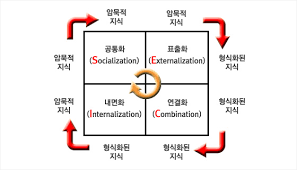
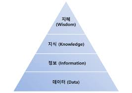
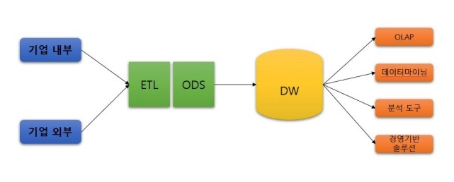

# 빅데이터분석기사

> Notion 원본: <https://www.notion.so/69a1e0f475b24ca8972718bdce4341ce>
> 동기화일: 2026-04-21

> 이미지 다운로드 실패 알림: 본 환경의 HTTP 프록시 정책상 S3 호스트 접근이 차단되어 이미지를 로컬로 내려받지 못했습니다. 본 문서 내부의 `` 링크는 Notion 원본 Pre-signed URL을 유지하며 약 1시간 내 만료됩니다.

원본 메인 페이지 구성:

- [이기적 필기](https://www.notion.so/10f9e7ad5c8440c7802fafc347af9d98)

아래는 1-depth 전개한 "이기적 필기" 하위 페이지 내용입니다.

---

## 이기적 필기

> Notion: <https://www.notion.so/10f9e7ad5c8440c7802fafc347af9d98>

# 빅데이터의 이해

빅데이터 개요 및 활용

데이터와 정보

- 데이터는 1646년 영국 문헌에 처음 등장하였으며, '주어진 것'이란 의미를 갖는 라틴어 dare(주다, to give)의 과거분사형으로 사용되었다.
- 데이터의 정의
  - 데이터는 추론과 추정의 근거를 이루는 사실이다
  - 현실 세계에서 관찰하거나 측정하여 수집한 사실이다
- 데이터의 특징
  - 단순한 객체로도 가치가 있으며 다른 객체와의 상호관계 속에서 더 큰 가치를 갖는다
  - 객관적 사실이라는 존재적 특성을 갖는다
  - 추론, 추정, 예측, 전망을 위한 근거로써 당위적 특성을 갖는다
- 데이터의 구분
  - 정량적 데이터(Quantitative Data) : 주로 숫자로 이루어진 데이터
  - 정성적 데이터(Qualitative Data) : 문자와 같은 텍스트로 구성되며 함축적 의미를 지니고 있는 데이터
  - 정량적 데이터와 정성적 데이터의 비교

    |  | 정량적 데이터 | 정성적 데이터 |
    | --- | --- | --- |
    | 유형 | 정형 데이터, 반정형 데이터 | 비정형 데이터 |
    | 특징 | 여러 요소의 결합으로 의미 부여 | 객체 하나가 함축된 의미 내포 |
    | 관점 | 주로 객관적 내용 | 주로 주관적 내용 |
    | 구성 | 수치나 기호 등 | 문자나 언어 등 |
    | 형태 | 데이터베이스, 스프레드시트 등 | 웹 로그, 텍스트 파일 등 |
    | 위치 | DBMS, 로컬 시스템 등 내부 | 웹 사이트, 모바일 플랫폼 등 외부 |
    | 분석 | 통계 분석 시 용이 | 통계 분석 시 어려움 |

- 데이터의 유형
  - 정형 데이터(Structured Data) : 정해진 형식과 구조에 맞게 저장되도록 구성된 데이터이며, 연산이 가능
  - 반정형 데이터(Semi-structured Data) : 데이터의 형식과 구조가 비교적 유연하고, 스키마 정보를 데이터와 함께 제공하는 파일 형식의 데이터이며, 연산이 불가능하다
  - 비정형 데이터(Unstructured Data) : 구조가 정해지지 않은 대부분의 데이터이며, 연산이 불가능하다
- 데이터의 근원에 따른 분류
  - 데이터의 수집과정은 데이터의 재생산 과정으로 볼 수 있으며, 원본 데이터로부터 재생산된 데이터는 가역 데이터와 불가역 데이터로 구분할 수 있다
    - 가역 데이터 : 생산된 데이터의 원본으로 일정 수준 환원이 가능한 데이터로 원본과 1:1 관계를 갖는다. 이력 추적이 가능하여, 원본 데이터가 변경되는 경우 변경사항을 반영할 수 있다.
    - 불가역 데이터 : 생산된 데이터의 원본으로 환원이 불가능한 데이터. 원본 데이터와는 전혀 다른 형태로 재생산되기 때문에, 원본 데이터의 내용이 변경 되었더라도 변경사항을 반영할 수 없다.
    - 가역 데이터와 불가역 데이터의 비교

      |  | 가역 데이터 | 불가역 데이터 |
      | --- | --- | --- |
      | 환원성(추적성) | 가능(비가공 데이터) | 불가능(가공 데이터) |
      | 의존성 | 원본 데이터 그 자체 | 원본 데이터와 독립된 새 객체 |
      | 원본과의 관계 | 1 대 1의 관계 | 1 대 N, N대 1 또는 M 대 N의 관계 |
      | 처리과정 | 탐색 | 결합 |
      | 활용분야 | 데이터 마트, 데이터 웨어하우스 | 데이터 전처리, 프로파일 구성 |

- 데이터의 기능
  - 과학적 발견은 개인의 암묵적 지식에 기초하는 경우가 많으며, 이를 활용하려면 데이터를 기반으로 한 암묵지와 형식지의 상호작용이 중요하다
    - 암묵지 : 어떠한 시행착오나 다양하고 오랜 경험을 통해 개인에게 체계화되어 있으며, 외부에 표출되지 않은 무형의 지식으로 그 전달과 공유가 어렵다
    - 형식지 : 형상화된 유형의 지식으로 그 전달과 공유가 쉽다
- 지식창조 매커니즘
  - 암묵지와 형식지 간 상호작용을 위한 일본의 경영학자 노나카 이쿠지로의 지식창조 매커니즘은 다음의 4단계로 구성된다
    - 공통화(Socialization) : 서로의 경험이나 인식을 공유하며 한 차원 높은 암묵지로 발전시킨다
    - 표출화(Externalization) : 암묵지가 구체화되어 외부(형식지)로 표현된다
    - 연결화(Combination) : 형식지를 재분류하여 체계화한다
    - 내면화(Internalization) : 전달받은 형식지를 다시 개인의 것으로 만든다.

      

- 데이터, 정보, 지식, 지혜
  - 데이터, 정보, 지식, 지혜는 인간의 사회활동 속에서 가치창출을 위한 일련의 프로세스로 연결되어 기능한다

    

  - 지혜(Wisdom) : 축적된 지식을 통해 근본적인 원리를 이해하고 아이디어를 결합하여 도출한 창의적 산물
  - 지식(Knowledge) : 상호 연결된 정보를 구조화하여 유의미한 정보를 분류하고 개인적인 경험을 결합시켜 내재화한 고유의 결과물
  - 정보(Information) : 데이터를 가공하거나 처리하여 데이터 간 관계를 분석하고 그 속에서 도출된 의미를 말하며, 항상 유용한 것은 아니다
  - 데이터(Data) : 현실 세계에서 관찰하거나 측정하여 수집한 사실이나 값으로 개별 데이터로는 그 의미가 중요하지 않은 객관적인 사실

데이터베이스

- 데이터베이스(DataBase)라는 용어는 1963년 6월에 컴퓨터 중심의 데이터베이스 개발과 관리라는 주제로 미국 SDC(System Development Corporation)가 개최한 심포지엄에서 공식적으로 사용되었다
- 데이터베이스의 정의
  - 체계적이거나 조직적으로 정리되고 전자식 또는 기타 수단으로 개별적으로 접근할 수 있는 독립된 저작물, 데이터 또는 기타 소재의 수집물
  - 데이터베이스는 소재를 체계적으로 배열 또는 구성한 편집물로서 개별적으로 그 소재에 접근하거나 그 소재를 검색할 수 있도록 한 것
  - 동시에 복수의 적용 업무를 지원할 수 있도록 복수 이용자의 요구에 대응해서 데이터를 받아들이고 저장, 공급하기 위하여 일정한 구조에 따라서 편성된 데이터의 집합
  - 문자, 기호, 음성, 화상, 영상 등 상호 관련된 다수의 콘텐츠를 정보 처리 및 정보통신 기기에 의하여 체계적으로 수집, 축적하여 다양한 용도와 방법으로 이용할 수 있도록 정리한 정보의 집합체
- 데이터베이스 관리 시스템(DBMS; DataBase Management System)
  - 데이터베이스를 관리하며 응용 프로그램들이 데이터베이스를 공유하며 사용할 수 있는 환경을 제공하는 소프트웨어
  - 데이터베이스 관리 시스템의 종류
    - 관계형 DBMS : 데이터를 열과 행을 이루는 테이블로 표현하는 모델
    - 객체지향 DBMS : 정보를 객체 형태로 표현하는 모델
    - 네트워크 DBMS : 그래프 구조를 기반으로 하는 모델
    - 계층형 DBMS : 트리 구조를 기반으로 하는 모델
  - SQL(Structured Query Language)
    - 데이터베이스에 접근할 때 사용하는 언어
    - 단순한 질의 기능뿐만 아니라 데이터 정의와 조작 기능을 갖추고 있다
    - 테이블 단위로 연산을 수행하며 초보자들도 비교적 쉽게 사용 가능
- 데이터베이스의 특징
  - 통합된 데이터(Integrated Data) : 동일한 데이터가 중복되어 저장되지 않음을 의미
  - 저장된 데이터(Stored Data) : 컴퓨터가 접근할 수 있는 저장매체에 데이터를 저장
  - 공용 데이터(Shared Data) : 여러 사용자가 서로 다른 목적으로 데이터를 함께 이용
  - 변화되는 데이터(Changed Data) : 데이터는 현시점의 상태를 나타내며 지속적으로 갱신
  - 데이터베이스의 장점
    - 데이터 중복 최소화
    - 실시간 접근 가능
    - 데이터 보안 강화
    - 논리적 및 물리적 독립성 제공
    - 데이터 일관성 제공
    - 데이터 무결성 보장
    - 데이터 공유 용이
  - 단점
    - 구축과 유지에 따른 비용 발생
    - 백업과 복구 등 관리 필요
- 데이터베이스의 활용
  - OLTP(OnLine Transaction Processing)
    - 호스트 컴퓨터와 온라인으로 접속된 여러 단말 간 처리 형태의 하나로 데이터베이스의 데이터를 수시로 갱신하는 프로세싱을 의미
      - 여러 단말에서 보내온 메시지에 따라 호스트 컴퓨터가 데이터베이스를 액세스 하고, 바로 처리 결과를 돌려보내는 형태
      - 현재 시점의 데이터만을 데이터베이스가 관리한다는 개념
  - OLAP(OnLine Analytical Processing)
    - 정보 위주의 분석 처리를 하는 것으로, OLTP에서 처리된 트랜잭션 데이터를 분석해 제품의 판매 추이, 구매 성향 파악, 재무 회계 분석 등을 프로세싱하는 것을 의미
      - 다양한 비즈니스 관점에서 쉽고 빠르게 다차원적인 데이터에 접근하여 의사결정에 활용할 수 있는 정보를 얻을 수 있게 하는 기술
    - OLTP와 OLAP의 비교

      | 구분 | OLTP | OLAP |
      | --- | --- | --- |
      | 데이터 구조 | 복잡 | 단순 |
      | 데이터 갱신 | 동적으로 순간적 | 정적으로 주기적 |
      | 응답 시간 | 수 초 이내 | 수 초에서 몇 분 사이 |
      | 데이터 범위 | 수 십일 전후 | 오랜 기간 저장 |
      | 데이터 성격 | 정규적인 핵심 데이터 | 비정규적 읽기 전용 데이터 |
      | 데이터 크기 | 수 기가바이트 | 수 테라바이트 |
      | 데이터 내용 | 현재 데이터 | 요약된 데이터 |
      | 데이터 특성 | 트랜잭션 중심 | 주제 중심 |
      | 데이터 액세스 빈도 | 높음 | 보통 |
      | 질의 결과 예측 | 주기적이며 예측 가능 | 예측하기 어려움 |

- 데이터 웨어하우스(DW; Data Warehouse)
  - 사용자의 의사결정에 도움을 주기 위하여 기간시스템의 데이터베이스에 축적된 데이터를 공통의 형식으로 변환해서 관리하는 데이터베이스
  - 데이터 웨어하우스는 일정한 시간 동안의 데이터를 축적하고 의사결정을 위한 다양한 분석 작업을 수행한다
  - 데이터 웨어하우스의 특징
    - 주제 지향성(Subject-orientation) : 고객, 제품 등과 같은 중요한 주제를 중심으로 그 주제와 관련된 데이터들로 구성된다
    - 통합성(Integration) : 데이터가 데이터 웨어하우스에 입력될 때는 일관된 형태로 변환되며, 전사적인 관점에서 통합된다
    - 시계열성(Time-variant) : 데이터 웨어하우스의 데이터는 일정 기간 동안 시점별로 이어진다
    - 비휘발성(Non-volatilization) : 데이터 웨어하우스에 일단 데이터가 적재되면 일괄 처리 작업에 의한 갱신 이외에는 변경이 수행되지 않는다
  - 데이터 웨어하우스의 구성

    

    - 데이터 모델(Data Model) : 주제 중심적으로 구성된 다차원의 개체-관계형(Entity Relation) 모델로 설계된다
    - ETL(Extract, Transform, Load) : 기업의 내부 또는 외부로부터 데이터를 추출, 정제 및 가공하여 데이터 웨어하우스에 적재한다
    - ODS(Operational Data Store) : 다양한 DBMS 시스템에서 추출한 데이터를 통합적으로 관리한다
    - DW 메타데이터 : 데이터 모델에 대한 스키마 정보와 비즈니스 측면에서 활용되는 정보를 제공한다
    - OLAP(Online-Analytical Processing) : 사용자가 직접 다차원의 데이터를 확인할 수 있는 솔루션
    - 데이터마이닝(Data Mining) : 대용량의 데이터로부터 인사이트를 도출할 수 있는 방법론
    - 분석 도구 : 데이터마이닝을 활용하여 데이터 웨어하우스에 적재된 데이터를 분석할 수 있는 도구
    - 경영 기반 솔루션 : KMS, DSS, BI와 같은 경영의사결정을 지원하기 위한 솔루션

빅데이터 개요

- 빅데이터는 기존 데이터보다 너무 방대하여 기존의 방법이나 도구로 수집/저장/분석 등이 어려운 정형 및 비정형 데이터들을 의미한다
  - 빅데이터는 일반적인 데이터베이스 소프트웨어로 저장, 관리, 분석할 수 있는 범위를 초과하는 규모의 데이터
  - 빅데이터는 다양한 종류의 대규모 데이터로부터 저렴한 비용으로 가치를 추출하고 데이터의 초고속 수집, 발굴, 분석을 지원하도록 고안된 차세대 기술 및 아키텍처이다.
  - 빅데이터는 대용량 데이터를 활용해 작은 용량에서는 얻을 수 없었던 새로운 통찰이나 가치를 추출해 내며, 나아가 이를 활용해 시장과 기업 및 시민과 정부의 관계 등 많은 분야에 변화를 가져오는 것이다
- 빅데이터의 등장과 변화
  - 빅데이터의 등장 배경
    - 디지털화, 저장 기술, 인터넷 보급, 모바일 혁명, 클라우드 컴퓨팅 등 관련 기술이 빠르게 발전하고 있다
      - 기업에서는 온-오프라인 고객 데이터가 많이 축적되면서 데이터에 숨어 있는 가치를 발견해 새로운 성장동력으로 활용되고 있다
        - 학계에서는 인간 게놈 프로젝트, 기후 관찰 등 거대 데이터를 다루는 학문 분야가 확산되면서 필요한 기술 아키텍처 및 분석 기법들이 발전하고 있다
  - 빅데이터의 등장으로 인한 변화
    - 데이터 처리 시점이 사전 처리(pre-processing)에서 사후 처리(post-processing)으로 이동

<!-- 원본 Notion 페이지는 여기서 절단되어 있습니다 (fetched 내용 기준). 이후 섹션(빅데이터 기술, 분석기획, 탐색, 모델링, 결과 해석 등)은 Notion 원본 <https://www.notion.so/10f9e7ad5c8440c7802fafc347af9d98> 에서 직접 확인하세요. -->
