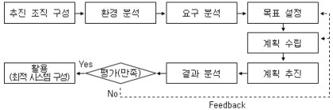
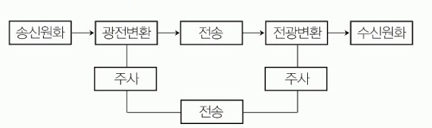
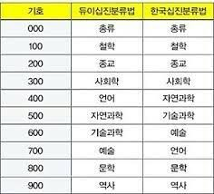

# 사무자동화 산업기사

> Notion 원본: <https://www.notion.so/1cb5a06fd6d380a3acddfa1ec1949382>
> 동기화일: 2026-04-21

> 이미지 다운로드 실패 알림: 본 환경의 HTTP 프록시 정책상 S3 호스트 접근이 차단되어 이미지를 로컬로 내려받지 못했습니다. 본 문서 내부의 `` 링크는 Notion 원본 Pre-signed URL을 유지하며 약 1시간 내 만료됩니다.

# 사무자동화 개념과 특징 

사무자동화의 개념

	- 사무자동화(OA; Office Automation)의 정의
		- 조직의 사무업무를 수행하기 위해 사무기능을 자동화한 것이다.
		- 컴퓨터 기술, 통신 기술, 시스템 과학, 행동과학을 적용하여 사무의 생산성을 높이는 일이다
		- 사무 근로자의 생산성을 높이기 위해 그들이 사용하는 장비에 수행하는 업무를 통합시키는 것이다 
		- 전사적, 장기적 관점에서의 사무생산성 향상과 창조적 인간능력 개선이다 
		- 기존의 자료 처리 기술로는 다루기 어렵고 자료 양이 많으면서도 명확하지 않은 사무업무에 대하여 컴퓨터 기술, 통신 기술, 시스템 공학, 행동 과학을 적용한 학문이다 
			- 시스템 과학을 적용하는 데 있어서 갖춰야 할 특징 : 반환(Feedback) 기능, 입/출력의 분석, 목적-목표의 계속적 추구, 질서 있는 전체로서의 추구
			- 행동 과학의 요소 : 사회학, 심리학, 인류학
	- 사무자동화의 ABCD
		- A : AUtomated Office(자동화 사무실)
		- B : Business Machine(사무기기)
		- C : Communication System(통신 시스템)
		- D : Data Processing System(자료 처리 시스템)

사무자동화의 등장 배경 요인

	- 사회적 요인
		- 정보화 사회의 출현으로 사무실에서 처리해야 할 정보의 대량화 및 다양화
		- 고학력화, 고령화로 인한 인구수, 연령분포, 교육연수의 변화
		- 사무관리의 질적인 효율성 필요
		- 사무업무에 대한 기존의 의식 변화
		- 정보산업으로의 발전 및 확대
	- 경제적 요인
		- 최대의 이익을 추구하기 위하여 정보의 최대 활용이 요구되는 경제 환경의 변화
		- 사무 부문의 비용 증가(인건비, 사무실 운영비, 문서 작성비/보관비 등)
		- 생상부문에 비해 사무부문의 생산정 증가 크게 저조
	- 기술적 요인
		- 하드웨어 기술의 발전
		- 소프트웨어 기술의 발전
		- 통신(네트워크) 기술의 발전

사무자동화의 특징과 주요 기능

	- 사무자동화의 특징
		- 사무자동화는 사용자 중심이어야 한다 
		- 사무자동화는 종합적인 체제로 구성되어야 한다
		- 사무자동화는 실제적인 개념이다
		- 사무자동화시스템의 구현이 성공하기 위해서는 사용자 집단의 거부 반응을 최소화해야 한다는 것이 공통된 의견이다
		- 인간과 기계 간의 인터페이스(Man-Machine Interface)이다 
	- 사무자동화의 목적
		- 사무 분야의 지적 생산성 향상
		- 사무처리의 질적 향상
		- 사무처리의 비용 절감
		- 사무처리의 시간 단축
		- 사무처리의 투명화
		- 효과적인 정보 관리
		- 정형적 업무의 자동화
		- 욕구의 다양화에 대처
		- 유효성 향상
		- 창조성 향상
	- 사무자동화의 주요 기능
		- 문서화(Documentation) 기능 : 문서의 작성, 배포, 보관의 신속화, 정확도의 향상을 위한 기능
		- 통신(Communication) 기능 : 통신망을 이용해 자료를 송수신하거나 상호 대화를 지원하는 기능
		- 정보(Information) 활용 기능 : 문자, 음성, 화상 정보 등의 다양한 정보를 활용하는 기능
		- 업무의 자동화(Automation) 기능 : 문서화 기능, 통신 기능, 정보 활용 기능을 유기적으로 결합시키는 기능
	- 사무자동화의 기본 요소
		- 철학(Philosophy) : 사무자동화에 대한 명료한 개념을 파악하고 계획 및 실천에 대한 확고한 신념과 의지를 가져야 한다
		- 장비(Equipment) : 사무자동화를 위해 필요한 사무기기등을 총칭하는 것으로, 하드웨어와 소프트웨어로 나눌 수 있다
		- 제도(System) : 오디오시스템, 비디오시스템, 경영관리 시스템 등 유형무형의 시스템이 수없이 많이 존재한다
		- 사람(People) : 사무자동화는 사무의 생산성을 높이기 위해 필요한 것인 만큼 사람은 모든 시스템의 주체가 될 수 있다
	- 자동화 시스템의 종류
		- OA(Office Automation, 사무자동화)
		- FA(Factory Automation, 공장자동화)
		- HA(Home Automation, 가정자동화)
		- SA(Sales Automation, 점포자동화)
		- MA(Management Automation, 관리자동화)
		- AA(Accounting Automation, 회계자동화)
	- 사무자동화의 최종 목적
		- 사무부분의 지적 생산성 향상에 있다
		- 사무부문의 지적 생산성 향상을 위한 접근 방법 : 사람, 조직 개편, 사무 작업 개선, 사무 환경 정비, 정보 시스템 확립

# 사무자동화 생산성 및 기대 효과 

사무자동화의 생산성

	- 생산성
		- 사무부문의 성과는 생산성으로 측정한다
		- 사무부문의 생산성은 간접적으로는 구할 수 있지만 직접적으로는 평가할 수 없다
		- 평가 기준을 명확하게 규정하기 어려운 경우가 많다
		- 성과가 투입의 시점에서부터 뒤늦게 나타난다
		- 사무 생산성 측정에 필요한 투입, 산출의 관계가 정확하지 못하다
		- 직접 산출효과 이외에 축적 산출효과가 있다
		- 사무 근로자의 지식, 경험의 영향이 크므로 산출 성과를 안정적으로 유지할 수 없다
	- 평가 기준
		- 효율성 
			- 시스템에 유입되는 투입량과 산출량의 양적 비율을 나타낸다
			- 사무업무를 적은 인원과 시간, 비용으로 처리하는 것
			- 한정된 자원으로 주어진 업무를 제대로 수행하는 것
		- 유효성
			- 사무업무에 있어서 산출물의 질적 개념으로 목표에 맞는 일을 수행했느냐의 여부 
			- 산출물의 정확성, 신속성, 확실성, 품질의 향상 등을 의미하며, 조직구성원의 행동적 측면과 많은 관련이 있다 
		- 창조성(인간성)
			- 사무실의 환경 향상, 직장의 활성화 등을 나타낸다
			- 근로자의 창조성 측정은 경제적 기준에 의해 쉽게 측정할 수 없다
		- 생산성
			- 효율성, 유효성 모두를 감안하므로 생산성은 측정이 어렵다
			- 양적, 질적 효과로 나누어진다 
	- 생산성 측정이 어려운 요인
		- 성과가 투입의 시점에서 나타나지 않고 늦게 나타난다
		- 효율성과 유효성 양면에 대한 평가 기준을 명확하게 규정할 방법이 없다
		- 사무 근로자의 지식과 경험의 영향이 커서 산출 성과를 안정적으로 유지하기 어렵다
	- 사무자동화시스템의 효율성
		- 매체 변환(Media Transformation)의 감소 : 자동화를 통해 매체 사이의 전송량을 줄일 수 있다
		- 부수적 기능(Shadow Function)의 감소 : 작업 시 오류를 줄여 주는 것을 의미한다. 예를 들어 데이터 입력 시의 오타나 전화 걸 때 전화번호를 잘못 누르는 것 등
		- 자동화(Automation)의 증가 : 인력을 이용해야 하는 작업을 기계로 자동화해서 인력 소모를 줄일 수 있다
		- 적시성(Timing)의 증가 : 대기시간 및 기회비용을 줄여 적절한 시간에 신속한 결정을 할 수 있다
		- 통제(Control)의 향상 : 적절한 통제를 이용해 양적으로 적은 정보로도 신속한 변화를 꾀할 수 있다

사무자동화의 기대 효과와 측정법

	- 사무자동화 기대효과
		- 생산성의 개선
			- 단위 시간당 작업량 증대
			- 업무의 정확성 증가
			- 사무기기의 고장 시간 감소
		- 조직의 최적화
			- 개인의 능력 향상
			- 단순 반복 업무의 감소
			- 공간의 효율적 사용
		- 경쟁력의 증대
			- 정보획득 시간의 단축
			- 의사결정의 신속화
			- 서비스의 개선
	- 기대효과의 분류
		- 정량적 효과
			- 인력의 능률적 활용
			- 공간의 효율적 사용
			- 업무 시간의 효율적 활용
			- 경쟁력 강화, PR 효과에 따른 매출액 증대
			- 재고, 설비, 금리 등에 대한 고정비, 간접비의 개선
		- 정성적 효과
			- 사무환경 개선에 따른 업무 만족도 증가
			- 기업 내에서의 사기 앙양으로 업무능률 향상
			- 대외 이미지의 개선
			- 시장 환경의 변화에 신속히 대처
			- 과거에 불가능했던 일이나 조사가 가능
			- 설문조사 등을 통해 간접적으로 평가하는 방법
	- 사무자동화의 효과 측정법
		- 투자-효율 산정법 : 투자이익효과 = 산출효과 / 투자비용으로 계산
		- 상대적 평가법 : 간접효과를 사무자동화 실시 전과 후의 연도, 부서별로 심사 분석 자료를 이용해 생산성 지표를 비교하는 방법
		- 정성적 평가법
			- 정량적으로 측정하기 어려운 자료를 설문조사 등을 이용해 간접적으로 평가하는 방법
			- 평가항목에는 양질의 문서작성과 신속성, 서비스 개선 및 향상, 사무처리의 정확성 및 의사 결정의 신속성-정확성, 사무처리 기계화에 의한 근무율 향상 등이 있다
	- 사무관리 관련 용어
		- POS(Point Of Sales) : 상점의 바코드리더 등을 이용하여 판매 시점의 자료를 온라인 시스템으로 공동이용하고 재고 관리 및 생산관리와 판매관리를 빠르게 처리하는 시스템
		- RTE(Real Time Enterprise) : 회사의 주요 경영정보를 통합 관리하기 위하여 기업 내-외부에 걸쳐 지속적인 프로세스 개선, 실시간 정보제공으로 업무 지연을 최소화하며 의사결정 속도를 높여 기업 경쟁력을 높인다
		- CT(Computer Telephony Intergration) : 컴퓨터를 통하여 전화, 팩스 등 통합하는 시스템으로 고객 정보를 데이터베이스화하여 기업의 전화 통제 시스템에 연동시키는 솔루션

# 사무자동화 추진 및 전략 

사무자동화의 접근 방식

	- 전사적 접근 방식
		- 사무자동화 대상의 모든 시스템과 전체적인 업무 기능 및 계층에 걸쳐 추진되는 방식이다
		- 사업 전반에 걸쳐 문제점이나 개선점을 분석, 정리하여 추진하는 방식
		- 작은 규모의 조직이나 신설되는 조직 혹은 조직 개편을 하고자 할 때 적당하다
		- 시스템 도입의 낭비를 줄일 수 있다
		- 검토 개시에서 시스템 구축 운용까지의 시간이 오래 걸린다
		- 경영자의 인식과 강한 리더십이 필요하고 사내 협력 추진 조직이 필요하다
	- 부분 전개 접근 방식
		- 먼저 적용할 특정 부문을 선정하여 사무자동화를 추진해 가는 접근 방식
		- 요구가 큰 부분을 먼저 추진한다
		- 추진하기 쉬운 업무부터 우선 추진한다
		- 전시효과가 큰 업무부터 먼저 추진한다
	- 공통 과제형 접근 방식
		- 모든 부문에서 공통으로 적용되는 영역을 대상으로 사무자동화를 추진하는 방식
		- 모든 부문을 대상으로 해서 효율성이 크지만 과제 선정이 어렵다
	- 기기 도입형 접근 방식
		- 필요한 부문에서 시험적으로 사무자동화 기기를 도입한 후 점차 확대해 나가면서 사무자동화를 추진하는 방식
		- 기기에 대한 부담감이 없지만 필요한 사무기기 선정에 어려움이 발생할 수 있다
	- 계층별 접근 방식
		- 업무의 계층 및 직위에 따라서 대상 범위를 점차 확대해 나가면서 사무자동화를 추진하는 방식
		- 경영층은 자동 보고시스템, 스케줄 관리, 회의 일정 관리부터 시작한다.
		- 사무원은 문서 작성, 파일 구축부터 시작한다
		- 신속한 의사 결정이 가능하고, 신뢰성이 높다
	- 업무별 접근 방식
		- 업무의 종류와 방향의 흐름에 따라 우선순위를 정하여 사무자동화를 추진하는 방식
		- 해당하는 업무에 대한 흐름 파악을 사전에 충분히 해야 한다
		- 해당하는 업무의 신속하고 정확한 처리가 가능하다

사무자동화의 수행 방식

	- 상향식 접근 방식(Bottom-Up Approach)
		- 기업의 최하위 단위부터 자동화하여 그 효과를 점차 증대시키는 방식
		- 업무 개선, 기계화, 재편성의 단계를 거쳐 자동화가 수행
		- 점진적인 사무자동화의 추진으로 기존 조직에 거부 반응이 최소화된다
		- 시행착오로 인하여 전체적인 비용이 증가하는 경우가 발생할 수 있다
		- 요구되는 사무자동화시스템을 구축하는 시간이 많이 소요된다 
	- 하향식 접근 방식(Top-Down Approach)
		- 전체 조직을 총괄 분석하여 사무자동화 방해 요인을 제거하고 최고 경영자가 요구하는 최적의 시스템을 구축할 수 있는 방식
		- 최고 경영자에게 필요한 정보를 즉시 제공할 수 있어서 실효성이 크다
		- 단기간에 구축할 수 있다
	- 전사적 접근 방식(Enterprise Approach)
		- 상향식 접근 방식과 하향식 접근 방식을 절충한 방식
		- 사무자동화 추진에서 최적 시스템을 구성하고 추진 효과를 극대화할 수 있는 방식

사무자동화의 추진

	- 사무자동화 추진의 선결 과제
		- 사무환경 정비, 사무관리 제도 개혁, 조직 및 체제의 재정비, 정보 시스템의 구축
	- 사무자동화 추진 단계
		
		- 환경 분석
			- 내적 환경 분석 : 사무구성원 분석, 사무기기 분석, 사무구조 분석
			- 외적 환경 분석 : 사무기기 생산업체, 소프트웨어 개발업체, 통신망 분석
		- 요구 분석
			- 사용자의 인적 요소에 관한 특성의 분석
			- 자동화기기의 기능과 특성에 관한 요구 분석
			- 기기 도입 후 관리 및 사용 효율화에 관한 분석
			- 요구 분석 방법 : 인적요소, 관리요소, 처리요소 
		- 목표 설정
			- 목표 설정의 기준 : 면밀한 계획과 조직의 편성, 목적의 명확화, 전 사원의 의식 개혁과 실천, 목표 실시에 따른 면밀한 분석, 검토가 필요하다
			- 목표 설정 방법
				- 수행 주체에 따른 목표
					- 개인 : 문서의 효율적인 보관, PC 이용 방법 등 개인적인 목표
					- 단위 사무실 : 정보의 공유화, 문서 작성의 중복 방지 등 단위 사무실에서의 목표
					- 조직 전체 : 부문 간의 중복된 정보처리 및 불필요한 정보의 집중을 지양하는 등의 조직 단위에서의 목표
				- 부분별 목표 설정
					- 최종 : 전체적인 균형 유지
					- 부분 구성 : 다른 구성 목표와의 연관성을 고려하여 결정
					- 세부 : 처리 방법 지정 등 계량적이고 구체적인 것
				- 시간에 따른 목표
					- 단기 목표 : 1 \~ 2년 이내에 실행 가능한 목표
					- 중기 목표 : 3 \~ 5년 이내에 실행 가능한 목표
					- 장기 목표 : 10년 이내에 실행 가능한 목표
				- 계획 수립 및 고려 사항
					- 계획 수립 내용 : 사무자동화를 위한 정보 수집, 사무자동화 대상 업무 결정, 구체적인 세부 목표 설정, 이용 자원에 대한 고려, 일정 계획표를 작성
					- 계획 수립 시 고려 사항 : 문제점의 이해와 의식, 목표 및 목적의 타당성, 현실성 및 추진 방법의 적정성을 고려
					- 구체적인 계획 사항 : 기업 모델 작성, 업무 모델 작성, 시스템화 계획안 작성, 업무별 정보 흐름도 작성, 시스템 구성도 작성 등
					- 수행 방법 결정 : 상향식, 하향식 또는 전사적 방법 중에서 가장 타당성이 있는 추진 방법을 선택
					- 사무기기 구성 방법 : 업무별 정보 흐름도와 업무 조사표 또는 설문 결과에서 나온 업무량을 중심으로 구성하여, 통합 시스템의 전체 조직에서 벗어나지 않도록 구성
					- 사무기기 선정 시 고려 사항 : 워드 프로세서나 PC 등과 같이 사무업무의 가장 기본이 되는 기기를 우선적으로 도입하고, 저렴한 비용으로 큰 효과를 낼 수 있는 것을 선택
				- 계획 추진
					- 사무자동화 기초 작업 단계(기반 조성 단계) : 규정의 정비, 문서의 형식, 문서의 규격, 용어의 통일, 코드의 표준화 등을 추진하는 단계
					- 적용 범위 확대 단계 : 기초 작업 단계에서 나타난 문제점을 보완하고 사무자동화 기기를 사용하여 문서 작성, 단순 계산 업무 등을 자동화시켜 나감
					- 공동 활용 단계(통신망 구축 단계) : 컴퓨터와 각종 기기를 접속하는 네트워크를 구성하여 조직원 간의 원활한 의사 전달과 정보 교환을 가능하게 함
					- 정보 시스템의 통합화 단계 : 사무자동화의 완성 단계로 정보처리 시스템, 각종 관리 시스템 및 사무자동화 시스템이 통합되고, 의사 결정 지원 시스템이 구축
				- 결과 분석
					- 각 단위 업무의 분석 
						- 모든 사무자동화 기기에 공통으로 적용되는 부분
						- 하드웨어의 구성요소의 검사와 소프트웨어의 기능 분석
					- 서브 시스템의 분석
						- 업무의 부분 최적화가 가능한지의 여부 판단
						- 계획과 일치하고 있는지를 검토
						- 추가적인 계선의 필요성에 대해서 분석
					- 총괄 시스템의 분석 : 기업 경영 전반에 걸쳐 충분한 지식을 가진 사람에 의해 분석되어야 함
				- 평가
					- 평가 기준 : 기기의 차원, 사용자의 차원, 조직적 차원, 대외적 차원 등으로 나누어 계획의 수행성과를 측정
					- 평가 종류 
						- 사전 평가 : 경제성 평가
						- 중간 평가 : 성능에 대한 분석
						- 사후 평가 : 시스템 가치, 기술적 평가, 운영에 대한 평가, 경제성 평가
				- 피드백(FeedBack) : 사무자동화 도입에 따른 결과 분석 및 과정에서 드러난 운용상의 문제점이나 미비점은 다시 추진 목표 및 계획 수립에 반영되도록 하는 것

과학적 사무자동화 계획

	- 사무자동화 계획과 추진에 시스템 과학과 행동 과학을 적용한다
	- 시스템 과학의 적용 : 사무실을 하나의 시스템으로 자동화된 사무실 시스템으로 전환하기 위해서는 사무실 시스템을 명확히 정의하고 분석하여야만 생산성을 극대화할 수 있다

사무자동화 추진 시 선결 과제

	- 사무환경 정비, 사무관리 제도 개혁, 조직 및 체제의 재정비, 정보시스템의 구축, 실시안의 결정, 도입교육 실시, 한계선 설정

사무자동화 추진 전략의 종류

	- 기술 집약 전략 : 발전하는 기술을 효율적으로 조직 내에 수용하는 문제
	- 응용 항목 전략 : 어떤 기술을 응용하여 우선순위를 어디에 둘 것인가의 문제
	- 측정 전략 : 생산성 측정의 문제
	- 실행 전략 : 시스템이 개발된 후 조직 내에 효과적으로 확산시킬 방안에 관한 문제
	- 관리 전략 : 설치될 여러 형태의 OA 장비들을 관리할 방침 및 절차에 관한 문제
	- 교육 전략 : 관리자 및 직원들에게 사무자동화에 대한 교육을 어떻게 시킬 것인가의 문제
	- 조직 전략 : 사무자동화 기능을 어떻게 조직할 것인가의 문제
	

사무자동화 추진 조직의 유형

	- 전문 조직 주도형
	- 프로젝트 주도형
	- 위원회 주도형
	- 사용자 주도형
	- 전산 부분 주도형

네트워크 조직(Network Organization)

	- 정의 
		- 전통적인 계층형 피라미드 조직의 경직성을 극복하기 위한 대안적 조직 운영 방식을 일컫는 개념
		- 조직의 위계 서열과는 무관하게 조직 구성원 개개인의 전문성, 지식에 근거한 자율권을 기초로 개인 능력 발휘의 극대화와 제반 기능 간, 사업부문 간 의사 소통의 활성화를 도모하기 위한 신축적인 조직 운영 방식
		- 외부 자원 활용을 통해 유연성을 확보하는 기업 간 네트워크를 지칭하는 의미로 사용
	- 장점
		- 계층이 거의 없고, 조직 간의 벽도 없으며, 부문 간 교류가 활발하게 이루어짐
		- 조직 구성원들에게 자율과 책임에서 오는 참여 정신과 창의성 발휘를 극대화
		- 빠르고 신속한 업무 처리가 가능
	- 단점
		- 계층제(피라미드형)에 비해 소속감이 낮음
		- 상대방에 대한 의존도가 강화되고 구성원들이 고정화 되어 네트워크 전체가 폐쇄화되고 유연성이 저하

비즈니스 인텔리전스(BI)

	- 기업에서 사용하는 소프트웨어군으로 기업 업무를 보다 합리적으로 이끌어 갈 수 있다
	- 주로 중간관리자와 지식노동자에게 복잡하고 일상적이지 않은 결정들에 대한 컴퓨터 지원 기반을 제공하는 시스템

# 사무자동화 경영 관리 

경영 정보 시스템(MIS)

	- 경영 정보 시스템의 정의
		- 기업의 내/외부의 비즈니스, 데이터를 수집해서 가공하고 기업을 관리하는 모든 계층 사람들의 의사결정에 필요한 정보를 제공해 주는 시스템
		- 경영 의사결정에 필요한 정보를 공급하기 위하여 다양한 공급원들로부터 자료를 통합할 수 있는 형식화된 컴퓨터 정보 시스템
		- 경영진과 관리진에게 투자, 판매, 보수, 자본계정, 환수계정 등 경영 정보를 제공하는 자료의 처리 시스템
	- 경영 정보 시스템의 특징
		- MIS는 기업의 전략, 계획, 조정, 관리, 운영 등의 결정을 보조하는 특징을 가지고 있다
		- MIS의 전문성은 기업의 업무를 분석하고 기업 경영을 진단하는 능력
		- MIS는 분석과 진단에 의해 기업 업무의 정보 요구가 정의되어야 하고, 정의된 정보를 효율적으로 처리할 수 있는 시스템을 개발하고 관리하는 특징을 갖고 있다
		- MIS는 의사결정 지향적이며 요약된 정보를 가지고 있다. 또한 예측 및 통제 지향적이다
	- 경영 정보 시스템의 기본 구성
		- 의사결정 지원 시스템
		- 프로세스 서브 시스템
		- 데이터베이스 서브 시스템
		- 통신 서브 시스템
		- 거래 처리 시스테
		- 중역 정보 시스템

의사 결정 지원 시스템(DSS)

	- 의사결정 지원 시스템의 정의
		- 의사결정에 필요한 정보를 데이터베이스로부터 검색 하여 필요한 분석을 하고 보기 쉬운 형태로 편집, 출력 해 주는 시스템이다
	- 의사결정 지원 시스템의 특징
		- 초기 시스템은 주로 반구조적, 비구조적 문제를 해결하기 위해 사용된다
		- 전통적인 데이터 처리와 경영과학의 계량적 분석기법을 통합하여 사용된다
		- 의사결정자가 신속하고 다양하게 문제를 해결할 수 있는 정보시스템 환경을 제공한다
	- 인소프(H.I. Ansoff)에 의한 기업의 의사결정
		- 전략적 의사결정(Strategic Decision)
		- 업무적 의사결정(Operating Decision)
		- 관리적 의사결정(Adminstrative Decision)

경영 관리 시스템

	- 전사적 자원 관리(ERP)
		- 기업 경영에 필요한 모든 자원의 흐름을 언제든지 정확히 추출하여 기업에서 소요되는 자원의 효율적인 배치와 평가를 목적으로 한다
		- 전 부문에 걸쳐 있는 경영자원을 최적화된 방법으로 통합하는 통합 정보 시스템이라 할 수 있다
		- 응용 시스템에 속하고 피라미드 구조를 이루고 있지 않다
	- 고객관계관리(CRM)
		- 기업이 고객관계를 관리해 나가는 데 필요한 방법론이나 소프트웨어 등을 가리킨다
		- 현재의 고객 및 잠재 고객에 대한 내외부 자료를 정리, 분석해 마케팅 정보로 변환함으로써 고객의 구매 관련 행동을 지수화하고, 이를 바탕으로 고객 특성에 맞게 마케팅 활동을 펼치는 고객 중심의 경영 기법
	- 기업 애플리케이션 통합(EAI; Enterprise Application Integration)
		- 기업 내의 컴퓨터 애플리케이션들을 현대화하고, 통합하고, 조정하는 것을 목표로 세운 계획, 방법 및 도구 등을 가리킨다
	- 6시그마(6Sigma)
		- 제네럴일렉트릭의 잭 웰치(Jack Welch)에 의해 유명해진 품질경영 혁신기법
		- 기업에서 전략적으로 완벽에 가까운 제품이나 서비스를 개발하고 제공하려는 목ㅈ거으로 정립된 품질경영 기법

데이터 웨어하우스

	- 데이터웨어하우스
		- 업무를 처리하느 시스템을 온라인 트랜잭션 시스템(OLTP)이라고 한다. OLTP에 의해 구축된 정보를 기업의 업무적인 요구에 따라 다양한 관점으로 분석하여 보여 주는 시스템
		- 필요한 데이터를 추출하여 기업 경영 분석 자료와 의사 결정에 도움을 주기 위한 시스템
		- 주체지향적이며, 시간에 따라 변화한다. 또한 향존적인 특징이 있다
	- 데이터웨어하우징
		- 데이터웨어하우스를 이용하여 유용한 자료를 추출하는 일련의 과정
	- 데이터마이닝
		- 업무를 처리하는 시스템을 온라인 트랜잭션 시스템(OLTP) 이라고 한다. OLTP에 의해 구축된 정보를 기업의 업무적인 요구에 따라 다양한 관점으로 분석하여 보여 주는 시스템
		- 필요한 데이터를 추출하여 기업 경영 분석 자료와 의사 결정에 도움을 주기 위한 시스템
		- 주체지향적이며, 시간에 따라 변화한다. 또한 향존적인 특징이 있다
	- 데이터웨어하우징
		- 데이터웨어하우스를 이용하여 유용한 자료를 추출하는 일련의 과정
	- 데이터마이닝
		- 대량의 자료에서 유용한 정보를 찾아내어 그 데이터 사이의 연관 관계를 분석해 미래에 대한 예측을 가능하게 하는 것
	- 데이터마트
		- 비용과 시간이 많이 드는 데이터웨어하우스를 작은 크기로 구축하는 것

# 하드웨어 기술-CPU와 I/O 

중앙처리장치(CPU)

	- 중앙처리장치의 개념
		- 컴퓨터의 각 부분의 동작을 제어하고 연산을 수행하는 핵심적인 장치
		- 중앙처리장치에 해당하는 부분을 하나의 대규모 집적회로의 칩에 내장시켜 기능을 수행하게 하는 것을 마이크로프로세서(Microprocessor)라고 한다.
		- 제어장치, 연산장치, 기억장치(레지스터) 등으로 구성되어 있다
	- 제어 장치(Control Unit)
		- 입력장치, 기억장치, 연산장치, 출력장치에 동작을 명령, 감독, 통제하는 장치
		- 주기억장치에 기억된 명령을 꺼내서 해독하고, 시스템 전체에 지시 신호를 보낸다
		- 명령어 해독기, 프로그램 카운터, 명령어 레지스터, 주소 레지스터 등으로 구성된다. 
	- 연산장치(ALU; Artihmetic Login Unit)
		- 산술 및 논리연산을 수행하는 장치이며 연산 수행에 필요한 제어신호는 제어장치에서 통제한다
		- 누산기, 가산기, 보수기, 레지스터 등으로 구성된다.
	- 레지스터(Register)
		- 중앙처리장치가 데이터를 처리하는 동안 사용할 값이나 중간 결과를 일시적으로 저장해 두는 중앙처리장치 내의 고속기억장치
		- 누산기(Accumulator) 
			- 산술 및 논리연산의 결과를 일시적으로 기억하는 레지스터
		- 프로그램 카운터(Program Counter)
			- 프로그램의 실행 순서를 지정하는 데 필요한 특수 목적 레지스터
			- 다음에 실행하게 될 명령어가 기억된 주기억장치의 번지를 기억하고 있다
		- 명령 레지스터(Instruction Register)
			- 현재 실행 중인 명령어를 기억하고 있는 레지스터
	- CPU의 명령어 사이클(Instruction Cycel)
		- Fetch Cycle(인출 사이클) : 주기억장치에 기억된 명령어를 호출하여 중앙처리장치로 가져오도록 하는 명령어 호출 사이클. 한 명령의 실행 사이클 중에 인터럽트 요청을 받아 인터럽트를 처리한 후 CPU가 다음에 수행하는 사이클
	- Indirect Cycle(간접 사이클) 
		- 해독된 명령의 주소가 간접 주소일 경우 유효 주소를 구하는 사이클
	- Execute Cycle(실행 사이클) 
		- 실제로 명령이 실행되는 사이클
	- Interrupt Cycle(인터럽트 사이클) 
		- 인터럽트가 발생하면 처리하는 사이클

입-출력 기술

	- 맨-머신 인터페이스(Man-Machine Interface)
		- 인간이 기계를 조작할 때 공유 영역으로서 상호 의사전달이 이루어지는 것
		- 의사전달의 수단으로 도구나 기계를 사용하는 것
		- 입력 및 표시장치 등을 통하여 가능
		- 입력, 출력 및 이들 기기의 이용 소프트웨어 등의 기술로 이루어진다
	- 입력 기술(입력장치)
		- 스캐너(Scanner)
			- 정지 화상 자료를 컴퓨터 내의 자료 표현 방식으로 바꾸어 주는 입력장치
		- 디지털 카메라(Digital Camera)
			- 광학 영상을 필름에 기록하지 않고 전자 데이터로 변환시켜 플래시 메모리(Flash Memory)와 같은 보조기억장치에 저장하는 장치
		- 디지타이저(Digitizer)
			- 문자나 그림, 설계도면을 읽어 디지털 신호로 변환시켜 컴퓨터 내부로 입력하는 장치
			- 태블릿(Tablet)과 스타일러스 팬(Stylus Pen)으로 구성된다
		- OMR(광학 마크 판독기)
			- 빛을 이용하여 카드에 마킹된 부분을 판독하는 장치
		- OCR(광학 문자 판독기)
			- 인쇄되거나 손으로 쓴 문자에 빛을 쬐어 반사되는 양으로 정보를 입력하는 장치
		- MICR(자기 잉크 문자 판독기)
			- 자기적으로 인쇄된 독특한 모양의 문자를 인식하는 것으로 은행 업무용으로 표준화되어 널리 사용되고 있는 입력장치
		- BCR(바코드 판독기)
			- 빛을 이용하여 굵기가 서로 다른 바코드를 판독하는 장치
	- 출력 기술(출력장치)
		- 모니터(Monitor)
			- 해상도가 높을수록 모니터에 나타나는 영상은 선명하다
			- DPI(Dot Per Inch) : 모니터 등의 디스플레이나 프린터의 해상도 단위이며 1인치당 몇 개의 도트(점)가 들어가는지를 의미한다
			- 픽셀(Pixel) : 화면을 이루는 최소의 단위로서 그림의 화소라는 뜻을 의미하며 픽셀 수가 많을수록 해상도가 높아진다
			- CGA → EGA → VGA → SVGA → XGA 순으로 해상도가 높다
		- 프린트(Printer)
			- 충격식 프린터 : 도트 프린터, 라인 프린터
			- 비충격식 프린터 : 잉크젯 프린터, 열전사 프린터, 레이저 프린터
		- 플로터(Plotter)
			- 그래프나 도형, CAD, 도면 등을 출력하기 위한 대형 출력장치
	- 채널(Channel)
		- CPU의 부담을 덜기 위해 독립적으로 입출력장치와 기억장치 간의 데이터의 입출력을 제어하는 장치
		- 전체 시스템의 입출력 처리 속도를 향상시킨다
		- 선택 채널(Selector Channel) :고속의 입출력장치 제어
		- 다중 채널(Multiplexer Channel) : 저속의 입출력장치 제어
		- 블록 다중 채널(Block Multiplexer Channel) : 선택 채널 + 다중 채널 제어

# 하드웨어 기술 - 기억 장치 

주기억장치

	- ROM(Read Only Memory)
		- 기억된 내용을 읽을 수만 있는 기억장치
		- 기억된 내용은 전원이 끊어져도 지워지지 않는다 (비휘발성)
			- Mask Rom : 반도체 공장에서 내용이 기억되며, 읽기만 가능한 ROM
			- PROM(Programmable ROM) : 사용자가 원하는 프로그램을 한 번 기억시키면 지울 수 없는 ROM
			- EPROM(Erasable Rom)
				- 사용자가 임의로 내용을 지우고 다시 프로그램을 기억할 수 있다.
				- UVEPROM(Ultra-Vlolet EPROM) : 자외선으로 지운다
				- EEPROM(Electrically EPROM) : 전기적으로 지운다
	- RAM(Random Access Memory)
		- 읽기/쓰기가 자유롭고 기억된 내용은 전원이 끊어지면 지워진다. 
		- 재충전 여부에 따라 DRAM과 SRAM으로 구분된다 
		- DRAM(Dynamic RAM, 동적 램) : 전원이 계속 공급되더라도 주기적으로 재충전(Refresh)되어야 기억된 내용을 유지할 수 있는 기억 소자
		- SRAM(Static RAM, 정적 램) : 전원만 공급되면 재충전 없이도 기억된 내용을 유지할 수 있는 기억 소자이고 캐시 메모리 등에 사용된다.

보조기억장치

	- 자기테이프(Magnetic Tape)
		- 플라스틱 테이프의 표면에 자성 물질을 입힌 것이며 순차적 접근만 가능하다
		- 대량의 자료를 장시간 보관하는 데 유리하고 블록 단위로 데이터를 전송한다
		- 블록화 인수(Blocking Factor) : 하나의 블록을 구성하는 레코드의 개수로, 블록 크기를 레코드 크기로 나눔으로써 구할 수 있다
	- 자기디스크(Magnetic Disk)
		- 자성 물질을 입힌 금속 원판을 여러 장 겹친 것
		- 순차적 접근과 직접 접근이 모두 가능
		- 용량이 크고 접근 속도가 빠름
		- 자기디스크 접근 시간 (Access Time) = 탐색 시간(Seek Time) + 회전 지연 시간(Rotational Latency Time) + 전송 시간(Transmission Time)
		- 트랙(Track) : 디스크 표면의 동심원
		- 섹터(Sector) : 트랙 일부분으로 데이터가 저장되는 기본 단위
		- 실린더(Cylinder) 
			- 같은 트랙의 모임(실린더 수 = 트랙 수)으로, 논리적인 개념
			- 동일한 수직 선상의 트랙들의 집합
			- 디스크 팩의 사용 가능한 실린더 수 = 트랙 수
		- 클러스터(Cluster) : 몇 개의 섹터를 묶은 것으로, 실제 데이터를 읽고 쓰는 단위
		- 엑세스 암(Access Arm) : 데이터에 접근하기 위한 장치
		- 읽기/쓰기 헤드(Read/Write Head) : 데이터를 읽어 내거나 쓰는 장치
		- 디스크 팩(Disk Pack)
			- 여러 장의 디스크를 하나의 축에 고정시켜 사용하는 것
			- 윗면과 밑면은 정보를 기억하지 않는 보호면으로 사용
			- 사용 가능한 면 = 총 디스크 수 X 2 면 - 윗면 - 밑면
		- 플로피 디스크(Floppy Disk) 
			- 얇은 플라스틱 원판에 자성체를 입혀 정보를 기억시키는 장치
			- 소규모의 데이터를 저장하는 데 사용
			- 용량 = 기록면 수 X 트랙 수 X 섹터 수 X 섹터당 바이트 수
		- 하드 디스크(Hard Disk)
			- 디스크들이 레코드판처럼 겹쳐져 구성
			- 대량의 데이터를 저장하고 비교적 빠르게 접근 가능
		- RAID 
			- 여러 하드 디스크를 하나의 저장 장치처럼 사용하는 것
			- 동일한 데이터를 다른 위치에 중복해서 저장하는 방법
		- NAX(Netwrok - Attached Storage)
			- 컴퓨터 네트워크에 연결된 파일 수준의 데이터 저장 서버
			- 다른 네트워크 클라이언트에 데이터 접근 권한을 제공하는 시스템
	- 광디스크(Optical Disk)
		- 광학적 방식의 정보 저장 및 추출 방식 중 하나
		- 기록이 안정적이고 대용량으로 동화상 정보 저장에 이용되며, 중요한 데이터를 백업할 때 많이 사용
		- 데이터의 안정성과 신뢰성이 우수하며 데이터의 영구보존이 가능
		- 자기디스크의 10배 이상의 대량 정보 기록 가능
		- 종류 : CD-ROM, CD-R, CD-R/W, DVD, HD-DVD, 블루레이 디스크
	- WORM(Write Once, Read Many) 디스크
		- 안전이나 법적인 이유로 한 번 기록된 후에는 변경해서는 안 될 자료, 즉 은행이나 중개소의 거래내역이나 이미지, 문서 등의 저장 시에 주로 이용
	- Blu-ray
		- 디지털 비디오 디스크(DVD) 보다 약 10배를 저장할 수 있는 용량의 청자색 레이저를 사용
		- DVD가 650mm 파장의 적색 레이저를 사용하는 데 비해 블루 레이 디스크는 좀 더 좁은 405mm 파장의 청자색 레이저를 사용하며 다중 레이어(면)을 이용할 수 있다
		- 한 면에 최대 27GB, 듀얼은 50GB, 쿼드 레이어는 100G 데이터를 기록한다
	- CAV 등각 속도(Constant Angular Velocity) 광디스크 검색 방식
		- 언제나 회전 속도가 일정해 스핀들 모터에 무리가 없으며 한 바퀴 도는 동안 최외각에서 읽어 들이는 데이터양이 최내각에서 읽어 들이는 것보다 2.5배가 많고 디스크 저장 공간이 비효율적으로 사용된다. 속도가 가변적이고 최대속도만 표기한다 
	- CLV 등선 속도(Constant Linear Velocity) 광디스크 검색 방식
		- CD 안쪽과 바깥쪽은 원주 길이에서 2.5배 차이로 인해 재생할 떄 RPM이 유동적으로 바뀌며 데이터를 읽어 들이는 속도가 언제나 일정하다
	- LTO(Linear Tape-Open, 개방 선형 테이프)
		- 고속 데이터 처리와 대용량 형식으로 만들어진 백업용 개방 테이프 시스템. Accelis 방식과 Ultrium 방식이 있다
		- 240MB/S의 속도를 갖는다
		- 순차접근방식의 저장장치
	- SSD(Solid State Drive)
		- 반도체를 이용하여 정보를 저장하는 장치. 하드디스크 드라이브에 비하여 속도가 빠르고 기계적 지연이나 실패율, 발열, 소음도 적으며 소형화, 경량화할 수 있는 장점이 있다
	- USB 메모리(Universal Serial Bus Memory)
		- 컴퓨터와 주변 기기를 연결하는 데 쓰이는 입출력 표준 중 하나이며, 기존의 다양한 방식의 연결을 대처하기 위해 만들었다
		- 외부 전원을 이용하지 않고도 쉽게 주변 기기를 사용할 수 있다
		- IBM에서 제창한 규격
		- USB 방식으로 연결된 주변 기기는 대부분 핫 플러그를 지원한다
	- 핫 플러그(Hot Plug)
		- 컴퓨터의 전원이 켜진 상태에서도 외부장치의 탈착이 가능하도록 지원
	- USB OTG(Universal Serial Bus On-The-Go)
		- 메인 컴퓨터의 개입 없이 스마트폰, MP3 플레이어 등과 같은 포터블 장치 간 동작될 수 있도록 수정된 USB 규격
	- 전자 파일링 시스템(Electronic Filling System)
		- 파일링 시스템
			- 개념 : 필요한 서류를 필요한 때에 바로 꺼낼 수 있도록 서류를 체계적으로 정리, 보관, 폐기하는 일련의 제도
			- 도입 효과(도입 목적)
				- 문서 관리의 명확화, 정보 전달의 원활화
				- 정확한 의사 결정, 기록의 효과적 활용
				- 공용 파일에 대하여 개인 물건화 방지
				- 사무환경의 정리
				- 중복 문서의 제거, 불필요한 문서의 폐기
				- 신속한 검색 활용의 용이(시간 절약), 기록 활용에 대한 제비용 절감
				- 보존, 보관, 폐기를 정기적으로 실시함에 따라 업무상 필요한 기록의 보존 및 폐기가 용이
		- 전자 파일링 시스템
			- 저장 매체로 자기 기록형, 마이크로필름, 광 디스크 등을 사용
			- 고밀도의 기억이 가능하며, 보안성 및 즉시성, 고속의 검색 기능, 저렴한 가격, 통신 기능 등을 가짐
			- 자료의 저장도 중요하지만 저장된 자료의 갱신도 중요하므로 갱신 시기 및 책임자 등에 관해 명백한 사항을 명시하고, 자료의 관리 체제, 보안 문제 등에 관한 절차와 방법을 마련해야 함

기억장치의 특징

	- 기억장치 접근 속도
		- 레지스터 \> 캐시 \> 램 \> 롬 \> 자기디스크 \> 광디스크 \> 플로피디스크 \> 자기테이프
	- 기타 기억장치 
		- 캐시 메모리(Cache Memory) : 주기억장치와 CPU의 속도 차이를 줄여 처리의 효율을 높이기 위한 목적으로 사용
		- 연관 메모리(Associative Memory) : 저장된 내용을 이용해 접근하는 기억장치로, CAM(Content Addressable Memory) 이라고도 한다
		- 가상 메모리(Virtual Memory) : 주기억장치의 부족한 용량을 해결하기 위해 보조기억장치를 주기억장치처럼 사용하는 기법
	- 기억 용량 단위
		- 1KB = 1,024 Byte
		- 1MB = 1,024 KB
		- 1GB = 1,024 MB
		- 1TB = 1,024 GB
		- 1PB = 1,024 TB
	- 평균고장간격(MTBF; Mean Time Between Failures)
		- 신뢰도 척도로서 수리 가능한 장치의 첫 번째 고장에서 다음 고장의 사이 시간
		- 수리 완료 시간부터 다음 고장까지 정상적으로 작동하는 시간의 평균 값
		- MTTR(Mean Time To Repair) : 평균 수리 시간
		- MTTF(Mean Time To Failure) : 평균 가동 시간
		- MTBF(Mean Time Between Failures) : 평균 무고장 시간
			- MTBF = MTTF + MTTR
		- 신뢰도(가동률) = MTBF/(MTBF+MTTR)
		- MTTF / (MTTF+MTTR)

# 소프트웨어 기술 

시스템 소프트웨어의 특징

	- 시스템 소프트웨어(System Software)
		- 컴퓨터를 사용할 때 가장 기본적으로 필요한 소프트웨어로, 응용 소프트웨어의 기초가 된다
		- 운영체제, 컴파일러, 링커, 로더 등이 있다
	- 운영체제의 구성
		- 제어프로그램 : 감시프로그램, 작업관리프로그램, 데이터관리프로그램
		- 처리프로그램 : 언어번역프로그램, 서비스프로그램, 문제처리 프로그램
	- 운영체제의 성능평가 항목
		- 처리 능력, 반환 시간, 사용 가능도
	- 운영체제의 종류
		- PC용 : Windows 7, Linux, MacOS, MS-DOS
		- 서버용 : Windows Server 2008, Linux, Unix
		- 네트워크용 : Netware, Banyan VINES, LAN-Manger
		- 스마트폰용 : iOS, Android, Symbian, WIndows Mobile, Black Berry

응용 소프트웨어와 기타 소프트웨어

	- 응용 소프트웨어(Application Software)
		- 특정한 작업을 수행할 수 있도록 사용자가 개발한 프로그램
		- 워드프로세서, 스프레드시트, 데이터베이스, 그래픽 프로그램 등이 있다
	- 통합화 소프트웨어 패키지
		- 퍼스널 컴퓨터상에서 표 계산 및 워드프로세스 기능등을 한 개의 프로그램으로 처리할 수 있도록 한 것
		- 상호 간에 파일을 공유할 수 있도록 한다
		- 처리 도중에 별개의 기능을 사용해서 결과를 결합시켜 사용하기 편리하다
	- 비용 지불 방법에 따른 소프트웨어 분류
		- 데모 버전(Demo Version) : 어떤 기능을 가졌는지 소개하기 위해 제작한 소프트웨어
		- 프리웨어(Freeware) : 누구나 자유롭게 사용할 수 있는 소프트웨어로 기간 및 기능에 제한이 없다
		- 세어웨어(Shareware) : 시험 삼아 사용한 후 필요하다고 느껴 대가를 지급하는 것을 전제로 무료로 배포하는 소프트웨어
		- 상용 소프트웨어(Commercial Software) : 상업을 목적으로 돈을 받고 판매하는 정식 버전의 소프트웨어

소프트웨어 용어

	- 자연어(Natural Language)
		- 일반적으로 기계가 아닌 사람이 사용하는 언어
	- 무손실 압축
		- 멀티미디어 정보에서 의학용 영상 등과 같은 정확성이 요구되는 데이터들의 압축에 주로 사용되는 비트 보존 압축 기법
		- 압축된 데이터를 복원했을 때 원래 데이터와 모든 비트가 일치한다
	- 손실 압축
		- 압축된 데이터를 다시 복원했을 때 일부 데이터가 손실되는 압축 기법
		- 일반적으로 영상이나 음성 파일의 크기를 원래의 5%까지 압축 가능하다
	- 멀티미디어 압축 기술
		- GIF(Graphic Interchange Format) : 이미지의 전송을 빠르게 하기 위하여 압축 저장하는 방식으로 저장할 수 있는 이미지가 256색상으로 제한되어 있다
		- PNG(Portable Network Graphics) : 비손실 그래픽 파일 포멧의 하나로 GIF 포맷의 문제점을 개선하기 위해 고안되었다.
		- JPEG(Joint Photographic Experts Group) : 정지화상 압축에 대한 ISO 국제 표준안
		- MPEG(Moving Picture Experts Group) : 동화상 압축에 대한 ISO 국제 표준
			- MPEG-1 : 가정용 VTR 수준의 품질 영상을 제공하기 위한 표준
			- MPEG-2 : 저장매체인 DVD에서 특히 영상 데이터 저장 시 적용되는 압축 기술
			- MPEG-4 
				- 양방향 멀티미디어를 구현할 수 있는 화상 통신을 위한 동영상 압축 기술
				- 64kbps 급의 초저속 고압축률 실현을 목적으로 하고 있다
			- MPEG-7 : 동영상 데이터 검색이나 전자상거래 등에 적합하도록 개발된 차세대 동영상 압축 재생기술
		- MHEG(Multimedia and Hypermedia Information conding Experts Group) : 멀티미디어나 하이퍼미디어에서 사용되는 데이터 부호화-압축 방식의 국제 표준
	- MPEG 표준 분류
		- MPEG-A : 멀티미디어 애플리케이션 포맷(MAF)을 위한 표준
		- MPEG-B : 시스템 표준 분류를 위한 MPEG 표준
		- MPEG-C : 비디오 표준 분류를 위한 MPEG 표준
		- MPEG-D : 오디오 표준 분류를 위한 MPEG 표준 
		- MPEG-E : 멀티미디어 미들웨어를 위한 표준
	- MID(Musical Instrument Digital Interface)
		- 신시사이저, 리듬머신 등 컴퓨터 음악 연주에 사용되는 장비를 연결하기 위한 전송 규격
	- indeo 
		- 인텔사에 의해 개발된 비디오 코덱. 초기 버전은 마이크로소프트사의 AVI 코덱 수준

# 통신 응용 기술 

정보 처리 시스템의 특징

	- 정보 처리 시스템
		- 정보 처리 시스템은 자료(Data)를 입력받아 처리(Processing) 과정을 거쳐 정보(Information)로 변환하는 시스템
	- 정보 처리 시스템의 발전 과정
		- 비집중 처리 시스템 → 집중 처리 시스템 → 분산 처리 시스템
		- 비집중 처리 시스템
			- 자료가 발생하는 곳에서 자료를 직접 처리하는 시스템
			- 단일 처리 시스템이라고도 한다
			- 자원과 데이터 공유가 불가능
		- 집중 처리 시스템
			- 모든 처리를 담당하는 중앙 컴퓨터와 데이터 입출력을 담당하는 단말기로 구성된 시스템
			- 전사적 관리가 용이
			- 회선 비용이 적게 든다
			- 중앙에 전산 개발 및 운영 요원이 주도적으로 운영하는 방식으로 다수의 인력이 필요하지만, 수준 높은 전산 요원이 부족
			- 소프트웨어 개발이 집중됨으로 인하여 제한된 개발 인력의 한계로 소프트웨어 개발의 저생산성 문제가 발생할 수 있다
			- 중앙 컴퓨터로 부하가 집중되는 관계로 대용량의 컴퓨터가 필요
		- 분산 처리 시스템
			- 여러 대의 컴퓨터들에 의해 작업들을 나누어 처리하고 그 내용이나 결과를 통신망을 이용하여 상호 교환되도록 연결된 시스템
			- 사용자 중심의 시스템
			- 자원과 데이터 공유가 가능
			- 처리 능력(생산성)이 향상된다
			- 조직 요구에 대한 대응이 용이
			- 시스템의 신뢰성, 유연성, 확장성이 우수
			- 보안성이 떨어진다
		- 분산 처리 시스템의 형태
			- 계층형 분산 처리 시스템
			- 수평형 분산 처리 시스템
			- 혼합형 분산 처리 시스템
			- 분산 데이터 입력 시스템

정보 통신 시스템

	- 통신망 기술
		- LAN(Local Area Network, 근거리 통신망) : 구내 등 비교적 제한된 지역에 설치되어 있는 컴퓨터가 각종 단말기기와 고속 전송로를 사용하여 접속한 통신망
		- WAN(Wide Area Network, 광역 통신망) : 넓은 지역에 만드는 네트워크로, LAN으로 상호 연결한 망
		- MAN(Metropolitan Area Network, 도시권 통신망) : WAN보다 넓은 도시 단위를 만드는 네트워크로, WAN을 상호 연결한 망
		- VAN(Value Added Network, 부가가치 통신망) : 기간통신사업자의 회선을 임차하여 부가가치를 부여한 음성이나 데이터 정보를 제공. 프로토콜 변환, 포맷 변환 등의 부가가치 통신 서비스를 이용자에게 재판매하는 통신 처리망
		- ISDN(Integrated Service Digital Network, 종합정보통신망) : 음성, 데이터, 문자, 영상 등 여러 종류의 서비스를 디지털로 변환하여 한 망에서 총괄적으로 처리할 수 있게 한 망
		- B-ISDN(Broadband ISDN, 광대역 종합정보통신망) : 영상 전화와 같은 동화상과 음향, 고정밀 동화상, 고속 데이터, HDTV 등을 전송할 수 있다. 이러한 서비스를 전송하는 기술은 ATM이 있다. ATM 교환기와 소요 단말기, 광섬유 가입자망 등의 기반시설이 필요
	- 정보 통신의 이용 형태에 따른 분류
		- 온라인 시스템(On-Line System)
			- 데이터 발생 현장에 설치된 단말 장치가 원격지에 설치된 컴퓨터와 통신 회선을 통해 직접 연결된 형태의 시스템
			- 데이터의 전송과 처리 과정에 사람이 개입되지 않는다
		- 일괄 처리 시스템(Batch Processing System) : 처리할 데이터를 일정량 또는 일정 기간 수집한 후 일괄 처리하는 시스템
		- 실시간 처리 시스템(Real-Time Processing System) : 데이터가 발생하는 즉시 처리하여 그 결과를 돌려주는 시스템
		- 시분할 처리 시스템(Time Sharing System) : 하나의 컴퓨터를 여러 개의 단말 장치가 공동으로 사용하도록 하는 시스템

인텔리전트 빌딩(Intelligent Building)

	- 인텔리전트 빌딩의 특징
		- 건축, 통신, 사무자동화, 빌딩자동화 등의 4가지 시스템을 유기적으로 통합하여 첨단 서비스 기능을 제공하는 빌딩
		- 정보 통신 시스템, 사무자동화시스템, 빌딩관리 시스템, 환경관리 시스템, 보안 시스템 등으로 구성된다
		- 입주자에게 업무의 효율화, 정보화의 대응, 쾌적한 환경 등의 이점을 제공한다
		- 사무 생산성의 향상, 사무작업의 노동생활 향상을 가져올 수 있다
		- 최대의 목표는 인간의 능력을 최대로 발휘할 수 있는 이상적인 환경의 창조에 있다
		- 스마트 빌딩(Smart Building)이라고도 한다
		- 인텔리전트 빌딩의 구축에 있어서 데이터계 서비스와 CATV(Cable Television) 등의 뉴미디어계 서비스 및 빌딩 관리 서비스를 제공하는 시스템은 정보 통신 시스템이다
	- 시스템 통합화의 서비스 목적
		- 사무자동화시스템에 의한 서비스
		- 전자통신 시스템에 의한 서비스
		- 빌딩자동화에 의한 서비스

# 자료 준비 및 자료 처리 기기 

사무자동화 기기

	- 사무자동화 기기의 특징
		- 사무자동화 기기의 상품으로서 갖추어야 할 성립 조건
			- 비교되는 기기의 구입 가격이 저렴하여야 한다
			- 설치 및 유지보수비가 적어야 한다
			- 기기의 설치 면적이 작아야 한다
		- 사무자동화 기기의 선정 및 도입 시 고려할 사항
			- 가격이 저렴하고 효과가 큰 기기부터 도입한다
			- 기기 사용에 대한 두려움과 부담감을 주지 않는 기기를 선정해야 한다
			- 업무의 가시적 효과를 크게 주는 기기를 선정한다
		- 사무자동화 기기의 발전 방향
			- 소형화 및 휴대성
			- 복합화 및 통합화
			- 기능 및 성능의 향상
		- 근거리 통신망(LAN)의 개발로 인해 사무자동화 기기의 통합이 촉진되었다
	- 정보처리 유형에 따른 사무자동화 기기의 분류
		- 자료준비 기기
		- 자료처리 기기
		- 자료전송 기기
		- 자료저장 기기

자료 준비 기기

	- 워드프로세서(Word Processor)
		- 문서의 작성, 편집, 저장 등의 기능을 가진다
		- 일반 타자기보다 문장의 수정이 용이하고, 문장을 정리할 수 있으며, 문서의 저장 및 검색이 유리하다
	- 스프레드시트
		- 수식, 함수, 차트를 이용하여 데이터 처리를 쉽게 할 수 있는 도구이며, 대표적으로 Microsoft Excel이 있다
		- 셀 단위의 데이터 처리가 가능하며 행과 열로 구성된다
		- 셀의 참조 방식은 절대참조와 상대참조가 있다
		- 반복적이고 규칙적인 대량의 작업을 일괄적으로 자동처리할 수 있다
		- 스프레드시트 데이터 분석 기능
			- 피벗테이블 : 기존 목록이나 표에 있는 데이터를 요약하고 분석할 수 있도록 하는 대화형 테이블
			- 정렬 : 특정 필드를 기준으로 레코드의 순서를 재 배치하는 방법(오름차순, 내림차순)
			- 부분합 : 특정 항목을 기준으로 분류된 데이터를 항목별로 함수를 이용해 계산하는 기능
			- 시나리오 : 결과를 예측하기 어려운 경우 여러 가지 변수와 상황에 따른 다양한 결과 값의 변화를 가상의 상황을 만들어 요약해 분석하는 기능
			- 목표값 찾기 : 수식에서 얻고자 하는 결과 값은 알고 있으나 필요한 입렦밧을 모를 경우
		- 스프레드시트 데이터 분석 기능 및 함수
			- COUNTA : 범위 안에 있는 숫자뿐만 아니라 문자, 기호를 모두 세어 개수를 표시하는 함수
			- LOOKUP : 범위1 영역에서 찾을 값과 같은 데이터를 찾은 후, 범위2 에서 찾은 값과 같은 행에 있는 데이터를 반환하는 함수
			- INDIRECT : 수식 자체는 변경하지 않고서 수식 안에 있는 셀에 대한 참조를 변경하는 함수
	- CRT 단말기(CRT Terminal)
		- 입력장치로부터 입력받은 데이터를 화면에 표시한다
		- 대화형 질의,응답이 가능하다

자료 처리 기기의 종류

	- 워드프로세서(Word Processor)
		- 문서 작성이나 편집을 수월하게 하는 장치. 소프트웨어적인 워드프로세서가 아닌 타자기에서 발전한 형태로, 현재는 사용되지 않고 있다
		- 구성 : 본체, 입출력장치, 기억장치
	- 사무용 컴퓨터(Office Computer)
		- 주로 사무처리에 사용되는 컴퓨터
		- 하드웨어 및 소프트웨어가 사무처리에 적합하도록 구성
		- LAN 등을 이용하여 서로 연결되어 있다
		- 대량의 데이터를 처리하고 멀티미디어 데이터를 처리할 수 있다
		- 저장기능을 활용한 전자우편, 전자 파일링, 스케줄 관리를 수행할 수 있다
		- 사용이 편리하며 정확한 업무처리를 도모할 수 있다
	- 개인용 컴퓨터(PC; Personal COmputer)
		- 본체가 전원장치, 마더보드, 디스크 드라이브 등으로 구성되어 있다
		- 데스크톱, 랩톱, 노트북, 팜톱 등의 종류가 있다
	- 워크스테이션(Workstation)
		- 개인이나 소수의 사람이 특수한 분야에 사용하기 위해 만들어진 고성능의 컴퓨터
		- 네트워크에 연결하여 주로 소형 서버로 사용되거나 고속 연산을 요하는 그래픽 처리, CAD, 시뮬레이션 분야에서 사용
		- 워크스테이션의 필수 기능 : 고도의 맨-머신 인터페이스, 고도의 연산기능, 화상 처리기능, 파일링 및 메일링 기능, 네트워크 기능
	- 컴퓨터 안전장치의 종류
		- AVR(Automatic Voltage Regulator) : 자동전압 조정장치로, 컴퓨터 처리는 전기를 소스로 하기 때문에 전압이 불안정할 경우 잘못된 결과를 출력할 수 있다. 이를 막기 위해 AVR을 설치해 일정한 전압을 컴퓨터에 공급한다
		- UPS(Uninterruptible Power Supply) : 무정전 전원 공급 장치로, 갑자기 발생하는 정전을 막기 위해 다수의 배터리를 이용해 예비전원을 구축하는 시스템
		- CVCF(Constant Voltage Constant Frequency) : 정전압 정주파 안정장치로, 잘못된 전압과 주파수로부터 컴퓨터의 오류처리를 예방하기 위한 장치. 일반적으로 워크스테이션 이상의 중대형 컴퓨터에 적용

# 자료 전송 및 자료 저장 기기 

전자우편(E-mail)

	- 전자우편의 개념
		- 인터넷을 통하여 사용자끼리 서로 편지를 주고받는 서비스
		- 정보전달 방식을 전자적으로 하는 것으로, 메시지를 컴퓨터에 축적하여 아무 때나 수신자가 검색-출력하여 볼 수 있다
	- 전자우편의 특징
		- 문서우편에 비해 복수의 수신자에게 배포가 용이하다
		- 전자적인 수단을 이용하여 순간적인 전송이 가능하므로 즉시성의 효과를 얻을 수 있다
		- 컴퓨터 내에 파일화가 용이하므로 필요할 때 자유자재로 검색할 수 있다
		- 종이 및 우편 요금을 절약할 수 있다
	- 전자우편의 기능
		- 동보(Broadcast) : 같은 내용을 여러 사람에게 보내는 기능
		- 전달(Forward) : 받은 내용을 그대로 타인에게 보내는 기능
	- 전자우편 프로토콜
		- SMTP(Simple Mail Transfer Protocol) : 전자우편 송신 프로토콜
		- POP3(Post Office Protocol 3) : 전자우편 수신 프로토콜
		- IMAP(Internet Messaging Access Protocol) : 전자우편의 제목만 전송한 다음 제목을 클릭하면 본문의 내용을 전송하는 프로토콜
		- MIME(Multipurpose Internet Mail Extensions) : 웹 브라우저가 지원하지 않는 각종 멀티미디어 파일의 내용을 확인하고 실행시켜 주는 프로토콜
	- 전자우편의 보안 기법
		- PEM(Privacy Enhanced Mail) : 전자우편을 엽서가 아닌 밀봉된 봉투에 넣어서 보낸다는 개념으로 IETF에서 인터넷 초안으로 채택한 것
		- PGP(Pretty Good Privacy) : 전자우편을 다른 사람이 받아 볼 수 없도록 암호화하고, 받은 전자우편의 암호를 해석해 주는 프로그램으로, 현재 가장 많이 사용되고 있다
		- S/MIME : 인증, 메시지 무결성, 송신처의 부인방지, 데이터 보안과 같은 암호학적 보안 서비스를 제공한다
	- 메시지 처리 시스템(Message Handling System)
		- 개인용 컴퓨터, 팩시밀리, 텔렉스 등 통신수단에 관계 없이 상대방의 통신수단별 번호만 알면 국내외 어디서나 메시지를 교환할 수 있는 시스템
		- 기본적으로 제공하는 전자우편 서비스를 비롯하여 다양한 부가 서비스를 제공

자료 전송 기기

	- 팩시밀리(Fax)
		- 문자, 도표, 사진 등의 정지 화상을 화소로 분해하여 전기적 신호로 변환하여 전송하여 원래대로 복원 기록하는 전송기기
	- 팩시밀리의 특징
		- 정보 전달의 신속성, 정확성
		- 정보 전달의 특수성
		- 정보 내용의 임의성
	- 팩시밀리의 화상통신 계통도
		
		- 주사(Scan) : 전송 화면을 다수의 작은 화소로 분해하는 과정이며, 원통 주사, 평면 주사의 기계적 주사 방식과 고체 주사의 전자적 주사 방식이 있다
		- 전자적 주사 방식에는 고체 주사 방식이 있다
		- 광진변환 : 화소를 전기 신호로 변환하는 과정
		- 전광변환 : 전기 신호를 화소로 변환하는 과정
		- 동기 : 송신 측의 송신속도와 수신 측의 기록 속도를 일치시키는 과정
	- 원격회의 시스템(Teleconference System)
		- 멀리 떨어져 있는 회의실 상호 간을 통신회선으로 연결하여 회의를 진행할 수 있는 시스템
		- 원격회의 시스템의 장점 : 시간 절약, 의사소통 기능의 강화, 신속한 의사결정 가능

자료 저장 기기

	- 마이크로필름(Microfilm)
		- 마이크로필름의 특징
			- 고밀도 기록이 가능하여 대용량화하기 쉽다
			- 기록 내용을 확대하면 그대로 재현된다
			- 기록 내용의 보존이 반영구적이며 기밀 유지가 용이하다
		- 마이크로필름의 이용 분야
			- 중요 문서의 보존 수단 및 문서의 장기간 보존 수단
			- 문서보관 작업의 기계화 수단 및 방대한 자료의 용이한 검출 수단
		- COM(Computer Output Microfilm) : 컴퓨터의 처리 결과나 종이에 인쇄된 정보를 문자나 도형으로 변환하여 마이크로 필름에 저장하는 방식이며, 순차 처리 방식으로 처리된다
		- CAR(Computer Assisted Retrieval) : 컴퓨터를 이용하여 마이크로필름을 고속 자동으로 검색해 주는 시스템
	- 웹 하드(Web Hard0
		- 인터넷으로 대용량의 파일을 저장하고 또 내려받을 수 있는 서비스. 저렴한 비용으로 대용량의 데이터를 자유롭게 주고받을 수 있다는 장점도 있지만 각종 불법 자료 거래의 온상으로 이용되는 문제점도 있다

# 데이터베이스 시스템 

데이터베이스(Database)

	- 데이터베이스(Database)의 개념
		- 자료의 집중화를 통해 중복된 자료를 최소화시킴으로써 다양한 응용 분야를 효과적으로 컴퓨터에서 지원할 수 있도록 체계적으로 구성된 자료의 집합
	- 데이터베이스의 특징
		- 데이터의 독립성 : 데이터의 물리적, 논리적 독립성을 유지한다
		- 데이터의 무결성 : 데이터를 올바르게 유지한다
		- 데이터의 일관성 : 데이터 중복을 최소화하여 자료의 일치를 기한다
		- 데이터의 보안성 : 데이터 보안을 유지하여 데이터의 손실을 방지한다
		- 데이터의 공유 : 데이터를 공동으로 이용한다
	- 빅데이터(Big Data)
		- 데이터의 생성 양, 주기, 형식 등이 기존 데이터에 비해 매우 크기 때문에, 종래의 방법으로는 수집, 저장, 검색, 분석이 어려운 방대한 데이터를 의미. 정보화 사회에서 여러 방향으로 수집된 대량의 데이터를 의미한다
	- DBMS(DataBase Management System, 데이터베이스 관리 시스템)의 정의
		- 종속성과 중복성의 문제를 해결하기 위해서 제안된 시스템
		- 응용 프로그램과 데이터의 중재자로서 모든 응용 프로그램들이 데이터베이스를 공유할 수 있도록 관리함
		- 데이터베이스의 구성, 접근 방법, 관리 유지에 대한 모든 책임을 짐
		- DBMS의 필수 기능
			- 정의 기능(Definition Facility) : 데이터베이스 구조 정의, 데이터의 논리적 구조와 물리적 구조 사이에 변환이 가능하도록 두 구조 사이의 사상(Mapping) 명시
			- 조작 기능(Manipulation Facility) : 데이터베이스에 접근하여 데이터의 검색, 삽입, 삭제, 갱신 등의 연산 작업을 위한 사용자와 데이터베이스 사이의 인터페이스 수단 제공
			- 제어 기능(Control Facility) : 데이터 무결성 유지, 보안 유지 및 권한 검사, 병행 제어
	- DBMS의 장단점
		- 장점
			- 데이터 중복 및 종속성을 최소화
			- 데이터 공유가 가능
			- 데이터 무결성 및 일관성을 유지 가능
			- ‘데이터 보안 보장이 용이
		- 단점
			- 예비와 회복 기법이 어렵다
			- 데이터베이스 전문가가 부족
			- 시스템이 복잡하고, 전산화 비용이 증가한다
	- 데이터베이스의 구성요소
		- 객체(Entitiy)
			- 데이터베이스에 표현하려고 하는 현실 세계의 대상체
			- 유무형의 정보로서 서로 연관된 몇 개의 속성으로 구성
			- 파일 구조상의 레코드에 대응하는 것으로 어떤 정보를 제공하는 역할을 수행
		- 속성(Attribute)
			- 데이터의 가장 작은 논리적 단위
			- 개체의 성질이나 상태를 나타낸다
			- 파일 구조상의 데이터 항목(Data Item) 또는 데이터 필드(Data Field)에 대응
		- 관계(Relationship)
			- 데이터베이스에서 구성요소들이 성립될 수 있도록 임의로 규정된 특정 범주(Category)를 나타낸다
			- 개체 간의 연관성을 결정짓는 의미 있는 연결
		- 도메인(Domain)
			- 속성이 취할 수 있는 값들의 집합
			- 관계 데이터 모델에서 하나의 애트리뷰트가 취할 수 있는 같은 타입의 원자(Atomic)값들의 집합을 의미
	- 데이터베이스 설계 순서
		- 요구조건 분석 → 개념적 설계 → 논리적 설계 → 물리적 설계 → 데이터베이스 구현
		- 요구조건 분석
			- 데이터베이스 사용자로부터 요구조건 수집
			- 요구조건 명세서 작성
		- 개념적 설계
			- 목표 DBMS에 독립적인 개념 스키마 설계
			- 개념 스키마 모델링과 트랜잭션 모델링 병행 수행
			- E-R 다이어그램 작성
		- 논리적 설계
			- 목표 DBMS에 종속적인 논리적 스키마 설계
			- 논리적 데이터 모델로 변환
			- 트랜잭션 인터페이스 설계
			- 스키마의 평가 및 정제
		- 물리적 설계
			- 목표 DBMS에 종속적인 물리적 구조 설계
			- 저장 레코드 양식 설계
			- 레코드 집중의 분석/설계
			- 접근 경로 설계
			- 트랜잭션 세부 설계
		- 데이터베이스 구현
			- 목표 DBMS의 DDL로 스키마 작성 후 데이터베이스에 등록
			- 트랜잭션 작성
	- 정규화
		- 정규화(Normalization)의 개념
			- 함수적 종속성 등의 종속성 이론을 이용하여 잘못 설계된 관계형 스키마를 더 작은 속성의 세트로 쪼개어 바람직한 스키마로 만들어 가는 과정
			- 좋은 데이터베이스 스키마를 생성해 내고 불필요한 데이터의 중복을 방지하여 정보 검색을 용이하게 할 수 있도록 허용함
			- 정규화의 목적 : 데이터 구조의 안정성 최대화, 중복 데이터의 최소화, 수정, 삭제 시 이상 현상 최소화, 테이블 불일치 위험 간소화
		- 이상(Anomaly)
			- 삽입 이상(Insertion Anomaly) : 데이터를 삽입할 때 불필요한 데이터가 함께 삽입되는 현상
			- 삭제 이상(Deletion Anomaly) : 릴레이션의 한 튜플을 삭제함으로써 연쇄 삭제로 인해 정보의 손실을 발생시키는 현상
			- 갱신 이상(Updating Anomaly) : 튜플 중에서 일부 속성을 갱신함으로써 정보의 모순성이 발생 하는 현상

데이터베이스 시스템의 구성

	- 데이터베이스 관리 시스템(DBMS)
		- 파일 시스템의 종속성과 중복성의 문제를 해결하기 위해서 제안된 시스템
		- 응용 프로그램과 데이터의 중재자로서 모든 응용 프로그램들이 데이터베이스를 공유할 수 있도록 관리
		- DBMS의 기능
			- 데이터베이스 내의 자료 관계를 설정
			- 자료의 보안을 담당
			- 자료의 회복(Recovery) 능력을 갖추고 있다
			- 질의어(Query Language) 능력을 갖추고 있다
		- DBMS의 필수 기능
			- 정의 기능(Definition Facility)
			- 조작 기능(Manipulation Facility)
			- 제어 기능(Control Facility)
	- 스키마(Schema)
		- 데이터베이스에 관한 전반적인 기술
		- 데이터베이스를 구성하는 자료 객체, 이들의 성질, 이들 간의 관계, 자료의 조작 및 이들 자료값들이 갖는 제약 조건에 관한 정의를 총칭해서 스키마라 한다
	- 스키마의 3단계
		- 외부 스키마(External Schema) : 사용자 입장에서 본 데이터베이스의 논리적인 구조를 기술
		- 개념 스키마(Conceptual Schema) : 범기관적, 조직체의 입장에서 본 데이터베이스의 전체 논리적인 구조를 기술
		- 내부 스키마(Internal Schema) : 저장장치의 측면에서 본 데이터베이스의 전체 물리적인 구조를 기술
	- 데이터베이스 언어(Database Language)
		- 데이터 정의어(DDL) : 데이터베이스를 생성하거나 수정을 하기 위해 사용하는 언어
		- 데이터 조작어(DML) : 데이터의 삽입, 삭제, 수정 등을 하기 위해 사용하는 언어
		- 데이터 제어어(DCL) : 데이터 보안, 데이터 무결성, 데이터 복구 등을 위해 사용하는 언어
	- 데이터베이스 관리자(DBA; Database Administrator)
		- 데이터베이스 구축
		- DBMS 관리
		- 사용자 요구 정보 결정 및 효율적 관리
		- 백업 및 회복 전략 정의
	- 데이터베이스의 종류
		- 계층형 데이터베이스(Hierarchical Database) : 각 레코드가 트리 구조로 된 데이터베이스
		- 망형 데이터베이스(Network Database) : 서로 관계있는 레코드들이 그물처럼 얽혀 있는 구조로 된 데이터베이스
		- 관계형 데이터베이스(Relational Database) : 행과 열로 구성된 2차원 조직으로 된 데이터베이스
		- 객체지향형 데이터베이스(Object-Oriented Database) : 객체지향 개념을 도입한 데이터베이스

# SQL 

관계 데이터 연산

	- 관계 대수(Relational Algebra)
		- 원하는 정보와 그 정보를 어떻게 유도하는가를 기술하는 절차적인 방법
		- 릴레이션 조작을 위한 연산의 집합으로 피연산자와 결과가 모두 릴레이션이다
		- 일반 집합 연산과 순수 관계 연산으로 구분된다 
		- 질의에 대한 해를 구하기 위해 수행해야 할 연산의 순서를 명시한다
	- 관계 해석(Relational Calculus)
		- 원하는 정보가 무엇이라는 것만 정의하는 비절차적인 방법
		- 수학의 Predicate Calculus가 기반
		- 종류 : 튜플 관계 해석, 도메인 관계 해석

SQL(Structured Query Language)

	- SQL(Structured Query Language)의 개념
		- 관계형 데이터베이스의 표준 질의어
		- 종류 : DDL, DML, DCL
	- DDL(Data Definition Language, 데이터 정의어)
		- 데이터베이스의 정의/변경/삭제에 사용되는 언어
		- 논리적 데이터 구조와 물리적 데이터 구조의 정의
		- 논리적 데이터 구조와 물리적 데이터 구조 간의 사상 정의
		- 번역한 결과가 데이터 사전에 저장
		- 종류
			- CREATE : 스키마, 도메인, 테이블, 뷰 정의
			- ALTER : 테이블 정의 변경
			- DROP : 스키마, 도메인, 테이블, 뷰 삭제
	- DCL(Data COntrol Language, 데이터 제어어
		- 데이터 제어 정의 및 기술에 사용되는 언어
		- 불법적인 사용자로부터 데이터를 보호
		- 무결성을 유지
		- 데이터 복구 및 병행을 제어

뷰와 시스템 카탈로그

	- 뷰(View)
		- 사용자에게 접근이 허용된 자료만을 제한적으로 보여주기 위해 기본 테이블에서 유도되는 가상 테이블
		- 특징 
			- 뷰의 생성 시 CREATE 문, 검색 시 SELECT 문, 제거 시 DROP 문 이용
			- 뷰를 이용한 또 다른 뷰의 생성 가능
			- 하나의 뷰 제거 시 그 뷰를 기초로 정의된 다른 뷰도 함께 삭제
			- 뷰 위에 또 다른 뷰 정의 가능
			- DBA는 보안 측면에서 뷰 활용 가능
		- 장-단점
			- 장점 
				- 논리적 데이터 독립성 제공
				- 사용자 데이터 관리 편의성 제공
				- 접근 제어를 통한 보안 제공
			- 단점
				- ALTER VIEW 문으로 뷰의 정의 변경 불가
				- 삽입, 갱신, 삭제 연산에 제약이 따름
	- 시스템 카탈로그(System Catalog)
		- 시스템 자신이 필요로 하는 여러 가지 객체(기본 테이블, 뷰, 인덱스, 데이터베이스 ,패키지, 접근 권한 등) 에 관한 정보를 포함하고 있는 시스템 데이터베이스
		- 데이터 사전(Data Dictionary)이라고도 한다
		- 시스템 카탈로그 자체도 시스템 테이블로 구성되어 있어 SQL문을 이용해 내용 검색이 가능
		- 사용자가 시스템 카탈로그를 직접 갱신할 수는 없으며, 사용자가  SQL문으로 여러 가지 객체에 변화를 주면 시스템이 자동으로 갱신한다

키와 무결성

	- 키(Key)의 종류
		- 슈퍼키(Super Key)
			- 두 개 이상의 속성으로 구성된 키 또는 혼합키
			- 유일성 O, 최소성 X
		- 후보키(Candidate Key)
			- 모든 튜플들을 유일하게 식별할 수 있는 하나 또는 몇 개의 속성 집합
			- 유일성 O, 최소성 O
		- 기본키(Primary Key)
			- 후보키 중에서 대표로 선정된 키
			- 널 값을 가질 수 없음
			- 널 값(Null Value) : 공백(Space)이나 0(Zero)과는 다른 의미, 아직 알려지지 않거나 모르는 값
		- 대체키(Alternate Key) 
			- 후보키가 둘 이상 되는 경우, 그 중에서 어느 하나를 선정하여 기본 키로 지정하고 남은 나머지 후보
		- 외래키(Foreign Key) 
			- 다른 테이블의 기본키로 사용되는 속성
	- 무결성(Integrity)
		- 개체 무결성 : 기본키의 값은 널 값이나 중복값을 가질 수 없다는 제약 조건
		- 참조 무결성 : 참조할 수 없는 외래키 값을 가질 수 없다는 제약 조건

# 전자상거래 시스템 

전자상거래(EC; Electronic Commerce)

	- 전자상거래의 개념
		- 인터넷을 통해 소비자와 기업이 상품과 서비스를 사고파는 행위
		- Kalakota&Whinston의 정의
			- 통신 관점 : 정보 전달, 제품/서비스, 전화선, 컴퓨터 네트워크 등 매체를 이용한 결제 분야
			- 비즈니스 프로세스 관점 : 상거래와 업무흐름 자동화를 위한 기술의 적용 분야
			- 서비스 관점 : 상품의 품질과 서비스 배달 속도를 향상시키며 서비스 비용 절감 관리를 통해 기업, 소비자의 욕망을 충족시키는 분야
			- 온라인 관점 : 인터넷과 기타 온라인 서비스를 이용한 상품과 정보를 제공하고 획득하는 분야
	- 전자상거래의 특징
		- 시간과 공간의 제약을 받지 않는다
		- 전 세계 네티즌을 대상으로 할 수 있다
		- 정보의 활용을 통한 국제 경쟁력을 향상시킬 수 있다
		- 유통 비용과 건물 임대료 등의 운영비를 크게 줄일 수 있다
		- 구매 비용을 절감할 수 있다
		- 정보의 보호를 위한 암호화 기법이 중요하다
	- 전자상거래의 기능
		- 통합 물류 기능
		- 고객 서비스 기능
		- 전자적 상품 정보 제공 기능
	- 전자상거래 구성 요건
		- 정보 인프라스트럭처
		- 요소 기술
		- 공공정책 및 법률
	- 전자상거래의 유형
		- B2C(Business to Customer) : 소비자와 기업 간 거래
		- C2C(Customer to Customer) : 소비자와 소비자 간 거래
		- B2B(Business to Business) : 기업과 기업 간 거래
		- B2G(Business to Goverment) : 기업과 정부 간 거래

전자 결제 시스템

	- 전자결제 시스템의 요건
		- 안전하고 다양한 대금 지불 방법을 지원한다
		- 사용자 프라이버시와 익명성을 보장한다
		- 거래 당사자의 신용 확인을 위한 기반을 조성한다.
	- 전자결제 시스템의 유형
		- 신용카드
			- 현재 가장 많이 사용되고 있는 전자결제 시스템
			- 전자결제 수수료와 보안문제 그리고 운영체제별 호환성 문제 등의 단점이 있다
		- 전자화폐
			- 은행 및 전자화폐 발생자가 컴퓨터 시스템이나 카드 시스템을 이용해 일정한 금액의 가치를 갖도록 전자매체나 코드로 기록해서 이를 제시할 시에 해당 금액 지급을 보장하는 것
			- 유통성, 양도 가능성, 범용성, 익명성 등의 현금과 같은 기능을 갖추고 있다
			- 불법적인 수단으로 사용될 수 있는 단점이 있다
		- 전자수표
			- 주로 큰 금액의 거리나 기업 간 B2B 거래에 사용되며 전자수표 사용자는 은행에 신용 계좌를 보유하고 있어야 한다
			- 발생자, 수취자의 신원 보호를 위해 보안기법이 필요하다
			- 이체비용이 발생한다는 단점이 있다
		- 전자자금 이체
			- 컴퓨터 네트워크를 통해 금융기간에서 계좌이체, 자동이체 등 자금의 이동이 발생하는 것을 의미한다. 홈뱅키, ATM 등이 있다
	- EFT(Electronic Funds Transfer, 전자 자동 결제 시스템)
		- 은행 거래에서 서비스 요금이나 상품 대금을 직접 현금으로 지불하는 대신 신용카드나 지로 등으로 처리하는 방법을 의미
	- 전자화폐의 특징
		- 전자화폐 사용에서 사적인 비밀보장이 갖추어져야 한다
		- 전자화폐의 보안성이 물리적인 존재에 의존해서는 안 된다
		- 다른 사람에게 이전이 가능해야 한다
		- 보다 작은 액수로 나눌 수 있어야 한다
		- 정보 통신망을 이용하여 세금 등을 납부할 때 이용할 수 있는 방법으로는 전자화폐, 전자결제가 있다
	- CALS(Commerce At Light Speed)
		- 제품의 설계, 생산에서부터 폐기까지의 모든 과정(광속상거래)에 정보통신 기반을 활용하여 다양한 형태의 기술 및 거래 자료를 교환하고 공유하는 조직간 업무처리 방식
		- CALS의 도입 효과
			- 비용 절감 및 신속한 정보의 제공
			- 처리 시간의 단축 및 품질 향상
			- 종이 없는 환경 구축과 인력 절감
	- 전자상거래에서의 소비자보호에 관한 법률
		- 전자상거래 시 전자적 대금 지급 관련자는 
			1. 계좌이체업무를 수행하는 금융기관
			2. 신용카드업자
			3. 결제수단의 발생자
			4. 결제서비스 사업자
			5. 정보통신 서비스 제공자
			6. 전자결제 대행 또는 중개서비스 사업자가 있다.
		- 통신판매중개자가 자신의 정보처리 시스템을 통하여 처리한 기록 중 대금결제에 관한 기록의 보존 기준은 5년으로 한다
		- 포털사이트는 정보통신망 이용촉진 및 정보보호 등에 관한 법령상 전년도 말 기준 직전 3개월간의 일일평균 이용자수가 5만 명 이상인 경우 주민등록번호를 사용하지 아니하고도 회원으로 가입할 수 있는 방법을 제공하여야 한다
		- 통신판매중개자가 자신의 정보처리시스템을 통하여 처리한 기록 중 소비자의 불만 또는 분쟁처리에 관한 기록의 보존 기준은 3년으로 한다

# 그룹웨어 시스템 

그룹웨어 시스템(Groupware System)

	- 그룹웨어 시스템의 개념
		- 근거리통신망(LAN) 등으로 연결된 컴퓨터로 공동의 업무를 수행하는 구성원들이 원활하게 정보를 공유하도록 하고, 신속하고 정확한 의사결정을 내릴 수 있도록 지원하여, 수행하는 업무의 생산성을 높이기 위한 집합 소프트웨어를 말한다
		- 기업 내에서 업무에 활용되는 전자결재, 전자우편, 게시판 등으로 여러 사람이 공동의 업무를 수행하는데 있어 공통으로 사용할 수 있는 소프트웨어
		- 공동 작업이나 공동 목표에 참여하는 다양한 작업 그룹을 지원하는 응용 시스템
		- 협동 작업을 지원하기 위해 컴퓨터 기술을 이용하는 시스템의 통칭
		- 컴퓨터 지원 협동 작업을 가능하게 하는 하드웨어 및 소프트웨어 시스템
		- 사람 간의 프로세스의 생산성과 기능성을 증진하는 컴퓨터로 중재되는 시스템
	- 그룹웨어 시스템의 구성요소
		- 네트워크 요소 : 네트워크를 통한 서버와 클라이언트의 연결을 담당하고 주로 구내 통신망으로 사용된다. 서버/클라이언트 간의 통신 모듈과 네트워크 모듈 등이 있다 
		- 서버 요소 : 서버 측에는 주로 클라이언트 측에서 요구한 기능을 처리하는 모듈들과 데이터베이스와의 연결을 담당하는 모듈로 이루어진다
		- 클라이언트 요소 : 서버에게 의뢰한 작업 결과를 받아서 이를 사용자에게 알려 주는 인터페이스 역할을 한다
	- 워크플로우(Workflow) 
		- 업무의 절차 또는 활동을 플로우차트처럼 시스템화한 그룹웨어를 말한다. 이는 마치 컴퓨터의 프로그램을 짤 때와 마찬가지로 업무를 하나의 흐름으로 파악하여 경영활동을 개선하려는 시도에서 비롯되었다
	- 그룹웨어의 특징
		- 통신망을 이용한다
		- 구성원들 간에 정보를 주고받으면서 생산성을 높이는 데 주안점을 둔다
		- 정보를 공유하여 신속한 결정을 내릴 수 있도록 지원한다
		- 신속하고 정확한 업무를 지원하는 환경을 제공한다
		- 전자우편이나 게시판을 통하여 정보를 공유할 수 있다
		- 지역적으로 떨어져 있는 경우 컴퓨터를 이용하여 전자적으로 회의를 할 수도 있다
		- 공동 작업이나 공동 목표에 참여하는 다양한 작업 그룹을 지원한다
		- 클라이언트/서버(Client/Server) 환경에서 많이 구현된다
		- 비즈니스 규칙이나 작업자들의 역할에 따라 그룹의 업무 처리 흐름을 자동화하는 워크플로우 기능이 있다
	- 그룹웨어 기능
		- 기본 기능(문서 작성 및 이미지 작성)
		- 정보 공유 기능
		- 커뮤니케이션 기능
		- 의사 결정 기능
		- 컴퓨터 회의 기능
		- 프로젝트 관리 기능
		- 팀 구축 지원 기술 기능
		- 스케줄링 기능
		- 워크플로우(Workflow) 기능
		- 흐름 관리 기능
		- 시스템 관리 기능
	- 인트라넷(Intranet)
		- 인터넷 기술 등을 이용하여 조직 내부 업무를 통합하는 정보 시스템
		- 인터넷 기술을 이용하기 때문에 적은 비용으로 큰 성과를 얻을 수 있고, 차세대 정보 기술로 빨리 전환할 수 있으며 조직 내-외부의 정보를 결합하기 쉽다는 장점과 기회를 제공한다
		- 별도의 통신망을 구축하지 않더라도 세계 어느 곳에서도 자신이 속한 조직의 정보 시스템을 사용할 수 있다
		- 정보의 보안 문제가 있다
	- 익스트라넷(ExtraNet)
		- 인트라넷의 확장 개념으로, 고객 및 협력업체와의 관계 증진을 위해 기업의 내부 통신시스템인 인트라넷에 이들을 포함시킨 통신구조
		- 즉각적인 상호작용이 가능해서 반응을 리얼타임으로 입수할 수 있기 때문에 고객의 의견을 품질 향상에 즉시 반영할 수 있고, 제품개발 속도를 가속화할 수 있다
		- 네트워크가 사용자 전체에 연결되어 있어야 하며, 정보 발신자와 수신자가 가능한 한 가까이 있어 전자적-인위적 여과기가 없어야 하고, 개인은 좋은 정보라고 판단되면 신속하게 이에 반응할 수 있어야 한다
		- 웹, 인터넷, 그룹웨어 어플리케이션, 방확벽 등 4가지 기술에 의존한다
	- SNS(Social Networking Service)
		- SNS의 의미
			- 1인 미디어, 1인 커뮤니티, 정보 공유 등을 포괄하는 개념이며, 참가자가 서로 친구를 소개하여 친구관계를 넓힐 것을 목적으로 개설된 커뮤니티형 서비스
			- 일명 ‘온라인 인맥구축 서비스’
		- SNS의 종류
			- X(트위터), 페이스북, 싸이월드가 대표적이며 마이스페이스, 링키드인, 비보 등의 소셜 네트워크 서비스가 있다
			- X(트위터) : 140자 이내 단문으로 개인의 의견이나 생각을 공유하고 소통하는 사이트. 

# 사무 관리 의의 

사무(Office Work)의 개요

	- 경영활동의 중요한 수단으로, 조직의 목적을 수행하고 달성하기 위하여 정보를 효율적으로 수집, 처리, 가공, 전달, 보관하는 정보처리 활동
	- 광의적으로는 의사결정 업무까지 포함
	- 학자에 따른 사무의 정의
		- 포레스터(Forrester) : 경영의 정보를 행동으로 연결시키는 과정이다
		- 달링톤(Darlington) : 경영체는 인체요, 사무는 신경계통이다
		- 레핑웰(Leffingwell) : 경영체 내부의 여러 기능과 활동을 능률적이고 효과적으로 달성하기 위해 조정-지휘-통제 하는 관리 활동의 일부로서, 경영 활동 전체의 흐름을 이어 주고 각각의 기능을 결합시키는 기능을 수행한다
		- 테리(Terry) : 모든 부문의 조직 활동을 활발하게 움직이게 하고 상호 결합 기능을 갖게 하는 동적인 결합체이며 모체
		- 힉스(Hicks) : 사무작업은 계산, 기록, 서식, 전화, 보고, 회의, 명령, 기록의 파일화 및 폐기를 포함한 기록 보존 등의 의사소통 등으로 구분한다
	- 사무의 특징
		- 사무는 경영 활동인 생산, 판매, 구매, 재무 등을 연결 짓는 역할을 한다
		- 사무의 정보를 취급하고 정보의 기록과 관리를 한다
		- 사무는 조직구성원이 근무하는 과정에서 처리하는 일로써, 조직체를 전제로 한다
	- 사무의 본질
		- 사무의 본질은 작업이다
		- 사무의 본질은 작업적 측면과 기능적 측면으로 분류할 수 있다
		- 작업적 측면
			- 계산(Computing)
			- 기록(Writing)
			- 면담(Interviewing)
			- 통신(Communicating)
			- 분류 및 정리(Classifying and Filing)
			- 사무기기 조직(Operating)
		- 기능적 측면
			- 정보처리 기능
			- 경영 활동의 결합 기능
			- 경영 활동의 보조 및 촉진 기능
	- 사무의 구성요소
		- 사무원, 사무실, 사무기기, 사무문서, 사무제도
	- 사무의 분류
		- 목적에 따른 분류
			- 본래 사무
				- 행정 목적을 직접 수행하는 사무
				- 외교통상부의 경우 외교정책의 수립 및 시행, 외국과의 통상 및 통상교섭 등이 본래 사무라고 할 수 있다
			- 지원 사무
				- 참모 부분이 담당하는 참모 사무
				- 인사, 사무, 회계 사무 등이 지원 사무라 할 수 있다
		- 기능에 따른 분류
			- 관리 사무(판단 사무)
				- 관리자, 경영자, 감독자가 수행하는 사무
				- 정책 결정, 사업계획, 통제, 감사 등이 있다
			- 작업 사무(단순 사무)
				- 일반적인 계산, 기록, 정리 등과 같은 사무
			- 서비스(잡부)
				- 특별한 지식이나 경험이 필요 없는 사무
		- 사무실의 기본 기능에 따른 분류
			- 의사결정
			- 데이터 처리
			- 커뮤니케이션

사무 관리의 특성

	- 관리(Management)의 정의
		- 계획을 세우고 이를 달성하기 위하여 인간, 기계, 자료, 방법 등을 조정하는 모든 활동을 의미
		- 관리의 기본 특성 : 연속성, 향상성, 통일성
		- 사무관리의 특성
			- 사무활동과 기능을 원활히 수행하기 위한 관리 행위이며, 사무작업을 과학적 관리 등을 이용하여 효율적으로 수행하는 것을 의미
			- 의사결정의 활동과는 관련이 없다
			- 사무관리론의 발전 과정 : 과학적 관리법 - 사무작업 연구 - 사무공정 연구 - 정보처리시스템
	- 사무관리의 일반적인 순환 구조
		- 계획화 - 조직화 - 통제화
	- 관리의 기능
		- 계획화(Planning)
			- 목적을 달성하기 위해 미래에 대한 전망이나 예측을 하는 것
		- 조직화(Organizing)
			- 계획이 실현될 수 있도록 직무를 명확하게 하고, 이들 직무를 유기적으로 결합하여 직무 상호 간의 전체적 관련을 객관적으로 규정함과 아울러 기타 필요한 재원 등을 투입하면서 통합적으로 추진해 나가는 것
		- 통제화(Controlling)
			- 계획에 준한 기준을 설정하는 것
		- 조정화(Coordinating)
			- 업무 수행에 필요한 이해나 견해를 마찰이 없도록 결합하고 조화시키는 것
		- 지시(Directing)
			- 주어진 목적을 달성하기 위해 직원과 부하들을 지도하는 것
	- 사무관리의 전문화(Specialization)
		- 개인적 전문화, 집단적 전문화, 기계적 전문화, 기술적 전문화를 기하도록 관리해야 한다

# 사무 관리 운용 체계 

사무 관리

	- 사무관리의 개념
		- 조직의 운영에 필요한 유용한 정보를 효율적으로 관리하는 것
		- 사무실의 실체를 작업으로 규정하는 것을 사무관리의 작업적 접근 방법이라고 하며, 이는 정보관리와 사무관리의 핵심
		- Time Lag : 사무관리의 산출 요소 중에서 투입 후 산출까지의 시간적 지체를 의미
		- 테리(Terry) : 사무관리란 눈에 보이지 않는 힘으로 기업의 목적을 달성하기 위하여 지휘-통제하는 행위로 정의
		- 리틀필드(LittleField) : 사무의 계획, 조직, 조정, 인사, 통제, 지위를 전체적이거나 부분적으로 수행하는 행위로 무형의 역할에 의해 조직의 목적을 달성해 가는 과정이라고 정의
	- 사무관리의 목적
		- 사무제도와 사무구조를 만들며, 기업이 환경변화에 효과적으로 대처해 나갈 수 있도록 정보 체계를 세워 운영해 나가는 일
	- 사무관리의 목표
		- 사무능률의 증대(능률화) : 효율적인 사무관리로 사무 능력 향상, 사무작업의 작업능률-정신능률-균형능률-펴준능률-종합능률을 고려해야 함
		- 사무비용의 절감(경제화) : 소모품비, 인건비, 비품 등의 비용을 절감하고 낭비요소를 제거할 수 있음
	- 사무관리의 원칙
		- 용이성 : 작업 동작의 개선, 기계화, 표준화, 사무분담의 합리화, 사무환경의 정비 등을 통하여 사무 작업을 현재보다 쉽게 하려는 것
		- 정확성 : 기계화, 전기 회수의 감소, 검사 및 점검 방법의 적정화, 사무 분담의 상호견제 등을 통하여 사무 업무에 오류가 없도록 하는 것
		- 신속성 : 표준화, 경로의 축소, 신속한 운송 수단 등을 통하여 사무 업무를 신속하게 처리하려는 것
		- 경제성 : 소모용품의 절감, 장표의 설계 및 운용의 합리화, 문서 의존도의 절감 등을 통하여 사무 처리에 지출되는 비용을 줄이는 것
	- 사무관리의 필요성
		- 기업 규모의 대형화와 경영 활동의 복잡화
		- 사무 활동의 비중 증대와 사무 직원의 양적 증가
		- 사무량의 증가와 사무 방법의 복잡화
		- 사무기기의 발전, 특히 컴퓨터 기술과 정보통신 기술의 발전
	- 사무관리의 3대 기능
		- 결합 기능(Linking Function, 연결 기능)
			- 기업의 경영 활동에 속하는 생산, 판매, 인사, 재무 등의 활동을 사무라는 하나의 흐름에 연결시켜 통일된 경영 활동이 이루어지도록 한다
			- 연결 기능을 주장한 학자 : 레핑웰과 달링톤
		- 관리 기능(Management Function, 보조 기능)
			- 본래의 직무수행이 효율적으로 관리될 수 있도록 조언 및 뒷받침을 하기도 한다
			- 페이욜(Fayol) : 좀 더 효과적인 경영활동을 통해서 기업 목표를 달성할 수 있도록 조언과 뒷받침을 해 주는 인적 보조기능으로써 경영 규모가 커질수록 관리 기능은 더욱 확대된다
			- 페이욜(Fayol)의 관리 기능 : 회계활동, 기술활동, 재무활동
		- 정보 기능(Information Function) : 사무 절차는 생산, 판매, 구매, 재무, 인사, 연구 개발 등으로 이루어진 정보 시스템의 한 구체적인 표현 형태이며, 이런 하위 시스템이 모여서 기업의 전체적인 사무 시스템을 구성한다
	- 사무관리의 작업적 접근방법
		- 사무의 실체를 작업으로 규정하는 것
		- 초기연구자는 레핑웰(W.H.Leffingwell) 이다
		- 사무소는 공장과 같이 사무라는 서비스를 생산한다
	- 사무관리의 시스템적 접근방법
		- 사무 시스템은 경영 각 부분의 전체가 상호 관련되어 시너지 효과를 가진다
		- 관리정보시스템, 사이버네틱스 사고방법을 가진다
		- 사무시스템, 기계시스템, 자료처리시스템, 통신기구 등을 포함한다
	- 사무관리 관리층
		- 최고 경영층 : 회사 설립 목적의 설정, 인사방침의 설정 등을 담당한다
		- 중간 관리층 : 조직 구성, 예산의 편성 및 기획 등을 담당한다
		- 하위 관리층 : 사무 진행 계획 수립, 부하직원 통제 등을 담당한다
	- 사무관리자의 역할
		- 정의 : 사무관리자(Office Manager)는 관리 전반에 걸친 모든 방침과 실천 방법에 관한 전문가이며, 사무작업의 전 과정에 책임이 있다
		- 역할의 구체적인 내용
			- 적절한 사무관리 조직의 작성
			- 사무작업 계획의 수립
			- 사무절차 및 사무직원 배치 지시
			- 경영조직 속 사무 서비스가 제대로 기능하는지 파악
			- 종업원의 감독 및 그들의 협력을 구함
	- 과학적(현대) 사무관리
		- 과학적 사무관리의 목표 : 생산성 증대, 능률의 향상, 낭비의 배제
		- 과학적 사무관리를 위한 5단계 : 문제의 인식 → 자료의 수집 → 가설의 공식화 → 가설의 검증 → 해결책의 적용
	- 과학적 사무관리의 특징
		- 표준화(Standardization) : 인적 자원, 물적 자원, 기계, 방법, 금전, 시장이 모두 표준화의 대상이 된다
		- 간소화(Simplification) : 불필요성, 비합리성, 비능률성 등을 제거한다
		- 전문화(Specialization)
			- 기능과 부서를 나누고 소관 부서에서 각각의 업무처리를 분담해 전문화를 꾀하는 것
			- 개인적 전문화, 집단적 전문화, 기계적 전문화가 있다
	- 현대 과학적 사무관리의 5단계
		- 문제인식 → 자료 수집 → 가설의 공식화 → 가설의 검증 → 업무의 해결책 적용
	- 테일러(Taylor)의 과학적 관리법
		- 테일러 시스템(Taylor System) 이라고 하며, 작업 과정의 능률을 최고로 높이기 위한 연구
		- 시간연구와 동작연구를 기초로 노동의 표준량을 정하고, 임금을 작업량에 따라 지급하는 등의 방법을 연구한다
		- 기업의 기능을 관리 기능과 작업 기능으로 분리하며, 기능식 직장제를 사용한다

정보 관리

	- 정보관리
		- 정보관리의 목적은 기업에서 의사결정에 필요한 정보를 신속, 정확, 편리하게 제공하는 것
		- 정보관리를 위한 4단계 : 정보 수요 파악 → 수집 계획 수립 → 정보 가공 → 정보 활용
		- 드럭커(Drucker) : 현대 경영을 정보와의 싸움으로 보고 더욱 풍부하고 질이 좋은 정보를 보다 빨리 얻고 신속하게 이해하는 것만이 경쟁에서 승리할 수 있다고 정보관리의 중요성을 강조하였다
	- 정보관리의 기능
		- 정보계획 : 정보관리를 수행하기 위해 필요한 기본적인 요건을 결정하는 것으로 의사결정자가 요구하는 정보의 확정, 사무량 및 처리방침을 결정하는 기능
		- 정보통제 : 공정 관리에 해당하는 정보관리의 핵심 기능으로 이 기능의 성패에 따라 정보관리의 경영적 가치가 좌우된다
		- 정보처리 : 정보관리의 실제 활동으로 사무활동 그 자체, 사무작업 실행과 보고 기능을 포함한다
		- 정보보관 및 정보제공 : 적시에 정보를 제공하고 생산성을 높이기 위한 기능
	- 사무관리와 정보관리의 차이점
		- 정보관리의 활동범위가 사무관리보다 광범위하다
		- 목적 : 정보관리는 의사결정에 필요한 정보를 신속 정확하게 제공하는 데 있지만, 사무관리는 사무작업의 능률 향상에 목적을 둔다
		- 범위 : 정보관리의 범위는 계획, 통제, 처리, 보관이지만, 사무관리의 범위는 정보통제와 정보처리이다
		- 업무내용 : 정보관리는 조직의 제반 기능 및 경영활동을 폭넓게 지원하지만, 사무관리는 사무의 개선과 분석 그리고 사무 기계화가 주된 업무 내용이다

경영 정보 관리

	- 경영 정보의 개요
		- 경영과 사무
			- 사무에서 경영에 이르는 경로 : 사무 → 자료(데이터) → 정보 → 의사 결정 → 경영
			- 경영은 의사 결정의 흐름이며, 의사 결정에는 정보가 필수적
		- 경영의 기능별 분류
			- 생산정보 시스템
			- 판매 및 마케팅정보 시스템
			- 회계정보 시스템
			- 재무정보 시스템
			- 인적자원정보 시스템
		- 정보
			- 데이터 : 관찰이나 측정을 통해 가공되지 않은 상태의 사실이나 결과값
			- 정보 : 의사 결정자에게 유용한 형태의 변형된 자료, 일정한 의도를 가지고 정리해 놓은 자료의 집합, 이용자를 위하여 일정한 규칙에 따라서 재배열, 요약, 삭제하는 행위를 거쳐야 함
	- 경영 정보 시스템
		- 기업 경영에서 의사결정의 유효성을 높이기 위하여, 경영 내외의 관련 정보(전략, 계획, 조정, 관리, 운영) 등을 즉각적이고, 대량으로 수집-전달-처리-저장-이용할 수 있도록 편성한 인간과 컴퓨터와의 결합 시스템
		- 경영 정보와 의사 결정
			- 맥도노우(McDonough) : 정보, 데이터, 사무는 경영 내에서 동일 계열상에 위치하며 사무는 의사 결정의 기초가 됨
			- 포레스터(Forrester) : 정보를 행동으로 연결시키는 과정은 의사 결정과 정보를 중심으로 한 근대적 경영 행동, 환경 변화는 정보로 전이되고 정보는 의사 결정으로 전이되며 의사 결정은 행동으로 전이됨
			- 안소프(H. Igor Ansoff)가 분류한 의사 결정의 유형
				- 전략적 의사 결정(Strategic Decision) : 기업의 외부 환경에 관한 의사 결정, 주로 최고 관리층에서 의사 결정을 함
				- 관리적 의사 결정(Administrative Decision) : 결정된 목표와 전략을 가장 효과적으로 달성하기 위한 활동과 관련, 자원의 획득과 개발에 대한 문제를 다룸. 개인과 조직 목표 간의 갈등 문제를 다루며 주로 조직의 중간 경영층에서 전략과 운영 사이의 조정을 위한 의사 결정을 함
				- 운영적 의사 결정(Operating Decision) : 부서 혹은 사업부가 독자적으로 의사 결정을 함. 단순하고 일상적이며 반복적인 의사 결정을 함
	- 경영 정보 시스템의 기본 구성
		- 의사 결정 서브시스템(Decision Making Subsystem) : MIS의 지휘기능에 해당하며, System 설계기능도 포함
		- 프로세스 서브시스템(Process Subsystem) : 자료저장-검색 기능
		- 데이터베이스 서브시스템(Database Subsystem) : 체계적으로 축적된 데이터의 집합 기능
		- 통신 서브시스템(Communication Subsystem) : MIS 기기의 통신을 위한 기능
		- 시스템 설계 서브시스템(System Design SUbsystem) : MIS의 유지, 개발, 통합을 위한 기능
	- 6시그마
		- 기업에서 전략적으로 완벽에 가까운 제품이나 서비스를 개발하고 제공하려는 목적으로 정립된 품질경영 기법 또는 철학
		- 기업 또는 조직 내의 다양한 문제를 구체적으로 정의하고 현재 수준을 계량화하고 평가한 다음 개선하고 이를 유지 관리하는 경영 기법
		- 회사의 모든 부서의 업무에 적용할 수 있으며, 각자의 상황에 알맞은 고유한 방법론을 개발하고 적용하여 정량적 기법과 통계학적 기법으로 향상시킬 수 있다 

# 사무 계획 

사무 계획의 개요

	- 사무계획의 개념
		- 기업경영에 필요한 사무관리 목표를 정한 후, 그것을 효과적으로 수행할 수 있도록 하는 것
		- 목표 달성을 위해 미래의 사무행동노선을 사전에 준비하는 과정이다
	- 사무계획의 요소
		- 목표(Objective)
		- 예측(Forecast)
		- 방침(Policy)
		- 예산(Budget)
		- 프로그램(Program)
		- 스케줄(Schedule)

사무 계획의 특징

	- 사무계획의 필요성
		- 현대 사무는 복잡화되고 있기 때문
		- 예산, 인력, 정보 등의 사무 자원의 낭비를 최소화할 수 있기 때문
		- 사무저치를 지휘 및 통제할 수 있기 때문
		- 환경 변화에 따라 신축성있게 적응할 수 있기 때문
		- 미래의 목표를 위해 관련된 요소를 지휘하고 통제하는 기준과 수단이기 때문
		- 목표를 달성하기 위한 의사소통과 의사결정을 위한 경로를 수립할 수 있기 때문
	- 사무계획의 효과
		- 중요한 업무를 선행하여 처리한다
		- 인적, 물적 자원 및 시간의 낭비를 막을 수 있다
		- 사무량을 평준화시킴으로써 혼란과 낭비를 제거할 수 있다
		- 사무기기 및 자동화설비의 구입을 비교적 쉽게 할 수 있다
		- 관리자는 정해진 규칙에 의해 부하를 통솔해서 상호 이해 분위기 조성이 가능하다
		- 사무의 중복과 누락이 줄어들고 사무 인력의 적재적소 배치가 가능하다
	- 사무계획의 내용
		- 자료(Data) 양식의 결정
		- 사무량의 예측
	- 사무처리 방식의 결정
		- 개별 처리 방식 : 자료 수집, 자료 작성, 자료 전송 등의 사무 처리를 한 명의 사무원이 모두 처리하는 방식
		- 유동 처리 방식 : 사무의 처리 순서대로 사무원을 배치 하여 1인의 사무원 처리가 끝나면 다음 사무 공정으로 진행하는 방식
		- 로트 처리 방식 : 여럿이 분담하여 처리하는 것으로 각 사무원이 각자 맡은 처리를 행한 다음 다른 사람에게 넘기는 방식
		- 자동화 방식 : 컴퓨터 및 통신기기를 기반으로 한 사무기기를 사용하여 사무를 자동으로 처리하는 방식
	- 사무계획의 종류
		- 표준 계획 : 일반적 상황 내에서 수립하는 계획
		- 개별 선정 계획 : 특정 상황에 대응하여 그때마다 수립하는 계획
	- 조직 계층에 따른 의사결정 사항
		- 최고 관리자 : 전략적 계획을 주로 담당하며 회사의 목적 선택, 인사 방침, 재무 방침, 마케팅 방침, 연구 방침 등을 결정한다
		- 중간 관리자
			- 경영의 통제를 담당하여 예산편성, 스태프 인사 계획, 광고 계획의 작성, 연구 계획의 선택, 제품 개선의 선택, 공장배치 교체 등을 결정한다
			- 경영 실적의 측정 및 평가 그리고 개선을 담당한다
		- 하위 관리자 : 운영통제를 담당하며 각 방침의 실제적 실시를 담당한다. 고용의 통제, 신용 확장의 통제, 광고 배분의 통제, 재고 관리, 생산스케줄 관리 등을 담당한다
	- 효과적이고 효율적인 사무계획의 요건
		- 타당성과 합리성
		- 탄력성과 신축성
		- 용이성과 실현 가능성
	- 사무계획화의 내용
		- 필요 정보의 확정
			- 필요 정보의 조사
			- 개요 설계
			- 개요 설계의 수정
			- 본 설계
		- 사무량 예측
			- 사무량에 따른 적정 인원 배치를 위해 사무량을 측정(데이터 계열 분석법 사용)
			- 총 사무량 : 경상 사무량 + 일시적 사무량
		- 사무처리 방식(방침) 결정
			- 개별 처리 방식 : 1인의 사무원이 정보의 수집부터 작성까지 모두 처리
			- 로트(lot) 처리 방식 : 정보의 수집부터 작성까지 여러 사무원이 분담 처리
			- 유동 처리 방식 : 사무의 처리 순서대로 1인의 사무원(혹은 사무기계)의 처리가 끝나면 다음 과정으로 진행
			- 오토메이션 방식 : OA 기기를 이용하여 자동적으로 사무를 처리
	- 사무계획의 수립 절차
		- 목표 설정 → 정보 수집-분석 → 대안 구상 → 최종안 결정
	- 사무계획의 대상
		- 사무작업의 개선 발전을 위한 사항
		- 유효적절한 정보처리 문제
		- 사무 진행상 더욱 능률적이고 유기적인 관계를 유지하도록 하는 사항
		- 관례적이고 반복적인 작업

# 사무 조직 

사무 조직화

	- 사무 조직의 필요성
		- 업무의 흐름을 명확히 한다
		- 개별적 직무에 대한 지침을 제공한다
		- 직무 간의 갈등을 막을 수 있다
		- 의사소통에 도움을 준다
		- 각 구성원의 활동을 조직목표와 연결시켜 직무수행 성과를 증대시킨다
	- 사무 조직화의 원칙
		- 목적의 원칙 : 조직의 목적을 분명히 해야 한다
		- 기능화의 원칙 : 조직 구성원의 능력이나 사정 등을 고려하지 않고 해야 할 일을 중심으로 조직을 구성해야 한다
		- 명령 일원화의 원칙 : 조직원은 한 명의 상사에게 명령을 받아야 한다
		- 책임/권한의 원칙 : 각 계층에 할당된 책임을 명확히 하기 위해 권한을 위임한다
		- 권한 위임의 원칙 : 권한을 가능한 한 실시계층에 가깝게 위임해야 한다
		- 전문화의 원칙 : 구성원은 전문화된 활동분야를 담당하도록 하는 것이 바람직하다
		- 통솔 범위의 원칙
			- 일정 관리자가 감독할 수 있는 직원의 수와 조직의 수는 일정한 통솔범위 안에 들도록 한다
			- 통솔범위 결정요인에는 감독자 능력과 근무시간의 한계, 업무의 성질, 직원들의 능력, 조직의 전통, 조직의 규모, 지리적 조건 등이 있다
	- 사무조직의 형태
		- 라인(Line) 조직 
			- 상위자로부터 하위자까지 명령이 수직으로 전달 되는 사무조직 형태
			- 직선 조직 또는 군대식 조직이라고도 한다
			- 장점
				- 전체의 통일성과 질서가 유지되고 책임과 권한의 구분이 명확하다
				- 결정과 집행이 신속하고 하위자의 조정이 가능하다
				- 소기업에서 경제적인 형태이다
			- 단점
				- 상위자에게 너무 많은 책임이 주어지며 조직 구성원의 의욕과 창의력이 저하된다
				- 독단적인 처사에 의한 폐단을 면하기 어렵고 전문화가 결여된다
				- 각 부문 간의 유기적 연결 조정이 어렵다
		- 스태프(Staff) 조직
			- 라인 조직의 전문화 결여를 개선하기 위한 사무조직 형태
			- 모든 업무가 기능별 담당자에 의해 전문적으로 수행되며, 기능식 조직이라고도 한다
			- 각 조직원은 부서의 상사가 아닌 진행 중인 업무에 따라 각각 다른 감독관의 통제를 받는다
			- 전문적 지식을 바탕으로 관리하는 경우 유리하다
			- 장점 
				- 조직 구조는 전문가로 구성되어 있고 보다 좋은 감독이 가능하다
				- 교육 훈련이 용이해 전문가 양성이 쉽고 작업의 표준화가 가능하다
			- 단점
				- 권한이 분산되어 책임 전가가 가능하다
				- 관리 비용이 증가하고 경영전체의 조정이 어렵다
		- 라인과 스태프 조직
			- 라인 조직의 지휘-명령의 통일성을 유지하면서 전문화의 원리를 살리기 위하여 스태프 조직을 절충시킨 사무조직 형태
			- 직계참모 조직 또는 에머슨식 조직이라고도 한다
			- 장점
				- 업무 진행에 전념이 가능하고 지휘, 명령계통의 일관성을 유지할 수 있다
				- 전문가 활용으로 직무의 질을 높일 수 있다
				- 의사결정에 시간적 여유가 있다
			- 단점
				- 명령 계통과 참모 계통의 혼돈이 유발된다
				- 라인부분에서 책임 회피가 발생할 수 있다
		- 위원회 조직
			- 한 사람에게 지나치게 강한 권한 부여를 막기 위해 다수의 위원으로 구성되어 집단 토의 방법으로 의사결정을 하는 사무조직 형태 

사무의 집중화와 분산화

	- 사무의 집중화
		- 조직 내에 별도의 사무전담 부서와 사무관리자를 두어 사무 관리 업무만 전문적으로 처리하도록 하는 조직 형태
		- 장점
			- 사무처리 기능의 전문화와 기능별 인력을 양성할 수 있다
			- 제한된 인력의 효과적인 활용이 가능하다
			- 신속 정확하게 처리할 수 있다
			- 사무의 요구에 따른 인원의 육성이 용이하다
			- 작업량의 균일화가 가능하여 사무량 측정이 용이하다
			- 감독이 용이하다
		- 단점
			- 부서별 중요성이나 긴급성이 반영되지 않는다
			- 사무전담 부서와 작업을 주고받으면서 지연 현상이 발생한다
			- 환경 변화에 신속하게 대응할 수 없다
			- 각 부서의 비밀 유지가 어렵다
	- 사무의 분산화
		- 부서별로 사무관리자를 두는 조직 형태
		- 장점
			- 환경 변화에 신속하게 대응할 수 있다
			- 사무의 중요도에 따라 순조롭게 처리할 수 있다
		- 단점
			- 사무원 관리가 어렵다
			- 사무량 측정이 어렵다
			- 전문성이 떨어진다

# 사무의 통제 및 표준화 

사무 통제

	- 사무 통제의 개념
		- 쿤츠(H. Koontz)와 오도넬(C. O’ Donnell)은 통제를 어떠한 일의 성취도를 계획에 비추어 측정하고 계획상의 목표달성을 보장할 수 있도록 계획으로부터의 차질을 시정하는 조치라고 정의
		- 사무집행이 당초 계획대로 행해지고 있는가의 여부를 확인하는 수단
		- 계획과 실행 간의 차이를 시정하는 관리활동
		- 통제 기준을 설정하여 비교, 검토 및 평가를 한다
		- 통제는 사후에 행하는 것보다 작업 전 과정에 걸쳐서 행하는 것이 효과적
	- 사무 통제의 절차
		- 계획 → 일정 수립 → 준비 → 전달 → 지시 → 감독 → 비교 → 시정
	- 사무 통제의 방법
		- 정책 : 모든 통제의 근본을 이루는 것으로서, 정책을 바탕으로 다른 통제 가능
		- 예산 : 수립된 예산을 바탕으로 경영활동을 수행하며, 최초의 예산과 업무 성과의 차이 분석
		- 감사 : 조치/검사/조회/평가 등의 방법으로서, 무질서하게 행해지는 산발적인 체크 정도이거나 혹은 일정한 룰에 기초한 표본 조사인 방법
		- 장표 : 장표는 정해진 규칙에 따라 작성
		- 집중화 : 일반적으로 감독자가 실시하고 관리
		- 절차 : 업무 수행에 있어 준수해야 하는 규정
		- 기록 : 권한을 확립하고 방향을 지정하여 결과를 표시
		- 보고 : 보고를 급하게 할 때는 결론 → 이유 → 경과 순으로 보고
		- 일정 : 목표를 명확하게 제시하고 효과적인 산출량 통제가 가능
		- 표준 : 측정을 위한 기준으로 사용
		- 기계 : 기계에 따라 생산 속도나 품질 등이 결정
	- 사무 통제의 수단
		- 일정표 : 가장 흔히 사용되는 방법 중의 하나로, 간단하지만 특정 업무를 통제할 때 필요함
		- 전달판 : 사무원의 이름이 표시된 위치에 업무지시서를 둠으로서 업무 지시
		- 간트 도표(Gantt Chart) : 각 직업들의 시작점과 종료점을 파악할 수 있도록 수평 막대로 기간을 나타내어 표시(시간선 차트)
		- 자동독촉제도 (Come Up System) : 사무진행의 통제를 전담하는 부서가 처리해야 할 서류를 정리-보관하여 두었다가 처리해야 할 시기에 사무처리 담당자에게 전달해서 처리하도록 하는 제도
		- 티클러 시스템(Tickler System) : 자동독촉제도와 목적은 같으나 전담 부서 대신에 티클러 파일에 날짜별 수행 업무를 끼워 두었다가 해당 날짜에 찾아서 처리
		- PERT(Program Evaluation and Review Technique)
			- 하나의 시간계획을 작성할 때 사용하는 것으로 관리자에게 완성될 프로젝트에 관하여 정확히 요구된 시간의 추정치를 창출할 수 있는 사무계획 수립 기법
			- 계획 공정(Network)을 작성하여 분석하므로 간트 도표에 비해 작업계획을 수립하기 쉬움
			- 계획공정의 문제점을 명확히 종합적으로 파악할 수 있음
		- MBO(Management By Objectives, 목표에 의한 관리)
			- 하급자가 담당하는 일의 목표를 세우고 목표 달성 정도를 직접 평가하여 상급자에게 보고하는 방법
			- 역할 갈등을 느끼지 않고, 권한과 책임의 영역이 명확해지며, 직무를 통해서 높은 수준의 욕구 충족이 가능
	- 통제과정에 관한 원칙의 종류
		- 표준의 원칙, 중요 항목 통제의 원칙, 예외의 원칙, 탄력적인 통제원칙, 활동의 원칙

사무표준화

	- 사무표준화의 개념
		- 일정 시간 내에 일정 생산량을 정하는 작업 또는 수단
		- 표준을 만들어 내는 작업 또는 수단
		- 절차에 대하여 획일성 및 통일성을 기하는 것
	- 사무표준화의 대상
		- 정책(Policies), 재료(Materials), 방법(Methods), 장표/기록/절차, 사무 설비, 사무 기계 등
	- 사무표준화의 목적(기대 효과)
		- 관리자의 관리 활동을 편리하게 해 준다
		- 직원들에 대한 감독에 있어서 통제를 철저히 할 수 있다
		- 사무에 대한 효과적인 감독 및 통제를 할 수 있다
		- 사무원의 생산성 향상에 도움이 된다
		- 직원들을 그 능력별로 활용하기가 유리하다
		- 사무종사자의 근로의욕을 높이고 능률을 증진시킬 수 있다
		- 사무업무의 용어나 개념상의 통일을 기대할 수 있다
	- 통신표준화를 통하여 얻을 수 있는 장점
		- 통신하려고 하는 각기 다른 회사나 집단을 만족시킨다
		- 통신시스템 간에 인터페이스를 만족시킨다
		- 사용자가 제품을 구입하는 데 융퉁성을 제공한다
	- 사무표준화의 구비 조건
		- 사무표준은 정확해야 한다
		- 사무작업 내용과 근무 조건을 분석한 다음에 만들어져야 한다
		- 실제 적용에 무리가 없고 당사자인 사무원들이 받아들일 수 있어야 한다
		- 주기적으로 재검토하여 수정하여야 한다
	- 사무표준의 종류
		- 양(Quantity) 표준 
			- 일정 시간 내에 생산되는 작업 단위의 수를 의미하는 표준
			- 시간 표준을 포함
		- 질(Quality) 표준 
			- 작업의 정확도를 향상시키기 위한 표준
			- 단위의 수가 아닌 보통 %로 표시
		- 양 및 질 표준
			- 양 표준과 질 표준을 함께 적용

# 사무실 위치 및 배치 

사무실 위치

	- 사무실 위치 선정 기준
		- 유사한 업종이 한 곳에 집합하여 있는 곳이어야 한다
		- 여러 가지 서비스 기관의 이용이 편리해야 한다
		- 회사의 경우 거래처 등과 연락의 편의를 고려해야 한다
		- 지사 혹은 지점이 있을 때 조직 전체에 대한 봉사를 최대한으로 할 수 있는 곳이어야 한다
		- 근처에 생활환경이 편리한 주거시설이 있어야 한다
		- 사무실 주변의 보건 위생적 환경이 양호해야 한다

사무실 배치

	- 사무실 배치의 내용
		- 구성원이 필요로 하는 기기, 설비 등의 크기와 위치를 설정한다
		- 기기, 설비 등을 적절하게 배치한다
		- 공간의 유기적인 활용 및 쾌적한 환경을 위한 활동이다
	- 사무실 배치의 목표
		- 사무작업의 흐름이 효율적으로 수행되도록 한다
		- 사무실의 경제성을 높이고 사무원가를 낮출 수 있도록 고려한다
		- 사무원의 근로 의욕을 높일 수 있는 근무 환경을 만들어야 한다
		- 업무의 성격이 표현되도록 한다
	- 대실주의
		- 사무실을 너무 세분화하는 것보다는 여러 과를 한 사무실에 배정하여 사용하는 것이 바람직하다고 생각하는 사무실의 배정 방식
		- 대실주의의 이점
			- 실내 공간 이용도를 높일 수 있다
			- 사무의 흐름을 직선화하는 데 편리하며 직원 상호간 친목도를 높인다
			- 과별로 직원 상호 간에 행동상의 비교가 이루어져 자유통제가 쉽다
	- 사무실 배치의 일반적인 원칙
		- 업무에 알맞은 면적을 확보한다
		- 건물의 공간을 잘 활용하도록 한다
		- 불규칙한 형태보다 장방형의 사무실이 경제적인 배치에 유리하다
		- 사무처리나 업무흐름이 원활히 유통하도록 한다
		- 주된 부서를 먼저 배치하고 타부서를 나중에 배치한다
		- 고객이 많은 부서는 입구 근처에 배치한다
		- 업무상 관련이 깊은 부서는 가능한 한 가깝게 둔다
		- 부서 확대 등 장래를 예측하여 융퉁성 있는 배치를 한다
		- 자주 사용하는 사무용품은 그것을 사용하는 사무원 가까이에 배치한다
		- 관리자, 감독자는 가능한 부하직원의 후면에 위치시키도록 한다
		- 통일된 사무용 기구를 사용한다
		- 광선은 좌측 어깨로부터 받을 수 있도록 배치한다
	- 사무실 배치 기준 면적
		- 대사무실주의 적정 면적 : 50m2
		- 일반 직원 1인당 마루 적정 면적 : 5m2
		- 일반 직원 1인당 마루 최소 면적 : 3m2

사무실 공간 설계

	- 사무실 공간 설계 과정에 대한 내용
		- 공간배치 계획
		- 의사소통 계획
		- 추진 전담반 편성
	- 작업 공간의 설계
		- 인간공학적 요인 : 손발이 닿는 범위, 키보드와 팔의 각도, 화면을 향한 시각, 체형, 능력
		- 환경적 요인 : 채광, 온도, 습도, 소음, 공기 청정도
		- 지각적 요인 : 시청각을 고려한 디스플레이, 시각 범위를 고려한 문서와 거리, 음원의 방향
		- 동기유발 요인 : 직위, 귀속성, 충족성, 프라이버시 유지
	- 책상 배치
		- 책상 배치 방식 : 대향식, 동향식, 좌우 대향식, 좌우 방향식, ㄴ자형, +자형, S자형, T자형, U자형 등 다양한 방식이 있다
		- 사무원의 시선이 주 통로나 입구로 향하면 산만해지므로 피하도록 하고 부득이한 경우에는 파티션, 플랜트 박스 등으로 가리도록 한다
		- 관리자는 가능한 사무원 뒷면이나 측면에 위치하도록 하며 감시적인 느낌이 들지 않도록 한다
	- 책상 배치 방식
		- 대향식
			- 장점
				- 서로 마주보게 배치하는 방식이다
				- 점유 공간이 적다
				- 대인 의사소통이 촉진된다
				- 전화기를 공동으로 사용할 수 있다
			- 단점
				- 정신집중 작업에는 어려움이 있다
				- 여유 공간 확보가 어렵다
				- 잡담 기회가 증가된다
				- 감독이 어렵다
		- 동향식
			- 장점
				- 같은 방향을 향하게 배치하는 방식이다
				- 대인 의사소통이 적을 때 유리하다
				- 감독하기에 편리하다
			- 단점
				- 대향식에 비해 10 \~ 20% 공간이 더 필요하다
				- 전화 대수에 따른 불편함이 발생한다
				- 의사소통이 상대적으로 어렵다
				- 연속적인 사무 흐름이 어렵다

# 사무 환경 요소 

사무실 환경

	- 집무환경의 요소
		- 실내 조명, 색체 조절, 방음 시설, 공기청정도, 온도, 습도
	- 조명
		- 조명 방법 : 자연 조명, 인공 조명(직접 조명, 간접 조명, 반간접 조명)
		- 조명은 자연 조명에 역점을 둔다
		- 사무실의 조도는 500럭스(Lux)가 적합
		- “산업보건기준에 관한 규칙”에 의거한 사무실 용도별 조도 기준
			- 초정밀 작업 : 750럭스 이상
			- 정밀 작업 : 300럭스 이상
			- 보통 작업 : 150럭스 이상
			- 기타 작업 : 75럭스 이상
		- “산업보건기준에 관한 규칙”상 근로자가 통행하는 복도에 75럭스 이상의 채광 또는 조명시설을 하여야 한다
	- 소음
		- 사무실에 알맞은 소음 허용 한도는 55데시벨(dB)
		- “산업보건기준에 관한 규칙”에 의거한 소음 작업은 1일 8시간 작업을 기준으로 85데시벨 이상의 소음이 발생하는 작업을 말한다 
		- “산업보건기준에 관한 규칙”에 의거한 강렬한 소음 작업
			- 90 데시벨 이상의 소음이 1일 8시간 이상 발생하는 작업
			- 95 데시벨 이상의 소음이 1일 4시간 이상 발생하는 작업
			- 100 데시벨 이상의 소음이 1일 2시간 이상 발생하는 작업
			- 105 데시벨 이상의 소음이 1일 1시간 이상 발생하는 작업
			- 110 데시벨 이상의 소음이 1일 30분 이상 발생하는 작업
			- 115 데시벨 이상의 소음이 1일 15분 이상 발생하는 작업
		- “산업보건기준에 관한 규칙”에 의거 소음의 작업측정 결과 소음수준이 90데시벨을 초과하는 사업장은 청력보존프로그램을 수립 및 시행해야 한다
		- 사무실 내의 소음 방지 요령
			- 소음 발생원을 소음실로 격리시킨다
			- 바닥은 탄력성이 있는 재료를 사용한다
			- 이중 유리 시설을 한다
			- 외부 방문객을 가급적 사무실에서 만나지 않도록 사무실 가까이에 공용 응접실을 마련한다
			- 사무실 배치를 합리적으로 하여 불필요한 보행을 줄인다
			- 사무실 내에서의 불필요한 대화는 가급적 억제한다
			- 소음을 차단하기 위해서는 철근 콘크리트벽 20cm 이상이 바람직
	- 색체
		- 색체는 획일화, 조직화, 효율화를 기할 수 있어야 한다
		- 사무실의 색체 조절이 잘 될 때의 효과
			- 사무원의 능률이 향상된다
			- 조명효과가 있으며 밝고 쾌적하다
			- 작업의 질이 좋아진다
			- 재해가 줄어든다
		- 색체 조절 요령
			- 책상, 사무용품, 벽 등은 되도록 자극성이 적은 색을 사용한다
			- 색의 경중감각을 이용하여 사무실의 안정감을 높이기 위하여 사무실의 아래 부분은 명도가 낮은 색으로 윗부분은 명도가 높은 색으로 하되, 명도의 차이가 너무 심하지 않은 것이 좋다
			- 자주 접촉하는 책상-사무용품 또는 벽 등은 되도록 자극이 적은 색을 사용하고 단조롭고 정적인 사무를 처리하는 사무실은 활기를 조장하기 위하여 비교적 명쾌한 자극성이 높은 색을 사용하는 것이 필요하다
			- 색체는 온도 감각을 지니고 있으며 붉은색은 따뜻한 느낌을 준다
	- 공기
		- “산업보건기준에 관한 규칙”에 의거 적정 공기
			- 산소농도의 범위가 18%이상 23.5% 미만인 수준의 공기
			- 탄산가스의 농도가 1.5% 미만인 수준의 공기
			- 황화수도의 농도가 10피피엠(ppm) 미만인 수준의 공기
		- “산업보건기준에 관한 규칙”에 의거할 때 산소 결핍이란 공기 중의 산소농도가 18% 미만인 상태를 말한다
		- 쾌적한 사무실 공기를 유지하기 위한 프롬알데히드의 관리 기준은 0.1피피엠 이하
		- “산업보건기준에 관한 규칙”에 의거할 때 공기정화설비 등에 의하여 사무실로 들어오는 공기의 기류속도 기준은 매 초당 0.5미터 이하로 한다
	- 온도/습도
		- 사무작업을 하기에 가장 쾌적한 온도와 습도는 각각 21’C, 60%
		- 전산 시스템을 보호하기 위한 허용 온도의 범위는 16\~28’C

VDT(Visual Display Terminal Syndrome) 증후군

	- VDT 증후군
		- 컴퓨터 터미널에서 오랫동안 작업하는 사람에게 생기는 이상 현상
		- VDT 증후군은 영상표시장치에 의하여 발생
	- VDT 작업자의 정신활동 피로도 측정 방법
		- 임계 점멸융합주파수 : 개인의 피로 정도를 스트레스와 말초혈액순환 기능평가에 의해 객관적으로 정확히 평가하고 검증하는 스트레스성 피로 검사 방법 및 장치
	- VDT 증후군의 증상
		- 시력 저하, 망막 건조, 백내장 등의 시력 장애가 온다
		- 두통이나 어깨, 팔, 허리 등에 통증이 온다
		- 빈혈, 생리불순, 임신, 출산 등에 영향을 준다 

# 자료 관리 

자료 관리의 개념

	- 자료관리의 개념
		- 자료로서 가치성을 검토할 경우 적용하는 기준 항목에는 유용성, 신뢰성, 효과성 등이 있다
		- 자료관리의 의미
			- 필요한 자료를 계획적으로 수집, 분류하는 것
			- 자료를 필요로 하는 곳에 신속하게 전달하는 것
			- 자료의 대출, 전시, 복사, 번역 서비스 등을 행하는 것
		- 자료관리의 필요성
			- 자료의 지연 증가를 통제할 수 있다
			- 자료의 이동 과정을 신속하게 파악할 수 있다
			- 자료처리에 따르는 경비를 절약할 수 있다
		- 자료관리를 자동화할 경우 기대 효과
			- 정보 처리량의 증가로 인한 복잡한 행정사무를 보다 신속, 정확하게 처리할 수 있다
			- 통일된 서식을 사용함으로써 사용상의 불편함을 해소할 수 있다 
			- 보존문서 등을 마이크로필름이나 광디스크에 보관함으로써 많은 공간을 절약할 수 있다
		- 자료의 종류
			- 행정 간행물 : 행정에 관한 조사보고서, 연구보고서, 통계서, 백서 및 홍보 안내서의 간행물 등으로 행정기관이 발간하여 배포하는 자료
			- 행정 자료 : 대내문서, 법규문서, 지시문서, 공고문서, 비치문서 등으로 행정기관이 관리하는 기업체, 단체 또는 외국의 행정기관이 생산한 행정 업무에 관한 자료
			- 일반 자료 : 행정기관이 생성하지 않은 각종 전문 서적, 교양서적 등의 기타 자료
	- 자료관리 용어
		- 색인 : 본문 중의 중요한 항목-술어-인명-지명 등을 뽑아 한 곳에 모아, 이들의 본문 소재의 페이지를 기제한 것
		- 초록 : 필요한 부분만을 뽑아서 적음, 또는 그런 기록
		- 목록 : 어떤 물품의 이름이나 책 제목 따위를 일정한 순서로 적은 것
		- 각주 : 논문 따위의 글을 쓸 때, 본문의 어떤 부분의 뜻을 보충하거나 풀이한 글을 본문의 아래층에 따로 단 것
	- 자료관리의 목적
		- 방대한 자료에서 적절한 정보를 얻어낼 수 있다
		- 자료의 자연증가를 통제할 수 있다
		- 자료의 이동 과정을 신속하게 파악할 수 있다
		- 자료처리에 따르는 경비를 절약할 수 있다
	- 자료관리의 기능
		- 자료의 수집, 자료의 분류, 자료의 열람, 자료의 폐기

자료의 수집, 분류, 열람, 폐기

	- 자료의 수집
		- 납본에 의한 방법 : 각 기관에 발행된 자료를 납본받아 수집하는 방법. 납본이란 새로 발간한 출판물을 본보기로 해당 기관에 제출하거나 주문받은 책을 거래처에 가져다주는 행위. 행정기관의 자료과는 간행물에 대해서 9부씩 납본을 받을 수 있다 
		- 구입에 의한 방법 : 타 행정기관의 간행물을 구입하여 수집하는 방법
		- 교환에 의한 방법 : 국내 국외 행정기관이나 민관기관에서 상호교환에 의한 약정으로 수집하는 방법. 요청을 받은 기관은 특별한 사유가 없는 경우 이에 응해야 한다
		- 과제 부여에 의한 방법 : 필요한 자료에 대해 직원에게 과제를 부여하여 수집하는 방법으로 자료수집에 필요한 경비는 과제 부여 기관에서 지급을 한다
	- 자료의 분류
		- KDC(Korean Decimal Classfication) : 우리나라의 일반 자료 분류에 많이 사용되는 분류법
		- DOC(Dewey Decimal Classfication) : 듀이가 창안한 최초의 십진분류법
			
	- 자료의 열람
		- 공개할 겨우 사회 및 경제 질서 유지에 혼란이 초래될 우려가 있는 자료는 열람을 제한한다
		- 개인의 기밀에 속하는 사항으로 당사자에게 불이익을 줄 우려가 있는 경우 열람을 제한한다
		- 열람을 제한할 필요가 있다고 인정하는 자료에 대하여 열람 또는 복사를 제한할 수 있다
		- 열람 제한 자료는 별도의 자료실에 관리하거나 서류 보관함에 넣어 특별히 관리한다
		- 열람 제한 자료는 자료관리대장의 비고란에 “열람 제한”이라고 표시한다
	- 자료의 폐기
		- 자료 점검 결과 다음에 해당하는 자료는 당해 자료관리 기관의 장이 폐기할 수 있다
			- 자료로서의 가치가 떨어져 더 이상 관리할 필요가 없게 된 자료
			- 2본 이상의 복사본을 소장하고 있는 자료로서 열람 빈도가 낮아 복사본을 소장할 필요가 없게 된 자료
			- 심한 훼손으로 더 이상 활용이 곤란하게 된 자료
			- 기타 당해 자료관리 기관의 장이 소장할 필요가 없다고 인정하는 자료

# 문서 관리 

문서 관리

	- 문서의 기능
		- 의사의 전달 : 전달 내용을 정확하게 전달할 수 있다
		- 의사의 보존 : 증빙 자료나 역사 자료로 사용된다
		- 자료 제공 및 협조
	- 문사 작성 요령
		- 결론을 앞에 넣는다
		- 이해하기 쉬운 용어를 사용한다
		- 간결한 문장을 사용한다
		- 수식어는 가능한 많이 사용하지 않는다
	- 문서관리의 기본 원칙(문서관리의 목표)
		- 표준화 : 문서양식, 처리규정, 표현방법 등을 표준화
		- 신속화 : 문서의 처리를 빠르게 할 수 있도록 하여야 한다
		- 경제성 : 인건비와 사무관리비를 절감할 수 있도록 분산관리보다는 집중관리를 강구해야 한다
		- 용이성 : 문서를 쉽게 작성한다
		- 자동화 : 문서의 작성 및 처리를 자동화한다
		- 전문화 : 담당자를 지정하여 전문성을 높인다
		- 간소화 : 문서의 처리와 작성 및 취급이 쉽고 간편하여야 한다
		- 정확화 : 해석상 표현이 애매하거나 과정된 문구를 피하여 명료하게 하여야 한다
	- 문서처리의 원칙 
		- 즉일처리의 원칙 : 문서는 효율적인 업무수행을 위하여 그날로 처리하는 것이 바람직하다
		- 책임처리의 원칙 : 문서는 각자의 직무범위 내에서 책임을 가지고 관계규정에 따라 처리하여야 한다
		- 법령적합의 원칙 : 문서는 법령의 규정에 따라 일정한 형식 및 요건을 갖추어야 한다
	- 문서의 정리
		- 문서정리의 기본 절차 : 분류 → 보관 → 보존 → 폐기
		- 분류
			- 문서 분류표를 작성하여 문서를 일관성 있게 분류한다
		- 보관
			- 문서자료의 처리 완결 후부터 보존되기 전까지의 관리를 보관이라고 한다
			- 문서는 파일 캐비넷(또는 이에 준하는 것)에 보관하고 서류함 외부에는 서류함 번호와 문서철의 분류번호를 기재한다
			- 완결되지 아니한 미결문서는 한 건으로 철하여 서류함에 보관하면 된다.
			- 활용 빈도가 높은 보관문서는 아랫단에 보존한다
			- 미결문서의 문서철 표지에는 단위 업무별 기능 명칭으로 문서를 쉽게 찾아볼 수 있도록 보관한다
		- 보존
			- 문서정리 보존의 일반원칙
				- 보존할 문서는 가능한 한 줄인다
				- 규정에 의거 보존문서의 정리 및 폐기를 자주 한다
				- 문서보존 규정을 제정하고 이를 준수 한다
			- 공공기록물의 보존기간은 영구, 준영구, 30년, 10년, 5년, 3년, 1년으로 구분한다
			- 공공기록물 중 보존기간 종료 시까지 관할 기록관 또는 특수 기록관에 보존해야 하는 기록물은 보존기간이 10년 이하인 기록물이다
			- 영구보존으로 분류된 기록물 중 중요한 기록물에 대하여는 복제본을 제작하여 보존하거나 보존매체에 수록하는 등의 방법으로 이중보존함을 원칙으로 한다
			- 인수가 종료된 전자기록물 중 중앙기록물 관리기관의 장이 정하는 바에 따라 문서 보존 포맷 및 장기보존 포맷으로 변환하여 관리해야 하는 경우는 보존기간이 10년 이상인 경우이다
			- 감열기록방식의 모사전송기로 보존기간이 3년 이상인 문서를 수신한 당해 문서는 복사하여 접수하여야 한다
		- 폐기
			- 문서 폐기 시 내용을 알 수 없도록 절단하거나 소각해야 한다
	- 문서 관리의 기능
		- 문서의 보관, 문서의 인계, 문서의 폐기, 문서의 분류
	- 파일링시스템(Filing System)
		- 문서 자료를 조직적으로 정리하여 일관성 있게 보존하는 시스템
		- 파일링 시스템의 도입 효과
			- 문서 관리의 명확화를 기할 수 있다
			- 업무상 필요한 문서를 신속하게 이용할 수 있다
			- 보존, 보관, 폐기를 정기적으로 실시함에 따라 업무상 필요한 기록의 보전, 추구가 용이하다
			- 공용 파일에 대하여 개인 물건화를 방지한다

공공기록물의 관리기관

	- 중앙기록물 관리기관
		- 기록물 관리를 총괄-조정하고 기록물의 영구보존 및 관리를 위하여 행정안정부 장관 소속하에 설치-운영하는 영구기록물 관리 기관
		- 전자기록물의 고나리체계, 기록물관리 절차 별 표준기능, 기록물 종류별 관리기능
	- 헌법기관기록물 관리기관 
		- 국회-대법원-헌법재판소 및 중앙선거관리위원회는 소관-기록물의 영구보존 및 관리를 위하여 설치-운영하는 연구기록물관리기관이다
	- 지방기록물 관리기관
		- 시-도 기록물관리기관
		- 시-도 교육청 기록물관리기관
		- 시-군-구 기록물관리기관
	- 국가기록원
		- 공공기록물 관리에 관한 정책의 수립 및 중요 공공기록물의 수집-보존-서비스를 목적으로 설립된 중앙기록물관리기관
	- 대통령기록관
		- 대통령기록물의 영구보존에 필요한 시설 및 장비와 이를 운영하기 위한전문 인력을 갖추고 대통령기록물을 영구적으로 관리하는 기관

# 프로그램 보호 관리 

저작권법

	- 저작자의 권리와 이에 인접하는 권리를 보호하고 저작물의 공정한 이용을 도모함으로써 문화 및 관련 산업의 향상발전에 이바지함을 목적으로 제정되었다
	- 저작권법에서 사용하는 주요 용어
		- 저작물 : 인간의 사상 또는 감정을 표현한 창작물
		- 저작자 : 저작물을 창작한 자
		- 컴퓨터 프로그램 저작물 : 특정한 결과를 얻기 위하여 컴퓨터 등 정보처리 능력을 가진 장치 내에서 직접 또는 간접으로 사용되는 일련의 지시-명령으로 표현된 창작물
		- 데이터베이스 : 소재를 체계적으로 배열 또는 구성한 편집물로서 개별적으로 그 소재에 접근하거나 그 소재를 검색할 수 있도록 한 것
		- 데이터베이스 제작자 : 데이터베이스의 제작 또는 그 소재의 갱신-검증 또는 보충에 인적 또는 물적으로 상당한 투자를 한 자
		- 공동저작물 : 2인 이상이 공동으로 창작한 저작물로서 각자의 이바지한 부분을 분리하여 이용할 수 없는 것
		- 복제 : 인쇄, 사진촬영, 복사, 녹음, 녹화 그 밖의 방법에 의하여 유형물에 고정하거나 유형물로 다시 제작하는 것을 말하며, 건축물의 경우에는 그 건출을 위한 모형 또는 설계도서에 따라 이를 시공하는 것을 포함한다
		- 배포 : 저작물 등의 원본 또는 그 복제품을 공중에게 대가를 받거나 받지 아니하고 양도 또는 대여하는 것
		- 발행 : 저작물 또는 음반을 공중의 수요를 충족시키기 위하여 복제-배포하는 것
		- 공표 : 저작물을 공연, 공중송신 또는 전시 그 밖의 방법으로 공중에게 공개하는 경우와 저작물을 발행하는 경우
		- 프로그램 코드 역분석 : 독립적으로 창작된 컴퓨터 프로그램 저작물과 다른 컴퓨터 프로그램과의 호환에 필요한 정보를 얻기 위하여 컴퓨터 프로그램 저작물 코드를 복제 또는 변환하는 것
		- 프로그램 배타적 발행권 : 프로그램의 저작재산권자는 다른 사람에게 그 저작물에 대하여 독점적으로 복제하여 배포 또는 전송할 수 있도록 하는 배타적 권리 (프로그램 배타적 발행권)를 설정할 수 있다
	- 저작권
		- 저작인격권
			- 공표권 : 저작자는 그의 저작물을 공표하거나 공표하지 아니할 것을 결정할 권리를 가진다
			- 성명 표시권 : 저작자는 저작물의 원본이나 그 복제물에 또는 저작물의 공표 매체에 그의 실명 또는 이명을 표시할 권리를 가진다
			- 동일성 유지권 : 저작자는 그의 저작물의 내용-형식 및 제호의 동일성을 유지할 권리를 가진다
		- 저작재산권
			- 복제권 : 저작자는 그의 저작물을 복제할 권리를 가진다
			- 공연권 : 저작자는 그의 저작물을 공연할 권리를 가진다
			- 공중송신권 : 저작자는 그의 저작물을 공중수신할 권리를 가진다
			- 전시권 : 저작자는 미술저작물 등의 원본이나 그 복제물을 전시할 권리를 가진다
			- 배포권 : 저작자는 저작물의 우너본이나 그 복제물을 배포할  권리를 가진다
			- 대여권 : 저작자는 판매용 음반이나 판매용 프로그램을 영리를 목적으로 대여할 권리를 가진다
			- 2차적 저작물 작성권 : 저작자는 그의 저작물을 원저작물로 하는 2차적 저작물을 작성하여 이용할 권리르 가진다.
	- 저작재산권 보호기간 \<개정 2011.06.30\>\<시행일 2013.07.02\>
		- 저작재산권은 이 관에 특별한 규정이 있는 경우를 제외하고는 저작자가 생존하는 동안과 사망한 후 70년간 존속한다
		- 공동저작물의 저작재산권은 맨 마지막으로 사망한 저작자가 사망한 후 70년간 존속한다
		- 무명 또는 널리 알려지지 아니한 이명이 표시된 저작물의 저작재산권은 공표된 때부터 70년간 존속한다. 다만, 이 기간 내에 저작자가 사망한지 70년이 지났다고 인정 할 만한 정당한 사유가 발생한 경우에는 그 저작재산권은 저작자가 사망한 후 70년이 지났다고 인정되는 때에 소멸한 것으로 본다
		- 업무상저작물의 저작재산권은 공표한 때부터 70년간 존속한다. 다만, 창작한 때부터 50년 이내에 공표되지 아니한 경우에는 창작한 때부터 70년간 존속한다
		- 데이터베이스 제작자의 권리 발생 기준 : 데이터베이스의 제작을 완료한 때부터 발생하며, 그 다음 해부터 기산하여 5년간 존속한다.

한국저작권위원회

	- 한국저작권위원회의 업무 내용
		- 분쟁의 알선-조정
		- 저작권위탁관리업자의 수수료 및 사용료의 요율 또는 금액에 관한 사항 및 문화체육관광부장관 또는 위원 3인 이상이 공동으로 부의하는 사항의 심의
	- 컴퓨터 프로그램 저작물 등록부에 기재하여야 할 사항
		- 등록 번호, 저작물의 제호, 저작자 등의 성명, 창작-공표 및 발행연월일, 등록권리자의 성명 및 주소, 등록의 내용
	- 전산망
		- 행정정보통신망 : 국가 및 지방자치단체의 기관 간에 이용하는 통신망
		- 5대 국가 기간 전산망 : 행정전산망, 금융전산망, 교육연구전산망, 국방전산망, 공안전산망

# 사무 작업의 효율화, 정보보호 

사무 간소화

	- 사무 간소화의 개념
		- 사무의 내용, 방법, 절차 등을 감소시키는 것
		- 사무 간소화는 사무량 측정 → 사무 분석 → 사무 간소화 순으로 진행
		- 사무 간소화의 의 목적
			- 사무 작업을 용이하게 처리
			- 사무 업무를 정확히 처리
			- 사무 업무를 신속히 처리
		- 사무 간소화 대상
			- 본질적이 아닌 작업
			- 사무 작업에서 불필요한 단계나 복잡성
			- 사무 작업의 중복성
			- 소요시간이 긴 작업
			- 비용이 많이 드는 작업
			- 사무원들 사이에 어려운 작업 방법, 과중한 업무량 등으로 불평불만의 대상이 되는 작업
	- 사무 간소화 추진 방법
		- 비공식 프로그램 : 모든 사무 관계자의 자발적인 자세를 전제로, 전문가의 조언 없이 개인별로 사무 간소화를 추진하는 방법
		- 공식 프로그램 : 외부 전문가나 자문기관 또는 내부의 특정 스태프를 통해 사무 간소화를 추진 하는 방법
		- 자발적 접근법 : 상관의 교육을 통하여 사무 간소화에 대한 교육을 실시하고, 이후로는 직원들이 자발적으로 사무 간소화를 추진하는 방법
		- 문제 해결식 접근법 : 부하, 상사, 교관이 하나의 문제를 놓고 함께 해결하여 사무 간소화를 추진하는 방법
		- 순수 개발식 접근법 : 부서장이 사무 간소화 훈련을 받은 후 말단 사원까지 훈련을 시키면서 사무 간소화를 추진하는 방법
		- 사무 공정 분석 : 사무 업무는 단계별로 흐르면서 진행되는데 이러한 흐름의 과정을 분석하는 것으로 다시 말하면 한 장소에서 다른 장소로, 한 사람에서 다른 사람으로 또 시간과 시간으로 흐르는 과정을 분석하는 것
		- 사무 작업 분석 : 사무 작업에 대한 분석으로 사무 처리를 하기 위한 작업 시간의 조건, 기기 등의 설비 조건, 집무 환경 등을 분석하는 것
		- 사무 가동 분석 : 사무 가동 비율, 또는 여유율, 업무의 발생 비율 등을 조사, 분석하는 것
		- 사무 분담 분석 
			- 사무 업무는 계층화, 부문화가 되면서 일정한 업무가 수행된다
			- 업무 수행을 위해 각자의 직무 분담이 발생되는데, 이 때 그 업무가 적절한지의 여부 등을 분석하는 것

사무량 측정 및 방법

	- 사무량 측정
		- 단위별 사무량을 세분화하여 사무 작업이나 동작 등을 정해진 척도에 의하여 정량적으로 측정한 후 해당 사무량을 처리하는 데 필요한 표준 시간(= 정규작업시간 + 여유시간)을 정하는 것
		- 사무량 측정이 적합한 대상
			- 업무의 구성이 동일한 사무
			- 일상적으로 일정한 처리 방법으로 반복되는 사무
			- 상당기간 내용적으로 처리 방법이 균일하여 변동이 별로 없는 사무
			- 성관 또는 진행 상황을 수치화하여 일정 단위로서 계산할 수 있는 사무
			- 사무량 측정이 부적합한 사무
				- 사무량이 적은 잡다한 사무
				- 조사기획과 같은 비교적 판단 및 사고력이 요구되는 사무
	- 사무량 측정 방법
		- 시간 연구법(Stop Watch) 
			- 가장 일반적으로 알려진 관측법
			- 소요시간을 측정하여 여기서 얻은 수치로서 표준시간을 계정하는 방법
		- 워크 샘플링법(WS; Work Sampling) 
			- 임의의 시간 간격으로 관측하여 시간적 구성 비율을 통계적으로 추측하는 방법
			- 모집단 속에서 임의로 표본을 추출하여 조사하며, 이 표본조사에서 얻은 결과를 분석하여 모집단의 상태를 판정하는 방법
		- 요소시간 측정법(PTS; Perdetermined Time Standard) : 기본 동작들에 대한 표준 소요 시간을 미리 설정해 놓고, 사무를 구성하는 요소별 표준 소요시간을 더하여 표준시간을 구한다. 기정시간표준법이라고도 한다
		- 경험적 측정법(청취법) : 담당자나 그 업무에 정통한 사람에게 문의한 후 사무량을 측정하는 방법
		- 실적 기록법(CMU; Clerical Minute per Unit) : 일정 단위의 사무량과 소요시간을 계속적으로 기록하고, 통계적 분상을 사용하여 표준시간을 결정하는 방법
	- 사무 작업의 효율화
	- 동작 연구 : 작업자의 전체 동작을 분석하여 그중에서 불필요한 동작을 제거하여 필요한 동작만 쉽고 간편한 동작으로 개선시키는 것
	- 동작 연구 방법
		- 묵시 분석 : 육안으로 볼 수 있는 동작을 대상으로 한다
		- 미시 분석 : 필름에 의한 분석방법으로 초당 16컷을 연속 촬용하는 마이크로 모션 분석과 메모 모션 분석법이 있다
		- 서블릭(Therblig) : 길브레스(Gilbreth) 부부가 고안해 낸 18개의 동작요소로서 사무 동작 연구의 분석 단위
	- 동작의 경제 원칙 : 인체 사용에 관한 원칙, 작업장의 배열에 관한 원칙, 공구 및 장비의 설계에 관한 원칙으로 생산작업뿐만 아니라 사무작업에도 응용할 수 있다
	- 시간 연구 : 소요시간을 측정하여 여기서 얻은 수치로서 표준시간을 계정하는 방법
	- 동작 및 시간 연구 : 서식 절차 도표, 작업 도표, 서식 차량 도표
		

# EDI와 전자문서 

EDI(Electronic Data Interchange)

	- EDI의 개념
		- E-Mail이 일정한 형식이 없는 메시지를 교환하는데 비하여 EDI는 컴퓨터가 자동으로 판독할 수 있는 일정한 구조를 가진 메시지 형태의 서류를 교환한다
		- 기업 간 또는 공공기관 사이에 교환되는 문서로 작성된 거래정보를 컴퓨터 간의 전자적 수단으로 표준화된 형태와 코드체계를 이용하여 교환하는 시스템
		- 거래 쌍방의 자주성과 독립성이 보장되며 독립된 데이터베이스를 가진다
		- 구조화되지 않은 데이터는 전송할 수 없다
	- EDI의 발생 배경
		- 업무처리의 신속성과 대량의 정보처리에 대한 요구 증대
		- 정보통신 기술의 발전과 첨단 정보처리에 대한 요구 증대
		- 수작업 비용의 증가
		- 외부 정보 의존 증대
	- EDI의 특징(효과)
		- 거래 시간을 단축시킨다
		- 업무 처리 비용을 절감시킨다
		- 오류를 감소시킨다
		- 불확실성을 감소시킨다
		- 데이터 수정이 용이하다
		- 사회 간접 효과를 제공한다
	- EDI의 이용 특성
		- 자료 수정의 용이성
		- 자료 처리의 신속성
		- 자료 용지의 무용성
	- EDI의 표준화(Standard)
		- 컴퓨터가 자동으로 판독할 수 있는 일정한 표준안을 마련해야 한다
		- EDI 표준에는 크게 양식 표준과 통신 표준이 있다
		- EDI의 구성요소
			- 하드웨어(Hardware)
			- 소프트웨어(Software)
			- 네트워크(Network)
	- EDI의 종류
		- 일괄처리 방식 EDI : 가장 일반적인 방식으로서, 부가가치 통신망(VAN)을 이용한 축적전송방식이 많이 사용되는 EDI 방식이다
		- 즉시응답 방식 EDI : 문서를 수신하는 즉시 처리하여 그 결과를 반환하는 EDI 방식이다
		- 대화형(쌍방향) 방식 EDI : 거래 당사자 간에 실시간으로 질의와 응답을 주고받을 수 있는 EDI 방식
	- EDIFACT(Electronic Data Interchange For Administration, Commerce and Transport)
		- 국제 연합 유럽 경제 위원회(UN/ECE)에서 미국과 유럽 각국이 협조하여 추진하고 있는 표준 EDI 통신 규약. 행정-상업-수송을 위한 전자 자료 교환(EDI)이라는 뜻으로, UN/EDIFACT 라고도 한다
	- EDIFACT 기본 요소
		- 문법과 구문 규칙
		- 데이터 엘리먼트 디렉터리
		- 표준 메시지
	- CITIS(Contractor Integrated Technical Information Service)
		- 계약자 통합 기술 정보 서비스
		- 조달자와 공급자 간 계약에 의해 규정된 정보를 전자적으로 액세스 납입을 위하여 개발하여 관리되는 기능 및 지원 사항 시스템
		- EDI는 문서의 표준화, CITIS는 정보전달 기능 및 지원 사항 전체를 의미한다

전자문서

	- 전자문서의 개념
		- 컴퓨터 등 정보처리 능력을 가진 장치에 의하여 전자적인 형태로 작성되어 송-수신 또는 저장된 문서형식의 자료로서 표준화된 것을 의미한다
	- 전자문서의 효력발생 시기
		- 전자문서가 그 효력을 발생하는 경우는 수신자의 컴퓨터 파일에 기록되었을 때
		- 행정기관에 송신한 전자문서는 당해 전자문서의 송신 시점이 컴퓨터에 의해 전자적으로 기록된 때에 그 송신자가 발송한 것으로 본다
		- 전자문서는 작성자 외의 자 또는 작성자의 대리인 외의 자가 관리하는 컴퓨터에 입력된 때에 송신된 것으로 본다
		- 전자문서는 수신자가 전자문서를 수신할 컴퓨터를 지정하지 아니한 경우에는 수신자가 관리하는 컴퓨터에 입력되었을 때 수신된 것으로 본다
	- 국가기관 또는 지방자치단체의 장이 전자문서 처리를 위하여 고시하여야 할 사항
		- 전자문서로 처리하는 대상 업무 및 그 표준화 방식
		- 전자문서중계설비를 관리하는 자
		- 전자문서의 보관기간
		- 기타 전자문서로 처리하기 위하여 필요한 사항
	- 전자문서 관련 용어
		- 전자서명 : 전자문서를 작성한 작성자의 신원과 당해 전자문서가 그 작성자에 의하여 작성되었음을 나타내는 전자적 형태의 서명
		- 행정전자서명 : 전자문서를 작성한 행정기관, 보조기관, 보좌기관 또는 공무원의 신원과 전자문서의 변형 여부를 확인할 수 있는 정보로서 당해 문서에 고유하다
		- 공인전자서명 : 공인인증서에 기초한 전자서명
		- 공인인증서 : 공인인증기관이 발급하는 인증서
		- 전자정부 : 정보기술을 활용하여 행정 및 공공기관의 업무를 전자화하여 행정 및 공공기관 상호 간의 행정업무 및 국민에 대한 행정업무를 효율적으로 수행하는 정부 

# 행정업무의 운영 및 혁신에 관한 규정 

사무관리 규정과 용어

	- 사무관리 규정
		- 사무관리 규정은 행정기관의 사무관리에 관한 사항을 규정함으로써 사무의 간소화-표준화-과학화 및 정보화를 기하여 행정의 능률을 높이기 위하여 제정되었다
		- 행정기관의 사무는 용이성-정확성-신속성 및 경제성이 확보될 수 있도록 관리하여야 한다
		- 각 처리과의 장은 사무의 능률적 처리와 책임소재의 명확을 기하기 위하여 소관 사무를 단위 업무별로 분장하되, 소속공무원 간의 업무량이 균등해야 한다
	- 사무관리 규정 관련 용어
		- 공문서 
			- 행정기관 내부 또는 상호 간이나 대외적으로 공무상 작성 또는 시행되는 문서(도면-사진-디스크-테이프-필름-슬라이ㅡㄷ-전자문서 등의 특수매체기록 포함) 및 행정기관이 접수한 모든 문서를 말한다
			- 종류 : 법규문서-지시문서-공고문서-비치문서-민원문서 및 일반문서
		- 문서과
			- 행정기관 내의 공문서의 분류-배부-수발 업무지원 및 보존 등 문서에 관한 사무를 주관하는 과-담당관 또는 계를 말한다
		- 처리과
			- 문서의 수발 및 사무처리를 주관하는 과-담당관 또는 계를 말한다
		- 서명
			- 기인자-검토자-협조자-결재권자 또는 발신명의인이 공문서(전자문서 제외)상에 자필로 자기의 서명을 다른 사람이 알아볼 수 있도록 한글로 표시하는 것
		- 전자문서 서명
			- 기안자-검토자-협조자-결재권자 또는 발신명의인이 전자문서상에 전자적 결합으로 자동 생성된 자기의 성명을 전자적인 문자 형태로 표시하는 것을 말한다
		- 전자이미지 서명
			- 기인자-검토자-협조자-결재권자 또는 발신명의인이 전자문서상에 전자적인 이미지 형태로 된 자기의 성명을 표시하는 것을 말한다
		- 행정전자 서명
			- 기안자-검토자-협조자-결재권자 또는 발신명의인의 신원과 전자문서의 변경 여부를 확인할 수 있도록 당해 전자문서에 첨부되거나 논리적으로 결합된 전자적 형태의 정보로서 인증을 받은 것을 말한다
		- 전자이미지 관인
			- 관인의 인영을 컴퓨터 등 정보처리 능력을 가진 장치에 전자적인 이미지 형태로 입력하여 사용하는 관인
		- 전자문서 시스템
			- 문서의 기안-검토-협조-결재-등록-시행-분류-편철-보관-보존-이관-접수-배부-공람-검색-활용 등 문서의 모든 처리절차가 전자적으로 처리되는 시스템
		- 업무관리 시스템
			- 행정기관이 업무처리의 전 과정을 과제관리 카드 및 문서관리카드 등을 이용하여 전자적으로 관리하는 시스템

문서 작성의 원칙

	- 문서 작성의 원칙
		- 법규문서는 조문형식에 의하여 작성하고, 누년 일련번호를 사용한다
		- 지시문서는 다음 구분에 의하여 작성한다
		- 훈령
			- 상급기관이 하급기관에 대하여 장기간에 걸쳐 그 권한의 행사를 일반적으로 지시하기 위하여 발하는 명령
			- 조문형식 등에 의하여 작성하고, 누년 일련번호를 사용한다
		- 지시
			- 상급기관이 직권 또는 하급기관의 문의에 의하여 하급기관에 개별적-구체적으로 발하는 명령
			- 시행문형식에 의하여 작성하고, 연도표시 일련번호를 사용한다
		- 예규
			- 행정사무의 통일을 기하기 위하여 반복적 행정사무의 처리기준을 제시하는 법규문서 외의 문서
			- 조문형식 또는 시행문형식에 의하여 작성하고, 누년 일련번호를 사용한다
		- 일일명령
			- 당직-출장-시간외근무-휴가 등 일일업무에 관한 명령
			- 시행문형식 등에 의하여 작성하고, 연도별 일련번호를 사용한다
		- 공고문서는 다음 구분에 의하여 작성한다
			- 고시 : 법령이 정하는 바에 따라 일정한 사항을 일반에게 알리기 위한 문서로서 연도표시 일련번호를 사용한다
			- 공고 : 일정한 사항을 일반에게 알리는 문서로서 연도표시 일련번호를 사용한다
		- 비치문서는 비치하여 사용하는 대장류 및 카드류의 문서로서 적합한 형태의 서식으로 정하여 작성한다
		- 민원문서 및 일반문서는 시행문형식 등에 의하여 작성한다
	- 일반사항
		- 숫자는 특별한 사유가 있는 경우를 제외하고는 아라비아 숫자로 한다
		- 날짜의 표기는 숫자로 하되, 연-월-일의 글자는 생략하고 그 자리에 온점(.)을 찍어 표시하며, 시-분의 표기는 24시각제에 따라 숫자로 하되, 시-분의 글자는 생략하고 그 사이에 쌍점(:)을 찍어 구분한다. 다만, 특별한 사유로 인하여 다른 방법으로 표시할 필요가 있는 경우에는 그러지 아니한다
		- 용지의 규격 : 문서 작성에 사용하는 용지는 특별한 사유가 없으면 가로 210mm, 세로 297mm의 직사각형 용지로 한다
		- 용지의 여백 : 위쪽과 자-우측 20mm, 아래쪽 10mm, 머리말-꼬리말 0mm로 하되, 필요한 경우 프린터로 출력 가능한 범위에서 확대하거나 축소할 수 있다. \<개정 2011.12.30.\>
		- 사무관리 규정에 의하여 서식용지의 지질 및 단위당 중량을 결정할 때, 참작할 사항 : 사용목적, 보존기간 및 보존 방법, 기재방법, 복사방법 및 복사매수, 사용빈도
		- 글자의 색깔 : 문서에 쓰이는 글자의 색깔은 검은색 또는 푸른색으로 한다. 단, 도표의 작성이나 수정 또는 주의 환기 등 특별한 표시가 필요한 때에는 다른 색깔로 할 수 있다
		- 기안문의 해당 직위 또는 직급의 앞 또는 위에 발의자는 ★ 표시를, 보고자는 ⊙ 표시를 한다
		- 행정업무의 운영 및 혁신에 관한 규정에서 문서는 처리과에서 접수하여야 하며, 접수한 문서에는 접수일시와 접수등록번호를 전자적으로 표시하되, 종이문서인 경우에는 행정안전부령으로 정하는 접수인을 찍고 접수일시와 접수등록번호를 적는다.

