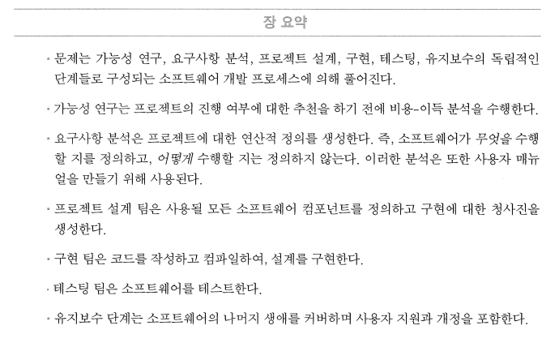

# Java를 이용한 자료구조

# 객체-지향 프로그래밍

- 본문
    
    
    
    
    
    - 소프트웨어 솔루션의 생에는 다음과 같다.
    1. 가능성 연구(Feasibility Study)
    → 문제(Problem)에 대한 명확한 문장과 그에 대한 솔루션의 잠재적인 이득에 대한 분석 자료 생성. 문제를 풀기 위한 자원, 솔루션을 개발하기 위한 기간, 성공시 예상되는 이윤 추정
    2. 요구사항 분석(Requirements Analysis) 
    → 최종 제품이 수행해야 할 사항을 명확하게 정의하는 문서 생성. 이 때 문서는 테스팅 팀이 사용하게 될 기준을 포함한다. 또한, 사용자 매뉴얼(User Manual)의 초안 작성
    3. 프로젝트 설계(Project Design) 
    → 소프트웨어 시스템의 전체적인 구조 결정. 개별 컴포넌트의 식별과 각 컴포넌트가 수행할 사항의 명세 포함. 
    4. 구현(Implementation) 
    → 각 컴포넌트에 대해 실행가능한 코드 작성, 각각이 독립적으로 작동하는지 확인
    5. 테스팅(Testing) : 컴포넌드들 조립. 고객 전달 전 요구사항 명세에 대비해 전체 시스템 테스트
    6. 장기 유지보수(Maintenance) 
    → 사용자 지원, 패치판, 개정판 포함. 
    
    
    
    - 솔루션이 무엇(What)을 수행하도록 요구되는가 하는 것과 솔루션을 어떻게(How) 설계하고 구현하는가 하는 것을 분리하는 것이 중요하다. 이는 무엇과 어떻게를 분리하는 추상화(Abstraction)의 예가 된다. 또한, 위 소프트웨어 솔루션의 생애는 대개 여러 번 반복된다.
    - 소프트웨어 시스템의 설계는 시스템의 기본이 되는 부분을 식별함으로서 시작된다. 객체-지향 시스템에서 이는 곧 객체가 된다.
    - 표준 소프트웨어 타입(표준 라이브러리 타입)의 재사용의 장점 : 
    → 자기 자신의 소프트웨어를 구축하고 테스팅하는 비용 절감
    → 상용 타입은 광고한 대로 작동할 것이라고 어느 정도 믿을 수 있다. 
    → 상용 소프트웨어는 시간과 공간 활용도 측면에서 거의 최적일 가능성이 높다. 
    → 다른 프로그래머들도 동일한 종류의 소프트웨어(클래스와 인터페이스)를 사용해 보아서 이미 친숙할 가능성이 높다. 따라서, 본인의 시스템이 더 쉽게 이해될 수 있다.
    - 알고리즘을 검사할 입력의 집합을 선택할 때, 항상 경계값을 포함하도록 해야 한다. 경계값(Boundary Value)란 다른 값들처럼 보편적이지 않은 끝점이나 기타 특별한 값이다. 어떤 알고리즘이 어떤 수의 범위에 적용된다면 그 범위의 최소값과 최대값이 경계값이 된다.
    - UML(Unified Modeling Language)은 객체-지향 소프트웨어를 모델링하기 위한 시각적 명세 언어다.
        
        
        
    - 위 표에서의 플러스 문자(+)는 public, 마이너스 문자(-)는 private, 번호 기호(#)은 protected를 나타낸다. 각 필드 타입과 리턴 타입은 콜론(;) 다음에 표시된다. 매개변수의 타입은 매개변수의 이름 없이 메소드의 괄호 안에 표시된다.
    - 객체-지향 프로그래밍에는 클래스가 다른 클래스의 일부분이 되는 방법으로 계승, 집단, 합성의 세 가지 기본적인 방법이 있다.
    - 계승(Inheritance)은 다른 객체의 세분(Specialization)을 나타낸다. 개는 포유동물의 특별한 타입이고, 트럭은 차량의 특별한 타입인 것과 같은 관계다. 이를 is-a 관계라고도 한다.
    - 집단(Aggregation)은 다른 독립적인 객체들의 그룹핑을 나타낸다. 집합은 그 원소들의 그룹이고, NATO 연방은 참가 국가의 그룹이다. 이러한 종류의 관계를 has-a 관계라고도 한다.
    - 합성(Composition)은 다른 객체들을 포함하는 것을 나타낸다. 개는 심장을 포함하고, 트럭은 엔진을 포함하는 것과 같은 관계다. 이러한 관계를 contains-a 관계라고도 한다.
        
        
        
    - 계승은 B extends Class A 형태로 구현하고, 집단은 Class A 내부에 Class B 타입의 필드를 선언해서 구현한다.
    - 합성은 독점적 소유를 나타낸다. 컴포넌트는 하나의 합성 객체만의 일부가 될 수 있고 합성 객체가 죽으면 같이 죽어야 한다. 이는 컴포넌트 객체가 합성 객체 안에 완전하게 포함되어야 함을 암시한다. Java의 경우, 이는 컴포넌트에 대한 모든 참조가 합성 클래스 안에 포함되어야 함을 의미한다.
    - 객체 지향 프로그래밍에서 불변(immutable)이란 데이터를 변경할 수 없는 객체, 즉 상수 객체이며. 변경할 수 있는 객체는 가변(mutable) 객체라고 한다.
    - 가변 클래스를 참조하는 클래스의 경우 Protected를 포함한 접근 제한자 만으로는 불변성을 보장할 수 없다. 이는 가변 클래스 필드가 가변 객체에 대한 참조이고, 동일 객체에 대한 독립적인 참조가 되기 대문이다.
    - 이를 해결하기 위해선 가변 클래스를 참조하는 클래스 객체 안에 완전히 캡슐화시킬 필요가 있다.  that을 활용한 생성자로 가변 클래스의 생성자를 생성하고, 해당 생성자를 참조하는 방식으로 구현한다. 코드는 아래와 같다.
    
    
    
    
    
    - 이 차이는 this.phone = new Phone(phone)의 생성자 생성 방식에 있다. 이는 Phone Class가 특정 Phone 객체의 사본을 생성하는 사본 생성자(Copy Constructor)를 가지고 있는 것으로 가정하고 있다.
    - 즉, 기존 가변 컴포넌트 클래스를 사용해야 하는 번번한 상황에서는 불변의 결과 클래스를 얻기 위해 합성 관계를 사용해야 한다.
    

# 추상 데이터 타입

- 본문
    
    
    
    - 추상 데이터 타입(ADT : Abstract Data Type)은 int나 String과 같은 구체 데이터 타입을 일반화해서 기술한 것이다. ADT는 특정 타입의 객체들에 대해 수행되는 연산들을 명세하지만 그 연산들을 구현하는 방법은 명세하지 않는다. 데이터 추상화는 객체-지향 프로그래밍 방법론의 기반이 된다. 이 개념은 데이터와 연산을 독립적으로 구현될 수 있는 별도의 모듈로 캡슐화시켜 대형 소프트웨어 프로젝트 개발을 용이하게 만들어준다.
    - Java는 강한 타입(strongly typed)의 프로그래밍 언어로, 변수에 저장될 데이터는 특정 데이터 타입을 갖도록 명시적으로 선언되어야 한다.
    - 자바의 데이터 타입은 해당 변수가 저장할 수 있는 데이터의 종류와 그 데이터에 대해 수행될 수 있는 연산들을 결정한다. 아래는 Java의 유효한 선언과 초기화다.
        
        
        
        
        
    - 한 객체에 저장되는 데이터를 그 객체의 상태(state)라고 하며, 그 객체에 대해 수행 가능한 연산들을 그 객체의 행위(behavior)라고 한다. 이러한 특성들은 모두 객체의 데이터 타입에 의해 제어된다.
    - 추상화란 관련 있는 것을 관련 없는 것과 분리하여, 상이한 그러나 구체적인 인스턴스들에 대해 적용되는 일반적인 개념들에 초점을 맞출 수 있도록 하는 것이다.
    - 추상화의 효율성은 하나의 이상형을 다수의 상이한 객체들에 대해 적용하는 것에서 나온다.
    - ADT는 클라이언트 프로그램과 데이터 타입의 구현 간의 인터페이스이다.
        
        
        
    - 클라이언트 프로그래머에게 데이터 타입의 어떤 연산을 사용할 수 있는 지만을 알려주고, 그 연산들이 실제로 구현되는 방법은 숨기는 것이 정보 은폐(information hiding)이다. 사용자가 데이터 타입에 대해서 알고 있는 정보는 그 데이터 타입을 사용하기 위해 필요한 것 뿐이다.
    - 구현 코드를 작성(또는 형성)하기 이전에도 클라이언트 소프트웨어를 컴파일할 수 있어야 한다. 이를 가능하게 하는 것이 데이터 타입의 추상화다.
    - 추상화는 Java와 같은 프로그래밍 언어에서 데이터 타입을 구현하기 전에 그에 대한 명확한 정의를 얻기 위해 사용한다.
    - 추상화를 통해 새 데이터 타입의 완전한 본질을 캡슐화하려면 그 타입이 기술하는 데이터의 종류와 그 타입에 적용될 수 있는 연산을 모두 명세해 주어야 한다. 추상 데이터 타입의 각 실체는 특정 프로그래밍 언어로 구현된 구체 데이터 타입이 되며, 이를 이용해 그 타입의 특정 객체들을 생성할 수 있게 된다. Java에서의 구체 데이터 타입은 클래스로 볼 수 있다. 구체 데이터 타입의 데이터와 연산은 해당 클래스 안에 정의된 필드와 메소드가 된다.
    - 연산의 선조건(precondition)은 연산의 시작 전에 참으로 가정되는 조건이며, 연산의 후조건(postcondition)은 연산의 종료 후 참인 것이 보장되는 조건이다. 한 연산의 선조건과 후조건은 클라이언트와 연산 간의 계약으로 간주할 수 있다. 클라이언트가 선조건을 만족시키면 연산은 후조건의 만족을 보장한다.
        
        
        
    - ADT 연산들은 실행 결과가 객체의 상태를 변경시키는지의 여부에 따라서 분류된다. 객체의 상태를 변경시킬 수 있는 연산은 수정자가 되고, 변경시킬 수 없는 연산은 접근자가 된다. 위 그림의 경우, 접근자는 객체가 변경되지 않음을 표시하는 후조건에 의해 식별 가능하며, getDay, getMonth, getYear가 여기에 해당한다. 접근자는 보통 객체의 상태에 대한 정보를 리턴한다. 접근자는 클라이언트가 아무런 변경 없이 정보를 접근하도록 허용한다. 이들은 판독-전용(read-only)연산들이다.
    - 또한, 위 3가지 메서드는 해당 데이터 필드의 값을 리턴하며, 이러한 연산을 판독자(getter)연산이라고 한다. 판독자 연산은 인자가 없어 아무것도 수신하지 않는 특별한 접근자이다. 여기서 정보는 일방향으로 흐르지만 객체로부터 클라이언트 방향으로 흐른다. 판독자 연산은 객체의 관점에서는 기록-전용이고 클라이언트 관점에서는 판독-전용이다.
    - 수정자는 대개 객체의 변경에 필요한 정보를 얻기 위해 인자를 요구한다. 위 그림에서 setDay, setMonth, setYear는 단순히 인자로 전달된 값을 이용해 해당 데이터 필드의 값을 재설정한다. 이러한 연산을 설정자(setter)연산이라고 한다. 설정자 연산은 void 리턴 타입으로 되어 있어 아무것도 리턴하지 않는 특별한 수정자이다. 정보는 클라이언트로부터 객체 쪽으로 일방향으로 흐른다. 설정자 연산은 클라이언트 관점에서는 기록-전용이고 객체의 관점에서는 판독-전용이다.
    - 단, 수정자가 모두 설정자는 아니고, 또한 접근자가 모두 판독자는 아니다.
    - ADT는 데이터 타입의 연산적 정의(operational definition)를 제공한다. 즉, 타입은 그 연산들을 이용해 정의된다. ADT의 구현 코드에서 데이터 타입에 대해 사용될 실제 저장 구조를 결정하게 되며, 이는 데이터 타입을 사용하는 클라이언트 프로그램을 컴파일하고 실행시키기 위해 필요하다.
    - ADT의 목적은 실제 프로그래밍 언어에서 객체를 선언하기 위해 사용되는 구체 데이터 타입의 정의와 구현을 용이하게 해주는 것이다. Java 프로그래밍 언어를 사용할 경우 이러한 실체화는 인터페이스의 형태가 되고 다시 클래스로 구현된다.
    - ADT를 Java Interface로 변환하는 것은 알고리즘을 Java 메소드로 변환하는 것과 유사하다.
        
        
        
    - 위의 Bag을 구현한 Class는 Bag Interface의 원소를 저장하기 위해 배열을 사용한다. Bag에 추가되는 각 원소들은 배열의 다음 가용 장소에 저장된다. (add method). Bag ADT가 허용하는 대로 동일 객체가 여러번 추가될 수 있지만, 1000개의 원소에 대한 공간만을 제공하고 있다.
    - remove() 메소드의 경우, 주어진 object를 찾아 배열을 탐색한 후, 매치가 발견되면 그 뒤의 배열 원소들을 한 자리씩 앞으로 이동시키고 size 카운터를 감소시켜 해당 객체를 제거한다. 자리 이동은 System.arraycopy() method를 이용하여 수행한다. 일반적으로, System.arraycopy() method는 a[i]에서 시작되는 n개의 원소로 된 배열 세그먼트를 b[j]에서 시작하는 n 원소 세그먼트로 복사한다. b[ ] 가 a[ ]와 동일한 배열일 경우에도, 필요하다면 원소를 덮어쓰면서 작동한다.
    - 단, 이 구현은 원소를 저장하기 위해 배열을 사용하므로 별로 효율적이지 못 하다.
        
        
        
        
        
    - 위 클래스의 구현을 통해 동일한 “US” 값을 넣었어도, 참조하는 object 객체를 두 개 삭제하는 것이 아닌, 하나의 US 객체를 삭제함을 알 수 있다.
    - 선조건은 Java Class에서 표준 실행-시간 예외를 이용해 구현할 수 있다.
        
        
        
    - 상용 소프트웨어의 경우, 선조건과 후조건을 설정하기 위해 Javadoc 도구를 사용하는 것이 현명하다. Javadoc은 Java 설명문의 특별한 형태로 웹 페이지(HTML 코드)로 자동 처리되어 인터페이스와 클래스에 대한 정형 문서를 제공한다.
    - 위 Interface의 경우, 아래의 Class를 통해 구현하여 사용할 수 있다. 확인을 위해 toString을 재정의, 출력시
        
        
        
    - 아래의 결과를 얻을 수 있다. 또한, IllegalArgumentException Class는 RuntimeException Class의 서브클래스로, 무검사 예외(unchecked Exception)을 발생시키므로 try 블록 안에 캡슐화시킬 필요가 없다. 또한, 메소드 선언시 throws 절도 필요하지 않다.
        
        
        
        
        
    - 프롬프트에서 javadoc 명령을 실행시킬 시, 아래의 결과를 얻을 수 있다.
        
        
        
    - assert 문을 통해 참과 거짓을 판별할 수 있다. assert  문은 참과 거짓을 판별하여 참일 경우 인터럽트 없이 실행되며, 거짓일 경우 AssertionError 가 발생하며 프로그램은 종료된다.
        
        
        
    - 단, assert 문은 디버깅 용도이기에 Run Configuration에서 Arguments에 -ea 를 추가해야 한다.
    - -ea 옵션은 Java 실행시간 환경(JRE: Java Runtime Environment)에게 “단정문 작동”을 알려준다.
        
        
        
    - 단정문은 선조건, 후조건, 클래스 불변값을 검사하기 위해 사용될 수 있다.
    - 클래스 불변조건(class invariant)이란 클래스의 상태, 즉 데이터 필드에 대해 부여되는 조건이다. 이 조건은 대개 클래스 객체의 데이터 필드의 값의 범위에 대한 제약조건이다. 이러한 제약조건은 클래스의 생성자나 수정자 메소드에 선조건으로 표현되어 준수된다. 앞서 구현한 IntsDate Class의 경우, day, month, year에 대한 범위를 불변조건으로 준수한다.
        
        
        
    - 즉, 모든 IntsDate 객체의 day, month, year 필드가 위 제약조건을 만족시킴을 확신할 수 있다. 설정자 메소드가 이러한 제약조건을 부여하고 생성자는 이 설정자 메소드를 사용하게 되므로 이러한 확신을 가질 수 있게 된다. 이 필드의 값들을 변경할 수 있는 다른 방법은 존재하지 않는다.
    - 클래스 불변조건은 데이터 무결성(data integrity) 준수에 사용된다.
    - 소프트웨어는 ADT를 정의하고, 이를 java interface로 변환하고, 이를 하나 이상의 Java Class로 구현하고, 이 클래스들을 인스턴스화하여 객체를 생성하는 순서로 개발할 수 있다. 그러나, Java에서는 한 클래스가 여러 인터페이스를 구현할 수 있으므로 인터페이스들과 클래스간의 관계는 보다 일반적이다. 이는 “의사-다중-계승(pseudo-multiple-inheritance)”의 한 종류로 간주된다.
    - ADT의 실현으로서 인터페이스는 행위를 캡슐화한다. 일부 객체들은 여러 상이한 타입의 행위 능력을 가질 수 있다. 예를 들어 대학에 아르바이트로 고용된 대학생은 학생이자 동시에 직원으로 행동한다. 이를 다형성(polymorphism)이라고 한다.
        
        
        
        
        
    - 위 구현 에제에서 StudentEmployee Type의 joe 객체는 매개변수의 값에 따라 2개의 (오버로드된) report method를 호출한다. Java-Runtime-Environment System은 수신하는 인자의 타입에 따라 올바른 Method를 선택한다. 이러한 상황은 여러 개의 형태를 가정하는 변수가 Method의 Parameter 이므로 매개변수 다형성(parametric polymorphism)이라고 한다.
    - 다형성은 매개변수 뿐만 아니라, Type으로도 적용할 수 있다. 아래의 예시를 보자.
        
        
        
    - 매개변수 bag은 타입 Bag을 가지는 것으로 선언되며, 이것은 인터페이스이다. 결과적으로 그 인터페이스를 구현하는 임의의 타입의 임의의 객체가 그 매개변수에 인자로 전달될 수 있다. 그러므로 매개변수 bag은 다형적(polymorphic)이다. 이는 Bag이 ArrayBag, LinkedBag 등의 Type이 될 수 있음을 의미한다.
    - 
    

# 배열

- 본문
    
    
    
    - 배열은 첨자 연산자를 이용해 접근할 수 있는 인접한 원소들의 시퀸스다. 배열은 프로토타입 자료 구조이다. 배열은 가장 단순한 종류의 원소 컨테이너어다.
    - Java에서는 배열이 객체이다. 그 타입은 t[ ] 형태이며, 여기서 t는 배열의 원소 타입이다. 나머지 세 종류는 Primitive, Class, Interface이다. 배열의 원소 타입은 이 네 종류의 타입 중 어느 것이나 가능하다.
        
        
        
    - 배열 matrix는 2차원 배열(two-dimensional array), 즉 배열의 배열이고, 배열 x3d는 3차원 배열(three-dimensional array), 즉 2차원 배열의 배열이다. 선언의 방법은 다음과 같다.
        
        
        
    - 또는 다른 객체 참조와 마찬가지로 배열도 new 연산자를 이용해 메모리 할당이 가능하다.
        
        
        
    - 배열의 경우 new 연산자는 중괄호에 표시된 원소의 수만큼 할당을 한다. 비-배열 객체의 경우 new 연산자는 Class 생성자를 호출한다.
    - Primitive 타입의 배열을 new 연산자로 할당하면, 그 원소들은 자동적으로 그 타입의 0 값으로 초기화된다.
    - Java에서 배열은 항상 0을 기반으로 인덱스가 부여된다. 즉, 배열의 길이(원소의 수)가 n일 때 인덱스의 범위는 0에서 n-1이 된다. 배열의 길이는 length 필드를 이용해서 접근할 수 있다.
    - Java에서는 자동으로 배열의 인덱스를 검사해 배열이 주어진 범위에서 벗어나지 않도록 한다. 인덱스 i가 범위를 벗어나면 JRE는 ArrayInedxOutOfBoundsException 예외를 발생시켜 프로그램을 철회시킨다.
    - 배열의 길이와 원소의 값을 컴파일 시 알고 있다면 선언문에서 할당과 동시에 초기화 리스트(initialization list)를 이용해 배열을 초기화할 수 있다. 단, 초기화 리스트를 할당문(치환문)에서 사용할 수는 없다.
        
        
        
    - 리스트를 배열 참조에 할당하면 단지 그 익명 배열 객체의 메모리 주소가 참조 변수로 복사되기만 한다.
    - Java에서 배열과 관련된 일부 기초적인 사항은 다음과 같다. 
    → 다른 객체와 마찬가지로 배열도 그에 대해 여러 개의 참조를 가질 수 있다.
    in[] aa = a
    
    → 다른 곳에서와 마찬가지 방식으로 메소드의 매개변수 리스트에 배열 매개변수를 선언할 수 있다. 
    public void print(int[] a)
    
    → 배열은 이름만 이용해서 메소드로 전달된다. 
    print(a);
    
    → 배열 타입은 메소드에 대한 리턴 타입이 될 수 있다. 
    public int[] randomArray(int n)
    
    → 한 배열을 다른 배열에 할당해도 실제로 복사되는 것은 아니다. 단지 다른 이름(즉, 다른 참조)만 부여하게 된다. 
    b = a;
    
    → 배열을 복사하려면 System 클래스에 정의된 arraycopy() 메소드를 이용할 수 있다. 
    System.arraycopy(a, 0, b, 0, a.length)
    
    → 중복 배열을 생성하려면, Object 클래스에 정의된 clone() 메소드를 이용할 수 있다. 
    b = (int[])a.clone();
    clone()에 대한 리턴 타입은 Object이므로, 타입을 배열로 형변화해야 한다. 
    
    → 배열은 대개 for 루프를 이용해서 처리된다. 
    for( int i = 0; i < a.length; i++)
          a[i] = random.nextint(1000);
    
    → 배열이 final로 선언되면 그 참조는 재할당될 수 없다. 
    final int[] a = {22, 44, 66, 88};
    a[3] = 99;           // 허용
    a = new int[8];   // 불가능
    - Java에서 객체는 최소한 하나의 참조가 남아있으면 존재한다. 객체에 대한 모든 참조가 사라지만, 바로 Java의 Garbage Collector가 객체를 제거해서, 다른 데이터를 위해 사용될 수 있도록 저장 공간을 메모리 Heap으로 리턴한다.
    - 배열은 객체이다. 배열의 이름은 실제로는 배열에 대한 참조 변수의 이름이다. 이 변수는 메모리에서 배열의 시작 주소를 저장한다. 다른 참조 변수와 마찬가지로 이 변수를 프린트하면 메모리 주소를 (16진수로) 보여주게 된다. Java는 원소의 타입을 표시하고 그 앞에 왼쪽 중괄호 문자 “[” 를 출력해 해당 객체가 배열임을 표시한다.
        
        
        
    - 출력 문자열은 두 파트로 되어 있다. 첫 번째 파트는 [I로 이 객체가 타입 int[] 배열임을 의미한다. [ 표시는 “배열”을, I 표시는 “int”를 의미한다. 두 번째 파트는 @4361bd48로 배열이 저장된 메모리의 주소를 제공한다. @는 “at”을 표시하고, 그 뒤의 4361bd48는 배열의 첫 번째 바이트의 실제 16진수 주소를 나타낸다.
    - 주어진 시퀸스(즉, 배열) 에서 최대 원소를 찾는 일은 각 원소를 살펴보고 가장 큰 원소의 인덱스를 저장하는 방식으로 이루어진다. 이는 한번에 한 원소씩 살펴보는 단일 루프를 필요로 한다. 현재 원소가 저장된 인덱스 위치의 원소보다 크면 현재 인덱스를 기존 것 대신에 저장한다.
        
        
        
    - 이 알고리즘은 최대값의 첫 번째 인덱스를 리턴한다. 예를 들어, 최대값이 88이고 a2=a6=a9=88이면 알고리즘은 인덱스 2를 리턴한다.
    - 배열에 대해 수행되는 공통적인 작업의 하나는 두 원소의 위치를 서로 바꾸는 것이다. 이는 한 원소를 임시 위치로 복사하고, 다른 원소를 이 원소의 위치로 복사한 후, 임시 위치의 원소를 다른 원소의 위치로 복사하는 식으로 이루어진다.
        
        
        
    - 두 원소가 동등할 때는 if(a1=a2)return; 의 방식으로 알고리즘을 더 효율적으로 할 수 있다.
    - 배열의 원소 타입이 Primitive라면 모든 원소는 동일한 타입이 되어야 한다. 그러나 원소 타입이 참조라면 실제 원소는 해당 배열에 대해 선언된 원소 타입의 확장에 속하기만 한다면 다른 타입이 될 수도 있다. 이로 인해 Java에서는 이질 배열(heterogeneous array)가 가능하게 된다.
    - 순차 탐색(sequential search) 알고리즘(또는 선형 탐색이나 직렬 탐색)은 주어진 목표값을 찾아 리스트를 앞에서부터 순차적으로 탐색한다. 이 알고리즘은 목표가 발견된 첫 번째 위치를 리턴하고 목표가 발견되지 않으면 음수를 리턴한다.
        
        
        
    - 알고리즘은 Java나 기타 프로그래밍 언어로 직접 변환될 수 있는 의사코드(pseudocode)를 이용해 표현한다. 알고리즘의 분석을 용이하게 하기 위해 알고리즘 기술시 다음의 정형적 요소, 즉 입력과 출력 명세, 선조건과 후조건, 불변조건을 포함한다. 입력과 출력 명세는 알고리즘 구현시 매개변수 리스트와 리턴 값으로 직접 변환된다. 선조건과 후조건은 알고리즘에 대한 “계약”을 구성한다. 즉, 선조건이 만족되면, 알고리즘은 후조건의 만족을 보장한다. 불변조건은 알고리즘의 실행중에 참인 것이 단정되는 조건들이다.
        
        
        
    - 순차 탐색에서 실행되는 단계의 수는 시퀸스에 있는 원소의 수 n에 비례한다. 이러한 알고리즘은 실행 시간이 자료 구조의 크기의 선형 함수이므로 선행 시간(linear time)에 수행된다라고 말한다. 이를 기호 O(n)으로 표기한다.
    - 목표가 배열 안에 없을 때, 탐색 루프는 -n을 리턴하기 전에 n번 반복하게 된다. 이와 반면에 목표가 배열에 있다면, 그 위치는 동일한 확률로 n 위치 중에 하나가 된다. 목표의 인덱스가 i일 때, 탐색 루프는 i+1번 반복하게 된다. 따라서, 반복 회수도 동등하게 n개의 값 1, 2, 3..n 중의 하나가 될 것이다. 이러한 n개 수의 평균은 n/2이며, 목표가 루프 안에 있다면 평균 n/2번 반복하게 된다. 따라서 목표가 배열안에 있든 없든 간에 이 알고리즘은 2배 길이의 배열에 대해 2배의 시간을 소요하게 된다.
    
    
    
    
    
    - 컴퓨팅에서는 알고리즘들을 이들의 점근적 실행 시간 함수에 따라서 분류한다. 대부분의 알고리즘들의 실행 시간 행위는 O(1), O(lgn), O(n), O(nlgn), O(n2), O(n3), O2n)의 7개 주요 범주의 하나에 속하는 것으로 알려지고 있다. 이 범주들을 복잡도 클래스(complexity class)또는 점근적 성장 클래스(asymptotic growth class)라고 한다.
    - 주어진 시퀸스가 정렬이 되어 있다면 순차 탐색보다 훨씬 적은 시간에 목표값을 탐색하기 위해 이진 탐색 알고리즘을 사용할 수 있다. 이진 탐색은 주어진 시퀸스를 반복적으로 반으로 나누어가며, 각 단계에서 그 범위에 목표를 포함하는 반쪽에 집중을 한다.
    - 이와 같은 알고리즘 진행 시, 남아있는 서비 시퀸스의 크기가 정렬된 100개의 수를 기준으로 할 때, 100원소, 49원소, 24원소 등으로 빨리 줄어든다는 점에 유의하자. 각 반복 단게에서 탐색 원소의 수는 대략 반 정도로 줄어든다. 그러므로 반복 횟수는 많아야 원래의 크기를 2로 나눌 수 있는 횟수가 된다. 이 수는 n의 정수 이진 로그인 [lg n]이다. 이는 100개의 원소를 찾을 경우에는 7번만, 1000개의 원소를 찾을 경우에는 10번만 반복하면 됨을 의미한다.
        
        
        
        
        
    - [lg n]은 n의 이진 로그다. 그러나 모든 로그 함수는 서로의 배수이므로, 복잡도 클래스 O(lg n)은 임의의 로그 함수(즉, 임의의 기수)에 대한 O(log n)과 동등하다.
    - 이진 탐색은 O(lg n) 시간에 실행된다. 즉, 실행 시간은 대략 배열의 크기의 로그에 비례한다.
        
        
        
    - 위 프로그램은 정수의 오름차순 배열을 생성하고 앞서 순차 탐색에 대해 적용된 것과 동일한 2개의 search() 호출을 수행한다. 유일한 차이는 배열을 정렬된 상태로 유지하고자 할 경우 목표를 위치시켜야 할 인덱스를 표시하기 위해 음수의 출력을 사용할 수 있다는 것이다. 출력이 음수 k일 때 목표의 올바른 위치는 i = -k - 1이 된다. 이 경우 k = -4 이므로 i = -(-4)-1 = 3이 되고, 이는 두번째 search method에서 호출한 50이 a[3]에 속해야 함을 의미한다.
    - 이진 탐색 알고리즘에 의해서 사용된 전략을 분할과 정복(divide and conquer)라고 한다. 이러한 방법은 주어진 문제를 더 작은 문제들로 나누고 그들에 대해 동일한 전략을 적용해서 문제를 “정복”(해결)한다. 이러한 기법은 정렬 알고리즘에서 폭넓게 사용된다.
    - java.util.Arrays Class는 배열 조작을 위한 여러 유틸리티 메소드를 제공한다. 이러한 메소드들은 모두 static으로 선언되어 있다. (그래서 접두어 “Arrays”에 의해 호출된다.)
        
        
        
    - 위 메소드들 각각은 8개의 Primitive Type과 Object 타입에 대해 각각 하나씩 9개의 버전을 가지고 있다.
    - equals(a,b) Method들은 임의의 클래스에 대해 정의될수 있는 equals() Method와 동일한 방식으로 두 배열 a와 b의 동등성(equality; identity가 아니다)을 테스트한다. 이 Method는 a와 b가 동일한 배열 타입이고, 동일한 크기를 가지며, 해당 원소들이 동등할 경우 참을 리턴한다.
    - fills(a, lo, hi, x) Method들은 x의 hi-lo개의 사본을 위치 a[lo]에서 시작해서 배열 a에 삽입한다. 다른 Java메소드와 동일하게, 이 Method도 첫 번째 인덱스(lo)를 시작 인덱스로, 두번째 인덱스(hi)를 종료 인덱스로 사용하고 있다.
    - sort() Method들은 배열을 오름차순으로 정렬한다.
    - binarySearch() Method들은 이진 탐색 알고리즘을 구현한다. binarySearch(a, x)에 대한 호출은 배열 a의 원소에서 x를 탐색한다. 이 메소드는 배열이 정렬되어 있는 것으로 가정 한다. x가 발견되면, 이 메소드는 배열 안의 해당 인덱스를 리턴한다. 그렇지 않으면 음수 i를 리턴하며, 이 때 값 -i-1이 배열을 정렬된 상태로 유지하고자 할 경우 x를 삽입해야 할 올바른 위치의 인덱스가 된다. 예를 들어, a가 배열 {22, 44, 66, 88}일 경우, binarySearch(a, 50)은 50이 배열에 존재하지 않으므로 i = -3 을 리턴한다. 이 값을 삽입하고자 할 경우 해당 위치는 인덱스 -i -1 = _(_3)_1=2가 되며, a[2..3]을 a[3..4]로 자리를 이동시키면 정렬된 배열은 {22, 44, 50, 66, 88}이 된다.
        
        
        
    - 위 Class에서 첫번째 탐색 목표인 55는 배열 안에 존재하므로, 이 메소드는 그 위치인 i=3을 리턴한다. 두 번째 탐색 목표인 60은 배열 안에 존재하지 않으므로, 이 메소드는 인덱스 i= -5를 리턴하고, 이 인덱스는 목표가 인덱스 -i-1 = -(-5)-1=4 위치에 삽입되어야 함을 표시한다. 세 번째 탐색 목표인 88은 배열 안에 존재하므로 메소드는 그 위치인 i=6을 리턴한다.
        
        
        
    - System.arraycopy() 메소드는 Java에서 한 배열의 원소들을 다른 배열로 복사하는 가장 효율적인 방법이다. 일반적인 구문은 
    System.arraycopy(a, m, aa, mm, k);
    이다. 이는 k 원소 {a[m], …, a[m+k-1]}를 n 위치 {aa{mm}, …, aa[mm+k-1]}로 복사한다. 여기서, a[ ]는 소스 배열, aa[ ]는 목표 배열, m은 a[ ] 에서의 시작 인덱스, mm은 aa[ ]에서의 시작 인덱스, k는 복사할 원소의 수이다. 이 메소드는 동일한 배열에서 원소들의 한 세그먼트를 한 위치에서 다른 위치로 복사하며, 이 때 해당 세그먼트들이 겹쳐도 가능하다.
    - Java는 버전 1.1에서 java.util 패키지에 Vector 클래스를 도입했다. 이후 이 클래스는 java.util.ArrayList Class에 의해 대체되었지만, 아직 크기 조정 가능한 배열의 유익한 예들을 제공한다.
    - 크기조정가능 배열(resizable array)란 한 배열을 동일 원소들을 포함하는 더 큰 배열로 대체하는 프로그래밍 기법을 의미한다. 전형적으로 새 배열은 기본 배열의 2배의 길이를 갖게 된다.
        
        
        
        
        
    - 배열의 길이는 배열 정의의 본질적 부분이므로, 완전히 새로운 배열을 할당하여야 한다. resized() 메소드를 다음과 같이
           a =resized(a);
    형태로 호출하면 배열 a[ ] 는 그 길이만 2배가 되고, 다른 내용은 변하지 않는다. 이는 지역 배열 aa[ ]가 할당에 의해 a[ ] 로 이름이 다시 부여되기 때문이다. 이전에 a[ ] 로 할당된 다른 배열 참조 변수가 더 이상 존재하지 않는다면, 이전의 짧은 배열들은 Java Garbage Collector에 의해 삭제된다.
    - java.util.Vector 클래스의 인스턴스들은 객체의 보통 배열을 직접적으로 일반화한 것이다. 한 Vector 객체는 지원 배열(backing array)이라고 하는 자신의 고유한 protected Object[ ] 배열 안에 Object 참조들의 시퀸스를 유지한다.
        
        
        
    - 위 Vector 클래스의 단순화된 버전을 볼 때. Vector 1-인자 생성자는 지원 배열을 주어진 capacity 만큼 할당한다. 두번째의 Vector 0-인자 생성자는 디폴트 용량을 가진 지원 배열을 할당하기 위해 1-인자 생성자를 호출한다. size() 메소드는 size 필드에 대한 단순한 접근자 메소드이다. resize() 메소드는 위의 리스팅 3.9 메소드의 지역 버전으로, 정수 대신에 객체의 배열을 사용하고 새로운 배열을 리턴하는 대신에 바로 objects 필드에 할당 한다.
    - Vector Class의 상세한 클래스 다이어그램은 아래와 같다.
        
        
        
    - 배열의 원소로는 임의의 타입의 객체들을 사용할 수 있다. 그러므로 배열의 원소가 다시 배열이 될 수도 있으며, 이러한 배열을 2차원 배열이라고 한다.
        
        
        
    - 위 프로그램은 2개의 2차원 배열을 정의하고 있다. 첫 번째인 a[ ][ ]는 분리된 배열들의 배열로서 정의되고 초기화된다. 이러한 배열은 각 컴포턴트 배열의 크기가 다르므로 울퉁불퉁한 배열(ragged array)이라고 한다. 두 번째 2차원 배열 b[ ] [ ]는 균일하다. 즉, 컴포넌트 배열 3개 모두가 4-원소 서브-배열(행)이다.
    - 배열 a[ ][ ]를 아래의 그림처럼 시각화할 수 있다. 객체 a는 3개 원소 a[0],a[1],a[2]으로 구성된 배열이다. 첫 번째 원소인 a[0]는 그 자체가 4개 int로 구성된 배열이다.
        
        
        
    - 두 번째 원소 a[1]은 NULL 값이다. 즉, 해당 배열은 아직 할당되지 않았다. 세 번째인 a[2]는 2개 int의 배열이다.
        
        
        
    - 위의 Map Interface를 구현하는 클래스의 이름은 ArrayMap이 된다. 지원 저장소는 단어를 key 필드에, 라인 번호 리스트를 value 필드에 저장하는 Entry 객체들의 배열이 된다. Entry 클래스의 멤버들은 ArrayMap 클래스 내부에서만 관련이 있게 되므로, 정보 은폐의 원리를 준수하기 위해 Entry 클래스를 ArrayMap 클래스의 멤버가 되도록 정의해야 한다. 이러한 클래스를 중첩 클래스(nested class)라고 한다.
        
        
        
    - ArrayMap 클래스를 구현한 에제를 통해 보자. 우선 INITIAL_LENGTH 상수는 10으로 설정된다. 따라서 put() 메소드에 의해 상수값 10을 벗어나는 범위가 입력되면 resize() 메소드가 호출되어 map의 지원 배열을 길이 20으로 재구축한다. 꽉 찬 배열에 대해 put()이 호출될 때마다 그 길이는 2배로 늘어난다.
    - get() 메소드는 명세된 key에 대해 배열에서 순차 탐색을 수행한다. 값이 발견되면 그 value를 리턴하고, 그렇지 않으면 null을 리턴한다.
    - get() 메소드에서 equals() 메소드를 통해 저장된 key와 명세된 key를 비교한다. 이것이 필요한 이유는 동일 내용 여부를 결정하기 위해 2개의 상이한 String 객체를 비교하기 때문이다. 동등 연산자는 참조가 동일한 객체를 참조할 때만 true 를 리턴하므로 사용할 수 없다.
        
        
        
    - put() 메소드는 get() 메소드와 동일한 초기 절차를 수행한다. 먼저 주어진 key에 대해 배열을 탐색한다. 값이 발견되면, 중첩된 Entry class의 setValue() 메소드를 호출하여 항목의 현재 value를 명세된 value로 대체하고, 이전의 value 값을 리턴한다. 값이 발견되지 않으면, 명세된 (key, value) 싸엥 대해 새로운 Entry 객체를 생성하고 이것을 배열의 다음 가용 위치에 삽입한다.
    - Java에서 외부 텍스트 파일은 입력 스트림(input stream)이라고 하는 개개 문자들의 스트림으로 읽혀진다. 이러한 스트림들은 FileReader 객체에 의해 판독된다. 생성자 
         public FileReader(String file)
    은 새로운 FileReader 객체를 생성하고 주어진 file 이름을 갖는 외부 텍스트 파일과 연결시킨다.
    - FileReader 객체는 해당 파일을 한 번에 한 문자씩 읽어오는 방식으로만 판독할 수 있다. 한 번에 한 라인씩 읽으려면 FileReader의 객체를 이용해 BufferdReader 객체를 다음 생성자
        public BufferedReader(Reader reader)
    로 생성해 사용해야 한다. 이 객체는 readLine() 메소드를 가지고 있다.

# 연결 구조

- 본문
    
    
    
    
    
    - 배열은 무순서 시퀸스는 물론이고 많은 변경을 가하지 않을 경우 순서를 가진 시퀸스도 잘 처리한다. 그러나, 신속한 삽입과 삭제를 허용하는 순서 리스트를 유지해야 할 경우에는 연결 자료 구조를 사용해야 한다.
    - 정렬된 배열에 새 원소를 삽입하는 것은 많은 시간을 필요로 한다. 이는 새 원소보다 큰 원소를 모두 이동시켜야하기 때문이다.
        
        
        
    - 평균적으로 n개 원소의 정렬된 배열에 대한 삽입은 n/2 원소를 이동시킨다. 즉, O(n) 연산에 해당한다. 원소의 삭제는 단순히 삽입 과정의 반대이므로, 이 역시 n/2 원소를 이동시키며 O(n) 연산이 필요하다.
    - 동적인 순서를 갖는 배열에 내제된 데이터 이동 문제에 대한 한 솔루션은 원소의 실제 위치를 추적하기 위한 보조 인덱스 배열을 사용하는 것이다. 이 솔루션은 추가의 공간(두 번째 배열)을 필요로 하고 코드를 좀 더 복잡하게 만들지만 원소를 이동시킬 필요성을 제거한다. 이 방법은 원소가 배열에서 임의의 위치에 저장되도록 허용하고, 순서 접근을 위한 원소 발견을 위해 보조 인덱스 배열을 사용한다.
    - 인덱스 배열(index array)란 다른 배열의 인덱스 값을 원소로 갖는 배열이다. 단, 이 방법은 기존보다 개선된 것이지만 최선의 것은 아니다.
        
        
        
    - 객체-지향적인 관점에서 보면, 위 그림은 Node 객체의 시퀀스로 생각할 수 있다. Java에서는 객체가 그 주소에 의해 직접 접근된다. 객체의 참조가 의미하는 것이 바로 객체가 메모리에 저장되는 주소이다. 그러므로 “주소”의 의미를 배열 인덱스가 아닌 메모리 주소(즉, 객체 참조)로 다시 번역하면 아래의 그림에서 보인 구조처럼 단순화시킬 수 있다. 여기서, 화살표는 객체 참조(즉, 메모리 주소)를 의미한다.
        
        
        
    - 아래의 그림은 전형적인 Node 객체를 보이고 있다. 데이터 필드는 정수 22이고, next 필드는 다른 Node 객체에 대한 참조를 포함하고 있다. 일반적으로 객체 참조를 표현하기 위해 여기서와 같은 화살표를 사용하지만, 참조의 실제값은 그것이 참조하는 객체의 메모리 주소를 의미한다. 다른 프로그래밍 언어에서는 이런 변수를 포인터(Pointer)라고 하며, 보통 화살표로 표현한다.
        
        
        
    - Node 객체는 신규 객체를 생성 후, .next 를 활용하여 Pointer를 다음 객체로 이동, 노드를 연결한다. 따라서 각 노드의 연결 - 구조는 개별 선언, for 루프 등의 방법으로 아래와 같은 방식으로 이루어진다.
        
        
        
    - 별도로 toString()을 오버라이딩 하지 않았다면 point 객체를 리턴한 문자열은 객체의 타입, @표시, 그리고 객체의 메모리 주소만을 포함한다. 이는 Node 참조를 표현함에 있어 화살표를 사용해 연결 리스트를 그리는 이유를 알려준다. 화살표 대신 실제 메모리 주소를 보이면 노드간의 참조를 확인하는데 더 많은 노력이 필요하게 된다. 더구나, 이런 메모리 주소 값은 Runtime 시에 결정되며, 다른 컴퓨터에서는 상이한 값을 가지며, 동일한 컴퓨터에서도 실행 시점에 따라 상이한 값을 가질 수도 있다.
        
        
        
    - 체인 할당문의 순서에 유의하자. 자바의 연산은 우측에서 왼쪽으로 가므로, 레퍼런스 변수 p는 next 필드가 변경되기 전까지 변경되지 않는다. 그러므로, 먼저 next 필드가 새로운 노드를 가리키도록 설정되고, 다음으로 루프 제어 변수 p가 다음 노드로 전진하게 된다.
    - 비공백의 정렬된 정수 연결 리스트에 대한 삽입은 다음의 테스트 클래스를 참조하자.
        
        
        
    - 새로운 노드 앞에 놓일 리스트 노드 p는 라인 5-8의 while문을 통해 발견된다.  변수 p는 라인 4에서 Node 객체에 대한 참조로 선언된다. 해당 변수는  아래의 그림과 같이 숫자 22를 포함하는 start 노드를 가리키도록 초기화된다.
        
        
        
    - 라인 5의 루프 제어 조건 (p.next ≠ null)은 p가 리스트의 마지막 원소를 가리킬 때까지 루프를 반복시키고, 조건 만족 시 p.next는 null이 되어 루프를 중단시킨다. 그러나 루프의 내부에서는 라인 6의 조건 (p.next.data > x)가 새 노드 뒤에 나와야 할 노드에 p가 도달하기 전에 루프를 중단 시킨다. 이 같은 방식으로 리스트는 오름차순을 유지한다. 즉, 새 원소는 항상 그 보다 작은 원소들과 그 보다 큰 원소들 사이에 삽입된다.
    - 실질적인 삽입은 라인 9의 [p.next](http://p.next) = new Node(x,p.next)에 의해 수행된다. 해당 수식은 새로운 노드를 생성하고 두 필드를 아래의 방식처럼 초기화시킨다.
        
        
        
    - 앞선 솔루션의 경우, 새로운 삽입 노드가 리스트의 첫 번째 원소 (start.data)보다 크다는 추가적인 선조건을 포함하고 있다. 이렬 경우 삽입 노드가 첫 번째 원소보다 작음에도 불구하고 두 번째 노드로 정렬되는 문제가 있다. 이를 해결하기 위해선 두 가지 방법이 있다.
    - 첫 번째 방법은 연결 리스트의 구조를 변경하여 첫 번째 실제 데이터 노드 앞에 빈(dummy) 헤드 노드를 유지하는 것이다. 이는 약간의 추가 공간을 필요로 하지만 문제를 해결할 수 있다.
    - 두 번째 방법은 2인자 생성자를 사용하는 방법이다. 2인자 생성자의 사용은 추가적인 임시 할당의 필요성을 제거해주며, 리스트가 공백인 경우에도 start가 null이면 두 번째 매개변수도 null을 전달하게 됨으로 1인자 생성자를 사용하는 경우와 동일해지므로 최상의 솔루션을 제공할 수 있다.
        
        
        
    - 삽입과 마찬가지로 삭제 역시 원소를 발견하고, 원소를 삭제하는 두 단계로 진행된다.
        
        
        
    - 리스트가 비어 있다면 start == null이므로 아무 일도 할 필요가 없다. 또한, 첫 번째 원소가 x보다 크다면, 리스트는 정렬된 상태이므로 모든 원소들이 x보다 큰 경우가 되어, x는 리스트 안에 존재하지 않게 된다. 이러한 경우는 모두 라인 6에서 처리한다.
    - 리스트의 첫 번째 원소가 삭제할 원소인 경우, 라인 8에서 삭제가 수행된다. 이는 아래의 그림에서처럼 start.next를 start로 리턴해서 수행한다. 원래의 start 노드를 가리키는 아무런 참조도 없다면, 이 노드는 Java의 Garbage Collector에 의해 삭제된다.
        
        
        
    - Java의 클래스 멤버는 필드, 생성자, 메소드, 인터페이스, 또 다른 클래스 등이다. 다른 클래스의 멤버인 클래스를 중첩 클래스(nested class)라고 한다.
    - 클래스 Y가 사용될 유일한 장소가 다른 클래스 X의 내부인 경우, 클래스 Y는 클래스 X 안에 중첩되어야 한다. 이는 정보 은폐 원리의 예시가 된다.
    - X가 임의의 타입(클래스나 인터페이스)이고 Y가 X 안에 중첩된 또 다른 타입이라면, X의 모든 멤버는 Y로부터 접근 가능하고 Y의 모든 멤버도 X로부터 접근 가능하다.
        
        
        
    - 위 테스트 클래스를 통해 중첩 클래스(Main)의 private 멤버들이 바깥쪽 클래스(Nested)로부터 접근 가능함을 보이고 있다. 대칭적으로, 바깥쪽 클래스의 private 멤버들도 중첩 클래스 안에서 사용 가능하다.
    - private 중첩 클래스의 모든 멤버들은 바깥쪽 클래스의 모든 위치로부터 접근 가능하므로, 단순성을 위해 대개 접근 수정자(private, protected, public)을 생략하고 선언한다.
    - 보통의 경우, 중첩 클래스는 그 인스턴스가 바깥쪽 클래스의 비 - static 멤버를 접근할 필요가 있지 않는 한, static으로 선언되어야야 한다.
        
        
        
    - Node 클래스를 LinkedList 클래스 안에 숨기는 일은, LinkedList 클래스를 캡슐화시켜 이 클래스를 독자적으로 만들고 그 구현 세부 사항을 숨겨주게 된다. 개발자는 그 클래스 외부의 아무런 코드도 수정할 필요 없이 그 구현을 변경할 수 있다.
    

# 스택

- 본문
    
    
    
    - 스택(Stack)이란 후입선출(LIFO : last-in-first-out) 프로토콜을 구현하는 자료구조다. 즉, 이 구조에서 접근 가능한 유일한 객체는 가장 최근에 삽입된 객체다. ADT(추상 데이터 타입) 으로서의 스택에 대한 정형적인 기술은 다음과 같다.
        
        
        
        
        
    - Stack Interface를 구현하는 가장 명확하고 단순한 방법은 배열을 사용하는 것이다. ArrayStack 구현은 스택의 원소를 저장하기 위해 지원 배열 a[ ]를 사용한다. 나머지 필드는 스택에 있는 원소의 수를 세기 위한 정수 필드 size이다.
    - 이 인터페이스에 의해 요구되는 4개 메소드 (peek(), pop(), push(), size()) 외에 이 클래스는 public isEmpty() 메소드와 private resize() 메소드를 포함하고 있다. 후자는 배열이 가득 찾을 때 push()에 의해 호출된다. 이 메소드는 배열의 크기를 2배로 재구축한다.
        
        
        
    - peek()과 pop() 메소드는 스택이 공백이 아닐 때만 사용 가능하며, pop() 메소드는 스택에서 제거되는 객체를 참조하는 배열 원소를 a[size] = null로 재설정한다. 이는 도달 불가능한 참조가 유지되는 것을 방지한다.
        
        
        
        
        
    - Stack의 사용 시 그림 5.5의 삽입 이상에 유의하라.
    - 일상적인 산술식의 표기는 (8 - 3) * (5 + 6) 의 중위 표기(infix notation) 이다. 컴퓨터는 중위 표기가 아닌 후위 표기(postfix notation)을 사용하며, 후위 표기에서는 연산자가 항상 피연산자 뒤에 나온다. 따라서 위 중위식의 후위식은 “8 3-5 6 +*”의 형태가 된다. 
    → 이를 역 폴란드 표기(reverse Polish notation)이라고도 한다.
    - 아래의 테스트 클래스는 RPN 계산기의 구현이다.
        
        
        
    - 해당 Class는 후위식을 평가하기 위해 스택을 사용한다. 입력을 파싱하며 연산자(”A”,”S”,”M”,”D”)를 피연산자와 구분한다. 피연산자는 스택에 삽입한다.
    - 연산자를 만나면 스택에 마지막으로 삽입된 2개의 수를 2개의 피연산자로 가정한다. 이들을 삭제(pop())해서 해당 수식을 평가하고 그 결과를 다시 스택에 삽입한다.
    - Stack 인터페이스에 대한 ArrayStack 구현은 스택이 꽉 찼을 때 배열을 재구축해야 하므로 다소 비효율적이다. 배열은 원소를 인접한 메모리 위치에 유지하므로 동적으로 성장할 수 없다. 배열을 확장하려면 전체 배열을 재할당하고 복사해야 한다. 이 문제를 해결하려면 배열 대신에 연결 구조를 이용해 스택의 원소를 저장해야 한다.
        
        
        
        
        
    

# 큐

- 본문
    
    
    
    - 큐 자료 구조는 스택 자료 구조와 거의 동일하다. 그러나 원소를 동일한 한쪽 끝에서 삽입하고 삭제하는 스택과 달리, 큐는 한쪽 끝에 삽입하고 다른 한쪽 끝에서 삭제한다.
    - 큐(Queue)는 선입선출(FIFO: First-In-First-Out) 프로토콜을 구현하는 자료구조다. 이 구조에서의 접근점은 원소가 삽입되고 제거되는 양쪽 끝이 된다. 삽입은 항상 큐의 뒤(back 또는 near)에서 수행되고 제거는 항상 앞(front)에서 진행된다.
    - ADT로서의 큐에 대한 정형적인 기술은 다음과 같다.
        
        
        
        
        
    - 큐와 스택의 연산의 이름 외의 실제적인 차이는 큐는 새로운 원소를 이들이 접근되는 반대편 끝에 추가하고 스택은 동일한 끝에 추가한다는 점이다.
    - add, first, remove, size는 Java의 Collection Framework의 대부분의 자료 구조에서 사용된다.
    - Queue 인터페이스를 구현하는 방법 중 가장 단순한 한 가지 방법은 배열을 이용하는 방법이다. 이 때 배열 구현에 대한 가장 단순한 대안은 연결 구현이며, 연결 구현은 배열 구현에 비해 2개의 중요한 장점을 가진다. 연결 구현은 더 빠르고 공간을 낭비하지 않는다는 것이다. 더 빠른 이유는 삽입과 삭제를 위한 위치가 항상 동일하게 뒤와 앞이기 떄문이며, 공간을 낭비하지 않는 이유는 제거된 노드가 Garbage Collector Process에 의해 삭제되기 떄문이다.
        
        
        
        
        
    - 연결 구현 방식을 이용해 구현한 LinkedQueue Class의 경우, 구조상으로 빈 헤드 노드를 가진 원형 이중 연결 리스트이다. 원형 리스트는 null 링크 필드를 없애주며, 이중 링크는 리스트를 통한 양방향 순항을 가능하게 한다. 빈 헤드 노드는 삽입과 삭제 알고리즘을 단순하게 만들어준다.
    - LinkedQueue 클래스의 중첩 Node 클래스는 object, prev, next 3개 필드를 가진다. object와 next 필드는 LInkedStack 클래스에서와 동일한 역할 (꺼내질 객체와 다음 객체를 가리키는 포인터 객체)을 한다. prev 필드는 각 노드에 대한 두 번째의, 역 방향 링크를 제공한다. 디폴트로는 양 링크 필드가 this로 초기화되어 새 노드의 각 링크가 자기 자신을 가리키게 된다. 이는 링크 필드가 null을 가질 수 없다는 요구사항을 준수시킨다.
    - LinkedQueue 클래스 자신은 head와 size 두 개 필드를 가지며, head 링크는 항상 빈 헤드 노드를 가리킨다. 이 노드는 큐 자체가 생성될 때 1-인자 Node 생성자에 의해 생성된다.
    - add() 메소드는 주어진 객체를 포함하는 새로운 노드를 리스트의 (오른쪽) 끝에 첨가한다. Node 생성자를 통해 prev 필드는 head.prev로, next 필드는 head로 설정한다.
    - remove() 메소드는 리스트에서 첫 번째 데이터 노드를 제거한다. 이 노드는 head.next가 가리키는 노드이며, 이 노드의 object 필드가 메소드에 의해 리턴되어야 한다.
        
        
        

# 컬렉션

- 본문
    
    
    
    
    
    - 컬렉션(Collection)은 효율적인 접근을 위해 원소들을 관리하는 일반적인 자료구조다. 예를 들어 Stack, Queue, List, Table은 상이한 종류의 Collection들이다.
        
        
        
        - 위는 Collection의 15개 메소드 중 7개만 명세한 간략화된 Interface이다.
        - add() 메소드는 주어진 object가 Collection의 원소가 된다는 후조건을 가지고 있다. 중복 원소를 허용하는 컬렉션의 경우 주어진 object가 추가되어 크기가 늘어나게 된다. 중복 원소를 허용하지 않는 컬렉션(예를 들어 집합)의 경우 주어진 object는 이미 존재하지 않을 경우에만 추가된다. 어떠한 경우든 이 메소드는 컬렉션의 내용이 변경된 경우에만 true를 리턴한다.
        - clear() 메소드는 컬렉션의 모든 원소를 제거한다. 후조건은 컬렉션의 크기가 0이라는 것이다.
        - contains() 메소드는 참조된 object가 컬렉션의 멤버라는 것을 표시하기 위해 true를 리턴한다. 좀 더 구체적으로 이야기하면, 이는 이 컬렉션이 object와 x가 모두 null이 되거나 또는 x.equals(object)가 true가 되는, 참조 x를 포함함을 의미한다.
        - 컬렉션의 원소는 참조이며, 그 중 일부는 null이 될 수 있고, 그 중 여러 개는 동일 객체를 참조할 수 있다.
        - isEmpty() 메소드는 컬렉션의 크기가 0일 때만 true를 리턴한다.
        - iterator() 메소드는 컬렉션을 순회하기 위한 java.util.Iterator 객체를 리턴한다.
        - remove(object) 메소드는 주어진 객체가 컬렉션에 포함되어 있으면 그 객체를 제거한다. add(object)와 마찬가지로 컬렉션이 변경된 경우에만 true를 리턴한다.
    - 반복자(Iterator)는 해당 자료 구조 상에서 이동하면서 접근할 개개의 원소의 위치를 나타내는 커서 또는 포인트 역할을 하는 객체이다. Collection 인터페이스의 iterator() 메소드는 인덱스가 배열을 순회하는 것과 같은 방식으로 컬렉션을 통해 “순회”하는 Iterator 객체를 리턴한다.
        
        
        
        - 위 Iterator 인터페이스를 통해 반복자에 대해 분석한다.
        - hasNext() 메소드는 next()가 성공적으로 호출될 수 있는 경우에만 true를 호출한다. 이러한 경우, 반복자의 next()메소드에 대한 다음 호출은 현재 위치의 원소를 리턴하게 된다.
        - next() 메소드는 두 가지 일을 수행한다. 현재 반복자가 가리키고 있는 원소에 대한 참조를 리턴하고 반복자를 컬렉션의 다음 원소로 전진시킨다. 반복자가 원소를 방문하는 순서는 반복자 자체에 의해서 결정된다.
        - remove() 메소드는 next() 메소드에 대한 별도의 호출 후에만 작동한다. 이 메소드는 next()에 대한 마지막 호출에 의해 리턴된 원소를 제거한다.
        - Iterator 객체는 처음에 iterator() 메소드에 의해 호출될 때 컬렉션의 시작 위치로 초기화 된다.
    - 반복자는 배열 인덱스와 유사하지만 배열 인덱스가 배열에 대한 직접 접근을 제공하는 것과는 달리 반복자는 순차 접근(sequential access)만을 제공한다. 수식 a[72]로 배열의 73번째 원소를 직접 접근할 수 있지만, 컬렉션에서 반복자를 이용해서 73번째 원소를 접근하기 위해서는 for문 등의 루프를 이용해 72번 반복해야 한다.
    - AbstractSet은 Set 인터페이스를 구현하는 abstract 클래스다. 이러한 abstract 클래스들의 목적은 인터페이스의 일반적인 구현을 위한, 특정 지원 자료 구조와 독립적으로 컴파일될 수 있는, 모든 실행 가능 코드를 캡슐화시키는 것이다.
    - 예를 들어 Set Interface는 HashSet, LinkedHashSet, TreeSet의 상이한 세 가지 구현을 가지고 있다. HashSet은 지원 자료 구조로 Hash Table을 사용하고, TreeSet은 이진 탐색 트리를 사용한다. 지원 구조와 무관한 이 클래스의 공통 코드는 AbstractSet 클래스로부터 계승된다. AnstractSet 클래스의 경우 지원 구조에 종속적인 코드는 생략되어야 하므로 abstract 클래스여야만 한다.
        
        
        
    - abstract로 선언하는 대신에 예외를 발생시키는 방식의 장점은 해당 메소드가 구체 메소드가 되어 다른 구체 메소드처럼 호출될 수 있다는 점에 있다. 그러나, 지원 자료 구조의 결정 후 완전한 코드를 제공하는 방식으로 서브클래스에 의해 오버라이딩될 수도 있다.
        
        
        
        
        
    - 앞서 작성한 Collection interface에 의해 명세된 7개 메소드 외에 이 클래스는 protected 0-인자 생성자와 toString() 메소드를 정의하고 있다. 생성자를 protected로 선언한 이유는 이 생성자가 abstractCollection 클래스의 확장(서브클래스)에 의해서만 사용될 것이기 때문이다. 이는 메소드의 일부가 abstract라서 실행 불가능하고, 따라서 abstract 클래스가 인스턴스를 가질 수 없게 되기 때문이다. 그러나 구체(즉, 비 추상) 확장은 그 메소드의 실행에 필요한 모든 코드를 가지게 되므로 클래스의 인스턴스를 가질 수 있게 된다.
    - 대부분의 구체 메소드는 작업 수행을 위해 반복자를 사용한다.
    - AbstractCollection 추상 클래스는 add(object), iterator(), size() 세 메소드를 서브클래스가 오버라이드하도록 남겨두고 있다. 이들은 Collection Interface 구현의 미완성 부분으로 컬렉션의 원소를 저장할 특정 자료 구조에 종속적이다.
        
        
        
        
        
        - 위 ArrayCollection 클래스의 인스턴스는 중복 원소를 허용하는 비정렬 컬렉션이다. 이러한 종류의 자료 구조를 백(bag) 또는 다중집합(multiset)이라고 한다.
        - add() 메소드는 우선 지원 배열이 가득 찼는지를 결정한다. 배열이 가득 찼으면 resize() 메소드가 호출된다. resize() 메소드에서 현재 길이 2배의 새로운 지원 배열을 생성한다. 배열에 공간이 있다면 컬렉션 안에 존재하는 원소들의 sequence 끝에 주어진 object를 추가한다.
        - iterator() 메소드는 컬렉션을 순회해 각 원소를 접근할 수 있도록 하는 Iterator 객체를 리턴하기 위해 AbstractCollection Interface에 의해 요구된다. 이는 내부 클래스로부터 LocalIterator 객체를 생성하고 리턴해서 수행한다.
        - 내부 클래스 LocalIterator 원소 저장에 배열을 사용하고 있으므로, 현재 원소의 위치를 지정하는 반복자에서 인덱스 i를 사용하고 있다. 반복자는 i = 0;으로 설정함으로서 컬렉션의 첫 번째 원소로 초기화된다.
        - hasNext() 메소드는 반복자가 더 이상 방문할 원소가 있는지를 결정하는 명확한 조건인 boolean 수식 i < size를 리턴한다.
        - next() 메소드는 현재 원소인 a[i]를 리턴한다. 이 때 다음 원소로 커서를 전진시키기 위해 후위 증가 연산 i++를 사용하고 있다.
        - remove() 메소드는 next() 메소드에 의해 리턴된 마지막 원소를 삭제하기 위해 요구된다. 이 원소는 a[i-1]이 된다. 이는 선감소 연산 —i를 이용해 앞의 원소에 접근하고 그 위치를 현재 위치로 설정한다. 실제 삭제는 해당 원소를 리스트의 마지막 원소 a[size-1]로 대체함으로써 이루어진다. 선감소 연산 —size는 올바른 원소를 제공하고 size를 올바른 값으로 재설정한다.
        - 또한 okToRemove 라는 이름의 boolean 필드를 정의하고 있다. 이는 next()를 호출한 이후에만 바로 remove() 메소드를 호출할 수 있다는 요구사항을 지키기 위해 사용된다. 이는 enxt()가 최소 한 번 호출되기 전에는 remove()를 호출할 수 없음을 의미한다.
        - 이러한 상황은 okToRemove 플래그를 제어하는 코드에 의해 보장된다. 이 플래그가 false일 때 remove()가 호출되면 IllegalStateException이 발생되어 호출이 취소된다. 이 플래그는 next() 메소드에 의해서만 true로 설정되며, remove()에 대한 각 호출은 이 플래그를 false로 재설정 한다. CS에서는 이러한 플래그를 세마포어(semaphore)라고 한다.
        - 해당 클래스의 구현은 Iterator Interface를 구현하고 반복자 메소드가 리턴하도록 요구되는 Iterator 객체를 생성하기 위해 non-static 중첩 클래스 LocalIterator를 사용하고 있다. 이 중첩 클래스는 그것을 포함하는 ArrayCollection 클래스의 non-static filed (size와 a)를 접근해야 하므로 non-static이 되어야 한다. non-static 중첩 클래스를 내부 클래스 (inner class)라고 부른다.
        - Java에서는 이러한 종류의 내부 클래스를 대개 익명(anonymous)으로 정의한다. 이렇게 하려면 내부 클래스의 전체 본문 블록을 return 문을 종료시키는 세미콜론 바로 앞에 놓아야 한다. 그리고 나서 LocalIterator() 생성자의 이름을 현재 구현 중인 인터페이스의 이름을 사용하여 iterator()로 변경하여야 한다.
            
            
            
    - Collection Interface도 배열은 물론 연결 자료 구조를 이용해 구현할 수 있다.
        
        
        
        - 연결 구현을 위한 iterator() 메소드는 배열 구현에 대한 iterator() 메소드와 완전히 유사하다. 이 메소드는 컬렉션을 순회하는 Iterator 객체를 리턴한다. 이 객체는 익명 내부 클래스에 의해 정의된 익명 생성자를 호출해 생성된다. 이 Iterator 클래스는 반복자의 현재 노드를 가리키는 cursor라는 이름의 인스턴스 변수를 유지한다. 이 변수는 Iterator 클래스의 배열 구현에서의 변수 i와 동일한 목적으로 사용된다. 커서가 빈 헤드 노드에 도달하면 컬렉션의 끝에 이르게 되므로, hasNext() 메소드는 단순히 boolean 수식 cursor ≠ head 의 값을 리턴한다. next() 메소드는 커서를 다음 노드로 전진시키고 커서가 이전에 가리켰던 객체를 리턴한다.
        - remove() 메소드는 이전의 ArrayCollection 클래스의 remove() 메소드와는 다른 방식으로 구현된다. 배열 구현에서는 배열의 마지막 원소와 대체하는 방식으로 원소를 제거했던 것과 달리, 연결 구현의 경우 컬렉션의 나머지 부분은 변경시키지 않은 채 두 링크만을 재설정해서 원소를 제거한다.
            
            
            
    - 앞서 구현한 Collection Interface를 java.util 패키지에 정의된 Collection 인터페이스의 모든 메소드를 구현하면 다음과 같다.
        
        
        
    - equals()와 hashCode() 메소드는 Object 클래스에서 계승된 버전과 다르게 정의된다.
    - Collection 인자를 취하는 4개의 메소드는 해당 조치를 주어진 Collection의 모든 원소에 대해 적용한다. 호출 addAll(y)는 컬렉션 y의 모든 원소를 추가하고, 호출 removeAll(y)는 컬렉션 y의 모든 원소를 제거하며, 호출 retainAll(y)는 컬렉션 y에 있는 원소를 제외한 모든 원소를 제거하고, 호출 containsAll(y)는 컬렉션 y가 부분집합일 때만 참을 리턴한다. 즉, 이 4개 메소드는 수학적인 집합의 기본 연산을 구현한다.
        
        
        
    - 아래의 메서드는 Collection 추상 클래스의 toArray(Object[] bar) 메서드다.
        
        
        
        - objects = (Object[])x; 은 컴포넌트 타입이 이 메소드로 전달된 배열과 동일한 길이 n의 새 배열을 objects에게 할당한다. 예를 들어, 컴포넌트가 String이라면 다음과 동일하다. 
        → objects = new String[n];
        - 그렇지만 컴포넌트 타입의 이름이 컴파일 시간에 알려지지 않은 경우에는 objects 매개변수로부터 이를 추출하기 위해 특별한 메소드를 사용해야 한다. 이러한 메소드는 반사 메서드(reflection method) 라고 불리우며, java.lang.Class 클래스와 java.lang.reflect.Array 클래스에 정의되어 있다. 
        → 자신에 대한 정보를 거울을 보면서 얻는 것처럼, 객체도 이 메소드들을 이용해 자신에 대한 정보를 얻기에 reflect라는 용어를 사용한다.
        - Calss objectType = objects.getClass(); 은 objects 배열의 타입을 표현하는 유일한 Class 객체를 참조하는 objectsType이라는 이름의 참조를 선언한다. 마찬가지로 Class componentType = objectsType.getComponentType(); 도 objects 컴포넌트 타입을 표현하는 유일한 Class 객체를 참조하는 componentType이라는 이름의 참조를 선언한다.
        - 예를 들어, 주어진 objects 배열이 타입 String[]으로 정의되어 있는 경우라면, objectType은 타입 String[]을 표현하는 유일한 Class 객체를 참조할 것이고, componentType은 타입 String을 표현하는 유일한 Class 객체를 참조하게 될 것이다.
        - Object x = java.lang.reflect.Array.newInstance(componentType, n); 은 x를 원소의 타입이 componentType인 길이 n의 배열로 선언한다. 따라서 객체로서의 x는 이 메소드로 전달된 objects 객체와 동일한 타입을 가지게 되나, 길이는 n이 된다. 그러므로 x는 이 컬렉션의 모든 원소를 저장할 수 있는 올바른 타입이 된다. 그러나 이 메소드는 타입 Object[]의 객체를 리턴한다. 그러므로 objects는 그 다음 줄에서 타입 Object[]로 그 타입이 변환된다.
        - 마지막으로, 변경된 세그먼트의 끝을 표시하기 위해 이러한 n 개 원소를 뒤따르는 원소가 존재하면 그 원소를 null로 설정한다. 양쪽 배열의 다른 원소들이 이미 null로 설정되어 있는 경우라면 이러한 표시는 소용이 없게 된다.

# 리스트

- 본문
    
    
    
    - Java의 관점에서 리스트는 인터페이스로서 정의된 추상 데이터 타입(ADT)다. 이러한 유형의 자료 구조는 선형적인 컬렉션(즉, 원소의 Sequence)다. Java에서 리스트 원소는 배열에서처럼 0, 1, 2등의 번호가 부여되며, 리스트 원소를 번호를 이용해 접근하는데 사용되는 정수 변수를 그 리스트에 대한 인덱스(Index)라고 한다. 보통의 배열처럼, 리스트는 중복된 참조와 null 참조를 가질 수 있다.
    - JCF(Java Collection Framework)는 ADT 구현에 사용되는 다음의 일반적인 전략을 허용하도록 설정되어 있다.
    → 구조를 정의하기 위해 인터페이스(에를 들어, Collection, List, Set, Map)을 사용
    → 그 인터페이스를 abstract 클래스로 부분적으로 구현
    3. 그 abstract 클래스 내부에 객체의 저장 구조를 실제로 명세하지 않고서도 작성할 수 있는 모든 인터페이스 메소드를 구현
    4. abstract 클래스를 저장 구조를 명세하는 여러 구체 클래스로 확장해 구현을 완성
        
        
        
    - List Class 구축을 위해 특화된 빌딩 블록은 위와 같다. 해당 프레임워크는 ArrayList와 LinkedList라는 2개의 구체 리스트 클래스를 제공한다. 이 중 ArrayList는 원소 저장에 배열을 사용하므로 상수 접근 시간을 제공하지만, 삽입과 삭제에는 선형 시간을 필요로 한다. LinkedList 클래스는 원소 저장에 연결 리스트를 사용한다. 삽입과 삭제는 상수 시간에 수행하지만, 위치 탐색에는 선형 시간을 필요로 한다.
        
        
        
    - java.util package에서 제공하는 ListIterator Interface를 살펴보자.우선 hasPrevious()와 previous() 메소드는 hasNext()와 next() 메소드와 유사하다. 단, next() 메소드는 후증가 연산자처럼 작동해 커서를 앞으로 이동하기 전의 현재 원소를 이동하며, previous() 메소드는 전감소 연산자처럼 작동해 커서를 후방으로 이동한 후의 현재 원소를 리턴한다.
        
        
        
    - ListIterator Interface의 set() 메소드는 Iterator 클래스의 remove() 메소드와 유사하게 작동한다. 이 메소드가 변경할 원소를 지정하기 위해 먼저 next() 또는 previous()를 호출해야 한다. 이 원소를 반복자가 위치한 현재 원소와 구분하기 위해 가변 원소(mutable element)라고 부른다. 예를 들어, next()에 대한 호출이 실행되기 전에는 리스트의 첫 번째 원소가 현재 원소가 되고, 가변 원소는 존재하지 않는다.
    - Array.asList() 메소드에 의해 생성된 리스트는 고정 길이(fixed length)를 가지게 된다. 즉, 생성된 리스트는 원소의 추가와 제거를 허용하지 않는다. 이는 이 리스트가 이 리스트에 전달된 것과 동일한 배열을 실제 저장 구조로 사용하기 때문이다.
        
        
        
    - 원소 저장에 연속적인 배열을 사용하며 AbstractList 를 구현한 ContiguousList 클래스를 통해 사용 가능한 List 구체 클래스에 대해 고려할 수 있다.
        
        
        
        - AbstractList 클래스의 유일한 abstract 메소드들은 get()과 size()다. 그러므로 이 두 가지 필수 메소드를 구현하는 서브클래스로부터는 리스트 객체의 인스턴스를 생성할 수 있다. ArrayList클래스는 원소를 배열에 저장하는 방식으로 이를 수행한다.
        - 이 클래스는 INITIAL_LENGTH 라는 이름의 상수, objects 라는 이름의 지원 배열, size라는 이름의 카운터 3개 필드를 정의한다.
        - 첫 번째 0-인자 생성자는 INITIAL_LENGTH  상수를 1인자 생성자, 주어진 capacity의 objects를 할당하는 생성자로 전달한다. 이후 Collection을 매개변수로 가지는 1인자 생성자를 통해 참조된 collection 크기의 2배를 용량으로 하는 object 배열을 할당한다. 그 후 임시 배열을 이용해 collection의 n개 참조를 objects 배열로 복사한다.
        - add() 메소드는 주어진 object를 이 리스트의 주어진 위치 i에 추가한다. 이 메소드는 먼저 주어진 인덱스 값 i가 경계내에 있는지를 검사한다. 포화 상태인 경우 resize() 메소드를 통해 용량을 2배로 늘리며, arraycopy() 메소드를 이용해 복사된 배열을 i에 삽입한다.
        - get() 메소드는 주어진 위치의 원소를 리턴하기 위해 지원 배열에 대한 직접 접근만을 이용한다.
    
    
    
    - remove() 메소드는 add() 메소드의 역이 된다. 위치 i의 object를 찾은 후 갭을 메우기 위해 오른쪽의 원소들을 이동시킨다. 이 결과 마지막 원소가 중복이 되므로 참조들의 마지막을 null로 설정한다. 이러한 방식으로 삭제된 원소에 대한 쓰레기 수집을 차단, “유령 참조”를 방지한다.
    - set() 메소드는 위치 i의 현재 원소를 참조된 object로 대체하고 예전 원소를 리턴한다.
    - size()는 필수 메소드이다.
    - Wrapper 클래스에 관련 내용은 Generic으로 대체하는 편이 더 효율적이기에 생략.
    - 다항식(polynomial)은 다음과 같은 형태의 수학 함수이다.
        
        
        
    - 고차항의 지수 n을 다항식의 차수(degree)라고 한다. 가장 단순한 다항식은 p(x) = 6 (차수 0)과 같은 상수 다항식 (constant polynomial), P(x) = 9x+6(차수 1)과 같은 선형 다항식(Linear polynomial), p(x) = 3x^2 - 2x + 5(차수2) 와 같은 2차 다항식(quadratic polynomial)이다. 유일한 0의 다항식 (zero polynomial) p(x) = 0은 차수가 -1인 것으로 정의한다.
    - 다항식은 상이한 항들의 합으로 간주할 수 있다. 항(item)은 t(x) =cx^e 형태의 수학 함수이고, 여기서 c는 임의의 실수이며 e는 비음수 정수이다. 수 c를 계수(coefficient)라고 하고 수 e를 차수(exponent)라고 한다.
    

# 해시 테이블

- 본문
    
    
    
    
    
    
    
    
    
    - 자료 구조에 대한 두 가지의 일반적인 접근 패턴은 순차 접근과 직접 접근이다. 순차 접근은 연결 리스트에 의해서 제공되고, 직접 접근은 배열에 의해서 제공된다.
    - 순차 접근(sequential access)의 경우에는 구조의 한쪽 끝에서 시작해 각 원소를 하나씩 살펴보면서 목표에 도달하거나 다른 끝에 도달할 때까지 탐색을 진행하게 된다. 이러한 탐색 시간은 선형 시간에 실행된다.
    - 직접 접근(direct access) 또는 임의 접근(random access)의 경우에는 주어진 인덱스 i를 이용해 직접 a[i]로 가서 원소를 찾게 된다. i는 원소 a[i]의 주소라고 생각할 수 있다. 직접 접근은 순차 접근보다 훨씬 더 빠르고 상수 시간에 실행된다. 그러나 원소의 인덱스에 대한 사전 지식이 필요하다.
    - 해시 테이블(hash table)은 원소의 인덱스에 대한 사전 지식 없이 직접 접근을 제공하려고 시도하는 자료 구조이다. 이러한 시도는 원소의 내용으로부터 원소의 인덱스를 계산하는 해시 함수(hash function)을 이용해 가능해진다. 해시(hash)라는 단어는 원소들이 아무런 순서 없이 마구 뒤섞여 있다는 사실을 반영하고 있다.
    - 레코드(record)는 여러 개의 컴포넌트를 가진 복합적인 자료 구조이다. 각 컴포넌트는 자신의 이름과 타입을 가지고 있다. 일부 프로그래밍 언어에서는 레코드가 배열과 같이 표준 타입으로 사용된다. Java에서는 레코드가 객체로서 구현된다.
    - 테이블(table)이란 동일 타입의 레코드의 집합이다. 테이블은 순서가 없는 자료 구조이다.
    - 키 테이블(keyed table)이란 테이블에 저장된 레코드 전체에 대해서 값이 유일한 키 필드(key field)라는 특별한 필드 하나를 레코드 타입이 포함하는 테이블이다. 각 키는 레코드 식별에 사용된다. 키 테이블은 컴퓨터 데이터베이스의 기본적인 빌딩 블록이다.
    - 키 테이블은 레코드를 조사하기 위해 사용된다. 키 필드는 짧고 단순할 때 가장 잘 동작한다.
        
        
        
    - 위 표는 국제표준기구(ISO: International Standard Organization)에서 세계 각국에 대해 지정한 2-문자 약어를 키 필드로 지정한 테이블이다.
    - 키 테이블은 맵(map) 또는 사전(dictionary)이라고도 한다.
    - 맵은 키 보유 레코드의 컬렉션이다. 아래는 키 보유 레코드에 대한 표준화된 기술이다.
        
        
        
    - 맵에 대한 최소화된 명세는 아래와 같다.
        
        
        
    - 이 ADT는 최소한의 연산 집합만을 명세하고 있다.
        
        
        
    - 위 최소화된 명세를 구현한 Interface를 보자. 이 때 주의해야 할 점은 get(), put(), remove()에 의해 리턴된 값이 연산의 출력을 전달하는 방법이다.
    - get()과 remove() 메소드에서의 null값은 실패를 표시한다. 그러나 put() 메소드는 새로운 레코드를 삽입하고 기존 레코드를 수정하기 위한 두 가지 역할을 수행하고 있다. 그러므로 put() 메소드는 새로운 레코드 삽입의 성공을 알릴 때는 null을 리턴하고, 기존 레코드에 대한 수정의 성공을 알릴 때는 비-null을 리턴한다.
    - 자료 구조에 대한 추가적인 구성 없이는 키 테이블에 대한 접근은 순차적이다. 테이블이 키 값에 의해 정렬되고 배열에 저장되어 있다면, 이진 탐색으로 구현하여 접근 시간을 O(n)에서 O(lg n)으로 개선할 수 있다. 그러나 해싱ㅇ(hashing)을 이용하면 정렬하지 않고도 더 좋은 성능을 낼 수 있다.
    - 키 테이블에 대한 해시 함수는 테이블에서 주어진 키 값을 가지고 있는 레코드의 위치(배열 인덱스)를 리턴하는 함수이다. 해시 테이블은 해시 함수를 가진 키 테이블이다.
    - Java의 Object 클래스는 임의의 객체에 대해 int를 리턴하는 hashCode() 메소드를 정의하고 있다. 그러므로, Java에서 모든 객체는 자기 자신의 해시 코드를 가진다. 해시 코드는 객체 안에 저장된 데이터로부터 계산된다.
    - 일반적으로, 어떤 객체에 대한 Java hashCode()의 값은 양이나 음의 int가 될 수 있다. 이를 배열 인덱스로 사용하기 위해서는 m을 배열의 길이라고 할 때 범위 0 ≤ h <m의 정수 h로 변환되어야 한다. 이를 위한 표준 기법은 다음의 정수를 사용하는 것이다.
        
        
        
    - 상수 0x7FFFFFFF는 이진 문자열 01111111111111111111111111111111(”0” 뒤에 31개의 “1”)에 대한 16진수 값이다. 연산자 &는 비트 단위 and 연산자이다. 정수 k에 마스크 0x7FFFFFFF를 적용하면 단순히 k의 맨 앞 비트를 0으로 변경하게 되며, 이는 k에 절대 값 |k|를 할당하는 것과 같다. 연산 x % m은 x를 m으로 나눈 나머지, 즉 m보다 작은 비음수 정수를 생성한다.
    - 해시 함수는 거의 상수 시간에 해시 테이블의 원소를 접근할 수 있게 해준다.
    - 해시 테이블에서 예외처리를 꼼꼼히 하지 않았을 경우, 삽입 시 레코드를 겹쳐 쓰는 충돌(collision)이 일어날 수 있다. 이를 해결하기 위한 가장 단순한 방법은 충돌된 레코드를 배열의 가용한 다음 셀에 저장하는 것이다. 이러한 알고리즘은 각 “조사”에서 배열의 인덱스를 1씩 증가시키므로 선형 조사(Linear probing)이라고 한다. 이런 방법은 해당 원소가 해시 값에 의해 인덱스된 슬롯에 항상 배치되지는 않고 테이블의 임의의 장소에서 끝날 수 있기 때문에, 개방 주소법(open addressing)이라고도 한다.
        
        
        
    - 앞의 put을 통한 호출은 “GB”가 인덱스 1로 해시되고, entries[1]과 entries[2]에 다른 원소가 들어가 있으므로, 새 레코드를 entries[3]에 삽입해 충돌을 해결한다. 다음으로, get(”GB”)에 대한 호출은 해싱으로 인덱스 1을 구한 후, 순차적으로 entries[1]과 entries[2]를 조사하고, 마지막으로 entries[3]을 조사해 거기에서 레코드를 발견한다.
        
        
        
    - 위와 같은 삽입이 있을 경우에는, 키 “NL”은 인덱스 8로 해싱되고, 따라서 선형 조사 알고리즘에 의해 entries[8], entries[9], entries[10]이 조사된 후 entries[0]에서 빈 셀을 찾게 된다. 이 알고리즘은 원형 리스트처럼 배열의 끝에서 다시 맨 앞으로 진행한다.
        
        
        
    - 수정된 put() 메소드에 대한 구현 코드는 위와 같다.
    - 수식 (h+1)%entries.length의 값은 단순히 (h+i)이다. (h+i) = 11이 되면 11을 11로 나눈 나머지는 0이므로, 수식 (h+1)%entries.length의 값은 0이 된다. 일반적으로, 수식 (h+1)%entries.length는 (h+1) < entries.length 인지, 또는 (h+1) ≥ entries.length인지에 따라서 (h+i)나 (h+i)-11이 된다.
    - 오버플로우 문제를 해결하기 위한 솔루션은 더 큰 배열을 사용하여 테이블을 재구축하는 방식에 있다. 이를 재해싱(rehashing)이라고 한다.
    - 종합적인 HashTable 클래스는 다음과 같다.
        
        
        
        
        
        
        
    - 선형 조사는 충돌의 해결에 있어서 단순하고 어느 정도 효울적인 방법이다. 그러나 해시 함수가 테이블 전체에 대해 레코드를 균일하게 분배하는 데 실패하면 선형 조사는 함께 묶인 레코드의 긴 체인을 만들 수 있다. 이를 기본 집중(primary clustering)이라고 한다.
    - 하나의 클러스터는 그 안에 갭이 없으므로 클러스터의 시작 부근에 해시되는 새 레코드들은 한 번에 한 단계씩 여러 레코드를 거쳐 가야 하므로 충돌이 늘어나고 시간도 낭비된다. 이런 선형 조사에 대한 하나의 대안은 제곱 조사(quadratic probing)이다. 이 알고리즘은 매번 1씩 증가하는 대신 점진적으로 더 큰 폭으로 증가시켜 충돌을 해결한다. 이를 위해서는 기존의 
    (h + i)%entries.length 수식을 (h + i*i)%entries.length;로 변경해야 한다. 즉, 각 충돌 수에 h에 i를 더하는 것이 아닌 i*i를 더한다.
    - 제곱 조사는 사용이 안 된 갭을 중간에 남겨 두어 선형 조사보다 적은 집중을 가져올 수 있다. 그러나 제곱 조사의 경우도 아직 문제가 있다. 선형조사의 순서가 희소 주기 순서로 셀 중 일부만 사용될 때, 다른 셀이 비어있더라도 put()이 실패하는 문제가 그것이다.
    - 이에 대한 솔루션은 임계 적재율을 50%로 설정하는 것으로, 모든 셀의 반 이상이 사용될 수 없도록 한다면 이러한 희소 주기 조사 순서도 공백인 셀을 발견할 수 있게 된다.
    - 단, 적재율을 50%로 제한한다고 하더라도 이중 해싱에는 2차 집중(secondary clustering) 문제가 발생한다. 이는 선형 조사가 가진 문제와 동일한 문제로서 동일한 값으로 해시되는 2개의 상이한 키가 동일한 조사 순서를 가지게 되는 것이다. 이 문제에 대한 솔루션은 조사 순서를 결정해 주는 제2의 독립적인 해시 함수를 사용하는 것이다. 이를 이중 해싱(double hashing)이라고 한다.
    - 선행 조사와 마찬가지로 이중 해싱은 조사 순서에서 상수 중분을 사용한다. 그러나 2번째 해시 함수에 의해서 결정되는 중분은 대개 1보다 크다. 그러므로 제곱 조사에서처럼 이중 해싱도 조사 순서를 넓게 확대해서 기본 집중을 피하게 된다.
    - 앞서의 개방 주소법과 달리, 폐쇄 주소법(closed addressing)이라는 방법에서는 하나의 해시 위치에 1개 보다 많은 레코드를 허용함으로써 충돌을 회피한다. 이 결과 보다 복잡한 자료 구조가 필요하게 된다.
    - 레코드의 배열 대신에 버켓의 배열을 사용하게 되며, 여기서 버켓(bucket)이란 일종의 레코드의 컬렉션이다. 가장 단순한 자료 구조는 하나의 버켓에 대해 하나의 연결 리스트를 사용하는 것이다. 이를 별도 체인(separate chaining)이라고 한다.
    - 폐쇄 주소법의 경우 체인 길이에 제한이 없으므로, 적재율이 지원 배열의 길이를 초과할 수 있다. 그렇지만, 긴 체인을 허용하게 되면 해시 테이블의 성능이 저하되므로 테이블 size가 주어진 임계값을 넘어가면 재해싱을 수행하도록 한다.
        
        
        
    - 위 그림의 경우 용량을 11로, 적재율을 2.0으로 하고 15개의 유럽 국가를 적재한 후의 해시 테이블을 보이고 있다. 키만을 보이고 있고, 전체 레코드는 보이지 않고 있다.
    - 폐쇄 주소법은 충돌을 방지하는 명확한 장점을 가지고 있다. 각 버켓이 임의 개수의 다수의 키를 저장할 수 있다면, 오버플로는 일어나지 않게 될 것이다. 단점은 일부 체인이 매우 길어질 수 있다는 점이다. 매우 불균형한 버켓 체인의 배열은 해싱이 제공해야 할 상수 시간 접근의 장점을 파괴할 수도 있다.
    - 비-상수 시간 순차 탐색의 위험은 개방 주소법에도 존재한다. 대부분의 키가 동일 값으로 해시 되면 동일 유형의 긴 체인이 생성될 수 있다. 결과적으로 많은 응용에서 폐쇄 주소법이 선정되는 경향이 있다.
        
        
        
        
        
    - 위의 공식은 4개 해싱 알고리즘의 평균 실행-시간 복잡도에 대한 일반 공식이다. 이 공식들은 지원 배열의 길이 m이 크고 hash() 메소드가 주어진 모든 키 값의 집합에 대해 범위 0≤h≤m 사이에 균일하게 분포된 인덱스 번호 h를 리턴하는 것으로 가정한다.
    - 해시 테이블에 대한 적재율이 비율 r=n/m이고, 이 때 n은 테이블의 레코드 수(size)이며 m은 지원 배열의 깊이(entries.length)이다. 개방 주소의 경우 r≤1이다. 테이블의 복잡도 함수들은 적재율 r=n/m을 이용해 표현되었다. r<1인 경우, 관련 수량 q= 1(1-r)=m/(m-n)으로 정의된다.
    - 일반적으로, 별도 체인을 이용한 폐쇄 주소법이 개방 주소법 알고리즘보다 성능이 우수하다.
    - 해시 함수가 모든 가능한 키의 집합에 대해 일대일이 될 때는 개방 주소법이 페쇄 주소법보다 잘 작동한다. 이를 완전 해시 함수(perfect hash function)이라고 한다. 보통 이런 특별한 상황은 매우 드물지만, 전체 키 집합을 미리 알 수 있다면 해시 테이블과 해시 함수를 그에 맞춰 제작할 수 있다.
    - 최소 완전 해시 함수(minimal perfect hash function)는 일대일이면서 100% 적재율을 가진 완전 해시 함수이다. 이를 찾기 위한 알고리즘은 다음과 같다. 이 알고리즘은 문자열에 대한 완전 해시 함수를 발견한다.
        
        
        
    - 완전 해시 함수가 불가능하다면, 최선의 해시 함수는 레코드를 해시 테이블 전체에 고르게 분배하는 것이다. 큰 테이블의 경우에는 num(key)%entries.length를 리턴하는 함수가 이에 해당한다. 여기서 num(key)는 각 값이 동등한 확률로 큰 범위의 값 중 하나가 되는 비음수 정수이다. 이 함수들은 큰 정수를 테이블의 길이로 나눈 나머지를 사용한다. 이러한 형태의 해시 함수들을 제산(division) 해시 함수라고 한다.
    - 또 다른 일상적인 해싱 방법은 추출(extraction)이다. 이는 실제로는 키의 일부분에 적용된 제산 방법으로 볼 수 있다. 이는 주어진 키의 부분들이 서로 중복되어 레코드를 구별하는데 도움이 되지 않을 때 사용된다. 예를 들어, 일주일의 7개 요일의 이름에 대한 해싱은 모두 동일한 점미어 “day”를 가지기 때문에 각 키워드의 마지막 3개 문자를 생략해야 한다.
    - 키가 단순한 정수일 경우, 중첩 해시 함수(folding hash function)가 간단한 솔루션을 제공한다. 이 방법은 숫자 문자열을 여러 부분으로 분리하고 나서 이들을 함께 “중첩”시킨다.
        
        
        
    - 이 방법을 중첩(folding)이라고 부르는 이유는 세 부분의 수를 유연한 시트에 기록한 후 접는 상황을 생각해보면 알 수 있다. 중간의 세 자리는 반대 방향으로 접히게 되므로 그 자리들을 역순으로 나열하게 된다.
    

# 순환

- 본문
    
    
    
    
    
    - 순환 함수(recursive function)은 자기 자신을 호출하는 함수다. 이 함수는 가상의 루프를 사용하여 자동적으로 반복된다. 반복을 사용하는 많은 알고리즘들은 각각의 루프를 순환 호출로 바꾸어 다시 작성할 수 있다. 따라서 순환은 반복에 대한 대안으로 볼 수도 있다.
    - 순환의 예시로 계승(factorial)을 구하는 함수를 생각해 볼 수 있다. 계승은 보통 다음과 같이 정의된다.
        
        
        
    - 아래는 계승에 대한 Java 구현 리스팅이다.
        
        
        
    - 함수를 자기 자신을 사용하여 정의하는 방식이 순환 논법(circular reasoning)과 비슷하게 보이지만, 방정식의 좌변에 있는 수식 n!이 방정식의 우변에 있는 수식 (n-1)!과 같지 않기에 순환과 순환 논법은 다른 것이다. 이 방정식은 한 숫자의 계승을 이보다 작은 숫자에 대한 계승으로 정의하고 있는데, 이와 같은 점화 관계(recurrence relation)의 전체 시퀸스는 다음과 같다.
        
        
        
    - 순환은 점화 관계가 적용될 때 n>1이라는 조건을 만족해야 하기에 n=1에서 멈추게 된다. 1!의 값은 정의의 비순환부(non recursive part)에 n=0 또는 1이 되면 n!=1이 된다고 정의되어 있으므로, 1!=1이 된다.  즉. 정의의 순환부(recursive part)는 나머지 수식이 정의의 비순환부에 의해 계산되는 경우를 만날 때까지 계속 적용된다. 이렇게 구해진 값은 최종적으로 원래 수식의 정확한 값을 리턴할 때까지 연쇄적으로 다른 값으로 계산되어 진다.
    - 순환이 제대로 작동하기 위해서는 반드시 직접 게산에 의해 순환 사다리를 다시 올라갈 수 있도록 만들어주는 베이스(base)를 가지고 있어야 한다. 베이스를 잊어버릴 경우 순환 참조 오류를 일으키게 된다. 이러한 오류를 막기 위해, 다음과 같이 순환과 베이스를 명시적으로 구분하기도 한다.
        
        
        
    - 순환적 사고의 핵심 아이디어는 크기가 n인 문제를 풀기 위해 크기가 n보다 작은 동일한 문제에 대한 솔루션을 먼저 찾는 것이다.
    - 또 다른 예로 피보나치 수를 생각할 수 있다. 피보나치 수의 각각의 수는 두 개의 선행자(predecessor)의 합으로 이루어지는데, 그 정의는 다음과 같다.
        
        
        
    - 아래는 Java로 구현한 피보나치 수열의 리스팅이다.
        
        
        
    - 위 순환 호출 방식의 피보나치 수열은 수행시간 확인시 수행 속도가 느린 편인데, 이는 메소드 호출 트리가 반복적으로 일어나기 때문이다.
        
        
        
    - 이러한 호출 트리는 순환이 비효율적인 두 가지 이유 중의 하나를 보여준다. 그것은 같은 값을 계산하는 동일한 스탭이 여러 번 반복되서 실행되는 것이다. 또 한 가지 이유는 순환이 많은 메소드 호출을 통해 동작하는 것이다. 각각의 호출은 시간과 공간적으로 비용이 많이 든다. 호출 시 필요한 숫자 N은 지수적으로 증가한다.
    - 어떤 알고리즘이 반복 버전(f2)와 순환 버전(f)을 모두 가지고 있을 경우, 일반적으로 반복 버전은 빠르고, 순환 버전은 간단하다. 순환 버전은 같은 값을 여러 번 재계산하기 때문에 더욱 느리게 된다. 단, 처음 계산 시 계산 결과를 저장해 놓게 되면 같은 값을 재계산 하는 것을 피할 수 있다.
        
        
        
    - 위 프로그램은 100개의 long 정수를 위한 fib[ ] 배열과 인덱스 표시를 위한 lastFibindex 등 두 개의 private 필드를 가지고 있는 Fibonacci 클래스를 정의하고 있으며, 피보나치 수를 리턴하는 public 메소드인 nubmer()를 가지고 있다. 또한, 이 클래스는 fib[ ]배열의 처음 세 원소를 초기화하는 정적 초기화 블록(static initialization block)을 가지고 있다. 이 코드는 클래스가 적재될 때 한 번만 실행된다.
    - 위 프로그램은 F30에서 F40까지 11개의 피보나치 수를 출력한다. n을 30으로 하여 Fibonacci.number(n)을 처음으로 호출하면, number() 메소드는 F3에서 F30까지 계산한 다음 계산 결과를 fib[ ]배열에 저장하고, lastFibindex를 30으로 재설정한 다음, 결과를 fib[30]에 리턴한다. n을 31로 하여 Fibonacci.number(n)을 두 번째로 호출하면, number() 메소드는 만을 계산한 다음 계산 결과를 fib[31] 배열에 저장하고, lastFibindex를 31로 재설정한 다음 결과를 fib[31]에 리턴한다.
    - 이런 접근 방법은 클래스가 이미 계산한 결과를 기억하게 함으로써, 같은 작업을 되풀이하지 않으려는 것이다.
    - 피보나치 수를 위한 폐쇄형 수식으로 드 무아브르 공식이 있다. 이는 무리수 제곱의 차에 대한 몫이 양의 정수로 구해진다고 주장하고 있다.
        
        
        
    - 순환 이진 탐색(아래 알고리즘 참조)은 O(lgn) 시간에 실행된다. T(n)을 n개의 원소로 이루어진 시퀸스의 실행시간이라고 할 때. T(n)은 단게 1-3을 실행하는데 걸리는 시간에, 단계 4와 단계 5에 있는 두 개의 순환 호출 중 하나를 걸리는 시간을 더한 것과 같다.
        
        
        
        
        
    - 함수의 순환 버전이 반복 버전에 비해 실행 속도가 더 빠를 수도 있다. 그 대표적인 예는 지수 계산이다. 지수식 x²의 대수적 정의는 x*x***(n번 곱합) 이므로, 직관적인 구현은 다음과 같다.
        
        
        
    - 반복 메소드는 for 루프가 n번 반복하기 때문에 O(n) 시간에 실행된다.
    - 순환 버전은 분할-정복 전략을 사용한다. 예를 들어, 2100을 계산할 때 1에다 2를 백 번 곱하는 것에 비해 1에다 2²를 곱하면 절반의 시간, 1에다 (2²)²를 곱하면 4분의 1의 시간이면 된다. 이것이 순환 버전의 아이디어다.
        
        
        
        
        
        
        
    - 지금까지의 직접 순환(direct recursion)과는 달리, 간접 순환(indirect recursion)에서는 일련의 함수 호출이 하나 이상의 길이를 갖는 루프를 형성한다. 간접 순환의 가장 간단한 형태는 두 개의 함수가 서로를 호출하는 상호 순환(mutual recursion)이다. 더 일반적인 형태는 f()가 g()를 호출하고, g()는 h()를 호출하고, h()는 다시 f()를 호출하는 것이다.
    - 모든 순환 함수는 경계 값들을 다루기 위한 베이스를 가지고 있다. 예를 들어, 계승 함수와 피보나치 함수를 위한 베이스는 모두 n < 2일 경우를 포함하고 있다. 연속적인 삼각 함수에 대해서는 범위가 -0.01 < x < 0.01인 매우 작은 x 값을 가졌을 경우에 대해 다루는 베이스에 대한 정의가 있어야 한다. 이것은 순환 등식이 더 작은 값은 x/2에 대하여 x를 위한 값을 계산하고, 이러한 등식을 계속적으로 적용하면 x(양수 또는 음수가 될 수 있음)의 크기를 줄일 수 있다.
        
        