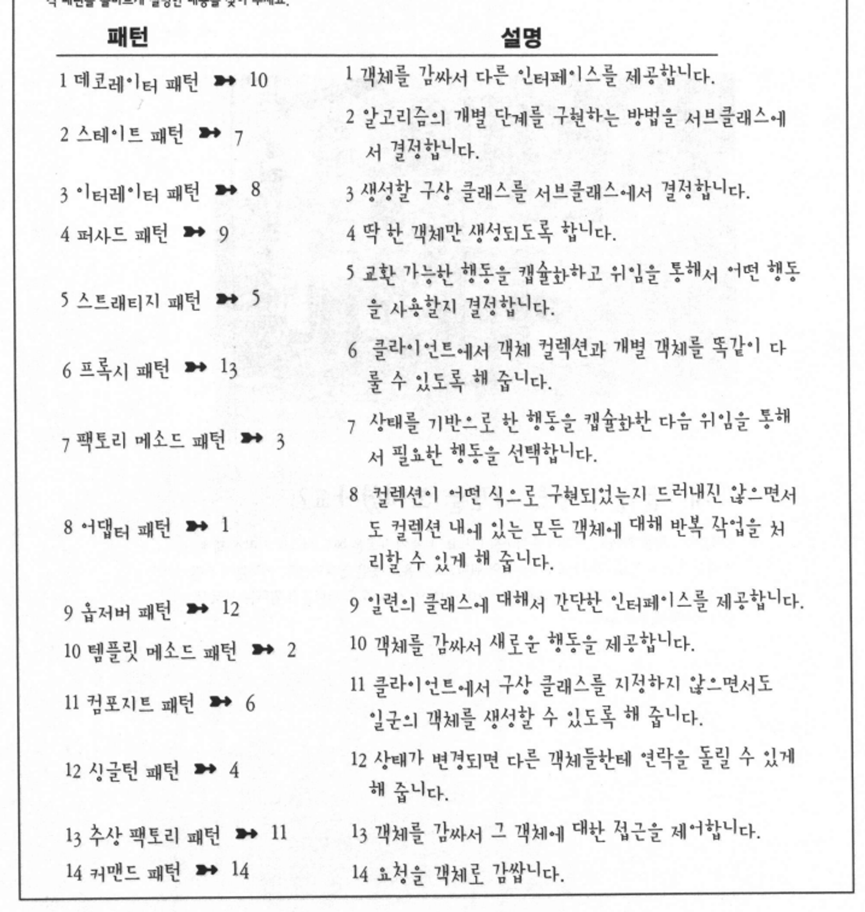

# 소개

# 디자인 패턴이란?

- 패턴이란 특정 문맥(Context) 내에서 주어진 문제에 대한 해결책이다.
    - Context : 패턴이 적용되는 상황. 반복적으로 일어나야 한다.
    - 문제 : 그 문맥 내에서 이루고자 하는 목적, 생길 수 있는 제약조건
    - 해결책 : 누구든지 적용해서 일련의 제약조건 내에서 목적을 달성할 수 있는 일반적인 디자인
- 어떤 문맥 내에서 일련의 제약조건에 의해 영향을 받을 수 있는 문제에 봉착 했다면, 그 제약조건 내에서 목적을 달성하기 위한 해결책을 찾아낼 수 있는 디자인을 적용하면 된다.
- 모든 패턴은 시스템의 일부분을 다른 부분과 독립적으로 변화시킬 수 있는 방법을 제공하기 위한 것이다.
- 디자인 패턴은 클래스와 객체를 구성하여 어떤 문제를 해결하는 방법을 제공한다. 즉, 디자인 패턴은 라이브러리나 프레임워크가 아니다.
- 패턴은 디자인을 할 때, 지금 디자인상의 문제에 적합하다는 확신이 들 경우에 패턴을 도입해야 한다.
- 실질적인 확장성만을 추구하고, 별 근거 없이 일반화시키지 말아야 한다. 꼭 필요한 부분에서만 확장성을 고려햐야 한다.

# Principle of Design

1. 애플리케이션에서 달라지는 부분을 찾아내고, 달라지지 않은 부분으로부터 분리시킨다. (캡슐화를 활용하라)
2. 구현이 아닌 인터페이스에 맞춰 프로그래밍한다. 
    - 상위 형식에 맞춰 프로그래밍한다. (다형성을 활용하라)
3. 상속보다는 구성(Composition)을 활용한다. 
    - 두 클래스를 A에는 B가 있다의 관계로 합친다.
4. 서로 상호작용을 하는 객체 사이에서는 가능하면 느슨하게 결합하는 디자인을 사용해야 한다. (상호의존성 최소화)
5. 클래스는 확장에 대해서는 열려 있어야 하지만, 코드 변경 환경에 대해서는 닫혀 있어야 한다. (OCP, Open-Closed Principle)
6. 추상화된 것에 의존하도록 만들어야 한다. 구상 클래스에 의존하도록 만들지 않아야 한다. (Dependency Inversion Principle, 의존성 뒤집기 원칙)
    - 고수준 구성요소가 저수준 구성요소에 의존하면 안 된다. 항상 추상화에 의존하라.
7. 최소 지식 원칙(Principle of Least Knowledge) : 정말 친한 친구하고만 이야기하라
    - 시스템을 디자인할 때, 어떤 객체든 그 객체와 상호작용을 하는 클래스의 개수에 주의해야 하며, 그런 객체들과 어떤 식으로 상호작용을 하는지에도 주의를 기울여야 한다.
    - 어떤 메소드에서든지 다음 네 종류의 객체의 메소드만을 호출하라
        - 객체 자체
        - 메소드에 매개변수로 전달된 객체
        - 그 메소드에서 생성하거나 인스턴스를 만든 객체
        - 그 객체에 속하는 구성 요소(인스턴스 변수에 의해 참조되는 객체)
    - 데메테르의 법칙(Law of Demeter)라는 말로도 사용된다.
8. 헐리우드 원칙(Hollywood Principle) : 먼저 연락하지 마세요, 저희가 연락 드리겠습니다.
    - 의존성 부패(Dependency rot)을 방지하기 위해 사용한다.
        - 어떤 고수준 구성요소가 저수준 구성요소에 의존하고, 저수준 구성요소는 다시 고수준 구성요소에 의존하는 식으로 의존성이 복잡하게 꼬여있는 것을 의존성 부패라고 한다.
    - 헐리우드 원칙을 사용하면, 저수준 구성요소에서 시스템에 접속은 할 수 있지만, 언제 어떤 식으로 그 구성요소를 사용할지는 고수준 구성요소에서 결정한다.
9. 클래스를 바꾸는 이유는 한 가지 뿐이어야 한다
    - 한 역할은 한 클래스에서만 맡게 해야 한다.

# 패턴의 범주

- 용도에 따른 범주
    
    
    
    - 생성 패턴(Creational pattern) : 객체 인스턴스 생성을 위한 패턴으로, 클라이언트와 그 클라이언트에서 생성해야 할 객체 인스턴스 사이의 연결을 끊어주는 패턴이다
    - 행동 패턴(Behavioral Pattern)은 클래스와 객체들이 상호작용하는 방법 및 역할을 분담하는 방법과 관련된 패턴이다
    - 구조 패턴(Structural pattern)은 클래스 및 객체들을 구성을 통해서 더 큰 구조로 만들 수 있게 해 주는 것과 관련된 패턴이다.
- 클래스를 다루는지, 객체를 다루는지에 따라 패턴을 분류하기도 한다.
    
    
    
    - 클래스 패턴(Class Pattern) 은 클래스 사이의 관계가 상속을 통해서 어떤 식으로 정의되는지를 다룬다. 클래스 패턴에서는 컴파일 시에 관계가 결정된다.
    - 객체 패턴(Object Pattern)에서는 객체 사이의 관계를 다루며, 객체 사이의 관계는 보통 구성을 통해서 정의된다. 객체 패턴에서는 일반적으로 실행 중에 관계가 생성되기 때문에 더 동적이고 유연하다.