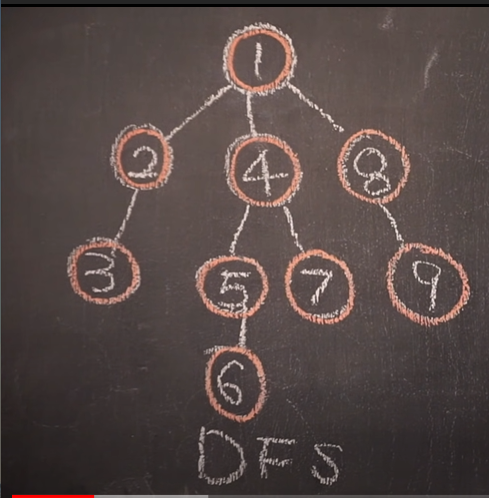

# 알고리즘 개인 정리

# DFS (깊이 우선 탐색)

- 개념
    - 루트 노드(혹은 다른 임의의 노드)에서 시작해서 다음 분기(branch)로 넘어가기 전에 해당 분기를 완벽하게 탐색하는 방법이다.
    - 넓게(wide) 탐색하기 전에 깊게(deep) 탐색하는 것.
    - 모든 노드를 방문 하고자 하는 경우에 선택한다.
    - 깊이 우선 탐색(DFS)이 너비 우선 탐색(BFS)보다 조금 더 간단하다.
    - 단순 검색 속도 자체는 BFS에 비해 느리다.
    - Node에서 Child Node를 끝까지 (깊이) 파고들어 탐색하는 것.
        
        
        
    - 재귀함수로 구현할 때는 노드에 방문 후 데이터 출력, 이후 자식들을 순서대로 재귀호출하는 방식으로 구현한다.
- 특징
    - 자기 자신을 호출하는 순환 알고리즘의 형태를 가지고 있다.
    - 전위 순회(Pre-Order Traversals)을 포함한 다른 형태의 트리 순회는 모두 DFS의 한 종류이다.
    - 가장 큰 차이점은 그래프 탐색의 경우 어떤 노드를 방문했었는지 여부를 반드시 검사해야 한다.
        
        
        
    - a 노드(시작 노드) 방문
    → 방문 노드는 방문했다고 표시
    - a와 인접한 노드 차례로 순회 
    → a와 인접 노드 없으면 종료
    - a와 이웃한 노드 b를 방문했다면, a와 인접한 또 다른 노드를 방문하기 전에 b의 이웃 노드들을 전부 방문해야 한다.
    → b를 시작 정점으로 DFS를 다시 시작하여 b의 이웃 노드들 방문
    - b의 분기를 전부 탐색했다면 다시 a에 인접한 정점들 중에서 아직 방문이 안 된 정점 탐색
    → 즉, b의 분기 완전 탐색 이후 a의 다른 노드 방문 가능.
    → 방문 안 된 정점 없으면 종료
    → 있으면 해당 점점을 시작 정점으로 DFS 다시 시행
- 구현
    - 구현 방법은 2가지가 있다.
    → 순환 호출 이용
    → 명시적인 스택(Stack) 사용
    → 명시적 스택을 사용하여 방문한 정점을 스택에 저장 후 다시 꺼내어 작업
    - 순환 호출을 이용한 DFS 의사코드(Pseudocode)
        
        ```java
        void search(Node root) {
          if (root == null) return;
          // 1. root 노드 방문
          visit(root);
          root.visited = true; // 1-1. 방문한 노드를 표시
          // 2. root 노드와 인접한 정점을 모두 방문
          for each (Node n in root.adjacent) {
            if (n.visited == false) { // 4. 방문하지 않은 정점을 찾는다.
              search(n); // 3. root 노드와 인접한 정점 정점을 시작 정점으로 DFS를 시작
            }
          }
        }
        
        ```
        
    - 순환 호출을 이용한 DFS 구현 (java
        
        ```java
        import java.io.*;
        import java.util.*;
        
        /* 인접 리스트를 이용한 방향성 있는 그래프 클래스 */
        class Graph {
          private int V;   // 노드의 개수
          private LinkedList<Integer> adj[]; // 인접 리스트
        
          /** 생성자 */
          Graph(int v) {
              V = v;
              adj = new LinkedList[v];
              for (int i=0; i<v; ++i) // 인접 리스트 초기화
                  adj[i] = new LinkedList();
          }
        
          /** 노드를 연결 v->w */
          void addEdge(int v, int w) { adj[v].add(w); }
        
          /** DFS에 의해 사용되는 함수 */
          void DFSUtil(int v, boolean visited[]) {
              // 현재 노드를 방문한 것으로 표시하고 값을 출력
              visited[v] = true;
              System.out.print(v + " ");
        
              // 방문한 노드와 인접한 모든 노드를 가져온다.
              Iterator<Integer> i = adj[v].listIterator();
              while (i.hasNext()) {
                  int n = i.next();
                  // 방문하지 않은 노드면 해당 노드를 시작 노드로 다시 DFSUtil 호출
                  if (!visited[n])
                      DFSUtil(n, visited); // 순환 호출
              }
          }
        
          /** 주어진 노드를 시작 노드로 DFS 탐색 */
          void DFS(int v) {
              // 노드의 방문 여부 판단 (초깃값: false)
              boolean visited[] = new boolean[V];
        
              // v를 시작 노드로 DFSUtil 순환 호출
              DFSUtil(v, visited);
          }
        
          /** DFS 탐색 */
          void DFS() {
              // 노드의 방문 여부 판단 (초깃값: false)
              boolean visited[] = new boolean[V];
        
              // 비연결형 그래프의 경우, 모든 정점을 하나씩 방문
              for (int i=0; i<V; ++i) {
                  if (visited[i] == false)
                      DFSUtil(i, visited);
              }
          }
        }
        
        ```
        
        ```java
        /** 사용 방법 */
        public static void main(String args[]) {
            Graph g = new Graph(4);
        
            g.addEdge(0, 1);
            g.addEdge(0, 2);
            g.addEdge(1, 2);
            g.addEdge(2, 0);
            g.addEdge(2, 3);
            g.addEdge(3, 3);
        
            g.DFS(2); /* 주어진 노드를 시작 노드로 DFS 탐색 */
            g.DFS(); /* 비연결형 그래프의 경우 */
        }
        
        ```
        
    - DFS 시간 복잡도 
    → DFS는 그래프(정점의 수 : N, 간선의 수 : E)의 모든 간선을 조회한다. 
    → 인접 리스트로 표현된 그래프 : O(N+E)
    → 인접 행렬로 표현된 그래프 : O(N^2)
    - 즉, 그래프 내에 적은 숫자의 간선만을 가지는 희소 그래프(Sparse Graph)의 경우 인접 행렬 보다 인접 리스트를 사용하는 것이 유리하다.
    - DFS는 Stack 구조로 하는 게 대표적인 방법이다.
    - 최초에는 Stack에 Node가 없으므로 Stack에 Node를 하나 담고 해당 Node의 Child Node를 탐색하는 방식으로 이루어진다.
    - 이때 Child Node를 다 담은 후에는 원본 Parent Node를 Stack에서 빼낸다.
        
        
        
- References
    
    [[알고리즘] 깊이 우선 탐색(DFS)이란 - Heee's Development Blog](https://gmlwjd9405.github.io/2018/08/14/algorithm-dfs.html)
    

# Dynamic Programming (동적 계획법)

- 개념
    - 복잡한 문제를 여러 개의 작은 부분 문제(Sub-Problem)로 나누어 해결하는 방법
    - Memoization을 이용하면 큰 문제로부터 빠른 속도로 최적의 해를 찾아낼 수 있다.
    - Memoization이란 반복되는 결과를 메모리에 저장해서 중복호출 되었을 때, 한 번 더 계산하지 않고 메모리에 저장해둔걸 가져와서 재활용하는 방식이다.
- 특징
    - Top-Down 방식과 Bottom-Up 방식이 있다.
    - Top-Down 방식은 큰 문제(Main Problem)에서 작은 부분 문제(Sub-Problem)를 재귀적으로 호출하여 리턴된 값으로 문제를 해결하는 방식이다. 아래의 코드는 피보나치 수열의 Top-Down 방식 구현의 의사코드.
        
        ```java
        Func(n) = Func(n-1) + Func(n-2);
        ```
        
    - Top-Down 방식은 재귀함수를 통해 구현되기 때문에 함수 호출에 대한 오버헤드가 발생한다는 단점이 있다.
    - 단, Memoization을 잘 활용하면 Bottom-Up보다 훨씬 빠르다.
    - Bottom-Up 방식은 작은 부분문제(Sub Problem)를 미리 계산해두고, 이 문제들을 모아 큰 문제를 해결하는 방식이다. 아래의 코드는 피보나치 수열의 Bottom-Up 방식 구현의 의사코드.
        
        ```java
        DP[1] = 1;
        DP[2] = 1;
        
        for(int i = 3; i < N; i++){
        	DP[1] = DP[i-2] + DP[i-1];
        }
        ```
        
    - Bottom-Up은 큰 문제를 해결하기 위해서 어떤 Sub-Problem이 요구되는지 몰라서 모든 부분 문제를 해결해야 한다는 단점이 있다.
    - 단, for문으로 구현되므로 자원이 비교적 자유로워 시간 및 메모리 최적화가 수월하다.
- 구현
    - 대표적인 문제로 Coin Change Problem을 구현한다.
    - 거스름돈을 줄 때 동전의 갯수를 최소화하는 로직을 짜는 문제로, Coin DP라고 한다. 코드는 다음과 같다.
        
        ```java
        import java.util.*;
         
        public class Main {
            public static void main(String args[]) {
                Scanner scanner = new Scanner(System.in);
         
                int n = scanner.nextInt();
                int k = scanner.nextInt();
         
                int coin[] = new int[n];
                for (int i = 0; i < n; i++) {
                    coin[i] = scanner.nextInt();
                }
         
                int d[] = new int[k + 1];
                for (int i = 1; i <= k; i++) {
                    d[i] = -1;
                    for (int j = 0; j < n; j++) {
                        if (coin[j] <= i) {
                            if (d[i - coin[j]] < 0) continue;
                            if (d[i] < 0) d[i] = d[i - coin[j]] + 1;
                            else if (d[i - coin[j]] + 1 < d[i]) d[i] = d[i - coin[j]] + 1;
                        }
                    }
                }
         
                System.out.println(d[k]);
            }
        }
        ```
        
    - int n 은 가지고 있는 동전의 갯수다. (1원 1개, 5원 1개, 11원 1개라면 n = 3)
    - int k 는 만들어야 하는 금액이다.
    - coin[i]는 동전의 액수다. (위 예시를 이어나가, 1원, 5원, 11원)
    - D[i]는 i원을 만들기 위해 필요한 동전의 최소 갯수다.
    - Coin에는 가지고 있는 동전의 가치이며, Coin[N] = {1, 5, 11}이라면, 거스름돈으로 1원, 5원, 11원짜리를 가지고 있음을 의미한다.
    - 우선 d[i] = -1;을 통해 Coin의 값을 초기화 한다.
    - 이후 i가 임의의 수일때, 임의의 수보다 작거나 같은 동전이 있는지 조건문을 통해 탐색한다. 편의상 A 조건문으로 칭한다.
        
        
        
    - 이후 d[i]가 -1이면 반복문을 진행하지 않는 조건문을 추가한다. 이는 가지고 있는 동적으로는 만들 수 없는 값을 탐색하기 위함이다. 예를 들어 2원, 5원, 11원을 가지고 있을 때, 8원을 만들 수 없는 경우를 예외처리하기 위함이다. 이를 B조건문이라 칭한다.
        
        
        
    - A조건문과 B 조건문으로 만들 수 있는 동전임을 증명하는 예외처리를 마친다. 이후에는 반복문을 통해 최소값을 찾기 위한 탐색을 진행한다.
        
        
        
    - D[i]가 -1이라면, 즉 구하려는 d원을 처음만났다면 일단 'i-Coin[j]원의 방법에 Coin[j]코인 1개를 더하는 방법'으로 값을 할당한다. 즉, d[6] = d[6 -5] + 1, 즉 d[1] + 1 의 의미는 1원을 만들기 위해 필요한 최소 동전의 갯수에 5원을 추가하여, 6원을 만들때 필요한 최소 동전의 갯수를 d[6]에 저장하겠다는 소리가 된다. → C 조건문
        
        
        
    - 위 조건문의 경우에는 i가 5일 때, d[4]까지 구해진 상태에서, 5원만 넣은 것과 (d[i]), 4원까지의 최소 값에 +1 한 것 (d[i - coin[j] + 1)을 비교했을 때, 더 작은 값을 넣는 조건문이다. 즉, 최소 가짓수를 위한 알고리즘.
- References
    
    [[알고리즘] Dynamic Programming (동적 계획법)](https://do-rang.tistory.com/9)
    

# LCS(Longest Common Substring[Subsequence])

- 개념
    - 최장 공통 부분 수열, 최장 공통 문자열을 의미한다.
    - 두 문자열에서 가장 긴 공통 부분 문자열을 구한다.
    - 현재 두 문자가 같을 때 두 문자의 앞 글자까지가 공통 문자열이라면 계속 공통 문자열이 이어지며, 아니라면 다시 공통 문자열을 만들어가게 되는 식으로 구현한다.
        
        
        
        
        
        
        
- 구현
    
    ```java
    package test;
    
    import java.io.BufferedReader;
    import java.io.IOException;
    import java.io.InputStreamReader;
    
    public class Test {
    
    	private static Integer[][] dp;
    	private static char[] word;
    	private static char[] word2;
    	private static StringBuilder sb = new StringBuilder();
    	public static void main(String[] args) throws IOException {
    
            BufferedReader br = new BufferedReader(new InputStreamReader(System.in));
            
            // 문자열 두 개를 입력받는다.
            word = br.readLine().toCharArray();
            word2 = br.readLine().toCharArray();
    
            // DP 배열 생성. 
            dp = new Integer[word.length][word2.length];
            
            // LCS 길이 구하기(Longest Common Substring)
            System.out.println(lcs(word.length - 1, word2.length - 1));
            
            // LCS 문자열 구하기(Longest Common Subsequence)
            getLCSToString(word.length - 1, word2.length - 1);
            System.out.println(sb.reverse().toString());
    	}
    	
    	// 최장 길이 문자열
    	private static int lcs(int x, int y) {
    		
    		// 문자열이 없을 경우의 예외처리 (길이 0)
    		if(x == -1 || y == -1) return 0;
    		
    		// dp 배열에 값이 채워지지 않았을 경우에 수행한다.
    		if(dp[x][y] == null) {
    			
    			// 초기값 0 
    			dp[x][y] = 0;
    			
    			// 비교 대상 두 문자열의 sequence가 같을 때
    			if(word[x] == word2[y]) 
    				// 이전 문자로 돌아가며 dp값을 1 늘인다(길이 + 1)
    				dp[x][y] = lcs(x - 1, y - 1) + 1;
    			
    			// 두 문자열이 다를 경우, 최장 길이 탐색이 종료되므로 최장 길이를 dp에 반환한다.
    			else dp[x][y] = Math.max(lcs(x - 1, y), lcs(x, y - 1));
    			
    		}
    		
    		// 최장 길이 문자열 반환
    		return dp[x][y];
    	}
    	
    	// 최장 길이 문자열 배열 구하기
    	private static void getLCSToString(int x, int y) {
    		
    		// 문자열이 없을 경우의 예외처리 (길이 0)
    		if(x == -1 || y == -1) return;
    		
    		// 탐색 범위 제한
    		if(x < word.length && y < word2.length && word[x] == word2[y]) {
    			
    			// 공통 문자열의 공통 문자를 append
    			sb.append(word[x]);
    			
    			// 범위를 이전값으로 축소하여 재귀
    			getLCSToString(x - 1, y - 1);
    			
    		// 탐색 범위 바깥일 때
    		} else {
    
    			// 범위를 축소하며 재귀 탐색을 수행한다.
    			if (x > 0 && (y == 0 || dp[x - 1][y] >= dp[x][y - 1])) getLCSToString(x - 1, y);
    			else if (y > 0) getLCSToString(x, y - 1);
    			
    		}
    	}
    	
    }
    ```
    

# 조합(Combination)

- 개념
    - n개의 숫자 중에서 r개의 수를 순서 없이 뽑는 경우.
    - depth를 활용한 완전 탐색으로 구한다.
- 구현
    
    ```java
    package test;
    
    import java.io.BufferedReader;
    import java.io.IOException;
    import java.io.InputStreamReader;
    import java.util.ArrayList;
    import java.util.Arrays;
    import java.util.List;
    
    public class Test {
    
    	private static int cnt;
    	public static void main(String[] args) throws IOException {
    
    		BufferedReader br = new BufferedReader(new InputStreamReader(System.in));
    
    		// n개의 수
    		int n = Integer.parseInt(br.readLine());
    		
    		// 조합이 담길 배열
    		int[] arr = new int[n];
    		// 초기화, 1부터 N까지
    		for(int i = 1; i <= n; i++) arr[i - 1] = i;
    		// 방문 여부를 기록할 boolean 배열
    		boolean[] visited = new boolean[n];
    		
    		// 메서드 실행, n개의 수 중 5개의 조합. 5개가 여러 개일 경우 for문 활용
    		comb(arr, visited, 0, n, 5);
    		
    		// 전역 변수 cnt로 총 몇 개의 조합인지 출력
    		System.out.println(cnt);
    		
    	}
    	
    	// 재귀 탐색으로 조합을 구하는 메서드
    	private static void comb(int[] arr, boolean[] visited, int depth, int n, int r) {
    		
    		// r == 0이면 탐색이 종료된 것이므로 cnt를 올리고 return 한다.
    		if(r == 0) { cnt++; return; }
    		
    		// depth == n 이면 그 이상의 조합을 구할 필요가 없으므로 return;
    		if(depth == n) return;
    		
    		// 탐색 여부를 true로 지정한다.
    		visited[depth] = true;
    		// 방문했을 경우 r을 -1
    		comb(arr, visited, depth + 1, n, r- 1);
    		
    		// 탐색 여부를 false로 지정한다.
    		visited[depth] = false;
    		// 아직 탐색하지 않았으므로 r은 그대로, depth범위만 하나 추가.
    		comb(arr, visited, depth + 1, n, r);
    		
    	}
    	
    }
    ```
    

# Two Pointer(투 포인터)

- 개념
    - 리스트에 순차적으로 접근해야 할 때 두 개의 점의 위치를 기록하면서 처리하는 알고리즘
    - O(N) 시간 복잡도
    - 정렬되어 있는 두 리스트의 합집합에도 사용되며, 병합정렬과 분할 정복 알고리즘의 기초가 되기도 한다.
- 구현
    - 백준 1806문제
        
        ```java
        package test;
        
        import java.io.BufferedReader;
        import java.io.IOException;
        import java.io.InputStreamReader;
        import java.util.Arrays;
        import java.util.Collections;
        import java.util.StringTokenizer;
        
        public class Test {
        
        	public static void main(String[] args) throws IOException {
        
                BufferedReader br = new BufferedReader(new InputStreamReader(System.in));
                StringTokenizer st = new StringTokenizer(br.readLine());
                
                // 수열의 길이
                int N = Integer.parseInt(st.nextToken());
                
                // 합을 구해야 하는 정수 
                int S = Integer.parseInt(st.nextToken());
                
                st = new StringTokenizer(br.readLine());
                int[] arr = new int[N + 1];
                
                // 수열 입력
                for(int i = 0; i < N; i++) arr[i] = Integer.parseInt(st.nextToken());
                
                // 변수 설정, 포인터의 시작과 끝인 start, end. 누적합을 기록할 sum, 필요 수열의 길이이자 답인 ans
                int start = 0, end = 0, sum = 0, ans = Integer.MAX_VALUE;
        
                // 포인터의 범위 처리, 시작점에서 올라가니 0 이하는 처리할 필요 없다.
                while(start <= end && end <= N) {
                	
                	// 수열의 누적합이 대상 정수 S보다 작으면 누적합에 수열의 마지막 포인터를 더하고 end + 1
                	if(sum < S) sum += arr[end++];
                	
                	// 수열의 누적합이 대상 정수 S 이상일 경우, == S일 경우에는 sum == S
                	else if(sum >= S) {
                		
                		// 두 포인터의 차이가 누적합을 구하기 위해 필요한 최소 길이 대상, 
                		ans = Math.min(end - start, ans);
                		
                		// 누적합에 수열의 시작 포인터를 감산한다.
                		sum -= arr[start++];
                	}
                }
                
                // 예외처리
                System.out.println(ans == Integer.MAX_VALUE ? 0 : ans);
        	}
        	
        	
        	
        }
        ```
        
    - 백준 2230번 문제
        
        ```java
        import java.io.*;
        import java.util.*;
        
        public class Main {
        
            public static void main(String[] args) throws IOException {
        
                BufferedReader br = new BufferedReader(new InputStreamReader(System.in));
                StringTokenizer st = new StringTokenizer(br.readLine());
        
                int n = Integer.parseInt(st.nextToken());
                int m = Integer.parseInt(st.nextToken());
        
                int[] arr = new int[n];
                for(int i = 0; i < n; i++) arr[i] = Integer.parseInt(br.readLine());
                Arrays.sort(arr);
        
        				int min = Integer.MAX_VALUE;
                int i = 0, j = 0;
        
                while(i < n) {
        
                    if(arr[i] - arr[j] < m) { i++; continue; }
        
                    if(arr[i] - arr[j] == m) { min = m; break; }
        
                    min = Math.min(min, arr[i] - arr[j]);
                    j++;
                }
        
                System.out.println(min);
        
            }
        }
        ```
        

# Binary Search(이분 탐색)

- 개념
    
    
    
    - 정렬되어 있는 리스트에서 탐색 범위를 절반씩 좁혀가며 데이터를 탐색하는 방법
    - 배열 내부의 데이터가 정렬되어 있어야만 한다.
    - start, mid, end 변수를 이용하며, 찾으려는 데이터와 중간점(mid)에 있는 데이터를 반복적으로 비교하여 원하는 데이터를 찾는다.
- 구현
    - 백준 14921번 구현
        
        ```java
        package test;
        
        import java.io.BufferedReader;
        import java.io.IOException;
        import java.io.InputStreamReader;
        import java.util.Arrays;
        import java.util.StringTokenizer;
        
        public class test {
        	
        	public static void main(String[] args) throws IOException {
        
        		BufferedReader br = new BufferedReader(new InputStreamReader(System.in));
        		int N = Integer.parseInt(br.readLine());
        
        		// 탐색할 리스트
        		int[] arr = new int[N];
        		StringTokenizer st = new StringTokenizer(br.readLine());
        		
        		// 리스트에 값 초기화
        		for(int i = 0; i < N; i++) arr[i] = Integer.parseInt(st.nextToken());
        		// 오름차순으로 정렬
        		Arrays.sort(arr);
        		
        		// 탐색값은 0에 가장 가까운 값이므로, 초기값은 Int 범위에서 0으로부터 제일 먼 값
        		int min = Integer.MAX_VALUE;
        		// 두 지점을 담을 변수
        		int[] answer = new int[2];
        		
        		// For문을 통해 배열을 전체 탐색 한다.
        		for(int i = 0; i < N; i++) {
        
        			// start와 end 변수 선언. 각각 for문의 시작과 끝점이 된다.
        			int start = i + 1;
        			int end = N - 1;
        			
        			// start <= end라면 계속 탐색하고 있는 것. 아니라면 탐색 범위가 종료된 것
        			while(start <= end) {
        				
        				// 중간 점은 (시작점 + 끝점) / 2
        				int mid = (start + end) / 2;
        				// 배열의 안에서 두 정수의 합이 가장 0으로부터 가까운 것이므로, for문의 시작점과 탐색점(mid)의 합으로 sum 변수 선언
        				int sum = arr[i] + arr[mid];
        				
        				// 절대값 기준 sum < min라면 탐색점인 sum이 기존 값보다 0보다 가까운 점이 된다.
        				if(Math.abs(sum) < min) {
        					
        					// 정답 배열에 시작점과 탐색점 대입
        					answer[0] = arr[i];
        					answer[1] = arr[mid];
        					
        					// 최소값 초기화
        					min = Math.abs(sum);
        				}
        				
        				// 배열은 오름차순으로 정렬되어 있으므로, sum이 0보다 작다면 시작점을 중간점의 윗점으로 올린다.
        				if(sum < 0) start = mid + 1;
        				
        				// 반대라면 끝점을 중간점의 아랫점으로 내린다.
        				else end = mid - 1;
        			}
        		}
        		
        		// 정답 출력
        		System.out.println(answer[0] + answer[1]);
        	}
        	
        	
        }
        ```
        

# D**ivide and Conquer**(분할 정복)

- 개념
    
    
    
    - 그대로 해결할 수 없는 문제를 작은 문제로 분할 하여 문제를 해결하는 방법.
    - 대표적인 예로는 퀵 정렬, 합병 정렬, 이진 탐색, 선택 문제, 고속 푸리에 변환이 있다.
    - 분할 정복 설계
        1. Divide
            - 원래 문제를 분할하여 비슷한 유형의 더 작은 하위 문제로 분할이 가능할 때 까지 나눈다.
        2. Conquer
            - 각 하위 문제를 재귀적으로 해결한다. 하위 문제의 규모가 나눌 수 없는 단위가 되면 탈출 조건을 설정하고 해결한다
        3. Combine
            - Conquer한 문제들을 통합하여 원래 문제의 답을 얻어 해결한다.
- 구현
    - 백준 24460번 문제
        
        ```java
        package test;
        
        import java.io.BufferedReader;
        import java.io.IOException;
        import java.io.InputStreamReader;
        import java.util.Arrays;
        import java.util.StringTokenizer;
        
        public class test {
        
        	// 최초 구역의 크기
        	private static int N;
        	// 최초 구역을 닮을 변수
        	private static int[][] arr;
        	public static void main(String[] args) throws IOException {
        
        		BufferedReader br = new BufferedReader(new InputStreamReader(System.in));
        		StringTokenizer st;
        
        		N = Integer.parseInt(br.readLine());
        		arr = new int[N][N];
        
        		// 구역 초기화
        		for(int i = 0; i < N; i++) {
        			
        			st = new StringTokenizer(br.readLine());
        			for(int j = 0; j < N; j++) {
        				arr[i][j] =  Integer.parseInt(st.nextToken());
        			}
        		}
        		
        		// Divide And Conquer 실행 결과값 출력
        		System.out.println(divide(0, 0, N));
        	}
        	
        	private static int divide(int row, int col, int size) {
        	
        		// 탈출 조건인 최소 구역 크기 2 이하일 경우 반환
        		if(size < 2) return arr[row][col];
        		
        		// 재 선정된 구역 크기 (/2)
        		int newSize = size / 2;
        		// 구역 안 요소들을 담을 변수
        		int[] temp = new int[4];
        		
        		// 분할
        		for(int i = 0; i < 4; i++) {
        
        			// 탐색 기준인 row & col 지정
        			int nr = row + (i % 2) * newSize;	// 0, 1, 0, 1
        			int nc = col + (i / 2) * newSize;	// 0, 0, 1, 1
        			
        			// 변수에 값 할당, Conquer
        			temp[i] = divide(nr, nc, newSize);
        			
        		}
        		
        		// 정렬 후
        		Arrays.sort(temp);
        		// 두 번째로 작은 값 반환
        		return temp[1];
        		
        	}
        	
        }
        ```
        

# Tower of Hanoi(하노이의 탑)

- 구현
    - 백준 1914번 문제
        
        ```java
        package test;
        
        import java.io.BufferedReader;
        import java.io.IOException;
        import java.io.InputStreamReader;
        import java.math.BigInteger;
        import java.util.ArrayList;
        import java.util.List;
        
        public class test {
        
        	private static List<int[]> hanoiList = new ArrayList<>();
        	public static void main(String[] args) throws IOException {
        
        		BufferedReader br = new BufferedReader(new InputStreamReader(System.in));
        		int N = Integer.parseInt(br.readLine());
        		
        		// N > 20 일 경우 long 범위를 벗어난다. BigInteger로 선언
        		BigInteger count = new BigInteger("2");
        		// 옮긴 횟수 공식
        		System.out.println(count.pow(N).subtract(new BigInteger("1")));
        
        		// N <= 20일 때만 과정 출력
        		if(N <= 20) {
        			
        			// 메서드 실행
        			hanoi(N, 1, 2, 3);
        			
        			for (int i = 0; i < hanoiList.size(); i++) {
        				
        				// 출력
                        int[] step = hanoiList.get(i);
                        System.out.println(step[0] + " " + step[1]);
                        
                    }
        		}
        		
        	}
        
        	// 하노이의 탑 구현 메서드
        	public static void hanoi(int n, int one, int two, int three) {
        		
        		// N == 1 일 경우 반환
        		if(n == 1) toArray(one, three);
        		else {
        			
        			// 재귀 호출, 원판의 위치를 바꾼다
        			hanoi(n-1, one, three, two);
        			toArray(one, three);
        			hanoi(n-1, two, one, three);
        		}
        	}
        
        	// 과정 출력을 위한 메서드
        	public static void toArray(int one, int two) {
        		int[] temp = new int[2];
        		temp[0] = one;
        		temp[1] = two;
        		hanoiList.add(temp);
        	}
        
        }
        ```
        

# Sweeping(스위핑)

- 개념
    - 한 쪽 방향부터 시작해서 다른 방향으로 스캔하면서 전체 길이를 구하는 알고리즘
    - 보통 좌표와 관련하여, 겹치는 부분을 제외한 모든 길이를 구하는 데 자주 사용된다.
    - 입력으로 들어오는 선분들을 시작점 기준으로 정렬하여 가장 왼쪽부터 차례로 풀이한다.
    - 이 때 겹치는 Case는 3가지로, 다음과 같다.
        - 선분이 새로 시작되는 경우(아예 겹치지 않는 경우)
        - 선분이 겹치지만 일부는 안 겹치는 경우 (선분 확장)
        - 선분이 기존에 그렸던 선분에 완전히 포함되는 경우
    - 들어온 선분이 a, b라고 했을 때의 Case는 다음과 같다.
        
        
        
        
        
        
        
- 구현
    - 백준 2170번 문제 기준
        
        ```java
        import java.io.BufferedReader;
        import java.io.IOException;
        import java.io.InputStreamReader;
        import java.util.Arrays;
        import java.util.StringTokenizer;
        
        public class Main {
        
            public static void main(String[] args) throws NumberFormatException, IOException {
                BufferedReader br = new BufferedReader(new InputStreamReader(System.in));
        
                // 전체 선을 그은 횟수
                int n = Integer.parseInt(br.readLine());
                // 입력 값을 받을 포인터 변수 배열
                int[][] point = new int[n][2];
        
                // 최초 입력
                for(int i = 0; i < n; i++) {
        
                    StringTokenizer st = new StringTokenizer(br.readLine());
        
                    point[i][0] = Integer.parseInt(st.nextToken());
                    point[i][1] = Integer.parseInt(st.nextToken());
        
                }
        	
                /*
                     선분은 정렬되어 있다는 언급이 없으므로 정렬한다.
                     x축이 겹치면 y축으로,
                     겹치지 않으면 x축 기준으로 오름차순 정렬
                 */
                Arrays.sort(point, (o1, o2) -> {
                    if(o1[0] == o2[0])  return o1[1] - o2[1];
                    else  return o1[0] - o2[0];
                });
        
                // 최초의 선분 지점
                int start = point[0][0];
                int end = point[0][1];
        
                // 정답이 될 최초의 길이는 y - x
                int len = end - start;
        
                // 배열의 길이만큼 순회한다.
                for(int i = 1; i < n; i++) {
        
                    // Case 3. 선분이 완전히 겹치는 경우
                    if(start <= point[i][0] && point[i][1] <= end) continue;
        
                    // Case 2. 선분이 일부만 겹치는 경우. 현재 선의 y좌표 - 이전 선의 y좌표
                    else if(point[i][0] < end) len += point[i][1] - end;
        
                    // Case 1. 선분이 완전히 겹치지 않는 경우. 현재 선의 y 좌표에서 x좌표의 값을 뺀 값을 더한다. (사이의 텀)
                    else len += point[i][1] - point[i][0];
        
                    // 매 순회마다 x축과 y축 갱신
                    start = point[i][0];
                    end = point[i][1];
                }
        
                // 정답 출력
                System.out.println(len);
        	}
        }
        ```
        
- 참조
    
    [[백준]2170: 선 긋기 - JAVA](https://moonsbeen.tistory.com/63)
    

# Sliding Window(슬라이딩 윈도우)

- 개념
    
    
    
    - 고정 사이즈의 윈도우가 이동하면서 윈도우 내에 있는 데이터를 이용해 문제를 풀이하는 알고리즘
    - 교집합의 정보를 공유하고, 차이가 나는 양쪽 끝 원소만 갱신하는 방법
    - 배열이나 리스트 요소의 일정 범위의 값을 비교할 때 사용하면 유용하다
    - 투 포인터 알고리즘과 연동하여 많이 사용된다.
        - 1차원 배열이 있고, 이 배열에서 각자 다른 원소를 가리키는 2개의 포인터를 조작하여 원하는 값을 얻는 형태
- 구현
    - 백준 21921번 구현
        
        ```java
        package test;
        
        import java.io.BufferedReader;
        import java.io.IOException;
        import java.io.InputStreamReader;
        import java.util.Arrays;
        import java.util.StringTokenizer;
        
        public class test {
        
        	public static void main(String[] args) throws IOException {
        
        		BufferedReader br = new BufferedReader(new InputStreamReader(System.in));
        		StringTokenizer st = new StringTokenizer(br.readLine());
        		
        		// 배열의 길이
        		int N = Integer.parseInt(st.nextToken());
        		// 윈도우의 크기
        		int X = Integer.parseInt(st.nextToken());
        
        		// 배열 선언
        		int[] arr = new int[N];
        		st = new StringTokenizer(br.readLine());
        		
        		// 배열 초기화
        		for(int i = 0; i < N; i++) arr[i] = Integer.parseInt(st.nextToken());
        
        		// 윈도우 안의 누적합을 저장할 변수
        		int sum = 0;
        		// 초기 최대값은 0부터 윈도우의 크기까지 순회하며 누적합
        		for(int i = 0; i < X; i++) sum += arr[i];
        		
        		// 최대값은 합계로 초기화
        		int max = sum;
        		// 최대값이 몇 개인지 기록할 변수
        		int maxCnt = 1;
        		
        		// 윈도우의 크기에서 배열의 끝까지 돌며 윈도우를 갱신한다
        		for(int i = X; i < N; i++) {
        			
        			// 갱신된 윈도우의 끝값을 더하고 처음값을 제한다.
        			sum += arr[i] - arr[i - X];
        			
        			// 기존 최대값과 합계가 일치하면 최대값의 갯수 + 1
        			if(max == sum) maxCnt++;
        			
        			// 합계가 최대값보다 클 경우 최댓값 갱신
        			else if(max < sum) {
        				max = sum;
        				maxCnt = 1;
        			}
        		}
        
        		// 출력
        		System.out.println(max == 0 ? "SAD" : max + "\n" + maxCnt);
        	}
        }
        ```
        

# Quad Tree (쿼드 트리)

- 개념
    - 쿼드 트리(Quad Tree)는 자식 노드가 4개인 트리 자료구조이다.
    - 보통 쿼드 트리의 경우 2차원 공간을 재귀적으로 4개의 영역으로 분할하여 데이터를 세분화 하는 방법으로 많이 사용된다.
        
        
        
    - 위와 같은 방식으로 각 레벨(깊이) 에서 현재의 평면을 4개로 쪼개고 각 쪼개어진 4개의 영역에 대해 유사성을 검증하여 하나의 영역으로 묶는 등의 필요한 과정을 처리할 수도 있고, 또는 쪼개어진 영역을 또 4개의 영역으로 쪼개어 재귀호출을 더 할 수도 있다.
    - 즉, 쿼드 트리는 공간을 분할시켜 각 영역에 대해 처리하고자 하는 알고리즘을 적용시키는 방법이다.
- 구현
    
    [코딩테스트 연습 - 쿼드압축 후 개수 세기](https://school.programmers.co.kr/learn/courses/30/lessons/68936)
    
    - 위 링크의 코딩테스트 구현 방법을 기준으로 코드 리뷰를 진행한다.
        
        ```java
        int[][] arr = {{1,1,1,1,1,1,1,1},{0,1,1,1,1,1,1,1},{0,0,0,0,1,1,1,1},{0,1,0,0,1,1,1,1},{0,0,0,0,0,0,1,1},{0,0,0,0,0,0,0,1},{0,0,0,0,1,0,0,1},{0,0,0,0,1,1,1,1}};
        ```
        
    - 위와 같은 2차원 배열이 있을 때, 동일한 숫자가 반복될 경우 하나의 숫자로 치환하는 문제였다.
        
        ```java
        public static StringBuilder sb = new StringBuilder();
        ```
        
    - 재귀 함수 구현 시 변경된 Tree 값을 저장하기 위한 static StringBuilder 변수 선언
        
        
        
    - 정답 제출용 1차원 배열 선언 및 초기화.
    - 2차원 배열의 평면 값을 위한 N 변수 선언. 주어진 1차원 배열의 길이(8)을 배열 하나의 길이로 삼기 위함이다.
    - 이후 QuadTree 메소드를 초기 x,y축 값인 0,0(왼쪽 최상단)과 배열의 크기 N, 주어진 이차원 배열 arr을 매개변수로 호출한다.
        
        
        
    - QuadTree 메소드는 isPossible 메서드를 통해(매개변수 동일) 주어진 이차원 배열의 값들이 일치하는지를 이중 for문으로 확인한다. boolean 타입으로 반환하며, true일 경우 주어진 배열 안의 모든 값들이 동일하다는 의미이므로 StringBuilder 변수에 append한 후 return한다.
        
        
        
    - isPossible() 메서드를 통해 주어진 이차원 배열 안의 모든 값들이 일치 하지 않았을 경우, 탐색 배열의 크기를 줄인다. 크기는 2를 나눠 정사각형 형태로 쪼갠다. 재귀 함수 호출 통해 포인터 x, y와 변경된 크기 newSize, 이차원 배열 arr을 매개변수로 다시 QuarTree() 메서드를 호출한다. QuardTree() 메서드는 호출 후 isPossible() 메서드를 통해 주어진 배열의 값이 모두 일치하는지를 확인하므로, 반으로 줄어든 배열
        
        ```java
        int[][] arr = {{1111},{0111},{0000},{0100}}
        ```
        
    - 에서 모든 값이 일치하는지를 다시 확인한다.
    - 주어진 문항 중 포인터 기준 두번째 (x, y + newSize, newSize, arr) 기준은 아래의 배열
        
        ```java
        int[][] arr = {{1111},{1111},{1111},{1111}}
        ```
        
    - 이므로, 모든 값이 일치한다고 판단 숫자를 합친다.
    - 위의 과정을 지속 반복, 더 이상 합쳐질 값이 없을 때 최종적으로 나오는 수가 합쳐진 쿼드 트리의 구조가 된다.
        
        
        
    - 총합 코드는 아래와 같다.
        
        ```java
        package codingTestLevel2;
        
        public class Lessons60 {
        	public static void main(String[] args) {
        
        		Lessons60 lessons60 = new Lessons60();
        		int[][] arr = {{1,1,1,1,1,1,1,1},{0,1,1,1,1,1,1,1},{0,0,0,0,1,1,1,1},{0,1,0,0,1,1,1,1},{0,0,0,0,0,0,1,1},{0,0,0,0,0,0,0,1},{0,0,0,0,1,0,0,1},{0,0,0,0,1,1,1,1}};
        		int[] answer = lessons60.solution(arr);
        		System.out.println("ANSER : " + answer);
        		
        	}
        	public static StringBuilder sb = new StringBuilder();
        	public int[] solution(int[][] arr) {
        		
        //		쿼드압축 후 개수 세기
        //		0과 1로 이루어진 2n x 2n 크기의 2차원 정수 배열 arr이 있습니다. 당신은 이 arr을 쿼드 트리와 같은 방식으로 압축하고자 합니다. 구체적인 방식은 다음과 같습니다.
        //
        //		당신이 압축하고자 하는 특정 영역을 S라고 정의합니다.
        //		만약 S 내부에 있는 모든 수가 같은 값이라면, S를 해당 수 하나로 압축시킵니다.
        //		그렇지 않다면, S를 정확히 4개의 균일한 정사각형 영역(입출력 예를 참고해주시기 바랍니다.)으로 쪼갠 뒤, 각 정사각형 영역에 대해 같은 방식의 압축을 시도합니다.
        //		arr이 매개변수로 주어집니다. 위와 같은 방식으로 arr을 압축했을 때, 배열에 최종적으로 남는 0의 개수와 1의 개수를 배열에 담아서 return 하도록 solution 함수를 완성해주세요.
        				
        				
            int[] answer = new int[2];
                    
        		int N = arr.length;
        		QuadTree(0, 0, N, arr);
        		
        		int zero = 0;
        		int one = 0;
        		for (int i = 0; i < sb.length(); i++) {
        			if(sb.charAt(i) == '0') {
        				zero++;
        			} else if(sb.charAt(i) == '1') {
        				one++;
        			}
        		}
        		answer[0] = zero;
        		answer[1] = one;
        				
        		return answer;
            }
            
            public static void QuadTree(int x, int y, int size, int[][] arr) {
        		
        		if(isPossible(x, y, size, arr)) {
        			sb.append(arr[x][y]);
        			return;
        		}
        		int newSize = size / 2;	
        			
        		QuadTree(x, y, newSize, arr);		
        		QuadTree(x, y + newSize, newSize, arr);				
        		QuadTree(x + newSize, y, newSize, arr);				
        		QuadTree(x + newSize, y + newSize, newSize, arr);	
        				
        	}
        	
        	public static boolean isPossible(int x, int y, int size, int[][] arr) {
        		int value = arr[x][y];
        		for(int i = x; i < x + size; i++) {
        			for(int j = y; j < y + size; j++) {
        				if(value != arr[i][j]) {
        					return false;
        				}
        			}
        		}
        		
        		return true;
        	}
        }
        ```
        
    - 아래는 쿼드 트리의 구현 과정 그림
        
        
        
    

# Segement Tree (세그먼트 트리)

- 개념
    - 여러 개의 데이터가 있을 때 특정 구간의 합, 최솟값, 최댓값, 곱 등을 구하는 데 사용되는 자료구조.
    - 트리 종류 중 하나로 이진 트리의 형태이며, 특정 구간의 합을 가장 빠르게 구할 수 있다는 장점이 있다.
    - 시간 복잡도는 O(logN).
    - 구현 방식은 다음과 같다.
        1. 구간 합 트리 생성하기
            - 최상단 노드에는 전체 원소를 더한 값이 들어간다
            - 이후 두 번째와 세번째는 중간값을 기준으로 start ~ mid, mid ~ end의 원소를 구한 값을 구한다.
            - 이를 계속 확장하여 전체 구간 합 트리의 전체 노드를 구할 수 있다.
            - 이 때 구간 합 트리에 한해서는 인덱스 번호가 1부터 시작한다.
            - 일반적으로 재귀적으로 구현한다.
                
                ```java
                // start : 시작 인덱스, end : 끝 인덱스
                int init(int start, int end, int node) {
                	
                	if(start == end) return tree[node] = arr[start];
                	int mid = (start + end) / 2;
                	
                	// 투 포인터 방식으로 구간을 나눈 뒤 그 합을 자기 자신으로 한다.
                	return tree[node] = init(start, mid, node * 2) + init(mid + 1, end, node * 2 + 1);
                }
                ```
                
            - 구간 합 트리는 매 노드가 이미 구간의 합을 가지고 있는 형태가 된다. 이 때 노드의 인덱스와 구간의 합은 별개의 값이다.
            - 구간 합 트리의 원소 개수는 데이터의 개수가 N일 때 N보다 큰 가장 가까운 N의 제곱수를 구한 뒤 그것의 2배까지 미리 배열의 크기를 만들어야 한다.
                - ⇒ 보통 * 4
        2. 구간 합을 구하는 함수 만들기
            - 구간 합 트리 구조를 가지고 있기에 데이터 탐색에 드는 비용은 O(logN)이다.
            - 구간의 합은 범위 안에 있는 경우에 한해서만 더한다. 그 밖의 경우는 고려하지 않는다.
                
                ```java
                int sum(int start, int end, int node, int left, int right) {
                
                	// 범위 밖에 있는 경우
                	if(left > end || right < start) return 0;
                
                	// 범위 안에 있는 경우
                	if(left <= start && end <= right) return tree[node];
                
                	// 그렇지 않다면 투 포인터로 나누어 합을 구하기 
                	int mid = (start + end) / 2;
                	return sum(start, mid, node * 2, left, right) + sum(mid + 1, end, node * 2 + 1, left, rigth);
                }
                ```
                
        3. 특정 원소의 값을 수정하는 함수 만들기
            - 특정 원소의 값을 수정할 때는 해당 원소를 포함하고 있는 모든 구간 합 노드들을 갱신한다.
            - 마찬가지로 재귀적으로 구현한다. 수정할 노드로는 범위 안에 있는 경우에 한해서 구한다.
                
                ```java
                void update(int start, int end, int node, int index, int dif) {
                	
                	// 범위 밖에 있는 경우
                	if(index < start || index > end) return;
                	
                	// 범위 안에 있으면 내려가며 다른 원소도 갱신
                	tree[node] += dif;
                	if(start == end) return;
                	int mid = (start + end) / 2;
                	update(start, mid, node * 2, index, dif);
                	update(mid + 1, end, node * 2 + 1, index, dif);
                }
                ```
                
- 구현
    - 백준 2243
        
        ```java
        package Test;
        import java.io.BufferedReader;
        import java.io.IOException;
        import java.io.InputStreamReader;
        import java.util.*;
        
        public class Main {
        
            // Segment Tree
            public static class CandyBox {
                int size;
                int[] candy, tree;
        
                public CandyBox() {
        
                    // 사탕 맛의 종류
                    int len = 1 << 20;
                    // 사탕을 담을 배열
                    this.candy = new int[1000001];
                    // 세그먼트 트리의 길이 (맛의 종류 * 2)
                    this.tree = new int[len * 2];
                    // 사탕의 종류
                    this.size = 1000000;
                }
        
                // 사탕을 집어 넣는 메서드
                public void putCandy(int taste, int num) {
        
                    // 세그먼트 트리 업데이트 후
                    update(1, size, 1, taste, num);
        
                    // 캔디의 양 조절
                    candy[taste] += num;
                }
        
                // 사탕을 꺼내는 메서드
                public int getCandy(int rank) {
        
                    // 세그먼트 트리 업데이트 후
                    int result = update(1, size, 1, rank);
        
                    // 캔디의 양 조절
                    candy[result]--;
        
                    // 반환값은 차감된 트리의 인덱스(맛의 번호)
                    return result;
                }
        
                // 사탕을 집어 넣은 뒤 세그먼트 트리 업데이트
                public void update(int start, int end, int node, int taste, int num) {
        
                    // 투 포인터 탐색 예외처리
                    if(taste < start || end < taste) return;
        
                    // 세그먼트 트리 업데이트
                    tree[node] += num;
        
                    // 예외처리
                    if(start == end) return;
        
                    // 투 포인터 탐색을 위한 중앙 값 지정
                    int mid = (start + end) >> 1;
        
                    // 재귀 탐색으로 투 포인터 탐색, (1 ~ mid)
                    update(start, mid, node * 2, taste, num);
                    // 재귀 탐색으로 투 포인터 탐색, (mid ~ end)
                    update(mid + 1, end, node * 2 + 1, taste, num);
        
                }
        
                // 사탕을 꺼낸 후 세그먼트 트리 업데이트
                public int update(int start, int end, int node, int rank) {
        
                    // 사탕의 갯수 차감 후
                    tree[node]--;
        
                    // 투 포인터 탐색을 위한 탈출문
                    if(start == end) return start;
        
                    // 투 포인터 탐색을 위한 중앙 값
                    int mid = (start + end) >> 1;
        
                    // 투 포인터 탐색, (start ~ mid)
                    if(tree[node * 2] >= rank) return update(start, mid, node * 2, rank);
        
                    // 투 포인터 탐색, (mid ~ end)
                    else return update(mid + 1, end, node * 2 + 1, rank - tree[node * 2]);
                }
            }
        
            public static void main(String[] args) throws NumberFormatException, IOException {
        
                BufferedReader br = new BufferedReader(new InputStreamReader(System.in));
                StringBuilder sb = new StringBuilder();
                CandyBox candyBox = new CandyBox();
        
                int n = Integer.parseInt(br.readLine());
        
                while(n --> 0) {
        
                    StringTokenizer st = new StringTokenizer(br.readLine());
        
                    // 입력 값에 따른 get, put 메서드 실행
                    if(Integer.parseInt(st.nextToken()) == 1) sb.append(candyBox.getCandy(Integer.parseInt(st.nextToken()))).append('\n');
                    else candyBox.putCandy(Integer.parseInt(st.nextToken()), Integer.parseInt(st.nextToken()));
        
                }
                System.out.println(sb);
                br.close();
            }
        }
        ```
        
    - 백준 10090
        
        ```java
        import java.io.*;
        import java.util.*;
        
        public class Main {
        
            // 세그먼트 트리
            private static int[] tree;
            public static void main(String[] args) throws IOException {
        
                BufferedReader br = new BufferedReader(new InputStreamReader(System.in));
                int n = Integer.parseInt(br.readLine());
        
                StringTokenizer st = new StringTokenizer(br.readLine());
                int[] arr = new int[n + 1];
        
                // 수열
                for(int i = 1; i <= n; i++) arr[i] = Integer.parseInt(st.nextToken());
        
                // 세그먼트 트리의 크기는 수열의 크기 * 4로 지정한다.
                tree = new int[n * 4];
                // 인트 범위 초과로 long 타입 합계 변수
                long res = 0;
        
                // 역순으로 계산.
                for(int i = n; i > 0; i--) {
        
                    // 수열의 요소
                    int x = arr[i];
        
                    //  트리의 구간합을 구해 더한다.
                    res += query(1, n, 1, 1, x - 1);
                    // 세그먼트 트리 업데이트
                    update(1, n, 1, x);
                }
        
                // 출력
                System.out.println(res);
        
            }
        
            // 세그먼트 트리 업데이트 메서드
            private static int update(int start, int end, int node, int idx) {
        
                // 수열의 범위 지정 및 투포인터 탐색 범위
                if(end < idx || idx < start) return tree[node];
                if(start == end) return tree[node] += 1 ;
        
                // 투 포인터 탐색을 위한 mid 값
                int mid = (start + end) / 2;
        
                // 트리의 노드 값은 투 포인터 방식으로 재귀 구현
                return tree[node] = update(start, mid, node * 2, idx) +
                                    update(mid + 1, end, node * 2 + 1, idx);
            }
        
            // 구간 합 탐색 메서드
        		private static int query(int start, int end, int node, int left, int right) {
        
                if(right < start || end < left) return 0;
                if(left <= start && end <= right) return tree[node];
        
                int mid = (start + end) / 2;
                return query(start, mid, node * 2, left, right) +
                        query(mid + 1, end, node * 2 + 1, left, right);
        
            }
        }
        ```
        

# Union-Find

- 개념
    - 그래프 알고리즘으로 합집합 찾기의 의미를 가지고 있다.
    - 상호 배타적 집합(Disjoint-set)이라고도 한다.
    - 여러 노드가 존재할 때, 두 개의 노드를 선택해서 현재 두 노드가 서로 같은 그래프에 속하는지 판별하는 알고리즘이다.
    - Find, Union 두 연산으로 이루어져 있다.
        - Find : x가 어떤 집합에 포함되어 있는지 판별하는 연산
        - Union : x와 y가 포함되어 있는 집합을 합치는 연산
- 구현
    - 백준 1976번 구현
        
        ```java
        import java.io.*;
        import java.util.*;
        
        public class Main {
        
            private static int[] parent;
            public static void main(String[] args) throws IOException {
        
                BufferedReader br = new BufferedReader(new InputStreamReader(System.in));
                StringTokenizer st;
        
                int n = Integer.parseInt(br.readLine());
                int m = Integer.parseInt(br.readLine());
        
                // 집합을 담을 int[] 변수 초기화
                parent = new int[n + 1];
                // 모든 값이 자기 자신을 가리키도록 만든다.
                for(int i = 1; i <= n; i++) parent[i] = i;
        
                // 그래프의 수만큼 반복
                for(int i = 1; i <= n; i++) {
                    st = new StringTokenizer(br.readLine());
        
                    for(int j = 1; j <= n; j++) {
                        int temp = Integer.parseInt(st.nextToken());
        
                        // 두 노드 간 연결이 되어 있다면 노드를 연결한다. union(x, y) 연산
                        if(temp == 1) union(i, j);
                    }
                }
        
                st = new StringTokenizer(br.readLine());
                int start = find(Integer.parseInt(st.nextToken()));
        
                for(int i = 1; i < m; i++) {
        
                    int now = Integer.parseInt(st.nextToken());
        
                    // 시작 점이 목표점의 부모에 해당하는지 판별한다.
                    if(start != find(now)) {
        
                        // 아니라면 연결점이 없다는 의미이므로 NO를 출력하고 연산 종료
                        System.out.println("NO");
                        br.close();
                        return;
                    }
                }
        
                // 모든 시작 점이 목표점의 부모에 해당한다면 YES 출력
                System.out.println("YES");
                br.close();
        
            }
        
            // Find 연산
            private static int find(int x) {
        
                // x가 부모에 해당한다면 반환
                if (x == parent[x]) return x;
        
                // 아니라면 재귀 탐색으로 부모를 거슬러 올라간다.
                return parent[x] = find(parent[x]);
            }
        
            private static void union(int x, int y) {
        
                x = find(x);
                y = find(y);
        
                if(x != y) {
        
                    // 부모를 합칠 때는 일반적으로 더 작은 값 쪽으로 합친다.
                    if(x < y) parent[y] = x;
                    else parent[x] = y;
                }
            }
        }
        ```
        

# Spanning Tree(스패닝 트리)

- 개념
    
    
    
    - ST ⇒ 그래프 내의 모든 정점을 포함하는 트리
    - 신장 트리라고도 한다.
    - 그래프의 최소 연결 부분 그래프이며
        - 최소 연결 ⇒ 간선의 수가 가장 적다
        - 그래프에서 일부 간선을 선택해서 만든 트리이다.
    - DFS, BFS를 이용하거나 유니온 파인드 알고리즘을 이용하여 구할 수 있다.
        - ⇒ 탐색 도중에 사용된 간선만 모아 만들 수 있다.
    - 스패닝 트리는 트리의 특수한 형태이므로 모든 정점들이 연결 되어 있어야 하고, 사이클을 포함해서는 안된다.
    - 따라서 스패닝 트리는 그래프에 있는 n개의 정점을 정확히(n-1)개의 간선으로 연결한다.
        
        ## MST(Minimum Spanning Tree, 최소 신장 트리)
        
        - 각 간선의 가중치가 동일하지 않을 때 단순히 가장 적은 간선을 사용한다고 해서 최소 비용이 얻어지는 것은 아니다.
        - MST는 간선에 가중치를 고려하여 최소 비용의 스패닝 트리를 선택하는 것이다.
        - 즉, 네트워크(가중치를 간선에 할당한 그래프)에 있는 모든 정점들을 가장 적은 수의 간선과 비용으로 연결하는 것.
            - 간선의 가중치와 합이 최소여야 한다.
            - n개의 정점을 가지는 그래프에 대해 반드시 (n-1)개의 간선만을 사용해야 한다.
            - 사이클이 포함되어서는 안 된다.
- 구현
    - Kruskal MST 알고리즘
        - 백준 2887 [https://www.acmicpc.net/problem/2887](https://www.acmicpc.net/problem/2887)
            
            ```java
            import java.io.*;
            import java.util.*;
            
            public class Main {
            
                // 그래프 Class
                private static class Point implements Comparable<Point> {
            
                    int x;
                    int y;
                    int z;
            
                    public Point(int x, int y, int z) {
                        this.x = x;
                        this.y = y;
                        this.z = z;
                    }
            
                    @Override
                    public int compareTo(Point point) {
                        return this.z - point.z;
                    }
                }
            
                // 정점의 부모를 기록하기 위한 static 변수
                private static int[] parents;
                public static void main(String[] args) throws IOException {
            
                    BufferedReader br = new BufferedReader(new InputStreamReader(System.in));
                    StringTokenizer st;
            
                    int n = Integer.parseInt(br.readLine());
            
                    // 행성에 대한 초기 데이터를 입력받아 List에 저장한다.
                    List<int[]> data = new ArrayList<>();
            
                    for(int i = 0; i < n; i++) {
            
                        st = new StringTokenizer(br.readLine());
            
                        int x = Integer.parseInt(st.nextToken());
                        int y = Integer.parseInt(st.nextToken());
                        int z = Integer.parseInt(st.nextToken());
            
                        data.add(new int[] {i, x, y, z});
                    }
            
                    // 우선순위 큐 + 유니온 파인드인 크루스칼 알고리즘으로 최소 신장 트리를 구한다.
                    PriorityQueue<Point> q = new PriorityQueue<>();
            
                    // x, y, z 좌표에 대한 최소값을 각각 구해야 하므로 for문을 3번 수행한다.
                    for(int idx = 1; idx <= 3; idx++) {
            
                        int vector = idx;
                        // 각 x, y, z 좌표 순으로 오름차순 정렬한 뒤 인접한 정점끼리의 거리를 구한다.
                        data.sort(Comparator.comparingInt(o -> o[vector]));
            
                        // 각 x, y, z 좌표에 대해 입력받은 노드의 숫자만큼 반복문을 수행
                        for(int i = 1; i < n; i++) {
            
                            int[] p1 = data.get(i - 1);
                            int[] p2 = data.get(i);
                            // 좌표 간의 거리 계산
                            int dis = Math.abs(p1[idx] - p2[idx]);
            
                            // p1과 p2에 대한 간선 데이터를 큐에 저장한다.
                            q.add(new Point(p1[0], p2[0], dis));
            
                        }
                    }
            
                    // 각 노드간 연결을 확인하기 위한 parents 변수
                    parents = new int[n];
                    for(int i = 0; i < n; i++) parents[i] = i;
            
                    // 최소 비용 변수
                    int min = 0;
                    // 크루스칼 알고리즘 시작
                    while(!q.isEmpty()) {
            
                        // 각 좌표를 꺼낸 뒤
                        Point point = q.poll();
                        // 유니온 파인드로 각 좌표의 부모를 구하는 방식(재귀)으로 최소 비용을 구한다.
                        int rx = find(point.x);
                        int ry = find(point.y);
            
                        // 루트 노드가 일치하지 않는다면 비용을 더한다.
                        if(rx != ry) {
            
                            // 최소 비용에 비용을 더한 뒤
                            min += point.z;
                            // 해당 노드를 연결한다.
                            union(point.x, point.y);
                        }
                    }
            
                    // 최소 비용 출력
                    System.out.println(min);
            
                }
            
                // 유니온 파인드 Find 알고리즘
                private static int find(int x) {
            
                    // x가 부모에 해당한다면 반환
                    if(parents[x] == x) return x;
            
                    // 아니라면 재귀 탐색으로 부모 검색
                    return parents[x] = find(parents[x]);
                }
            
                // 유니온 파인트 Union 연산
                private static void union(int x, int y) {
            
                    // 각 정점에 대한 부모를 구한다.
                    x = find(x);
                    y = find(y);
            
                    // x < y라면 계산의 편의를 위해 x와 y를 변경한다.
                    if(x < y) {
                        int tmp = x;
                        x = y;
                        y = tmp;
                    }
            
                    parents[y] = x;
                }
            }
            ```
            

# Floyd Warshall (플로이드 와샬)

- 개념
    
    <aside>
    💡 Floyd Warshall 알고리즘의 핵심 아이디어는 ‘거쳐가는 정점’을 기준으로 최단 거리를 구하는 것.
    
    </aside>
    
    - Floyd Warshall 알고리즘은 ‘모든 정점’에서 ‘모든 정점’으로의 최단 경로를 구하고 싶을 때 사용한다.  거쳐가는 정점을 기준으로 알고리즘을 수행한다.
    - Floyd Warshall 알고리즘은 기본적으로 Dynamic Programming 기술에 의거한다.
        
        
        
    - 위와 같은 그래프가 존재할 때, 각각의 정점이 다른 정점으로 가는 비용을 이차원 배열의 형태로 출력하면 다음과 같다.
        
        
        
    - 이제 위 테이블이 의미하는 바는 ‘현재까지 계산된 최소 비용’이 된다. 이러한 이차원 배열을 반복적으로 갱신하여 최종적으로 모든 최소 비용을 구하는 것이 Floyd Warshall 알고리즘. 이러한 반복의 기준이 ‘거쳐가는 정점’이 된다.
        
        
        
    - 노드 1을 거쳐가는 경우는 위의 노란색 6칸을 새로 갱신해야 된다. 갱신 기준은 X에서 Y로 가는 최소 비용 VS X에서 노드1로 가는 비용 + 노드 1에서 Y로 가는 비용 중 최소값이 된다.
        
        
        
    - 위와 같은 방식으로 노드 2, 3, 4에 대해 반복 수행 시, 최종 결과값은 다음과 같은 2차원 배열의 형태를 띄게 된다.
        
        
        
- 구현
    - 기본 설계
        
        ```java
        package floyd_Warshall;
        
        public class Floyd_Warshall {
        
        	static int number = 4;
        	static int INF = 10000000;
        	
        	// 노드 배열 초기화
        	static int[][] node = {
        							{0, 5, INF, 8},
        							{7, 0, 9, INF},
        							{2, INF, 0, 4},
        							{INF, INF, 3, 0}
        						  };
        	
        	public static void main(String[] args) {
        
        		// 결과 그래프 초기화
        		int[][] ans = new int[number][number];
        		
        		// 결과 그래프 초기화
        		for(int i = 0; i < number; i++) {
        			
        			for(int j = 0; j < number; j++) {
        				ans[i][j] = node[i][j];
        			}
        		}
        		
        		// k = 거쳐가는 노드
        		for(int k = 0; k < number; k++) {
        			
        			//i = 출발 노드
        			for(int i = 0; i < number; i++) {
        				
        				// j = 도착 노드
        				for(int j = 0; j < number; j++) {
        					
        					if(ans[i][k] + ans[k][j] < ans[i][j]) {
        						ans[i][j] = ans[i][k] + ans[k][j];
        					}
        				}
        			}
        		}
        		
        		// 결과 출력
        		for(int i = 0; i < number; i++) {
        			for(int j = 0; j < number; j++) System.out.print(ans[i][j] + " ");
        			System.out.println();
        		}
        		
        	}
        
        }
        ```
        
        
        
    - 백준 11404번 문제
        
        ```java
        package javajungsuk;
        
        import java.io.BufferedReader;
        import java.io.IOException;
        import java.io.InputStreamReader;
        import java.util.StringTokenizer;
        
        public class CodingTest { 
        	
        	private static final int INF = 999999999;
        	public static void main(String[] args) throws IOException{ 
        		
        		BufferedReader br = new BufferedReader(new InputStreamReader(System.in));
        		StringBuilder sb = new StringBuilder();
        		StringTokenizer st;
        		
        		int n = Integer.parseInt(br.readLine());
        		int m = Integer.parseInt(br.readLine());
        		
        		int[][] dist = new int[n + 1][n + 1];
        		
        		for(int i = 1; i <= n; i++) {
        			
        			for(int j = 1; j <= n; j++) {
        				
        				if(i == j) dist[i][j] = 0;
        				else dist[i][j] = INF;
        				
        			}
        		}
        		
        		for(int i = 0; i < m; i++) {
        			
        			st = new StringTokenizer(br.readLine());
        			
        			int a = Integer.parseInt(st.nextToken());
        			int b = Integer.parseInt(st.nextToken());
        			int c = Integer.parseInt(st.nextToken());
        			
        			dist[a][b] = Math.min(dist[a][b], c);
        		}
        		
        		for (int k = 1; k <= n; k++) {
        			
                    for (int i = 1; i <= n; i++) { 
                    	
                        for (int j = 1; j <= n; j++) {
                        	
                            if (dist[i][j] > dist[i][k] + dist[k][j]) {
                            	
                                dist[i][j] = dist[i][k] + dist[k][j];
                                
                            }
                        }
                    }
        		}
        		
        		for(int i = 1; i <= n; i++) {
        			
        			for(int j = 1; j <= n; j++) {
        				
        				if(dist[i][j] == INF) sb.append("0 ");
        				else sb.append(dist[i][j] + " ");
        			}
        			
        			sb.append("\n");
        		}
        		
        		System.out.println(sb);
        	} 
        }
        ```
        

# Bellman-Ford (벨만-포드)

- 개념
    - 한 노드에서 다른 노드까지의 최단 거리를 구하는 알고리즘
    - 음의 가중치를 갖는 간선이 있을 때 사용한다
    - 매 단계마다 모든 간선을 전부 확인하면서 모든 노드간의 최단 거리를 구해나간다
    - 시간 복잡도가 느리다.
    - 벨만-포드 알고리즘으로 음수 순환을 찾는 방법은 N번째 사이클에서도 최단 거리가 생신되면 음수 순환이 있다고 판단하는 것이다.
        - ⇒ 한 사이클은 모든 경로를 탐색하여 최단 경로를 찾는 것이다. 한 사이클에 최소 1개의 경로만 탐색 된다고 가정한다.
        - ⇒ 최단 경로는 최대 N개의 정점을 가지기에 최대 N - 1개의 간선으로 최단 경로 그래프를 만들 수 있다.
        - ⇒ 따라서 모든 간선에 대한 거리 축소 과정을 구하는 횟수는 최대 N - 1번으로 가능하다.
    - 음수 사이클이 없는 그래프에서는 최단 경로가 한 정점을 두 번 지날 수 없다.
    - 즉, 벨만-포드 알고리즘은 N-1번 안에 모든 간선에 대한 최단 경로를 찾을 수 있는데 N번째에도 최단 경로가 갱신 된다면 음수 순환 싸이클이 있어 최단 경로를 구할 수 없음을 알 수 있게 된다.
- 구현
    - 백준 1865번 문제를 기준으로 한다.
    - 설계 방식은 다음과 같다.
        1. 그래프의 간선 데이터를 저장한다
            1. m번째 까지는 무방향 간선이므로 양방향 모두 저장해주고, m ~ w - 1까지는 음수 간선이므로 -t의 가중치를 저장한다.
        2. 컴포넌트가 1개 이상일 수 있기에 모든 정점을 벨만포드 알고리즘을 돌려줘야 한다. (for i ~ n bellmanford(i)
            1. 음수 사이클이 있으면 true를 반환한다. 
            2. 간선의 수가 많아 반복문이 무한 반복을 일으킬 수 있기에 갱신이 더 이상 일어나지 않는다면 반복문을 종료한다.
        3. 음수 순환 사이클이 있으면 YES, 없으면 NO를 출력한다.
            
            ```java
            import java.io.BufferedReader;
            import java.io.IOException;
            import java.io.InputStreamReader;
            import java.util.ArrayList;
            import java.util.Arrays;
            import java.util.List;
            import java.util.StringTokenizer;
            public class Main {
            
            	// N개의 지점, M개의 도로, W개의 웜홀(N개의 노드, M개의 간선, W개의 음의 가중치를 갖는 간선)
            	private static int N, M, W;
            	// 그래프를 저장할 리스트
            	private static List<int[]>[] list;
            	// 간선 간의 거리를 저장할 배열
            	private static int[] dist;
                public static void main(String[] args) throws IOException {
            		BufferedReader br = new BufferedReader(new InputStreamReader(System.in));
            		StringTokenizer st;
            		StringBuilder sb = new StringBuilder();
            		int TC = Integer.parseInt(br.readLine());
            		
            		while(TC --> 0) {
            			
            			st = new StringTokenizer(br.readLine());
            			
            			// N개의 노드
            			N = Integer.parseInt(st.nextToken());
            			// M개의 간선
            			M = Integer.parseInt(st.nextToken());
            			// W개의 음의 가중치를 갖는 간선
            			W = Integer.parseInt(st.nextToken());
            
            			// 그래프 초기화
            			list = new ArrayList[N + 1];
            			// 거리 초기화
            			dist = new int[N + 1];
            			
            			// 그래프에 빈 리스트 할당
            			for(int i = 1; i < N + 1; i++) list[i] = new ArrayList<>();
            			
            			// 반복문은 음과 양의 간선 수를 합한 만큼 반복한다. 
            			for(int i = 0; i < M + W; i++) {
            				
            				st = new StringTokenizer(br.readLine());
            				
            				// 연결된 지점의 번호 S --> E
            				int S = Integer.parseInt(st.nextToken());
            				// 연결된 지점의 번호 S --> E
            				int E = Integer.parseInt(st.nextToken());
            				// 간선 간의 가중치 
            				int T = Integer.parseInt(st.nextToken());
            				
            				// 간선이 양의 간선일 경우 list에 E, -T를 할당한다.
            				if(i > M - 1) list[S].add(new int[] {E, -T});
            				
            				// 갼선이 음의 간선일 경우
            				else {
            					
            					// 노드에 간선간 가중치를 양으로 할당
            					list[S].add(new int[] {E, T});
            					list[E].add(new int[] {S, T});
            				}
            			}
            			
            			// 음수 순환 싸이클 여부를 판별하기 위한 flag
            			boolean flag = false;
            			
            			// 노드의 수만큼 bellman-ford 알고리즘 수행
            			for(int i = 1; i <= N; i++) {
            				
            				// 메서드의 수행 결과에 따른 flag 변수 처리. 이후 break
            				if(bellmanford(i)) {
            					flag = true;
            					break;
            				}
            			}
            			
            			// 플래그에 따른 결과 값 입력
            			if(flag) sb.append("YES\n");
            			else sb.append("NO\n");
            		}
            		
            		System.out.println(sb);
            	}
            
            	// 벨만 - 포드 알고리즘
            	private static boolean bellmanford(int s) {
            		
            		// 간선 간 가중치를 담을 배열에 최댓값을 넣어둔다.
            		Arrays.fill(dist, Integer.MAX_VALUE);
            		
            		// 탐색의 시작점은 0으로
            		dist[s] = 0;
            
            		// 무한 반복 여부를 판별하기 위한 flag 변수
            		boolean flag = false;
            		
            		// 노드의 숫자만큼 반복
            		for(int i = 0; i < N; i++) {
            			
            			// flag의 초기값은 false
            			flag = false;
            			
            			// 완전 탐색을 위한 내장 for문
            			for(int j = 1; j < N + 1; j++) {
            				
            				// 현재 위치 
            				int cur = j;
            				
            				// 간선 간 가중치의 크기만큼 반복문 수행
            				for(int[] route : list[j]) {
            					
            					// 다음 간선까지의 가중치와
            					int next = route[0];
            					// 그 비용
            					int cost = route[1];
            
            					// 아직 탐색하지 않았다면 반복
            					if(dist[cur] == Integer.MAX_VALUE) continue;
            					
            					// 다음 간선이 현재 간선 + 비용보다 크다면 (음의 가중치)
            					if(dist[next] > dist[cur] + cost) {
            						
            						// 다음 간선을 현재 간선 + 비용으로 초기화
            						dist[next] = dist[cur] + cost;
            						
            						// flag 변수 = true
            						flag = true;
            						
            						// 현재 탐색 지점이 마지막이라면 return true;
            						if(i == N - 1) return true;
            					}
            				}
            			}
            			
            			// flag 변수가 false라면 탐색 시 변화가 없었다는 의미이므로 메서드를 탈출한다.
            			if(!flag) break;
            		}
            		
            		// 기본 반환 값
            		return false;
            	}
            }
            ```
            

# **Sieve of Eratosthenes(**에라토스테네스의 체)

- 개념
    - 소수를 판별하는 알고리즘
    - 소수를 판별할 범위만큼 배열을 할당하여, 해당하는 값을 넣어주고, 이후에 하나씩 지워가는 방법을 이용한다.
- 구현
    
    ```java
    package test;
    
    import java.io.BufferedReader;
    import java.io.IOException;
    import java.io.InputStreamReader;
    import java.util.Arrays;
    import java.util.Collections;
    import java.util.StringTokenizer;
    
    public class Test {
    
    	private static boolean[] isPrime;
    	public static void main(String[] args) throws IOException {
    
            BufferedReader br = new BufferedReader(new InputStreamReader(System.in));
            
            // 소수를 구할 범위
            int N = Integer.parseInt(br.readLine());
            sieve(N);
            
    	}
    	
    	
    	private static void sieve(int N) {
    		
    		// 소수를 담을 배열 선언
            isPrime = new boolean[N + 1];
            
            // 배열에 초기 값 할당 (true == 소수, false == 소수 아님)
            Arrays.fill(isPrime, true);
            
            // 0 과 1은 제외한다.
            isPrime[0] = false;
            isPrime[1] = false;
    
            // 2부터 시작한다. 제곱근을 이용하여 범위를 줄인다.
            for (int i = 2; i * i <= N; i++) {
            	
            	// 범위 내 소수가 아닐 경우 넘어간다
                if (isPrime[i]) {
                	
                	// 2의 배수는 소수가 아니므로 제외하여 범위를 지정한다.
                    for (int j = 2 * i; j < N + 1; j += i) {
                        isPrime[j] = false;
                    }
                }
            }
        }
    }
    ```
    

# 두 직사각형 간의 겹치는 넓이 구하기

- 구현
    - 백준 3063번 기준
        
        ```java
        package test;
        
        import java.io.BufferedReader;
        import java.io.IOException;
        import java.io.InputStreamReader;
        import java.util.Arrays;
        import java.util.StringTokenizer;
        
        public class test {
        	
        	public static void main(String[] args) throws IOException {
        
        		BufferedReader br = new BufferedReader(new InputStreamReader(System.in));
        		StringTokenizer st;
        		int T = Integer.parseInt(br.readLine());
        		
        		while(T --> 0) {
        			
        			// 두 직사각형의 좌표평면 상의 좌표 입력
        			st = new StringTokenizer(br.readLine());
        			int x1 = Integer.parseInt(st.nextToken());
        			int y1 = Integer.parseInt(st.nextToken());
        			int x2 = Integer.parseInt(st.nextToken());
        			int y2 = Integer.parseInt(st.nextToken());
        			int x3 = Integer.parseInt(st.nextToken());
        			int y3 = Integer.parseInt(st.nextToken());
        			int x4 = Integer.parseInt(st.nextToken());
        			int y4 = Integer.parseInt(st.nextToken());
        
        			// 원 직사각형의 넓이 
        			int range = (x2 - x1) * (y2 - y1);
        			
        			// 아래의 케이스의 경우 두 직사각형은 겹치지 않는다.
        			if(x2 < x3 || x1 > x4 || y2 < y3 || y1 > y4) System.out.println(range);
        			else {
        				
        				// 왼쪽의 최고점인 X, Y좌표
        				int leftX = Math.max(x1, x3);
        				int leftY = Math.max(y1, y3);
        				
        				// 오른쪽의 최소점인 X, Y좌표
        				int rightX = Math.min(x2, x4);
        				int rightY = Math.min(y2, y4);
        
        				// 폭과
        				int width = rightX - leftX;
        				// 길이
        				int height = rightY - leftY;
        				
        				// 겹치는 넓이
        				int dupRange = width * height;
        				System.out.println(range - dupRange);
        			}
        		}
        
        	}
        	
        	
        }
        ```
        

# 신발끈 공식

- 개념
    
    
    
    - 좌표평면 상에서 꼭짓점의 좌표를 알 때 다각형의 면적을 구하는 방법이다.
- 구현
    
    ```java
    public static void main(String[] args) throws IOException {
    
            BufferedReader br = new BufferedReader(new InputStreamReader(System.in));
            StringTokenizer st;
            
            // 다각형의 각, N == 4 ? 사각형
            int N = Integer.parseInt(br.readLine());
            
            // 각 꼭짓점의 좌표를 담을 배열. 
    				// 구하고자 하는 다각형의 각 + 1로 배열을 생성한다. 
            long[] x = new long[N + 1];
            long[] y = new long[N + 1];
            
            // 각 좌표의 행렬식의 합을 담을 변수
            long sumX = 0;
            long sumY = 0;
            
            // 다각형의 x축과 y축을 담는다.
            for(int i = 0; i < N; i++) {
            	
            	st = new StringTokenizer(br.readLine());
            	x[i] = Integer.parseInt(st.nextToken());
            	y[i] = Integer.parseInt(st.nextToken());
            	
            }
            
            // 다각형의 마지막 x, y축은 시작점과 같다. 
    				// (시작점과 끝점이 만나야 하니까)
            x[N] = x[0];
            y[N] = y[0];
            
            // 공식의 풀이
            for(int i = 0; i < N; i++) {
            	
            	// X축의 i값에 Y축의 i + 1값을 곱하여 누적한다.
            	sumX += x[i] * y[i + 1];
            	// Y축의 i값에 X축의 i + 1값을 곱하여 누적한다.
            	sumY += x[i + 1] * y[i];
    
            }
            
            // 누적된 X 축에 Y축을 뺀 값의 절댓값을 2로 나눈다.
            System.out.println(Math.abs(sumX - sumY) / 2.0);
    	}
    ```
    

# CCW(Counter Clock Wise)

- 개념
    - 3개의 점 A, B, C가 있을 때 점 3개를 이은 직선의 방향을 알고자 할 때 사용하는 알고리즘
    - 결괏값이 음수이면 시계 방향, 0이면 직선, 양수면 반 시계 방향임을 알 수 있다.
    - 외적의 계산을 구하는 방식이다.
        
        
        
- 구현
    
    ```java
    public static void main(String[] args) throws IOException {
    
    		BufferedReader br = new BufferedReader(new InputStreamReader(System.in));
    
    		// 2차원 좌표 평면 상의 점 3개가 주어진다. 각 x, y는 x축과 y축
    		StringTokenizer st = new StringTokenizer(br.readLine());
    		int x1 = Integer.parseInt(st.nextToken());
    		int y1 = Integer.parseInt(st.nextToken());
    		
    		st = new StringTokenizer(br.readLine());
    		int x2 = Integer.parseInt(st.nextToken());
    		int y2 = Integer.parseInt(st.nextToken());
    		
    		st = new StringTokenizer(br.readLine());
    		int x3 = Integer.parseInt(st.nextToken());
    		int y3 = Integer.parseInt(st.nextToken());
    		
    		// ccw 공식
    		int ccw = (x2 - x1) * (y3 - y1) - (x3 - x1) * (y2 - y1);
    		
    		// 결괏값에 따른 분기 처리. 0이면 직선, 음수면 반 시계, 양수면 시계 방향
    		if(ccw == 0) System.out.println(0);
    		else if(ccw < 0) System.out.println(-1);
    		else System.out.println(1);
    	}
    ```