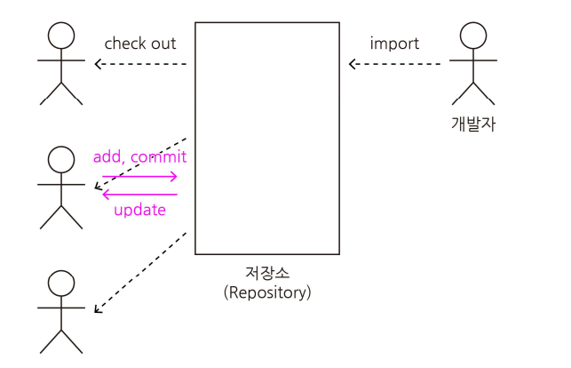

# 마무리 강의

# 소프트웨어 공학 개념

- 소프트웨어 공학(Software Engineering)
    - 소프트웨어 공학의 정의
        - 소프트웨어 위기를 극복하고 품질 높은 소프트웨어를 효율적으로 개발하기 위한 학문
    - 소프트웨어 공학의 3R
        - 역공학(Reverse Engineering)
        - 재공학(Re-Engineering)
            - 분석 → 재구성 → 역공학 → 이관
        - 재사용(Reuse)
            - 함수와 객체, 컴포넌트, 애플리케이션 재사용
            - 생성중심, 합성중심
    - 소프트웨어 개발 단계
        - 계획 → 요구사항 분석 → 설계 → 구현 → 테스트 → 유지보수
- 소프트웨어 개발 방법론
    - 소프트웨어 개발 방법론 종류
        - 구조적 방법론
        - 정보공학 방법론
        - 객체지향 개발 방법론
        - CBD(Component Based Development) 방법론
        - 애자일 방법론
    - 소프트웨어 개발 모델
        - 폭포수 모델(Waterfall Model)
        - 프로토타이핑 모델(Prototyping Model)
        - 나선형 모델(Spiral Model)
            - 계획 → 위험분석 → 공학적 개발 → 평가 → 계획 →
        - RAD(Rapid Application Development) 모델
        - V 모형
            - 단위 (정적, 동적 테스트) → 통합(상향식, 하향식, 빅뱅) → 시스템 (기능, 비기능) → 인수(알파, 베타)
        - 4세대 기법(4th Generation Techniques)
- 애자일 방법
    - 애자일 방법론의 개념
        - 신속하고 반복적인 작업을 통해 지속적으로 작동 가능한 소프트웨어를 개발하는 방법
    - 애자일 선언문
        - 공정과 도구보다 개인과 상호작용을
        - 포괄적인 문서보다 작동하는 소프트웨어를
        - 계약 협상보다 고객과의 협력을
        - 계획을 따르기보다 변화에 대응하기를
        - 우리는 왼쪽 항목의 가치를 인정하면서도 오른쪽 항목을 더 중요하게 여긴다.
    - 애자일 방법론 종류
        - XP : 의사소통, 용기, 피드백, 존중, 단순성
        - 스크럼 : 스프린트, 백로그
        - 크리스털 : 규모에 따른 방법론 제공
        - FDD : 기능주도 개발
        - ASD : 합동 애플리케이션 개발
        - 린(Lean) : 도요타 린 시스템
    - XP 12가지 실천사항
        - 짝 프로그래밍(Pair Programming)
        계획 세우기(Planning Game)
        - 테스트 기반 개발 (Test Driven Development)
        - 고객 상주(Whole Team)
        - 지속적인 통합(Continuous Integration)
        - 코드 개선(Design Improvement)
        - 작은 릴리즈(Small Releases)
        - 코딩 표준(Coding Standards)
        - 공동 코드 소유(Collective Code Ownership)
        - 간단한 디자인(Simple Design)
        - 시스템 메타포어(System Metaphor)
        - 작업시간 준수(Sustainable Pace)
- IT서비스 관리
    - SLM(Service Level Management)
        - 서비스 수준을 정량적으로 측정하고, 실적을 평가하여 미흡한 부분을 개선하는 관리 활동
    - SLA(Service Level Agreement)
        - 소프트웨어 수요자와 공급자 간에 서비스 수준을 명시적으로 정의한 문서
    - ITSM(Information Technology Service Management)
        - 최종 사용자를 위한 IT 서비스를 구현, 전달, 관리하는 일련의 정책과 관행
    - ITIL(IT Infrastructure Library)
        - IT 서비스를 쉽게 제공하고 관리할 수 있는 가이드 또는 프레임워크

# 프로젝트 계획 및 분석

- 프로젝트 관리
    - 프로젝트 관리의 개념
        - 특정한 목적을 달성하기 위해 한정된 기간, 예산, 자원을 활용하여 사용자가 만족할 만한 제품이나 서비스를 개발하도록 하는 기술적, 관리적 활동
    - 프로젝트 핵심 관리대상(3P)
        - 사람(People)
        - 문제(Problem)
        - 프로세스(Process)
    - PMBOK(Project Management Body of Knowledge)
        - PMI(Project Management Institute)에서 제작한 프로젝트 관리 프로세스 및 지식 체계
        - PMBOK 5단계 프로세스 그룹
            - 1단계 : 프로젝트 착수
            - 2단계 : 프로젝트 계획
            - 3단계 : 프로젝트 실행
            - 4단계 : 프로젝트 통제
            - 5단계 : 프로젝트 종료
- 개발 비용 산정
    - 소프트웨어 개발 비용 계획
        - 개발에 필요한 인원, 자원, 기간 등을 고려하여 소프트웨어의 규모를 파악하고, 이를 바탕으로 필요한 비용을 산정한다
    - 하향식 산정 기법(Top-Down)
        - 저문가 판단 기법
        - 델파이 기법
    - 상향식 산정 기법(Bottom-Up)
        - 원시 코드 라인 수(LOC, Line Of Code) 기법
            - 추정 LOC : (낙관치 + (4 * 중간치) + 비관치) / 6
        - 개발 단계별 노력(Effort Per Task) 기법
            - LOC 기법을 확장
    - 수학적 산정 기법
        - COCOMO 기법
            - 조직형(Organic, 5만 이하) , 반분리형(Semidetached), 내장형(Embedded)
        - Putnam 기법
            - Rayleigh-Norden, SLIM
        - 기능 점수 기법(FP, Function Point)
            - 내부 논리 파일(ILF), 외부 연계 파일 (EIF)
            - 외부 입력(EI), 외부출력(EO), 외부 조합(EQ)
            - ESTIMACS
- 개발 일정 산정
    - 소프트웨어 개발 일정 계획
        - 소프트웨어 개발을 위해 필요한 작업을 정의하고, 이들 작업의 우선순위를 설정하여 전체 프로젝트 일정 계획을 수립한다
    - 소프트웨어 개발 일정 계획
        - 작업순서
            - 작업분해(Work Breakdown Structure, WBS)
            - CPM 네트워크 작성
            - 최소 소요 기간 계산
            - 소요 Man-Month(M/M) 및 기간 산정 후 CPM 수정
            - 간트 차트(Gantt Chart)로 표현
        - 
- 플랫폼 기능 분석
    - 플랫폼 정의
        - 다양한 응용 프로그램, 서비스 또는 기능이 구축되거나 실행되는 기반 또는 환경
    - 플랫폼 기능
        - 연결 기능
        - 비용 감소 기능
        - 브랜드 신뢰 기능
        - 커뮤니티 형성
    - CPND(Contents Platform Network Device)
        - Contents : 텍스트, 이미지, 오디오, 비디오 등
        - Platform : 웹 사이트, 애플리케이션 등
        - Network : 통신 시스템
        - Device : 스마트폰, 컴퓨터, 태블릿 등
- 미들웨어(Middleware) 종류
    - 원격 프로시저 호출(Remote Procedure Call)
    - 메시지 지향 미들웨어(Message Oriented Middleware)
    - ORB(Object Request Broker)
    - DB 접속 미들웨어
    - TP 모니터(Transaction Processing Monitor)
    - 웹 애플리케이션 서버(Web Application Server)
    - 엔터프라이즈 서비스 버스(Enterprise Service Bus)
- 요구 공학
    - 요구공학 필요성
        - 품질 개선
        - 리스크 감소
        - 비용 절감
        - 효율적인 프로젝트 관리
        - 사용자와 개발자 간의 소통 개선
    - 요구사항 개발 프로세스 (도분명확, 도출 분석 명세 확인)
        - 요구사항 도출(Elicitation)
            - 인터뷰, 설문조사, 브레인스토밍, 워크샵, 직접 관찰 등 다양한 방법을 통해 수행된다
        - 요구사항 분석(Analysis)
            - 수집된 요구사항 중에서 불완전하거나 모호하며, 중복되거나 충돌하는 부분을 식별하여 수정한다
            - 업무환경과의 상호작용 파악(도메인 분석)
            - DFD, Data Dictionary, Mini-Spec, ERD, STD
            - UML(Unified Modeling Language)
        - 요구사항 명세(Specification)
            - 분석된 요구사항은 명세서 형태로 정리한다
            - 정형 명세 : 수학, 논리학
            - 비정형 명세 : 자연어, 그림 중심
            - 기능 요구사항, 비기능 요구사항 분류
        - 요구사항 확인 및 검증(Validation & Verification)
            - 분석가가 요구사항을 이해했는지 확인(Validation)
    - 요구사항 분석 도구
        - HIPO(Hierarchical Input Process Output)
            - HIPO의 개념
                - 하향식 소프트웨어 개발을 위한 분석 도구
            - HIPO의 구성요소
                - 주요 프로세스
                - 하위 프로세스
                - 입력/출력
            - HIPO Chart 종류
                - 가시적 도표(Visual Table of Content)
                - 총체적 도표(Overview Diagram)
                - 세부적 도표(Detail Diagram)
- 요구사항 분석 모델링
    - 모델링 구분
        - 기능적 모델링
            - 사용자 관점에서 시스템의 기능을 표현
            - 사용 사례 다이어그램, 액티비티 다이어그램 등
        - 정적 모델링
            - 시스템의 구조를 클래스 단위로 표현
            - 클래스 다이어그램
        - 동적 모델링
            - 시스템의 상호작용 및 동작을 표현
            - 순서 다이어그램, 상태 다이어그램, 커뮤니케이션 다이어그램 등
    - 구조적 분석 도구
        - 자료 흐름도(DFD, Data Flow Diagram)
        - 자료 사전(DD, Data Dictionary)
        - 소단위 명세서(Mini-Specification)
        - 개체 관계도(ERD, Entity Relationship Diagram)
        - 상태 전이도(STD, State Transition Diagram)
    - 객체 지향 분석 모델
        - 객체지향 분석 방법론
            - Rumbaugh(럼바우) 방법
                - 객체 모델링(Object Modeling) : 객체 다이어그램
                - 동적 모델링(Dynamic Modeling) : 상태 다이어그램
                - 기능 모델링(Functional Modeling) : DFD
            - Booch(부치) 방법 : 미시적 및 거시적 개발 프로세스
            - Jacobson 방법 : Use case를 중심으로 한 분석 방법
            - Coad와 Yourdon 방법 : E-R 다이어그램을 사용
            - Wirfs-Brock 방법 : 분석과 설계의 구분 없음

# 소프트웨어 설계

- 소프트웨어 설계
    - 소프트웨어 설계의 종류
        - 상위 설계(High-level Design)
            - 아키텍처, 데이터, 인터페이스 정의, 사용자 인터페이스 설계
        - 하위 설계(Low-level Design)
            - 모듈, 자료구조, 알고리즘
        - 협약에 의한 설계
            - 선행 조건, 결과 조건, 불변 조건
    - 소프트웨어 설계의 원리
        - 분할과 정복(Divide & Conquer)
        - 추상화(Abstraction) : 과정, 데이터, 제어
        - 단계적 분해(Stepwise Refinement)
        - 모듈화(Modulization)
        - 정보 은닉(Information Hiding)
        - 결합도와 응집도
- 설계 모델링
    - 설계 모델링 유형
        - 구조 모델링 : UML 정적 다이어그램(class 다이어그램)
        - 행위 모델링 : UML 동적 다이어그램(Use case 다이어그램)
- 소프트웨어 아키텍처
    - 소프트웨어 아키텍처 4 + 1 뷰
        - 논리 뷰(Logical View) : 시스템의 기능적 요구사항
        - 구현 뷰(Implementation View) : 모듈의 구성과 개발자의 관점을 반영
        - 프로세스 뷰(Process View) : 프로그램 실행 시의 시스템을 표현
        - 배치 뷰(Deployment View) : 시스템의 물리적 배치
        - 유스케이스 뷰(Use Case View) : 아키텍처 설계 및 검증을 주도
    - 소프트웨어 아키텍처 패턴 종류
        - 계층화 패턴(Layered Pattern)
        - 클라이언트-서버 패턴(Client-Server Pattern)
        - 마스터-슬레이브 패턴(Master-Slave Pattern)
        - 파이프-필터 패턴(Pipe-Filter Pattern)
        - 브로커 패턴(Broker Pattern)
        - 피어 투 피어 패턴(Peer to Peer Pattern)
        - 이벤트-버스 패턴(Event-Bus Pattern)
        - 모델-뷰-컨트롤러 패턴(MVC Pattern)
        - 블랙보드 패턴(Blackboard Pattern)
        - 인터프리터 패턴(Interpreter Pattern)
- UML (Unified Modeling Language)
    - UML 특징
        - 가시화 언어
        - 명세화 언어
        - 구축 언어
        - 문서화 언어
    - UML 구성요소
        - 사물(THings)
            - 구조사물
            - 행동사물
            - 그룹사물
            - 주해사물
        - 관계(Relationship)
            - 일반화 관계(Generalization) : 상속관계
            - 연관관계(Association) : 관련된 관계
            - 의존관계(Dependency) : 짧은 시간만 사용하는 관계
            - 실체화 관계(Realization) : 추상 메서드를 오버라이딩
            - 집합 관계 - 집약관계(Aggregation) : 부분 객체는 독립적
            - 집합 관계 - 합성관계(Composition) : 부분 객체는 의존적
- 다이어그램(Diagram)
    - 구조 다이어그램
        - 클래스 다이어그램(Class)
        - 객체 다이어그램(Object)
        - 컴포넌트 다이어그램(Component)
        - 배치 다이어그램(Deployment)
        - 복합체 구조 다이어그램(Composite Structrure)
        - 패키지 다이어그램(Package)
    - 행위 다이어그램
        - 유스케이스 다이어그램 (Use Case)
        - 순차 다이어그램(Sequence)
        - 커뮤니케이션 다이어그램 (Communication)
        - 상태 다이어그램(State)
        - 활동 다이어그램(Activity)
        - 상호작용 다이어그램(Interaction)
        - 타이밍 다이어그램(Timing)

# 화면 설계

- UI
    - UI(User Interface) 개념
        - UI(User Interface) : 컴퓨터, 웹 사이트 시스템 등의 정보 기기와 사용자 간의 상호작용을 가능하게 하는 매개체
        - UX(User eXperience) 개념 : 사용자가 UI를 통해 경험하는 모든 것을 포함
        - UI 유형
            - CLI(Command Line Interface)
            - GUI(Graphical User Interface)
            - NUI(Natural User Interface)
            - OUI(Organic User Interface)
            - VUI(Voice User Interface)
            - ARUI(Argumented Reality User Interface)
    - UI 설계
        - 기능적 요구사항 : 시스템이 제공해야 하는 기능에 대한 요구사항
        - 비기능적 요구사항 : 사용성, 효율성, 신뢰성, 유지 보수성, 재사용성 등 품질에 관한 요구사항
        - **UI 설계 원칙**
            - 직관성 : 누구나 쉽게 이해하고 사용할 수 있어야 한다
            - 유효성 : 사용자의 목적을 정확하게 달성해야 한다
            - 학습성 : 누구나 쉽게 배우고 익힐 수 있어야 한다
            - 유연성 : 사용자의 요구사항을 최대한 수용하며 오류를 최소화해야 한다
    - UI 설계 도구
        - 와이어프레임(Wireframe)
        - 스토리보드
        - 프로토타입
        - 목업(Mockup)
        - 유스케이스
- 감성공학
    - 제품과 관련된 인간의 감성
        - 감각적 감성
        - 기능적 감성
        - 문화적 감성
    - 감성공학의 접근 방법
        - 1류 접근 방법 : 디자인 요소와 연결
        - 2류 접근 방법 : 문화적 감성을 반영
        - 3류 접근 방법 : 감성을 정량화
- 화면 레이아웃 구성
    - 레이아웃(Layout)의 개념
        - 특정 공간에 여러 구성 요소를 보기 좋고 효과적으로 배치하는 자겅ㅂ
    - 레이아웃 개발 구분
        - HTML
        - CSS(Cascading Style Sheet)
        - JavaScript
    - JavaScript 프레임워크
        - React : 페이스북 개발
        - Vue.js : Evan You 개발
        - Angular JS : 구글 개발
        - Ajax : 비동기적인 웹 애플리케이션 제작
- UI 관련 용어
    - 웹 표준 : 월드 와이드 웹에서 사용되는 공식 표준
    - 웹 호환성 : 다양한 환경에서도 웹 서비스가 동일하게 작동하는 능력
    - 웹 접근성 : 장애인과 비장애인 보두가 웹 사이트를 이용
    - 반응형 웹 : 화면 크기에 맞춰 내용을 적절하게 표시
    - 인포그래픽 : 정보와 그래픽을 결합
    - 브랜드 아이덴티티 : 특정 브랜드의 가치와 의미
    - 내비게이션 : 정보를 탐색하고 접근
    - 아코디언 : 확장, 축소 패널
    - 플레이스 홀더 : 입력 필드에 예시나 안내 문구
    - 필터링 : 데이터를 제외
    - 입력 폼 : 웹 서버로 전송할 수 있게 하는 웹 페이지의 부분
    - 입력 필드 : 사용자가 데이터를 입력하는 요소
    - 썸네일 : 작은 이미지
    - 레이블 : 입력 폼의 각 입력 필드를 식별
    - 대체 텍스트 : 이미지 대신 제공되는 텍스트

# 서버 프로그램 구현

- 서버 환경 구축
    - 웹 서버(WEB)
    - 웹 애플리케이션 서버(WAS)
    - 데이터베이스 서버(DBMS)
    - 파일 서버
    - Load Balancer(Random, Least Loaded, Round Robin)
    - CDN(Content Delivery Network)
- 시스템 아키텍처 고려사항
    - 확장성(Scalability)
    - 성능(Performance)
    - 응답 시간(Response Time)
    - 처리량(Throuhgput)
    - 접근성(Accessibility)
    - 일관성(Consistency)
    - 보안(Security)
- 개발 소프트웨어의 환경
    - 시스템 소프트웨어
        - 운영체제(OS, Operation System)
        - JVM(Java Virtual Machine)
        - Web Server
        - WAS(Web Application Server)
        - DBMS(Database Management System)
    - 개발 소프트웨어
        - 요구사항 관리 도구 : JFeature, JRequisite, OSRMT, Trello 등
        - 설계/모델링 도구 : ArgoUML, StarUML, DB Design 등
        - 구현 도구 : Eclipse, InteliJ, Visual Studio 등
        - 테스트 도구 : JUnit, CppUnit, JMeter, SpringTest 등
        - 형상 관리 도구 : Git, CVS, SVN 등
        - 협업 도구 : Slack, Microsoft Teams 등
        - 배포 도구 : Jenkins, Travis CI 등
    - IDE(Integrated Development Environment) 도구
        - IDE 도구의 개념 : 소프트웨어 개발에 필요한 다양한 기능을 하나의 프로그램 내에서 제공하는 소프트웨어
        - IDE 도구의 종류 : Eclipse, Visual Studio, Xcode, InteliJ IDEA
        - IDE 도구 선정 시 고려사항 : 적정성, 효율성, 이식성, 친밀성, 범용성
- 협업 도구
    - 협업 도구의 개념 : 여러 사용자가 각자의 작업 환경에서 통합된 프로젝트를 동시에 수행할 수 있도록 지원하는 소프트웨어
    - 협업 도구의 기능 : 전사 관리, 프로젝트 관리, 드라이브 공간, 문서 공유, 커뮤니케이션, 다국어 지원, 타 협업 툴 연동
    - 협업 도구 도입 프로세스
        - 문제 정의
        - 솔루션 및 기대효과 정의
        - 협업 도구 분석
        - 협업 도구 최종 선정
- 형상 관리 도구
    - 형상 관리 도구의 개념 : 소프트웨어 개발 과정에서 발생하는 모든 변경사항을 통제하고 관리하는 방법
    - 변경 관리 / 버전 관리 / 형상 관리
        - 변경 관리 : 소스코드의 변경 사항을 관리
        - 버전 관리 : 체크인/체크아웃, 릴리즈, 퍼블리싱 등을 버전으로 관리
        - 형상 관리 : 변경 관리와 버전 관리를 포함하여 프로젝트 진행 상황, 릴리즈까지 관리
    - 형상 관리 절차
        - 형상 식별 : 관리해야 할 항목을 구분하고, 번호나 태그 부여
        - 형상 통제 : 변경 요청을 검토하고 형상 통제 위원회의 승인을 거쳐 현재의 기준선(Baseline)에 반영
        - 형상 감사 : 변경에 대한 검토
        - 형상 기록 : 변경 사항과 처리 과정을 기록
- 버전 관리 도구
    - 소프트웨어 버전 관리 도구 개념
        - 소스코드의와 문서 등의 디지털 콘텐츠에 대한 여러 버전을 관리한다
    - 소프트웨어 버전 관리 도구 유형
        - 공유 폴더 방식(RCS, SCCS)
        - 클라이언트/서버 방식(CVS, SVN)
        - 분산 저장소 방식(Git)
    - 버전 소프트웨어 사용 방식
        
        
        
    - 버전 관리 주요 용어
        - Repository
        - Checkout
        - Commit
        - Update
        - Add
        - Trunk
        - Branch
        - Merge
        - Diff
- 빌드 도구
    - 빌드의 개념
        - 소스코드 파일들을 컴파일하고, 다른 필요한 과정들을 거쳐 실행 가능한 소프트웨어로 변환하는 일련의 과정
    - 빌드 자동화 도구 종류
        - Make : Unix 계열 운영체제에서 주로 사용
        - Ant : Java 기반의 빌드 도구, XML 기반의 빌드 스크립트 사용
        - Maven : 의존성 관리와 프로젝트 라이프 사이클 관리에 강점
        - Jenkins : Java 기반의 오픈소스 지속적 통합 서비스 도구
        - Gradle : Groovy 기반의 오픈 소스 빌드 자동화 도구(안드로이드 개발)
- 프레임워크
    - 소프트웨어 개발에 필요한 공통적인 구성요소와 아키텍처를 일반화하여 제공하는 반제품 형태의 소프트웨어
    - 프레임워크의 특징
        - 모듈화(Modularity)
        - 재사용성(Reusability)
        - 확장성(Extensibility)
        - 제어의 역흐름(Inversion of Control)
    - 프레임워크의 구분
        - Java 프레임워크 : 전자정부 표준 프레임워크 스트럿츠 스프링
        - ORM 프레임워크 : 아이바티스 마이바티스 하이버네이트 (iBatis), (myBatis), (Hibernate)
        - 자바스크립트 프레임워크 : 앵귤러제이에스(AngularJS), ReactJS, ExtJS
        - 프론트엔드 프레임워크 :  Bootstrap, Foundation, MDL
    - 라이브러리(Library) : 컴퓨터 프로그램에서 자주 사용되는 루틴이나 리소스(클래스, 템플릿, 설정 데이터 등)를 모아 놓은 것
    - API(Application Programming Interface)
        - 소프트웨어 간의 인터페이스로, 다른 소프트웨어 또는 서비스와 상호 작용하는 데 사용된다.
- 모듈 구현
    - 단위 모듈 구현
        - 단위 모듈 구현의 개념 : 소프트웨어를 기능 단위로 분해하여 개별적으로 구현하는 기법
        - 효과적인 모듈화
            - 결합도 를 낮추고 응집도 를 높여 모듈의 독립성을 강화한다 (Coupling) , (Cohesion) .
            - FAN-OUT , FAN-IN 최소화 을 증가
    - 결합도
        - 결합도 의 개념 (Coupling)
            - 모듈과 모듈 간의 관련성 의존성 정도 /
        - 결합도 유형
        - 자료 결합도(Data Coupling) : 값 전
        - 스탬프 결합도 (Stamp Coupling) : 배열등 전달
        - 제어 결합도 (Control Coupling) : 제어 요소 전달
        - 외부 결합도 (External Coupling) : 다른 모듈 변수 사용
        - 공통 결합도 (Common Coupling) : 전역변수 사용
        - 내용 결합도 (Content Coupling) : 다른 모듈 기능 이용
    - 응집도
        - 응집도(Cohesion) 의 개념
            - 모듈 내부에서 구성요소 간에 밀접한 관계를 맺고 있는 정도
        - 응집도 유형
        - 기능적 응집도 (Functional Cohesion) : 단일한 목적 수행
        - 순차적 응집도 (Sequential Cohesion) : 출력값을 입력값으로 사용
        - 통신적 응집도 (Communication Cohesion) : 동일한 입력 출력
        - 절차적 응집도 (Procedural Cohesion) : 순차적 수행
        - 시간적 응집도 (Temporal Cohesion) : 같은 시간 기능 수행
        - 논리적 응집도 (Logical Cohesion) : 유사한 성격
        - 우연적 응집도 (Coincidental Cohesion) : 연관관계 없음
    - 팬인(Fan-in),  팬아웃(Fan-out)
        - 팬인 팬아웃 의 개념 (Fan-in), (Fan-out)
            - 모듈의 복잡도와 상호작용을 분석하는 데 사용되는 지표
        - 팬인 팬아웃 계산법
            
            
            
    
- 공통 모듈 구현
    - 공통 모듈 구현 순서
        
        
        
    - 공통 모듈 구현요소
        - DTO(Data Transfer Object) : 데이터를 전송하는 객체
        - VO(Value Object) : 특정 값을 나타내는 객체
        - DAO (Data Access Object) : DB에 접근하는 객체
        - Service : DAO 클래스를 호출
        - Controller : 비즈니스 로직을 수행
    - Annotation
        - 사전적으로는 ‘주석’이라는 의미를 가지고 있다
        - 자바코드에 주석처럼 달아 특수한 의미를 부여한다
        - 컴파일 또는 런타임에 해석된다.
- 서버 프로그램 구현
    - 업무 프로세스 확인
        - 업무 프로세스 : 개인이나 조직이 자원을 입력하여 가치 있는 산출물을 제공하는 일련의 활동
        - 업무 프로세스 구성요소
            - 프로세스 책임자
            - 프로세스 맵
            - 프로세스 Task 정의서
            - 프로세스 성과 지표
            - 프로세스 조직
            - 경영자의 리더십
    - 서버 프로그램 구현
        - 업무 프로세스를 기반으로 서버에서 서비스를 제공하는 기능을 개발하는 활동
    - MVC 모델의 계층
        - 프레젠테이션 계층(Presentation Layer) : 사용자 인터페이스
        - 제어 계층(Control Layer) : 요청을 분석하고, 적절한 비즈니스 로직 호출
        - 비즈니스 로직 계층(Business Logic Layer) : 핵심 업무 로직을 처리
        - 퍼시스턴스 계층(Persistence Layer) : 데이터 관리
        - 도메인 모델 계층(Domain Model Layer) : 데이터를 전달
- DBMS 접속 기술
    - DBMS 접속기술 : 프로그램에서 데이터베이스(DB)에 접근하여 DML을 사용할 수 있게 하는 기술
    - DBMS 접속기술 종류
        - 소켓 통신
        - Vender API
        - JDBC(Java DataBase Connectivity)
        - ODBC(Open DataBase Connectivity)
- ORM(Object-Relational Mapping) 프레임워크
    - ORM 프레임워크 : 객체지향 프로그래밍과 관계형 데이터베이스 간의 호환성 격차를 해결하기 위한 프로그래밍 기법
    - 매핑 기술 비교
        - SQL Mapper
            - SQL을 명시하여 단순히 필드를 매핑시키는 것이 목적
            - 종류 : iBatis, Mybatis, jdbc Templetes 등
        - OR Mapping(ORM)
            - 객체를 통해 간접적으로 데이터베이스를 다룬다
            - 종류 : JPA(Java Persistent API), Hibernate
- 시큐어 코딩(Secure Coding)
    - OWASP (The Open Web Application Security Project)
        - 오픈소스 웹 애플리케이션 보안 프로젝트
    - 시큐어 코딩 가이드
        - 시큐어 코딩 가이드의 개념 : 해킹 등 사이버 공격의 원인인 보안취약점을 제거해 안전한 소프트웨어를 개발하는 SW 개발 기법
    - 시큐어 코딩 가이드 항목
        - 입력 데이터 검증 및 표현
            - SQL Injection
            - XSS(크로스 사이트 스크립트)
            - 자원 삽입
            - 위험한 형식 파일 업로드
            - 명령 삽입
            - 메모리 버퍼 오버플로
        - 보안 기능
            - 적절한 인증 없이 중요기능 허용
            - 부적절한 인가
            - 취약한 암호화 알고리즘 사용
            - 하드코딩된 패스워드
            - 패스워드 평문 저장
            - 취약한 패스워드 허용
        - 시간 및 상태
            - 경쟁 조건
            - 종료되지 않는 반복문 또는 재귀 함수
        - 에러 처리
            - 오류 메시지 정보 노출
            - 오류 상황 대응 부재
            - 부적절한 예외 처리
        - 코드 오류
            - 널 포인터 역참조
            - 부적절한 자원 해제
            - 해제된 자원 사용
            - 초기화되지 않은 변수 사용
        - 캡슐화
            - 잘못된 세션에 의한 정보 노출
            - 제거되지 않은 디버그 코드
            - 시스템 정보 노출
            - 잘못된 접근 지정자
        - API 오용
            - DNS에 의존한 보안 결정
            - 취약한 API 사용
- 배치 프로그램 구현
    - 배치의 개념 : 데이터를 일괄적으로 모아서 처리하는 대량의 작업을 처리
    - 배치 프로그램의 필수 요소
        - 대용량 데이터
        - 자동화
        - 견고함
        - 안정성
        - 성능
    - 스케줄 관리 종류
        - 크론탭(Crontab)
            - UNIX, LINUX 계열에서 사용
            - 시간을 지정해 특정 명령을 자동 실행
            - 크론 탭 형식
                - 분 시 일 월 요일 명령어

# 인터페이스 구현

- 인터페이스 개요
    - 인터페이스 시스템 : 서로 다른 시스템이나 장치 간에 정보나 신호를 주고받을 수 있게 도와주는 시스템
    - 인터페이스 시스템 구성
        - 송신 시스템
        - 수신 시스템
        - 중계 서버
    - 연계 시스템 분류와 데이터 식별
        - 송수신 데이터 식별
            - 전문 공통부 : 인터페이스 ID, 서비스 코드, 접속 IP 등
            - 전문 개별부 : 업무처리에 필요한 데이터를 포함
            - 전문 종료부 : 전송 데이터의 끝을 표시하는 문자 포함
- 인터페이스 설계서 확인
    - 인터페이스 목록 : 연계 업무와 연계에 참여하는 송수신 시스템의 정보, 연계 방식과 통신 유형 등에 대한 정보
    - 인터페이스 정의서 : 데이터 송신 시스템과 수신 시스템 간의 속성과 제약조건 등을 상세히 포함
- 인터페이스 기능 구현
    - 내-외부 모듈 연계 방식
        - EAI(Enterprise Application Intergration)
            - EAI : 기업 내의 다른 플랫폼 및 애플리케이션들을 연결, 통합하는 솔루션
            - EAI의 구축 유형
                - Point-to-Point : 미들웨어 없이 직접 애플리케이션 끼리 연결
                - Hub & Spoke : 중앙 허브를 통한 중앙 집중적 연결
                - Message Bus (ESB 방식) : 미들웨어를 사용
                - Hybrid : 내부 Hub & Spoke, 외부 Message Bus
        - ESB(Enterprise Service Bus)
            - 웹 서비스 중심의 표준화된 데이터 버스를 이용하여 다양한 애플리케이션을 유연하게 통합하는 플랫폼
            - 프로토콜 변환, 서비스 중심의 메시지 라우팅 기능 제공
    - 인터페이스 연계 기술
        - DB Link
        - DB Connection
        - JDBC
        - API / Open API
        - Web Service
        - Hyper LInk
        - Socket
    - 인터페이스 전송 데이터
        - JSON(JavaScript Object Notation) : 이름과 값의 쌍
        - XML(eXtensible Markup Language) : 구조화된 문서를 표현하고 전송
        - YAML(YAML Ain’t Markup Language) : 데이터 직렬화 언어
        - CSV(Comma Separated Values) : 콤마로 데이터 구분
- 인터페이스 구현
    - AJAX(Asynchronous JavaScript and XML)
        - AJAX의 개념
            - 비동기 방식으로 데이터를 교환
            - 전체 페이지를 새로고침하지 않고, 페이지의 일부만을 변경할 수 있는 기법
    - SOAP(Simple Object Access Protocol)
        - SOAP의 개념
            - HTTP, HTTPS, SMTP 등을 통한 XML 기반 메시지 교환 프로토콜
            - SOA 개념을 실현하는 기술
        - SOAP 구성
            - SOAP(Simple Object Access Protocol)
                - HTTP, HTTPS, SMTP 등을 활용하여 XML 기반 메시지를 네트워크 상에서 교환하는 프로토콜
            - UDDI(Universal Description, Discovery and Integration)
                - 비즈니스 업체 목록 등록을 위한 XML 규격
            - WSDL(Web Service Description Language)
                - 웹 서비스 기술언어, 서비스의 기술적 세부사항 기술
        - SOAP 보안 프로토콜
            - SAML : 인증/권한 관리
            - XKMS : 키 관리
            - XACML : 접근 제어
    - REST
        - REST의 개념
            - HTTP URI를 통한 자원 명시와 HTTP Method를 통한 CRUD Operation 적용
            - 자원 기반의 구조(ROA) 구현
        - REST 구성요소
            - 자원(Resource) : URI를 통해 식별
            - 행위(Method) : GET, POST, PUT, DELETE
            - 표현(Representation) : 데이터 표현
        - RESTful
            - REST의 원리를 따르는 시스템
- 인터페이스 보안
    - 인터페이스 보안 취약점 분석
        - 인터페이스를 통한 데이터 변조, 탈취
        - 패킷 공격 기법
            - 스니핑(Sniffing) : 패킷을 가로채는 행위
            - 스푸핑(Spoofing) : IP 주소나 다른 식별자를 위장
    - 인터페이스 보안 기능 적용
        - 네트워크 영역 : 트래픽에 대한 암호화 설정, IPSec, SSL, S-HTTP, TLS
        - 애플리케이션 영역 : 시큐어코딩 가이드
        - DB 영역 : 민감 데이터를 암호화
- 인터페이스 구현 검증
    - 인터페이스 구현 검증 도구
        - xUnit : 다양한 언어 지원
        - STAF : 서비스 호출 및 컴포넌트 재사용 등
        - FitNesse : 웹 기반 테스트 프레임워크
        - STAF : FitNesse의 장점과 STAF의 장점을 통합
        - Selenium : 웹 애플리케이션 테스트 프레임워크
        - watir : Ruby를 사용하는 애플리케이션 테스트 프레임워크
    - 인터페이스 구현 감시 도구
        - APM(Application Performance Management)을 사용하여 동작상태 감시
        - 종류 : 스카우터(Scouter), 제니퍼( Jennifer) 등
    - 인터페이스 오류 처리
        - 인터페이스 오류 발생 알림 : 화면, SMS 발송, 이메일 발송
        - 인터페이스 오류 발생 확인 : 로그 확인, 오퓨 테이블 확인, 감시 도구로 확인

# 객체지향 구현

- 객체지향 설계
    - 객체지향 개념 : 현실 세계의 유형, 무형의 모든 대상을 객체(Object)로 나누고, 객체의 행동(Method)과 고유한 값(Attribute)을 정의하여 설계하는 방법
    - 객체지향 구성요소
        - 클래스(Class) : 속성과 연산을 정의해서 만든 틀
        - 객체(Object) : 클래스의 인스턴스
        - 속성(Attribute) : 객체들이 가지고 있는 고유한 데이터
        - 메서드(Method) : 작업을 수행하기 위한 명령문의 집합
        - 메시지(Message) : 객체에게 어떤 행위를 하도록 지시
    - 객체지향 언어의 특징
        - 캡슐화(Encapsulation) : 속성(Attribute)과 메서드(Mtehod)를 하나로 묶은 것
        - 정보은닉(Information Hiding) : 내부 데이터에 직접 접근할 수 없도록 제한
        - 상속(Inheritance) : 상위 클래스의 속성과 메서드를 하위 클래스가 물려받는 것
        - 다형성(Polymorphism) : 하나의 메시지에 대해 여러 가지 방법으로 응답
        - 추상화(Abstraction) : 실체의 핵심적인 개념만을 추출
    - 객체지향 설계 원칙(SOLID)
        - 단일 책임 원칙(SRP) : 한 클래스는 하나의 책임만을 가져야 한다
        - 개방 폐쇄 원칙(OCP) : 확장에 열려 있고, 수정에 닫혀 있어야 한다
        - 리스코프 치환 원칙(LSP) : 자식 클래스는 언제나 자신의 부모 클래스를 대체
        - 인터페이스 분리 원칙(ISP) : 사용하지 않는 인터페이스는 구현하지 말아야 한다
        - 의존성 역전 원칙(DIP) : 변화가 거의 없는 것에 의존
- 디자인 패턴
    - 디자인 패턴(Design Patter) 개념 : 객체지향 프로그래밍 설계를 할 때 자주 발생하는 문제들에 대해 재사용할 수 있도록 만들어놓은 패턴들의 모음
    - 디자인 패턴 구조
        - 패턴의 이름과 유형
        - 문제 및 배경
        - 솔루션
        - 사례
        - 결과
        - 샘플 코드
    - GoF 디자인 패턴
        - GoF 디자인 패턴 분류
            - 생성 패턴 : 객체 생성과 관련된 패턴
            - 구조 패턴 : 객체를 조합해서 더 큰 구조를 만드는 패턴
            - 행위 패턴 : 알고리즘이나 책임 분배에 관련된 패턴
            
            
            

# 애플리케이션 테스트 관리

- 소프트웨어 테스트
    - 소프트웨어 테스트의 개념 : 결함(Fault)을 발견하기 위한 절차와 행위
    - 소프트웨어 테스트의 필요성
        - 오류 발견 관점
        - 오류 예방 관점
        - 품질 향상 관점
    - 소프트웨어 테스트의 기본 원칙
        - 테스팅은 결함을 찾아내는 활동
        - 완벽한 테스팅은 불가능하다
        - 테스팅은 개발 초기에 시작해야 한다
        - 테스팅 방법은 특정 상황에 의존적이다
        - 결함 집중(Defect Clustering) : 파레토의 법칙
        - 살충제 패러독스 : 새로운 테스트 케이스 설계
        - 오류-부재의 궤변 : 사용자의 요구사항을 충족하지 않으면 품질이 좋다고 할 수 없다
    - 테스트 산출물
        - 테스트 계획서
        - 테스트 케이스
        - 테스트 시나리오
        - 테스트 결과서
- 테스트 오라클
    - 테스트 오라클의 개념 : 테스트의 겨로가가 참인지 거짓인지를 판단하기 위해서 사전에 정의된 참값을 입력하여 비교하는 기법 및 활동
    - 테스트 오라클의 유형
        - 참 오라클 : 모든 입력 값에 대해 결과를 생성하는 오라클
        - 샘플링 오라클 : 제한된 입력 값들에 대해서만 결과 제공
        - 휴리스틱 오라클 : 근사적인(추정) 결과를 제공하는 오라클
        - 일관성 검사 오라클 : 변경 전후로 테스트 결과의 일관성을 검증하는 오라클
- 테스트 레벨
    
    
    
- 소프트웨어 테스트 기법
    - 프로그램 실행 여부
        - 정적 테스트
            - 소스 코드를 분석하여 문제점을 찾는 테스트 방식
            - 코드검사 : 코드의 오류를 검사
            - 워크스루 : 개발자 검토 회의
            - 인스펙션 : 검토 전문가들이 소스코드를 분석
        - 동적 테스트
            - 소프트웨어를 실행하여 문제점을 찾는 테스트 방식
    - 테스트 기법
        - 화이트박스 테스트 : 소프트웨어의 내부 구조와 동작을 중점으로 검사하는 테스트
        - 화이트박스 테스트 기법
            - 문장 검증
            - 선택(분기) 검증
            - 경로 검증
        - 기초 경로 검사(Basic Path Test)
            - McCabe가 제안한 것으로 대표적인 화이트박스 테스트 기법
            - 계산식 : V(G) = E - N + 2
                
                
                
        - 블랙박스 테스트 정의 : 프로그램의 사용자 요구사항 명세를 보면서 테스트
        - 블랙박스 테스트 기법
            - 동등 분할 기법(Equivalence Partitioning Testing) : 입력 자료에 초점을 맞춰 테스트
            - 경계값 분석(Boundary Value Analysis) : 경계값을 테스트 케이스로 선정
            - 원인-효과 그래프 검사(Cause-Effect Graphing Testing) : 입력 데이터 간의 관계와 출력에 영향을 미치는 상황분석
            - 오류 예측 검사(Error Gessing) : 과거의 경험이나 테스터의 감각으로 테스트
            - 비교 검사(Comparison Testing) : 여러 버전의 프로그램에 동일한 자료를 제공
            - 상태전이 검사(State Transistion Testion) : 상태를 변화시키는 이벤트와 입력ㄱ밧을 파악
    - 테스트에 대한 시각
        - 검증(Verification) : 소프트웨어 개발 과정을 테스트
        - 확인(Validation) : 완성된 소프트웨어의 결과를 테스트
    - 테스트 목적
        - 회복(Recovery) : 고의로 실패를 유도
        - 안전(Security) : 보안적인 결함을 점검
        - 강도(Stress) : 과부하 테스트
        - 성능(Performance) : 응답하는 시간, 처리량, 반응속도 등
        - 구조(Structure) : 소스코드의 복잡도를 평가
        - 회귀(Regression) : 변경 코드에 대해 새로운 결함 여부 평가
        - 병행(Parallel) : 변경된 시스템과 기존 시스템에 동일한 데이터를 입력 후 비교
        - A/B 테스트 : 기존 서비스 대비 효과 테스트
        - 스모크 테스트(Smoke) : 테스트 환경의 테스트
    - 테스트 종류
        - 명세 기반 테스트
        - 구조 기반 테스트
        - 경험 기반 테스트
- 테스트 커버리지
    - 테스트 커버리지 : 테스트를 얼마나 수행했는지 측정하는 기준
    - 테스트 커버리지 유형
        - 기능 기반 커버리지 : 기능을 모수로 설정
        - 라인 커버리지 : 전체 소스 코드의 Line 수를 모수
        - 코드 커버리지 : 소스 코드의 구문, 조건, 결정 등을 측정
            - 구문 커버리지 : 구문에 대해 한 번 이상 수행
            - 조건 커버리지 : 개별 조건식에 대해 수행
            - 결정 커버리지 : 결정포인트 내의 모든 분기문에 대해 수행
            - 조건/결정 커버리지 : 결정포인트 T/F, 개별조건식 T/F
            - 변경 조건/결정 커버리지 : 모든 결정포인트 내의 개별 조건식은 적어도 한 번 T/F
            - 다중 조건 커버리지 : 가능한 조합을 100% 보장
- 결함관리 도구
    - 결함관리 도구 : 테스트 수행 후 발생한 결함을 추적하고 관리할 수 있게 해주는 도구
    - 결함관리 프로세스
        - 에러 발견
        - 에러 등록
        - 에러 분석
        - 결함 확정
        - 결함 할당
        - 결함 조치
        - 결함 조치 검토 및 승인
    - 결함 추이 분석
        - 결함 추이 분석 : 테스트 완료 후 발견된 결함의 결함 관리 측정 지표의 속성 값들을 분석하고, 향후 애플리케이션의 어떤 모듈 또는 컴포넌트에서 결함이 발생할지를 추정하는 작업
        - 결함 관리 측정 지표
            - 결함 분포 : 결함의 분포를 분석
            - 결함 추세 : 테스트 진행 시간의 흐름에 따른 추세를 분석
            - 결함 에이징 : 결함 상태의 지속 시간을 측정
    - 결함 관리 항목 : 결함 내용, 결함 ID, 결함 유형, 발견일, 심각도, 우선순위, 시정 조치 예정일, 수정 담당자, 재테스트 결과, 종료일
- 테스트 자동화 도구
    - 테스트 자동화 도구 : 테스트를 효과적으로 수행하기 위해 스크립트나 도구를 활용하여 반복적인 테스트 작업을 자동화하는 방법
    - 테스트 자동화 도구 유형
        - 정적 분석 도구(Static Analysis Tools)
            - 애플리케이션을 실행하지 않고 분석하는 방법
            - 종류 : Pmd, SonarQube, Cppcheck, Checkstyle 등
        - 테스트 실행 도구(Test Execution Tools)
            - 사전에 작성된 테스트 스크립트나 시나리오를 실행하는 도구
        - 성능 테스트 도구(Performance Test Tools)
            - 시스템의 성능, 부하, 스트레스 테스트를 위한 도구
            - 종류 : JMeter, LoadRunner
        - 테스트 통제 도구(Test Control Tools)
            - 테스트의 전체 프로세스를 관리하는 도구
        - 테스트 장치(Test Harness) 구성요소
            - 테스트 드라이버(Test Driver) : 상향식 테스트에 필요
            - 테스트 스텁 : 하향식 테스트에 필요
            - 테스트 슈트 : 테스트 케이스의 집합
            - 테스트 케이스 : 입력 값, 실행 조건, 기대 결과 등의 집합
            - 테스트 스크립트 : 자동화된 테스트 실행 절차
            - 목 오브젝트 : 조건부로 상황에 예정된 행위를 수행하는 객체
- 통합 테스트
    - 통합 테스트 : 소프트웨어 각 모듈 간의 인터페이스 관련 오류 및 결함을 찾아내기 위한 테스트 기법
    - 통합 테스트 수행 방법의 분류
        
        
        
- 애플리케이션 성능 개선
    - 애플리케이션 성능 저하 원인
        - 데이터베이스 관련 성능 저하
            - 데이터베이스 락(DB Lock)
            - 불필요한 패치(DB Fetch)
            - 연결 누수(Connection Leack)
        - 내부 로직으로 인한 성능 저하 원인
            - 파일 관련 오류
            - 코드 오류
        - 외부 호출로 인한 성능 저하
    - 애플리케이션 성능 분석
        - 애플리케이션 성능 분석 지표
            - 처리량(Throughput)
            - 응답 시간(Response Time)
            - 경과 시간(Turn Around Time)
            - 자원 사용률(Resource Usage)
        - 성능 분석 도구
            - JMeter : 다양한 프로토콜(HTTP, FTP 등)을 지원하는 부하 테스트 도구
            - LoadUI : 웹 서비스의 로드 테스트에 사용
            - OpenSTA : HTTP, HTTPS 프로토콜에 대한 부하 테스트
        - 모니터링 도구
            - Scouter : 단일 뷰를 통한 통합 및 실시간 모니터링
            - NMon : 리눅스 서버 자원에 대한 모니터링
            - Zabbix : 웹 기반의 서버, 서비스, 애플리케이션 모니터링 도구
            - Jeniffer : 트랜잭션의 양, 처리 시간, 응답 시간, 자원 활용률 등을 모니터링
    - 정형 기술 검토회의(FTR, Formal Technical Review)
        - FTR의 개념
            - 소프트웨어 품질 보증 활동
            - 소프트웨어 개발 산출물, 오류 발견을 목적으로 한다.
        - 검토지침
            - 제작자가 아닌 제품의 검토에만 집중한다
            - 문제 영역을 명확히 표현한다
            - 제기된 모든 문제를 바로 해결하고자 하지 않는다
            - 검토자들은 사전에 작성한 메모들을 공유한다
            - 논쟁이나 반박을 제한한다
            - 의제를 정하고 그 범위를 유지한다
            - 참가자의 수를 제한하고, 사전 준비를 철저히 하도록 강요한다.
            - 자원과 시간 일정을 할당한다
            - 모든 검토자들에게 의미 있는 교육을 행한다
            - 검토의 과정과 결과를 재검토한다
    - 소스코드 품질 분석
        - 동료 검토(Peer Review)
            - 2~3명의 개발자가 참여하는 리뷰 프로세스
        - 워크스루(Walkthrough)
            - 계획된 개발자 검토 회의
        - 인스펙션(Inspection)
            - 공식적 검사 회의
            - 계획 → 사전교육 → 준비 → 인스펙션 회의 → 수정 → 후속조치
    - 소스코드 품질 분석 도구
        - 소스코드 품질 분석 도구의 개념
            - 코딩 중 발생할 수 있는 다양한 문제를 해결하기 위해 사용하는 도구
        - 소스코드 품질 분석 도구 분류
            - 정적 분석 도구
                - 프로그램 실행 없이 소프트웨어 코드를 분석
                - PMD, checkstyle, SonarQube, cppcheck, ccm, cobertura
            - 동적 분석 도구
                - 프로그램을 실행하여 코드의 메모리 누수나 스레드 결함 등을 발견
                - Avalanche, Valgrind
    - 애플리케이션 성능 개선
        - 코드 최적화의 개념 : 알고리즘 개선, 병목 현상 제거, 실행 시간 단축, 메모리 사용 최소화
        - 코드 스멜(Code Smell) : 소스코드에서 발견할 수 있는 잠재적인 문제점
            - 코드 스멜 관련 용어
                - 스파게티 코드(Spaghetti Code) : 난잡한 코드
                - 외계인 코드 : 오래되어 유지보수가 어려운 코드
        - 리팩토링 : 외부 동작 변경 없이 내부 구조를 개선하는 방법
        - 클린코드
            - 클린코드 : 의존성 최소화, 명확한 가독성과 목적성을 가진 코드
            - 클린코드 작성원칙
                - 가독성
                - 단순성
                - 의존성 배제
                - 중복성 최소화
                - 추상화

# 소프트웨어 유지보수

- 소프트웨어 유지보수
    - 소프트웨어 유지보수 : 개발 완료 이후부터 폐기될 때까지 지속적으로 수행되는 작업
    - 유지보수의 구분
        - 수정 보수(Corrective Maintenance) : 오류 수정
        - 적응 보수(Adaptive Maintenance) : 환경 변화
        - 향상 보수(Perfective Maintenance) : 기능 추가
        - 예방 보수(Preventive Maintenance) : 잠재적 오류 대비
    - 유지보수 관련 용어
        - 레거시 시스템(Legacy System) : 오래된 기술, 방법론, 컴퓨터 시스템, 소프트웨어
        - 외계인 코드(Alien Code) : 오래되어 유지보수가 어려운 코드
        - 스파게티 코드(Spaghetti Code) : 복잡하게 얽힌 프로그래밍 소스코드
        - 코드 스멜(Code Smell) : 소스코드 내에 존재하는, 잠재적인 문제

# 제품 소프트웨어 패키징

- 국제 표준 제품 품질 특성
    - 제품 품질 국제 표준 : 소프트웨어 개발 공정 각 단계에서 산출되는 제품이 사용자 요구를 만족하는지 검증하기 위한 국제 표준
    - 소프트웨어 품질 관련 국제 표준
        - ISO/IEC 9126의 소프트웨어 품질 특성
            - 기능성(Functionality)
            - 신뢰성(Reliability)
            - 사용성(Usability)
            - 효율성(Efficiency)
            - 유지보수성(Maintainability)
            - 이식성(Portability)
        - ISO/IEC 14598 평가 특성
            - 반복성(Repetability) : 동일 평가자가 동일 제품 테스트
            - 재현성(Reproducibility) : 다른 평가자가 동일 제품 테스트
            - 공정성(Impartiality) : 평가의 편향 없음
            - 객관성(Objectivity) : 평가의 주관성에 영향 받지 않는 평가
        - ISO/IEC 12119 구성요소
            - 제품 설명서
            - 사용자 문서
            - 실행 프로그램
        - ISO/IEC 25000
            - ISO/IEC 2500n : 품질 일반 부분
            - ISO/IEC 2501n : 품질 특성
            - ISO/IEC 2502n : 품질 측정 부분
            - ISO/IEC 2503n : 품질 요구사항
            - ISO/IEC 2504n : 품질 평가 부분
    - 프로세스 품질 국제 표준 : 소프트웨어 개발 프로세스 및 관련 업체의 프로세스 관리 능력을 평가하고 개선하는 데 사용된다.
        - 국제 프로세스 품질 표준
            - ISO/IEC 12207 구성
                - 기본 생명주기 프로세스 : 획득, 공급, 개발, 운영, 유지보수
                - 지원 생명주기 프로세스 : 문서화, 형상관리, 품질보증, 검증, 확인
                - 조직 생명주기 프로세스 : 관리, 기반구조, 개선, 교육훈련
            - ISO/IEC 15504(SPICE)
                - ISO에서 표준으로 지정된 프로세스 수행능력 평가 표준 프레임워크
                - SPICE 프로세스 능력 수준
                    
                    
                    
            - CMM(Capability Maturity Model)
                - 소프트웨어 개발 업체들의 업무능력 평가 기준을 세우기 위한 평가 모형
                - CMM 성숙도 5단계
                    
                    
                    
            - CMMi(Capability Maturity Model Integration)
                - 기존 CMM에 프로젝트 관리(PM), 프로큐어먼트(Procurement), 시스템 엔지니어링(SE) 등의 요소를 추가한다.
                - CMMi 성숙도 5단계
                    
                    
                    
    - 서비스관리 국제 표준 : 고객에게 IT 서비스를 제공하고 관리하기 위한 통합된 관리체계를 적용하여 고객에게 적절한 통제, 개선된 효과성 및 개선의 기회를 제공한다.
        - 국제 서비스관리 표준
            - ISO/IEC 20000 : 고객에게 제공하는 IT 서비스의 수준을 객관적으로 평가
- 제품 소프트웨어 패키징
    - 애플리케이션 패키징 : 개발 완료된 소프트웨어를 사용자에게 전달하기 위한 형태로 패키징하는 과정
        - 애플리케이션 패키징 특징
            - 개발자가 아닌 최종 사용자 중심으로 진행
            - 신규 및 변경된 소스를 식별, 모듈화하여 패키징
            - 버전 관리 및 릴리스 노트를 통해 지속적으로 관리
            - 다양한 사용자 환경에서의 호환성을 고려하여 패키징
        - 애플리케이션 패키징 수행 순서
            - 기능 식별
            - 모듈화
            - 빌드 진행
            - 사용자 환경 분석
            - 패키징 적용 시험
            - 패키징 변경 개선
    - 애플리케이션 배포 : 최종 사용자에게 소프트웨어를 전달하는 전체 과정
        - 애플리케이션 배포 도구 활용 시 고려사항
            - 반드시 내부 콘텐츠에 대한 암호화 및 보안을 고려
            - 추가로 다양한 이기종 연동을 고려
            - 사용자 편의성을 위한 복잡성 및 비효율성 문제를 고려
            - 제품 소프트웨어의 종류에 적합한 암호화 알고리즘을 적용
        - CI/CD
            - CI(Continuous Integration) : 지속적인 통합
            - CD(Continuous Delivery & Continuous Deployment) : 지속적인 서비스 제공 혹은 지속적인 배포
    - 릴리즈 노트 : 소프트웨어 제품과 함께 배포되는 문서
        - 작성항목 : Header, 개요, 목적, 이슈 요약, 재현 항목, 수정/개선 내용, 사용자 영향도, SW 지원 영향도, 노트, 면책 조항, 연락 정보
    - DRM(Digital Rights Management) : 디지털 콘텐츠의 불법 사용을 제한하고, 승인된 사용자에게만 콘텐츠 사용을 허가하는 기술
        - DRM의 구성 및 흐름
            
            
            
        - DRM 사용 규칙 제어 기술
            - 콘텐츠 식별 체계(Identification) : 디지털 콘텐츠에 고유 식별 번호를 부여하여 관리(DOI, URI)
            - 메타데이터 (Meta Data) : 콘텐츠에 관한 구조화된 데이터
            - 권리 표현 기술(Right Expression)
                - 콘텐츠에 대한 규칙을 설정(XrML)
                - Render(이용), Transport(교환), Derivative(변환)
        - 저작권 보호 기술
            - 암호화 기술 : 특정 키를 가진 사용자만이 콘텐츠를 이용
            - 위변조 방지(Tamper-Proofing) : 콘텐츠에 무단 조작 시 감지하고 오류 동작을 유발
            - 워터마킹(Watermarking)
                - 콘텐츠에 저작권 정보를 은닉
                - 워터마킹(불법 복제 방지), 핑거프린팅(불법 유통 방지)
- 제품 소프트웨어 매뉴얼 작성
    - 제품 소프트웨어 매뉴얼 : 사용자가 제품을 처음 설치할 때 참조하는 메뉴얼
    - 제품 소프트웨어 매뉴얼 종류
        - 제품 소프트웨어 설치 매뉴얼
        - 제품 소프트웨어 사용자 매뉴얼

# 데이터베이스 구축

- 데이터베이스 개념
    - 데이터와 정보
        - 데이터(Data) : 관찰을 통해 수집한 값
        - 정보(Information) : 데이터를 처리한 결과물
    - 데이터베이스의 정의
        - 공유 데이터(Shared Data) : 여러 사용자가 공동으로 사용하는 데이터
        - 저장 데이터(Stored Data) : 저장 매체에 저장된 데이터
        - 통합 데이터(Integrated Data) : 중복이 최소화된 데이터 모임
        - 운영 데이터(Operational Data) : 조직의 목적을 위한 필수 데이터
    - 데이터베이스의 특징
        - 실시간 접근성(Real Time Accessibility)
        - 계속적인 변화(Continuous Evolution)
        - 내용에 의한 참조(Content Reference)
        - 데이터의 독립성(Independence)
    - 데이터 언어
        - DDL(Data Definition Language) : 구조와 제약 조건 정의
        - DML(Data Manipulation Language) : 데이터 처리 및 조작
        - DCL(Data Control Language) : 보안, 권한, 무결성 및 병행 제어
    - 스키마(Schema)
        - 스키마의 정의 : 스키마는 데이터베이스의 구조, 제약조건, 속성, 개체, 관계를 포함한 전반적인 명세를 기술한 것
        - 3계층 스키마
            
            
            
- 데이터베이스 관리 시스템(DataBase Management System)
    - DBMS의 정의 : DBMS는 데이터베이스를 효과적으로 관리하고 조작하기 위한 전용 소프트웨어
    - DBMS의 기능
        - 데이터 정의
        - 데이터 조작
        - 데이터 제어
        - 데이터 공유
        - 데이터 보호
        - 데이터 구축
        - 유지보수
    - DBMS의 종류
        - 계층형 : 트리 구조
        - 네트워크형 : 다대다 관계 가능, CODASYL
        - 관계형 : 테이블 구조의 모델
        - 객체 지향형 : 객체지향 프로그래밍 개념에 기반
        - 객체 관계형 : 관계형 + 객체지향 개념
        - NoSQL(Not Only SQL) : 다양한 특성을 지원
        - NewSQL : RDBMS와 NoSQL의 장점을 결함
- 데이터베이스 설계
    - 데이터 베이스 설계 : 데이터베이스 설계는 요구 조건에서부터 데이터베이스 구조를 도출하는 과정
    - 데이터베이스 설계 시 고려사항
        - 계약조건
        - 데이터베이스 무결성
        - 일관성
        - 회복
        - 보안
        - 효율성
        - 데이터베이스 확장성
    - 데이터베이스 설계 단계
        - 요구 조건 분석
        - 개념적 설계 : 개념적 스키마 구성(ERD)
        - 논리적 설계
            - 현실 세계의 요구사항과 목표 데이터 모델 기반 설계
            - 정규화, 트랜잭션 인터페이스 설계
        - 물리적 설계
            - 구조 및 성능에 대한 설계
            - 반정규화
        - 구현
- 데이터 모델링
    - 데이터모델 : 현실 세계의 복잡한 데이터 구조를 단순화, 추상화하여 체계적으로 표현한 개념적 모형
    - 데이터모델 구조
        
        
        
    - 데이터모델 표시해야 할 요소
        - 구조(Structure) : 데이터 구조 및 개체 간 관계
        - 연산(Operation) : 데이터 처리 방법
        - 제약조건(Constraint) : 데이터의 논리적 제약조건
- 개체-관계 모델(Entity Relation Model)
    - 개체 관계 모델 : 데이터베이스의 요구사항을 그래픽적으로 표현하는 모델
    - 개체(Entity) : 현실 세계의 독립적이고 구별 가능한 대상
    - 애트리뷰트, 속성(Attribute)
        - 개체나 관계의 고유한 특성을 나타내는 정보의 단위
        - 단일 값 속성, 다중 값 속성, 단순 속성, 복합 속성, 유도 속성, 널 속성, 키 속성
    - 관계(Relationship)
        - 두 개체 간의 의미 있는 연결
    - E-R 다이어그램 기호
        
        
        
- 데이터 모델의 품질 기준
    - 정확성 : 요구사항을 정확하게 반영
    - 완전성 : 요구사항이 완전하게 반영
    - 준거성 : 준수 요건들이 정확하게 준수
    - 최신성 : 현재의 시스템 상태와 최근의 이슈사항을 반영
    - 일관성 : 데이터 요소의 일관성 유지
    - 활용성 : 이해 관계자에게 의미 전달이 용이
- 논리 데이터베이스 설계
    - 논리적 데이터 모델링 : 개념적 설계 단계에서 도출된 개체, 속성, 관계를 구조적으로 표현하는 과정
    - 데이터베이스 정규화(Normalization)
        - 정규화 : 관계형 데이터베이스의 설계에서 데이터 중복을 최소화하기 위한 과정
        - 정규화의 목적
            - 데이터 중복 최소화
            - 정보의 무손실 : 정보가 사라지지 않아야 함
            - 독립적인 관계는 별개의 릴레이션으로 표현
            - 검색 용이성 증가
            - 이상 현상 최소화
        - 이상 현상(Anomaly)
            - 데이터 중복으로 인해 릴레이션 조작 시 발생하는 예기치 않은 문제점
            - 이상의 종류
                - 삽입 이상 : 불필요한 데이터가 함께 삽입되는 현상
                - 삭제 이상 : 연쇄 삭제 현상으로 인해 정보 손실
                - 갱신 이상 : 일부 튜플의 정보만 갱신되어 정보에 모순이 생기는 현상
        - 함수적 종속(Functional Dependency)
            - 함수적 종속의 개념
                - 어떤 릴레이션 R의 X와 Y를 각각 속성의 부분집합이라고 가정했을 때
                    - X의 값을 알면 Y의 값을 바로 식별할 수 있고, X의 값에 Y의 값이 달라질 때, Y는 X에 함수적 종속이라고 한다
                    - 이를 기호로 표현하면 X→Y
            - 함수적 종속 관계
                - 완전 함수적 종속(Full Functional Dependency)
                    - 종속자가 기본키에만 종속
                - 부분 함수적 종속(Partial Functional Dependency)
                    - 기본키를 구성하는 속성 중 일부만 종속되는 경우
                - 이행적 함수 종속(Transitive Functional Dependency)
                    - X→Y → Y →Z일 때, X→Z가 성립되는 경우
        - 정규화 과정
            
            
            
- 물리 데이터베이스 설계
    - 물리 데이터베이스 설계 과정
        - 사용자 DBMS 결정
        - 데이터 타입과 그 크기 결정
        - 데이터 타입과 그 크기 결정
        - 데이터 용량 예측 및 업무 프로세스 분석
        - 역정규화(반정규화)
        - 인덱스 설계
        - 데이터베이스 생성
    - 반정규화
        - 반정규화의 개념
            - 성능 향상이나 개발 및 운영의 편의성을 위해 의도적으로 중복을 허용하거나 데이터를 재구성하는 기법
        - 반정규화의 적용순서
            - 반정규화 대상 조사
            - 다른 방법으로 유도
            - 반정규화 수행
        - 반정규화의 유형
            - 테이블 분할(수평, 수직)
            - 테이블 중복(통계 테이블, 진행 테이블)
            - 컬럼 기반 분할
            - 컬럼 중복
    - 데이터베이스 이중화
        - 데이터베이스 이중화 구성 : 장애에 대비하여 동일한 데이터베이스를 중복하여 관리하는 방식
        - 데이터베이스 이중화의 목적
            - 장애나 재해 발생 시 빠른 서비스 재개
            - 서비스의 원활한 성능 보장
        - 데이터베이스 이중화의 분류
            - Eager 기법 : 트랜잭션 발생 시 즉시 반영
            - Lazy 기법 : 트랜잭션 완료 후 반영
    - 데이터베이스 백업
        - 데이터베이스 백업 개념
            - 데이터를 주기적으로 복사하여 보관하는 것
            - 백업 : 데이터를 복사하여 보관하는 과정
            - 복원 : 손상된 데이터베이스를 원래 상태로 되돌리는 과정
        - 백업 방식
            - 전체 백업(Full Backup) : 모든 데이터를 백업
            - 증분 백업(Incremental Backup) : 변경/추가된 데이터만 백업
            - 차등 백업(Differential Backup) : 모든 변경/추가된 데이터를 백업
            - 합성 백업 : 전체 백업본과 여러 개의 증분 백업을 합하여 백업
        - 복구 시간 목표/복구 시점 목표
            - 복구 시간 목표(RTO) : 서비스를 사용할 수 없는 상태로 허용되는 기간
            - 복구 시점 목표(RPO) : 마지막 백업 이후 허용되는 최대 데이터 손실 기간
    - 데이터베이스 암호화 : 데이터베이스 내용을 암호화하는 과정
        - 데이터베이스 암호화 방식
            - API 방식 : 애플리케이션에서 수행
            - Plug-in 방식 : DB 서버에 제품 설치 후 수행
            - TDE 방식 : DBMS 내부의 기본 모듈로 수행
- 데이터베이스 물리속성 설계
    - 파티셔닝 : 데이터베이스의 특정 부분(데이터)을 여러 섹션으로 분할하는 방법
        - 샤딩(Sharding) : 거대한 데이터베이스나 시스템을 작은 조각(샤드)으로 나누어 분산 저장 및 관리하는 기법
        - 파티셔닝의 종류
            - 수평 분할(Horizontal Partitioning)
            - 수직 분할(Vertical Partitioning)
        - 분할 기준
            - 범위 분할(Range Partitioning)
            - 목록 분할(List Partitioning)
            - 해시 분할(Hash Partitioning)
            - 라운드 로빈 분할(Round Robin Partitioning)
            - 합성 분할(Composite Partitioning)
    - 클러스터 설계
        - 클러스터 : 자주 사용되는 테이블의 데이터를 디스크 상 동일한 위치에 저장하여 데이터 액세스 효율을 향상시키는 물리적 저장 방법
    - 인덱스(Index)
        - 인덱스 : 데이터베이스 테이블 검색 속도 향상을 위한 저장 공간 활용 자료구조
        - 인덱스의 종류
            - 클러스터 인덱스
                - 테이블당 1개만 허용되며, 해당 컬럼을 기준으로 테이블이 물리적으로 정렬
            - 넌클러스터 인덱스
                - 테이블당 약 240개의 인덱스 생성 가능
                - 레코드의 원본은 정렬되지 않고, 인덱스 페이지만 정렬
            - 밀접 인덱스
                - 데이터 레코드 각각에 대해 하나의 인덱스가 만들어짐
            - 희소 인덱스
                - 레코드 그룹 또는 데이터 블록에 대해 하나의 인덱스가 만들어짐
        - 인덱스의 구조
            - 트리 기반 인덱스 : B+ 트리 인덱스 사용
            - 비트맵 인덱스 : 각 값에 대한 비트 배열을 사용하여 인덱싱
            - 함수 기반 인덱스 : 특정 함수의 결과에 대해 인덱스를 생성
            - 비트맵 조인 인덱스 : 비트맵 인덱스의 확장
            - 도메인 인덱스 : 사용자 정의 인덱스
    - 뷰(View) : 기본 테이블에서 유도된 이름이 있는 가상 테이블
    - 시스템 카탈로그 : 데이터베이스의 모든 데이터 개체들에 대한 정보를 저장한 시스템 테이블로, 데이터 사전(Data Dictionary)이라고도 한다.
- 관계 데이터베이스 모델
    - 관계 데이터 모델
        - 관계 데이터 모델 개념
            - 데이터의 논리적 구조를 테이블 형태로 표현
            - 테이블은 튜플(행)과 속성(열)로 구성된다.
        - 관계 데이터 릴레이션의 구조
            
            
            
            - 속성(Attribute) : 릴레이션의 열, 개체의 특성
            - 튜플(Tuple) : 릴레이션의 행, 속성들의 모임
            - 도메인(Domain) : 속성이 가질 수 있는 값의 범위
            - 차수(Degree) : 속성의 총 개수
            - 카디널리티(Cardinality) : 튜플의 총 개수
        - 릴레이션
            - 데이터들을 2차원 테이블의 구조로 저장한 것
            - 릴레이션의 구성
                - 릴레이션 스키마 : 릴레이션의 논리적 구조
                - 릴레이션 인스턴스 : 스키마에 실제로 저장된 데이터의 집합
    - 관계데이터 언어(관계대수, 관계해석)
        - 관계대수의 개념 : 원하는 데이터를 찾기 위한 절차적 언어
        - 순수 관계 연산자
            - SELECT : σ (시그마)
            - PROJECT :  π (파이)
            - JOIN : ⋈ (보타이)
            - DIVISION : ÷(나누기)
        - 일반 집합 연산자
            - 합집합 : ∪
            - 교집합 : ∩
            - 차집합 : -
            - 교차곱 : X
        - 관계해석
            - 원하는 정보가 무엇이라는 것만 정의하는 비절차적 특성
            - 튜플 관계해석과 도메인 관계해석이 있다
            - 연산자
                
                
                
- 키와 무결성 제약조건
    - 속성(컬럼)
        - 속성의 개념
            - 정보의 최소 단위
            - 컬럼을 속성(Attribute)이라고도 한다
        - 속성의 분류
            - 기본속성 : 업무로부터 추출한 모든 속성
            - 설계속성 : 코드성 데이터
            - 파생속성 : 다른 속성에 영향을 받아 발생하는 속성
    - 키 종류
        - 키(Key)의 개념 : 튜플을 식별하고 구별하는 데 사용되는 컬럼
        - 키(Key)의 종류
            
            
            
    - 데이터베이스 무결성
        - 데이터베이스 무결성 : 데이터의 정확성, 일관성 및 유효성을 보장하는 데이터베이스 관리 시스템(DBMS)의 중요한 기능
        - 데이터베이스 무결성 종류
            - 개체 무결성(Entity Integrity)
                - NULL 불가, 중복 불가
            - 참조 무결성(Referential Integrity)
                - 외래키는 NULL이거나 참조 릴레이션의 기본키와 일치해야 함
                - Restrict, Cascade
            - 도메인 무결성(Domain Integrity)
                - 속성 값은 정의된 도메인에 속해야 한다
            - 고유 무결성(Unique Integrity)
                - 릴레이션의 특정 속성 값은 서로 달라야 한다
            - 키 무결성(Key Integrity)
                - 각 릴레이션은 적어도 하나의 키를 가져야 한다
            - 릴레이션 무결성(Relation Integrity)
                - 삽입, 삭제, 갱신 등의 연산은 릴레이션의 무결성을 해치지 않도록 수행되어야 한다.
- 물리데이터 모델 품질 검토
    - CRUD 분석
        - CRUD의 개념
            - Create(생성), Read(읽기), Update(갱신), Delete(삭제)
            - 해당 업무에 어떤 데이터가 존재하는지 무엇이 영향을 받는지 분석
    - 옵티마이저
        - SQL 처리 흐름
            
            
            
        - 옵티마이저 개념
            - SQL문에 대한 최적의 실행 방법을 결정
            - 옵티마이저의 구분
                - 규칙기반 옵티마이저(Rule Based Optimizer) : 규칙(우선순위)를 가지고 실행 계획을 생성
                - 비용기반 옵티마이저(Cost Based Optimizer) : 소요시간이나 자원 사용량을 가지고 실행계획 생성
    - SQL 성능 튜닝
        - 튜닝의 개념 : SQL문을 최적화하여 시스템을 처리량과 응답 속도를 개선하는 작업
        - 튜닝 영역
            - 데이터베이스 설계튜닝
            - 데이터베이스 환경
            - SQL 문장 튜닝
- 분산 데이터베이스
    - 분산 데이터베이스
        - 분산 데이터베이스(Distribute Database)의 정의
            - 여러 곳에 분산된 데이터베이스를 하나의 논리적인 시스템처럼 사용할 수 있는 데이터베이스
        - 분산 데이터베이스 구성요소
            - 분산 처리기
            - 분산 데이터베이스
            - 통신 네트워크
        - 투명성 조건
            - 위치 투명성(Location) : 실제 위치를 모르고 액세스 가능
            - 분할 투명성(Division) : 여러 단편으로 분할
            - 지역사상 투명성(Local Mapping) : 데이터의 중복을 사용자에게 숨김
            - 중복 투명성(Replication) : 데이터의 중복을 사용자에게 숨김
            - 병행 투명성(Concurrency) : 다수의 트랜잭션들이 동시에 실행되어도 영향을 주지 않음
            - 장애 투명성(Failure) : 다양한 장애에도 트랜잭션 처리
        - CAP 이론 : 어떤 분산 환경에서도 일관성(C), 가용성(A), 분단 허용성(P) 세 가지 속성 중 두 가지만 가질 수 있다는 것
    - 트랜잭션
        - 트랜잭션 : 하나의 논리적 기능을 수행하는 작업 단위
        - 트랜잭션의 성질
            - 원자성(Atomicity) : 모두 반영되거나 아니면 전혀 반영되지 않아야 한다.
            - 일관성(Consistency) : 트랜잭션의 완료 후에는 데이터베이스가 일관된 상태를 유지해야 한다.
            - 독립성, 격리성(Isolation) : 동시에 실행되는 여러 트랜잭션들을 서로 간섭할 수 없다
            - 영속성(Durability) : 결과는 시스템에 고장이 발생해도 영구적으로 반영되어야 한다
        - 트랜잭션의 상태
            - 활동(Active) : 트랜잭션이 실행 중인 상태
            - 실패(Failed) : 트랜잭션 실행에 오류가 발생하여 중단된 상태
            - 철회(Aborted) : 비정상적으로 종료되어 Rollback 연산을 수행한 상태
            - 부분 완료(Partially Committed) : Commit 연산이 실행되기 직전의 상태
            - 완료(Committed) : 트랜잭션이 성공적으로 종료된 상태

# SQL 활용

- 기본 SQL 작성
    - SQL(Structured Query Language)
        - SQL의 개념 : 데이터베이스 시스템에서 데이터를 처리하기 위해 사용되는 구조적 데이터 질의 언어
        - SQL 문법의 종류
            - Data Definition Language (DDL) : 데이터 정의어
                - CREATE, ALTER, DROP, RENAME, TRUNCATE
            - Data Manipulation Language (DML) : 데이터 조작어
                - SELECT, INSERT, UPDATE, DELETE
            - Data Control Language (DCL) : 데이터 제어어
                - GRANT, REVOKE, COMMIT, ROLLBACK, SAVEPOINT
- 절차형 SQL
    - 저장형 프로시저(Stored Preocedure)
        - 일련의 쿼리를 마치 하나의 함수처럼 실행하기 위한 쿼리의 집합
    - 트리거
        - 개념 : 테이블에 대한 이벤트에 반응해 자동으로 실행되는 작업
        - 트리거의 유형
            - 행 트리거 : FOR EACH ROW 옵션 사용
            - 문장 트리거
    - 사용자 정의 함수
        - 사용자 정의 함수의 개념
            - 프로시저와 사용자 정의 함수 모두 호출하게 되면 미리 정의해 놓은 기능을 수행하는 모듈

# 병행제어와 데이터전환

- 병행제어와 회복
    - 병행제어
        - 개념 : 여러 트랜잭션이 동시에 실행되면서도 일관성을 유지하는 기법
        - 문제점
            - 갱신 분실(Lost Update)
                - 일부 갱신 결과가 손실되는 현상
            - 비완료 의존성(Uncommitted Dependency)
                - 실패한 트랜잭션의 결과를 다른 트랜잭션이 참조하는 현상
            - 모순성(Inconsistency)
                - 병행 수행 중 원치 않는 자료를 사용함으로써 발생하는 문제
            - 연쇄 복귀(Cascading Rollback)
                - 하나의 트랜잭션이 실패해 롤백되면, 다른 트랜잭션도 함께 롤백되는 현상
        - 병행제어 기법
            - 로킹(Locking)
            - 2단계 로킹 규약(Two-Phase Locking Protocol)
            - 타임스탬프(Time Stamp)
            - 낙관적 병행제어(Optimistic Concurrency Control)
            - 다중 버전 병행제어(Multi-version, Concurrency Control)
    - 회복(Database Recovery)
        - 회복의 개념 : 장애로 인해 손상된 데이터베이스를 이전의 정상 상태로 복구하는 작업
        - 장애의 유형
            - 트랜잭션 장애
            - 시스템 장애
            - 미디어 장애
        - 회복 기법
            - 로그 기반 회복 기법
                - 지연 갱신 회복 기법(Deferred Update)
                - 즉시 갱신 회복 기법(Immediate Update)
            - 검사점 회복 기법(Checkpoint Recovery)
            - 그림자 페이징 회복 기법(Shadow Paging Recovery)
            - 미디어 회복 기법(Media Recovery)
            - ARIES 회복 기법(Algorithms for Recovery and Isolation Exploiting Semantics)
- 데이터 전환
    - ETL(Extraction, Transformation, Loading)
        - ETL : 데이터 전환은 기존 원천시스템에서 데이터를 추출(Extraction) 하고, 이를 목적 시스템의 데이터베이스에 적합한 형식과 내용으로 변환(Transformation)한 후, 목적 시스템에 적재(Loading) 하는 일련의 과정
    - 데이터 정제
        - 데이터 품질 관리 대상
            - 데이터 값
            - 데이터 구조
            - 데이터 관리 프로세스

# 운영체제

- 운영체제 기초
    - 기억장치
        - 개념 : 데이터, 프로그램, 연산의 중간 결과 등을 일시적 또는 영구적으로 저장하는 장치
        - 기억장치의 종류
            - 레지스터 : 중앙처리장치(CPU) 내부에 위치
            - 캐시 메모리 : CPU와 주기억장치 사이의 속도 격차를 줄이기 위해 사용
            - 주기억장치 : CPU가 직접 접근하여 데이터를 읽고 쓸 수 있는 장치
            - 연관메모리 : 기억된 내용의 일부를 이용하여 Access할 수 있는 기억장치
            - 보조기억장치 : 주기억장치에 비해 접근 시간은 느리지만, 기억 용량이 크다
            - SSD : 기계적인 움직임이 없는 반도체 기반의 저장 장치
    - 시스템 소프트웨어
        - 개념
            - 시스템 소프트웨어는 응용 소프트웨어를 실행하기 위한 플랫폼 제공
            - 종류
                - 로더 : 프로그램을 메모리에 적재
                - 링커 : 목적 파일을 실행 파일로 변환
                - 유틸리티 : 하드웨어, 운영체제, 응용 소프트웨어 관리를 지원
                - 번역기 : 프로그래밍 언어를 다른 언어로 변환
                - 장치 드라이버 : 특정 하드웨어나 장치를 제어
                - 운영체제 : 하드웨어 관리와 통신 등 다양한 기능을 제공
        - 시스템 소프트웨어의 구성
            - 제어 프로그램
                - 감시 프로그램 : 프로그램 실행과 시스템 상태를 감시/감독
                - 작업관리 프로그램 : 스케줄 관리 및 시스템 자원 할당을 담당
                - 데이터 관리 프로그램 : 데이터 전송 및 파일 조작을 관리
            - 처리 프로그램
                - 서비스 프로그램 : 사용 빈도가 높은 프로그램
                - 문제 프로그램 : 특정 업무를 해결하기 위한 프로그램
                - 언어 번역 프로그램 : 어셈블러, 컴파일러, 인터프리터 등
    - 운영체제
        - 개념 : 응용 프로그램이 하드웨어를 제어하여 실행될 수 있도록 관리하는 소프트웨어
        - 운영체제의 기능
            - 프로세스 관리
            - 메모리 관리
            - 파일 관리
            - 입출력 관리
            - 보조기억장치 관리
            - 네트워킹
            - 정보 보안 관리
            - 명령해석 시스템
        - 운영체제 운영 기법
            - 일괄 처리 시스템(Batch Processing System)
            - 실시간 처리 시스템(Real-Time Processing System)
            - 다중 프로그래밍 시스템(Multi-Programming System)
            - 시분할 시스템(Time Sharing System)
            - 다중 처리 시스템(Time Sharing System)
            - 다중 모드 시스템(Multi-Mode System)
            - 분산 처리 시스템(Distribute Processing System)
        - 운영체제 성능 평가 기준
            - 처리량(Throughput)
            - 반환 시간(Turnaround Time)
            - 신뢰도(Reliability)
            - 사용 가능도(Availability)
            - 확장성(Scalability)
            - 보안(Security)
            - 자원 활용도Resource Utilization)
    - 운영체제의 종류
        - 윈도우(WIndows)
            - 마이크로소프트사에서 개발한 운영체제로, MS-DOS에 멀티태스킹 기능과 GUI 환경을 제공한다
            - GUI 제공, 선점형 멀티태스킹 방식, 자동감지 기능 제공, QLE
        - 리눅스(Linux)
            - 1991년 리누스 토발즈에 의해 개발된 오픈소스 유닉스 호환 운영체제
            - 다중 사용자 시스템, 오픈 소스, 파일 시스템(EXT), 이식성/유연성/확장성, 다양한 배포판
        - 유닉스(Unix)
            - 유닉스 개요
                - 1969년 미국 AT&T 벨연구소에서 켄 톰슨이 개발한 운영체제
                - 시분할 시스템, 이식성, 다중 사용자 및 작업 지원, 네트워킹, 파일 시스템, 개발 용이성, 다양한 유틸리티 프로그램
            - Unix 시스템의 구성
                - 커널(Kernel) : UNIX의 가장 핵심적인 부분
                - 쉘(Shell) : 명령어 해석기
                - 유틸리티 프로그램 : 에디터, 컴파일러, 인터프리터, 디버거 등
            - Unix 파일 시스템
                - Unix 파일 시스템의 구조
                    - 부트 블록 : 부팅 시 필요한 코드가 저장
                    - 슈퍼 블록 : 전체 파일 시스템에 대한 정보가 저장
                    - I-node 블록 : 전체 파일 시스템에 대한 정보가 저장
                    - 데이터 블록 : 실제 파일 데이터가 저장
            - 파일 디스크립터(FD, File Descriptor)
                - 유닉스 시스템에서 프로세스가 파일에 접근할 때 사용
            - POSIX(Portable Operating System Interface)
                - 이식 가능한 운영체제 인터페이스
        - MacOS
            - 애플(Apple Inc.)이 개발한 유닉스 기반의 운영체제
    - 운영체제별 파일 시스템
        - 파일 시스템의 개념
            - 컴퓨터 시스템에서 데이터를 저장하고 검색하는 방법을 정의하는 데 사용되는 구조와 규칙의 집합
        - 운영체제별 파일 시스템
            - Windows : NTFS, FAT32.
            - macOS : APFS, HFS+
            - Linux : Ext4, Btrfs
            - UNIX : UFS
    - 운영체제의 명령어
        - Unix 주요 명령어
            - access : 파일 접근 가능 여부 결정
            - chmod : 접근 권한 변경
            - close : FCB 닫기
            - chgrp : 파일의 그룹 변경
            - chown : 파일의 소유자 변경
            - chdir : 디렉터리 변경
            - mkdir : 디렉터리 생성
            - rmdir : 디렉터리 삭제
            - mount : 다른 파일 시스템 연결
            - umount : 파일 시스템 제거
            - exit : 프로세스 종료
            - kill : 프로세스 제거
            - fork : 프로세스 생성
            - getpid : 자신의 프로세스 정보
            - getppid : 부모 프로세스의 ID
            - sleep : 일정시간 중단
            - uname : 운영체제의 버전
            - ps : 프로세스 상태 출력
            - exec : 프로그램 실행
            - vi : 명령 편집기
            - cat : 파일의 내용을 화면에 출력
            - rm : 파일 삭제
            - cp : 파일 복사
            - mv : 파일 이동
            - grep : 검색
            - ls : 파일 목록 확인
            - du : 파일의 용량 출력
            - finger : 사용자 정보
        - Linux, Unix 파일 접근 권한 관리
            
            
            
- 메모리 관리
    - 기억장치 관리 전략
        - 개념 : 보조기억장치에 저장된 프로그램이나 데이터를 주기억장치에 언제, 어디에 적재할지를 결정하는 방법
        - 기억장치 관리 전략
            - 반입(Fetch) 전략
                - 언제 주기억장치로 적재할 것인지를 결정하는 전략
                - 요구반입/예상반입
            - 배치(Placement) 전략
                - 주기억장치의 어디에 위치시킬 것인지를 결정하는 전략
                - 최초 적합(First Fit), 최초 적합(Best Fit), 최악 적합(Worst Fit)
            - 교체(Replacement) 전략
                - 새로운 프로그램이나 데이터를 위해 어떤 영역을 교체할지 결정하는 전략
                - FIFO, OPT, LRU, LFU, NUR, SCR
    - 주기억장치 할당 기법
        - 단일 분할 할당 기법
            - 경계 레지스터를 사용해 운영체제 영역과 사용자 영역을 구분한다
            - 오버레이(Overlay) : 필요한 조건만을 순서대로 주기억장치에 적재
            - 스와핑(Swapping) : 필요에 따라 다른 프로그램과 교체하는 기법
        - 다중 분할 할당 기법
            - 주기억장치를 여러 영역으로 나누어 프로그램을 할당한다
            - 고정 분할과 가변 분할 기법이 있다
    - 단편화
        - 개념 : 주기억장치에 프로그램 할당과 반납 과정에서 발생하는 빈 공간
        - 단편화의 종류
            - 내부 단편화
            - 외부 단편화
        - 단편화 해결 방법
            - 통합(Coalescing) 기법 : 인접한 빈 분할 공간을 합침
            - 압축(Compaction) 기법 : 분산된 여러 단편화된 공간들을 합침
            - 재배치 기법(Relocation) : 프로그램의 주소를 새롭게 지정해주는 기법
- 가상기억장치
    - 가상기억장치
        - 개념 : 보조기억장치(하드디스크)의 일부를 주기억장치처럼 사용하는 기법
        - 블록 분할 기법
            - 페이징(Paging) 기법
                - 가상기억장치를 모두 같은 크기의 블록(페이지)으로 편성하여 운용하는 기법
                - 내부 단편화 발생
            - 세그먼테이션(Segmentation) 기법
                - 가상 메모리를 크기가 다른 논리적 단위인 세그먼트로 분할하고 메모리를 할당하는 기법
                - 외부 단편화 발생
    - 가상기억장치 기타 관리사항
        - 페이지 부재
            - 프로세스 실행 중 필요한 페이지가 주기억장치에 없는 상황
        - 지역성(Locality)
            - 프로세스가 실행되는 동안 주기억장치에서 일부 페이지만 집중적으로 참조하는 성질
            - 시간 구역성 : Loop(반복), Stack(스택), 부 프로그램(Sub Routine)
            - 공간 구역성 : 배열 순회, 순차적 코드 실행 등
        - 워킹 셋(Working Set)
            - 프로세스가 일정 시간 동안 자주 참조하는 페이지들의 집합
        - 스래싱(Thrashing)
            - 프로세스 처리 시간보다 페이지 교체에 소요되는 시간이 더 많아지는 현상
    - 페이지 교체 알고리즘
        - FIFO(First In First Out)
            - 가장 먼저 적재된 페이지를 교체
        - OPT(Optimal replacement, 최적 교체)
            - 미래에 가장 오랫동안 사용되지 않을 페이지를 교체
        - LRU(Least Recently Used)
            - 가장 오랫동안 사용되지 않을 페이지를 교체
        - LFU(Least Fequently Used)
            - 사용 빈도가 가장 적은 페이지를 교체
        - NUR(Not Used Recently)
            - 참조 비트와 변형 비트를 사용하여 최근 사용 여부를 확인
        - SCR(Second Chance Replacement)
            - FIFO의 단점을 보완한 기법
- 프로세스
    - 프로세스 : 컴퓨터에서 연속적으로 실행되고 있는 컴퓨터 프로그램
        - 스레드(Thread)
            - 프로세스 내에서 실행되는 흐름의 단위
            - 사용자 수준의 스레드, 커널 수준의 스레드
        - 메모리상의 프로세스 영역
            - 코드 영역 : 실행할 프로그램의 코드가 저장
            - 데이터 영역 : 전역 변수와 정적 변수
            - 스택 영역 : 지역 변수와 함수의 매개변수
            - 힙 영역 : 동적 할당
        - 프로세스 상태 전이
            
            
            
        - PCB(Process Control Block, 프로세스 제어 블록)
            - PCB는 운영체제가 프로세스의 정보를 저장하는 공간
        - 문맥 교환(Context Wsitching)
            - 하나의 프로세스가 CPU 사용을 마치고 다른 프로세스가 CPU를 사용하도록 전환하는 과정
    - 프로세스 스케줄링
        - 스케줄링(Scheduling)의 개념
            - 메모리에 올라온 프로세스들 중 어느 프로세스를 먼저 처리할지 순서를 정하는 것
        - 스케줄링의 목적
            - 공평성
            - 효율성
            - 안정성
            - 반응 시간 보장
            - 무한 연기 방지
        - 스케줄링 기법
            - 선점형 스케줄링(Preemptive)
                - 운영체제가 실행 중인 프로세스로부터 CPU를 강제로 빼앗을 수 있는 방식
                - 종류 : Round Robin, SRT, 다단계 큐(MLQ, Multi-Level Queue), 다단계 피드백 큐(MFQ, Multi-Level Feedback Queue) 등
            - 비선점형 스케줄링(Non-Preemptive)
                - 프로세스가 CPU를 점유하고 있다면 이를 뺴앗을 수 없는 방식
                - 종류 : FCFS, SJF, HRN , 우선순위, 기한부 등
            - 기아현상과 에이징 기법
                - 기아현상(Starvation) : 우선순위가 낮은 프로세스가 무한정 기다리는 현상
                - 에이징 기법(Aging) : 기아현상을 해결하기 위한 기법
    - 스케줄링 알고리즘
        - 선점형 기법
            - Round Robin : 시간 단위를 정하여 순서대로 CPU에 할당
            - SRT(Shortest Remaining Time) : 실행 시간이 가장 짧은 프로세스에 CPU 할당
            - 다단계 큐(MLQ, Multi-Level Queue) : 그룹에 따라 다른 준비 상태 큐를 사용하는 기법
            - 다단계 피드백 큐(MLFQ, Multi-Level Feedback Queue) : 가장 높은 우선순위의 준비 큐에 등록
        - 비 선점형 기법
            - FCFS(First Come First Serve) : 먼저 도착한 프로세스를 먼저 처리
            - SJF(Shortest Job First) : 실행 시간이 짧은 프로세스에게 CPU를 할당
            - HRN(Highest Response ratio Next) : 우선순위 = (대기시간 + 실행시간) / 실행시간
            - 우선순위(Priority) : 프로세스에 우선순위를 부여
            - 기한부(Deadline) : 일정한 시간을 주어 그 시간 안에 작업을 완료하도록 하는 기법
- 병행 프로세스와 교착상태
    - 병행 프로세스
        - 개념 : 두 개 이상의 프로세스가 동시에 존재하며 실행 상태에 있는 것
        - 문제점과 해결책
            - 문제점 : 동시에 여러 프로세스를 처리할 때 한정된 자원에 대한 사용 순서 등의 문제가 발생할 수 있다
            - 문제 해결책
                - 임계 구역 : 한 번에 하나의 프로세스만이 접근할 수 있도록 지정된 영역
                - 상호배제 기법 : 공유 공간을 사용 중일 때 사용하지 못하도록 하는 제어 기법
                - 동기화 기법 : 하나의 자원에 대한 권한/순서를 조정해주는 기법
    - 병행 프로세스 문제 해결책
        - 상호 배제(Mutual Exclusion)
            - 상호 배제 기법
                - 데커의 알고리즘(Dekker’s Algorithm)
                - 피터슨의 알고리즘(Peterson’s Algorithm)
                - 다익스트라 알고리즘(Dijkstra Algorithm)
                - 램포트의 베이커리 알고리즘(Lamport’s Bakery Algorithm)
            - 동기화 기법
                - 세마포어(Semaphore)
                    - 프로세스에 제어 신호를 전달하여 순서대로 작업을 수행하도록 하는 기법
                    - 종류 : 계수 세마포어, 이진 세마포어
                - 모니터(Monitor)
                    - 프로그래밍 언어 수준에서 동시성을 제어하는 상호 배제 기법
    - 교착 상태(Dead Lock)
        - 개념 : 상호 배제에 의해 나타나는 문제점으로, 여러 프로세스가 자원을 점유한 상태에서 서로 다른 프로세스의 자원을 요구하며 무한정 기다리는 현상
        - 교착상태 발생 조건
            - 상호 배제(Mutual Exclusion) : 한 번에 한 개의 프로세스만이 공유 자원을 사용
            - 점유와 대기(Hold & Wait) : 자원을 점유하면서 다른 프로세스의 자원을 요구
            - 비선점(Nonpreemption) : 할당된 자원은 사용이 끝날 때까지 강제로 빼앗을 수 없다
            - 환형 대기(Circular Wait) : 순차적으로 다음 프로세스가 요구하는 자원을 가지고 있는 상태
        - 교착상태 해결 방법
            - 예방 기법(Prevention)
            - 회피 기법(Avoidance) - 은행가 알고리즘
            - 발전 기법(Detection)
            - 회복 기법(Recovery)
- 디스크 스케줄링(Disk Scheduling)
    - 디스크 스케줄링
        - 개념 : 하드 디스크에 저장된 데이터에 접근하기 위해 디스크 헤드의 움직임을 최적화하는 기법
        - 종류
            - First Com First Served(FCFS)
                - 요청이 들어온 순서대로 처리
            - Shortest Seek Time First(SSTF)
                - 현재 헤드에서 가장 가까운 트랙의 요청을 처리
            - SCAN
                - 헤드가 진행 방향에 있는 요청을 처리하고 반대 방향으로 틀어 반대 방향의 요청들을 처리
            - S-SCAN
                - 항상 한 방향에서 반대 방향으로 진행하며 트랙의 요청을 처리
            - LOOK
                - SCAN 기법을 기초로 하며, 진행 방향의 마지막 요청을 처리한 후 반대 방향으로 처리
            - C-LOCK
                - S-SCAN 기법을 기초로 하며, 한쪽 방향의 요청을 처리한 후 반대쪽 끝으로 이동 후 다시 한쪽 방향으로 처리
            - N-STEP SCAN
                - SCAN 기법을 기초로 하며, 대기 중인 요청을 우선적으로 처리하고, 처리 과정 중 들어오는 요청은 이후 진행 시 처리
            - 에션바흐(Eshenbach) 기법
                - 부하가 큰 항공 예약 시스템을 위해 개발된 기법으로, 탐색 시간과 회전 지연 시간을 최적화하는 데 사용
- 환경변수와 로그 파일
    - 환경변수
        - 개념 : 환경변수는 프로세스가 컴퓨터에서 동작하는 방식에 영향을 미치는 동적인 값들의 모임
        - UNIX/Linux 환경변수 : env, set, printenv, export
    - 로그파일
        - 로그의 개념 : 시스템의 모든 기록을 담고 있는 데이터
        - 리눅스 로그 종류
            - messages : 시스템 로그 파일
            - secure : 보안인증에 관한 메시지 로그파일
            - maillog : 메일 로그 파일
            - xferlog : ftp 로그파일
            - dmesg : 부팅 시의 시스템 로그
            - wtmp : 전체 로그인 기록
            - utmp : 현재 로그인 사용자 기록
            - btmp : 로그인 실패 정보 기록
            - lastlog : 최근 로그인 기록
- 스토리지(Storage)
    - 개념 : 데이터를 저장하는 저장소로서 컴퓨터 시스템의 부품
    - 종류
        - DAS(Direct Attachted Storage) : PC나 서버에 직접 연결
        - NAS(Network Attached Storage) : LAN을 통해 서버와 연결
        - SAN(Storage Area Network) : 파이버 채널 스위치를 통해 연결
    - RAID(Redundant Array of Inexpensive Disks)
        - RAID 개념 : 복수의 HDD를 하나의 드라이브로 인식하고 사용
        - RAID 구성
            - 스트라이핑(Striping) : 연속된 데이터를 여러 디스크에 라운드 로빈 방식으로 저장
            - 미러링(Mirroring) : 데이터를 동일하게 복제해 신뢰성을 확보
        - RAID 형태
            - RAID-0 : 스트라이핑 사용
            - RAID-1 : 미러링 사용
            - RAID-2 : 오류 정정을 위한 해밍코드 사용
            - RAID-3 : 한 디스크를 패리티 정보 저장용으로 사용
            - RAID-4 : RAID-3과 유사하나 블록 단위 분산 저장
            - RAID-5 : 각 디스크에 패리티 정보 포함
            - RAID-6 : 두 개의 패리티 정보를 디스크에 분산 저장

# 네트워크

- 네트워크 기본

# 정보보안

- 정보 보안
    - 정보보안 요소
        - 기밀성(Confidentiality) : 인가된 사용자만 정보에 접근
        - 무결성(Integrity) : 인가된 사용자에 의해서만 정보 변경
        - 가용성(Availability) : 정보 자산에 언제든지 접근
        - 인증(Authentication) : 사용자가 허가받은 사용자인지 확인
        - 부인방지(Non-repudiation) : 정보 전송을 부인할 수 없도록 하는 것
    - AAA(Authentication, Authorization, Accounting)
        - 인증(Authentication) : 사용자의 신원 확인
        - 권한 부여(Authorization) : 권한과 서비스를 허용
        - 계정관리(Accounting) : 사용자의 자원 사용 정보를 수집
    - 정보보안 거버넌스(Information Security Governace)
        - 정보보안 거버넌스 : 조직의 정보자산을 보호하고, 정보의 무결성, 기밀성, 가용성을 유지하기 위함
        - 정보보안 가버넌스의 3요소
            - 데이터 무결성(Integrity of Data)
            - 서비스 무결성(Service Continuity)
            - 정보자산의 보호(Protection of Information Asset)
        - 인증제도
            - ISMS(정보보호 관리쳬게 인증)
            - PIMS(개인정보보호 관리체계)
            - ISMS-P(정보보호 및 개인정보보호 관리체계 인증)
            - ITSEC(Information Technology Security Evaluation Criteria)
            - TCSEC(Trusted computer System Evaluation Criteria)
            - CC(Common Criteria)
- Secure SDLS(Software Development Life Cycle)
    - Secure SDLC : SDLC에 보안 강화 프로세스를 포함한 것
    - Secure SDLC 방법론
        - CLASP(Comprehensive, Lightweight Application Security Process)
            - SDLC 초기 단계에서 보안 강화를 위한 방법론
        - MS-SDL
            - 마이크로소프트가 개발한 안전한 소프트웨어 개발을 위한 방법론
        - Seven Touchpoints
            - 소프트웨어 보안의 모범사례를 SDLC에 통합한 방법론
- 시큐어 코딩(Secure Coding)
    - OWASP(The Open Web Application Security Project)
        - 오픈소스 웹 애플리케이션 보안 프로젝트
    - 시큐어 코딩 가이드
        - 시큐어 코딩 가이드 : 해킹 등 사이버 공격의 원인인 보안 취약점을 제거해 안전한 소프트웨어를 개발하는 SW 개발 기법
        - 시큐어 코딩 가이드 항목
            - 입력 데이터 검증 및 표현
                - SQL Injection
                - XSS(크로스 사이트 스크립트)
                - 자원 삽입
                - 위험한 형식 파일 업로드
                - 명령 삽입
                - 메모리 버퍼 오버플로
            - 보안기능
                - 적절한 인증 없이 중요기능 허용
                - 부적절한 인가
                - 취약한 암호화 알고리즘 사용
                - 하드코딩된 패스워드
                - 패스워드 평문 저장
                - 취약한 패스워드 허용
            - 시간 및 상태
                - 경쟁 조건
                - 종료되지 않는 반복문 또는 재귀 함수
            - 에러 처리
                - 오류 메시지 정보 노출
                - 오류 상황 대응 부재
                - 부적절한 예외 처리
            - 코드 오류
                - 널 포인터 역참조
                - 부적절한 자원 해제
                - 해제된 자원 사용
                - 초기화되지 않은 변수 사용
            - 캡슐화
                - 잘못된 세션에 의한 정보 노출
                - 제거되지 않은 디버그 코드
                - 시스템 정보 노출
                - 잘못된 접근 지정자
            - API 오용
                - DNS에 의존한 보안 결정
                - 취약한 API 사용
- 백업과 복구
    - 백업과 복구 : 정전, 사이버 공격 및 다른 중단 사태에 대비하여 복구를 진행할 수 있도록 데이터를 주기적으로 복사하는 것을 의미
    - 재난 복구 전략 시 지표
        - RP(Recovery Period) : 실제 업무 기능 복구까지 걸린 시간
        - RTO(Recovery Time Objective) : 복구되어 가동될 때까지 시간 목표
        - RPO(Recovery Point Objective) : 데이터 손실을 감당할 수 있는 데이터의 양
        - MTD(Maximum Tolerable Downtime) : 장애 시 업무가 정지 상태를 허용하는 최대 시간
    - 백업과 복구를 위한 전략
        - 전체 백업(Full Backup) : 모든 데이터를 백업
        - 증분 백업(Incremental Backup) : 변경/추가된 데이터만 백업
        - 차등 백업(Differential Backup) : 모든 변경/추가된 데이터를 백업
        - 합성 백업 : 전체 백업본과 여러 개의 증분 백업을 합하여 새로운 전체 백업을 만드는 작업
- 암호 알고리즘
    - 암호 알고리즘 용어
        - 평문(Plaintext) : 해독 가능한 형태의 메시지
        - 암호문(Cipertext) : 해독 불가능한 형태의 메시지
        - 암호화(Encryption) : 평문을 암호문으로 변환하는 과정
        - 복호화(Decryption) : 암호문을 평문으로 변환하는 과정
        - 전자서명 : 인터넷상에서 본인임을 증명하기 위해 서명을 하는 수단
        - 양방향 암호화 : 평문 ↔ 암호문
        - 단방향 암호화 : 평문 → 암호문
    - 대칭키 암호(Symmetric Key)
        - 대칭키 암호 : 암호화와 복호화에 동일한 키를 사용하는 암호화 방식
        - 블록암호 알고리즘
            - DES : 64비트 블록, 56비트 키, 16라운드, Feistel 구조
            - 3-DES : 2개의 키, 암호화, 복호화, 암호화, Feistel 구조
            - AES : 128비트 블록, 128/192/256 비트 키, 10/12/14 라운드, SPN 구조
            - SKIPJACK : 64비트 블록, 80비트 키, 32라운드, Feistel 변형
            - IDEA : 64비트 블록, 128비트 키, 8라운드, Feiste+SPN 구조(스위스)
            - SEED : 128비트 블록, 128비트 키, 16라운드, Feistel 구조(한국)
            - ARIA : 128비트 블록, 128/192/256 비트 키, 12/14/16 라운드, SPN 구조(한국)
            - LEA : 128비트 블록, 128/192/256비트 키, 24/28/32라운드, SPN 구조(한국, 경량)
        - 스트림암호 알고리즘
            - LFSR : 선형 피드백 시프트 레지스터
            - RC4 : 인터넷 보안 프로토콜에서 널리 사용
            - A5 : GSM 통신에서 사용
    - 비대칭키 암호
        - 비대칭키 암호 : 암호화와 복호화에 서로 다른 키를 사용하는 방식
        - 키의 종류
            - 공개키(Public Key) : 대중에게 공개된 키
            - 개인키(Private Key) : 개인이 관리하는 비밀 키
        - 비대칭키 알고리즘
            
            
            
            
            
        - 전자서명
            - 인증서 형태로 발급되는 자신만의 디지털 인감 도장이며 안전한 디지털 서명
    - 단방향 암호화
        - 단방향 암호화 : 해시를 이용한 암호화 과정
        - 해시 함수 특성
            - 역상 저항성 : 주어진 해시 값으로부터 원래의 입력값을 찾아내는 것이 실질적으로 불가능해야 한다
            - 제2역상 저항성(약한 충돌 저항성) : 특정 입력값에 대해, 동일한 해시 값을 생성하는 다른 입력값을 찾는 것이 어려워야 한다
            - 충돌 저항성 : 두 개의 다른 입력값이 동일한 해시 값을 가지지 않도록 해야 한다
        - 해시 함수 종류
            - MD5 : 빠른 계산 속도, 취약점 발견
            - SHA : NIST(미국 국립표준기술연구소) 에 의해 개발된 해시 함수
            - HAS-160 : 한국에서 개발된 해시 함수, KCDSA(디지털 서명)에 사용
        - 암호학적 해시 함수의 결점
            - 무차별 대입 공격(Brute-force Attack)
                - 정해진 범위 내의 모든 가능한 문자열을 이용해 암호를 해독하는 공격 방식
            - Rainbow Table 공격
                - 미리 계산된 해시 값들의 테이블을 이용하여 해시된 비밀번호를 역추적하는 공격 방식
            - 암호학적 해시 함수의 보완
                - 키 스트레칭(Key Stretching)
                    - 해시 과정을 여러 번 반복
                    - 무차별 대입 공격 저항력을 강화
                - 솔팅(Salting)
                    - 데이터에 임의의 값을 추가
                    - Rainbow Table 공격 저항력을 강화
        - 전자우편 보안 프로토콜
            - PGP : 이메일과 파일의 암호화 및 디지털 서명을 위한 프로그램, Phil Zimmermann 개발
            - PEM : 메시지 내용 보호
            - S/MIME : MIME에 전자서명과 암호화 추가
            - DKIM : 메일 발신자 인증, 발신 정보 위장 방지
- 코드 오류
    - 코드의 유형
        - 순차 코드 : 순서에 의해 일련번호를 부여
        - 블록 코드 : 코드화 할 대상이 갖는 공통 특징을 중심으로 항목들을 분류
        - 10진 코드 : 10진수 형태의 코드
        - 그룹 분류 코드 : 대상 항목에 대한 분류 기준에 따라 분류
        - 연상 코드 : 코드 대상의 명칭과 관계있는 문자, 숫자, 약어를 사용
        - 표의 숫자 코드 : 코드화 대상 항목의 중량, 면적, 용량 등을 사용
        - 합성 코드 : 두 개 이상의 코드를 조합
    - 코드의 오류 발생 형태
        - 생략 오류(Omission Error) : 한 자리를 뺴놓고 기록
        - 필사 오류(Transcription Error) : 한 자리를 잘못 기록
        - 전위 오류(Transposition Error)  : 좌우 자리를 바꾸어 기록
        - 이중 오류(Double Transposition Error) : 두 번의 전위 오류
        - 추가 오류(Addition Error) : 한 자리 추가로 기록
        - 임의 오류(Random Error) : 두 자리 이상 결합
- 인증과 인가
    - 인증(Authentication)
        - 인증 : 로그인을 요청한 사용자의 정보를 확인하고 접근 권한을 검증하는 보안 절차
        - 인증 유형
            - 지식 기반 인증 : 사용자가 기억하는 정보
            - 소유 기반 인증 : 사용자가 소유한 물건
            - 생체 기반 인증 : 사용자의 신체적 또는 행동적 특징
            - 행위 기반 인증 : 사용자의 행동 정보
            - 위치 기반 인증 : 인증을 시도하는 위치
    - 인가(Authorization)
        - 인증된 사용자에게 권한을 부여하는 과정
    - 인증방식
        - 계정 정보를 요청 헤더에 넣는 방식
        - Cookie/Session 방식
        - 토큰 기반 인증 방식(JWT, JSON Web Token)
        - OAuth : 이용자의 웹 서비스에 대한 제한된 접근 권한을 안전하게 부여
        - SSO(Single Sign-On)
        - 커버로스 : 사용자와 서비스 간의 인증을 안전하게 관리하기 위한 프로토콜
        - 아이핀(i-PIN) : 주민등록번호 대체 수단
- 접근 통제
    - 접근 통제 : 정당한 사용자에게 권한을 부여하고, 그 외의 사용자는 접근을 거부하는 것
    - 접근 통제 과정
        - 식별(Identification) : ID를 확인하는 과정
        - 인증(Authentication) : 패스워드가 정확한지 확인
        - 인가(Authorization) : 권한을 부여
    - 접근 통제 정책
        
        
        
    - 접근 통제 모델
        - 벨-라파둘라 모델(BLP, Bell-LaPadula Confidentiality Model)
            - 기밀성을 강조
            - No Read Up, No Write Down
        - 비바 모델(Biba Integrity Model)
            - 무결성 강조
            - No Read Down, No Write Up
        - 클락-윌슨 모델(Clark-Wilson Integrity Model)
            - 무결성에 중점을 둔 상업용 모델
            - 업무 처리 과정의 무결성을 유지하는 데 초점을 맞춘다
        - 만리장성 모델(Chinese Wall Model, Breswer-Nash Model)
            - 이해 충돌을 방지하기 위한 모델
- 시스템 보안 구현
    - 취약점 분석
        - 보안 취약점 : 정보시스템에 불법적인 사용자의 접근을 허용할 수 있는 위협
        - 보안 취약점 점검 분류
            - 관리적 관점
            - 기술적 관점
            - 물리적 관점
    - 보안 관제
        - 개념
            - 24시간 정보자산을 지키기 위해 전달되는 패킷을 관측한다
            - 실제 침해사고 시 CERT 팀이 대응함
        - 통합로그 분석 장비
            - ESM(Enterprise Security Management)
            - SIEM(Security Information & Event Management)
    - 보안 운영체제(Secure-OS), 신뢰성 운영체제(Trusted OS)
        - 보안 운영체제 : 컴퓨터 운영체제의 커널에 보안 기능을 추가한 것
    - 보안 솔류션
        - 방화벽(Firewall)
            - 네트워크와 인터넷 간의 정보 전송을 제어하여 침입을 차단하는 시스템
        - 웹 방화벽(Web Firewall)
            - 웹 기반 공격을 방어하기 위한 웹서버 특화 방화벽으로, SQL 삽입 공격, XSS 등을 방어
            - 종류 : Webknight, ModSecurity 등
        - 침입 탐지 시스템(IDS, Intrusion Detection System)
            - 비정상적인 사용, 오용, 남용 등을 실시간으로 탐지하는 시스템
            - 침입탐지 방식에 따른 분류
                - 오용 탐지 : 미리 입력해 둔 공격 패턴 이용
                - 이상 탐지 : 평균적인 시스템의 상태를 기준
            - 침입탐지 대상에 따른 분류
                - 네트워크 기반 IDS(NIDS) : 네트워크 패킷을 분석
                - 호스트 기반 IDS(HIDS) : 로그 분석과 프로세스 모니터링
        - 침입 방지 시스템(IPS, Intrusion Prevention System)
            - 방화벽과 IDS를 결합한 시스템으로, 탐지 후 적극적으로 방화벽을 가동
        - 데이터 유출 방지(DLP, Data Leakage/Loss Prevention)
            - 내부 정보의 외부 유출을 방지하는 보안 솔루션
        - 가상 사설 통신망(VPN< Virtual Private Network)
            - 공중 네트워크를 사용하여 전용 회선처럼 통신하는 보안 솔루션
        - NAC(Network Access Control)
            - 네트워크 접근을 통제하고 내부 PC의 보안 관리를 제공하는 솔루션
        - ESM(Enterprise Security Management)
            - 다양한 보안 장비에서 발생하는 로그 및 이벤트를 통합 관리하는 솔루션
        - SIEM(Security Information & Event Management)
            - 빅데이터 수준의 데이터를 장시간 심층 분석한 인덱싱 기반
        - SOAR(Security Orchestration, Automation and Response)
            - 보안 오케스트레이션, 자동화 및 대응을 통해 IT 시스템을 보호화는 솔루션
        - Sandbox
            - 응용 프로그램이 가상 환경에서 독립적으로 실행되는 형태로, 보안을 강화한다
        - FDS(Fraud Detection System)
            - 전자금융거래의 이상 거래를 탐지하고 차단하는 시스템
        - Proxy Server
            - 클라이언트를 대신하여 인터넷상의 다른 서버에 접속하며, 방화벽 및 캐시 기능을 수행
    - 방화벽(Firewall)
        - DMZ 구간(Demilitarized Zone)
            - 내부 네트워크에 포함되어 있으나 외부에서 접근할 수 있는 구간
        - 구현 방식에 따른 유형
            - 패킷 필터링 : 네트워크계층과 전송계층에서 작동
            - 애플리케이션 게이트웨이 : 응용 계층, 로그 정보를 활용
            - 회선 게이트웨이 : 응용 계층과 세션 계층에서 작동
            - 상태 기반 패킷 검사 : OSI 모델 모든 계층에서 패킷 분석 및 차단
            - 혼합형 타입 : 위의 방식을 결합
        - 방화벽 시스템 구축 유형
            - 스크리닝 라우터 : IP, TCP, UDP 헤더 분석을 통해 동작
            - 베스천 호스트 : 접근 제어, 프록시 기능, 인증, 로깅 등 수행
            - 듀얼 홈드 호스트 : 2개의 네트워크 인터페이스를 갖춘 호스트
            - 스크린드 호스트 : 패킷 필터 라우터와 베스천 호스트 조합
            - 스크린드 서브넷 : 두 개의 스크리닝 라우터와 한 개의 베스천 호스트
    - 보안 프로토콜
        - SSH(Secure Shell Protocol)
            - 원격 호스트에 접속하기 위한 보안 프로토콜
            - 22번 포트
        - SSL(Secure Socket Layer)
            - 웹 브라우저와 웹 서버 간 안전한 데이터 전송을 위한 프로토콜
            - SSL이 적용된 웹 페이지는 URL이 https로 시작하며, 443번 포트를 사용한다
        - TLS(Transport Layer Security)
            - 전송 계층 보안을 위해 개발된 프로토콜
        - IPSec
            - IPSec : IP 계층(네트워크 계층)을 안전하게 보호하기 위한 기법
            - 동작 모드
                - 전송 모드(Transport Mode) : IP 패킷의 페이로드(Payload)만을 보호
                - 터널 모드(Tunneling Mode) : IP 패킷 전체를 보호
            - 프로토콜
                - AH(Authentication Header) : 인증 + 무결성
                - ESP(Encapsulating Security Payload) : 인증 + 무결성 + 기밀성
                - IKE(Internet Key Exchange) : 키 교환 프로토콜
        - S-HTTP(Secure HTTP)
            - 웹 상에서 네트워크 트래픽을 암호화하기 위한 방법
        - RedSec
            - RADIUS 데이터를 전송 제어 프로토콜(TCP)이나 전송 계층 보안(TLS)을 이용하여 전송하기 위한 프로토콜
    - 고가용성(HA, High Availability)
        - 서버, 네트워크 프로그램 등의 정보 시스템이 오랜 기간 동안 지속적으로 정상 운영될 수 있는 능력
- 서비스 공격 유형
    - DoS(Denial of Service) 공격
        - 개념 : 대상 시스템이 정상적인 서비스를 수행하지 못하도록 만드는 공격
        - DoS 공격 유형
            - Smurf Attack : IP와 ICMP의 특성
            - Ping Of Death : 정상 크기를 초과하는 ICMP 패킷
            - Land Attack : 출발지 IP와 목적지 IP가 동일한 패킷
            - Teardrop Attack : Fragment Number를 위조
            - SYN Flooding : SYN 신호만 전송
            - UDP Flooding : 다량의 UDP 패킷을 전송
            - Ping Flooding : 많은 ICMP Echo 요청
    - DDoS(Distributed Denial of Service attack) 공격
        - 개념 : 분산된 다수의 좀비 PC를 이용하여 공격 대상 시스템의 서비스를 마비시키는 형태
        - DDoS 공격 구성
            - 공격자(Attacker)
            - 명령 제어(C&C, Command and Control)
            - 좀비(Zombie) PC
            - 공격 대상(Target)
        - DDoS 공격 순서
            - 권한 획득
            - 공격 대상 파악
            - 취약 시스템 리스트 확인
            - 시스템 침투 및 Exploit 설치
            - 공격 시작
        - DDoS 공격 툴의 종류
            - 트리누(Trinoo) : UDP 데이터 패킷을 사용하여 대량의 트래픽을 생성
            - TFN(Tribal Flood Network) : 다양한 공격 기법을 지원
            - 슈타첼드라트(Stacheldraht) : 트리누와 TFN의 특징을 결합
    - 기타 해킹 기법
        - 웜 : 네트워크를 통해 자기 복제 및 전파
        - 바이러스 : 파일, 부트 섹터, 메모리 등에 자기 복제
        - 트로이목마 : 악성 기능을 숨겨 유혹
        - 스턱스넷 : 물리적 피해 목적의 웜 바이러스
        - 루팅 : 핸드폰 운영체제 루트 권한 획득
        - 루트킷 : 루트 권한 획득 도구
        - 훅스 : 가짜 바이러스 또는 거짓 정보
        - 피싱 : 가짜 사이트 유도하여 개인정보 탈취
        - 스미싱 : 문자 메시지로 개인정보 탈취
        - Qshing : QR 코드로 악성 링크 유도 또는 악성코드 설치
        - 스니핑 공격 : 네트워크 패킷 도청
        - IP Spoofing : IP 주소 위장
        - ARP Spofing : MAC 주소 위장
        - DNS Spoofing : DNS 결과 변조
        - 파밍 : 악성코드 감염으로 피싱 사이트 유도
        - 타이포스쿼팅 : URL 오타 이용 공격
        - 포트 스캐닝 : 서버 취약점 탐색
        - 세션 하이재킹 : 인증된 세션 탈취
        - 버퍼 오버플로우 : 메모리 침범 공격
        - Format String Attack : 메모리 RET 위치 공격
        - SQL Injection : 데이터베이스 공격
        - XSS : 타 사이트에 스크립트 삽입 공격
        - CSRF : 사용자 의도와 무관한 행위 강요
        - Backdoor : 정상 인증 없이 시스템 접근
        - Password Cracking : 다양한 도구로 비밀번호 추출
        - APT : 지속적이고 첵례적인 해킹 공격
        - Nucking : 특정 IP 주소에 대량 패킷 전송
        - 부채널 공격 : 암호 알고리즘 물리적 공격
        - Brute Force : 무차별 대입 공격
        - Dictionary Attack : 사전 패턴 이용 공격
        - Key Logger Attack : 키보드 입력 기록 공격
        - 스파이웨어 : 사용자 동의 없이 정보 수집
        - 애드웨어 : 광고 표시
        - 트랙웨어 : 시스템 작업 추적 및 정보 전달
        - 그레이웨어 : 사용자 동의 설치지만 불편 제공
        - 크라임웨어 : 불법 온라인 활동 용이
        - 랜섬웨어 : 시스템 접근 제한 및 몸값 요구
        - 제로데이 공격 : 알려지지 않은 취약점 공격
        - 사회공학 : 인간 심리 이용 공격
        - Evil Twin Attack : 가짜 WiFi AP 공격
        - 블루투스 공격 : Bluebug(연결 취약), BlueSnarf(장비 접근), BluePrinting(장비 탐색), BlueJacking(익명 메시지)
        - Switch Jamming : 네트워크 스위치 혼란 공격
        - Honeypot : 공격자 유인 시스템
        - 블루킵 : 원격 데스크톱 서비스 취약점 공격
        - 인포데믹스 : 잘못된 정보 확산
        - 살라미 : 작은 금액 조금씩 빼내는 공격
        - 다크 데이터 : 분석되지 않은 대량 데이터
        - 킬 스위치 : 정보기기 데이터 원격 삭제
        - 트러스트존 : 중요 정보 보호 위한 독립 보안 구역