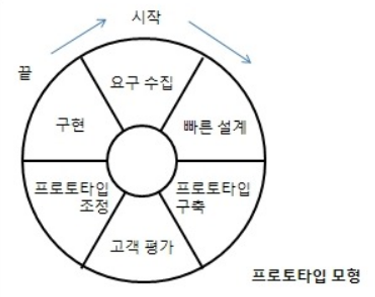

# 시나공 필기 1권

# 소프트웨어 설계

- 요구사항 확인 (37.78%)
    - 소프트웨어 생명 주기 A
        - 소프트웨어 생명 주기(Software Life Cycle)
            - 소프트웨어 생명 주기는 소프트웨어 개발 방법론의 바탕이 되는 것으로, 소프트웨어를 개발하기 위해 정의하고 운용, 유지보수 등의 과정을 각 단계별로 나눈 것이다.
                - 소프트웨어 생명 주기는 소프트웨어 개발 단계와 각 단계별 주요 활동, 그리고 활동의 결과에 대한 산출물로 표현한다. 소프트웨어 생명 주기라고도 한다.
                - 소프트웨어 생명 주기를 표현하는 형태를 소프트웨어 생명 주기 모형이라고 하며, 소프트웨어 프로세스 모형 또는 소프트웨어 공학 패러다임이라고도 한다.
                - 개발자는 문제의 유형이나 개발 방법 등에 따라 특정 모형을 선택하여 사용할 수도 있고, 개별적인 모형을 사용할 수도 있다.
                - 일반적으로 사용되는 소프트웨어 생명 주기 모형에는 폭포수 모형, 프로토타입 모형, 나선형 모형, 애자일 모형 등이 있다.
            - 소프트웨어 공학
                - 소프트웨어 공학(SE; Software Engineering)은 소프트웨어의 위기를 극복하기 위한 방안으로 연구된 학문이며 여러 가지 방법론과 도구, 관리 기법들을 통하여 소프트웨어 품질과 생산성을 향상시킬 목적으로 한다.
                - 소프트웨어 공학은 다음과 같이 여러 형태로 정의할 수 있다.
                    - IEEE의 소프트웨어 공학 표준 용어사전 : 소프트웨어의 개발, 운용, 유지보수, 폐기 처분에 대한 체계적인 접근 방안
                    - Fairley : 지정된 비용과 기간 내에 소프트웨어를 체계적으로 생산하고 유지보수하는 데 관련된 기술적이고 관리적인 원리
                    - Boehm : 과학적인 지식을 소프트웨어 설계와 제작에 응용하는 것이며 이를 개발, 운용, 유지보수하는 데 필요한 문서 작성 과정
                - 소프트웨어 공학의 기본 원칙
                    - 현대적인 프로그래밍 기술을 계속적으로 적용해야 함
                    - 개발된 소프트웨어 품질이 유지되도록 지속적으로 검증
                    - 소프트웨어 개발 관련 사항 및 결과에 대한 명확한 기록 유지
        - 폭포수 모형(Waterfall Model)
            - 폭포수 모형은 폭포에서 한번 떨어진 물은 거슬러 올라갈 수 없듯이 소프트웨어 개발도 이전 단계로 돌아갈 수 없다는 전제하에 각 단계를 확실히 매듭짓고 그 결과를 철저하게 검토하여 승인 과정을 거친 후에 다음 단계를 진행하는 개발 방법론
                - 폭포수 모형은 소프트웨어 공학에서 가장 오래되고 가장 폭넓게 사용된 전통적인 소프트웨어 생명 주기 모형으로, 고전적 생명 주기 모형이라고도 한다
                - 소프트웨어 개발 과정의 한 단계가 끝나야만 다음 단계로 넘어갈 수 있는 선형 순차적 모형이다
                - 모형을 적용한 경험과 성공 사례가 많다.
                - 제품의 일부가 될 메뉴얼을 작성해야 한다
                - 각 단계가 끝난 후에는 다음 단계를 수행하기 위한 결과물이 명확하게 산출되어야 한다
                - 두 개 이상의 과정이 병행되어 수행되지 않는다.
                    - 타당성 검토 → 계획 → 요구 분석 → 설계 → 구현(코딩) → 시험(검사) → 유지보수
        - 프로토타입 모형(Prototype Model, 원형 모형)
            - 프로토타입 모형은 사용자의 요구사항을 정확히 파악하기 위해 실제 개발될 소프트웨어에 대한 견본(시제)품(Prototype)을 만들어 최종 결과물을 예측하는 모형
                - 시제품은 사용자와 시스템 사이의 인터페이스에 중점을 두어 개발한다.
                - 시스템의 일부 혹은 시스템의 모형을 만드는 과정으로서 요구된 소프트웨어를 구현하는데, 이는 추후 구현 단계에서 사용될 골격 코드가 된다.
                - 소프트웨어의 개발이 완료된 시점에서 오류가 발견되는 폭포수 모형의 단점을 보완하기 위한 모형이다.
                    
                    
                    
        - 나선형 모형(Spiral Model, 점진적 모형)
            - 나선형 모형은 보헴(Boehm)이 제안한 것으로, 폭포수 모형과 프로토타입 모형의 장점에 위험 분석 기능을 추가한 모형이다.
                - 나선을 따라 돌듯이 여러 번의 소프트웨어 개발 과정을 거쳐 점진적으로 완벽한 최종 소프트웨어를 개발하는 것으로, 점진적 모형이라고도 한다.
                - 소프트웨어를 개발하면서 발생할 수 있는 위험을 관리하고 최소화하는 것을 목적으로 한다.
                - 점진적으로 개발 과정이 반복되므로 누락되거나 추가된 요구사항을 첨가할 수 있고, 정밀하며, 유지보수 과정이 필요 없다.
                    
                    
                    
        - 애자일 모형(Agile Model)
            - 애자일은 ‘민첩한’, ‘기민한’이라는 의미로, 고객의 요구사항변화에 유연하게 대응할 수 있도록 일정한 주기를 반복하면서 개발과정을 진행한다.
                - 애자일 모형은 어느 특정 개발 방법론이 아니라 좋은 것을 빠르고 낭비 없게 만들기 위해 고객과의 소통에 초점을 맞춘 방법론을 통칭한다.
                - 애자일 모형은 기업 활동 전반에 걸쳐 사용된다.
                - 애자일 모형은 스프린트(Sprint) 또는 이터레이션(Iteration)이라고 불리는 짧은 개발 주기를 반복하며, 반복되는 주기마다 만들어지는 결과물에 대한 고객의 평가와 요구를 적극 수용한다.
                - 각 개발주기에서는 고객의 요구사항에 우선순위를 부여하여 개발 작업을 진행한다.
                - 소규모 프로젝트, 고도로 숙달된 개발자, 급변하는 요구사항에 적합하다.
                - 애자일 모형을 기반으로 하는 소프트웨어 개발 모형에는 스크럼(Scrum), XP(eXtreme Programming), 칸반(Kanban), Lean, 크리스탈(Crystal), ASD(Adaptive Software Development), 기능 중심 개발(FDD; Feature Driven Development), DSDM(Dynamic System Development Method), DAD(Disciplined Agile Delivery)등이 있다.
                    
                    
                    
        - 폭포수 모형과 애자일의 비교
            
            
            | 구분 | 폭포수 모형 | 애자일 |
            | --- | --- | --- |
            | 새로운 요구사항 반영 | 어려움 | 지속적으로 반영 |
            | 고객과의 의사소통 | 적음 | 지속적임 |
            | 테스트 | 마지막에 모든 기능을 테스트 | 반복되는 일정 주기가 끝날 때마다 테스트 |
            | 개발 중심 | 계획, 문서(매뉴얼) | 고객 |
    - 스크럼(Scrum) 기법 B
        - 스크럼의 개요
            - 스크럼은 팀이 중심이 되어 개발의 효율성을 높인다는 의미가 내포된 용어
                - 스크럼은 팀원 스스로가 스크럼 팀을 구성(self-organizing)해야 하며, 개발 작업에 관한 모든 것을 스스로 해결(cross-functional)할 수 있어야 한다.
                - 스크럼 팀은 제품 책임자, 스크럼 마스터, 개발팀으로 구성된다.
            - 제품 책임자(PO; Product owner)
                - 이해관계자들 중 개발될 제품에 대한 이해도가 높고, 요구사항을 책임지고 의사 결정할 사람으로 선정한다. 주로 개발 의뢰자나 사용자가 담당한다.
                - 이해관계자들의 의견을 종합하여 제품에 대한 요구사항을 작성하는 주체
                - 요구사항이 담긴 백로그(Backlog)를 작성하고 백로그에 대한 우선순위를 지정
                - 팀원들이 백로그에 스토리를 추가할 수는 있지만 우선순위를 지정할 수는 없다.
                - 제품에 대한 테스트를 수행하면서 주기적으로 요구사항의 우선순위를 갱신
            - 스크럼 마스터(SM; Scrum Master)
                - 스크럼 팀이 스크럼을 잘 수행할 수 있도록 객관적인 시각에서 조언을 해주는 가이드 역할을 수행한다. 팀원들을 통제하는 것이 목표가 아니다.
                - 일일 스크럼 회의를 주관하여 진행 사항을 점검하고, 개발 과정에서 발생된 장애 요소를 공론화하여 처리
            - 개발팀(DT; Development Team)
                - 제품 책임자와 스크럼 마스터를 제외한 모든 팀원. 개발자 외에도 디자이너, 테스터 등 제품 개발을 위해 참여하는 모든 사람이 대상
                - 보통 최대 인원은 7 ~ 8 명이 적당
        - 스크럼 개발 프로세스
            
            
            
            - 제품 백로그(Product Backlog)
                - 제품 개발에 필요한 모든 요구사항(User Stroy)을 우선순위에 따라 나열한 목록
                - 개발 과정에서 새롭게 도출되는 요구사항으로 인해 지속적으로 업데이트된다.
                - 제품 백로그에 작성된 사용자 스토리를 기반으로 전체 일정 계획인 릴리즈 계획(Release Plan)을 수립한다.
            - 스프린트 계획 회의(Sprint Planning Meeting)
                - 제품 백로그 중 이번 스프린트에서 수행할 작업을 대상으로 단기 일정을 수립하는 것
                - 스프린트에서 처리할 요구사항(User Story)을 개발자들이 나눠서 작업할 수 있도록 태스크(Task)라는 작업 단위로 분할한 후 개발자들이 수행할 작업 목록인 스프린트 백로그(Sprint Backlog)을 작성한다.
            - 스프린트(Sprint)
                - 실제 개발 작업을 진행하는 과정으로, 보통 2 ~ 4주 정도의 기간 내에서 진행
                - 스프린트 백로그에 작성된 태스크를 대상으로 속도(Velocity)를 추정한 후 개발 담당자에게 할당
                - 태스크를 할당할 때는 개발자가 원한는 태스크를 직접 선별하여 담당할 수 있도록 하는 것이 좋다.
                - 개발 담당자에게 할당된 태스크는 보통 할 일(To Do), 진행 중(In Progress), 완료(Done)의 상태를 갖는다.
            - 일일 스크럼 회의(Daily Scrum Meeting)
                - 모든 팀원이 매일 약속된 시간에 약 15분 정도의 짧은 시간동안 진행 상황을 점검한다.
                - 회의는 보통 서서 진행하며, 남은 작업 시간은 소멸 차트(Burn-down Chart)에 표시한다.
                - 스크럼 마스터는 발견된 장애 요소를 해결할 수 있도록 도와준다.
            - 스프린트 검토 회의(Sprint Review)
                - 부분 또는 전체 완성 제품이 요구사항에 잘 부합되는지 사용자가 포함된 참석자 앞에서 테스팅 수행
                - 스프린트의 한 주당 한 시간 내에서 진행
                - 제품 책임자(Product Owner)는 개선할 사항에 대한 피드백을 정리한 후 다음 스프린트에 반영할 수 있도록 제품 백로그를 업데이트
            - 스프린트 회고(Sprint Retrospective)
                - 스프린트 주기를 되돌아보며 정해놓은 규칙을 잘 준수했는지, 개선할 점은 없는지 등을 확인하고 기록
                - 해당 스프린트가 끝난 시점에서 수행하거나 일정 주기로 수행
    - XP(eXtreme Programming) 기법 A
        - XP(eXtreme-Programming)
            - XP(eXtreme-Programming)는 수시로 발생하는 고객의 요구사항에 유연하게 대응하기 위해 고객의 참여와 개발 과정의 반복을 극대화하여 개발 생산성을 향상시키는 방법
                - XP는 짧고 반복적인 개발 주기, 단순한 설계, 고객의 적극적인 참여를 통해 소프트웨어를 빠르게 개발하는 것을 목적으로 한다.
                - 릴리즈의 기간을 짧게 반복하면서 고객의 요구사항 반영에 대한 가시성을 높인다.
                - 릴리즈 테스트마다 고객을 직접 참여시킴으로써 요구한 기능이 제대로 작동하는지 고객이 직접 확인할 수 있다.
                - 비교적 소규모 인원의 개발 프로젝트에 효과적이다
                - XP의 5가지 핵심 가치 : 의사소통(Communication), 단순성(Simplicity), 용기(Courage), 존중(Respect), 피드백(Peedback)
        - XP 개발 프로세스
            
            
            
            - 사용자 스토리(User Stroy)
                - 고객의 요구사항을 간단한 시나리오로 표현
                - 내용은 기능 단위로 구성, 필요한 경우 간단한 테스트 사항(Test Case)도 기재
            - 릴리즈 계획 수립(Release Planning)
                - 몇 개의 스토리가 적용되어 부분적으로 기능이 완료된 제품을 제공하는 것을 릴리즈라고 한다.
                - 부분 혹은 전체 개발 완료 시점에 대한 일정을 수립한다.
            - 스파이크(Spike)
                - 요구사항의 신뢰성을 높이고 기술 문제에 대한 위험을 감소시키기 위해 별도로 만드는 간단한 프로그램
                - 처리할 문제 외의 다른 조건은 모두 무시하고 작성
            - 이터레이션(Iteration)
                - 하나의 릴리즈를 더 세분화 한 단위를 이터레이션(Iteration)이라고 한다.
                - 일반적으로 1 ~ 3 주 정도의 기간으로 진행된다.
                - 이 기간 중에 새로운 스토리가 작성될 수 있으며, 작성된 스토리는 진행 중인 이터레이션 혹은 다음 이터레이션에 포함될 수 있다.
            - 승인 검사(Acceptance Test, 인수 테스트)
                - 하나의 이터레이션 안에서 계획된 릴리즈 단위의 부분 완료 제품이 구현되면 수행하는 테스트
                - 사용자 스토리 작성 시 함께 기재한 테스트 사항에 대해 고객이 직접 수행
                - 테스트 과정에서 발견한 오류 사항은 다음 이터레이션에 포함
                - 테스트 이후 새로운 요구사항이 작성되거나 요구사항의 상대적 우선순위가 변경될 수 있다.
                - 테스트가 완료되면 다음 이터레이션 진행
            - 소규모 릴리즈(Small Release)
                - 릴리즈를 소규모로 하게 되면, 고객의 반응을 기능별로 확인할 수 있어 고객의 요구사항에 좀 더 유연하게 대응할 수 있다.
                - 계획된 릴리즈 기간 동안 진행된 이터레이션이 모두 완료되면 고객에 의한 최종 테스트를 수행한 후 릴리즈, 즉 최종 결과물을 고객에게 전달
                - 릴리즈가 최종 완제품이 아닌 경우 다음 릴리즈 일정에 맞게 개발을 계속 진행
            - XP의 주요 실천 방법(Practice)
                
                
                | 실천 방법 | 내용 |
                | --- | --- |
                | Pair Programming
                (짝 프로그래밍) | 다른 사람과 함께 프로그래밍을 수행함으로써 개발에 대한 책임을 공동으로 나눠 갖는 환경을 조성한다. |
                | Collective Ownership
                (공동 코드 소유) | 개발 코드에 대한 권한과 책임을 공동으로 소유 |
                | Test-Driven Development
                (테스트 주도 개발) | - 개발자가 실제 코드를 작성하기 전에 테스트 케이스를 먼저 작성하므로 자신이 무엇을 해야할지 정확하게 파악
                - 테스트가 지속적으로 진행될 수 있도록 자동화된 테스팅 도구(구조, 프레임워크)를 사용한다. |
                | Whole Team
                (전체 팀) | 개발에 참여하는 모든 구성원(고객 포함)들은 각자 자신의 역할이 있고 그 역할에 대한 책임을 가져야 한다. |
                | Continuous Integration
                (계속적인 통합) | 모듈 단위로 나눠서 개발된 코드들은 하나의 작업이 마무리될 때마다 지속적으로 통합한다. |
                | Design Improvement
                (디자인 개선 또는 
                Refactoring(리팩토링)) | 프로그램 기능의 변경 없이 단순화, 유연성 강화 등을 통해 시스템을 재구성한다. |
                | Small Releases
                (소규모 릴리즈) | 릴리즈 기간을 짧게 반복함으로써 고객의 요구 변화에 신속히 대응 |
    - 현행 시스템 파악 B
        - 현행 시스템 파악 절차
            - 새로 개발하려는 시스템의 개발 범위를 명확히 설정하기 위해 현생 시스템의 구성과 제공 기능, 시스템 간의 전달 정보, 사용되는 기술 요소, 소프트웨어, 하드웨어, 그리고 네트워크의 구성 등을 파악한다.
                - 1단계
                    - 시스템 구성 파악
                    - 시스템 기능 파악
                    - 시스템 인터페이스 파악
                - 2단계
                    - 아키텍처 구성 파악
                    - 소프트웨어 구성 파악
                - 3단계
                    - 하드웨어 구성 파악
                    - 네트워크 구성 파악
        - 시스템 구성 파악
            - 현행 시스템의 구성은 조직의 주요 업무를 담당하는 기간 업무와 이를 지원하는 지원 업무로 구분하여 기술
                - 조직 내에 있는 모든 정보 시스템의 현황을 파악할 수 있도록 각 업무에 속하는 단위 업무 정보시스템들의 명칭, 주요  기능들을 명시한다.
                    - EX) 금융기관의 여신관리 업무와 고객관리 업무 시스템 현황
                        
                        
                        | 구분 | 시스템명 | 시스템 내용 | 비고 |
                        | --- | --- | --- | --- |
                        | 여신관리 업무 | 여신기획 관리 시스템 | 여신기획 관리를 위한 여신요율 책정, 연간 여신운용지침 수립 등의 기능을 제공하는 시스템 |  |
                        | 여신관리 업무 | 여신담당 관리 시스템 | 여신상담 관리를 위한 거래처정보 관리, 여신상담, 대출의향서 발급 기능을 제공하는 시스템 |  |
                        | 고객관리 업무 | 고객등록 처리 시스템 | 고객의 기본 정보를 관리하기 위한 등록, 변경, 조회 삭제 등의 기능을 제공하는 시스템 |  |
        - 시스템 기능 파악
            - 현행 시스템의 기능은 단위 업무 시스템이 현재 제공하는 기능들을 주요 기능과 하부 기능, 세부 기능으로 구분하여 계층형으로 표시한다.
                - EX) 여신상담 관리 시스템의 주요 기능과 하부, 세부 기능
                
                | 단위 업무 시스템 | Level 1 주요 업무 기능 | Level 2 세부 업무 기능 | Level 3 세부 업무 기능 활동 | 비고 |
                | --- | --- | --- | --- | --- |
                | 여신상담 관리 | 여신기획 관리 | 여신요율 책정 |  |  |
                | 여신상담 관리 |  | 연간 여신운용지침 수립 |  |  |
                | 여신상담 관리 | 여신상담 관리 | 거래처정보 관리 | 거래처정보 등록 |  |
                | 여신상담 관리 | 여신상담 관리 | 거래처정보 관리 | 신용정보 관리 |  |
                | 여신상담 관리 | 여신상담 관리 | 여신상담 | 대상거래 파악 |  |
                | 여신상담 관리 | 여신상담 관리 | 여신상담 | 상담결과 보고 |  |
                | 여신상담 관리 | 여신상담 관리 | 여신상담 | 신용조사 의뢰 |  |
        - 시스템 인터페이스 파악
            - 현행 시스템의 인터페이스에는 단위 업무 시스템 간에 주고받는 데이터의 종류, 형식, 프로토콜, 연계 유형, 주기 등을 명시한다.
                - 데이터를 어떤 형식으로 주고받는지, 통신규약은 무엇을 사용하는지, 연계유형은 무엇인지 등을 반드시 고려해야 한다.
                    - EX) 여신상담 관리 시스템의 인터페이스 현황
                    
                    | 송신시스템 | 수신 시스템 | 연동 데이터 | 연동 형식 | 통신규약 | 연계 유형 | 주기 |
                    | --- | --- | --- | --- | --- | --- | --- |
                    | 여신상담 관리 시스템 | 여신관리센터 | 연체 정보 | XML | TCP/IP | EAI | 하루(일) |
                    | 여신상담 관리 시스템 | 여신금융협회 | 부도 정보 | XML | X.25 | FEP | 수시 |
        - 아키텍처 구성 파악
            - 현행 시스템의 아키텍처 구성은 기간 업무 수행에 어떠한 기술 요소들이 사용되는지 최상위 수준에서 계층별로 표현한 아키텍처 구성도로 작성한다.
                - 아키텍처가 단위 업무 시스템별로 다른 경우에는 가장 핵심이 되는 기간 업무 처리 시스템을 기준으로 표현한다.
                    - EX) 회원 정보 관리 시스템 아키텍처 구성도
                        
                        
                        
        - 소프트웨어 구성 파악
            - 소프트웨어 구성에는 단위 업무 시스템별로 업무 처리를 위해 설치되어 있는 소프트웨어들의 제품명, 용도, 라이선스 적용 방식, 라이선스 수 등을 명시한다.
                - 시스템 구축비용 면에서 소프트웨어 비용이 적지 않은 비중을 차지하므로, 상용 소프트웨어의 경우 라이선스 적용 방식의 기준과 보유한 라이선스의 파악이 중요하다.
                    - EX) 단위 업무 시스템별 소프트웨어 현황
                    
                    | 구분 | 시스템명 | SW 제품명 | 용도 | 라이선스 적용 방식 | 라이선스 수 |
                    | --- | --- | --- | --- | --- | --- |
                    | 여신관리 업무 | 여신기획 관리 시스템 | Apache Tomcat | WAS | 오픈 소스
                    Apache License | 1 |
                    | 여신관리 업무 | 여신기획 관리 시스템 | MySQL | 데이터베이스 | GPL 또는 상용 | 1 |
                    | 여신관리 업무 | 여신기획 관리 시스템 | UNIX | 운영체제 | GNU GPL | 1 |
                    | 여신관리 업무 | 여신상담 관리 시스템 | Sage | ERP | 상용 | 1 |
                    | 여신관리 업무 | 여신상담 관리 시스템 | Oracle | 데이터베이스 | GPL 또는 상용 | 1 |
                    | 여신관리 업무 | 여신상담 관리 시스템 | Windows 10 | 운영체제 | DSP | 5 |
        - 하드웨어 구성 파악
            - 하드웨어 구성에는 단위 업무 시스템들이 운용되는 서버의 주요 사양과 수량, 그리고 이중화의 적용 여부를 명시한다.
                - 서버의 이중화는 기간 업무의 서비스 기간, 장애 대응 정책에 따라 필요 여부가 결정된다.
                - 현행 시스템에 이중화가 적용된 경우 대부분 새로 구성될 시스템에도 이중화가 필요하므로 이로 인한 비용 증가와 시스템 구축 난이도가 높아질 가능성을 고려해야 한다.
                    - EX)단위 업무 시스템별 하드웨어 현황
                    
                    | 구분 | 시스템명 | 제품명 | 주요 사양 | 수량 | 이중화 |
                    | --- | --- | --- | --- | --- | --- |
                    | 여신 관리 업무 | 여신 기획 관리 시스템 | AP 서버 | - CPU : 2.6GHz 8core/24TX 2ea, 30MB Cache
                    
                    - HDD : 300GB 15k RPM SAS 2.5* X 3ea + 600GB 15k RPM SAS 2..5*X 4ea
                    
                    - RAID Controller: 2GB 캐시 | 1 | M |
                    | 여신 관리 업무 | 여신 기획 관리 시스템 | DB 서버 | - CPU : 3.2GHz 12core/24TX 2ea, 50MB Cache
                    
                    - Memory : 16GB RDMM, 2133MT/s x 8ea
                    
                    - HDD : 1TB 15k RPM SAS 2.5* X 3ea + 2TB 15k RPM SAS 2.5* X 4ea
                    
                    - RAID Controller : 4GB 캐시 | 1 | Y |
        - 네트워크 구성 파악
            - 네트워크 구성은 업수 시스템들의 구성을 파악할 수 있도록 서버의 위치, 서버 간의 네트워크 연결 방식을 네트워크 구성도로 작성한다.
                - 네트워크 구성도를 통해 서버들의 물리적인 위치 관계를 파악할 수 있고 보안 취약성을 분석하여 적절한 대응을 할 수 있다.
                - 네트워크에 장애가 발생한 경우 발생 원인을 찾아 복구하기 위한 용도로 활용될 수 있다.
                    - EX) 자원관리팀, 마케팅팀, 업무지원팀의 인터넷 접속을 위한 네트워크 구성도
                    
                    
                    
    - 개발 기술 환경 파악 B
        - 개발 기술 환경의 정의
            - 개발하고자 하는 소프트웨어와 관련된 운영체제(Operating System), 데이터베이스 관리 시스템(Database Management System), 미들웨어(Middle Ware) 등을 선덩할 때 고려해야 할 사항을 기술하고, 오픈 소스 사용 시 주의해야 할 내용을 제시한다.
        - 운영체제(OS; Operating System)
            - 운영체제는 컴퓨터 시스템의 자원들을 효율적으로 관리하며, 사용자가 컴퓨터를 편리하고 효율적으로 사용할 수 있도록 환경을 제공하는 소프트웨어다.
                - 컴퓨터 사용자와 컴퓨터 하드웨어 간의 인터페이스로서 동작하는 시스템 소프트웨어의 일종으로, 다른 응용 프로그램이 유용한 작업을 할 수 있도록 환경을 제공 해 준다.
                - 컴퓨터 운영체제의 종류에는 Windows, UNIX, Linux, Mac OS 등이, 모바일 운영체제에는 iOS, Android 등이 있다.
        - 운영체제 관련 요구 사항 식별 시 고려 사항
            - 운영체제와 관련된 요구사항 식별 시 다음과 같은 사항을 고려해야 한다.
                
                
                | 구분 | 내용 |
                | --- | --- |
                | 가용성 | - 시스템의 장시간 운영으로 인해 발생할 수 있는 운영체제 고유의 장애 발생 가능성
                
                - 메모리 누수로 인한 성능 저하 및 재가동
                
                - 보안상 발견된 허점을 보완하기 위한 지속적인 패치 설치로 인한 재가동
                
                - 운영체제 결함 등으로 인한 패치 설치를 위한 재가동 |
                | 성능 | - 대규모 동시 사용자 요청에 대한 처리
                
                - 대규모 및 대용량 파일 작업에 대한 처리
                
                - 지원 가능한 메모리 크기(32bit, 64bit) |
                | 기술 지원 | - 제작업체의 안정적인 기술 지원
                
                - 여러 사용자들 간의 정보 공유
                
                - 오픈 소스 여부(Linux) |
                | 주변 기기 | - 설치 가능한 하드웨어
                
                - 여러 주변기기 지원 여부 |
                | 구축 비용 | - 지원 가능한 하드웨어 비용
                
                - 설치할 응용 프로그램의 라이선스 정책 및 비용
                
                - 유지관리 비용
                
                - 총 소유 비용(TCO) |
        - 데이터베이스 관리 시스템(DBMS)
            - DBMS(DataBase Management System)는 사용자와 데이터베이스 사이에서 사용자의 요구에 따라 정보를 생성해 주고, 데이터베이스를 관리해 주는 소프트웨어
                - DBMS는 기존의 파일 시스템이 갖는 데이터의 종속성과 중복성의 문제를 해결하기 위해 제안된 시스템으로, 모든 응용 프로그램들이 데이터베이스를 공용할 수 있도록 관리해 준다.
                - DBMS는 데이터베이스의 구성, 접근 방법, 유지관리에 대한 모든 책임을 진다.
                - DBMS의 종류에는 Oracle, IBM DB2, Microsoft SQL Server, MySQL, SQLite, MongoDB, Redis 등이 있다.
        - DBMS 관련 요구 사항 식별 시 고려 사항
            - DBMS와 관련된 요구사항 식별 시 다음과 같은 사항을 고려해야 한다.
            
            | 구분 | 내용 |
            | --- | --- |
            | 가용성 | - 시스템의 장시간 운영으로 발생할 수 있는 고유의 장애 발생 가능성
            
            - DBMS의 결함 등으로 인한 패치 설치를 위한 재가동
            
            - 백업이나 복구의 편의성 
            
            - DBMS 이중화 및 복제 지원 |
            | 성능 | - 대규모 데이터 처리 성능(분할 테이블 지원 여부)
            
            - 대용량 트랜잭션 처리 성능
            
            - 튜닝 옵션의 다양한 지원 
            
            - 최소화된 설정과 비용 기반 질의 최적화 지원 |
            | 기술 지원 | - 제작업체의 안정적인 기술 지원 
            
            - 여러 사용자들 간의 정보 공유
            
            - 오픈 소스 여부 |
            | 상호 호환성 | - 설치 가능한 운영체제의 종류 
            
            - JDBC, ODBC와의 호환 여부 |
            | 구축 비용 | - 라이선스 정책 및 비용
            
            - 유지관리 비용
            
            - 총 소유 비용(TCO) |
        - 웹 애플리케이션 서버(WAS; Web Application Server)
            - 웹 애플리케이션 서버는 정적인 콘텐츠 처리를 하는 웹 서버와 달리 사용자의 요구에 따라 변하는 동적인 콘텐츠를 처리하기 위해 사용되는 미들웨어이다.
                - 데이터 접근, 세션 관리, 트랜잭션 관리 등을 위한 라이브러리를 제공한다.
                - 주로 데이터베이스 서버와 연동해서 사용한다.
                - 웹 애플리케이션 서버의 종류에는 Tomcat, GlassFish, JBoss, Jetty, JEUS, Resin, WebLogic, WebSphre 등이 있다.
        - 웹 애플리케이션 서버(WAS)관련 요구 사항 식별 시 고려 사항
            - 웹 애플리케이션 서버(WAS)와 관련된 요구사항 식별 시 다음과 같은 사항을 고려해야 한다.
            
            | 구분 | 내용 |
            | --- | --- |
            | 가용성 | - 시스템의 장시간 운영으로 인해 발생할 수 있는 고유의 장애 발생 가능성
            
            - WAS의 결함 등으로 인한 패치 설치를 위한 재가동
            
            - 안정적인 트랜잭션 처리 
            
            - WAS 이중화 지원 |
            | 성능 | - 대규모 트랜잭션 처리 성능
            
            - 다양한 설정 옵션 지원 
            
            - 가비지 컬렉션(GC; Garbage Collection)의 다양한 옵션 |
            | 기술 지원 | - 제조업체의 안정적인 기술 지원
            
            - 여러 사용자들 간의 정보 공유
            
            - 오픈 소스 여부 |
            | 구축 비용 | - 라이선스 정책 및 비용
            
            - 유지관리 비용
            
            - 총 소유 비용(TCO) |
        - 오픈 소스 사용에 따른 고려 사항
            - 오픈 소스(Open Source)는 누구나 별다른 제한 없이 사용할 수 있도록 소스 코드를 공개한 것으로 오픈 소스 라이선스를 만족하는 소프트웨어이다.
            - 오픈 소스를 사용하는 경우에는 라이선스의 종류, 사용자 수, 기술의 지속 가능성 등을 고려해야 한다.
    - 요구 사항 정의 A
        - 요구 사항의 개념 및 특징
            - 요구사항은 소프트웨어가 어떤 문제를 해결하기 위해 제공하는 서비스에 대한 설명과 정상적으로 운영되는데 필요한 제약조건 등을 나타낸다.
                - 요구사항은 소프트웨어 개발이나 유지 보수 과정에서 필요한 기준과 근거를 제공한다.
                - 요구사항은 개발하려는 소프트웨어의 전반적인 내용을 확인할 수 있게 하므로 개발에 참여하는 이해관계자들 간의 의사소통을 원활하게 하는 데 도움을 준다.
                - 요구사항이 제대로 정의되어야만 이를 토대로 이후 과정의 목표와 계획을 수립할  수 있다.
        - 요구 사항의 유형
            - 요구사항은 일반적으로 기술하는 내용에 따라 기능 요구사항(Functional requirements)과 비기능 요구사항(Non-functional requirements)으로 구분하며, 기술 관점과 대상의 범위에 따라 시스템 요구사항(System requirements)과 사용자 요구사항(User requirements)으로 나뉜다.
            
            | 유형 | 내용 |
            | --- | --- |
            | 기능 요구사항
            (Functional requirements) | - 시스템이 무엇을 하는지, 어떤 기능을 하는지에 대한 사항
            
            - 시스템의 입력이나 출력으로 무엇이 포함되어야 하는지, 시스템이 어떤 데이터를 저장하거나 연산을 수행해야 하는지에 대한 사항
            
            - 시스템이 반드시 수행해야 하는 기능
            
            - 사용자가 시스템을 통해 제공받기를 원하는 기능 |
            | 비기능 요구사항(Non-Functional requiremnets) | - 시스템 장비 구성 요구사항 : 하드웨어, 소프트웨어, 네트워크 등의 시스템 장비 구성에 대한 요구사항
            
            - 성능 요구사항 : 처리 속도 및 시간, 처리량, 동적 - 정적 적용량, 가용성 등 성능에 대한 요구사항
            
            - 인터페이스 요구사항 : 시스템 인터페이스와 사용자 인터페이스에 대한 요구사항으로 다른 소프트웨어, 하드웨어 및 통신 인터페이스, 다른 시스템과의 정보 교환에 사용되는 프로토콜과의 연계도 포함하여 기술
            
            - 데이터 요구사항 : 초기 자료 구축 및 데이터 변환을 위한 대상, 방법, 보안이 필요한 데이터 등 데이터를 구축하기 위해 필요한 요구사항
            
            - 테스트 요구사항 : 도입되는 장비의 성능 테스트(BMT)나 구축된 시스템이 제대로 운영되는지를 테스트하고 점검하기 위한 테스트 요구사항 
            
            - 보안 요구사항 : 시스템의 데이터 및 기능, 운영 접근을 통제하기 위한 요구사항 
            
            - 품질 요구사항 : 관리가 필요한 품질 항목, 품질 평가 대상에 대한 요구사항으로 가용성, 정합성, 상호 호환성, 대응성, 신뢰성, 사용성, 유지 - 관리성, 이식성, 확장성, 보안성 등으로 구분하여 기술
            
            - 제약사항 : 시스템 설계, 구축, 운영과 관련하여 사전에 파악된 기술, 표준, 업무, 법-제도 등의 제약조건 
            
            - 프로젝트 관리 요구사항 : 프로젝트의 원활한 수행을 위한 관리 방법에 대한 요구사항
            
            - 프로젝트 지원 요구사항 : 프로젝트의 원활한 수행을 위한 지원 사항이나 방안에 대한 요구사항 |
            | 사용자 요구사항(User requirements) | - 사용자 관점에서 본 시스템이 제공해야 할 요구사항 
            
            - 사용자를 위한 것으로 친숙한 표현으로 이해하기 쉽게 작성된다.  |
            | 시스템 요구사항(System requirements) | - 개발자 관점에서 본 시스템 전체가 사용자와 다른 시스템에 제공해야 할 요구사항
            
            - 사용자 요구사항에 비해 전문적이고 기술적인 용어로 표현
            
            - 소프트웨어 요구사항이라고도 한다. |
        - 요구 사항 개발 프로세스
            - 요구사항 개발 프로세스는 개발 대상에 대한 요구사항을 체계적으로 도출하고 이를 분석한 후 분석 결과를 명세서(Specification Document)에 정리한 다음 마지막으로 이를 확인 및 검증하는 일련의 구조화된 활동
                - 요구사항 개발 프로세스가 진행되기 전에 개발 프로세스가 비지니스 목적에 부합되는지, 예산은 적정한지 등에 대한 정보를 수집, 평가한 보고서를 토대로 타당성 조사(Feasibility Study)가 선행되어야 한다.
                - 요구사항 개발은 요구공학(Requirement Engineering)의 한 요소이다.
                    - 도출(Elicaitation) → 분석(Analysis) → 명세(Specification) → 확인(Validation)
                    - 요구공학(Requirements Engineering)
                        - 요구공학은 무엇을 개발해야 하는지 요구사항을 정의하고, 분석 및 관리하는 프로세스를 연구하는 학문이다.
                            - 점점 복잡하고 대형화되어가는 소프트웨어 개발 환경에 따라 사용자 요구사항도 복잡해지고 잦은 변경이 발생하는 데, 이는 요구사항에 문제가 발생할 가능성을 높이며 요구사항 관리가 잘못될 수 있는 원인이 된다.
                            - 요구공학은 요구사항 변경의 원인과 처리 방법을 이해하고 요구사항 관리 프로세스의 품질을 개선하여 소프트웨어 프로젝트 실패를 최소화하는 것을 목표로 한다.
        - 요구 사항 도출(Requirement Elicaitation, 요구 사항 수집)
            - 요구 사항 도출은 시스템, 사용자, 그리고 시스템 개발에 관련된 사람들이 서로 의견을 교환하여 요구 사항이 어디에 있는지, 어떻게 수집할 것인지를 식별하고 이해하는 과정이다.
                - 요구 사항 도출은 소프트웨어가 해결해야 할 문제를 이해하는 첫 번째 단계이다.
                - 요구 사항 도출 단계에서 개발자와 고객 사이의 관계가 만들어지고 이해관계자(Stakeholder)가 식별된다.
                - 이 단계에서는 다양한 이해관계자 간의 효율적인 의사소통이 중요하다.
                - 요구 사항 도출은 소프트웨어 개발 생명 주기(SDLC; Software Development Life Cycel)동안 지속적으로 반복된다.
                - 요구 사항을 도출하는 주요 기법에는 청취와 인터뷰, 설문, 브레인스토밍, 워크샵, 포로토타이핑, 유스케이스 등이 있다.
        - 요구 사항 분석(Requirement Analysis)
            - 요구 사항 분석은 개발 대상에 대한 사용자의 요구 사항 중 명확하지 않거나 모호하여 이해 되지 않는 부분을 발견하고 이를 걸러내기 위한 과정이다.
                - 사용자 요구 사항의 타당성을 조사하고 비용과 일정에 대한 제약을 설정한다.
                - 내용이 중복되거나 하나로 통합되어야 하는 등 서로 상충되는 요구 사항이 있으면 이를 중재하는 과정이다.
                - 도출된 요구 사항들을 토대로 소프트웨어의 범위를 파악한다.
                - 도출된 요구 사항들을 토대로 소프트웨어와 주변 환경이 상호 작용하는 방법을 이해한다.
                - 요구 사항 분석에는 자료 흐름도(DFD), 자료 사전(DD) 등의 도구가 사용된다.
        - 요구 사항 명세(Requirement Specification)
            - 요구 사항 명세는 분석된 요구 사항을 바탕으로 모델을 작성하고 문서화하는 것을 의미한다.
                - 요구 사항을 문서화할 때는 기능 요구 사항은 빠짐없이 완전하고 명확하게 기술해야 하며, 비기능 요구 사항은 필요한 것만 명확하게 기술해야 한다.
                - 요구 사항은 사용자가 이해하기 쉬우며, 개발자가 효과적으로 설계할 수 있도록 작성 되어야 한다.
                - 설계 과정에서 잘못된 부분이 확인될 경우 그 내용을 요구 사항 정의서에서 추적할 수 있어야 한다.
                - 구체적인 명세를 위해 소단위 명세(Mini-Spec)가 사용될 수 있다.
                    - 소프트웨어 요구 사항 명세서 / 요구 사항 명세 기법
                        - 소프트웨어 요구사항 명세서(SRS; Software Requirement Specification)
                            - 업계 표준 용어로 소프트웨어가 반드시 제공해야 하는 기능, 특징, 제약조건 등을 명시한다.
                                - 시스템의 모든 동작뿐만 아니라 성능, 보안, 사용성과 같은 품질도 기술되어야 한다.
                                - 프로젝트 유형에 맞게 양식을 만들어 사용한다.
                                - 소프트웨어 요구 사항 명세서에 포함되는 시스템 기능, 데이터, 외부 인터페이스, 품질 요구 사항은 요구 사항 단위별로 개별 요구 사항 명세서를 작성한다.
                                - 요구 사항 명세 기법
                                    - 요구 사항 명세 기법은 정형 명세와 비정형 명세로 구분된다.
                                    
                                    | 구분 | 정형 명세 기법 | 비정형 명세 기법 |
                                    | --- | --- | --- |
                                    | 기법 | 수학적 원리 기반, 모델 기반 | 상태 /기능/객체 중심 |
                                    | 작성 방법 | 수학적 기호, 정형화된 표기법 | 일반 명사, 동사 등의 자연어를 기반으로 서술 또는 다이어그램으로 작성 |
                                    | 특징 | - 요구 사항을 정확하고 간결하게 표현
                                    
                                    - 요구 사항에 대한 결과가 작성자에 관계없이 일관성이 있으므로 완전성 검증이 가능
                                    
                                    - 표기법이 어려워 사용자가 이해하기 어려움 | - 자연어의 사용으로 인해 요구 사항에 대한 결과가 작성자에 따라 다를 수 있어 일관성이 떨어지고, 해석이 달라질 수 있음 
                                    
                                    - 내용의 이해가 쉬워 의사소통이 용이함 |
                                    | 종류 | VDM, Z, Petri-net, CSP 등 | FSM, Decision Table, ER 모델링, State Chart(SADT)등 |
        - 요구 사항 확인(Requirement Validation, 요구 사항 검증)
            - 요구 사항 확인은 개발 자원을 요구 사항에 할당하기 전에 요구 사항 명세서가 정확하고 완전하게 작성되었는지를 검토하는 활동
                - 분석가가 요구 사항을 정확하게 이해한 후 요구 사항 명세서를 작성했는지 확인(Validation)하는 것이 필요
                - 요구 사항이 실제 요구를 반영하는지, 서로 상충되는 요구 사항은 없는지 등을 점검한다.
                - 개발이 완료된 후 문제가 발견되면 재 작업 비용이 발생할 수 있으므로 요구 사항 검증은 매우 중요하다.
                - 요구 사항 명세서의 내용이 이해하기 쉬운지, 일관성은 있는지, 회사의 기준에는 맞는지, 그리고 누락된 기능은 없는지 등을 검증(Verification)하는 것이 중요
                - 요구 사항 문서는 이해 관계자들이 검토해야 한다.
                - 요구 사항 검증 과정을 통해 모든 문제를 확인할 수 있는 것은 아니다.
                - 일반적으로 요구 사항 관리 도구를 이용하여 요구 사항 정의 문서들에 대해 형상 관리를 수행한다.
            
    - 요구 사항 분석 A
        - 요구 사항 분석의 개요
            - 요구 사항 분석은 소프트웨어 개발의 실제적인 첫 단계로 개발 대상에 대한 사용자의 요구 사항을 이해하고 문서화(명세화)하는 활동을 의미한다.
                - 사용자 요구의 타당성을 조사하고 비용과 일정에 대한 제약을 설정한다.
                - 사용자의 요구를 정확하게 추출하여 목표를 정하고, 어떤 방식으로 해결할 것인지를 결정한다.
                - 요구 사항 분석을 통한 결과는 소프트웨어 설계 단계에서 필요한 기본적인 자료가 되므로 사용자의 요구 사항을 정확하고 일관성 있게 분석하여 문서화해야 한다.
                - 소프트웨어 분석가에 의해 요구 사항 분석이 수행되며, 이 작업 단계를 요구 사항 분석 단계라고 한다.
                - 요구 사항 분석을 위해 UML(Unified Modeling Language), 자료 흐름도(DFD), 자료 사전(DD), 소 단위 명세서(Mini-Spec.), 개체 관계도(ERD), 상태 전이도(STD), 제어 명세서 등의 도구를 이용한다.
        - 구조적 분석 기법
            - 구조적 분석 기법은 자료의 흐름과 처리를 중심으로 하는 요구 사항 분석 방법으로, 다음과 같은 특징이 있다.
                - 도형 중심의 분석용 도구와 분석 절차를 이용하여 사용자의 요구 사항을 파악하고 문서화한다.
                - 도형 중심의 도구를 사용하므로 분석가와 사용자 간의 대화가 용이하다.
                - 하향식 방법을 사용하여 시스템을 세분화할 수 있고, 분석의 중복을 배제할 수 있다.
                - 사용자의 요구 사항을 논리적으로 표현하여 전체 시스템을 일관성 있게 이해할 수 있다.
                - 시스템 분석의 질이 향상되고, 시스템 개발의 모든 단계에서 필요한 명세서 작성이 가능하다.
        - 자료 흐름도(DFD)
            - 자료 흐름도(DFD; Data Flow Diagram)는 요구 사항 분석에서 자료의 흐름 및 변환 과정과 기능을 도형 중심으로 기술하는 방법으로 자료 흐름 그래프, 버블 차트라고도 한다.
            - 시스템 안의 프로세스와 자료 저장소 사이에 자료의 흐름을 나타내는 그래프로 자료 흐름과 처리를 중심으로 하는 구조적 분석 기법에 이용된다.
            - 자료 흐름도는 자료 흐름과 기능을 자세히 표현하기 위해 단계적으로 세분화된다.
            - 자료는 처리(Process)를 거쳐 변환될 때마다 새로운 이름이 부여되며, 처리는 입력 자료가 발생하면 기능을 수행한 후 출력 자료를 산출한다.
            - 자료 흐름도에서는 자료의 흐름과 기능을 프로세스(Process), 자료 흐름(Flow), 자료 저장소(Data Store), 단말(Terminator)의 네 가지 기본 기호로 표시한다.
                
                
                
        - 자료 사전
            - 자료 사전(DD; Data Dictionary)은 자료 흐름도에 있는 자료를 더 자세히 정의하고 기록한 것이며, 이처럼 데이터를 설명하는 데이터를 데이터의 데이터 또는 메타 데이터(Meta Data)라고 한다.
                - 자료 흐름도에 시각적으로 표시된 자료에 대한 정보를 체계적이고 조직적으로 모아 개발자나 사용자가 편리하게 사용할 수 있다.
                - 자료 사전에서 사용되는 표기 기호는 다음과 같다.
                    
                    
                    
    - 요구 사항 분석 CASE와 HIPO B
        - 요구 사항 분석을 위한 CASE(자동화 도구)
            - 요구 사항 분석을 위한 자동화 도구는 요구 사항을 자동으로 분석하고, 요구 사항 분석 명세서를 기술하도록 개발된 도구
            - 요구 사항 분석을 위한 자동화 도구 사용의 이점은 다음과 같다.
                - 표준화와 보고를 통한 문서화 품질 개선
                - 데이터베이스가 모두에게 이용 가능하다는 점에서 분석자들 간의 적절한 조정
                - 교차 참조도와 보고서를 통한 결함, 생략, 불일치 등의 발견 용이성
                - 변경이 주는 영향 추적의 용이성
                - 명세에 대한 유지보수 비용의 축소
            - 종류
                - 요구 사항 분석을 위한 자동화 도구에는 SADT, SREM, PSL/PSA, TAGS, EPOS등이 있다.
                    - SADT(Structured Analysis and Design Technique)
                        - SoftTech 사에서 개발한 것으로 시스템 정의 ,소프트웨어 요구 사항 분석, 시스템/소프트웨어 설계를 위해 널리 이용되어 온 구조적 분석 및 설계 도구이다.
                        - 구조적 요구 분석을 하기 위해 블록 다이어그램을 채택한 자동화 도구
                    - SREM(Software Requirements Engineering Methodology) = RSL/REVS
                        - TRW 사가 우주 국방 시스템 그룹에 의해 실시간 처리 소프트웨어 시스템에서 요구 사항을 명확히 기술하도록 할 목적으로 개발한 것으로, RSL과 REVS를 사용하는 자동화 도구
                            - RSL(Requirement Statement Language) : 요소, 속성, 관계, 구조들을 기술하는 요구 사항 기술 언어
                                - 요소 : 요구 사항 명세를 개발하기 위해 사용되는 개체와 개념
                                - 속성 : 요소를 수정하거나 수식하기 위한 것
                                - 관계 : 개체들 간의 관계
                                - 구조 : 정보 흐름을 묘사하기 위한 것
                            - REVS(Requirement Engineering and Validation System) : RSL로 기술된 요구 사항들을 자동으로 분석하여 요구 사항 분석 명세서를 출력하는 요구 사항 분석기
                    - PSL/PSA
                        - 미시간 대학에서 개발한 것으로 PSL과 PSA를 사용하는 자동화 도구
                            - PSL(Problem Statement Language) : 문제(요구 사항) 기술 언어
                            - PSA(Problem Statement Analyzer) : PSL로 기술한 요구 사항을 자동으로 분석하여 다양한 보고서를 출력하는 문제 분석기
                    - TAGS(Technology for Automated Generation of Systems)
                        - 시스템 공학 방법 응용에 대한 자동 접근 방법으로, 개발 주기의 전 과정에 이용할 수 있는 통합 자동화 도구이다.
                        - 구성 : IORL, 요구 사항 분석과 IORL 처리를 위한 도구, 기초적인 TAGS 방법론
                        - IORL : 요구 사항 명세 언어
        - HIPO
            - HIPO(Hierarchy Input Process Output)는 시스템의 분석 및 설계나 문서화할 때 사용되는 기법으로, 시스템 실행 과정인 입력, 처리, 출력의 기능을 나타낸다.
                - 기본 시스템 모델은 입력, 처리, 출력으로 구성되며, 하향식 소프트웨어 개발을 위한 문서화 도구이다.
                - 체계적인 문서 관리가 가능하다.
                - 기호, 도표 등을 사용하므로 보기 쉽고 이해하기도 쉽다.
                - 기능과 자료의 의존 관계를 동시에 표현할 수 있다.
                - 변경, 유지 보수가 용이하다.
                - 시스템의 기능을 여러 개의 고유 모듈들로 분할하여 이들 간의 인터페이스를 계층 구조로 표현한 것을 HIPO Chart라고 한다.
            - HIPO Chart의 종류
                - HIPO Chart의 종류에는 가시적 도표(Visual Table of Contents), 총체적 도표(Overview Diagram), 세부적 도표(Detail Diagram)가 있다.
                    - 가시적 도표(도식 목차) : 시스템의 전체적인 기능과 흐름을 보여주는 계층(Tree) 구조도
                    - 총체적 도표(총괄 도표, 개요 도표) : 프로그램을 구성하는 기능을 기술한 것으로 입력, 처리, 출력에 대한 전반적인 정보를 제공하는 도표
                    - 세부적 도표(상세 도표) : 총체적 도표에 표시된 기능을 구성하는 기본 요소들을 상세히 기술하는 도표
    - UML(Unified Modeling Language) A
        - UML(Unified Modeling Language)의 개요
            - UML은 시스템 분석, 설계, 구현 등 시스템 개발 과정에서 시스템 개발자와 고객 또는 개발자 상호간의 의사소통이 원활하게 이루어지도록 표준화한 대표적인 객체지향 모델링 언어이다.
                - UML은 Rumbaugh(OMT), Booch, Jacobson 등의 객체지향 방법론의 장점을 통합하였으며, 객체 기술에 관한 국제표준화기구인 OMG(Object Management Group)에서 표준으로 지정하였다.
                - UML을 이용하여 시스템의 구조를 표현하는 6개의 구조 다이어그램과 시스템의 동작을 표현하는 7개의 행위 다이어그램을 작성할 수 있다.
                - 각각의 다이어그램은 사물과 사물 간의 관계를 용도에 맞게 표현한다.
                - UML의 구성 요소에는 사물(Things), 관계(Relationships), 다이어그램(Diagram)등이 있다.
        - 사물(Things)
            - 사물은 모델을 구성하는 가장 중요한 기본 요소로, 다이어그램 안에서 관계가 형성될 수 있는 대상들을 말한다.
                - 사물에는 구조 사물, 행동 사물, 그룹 사물, 주해 사물이 있다.
                
                | 사물 | 내용 |
                | --- | --- |
                | 구조 사물
                (Structural Things) | - 시스템의 개념적, 물리적 요소를 표현 
                
                - 클래스(Class), 유스케이스(Use Case), 컴포넌트(Component), 노드(Node) 등 |
                | 행동 사물
                (Behavioral Things) | - 시간과 공간에 따른 요소들의 행위를 표현
                
                - 상호작용(Interaction), 상태 머신(State Machine) 등  |
                | 그룹 사물
                (Grouping Things) | - 요소들을 그룹으로 묶어서 표현
                
                - 패키지(Package) |
                | 주해 사물
                (Annotation Things) | - 부가적인 설명이나 제약조건 등을 표현
                
                - 노트(Note) |
        - 관계(Relationships)
            - 관계는 사물과 사물 사이의 연관성을 표현하는 것으로, 연관 관계, 집합 관계, 포함 관계, 일반화 관계, 의존 관계, 실체화 관계 등이 있다.
            - 연관(Association) 관계
                - 연관 관계는 2개 이상의 사물이 서로 관련되어 있음을 표현한다.
                    - 사물 사이를 실선으로 연결하여 표현하며, 방향성은 화살표로 표현한다.
                    - 서로에게 영향을 주는 양방향 관계의 경우 화살표를 생략하고 실선으로만 연결한다.
                    - 연관에 참여하는 객체의 개수를 의미하는 다중도(Multiplicity)를 선 위에 표기한다.
                        
                        
                        | 다중도 | 의미 |
                        | --- | --- |
                        | 1 | 1개의 객체가 연관되어 있다. |
                        | n | n개의 객체가 연관되어 있다. |
                        | 0..1 | 연관된 객체가 없거나 1개만 존재한다. |
                        | 0..* 또는 * | 연관된 객체가 없거나 다수일 수 있다. |
                        | 1..* | 연관된 객체가 적어도 1개 이상이다. |
                        | n..* | 연관된 객체가 적어도 n개 이상이다. |
                        | n..m | 연관된 객체가 최소 n개에서 최대 m개이다. |
            - 집합(Aggregation) 관계
                - 집합 관계는 하나의 사물이 다른 사물에 포함되어 있는 관계를 표현한다.
                    - 포함하는 쪽(전체. Whole)과 포함되는 쪽(부분, Part)은 서로 독립적이다.
                    - 포함되는 쪽(부분, Part)에서 포함하는 쪽(전체, Whole)으로 속이 빈 마름모를 연결하여 표현한다.
            - 포함(Composition) 관계
                - 포함 관계는 집합 관계의 특수한 형태로, 포함되는 사물의 변화가 포함되는 사물에게 영향을 미치는 관계를 표현한다.
                    - 포함하는 쪽(전체, Whole)과 포함되는 쪽(부분, Part)은 서로 독립될 수 없고 생명 주기를 함께한다.
                    - 포함되는 쪽(부분, Part)에서 포함하는 쪽(전체, Whole)으로 속이 채워진 마름모를 연결하여 표현한다.
            - 일반화(Generalization)관계
                - 일반화 관계는 하나의 사물이 다른 사물에 비해 더 일반적인지 구체적인지를 표현한다.
                    - 예를 들어 사람은 여자와 남자보다 일반적인 개념이고 반대로 여자와 남자는 사람보다 구체적인 개념이다.
                    - 보다 일반적인 개념을 상위(부모), 보다 구체적인 개념을 하위(자식)라고 부른다.
                    - 구체적(하위)인 사물에서 일반적(상위)인 사물 쪽으로 속이 빈 화살표를 연결하여 표현한다.
            - 의존(Dependency) 관계
                - 의존 관계는 연관 관계와 같이 사물 사이에 서로 연관은 있으나 필요에 의해 서로에게 영향을 주는 짧은 시간 동안만 연관을 유지하는 관계를 표현한다.
                    - 하나의 사물과 다른 사물이 소유 관계는 아니지만 사물의 변화가 다른 사물에도 영향을 미치는 관계이다.
                    - 일반적으로 한 클래스가 다른 클래스를 오퍼레이션의 매개 변수로 사용하는 경우에 나타나는 관계이다.
                    - 영향을 주는 사물(이용자)이 영향을 받는 사물(제공자) 쪽으로 점선 화살표를 연결하여 표현한다.
            - 실체화(Realization) 관계
                - 실체화 관계는 사물이 할 수 있거나 해야 하는 기능(오퍼레이션, 인터페이스)으로 서로를 그룹화 할 수 있는 관계를 표현한다.
                    - 한 사물이 다른 사물에게 오퍼레이션을 수행하도록 지정하는 의미적 관계이다.
                    - 사물에서 기능 쪽으로 속이 빈 점선 화살표를 연결하여 표현한다.
        - 다이어그램(Diagram)
            - 다이어그램은 사물과 관계를 도형으로 표현한 것이다.
                - 여러 관점에서 시스템을 가시화한 뷰(View)를 제공함으로써 의사소통에 도움을 준다.
                - 정적 모델링에서는 주로 구조적 다이어그램을 사용하고 동적 모델링에서는 주로 행위 다이어그램을 사용한다.
                - 구조적(Structural) 다이어그램의 종류
                    
                    
                    | 클래스 다이어그램
                    (Class Diagram) | - 클래스와 클래스가 가지는 속성, 클래스 사이의 관계를 표현한다. 
                    
                    - 시스템의 구조를 파악하고 구조상의 문제점을 도출할 수 있다. |
                    | --- | --- |
                    | 객체 다이어그램
                    (Object Diagram) | - 클래스에 속한 사물(객체)들, 즉 인스턴스(Instance)를 특정 시점의 객체와 객체 사이의 관계로 표현한다. 
                    
                    - 럼바우(Rumbaugh) 객체지향 분석 기법에서 객체 모델링에 활용된다. |
                    | 컴포넌트 다이어그램
                    (Component Diagram) | - 실제 구현 모듈인 컴포넌트 간의 관계나 컴포넌트 간의 인터페이스를 표현한다. 
                    
                    - 구현 단계에서 사용되는 다이어그램이다. |
                    | 배치 다이어그램
                    (Deployment Diagram) | - 결과물, 프로세스, 컴포넌트 등 물리적 요소들의 위치를 표현한다. 
                    
                    - 노드와 의사소통(통신) 경로로 표현한다. 
                    
                    - 구현 단계에서 사용되는 다이어그램이다.  |
                    | 복합체 구조 다이어그램
                    (Composite Structure Diagram) | - 클래스나 컴포넌트가 복합 구조를 갖는 경우 그 내부 구조를 표현한다. |
                    | 패키지 다이어그램
                    (Package Diagram) | - 유스케이스나 클래스 등의 모델 요소들을 그룹화한 패키지들의 관계를 표현한다. |
                - 행위(Behavioral) 다이어그램의 종류
                    
                    
                    | 유스케이스 다이어그램
                    (Use Case Diagram) | - 사용자의 요구를 분석하는 것으로 기능 모델링 작업에 사용한다. 
                    
                    - 사용자(Actor)와 사용 사례(Use Case)로 구성되며, 사용 사례 간에는 여러 형태의 관계로 이루어진다. |
                    | --- | --- |
                    | 순차 다이어그램
                    (Sequence Diagram) | - 상호 작용하는 시스템이나 객체들이 주고받는 메시지를 표현한다. |
                    | 커뮤니케이션 다이어그램
                    (Communication Diagram) | - 순차 다이어그램과 같이 동작에 참여하는 객체들이 주고받는 메시지를 표현하는데, 메시지뿐만 아니라 객체들 간의 연관까지 표현한다.  |
                    | 상태 다이어그램
                    (State Diagram) | - 하나의 객체가 자신이 속한 클래스의 상태 변화 혹은 다른 객체와의 상호 작용에 따라 상태가 어떻게 변화하는지를 표현한다. 
                    
                    - 럼바우(Rumbaugh) 객체지향 분석 기법에서 동적 모델링에 활용된다. |
                    | 활동 다이어그램
                    (Activity Diagram) | - 시스템이 어떤 기능을 수행하는지 객체의 처리 로직이나 조건에 따른 처리의 흐름을 순서에 따라 표현한다. |
                    | 상호작용 개요 다이어그램
                    (Interaction Overview Diagram) | - 상호작용 다이어그램 간의 제어 흐름을 표현한다.  |
                    | 타이밍 다이어그램
                    (Timing Diagram) | - 객체 상태 변화와 시간 제약을 명시적으로 표현한다. |
                - 스테레오 타입(Stereotype)
                    - 스테레오 타입은 UML에서 표현하는 기본 기능 외에 추가적인 기능을 표현하기 위해 사용한다.
                        - 길러멧(Guilemet)이라고 부르는 겹화살괄호(<<>>) 사이에 표현할 형태를 기술합니다.
                        - 주로 표현되는 형태는 다음과 같습니다.
                            
                            
                            | <<Include>> | 연결된 다른 UML 요소에 대해 포함 관계에 있는 경우 |
                            | --- | --- |
                            | <<extend>> | 연결된 다른 UML 요소에 대해 확장 관계에 있는 경우 |
                            | <<interface>> | 인터페이스를 정의하는 경우 |
                            | <<exception>> | 예외를 정의하는 경우 |
                            | <<constructor>> | 생성자 역할을 수행하는 경우 |
    - 주요 UML 다이어그램 A
        - 유스케이스(Use Case) 다이어그램
            - 유스케이스 다이어그램은 개발될 시스템과 관련된 외부 요소들, 즉 사용자와 다른 외부 시스템들이 개발될 시스템을 이용해 수행할 수 있는 기능을 사용자의 관점(View)에서 표현한 것이다.
                - 외부 요소와 시스템 간의 상호 작용을 확인할 수 있다.
                - 사용자의 요구사항을 분석하기 위한 도구로 사용된다.
                - 시스템의 범위를 파악할 수 있다.
            - 유스케이스 다이어그램의 구성 요소
                - 유스케이스 다이어그램은 시스템 범위, 액터, 유스케이스, 관계로 구성된다.
                    
                    
                    | 시스템(System) / 
                    시스템 범위(System Scope) | - 시스템 내부에서 수행되는 기능들을 외부 시스템과 구분하기 위해 시스템 내부의 유스케이스들을 사각형으로 묶어 시스템의 범위를 표현함 |
                    | --- | --- |
                    | 액터(Actor) | - 시스템과 상호작용을 하는 모든 외부 요소로, 사람이나 외부 시스템을 의미한다.
                    
                    - 주액터 : 시스템을 사용함으로써 이득을 얻는 대상으로, 주소 사람이 해당한다.
                    
                    - 부액터 : 주액터의 목적 달성을 위해 시스템에 서비스를 제공하는 외부 시스템으로, 조직이나 기관 등이 될 수 있다. |
                    | 유스케이스(Use Case) | - 사용자가 보는 관점에서 시스템이 액터에게 제공하는 서비스 또는 기능을 표현한 것 |
                    | 관계(Relationship) | - 유스케이스 다이어그램에서 관계는 액터와 유스케이스, 유스케이스와 유스케이스 사이에서 나타날 수 있으며, 연관 관계, 포함 관계, 확장 관계, 일반화 관계를 표현할 수 있다. |
        - 클래스(Class) 다이어그램
            - 클래스 다이어그램은 시스템을 구성하는 클래스, 클래스의 특성인 속성과 오퍼레이션, 속성과 오퍼레이션에 대한 제약조건, 클래스 사이의 관계를 표현한 것이다.
                - 클래스 다이어그램은 시스템을 구성하는 요소에 대해 이해할 수 있는 구조적 다이어그램이다.
                - 클래스 다이어그램은 시스템 구성 요소를 문서화하는 데 사용된다.
                - 코딩에 필요한 객체의 속성, 함수 등의 정보를 잘 표현하고 있어 시스템을 모델링 하는 데 자주 사용된다.
            - 클래스 다이어그램의 구성 요소
                - 클래스 다이어그램은 클래스, 제약조건, 관계 등으로 구성된다.
                    
                    
                    | 클래스(Class) | - 클래스는 각각의 객체들이 갖는 속성과 오퍼레이션(동작)을 표현한다. 
                    
                    - 일반적으로 3개의 구획(Compartment)으로 나눠 클래스의 이름, 속성, 오퍼레이션을 표기한다.
                    
                    - 속성(Attribute) : 클래스의 상태나 정보를 표현
                    
                    -오퍼레이션(Operation) : 클래스가 수행할 수 있는 동작으로, 함수(메소드, Method)라고도 한다. |
                    | --- | --- |
                    | 제약조건 | - 속성에 입력될 값에 대한 제약조건이나 오퍼레이션 수행 전후에 지정해야 할 조건이 있다면 이를 적는다. |
                    | 관계(Relationships) | - 관계는 클래스와 클래스 사이의 연관성을 표현한다. 
                    
                    - 클래스 다이어그램에 표현하는 관계에는 연관 관계, 집합 관계, 포함 관계, 일반화 관계, 의존 관계가 있다. |
            - 접근제어자
                - 접근제어자는 속성과 오퍼레이션에 동일하게 적용되며, 표현법은 다음과 같다.
                
                | 접근제어자 | 표현법 | 내용 |
                | --- | --- | --- |
                | public | + | 어떤 클래스에서라도 접근 가능 |
                | private | - | 해당 클래스 내부에서만 접근 가능 |
                | protected | # | 동일 패키지 내의 클래스 또는 해당 클래스를 상속 받은 외부 패키지의 클래스에서 접근 가능 |
                | package | ~ | 동일 패키지 내부에 있는 클래스에서만 접근 가능 |
        - 순차(Sequence) 다이어그램
            - 순차 다이어그램은 시스템이나 객체들이 메시지를 주고받으며 시간의 흐름에 따라 상호 작용하는 과정을 액터, 객체, 메시지 등의 요소를 사용하여 그림으로 표현한 것
                - 순차 다이어그램은 시스템이나 객체들의 상호 작용 과정에서 주고받는 메시지를 표현한다.
                - 순차 다이어그램을 통해 각 동작에 참여하는 시스템이나 객체들의 수행 기간을 확인할 수 있다.
                - 순차 다이어그램은 클래스 내부에 있는 객체들을 기본 단위로 하여 그들의 상호 작용을 표현한다.
                - 순차 다이어그램은 주로 기능 모델링에서 작성한 유스케이스 명세서를 하나의 표현 범위로 하지만, 하나의 클래스에 포함된 오퍼레이션을 하나의 범위로 표현하기도 한다.
            - 순차 다이어그램의 구성 요소
                - 순차 다이어그램은 액터, 객체, 생명선, 실행, 메시지 등으로 구성된다.
                    
                    
                    | 액터(Actor) | 시스템으로부터 서비스를 요청하는 외부 요소로, 사람이나 외부 시스템을 의미한다. |
                    | --- | --- |
                    | 객체(Object) | 메시지를 주고받는 주체 |
                    | 생명선(Lifeline) | 객체가 메모리에 존재하는 기간으로, 객체 아래쪽에 점선을 그어 표현한다. |
                    | 실행 상자(Active Box) | 객체가 메시지를 주고받으며 구동되고 있음을 표현 |
                    | 메시지(Message) | 객체가 상호 작용을 위해 주고받는 메시지 |
- 화면 설계 (11.11%)
    - 사용자 인터페이스 A
        - 사용자 인터페이스 (UI, User Interface)의 개요
            - 사용자 인터페이스(UI)는 사용자와 시스템 간의 상호작용이 원활하게 이뤄지도록 도와주는 장치나 소프트웨어를 의미한다.
                - 초기의 사용자 인터페이스는 단순히 사용자와 컴퓨터 간의 상호작용에만 국한되었지만 점차 사용자가 수행할 작업을 구체화시키는 기능 위주로 변경되었고, 최근에는 정보 내용을 전달하기 위한 표현 방법으로 변경되었다.
            - 사용자 인터페이스의 세 가지 분야
                - 정보 제공과 전달을 위한 물리적 제어에 관한 분야
                - 콘텐츠의 상세적인 표현과 전체적인 구성에 대한 분야
                - 모든 사용자가 편리하고 간편하게 사용하도록 하는 기능에 관한 분야
        - 사용자 인터페이스(UI)의 특징
            - 사용자의 만족도에 가장 큰 영향을 미치는 중요한 요소로, 소프트웨어 영역 중 변경이 가장 많이 발생한다.
            - 사용자의 편리성과 가독성을 높입으로써 작업 시간을 단축시키고 업무에 대한 이해도를 높여준다.
            - 최소한의 노력으로 원하는 결과를 얻을 수 있게 한다.
            - 사용자 중심으로 설계되어 사용자 중심의 상호 작용이 되도록 한다.
            - 수행 결과의 오류를 줄인다.
            - 사용자의 막연한 작업 기능에 대해 구체적인 방법을 제시해 준다.
            - 정보 제공자와 공급자 간의 매개 역할을 수행한다.
            - 사용자 인터페이스를 설계하기 위해서는 소프트웨어 아키텍처를 반드시 숙지해야 한다.
        - 사용자 인터페이스의 구분
            - 사용자 인터페이스는 상호작용의 수단 및 방식에 따라 다음과 같이 구분된다.
                - CLI(Command Line Interface) : 명령과 출력이 텍스트 형태로 이뤄지는 인터페이스
                - GUI(Graphical User Interface) : 아이콘이나 메뉴를 마우스로 선택하여 작업을 수행하는 그래픽 환경의 인터페이스
                - NUI(Natural User Interface) : 사용자의 말이나 행동으로 기기를 조작하는 인터페이스
                - VUI(Voice User Interface) : 사람의 음성으로 기기를 조작하는 인터페이스
                - OUI(Organic User Interface) : 모든 사물과 사용자 간의 상호작용을 위한 인터페이스로, 소프트웨어가 아닌 하드웨어 분야에서 사물 인터넷(Internet of Things), 가상현실(Vitural Reality), 증강 현실(Augmented Reality), 혼합 현실(Mixed Reality) 등과 함께 대두되고 있다.
        - 사용자 인터페이스의 기본 원칙
            - 사용자 인터페이스의 기본 원칙에는 직관성, 유효성, 학습성, 유연성이 있다.
                - 직관성 : 누구나 쉽게 이해하고 사용할 수 있어야 한다.
                - 유효성 : 사용자의 목적으로 정확하고 완벽하게 달성해야 한다.
                - 학습성 : 누구나 쉽게 배우고 익힐 수 있어야 한다.
                - 유연성 : 사용자의 요구사항을 최대한 수용하고 실수를 최소화해야 한다.
        - 사용자 인터페이스의 설계 지침
            - 사용자 인터페이스를 설계할 때 고려할 사항은 사용자 중심, 사용성, 일관성, 단순성, 결과 예측 가능, 가시성, 심미성, 표준화, 접근성, 명확성, 오류 발생 해결 등이다.
                - 사용자 중심 : 사용자가 쉽게 이해하고 편리하게 사용할 수 있는 환경을 제공하며, 실사용자에 대한 이해가 바탕이 되어야 한다.
                - 사용성 : 사용자가 소프트웨어를 얼마나 빠르고 쉽게 이해할 수 있는지, 얼마나 편리하고 효율적으로 사용할 수 있는지를 말하는 것으로, 사용자 인터페이스 설계 시 가장 우선적으로 고려해야 한다.
                - 일관성 : 버튼이나 조작 방법 등을 일관성 있게 제공하므로 사용자가 쉽게 기억하고 습득할 수 있게 설계해야 한다.
                - 단순성 : 조작 방법을 단순화시켜 인지적 부담을 감소시켜야 한다.
                - 결과 예측 가능 : 작동시킬 기능만 보고도 결과를 미리 예측할 수 있게 설계해야 한다.
                - 가시성 : 메인 화면에 주요 기능을 노출시켜 최대한 조작이 쉽도록 설계해야 한다.
                - 심미성 : 디자인적으로 완성도 높게 글꼴이나 색상을 적용하고 그래픽 요소를 배치하여 가독성을 높일 수 있도록 설계해야 한다.
                - 표준화 : 기능 구조와 디자인을 표준화하여 한 번 학습한 이후에는 쉽게 사용할 수 있도록 설계해야 한다.
                - 접근성 : 사용자의 연령, 성별, 인종 등 다양한 계층이 사용할 수 있도록 설계해야 한다.
                - 명확성 : 사용자가 개념적으로 쉽게 인지할 수 있도록 설계해야 한다.
                - 오류 발생 해결 : 오류가 발생하면 사용자가 쉽게 인지할 수 있도록 설계해야 한다.
        - 사용자 인터페이스 개발 시스템의 기능
            - 사용자 인터페이스 개발 시스템이 가져야 할 기능은 다음과 같다.
                - 사용자의 입력을 검증할 수 있어야 한다.
                - 에러 처리와 그와 관련된 에러 메시지를 표시할 수 있어야 한다.
                - 도움과 프롬프트(Prompt)를 제공해야 한다.
    - UI 표준 및 지침 C
        - UI 표준 및 지침
            - UI 표준과 지침을 토대로 기술의 중립성(웹 표준), 보편적 표현 보장성(웹 접근성), 기능의 호환성(웹 호환성)이 고려되었는지 확인한다.
                - UI 표준 : 전체 시스템에 포함된 모든 UI에 공통적으로 적용될 내용으로, 화면 구성이나 화면 이동 등이 포함된다.
                - UI 지침 : UI 요구사항, 구현 시 제약사항 등 UI 개발 과정에서 꼭 지켜야 할 공통의 조건을 의미한다.
                - 웹의 3요소
                    - 웹의 3요소는 웹 사이트 개발 시 고려할 사항으로 웹 표준, 웹 접근성, 웹 호환성을 말한다.
                        - 웹 표준(Web Standards) : 웹에서 사용되는 규칙 또는 기술을 의미하는 것으로, 웹 사이트 작성 시 이용하는 HTML, JavaScript 등에 대한 규정, 웹 페이지가 다른 기종이나 플랫폼에서도 구현되도록 제작하는 기법 등을 포함한다.
                        - 웹 접근성(Web Accessibility) : 누구나, 어떠한 환경에서도 웹 사이트에서 제공하는 모든 정보를 접근하여 이용할 수 있도록 보장하는 것을 의미한다.
                        - 웹 호환성(Cross Browsing) : 하드웨어나 소프트웨어 등이 다른 환경에서도 모든 이용자에게 동등한 서비스를 제공하는 것
        - 한국형 웹 콘텐츠 접근성 지침(KWCAG; Korean Web Content Accessibility Guidelines)
            - ‘한국형 웹 콘텐츠 접근성 지침’은 장애인과 비장애인이 동등하게 접근할 수 있는 웹 콘텐츠의 제작 방법을 제시한다.
                - ‘한국형 웹 콘텐츠 접근성 지침’의 목적은 웹 콘텐츠 저작자, 웹 사이트 설계자 등이 접근성이 보장된 웹 콘텐츠를 쉽게 제작할 수 있도록 도와주는 것
                - ‘한국형 웹 콘텐츠 접근성 지침’에는 웹 접근성의 준수 여부를 평가할 수 있는 요구 조건과 이를 모두 준수할 경우 얻을 수 있는 기대 효과가 제시되어 있다.
            - 웹 콘텐츠 접근성(사용성) 지침 준수를 위한 고려 사항
                
                
                
            - 내비게이션(Navigation)
                - 내비게이션은 사용자가 사이트에서 원하는 정보를 빠르게 찾을 수 있도록 안내하는 것으로 사용자가 중심이 되어야 한다.
                    - 내비게이션은 원하는 정보를 쉽고 빠르게 찾을 수 있도록 다양한 경로나 방법을 제공해야 한다.
                    - 내비게이션은 메뉴, 사이트 맵, 버튼, 링크 등으로 구성되는데, 이들 구성 요소는 사용자가 직관적으로 찾아 사용할 수 있도록 설계되어야 하고, 사용자가 혼동하지 않도록 전체 페이지에서 일관성이 있어야 한다.
                    - 내비게이션 구조의 요소
                        - 메뉴(단추) : 계층 구조를 표현하는 기본 요소로, 사용자가 원하는 페이지로 이동하 ㄹ수 있게 한다.
                        - 링크 : 원하는 페이지로 이동할 수 있게 하는 하이퍼링크
                        - 이미지 맵 : 그림에 하이퍼링크를 연결하여 원하는 페이지로 이동할 수 있게 한다.
                        - 사이트 맵 : 사이트의 전체 구조를 한 눈에 알아볼 수 있도록 트리 구조 형태로 만든 것
                        - 사이트 메뉴바 : 사이트의 좌측이나 우측에 메뉴, 링크 등을 모아둔 것
                        - 내비게이션 바 : 메뉴를 한 곳에 모아 놓은 그래픽이나 문자열 모음
                        - 디렉터리 : 주제나 항목을 카테고리별로 표현한 방식
        - 전자정부 웹 표준 준수 지침
            - ‘전자정부 웹 표준 준수 지침’은 정부기관의 홈페이지 구축 시 반영해야 할 최소한의 규약을 정의한 것으로, 모든 사람이 시스템 환경에 구애받지 않고 정부기관의 홈페이지를 이용할 수 있도록 하기 위한 것
                - ‘전자정부 웹 표준 준수 지침’에는 이를 준수할 경우의 기대 효과가 제시되어 있다.
                - 전자정부 웹 표준 준수 지침 사항
                    - 내용의 문법 준수
                        - 모든 웹 문서는 적절한 문서타입을 명시해야 한다.
                        - 명시한 문서타입에 맞는 문법을 준수해야 한다.
                        - 모든 페이지는 사용할 인코딩 방식을 표기해야 한다.
                    - 내용과 표현의 분리
                        - 논리적인 마크업 언어를 사용하여 웹 문서를 구조화해야 한다.
                        - 사용된 스타일 언어는 표준적인 문법을 준수해야 한다.
                    - 동작의 기술 중립성 보장
                        - 스크립트 비표준 문법을 확장하는 것은 배제해야 한다.
                        - 스크립트 비사용자를 위해 대체 텍스트나 정보를 제공해야 한다.
                    - 플러그인의 호환성
                        - 플러그인은 다양한 웹 브라우저에서 호환되는 것을 사용해야 한다.
                    - 콘텐츠의 보편적 표현
                        - 메뉴는 다양한 브라우저에서 접근할 수 있어야 한다.
                        - 웹 사이트를 다양한 인터페이스로 이용할 수 있어야 한다.
                    - 운영체제에 독립적인 콘텐츠 제공
                        - 제공되는 미디어는 운영체제에 종속적이지 않은 범용적인 포맷을 사용해야 한다.
                    - 부가 기능의 호환성 확보
                        - 실명인증, 전자인증 등의 부가 기능은 다양한 브라우저에서 사용할 수 있어야 한다.
                    - 다양한 프로그램 제공
                        - 정보를 열람하는 기능은 다양한 브라우저에서 사용할 수 있어야 한다.
                        - 별도의 다운로드가 필요한 프로그램은 윈도우, 리눅스, 맥킨토시 중 2개 이상의 운영체제를 지원해야 한다.
    - UI 설계 도구 B
        - UI 설계 도구
            - UI 설계 도구는 사용자의 요구사항에 맞게 UI의 화면 구조나 화면 배치 등을 설계할 때 사용하는 도구로, 종류에는 와이어프레임, 목업, 스토리보드, 프로토타입, 유스케이스 등이 있다.
                - UI 설계 도구로 작성된 결과물은 사용자의 요구사항이 실제 구현되었을 때 화면은 어떻게 구성되는지, 어떤 방식으로 수행되는지 등을 기획단계에서 미리 보여주기 위한 용도로 사용된다.
        - 와이어프레임(Wireframe)
            - 와이어프레임은 기획 단계의 초기에 제작하는 것으로, 페이지에 대한 개략적인 레이아웃이나 UI 요소 등에 대한 뼈대를 설계하는 단계
                - 와이어프레임을 제작할 때는 각 페이지의 영역 구분, 콘텐츠, 텍스트 배치 등을 화면 단위로 설계
                - 개발자나 디자이너 등이 레이아웃을 협의하거나 현재 진행 상태 등을 공유하기 위해 와이어프레임을 사용한다.
                - 와이어프레임 툴 : 손그림, 파워포인트, 키노트, 스케치, 일러스트, 포토샵 등
        - 목업(Mockup)
            - 목업은 디자인, 사용 방법 설명, 평가 등을 위해 와이어프레임보다 좀 더 실제 화면과 유사하게 만든 정적인 형태의 모형이다.
                - 시각적으로만 구성 요소를 배치하는 것으로 실제로 구현되지는 않는다.
                - 목업 툴 : 파워 목업, 발사믹 목업 등
        - 스토리보드(Story Board)
            - 스토리보드는 와이어프레임에 콘텐츠에 대한 설명, 페이지 간 이동 흐름 등을 추가한 문서이다.
                - 디자이너와 개발자가 최종적으로 참고하는 작업 지침서로, 정책, 프로세스, 콘텐츠 구성, 와이어프레임, 기능 정의 등 서비스 구축을 위한 모든 정보가 들어 있다.
                - 스토리 보드는 상단이나 우측에 제목, 작성자 등을 입력하고, 좌측에는 UI 화면, 우측에는 디스크립션(Description)을 기입한다.
                - 디스크립션(Description)은 화면에 대한 설명, 전반적인 로직, 분기처리, 예외처리 등을 작성하는 부분으로, 명확하고 세부적으로 작성해야 한다.
                - 스토리보드 툴 : 파워포인트, 키노트, 스케치, Axure 등
        - 프로토타입(Prototype)
            - 프로토타입은 와이어프레임이나 스토리보드 등에 인터랙션을 적용함으로써 실제 구현된 것처럼 테스트가 가능한 동적인 형태의 모형
                - 프로토타입은 사용성 테스트나 작업자 간 서비스 이해를 위해 작성하는 샘플
                - 프로토타입은 작성 방법에 따라 페이퍼 프로토타입과 디지털 프로토타입으로 나뉜다.
                - 프로토타입 툴 : HTML/CSS, Axure, Flinto, 네이버 프로토나우, 카카오 오븐 등
        - 유스케이스(Use Case)
            - 유스케이스는 사용자 측면에서의 요구사항으로, 사용자가 원하는 목표를 달성하기 위해 수행할 내용을 기술한다.
                - 사용자의 요구사항을 빠르게 파악함으로써 프로젝트의 초기에 시스템의 기능적인 요구를 결정하고 그 결과를 문서화할 수 있다.
                - 유스케이스는 자연어로 작성된 사용자의 요구사항을 구조적으로 표현한 것으로, 일반적으로 다이어그램 형식으로 묘사된다.
                - 유스케이스 다이어그램이 완성되면, 각각의 유스케이스에 대해 유스케이스 명세서를 작성한다.
    - UI 요구사항 확인 C
        - UI 요구사항 확인
            - UI 요구사항 확인은 새로 개발할 시스템에 적용할 UI 관련 요구사항을 조사해서 작성하는 단계로, 다양한 경로를 통해 사용자의 요구사항을 조사하고 분석한 후 작성해야 한다.
                - UI 요구사항 확인 순서
                    - 목표 정의 → 활동 사항 정의 → UI 요구사항 작성
        - 목표 정의
            - 목표 정의 단계에서는 사용자들을 대상으로 인터뷰를 진행한 후 사용자들의 의견이 수렴된 비지니스 요구사항을 정의한다.
                - 인터뷰를 통해 사업적, 기술적인 요구사항을 명확히 이해한다.
                - 인터뷰 진행 시 유의사항
                    - 인터뷰는 가능하면 개별적으로 진행
                    - 가능한 많은 사람을 인터뷰하여 다양한 의견을 수렴하되, 다수의 의견으로 인해 개인의 중요한 의견을 놓치지 않도록 주의한다.
                    - 인터뷰는 한 시간을 넘지 않도록 한다.
                    - 인터뷰 진행은 반드시 사용자 리서치를 시작하기 전에 해야 한다.
        - 활동사항 정의
            - 활동 사항 정의 단계에서는 조사한 요구사항을 토대로 앞으로 해야 할 활동 사항을 정의한다.
                - 사용자와 회사의 비전을 일치시키는 작업을 진행한다.
                - 리서치 규모, 디자인 목표 등을 결정할 수 있도록 각각에 필요한 예산과 일정을 결정한다.
                - 기술의 발전 가능성을 파악하고 UI 디자인의 방향을 제시한다.
                - 인터뷰한 내용을 기반으로 경영진마다 다르게 이해하고 있는 프로젝트에 대해 정확히 이해하고 협의하도록 돕는다.
                - 사업 전략 및 목표, 프로세스의 책임자 선정, 회의 일정 및 계획 작성, 우선순위의 선정, 개별적인 단위 업무를 구분한다.
        - UI 요구사항 작성
            - UI 요구사항을 작성할 때는 여러 경로를 통해 수집된 사용자들의 요구사항을 검토하고 분석하여 UI 개발 목적에 맞게 작성해야 한다.
                - UI 요구사항은 반드시 실사용자 중심으로 작성되어야 한다.
                - UI 요구사항은 여러 사람의 인터뷰를 통해 다양한 의견을 수렴해서 작성해야 한다.
                - UI 요구사항을 바탕으로 UI의 전체적인 구조를 파악 및 검토해야 한다.
                - UI 요구사항 작성 순서는 다음과 같다.
                    - 요구사항 요소 확인 → 정황 시나리오 작성 → 요구사항 작성
        - 요구사항 요소 확인
            - 파악된 요구사항 요소의 종류와 각각의 표현 방식 등을 검토한다.
            - 요구사항 요소
                - 데이터 요구
                    - 사용자가 요구하는 모델과 객체들의 주요 특성을 기반으로 하여 데이터 객체들을 정리한다.
                    - 인터페이스 구성에 영향을 미치므로 반드시 초기에 확인해야 한다.
                        - EX) 이메일의 메시지 속성은 제목, 발신일, 발신인, 참조인, 답변 등이다.
                - 기능 요구
                    - 사용자의 목적 달성을 위해 무엇을 실행해야 하는지를 동사형으로 설명한다.
                    - 기능 요구 리스트는 최대한 철저하게 정리해야 한다.
                        - EX) 사용자는 이메일의 메시지를 읽거나 삭제하며, 일정한 양식으로 다른 메시지와 함께 보관한다.
                - 제품/서비스의 품질
                    - 데이터 및 기능 요구 외에 제품의 품질, 서비스, 여기에 감성적인 품질 등을 고려하여 작성한다.
                        - EX) 시스템이 파일을 얼마나 빠르게 처리할 수 있는지 여부 등 정량화가 가능한 요구사항들을 확인한다.
                - 제약사항
                    - 제품 완료 데드라인, 전체 개발 및 제작에 필요한 비용, 시스템 준수에 필요한 규제가 포함된다.
                    - 사전에 제약사항의 변경 가능 여부를 확인한다.
        - 정황 시나리오 작성
            - 정황 시나리오는 사용자의 요구사항을 도출하기 위해 작성하는 것으로, 사용자가 목표를 달성하기 위해 수행하는 방법을 순차적으로 묘사한 것이다.
                - 정황 시나리오는 요구사항 정의에 사용되는 초기 시나리오이다.
                - 정황 시나리오는 개발하는 서비스의 모습을 상상하는 첫 번째 단계로 사용자 관점에서 시나리오를 작성해야 한다.
                - 사용자가 주로 사용하는 기능 위주로 작성해야 하며, 함께 발생되는 기능들은 하나의 시나로에 통합한다.
                - 육하원칙에 따라 간결하고 명확하게 작성한다.
                - 작성된 시나리오는 외부 전문가 또는 경험이 풍부한 사람에게 검토를 의뢰한다.
        - 요구사항 작성
            - 요구사항은 정황 시나리오를 토대로 작성한다.
    - 품질 요구사항 A
        - 품질 요구사항
            - 소프트웨어의 품질은 소프트웨어의 기능, 성능, 만족도 등 소프트웨어에 대한 요구사항이 얼마나 충족하는가를 나타내는 소프트웨어 특성의 총체이다.
                - 소프트웨어의 품질은 사용자의 요구사항을 충족시킴으로써 확립된다.
                - ISO/IEC 9126
                    - ISO/IEC 9126은 소프트웨어의 품질 특성과 평가를 위한 표준 지침으로서 국제 표준으로 널리 사용된다.
                    - ISO/IEC 9126은 소프트웨어의 품질에 대한 요구사항을 기술하거나 개발중인 또는 개발이 완료된 소프트웨어의 품질 평가 등에 사용된다.
                    - ISO/IEC 9126은 2011년에 호환성과 보안성을 강화하여 ISO/IEC 25010으로 개정되었다.
                    - ISO/IEC 9126에서 제시한 소프트웨어 품질 특성
                        
                        
                        
                - ISO/IEC 25010
                    - ISO/IEC 25010은 소프트웨어 제품에 대한 국제 표준으로, 2011년에 ISO/IEC 9126을 개정하여 만들어졌다.
                    - ISO/IEC 25010에서 제시한 소프트웨어 품질 특성
                        
                        
                        
                - ISO/IEC 12119 : ISO/IEC 9126을 준수한 품질 표준으로, 테스트 절차를 포함하여 규정
                - ISO/IEC 14598 : 소프트웨어 품질의 측정과 평가에 필요 절차를 규정한 표준으로, 개발자, 구매자, 평가자 별로 수행해야 할 제품 평가 활동을 규정함
        - 기능성(Functionality)
            - 기능성은 소프트웨어가 사용자의 요구사항을 정확하게 만족하는 기능을 제공하는지 여부를 나타낸다.
                
                
                | 상세 품질 요구사항 | 설명 |
                | --- | --- |
                | 적절성/적합성(Suitability) | 지정된 작업과 사용자의 목적 달성을 위해 적절한 기능을 제공할 수 있는 능력 |
                | 정밀성/정확성(Accuracy) | 사용자가 요구하는 결과를 정확하게 산출할 수 있는 능력 |
                | 상호 운용성(Interoperability) | 다른 시스템들과 서로 어울려 작업할 수 있는 능력 |
                | 보안성(Security) | 정보에 대한 접근을 권한에 따라 허용하거나 차단할 수 있는 능력 |
                | 준수성(Compliacne) | 기능과 관련된 표준, 관례 및 규정을 준수할 수 있는 능력 |
        - 신뢰성(Reliability)
            - 신뢰성은 소프트웨어가 요구된 기능을 정확하고 일관되게 오류 없이 수행할 수 있는 정도를 나타낸다.
                
                
                | 상세 품질 요구사항 | 설명 |
                | --- | --- |
                | 성숙성(Maturity) | 결함으로 인한 고장을 피해갈 수 있는 능력 |
                | 고장 허용성(Fault Tolerance) | 결함 또는 인터페이스 결여 시에도 규정된 성능 수준을 유지할 수 있는 능력 |
                | 회복성(Recoverability) | 고장 시 규정된 성능 수준까지 다시 회복하고 직접적으로 영향 받은 데이터를 복구할 수 있는 능력 |
        - 사용성(Usability)
            - 사용성은 사용자와 컴퓨터 사이에 발생하는 어떠한 행위에 대하여 사용자가 쉽게 배우고 사용할 수 있으며, 향후 다시 사용하고 싶은 정도를 나타낸다.
                
                
                | 상세 품질 요구사항 | 설명 |
                | --- | --- |
                | 이해성(Understandability) | 소프트웨어의 적합성, 사용 방법 등을 사용자가 이해할 수 있는 능력 |
                | 학습성(Learnability) | 소프트웨어 애플리케이션을 학습할 수 있도록 하는 능력 |
                | 운용성(Operability) | 사용자가 소프트웨어를 운용하고 제어할 수 있도록 하는 능력 |
                | 친밀성(Attractiveness) | 사용자가 소프트웨어를 다시 사용하고 싶어 하도록 하는 능력 |
        - 효율성(Effciency)
            - 효율성은 사용자가 요구하는 기능을 할당된 시간 동안 한정된 자원으로 얼마나 빨리 처리할 수 있는지 정도를 나타낸다.
                
                
                | 상세 품질 요구사항 | 설명 |
                | --- | --- |
                | 시간 효율성(Time Behaviour) | 특정 기능을 수행할 때 적절한 반응 시간 및 처리 시간, 처리율을 제공할 수 있는 능력 |
                | 자원 효율성(Resource Behaviour) | 특정 기능을 수행할 때 적절한 자원의 양과 종류를 제공할 수 있는 능력 |
        - 유지 보수성(Maintainability)
            - 유지 보수성은 환경의 변화 또는 새로운 요구사항이 발생했을 때 소프트웨어를 개선하거나 확장할 수 있는 정도를 나타낸다.
                
                
                | 상세 품질 요구사항 | 설명 |
                | --- | --- |
                | 분석성(Analyzability) | 결함이나 고장의 원인, 수정될 부분들의 식별을 가능하게 하는 능력 |
                | 변경성(Changeability) | 결함 제거 또는 환경 변화로 인한 수정 등을 쉽게 구현할 수 있는 능력 |
                | 안정성(Stability) | 변경으로 인한 예상치 못한 결과를 최소화할 수 있는 능력 |
                | 시험성(Testability) | 소프트웨어의 변경이 검증될 수 있는 능력 |
        - 이식성(Portability)
            - 이식성은 소프트웨어가 다른 환경에서도 얼마나 쉽게 적용할 수 있는지 정도를 나타낸다.
                
                
                | 상세 품질 요구사항 | 설명 |
                | --- | --- |
                | 적용성(Adaptability) | 원래의 목적으로 제공되는 것 외에 다른 환경으로 변경될 수 있는 능력 |
                | 설치성(Installability) | 임의의 환경에서 소프트웨어를 설치할 수 있는 능력 |
                | 대체성(Replaceability) | 동일한 환경에서 동일한 목적을 위해 다른 소프트웨어를 대신하여 사용될 수 있는 능력 |
                | 공존성(Co-existence) | 자원을 공유하는 환경에서 다른 소프트웨어와 공존할 수 있는 능력 |
    - UI 프로토타입 제작 및 검토 C
        - UI 프로토타입의 개요
            - 프로토타입은 사용자 요구사항을 기반으로 실제 동작하는 것처럼 만든 동적인 형태의 모형으로, 테스트가 가능하다.
                - 프로토타입은 사용자의 요구사항을 개발자가 맞게 해석했는지 검증하기 위한 것으로, 최대한 간단하게 만들어야 한다.
                - 프로토타입은 일부 핵심적인 기능만을 제공하지만 최종 제품의 작동 방식을 이해시키는데 필요한 기능은 반드시 포함되어야 한다.
                - 사용자의 요구사항이 모두 반영될 때까지 프로토타입을 계속하여 개선하고 보완해야 한다.
                - 프로토타이핑 및 테스트를 거치지 않고는 실제 사용자와 제품 간의 상호 작용 방식을 예측하기 어려우므로 실제 사용자를 대상으로 테스트하는 것이 좋다.
        - UI 프로토타입의 장-단점
            - 장점
                - 사용자를 설득하고 이해시키기 쉽다.
                - 요구사항과 기능의 불일치 등으로 인한 혼선을 예방할 수 있어 개발 시간을 줄일 수 있다.
                - 사전에 오류를 발견할 수 있다.
            - 단점
                - 프로토타입에 사용자의 모든 요구사항을 반영하기 위한 반복적인 개선 및 보완 작업 때문에 작업 시간을 증가 시킬 수 있고, 필요 이상으로 자원을 소모할 수 있다.
                - 부분적으로 프로토타이핑을 진행하다보면 중요한 작업이 생략될 수 있다.
        - 프로토타이핑의 종류
            - 페이퍼 프로토타입(Paper Prototype)
                - 아날로그적인 방법으로, 스케치, 그림, 글 등을 이용하여 손으로 직접 작성하는 방법이다.
                - 제작 기간이 짧은 경우, 제작 비용이 적을 경우, 업무 협의가 빠를 경우 사용한다.
                - 장점
                    - 비용이 저렴하다.
                    - 회의 중 대화하면서 생성이 가능하다.
                    - 즉시 변경이 가능하다.
                    - 고객이 과다한 기대를 하지 않는다.
                - 단점
                    - 테스트하기에 부적당하다.
                    - 상호 관계가 많은 경우 나타내기 복잡하다.
                    - 여러 사람들에게 나눠주거나 공유하기 어렵다.
            - 디지털 프로토타입(Digital Prototype)
                - 파워포인트, 아크로뱃, 비지오, 옴니그래플 등과 같은 프로그램을 사용하여 작성하는 방법이다.
                - 재사용이 필요한 경우, 산출물과 비슷한 효과가 필요한 경우, 숙련된 전문가가 있을 경우 사용한다.
                - 장점
                    - 최종 제품과 비슷하게 테스트할 수 있다.
                    - 수정하기 쉽다.
                    - 재사용이 가능하다.
                - 단점
                    - 프로토타입을 작성할 프로그램의 사용법을 알아야 한다.
        - UI 프로토타입 계획 및 작성 시 고려 사항
            - 프로토타입은 일반적으로 프로토타입의 개발 계획을 수립하는 과정과 프로토타입을 개발한 후 결과를 보고하는 과정으로 진행된다.
            - 계획 시 고려 사항
                - 프로토타입의 개발 목적을 확인한다.
                - 소프트웨어, 하드웨어 등 프로토타입 개발에 필요한 환경을 마련한다.
                - 프로토타이핑 일정은 일반적으로 아키텍처가 확정된 이후 프로젝트의 실제 분석 작업이 완료되기 이전에 진행해야 한다.
                - 아키텍처의 핵심이 되는 UI 요소를 프로토타입의 범위로 잡는다.
                - 리더, 솔루션 담당자, 인프런 담당자, 개발 환경 리더, 공통 모듈 개발자, 프로토타입 개발자 등 프로토타입의 개발 인원을 확인한다.
                - 주어진 비즈니스 요구사항을 모두 만족하는지 프로토타입 아키텍처를 검증한다.
                - 프로토타입을 통해서 발생하는 이슈를 모두 취합하고 해결 방법을 제시한다.
                - 프로토타이핑을 진행하면서 분석, 설계, 개발, 테스트 등의 표준 가이드를 확정한다.
                - 프로토타이핑을 진행하면서 가장 많은 시간이 소요된 구간을 찾고 그 원인을 분석하여 해결 방법을 제시한다.
                - 고객과 프로젝트 매니저, 프로젝트 리더 등에게 완성된 프로토타입을 시연한다.
            - 작성 시 고려 사항
                - 프로토타입의 작성 계획을 세운다.
                - 프로젝트의 범위나 리스크 상황 등 주변 여건을 감안해서 프로토타입의 범위를 정한다.
                - 프로토타입을 통해서 얻고자 하는 목표를 확인한다.
                - 프로토타입의 개발 목표를 달성하기 위해 필요한 최소한의 기간과 비용을 확인한다.
                - 완성된 프로토타입이 실제 개발에 참조될 수 있는지 확인한다.
                - 프로토타입으로 검증할 범위가 너무 넓거나 기간이 길면 목표가 커져서 문제가 될 수 있으니 주의한다.
        - UI 프로토타입 제작 단계
            - 1단계
                - 사용자의 요구사항을 분석하는 단계로, 사용자 관점에서 기본적인 요구사항이 확정될 때까지 수행한다.
            - 2단계
                - 요구사항을 충족하는 프로토타입을 종이에 손으로 직접 그리거나 편집 도구 등을 이용하여 작성한다.
                - 프로토타입은 개발할 시스템의 핵심적인 기능을 중심으로 개발한다.
            - 3단계
                - 작성된 프로토타입이 요구사항을 잘 수행하고 있는지 사용자가 직접 확인하는 단계이다.
                - 프로토타입에 대해 다양한 추가 및 수정 의견을 제안할 수 있다.
            - 4단계
                - 작성된 프로토타입을 기반으로 수정과 합의가 이뤄지는 단계
                - 개발자는 사용자가 요청한 제안 사항을 수용하여 보안 작업을 한다.
                - 작업이 완료된 후 3단계로 되돌아간다.
                - 사용자가 최종적으로 승인을 완료할 때까지 3단계와 4단계가 반복된다.
    - UI 설계서 작성 C
        - UI 설계서의 개요
            - UI 설계서는 사용자의 요구사항을 바탕으로 UI 설계를 구체화하여 작성하는 문서로, 상세 설계 전에 대표적인 화면들을 설계한다.
                - UI 설계서는 기획자, 개발자, 디자이너 등과의 원활한 의사소통을 위해 작성한다.
                - UI 설계서는 UI 설계서 표지, UI 설계서 개정 이력, UI 요구사항 정의서, 시스템 구조, 사이트 맵, 프로세스 정의서, 화면 설계 순으로 작성한다.
        - UI 설계서 표지 작성
            - UI 설계서 표지는 다른 문서와 혼동되지 않도록 프로젝트명 또는 시스템명을 포함시켜 작성한다.
        - UI 설계서 개정 이력 작성
            - UI 설계서 개정 이력은 UI 설계서가 수정될 때마다 어떤 부분이 어떻게 수정되었는지를 정리해 놓은 문서이다.
                - 처음 작성 시 첫 번째 항목을 ‘초안 작성’, 버전(Version)을 1.0으로 설정한다.
                - UI 설계서에 변경 사항이 있을 때마다 변경 내용을 적고 버전을 0.1씩 높인다.
                    
                    
                    | NO | 내용 | Version | 수정일 | 작성자 |
                    | --- | --- | --- | --- | --- |
                    | 1 | 초안 작성 | V1.0 | 2020-10-03 | 김유나 |
                    | 2 | 보안 | V1.1 | 2020-10-09 | 윤석호 |
                    | 3 | 2020-10-10 회의 내용 반영 | V1.2 | 2020-10-11 | 윤석호 |
                    | 4 | 2020-10-15 회의 내용 반영 | V1.3 | 2020-10-17 | 김유나 |
                    | 5 | 2020-10-21 회의 내용 반영 | V1.4 | 2020-10-22 | 윤석호 |
                    | 6 | 2020-10-29 회의 내용 반영 | V1.5 | 2020-10-30 | 김유나 |
        - UI 요구사항 정의서 작성
            - UI 요구사항 정의서는 사용자의 요구사항을 확인하고 정리한 문서로, 사용자 요구사항의 UI 적용 여부를 요구사항별로 표시한다.
                
                
                | No | REP(Request For Proposal) | 확정 여부 | 비고 |
                | --- | --- | --- | --- |
                | 1 | 요구사항1 - 화면에 표현될 기능 | 확정 | 화면 설계 적용 |
                | 2 | 요구사항2 - 화면 구성 요소 | 확정 | 화면 설계 적용 |
                | 3 | 요구사항3 - 추가적으로 필요한 구성 요소 | 확정 | 화면 설계 적용(1안) |
                | 4 | 요구사항4 - 기능을 표현하기 위한 페이지 | 확정 | 화면 설계 적용 |
                | 5 | 요구사항5 - 각 화면 간 이동 | 확정 | 2020-10-15 회의 반영 |
                | 6 | 요구사항6 - 공고 및 이벤트 협업창 | 확정 | 2020-10-30 협의 결정 |
        - 시스템구조 작성
            
            시스템 구조는 UI 요구사항과 UI 프로토타입에 기초하여 전체 시스템의 구조를 설계한 것으로 사용자의 요구사항이 어떻게 시스템에 적용되는지 알 수 있다.
            
            
            
        - 사이트 맵(Site Map) 작성
            - 사이트 맵은 시스템 구조를 바탕으로 사이트에 표시할 콘텐츠를 한 눈에 알아 볼 수 있도록 메뉴별로 구분하여 설계한 것이다.
                - 사이트 맵을 작성한 후 사이트 맵의 상세 내용(Site Map Detail)을 표 형태로 작성한다.
                    
                    
                    
        - 프로세스(Process) 정의서 작성
            - 프로세스 정의서는 사용자 관점에서 사용자가 요구하는 프로세스들을 작업 진행 순서에 맞춰 정리한 것으로 UI의 전체적인 흐름을 파악할 수 있다.
                
                
                
        - 화면 설계
            - 화면 설계는 UI 프로토타입과 UI 프로세스를 참고하여 필요한 화면을 페이지별로 설계한 것이다.
                - 화면을 구분하기 위해 화면별 고유ID를 부여하여 별도 표지를 작성한다.
                    - → 대표적인 화면들에 포함될 정보, 인터페이스 요소, 레이아웃 등이 표현된 와이어프레임을 대략적으로 스케치한다.
                    - → 주요 흐름을 스토리 형태로 작성한다. Discription에는 시스템 정보, 인터랙션, 로직, 정책 등 디자인하거나 설계할 때 필요한 사항을 기록한다.
                        
                        
                        
                    - UI 화면 설계의 기본 구성 요소
                        - 윈도우(Window)
                            - 키보드나 마우스 등을 통해 데이터 입력 및 결과를 보여주는 화면상의 표시 영역
                        - 메뉴(Menu)
                            - 화면에서 수행할 기능들을 일정한 형태로 모아놓은 인터페이스
                            - 사용자로 하여금 기능 선택을 수월하게 한다.
                        - 아이콘(Icon)
                            - 수행하고자 하는 동작, 동작의 대상 등을 조그마한 그림 형태로 표현한 인터페이스
                            - 동일한 사용 환경 안에서는 아이콘의 크기는 동일하거나 규칙적인 크기 안에서 제공해야 한다.
                        - 포인터(Pointer)
                            - 입력이 이뤄지는 지점을 알려주는 화면상의 커서
                            - 시스템의 상태를 포인터의 모양으로도 표시한다.
    - 유용성 평가 D
        - UI의 유용성 평가
            - 유용성(Usability)은 사용자가 시스템을 통해 원하는 목표를 얼마나 효과적으로 달성할 수 있는가에 대한 척도로, UI의 주된 목적은 유용성이 뛰어난 UI를 제작하는 것이다.
            - 유용성 평가는 사용자 측면에서 복잡한 시스템을 얼마나 편리하게 사용할 수 있는지를 평가하는 것으로, 시스템의 문제점을 찾아내고 개선 방향을 제시하기 위한 조사 과정이다.
            - 유용한 UI를 설계하기 위해서는 UI의 구조, 기능, 가치 등에 대해 사용자가 생각하는 사용자 모형과 시스템 설계자가 만들려고 하는 개발자 모형 간의 차이를 최소화해야 한다.
            - 사용자 모형과 개발자 모형 간의 차이가 발생하는 원인
                - 실행 차 : 사용자가 원하는 목적과 실행 기능이 다르기 때문에 발생
                - 평가 차 : 사용자가 원하는 목적과 실행 결과가 다르기 때문에 발생
        - 실행 차를 줄이기 위한 UI 설계 원리 검토
            - 사용 의도 파악
                - 사용자의 목적을 명확히 파악한 후 불필요한 기능이나 중복되는 기능이 있는지 확인한다.
            - 행위 순서 규정
                - 사용자가 특정 기능을 사용하기 위한 행위 순서를 세분화시켜 순서대로 제시하고, 사용자가 임의로 행위 순서를 변경할 수 있도록 한다.
                - 특정 작업을 수행하기 위한 단계는 최소화하고, 다양한 방법을 통해 수행할 수 있도록 설계하며, 사용자의 기존 경험에 비추어 가능한 한 친숙하도록 설계한다.
            - 행위의 순서대로 실행
                - 프로세스의 흐름을 직접적으로 파악할 수 있도록 제공함으로써 사용자가 행위 순서대로 실행할 때 어려움이 없어야 한다.
                - 작업이 원활하게 진행되도록 과도한 상호 작용은 피한다.
                - 사용자가 의도한 행위를 효율적으로 실행할 수 있도록 피드백, 취소 기능, 디폴트 값 등을 적절하게 설정한다.
        - 평가 차를 줄이기 위한 UI 설계 원리 검토
            - 수행한 키 조작의 결과를 사용자가 빠르게 지각하도록 유도
                - 사용자가 수행한 행위에 대해 최대한 빨리 반응하도록 설계하고, 사용자가 수행한 행위로 인해 현재 시스템의 변화를 직접적으로 파악할 수 있도록 피드백해야 한다.
            - 키 조작으로 변화된 시스템의 상태를 사용자가 쉽게 인지하도록 유도
                - 시스템의 상태 정보를 가능한 한 단순하고 이해하기 쉽게 제시해야 한다.
            - 사용자가 가진 원래 의도와 시스템 결과 간의 유사 정도를 사용자가 쉽게 파악하도록 유도
                - 사용자의 의도가 시스템을 통해 충족되었는지, 충족될 수 있는지를 사용자가 쉽게 파악할 수 있도록 설계해야 한다.
    - UI 상세 설계 B
        - UI 시나리오 문서 개요
            - UI 상세 설계는 UI 설계서를 바탕으로 실제 설계 및 구현을 위해 모든 화면에 대한 자세한 설계를 진행하는 단계로, UI 상세 설계를 할 때는 반드시 시나리오를 작성해야 한다.
                - UI 시나리오 문서는 사용자 인터페이스의 기능 구조, 대표 화면, 화면 간 인터랙션의 흐름, 다양한 상황에서의 예외 처리 등을 문서로 정리한 것
                - UI 시나리오 문서에는 사용자가 최종 목표를 달성하기 위한 방법이 순차적으로 묘사되어 있다.
                - UI 설계자 또는 인터랙션 디자이너가 UI 시나리오 문서를 작성하면 그래픽 디자이너가 시나리오를 바탕으로 디자인을 하고 개발자가 UI를 구현한다.
        - UI 시나리오 문서 작성 원칙
            - 개발자가 전체적인 UI의 기능과 작동 방식을 한눈에 이해할 수 있도록 구체적으로 작성한다. 보통 계층(Tree)구조 또는 플로차트(Flow Chart) 표기법으로 작성한다.
            - 모든 기능에 공통적으로 적용될 UI 요소와 인터랙션을 일반 규칙으로 정의한다.
            - 대표 화면의 레이아웃과 그 화면에 속할 기능을 정의한다.
            - 인터랙션의 흐름을 정의하며, 화면 간 인터랙션의 순서(Sequecne), 분기(Branch), 조건(Condition), 루프(Loop) 등을 명시한다.
            - 예외 상황에 대비한 다양한 케이스를 정의한다.
            - UI 일반 규칙을 지키면서 기능별 상세 기능 시나리오를 정의한다.
            - UI 시나리오 규칙을 지정한다.
        - UI 시나리오 문서 작성을 위한 일반 규칙
            - UI 시나리오 문서를 작성하면서 적용할 일반적인 규칙은 다음과 같다.
                
                
                | 구분 | 설명 |
                | --- | --- |
                | 주요 키의 위치와 기능 | 모든 화면에 공통적으로 배치되는 주요 키의 위치와 기능을 설명한 것으로, 여러 화면 간의 일관성을 보장한다. |
                | 공통 UI 요소 | 체크 박스, 라디오 버튼, 텍스트 박스 등의 UI 요소를 언제, 어떤 형태로 사용할지를 정의하고, 사용자가 조작하면 어떻게 반응하는지 그 흐름을 설명한다. |
                | 기본 스크린 레이아웃(Basic Screen Layouts) | 모든 화면에 공통적으로 나타나는 Titles, Ok/Back, Soft Key, Option, Functional Buttons 등의 위치와 속성을 정의한다. |
                | 기본 인터랙션 규칙(Basic Interaction Rules) | 터치 제스처 등에 공통적으로 사용되는 조작 방법과 실행, 이전, 다음, 삭제, 이동 등의 화면 전환 효과 등을 기술한다. |
                | 공통 단위 태스크 흐름(Task Flows) | 많은 기능들에 공통적으로 사용되는 삭제, 검색, 매너 모드 상태 등에 대한 인터랙션 흐름을 설명한다. |
                | 케이스 문서 | 다양한 상황에서 공통적으로 적용되는 시스템의 동작을 정의한 문서 |
        - UI 시나리오 문서의 요건
            
            
            | 완전성(Complete) | - 누락되지 않도록 최대한 상세하게 기술해야 한다.
            
            - 해당 시스템의 기능보다는 사용자의 태스크에 초점을 맞춰 기술한다. |
            | --- | --- |
            | 일관성(Consistent) | - 서비스 목표, 시스템 및 사용자의 요구사항, UI 스타일 등이 모두 일관성을 유지해야 한다. |
            | 이해성(Understandable) | -  누구나 쉽게 이해할 수 있도록 설명한다.
            
            - 불분명하거나 추상적인 표현은 피한다. |
            | 가독성(Readable) | - 표준화된 탬플릿 등을 활용하여 문서를 쉽게 읽을 수 있도록 해야 한다.
            
            - v1.0, v2.0 등과 같이 문서 인덱스에 대한 규칙이나 목차를 제공한다. 
            
            - 읽기 쉽도록 줄 간격, 단락, 들여쓰기 등의 기준을 마련한다.
            
            - 시간적인 효과를 위해 여백이나 빈 페이지, 하이라이팅을 일관성 있게 지정한다.
            
            - 하이퍼링크 등을 지정하여 문서들이 서로 참조될 수 있도록 지정한다. |
            | 수정 용이성(Modifable) | - 시나리오의 수정이나 개선이 쉬워야 한다. |
            | 추적 용이성(Traceable) | - 변경 사항은 언제, 어떤 부분이, 왜 발생했는지 쉽게 추적할 수 있어야 한다. |
        - UI 시나리오 문서로 인한 기대 효과
            - 요구사항이나 의사소통에 대한 오류가 감소한다.
            - 개발 과정에서의 재작업이 감소하고, 혼선이 최소화된다.
            - 불필요한 기능을 최소화한다.
            - 소프트웨어 개발 비용을 절감한다.
            - 개발 속도를 향상시킨다.
    - HCI / UX / 감성공학 C
        - HCI(Human Computer Interaction or Interface)
            - HCI는 사람이 시스템을 보다 편리하고 안전하게 사용할 수 있도록 연구하고 개발하는 학문으로, 최종 목표는 시스템을 사용하는데 있어 최적의 사용자 경험(UX)을 만드는 것이다.
                - 원래 HCI는 사람과 컴퓨터의 상호작용을 연구해서 사람이 컴퓨터를 편리하게 사용하도록 만드는 학문이었으나, 대상이 컴퓨터뿐만 아니라 서비스, 디지털 콘텐츠 등으로, 사람도 개인뿐만 아니라 사회나 집단으로 확대되었다.
                - HCI는 어떤 제품이 좋은 제품인지, 어떻게 하면 좋은 제품을 만들 수 있는지 등을 연구한다.
        - UX(User Experience)
            - UX는 사용자가 시스템이나 서비스를 이용하면서 느끼고 생각하게 되는 총체적인 경험을 말한다. 단순히 기능이나 절차상의 만족뿐만 아니라 사용자가 참여, 사용, 관찰하고, 상호 교감을 통해서 알 수 있는 가치 있는 경험을 말한다.
                - UX는 기술을 효용성 측면에서만 보는 것이 아니라 사용자의 삶의 질을 향상시키는 하나의 방향으로 보는 새로운 개념이다.
                - UI가 사용성, 접근성, 편의성을 중시한다면 UX는 이러한 UI를 통해 사용자가 느끼는 만족이나 감정을 중시한다.
                - UX의 특징
                    - 주관성(Subjectivity) : 사람들의 개인적, 신체적, 인지적 특성에 따라 다르므로 주관적이다.
                    - 정황성(Contexlualilty) : 경험이 일어나는 상황 또는 주변 환경에 영향을 받는다.
                    - 총체성(Holistic) : 개인이 느끼는 총체적인 심리적, 감성적인 결과이다.
        - 감성공학
            - 감성공학은 제품이나 작업환경을 사용자의 감성에 알맞도록 설계 및 제작하는 기술로, 인문사회과학, 공학, 의학 등 여러 분야의 학문이 공존하는 종합과학이다.
                - ‘감성’을 과학적으로 측정하기 위해서는 생체계측 기술, 감각계측 기술, 센서, 인공지능, 생체제어 기술 등이 요구된다.
                - 감성공학의 목적은 인간의 삶을 편리하고 안전하며 쾌적하게 만드는 것이다.
                - 감성공학은 인간의 감성을 구체적으로 제품 설계에 적용하기 위해 공학적인 접근 방법을 사용한다.
                - 감성공학은 인간의 신체적, 정신적 특성을 배려한 제품 설계에서 더 나아가 인간의 감성까지 고려한다.
                - 감성공학은 인간과 컴퓨터의 상호작용을 나타내는 HCI(Human Computer Interaction or Interface) 설계에 인간의 특성과 감성을 반영하였다.
                - 감성공학의 요소 기술
                    - 기반 기술 : 제품 설계에 적용할 인간의 특성을 파악한다.
                    - 구현 기술 : 인간의 특성에 맞는 인터페이스를 구현한다.
                    - 응용 기술 : 인간에 맞는지 파악하여 새로운 감성을 만든다.
- 애플리케이션 설계 (43.55%)
    - 소프트웨어 아키텍처 A
        - 소프트웨어 아키텍처의 설계
            - 소프트웨어 아키텍처는 소프트웨어의 골격이 되는 기본 구조이자, 소프트웨어를 구성하는 요소들 간의 관계를 표현하는 시스템의 구조 또는 구조체이다.
                - 소프트웨어 개발 시 적용되는 원칙과 지침이며, 이해 관계자들의 의사소통 도구로 활용된다.
                - 소프트웨어 아키텍처의 설계는 기본적으로 좋은 품질을 유지하면서 사용자의 비기능적 요구사항으로 나타난 제약을 반영하고, 기능적 요구사항을 구현하는 방법을 찾는 해결 과정이다.
                - 애플리케이션 분할 방법과 분할된 모듈에 할당될 기능, 모듈 간의 인터페이스 등을 결정한다.
                - 소프트웨어 아키텍처 설계의 기본 원리로는 모듈화, 추상화, 단계적 분해, 정보은닉이 있다.
                - 상위 설계와 하위 설계
                    
                    
                    |  | 상위 설계 | 하위 설계 |
                    | --- | --- | --- |
                    | 별칭 | 아키텍처 설계, 예비 설계 | 모듈 설계, 상세 설계 |
                    | 설계 대상 | 시스템의 전체적인 구조 | 시스템의 내부 구조 및 행위 |
                    | 세부 목록 | 구조, DB, 인터페이스 | 컴포넌트, 자료 구조, 알고리즘 |
        - 모듈화(Modularity)
            - 모듈화란 소프트웨어의 성능을 향상시키거나 시스템의 수정 및 재사용, 유지 관리 등이 용이하도록 시스템의 기능들을 모듈 단위로 나누는 것을 의미한다.
                - 자주 사용되는 계산식이나 사용자 인증과 같은 기능들을 공통 모듈로 구성하여 프로젝트의 재사용성을 향상시킬 수 있다.
                - 모듈의 크기를 너무 작게 나누면 개수가 많아져 모듈 간의 통합 비용이 많이 들고, 너무 크게 나누면 개수가 적어 통합 비용은 적게 들지만 모듈 하나의 개발 비용이 많이 든다.
                - 모듈화를 통해 기능의 분리가 가능하여 인터페이스가 단순해진다.
                - 모듈화를 통해 프로그램의 효율적인 관리가 가능하고 오류의 파급 효과를 최소화할 수 있다.
        - 추상화(Abstraction)
            - 추상화는 문제의 전체적이고 포괄적인 개념을 설계한 후 차례로 세분화하여 구체화 시켜 나가는 것이다.
                - 인간이 복잡한 문제를 다룰 때 가장 기본적으로 사용하는 방법으로, 완전한 시스템을 구축하기 전에 그 시스템과 유사한 모델을 만들어서 여러 가지 요인들을 테스트할 수 있다.
                - 추상화는 최소의 비용으로 실제 상황에 대처할 수 있고, 시스템의 구조 및 구성을 대략적으로 파악할 수 있게 해준다.
                - 추상화의 요령
                    - 과정 추상화 : 자세한 수행 과정을 정의하지 않고, 전반적인 흐름만 파악할 수 있게 설계하는 방법
                    - 데이터 추상화 : 데이터의 세부적인 속성이나 용도를 정의하지 않고, 데이터 구조를 대표할 수 있는 표현으로 대체하는 방법
                    - 제어 추상화 : 이벤트 발생의 정확한 절차나 방법을 정의하지 않고, 대표할 수 있는 표현으로 대체하는 방법
        - 단계적 분해(Stepwise Refinement)
            - 단계적 분해는 Niklaus Wirth에 의해 제안된 하향식 설계 전략으로, 문제를 상위의 중요 개념으로부터 하위의 개념으로 구체화시키는 분할 기법이다.
                - 추상화의 반복에 의해 세분화된다.
                - 소프트웨어의 기능에서부터 시작하여 점차적으로 구체화하고, 알고리즘, 자료 구조 등 상세한 내역은 가능한 한 뒤로 미루어 진행한다.
        - 정보 은닉(Information Hiding)
            - 정보 은닉은 한 모듈 내부에 포함된 절차와 자료들의 정보가 감추어져 다른 모듈이 접근하거나 변경하지 못하도록 하는 기법이다.
                - 어떤 모듈이 소프트웨어 기능을 수행하는데 반드시 필요한 기능이 있어 정보 은닉된 모듈과 커뮤니케이션할 필요가 있을 때는 필요한 정보만 인터페이스를 통해 주고 받는다.
                - 정보 은닉을 통해 모듈을 독립적으로 수행할 수 있고, 하나의 모듈이 변경되더라도 다른 모듈에 영향을 주지 않으므로 수정, 시험, 유지보수가 용이하다.
        - 소프트웨어 아키텍처의 품질 속성
            - 소프트웨어 아키텍처의 품질 속성은 소프트웨어 아키텍처가 이해 관계자들이 요구하는 수준의 품질을 유지 및 보장할 수 있게 설계되었는지를 확인하기 위해 품질 평가 요소들을 시스템 측면, 비즈니스 측면, 아키텍처 측면으로 구분하여 구체화시켜 놓은 것.
            - 시스템 측면
                
                
                | 품질 속성 | 내용 |
                | --- | --- |
                | 성능 | 사용자의 요청과 같은 이벤트가 발생했을 때, 이를 적절하고 빠르게 처리하는 것 |
                | 보안 | 허용되지 않은 접근을 막고, 허용된 접근에는 적절한 서비스를 제공하는 것 |
                | 가용성 | 장애 없이 정상적으로 서비스를 제공하는 것 |
                | 기능성 | 사용자가 요구한 기능을 만족스럽게 구현하는 것 |
                | 사용성 | 사용자가 소프트웨어를 사용하는데 헤매지 않도록 명확하고 편리하게 구현하는 것 |
                | 변경 용이성 | 소프트웨어가 처음 설계 목표와 다른 하드웨어나 플랫폼에서도 동작할 수 있도록 구현하는 것 |
                | 확장성 | 시스템의 용량, 처리능력 등을 확장시켰을 때 이를 효과적으로 활용할 수 있도록 구현하는 것 |
                | 기타 속성 | 테스트 용이성, 배치성, 안정성 등이 있다. |
            - 비즈니스 측면
                
                
                | 품질 속성 | 내용 |
                | --- | --- |
                | 시장 적시성 | 정해진 시간에 맞춰 프로그램을 출시하는 것 |
                | 비용과 혜택 | - 개발 비용을 더 투자하여 유연성이 높은 아키텍처를 만들 것인지를 결정하는 것
                
                - 유연성이 떨어지는 경우 유지보수에 많은 비용이 소모될 수 있다는 것을 고려해야 한다. |
                | 예상 시스템 수명 | - 시스템을 얼마나 오랫동안 사용할 것인지를 고려하는 것
                
                - 수명이 길어야 한다면 시스템 품질의 ‘변경 용이성’, ‘확장성’을 중요하게 고려해야 한다. |
                | 기타 속성 | 목표 시장, 공개 일정, 기존 시스템과의 통합 등이 있다. |
            - 아키텍처 측면
                
                
                | 품질 속성 | 내용 |
                | --- | --- |
                | 개념적 무결성 | 전체 시스템과 시스템을 이루는 구성요소들 간의 일관성을 유지하는 것 |
                | 정확성, 완결성 | 요구사항과 요구사항을 구현하기 위해 발생하는 제약사항들을 모두 충족시키는 것 |
                | 구축 가능성 | 모듈 단위로 구분된 시스템을 적절하게 분배하여 유연하게 일정을 변경할 수 있도록 하는 것 |
                | 기타 속성 | 변경성, 시험성, 적응성, 일치성, 대체성 등이 있다. |
        - 소프트웨어 아키텍처의 설계 과정
            - 아키텍처의 설계 과정은 설계 목표 설정, 시스템 타입 결정, 아키텍처 패턴 적용, 서브시스템 구체화, 검토 순으로 진행된다.
                1. 설계 목표 설정: 시스템의 개발 방향을 명확히 하기 위해 설계에 영향을 주는 비지니스 목표, 우선순위 등의 요구사항을 분석하여 전체 시스템의 설계 목표를 설정한다. 
                2. 시스템 타입 결정 : 시스템과 서브시스템의 타입을 결정하고, 설계 목표와 함께 고려하여 아키텍처 패턴을 선택한다. 
                3. 아키텍처 패턴 적용 : 아키텍처 패턴을 참조하여 시스템의 표준 아키텍처를 설계한다. 
                4. 서브시스템 구체화 : 서브시스템의 기능 및 서브시스템 간의 상호작용을 위한 동작과 인터페이스를 정의한다.
                5. 검토 : 아키텍처가 설계 목표에 부합하는지, 요구사항이 잘 반영되었는지, 설계의 기본 원리를 만족하는지 등을 검토한다. 
                - 시스템 타입 / 협약에 의한 설계
                    - 시스템 타입
                        - 시스템 타입은 일반적으로 다음 네 가지 타입으로 나눌 수 있다.
                            - 대화형 시스템 : 사용자의 요구가 발생하면 시스템이 이를 처리하고 반응하는 시스템
                            - 이벤트 중심 시스템 : 외부의 상태 변화에 따라 동작하는 시스템
                            - 변환형 시스템 : 데이터가 입력되면 정해진 작업들을 수행하여 결과를 출력하는 시스템
                            - 객체 영속형 시스템 : 데이터베이스를 사용하여 파일을 효과적으로 저장-검색-갱신할 수 있는 시스템
                    - 협약(Contract)에 의한 설계
                        - 컴포넌트를 설계할 때 클래스에 대한 여러 가정을 공유할 수 있도록 명세한 것으로, 소프트웨어 컴포넌트에 대한 정확한 인터페이스를 명세한다.
                            - 선행 조건(Precondition) : 오퍼레이션이 호출되기 전에 참이 되어야 할 조건
                            - 결과 조건(Postcondition) : 오퍼레이션이 수행된 후 만족되어야 할 조건
                            - 불변 조건(Invariant) : 오퍼레이션이 실행되는 동안 항상 만족되어야 할 조건
    - 아키텍처 패턴 A
        - 아키텍처 패턴(Patterns)의 개요
            - 아키텍처 패턴은 아키텍처를 설계할 때 참조할 수 있는 전형적인 해결 방식 또는 예제를 의미한다.
                - 아키텍처 패턴은 소프트웨어 시스템의 구조를 구성하기 위한 기본적인 윤곽을 제시한다.
                - 아키텍처 패턴에는 서브시스템들과 그 역할이 정의되어 있으며, 서브시스템 사이의 고나계와 여러 규칙, 지침 등이 포함되어 있다.
                - 아키텍처 패턴을 아키텍처 스타일 또는 표준 아키텍처라고도 한다.
                - 아키텍처 패턴의 장점
                    - 시행착오를 줄여 개발 시간을 단축시키고, 고품질의 소프트웨어를 생산할 수 있다.
                    - 검증된 구조로 개발하기 때문에 안정적인 개발이 가능하다.
                    - 이해관계자들이 공통된 아키텍처를 공유할 수 있어 의사소통이 간편해진다
                    - 시스템의 구조를 이해하는 것이 쉬워 개발에 참여하지 않은 사람도 손쉽게 유지보수를 수행할 수 있다.
                    - 시스템의 특성을 개발 전에 예측하는 것이 가능해진다.
                - 아키텍처 패턴의 종류에는 레이어 패턴, 클라이언트-서버 패턴, 파이프-필터 패턴, 모델-뷰-컨트롤러 패턴 등이 있다.
        - 레이어 패턴(Layers pattern)
            - 레이어 패턴은 시스템을 계층(Layer)으로 구분하여 구성하는 고전적인 방법 중의 하나
                - 레이어 패턴은 각각의 서브시스템들이 계층 구조를 이루며, 하위 계층은 상위 ㅖ층에 대한 서비스 제공자가 되고, 상위 계층은 하위 계층의 클라이언트가 된다.
                - 레이어 패턴은 서로 마주보는 두 개의 계층 사이에서만 상호작용이 이루어지며, 변경 사항을 적용할 때도 서로 마주보는 두 개의 계층에만 영향을 미치므로 변경 작업이 용이하다.
                - 레이어 패턴은 특정 계층만을 교체해 시스템을 개선하는 것이 가능하다.
                - 대표적으로 OSI 참조 모델이 있다.
        - 클라이언트-서버 패턴(Client-Server Pattern)
            - 클라이언트-서버 패턴은 하나의 서버 컴포넌트와 다수의 클라이언트 컴포넌트로 구성되는 패턴이다.
                - 클라이언트-서버 패턴에서 사용자는 클라이언트와만 의사소통을 한다. 즉, 사용자가 클라이언트를 통해 서버에 요청하고 클라이언트가 응답을 받아 사용자에게 제공하는 방식으로 서비스를 제공한다.
                - 서버는 클라이언트의 요청에 대비해 항상 대기 상태를 유지해야 한다.
                - 클라이언트나 서버는 요청과 응답을 받기 위해 동기화되는 경우를 제외하고는 서로 독립적이다.
        - 파이프-필터 패턴(Pipe-Filter Pattern)
            - 파이프-필터 패턴은 데이터 스트림 절차의 각 단계를 필터(Filter) 컴포넌트로 캠슐화하여 파이프(Pipe)를 통해 데이터를 전송하는 패턴이다.
                - 필터 컴포넌트는 재사용성이 좋고, 추가가 쉬워 확장이 용이하다.
                - 필터 컴포넌트들을 재배치하여 다양한 파이프라인을 구축하는 것이 가능하다.
                - 파이프-필터 패턴은 데이터 변환, 버퍼링, 동기화 등에 주로 사용된다.
                - 필터 간 데이터 이동 시 데이터 변환으로 인한 오버헤드가 발생한다.
                - 대표적으로 UNIX의 쉘(Shell)이 있다.
        - 모델-뷰-컨트롤러 패턴(Model-View-Controller Pattern)
            - 모델-뷰-컨트롤러 패턴은 서브시스템을 3개의 부분으로 구조화하는 패턴이며, 각 부분의 역할은 다음과 같다.
                - 모델(Model) : 서브시스템의 핵심 기능과 데이터를 보관한다.
                - 뷰(View) : 사용자에게 정보를 표시한다.
                - 컨트롤러(Controller) : 사용자로부터 입력된 변경 요청을 처리하기 위해 모델에서 명령을 보낸다.
            - 모델-뷰-컨트롤러 패턴의 각 부분은 별도의 컴포넌트로 분리되어 있으므로 서로 영향을 받지 않고 개발 작업을 수행할 수 있다.
            - 모델-뷰-컨트롤러 패턴에서는 여러 개의 뷰를 만들 수 있으므로 한 개의 모델에 대해 여러 개의 뷰를 필요로 하는 대화형 애플리케이션에 적합하다.
        - 기타 패턴
            
            
            | 마스터-슬레이브 패턴
            (Master-Slave Pattern) | - 마스터 컴포넌트는 동일한 구조의 슬레이브 컴포넌트로 작업을 분할한 후, 슬레이브 컴포넌트에서 처리된 결과물을 다시 돌려받는 방식으로 작업을 수행하는 패턴이다. 
            
            - 마스터 컴포넌트는 모든 작업의 주체이고, 슬레이브 컴포넌트는 마스터 컴포넌트의 지시에 따라 작업을 수행하여 결과를 반환한다. 
            
            - 장애 허용 시스템과 병렬 컴퓨팅 시스템에서 주로 활용된다.  |
            | --- | --- |
            | 브로커 패턴
            (Broker Pattern) | - 사용자가 원하는 서비스와 특성을 브로커 컴포넌트에 요청하면 브로커 컴포넌트가 요청에 맞는 컴포넌트와 사용자를 연결해준다. 
            
            - 원격 서비스 호출에 응답하는 컴포넌트들이 여러 개 있을 때 적합한 패턴이다. 
            
            - 분산 환경 시스템에서 주로 활용된다.  |
            | 피어-투-피어 패턴
            (Peer-To-Peer-Pattern) | - 피어(Peer)를 하나의 컴포넌트로 간주하며, 각 피어는 서비스를 호출하는 클라이언트가 될 수도, 서비스를 제공하는 서버가 될 수도 있는 패턴이다. 
            
            - 피어-투-피어 패턴에서 클라이언트와 서버는 전형적인 멀티스레딩 방식을 사용한다. |
            | 이벤트-버스 패턴
            (Event-Bus Pattern) | - 소스가 특정 채널에 이벤트 메시지를 발행(Publish)하면, 해당 채널을 구독(Subscribe)한 리스너들이 메시지를 받아 이벤트를 처리하는 방식이다. 
            
            - 4가지 주요 컴포넌트
              - 이벤트를 생성하는 소스(Source)
              - 이벤트를 수행하는 리스너(Listener)
              - 이벤트의 통로인 채널(Channel)
              - 채널들을 관리하는 버스(Bus) |
            | 블랙보드 패턴
            (Blackboard Pattern) | - 모든 컴포넌트들이 공유 데이터 저장소와 블랙보드 컴포넌트에 접근이 가능한 형태로, 컴포넌트들은 검색을 통해 블랙보드에서 원하는 데이터를 찾을 수 있다. 
            
            - 해결책이 명확하지 않은 문제를 처리하는데 유용한 패턴
            
            - 음성 인식, 차량 식별, 신호 해석 등에 주로 활용된다.  |
            | 인터프리터 패턴
            (Interpreter Pattern) | - 프로그램 코드의 각 라인을 수행하는 방법을 지정하고, 기호마다 클래스를 갖도록 구성된다. 
            
            - 특정 언어로 작성된 프로그램 코드를 해석하는 컴포넌트를 설계할 때 사용되어진다. |
    - 객체지향(Object-Oriented) A
        - 객체지향의 개요
            - 객체지향은 현실 세계의 개체(Entity)를 기계의 부품처럼 하나의 객체(Object)로 만들어, 기계적인 부품들을 조립하여 제품을 만들 듯이 소프트웨어를 개발할 때에도 객체들을 조립해서 작성할 수 있는 기법을 말한다.
                - 객체지향 기법은 구조적 기법의 문제점으로 인한 소프트웨어 위기의 해결책으로 채택되어 사용되고 있다.
                - 객체지향은 소프트웨어의 재사용 및 확장이 용이하여 고품질의 소프트웨어를 빠르게 개발할 수 있고 유지보수가 쉽다.
                - 객체지향은 복잡한 구조를 단계적, 계층적으로 표현하고, 멀티미디어 데이터 및 병렬 처리를 지원한다.
                - 객체지향은 현실 세계를 모형화하므로 사용자와 개발자가 쉽게 이해할 수 있다.
                - 객체지향의 주요 구성 요소와 개념에는 객체(Object), 클래스(Class), 캡슐화(Encapsulation), 상속(Inheritance), 다형성(Polymorphism), 연관성(Rellationship)이 있다.
        - 객체(Object)
            - 객체는 데이터와 데이터를 처리하는 함수를 묶어 놓은(캡슐화한) 하나의 소프트웨어 모듈이다.
                
                
                | 데이터 | - 객체가 가지고 있는 정보로 속성이나 상태, 분류 등을 나타낸다. 
                
                - 속성(Attribute), 상태, 변수, 상수, 자료 구조라고도 한다. |
                | --- | --- |
                | 함수 | - 객체가 수행하는 기능으로 객체가 갖는 데이터(속성, 상태)를 처리하는 알고리즘이다.
                
                - 객체가 상태를 참조하거나 변경하는 수단이 되는 것으로 메소드(Method, 행위), 서비스(Service), 동작(Operation). 연산이라고도 한다. |
            - 객체의 특성
                - 객체는 독립적으로 식별 가능한 이름을 가지고 있다.
                - 객체는 가질 수 있는 조건을 상태(State)라고 하는데, 일반적으로 상태는 시간에 따라 변한다.
                - 객체와 객체는 상호 연관성에 의한 관계가 형성된다.
                - 객체가 반응할 수 있는 메시지(Message)의 집합을 행위라고 하며, 객체는 행위의 특징을 나타낼 수 있다.
                - 객체는 일정한 기억장소를 가지고 있다.
            - 객체의 메소드는 다른 객체로부터 메시지를 받았을 때 정해진 기능을 수행한다.
        - 클래스(Class)
            - 클래스는 공통된 속성과 연산(행위)을 갖는 객체의 집합으로, 객체의 일반적인 타입(Type)을 의미한다.
                - 클래스는 각각의 객체들이 갖는 속성과 연산을 정의하고 있는 틀이다.
                - 클래스는 객체지향 프로그램에서 데이터를 추상화하는 단위이다.
                - 클래스에 속한 각각의 객체를 인스턴스(Instance)라 하며, 클래스로부터 새로운 객체를 생성하는 것을 인스턴스화(Instantiation)라고 한다.
                - 동일 클래스에 속한 각각의 객체(인스턴스)들은 공통된 속성과 행위를 가지고 있으면서, 그 속성에 대한 정보가 서로 달라서 동일 기능을 하는 여러 가지 객체를 나타내게 된다.
                - 최상위 클래스는 상위 클래스를 갖지 않는 클래스를 의미한다.
                - 슈퍼 클래스(Super Class)는 특정 클래스의 상위(부모) 클래스이고, 서브 클래스(Sub Class)는 특정 클래스의 하위(자식) 클래스를 의미한다.
        - 캡슐화(Encapsulation)
            - 캡슐화는 데이터(속성)와 데이터를 처리하는 함수를 하나로 묶는 것을 의미한다.
                - 캡슐화된 객체는 인터페이스를 제외한 세부 내용이 은폐(정보 은닉)되어 외부에서의 접근이 제한적이기 때문에 외부 모듈의 변경으로 인한 파급 효과가 적다.
                - 캡슐화된 객체들은 재사용이 용이하다.
                - 객체들 간의 메시지를 주고받을 때 상대 객체의 세부 내용은 알 필요가 없으므로 인터페이스가 단순해지고, 객체 간의 결합도가 낮아진다.
        - 상속(Inheritance)
            - 상속은 이미 정의된 상위 클래스(부모 클래스)의 모든 속성과 연산을 하위 클래스(자식 클래스)가 물려받는 것이다.
                - 상속을 이용하면 하위 클래스는 상위 클래스의 모든 속성과 연산을 자신의 클래스 내에서 다시 정의하지 않고서도 즉시 자신의 속성으로 사용할 수 있다.
                - 하위 클래스는 상위 클래스로부터 상속받은 속성과 연산 외에 새로운 속성과 연산을 첨가하여 사용할 수 있다.
                - 상위 클래스의 속성과 연산을 하위 클래스가 사용할 수 있기 때문에 객체와 클래스의 재사용, 즉 소프트웨어의 재사용(Reuse)을 높이는 중요한 개념이다.
                - 다중 상속(Multiple Inheritance) : 한 개의 클래스가 두 개 이상의 상위 클래스로부터 속성과 연산을 상속받는 것.
        - 다형성(Polymorphsim)
            - 다형성은 메시지에 의해 객체(클래스)가 연산을 수행하게 될 때 하나의 메시지에 대해 각각의 객체(클래스)가 가지고 있는 고유한 방법(특성)으로 응답할 수 있는 능력을 의미한다.
                - 객체(클래스)들은 동일한 메소드명을 사용하며 같은 의미의 응답을 한다.
                - 응용 프로그램 상에서 하나의 함수나 연산자가 두 개 이상의 서로 다른 클래스의 인스턴스들을 같은 클래스에 속한 인스턴스처럼 수행할 수 있도록 하는 것.
        - 연관성(Relationship)
            - 연관성은 두 개 이상의 객체(클래스)들이 상호 참조하는 관계를 말하며 종류는 다음과 같다.
                
                
                | 종류 | 의미 | 특징 |
                | --- | --- | --- |
                | is member of | 연관화(Association) | 2개 이상의 객체가 상호 관련되어 있음을 의미 |
                | is instance of | 분류화(Classfication) | 동일한 형의 특성을 갖는 객체들을 모아 구성하는 것 |
                | is part of | 집단화(Aggregation) | 관련 있는 객체들을 묶어 하나의 상위 객체를 구성하는 것 |
                | is a | 일반화(Generalization) |  공통적인 성질들로 추상화한 상위 객체를 구성하는 것  |
                | is a | 특수화/상세화
                (Specialization) |  상위 객체를 구체화하여 하위 객체를 구성하는 것 |
    - 객체지향 분석 및 설계 A
        - 객체지향 분석의 개념
            - 객체지향 분석(OOA; Object Oriented Analysis)은 사용자의 요구사항을 분석하여 요구된 문제와 관련된 모든 클래스(객체), 이와 연관된 속성과 연산, 그들 간의 관계 등을 정의하여 모델링하는 작업
                - 소프트웨어를 개발하기 위한 비즈니스(업무)를 객체와 속성, 클래스와 멤버, 전체와 부분 등으로 나누어서 분석한다.
                - 분석가에게 중요한 모델링 구성 요소인 클래스, 객체, 속성, 연산들을 표현해서 문제를 모형화할 수 있게 해준다.
                - 객체는 클래스로부터 인스턴스화되고, 이 클래스를 식별하는 것이 객체지향 분석의 주요한 목적이다.
        - 객체지향 분석의 방법론
            - 객체지향 분석을 위한 여러 방법론이 제시되었으며, 각 방법론은 다음과 같다.
                - Rumbaugh(럼바우) 방법 : 가장 일반적으로 사용되는 방법으로 분석 활동을 객체 모델, 동적 모델, 기능 모델로 나누어 수행하는 방법
                - Booch(부치) 방법 : 미시적(Micro) 개발 프로세스와 거시적(Macro) 개발 프로세스를 모두 사용하는 분석 방법으로, 클래스와 객체들을 분석 및 식별하고 클래스의 속성과 연산을 정의한다.
                - Jacobson 방법 : Use Case를 강조하여 사용하는 분석 방법
                - Coad와 Yourdon 방법 : E-R 다이어그램을 사용하여 객체의 행위를 모델링하며, 객체 식별, 구조 식별, 주제 정의, 속성과 인스턴스 연결 정의, 연산과 메시지 연결 정의 등의 과정으로 구성하는 기법
                - Wirfs-Brock 방법 : 분석과 설계 간의 구분이 없고, 고객 명세서를 평가해서 설계 작업까지 연속적으로 수행하는 기법
        - 럼바우(Rumbaugh)의 분석 기법
            - 럼바우의 분석 기법은 모든 소프트웨어 구성 요소를 그래픽 표기법을 이용하여 모델링하는 기법으로, 객체 모델링 기법(OMT, Object-Modeling Technique)이라고도 한다.
                - 분석 활동은 ‘객체 모델링 → 동적 모델링 → 기능 모델링’ 순으로 통해 이루어진다.
                    
                    
                    | 객체 모델링
                    (Object Modeling) | 정보 모델링이라고도 하며, 시스템에서 요구되는 객체를 찾아내어 속성과 연산 식별 및 객체들 간의 관계를 규정하여 객체 다이어그램으로 표시하는 것이다. |
                    | --- | --- |
                    | 동적 모델링
                    (Dynamic Modeling) | 상태 다이어그램(상태도)을 이용하여 시간의 흐름에 따른 객체들 간의 제어 흐름, 상호 작용, 동작 순서 등의 동적인 행위를 표현하는 모델링이다. |
                    | 기능 모델링
                    (Functional Modeling) | 자료 흐름도(DFD)를 이용하여 다수의 프로세스들 간의 자료 흐름을 중심으로 처리 과정을 표현한 모델이다. |
        - 객체지향 설계 원칙
            - 객체지향 설계 원칙은 시스템 변경이나 확장에 유연한 시스템을 설계하기 위해 지켜야 할 다섯 가지 원칙으로, 다섯 가지 원칙의 앞 글자를 따 SOLID 원칙이라고도 불린다.
                
                
                | 단일 책임 원칙(SRP, SIngle
                Responsibility Principle) | - 객체는 단 하나의 책임만 가져야 한다는 원칙이다. 
                
                - 응집도는 높고, 결합도는 자게 설계하는 것을 의미한다.  |
                | --- | --- |
                | 개방-폐쇄 원칙(OCP, 
                Open-Closed Principle) | - 기존의 코드를 변경하지 않고 기능을 추가할 수 있도록 설계해야 한다는 원칙이다. 
                
                - 공통 인터페이스를 하나의 인터페이스로 묶어 캡슐화하는 방법이 대표적 |
                | 리스코프 치환 원칙(LSP, 
                Liskov Substitution Principle) | - 자식 클래스는 최소한 자신의 부모 클래스에서 가능한 행위는 수행할 수 있어야 한다는 설계 원칙 
                
                - 자식 클래스는 부모 클래스의 책임을 무시하거나 재정의하지 않고 확장만 수행하도록 해야 한다.  |
                | 인터페이스 분리 원칙(ISP, 
                Interface Segregation Principle) | - 자신이 사용하지 않는 인터페이스와 의존 관계를 맺거나 영향을 받지 않아야 한다는 원칙이다. 
                
                - 단일 책임 원칙이 객체가 갖는 하나의 책임이라면, 인터페이스 분리 원칙은 인터페이스가 갖는 하나의 책임이다. |
                | 의존 역전 원칙(DIP, 
                Dependency Inversion Principle) | - 각 객체들 간의 의존 관계가 성립될 때, 추상성이 낮은 클래스보다 추상성이 높은 클래스와 의존 관계를 맺어야 한다는 원칙이다. 
                
                - 일반적으로 인터페이스를 활용하면 이 원칙은 준수된다.  |
    - 모듈 A
        - 모듈(Module)의 개요
            - 모듈은 모듈화를 통해 분리된 시스템의 각 기능들로, 서브루틴, 서브시스템, 소프트웨어 내의 프로그램, 작업 단위 등과 같은 의미로 사용된다.
                - 모듈은 단독으로 컴파일이 가능하며, 재사용 할 수 있다.
                - 모듈의 기능적 독립성은 소프트웨어를 구성하는 각 모듈의 기능이 서로 독립됨을 의미하는 것으로, 모듈이 하나의 기능만을 수행하고 다른 모듈과의 과도한 상호작용을 배제함으로써 이루어진다.
                - 독립성이 높은 모듈일수록 모듈을 수정하더라도 다른 모듈들에게는 거의 영향을 미치지 않으며, 오류가 발생해도 쉽게 발견하고 해결할 수 있다.
                - 모듈의 독립성은 결합도(Coupling)와 응집도(Cohesion)에 의해 측정되며, 독립성을 높이려면 모듈의 결합도는 약하게, 응집도는 강하게, 모듈의 크기는 작게 만들어야 한다.
        - 결합도(Coupling)
            - 결합도는 모듈 간에 상호 의존하는 정도 또는 두 모듈 사이의 연관 관계를 의미한다.
                - 다양한 결합으로 모듈을 구성할 수 있으나 결합도가 약할수록 품질이 높고, 강할수록 품질이 낮다.
                - 결합도가 강하면 시스템 구현 및 유지보수 작업이 어렵다.
                - 결합도의 종류에는 자료 결합도, 스탬프 결합도, 제어 결합도, 외부 결합도, 공통 결합도, 내용 결합도가 있으며 결합도의 정도는 다음과 같다.
                    - (약함) 자료 결합도 → 스탬프 결합도 → 제어 결합도 → 외부 결합도 → 공통 결합도 → 내용 결합도 (강함)
                        
                        
                        | 자료 결합도
                        (Data Coupling) | - 모듈 간의 인터페이스가 자료 요소로만 구성될 때의 결합도
                        
                        - 어떤 모듈이 다른 모듈을 호출하면서 매개 변수나 인수로 데이터를 넘겨주고, 호출 받은 모듈은 받은 데이터에 대한 처리 결과를 다시 돌려주는 방식
                        
                        - 모듈 간의 내용을 전혀 알 필요가 없는 상태로서 한 모듈의 내용을 변경하더라도 다른 모듈에는 전혀 영향을 미치지 않는 가장 바람직한 결합도 |
                        | --- | --- |
                        | 스탬프(검인) 결합도
                        (Stamp Coupling) | - 모듈 간의 인터페이스로 배열이나 레코드 등의 자료 구조가 전달될 때의 결합도
                        
                        - 두 모듈이 동일한 자료 구조를 조회하는 경우의 결합도이며, 자료 구조의 어떠한 변화, 즉 포맷이나 구조의 변화는 그것을 조회하는 모든 모듈 및 변화되는 필드를 실제로 조회하지 않는 모듈에까지도 영향을 미치게 된다.  |
                        | 제어 결합도
                        (Control Coupling) | - 어떤 모듈이 다른 모듈 내부의 논리적인 흐름을 제어하기 위해 제어 신호를 이용하여 통신하거나 제어 요소(Function Code, Switch, Tag, Flag)를 전달하는 결합도이다. 
                        
                        - 한 모듈이 다른 모듈의 상세한 처리 절차를 알고 있어 이를 통제하는 경우나 처리 기능이 두 모듈에 분리되어 설계된 경우에 발생한다. 
                        
                        - 하위 모듈에서 상위 모듈로 제어 신호가 이동하여 하위 모듈이 상위 모듈에게 처리 명령을 내리는 권리 전도현상이 발생하게 된다.  |
                        | 외부 결합도
                        (External Coupling) | - 어떤 모듈에서 선언한 데이터(변수)를 외부의 다른 모듈에서 참조할 때의 결합도 
                        
                        - 참조되는 데이터의 범위를 각 모듈에서 제한할 수 있다. |
                        | 공통(공유) 결합도(Common Coupling) | - 공유되는 공통 데이터 영역을 여러 모듈이 사용할 때의 결합도 
                        
                         - 공통 데이터 영역의 내용을 조금만 변경하더라도 이를 사용하는 모든 모듈에 영향을 미치므로 모듈의 독립성을 약하게 만든다.  |
                        | 내용 결합도(Contract Coupling) | - 한 모듈이 다른 모듈의 내부 기능 및 그 내부 자료를 직접 참조하거나 수정할 때의 결합도 
                        
                        - 한 모듈에서 다른 모듈의 내부로 제어가 이동하는 경우에도 내용 결합도에 해당한다.  |
        - 응집도(Cohesion)
            - 응집도는 정보 은닉 개념을 확장한 것으로, 명령어나 호출문 등 모듈의 내부 요소들의 서로 관련되어 있는 정도, 즉 모듈이 독립적인 기능으로 정의되어 있는 정도를 의미한다.
                - 다양한 기준으로 모듈을 구성할 수 있으나 응집도가 강할수록 품질이 높고, 약할수록 품질이 낮다.
                - 응집도의 종류에는 기능적 응집도, 순차적 응집도, 교환(통신)적 응집도, 절차적 응집도, 시간적 응집도, 논리적 응집도, 우연적 응집도가 있으며 응집도의 정도는 다음과 같다.
                - (강함) 기능적 응집도 → 순차적 응집도 → 교환(통신)적 응집도 → 절차적 응집도 → 시간적 응집도 → 논리적 응집도 → 우연적 응집도
                    
                    
                    | 기능적 응집도
                    (Functional Cohesion) | 모듈 내부의 모든 기능 요소들이 단일 문제와 연관되어 수행될 경우의 응집도 |
                    | --- | --- |
                    | 순차적 응집도
                    (Sequential Cohesion) | 모듈 내 하나의 활동으로부터 나온 출력 데이터를 그 다음 활동의 입력 데이터로 사용할 경우의 응집도 |
                    | 교환(통신)적 응집도
                    (Communication Cohesion) | 동일한 입력과 출력을 사용하여 서로 다른 기능을 수행하는 구성 요소들이 모였을 경우의 응집도 |
                    | 절차적 응집도
                    (Procedural Cohesion) | 모듈이 다수의 관련 기능을 가질 때 모듈 안의 구성 요소들이 그 기능을 순차적으로 수행할 경우의 응집도  |
                    | 시간적 응집도
                    (Temporal Cohesion) | 특정 시간에 처리되는 몇 개의 기능을 모아 하나의 모듈로 작성할 경우의 응집도 |
                    | 논리적 응집도
                    (Logical Cohesion) | 유사한 성격을 갖거나 특정 형태로 분류되는 처리 요소들로 하나의 모듈이 형성되는 경우의 응집도 |
                    | 우연적 응집도
                    (Coincidental Cohesion) | 모듈 내부의 각 구성 요소들이 서로 관련 없는 요소로만 구성된 경우의 응집도  |
        - 팬인(Fan-In) / 팬아웃(Fan-Out)
            - 팬인은 어떤 모듈을 제어(호출)하는 모듈의 수
            - 팬아웃은 어떤 모듈에 의해 제어(호출)되는 모듈의 수
            - 팬인과 팬아웃을 분석하여 시스템의 복잡도를 알 수 있다.
            - 팬인이 높다는 것은 재사용 측면에서 설계가 잘 되어있다고 볼 수 있으나, 단일 장애점(SPOF, SIngle Point Of Failure)이 발생할 수 있으므로 중점적인 관리 및 테스트가 필요하다.
            - 팬아웃이 높은 경우 불필요하게 다른 모듈을 호출하고 있는지 검토하고, 단순화시킬 수 있는지 여부에 대한 검토가 필요하다.
            - 시스템의 복잡도를 최적화하려면 팬인은 높게, 팬아웃은 낮게 설계해야 한다.
                
                
                
            - N-S 차트(Nassi-Schneiderman Chart)
                - N-S 차트는 논리의 기술에 중점을 둔 도형을 이용한 표현 방법으로 박스 다이어그램, Chapin Chart라고도 한다.
                    - 연속, 선택 및 다중 선택, 반복 등의 제어 논리 구조를 표현한다.
                    - GOTO나 화살표를 사용하지 않는다.
                    - 조건이 복합되어 있는 곳의 처리를 시각적으로 명확히 식별하는 데 적합하다.
                    - 선택과 반복 구조를 시각적으로 표현한다.
                    - 이해하기 쉽고, 코드 변환이 용이하다.
                    - 읽기는 쉽지만 작성하기가 여려우며, 임의로 제어를 전이하는 것이 불가능
                    - 총체적인 구조 표현과 인터페이스를 나타내기가 어렵다.
                    - 단일 입구와 단일 출구로 표현한다.
    - 공통 모듈 A
        - 공통 묘듈의 개요
            - 공통 모듈은 여러 프로그램에서 공통적으로 사용할 수 있는 모듈을 의미한다.
                - 자주 사용되는 계산식이나 매번 필요한 사용자 인증과 같은 기능들이 공통 모듈로 구성될 수 있다
                - 모듈의 재사용성 확보와 중복 개발 회피를 위해 설계 과정에서 공통 부분을 식별하고 명세를 작성할 필요가 있다.
                - 공통 모듈을 구현할 때는 다른 개발자들이 해당 기능을 명확히 이해할 수 있도록 다음의 명세 기법을 준수해야 한다.
                    
                    
                    | 정확성
                    (Correctness) | 시스템 구현 시 해당 기능이 필요하다는 것을 알 수 있도록 정확히 작성한다. |
                    | --- | --- |
                    | 명확성
                    (Clarity) | 해당 기능을 이해할 때 중의적으로 해석되지 않도록 명확하게 작성한다. |
                    | 완전성
                    (Completeness) | 시스템 구현을 위해 필요한 모든 것을 기술한다. |
                    | 일관성
                    (Consistency) | 공통 기능들 간 상호 충돌이 발생하지 않고록 작성한다. |
                    | 추적성
                    (Traceability) | 기능에 대한 요구사항의 출처, 관련 시스템 등의 관계를 파악할 수 있도록 작성한다. |
        - 재사용(Reuse)
            - 재사용은 비용과 개발 시간을 절약하기 위해 이미 개발된 기능들을 파악하고 재구성하여 새로운 시스템 또는 기능 개발에 사용하기 적합하도록 최적화 시키는 작업이다.
                - 재사용을 위해서는 누구나 이해할 수 있고 사용이 가능하도록 사용법을 공개해야 한다.
                - 재사용되는 대상은 외부 모듈과의 결합도는 낮고, 응집도는 높아야 한다.
                - 재사용 규모에 따른 분류
                    
                    
                    | 함수와 객체 | 클래스나 메소드 단위의 소스 코드를 재사용한다. |
                    | --- | --- |
                    | 컴포넌트 | - 독립적인 업무 또는 기능을 수행하는 실행 코드 기반으로 작성된 모듈이다. 
                    
                    - 컴포넌트 자체에 대한 수정 없이 인터페이스를 통해 통신하는 방식으로 재사용한다. |
                    | 애플리케이션 | 공통된 기능들을 제공하는 애플리케이션을 공유하는 방식으로 재사용한다. |
        - 효과적인 모듈 설계 방안
            - 결합도는 줄이고 응집도는 높여서 모듈의 독립성과 재사용성을 높인다.
            - 모듈의 제어 영역 안에서 그 모듈의 영향 영역을 유지시킨다.
            - 복잡도와 중복성을 줄이고 일관성을 유지시킨다.
            - 모듈의 기능은 예측이 가능해야 하며 지나치게 제한적이어서는 안 된다.
            - 유지보수가 용이해야 한다.
            - 모듈 크기는 시스템의 전반적인 기능과 구조를 이해하기 쉬운 크기로 분해한다.
            - 하나의 입구와 하나의 출구를 갖도록 해야 한다.
            - 인덱스 번호나 기능 코드들이 전반적인 처리 논리 구조에 예기치 못한 영향을 끼치지 않도록 모듈 인터페이스를 설계해야 한다.
            - 효과적인 제어를 위해 모듈 간의 계층적 관계를 정의하는 자료가 제시되어야 한다.
    - 코드 A
        - 코드(Code)의 개요
            - 코드는 컴퓨터를 이용하여 자료를 처리하는 과정에서 분류,조합 및 집계를 용이하게 하고, 특정 자료의 추출을 쉽게 하기 위해서 사용하는 기호
                - 코드는 정보를 신속,정확,명료하게 전달할 수 있게 한다.
                - 코드는 일정한 규칙에 따라 작성되며, 정보 처리의 효율과 처리된 정보의 가치에 많은 영향을 미친다.
                - 일반적인 코드의 예로 주민등록번호, 학번, 전화번호 등이 있다.
                - 코드의 주요 기능에는 식별 기능, 분류 기능, 배열 기능, 표준화 기능, 간소화 기능이 있다.
                    
                    
                    | 식별 기능 | 데이터 간의 성격에 따라 구분이 가능하다. |
                    | --- | --- |
                    | 분류 기능 | 특정 기준이나 동일한 유형에 해당하는 데이터를 그룹화할 수 있다. |
                    | 배열 기능 | 의미를 부여하여 나열할 수 있다. |
                    | 표준화 기능 | 다양한 데이터를 기준에 맞추어 표현할 수 있다.  |
                    | 간소화 기능 | 복잡한 데이터를 간소화할 수 있다. |
        - 코드의 종류
            - 코드의 종류에는 다음과 같은 것들이 있다.
                
                
                | 순차 코드
                (Sequence Code) | 자료의 발생 순서, 크기 순서 등 일정 기준에 따라서 최초의 자료부터 차례로 일련번호를 부여하는 방법으로, 순서 코드 또는 일련번호 코드라고도 한다. |
                | --- | --- |
                | 블록 코드
                (Block Code) | 코드화 대상 항목 중에서 공통성이 있는 것끼리 블록으로 구분하고, 각 블록 내에서 일련번호를 부여하는 방법으로, 구분 코드라고도 한다. |
                | 10진 코드
                (Decimal Code) | 코드화 대상 항목울 0~9까지 10진 분할하고, 다시 그 각각에 대하여 10진 분할하는 방법을 필요한 만큼 반복하는 방법으로, 도서 분류식 코드라고도 한다. |
                | 그룹 분류 코드
                (Group Classification Code) | 코드화 대상 항목을 일정 기준에 따라 대분류, 중분류, 소분류 등으로 구분하고, 각 그룹 안에서 일련번호를 부여하는 방법 |
                | 연상 코드(Mnemonic Code) | 코드화 대상 항목의 명칭이나 약호와 관계있는 숫자나 문자, 기호를 이용하여 코드를 부여하는 방법 |
                | 표의 숫자 코드
                (Significant Digit COde) | 코드화 대상 항목의 성질, 즉 길이, 넓이, 부피, 지름, 높이 등의 물리적 수치를 그대로 코드에 적용시키는 방법으로, 유효 숫자 코드라고도 한다. |
                | 합성 코드(Combined Code) | 필요한 기능을 하나의 코드로 수행하기 어려운 경우 2개 이상의 코드를 조합하여 만드는 방법이다. |
        - 코드 부여 체계
            - 코드 부여 체계는 이름만으로 개체의 용도와 적용 범위를 알 수 있도록 코드를 부여하는 방식을 말한다.
                - 코드 부여 체계는 각 개체에 유일한 코드를 부여하여 개체들의 식별 및 추출을 용이하게 한다.
                - 코드를 부여하기 전에 각 단위 시스템의 고유한 코드와 개체를 나타내는 코드 등이 정의되어야 한다.
                - 코드 부여 체계를 담당하는 자는 코드의 자릿수와 구분자, 구조 등을 상세하게 명시해야 한다.
    - 디자인 패턴 A
        - 디자인 패턴(Design Pattern)의 개요
            - 디자인 패턴은 각 모듈의 세분화된 역할이나 모듈들 간의 인터페이스와 같은 코드를 작성하는 수준의 세부적인 구현 방안을 설계할 때 참조할 수 있는 전형적인 해결 방식 또는 예제를 의미한다.
                - 디자인 패턴은 문제 및 배경, 실제 적용된 사례, 재사용이 가능한 샘플 코드 등으로 구성되어 있다.
                - ‘바퀴를 다시 발명하지 마라(Don’t reinvent the wheel)’  라는 말과 같이, 개발 과정 중에 문제가 발생하면 새로 해결책을 구상하는 것보다 문제에 해당하는 디자인 패턴을 참고하여 적용하는 것이 더 효율적이다.
                - 디자인 패턴은 한 패턴에 변형을 가하거나 특정 요구사항을 반영하면 유사한 형태의 다른 패턴으로 변화되는 특징이 있다.
                - 디자인 패턴은 1995년 GoF(Gand of Four)라고 불리는 에릭 감마, 리차드 헬름, 랄프 존슨, 존 블리시디스가 처음으로 구체화 및 체계화하였다.
                - GoF의 디자인 패턴은 수많은 디자인 패턴들 중 가장 일반적인 사례에 적용될 수 있는 패턴들을 분류하여 정리함으로써, 지금까지도 소프트웨어 공학이나 현업에서 가장 많이 사용되는 디자인 패턴이다.
                - GoF의 디자인 패턴은 유형에 따라 생성 패턴 5개, 구조 패턴 7개, 행위 패턴 11개 총 23개의 패턴으로 구성된다.
                - 아키텍처 패턴 vs 디자인 패턴
                    - 아키텍처 패턴과 디자인 패턴은 모두 소프트웨어 설계를 위한 참조 모델이지만 다음과 같은 차이가 있다.
                        - 아키텍처 패턴은 디자인 패턴보다 상위 수준의 설계에 사용된다.
                        - 아키텍처 패턴이 전체 시스템의 구조를 설계하기 위한 참조 모델이라면, 디자인 패턴은 서브시스템에 속하는 컴포넌트들과 그 관게를 설계하기 위한 참조 모델이다.
                        - 몇몇 디자인 패턴은 특정 아키텍처 패턴을 구현하는데 유용하게 사용된다.
        - 디자인 패턴 사용의 장,단점
            - 범용적인 코딩 스타일로 인해 구조 파악이 용이하다.
            - 객체지향 설계 및 구현의 생산성을 높이는 데 적합하다.
            - 검증된 구조의 재사용을 통해 개발 시간과 비용이 절약된다.
            - 초기 투자 비용이 부담될 수 있다.
            - 개발자 간의 원활한 의사소통이 가능하다.
            - 설계 변경 요청에 대한 유연한 대처가 가능하다.
            - 객체지향을 기반으로 한 설계와 구현을 다루므로 다른 기반의 애플리케이션 개발에는 적합하지 않다.
        - 생성 패턴(Creational Pattern)
            - 생성 패턴은 객체의 생성과 관련된 패턴으로 5개의 패턴이 있다.
                - 생성 패턴은 객체의 생성과 참조 과정을 캡슐화 하여 객체가 생성되거나 변경되어도 프로그램의 구조에 영향을 크게 받지 않도록 하여 프로그램에 유연성을 더해준다.
                    
                    
                    | 추상 팩토리
                    (Abstract Factory) | - 구체적인 클래스에 의존하지 않고, 인터페이스를 통해 서로 연관, 의존하는 객체들의 그룹으로 생성하여 추상적으로 표현한다.
                    
                    - 연관된 서브 클래스를 묶어 한 번에 교체하는 것이 가능하다. |
                    | --- | --- |
                    | 빌더(Builder) | - 작게 분리된 인스턴스를 건축 하듯이 조합하여 객체를 생성한다.
                    
                     - 객체의 생성 과정과 표현 방법을 분리하고 있어, 동일한 객체 생성에서도 서로 다른 결과를 만들어 낼 수 있다.  |
                    | 팩토리 메소드
                    (Factory Method) | - 객체 생성을 서브 클래스에서 처리하도록 분리하여 캡슐화한 패턴이다. 
                    
                    - 상위 클래스에서 인터페이스만 정의하고 실제 생성은 서브 클래스가 담당한다.
                    
                    - 가상 생성자(Virtual Constructor) 패턴이라고도 한다. |
                    | 프로토타입
                    (Prototype) | - 원본 객체를 복제하는 방법으로 객체를 생성하는 패턴이다.
                    
                    - 일반적인 방법으로 객체를 생성하며, 비용이 큰 경우 주로 이용한다. |
                    | 싱글톤(Singleton) | - 하나의 객체를 생성하면 생성된 객체를 어디서든 참조할 수 있지만, 여러 프로세스가 동시에 참조할 수는 없다.
                    - 클래스 내에서 인스턴스가 하나뿐임을 보장하며, 불필요한 메모리 낭비를 최소화 할 수 있다. |
        - 구조 패턴(Structural Pattern)
            - 구조 패턴은 클래스가 객체들을 조합하여 더 큰 구조로 만들 수 있게 해주는 패턴으로 총 7개의 패턴이 있다.
                - 구조 패턴은 구조가 복잡한 시스템을 개발하기 쉽게 도와준다.
                    
                    
                    | 어댑터(Adapter) | - 호환성이 없는 클래스들의 인터페이스를 다른 클래스가 이용할 수 있도록 변환 해주는 패턴
                    
                    - 기존의 클래스를 이용하고 싶지만 인터페이스가 일치하지 않을 때 이용한다. |
                    | --- | --- |
                    | 브리지(Bridge) | - 구현부에서 추상층을 분리하여, 서로가 독립적으로 확장할 수 있도록 구성한 패턴
                    
                    - 기능과 구현을 두 개의 별도 클래스로 구현한다. |
                    | 컴포지트(Composite) | - 여러 객체를 가진 복합 객체와 단일 객체를 구분 없이 다루고자 할 때 사용하는 패턴
                    
                    - 객체들을 트리 구조로 구성하여 디렉터리 안에 디렉터리가 있듯이 복합 객체 안에 복합 객체가 포함되는 구조를 구현할 수 있다. |
                    | 데코레이터(Decorator) | - 객체 간의 결합을 통해 능동적으로 기능들을 확장할 수 있는 패턴
                    
                    - 임의의 객체에 부가적인 기능을 추가하기 위해 다른 객체들을 덧붙이는 방식으로 구현 |
                    | 퍼싸드(Facade) | - 복잡한 서브 클래스들을 피해 더 상위에 인터페이스를 구성함으로써 서브 클래스들의 기능을 간편하게 사용할 수 있도록 하는 패턴
                    
                    - 서브 클래스들 사이의 통합 인터페이스를 제공하는 Wrapper 객체가 필요하다. |
                    | 플라이웨이트
                    (Flyweight) | - 인스턴스가 필요할 때마다 매번 생성하는 것이 아닌 가능한 한 공유해서 사용함으로써 메모리를 절약하는 패턴
                    
                    - 다수의 유사 객체를 생성하거나 조작할 때 유용하게 사용할 수 있다. |
                    | 프록시(Proxy) | - 접근이 어려운 객체와 여기에 연결하려는 객체 사이에서 인터페이스 역할을 수행하는 패턴
                    
                    - 네트워크 연결, 메모리의 대용량 객체로의 접근 등에 주로 이용 |
        - 행위 패턴(Behavioral Pattern)
            - 행위 패턴은 클래스나 객체들이 서로 상호작용하는 방법이나 책임 분배 방법을 정의하는 패턴으로 총 11개의 패턴이 있다.
                - 행위 패턴은 하나의 객체로 수행할 수 없는 작업을 여러 객체로 분배하면서 결합도를 최소화 할 수 있도록 도와준다.
                
                | 책임 연쇄
                (Chain of Responsibility) | - 요청을 처리할 수 있는 객체가 둘 이상 존재하여 한 객체가 처리하지 못하면 다음 객체로 넘어가는 형태의 패턴
                
                - 요청을 처리할 수 있는 각 객체들이 고리(Chain)으로 묶여 있어 요청이 해결될 때까지 고리를 따라 책임이 넘어간다. |
                | --- | --- |
                | 커맨드(Command) | - 요청을 객체의 형태로 캡슐화하여 재이용하거나 취소할 수 있도록 요청에 필요한 정보를 저장하거나 로그에 남기는 패턴
                
                - 요청에 사용되는 각종 명령어들을 추상 클래스와 구체 클래스로 분리하여 단순화한다.  |
                | 인터프리터(Interpreter) | - 언어에 문법 표현을 정의하는 패턴
                
                - SQL이나 통신 프로토콜과 같은 것을 개발할 때 사용 |
                | 반복자(Iterator) | - 자료 구조와 같이 접근이 잦은 객체에 대해 동일한 인터페이스를 사용하도록 하는 패턴이다
                
                - 내부 표현 방법의 노출 없이 순차적인 접근이 가능하다. |
                | 중재자(Mediator) | - 수많은 객체들 간의 복잡한 상호작용(Interface)을 캡슐화하여 객체로 정의하는 패턴
                
                - 객체 사이의 의존성을 줄여 결합도를 감소시킬 수 있다.
                
                - 중재자는 객체 간의 통제와 지시의 역할을 수행 |
                | 메멘토(Memento) | - 특정 시점에서의 객체 내부 상태를 객체화함으로써 이후 요청에 따라 객체를 해당 시점의 상태로 돌릴 수 있는 기능을 제공하는 패턴
                
                - Ctrl + Z와 같은 되돌리기 기능을 개발할 때 주로 이용 |
                | 옵서버(Observer) | - 한 객체의 상태가 변화하면 객체에 상속되어 있는 다른 객체들에게 변화된 상태를 전달하는 패턴
                
                - 주로 분산된 시스템 간에 이벤트를 생성, 발행(Publish)하고 이를 수신(Subscribe)해야 할 때 이용 |
                | 상태(State) | - 객체의 상태에 따라 동일한 동작을 다르게 처리해야 할 때 사용하는 패턴
                
                - 객체 상태를 캡슐화하고 이를 참조하는 방식으로 처리 |
                | 전략(Strategy) | - 동일한 계열의 알고리즘들을 개별적으로 캡슐화하여 상호 교환할 수 있게 정의하는 패턴
                
                - 클라이언트는 독립적으로 원하는 알고리즘을 선택하여 사용할 수 있으며, 클라이언트에 영향 없이 알고리즘의 변경이 가능하다. |
                | 탬플릿 메소드
                (Template Method) | - 상위 클래스에서 골격을 정의하고, 하위 클래스에서 세부 처리를 구체화하는 구조의 패턴
                
                - 유사한 서브 클래스를 묶어 공통된 내용을 상위 클래스에서 정의함으로써 코드의 양을 줄이고 유지보수를 용이하게 해준다.  |
                | 방문자(Visitor) | - 각 클래스들의 데이터 구조에서 처리 기능을 분리하여 별도의 클래스로 구성하는 패턴
                
                - 분리된 처리 기능은 각 클래스를 방문(Visit)하여 수행한다. |
- 인터페이스 설계 (7.56%)
    - 시스템 인터페이스 요구사항 분석 C
        - 시스템 인터페이스 요구사항 구성
            - 시스템 인터페이스는 독립적으로 떨어져 있는 시스템들끼리 서로 연동하여 상호 작용하기 위한 접속 방법이나 규칙을 의미한다.
                - 시스템 인터페이스 요구사항은 개발을 목표로 하는 시스템과 외부 시스템을 연동하는데 필요한 시스템 인터페이스에 대한 요구사항을 기술한 것이다.
                - 시스템 인터페이스 요구사항 명세서에는 인터페이스 이름, 연계 대상 시스템, 연계 범위 및 내용, 연계 방식, 송신 데이터, 인터페이스 주기, 기타 고려사항 등이 포함되어야 한다.
        - 시스템 인터페이스 요구사항 분석
            - 시스템 인터페이스 요구사항 분석은 요구사항 명세서에서 요구사항을 기능적 요구사항과 비기능적 요구사항으로 분류하고 조직화하여 요구사항 명세를 구체화하고 이를 이해관계자에게 전달하는 일련의 과정이다.
                - 요구사항 분석은 소프트웨어 요구사항 분석 기법을 적절히 이용한다.
                - 요구사항의 분해가 필요한 경우 적절한 수준으로 세분화한다.
                - 요구사항 분석 시 누락된 요구사항이나 제한조건을 추가한다.
                - 요구사항에 대한 상대적 중요도를 평가하여 우선순위를 부여한다.
        - 시스템 인터페이스 요구사항 분석 절차
            - 시스템 인터페이스 요구사항 분석 절차는 다음과 같다.
                1. 소프트웨어 요구사항 목록에서 시스템 인터페이스 관련 요구사항을 선별하여 별도로 시스템 인터페이스 요구사항 목록을 만든다.
                2. 시스템 인터페이스와 관련된 요구사항 및 아키텍처 정의서, 현행 시스템의 대,내외 연계 시스템 현황 자료 등 시스템 인터페이스 요구사항과 관련된 자료를 준비한다.
                3. 시스템 인터페이스에 대한 요구사항 명세서를 확인하여 기능적인 요구사항과 비기능적인 요구사항으로 분류한다.
                4. 시스템 인터페이스 요구사항 명세서와 시스템 인터페이스 요구사항 목록 및 기타 관련 자료들을 비교하여 요구사항을 분석하고 내용을 추가하거나 수정한다.
                5. 추가,수정한 시스템 인터페이스 요구사항 명세서와 시스템 인터페이스 요구사항 목록을 관련 이해관계자에게 전달한다.
    - 인터페이스 요구사항 검증 A
        - 요구사항 검증(Requirements Verification)
            - 요구사항 검증은 인터페이스의 설계 및 구현 전에 사용자들의 요구사항이 요구사항 명세서에 정확하고 완전하게 기술되었는지 검토하고 개발 범위의 기준인 베이스라인을 설정하는 것이다.
                - 인터페이스의 설계 및 구현 중에 요구사항 명세서의 오류가 발견되어 이를 수정할 경우 많은 비용이 소모되므로 프로젝트에서 요구사항 검증은 매우 중요하다.
                - 인터페이스 요구사항 검증은 ‘요구사항 검토 계획 수립 → 검토 및 오류 수정 → 베이스라인 설정’ 순으로 수행한다.
        - 인터페이스 요구사항 검토 계획 수립
            - 프로젝트 이해관계자들이 프로젝트 품질 계획을 참조하여 다음과 같이 인터페이스 요구사항 검토 계획을 수립한다.
                
                
                | 검토 기준 및 방법 | 프로젝트의 규모와 참여 인력, 검토 기간 등을 고려하여 검토 기준 및 방법을 정한다. |
                | --- | --- |
                | 참여자 | 프로젝트 규모에 따라 이해관계자들을 파악하여 프로젝트 관리자, 품질 관리자, 인터페이스 분석가, 소프트웨어 아키텍트, 시스템 사용자, 테스트 관리자 등 요구사항 검토 참여자를 신청한다. |
                | 체크리스트 | 완전성, 일관성, 명확성 등의 항목을 점검할 수 있는 요구사항 검토 체크리스트를 작성한다. |
                | 관련 자료 | 인터페이스 요구사항 목록, 인터페이스 요구사항 명세서, 현행 및 표준 시스템 구성도 등 인터페이스 요구사항 검토에 필요한 자료들을 준비한다. |
                | 일정 | 인터페이스 요구사항 검토 일정을 정한다. |
                - 검토 계획이 수립되면 인터페이스 요구사항 검토 참여자들에게 검토 관련 자료와 일정 등을 전달한다.
        - 인터페이스 요구사항 검토 및 오류 수정
            - 인터페이스 요구사항 검토는 검토 체크리스트의 항목에 따라 인터페이스 요구사항 명세서를 검토하는 것이다.
                - 요구사항 검토 시 오류가 발견되면 오류를 수정할 수 있도록 오류 목록과 시정 조치서를 작성한다.
                - 오류 수정과 요구사항 승인 절차를 진행할 수 있도록 요구사항 검토 결과를 검토 관련자들에게 전달한다.
                - 시정 조치서를 작성한 경우 시정 조치가 완료되었는지 확인하여 시정 조치가 완료되면 인터페이스 요구사항 검토 작업을 완료한다.
        - 인터페이스 요구사항 베이스라인 설정
            - 인터페이스 요구사항 검토를 통해 검증된 인터페이스 요구사항은 프로젝트 관리자와 주요 의사 결정자에게 공식적으로 승인 받는다.
                - 소프트웨어 설계 및 구현을 위해 요구사항 명세서의 베이스라인을 설정한다.
        - 요구사항 검증 방법
            - 인터페이스 요구사항 검증은 다음과 같은 검증 방법을 적절하게 이용한다.
                - 요구사항 검토(Requirements Review) : 요구사항 명세서의 오류 확인 및 표준 준수 여부 등의 결함 여부를 검토 담당자들이 수작업으로 분석하는 방법으로, 동료 검토, 워크스루, 인스펙션 등이 있다.
                    
                    
                    | 동료 검토(Peer Review) | 요구사항 명세서 작성자가 명세서 내용을 직접 설명하고 동료들이 이를 들으면서 결함을 발견하는 형태의 검토 방법 |
                    | --- | --- |
                    | 워크스루(Walk Through) | 검토 회의 전에 요구사항 명세서를 미리 배포하여 사전 검토한 후에 짧은 검토 회의를 통해 결함을 발견하는 형태의 검토 방법 |
                    | 인스펙션(Inspection) | 요구사항 명세서 작성자를 제외한 다른 검토 전문가들이 요구사항 명세서를 확인하면서 결함을 발견하는 형태의 검토 방법 |
                - 프로토타이핑(Prototyping) : 사용자의 요구사항을 정확히 파악하기 위해 실제 개발될 소프트웨어에 대한 견본품(Prototype)을 만들어 최종 결과물을 예측한다.
                - 테스트 설계 : 요구사항은 테스트할 수 있도록 작성되어야 하며, 이를 위해 테스트 케이스(Test Case)를 생성하여 이후에 요구사항이 현실적으로 테스트 가능한지를 검토한다.
                - CASE(Computer Aided Software Engineering) 도구 활용 : 일관성 분석(Consistency Analysis)을 통해 요구사항 변경사항의 추적 및 분석, 관리하고, 표준 준수 여부를 확인한다.
        - 인터페이스 요구사항 검증의 주요 항목
            - 인터페이스 요구사항 검증은 다음과 같은 항목들을 중심으로 수행한다.
                - 완전성(Completeness) : 사용자의 모든 요구사항이 누락되지 않고 완전하게 반영되어 있는가?
                - 일관성(Consistency) : 요구사항이 모순되거나 충돌되는 점 없이 일관성을 유지하고 있는가?
                - 명확성(Unambiguity) : 모든 참여자가 요구사항을 명확히 이해할 수 있는가?
                - 기능성(Functionally) : 요구사항이 ‘어떻게(How to)’ 보다 ‘무엇을(What)’에 중점을 두고 있는가?
                - 검증 가능성(Verifiability) : 요구사항이 사용자의 요구를 모두 만족하고, 개발된 소프트웨어가 사용자의 요구 내용과 일치하는지를 검증할 수 있는가?
                - 추적 가능성(Traceability) : 요구사항 명세서와 설계서를 추적할 수 있는가?
                - 변경 용이성(Easily Changeable) : 요구사항 명세서의 변경이 쉽도록 작성되었는가?
    - 인터페이스 시스템 식별 C
        - 개발 시스템 식별
            - 개발 시스템을 식별하는 것은 인터페이스 관련 자료들을 기반으로 개발하고자 하는 시스템의 상세 식별 정보를 정의하고 목록을 작성하는 것이다.
                - 인터페이스 관련 자료에는 개발할 시스템에 대한 업무 정의서, 시스템 아키텍처 정의서, 유스케이스 정의서, 현행 시스템에 대한 인터페이스 요구사항 명세서 및 목록, 대내외 연계 시스템 목록, 연계 대상 시스템에 대한 정의서 및 인터페이스 목록 등이 있다.
        - 내,외부 시스템 식별
            - 내,외부 시스템을 식별하는 것은 인터페이스 관련 자료들을 기반으로 개발할 시스템과 연결할 내,외부 시스템들의 상세 식별 정보를 정의하고 목록을 작성하는 것이다.
        - 내,외부 시스템 환경 및 관리 주체 식별
            - 내,외부 시스템 환경은 연계할 시스템 접속에 필요한 IP 또는 URL, Port 정보 등 시스템의 실제 운영 환경을 의미한다.
            - 내, 외부 시스템 관리 주체는 하드웨어를 실제적으로 관리하는 담당자를 의미한다.
            - 인터페이스 관련 자료들을 기반으로 내,외부 시스템의 실제 운용 환경과 하드웨어 관리 주체를 확인한다.
        - 내,외부 시스템 네트워크 연결 정보 식별
            - 내,외부 시스템 네트워크 연결 정보는 시스템 로그인 및 DB 정보를 의미한다.
                - 인터페이스 관련 자료들을 기반으로 내,외부 시스템을 연계하는데 필요한 네트워크 연결 정보를 확인한다.
        - 인터페이스 식별
            - 인터페이스를 식별하는 것은 인터페이스 요구사항 명세서와 인터페이스 요구사항 목록을 기반으로 개발할 시스템과 이와 연계할 내,외부 시스템 사이의 인터페이스를 식별하고 인터페이스 목록을 작성하는 것이다.
        - 인터페이스 시스템 식별
            - 인터페이스 시스템을 식별하는 것은 인터페이스별로 인터페이스에 참여하는 시스템들을 송신 시스템과 수신 시스템으로 구분하여 작성하는 것이다.
    - 송,수신 데이터 식별 D
        - 식별 대상 데이터
            - 식별 대상 데이터는 송, 수신 시스템 사이에서 교환되는 데이터로, 규격화된 표준 형식에 따라 전송된다.
                - 교환되는 데이터의 종류에는 인터페이스 표준 항목, 송,수신 데이터 항목, 공통 코드가 있다.
                - 인터페이스 표준 항목
                    - 인터페이스 표준 항목은 송,수신 시스템을 연계하는데 표준적으로 필요한 데이터를 의미한다.
                    - 인터페이스 표준 항목은 시스템 공통부와 거래 공통부로 나뉜다.
                        
                        
                        | 시스템 공통부 | - 시스템 간 연동 시 필요한 공통 정보
                        
                        - 구성 정보에는 인터페이스 ID, 전송 시스템 정보, 서비스 코드 정보, 응답 결과 정보, 장애 정보 등이 있다. |
                        | --- | --- |
                        | 거래 공통부 | - 시스템들이 연동된 후 송,수신 되는 데이터를 처리할 때 필요한 정보이다. 
                        
                        _ 구성 정보에는 직원 정보, 승인자 정보, 기기 정보, 매체 정보 등이 있다. |
                - 송,수신 데이터 항목
                    - 송,수신 데이터 항목은 송,수신 시스템이 업무를 수행하는 데 사용되는 데이터이다.
                    - 전송되는 데이터 항목과 순서는 인터페이스별로 다르다.
                - 공통 코드
                    - 공통 코드는 시스템들에서 공통적으로 사용하는 코드이다.
                    - 연계 시스템이나 연계 소프트웨어에서 사용하는 상태 및 오류 코드 등과 같은 항목에 대해 코드값과 코드명, 코드 설명 등을 공통 코드로 관리한다.
        - 정보 흐름 식별
            - 정보 흐름을 식별하는 것은 개발할 시스템과 내,외부 시스템 사이에서 전송되는 정보들의 방향성을 식별하는 것이다.
                - 개발할 시스템과 내,외부 시스템에 대한 각각의 인터페이스 목록을 확인하여 정보 흐름을 식별한다.
                - 식별한 정보 흐름을 기반으로 송,수신 시스템 사이에서 교환되는 주요 데이터 항목이나 정보 그룹을 도출한다.
        - 송, 수신 데이터 식별
            - 개발할 시스템과 연계할 내,외부 시스템 사이의 정보 흐름과 데이터베이스 산출물을 기반으로 송, 수신 데이터를 식별한다.
                - 송,수신 데이터의 종류에는 인터페이스 표준 항목에 대한 데이터 항목과 코드성 데이터 항목이 있다.
                - 인터페이스 표준 항목과 송,수신 데이터 항목 식별 : 송,수신 시스템 사이의 교환 범위를 확인하고 인터페이스 표준 항목에 대해 송,수신 데이터 항목을 식별한다.
                - 코드성 데이터 항목 식별 : 코드성 데이터 항목에 대해 코드, 코드명, 코드 설명 등의 코드 정보를 식별한다.
                - 코드성 데이터 항목에 대해 송신 시스템에서 사용하는 코드 정보와 수신 시스템에서 사용하는 코드 정보가 동일한 경우 공통 코드 정보를 확보하고, 다른 경우 매핑 필요 대상으로 분류하여 양쪽 시스템에서 사용하는 코드 정보를 확보한다.
    - 인터페이스 방법 명세화  B
        - 인터페이스 방법 명세화의 개념
            - 인터페이스 방법 명세화는 내,외부 시스템이 연계하여 작동할 때 인터페이스별 송,수신 방법, 송,수신 데이터, 오류 식별 및 처리 방안에 대한 내용을 문서로 명확하게 정리하는 것
                - 인터페이스별로 송,수신 방법을 명세화하기 위해서는 시스템 연계 기술, 인터페이스 통신 유형, 처리 유형, 발생 주기 등에 대한 정보가 필요하다.
        - 시스템 연계 기술
            - 시스템 연계 기술은 개발할 시스템과 내,외부 시스템을 연계할 때 사용되는 기술을 의미한다.
                - 주요 시스템 연계 기술에는 DB Link, API/Open API, 연계 솔루션, Socket, Web Service 등이 있다.
                    - DB Link : DB에서 제공하는 DB Link 객체를 이용하는 방식
                    - API/Open API : 송신 시스템의 데이터베이스(DB)에서 데이터를 읽어 와 제공하는 애플리케이션 프로그래밍 인터페이스 프로그램
                    - 연계 솔루션 : EAI 서버와 송, 수신 시스템에 설치되는 클라이언트(Clinet)를 이용하는 방식
                    - Socket : 서버는 통신을 위한 소켓(Scoket)을 생성하여 포트를 할당하고 클라이언트의 통신 요청 시 클라이언트와 연결하여 통신하는 네트워크 기술
                    - Web Service : 웹 서비스(Web Service)에서 WSDL과 UUDI, SOAP 프로토콜을 이용하여 연계하는 서비스
        - 인터페이스 통신 유형
            - 인터페이스 통신 유형은 개발할 시스템과 내,외부 시스템 간 데이터를 송, 수신하는 형태를 의미한다.
                - 인터페이스 통신 유형에는 단방향, 동기, 비동기 방식 등이 있다.
                    - 단방향 : 시스템에서 거래를 요청만 하고 응답이 없는 방식
                    - 동기 : 시스템에서 거래를 요청하고 응답이 올 때까지 대기(Request Reply)하는 방식
                    - 비동기 : 시스템에서 거래를 요청하고 다른 작업을 수행하다 응답이 오면 처리하는 방식(Send-Receive, Send-Receive-Acknowledge, Publish-Subscribe)이다.
        - 인터페이스 처리 유형
            - 인터페이스 처리 유형은 송,수신 데이터를 어떤 형태로 처리할 것인지에 대한 방식을 의미한다.
                - 업무의 성격과 송,수신 데이터 전송량을 고려하여 실시간, 지연 처리, 배치 방식 등으로 구분한다.
                    - 실시간 방식 : 사용자가 요청한 내용을 바로 처리해야 할 때 사용하는 방식
                    - 지연 처리 방식 : 데이터를 매건 단위로 처리할 경우 비용이 많이 발생할 때 사용하는 방식
                    - 배치 방식 : 대량의 데이터를 처리할 때 사용하는 방식
        - 인터페이스 발생 주기
            - 인터페이스 발생 주기는 개발할 시스템과 내,외부 시스템 간 송,수신 데이터가 전송되어 인터페이스가 사용되는 주기를 의미한다.
                - 인터페이스 발생 주기는 업무의 성격과 송,수신 데이터 전송량을 고려하여 매일, 수시, 주 1회 등으로 구분한다.
        - 송,수신 방법 명세화
            - 송,수신 방법 명세화는 내,외부 인터페이스 목록에 있는 각각의 인터페이스에 대해 연계 방식, 통신 및 처리 유형, 발생 주기 등의 송,수신 방법을 정의하고 명세를 작성하는 것이다.
                - 연계 방식, 통신 유형, 연계 처리 형태는 시스템 인터페이스 설계 시 작성한 아키텍처 정의서를 기반으로 하여 업무 및 데이터의 성격, 연계 데이터 발생 건수, 연계 시스템의 기술 구조, 시스템 간의 성능 등을 고려하여 작성한다.
        - 송,수신 데이터 명세화
            - 송,수신 데이터 명세화는 내,외부 인터페이스 목록에 있는 각각의 인터페이스에 대해 인터페이스 시 필요한 송,수신 데이터에 대한 명세를 작성하는 것
                - 인터페이스별로 테이블 정의서와 파일 레이아웃에서 연계하고자 하는 테이블 또는 파일 단위로 송,수신데이터에 대한 명세를 작성한다.
        - 오류 식별 및 처리 방안 명세화
            - 오류 식별 및 처리 방안 명세화는 내,외부 인터페이스 목록에 있는 각각의 인터페이스에 대해 인터페이스 시 발생할 수 있는 오류를 식별하고 오류 처리 방안에 대한 명세를 작성하는 것
                - 시스템 및 전송 오류, 연계 프로그램 등에서 정의한 예외 상황 등 대,내외 시스템 연계 시 발생할 수 있는 다양한 오류 상황을 식별하고 분류한다.
                - 오류 상황에 대해 오류 코드, 오류 메시지, 오류 설명, 해결 방법 등을 명세화한다.
    - 시스템 인터페이스 설계서 작성 D
        - 시스템 인터페이스 설계서의 개요
            - 시스템 인터페이스 설계서는 시스템의 인터페이스 현황을 확인하기 위해 시스템이 갖는 인터페이스 목록과 각 인터페이스의 상세 데이터 명세를 정의한 문서이다.
                - 시스템 인터페이스 설계서는 시스템 인터페이스 목록과 시스템 인터페이스 정의서로 구성된다.
                - 시스템 인터페이스 설계서는 인터페이스 송,수신 방법과 인터페이스 송,수신 데이터 명세화 과정에서 작성한 산출물을 기반으로 작성한다.
                - 시스템 인터페이스 설계서를 작성한 후에는 시스템 인터페이스 목록에 있는 각각의 인터페이스를 시스템 인터페이스 정의서의 내용과 비교하여 누락되거나 보안이 필요한 경우 내용을 수정한다.
                - 시스템 인터페이스 설계서는 내,외부 모듈 간 공통적으로 제공되는 기능과 각 데이터의 인터페이스를 확인하는데 사용된다.
        - 시스템 인터페이스 목록 작성
            - 시스템 인터페이스 목록은 업무 시스템과 내,외부 시스템 간 데이터를 주고받는 경우에 사용하는 인터페이스에 대해 기술한 것이다.
                - 시스템 인터페이스 목록에는 연계 업무와 연계에 참여하는 송,수신 시스템의 정보, 연계 방식과 통신 유형 등에 대한 정보를 기록한다.
        - 시스템 인터페이스 정의서 작성
            - 시스템 인터페이스 정의서는 인터페이스별로 시스템 간의 연계를 위해 필요한 데이터 항목 및 구현 요건 등을 기술하는 것이다.
                - 시스템 인터페이스 정의서에는 데이터 송,수신 시스템 간 데이터 저장소와 속성 등 상세 정보를 기록한다.
    - 미들웨어 솔루션 명세 A
        - 미들웨어(Middleware)의 개념
            - 미들웨어는 미들(Middle)과 소프트웨어(Software)의 합성어이다.
                - 분산 컴퓨팅 환경에서 서로 다른 기종 간의 하드웨어나 프로토콜, 통신 환경 등을 연결하여 운영체제와 응용 프로그램, 또는 서버와 클라이언트 ㅅ이에서 원만한 통신이 이루어지도록 다양한 서비스를 제공한다.
                - 표준화된 인터페이스를 제공함으로써 시스템 간의 데이터 교환에 일관성을 보장한다.
                - 위치 투명성을 제공한다.
                - 사용자가 미들웨어의 내부 동작을 확인하려면 별도의 응용 소프트웨어를 사용해야 한다.
                - 시스템들을 1:1, 1:N,, N:M 등 여러 가지 형태로 연결할 수 있다.
                - 미들웨어의 종류 : DB, RPC, MOM, TP-Monitor, ORB, WAS 등
        - DB(DataBase)
            - DB는 데이터베이스 벤더에서 제공하는 클라이언트에서 원격의 데이터베이스와 연결하기 위한 미들웨어이다.
                - DB를 사용하여 시스템을 구축하는 경우 보통 2-Tier 아키텍처라고 한다.
                - 대표적인 DB의 종류에는 마이크로소프트의 ODBC, 볼랜드의 IDAPI, 오라클의 Glue등이 있다.
        - RPC(Remote Procedure Call)
            - RPC(원격 프로시저 호출)는 응용 프로그램의 프로시저를 사용하여 원격 프로시저를 마치 로컬 프로시저처럼 호출하는 방식의 미들웨어이다.
                - 대표적인 RPC의 종류에는 이큐브시스템스의 Entera, OSF의 ONC/RPC 등이 있다.
        - MOM(Messate Oriented Middleware)
            - MOM(메시지 지향 미들웨어)은 메시지 기반의 비동기형 메시지를 전달하는 방식의 미들웨어이다.
                - 온라인 업무보다는 이기종 분산 데이터 시스템의 데이터 동기를 위해 많이 사용된다.
                - 서로 다른 플랫폼에서 독립적으로 실행되는 소프트웨어 간의 상호 작용을 통해 하나의 통합된 시스템처럼 동작되도록 한다.
                - 대표적인 MOM의 종류에는 IBM의 MQ, 오라클의 Message Q, JSP의 JMS등이 있다.
        - TP-Monitor(Transaction Processing Monitor)
            - TP-Monitor(트랜잭션 처리 모니터)는 항공기나 철도 예약 업무 등과 같은 온라인 트랜잭션 업무에서 트랜잭션을 처리 및 감시하는 미들웨어이다.
                - 사용자 수가 증가해도 빠른 응답 속도를 유지해야 하는 업무에 주로 사용된다.
                - 대표적인 TP-Monitor의 종류에는 오라클의 tuxedo, 티맥스소프트의 tmax등이 있다.
        - ORB(Objet Request Broker)
            - ORB(객체 요청 브로커)는 객체 지향 미들웨어로 코바(CORBA) 표준 스펙을 구현한 미들웨어이다.
                - 최근에는 TP-Monitor의 장점인 트랜잭션 처리와 모니터링 등을 추가로 구현한 제품도 있다.
                - 대표적인 ORB의 종류에는 Micro Focus의 Orbix, OMG의 CORBA 등이 있다.
        - WAS(Web Application Server)
            - WAS(웹 애플리케이션 서버)는 정적인 콘텐츠를 처리하는 웹 서버와 달리 사용자의 요구에 따라 변하는 동적인 콘텐츠를 처리하기 위해 사용되는 미들웨어이다.
                - 클라이언트/서버 환경보다는 웹 환경을 구현하기 위한 미들웨어이다.
                - HTTP 세션 처리를 위한 웹 서버 기능뿐만 아니라 미션-크리티컬한 기업 업무까지 JAVA, EJB 컴포넌트 기반으로 구현이 가능하다.
                - 대표적인 WAS의 종류에는 오라클의 WebLogic, IBM의 WebSphere 등이 있다.
        - 미들웨어 솔루션 식별
            - 미들웨어 솔루션 식별은 개발 및 운영 환경에 사용될 미들웨어 솔루션을 확인하고 목록을 작성하는 것이다.
                - 소프트웨어 아키텍처에서 정의한 아키텍처 구성 정보와 프로젝트에서 구매가 진행 중이거나 구매 예정인 소프트웨어 내역을 확인하여 개발 및 운영 환경에서 사용될 미들웨어 솔루션을 식별한다.
                - 식별한 미들웨어 솔루션들에 대해 솔루션의 시스템, 구분, 솔루션명, 버전, 제조사 등의 정보를 정리한 미들웨어 솔루션 목록을 작성한다.
                - 작성된 미들웨어 솔루션 목록은 이해관계자 등에게 전달하여 오류 및 누락을 확인하고 수정한다.
                
                | 시스템 | 구분 | 솔루션명 | 버전 | 제조사 |
                | --- | --- | --- | --- | --- |
                | 사용자 관리 시스템 | WAS | nginx | ver 4.1 | nginxsoft |
                | 데이터 관리 시스템 | TP-Monitor | tuxedo | ver 2.0 | oracle |
                | 결재 관리 시스템 | WAS | jeus | ver 3.0 | tmaxsoft |
                | 콘텐츠 관리 시스템 | MOM | titan | ver 1.2 | h2o |
        - 미들웨어 솔루션 명세서 작성
            - 미들웨어 솔루션 명세서는 미들웨어 솔루션 목록의 미들웨어 솔루션별로 관련 정보들을 상세하게 기술하는 것
                - 미들웨어 솔루션 제품 명칭 및 버전, 제품 사용 목적 등을 솔루션에 대한 제품안내서 및 설명 자료 등을 통해 검토한다.
                - 미들웨어 솔루션 제품에 대한 사용 환경과 특징 등을 솔루션 설명 자료나 관련 담당자를 통해 검토한다.
                - 미들웨어 솔루션이 지원하는 시스템의 범위와 정상적인 서비스 제공을 위한 환경 구성, 제공 기능 등에 대한 제약사항이 존재하는지 제품안내서 및 기술 지원 담당자를 통해 검토한다.
                - 미들웨어 솔루션에 대한 상세 정보 및 제공 기능, 특징, 시스템 구성 환경 등에 대한 제약사항을 정리하여 솔루션에 대한 명세서를 작성한다.
    

# 소프트웨어 개발

- 데이터 입,출력 구현 (29.49%)
    - 자료 구조 A
        - 자료 구조의 정의
            - 효율적인 프로그램을 작성할 때 가장 우선적인 고려사항은 저장 공간의 효율성과 실행시간의 신속성이다. 자료 구조는 프로그램에서 사용하기 위한 자료를 기억장치의 공간 내에 저장하는 방법과 저장된 그룹 내에 존재하는 자료 간의 관계, 처리 방법 등을 연구 분석하는 것을 말한다.
                - 자료 구조는 자료의 표현과 그것과 관련된 연산이다
                - 자료 구조는 일련의 자료들을 조작하고 구조화하는 것이다.
                - 어떠한 자료 구조에서도 필요한 모든 연산들을 처리할 수 있다.
                - 자료 구조에 따라 프로그램 실행시간이 달라진다.
        - 자료 구조의 분류
            
            
            
        - 배열(Array)
            - 배열은 동일한 자료형의 데이터들이 같은 크기로 나열되어 순서를 갖고 있는 집합이다.
                - 배열은 정적인 자료 구조로 기억장소의 추가가 어렵고, 데이터 삭제 시 데이터가 저장되어 있던 기억장소는 빈 공간으로 남아있어 메모리의 낭비가 발생한다.
                - 배열은 첨자를 이용하여 데이터에 접근한다.
                - 배열은 반복적인 데이터 처리 작업에 적합한 구조이다.
                - 배열은 데이터마다 동일한 이름의 변수를 사용하여 처리가 간편하다.
                - 배열은 사용한 첨자의 개수에 따라 n차원 배열이라고 부른다.
                    
                    
                    
                    
                    
        - 선형 리스트(Linear List)
            - 선형 리스트는 일정한 순서에 의해 나열된 자료 구조이다.
                - 선형 리스트는 배열을 이용하는 연속 리스트(Contiguous List)와 포인터를 이용하는 연결 리스트(Linked List)로 구분된다.
                - 연속 리스트(Contiguous List)
                    - 연속 리스트는 배열과 같이 연속되는 기억장소에 저장되는 자료 구조이다.
                    - 연속 리스트는 기억장소를 연속적으로 배정받기 때문에 기억장소 이용 효율은 밀도가 1로써 가장 좋다.
                    - 연속 리스트는 중간에 데이터를 삽입하기 위해서는 연속된 빈 공간이 있어야 하며, 삽입 - 삭제 시 자료의 이동이 필요하다.
                        
                        
                        
                - 연결 리스트(Linked List)
                    - 연결 리스트는 자료들을 반드시 연속적으로 배열시키지는 않고 임의의 기억공간에 기억시키되, 자료 항목의 순서에 따라 노드의 포인터 부분을 이용하여 서로 연결시킨 자료 구조이다.
                    - 연결 리스트는 노드의 삽입 - 삭제 작업이 용이하다.
                    - 기억 공간이 연속적으로 놓여 있지 않아도 저장할 수 있다.
                    - 연결 리스트는 연결을 위한 링크(포인터) 부분이 필요하기 때문에 순차 리스트에 비해 기억 공간의 이용 효율이 좋지 않다.
                    - 연결 리스트는 연결을 위한 포인터를 찾는 시간이 필요하기 때문에 접근 속도가 느리다.
                    - 연결 리스트는 중간 노드 연결이 끊어지면 그 다음 노드를 찾기 힘들다.
                        
                        
                        
        - 스택(Stack)
            - 스택은 리스트의 한쪽 끝으로만 자료의 삽입, 삭제 작업이 이루어지는 자료 구조이다.
                - 스택은 가장 나중에 삽입된 자료가 가장 먼저 삭제되는 후입선출(LIFO; Last In First Out) 방식으로 자료를 처리한다.
                - 스택의 응용 분야 : 함수 호출의 순서 제어, 인터럽트의 처리, 수식 계산 및 수식 표기법, 컴파일러를 이용한 언어 번역, 부 프로그램 호출 시 복귀주소 저장, 서브루틴 호출 및 복귀 주소 저장
                - 스택의 모든 기억 공간이 꽉 채워져 있는 상태에서 데이터가 삽입되면 오버플로(Overflow)가 발생하며, 더 이상 삭제할 데이터가 없는 상태에서 데이터를 삭제하면 언더플로(Underflow)가 발생한다.
                    
                    
                    
                    - TOP : 스택으로 할당된 기억 공간에 가장 마지막으로 삽입된 자료가 기억된 위치를 가리키는 요소
                    - Bottom : 스택의 가장 밑바닥
                    - PUSH : 자료의 삽입
                    - POP (UP) : 자료의 삭제
        - 큐(Queue)
            - 큐는 리스트의 한쪽에서는 삽입 작업이 이루어지고 다른 한쪽에서는 삭제 작업이 이루어지도록 구성한 자료 구조
                - 큐는 가장 먼저 삽입된 자료가 가장 먼저 삭제되는 선입선출(FIFO; First In First Out) 방식으로 처리한다.
                    - 큐는 시작과 끝을 표시하는 두 개의 포인터가 있다.
                        
                        
                        
                    - 프런트(F, Front) 포인터 : 가장 먼저 삽입된 자료의 기억 공간을 가리키는 포인터로, 삭제 작업을 할 때 사용한다.
                    - 리어(R, Rear) 포인터 : 가장 마지막에 삽입된 자료가 위치한 기억 공간을 가리키는 포인터로, 삽입 작업을 할 때 사용한다.
                    - 큐는 운영체제의 작업 스케줄링에 사용한다.
        - 그래프(Graph)
            - 그래프 G는 정정 V(Vertex)와 간선 E(Edge)의 두 집합으로 이루어진다.
                - 간선은 방향성 유무에 따라 방향 그래프와 무방향 그래프로 구분된다.
                - 통신망(Network), 교통망, 이항관계, 연립방정식, 유기화학 구조식, 무향선분 해법 등에 응용된다.
                - 트리(Tree)는 사이클이 없는 그래프(Graph)이다.
                    
                    
                    
                - 무방향 그래프의 최대 간선 수는 n(n-1)/2, 방향 그래프의 최대 간선 수는 n(n-1)이다.
    - 트리(Tree) A
        - 트리의 개요
            - 트리는 정점(Node, 노드)과 선분(Branch, 가지)을 이용하여 사이클을 이루지 않도록 구성한 그래프(Graph)의 특수한 형태이다.
                - 트리는 하나의 기억 공간을 노드(Node)라고 하며, 노드와 노드를 연결하는 선을 링크(Link)라고 한다.
                - 트리는 가족의 계보(족보), 조직도 등을 표현하기에 적합하다.
                - 트리 관련 용어
                    
                    
                    
                    - 노드(Node) : 트리의 기본 요소로서 자료 항목과 다른 항목에 대한 가지(Branch)를 합친 것
                    - 근 노드(Root Node) : 트리의 맨 위에 있는 노드
                    - 디그리(Degree, 차수) : 각 노드에서 뻗어 나온 가지의 수
                    - 단말 노드(Terminal Node) = 잎 노드(Leaf Node) : 자식이 하나도 없는 노드, 즉 디그리가 0인 노드
                    - 자식 노드(Son Node) : 어떤 노드에 연결된 다음 레벨의 노드들
                    - 부모 노드(Parent Node) : 어떤 노드에 연결된 이전 레벨의 노드들
                    - 형제 노드(Brother Node, Sibling) : 동일한 부모를 갖는 노드들
                    - 트리의 디그리 : 노드들의 디그리 중에서 가장 많은 수
        - 트리의 운행법
            - 트리를 구성하는 각 노드들을 찾아가는 방법을 운행법(Traversal)이라 한다.
                - 이진 트리를 운행하는 방법은 산술식의 표기법과 연관성을 갖는다.
                - 이진 트리의 운행법은 다음 세 가지가 있다.
                    
                    
                    
        - 수식의 표기법
            - 산술식을 계산하기 위해 기억공간에 기억시키는 방법으로 이진 트리를 많이 사용한다. 이진 트리로 만들어진 수식을 인오더, 프리오더, 포스트오더로 운행하면 각각 중위(Infix), 전위(Prefix), 후위(Postfix) 표기법이 된다.
                - 전위 표기법(PreFix) : 연산자 → Left → Right
                - 중위 표기법(InFix) : Left → 연산자 → Right
                - 후위 표기법(PostFix) : Left → Right → 연산자
            - Infix  표기를 Postfix나 Prefix로 변경하기
                - 수식 : X = A / B * (C + D) + E
                    - to Prefix
                        - (X = (((A/B) * (C + D)) + E))
                        - (X + (*(/(AB) +(CD)) E))
                        - X + * / AB + CDE
                    - to Postfix
                        - (X = (((A/B) * (C + D)) + E))
                        - (X (((AB) /(CD) +) * E) +)=
                        - X A B / C D + * E + =
            - Postfix나 Prefix를 Infix로 변경하기
                - Postfix → Infix
                    - 수식 : A B C - / D E F + * +
                        - ((A (B C -)/) (D (E F +) *)+)
                        - ((A / (B - C)) + (D * (E + F)))
                        - A / (B - C) + D * (E + F)
            - Prefix → Infix
                - 수식 : + / A - B C * D + E F
                    - (+ (/ A (-B C))(* D (+ E F)))
                    - ((A/(B-C)) + (D * (E+F)))
                    - A/(B-C)+D*(E+F)
    - 정렬(Sort) A
        - 삽입 정렬(Insertion Sort)
            - 삽입 정렬은 가장 간단한 정렬 방식으로 이미 순서화된 파일에 새로운 하나의 레코드를 순서에 맞게 삽입시켜 정렬한다.
                - 두 번째 키와 첫 번째 키를 비교해 순서대로 나열(1회전) 하고, 이어서 세 번째 키를 첫 번째, 두 번째 키와 비교해 순서대로 나열(2회전) 하고, 계속해서 n번째 키를 앞의 n-1 개의 키와 비교하여 알맞은 순서에 삽입하여 정렬하는 방식이다.
                - 평균과 최악 모두 수행 시간 복잡도는 O(n²)이다.
                    
                    
                    
        - 쉘 정렬(Shell Sort)
            - 쉘 정렬은 삽입 정렬(Insertion Sort)을 확장한 개념이다.
                - 입력 파일을 어떤 매개변수(h)의 값으로 서브파일을 구성하고, 각 서브파일을 Insertion 정렬 방식으로 순서 배열하는 과정을 반복하는 정렬 방식(보통 h = ³√n), 즉 임의의 레코드 키와 h값만큼 떨어진 곳의 레코드 키를 비교하여 순서화되어 있지 않으면 서로 교환하는 것을 반복하는 정렬 방식이다.
                - 입력 파일이 부분적으로 정렬되어 있는 경우에 유리한 방식
                - 평균 수행 시간 복잡도는
                    
                    
                    
                - 최악의 수행 시간 복잡도는
                    
                    
                    
        - 선택 정렬(Selection Sort)
            - 선택 정렬은 n개의 레코드 중에서 최소값을 찾아 첫 번째 레코드 위치에 놓고, 나머지 (n-1)개 중에서 다시 최소값을 찾아 두 번째 레코드 위치에 놓는 방식을 반복하여 정렬하는 방식이다.
                - 평균과 최악 모두 수행 시간 복잡도는 O(n²)
                
                
                
        - 버블 정렬(Bubble Sort)
            - 버블 정렬은 주어진 파일에서 인접한 두 개의 레코드 키 값을 비교하여 그 크기에 따라 레코드 위치를 서로 교환하는 정렬 방식
            - 계속 정렬 여부를 플래그 비트(f)로 결정한다.
            - 평균과 최악 모두 수행 시간 복잡도는 O(n²)
                
                
                
        - 퀵 정렬(Quick Sort)
            - 퀵 정렬은 레코드의 많은 자료 이동을 없애고 하나의 파일을 부분적으로 나누어 가면서 정렬하는 방법으로 키를 기준으로 작은 값은 왼쪽에, 큰 값은 오른쪽 서브파일로 분해시키는 방식으로 정렬한다.
                - 위치에 관계없이 임의의 키를 분할 원소로 사용할 수 있다.
                - 정렬 방식 중에서 가장 빠른 방식
                - 프로그램에서 되부름을 이용하기 때문에 스택(Stack)이 필요
                - 분할(Divide)과 정복(Conquer)을 통해 자료를 정렬
                    - 분할(Divide) : 기준값인 피봇(Pivot)을 중심으로 정렬할 자료들을 2개의 부분집합으로 나눈다.
                    - 정복(Conquer) : 부분집합의 원소들 중 피봇(Pivot)보다 작은 원소들은 왼쪽, 피봇(Pivot)보다 큰 원소들은 오른쪽 부분집합으로 정렬한다.
                    - 부분집합의 크기가 더 이상 나누어질 수 없을 때까지 분할과 정복을 반복 수행한다.
                - 평균 수행 시간 복잡도는 O(nlog₂n)이고, 최악의 수행 시간 복잡도는 O(n²)이다.
        - 힙 정렬(Heap Sort)
            - 힙 정렬은 전이진 트리(Complete Binary Tree)를 이용한 정렬 방식
                - 구성된 전이진 트리를 Heap Tree로 변환하여 정렬한다.
                - 평균과 최악 모두 시간 복잡도는 O(nlog₂n)이다.
                    
                    
                    
        - 2-Way 합병 정렬(Merge Sort)
            - 2-Way Merge Sort는 이미 정렬되어 있는 두 개의 파일을 한 개의 파일로 합병하는 정렬 방식이다. 그 방법은 다음과 같다.
                - 두 개의 키들을 한 쌍으로 하여 각 쌍에 대하여 순서를 정한다.
                - 순서대로 정렬된 각 쌍의 키들을 합병하여 하나의 정렬된 서브리스트로 만든다.
                - 위 과정에서 정렬된 서브리스트들을 하나의 정렬된 파일이 될 때까지 반복한다.
                - 평균과 최악 모두 시간 복잡도는 O(nlog₂n)이다.
                    - 71, 2, 38, 5, 7, 61, 11, 26, 53, 42
                        - (71, 2) (38, 5) (7, 61) (11, 26) (53, 42)
                            - (2, 71) (5, 38) (7, 61) (11, 26) (42,  53)
                        - ((2, 71) (5,38)) ((7, 61) (11, 26)) (42, 53)
                            - (2, 5, 38, 71) (7, 11, 26, 61) (42, 53)
                        - (2, 5, 38, 71, 7, 11, 26, 61) (42, 53)
                            - (2, 5, 7, 11, 26, 38, 61, 71) (42, 53)
                        - (2, 5, 7, 11, 26, 38, 61, 71, 42, 53)
                            - (2, 5, 7, 11, 26, 38, 42, 53, 61, 71)
        - 기수 정렬(Radix Sort) = Bucket Sort
            - 기수 정렬은 Queue를 이용하여 자릿수(Digit)별로 정렬하는 방식이다.
                - 레코드의 키 값을 분석하여 같은 수 또는 같은 문자끼리 그 순서에 맞는 버킷에 분배 하였다가 버킷의 순서대로 레코드를 꺼내어 정렬
                - 평균과 최악 모두 시간 복잡도는 O(dn)이다.
    - 검색-이분 검색/해싱 B
        - 이분 검색
            - 이분 검색(이진 검색, Binary Search)은 전체 파일을 두 개의 서브파일로 분리해가면서 Key 레코드를 검색하는 방식이다.
            - 이분 검색은 반드시 순서화된 파일이어야 검색할 수 있다.
            - 찾고자 하는 Key 값을 파일의 중간 레코드 Key 값과 비교하면서 검색한다.
            - 비교 횟수를 거듭할 때마다 검색 대상이 되는 데이터의 수가 절반으로 줄어듦으로 탐색 효율이 좋고 탐색 시간이 적게 소요된다.
            - 중간 레코드 번호 M = (F + L)/2 (단, F : 첫 번째 레코드 번호, L : 마지막 레코드 번호)
            - EX) 1 ~ 100까지의 숫자 중 15를 찾는 데 걸리는 횟수
                - 첫 번째 값(F)과 마지막 값(L)을 이용하여 중간값 M을 구한다.
                    - M = 1 + 100 / 2 → 50(정수만 취한다.)
                - 50이 찾으려는 값과 같은지, 작은지, 큰지 비교. 50은 찾으려는 값보다 크므로 찾으려는 값은 1 ~ 49 사이에 있다. (1회 비교)
            - 이제 첫 번째 값은 1, 마지막 값은 49. 중간값은 25. (2회 비교)
            - 25는 찾으려는 값보다 크므로 찾으려는 값은 1 ~ 24. 중간 값은 12 (3회 비교)
            - 12는 찾으려는 값보다 작으므로 값은 13 ~ 24 사이. 중간값은 18 (4회 비교)
            - 탐색 범위 13 ~ 17, 중간값은 15 (5회 비교) 일치.
        - 해싱
            - 해싱(Hashing)은 해시 테이블(Hash Table)이라는 기억공간을 할당하고, 해시 함수(Hash Function)를 이용하여 레코드 키에 대한 해시 테이블 내의 홈 주소(Home Address)를 계산한 후 주어진 레코드를 해당 기억장소에 저장하거나 검색 작업을 수행하는 방식이다.
            - 해시 테이블(Hash Table)
                - 레코드를 한 개 이상 보관할 수 있는 버킷들로 구성된 기억공간. 보조기억장치에 구성할 수도 있고, 주기억장치에 구성할 수도 있다.
                    
                    
                    | 버킷
                    (Bucket) | - 하나의 주소를 갖는 파일의 한 구역을 의미한다.
                    
                    - 버킷의 크기는 같은 주소에 포함될 수 있는 레코드 수를 의미 |
                    | --- | --- |
                    | 슬롯(Slot) | - 한 개의 레코드를 저장할 수 있는 공간으로 n개의 슬롯이 모여 하나의 버킷을 형성한다. |
                    | Collision
                    (충돌 현상) | - 서로 다른 두 개 이상의 레코드가 같은 주소를 갖는 현상 |
                    | Synonym | - 충돌로 인해 같은 Home Address를 갖는 레코드들의 집합 |
                    | Overflow | - 계산된 Home Address의 Bucket 내에 저장할 기억공간이 없는 상태, Bucket을 구성하는 Slot이 여러 개일 때 Collision은 발생해도 Overflow는 발생하지 않을 수 있다. |
            - 해싱 함수(Hashing Function)
                
                
                | 제산법(Division) | - 레코드 키(K)를 해시표(Hash Table)의 크기보다 큰 수 중에서 가장 작은 소수(Prime, Q)로 나눈 나머지를 홈 주소로 삼는 방식, 즉 h(K) = K mod Q 이다. |
                | --- | --- |
                | 제곱법(Mid-Square) | - 레코드 키 값(K)을 제곱한 후 그 중간 부분의 값을 홈 주소로 삼는 방식 |
                | 폴딩법(Folding) | - 레코드 키 값(K)을 여러 부분으로 나눈 후 각 부분의 값을 더하거나 XOR(배타적 논리합)한 값을 홈 주소로 삼는 방식 |
                | 기수 변환법(Radix) | - 키 숫자의 진수를 다른 진수로 변환시켜 주소 크기를 초과한 높은 자릿수는 절단하고, 이를 다시 주소 범위에 맞게 조정하는 방법 |
                | 대수적 코딩법
                (Algebraic Coding) | 키 값을 이루고 있는 각 자리의 비트 수를 한 다항식의 계수로 간주하고, 이 다항식을 해시표의 크기에 의해 정의된 다항식으로 나누어 얻은 나머지 다항식의 계수를 홈 주소로 삼는 방식 |
                | 숫자 분석법(Digit
                Analysis, 계수 분석법) | 키 값을 이루는 숫자의 분포를 분석하여 비교적 고른 자리에 필요한 만큼 택해서 홈 주소로 삼는 방식 |
                | 무작위법(Random) | 난수(Random Number)를 발생시켜 나온 값을 홈 주소로 삼는 방식 |
    - 데이터베이스 개요 B
        - 데이터저장소
            - 데이터저장소는 소프트웨어 개발 과정에서 다루어야 할 데이터들을 논리적인 구조로 조직화하거나, 물리적인 공간에 구축한 것을 의미
                - 데이터저장소는 논리 데이터저장소와 물리 데이터저장소로 구분된다.
                - 논리 데이터저장소는 데이터 및 데이터 간의 연관성, 제약조건을 식별하여 논리적인 구조로 조직화한 것
                - 물리 데이터저장소는 논리 데이터저장소에 저장된 데이터와 구조들을 소프트웨어가 운용될 환경의 물리적 특성을 고려하여 하드웨어적인 저장장치에 저장한 것을 의미
                - 논리 데이터저장소를 거쳐 물리 데이터저장소를 구축하는 과정은 데이터베이스를 구축하는 과정과 동일하다.
        - 데이터베이스
            - 데이터베이스는 특정 조직의 업무를 수행하는 데 필요한 상호 관련된 데이터들의 모임으로 다음과 같이 정의할 수 있다.
                - 통합된 데이터(Integrated Data) : 자료의 중복을 배제한 데이터의 모임이다.
                - 저장된 데이터(Stored Data) : 컴퓨터가 접근할 수 있는 저장 매체에 저장된 자료이다.
                - 운영 데이터(Operational Data) : 조직의 고유한 업무를 수행하는 데 존재 가치가 확실하고 없어서는 안 될 반드시 필요한 자료
                - 공용 데이터(Shared Data) : 여러 응용 시스템들이 공동으로 소유하고 유지하는 자료이다.
        - DBMS(DataBase Management System; 데이터베이스 관리 시스템)
            - DBMS란 사용자와 데이터베이스 사이에서 사용자의 요구에 따라 정보를 생성해주고, 데이터베이스를 관리해 주는 소프트웨어이다.
                - DBMS는 기존의 파일 시스템이 갖는 데이터의 종속성과 중복성의 문제를 해결하기 위해 제안된 시스템으로, 모든 응용 프로그램들이 데이터베이스를 공용할 수 있도록 관리해 준다.
                - DBMS는 데이터베이스의 구성, 접근 방법, 유지관리에 대한 모든 책임을 진다.
                - DBMS의 필수 기능에는 정의(Definition), 조작(Manipulation), 제어(Control)기능이 있다.
                    - 정의 기능 : 모든 응용 프로그램들이 요구하는 데이터 구조를 지원하기 위해 데이터베이스에 저장될 데이터의 형(Type)과 구조에 대한 정의, 이용 방식, 제약 조건 등을 명시하는 기느이다.
                    - 조작 기능 : 데이터 검색, 갱신, 삽입, 삭제 등을 체계적으로 처리하기 위해 사용자와 데이터베이스 사이의 인터페이스 수단을 제공하는 기능이다.
                    - 제어 기능
                        - 데이터베이스를 접근하는 갱신, 삽입, 삭제 작업이 정확하게 수행되어 데이터의 무결성이 유지되도록 제어해야 한다.
                        - 정당한 사용자가 허가된 데이터만 접근할 수 있도록 보안(Security)을 유지하고 권한(Authority)을 검사할 수 있어야 한다.
                        - 여러 사용자가 데이터베이스를 동시에 접근하여 데이터를 처리할 때 처리 결과가 항상 정확성을 유지하도록 병행 제어(Concurrency Control)를 할 수 있어야 한다.
        - DBMS의 장-단점
            - 장점
                - 데이터의 논리적, 물리적 독립성이 보장된다.
                - 데이터의 중복을 피할 수 있어 기억 공간이 절약된다.
                - 저장된 자료를 공동으로 이용할 수 있다.
                - 데이터의 일관성을 유지할 수 있다.
                - 데이터의 무결성을 유지할 수 있다.
                - 보안을 유지할 수 있다.
                - 데이터를 표준화할 수 있다.
                - 데이터를 통합하여 관리할 수 있다.
                - 항상 최신의 데이터를 유지한다.
                - 데이터의 실시간 처리가 가능하다.
            - 단점
                - 데이터베이스의 전문가가 부족하다
                - 전산화 비용이 증가한다
                - 대용량 디스크로의 집중적인 Access로 과부하(Overhead)가 발생한다.
                - 파일의 예비(Backup)와 회복(Recovery)이 어렵다.
                - 시스템이 복잡하다.
                - 데이터 독립성
                    - 데이터 독립성은 종속성에 대비되는 말로 DBMS의 궁극적 목표이기도 하다. 데이터 독립성에는 논리적 독립성과 물리적 독립성이 있다.
                        - 논리적 독립성 : 응용 프로그램과 데이터베이스를 독립시킴으로써, 데이터의 논리적 구조를 변경시키더라도 응용 프로그램은 변경되지 않는다.
                        - 물리적 독립성 : 응용 프로그램과 보조기억장치 같은 물리적 장치를 독립시킴으로써, 데이터베이스 시스템의 성능 향상을 위해 새로운 디스크를 도입하더라도 응용 프로그램에는 영향을 주지 않고 데이터의 물리적 구조만을 변경한다.
        - 스키마
            - 스키마(Schema)는 데이터베이스의 구조와 제약 조건에 관한 전반적인 명세(Specification)를 기술(Description)한 메타데이터(Meta-Data)의 집합이다.
                - 스키마는 데이터베이스를 구성하는 데이터 개체(Entitiy), 속성(Attribute), 관계(Relationship) 및 데이터 조작 시 데이터 값들이 갖는 제약 조건 등에 관해 전반적으로 정의한다.
                - 스키마는 사용자의 관점에 따라 외부 스키마, 개념 스키마, 내부 스키마로 나누어진다.
                    
                    
                    | 외부 스키마 | - 사용자나 응용 프로그래머가 각 개인의 입장에서 필요로 하는 데이터베이스의 논리적 구조를 정의한 것.  |
                    | --- | --- |
                    | 개념 스키마 | - 데이터베이스의 전체적인 논리적 구조로서, 모든 응용 프로그램이나 사용자들이 필요로 하는 데이터를 종합한 조직 전체의 데이터베이스로, 하나만 존재한다. 
                    
                    - 개체 간의 관계와 제약 조건을 나타내고, 데이터베이스의 접근 권한, 보안 및 무결성 규칙에 관한 명세를 정의한다. |
                    | 내부 스키마 | - 물리적 저장장치의 입장에서 본 데이터베이스 구조로서, 실제로 데이터베이스에 저장될 레코드의 형식을 정의하고 저장 데이터 항목의 표현 방법, 내부 레코드의 물리적 순서 등을 나타낸다. |
    - 데이터 입,출력 C
        - 데이터 입,출력의 개요
            - 데이터 입,출력은 소프트웨어의 기능 구현을 위해 데이터베이스에 데이터를 입력하거나 데이터베이스의 데이터를 출력하는 작업을 의미한다.
                - 데이터 입,출력은 단순 입력과 출력뿐만 아니라 데이터를 조작하는 모든 행위를 의미하며, 이와 같은 작업을 위해 SQL(Structured Query Language)을 사용한다.
                - 데이터 입,출력을 소프트웨어에 구현하기 위해 개발 코드 내에 SQL 코드를 삽입하거나, 객체와 데이터를 연결하는 것을 데이터 접속(Data Mapping)이라고 한다.
                - SQL을 통한 데이터베이스의 조작을 수행할 때 하나의 논리적 기능을 수행하기 위한 작업의 단위 또는 한꺼번에 모두 수행되어야 할 일련의 연산들을 트랜잭션(Transaction)이라고 한다.
        - SQL((Structured Query Language)
            - SQL은 1974년 IBM 연구소에서 개발한 SEQUEL에서 유래한다. 국제표준 데이터베이스 언어로, 많은 회사에서 관계형 데이터베이스(RDB)를 지원하는 언어로 채택하고 있다.
                - 관계대수와 관계해석을 기초로 한 혼합 데이터 언어이다.
                - 질의어지만 질의 기능만 있는 것이 아니라 데이터 구조의 정의, 데이터 조작, 데이터 제어 기능을 모두 갖추고 있다.
                - SQL은 데이터 정의어(DDL), 데이터 조작어(DML), 데이터 제어어(DCL)로 구분된다.
                    - 데이터 정의어(DDL; Data Define Language) : SCHEMA, DOMAIN, TABLE, VIEW, INDEX를 정의하거나 변경 또는 삭제할 때 사용하는 언어
                    - 데이터 조작어(DML; Data Manipulation Language) : 데이터베이스 사용자가 응용 프로그램이나 질의어를 통하여 저장된 데이터를 실질적으로 처리하는 데 사용되는 언어
                    - 데이터 제어어(DCL; Data Control Language) : 데이터의 보안, 무결성, 회복, 병행 수행 제어 등을 정의하는 데 사용되는 언어
        - 데이터 접속(Data Mapping)
            - 데이터 접속은 소프트웨어의 기능 구현을 위해 프로그래밍 코드와 데이터베이스의 데이터를 연결(Mapping)하는 것을 말하며, 관련 기술로 SQL Mapping과 ORM이 있다.
                - SQL Mapping : 프로그래밍 코드 내에 SQL을 직접 입력하여 DBMS의 데이터에 접속하는 기술로, 관련 프레임워크에는 JDBC, ODBC, MyBatis 등이 있다.
                - ORM(Object-Relational Mapping) : 객체지향 프로그래밍의 객체(Object)와 관계형(Relational) 데이터베이스의 데이터를 연결(Mapping)하는 기술로, 관련 프레임워크에는 JPA, Hibernate, Django 등이 있다.
        - 트랜잭션(Transaction)
            - 트랜잭션은 데이터베이스의 상태를 변환시키는 하나의 논리적 기능을 수행하기 위한 작업의 단위 또는 한꺼번에 모두 수행되어야 할 일련의 연산들을 의미한다.
                - 트랜잭션을 제어하기 위해서 사용하는 명령어를 TCL(Transaction Control Language)이라고 하며, TCL의 종류에는 COMMIT, ROLLBACK, SAVEPOINT가 있다.
                    - COMMIT : 트랜잭션 처리가 정상적으로 종료되어 트랜잭션이 수행한 변경 내용을 데이터베이스에 반영하는 명령어
                    - ROLLBACK : 하나의 트랜잭션 처리가 비정상으로 종료되어 데이터베이스의 일관성이 깨졌을 때 트랜잭션이 행한 모든 변경 작업을 취소하고 이전 상태로 되돌리는 연산
                    - SAVEPOINT(=CHECKPOINT) : 트랜잭션 내에 ROLLBACK 할 위치인 저장점을 지정하는 명령어
    - 절차형 SQL B
        - 절차형 SQL의 개요
            - 절차형 SQL은 C, JAVA 등의 프로그래밍 언어와 같이 연속적인 실행이나 분기, 반복 등의 제어가 가능한 SQL을 의미한다.
                - 절차형 SQL은 일반적인 프로그래밍 언어에 비해 효율은 떨어지지만 단일 SQL 문장으로 처리하기 어려운 연속적인 작업들을 처리하는데 적합하다.
                - 절차형 SQL을 활용하여 다양한 기능을 수행하는 저장 모듈을 생성할 수 있다.
                - 절차형 SQL은 DBMS 엔진에서 직접 실행되기 때문에 입,출력 패킷이 적은 편이다.
                - BEGIN ~ END 형식으로 작성되는 블록(Block) 구조로 되어 있기 때문에 기능별 모듈화가 가능하다.
                - 절차형 SQL의 종류에는 프로시저, 트리거, 사용자 정의 함수가 있다.
                    - 프로시저(Procedure) : 특정 기능을 수행하는 일종의 트랜잭션 언어로, 호출을 통해 실행되어 미리 저장해 놓은 SQL 작업을 수행한다.
                    - 트리거(Trigger) : 데이터베이스 시스템에서 데이터의 입력, 갱신, 삭제 등의 이벤트(Event)가 발생할 때마다 관련 작업이 자동으로 수행된다.
                    - 사용자 정의 함수 : 프로시저와 유사하게 SQL을 사용하여 일련의 작업을 연속적으로 처리하며, 종료 시 예약어 Return을 사용하여 처리 결과를 단일값으로 반환한다.
        - 절차형 SQL의 테스트와 디버깅
            - 절차형 SQL은 디버깅을 통해 기능의 적합성 여부를 검증하고, 실행을 통해 결과를 확인하는 테스트 과정을 수행한다.
                - 절차형 SQL은 테스트 전에 생성을 통해 구문 오류(Syntax Error)나 참조 오류의 존재 여부를 확인한다.
                - 많은 코드로 구성된 절차형 SQL의 특성상 오류 및 경고 메시지가 상세히 출력되지 않으므로 SHOW 명령어를 통해 내용을 확인하고 문제를 수정한다.
                - 정상적으로 생성된 절차형 SQL은 디버깅을 통해 로직을 검증하고, 결과를 통해 최종적으로 확인한다.
                - 절차형 SQL의 디버깅은 실제로 데이터베이스에 변화를 줄 수 있는 삽입 및 변경 관련 SQL문을 주석으로 처리하고, 출력문을 이용하여 화면에 출력하여 확인한다.
        - 쿼리 성능 최적화
            - 쿼리 성능 최적화는 데이터 입,출력 애플리케이션의 성능 향상을 위해 SQL 코드를 최적화하는 것이다.
                - 쿼리 성능을 최적화하기 전에 성능 측정 도구인 APM을 사용하여 최적화 할 쿼리를 선정해야 한다.
                - 최적화 할 쿼리에 대해 옵티마이저가 수립한 실행 계획을 검토하고 SQL 코드와 인덱스를 재구성한다.
- 통합 구현 (1.92%)
    - 단위 모듈 구현 C
        - 단위 모듈(Unit Module)의 개요
            - 단위 모듈은 소프트웨어 구현에 필요한 여러 동작 중 한 가지 동작을 수행하는 기능을 모듈로 구현한 것이다.
                - 단위 모듈로 구현되는 하나의 기능을 단위 기능이라고 부른다.
                - 단위 모듈은 사용자나 다른 모듈로부터 값을 전달받아 시작되는 작은 프로그램을 의미하기도 한다.
                - 두 개의 단위 모듈이 합쳐질 경우 두 개의 기능을 구현할 수 있다.
                - 단위 모듈의 구성 요소에는 처리문, 명령문, 데이터 구조 등이 있다.
                - 단위 모듈은 독립적인 컴파일이 가능하며, 다른 모듈에 호출되거나 삽입되기도 한다.
                - 단위 모듈을 구현하기 위해서는 단위 기능 명세서를 작성한 후 입,출력 기능과 알고리즘을 구현해야 한다.
                    - 단위 기능 명세서 작성 → 입,출력 기능 구현 → 알고리즘 구현
        - 단위 기능 명세서 작성
            - 단위 기능 명세서는 설계 과정에서 작성하는 기능 및 코드 명세서나 설계 지침과 같이 단위 기능을 명세화한 문서들을 의미한다.
                - 단위 기능 명세서를 작성하는 단계에서는 복잡한 시스템을 단순하게 구현하기 위한 추상화 작업이 필요하다.
                - 단위 기능 명세서를 작성하는 단계에서는 대형 시스템을 분해하여 단위 기능별로 구분하고, 각 기능들을 계층적으로 구성하는 구조화 과정을 거친다.
                - 단위 기능 명세서 작성 시 모듈의 독립적인 운용과 한 모듈 내의 정보가 다른 모듈에 영향을 주지 않도록 정보 은닉의 원리를 고려한다.
        - 입, 출력 기능 구현
            - 입, 출력 기능 구현 단계에서는 단위 기능 명세서에서 정의한 데이터 형식에 따라 입,출력 기능을 위한 알고리즘 및 데이터를 구현한다.
                - 입,출력 기능 구현 단계에서는 단위 모듈 간의 연동 또는 통신을 위한 입,출력 데이터를 구현한다.
                - 입, 출력 기능 구현 시 사용자 인터페이스인 CLI, GUI와의 연동을 고려한다.
                - 입,출력 기능 구현 시 네트워크나 외부 장치와의 입,출력은 무료로 공개되어 있는 Open Source API를 이용하면 간편하게 구현할 수 있다.
                - IPC(Inter-Porcess Communication)
                    - IPC는 모듈 간 통신 방식을 구현하기 위해 사용되는 대표적인 프로그래밍 인터페이스 집합으로, 복수의 프로세스를 수행하며 이뤄지는 프로세스 간 통신까지 구현이 가능하다.
                        - IPC의 대표 메소드 5가지
                            
                            
                            | Shared Memory | - 다수의 프로세스가 공유 가능한 메모리를 구성하여 프로세스 간 통신을 수행한다. |
                            | --- | --- |
                            | Socket | - 네트워크 소켓을 이용하여 네트워크를 경유하는 프로세스들 간 통신을 수행한다. |
                            | Semaphores | 공유 자원에 대한 접근 제어를 통해 프로세스 간 통신을 수행한다. |
                            | Pipes&named Pipes | - ‘Pipe”라고 불리는 선입선출 형태로 구성된 메모리를 여러 프로세스가 공유하여 통신을 수행한다
                            
                            - 하나의 프로세스가 Pipe를 이용 중이라면 다른 프로세스는 접근할 수 없다. |
                            | Message Queueing | - 메시지가 발생하면 이를 전달하는 형태로 프로세스 간 통신을 수행한다. |
        - 알고리즘 구현
            - 알고리즘 구현 단계에서는 입,출력 데이터를 바탕으로 단위 기능별 요구 사항들을 구현 가능한 언어를 이용하여 모듈로 구현한다.
                - 알고리즘 구현 단계에서는 구현된 단위 기능들이 사용자의 요구와 일치하는지 확인하는 과정이 필요하다.
                - 구현되는 모듈은 단위 기능의 종류에 따라 디바이스 드라이버 모듈, 네트워크 모듈, 파일 모듈, 메모리 모듈, 프로세스 모듈 등으로 구분된다.
                    
                    
                    | 디바이스 드라이버 모듈 | 하드웨어 주변 장치의 동작을 구현한 모듈 |
                    | --- | --- |
                    | 네트워크 모듈 | 네트워크 장비 및 데이터 통신을 위한 기능을 구현한 모듈 |
                    | 파일 모듈 | 컴퓨터 내부의 데이터 구조 영역에 접근하는 방법을 구현한 모듈 |
                    | 메모리 모듈 | 파일을 프로세스의 가상 메모리에 매핑/해제하는 방법, 프로세스 사이의 통신 기능을 구현한 모듈 |
                    | 프로세스 모듈 | 하나의 프로세스 안에서 다른 프로세스를 생성하는 방법을 구현한 모듈 |
    - 단위 모듈 테스트 B
        - 단위 모듈 테스트의 개요
            - 단위 모듈 테스트는 프로그램의 단위 기능을 구현하는 모듈이 정해진 기능을 정확히 수행하는지 검증하는 것이다.
                - 단위 모듈 테스트는 단위 테스트(Unit Test)라고도 하며, 화이트박스 테스트와 블랙박스 테스트 기법을 사용한다.
                - 단위 모듈 테스트를 수행하기 위해서는 모듈을 단독적으로 실행할 수 있는 환경과 테스트에 필요한 데이터가 모두 준비되어야 한다.
                - 모듈의 통합 이후에는 오랜 시간 추적해야 발견할 수 있는 에러들도 단위 모듈 테스트를 수행하면 쉽게 발견하고 수정할 수 있다.
                - 단위 모듈 테스트의 기준은 단위 모듈에 대한 코드이므로 시스템 수준의 오류는 잡아낼 수 없다.
        - 테스트 케이스(Test Case)
            - 테스트 케이스는 구현된 소프트웨어가 사용자의 요구사항을 정확하게 준수했는지를 확인하기 위해 설계된 입력 값, 실행 조건, 기대 결과 등으로 구성된 테스트 항목에 대한 명세서로, 명세 기반 테스트의 설계 산출물에 해당된다.
                - 단위 모듈을 테스트하기 전에 테스트에 필요한 입력 데이터, 테스트 조건, 예상 결과 등을 모아 테스트 케이스를 만든다.
                - 테스트 케이스를 이용하지 않고 수행하는 직관적인 테스트는 특정 요소에 대한 검증이 누락되거나 불필요한 검증의 반복으로 인해 인력과 시간을 낭비할 수 있다.
                - ISO/IEC/IEEE 29119-3 표준에 따른 테스트 케이스의 구성 요소
                    
                    
                    | 식별자(Identifier) | 항목 식별자, 일련번호 |
                    | --- | --- |
                    | 테스트 항목(Test Item) | 테스트 대상(모듈 또는 기능) |
                    | 입력 명세(Input Specification) | 입력 데이터 또는 테스트 조건 |
                    | 출력 명세(Output Specification) | 테스트 케이스 수행 시 예상되는 출력 결과 |
                    | 환경 설정
                    (Environmental Needs) | 필요한 하드웨어나 소프트웨어의 환경 |
                    | 특수 절차 요구
                    (Special Procedure Requirement) | 테스트 케이스 수행 시 특별히 요구되는 절차 |
                    | 의존성 기술
                    (Inter-case Dependencies) | 테스트 케이스 간의 의존성 |
        - 테스트 프로세스
            - 테스트 프로세스는 테스트를 위해 수행하는 모든 작업들이 테스트의 목적과 조건을 달성할 수 있도록 도와주는 과정이다.
                - 테스트 프로세스 5단계
                    1. 계획 및 제어 단계 : 테스트 목표를 달성하기 위한 계획을 수립하고, 계획대로 진행되도록 제어하는 단계
                    2. 분석 및 설계 단계 : 테스트 목표를 구체화하여 테스트 시나리오와 테스트 케이스를 작성하는 단계
                    3. 구현 및 실현 단계 
                        - 효율적인 테스트 수행을 위해 테스트 케이스들을 조합하여 테스트 프로시저에 명세하는 단계
                        - 모듈의 환경에 적합한 단위 테스트 도구를 이용하여 테스트를 수행하는 단계
                    4. 평가 단계 : 테스트가 계획과 목표에 맞게 수행되었는지 평가하고 기록하는 단계
                    5. 완료 단계 : 이후의 테스트를 위한 참고 자료 및 테스트 수행에 대한 증거 자료로 활용하기 위해 수행 과정과 산출물을 기록 및 저장하는 단계 
    - 개발 지원 도구 B
        - 통합 개발 환경(IDE; Integrated Development Environment)
            - 통합 개발 환경은 코딩, 디버그, 컴파일, 배포 등 프로그램 개발과 관련된 모든 작업을 하나의 프로그램에서 처리할 수 있도록 제공하는 소프트웨어적인 개발 환경을 말한다
                - 기존 소프트웨어 개발에서는 편집기(Editor), 컴파일러(Compiler), 디버거(Debugger)등의 다양한 툴을 별도로 사용했으나 현재는 하나의 인터페이스로 통합하여 제공한다.
                - 통합 개발 환경 도구는 통합 개발 환경을 제공하는 소프트웨어를 의미한다.
                - 통합 개발 환경을 지원하는 도구는 플랫폼, 운영체제, 언어별로 다양하게 존재하며, 대표적인  도구는 다음과 같다.
                    
                    
                    | 프로그램 | 개발사 | 플랫폼 | 운영체제 | 지원 언어 |
                    | --- | --- | --- | --- | --- |
                    | 이클립스(Eclipse) | Eclipse Foundation, 
                    IBM | 크로스 플랫폼 | Winodws,
                    Linux,
                    MacOS 등 | Java, C, C++
                    PHP, JSP 등 |
                    | 비주얼 스튜디오
                    (Visual Studio) | Microsoft | Win32, Win64 | Windows | Basic, C, C++,
                    C#, .NET 등 |
                    | 엑스 코드(Xcode) | Applie | Mac, iPhone | MacOS,
                    iOS | C, C++,
                    C#, Java,
                    AppleScript 등 |
                    | 안드로이드 스튜디오
                    (Android Studio) | Google | Android | Windows, 
                    Linux,
                    MacOS | Java, C, C++ |
                    | IDEA | JetBrains
                    이전 InteliJ) | 크로스 플랫폼 | Windows,
                    Linux,
                    MacOS | Java, JSP,
                    XML, Go,, Kotlin,
                    PHP 등  |
                - 통합 개발 환경 도구의 대표적인 기능은 다음과 같다.
                    
                    
                    | 코딩(Coding) | C, JAVA등의 프로그래밍 언어로 프로그램을 작성하는 기능 |
                    | --- | --- |
                    | 컴파일(Complie) | 개발자가 작성한 고급 언어로 된 프로그램을 컴퓨터가 이해할 수 있는 목적 프로그램으로 번역하여 컴퓨터에서 실행 가능한 형태로 변환하는 기능 |
                    | 디버깅
                    (Debugging) | 소프트웨어나 하드웨어의 오류나 잘못된 동작, 즉 버그(Bug)를 찾아 수정하는 기능 |
                    | 배포(Deployment) | 소프트웨어를 사용자에게 전달하는 기능 |
        - 빌드 도구
            - 빌드는 소스 코드 파일들을 컴퓨터에서 실행할 수 있는 제품 소프트웨어로 변환하는 과정 또는 결과물을 말한다.
                - 빌드 도구는 소스 코드를 소프트웨어로 변환하는 과정에 필요한 전처리(Preprocessing), 컴파일(Complie)등의 작업들을 수행하는 소프트웨어를 말한다.
                - 대표적인 도구로는 Ant, Maven, Gradle 등이 있다.
                
                | Ant
                (Another 
                Neat Tool) | - 아파치 소프트웨어 재단(Apache Software Foundation)에서 개발한 소프트웨어로, 자바 프로젝트의 공식적인 빌드 도구로 사용되고 있다. 
                
                - XML 기반의 빌드 스크립트를 사용하며, 자유도와 유연성이 높아 복잡한 빌드 환경에도 대처가 가능하다. 
                
                - 정해진 규칙이나 표준이 없어 개발자가 모든 것을 정의하며, 스크립트의 재사용이 어렵다. |
                | --- | --- |
                | Maven | - Ant와 동일한 아파치 소프트웨어 재단에서 개발된 것으로, Ant의 대안으로 개발되었다. 
                
                - 규칙이나 표준이 존재하여 예외 사항만 기록하면 되며, 컴파일과 빌드를 동시에 수행할 수 있다. 
                
                - 의존성(Dependency)을 설정하여 라이브러리를 관리한다. |
                | Gradle | - 기존의 Ant와 Maven을 보완하여 개발된 빌드 도구이다. 
                
                - 한스 도커(Hans Docker)외 6인의 개발자가 모여 공동 개발
                
                - 안드로이드 스튜디오의 공식 빌드 도구
                
                - Maven과 동일하게 의존성을 활용, 그루비(Groovy) 기반의 빌드 스크립트 사용 |
        - 기타 협업 도구
            - 협업 도구는 개발에 참여하는 사람들이 서로 다른 작업 환경에서 원활히 프로젝트를 수행할 수 있도록 도와주는 도구(Tool)로, 협업 소프트웨어, 그룹웨어(Groupware) 등으로도 불린다.
                - 협업 도구의 종류
                    
                    
                    | 프로젝트 및 일정 관리 | - 전체 프로젝트와 개별 업무들의 진행 상태, 일정 등을 공유하는 기능을 제공
                    
                    - 종류 : 구글 캘린더(Google Calendar), 분더리스트(Wunderlist), 트렐로(Trello), 지라(Jira), 플로우(Flow)등 |
                    | --- | --- |
                    | 정보 공유 및 커뮤니케이션 | - 주제별로 구성원들을 지목하여 방을 개설한 후 정보를 공유하고 대화하는 것이 가능
                    
                    - 파일 관리가 간편하고, 의사소통이 자유로운 것이 특징 
                    
                    - 종류 : 슬랙(Slack), 잔디(Jandi), 태스크월드(Taskworld) 등 |
                    | 디자인 | - 디자이너가 설계한 UI나 이미지의 정보들을 코드화하여 개발자에게 전달하는 기능 제공
                    
                    - 종류 : 스케치(Sketch), 제플린(Zeplin) 등 |
                    | 기타 | - 아이디어 공유에 사용되는 에버노트(Evernote)
                    
                    - API를 문서화하여 개발자들 간 협업을 도와주는 스웨거(Swagger)
                    
                    - 깃(Git)의 웹호스팅 서비스인 깃허브(GitHub) |
- 제품 소프트웨어 패키징 (19.87%)
    - 소프트웨어 패키징 A
        - 소프트웨어 패키징의 개요
            - 소프트웨어 패키징이란 모듈별로 생성한 실행 파일들을 묶어 배포용 설치 파일을 만드는 것을 말한다.
                - 개발자가 아니라 사용자를 중심으로 진행한다.
                - 소스 코드는 향후 관리를 고려하여 모듈화하여 패키징한다.
                - 사용자가 소프트웨어를 사용하게 될 환경을 이해하여, 다양한 환경에서 소프트웨어를 손쉽게 사용할 수 있도록 일반적인 배포 형태로 패키징한다.
        - 패키징 시 고려사항
            - 사용자의 시스템 환경, 즉 운영체제(OS), CPU, 메모리 등에 필요한 최소 환경을 정의한다.
            - UI(User Interface)는 사용자가 눈으로 직접 확인할 수 있도록 시각적인 자료와 함께 제공하고 매뉴얼과 일치시켜 패키징한다.
            - 소프트웨어는 단순히 패키징하여 배포하는 것으로 끝나는 것이 아니라 하드웨어와 함께 관리될 수 있도록 Managed Service 형태로 제공하는 것이 좋다.
            - 사용자에게 배포되는 소프트웨어이므로 내부 콘텐츠에 대한 암호화 및 보안을 고려한다.
            - 다른 여러 콘텐츠 및 단말기 간 DRM(디지털 저작권 관리) 연동을 고려한다.
            - 사용자의 편의성을 위한 복잡성 및 비효율성 문제를 고려한다.
            - 제품 소프트웨어 종류에 적합한 암호화 알고리즘을 적용한다.
        - 패키징 작업 순서
            - 패키징 주기는 소프트웨어 개발 기법에 따라 달라지는데, 짧은 개발 주기를 반복하는 애자일 기법인 경우에는 보통 2 ~ 4주 내에서 지정하며, 각 주기가 끝날 때마다 패키징을 수행한다.
                - 프로젝트 개발 과정에서 주기별로 패키징한 결과물은 테스트 서버에 배포한다.
                - 마지막 개발 과정을 거쳐 최종 패키징한 결과물은 고객이 사용할 수 있도록 온라인 또는 오프라인으로 배포한다.
                    - 온라인 배포 : 별도로 마련한 운영 서버에 설치 및 사용 매뉴얼과 함께 배포 파일을 등록하여 고객이 직접 다운받아 사용할 수 있도록 한다.
                    - 오프라인 배포 : CD-ROM이나 DVD, USB 등에 설치 및 사용 매뉴얼과 함께 배포 파일을 담는다.
                        
                        
                        
    - 릴리즈 노트 작성 C
        - 릴리즈 노트(Release Note)의 개요
            - 릴리즈 노트는 개발 과정에서 정리된 릴리즈 정보를 소프트웨어의 최종 사용자인 고객과 공유하기 위한 문서이다.
                - 릴리즈 노트를 통해 테스트 진행 방법에 대한 결과와 소프트웨어 사양에 대한 개발팀의 정확한 준수 여부를 확인할 수 있다.
                - 소프트웨어에 포함된 전체 기능, 서비스의 내용, 개선 사항 등을 사용자와 공유할 수 있다.
                - 릴리즈 노트를 이용해 소프트웨어의 버전 관리나 릴리즈 정보를 체계적으로 관리 할 수 있다.
                - 릴리즈 노트는 소프트웨어의 초기 배포 시 또는 출시 후 개선 사항을 적용한 추가 배포 시에 제공한다.
                - 소프트웨어의 초기 배포 시 제공되는 릴리즈 노트에서는 소프트웨어에 포함된 기능이나 사용 환경에 대한 내용을 확인할 수 있다.
                - 소프트웨어 출시 후 개선된 작업이 있을 때마다 관련 내용을 릴리즈 노트에 담아 제공한다.
                - 릴리즈 노트에 정리된 정보들은 철저한 테스트를 거친 것이며, 개발팀에서 제공하는 소프트웨어 사양에 대한 최종 승인을 얻은 후 문서화 되어 제공된다.
        - 릴리즈 노트 초기 버전 작성 시 고려사항
            - 릴리즈 노트의 초기 버전은 다음의 사항을 고려하여 작성한다.
                - 릴리즈 노트는 정확하고 완전한 정보를 기반으로 개발팀에서 직접 현재 시제로 작성해야 한다.
                - 신규 소스, 빌드 등의 이력이 정확하게 관리되어 변경 또는 개선된 항목에 대한 이력 정보들도 작성되어야 한다.
                - 릴리즈 노트 작성에 대한 표준 형식은 없지만 일반적으로 다음과 같은 항목이 포함된다.
                    
                    
                    | 항목 | 내용 |
                    | --- | --- |
                    | Header(머릿말) | 릴리즈 노트 이름, 소프트웨어 이름, 릴리즈 버전, 릴리즈 날짜, 릴리즈 노트 날짜, 릴리즈 노트 버전 등 |
                    | 개요 | 소프트웨어 및 변경사항 전체에 대한 간략한 내용 |
                    | 목적 | 해당 릴리즈 버전에서의 새로운 기능이나 수정된 기능의 목록과 릴리즈 노트의 목적에 대한 간략한 개요 |
                    | 문제 요약 | 수정된 버그에 대한 간략한 설명 또는 릴리즈 추가 항목에 대한 요약 |
                    | 재현 항목 | 버그 발견에 대한 과정 설명 |
                    | 수정/개선 내용 | 버그를 수정/개선한 내용을 간단히 설명 |
                    | 사용자 영향도 | 사용자가 다른 기능들을 사용하는데 있어 해당 릴리즈 버전에서의 기능 변화가 미칠 수 있는 영향에 대한 설명 |
                    | SW 지원 영향도 | 해당 릴리즈 버전에서의 기능 변화가 다른 응용 프로그램들을 지원하는 프로세스에 미칠 수 있는 영향에 대한 설명 |
                    | 노트 | SW/HW 설치 항목, 업그레이드, 소프트웨어 문서화에 대한 참고 항목 |
                    | 면책 조항 | 회사 및 소프트웨어와 관련하여 참조할 사항 |
                    | 연락처 | 사용자 지원 및 문의 응대를 위한 연락처 정보 |
        - 릴리즈 노트 추가 버전 작성 시 고려사항
            - 소프트웨어의 테스트 과정에서 베타 버전이 출시되거나 긴급한 버그 수정, 업그레이드와 같은 자체 기능 향상, 사용자 요청 등의 특수한 상황이 발생하는 경우 릴리즈 노트를 추가로 작성한다.
                - 중대한 오류가 발생하여 긴급하게 수정하는 경우에는 릴리즈 버전을 출시하고 버그 번호를 포함한 모든 수정된 내용을 담아 릴리즈 노트를 작성한다.
                - 소프트웨어에 대한 기능 업그레이드를 완료한 경우에는 릴리즈 버전을 출시하고 릴리즈 노트를 작성한다.
                - 사용자로부터 접수된 요구사항에 의해 추가나 수정된 경우 자체 기능 향상과는 다른 별도의 릴리즈 버전으로 출시하고 릴리즈 노트를 작성한다.
        - 릴리즈 노트 작성 순서
            - 릴리즈 노트는 일반적으로 다음과 같은 순서로 작성한다.
                
                
                
    - 디지털 저작권 관리(DRM) A
        - 저작권의 개요
            - 저작권이란 소설, 시, 논문, 강연, 연술, 음악, 연극, 무용, 회화, 서예, 건축물, 사진, 영상, 지도, 도표, 컴퓨터 프로그램 저작물 등에 대하여 창작자가 가지는 배타적 독점적 권리로 타인의 침해를 받지 않을 고유한 권한이다.
                - 컴퓨터 프로그램들과 같이 복제하기 쉬운 저작물에 대해 불법 복제 및 배포 등을 막기 위한 기술적인 방법을 통칭해 저작권 보호 기술이라고 한다.
        - 디지털 저작권 관리(DRM; Digital Right Management)의 개요
            - 디지털 저작권 관리는 저작권자가 배포한 디지털 콘텐츠가 저작권자가 의도한 용도로만 사용되도록 디지털 콘텐츠의 생성, 유통, 이용까지의 전 과정에 걸쳐 사용되는 디지털 콘텐츠 관리 및 보호 기술이다.
                - 원본 콘텐츠가 아날로그인 경우에는 디지털로 변환한 후 패키저(Packager)에 의해 DRM 패키징을 수행한다.
                - 콘텐츠의 크기에 따라 음원이나 문서와 같이 크기가 작은 경우에는 사용자가 콘텐츠를 요청하는 시점에서 실시간으로 패키징을 수행하고, 크기가 큰 경우에는 미리 패키징을 수행한 후 배포한다.
                - 패키징을 수행하면 콘텐츠에는 암호화된 저작권자의 전자서명이 포함되고 저작권자가 설정한 라이선스 정보가 클리어링 하우스(Clearing House)에 등록된다.
                - 사용자가 콘텐츠를 사용하기 위해서는 클리어링 하우스에 등록된 라이선스 정보를 통해 사용자 인증과 콘텐츠 사용 권한 소유 여부를 확인받아야 한다.
                - 종량제 방식을 적용한 소프트웨어의 경우 클리어링 하우스를 통해 서비스의 실제 사용량을 측정하여 이용한 만큼의 요금을 부과한다.
        - 디지털 저작권 관리의 흐름 및 구성 요소
            
            
            
            - 클리어링 하우스(Clearing House) : 저작권에 대한 사용 권한, 라이선스 발급, 암호화된 키 관리, 사용량에 따른 결제 관리 등을 수행하는 곳
            - 콘텐츠 제공자(Contents Provider) : 콘텐츠를 제공하는 저작권자
            - 패키저(Packager) : 콘텐츠를 메타 데이터와 함께 배포 가능한 형태로 묶어 암호화하는 프로그램
            - 콘텐츠 분배자(Contents Distributor) : 암호화된 콘텐츠를 유통하는 곳이나 사람
            - 콘텐츠 소비자(Customer) : 콘텐츠를 구매해서 사용하는 주체
            - DRM 컨트롤러(DRM Controller) : 배포된 콘텐츠의 이용 권한을 통제하는 프로그램
            - 보안 컨테이너(Security Container) : 콘텐츠 원본을 안전하게 유통하기 위한 전자적 보안 장치
        - 디지털 저작권 관리의 기술 요소
            
            
            | 구성 요소 | 설명 |
            | --- | --- |
            | 암호화(Encryption) | 콘텐츠 및 라이선스를 암호화하고 전자 서명을 할 수 있는 기술 |
            | 키 관리(Key Management) | 콘텐츠를 암호화한 키에 대한 저장 및 분배 기술 |
            | 암호화 파일 생성(Packager) | 콘텐츠를 암호화된 콘텐츠로 생성하기 위한 기술 |
            | 식별 기술(Identification) | 콘텐츠에 대한 식별 체계 표현 기술 |
            | 저작권 표현(Right Expression) | 라이선스의 내용 표현 기술 |
            | 정책 관리(Policy Management) | 라이선스의 발급 및 사용에 대한 정책 표현 및 관리 기술 |
            | 크랙 방지(Tamper Resistance) | 크랙에 의한 콘텐츠 사용 방지 기술 |
            | 인증(Authentication) | 라이선스 발급 및 사용의 기준이 되는 사용자 인증 기술 |
    - 소프트웨어 설치 매뉴얼 작성 B
        - 소프트웨어 설치 매뉴얼의 개요
            - 소프트웨어 설치 매뉴얼은 개발 초기에서부터 적용된 기준이나 사용자가 소프트웨어를 설치하는 과정에 필요한 내용을 기록한 설명서와 안내서이다.
                - 설치 매뉴얼은 사용자 기준으로 작성한다.
                - 설치 시작부터 완료할 때까지의 전 과정을 빠짐없이 순서대로 설명한다.
                - 설치 과정에서 표시될 수 있는 오류 메시지 및 예외 상황에 관한 내용을 별도로 분류하여 설명한다.
                - 소프트웨어 설치 매뉴얼에는 목차 및 개요, 서문, 기본 사항 등이 기본적으로 포함되어야 한다.
                - 소프트웨어 설치 매뉴얼의 목차에는 전체 설치 과정을 순서대로 요약한 후 관련 내용의 시작 페이지를 함께 기술한다.
                - 소프트웨어 설치 매뉴얼의 개요에는 설치 매뉴얼의 주요 특징, 구성과 설치 방법, 순서 등의 내용을 기술한다.
        - 서문
            - 서문에는 문서 이력, 설치 매뉴얼의 주석, 설치 도구의 구성, 설치 환경 체크 항목을 기술한다.
                - 문서 이력
                
                | 버전 | 작성자 | 작성일 | 검토자 | 일시 | 검수인 |
                | --- | --- | --- | --- | --- | --- |
                | v0.1 | 박개발 | 2021-04-12 | 황종근 | 2021-04-15 | 박인식 |
                | 변경 내용 | 최초 작성 |  |  |  |  |
                | v 1.1 | 홍진수 | 2021-04-25 | 황종근 | 2021-04-28 | 박인식 |
                | 변경 내용 | 설계 초기 | 화면과 설치 | 완료 화면 | 에 사용될 | 회사 로고 변경 |
                - 설치 매뉴얼의 주석 : 주의 사항과 참고 사항을 기술한다.
                    - 주의 사항 : 소프트웨어를 설치할 때 사용자가 반드시 알고 있어야 하는 중요한 내용을 기술한다.
                    - 참고 사항 : 설치에 영향을 미칠 수 있는 사용자의 환경이나 상황에 대한 내용을 기술한다.
                    - 설치 도구의 구성
                        - exe, dll, ini, chm 등의 설치 관련 파일에 대해 설명한다.
                        - 폴더 및 설치 프로그램 실행 파일에 대해 설명한다.
                        - 설치 과정 및 결과가 기록되는 log 폴더에 대해 설명한다.
                    - 설치 환경 체크 항목
                        
                        
                        | 항목 | 내용 |
                        | --- | --- |
                        | 사용자 환경 | CPU, Memory, OS(운영체제) 등 |
                        | 응용 프로그램 | 설치 전 다른 응용 프로그램 종료 |
                        | 업그레이드 버전 | 업그레이드 이전 버전에 대한 존재 유무 확인 |
                        | 백업 폴더 확인 | 데이터 저장 폴더를 확인하여 설치 시 폴더를 동기화시킴 |
        - 기본 사항
            
            
            | 항목 | 설명 |
            | --- | --- |
            | 소프트웨어 개요 | - 소프트웨어의 주요 기능 및 UI 설명
            
            - UI 및 화면 상의 버튼, 프레임 등을 그림으로 설명 |
            | 설치 관련 파일 | - 소프트웨어 설치에 필요한 파일 설명
            
            - exe, ini, log 등의 파일 설명 |
            | 설치 아이콘(Installation) | - 설치 아이콘 설명 |
            | 프로그램 삭제 | - 설치된 소프트웨어의 삭제 방법 설명 |
            | 관련 추가 정보 | - 소프트웨어 이외의 관련 설치 프로그램 정보
            
            - 소프트웨어 제작사 등의 추가 정보 기술 |
        - 설치 매뉴얼 작성 방법
            - 설치 매뉴얼은 사용자가 설치 과정을 이해하기 쉽도록 설치 화면을 누락 없이 캡처하고 순서대로 상세히 설명한다.
                - 설치 매뉴얼에는 설치 화면 및 UI, 설치 이상 메시지, 설치 완료 및 결과, FAQ, 설치 시 점검 사항, Network 환경 및 보안, 고객 지원 방법, 준수 정보 및 제한 보증 등에 대한 내용을 기술한다.
                - 설치 화면 및 UI
                    - 설치 실행과 메인 화면 및 안내창에 대한 내용을 기술한다.
                    - 설치 실행 : exe 등의 설치(Install) 파일을 실행할 수 있도록 관련 실행 화면에 대한 이미지를 첨부하여 설명한다.
                    - 메인 화면 및 안내창 : 설치 시 나타나는 메인 화면과 각 과정에서의 안내창에 대한 이미지를 첨부하여 설명한다.
                - 설치 이상 메시지 설명
                    - 설치 방법이나 설치 환경이 잘못된 경우 표시될 수 있는 메시지에 대해 설명한다.
                    - 설치 과정별로 참고할 사항이나 주의할 사항에 대한 메모를 추가한다.
                - 설치 완료 및 결과
                    - 설치 완료 화면을 수록하여 설치가 정상적으로 마무리되었음을 사용자에게 최종적으로 알려준다.
                - FAQ
                    - 설치 과정에서 사용자가 직면할 수 있는 문제 상황에 대비할 수 있도록, 설치 시 발생할 수 있는 다양한 상황을 FAQ로 정리하여 수록한다.
                - 설치 전 검증 사항
                    - 설치 전 사용자의 설치 환경에 따라 점검해야 할 사항들이 무엇인지 설명한다.
                    - 설치에 필요한 사용자 계정 및 설치 권한에 대해 확인할 수 있도록 설명한다.
                    - 설치 과정에서 오류가 발생할 경우 점검할 수 있는 사항들에 대해 설명한다.
                - Network 환경 및 보안
                    - 네트워크 오류로 인해 설치 시 문제가 발생하지 않도록 사전에 필요한 네트워크 연결 상태를 점검하도록 안내한다.
                    - 보안이나 방화벽으로 인해 설치 시 문제가 발생하지 않도록 관련된 내용을 안내한다.
                - 고객 지원 방법(Customer Support)
                    - 설치와 관련하여 기술적인 지원이나 소프트웨어에 대한 서비스를 원할 경우 국가, 웹 사이트, 전화번호, 이메일 등 문의할 수 있는 연락처를 안내한다.
                - 준수 정보 & 제한 보증(Compliance Information & Limited Warranty)
                    - Serial 보존, 불법 등록 사용 금지 등에 대한 준수 사항을 안내한다.
                    - 저작권자 소유권 정보, SW 허가권 정보, 통신 규격, 개발 언어, 연동 프로그램, 문서 효력, 지적 소유권 정보 등과 관련된 내용을 안내한다.
        - 설치 매뉴얼 작성 순서
            
            
            
    - 소프트웨어 사용자 매뉴얼 작성 B
        - 소프트웨어 사용자 매뉴얼의 개요
            - 소프트웨어 사용자 매뉴얼은 사용자가 소프트웨어를 사용하는 과정에서 필요한 내용을 문서로 기록한 설명서와 안내서이다.
                - 사용자 매뉴얼은 사용자가 소프트웨어 사용에 필요한 절차, 환경 등의 제반 사항이 모두 포함되도록 작성한다.
                - 소프트웨어 배포 후 발생될 수 있는 오류에 대한 패치나 기능에 대한 업그레이드를 위해 매뉴얼의 버전을 관리한다.
                - 개별적으로 동작이 가능한 컴포넌트 단위로 매뉴얼을 작성한다.
                - 사용자 매뉴얼은 컴포넌트 명세서와 컴포넌트 구현 설계서를 토대로 작성한다.
                - 사용자 매뉴얼에는 목차 및 개요, 서문, 기본 사항 등이 기본적으로 포함되어야 한다.
                - 사용자 매뉴얼의 목차에는 매뉴얼 전체 내용을 순서대로 요약한 후 관련 내용의 시작 페이지를 함께 기술한다.
                - 사용자 매뉴얼의 개요에는 소프트웨어의 주요 특징, 매뉴얼의 구성과 실행 방법, 사용법, 항목별 점검 기준, 항목별 설정 방법 등에 대한 내용을 기술한다.
        - 서문
            - 서문에는 문서 이력, 사용자 매뉴얼의 주석, 기록 보관을 위해 필요한 내용을 기술한다.
                - 문서 이력
                    
                    
                    | 버전 | 작성자 | 작성일 | 검토자 | 일시 | 검수인 |
                    | --- | --- | --- | --- | --- | --- |
                    | v0.1 | 박개발 | 2021-04-12 | 황종근 | 2021-04-15 | 박인식 |
                    | 변경 내용 | 최초 작성 |  |  |  |  |
                    | v 1.1 | 홍진수 | 2021-04-25 | 황종근 | 2021-04-28 | 박인식 |
                    | 변경 내용 | 제품 등록 | 방법 변경 |  |  |  |
                - 사용자 매뉴얼의 주석 : 주의 사항과 참고 사항을 기술한다.
                    - 주의 사항 : 소프트웨어를 사용할 때 사용자가 반드시 알고 있어야 하는 중요한 내용을 기술한다.
                    - 참고 사항 : 특별한 사용자의 환경이나 상황에 대한 내용을 기술한다.
                - 기록 보관 내용
                    - 소프트웨어를 사용하면서 필요한 기술 지원이나 추가 정보를 얻기 위한 소프트웨어 등록 정보를 기술한다.
                    - 소프트웨어 등록 시 필요한 정보는 소프트웨어 명칭, 모델명, 문서 번호, 제품 번호, 구입 날짜 등이다.
        - 기본 사항
            
            
            | 항목 | 설명 |
            | --- | --- |
            | 소프트웨어 개요 | - 소프트웨어의 주요 기능 및 UI 설명
            
            - UI 및 화면 상의 버튼, 프레임 등을 그림으로 설명 |
            | 소프트웨어 사용 환경 | - 소프트웨어 사용을 위한 최소 환경 설명
            
             - CPU, 메모리 등의 PC 사양, 운영체제(OS) 버전 설명
            
            - 최초 구동에 대한 설명
            
            - 소프트웨어 사용 시 발생할 수 있는 프로그램 충돌이나 개인정보, 보안 등에 관한 주의사항을 설명한다. |
            | 소프트웨어 관리 | - 소프트웨어의 사용 종료 및 관리 등에 관한 내용 설명 |
            | 모델, 버전별 특징 | - 모델 및 버전별로 UI 및 기능의 차이점을 간략하게 요약한다. |
            | 기능, 인터페이스의 특징 | - 제품의 기능과 인터페이스의 특징을 간략하게 요약한다. |
            | 소프트웨어 구동 환경 | - 개발에 사용한 언어 및 호환 가능한 운영체제(OS)에 대해 설명한다.
            
            - 설치 후 구동하기까지의 과정을 운영체제(OS)별로 설명한다. |
        - 사용자 매뉴얼 작성 방법
            - 사용자 매뉴얼은 사용자가 사용 방법을 이해하기 쉽도록 상황별로 누락 없이 캡처하여 순서대로 상세히 설명한다.
                - 사용자 매뉴얼에는 사용자 화면 및 UI, 주요 기능 분류, 응용 프로그램 및 설정, 장치 연동, Network 환경, Profile 안내, 고객 지원 방법, 준수 정보 및 제한 보증 등에 대한 내용을 기술한다.
                - 사용자 화면 및 UI
                    - 주의 사항과 참고 사항을 기술한다.
                    - 주의 사항 : 소프트웨어를 사용할 때 사용자가 반드시 알고 있어야 하는 중요한 내용을 설명한다.
                    - 참고 사항 : 특별한 사용자의 환경이나 상황에 대한 내용을 설명한다.
                - 주요 기능 분류
                    - 기능이 실행되는 화면을 순서대로 캡처하여 기능에 대한 사용법을 설명한다.
                    - 기능이 구현되는 과정에서 참고할 사항이나 주의할 사항에 대한 메모를 추가한다.
                - 응용 프로그램(Program) 및 설정(Setting)
                    - 소프트웨어 구동 시 함께 실행해도 되는 응용 프로그램, 또는 함께 실행되면 안 되는 응용 프로그램에 대해 설명한다.
                    - 소프트웨어가 구동될 때 먼저 실행되어야 할 응용 프로그램이 있다면 설명한다.
                    - 소프트웨어가 정상적으로 구동되기 위한 설정(Setting)이나 기본값에 대해 설명한다.
                - 장치 연동
                    - 소프트웨어가 특정 장치(Device)에 내장되는 경우 연동되는 장치(Device)에 대해 설명한다.
                - Network 환경
                    - Network에 접속되어 사용되는 소프트웨어인 경우 정상적인 연결을 위한 설정값 등을 설명한다.
                - Profile 안내
                    - Profile은 소프트웨어의 구동 환경을 점검하는 파일로, 사용자가 Profile의 경로를 변경하거나 위치를 이동하지 않도록 안내한다.
                    - Profile과 같이 소프트웨어 구동에 필수적인 파일에 대해 설명한다.
                - 고객 지원 방법(Customer Support)
                    - 사용과 관련하여 기술적인 지원이나 소프트웨어에 대한 서비스를 원할 경우 국가, 웹 사이트, 전화번호, 이메일 등 문의할 수 있는 연락처를 안내한다.
                - 준수 정보 & 제한 보증(Compliance Information & Limited Warranty)
                    - Serial 보존, 불법 등록 사용 금지 등에 대한 준수 사항 안내
                    - 저작권자 소유권 정보, SW 허가권 정보, 통신 규격, 개발 언어, 연동 프로그램, 문서 효력, 지적 소유권 정보 등과 관련된 정보를 안내한다.
        - 사용자 매뉴얼 작성 순서
            - 작성 지침 정의
                - 사용자 매뉴얼을 작성하기 위한 지침을 기록한다.
                - 작성 지침은 사용자 환경에 필요한 정보를 제공할 수 있는 형태로 기록한다.
            - 사용자 매뉴얼 구성 요소 정의
                - 소프트웨어의 기능, 구성 객체 목록, 객체별 메소드, 메소드의 파라미터, 실제 사용예, 사용자 환경 셋팅 방법 등을 기록한다.
            - 구성 요소별 내용 작성
                - 사용자 매뉴얼 구성 요소별로 내용을 기록한다.
            - 사용자 매뉴얼 검토
                - 작성된 구성 요소별 내용이 올바른지, 부족한 부분은 없는지 등을 검토하여 수정 및 보안한다.
    - 소프트웨어 버전 등록 A
        - 소프트웨어 패키징의 형상 관리
            - 형상 관리(SCM; Software Configuration Management)는 소프트웨어의 개발 과정에서 소프트웨어의 변경 사항을 관리하기 위해 개발된 일련의 호라동이다.
                - 소프트웨어 변경의 원인을 알아내고 제어하며, 적절히 변경되고 있는지 확인하여 해당 담당자에게 통보
                - 형상 관리는 소프트웨어 개발의 전 단계에 적용되는 활동이며, 유지보수 단계에서도 수행된다.
                - 형상 관리는 소프트웨어 개발의 전체 비용을 줄이고, 개발 과정의 여러 방해 요인이 최소화되도록 보증하는 것을 목적으로 한다.
                - 관리 항목에는 소스 코드뿐만 아니라 프로젝트 계획, 분석서, 설계서, 프로그램, 테스트 케이스 등이 포함된다.
                - 형상 관리를 통해 가시성과 추적성을 보장함으로써 소프트웨어의 생산성과 품질을 높일 수 있다.
                - 대표적인 형상 관리 도구에는 Git, CVS, Subversion 등이 있다.
        - 형상 관리의 중요성
            - 지속적인 소프트웨어의 변경 사항을 체계적으로 추적하고 통제할 수 있다.
            - 제품 소프트웨어에 대한 무절제한 변경을 방지할 수 있다.
            - 제품 소프트웨어에서 발견된 버그나 수정 사항을 추적할 수 있다.
            - 소프트웨어는 형태가 없어 가시성이 결핍되므로 진행 정도를 확인하기 위한 기준으로 사용될 수 있다.
            - 소프트웨어의 배포본을 효율적으로 관리할 수 있다.
            - 소프트웨어를 여러 명의 개발자가 동시에 개발할 수 있다.
        - 형상 관리 기능
            - 형상 관리는 품질 보증을 위한 중요한 요소로서 다음과 같은 기능을 수행한다.
                - 형상 식별 : 형상 관리 대상에 이름과 관리 번호를 부여하고, 계층(Tree) 구조로 구분하여 수정 및 추적이 용이하도록 하는 작업
                - 버전 제어 : 소프트웨어 업그레이드나 유지 보수 과정에서 생성된 다른 버전의 형상 항목을 관리하고, 이를 위해 특정 절차와 도구(Tool)를 결합시키는 작업
                - 형상 통제(변경 관리) : 식별된 형상 항목에 대한 변경 요구를 검토하여 현재의 기준선(Base Line)이 잘 반영될 수 있도록 조정하는 작업
                - 형상 감사 : 기준선의 무결성을 평가하기 위해 확인, 검증, 검열 과정을 통해 공식적으로 승인하는 작업
                - 형상 기록(상태 보고) : 형상의 식별, 통제, 감사 작업의 결과를 기록, 관리하고 보고서를 작성하는 작업
        - 소프트웨어의 버전 등록 관련 주요 기능
            - 소프트웨어 개발 과정에서 코드와 라이브러리, 관련 문서 등의 버전을 관리하기 위해 자료를 등록하고 갱신하는 과정에서 사용되는 주요 용어와 의미
                
                
                | 항목 | 설명 |
                | --- | --- |
                | 저장소(Repository) | - 최신 버전의 파일들과 변경 내역에 대한 정보들이 저장되어 있는 곳 |
                | 가져오기(Import) | 버전 관리가 되고 있지 않은 아무것도 없는 저장소(Repository)에 처음으로 파일을 복사한다. |
                | 체크아웃(Check-Out) | - 프로그램을 수정하기 위해 저장소(Repository)에서 파일을 받아온다.
                
                - 소스 파일과 함께 버전 관리를 위한 파일들도 받아온다. |
                | 체크인(Check-In) | - 체크아웃 한 파일의 수정을 완료한 후 저장소(Repository)의 파일을 새로운 버전으로 갱신 |
                | 커밋(Commit) | - 체크인을 수행할 때 이전에 갱신된 내용이 있는 경우에는 충돌(Conflict)을 알리고 diff 도구를 이용해 수정한 후 갱신을 완료한다. |
                | 동기화(Update) | - 저장소에 있는 최신 버전으로 자신의 작업 공간을 동기화한다. |
        - 소프트웨어 버전 등록 과정
            
            
            
    - 소프트웨어 버전 관리 도구 B
        - 공유 폴더 방식
            - 공유 폴더 방식은 버전 관리 자료가 로컬 컴퓨터의 공유 폴더에 저장되어 관리되는 방식으로, 다음과 같은 특징이 있다.
                - 개발자들은 개발이 완료된 파일을 약속된 공유 폴더에 매일 복사한다.
                - 담당자는 공유 폴더의 파일을 자기 PC로 복사한 후 컴파일 하여 이상 유무를 확인한다.
                - 이상 유무 확인 과정에서 파일의 오류가 확인되면, 해당 파일을 등록한 개발자에게 수정을 의뢰한다.
                - 파일에 이상이 없다면 다음날 각 개발자들이 동작 여부를 다시 확인한다.
                - 파일을 잘못 복사하거나 다른 위치로 복사하는 것에 대비하기 위해 파일의 변경 사항을 데이터베이스에 기록하여 관리한다.
                - 종류에는 SCCS, RCS, PVCS, QVCS 등이 있다.
        - 클라이언트/서버 방식
            - 클라이언트/서버 방식은 버전 관리 자료가 중앙 시스템(서버)에 저장되어 관리되는 방식으로, 다음과 같은 특징이 있다.
                - 서버의 자료를 개발자별로 자신의 PC(클라이언트)로 복사하여 작업한 후 변경된 내용을 서버에 반영한다.
                - 모든 버전 관리는 서버에서 수행된다.
                - 하나의 파일을 서로 다른 개발자가 작업할 경우 경고 메시지를 출력한다.
                - 서버에 문제가 생기면, 서버가 복구되기 전까지 다른 개발자와의 협업 및 버전 관리 작업은 중단된다.
                - 종류에는 CVS, SVN(Subversion), CVSNT, Clear Case, CMVC, Perforce 등이 있다.
        - 분산 저장소 방식
            - 분산 저장소 방식은 버전 관리 자료가 하나의 원격 저장소와 분산된 개발자 PC의 로컬 저장소에 함께 저장되어 관리되는 방식으로, 다음과 같은 특징이 있다.
                - 개발자별로 원격 저장소의 자료를 자신의 로컬 저장소로 복사하여 작업한 후 변경된 내용을 로컬 저장소에서 우선 반영(버전 관리)한 다음 이를 원격 저장소에 반영한다.
                - 로컬 저장소에서 버전 관리가 가능하므로 원격 저장소에 문제가 생겨도 로컬 저장소의 자료를 이용하여 작업할 수 있다.
                - 종류에는 Git, GNU arch, DCVS, Bazaar, Mercurial, TeamWare, Bitkeeper, Plastic SCM 등이 있다.
        - Subversion(서브버전, SVN)
            - Subversion은 CVS를 개선한 것으로, 아파치 소프트웨어 재단에서 2000년에 발표하였다.
                - 클라이언트/서버 구조로, 서버(저장소, Repository)에는 최신 버전의 파일들과 변경 내역이 관리된다.
                - 서버의 자료를 클라이언트로 복사해와 작업한 후 변경 내용을 서버에 반영(Commit)한다.
                - 모든 개발 작업은 trunk 디렉터리에서 수행되며, 추가 작업은 branches 디렉터리 안에 별도의 디렉터리를 만들어 작업을 완료한 후 trunk 디렉터리와 병합(merge)한다.
                - 커밋(Commit)할 때마다 리비전(Revision)이 1씩 증가한다.
                - 클라이언트는 대부분의 운영체제에서 사용되지만, 서버는 주로 유닉스를 사용한다.
                - 소스가 오픈되어 있어 무료로 사용할 수 있다.
                - CVS의 단점이었던 파일이나 디렉터리의 이름 변경, 이동 등이 가능하다.
                - 다음은 Subversion의 주요 명령어이다.
                    
                    
                    | 명령어 | 의미 |
                    | --- | --- |
                    | add | - 새로운 파일이나 디렉터리를 버전 관리 대상으로 등록한다.
                    
                    - add로 등록되지 않은 대상은 commit이 적용되지 않는다. |
                    | commit | - 버전 관리 대상으로 등록된 클라이언트의 소스 파일을 서버의 소스 파일에 적용한다. |
                    | update | - 서버의 최신 commit 이력을 클라이언트의 소스 파일에 적용한다.
                    
                    - commit 전에는 매번 update를 수행하여 클라이언트에 적용되지 않은 서버의 변동 내역을 클라이언트에 적용한다. |
                    | checkout | - 버전 관리 정보와 소스 파일을 서버에서 클라이언트로 받아온다. |
                    | lock/unlock | - 서버의 소스 파일이나 디렉터리를 잠그거나 해제한다. |
                    | import | - 아무것도 없는 서버의 저장소에 맨 처음 소스 파일을 저장하는 명령으로, 한 번 사용하면 다시 사용하지 않는다. |
                    | export | - 버전 관리에 대한 정보를 제외한 순수한 소스 파일만을 서버에서 받아온다. |
                    | info | - 지정한 파일에 대한 위치나 마지막 수정 일자 등에 대한 정보를 표시한다. |
                    | diff | - 지정된 파일이나 경로에 대해 이전 리비전과의 차이를 표시한다. |
                    | merge | - 다른 디렉터리에서 작업된 버전 관리 내역을 기본 개발 작업과 병합한다. |
        - Git(깃)
            - Git은 리누스 토발즈(Linus Torvalds)가 2005년 리눅스 커널 개발에 사용할 관리 도구로 개발한 이후 주니오 하마노(Junio Hamano)에 의해 유지 보수되고 있다.
                - Git은 분산 버전 관리 시스템으로 2개의 저장소, 즉 지역(로컬) 저장소와 원격 저장소가 존재한다.
                - 지역 저장소는 개발자들이 실제 개발을 진행하는 장소로, 버전 관리가 수행된다.
                - 원격 저장소는 여러 사람들이 협업을 위해 버전을 공동 관리하는 곳으로, 자신의 버전 관리 내역을 반영하거나 다른 개발자의 변경 내용을 가져올 때 사용한다.
                - 버전 관리가 지역 저장소에서 진행되므로 버전 관리가 신속하게 처리되고, 원격 저장소나 네트워크에 문제가 있어도 작업이 가능하다.
                - 브랜치를 이용하면 기본 버전 관리 틀에 영향을 주지 않으면서 다양한 형태의 기능 테스팅이 가능하다.
                - 파일의 변화를 스냅샷(Snapshot)으로 저장하는데, 스냅샷은 이전 스냅샷의 포인터를 가지므로 버전의 흐름을 파악할 수 있다.
                - 다음은 Git의 주요 명령어
                    
                    
                    | 명령어 | 의미 |
                    | --- | --- |
                    | add | - 작업 내용을 지역 저장소에 저장하기 위해 스테이징 영역(Staging Area)에 추가한다.
                    
                    - ‘—all’ 옵션으로 작업 디렉터리의 모든 파일을 스테이징 영역에 추가할 수 있다. |
                    | commit | - 작업 내역을 지역 저장소에 저장한다. |
                    | branch | - 새로운 브랜치를 생성한다.
                    
                    - 최초로 commit을 하면 마스터(master) 브랜치가 생성된다.
                    
                    - commit할 때마다 해당 브랜치는 가장 최근의 commit한 내용을 가리키게 된다. 
                    
                    - ‘-d’ 옵션으로 브랜치를 삭제할 수 있다. |
                    | checkout | - 지정한 브랜치로 이동한다.
                    
                    _ 현재 작업 중인 브랜치는 HEAD 포인터가 가리키는데, checkout 명령을 통해 HEAD 포인터를 지정한 브랜치로 이동시킨다. |
                    | merge | - 지정한 브랜치의 변경 내역을 현재 HEAD 포인터가 가리키는 브랜치에 반영함으로써 두 브랜치를 병합한다. |
                    | init | - 지역 저장소를 생성한다. |
                    | remote add | - 원격 저장소에 연결한다. |
                    | push | - 로컬 저장소의 변경 내역을 원격 저장소에 반영한다. |
                    | fetch | - 원격 저장소의 변경 이력만을 지역 저장소로 가져와 반영한다. |
    - 빌드 자동화 도구 B
        - 빌드 자동화 도구의 개념
            - 빌드란 소스 코드 파일들을 컴파일한 후 여러 개의 모듈을 묶어 실행 파일로 만드는 과정이며, 이러한 빌드를 포함하여 테스트 및 배포를 자동화하는 도구를 빌드 자동화 도구라고 한다.
                - 애자일 환경에서는 하나의 작업이 마무리될 때마다 모듈 단위로 나눠서 개발된 코드들이 지속적으로 통합되는데, 이러한 지속적인 통합(Continuous Integration) 개발 환경에서 빌드 자동화 도구는 유용하게 활용된다.
                - 빌드 자동화 도구에는 Ant, Make, Maven, Gradle, Jenkins 등이 있으며, 이중 Jenkins와 Gradle이 가장 대표적이다.
        - Jenkins
            - Jenkins는 JAVA 기반의 오픈 소스 형태로, 가장 많이 사용되는 빌드 자동화 도구이다.
                - 서블릿 컨테이너에서 실행되는 서버 기반 도구이다.
                - SVN, Git등 대부분의 형상 관리 도구와 연동이 가능하다.
                - 친숙한 Web GUI 제공으로 사용이 쉽다.
                - 여러 대의 컴퓨터를 이용한 분산 빌드나 테스트가 가능하다.
        - Gradle
            - Gradle은 Groovy를 기반으로 한 오픈 소스 형태의 자동화 도구로, 안드로이드 앱 개발 환경에서 사용된다.
                - 안드로이드 뿐만 아니라 플러그인을 설정하면, JAVA, C/C++, Python 등의 언어도 빌드가 가능하다.
                - Groovy를 사용해서 만든 DSL(Domain Specific Language)을 스크립트 언어로 실행한다.
                - 이전에 사용했던 태스크를 재사용하거나 다른 시스템의 태스크를 공유할 수 있는 빌드 캐시 기능을 지원하므로 빌드의 속도를 향상시킬 수 있다.
- 애플리케이션 테스트 관리 (35.26%)
    - 애플리케이션 테스트 B
        - 애플리케이션 테스트의 개념
            - 애플리케이션 테스트는 애플리케이션에 잠재되어 있는 결함을 찾아내는 일련의 행위 또는 절차이다.
                - 애플리케이션 테스트는 개발된 소프트웨어가 고객의 요구사항을 만족시키는지 확인(Validation)하고 소프트웨어가 기능을 정확히 수행하는지 검증(Verfication)한다.
                - 애플리케이션 테스트를 실행하기 전에 소프트웨어의 유형을 분류하고 특성을 정리해서 중점적으로 테스트할 사항을 정리해야 한다.
                    
                    
                    | 소트으웨어명 | 제공 유형 | 기능 유형 | 개발 유형 | 중점 사항 |
                    | --- | --- | --- | --- | --- |
                    | A. xx오픈DB구축 | 서비스 제공 소프트웨어 | 산업 특화 |  신규 개발 | 기능 구현 시 사용자 요구사항의 누락 여부 |
                    | B. xx통합서비스 구현 | 서비스 제공 소프트웨어 | 산업 특화 | 시스템 통합 | 기존 시스템과 신규 시스템의 데이터 손실 및 정합성 여부 |
                    | C. xx오피스 | 상용 소프트웨어 | 산업 범용 | 신규 개발 | 다양한 OS 환경 지원 여부 |
                - 소프트웨어의 분류
                    - 소프트웨어(Software)는 하드웨어를 동작시켜 사용자가 작업을 편리하게 수행하도록 하는 프로그램과 자료 구조 등을 총칭하는 것으로, 상용 소프트웨어와 서비스 제공 소프트웨어로 구분된다.
                        - 상용 소프트웨어 : 보통의 사용자들이 공통적으로 필요한 기능을 제공하는 소프트웨어로, 산업의 특성에 따라 산업 범용 소프트웨어와 산업 특화 소프트웨어로 구분된다.
                            
                            
                            | 산업 범용 
                            소프트웨어 | - 시스템 소프트웨어 : 하드웨어 전체를 제어하고 운용하는 소프트웨어로, 운영체제, 데이터 관리, 스토리지 소프트웨어, 소프트웨어 공학 도구, 가상화 소프트웨어, 시스템 보안 소프트웨어로 구분된다.
                            
                            - 미들웨어 : 운영체제와 해당 운영체제에 의해 실행되는 응용 프로그램 사이에서 운영체제가 제공하는 서비스 이외에 추가적인 서비스를 제공하는 소프트웨어로 분산 시스템 소프트웨어, IT 자원 관리, 서비스 플랫폼, 네트워크 보안 소프트웨어로 구분된다.
                            
                            - 응용 소프트웨어 : 특정 업무를 처리하기 위한 소프트웨어로 영상 처리, CG/VR, 콘텐츠 배포, 자연어 처리, 음성 처리, 기업용 소프트웨어로 구분된다. |
                            | --- | --- |
                            | 산업 특화
                            소프트웨어 | - 특정 분야에서 요구하는 기능만을 구현한 소프트웨어로, 자동차, 항공, 조선, 건설, 패션 의류, 농업, 의료, 국방, 공공 분야 등을 지원하는 소프트웨어가 있다. |
                        - 서비스 제공 소프트웨어 : 소프트웨어를 개발하여 판매하려는 것이 아니라 특정 사용자가 필요로 하는 기능만을 구현해서 제공하는 소프트웨어
                            
                            
                            | 신규 개발 
                            소프트웨어 | 새로운 서비스를 제공하기 위해 개발된 소프트웨어 |
                            | --- | --- |
                            | 기능 개선 
                            소프트웨어 | 사용자 편의성, 응답 속도, 화면 UI, 업무 프로세스 등 기존 서비스 기능을 개선하기 위해 개발된 소프트웨어 |
                            | 추가 개발 
                            소프트웨어 | 업무나 산업 환경의 변화, 법이나 제도의 개정 등으로 인해 기존 시스템에 새로운 기능을 추가하기 위해 개발된 소프트웨어 |
                            | 시스템 통합 
                            소프트웨어 | 시스템별로 서비스되던 것을 원스톱(One-Stop)서비스로 제공하기 위해 업무 기능이나 데이터 등을 통합하여 개발한 소프트웨어 |
        - 애플리케이션 테스트의 필요성
            - 애플리케이션 테스트를 통해 프로그램 실행 전에 오류를 발견하여 예방할 수 있다.
            - 애플리케이션 테스트는 프로그램이 사용자의 요구사항이나 기대 수준 등을 만족시키는지 반복적으로 테스트하므로 제품의 신뢰도를 향상시킨다.
            - 애플리케이션의 개발 초기부터 애플리케이션 테스트를 계획하고 시작하면 단순한 오류 발견뿐만 아니라 새로운 오류의 유입도 예방할 수 있다.
            - 애플리케이션 테스트를 효과적으로 수행하면 최소한의 시간과 노력으로 많은 결함을 찾을 수 있다.
        - 애플리케이션 테스트의 기본 원리
            - 애플리케이션 테스트는 소프트웨어의 잠재적인 결함을 줄일 수 있지만 소프트웨어에 결함이 없다고 증명할 수는 없다. 즉 완벽한 소프트웨어 테스팅은 불가능하다.
            - 애플리케이션의 결함은 대부분 개발자의 특성이나 애플리케이션의 기능적 특징 때문에 특정 모듈에 집중되어 있다. 애플리케이션의 20%에 해당하는 코드에서 전체 80%의 결함이 발견된다고 하여 파레토 법칙을 적용하기도 한다.
            - 애플리케이션 테스트에서는 동일한 테스트 케이스로 동일한 테스트를 반복하면 더 이상 결함이 발견되지 않는 ‘살충제 패러독스(Pasticide Paradox) 현상이 발생한다. 살충제 패러독스를 방지하기 위해서 테스트 케이스를 지속적으로 보완 및 개선해야 한다.
            - 애플리케이션 테스트는 소프트웨어 특징, 테스트 환경, 테스터 역량 등 정황(Context)에 따라 테스트 결과가 달라질 수 있으므로, 정황에 따라 테스트를 다르게 수행해야 한다.
            - 소프트웨어의 결함을 모두 제거해도 사용자의 요구사항을 만족시키지 못하면 해당 소프트웨어는 품질이 높다고 말할 수 없다. 이것을 오류-부재의 궤변(Absence of Errors Fallacy)이라고 한다.
            - 테스트와 위험은 반비례한다. 테스트를 많이 하면 할수록 미래에 발생할 위험을 줄일 수 있다.
            - 테스트는 작은 부분에서 시작하여 점점 확대하며 진행해야 한다.
            - 테스트는 개발자와 관계없는 별도의 팀에서 수행해야 한다.
    - 애플리케이션 테스트의 분류 B
        - 프로그램 실행 여부에 따른 테스트
            
            
            | 정적 테스트 | - 프로그램을 실행하지 않고 명세서나 소스 코드를 대상으로 분석하는 테스트
            
            - 소프트웨어 개발 초기에 결함을 발견할 수 있어 소프트웨어의 개발 비용을 낮추는데 도움이 된다. 
            
            - 종류 : 워크스루, 인스펙션, 코드 검사 등 |
            | --- | --- |
            | 동적 테스트 | - 프로그램을 실행하여 오류를 찾는 테스트로, 소프트웨어 개발의 모든 단계에서 테스트를 수행할 수 있다.
            
            - 종류 : 블랙박스 테스트, 화이트박스 테스트 |
        - 테스트 기반(Test Bases)에 따른 테스트
            
            
            | 명세 기반 테스트 | - 사용자의 요구사항에 대한 명세를 빠짐없이 테스트 케이스로 만들어 구현하고 있는지 확인하는 테스트 
            
            - 종류 : 동등 분할, 경계 값 분석 등 |
            | --- | --- |
            | 구조 기반 테스트 | - 소프트웨어 내부의 논리 흐름에 따라 테스트 케이스를 작성하고 확인하는 테스트
            
            - 종류 : 구문 기반, 결정 기반, 조건 기반 등 |
            | 경험 기반 테스트 | - 유사 소프트웨어나 기술 등에 대한 테스터의 경험을 기반으로 수행하는 테스트
            
            - 경험 기반 테스트는 사용자의 요구사항에 대한 명세가 불충분하거나 테스트 시간에 제약이 있는 경우 수행하면 효과적
            
            - 종류 : 에러 추정, 체크 리스트, 탐색적 테스팅 |
        - 시각에 따른 테스트
            
            
            | 검증(Verification) 테스트 | - 개발자의 시각에서 제품의 생산 과정을 테스트하는 것으로, 제품이 명세서대로 완성 됐는지를 테스트한다. |
            | --- | --- |
            | 확인(Validation) 테스트 | - 사용자의 시각에서 생산된 제품의 결과를 테스트하는 것으로, 사용자가 요구한대로 제품이 완성됐는지, 제품이 정상적으로 동작하는지를 테스트한다. |
        - 목적에 따른 테스트
            
            
            | 회복(Recovery)
            테스트 | 시스템에 여러 가지 결함을 주어 실패하도록 한 후 올바르게 복구되는지를 확인하는 테스트 |
            | --- | --- |
            | 안전(Security)
            테스트 | 시스템에 설치된 시스템 보호 도구가 불법적인 침입으로부터 시스템을 보호할 수 있는지를 확인하는 테스트 |
            | 강도(Stress)
            테스트 | 시스템에 과도한 정보량이나 빈도 등을 부과하여 과부하 시에도 소프트웨어가 정상적으로 실행되는지를 확인하는 테스트 |
            | 성능(Performance)
            테스트 | 소프트웨어의 실시간 성능이나 전체적인 효율성을 진단하는 테스트로, 소프트웨어의 응답 시간, 처리량 등을 테스트 |
            | 구조(Structure)
            테스트 | 소프트웨어 내부의 논리적인 경로, 소스 코드의 복잡도 등을 평가하는 테스트 |
            | 회귀(Regression)
            테스트 | 소프트웨어의 변경 또는 수정된 코드에 새로운 결함이 없음을 확인하는 테스트 |
            | 병행(Parallel)
            테스트 | 변경된 소프트웨어와 기존 소프트웨어에 동일한 데이터를 입력하여 결과를 비교하는 테스트 |
    - 테스트 기법에 따른 애플리케이션 테스트 A
        - 화이트박스 테스트(White Bos Test)
            - 화이트박스 테스트는 모듈의 원시 코드를 오픈시킨 상태에서 원시 코드의 논리적인 모든 경로를 테스트하여 테스트 케이스를 설계하는 방법
                - 화이트박스 테스트는 설계된 절차에 초점을 둔 구조적 테스트로 프로시저 설계의 제어 구조를 사용하여 테스트 케이스를 설계하며, 테스트 과정의 초기에 적용된다.
                - 모듈 안의 작동을 직접 관찰한다.
                - 원시 코드(모듈)의 모든 문장을 한 번 이상 실행함으로써 수행된다.
                - 프로그램의 제어 구조에 따라 선택, 반복 등의 분기점 부분들을 수행함으로써 논리적 경로를 제어한다.
        - 화이트박스 테스트의 종류
            
            
            | 기초 경로 검사
            (Base Path Testing) | - 대표적인 화이트박스 테스트 기법이다. 
            
            - 테스트 케이스 설계자가 절차적 설계의 논리적 복잡성을 측정할 수 있게 해주는 테스트 기법으로, 테스트 측정 결과는 실행 경로의 기초를 정의하는 데 지침으로 사용된다. |
            | --- | --- |
            | 제어 구조 검사
            (Control Structure
            Testing) | - 조건 검사(Condition Testing) : 프로그램 모듈 내에 있는 논리적 조건을 테스트하는 테스트 케이스 설계 기법
            
            - 루프 검사(Loop Testing) : 프로그램의 반복(Loop) 구조에 초점을 맞춰 실시하는 테스트 케이스 설계 기법
            
            - 데이터 흐름 검사(Data Flow Testing) : 프로그램에서 변수의 정의와 변수 사용의 위치에 초점을 맞춰 실시하는 테스트 케이스 설계 기법 |
        - 화이트박스 테스트의 검증 기준
            
            
            | 문장 검증 기준
            (Statement Coverage) | 소스 코드의 모든 구문이 한 번 이상 수행되도록 테스트 케이스 설계 |
            | --- | --- |
            | 분기 검증 기준
            (Branch Coverage) | 결정 검증 기준(Decision Coverage)이라고도 불리며, 소스 코드의 모든 조건문에 대해 조건이 True인 경우와 False인 경우가 한 번 이상 수행되도록 테스트 케이스 설계 |
            | 조건 검증 기준
            (Condition Coverage) | 소스 코드의 조건문에 포함된 개별 조건식의 결과가 True인 경우와 False 경우가 한 번 이상 수행되도록 테스트 케이스 설계 |
            | 분기/조건 기준
            (Branch/Condition
            Coverage) | 분기 검증 기준과 조건 검증 기준을 모두 만족하는 설계로, 조건문이 True인 경우와 False인 경우에 따라 조건 검증 기준의 입력 데이터를 구분하는 테스트 케이스 설계 |
            - 검증 기준(Coverage)의 종류
                - 기능 기반 커버리지 : 실제 테스트가 수행된 기능의 수 / 전체 기능의 수
                - 라인 커버리지(Line Coverage) : 테스트 시나리오가 수행한 소스 코드 라인 수 / 전체 소스 코드의 라인 수
                - 코드 커버리지(Code Coverage) : 소스 코드의 구문, 분기, 조건 등의 구조 코드 자체가 얼마나 테스트 되었는지를 측정하는 방법
        - 블랙박스 테스트(Black Box Test)
            - 블랙박스 테스트는 소프트웨어가 수행할 특정 기능을 알기 위해서 각 기능이 완전히 작동되는 것을 입증하는 테스트로, 기능 테스트라고도 한다.
                - 프로그램의구조를 고려하지 않기 때문에 테스트 케이스는 프로그램 또는 모듈의 요구나 명세를 기초로 결정한다.
                - 소프트웨어 인터페이스에서 실시되는 테스트이다.
                - 부정확하거나 누락된 기능, 인터페이스 오류, 자료 구조나 외부 데이터베이스 접근에 따른 오류, 행위나 성능 오류, 초기화와 종료 오류 등을 발견하기 위해 사용되며, 테스트 과정의 후반부에 적용된다.
                - 블랙박스 테스트의 종류에는 동치 분할 검사, 경계값 분석, 원인-효과 그래프 검사, 요류 예측 검사, 비교 검사 등이 있다.
        - 블랙박스 테스트의 종류
            
            
            | 동치 분할 검사
            (Equivalence
            Partitioning Testing,
            동치 클래스 분해) | - 입력 자료에 초점을 맞춰 테스트 케이스(동치 클래스)를 만들고 검사하는 방법으로 동등 분할 기법이라고도 한다.
            
            - 프로그램의 입력 조건에 타당한 입력 자료와 타당하지 않은 입력 자료의 개수를 균등하게 하여 테스트 케이스를 정하고, 해당 입력 자료에 맞는 결과가 출력되는지 확인하는 기법 |
            | --- | --- |
            | 경계값 분석
            (Boundary Value
            Analysis) | - 입력 자료에만 치중한 동치 분할 기법을 보완하기 위한 기법
            
            - 입력 조건의 중간값보다 경계값에서 오류가 발생할 확률이 높다는 점을 이용하여 입력 조건의 경계값을 테스트 케이스로 선정하여 검사하는 기법 |
            | 원인-효과 그래프 검사
            (Cause-Effect Graphing
            Testing) | - 입력 데이터 간의 관계와 출력에 영향을 미치는 상황을 체계적으로 분석한 다음 효용성이 높은 테스트 케이스를 선정하여 검사하는 기법 |
            | 오류 예측 검사
            (Error Guessing) | - 과거의 경험이나 확인자의 감각으로 테스트하는 기법
            
            - 다른 블랙 박스 테스트 기법으로는 찾아낼 수 없는 오류를 찾아내는 일련의 보충적 검사 기법이며, 데이터 확인 검사라고도 한다. |
            | 비교 검사
            (Comparison Testing) | - 여러 버전의 프로그램에 동일한 테스트 자료를 제공하여 동일한 결과가 출력되는지 테스트하는 기법 |
    - 개발 단계에 따른 애플리케이션 테스트 A
        - 개발 단계에 따른 애플리케이션 테스트
            - 애플리케이션 테스트는 소프트웨어의 개발 단계에 따라 단위 테스트, 통합 테스트, 시스템 테스트, 인수 테스트로 분류된다. 이렇게 구분된 것을 테스트 레벨이라고 한다.
                - 애플리케이션 테스트는 소프트웨어의 개발 단계에서부터 테스트를 수행함으로 단순히 소프트웨어에 포함된 코드 상의 오류뿐만 아니라 요구 분석의 오류, 설계 인터페이스 오류 등도 발견할 수 있다.
                - 애플리케이션 테스트와 소프트웨어 개발 단계를 연결하여 표현한 것을 V-모델이라 한다.
                    
                    
                    
        - 단위 테스트(Unit Test)
            - 단위 테스트는 코딩 직후 소프트웨어 설계의 최소 단위인 모듈이나 컴포넌트에 초점을 맞춰 테스트하는 것이다.
                - 단위 테스트에서는 인터페이스, 외부적 I/O, 자료 구조, 독립적 기초 경로, 오류 처리 경로, 경계 조건 등을 검사한다.
                - 단위 테스트는 사용자의 요구사항을 기반으로 한 기능성 테스트를 최우선으로 수행한다.
                - 단위 테스트는 구조 기반 테스트와 명세 기반 테스트로 나뉘지만 주로 구조 기반 테스트를 시행한다.
                - 단위 테스트로 발견 가능한 오류 : 알고리즘 오류에 따른 원치 않는 결과, 탈출구가 없는 반복문의 사용, 틀린 계산 수식에 의한 잘못된 결과
                    
                    
                    | 테스트 방법 | 테스트 내용 | 테스트 목적 |
                    | --- | --- | --- |
                    | 구조 기반 테스트 | 프로그램 내부 구조 및 복잡도를 검증하는 화이트박스(White Box) 테스트 시행 | 제어 흐름, 조건 결정 |
                    | 명세 기반 테스트 | 목적 및 실행 코드 기반의 블랙 박스(Black Box) 테스트 시행 | 동등 분할, 경계 값 분석 |
        - 통합 테스트(Integration Test)
            - 통합 테스트는 단위 테스트가 완료된 모듈들을 결합하여 하나의 시스템으로 완성시키는 과정에서의 테스트를 의미한다.
                - 통합 테스트는 모듈 간 또는 통합된 컴포넌트 간의 상호 작용 오류를 검사한다.
        - 시스템 테스트(System Test)
            - 시스템 테스트는 개발된 소프트웨어가 해당 컴퓨터 시스템에서 완벽하게 수행되는가를 점검하는 테스트
                - 환경적인 장애 리스크를 최소화하기 위해서는 실제 사용 환경과 유사하게 만든 테스트 환경에서 테스트를 수행해야 한다.
                - 시스템 테스트는 기능적 요구사항과 비기능적 요구사항으로 구분하여 각각을 만족하는지 테스트한다.
                    
                    
                    | 테스트 방법 | 테스트 내용 |
                    | --- | --- |
                    | 기능적 요구사항 | 요구사항 명세서, 비즈니스 절차, 유스케이스 등 명세서 기반의 블랙박스(Black Box)테스트 시행 |
                    | 비기능적 요구사항 | 성능 테스트, 회복 테스트, 보안 테스트, 내부 시스템의 메뉴 구조, 웹 페이지의 네비게이션 등 구조적 요소에 대한 화이트 박스 테스트 시행 |
        - 인수 테스트(Acceptance Test)
            - 인수 테스트는 개발한 소프트웨어가 사용자의 요구사항을 충족하는지에 중점을 두고 테스트하는 방법
                - 인수 테스트는 개발한 소프트웨어를 사용자가 직접 테스트한다.
                - 인수 테스트에 문제가 없으면 사용자는 소프트웨어를 인수하게 되고, 프로젝트는 종료된다.
                    
                    
                    | 테스트 종류 | 설명 |
                    | --- | --- |
                    | 사용자 인수 테스트 | - 사용자가 시스템 사용의 적절성 여부를 확인한다. |
                    | 운영상의 인수 테스트 | - 시스템 관리자가 시스템 인수 시 수행하는 테스트 기법으로, 백업/복원 시스템, 재난 복구, 사용자 관리, 정기 점검 등을 확인한다. |
                    | 계약 인수 테스트 | - 계약상의 인수/검수 조건을 준수하는지 여부를 확인한다. |
                    | 규정 인수 테스트 | - 소프트웨어가 정부 지침, 법규, 규정 등 규정에 맞게 개발되었는지 확인한다. |
                    | 알파 테스트 | - 개발자의 장소에서 사용자가 개발자 앞에서 행하는 테스트 기법
                    
                    - 테스트는 통제된 환경에서 행해지며, 오류와 사용상의 문제점을 사용자와 개발자가 함께 확인하면서 기록 |
                    | 베타 테스트 | - 선정된 최종 사용자가 여러 명의 사용자 앞에서 행하는 테스트 기법으로, 필드 테스팅(Field Testing)이라고도 불린다.
                    
                    - 실업무를 가지고 사용자가 직접 테스트하는 것으로, 개발자에 의해 제어되지 않은 상태에서 테스트가 행해지며, 발견된 오류와 사용상의 문제점을 기록하고 개발자에게 주기적으로 보고한다. |
    - 통합 테스트 A
        - 통합 테스트(Integration Test)
            - 통합 테스트는 단위 테스트가 끝난 모듈을 통합하는 과정에서 발생하는 오류 및 결함을 찾는 테스트 기법이다.
                
                
                | 비점진적 통합 방식 | - 단계적으로 통합하는 절차 없이 모든 모듈이 미리 결합되어 있는 프로그램 전체를 테스트하는 방법으로, 빅뱅 통합 테스트 방식이 있다. 
                
                - 규모가 작은 소프트웨어에 유리하며 단시간 내에 테스트가 가능하다.
                
                - 전체 프로그램을 대상으로 하기 때문에 오류 발견 및 장애 위치 파악 및 수정이 어렵다.  |
                | --- | --- |
                | 점진적 통합 방식 | - 모듈 단위로 단계적으로 통합하면서 테스트하는 방법으로, 하향식, 상향식, 혼합식 통합 방식이 있다.
                
                - 오류 수정이 용이하고, 인터페이스와 연관된 오류를 완전히 테스트할 가능성이 높다. |
        - 하향식 통합 테스트(Top Down Integration Test)
            - 하향식 통합 테스트는 프로그램의 상위 모듈에서 하위 모듈 방향으로 통합하면서 테스트하는 기법이다.
                - 주요 제어 모듈을 기준으로 하여 아래 단계로 이동하면서 통합하는데, 이때 깊이 우선 통합법이나 넓이 우선 통합법을 사용한다.
                - 테스트 초기부터 사용자에게 시스템 구조를 보여줄 수 있다.
                - 상위 모듈에서는 테스트 케이스를 사용하기 어렵다.
                - 하향식 통합 방법은 다음과 같은 절차로 수행된다.
                    1. 주요 제어 모듈은 작성된 프로그램을 사용하고, 주요 제어 모듈의 종속 모듈들은 스텁(Stub)으로 대체한다.
                    2. 깊이 우선 또는 넓이 우선 등의 통합 방식에 따라 하위 모듈인 스텁들이 한 번에 하나씩 실제 모듈로 교체된다. 
                    3. 모듈이 통합될 때마다 테스트를 실시한다.
                    4. 새로운 오류가 발생하지 않음을 보증하기 위해 회귀 테스트를 실시한다.
        - 상향식 통합 테스트(Bottom Up Integration Test)
            - 상향식 통합 테스트는 프로그램의 하위 모듈에서 상위 모듈 방향으로 통합하면서 테스트하는 기법이다.
                - 가장 하위 단계의 모듈부터 통합 및 테스트가 수행되므로 스텁(Stub)은 필요하지 않지만, 하나의 주요 제어 모듈과 관련된 종속 모듈의 그룹인 클러스터(Cluster)가 필요하다.
                - 상향식 통합 방법은 다음과 같은 절차로 수행된다.
                    1. 하위 모듈들을 클러스터(Cluster)로 결합한다.
                    2. 상위 모듈에서 데이터의 입,출력을 확인하기 위해 더미 모듈인 드라이버(Driver)를 작성한다.
                    3. 통합된 클러스터 단위로 테스트한다.
                    4. 테스트가 완료되면 클러스터는 프로그램 구조의 상위로 이동하여 결합하고 드라이버는 실제 모듈로 대체된다.
                    - 테스트 드라이버와 테스트 스텁의 차이점
                        - 테스트 드라이버와 테스트 스텁의 차이점
                            - 드라이버(Driver)
                                - 개념 : 테스트 대상의 하위 모듈을 호출하는 도구로, 매개 변수를 전달하고, 모듈 테스트 수행 후의 결과를 도출함
                                - 필요 시기 : 상위 모듈 없이 하위 모듈이 있는 경우 하위 모듈 구동
                                - 테스트 방식 : 상향식(Bottom Up) 테스트
                                - 개념도
                                    
                                    
                                    
                                - 공통점 : 소프트웨어 개발과 테스트를 병행할 경우 이용
                                - 차이점 : 이미 존재하는 하위 모듈과 존재하지 않는 상위 모듈 간의 인터페이스 역할을 한다. 소프트웨어 개발이 완료되면 드라이버는 본래의 모듈로 교체된다.
                            - 스텁(Stub)
                                - 개념 : 제어 모듈이 호출하는 타 모듈의 기능을 단순히 수행하는 도구로, 일시적으로 필요한 조건만을 가지고 있는 시험용 모듈
                                - 필요 시기 : 상위 모듈은 있지만 하위 모듈이 없는 경우 하위 모듈 대체
                                - 테스트 방식 : 하향식(Top-Down) 방식
                                - 개념도
                                    
                                    
                                    
                                - 공통점 : 소프트웨어 개발과 테스트를 병행할 경우 이용
                                - 차이점 : 일시적으로 필요한 조건만을 가지고 임시로 제공되는 가짜 모듈의 역할을 한다. 시험용 모듈이기에 일반적으로 드라이버보다 작성하기 쉽다.
        - 혼합식 통합 테스트
            - 혼합식 통합 테스트는 하위 수준에서는 상향식 통합, 상위 수준에서는 하향식 통합을 사용하여 최적의 테스트를 지원하는 방식으로, 샌드위치(Sandwich)식 통합 테스트 방법이라고도 한다.
        - 회귀 테스팅(Regression Testing)
            - 회귀 테스트는 이미 테스트된 프로그램의 테스팅을 반복하는 것으로, 통합 테스트로 인해 변경된 모듈이나 컴포넌트에 새로운 오류가 있는지 확인하는 테스트
                - 회귀 테스트는 수정한 모듈이나 컴포넌트가 다른 부분에 영향을 미치는지, 오류가 생기기 않았는지 테스트하여 새로운 오류가 발생하지 않음을 보증하기 위해 반복 테스트한다.
                - 회귀 테스트는 모든 테스트 케이스를 이용해 테스팅하는 것이 가장 좋지만 시간과 비용이 많이 필요하므로 기존 테스트 케이스 중 변경된 부분을 테스트할 수 있는 테스트 케이스만을 선정하여 수행한다.
                - 회귀 테스트의 테스트 케이스 선정 방법
                    - 모든 애플리케이션의 기능을 수행할 수 있는 대표적인 테스트 케이스를 선정한다.
                    - 애플리케이션 기능 변경에 의한 파급 효과를 분석하여 파급 효과가 높은 부분이 포함된 테스트 케이스를 선정한다.
                    - 실제 수정이 발생한 모듈 또는 컴포넌트에서 시행하는 테스트 케이스를 선정한다.
    - 애플리케이션 테스트 프로세스 C
        - 애플리케이션 테스트 프로세스
            - 애플리케이션 테스트 프로세스는 개발된 소프트웨어가 사용자의 요구대로 만들어졌는지, 결함은 없는지 등을 테스트하는 절차로, 다음과 같은 순서로 진행된다.
                - 테스트 계획 → 테스트 분석 및 디자인 → 테스트 케이스 및 시나리오 작성 → 테스트 수행 → 테스트 결과 평가 및 리포팅 → 결함 추적 및 관리
            - 애플리케이션 테스트를 마치면 테스트 계획서, 테스트 케이스, 테스트 시나리오, 테스트 결과서가 산출된다.
                - 테스트 계획서 : 테스트 목적, 범위, 일정, 수행 절차, 대상 시스템 구조, 조직의 역할 및 책임 등 테스트 수행을 계획한 문서
                - 테스트 케이스 : 사용자의 요구사항을 얼마나 준수하는지 확인하기 위한 입력값, 실행 조건, 기대 결과 등으로 만들어진 테스트 항목의 명세서
                - 테스트 시나리오 : 테스트를 수행할 여러 개의 테스트 케이스의 동작 순서를 기술한 문서
                - 테스트 결과서 : 테스트 결과를 비교, 분석한 내용을 정리한 문서
        - 테스트 계획
            - 테스트 계획 단계에서는 프로젝트 계획서, 요구 명세서 등을 기반으로 테스트 목표를 정의하고 테스트 대상 및 범위를 결정한다.
                - 테스트 대상 시스템의 구조를 파악한다.
                - 테스트에 투입되는 조직 및 비용을 산정한다.
                - 테스트 시작 및 종료 조건을 정의한다.
                    - 테스트 시작 조건 : 테스트 계획, 일정, 환경 구축, 사용자 요구사항에 대한 테스트 명세서, 투입 조직 및 참여 인력의 역할과 책임 등이 완료되면 테스트가 시작되도록 조건을 정의할 수 있으며, 모든 조건을 만족하지 않아도 테스트를 시작하도록 지정할 수 있다.
                    - 테스트 종료 조건 : 정상적으로 테스트를 완료한 경우, 테스트 일정이 만료된 경우, 테스트 비용이 모두 소진된 경우 등 업무 기능의 중요도에 따라 테스트 종료 조건을 다르게 지정할 수 있다.
                - 테스트 계획서를 작성한다.
        - 테스트 분석 및 디자인
            - 테스트 분석 및 디자인 단계에서는 테스트의 목적과 원칙을 검토하고 사용자의 요구 사항을 분석한다.
                - 테스트에 대한 리스크 분석 및 우선순위를 결정한다.
                - 테스트 데이터, 테스트 환경, 테스트 도구 등을 준비한다.
                - 테스트 데이터
                    - 테스트 데이터는 시스템의 기능이나 적합성 등을 테스트하기 위해 만든 데이터 집합으로, 소프트웨어의 기능을 차례대로 테스트할 수 있도록 만든 데이터이다.
                        - 테스트 데이터 종류
                            - 실제 데이터 : 선행된 연산에 의해 만들거나 실제 운영되는 데이터를 복제한 데이터
                            - 가상 데이터 : 스크립트를 통해서 인위적으로 만든 데이터
        - 테스트 케이스 및 시나리오 작성
            - 테스트 케이스 및 시나리오 작성 단계에서는 테스트 케이스의 설계 기법에 따라 테스트 케이스를 작성하고 검토 및 확인한 후 테스트 시나리오를 작성한다.
                - 테스트용 스크립트를 작성한다.
        - 테스트 수행
            - 테스트 수행 단계에서는 테스트 환경을 구축한 후 테스트를 수행한다.
                - 테스트의 실행 결과를 측정하여 기록한다.
                - 테스트 환경 구축
                    - 테스트 환경 구축은 개발된 소프트웨어가 실제 시스템에서 정상적으로 작동하는지 테스트하기 위해 실제 시스템과 동일하거나 유사한 사양의 하드웨어, 소프트웨어, 네트워크 등의 시설을 구축하는 것
                        - 하드웨어 : 서버, 클라이언트, 네트워크 등의 관련 장비 설치
                        - 소프트웨어 : 구축된 하드웨어 환경에 테스트할 소프트웨어 설치
                        - 가상 시스템 : 독립된 테스트 환경을 구축하기 힘든 경우, 가상 머신(Vitual Machine) 기반의 서버 또는 클라우드 환경을 구축하고 네트워크는 VLAN과 같은 기법을 이용하여 논리적인 분할 환경을 구축한다.
        - 테스트 결과 평가 및 리포팅
            - 테스트 결과 평가 및 리포팅 단계에서는 테스트 결과를 비교 분석하여 테스트 결과서를 작성한다.
                - 테스트 결과서는 결함 내용 및 결함 재현 순서 등 결함을 중점적으로 기록한다.
                - 테스트가 종료되면 테스트 실행 절차의 리뷰 및 결과에 대한 평가를 수행하고, 그 결과에 따라 실행 절차를 최적화하여 다음 테스트에 적용한다.
        - 결함 추적 및 관리
            - 결함 추적 및 관리 단계에서는 테스트를 수행한 후 결함이 어디에서 발생했는지, 어떤 종류의 결함인지 등 결함을 추적하고 관리한다.
                - 결함 추적 및 관리를 통해 동일한 결함 발견 시 처리 시간 단축 및 결함의 재발 등을 방지할 수 있다.
                - 결함 관리 프로세스
                    1. 에러 발견 : 에러가 발견되면 테스트 전문가와 프로젝트팀이 논의한다.
                    2. 에러 등록 : 발견된 에러를 결함 관리 대장에 등록한다.
                    3. 에러 분석 : 등록된 에러가 실제 결함인지 아닌지를 분석한다.
                    4. 결함 확정 : 등록된 에러가 실제 결함이면 결함 확정 상태로 설정한다.
                    5. 결함 할당 : 결함을 해결할 담당자에게 결함을 할당하고 결함 할당 상태로 설정한다.
                    6. 결함 조치 : 결함을 수정하고, 수정이 완료되면 결함 조치 상태로 설정한다.
                    7. 결함 조치 검토 및 승인 : 수정이 완료된 결함에 대해 확인 테스트를 수행하고, 이상이 없으면 결함 조치 완료 상태로 설정한다.
    - 테스트 케이스 / 테스트 시나리오 / 테스트 오라클 B
        - 테스트 케이스(Test Case)
            - 테스트 케이스는 구현된 소프트웨어가 사용자의 요구사항을 정확하게 준수했는지를 확인하기 위해 설계된 입력 값, 실행 조건, 기대 결과 등으로 구성된 테스트 항목에 대한 명세서로, 명세 기반 테스트의 설계 산출물에 해당된다.
                - 테스트 케이스를 미리 설계하면 테스트 오류를 방지할 수 있고 테스트 수행에 필요한 인력, 시간 등의 낭비를 줄일 수 있다.
                - 테스트 케이스는 테스트 목표와 방법을 설정한 후 작성한다.
                - 테스트 케이스는 시스템 설계 단계에서 작성하는 것이 가장 이상적이다.
        - 테스트 케이스 작성 순서
            
            
            | 테스트 계획 검토 및 자료 확보 | - 테스트 계획서를 재검토하여 테스트 대상 범위 및 접근 방법 등을 이해한다.
            
            - 시스템 요구사항과 기능 명세서를 검토하고 테스트 대상 시스템의 정보를 확보한다. |
            | --- | --- |
            | 위험 평가 및 우선순위 결정 | - 결함의 위험 정도에 따른 우선순위를 결정하고, 어느 부분에 초점을 맞춰 테스트할지를 결정한다. |
            | 테스트 요구사항 정의 | - 시스템에 대한 사용자 요구사항이나 테스트 대상을 재검토하고, 테스트 특성, 조건, 기능 등을 분석한다. |
            | 테스트 구조 설계 및 테스트 방법 결정 | - 테스트 케이스의 형식과 분류 방법을 결정한다.
            
            - 테스트 절차, 장비, 도구, 테스트 문서화 방법을 결정한다. |
            | 테스트 케이스 정의 | - 요구사항에 따라 테스트 케이스를 작성하고, 입력 값, 실행 조건, 예상 결과 등을 기술한다. |
            | 테스트 케이스 타당성 확인 및 유지 보수 | - 소프트웨어의 기능 또는 환경 변화에 따라 테스트 케이스를 갱신한다.
            
            - 테스트 케이스의 유용성을 검토한다. |
        - 테스트 시나리오(Test Scenario)
            - 테스트 시나리오는 테스트 케이스를 적용하는 순서에 따라 여러 개의 테스트 케이스들을 묶은 집합으로, 테스트 케이스들을 적용하는 구체적인 절차를 명세한 문서이다.
                - 테스트 시나리오에는 테스트 순서에 대한 구체적인 절차, 사전 조건, 입력 데이터 등이 설정되어 있다.
                - 테스트 시나리오를 통해 테스트 순서를 미리 정함으로써 테스트 항목을 빠짐없이 수행할 수 있다.
        - 테스트 시나리오 작성 시 유의 사항
            - 테스트 시나리오는 시스템별, 모듈별, 항목별 등과 같이 여러 개의 시나리오로 분리하여 작성해야 한다.
            - 테스트 시나리오는 사용자의 요구사항과 설계 문서 등을 토대로 작성해야 한다.
            - 각각의 테스트 항목은 식별자 번호, 순서 번호, 테스트 데이터, 테스트 케이스, 예상 결과, 확인 등을 포함해서 작성해야 한다.
            - 테스트 시나리오는 유스케이스 간 업무 흐름이 정상적인지를 테스트할 수 있도록 작성해야 한다.
            - 테스트 시나리오는 개발된 모듈 또는 프로그램 간의 연계가 정상적으로 동작하는지 테스트할 수 있도록 작성해야 한다.
        - 테스트 오라클(Test Oracle)
            - 테스트 오라클은 테스트 결과가 올바른지 판단하기 위해 사전에 정의된 참 값을 대입하여 비교하는 기법 및 활동을 말한다.
                - 테스트 오라클은 결과를 판단하기 위해 테스트 케이스에 대한 예상 결과를 계산하거나 확인한다.
                - 테스트 오라클의 특징
                    - 제한된 검증 : 테스트 오라클을 모든 테스트 케이스에 적용할 수 없다.
                    - 수학적 기법 : 테스트 오라클의 값을 수학적 기법을 이용하여 구할 수 있다.
                    - 자동화 가능 : 테스트 대상 프로그램의 실행, 결과 비교, 커버리지 측정 등을 자동화 할 수 있다.
                - 오라클의 종류에는 참(True) 오라클, 샘플링(Sampling) 오라클, 추정(Heuristic) 오라클, 일관성(Consistent) 검사 오라클 등이 있다.
        - 테스트 오라클의 종류
            - 참 오라클은 주로 항공기, 은행, 발전소 소프트웨어 등 미션 크리티컬한 업무에 사용되고, 샘플링 오라클과 추정 오라클은 일반적인 업무, 게임, 오락 등에 사용된다.
                
                
                | 참(True) 오라클 | 모든 테스트 케이스의 입력 값에 대해 기대하는 결과를 제공하는 오라클로, 발생된 모든 오류를 검출할 수 있다. |
                | --- | --- |
                | 샘플링(Sampling) 오라클 | 특정한 몇몇 테스트 케이스의 입력 값들에 대해서만 기대하는 결과를 제공하는 오라클이다. |
                | 추정(Heuristic) 오라클 | 샘플링 오라클을 개선한 오라클로, 특정 테스트 케이스의 입력 값에 대해 기대하는 결과를 제공하고, 나머지 입력 값들에 대해서는 추정으로 처리하는 오라클 |
                | 일관성(Consistent) 검사 오라클 | 애플리케이션의 변경이 있을 때, 테스트 케이스의 수행 전과 후의 결과 값이 동일한지를 확인하는 오라클 |
    - 테스트 자동화 도구 B
        - 테스트 자동화의 개념
            - 테스트 자동화는 사람이 반복적으로 수행하던 테스트 절차를 스크립트 형태로 구현하는 자동화 도구를 적용함으로써 쉽고 효율적으로 테스트를 수행할 수 있도록 한 것이다.
                - 테스트 자동화 도구를 사용함으로써 휴먼 에러(Human Error)를 줄이고 테스트의 정확성을 유지하면서 테스트의 품질을 향상시킬 수 있다.
        - 테스트 자동화 도구의 장점 / 단점
            
            
            | 장점 | - 테스트 데이터의 재입력, 재구성 같은 반복적인 작업을 자동화함으로써 인력 및 시간을 줄일 수 있다. 
            
            - 다중 플랫폼 호환성, 소프트웨어 구성, 기본 테스트 등 향상된 테스트 품질을 보장한다. 
            
            - 사용자의 요구사항 등을 일관성 있게 검증할 수 있다. 
            
            - 테스트 결과에 대한 객관적인 평가 기준을 제공한다. 
            
            - 테스트 결과를 그래프 등 다양한 표시 형태로 제공한다. 
            
            - UI가 없는 서비스도 정밀 테스트가 가능하다. |
            | --- | --- |
            | 단점 | - 테스트 자동화 도구의 사용 방법에 대한 교육 및 학습이 필요하다. 
            
            - 자동화 도구를 프로세스 단계별로 적용하기 위한 시간, 비용, 노력이 필요하다.
            
            - 비공개 상용 도구의 경우 고가의 추가 비용이 필요하다. |
        - 테스트 자동화 수행 시 고려사항
            - 테스트 절차를 고려하여 재사용 및 측정이 불가능한 테스트 프로그램은 제외한다.
            - 모든 테스트 과정을 자동화 할 수 있는 도구는 없으므로 용도에 맞는 적절한 도구를 선택해서 사용한다.
            - 자동화 도구의 환경 설정 및 습득 기간을 고려해서 프로젝트 일정을 계획해야 한다.
            - 테스트 엔지니어의 투입 시기가 늦어지면 프로젝트의 이해 부족으로 인해 불완전한 테스트를 초래할 수 있으므로 반드시 프로젝트 초기에 테스트 엔지니어의 투입 시기를 계획해야 한다.
        - 테스트 자동화 도구의 유형
            
            
            | 정적 분석 도구
            (Static Analysis Tools) | - 프로그램을 실행하지 않고 분석하는 도구로, 소스 코드에 대한 코딩 표준, 코딩 스타일, 코드 복잡도 및 남은 결함 등을 발견하기 위해 사용된다. 
            
            - 테스트를 수행하는 사람이 작성된 소스 코드를 이해하고 있어야만 분석이 가능하다. |
            | --- | --- |
            | 테스트 케이스 생성 도구
            (Test Case Generation 
            Tools) | - 자료 흐름도 : 자료 원시 프로그램을 입력받아 파싱한 후 자료 흐름도를 작성
            
            - 기능 테스트 : 주어진 기능을 구동시키는 모든 가능한 상태를 파악하여 이에 대한 입력을 작성
            
            - 입력 도메인 분석 : 원시 코드의 내부를 참조하지 않고, 입력 변수의 도메인을 분석하여 테스트 데이터를 작성함
            
            - 랜덤 테스트 : 입력 값을 무작위로 추출하여 테스트함 |
            | 테스트 실행 도구
            (Test Execution Tools) | - 스크립트 언어를 사용하여 테스트를 실행하는 방법으로, 테스트 데이터와 테스트 수행 방법 등이 포함된 스크립트를 작성한 후 실행한다.
            
            - 데이터 주도 접근 방식
              - 스프레드시트에 테스트 데이터를 저장하고, 이를 읽어 실행하는 방식
              - 다양한 테스트 데이터를 동일한 테스트 케이스로 반복하여 실행할 수 있다. 
              - 스크립트에 익숙하지 않은 사용자도 미리 작성된 스크립트에 테스트 데이터만 추가하여 테스트할 수 있다. 
            
            - 키워드 주도 접근 방식
              - 스프레드시트에 테스트를 수행할 동작을 나타내는 키워드와 테스트 데이터를 저장하여 실행하는 방식
              - 키워드를 이용하여 테스트를 정의할 수 있다. |
            | 성능 테스트 도구
            (Performance Test Tools) | - 애플리케이션의 처리량, 응답 시간, 경과 시간, 자원 사용률 등을 인위적으로 적용한 가상의 사용자를 만들어 테스트를 수행함으로써 성능의 목표 달성 여부를 확인한다. |
            | 테스트 통제 도구
            (Test Control Tools) | - 테스트 계획 및 관리 테스트 수행, 결함 관리 등을 수행하는 도구로, 종류에는 형상 관리 도구, 결함 추적/관리 도구 등이 있다. |
            | 테스트 하네스 도구
            (Test Harness Tools) | - 테스트 하네스는 애플리케이션의 컴포넌트 및 모듈을 테스트하는 환경의 일부분으로, 테스트를 지원하기 위해 생성된 코드와 데이터를 의미한다.
            
            - 테스트 하네스 도구는 테스트가 실행될 환경을 시뮬레이션 하여 컴포넌트 및 모듈이 정상적으로 테스트되도록 한다.  |
            - 테스트 하네스(Test Harness)의 구성 요소
                - 테스트 드라이버(Test Driver) : 테스트 대상의 하위 모듈을 호출하고, 매개 변수를 전달하고, 모듈 테스트 수행 후의 결과를 도출하는 도구
                - 테스트 스텁(Test Stub) : 제어 모듈이 호출하는 타 모듈의 기능을 단순히 수행하는 도구로, 일시적으로 필요한 조건만을 가지고 있는 테스트용 모듈
                - 테스트 슈트(Test Suites) : 테스트 대상 컴포넌트나 모듈, 시스템에 사용되는 테스트 케이스의 집합
                - 테스트 케이스(Test Case) : 사용자의 요구사항을 정확하게 준수했는지 확인하기 위한 입력 값, 실행 조건, 기대 결과 등으로 만들어진 테스트 항목의 명세서
                - 테스트 스크립트(Test Script) : 자동화된 테스트 실행 절차에 대한 명세서
                - 목 오브젝트(Mock Object) : 사전에 사용자의 행위를 조건부로 입력해 두면, 그 상황에 맞는 예정된 행위를 수행하는 객체;;;;;;;;;;;;;;
        - 테스트 수행 단계별 테스트 자동화 도구
            
            
            | 테스트 단계 | 자동화 도구 | 설명 |
            | --- | --- | --- |
            | 테스트 계획 | 요구사항 관리 | 사용자의 요구사항 정의 및 변경 사항 등을 관리하는 도구 |
            | 테스트 분석/설계 | 테스트 케이스 생성 | 테스트 기법에 따른 테스트 데이터 및 테스트 케이스 작성을 지원하는 도구 |
            | 테스트 수행 | 테스트 자동화 | 테스트의 자동화를 도와주는 도구로 테스트의 효율성을 높임 |
            | 테스트 수행 | 정적 분석 | 코딩 표준, 런타임 오류 등을 검증하는 도구 |
            | 테스트 수행 | 동적 분석 | 대상 시스템의 시뮬레이션을 통해 오류를 검출하는 도구 |
            | 테스트 수행 | 성능 테스트 | 가상의 사용자를 생성하여 시스템의 처리 능력을 측정하는 도구 |
            | 테스트 수행 | 모니터링 | CPU, Memory 등과 같은 시스템 자원의 상태 확인 및 분석을 지원하는 도구 |
            | 테스트 관리 | 커버리지 분석 | 테스트 완료 후 테스트의 충분성 여부 검증을 지원하는 도구 |
            | 테스트 관리 | 형상 관리 | 테스트 수행에 필요한 다양한 도구 및 데이터를 관리하는 도구 |
            | 테스트 관리 | 결함 추적/관리 | 테스트 시 발생한 결함 추적 및 관리 활동을 지원하는 도구 |
    - 결함 관리 B
        - 결함(Fault)의 정의
            - 결함은 오류 발생, 작동 실패 등과 같이 소프트웨어가 개발자가 설계한 것과 다르게 동작하거나 다른 결과가 발생하는 것을 의미한다.
                - 사용자가 예상한 결과와 실행 결과 간의 차이나 업무 내용과의 불일치 등으로 인해 변경이 필요한 부분도 모두 결함에 해당된다.
        - 결함 관리 프로세스
            - 결함 관리 프로세스는 애플리케이션 테스트에서 발견된 결함을 처리하는 것으로, 처리 순서는 다음과 같다.
                1. 결함 관리 계획 : 전체 프로세스에 대한 결함 관리 일정, 인력, 업무 프로세스 등을 확보하여 계획을 수립하는 단계
                2. 결함 기록 : 테스터는 발견된 결함을 결함 관리 DB에 등록한다.
                3. 결함 검토 : 테스터, 프로그램 리더, 품질 관리(QA) 담당자 등은 등록된 결함을 검토하고 결함을 수정할 개발자에게 전달한다.
                4. 결함 수정 : 개발자는 전달받은 결함을 수정한다.
                5. 결함 재확인 : 테스터는 개발자가 수정한 내용을 확인하고 다시 테스트를 수행한다.
                6. 결함 상태 추적 및 모니터링 활동 : 결함 관리 DB를 이용하여 프로젝트별 결함 유형, 발생률 등을 한눈에 볼 수 있는 대시보드 또는 게시판 형태의 서비스를 제공한다.
                7. 최종 결함 분석 및 보고서 작성 : 발견된 결함에 대한 정보와 이해관계자들의 의견이 반영된 보고서를 작성하고 결함 관리를 종료한다
                
                
                
        - 결함 상태 추적
            - 테스트에서 발견된 결함은 지속적으로 상태 변화를 추적하고 관리해야 한다.
                - 발견된 결함에 대해 결함 관리 측정 지표의 속성 값들을 분석하여 향후 결함이 발견될 모듈 또는 컴포넌트를 추정할 수 있다.
                - 결함 관리 측정 지표
                    
                    
                    | 결함 분포 | 모듈 또는 컴포넌트의 특정 속성에 해당하는 결함 수 측정 |
                    | --- | --- |
                    | 결함 추세 | 테스트 진행 시간에 따른 결함 수의 추이 분석 |
                    | 결함 에이징 | 특정 결함 상태로 지속되는 시간 측정 |
        - 결함 추적 순서
            - 결함 추적은 결함이 발견된 때부터 결함이 해결될 때까지 전 과정을 추적하는 것으로 순서는 다음과 같다.
                1. 결함 등록(Open) : 테스터와 품질 관리(QA) 담당자에 의해 발견된 결함이 등록된 상태
                2. 결함 검토(Reviewed) : 등록된 결함을 테스터, 품질 관리(QA) 담당자, 프로그램 리더, 담당 모듈 개발자에 의해 검토된 상태
                3. 결함 할당(Assigned) : 결함을 수정하기 위해 개발자와 문제 해결 담당자에게 결함이 할당된 상태
                4. 결함 수정(Resolved) : 개발자가 결함 수정을 완료한 상태
                5. 결함 조치 보류(Deferred) : 결함의 수정이 불가능해 연기된 상태로, 우선순위, 일정 등에 따라 재오픈을 준비중인 상태
                6. 결함 종료(Closed) : 결함이 해결되어 테스터와 품질 관리(QA) 담당자가 종료를 승인한 상태
                7. 결함 해제(Clarified) : 테스터, 프로그램 리더, 품질 관리(QA) 담당자가 종료 승인한 결함을 검토하여 결함이 아니라고 판명한 상태
        - 결함 분류
            - 테스트에서 발견되는 결함의 유형
                
                
                | 시스템 결함 | 시스템 다운, 애플리케이션의 작동 정지, 응답 시간 지연, 데이터베이스 에러 등 주로 애플리케이션 환경이나 데이터베이스 처리에서 발생된 결함 |
                | --- | --- |
                | 기능 결함 | 사용자의 요구사항 미반영/불일치, 부정확한 비즈니스 프로세스, 스크립트 오류, 타 시스템 연동 시 오류 등 애플리케이션의 기획, 설계, 업무 시나리오 등의 단계에서 유입된 결함 |
                | GUI 결함 | UI 비일관성, 데이터 타입의 표시 오류, 부정확한 커서/메시지 오류 등 사용자 화면 설계에서 발생된 결함 |
                | 문서 결함 | 사용자의 요구사항과 기능 요구사항의 불일치로 인한 불완전한 상태의 문서, 사용자의 온라인/오프라인 매뉴얼의 불일치 등 기획자, 사용자, 개발자 간의 의사소통 및 기록이 원활하지 않아 발생된 결함 |
        - 결함 심각도
            - 결함 심각도는 애플리케이션에 발생한 결함이 전체 시스템에 미치는 치명도를 나타내는 척도이다.
                
                
                | High | 핵심 요구사항 미구현, 장시간 시스템 응답 지연, 시스템 다운 등과 같이 더 이상 프로세스를 진행할 수 없도록 만드는 결함 |
                | --- | --- |
                | Medium | 부정확한 기능이나 데이터베이스 에러 등과 같이 시스템 흐름에 영향을 미치는 결함 |
                | Low | 부정확한 GUI 및 메시지, 에러 시 메시지 미출력, 화면상의 문법/철자 오류 등과 같이 시스템 흐름에는 영향을 미치지 않는 결함 |
        - 결함 우선순위
            - 결함의 우선순위는 발견된 결함 처리에 대한 신속성을 나타내는 척도로, 결함의 중요도와 심각도에 따라 설정되고 수정 여부가 결정된다.
                - 일반적으로 결함의 심각도가 높으면 우선순위도 높지만 애플리케이션의 특성에 따라 우선순위가 결정될 수도 있기 때문에 심각도가 높아도 반드시 우선순위가 높은 것은 아니다.
                - 결함 우선순위는 결정적(Critical), 높음(High), 보통(Medium), 낮음(Low) 또는 즉시 해결, 주의 요망, 대기, 개선 권고 등으로 분류된다.
        - 결함 관리 도구
            - 결함 관리 도구는 소프트웨어에 발생한 결함을 체계적으로 관리할 수 있도록 도와주는 도구로, 다음과 같은 것들이 있다.
                
                
                | Mantis | 결함 및 이슈 관리 도구로, 소프트웨어 설계 시 단위별 작업 내용을 기록할 수 있어 결함 추적도 가능하다. |
                | --- | --- |
                | Trac | 결함 추적은 물론 결함을 통합하여 관리할 수 있는 도구 |
                | Redmine | 프로젝트 관리 및 결함 추적이 가능한 도구 |
                | Bugzilla | 결함 신고, 확인, 처리 등 결함을 지속적으로 관리할 수 있는 도구로, 결함의 심각도와 우선 순위를 지정할 수도 있다. |
    - 애플리케이션 성능 분석 B
        - 애플리케이션 성능
            - 애플리케이션 성능이란 사용자가 요구한 기능을 최소한의 자원을 사용하여 최대한 많은 기능을 신속하게 처리하는 정도를 나타낸다.
            - 애플리케이션 성능 측정 지표
                
                
                | 처리량(Throughput) | 일정 시간 내에 애플리케이션이 처리하는 일의 양 |
                | --- | --- |
                | 응답 시간(Response Time) | 애플리케이션에 요청을 전달한 시간부터 응답이 도착할 때까지 걸린 시간 |
                | 경과 시간(Turn Around Time) | 애플리케이션에 작업을 의뢰한 시간부터 처리가 완료될 때까지 걸린 시간 |
                | 자원 사용률(Resource Usage) | 애플리케이션이 의뢰한 작업을 처리하는 동안의 CPU 사용량, 메모리 사용량, 네트워크 사용량 등 자원 사용률 |
            - 애플리케이션의 성능 분석 도구는 애플리케이션의 성능을 테스트하는 도구와 시스템을 모니터링하는 도구로 분류된다.
        - 성능 테스트 도구
            - 성능 테스트 도구는 애플리케이션의 성능을 테스트하기 위해 애플리케이션에 부하나 스트레스를 가하면서 애플리케이션의 성능 측정 지표를 점검하는 도구이다.
                
                
                | 도구명 | 도구 설명 | 지원 환경 |
                | --- | --- | --- |
                | JMeter | - HTTP, FTP 등 다양한 프로토콜을 지원하는 부하 테스트 도구 | Cross-Platform |
                | LoadUI | - 서버 모니터링, Drag&Drop 등 사용자의 편리성이 강화된 부하 테스트 도구
                
                - HTTP, JDBC 등 다양한 프로토콜 지원 | Cross-Platform |
                | OpenSTA | - HTTP, HTTPS 프로토콜에 대한 부하 테스트 및 생산품 모니터링 도구 | Windows |
        - 시스템 모니터링(Monitoring) 도구
            - 시스템 모니터링 도구는 애플리케이션이 실행되었을 때 시스템 자원의 사용량을 확인하고 분석하는 도구
                - 시스템 모니터링 도구는 성능 저하의 원인 분석, 시스템 부하량 분석, 사용자 분석 등 시스템을 안정적으로 운용할 수 있는 기능을 제공한다.
                    
                    
                    | 도구명 | 도구 설명 | 지원 환경 |
                    | --- | --- | --- |
                    | Scouter | - 단일 뷰 통합/실시간 모니터링, 튜닝에 최적화된 인프라 통합 모니터링 도구
                    
                    - 애플리케이션의 성능을 모니터링/통제하는 도구 | Cross-Platform |
                    | Zabbix | - 웹기반 서버, 서비스, 애플리케이션 등의 모니터링 도구 | Cross-Platform |
        - 애플리케이션 성능 저하 원인 분석
            - 애플리케이션의 성능 저하 현상은 애플리케이션을 DB에 연결하기 위해 Connection 객체를 생성하거나 쿼리를 실행하는 애플리케이션 로직에서 많이 발생한다.
                - 다음은 애플리케이션의 성능 저하 현상을 발생시키는 주요 요인이다.
                    - DB에 필요 이상의 많은 데이터를 요청한 경우
                    - 데이터베이스의 락(DB Lock)이 해제되기를 기다리면서 애플리케이션이 대기하거나 타임아웃된 경우
                    - 커넥션 풀(Connection Pool)의 크기를 너무 작거나 크게 설정한 경우
                    - JDBC나 ODBC같은 미들웨어를 사용한 후 종료하지 않아 연결 누수(Connection Leak)가 발생한 경우
                    - 트랜잭션이 확정(Commit)되지 않고 커넥션 풀에 반환되거나, 잘못 작성된 코드로 인한 불필요한 Commit이 자주 발생하는 경우
                    - 인터넷 접속 불량으로 인해 서버 소켓(Server Socket)에 쓰기는 지속되나, 클라이언트에서 정상적인 읽기가 수행되지 않는 경우
                    - 대량의 파일을 업로드하거나 다운로드하여 처리 시간이 길어진 경우
                    - 트랜잭션 처리 중 외부 호출이 장시간 수행되거나 타임아웃된 경우
                    - 네트워크 관련 장비 간 데이터 전송이 실패하거나 전송 지연으로 인해 데이터 손실이 발생한 경우
    - 복잡도 A
        - 복잡도의 개요
            - 복잡도(Complexity)는 시스템이나 시스템 구성 요소 또는 소프트웨어의 복잡한 정도를 나타나는 말로, 시스템 또는 소프트웨어를 어느 정도의 수준까지 테스트해야 하는지 또는 개발하는데 어느 정도의 자원이 소요되는지 예측하는데 사용된다.
                - 시스템의 복잡도가 높으면 장애가 발생할 수 있으므로 정밀한 테스트를 통해 미리 오류를 제거할 필요가 있다.
                - 주요 복잡도 측정 방법에는 LOC(Line Of Code), 순환 복잡도(Cyclomatic Complexity) 등이 있다.
        - 시간 복잡도
            - 시간 복잡도는 알고리즘의 실행시간, 즉 알고리즘을 수행하기 위해 프로세스가 수행하는 연산 횟수를 수치화한 것을 의미한다.
                - 시간 복잡도가 낮을수록 알고리즘의 실행시간이 짧고, 높을수록 실행시간이 길어진다.
                - 시간 복잡도는 알고리즘의 실행시간이 하드웨어적 성능이나 프로그래밍 언어의 종류에 따라 달라지기 때문에 시간이 아닌 명령어의 실행 횟수를 표기하는데, 이러한 표기법을 점근 표기법이라고 한다.
                    
                    
                    | 빅오 표기법
                    (Big-O Natation) | - 알고리즘의 실행시간이 최악일 때를 표기하는 방법이다.
                    
                    - 입력값에 대해 알고리즘을 수행했을 때 명령어의 실행 횟수는 어떠한 경우에도 표기 수치보다 많을 수 없다. |
                    | --- | --- |
                    | 세타 표기법
                    (Big-θ Notation) | - 알고리즘의 실행시간이 평균일 때를 표기하는 방법이다.
                    
                    - 입력값에 대해 알고리즘을 수행했을 때 명령어 실행 횟수의 평균적인 수치를 표기한다. |
                    | 오메가 표기법
                    (Big-Ω Notation) | - 알고리즘의 실행시간이 최상일 때를 표기하는 방법이다.
                    
                    - 입력값에 대해 알고리즘을 수행했을 때 명령어의 실행 횟수는 어떠한 경우에도 표기 수치보다 적을 수 없다. |
        - 빅오 표기법(Big-O Notation)
            - 빅오 표기법은 알고리즘의 실행시간이 최악일 때를 표기하는 방법으로, 신뢰성이 떨어지는 오메가 표기법이나 평가하기 까다로운 세타 표기법에 비해 성능을 예측하기 용이하여 주로 사용된다.
                
                
                | O(1) | - 입력값(n)에 관계 없이 일정하게 문제 해결에 하나의 단계만을 거친다.
                
                - 스택의 Push, Pop |
                | --- | --- |
                | O(log₂n) | - 문제 해결에 필요한 단계가 입력값(n) 또는 조건에 의해 감소한다.
                
                - Binary Tree, Binary Search |
                | O(n) | - 문제 해결에 필요한 단계가 입력값(n)과 1:1의 관계를 가진다.
                
                - for문 |
                | O(nlog₂n) | -문제 해결에 필요한 단계가 n(log₂n)번만큼 수행된다.
                
                - Heap Sort, 2-Way Merge Sort |
                | O(n²) | - 문제 해결에 필요한 단계가 입력값(n)의 제곱만큼 수행된다.
                
                - Insertion Sort, Shell Sort, Selection Sort, Bubble Sort, Quick Sort |
                | O(2²) | - 문제 해결에 필요한 단계가 2의 입력값(n) 제곱만큼 수행된다.
                
                - Fibonacci Sequence |
        - 순환 복잡도
            - 순환 복잡도(Cyclomatic Complexity)는 한 프로그램의 논리적인 복잡도를 측정하기 위한 소프트웨어의 척도로, 맥케이브 순환도(McCabe’s Cyclomatic) 또는 맥케이브 복잡도 메트릭(McCabe’s Complexity Metrics)라고도 하며, 제어 흐름도 이론에 기초를 둔다.
                - 순환 복잡도를 이용하여 계산된 값은 프로그램의 독립적인 경로의 수를 정의하고, 모든 경로가 한 번 이상 수행되었음을 보장하기 위해 행해지는 테스트 횟수의 상한선을 제공한다.
                - 제어 흐름도 G에서 순환 복잡도 V(G)는 다음과 같은 방법으로 계산한다.
                    1. 순환 복잡도는 제어 흐름도의 영역 수와 일치하므로 영역 수를 계산한다.
                    2. V(G) = E - N + 2 : E는 화살표 수, N은 노드의 수
    - 애플리케이션 성능 개선 A
        - 소스 코드 최적화
            - 소스 코드 최적화는 나쁜 코드(Bad Code)를 배제하고, 클린 코드(Clean Code)로 작성하는 것이다.
                - 클린 코드(Clean Code) : 누구나 쉽게 이해하고 수정 및 추가할 수 있는 단순, 명료한 코드, 즉 잘 작성된 코드를 의미한다.
                - 나쁜 코드(Bad Code)
                    - 프로그램의 로직(Logic)이 복잡하고 이해하기 어려운 코드.
                    - 스파게이 코드(Spaghetti Code) : 코드의 로직이 서로 복잡하게 얽혀 있는 코드
                    - 외계인 코드(Alien Code) : 아주 오래되거나 참고문서 또는 개발자가 없어 유지 보수 작업이 어려운 코드
                - 나쁜 코드로 작성된 애플리케이션의 코드를 클린 코드로 수정하면 애플리케이션의 성능이 재선된다.
                - 클린 코드 작성 원칙
                    
                    
                    | 가독성 | - 누구든지 코드를 쉽게 읽을 수 있도록 작성한다.
                    
                    - 코드 작성 시 이해하기 쉬운 용어를 사용하거나 들여쓰기 기능 등을 사용한다. |
                    | --- | --- |
                    | 단순성 | - 코드를 간단하게 작성한다.
                    
                    - 한 번에 한 가지를 처리하도록 코드를 작성하고 클래스/메소드/함수 등을 최소 단위로 분리한다. |
                    | 의존성 배제 | - 코드가 다른 모듈에 미치는 영향을 최소화한다.
                    
                    - 코드 변경 시 다른 부분에 영향이 없도록 작성한다. |
                    | 중복성 최소화 | - 코드의 중복을 최소화한다.
                    
                    - 중복된 코드는 삭제하고 공통된 코드를 사용한다. |
                    | 추상화 | - 상위 클래스/메소드/함수에서는 간략하게 애플리케이션의 특성을 나타내고, 상세 내용은 하위 클래스/메소드/함수에서 구현한다. |
        - 소스 코드 최적화 유형
            - 클래스 분할 배치 : 하나의 클래스는 하나의 역할만 수행하도록 응집도를 높이고, 크기를 작게 작성한다.
            - 느슨한 결합(Loosely Coupled) : 인터페이스 클래스를 이용하여 추상화된 자료 구조와 메소드를 구현함으로써 클래스 간의 의존성을 최소화한다.
            - 코딩 형식 준수 : 코딩 작성 시 다음의 형식을 준수한다.
                - 줄 바꿈 사용
                - 개념적 유사성이 높은 종속 함수 사용
                - 호출하는 함수는 선배치, 호출되는 함수는 후배치
                - 지역 변수는 각 함수의 맨 처음에 선언
            - 좋은 이름 사용 : 변수나 함수 등의 이름은 기억하기 좋은 이름, 발음이 쉬운 용어, 접두어 사용 등 기본적인 이름 명명 규칙(Naming Rule)을 정의하고 규칙에 맞는 이름을 사용한다.
            - 적절한 주석문 사용 : 소스 코드 작성 시 앞으로 해야 할 일을 기록하거나 중요한 코드를 강조할 때 주석문을 사용한다.
        - 소스 코드 품질 분석 도구
            - 소스 코드 품질 분석 도구는 소스 코드의 코딩 스타일, 코드에 설정된 코딩 표준, 코드의 복잡도, 코드에 존재하는 메모리 누수 현상, 스레드 결함 등을 발견하기 위해 사용하는 분석 도구로, 크게 정적 분석 도구와 동적 분석 도구로 나뉜다.
                - 정적 분석 도구
                    - 작성한 소스 코드를 실행하지 않고 코딩 표준이나 코딩 스타일, 결함 등을 확인하는 코드 분석 도구
                    - 비교적 애플리케이션 개발 초기의 결함을 찾는데 사용되고, 개발 완료 시점에서는 개발된 소스 코드의 품질을 검증하는 차원에서 사용된다.
                    - 자료 흐름이나 논리 흐름을 분석하여 비정상적인 패턴을 찾을 수 있다.
                    - 동적 분석 도구로는 발견하기 어려운 결함을 찾아내고, 소스 코드에서 코딩의 복잡도, 모델 의존성, 불일치성 등을 분석할 수 있다.
                    - 종류 : pmd, cppcheck, SonarQube, checkstyle, ccm, cobertura 등
                - 동적 분석 도구
                    - 작성한 소스 코드를 실행하여 코드에 존재하는 메모리 누수, 스레드 결함 등을 분석하는 도구
                    - 종류 : Avalanche, Valgrind 등
        - 소스 코드 품질 분석 도구의 종류
            
            
            | 도구 | 설명 | 지원 환경 |
            | --- | --- | --- |
            | pmd | - 소스 코드에 대한 미사용 변수, 최적화되지 않은 코드 등 결함을 유발할 수 있는 코드를 검사한다. | Linux, Windows |
            | cppcheck | - C/C++ 코드에 대한 메모리 누수, 오버플로우 등 분석 | Windows |
            | SonarQube | - 중복 코드, 복잡도, 코딩 설계 등을 분석하는 소스 분석 통합 플랫폼 | Cross-Platform |
            | checkstyle | - 자바 코드에 대해 소스 코드 표준을 따르고 있는지 검사한다.
            
            - 다양한 개발 도구에 통합하여 사용 가능 | Cross-Platform |
            | ccm | - 다양한 언어의 코드 복잡도를 분석한다. | Cross-Platform |
            | cobertura | - 자바 언어의 소스 코드 복잡도 분석 및 테스트 커버리지를 측정한다. | Cross-Platform |
            | Avalanche | - Valgrind 프레임워크 및 STP 기반으로 구현된다.
            
            - 프로그램에 대한 결함 및 취약점 등을 분석한다. | Linux, Windows |
            | Valgrind | - 프로그램 내에 존재하는 메모리 및 쓰레드 결함 등을 분석한다. | Cross-Platform |
- 인터페이스 구현 (13.46%)
    - 모듈 간 공통 기능 및 데이터 인터페이스 확인 C
        - 모듈 간 공통 기능 및 데이터 인터페이스의 개요
            - 공통 기능은 모듈의 기능 중에서 공통적으로 제공되는 기능을 의미한다.
            - 데이터 인터페이스는 모듈 간 교환되는 데이터가 저장될 파라미터를 의미한다.
            - 모듈 간 공통 기능 및 데이터 인터페이스는 인터페이스 설계서에서 정의한 모듈의 기능을 기반으로 확인한다.
            - 확인된 공통 기능 및 데이터 인터페이스는 모듈 간 연계가 필요한 인터페이스의 기능을 식별하는데 사용된다.
            - 모듈 간 공통 기능 및 데이터 인터페이스 확인 순서
                1. 인터페이스 설계서를 통해 모듈별 기능을 확인한다.
                2. 외부 및 내부 모듈을 기반으로 공통적으로 제공된느 기능과 각 데이터의 인터페이스를 확인한다.
        - 인터페이스 설계서
            - 인터페이스 설계서는 시스템 사이의 데이터 교환 및 처리를 위해 교환 데이터 및 관련 업무, 송-수신 시스템 등에 대한 내용을 정의한 문서이다.
                - 인터페이스 설계서는 일반적인 형태의 설계서와 정적-동적 모형을 통한 설계서로 구분된다.
                - 일반적인 인터페이스 설계서
                    - 시스템의 인터페이스 목록, 각 인터페이스의 상세 데이터 명세, 각 기능의 세부 인터페이스 정보를 정의한 문서
                        - 일반적인 인터페이스 설계서는 시스템 인터페이스 설계서와 상세 기능별 인터페이스 명세서로 구분된다.
                            - 시스템 인터페이스 설계서
                                - 시스템 인터페이스 목록을 만들고 각 인터페이스 목록에 대한 상세 데이터 명세 정의
                            - 상세 기능별 인터페이스 명세서
                                - 각 기능의 세부 인터페이스 정보를 정의한 문서
                                - 인터페이스를 통한 각 세부 기능의 개요, 세부 기능이 동작하기 전에 필요한 사전/사후 조건, 인터페이스 데이터, 호출 이후 결과를 확인하기 위한 반환값 등으로 구성
                - 정적,동적 모형을 통한 인터페이스 설계서
                    - 정적,동적 모형으로 각 시스템의 구성 요소를 표현한 다이어그램을 이용하여 만든 문서
                        - 시스템을 구성하는 주요 구성 요소 간의 트랜잭션을 통해 해당 인터페이스가 시스템의 어느 부분에 속하고, 해당 인터페이스를 통해 상호 교환되는 트랜잭션의 종류를 확인할 수 있다.
        - 인터페이스 설계서별 모듈 기능 확인
            - 인터페이스 설계서에서 정의한 모듈을 기반으로 각 모듈의 기능을 확인한다.
                - 시스템 인터페이스 목록에서 송신 및 전달 부분은 외부 모듈, 수신 부분은 내부 모듈에 해당된다.
                - 시스템 인터페이스 설계서에서 데이터 송신 시스템 부분은 외부 모듈, 데이터 수신 시스템 부분은 내부 모듈에 해당된다.
                - 상세 기능 인터페이스 명세서에서 오퍼레이션과 사전 조건은 외부 모듈, 사후 조건은 내부 모듈에 해당된다.
                - 정적, 동적 모형을 통한 인터페이스 설계에서 인터페이스 영역을 기준으로 상위 모듈, 하위 모듈이 내부 모듈에 해당된다.
        - 모듈 간 공통 기능 및 데이터 인터페이스 확인
            - 내, 외부 모듈 기능을 통해 공통적으로 제공되는 기능을 확인한다.
            - 내, 외부 모듈 기능과 공통 기능을 기반으로 필요한 데이터 인터페이스 항목을 확인한다.
    - 모듈 연계를 위한 인터페이스 기능 식별 B
        - 모듈 연계의 개요
            - 모듈 연계는 배무 모듈과 외부 모듈 또는 내부 모듈 간 데이터의 교환을 위해 관계를 설정하는 것으로, 대표적인 모듈 연계 방법에는 EAI와 ESB 방식이 있다.
            - EAI(Enterprise Application Integration)
                - EAI는 기업 내 각종 애플리케이션 및 플랫폼 간의 정보 전달, 연계, 통합 등 상호 연동이 가능하게 해주는 솔루션이다.
                - EAI는 비즈니스 간 통합 및 연계성을 증대시켜 효율성 및 각 시스템 간의 확정성(Determinacy)을 높여 준다.
                    
                    
                    
            - ESB(Enterprise Service Bus)
                
                
                
                - ESB는 애플리케이션 간 연계, 데이터 변환, 웹 서비스 지원 등 표준 기반의 인터페이스를 제공하는 솔루션이다.
                - ESB는 애플리케이션 통합 측면에서 EAI와 유사하지만 애플리케이션 보다는 서비스 중심의 통합을 지향한다.
                - ESB는 특정 서비스에 국한되지 않고 범용적으로 사용하기 위하여 애플리케이션과의 결합도(Coupling)을 약하게(Loosely) 유지한다.
                - 관리 및 보안 유지가 쉽고, 높은 수준의 품질 지원이 가능하다.
        - 모듈 간 연계 기능 식별
            - 모듈 간 공통 기능 및 데이터 인터페이스를 기반으로 모듈과 연계된 기능을 시나리오 형태로 구체화하여 식별한다.
            - 식별된 연계 기능은 인터페이스 기능을 식별하는데 사용된다.
        - 모듈 간 인터페이스 기능 식별
            - 식별된 모듈 간 관련 기능을 검토하여 인터페이스 동작에 필요한 기능을 식별한다.
            - 인터페이스 동작은 대부분 외부 모듈의 결과 또는 요청에 의해 수행되므로 외부 및 인터페이스 모듈 간 동작하는 기능을 통해 인터페이스 기능을 식별한다.
            - 내부 모듈으 ㅣ동작은 외부 모듈에서 호출된 인터페이스에 의해 수행되고 결과를 나타내는 것이므로 해당 업무에 대한 시나리오를 통해 내부 모듈과 관련된 인터페이스 기능을 식별한다.
            - 식별된 인터페이스 기능 중에서 실제적으로 필요한 인터페이스 기능을 최종적으로 선별한다.
            - 식별된 인터페이스 기능은 인터페이스 기능 구현을 정의하는데 사용된다.
    - 모듈 간 인터페이스 데이터 표준 확인 D
        - 인터페이스 데이터 표준의 개요
            - 인터페이스 데이터 표준은 모듈 간 인터페이스에 사용되는 데이터의 형식을 표준화 하는 것이다.
                - 인터페이스 데이터 표준은 기존의 데이터 중에서 공통 영역을 추출하거나 어느 한쪽의 데이터를 변환하여 정의한다.
                - 확인된 인터페이스 데이터 표준은 인터페이스 기능 구현을 정의하는데 사용된다.
                - 모듈 간 인터페이스 데이터 표준 확인 순서
                    1. 데이터 인터페이스를 통해 인터페이스 데이터 표준을 확인한다.
                    2. 인터페이스 기능을 통해 인터페이스 표준을 확인한다.
                    3. 데이터 인터페이스와 인터페이스 기능을 통해 확인된 인터페이스 표준을 검토하여 최종적인 인터페이스 데이터 표준을 확인한다.
        - 데이터 인터페이스 확인
            - 데이터 표준을 위해 식별된 데이터 인터페이스에 입-출력값의 의미와 데이터의 특성 등을 구체적으로 확인한다.
            - 확인된 데이터 인터페이스의 각 항목을 통해 데이터 표준을 확인한다.
        - 인터페이스 기능 확인
            - 데이터 표준을 위해 식별된 인터페이스 기능을 기반으로 인터페이스 기능 구현을 위해 필요한 데이터 항목을 확인한다.
            - 확인된 데이터 항목과 데이터 인터페이스에서 확인된 데이터 표준에서 수정-추가-삭제될 항목이 있는지 확인한다.
        - 인터페이스 데이터 표준 확인
            - 데이터 인터페이스에서 확인된 데이터 표준과 인터페이스 기능을 통해 확인된 데이터 항목들을 검토하여 최종적으로 데이터 표준을 확인한다.
            - 확인된 데이터 표준은 항목별로 데이터 인터페이스와 인터페이스 기능 중 출처를 구분하여 기록한다.
    - 인터페이스 기능 구현 정의 C
        - 인터페이스 기능 구현의 정의에 대한 개요
            - 인터페이스 기능 구현의 정의는 인터페이스를 실제로 구현하기 위해 인터페이스 기능에 대한 구현 방법을 기능별로 기술한 것이다.
                - 인터페이스 기능 구현 정의 순서
                    1. 컴포넌트 명세서 확인
                    2. 인터페이스 명세서 확인
                    3. 일관된 인터페이스 기능 구현 정의
                    4. 정의된 인터페이스 기능 구현 정형화
        - 모듈 세부 설계서
            - 모듈 세부 설계서는 모듈의 구성 요소와 세부적인 동작 등을 정의한 설계서이다.
                - 대표적인 모듈 세부 설계서에는 컴포넌트 명세서와 인터페이스 명세서가 있다.
            - 컴포넌트 명세서
                - 컴포넌트 명세서는 컴포넌트의 개요 및 내부 클래스의 동작, 인터페이스를 통해 외부와 통신하는 명세 등을 정의한 것이다.
            - 인터페이스 명세서
                - 인터페이스 명세서는 컴포넌트 명세서의 항목 중 인터페이스 클래스의 세부 조건 및 기능 등을 정의한 것이다.
        - 모듈 세부 설계서 확인
            - 각 모듈의 컴포넌트 명세서와 인터페이스 명세서를 기반으로 인터페이스에 필요한 기능을 확인한다.
            - 컴포넌트 명세서의 컴포넌트의 개요, 내부 클래스의 클래스명과 설명 등을 통해 컴포넌트가 가지고 있는 주요 기능을 확인한다.
            - 컴포넌트 명세서의 인터페이스 클래스를 통해 인터페이스에 필요한 주요 기능을 확인한다.
            - 인터페이스 명세서를 통해 컴포넌트 명세서의 인터페이스 클래스에 명시된 인터페이스의 세부 조건 및 기능을 확인한다.
        - 인터페이스 기능 구현 정의
            - 인터페이스의 기능, 인터페이스 데이터 표준, 모듈 세부 설계서를 기반으로 일관성 있고 정형화된 인터페이스 기능 구현에 대해 정의한다.
            - 일관성 있는 인터페이스 기능 구현 정의
                - 인터페이스의 기능, 인터페이스 데이터 표준, 모듈 세부 설계서를 통해 인터페이스의 기능 구현을 정의한다.
                - 정의한 인터페이스 기능 구현에 대해 송,수신 측에서 진행해야 할 절차까지 다시 세부적으로 정의한다.
            - 정의된 인터페이스 기능 구현 정형화
                - 정의된 인터페이스 기능 구현을 특정 하드웨어나 소프트웨어에 의존적이지 않게 사람들이 보기 쉽고 표준화되도록 정형화한다.
                - 가독성을 높이려면 프로세스 형태나 유스케이스 다이어그램 형태로 정형화한다.
    - 인터페이스 구현 B
        - 인터페이스 구현
            - 인터페이스 구현은 송,수신 시스템 간의 데이터 교환 및 처리를 실현해 주는 작업을 의미한다.
                - 정의된 인터페이스 기능 구현을 기반으로 구현 방법 및 범위 등을 고려하여 인터페이스 구현 방법을 분석한다.
                - 분석된 인터페이스 구현 정의를 기반으로 인터페이스를 구현한다.
                - 인터페이스를 구현하는 대표적인 방법에는 데이터 통신을 이용한 방법과 인터페이스 엔티티를 이용한 방법이 있다.
        - 데이터 통신을 이용한 인터페이스 구현
            - 데이터 통신을 이용한 인터페이스 구현은 애플리케이션 영역에서 인터페이스 형식에 맞춘 데이터 포맷을 인터페이스 대상으로 전송하고 이를 수신 측에서 파싱(Parsing)하여 해석하는 방식이다.
                - 주로 JSON이나 XML 형식의 데이터 포맷을 사용하여 인터페이스를 구현한다.
                - ex) JSON을 이용한 인터페이스 구현 순서
                    1. 인터페이스의 객체 생성 및 전송을 위해 인터페이스 객체를 생성할 데이터를 각 시스템 및 환경에 맞게 선택한다.
                    2. 선택한 데이터를 JSON을 이용하여 인터페이스 객체를 생성한다.
                    3. 송신 측에서 JSON으로 생성한 인터페이스 객체를 AJAX 기술 등을 이용하여 수신 측으로 보낸다.
                    4. 수신 측에서 인터페이스 객체를 수신해 파싱한 후 처리한다.
                    5. 수신 측에서 송신 측에 처리 결과를 보낸다.
            - JSON / XML / AJAX
                - JSON(JavaScript Object Notation)
                    - JSON은 속성-값 쌍(Attribute-Value Pairs)으로 이루어진 데이터 객체를 전달하기 위해 사람이 읽을 수 있는 텍스트를 사용하는 개방형 표준 포맷이다.
                        - 비동기 처리에 사용되는 AJAX에서 XML을 대체하여 사용되고 있다.
                - XML(eXtensible Markup Language)
                    - XML은 특수한 모걱을 갖는 마크업 언어를 만드는 데 사용되는 다목적 마크업 언어이다.
                        - 웹 페이지의 기본 형식인 HTML의 문법이 각 웹 브라우저에서 상호 호환적이지 못하다는 문제와 SGML의 복잡함을 해결하기 위하여 개발
                - AJAX(Asynchronous JavaScript and XML)
                    - AJAX는 자바 스크립트(JavaScript) 등을 이용하여 클라이언트와 서버 간에 XML 데이터를 교환 및 제어함으로써 이용자가 웹 페이지와 자유롭게 상호 작용할 수 있도록 하는 비동기 통신 기술을 의미한다.
        - 인터페이스 엔티티를 이용한 인터페이스 구현
            - 인터페이스 엔티티를 이용한 인터페이스 구현은 인터페이스가 필요한 시스템 사이에 별도의 인터페이스 엔티티를 두어 상호 연계하는 방식이다.
                - 일반적으로 인터페이스 테이블을 엔티티로 활용한다.
                - 인터페이스 테이블은 한 개 또는 송신 및 수신 인터페이스 테이블을 각각 두어 활용한다.
                - 송신 및 수신 인터페이스 테이블의 구조는 대부분 같지만 상황에 따라 서로 다르게 설계할 수도 있다.
    - 인터페이스 예외 처리 C
        - 인터페이스 예외 처리의 개요
            - 인터페이스 예외 처리는 구현된 인터페이스가 동작하는 과정에서 기능상 예외 상황이 발생 했을 때 이를 처리하는 절차를 말한다.
                - 인터페이스 예외 처리는 인터페이스를 구현하는 방법에 따라 데이터 통신을 이용한 방법과 인터페이스 엔티티를 이용한 방법이 있다.
        - 데이터 통신을 이용한 인터페이스 예외 처리
            - 데이터 통신을 이용한 인터페이스 예외 처리 방법은 JSON, XML 등 인터페이스 객체를 이용해 구현한 인터페이스 동작이 실패할 경우를 대비한 것으로, 인터페이스 객체의 송,수신 시 발생할 수 있는 예외 케이스를 정의하고 각 예외 케이스마다 예외 처리 방법을 기술한다.
                - 시스템 환경, 송,수신 데이터, 프로그램 자체 원인 등 다양한 원인으로 인해 예외 상황이 발생한다.
        - 인터페이스 엔티티를 이용한 인터페이스 예외 처리
            - 인터페이스 엔티티를 이용한 예외 처리 방법은 인터페이스 동작이 실패할 경우를 대비하여 해당 엔티티에 인터페이스의 실패 상황과 원인 등을 기록하고, 이에 대한 조치를 취할 수 있도록 사용자 및 관리자에서 알려 주는 방식으로 예외 처리 방법을 정의한다.
    - 인터페이스 보안 A
        - 인터페이스 보안의 개요
            - 인터페이스는 시스템 모듈 간 통신 및 정보 교환을 위한 통로로 사용되므로 충분한 보안 기능을 갖추지 않으면 시스템 모듈 전체에 악영향을 주는 보안 취약점이 될 수 있다.
            - 인터페이스의 보안성 향상을 위해서는 인터페이스의 보안 취약점을 분석한 후 적절한 보안 기능을 적용한다.
        - 인터페이스 보안 취약점 분석
            - 인터페이스 기능이 수행되는 각 구간들의 구현 현황을 확인하고 각 구간에 어떤 보안 취약점이 있는지를 분석한다.
            - 인터페이스 기능이 수행되는 각 구간의 구현 현황은 송,수신 영역의 구현 기술 및 특징 등을 구체적으로 확인한다.
            - 확인된 인터페이스 기능을 기반으로 송신 데이터 선택, 송신 객체 생성, 인터페이스 송,수신, 데이터 처리 결과 전송 등 영역별로 발생할 수 있는 보안 취약점을 시나리오 형태로 작성한다.
        - 인터페이스 보안 기능 적용
            - 분석한 인터페이스 기능과 보안 취약점을 기반으로 인터페이스 보안 기능을 적용한다.
            - 인터페이스 보안 기능은 일반적으로 네트워크, 애플리케이션, 데이터베이스 영역에 적용한다.
                
                
                | 네트워크 영역 | - 인터페이스 송,수신 간 스니핑(Sniffing)등을 이용한 데이터 탈취 및 변조 위협을 방지하기 위해 네트워크 트래픽에 대한 암호화를 설정한다.
                
                - 암호화는 인터페이스 아키텍처에 따라 IPSec, SSL, S-HTTP 등의 다양한 방식으로 적용한다. |
                | --- | --- |
                | 애플리케이션 영역 | - 소프트웨어 개발 보안 가이드를 참조하여 애플리케이션 코드 상의 보안 취약점을 보완하는 방향으로 애플리케이션 보안 기능을 적용한다. |
                | 데이터베이스 영역 | - 데이터베이스, 스키마, 엔티티의 접근 권한과 프로시저(Procedure), 트리거(Trigger) 등 데이터베이스 동작 객체의 보안 취약점에 보안 기능을 적용한다. 
                
                - 개인 정보나 업무상 민감한 데이터의 경우 암호화나 익명화 등 데이터 자체의 보안 방안도 고려한다. |
            - 스니핑(Sniffing) / 소프트웨어 개발 보안
                - 스니핑(Sniffing)
                    - 네트워크의 중간에서 남의 패킷 정보를 도청하는 해킹 유형의 하나로 수동적 공격에 해당한다.
                    - 네트워크 내의 패킷들은 대부분 암호화되어 있지 않아 스니핑 같은 해킹 기법에 취약하다.
                - 소프트웨어 개발 보안
                    - 애플리케이션 소스 코드에 존재할 수 있는 보안 취약점의 발견, 제거, 보안을 고려한 기능 설계 및 고현 등 소프트웨어 개발 과정에서 지켜야 할 일련의 보안 활동으로, 시큐어 코딩(Secure Coding)이라고도 불린다.
        - 데이터 무결성 검사 도구
            - 데이터 무결성 검사 도구는 시스템 파일의 변경 유무를 확인하고, 파일이 변경되었을 경우 이를 관리자에게 알려주는 도구로, 인터페이스 보안 취약점을 분석하는데 사용된다.
            - 크래커나 허가받지 않은 내부 사용자들이 시스템에 침입하면 백도어를 만들어 놓거나 시스템 파일을 변경하여 자신의 흔적을 감추는데, 무결성 검사 도구를 이용하여 이를 감지할 수 있다.
            - 해시(Hash) 함수를 이용하여 현재 파일 및 디렉토리의 상태를 DB에 저장한 후 감시하다가 현재 상태와 DB의 상태가 달라지면 관리자에게 변경 사실을 알려준다.
            - 대표적인 데이터 무결성 검사 도구에는 Tripwire, AIDE, Samhain, Claymore, Slipwire, Fcheck 등이 있다.
    - 연계 테스트 C
        - 연계 테스트의 개요
            - 연계 테스트는 구축된 연계 시스템과 연계 시스템의 구성 요소가 정상적으로 동작 하는지 확인하는 활동이다.
                - 연계 테스트는 연계 테스트 케이스(Testcase) 작성, 연계 테스트 환경 구축, 연계 테스트 수행, 연계 테스트 수행 결과 검증 순으로 진행된다.
        - 연계 테스트 케이스 작성
            - 연계 테스트 케이스 작성은 연계 시스템 간의 데이터 및 프로세스의 흐름을 분석하여 필요한 테스트 항목을 도출하는 과정
                - 송,수신용 연계 응용 프로그램의 단위 테스트 케이스와 연계 테스트 케이스를 각각 작성한다.
                    - 송,수신용 연계 응용 프로그램의 단위 테스트 케이스
                        - 송,수신 시스템에서 확인해야 할 항목을 도출한다.
                        - 송,수신 시스템에서 단순 개별 데이터의 유효값을 확인하는 경우의 수와 데이터 간의 연관 관계를 확인하는 경우의 수로 구분하여 작성한다.
                    - 연계 테스트 케이스
                        - 송,수신용 연계 응용 프로그램의 기능상 결함을 확인하는 단위 테스트 케이스 형태로 작성한다.
                        - 단위 테스트 케이스는 연계 테이블 간 송,수신 절차의 앞뒤로 연결하여 흐름을 확인할 수 있는 내용으로 작성한다.
        - 연계 테스트 환경 구축
            - 연계 테스트 환경 구축은 테스트의 일정, 방법, 절차, 소요 시간 등을 송,수신 기관과의 협의를 통해 결정하는 것이다.
                - 연계 서버 또는 송,수신용 어댑터(Adapter) 설치, 연계를 위한 IP(Internet Protocol) 및 포트(Port) 허용 신청, 연계를 위한 DB 계정 및 테이블과 데이터 생성 등의 테스트 환경을 구축한다.
        - 연계 테스트 수행
            - 연계 테스트 수행은 연계 응용 프로그램을 실행하여 연계 테스트 케이스의 시험 항목 및 처리 절차 등을 실제로 진행하는 것이다.
            - 송,수신용 연계 응용 프로그램의 단위 테스트를 먼저 수행한다.
            - 단위 테스트의 수행을 완료한 후 연계 테스트 케이스에 따라 데이터 추출, 데이터 송,수신, 데이터 반영 과정 등의 연계 테스트를 수행한다.
        - 연계 테스트 수행 결과 검증
            - 연계 테스트 수행 결과검증은 연계 테스트 케이스의 시험 항목 및 처리 절차를 수행한 결과가 예상 결과와 동일한지를 확인하는 것이다.
                - 연계 테스트 수행 결과는 다음과 같은 테스트 케이스 항목별 검증 방법을 이용하여 검증한다.
                    - 운영 DB 테이블의 건수를 확인하는 방법
                    - 테이블 또는 파일을 열어 데이터를 확인하는 방법
                    - 파일 생성 위치에서 파일 생성 여부 및 파일 크기를 확인하는 방법
                    - 연계 서버에서 제공하는 모니터링 현황을 확인하는 방법
                    - 시스템에서 기록하는 로그(Log)를 확인하는 방법
    - 인터페이스 구현 검증 A
        - 인터페이스 구현 검증의 개요
            - 인터페이스 구현 검증은 인터페이스가 정상적으로 문제없이 작동하는지 확인하는 것이다.
                - 인터페이스 구현 검증 도구와 감시 도구를 이용하여 인터페이스의 동작 상태를 확인한다.
        - 인터페이스 구현 검증 도구
            - 인터페이스 구현을 검증하기 위해서는 인터페이스 단위 기능과 시나리오 등을 기반으로 하는 통합 테스트가 필요하다.
            - 통합 테스트는 다음과 같은 테스트 자동화 도구를 이용하면 효율적으로 수행할 수 있다.
                
                
                | 도구 | 기능 |
                | --- | --- |
                | xUnit | - 같은 테스트 코드를 여러 번 작성하지 않게 도와주고, 테스트마다 예상 결과를 기억할 필요가 없게 하는 자동화된 해법을 제공하는 단위 테스트 프레임워크
                
                - Smalltalk에 처음 적응되어 SUnit이라는 이름이었으나 Java용의 JUnit, C++용의 CppUnit, .Net용의 NUnit, Http용의 HttpUnit 등 다양한 언어에 적용되면서 xUnit으로 통칭되고 있다. |
                | STAF | - 서비스 호출 및 컴포넌트 재사용 등 다양한 환경을 지원하는 테스트 프레임워크
                
                - 크로스 플랫폼, 분산 소프트웨어 테스트 환경을 조성할 수 있도록 지원
                
                - 분산 소프트웨어의 경우 각 분산 환경에 설치된 데몬이 프로그램 테스트에 대한 응답을 대신하며, 테스트가 완료되면 이를 통합하고 자동화하여 프로그램을 완성한다. |
                | FitNesse | - 웹 기반 테스트케이스 설계, 실행, 결과 확인 등을 지원하는 테스트 프레임워크이다. |
                | NTAF | - FitNess의 장점인 협업 기능과 STAF의 장점인 재사용 및 확장성을 통합한 NHN(Naver)의 테스트 자동화 프레임워크이다. |
                | Selenium |  - 다양한 브라우저 및 개발 언어를 지원하는 웹 애플리케이션 테스트 프레임워크이다. |
                | watir | -Ruby를 사용하는 애플리케이션 테스트 프레임워크이다. |
        - 인터페이스 구현 감시 도구
            - 인터페이스 동작 상태는 APM을 사용하여 감시(Monitoring)할 수 있다.
            - 애플리케이션 성능 관리 도구를 통해 데이터베이스와 웹 애플리케이션의 트랜잭션, 변수값, 호출 함수, 로그 및 시스템 부하 등 종합적인 정보를 조회하고 분석할 수 있다.
            - 대표적인 애플리케이션 성능 관리 도구에는 스카우터(Scouter), 제니퍼(Jennifer) 등이 있다.
            - APM(Application Performance Management/Monitoring)
                - APM은 애플리케이션의 성능 관리를 위해 접속자, 지원 현황, 트랜잭션 수행 내역, 장애 진단 등 다양한 모니터링 기능을 제공하는 도구이다.
                    - APM은 리소스 방식과 엔드투엔드(End-to-End)의 두 가지 유형이 있다.
                        - 리소스 방식 : Nagios, Zabbix, Cacti 등
                        - 엔드투엔드 방식 : VisualVM, 제니퍼, 스카우터 등
        - 인터페이스 구현 검증 도구 및 감시 도구 선택
            - 인터페이스 기능 구현 정의를 통해 구현된 인터페이스 명세서의 세부 기능을 참조하여 인터페이스의 정상적인 동작 여부를 확인하기 위한 검증 도구와 감시 도구의 요건을 분석한다.
            - 분석이 끝나면 시장 및 솔루션 조사를 통해서 적절한 인터페이스 구현을 검증하고 감시하는데 필요한 인터페이스 구현 검증 도구와 감시 도구를 선택한다.
        - 인터페이스 구현 검증 확인
            - 인터페이스 구현 검증 도구를 이용하여 외부 시스템과 연계 모듈의 동작 상태를 확인한다.
            - 최초 입력값과 입력값에 의해 선택되는 데이터, 생성되는 객체의 데이터 등 전반적인 인터페이스 동작 프로세스상에서 예상되는 결과값과 실제 검증값이 동일한지를 비교한다.
            - 추가적으로 각 단계별 오류 처리도 적절하게 구현되어 있는지 확인한다.
        - 인터페이스 구현 감시 확인
            - 인터페이스 구현 감시 도구를 이용하여 외부 시스템과 연결 모듈이 서비스를 제공하는 동안 정상적으로 동작하는지 확인한다.
            - 인터페이스 동작 여부, 에러 발생 여부 등 감시 도구에서 제공해 주는 리포트를 활용한다.
    - 인터페이스 오류 확인 및 처리 보고서 작성 D
        - 인터페이스 오류 확인 및 처리 보고서의 개요
            - 인터페이스는 독립적으로 떨어져 있는 시스템 간 연계를 위한 기능이므로 인터페이스에서 발생하는 오류는 대부분 중요한 오류이다.
            - 인터페이스 오류 발생 시 사용자 또는 관리자는 오류사항을 확인하고 오류 처리 보고서를 작성하여 보고 체계에 따라 관리 조직에 보고해야 한다.
            - 인터페이스 오류 확인 방법에는 오류 발생 즉시 확인하는 방법과 주기적인 확인 방법이 있다.
        - 인터페이스 오류 발생 즉시 확인
            - 인터페이스 오류가 발생하면 화면에 오류 메시지를 표시하고 자동으로 SMS(Simple Message System), 이메일을 발송하므로 즉시 오류 발생을 확인할 수 있다.
            - 인터페이스 오류 발생을 즉시 처리하는 것은 가장 직관적인 방법이기 때문에 가장 많이 사용되고 있다.
                
                
                | 오류 확인 방법 | 특징 |
                | --- | --- |
                | 오류 메시지
                알림 표시 | - 인터페이스 오류 발생 시 사용자 화면에 오류 메시지 창을 알람 형태로 표시한다. 
                
                - 사용자는 오류 발생 즉시 알 수 있지만 관리자는 사용자를 통해야만 알 수 있다. |
                | 오류 SMS 발송 | - 오류 발생 시 자동으로 사용자와 관리자에게 SMS를 발송한다.
                
                - 사용자, 관리자 모두 오류 발생 즉시 오류를 알 수 있다. |
                | 오류 내역
                이메일 발송 | - 오류 발생 시 자동으로 사용자와 관리자에게 이메일을 발송한다. 
                
                - 이메일을 확인해야 오류 발생 사실을 알 수 있다. |
        - 주기적인 인터페이스 오류 발생 확인
            - 시스템 관리자가 시스템의 현재 상태를 보여주는 시스템 로그나 인터페이스 오류 관련 테이블 등을 통해 주기적으로 오류 발생 여부를 확인한다.
            - 발생하는 오류에 대한 정보가 주기적으로 축적되면 오류의 원인 파악이 용이하기 대문에 오류의 재발을 방지할 수 있는 계획을 세울 수 있다.
                
                
                | 오류 확인 방법 | 특징 |
                | --- | --- |
                | 인터페이스 오류
                로그 확인 | - 인터페이스 오류 발생 시 관련 오류를 별도의 로그 파일로 생성하여 보관한다. 
                
                - 자세한 오류 원인 및 내역을 확인할 수 있다. 
                
                - 오류 로그 파일은 시스템 관리자나 운영자만 확인이 가능하다. |
                | 인터페이스 오류
                테이블 확인 | - 인터페이스 관련 테이블에 오류사항을 기록한다.
                
                - 오류사항의 확인이 쉬워 운영자가 관리하기 용이하다. 
                
                - 오류사항이 구체적이지 않아 별도의 분석이 필요한 경우가 있다. |
                | 인터페이스 감시
                (APM) 도구 사용 | - 스카우터(Scouter)나 제니퍼(Jennifer)등의 인터페이스 감시 도구를 사용하여 주기적으로 오류 발생 여부를 확인한다. 
                
                - 인터페이스의 전반적인 상황을 확인할 수 있다. |
        - 인터페이스 오류 처리 보고서 작성
            - 인터페이스 오류 처리 보고서는 인터페이스 작동 시 발생하는 오류의 발생 및 종료 시점, 원인 및 증상, 처리사항 등을 정리한 문서이다.
                - 인터페이스 오류 처리 보고서는 오류 발생 즉시 신속하게 작성하여 조직의 보고 체계에 따라 보고한다.
                - 인터페이스 오류 처리 보고서는 일반적인 정형화된 형식이 없기 때문에 조직 또는 오류 발생 시 상황에 맞춰 작성한다.
                - 인터페이스 오류 처리 보고서는 오류 관련 사항을 시간 경과에 따라 기록한다.
                - 다음은 보고 시기에 따른 인터페이스 오류 처리 보고서의 특징이다.
                    
                    
                    | 보고 시기 | 특징 |
                    | --- | --- |
                    | 최초 발생 시 | - 인터페이스 오류 발생 상황을 인지하면 신속하게 조직에 보고하고 대응 조직을 만든다. 
                    
                    - 오류 발생 구간 및 시점, 영향도 등을 간이 보고서, 이메일, SMS 등으로 보고 한다. |
                    | 오류 처리 경과 시 | - 오류 처리 진행 상황과 오류에 관한 공지사항 등록 등을 보고한다. |
                    | 완료 시 | - 최종 조치 후 내부 조직과 고객사에 완료됐음을 보고한다.
                    
                    - 오류 발생 시점, 오류 처리 경과, 오류 재발 방지 대책 등 종합적인 내용을 보고한다. |

# 데이터베이스 구축

- 논리 데이터베이스 설계 (49.72%)
    - 데이터베이스 설계 A
        - 데이터베이스 설계의 개념
            - 데이터베이스 설계란 사용자의 요구를 분석하여 그것들을 컴퓨터에 저장할 수 있는 데이터베이스의 구조에 맞게 변형한 후 특정 DBMS로 데이터베이스를 구현하여 일반 사용자들이 사용하게 하는 것이다.
        - 데이터베이스 설계 시 고려사항
            - 무결성 : 삽입, 삭제, 갱신 등의 연산 후에도 데이터베이스에 저장된 데이터가 정해진 제약 조건을 항상 만족해야 한다.
            - 일관성 : 데이터베이스에 저장된 데이터들 사이나, 특정 질의에 대한 응답이 처음부터 끝까지 변함없이 일정해야 한다.
            - 회복 : 시스템에 장애가 발생했을 때 장애 발생 직전의 상태로 복구할 수 있어야 한다.
            - 보안 : 불법적인 데이터의 노출 또는 변경이나 손실로부터 보호할 수 있어야 한다.
            - 효율성 : 응답시간의 단축, 시스템의 생산성, 저장 공간의 최적화 등이 가능해야 한다.
            - 데이터베이스 확장 : 데이터베이스 운영에 영향을 주지 않으면서 지속적으로 데이터를 추가할 수 있어야 한다.
        - 데이터베이스 설계 순서
            - 요구 조건 분석 : 요구 조건 명세서 작성
            - 개념적 설계 : 개념 스키마, 트랜잭션 모델링, E-R 모델
            - 논리적 설계 : 목표 DBMS에 맞는 논리 스키마 설계, 트랜잭션 인터페이스 설계
            - 물리적 설계 : 목표 DBMS에 맞는 물리적 구조의 데이터로 변환
            - 구현 : 목표 DBMS의 DDL(데이터 정의어)로 데이터베이스 생성, 트랜잭션 작성
        - 요구 조건 분석
            - 요구 조건 분석은 데이터베이스를 사용할 사람들로부터 필요한 용도를 파악하는 것이다.
                - 데이터베이스 사용자에 따른 수행 업무와 필요한 데이터의 종류, 용도, 처리 형태, 흐름, 제약 조건 등을 수집한다.
                - 수집된 정보를 바탕으로 요구 조건 명세를 작성한다.
        - 개념적 설계(정보 모델링, 개념화)
            - 개념적 설계란 정보의 구조를 얻기 위하여 현실 세계의 무한성과 계속성을 이해하고, 다른 사람과 통신하기 위하여 현실 세계에 대한 인식을 추상적 개념으로 표현하는 과정이다.
                - 개념적 설계 단게에서는 개념 스키마 모델링과 트랜잭션 모델링을 병행 수행한다.
                - 개념적 설계 단게에서는 요구 분석 단계에서 나온 결과인 요구 조건 명세를 DBMS에 독립적인 E-R 다이어그램으로 작성한다.
                - DBMS에 독립적인 개념 스키마를 설계한다.
        - 논리적 설계(데이터 모델링)
            - 논리적 설계 단계란 현실 세계에서 발생하는 자료를 컴퓨터가 이해하고 처리할 수 있는 물리적 저장장치에 저장할 수 있도록 변환하기 위해 특정 DBMS가 지원하는 논리적 자료 구조로 변환(mapping)시키는 과정이다.
                - 개념 세계의 데이터를 필드로 기술된 데이터 타입과 이 데이터 타입들 간의 관계로 표현되는 논리적 구조의 데이터로 모델화한다.
                - 개념적 설계가 개념 스키마를 설계하는 단계라면 논리적 설계에서는 개념 스키마를 평가 및 정제하고 DBMS에 따라 서로 다른 논리적 스키마를 설계하는 단계이다.
                - 트랜잭션의 인터페이스를 설계한다.
                - 관계형 데이터베이스라면 테이블을 설계하는 단계이다.
        - 물리적 설계(데이터 구조화)
            - 물리적 설계란 논리적 설계 단계에서 논리적 구조로 표현된 데이터를 디스크 등의 물리적 저장장치에 저장할 수 있는 물리적 구조의 데이터로 변환하는 과정이다.
            - 저장 레코드의 양식, 순서, 접근 경로, 조회가 집중되는 레코드와 같은 정보를 사용하여 데이터가 컴퓨터에 저장되는 방법을 묘사한다.
            - 물리적 설계 시 고려할 사항 : 트랜잭션 처리량, 응답 시간, 디스크 용량, 저장 공간의 효율화 등
        - 데이터베이스 구현
            - 데이터베이스 구현 단계란 논리적 설계 단계와 물리적 설계 단계에서 도출된 데이터베이스 스키마를 파일로 생성하는 과정이다.
                - 사용하려는 특정 DBMS의 DDL(데이터 정의어)을 이용하여 데이터베이스 스키마를 기술한 후 컴파일하여 빈 데이터베이스 파일을 생성한다.
                - 생성된 빈 데이터베이스 파일에 데이터를 입력한다.
                - 응용 프로그램을 위한 트랜잭션을 작성한다.
                - 데이터베이스 접근을 위한 응용 프로그램을 작성한다.
    - 데이터 모델의 개념 B
        - 데이터 모델의 정의
            - 데이터 모델은 현실 세계의 정보들을 컴퓨터에 표현하기 위해서 단순화, 추상화하여 체계적으로 표현한 개념적 모형이다.
                - 데이터 모델은 데이터, 데이터의 관계, 데이터의 의미 및 일관성, 제약 조건 등을 기술하기 위한 개념적 도구들의 모임이다.
                - 현실 세계를 데이터베이스에 표현하는 중간 과정, 즉 데이터베이스 설계 과정에서 데이터의 구조(Schema)를 논리적으로 표현하기 위해 사용되는 지능적 도구이다.
                - 데이터 모델 구성 요소 : 개체, 속성, 관계
                - 데이터 모델 종류 : 개념적 데이터 모델, 논리적 데이터 모델, 물리적 데이터 모델
                - 데이터 모델에 표시할 요소 : 구조, 연산, 제약 조건
        - 데이터 모델의 구성 요소
            - 개체(Entity) : 데이터베이스에 표현하려는 것으로, 사람이 생각하는 개념이나 정보 단위 같은 현실 세계의 대상체이다.
            - 속성(Attribute) : 데이터의 가장 작은 논리적 단위로서 파일 구조상의 데이터 항목 또는 데이터 필드에 해당한다.
            - 관계(Relationship) : 개체 간의 관계 또는 속성 간의 논리적인 연결을 의미한다.
        - 개념적 데이터 모델
            - 개념적 데이터 모델은 현실 세계에 대한 인간의 이해를 돕기 위해 현실 세계에 대한 인식을 추상적 개념으로 표현하는 과정이다.
                - 개념적 데이터 모델은 속성들로 기술된 개체 타입과 이 개체 타입들 간의 관계를 이용하여 현실 세계를 표현한다.
                - 개념적 데이터 모델은 현실 세계에 존재하는 개체를 인간이 이해할 수 있는 정보 구조로 표현하기 때문에 정보 모델이라고도 한다.
                - 대표적인 개념적 데이터 모델로는 E-R 모델이 있다.
        - 논리적 데이터 모델
            - 논리적 데이터 모델은 개념적 모델링 과정에서 얻은 개념적 구조를 컴퓨터가 이해하고 처리할 수 있는 컴퓨터 세계의 환경에 맞도록 변환하는 과정이다.
                - 논리적 데이터 모델은 필드로 기술된 데이터 타입과 이 데이터 타입들 간의 관계를 이용하여 현실 세계를 표현한다.
                - 단순히 데이터 모델이라고 하면 논리적 데이터 모델을 의미한다.
                - 특정 DBMS는 특정 논리적 데이터 모델 하나만 선정하여 사용한다.
                - 논리적 데이터 모델은 데이터 간의 관계를 어떻게 표현하느냐에 따라 관계 모델, 계층 모델, 네트워크 모델로 구분한다.
        - 논리적 데이터 모델의 품질 검증
            - 논리 데이터 모델 품질 검증은 완성된 논리 데이터 모델이 기업에 적합한지를 학인하기 위해 품질을 검증하는 것이다.
                - 논리 데이터 모델의 품질은 논리 데이터 모델 품질 기준에 따라 개체, 속성, 관계, 식별자, 모델 전반 등에 대하여 검토 체크리스트를 작성하고 체크리스트의 각 항목을 확인하는 방식으로 검증한다.
                - 개체 품질 검증 항목 : 단순 명사 여부, 개체의 주 식별자, 개체 간 상호 배타성, 개체의 정규화 여부, 개체 상세 정의, 개체 관리 업무 기능, 개체에 2개 이상의 속성 존재 여부, 개체의 총 길이, 개체 동의어 여부, 개체 분산 요구 등
                - 속성 품질 검증 항목 : 단수 명사 여부, 속성의 값 존재 여부 및 개수, 도메인 정의, 반복되는 속성, 그룹화 가능 속성, 주 식별자 및 비 식별자에 의존하는 속성, 다치 종속 속성 등
                - 관계 품질 검증 항목 : 관계의 명칭, 2개 이상의 노드와 관계 존재 여부, 노드의 기수성과 선택성, 필수적 관계, 유효한 관계, 중복된 관계, 외부식별자 존재 여부, 참조 무결성 여부 등
                - 식별자 품질 검증 항목 : 식별자의 명칭, 정의, 구성, 정합성, 크기, 순서 등
                - 전반적인 품질 검증 항목 : 주제 영역 구성의 적절성, 데이터 모델 상에 정규화 여부, 다대다 관계 해소 여부, 이력 관리 대상 선정 확인, 이력 관리 방법의 적절성 확인
        - 데이터 모델에 표시할 요소
            - 구조(Structure) : 논리적으로 표현된 개체 타입들 간의 관계로서 데이터 구조 및 정적 성질을 표현한다.
            - 연산(Operation) : 데이터베이스에 저장된 실제 데이터를 처리하는 작업에 대한 명세로서 데이터베이스를 조작하는 기본 도구이다.
            - 제약 조건(Constraint) : 데이터베이스에 저장될 수 있는 실제 데이터의 논리적인 제약 조건이다.
    - 데이터 모델의 구성 요소 - 개체(Entitiy) C
        - 개체의 정의 및 특징
            - 개체(Entity)는 데이터베이스에 표현하려는 것으로, 사람이 생각하는 개념이나 정보 단위 같은 현실 세계의 대상체이다.
                - 개체는 실세계에 독립적으로 존재하는 유형, 무형의 정보로서 서로 연관된 몇 개의 속성으로 구성된다.
                - 파일 시스템의 레코드에 대응하는 것으로 어떤 정보를 제공하는 역할을 수행한다.
                - 영속적(Persistence)으로 존재하는 개체의 집합이다.
                - 독립적으로 존재하거나 그 자체로서도 구별이 가능하다.
                - 유일한 식별자(Unique Identifier)에 의해 식별이 가능하다.
                - 개체는 업무 프로세스에 의해 이용된다.
                - 다른 개체와 하나 이상의 관계(Relationship)가 있다.
        - 개체 선정 방법
            - 업무 분석에 관한 내용을 구체적으로 설명한 업무 기술서를 이용한다.
            - 실제 업무를 담당하고 있는 담당자와 인터뷰를 한다.
            - 업무 기술서와 인터뷰에서 확인하지 못한 정보가 있는지 실제 업무를 직접 견학하여 확인한다.
            - 실제 업무에 사용되고 있는 장부와 전표를 이용한다.
            - 이미 구축된 시스템이 있는 경우 해당 시스템의 산출물을 검토한다.
            - 자료 흐름도(DFD)를 통해 업무 분석을 수행했을 경우 자료 흐름도의 자료 저장소(Data Store)를 이용한다.
            - BPR(업무 프로세스 재설계)에 의해 업무를 재정의한 경우 관련 개체를 찾는다.
        - 개체명 지정 방법
            - 일반적으로 해당 업무에서 사용하는 용어로 지정한다.
            - 약어 사용은 되도록 제한한다.
            - 가능하면 단수 명사를 사용한다.
            - 모든 개체명은 유일해야 한다.
            - 가능하면 개체가 생성되는 의미에 따라 이름을 부여한다.
    - 데이터 모델의 구성 요소 - 속성(Attribute) C
        - 속성의 정의 및 특징
            - 속성(Attribute)은 데이터베이스를 구성하는 가장 작은 논리적 단위이다.
            - 파일 구조상의 데이터 항목 또는 데이터 필드에 해당한다.
            - 속성은 개체를 구성하는 항목이다.
            - 속성은 개체의 특성을 기술한다.
            - 속성의 수를 디그리(Degree) 또는 차수라고 한다.
        - 속성의 종류
            - 속성은 속성의 특성과 개체 구성 방식에 따라 분류할 수 있다.
                - 속성의 특성에 따른 분류
                    
                    
                    | 기본 속성
                    (Basic Attribute) | - 업무 분석을 통해 정의한 속성
                    
                    - 속성 중 가장 많고 일반적이다. 
                    
                    - 업무로부터 분석한 속성이라도 업무상 코드로 정의한 속성은 기본 속성에서 제외된다.  |
                    | --- | --- |
                    | 설계 속성
                    (Designed Attribute) | - 원래 업무상 존재하지 않고 설계 과정에서 도출해내는 속성이다. 
                    
                    - 업무에 필요한 데이터 외에 데이터 모델링을 위해 업무를 규칙화하려고 속성을 새로 만들거나 변형하여 정의하는 속성이다. |
                    | 파생 속성
                    (Derived Attribute) | - 다른 속성으로부터 계산이나 변형 등의 영향을 받아 발생하는 속성이다. 
                    
                    - 파생 속성은 되도록 적은 수를 정의하는 것이 좋다. |
                - 개체 구성 방식에 따른 분류
                    
                    
                    | 기본키 속성
                    (Primary key Attribute) | 개체를 식별할 수 있는 속성이다. |
                    | --- | --- |
                    | 외래키 속성
                    (Foreign Key Attribute) | 다른 개체와의 관계에서 포함된 속성이다. |
                    | 일반 속성 | 개체에 포함되어 있고 기본키, 외래키에 포함되지 않은 속성이다. |
        - 속성 후보 선정 원칙
            - 속성으로 지정할 후보는 최대한 많이 선택하는 것이 좋으며 선정 원칙은 다음과 같다.
                - 원시(Source) 속성으로 판단되는 속성 후보는 버리지 않는다.
                - 소그룹별로 속성 후보군을 만들고 가장 근접한 개체에 할당한다.
        - 속성명 지정 원칙
            - 속성명은 웹이나 클라이언트/서버(Client/Server) 등 어떠한 환경에서든 사용자 인터페이스에 나타나기 때문에 정확하고 혼란이 없도록 지정해야 한다.
            - 속성명 지정 원칙
                - 해당 업무에서 사용하는 용어로 지정한다.
                - 서술형으로 지정하지 않는다.
                - 가급적이면 약어의 사용은 제한한다.
                - 개체명은 속성명으로 사용할 수 없다.
                - 개체에서 유일하게 식별 가능하도록 지정한다.
    - 데이터 모델의 구성 요소 - 관계(Relationship) C
        - 관계의 정의
            - 관계는 개체와 개체 사이의 논리적인 연결을 의미한다.
                - 관계에는 개체 간의 관계와 속성 간의 관계가 있다.
                    
                    
                    
        - 관계의 형태
            - 관계의 형태에는 일 대 일(1:1), 일 대 다(1:N), 다 대 다(N:M) 관계가 있다.
                - 일 대 일(1:1) : 개체 집합 A의 각 원소가 개체 집합 B의 원소 한 개와 대응하는 관계
                - 일 대 다(1:N) : 개체 집합 A의 각 원소는 개체 집합 B의 원소 여러 개와 대응하고 있지만, 개체 집합 B의 각 원소는 개체 집합 A의 원소 한 개와 대응하는 관계
                - 다 대 다(N:M) : 개체 집합 A의 각 원소는 개체 집합 B의 원소 여러 개와 대응하고, 개체 집합 B의 각 원소도 개체 집합 A의 원소 여러 개와 대응하는 관계
                    
                    
                    
        - 관계의 종류
            - 관계는 처리하는 업무 형태에 따라 종속 관계, 중복 관계, 재귀 관계, 배타 관계 등이 있다.
                - 종속 관계(Dependent Relationship) : 두 개체 사이의 주-종 관계를 표현한 것으로, 식별 관계와 비식별 관계가 있다.
                - 중복 관계(Redundant Relationship) : 두 개체 사이에 2번 이상의 종속 관계가 발생 하는 관계
                - 재귀 관계(Recursive Relationship) : 개체가 자기 자신과 관계를 갖는 것으로, 순환 관계(Recursive Relationship)라고도 한다.
                - 배타 관계(Exclusive Relationship)
                    - 개체의 속성이나 구분자를 기분으로 개체의 특성을 분할하는 관계로, 배타 AND 관계와 배타 OR 관계로 구분한다.
                    - 배타 AND 관계는 하위 개체들 중 속성이나 구분자 조건에 따라 하나의 개체만을 선택할 수 있고, 배타 OR 관계는 하나 이상의 개체를 선택할 수 있다.
        - 관계의 표현
            - 관계는 관계 표기 기호를 사용하여 표시한다.
                
                
                
                - 식별 관계 / 비식별 관계
                    - 식별 관계(Identifying Relationship)
                        - 개체 A, B 사이의 관계에서 A 개체의 기본키가 B 개체의 외래이키이면서 동시에 기본키가 되는 관계
                        - B 개체의 존재 여부가 A 개체의 존재 여부에 의존적인 경우에 발생
                        - ER 도형에서의 식별 관계는 실선으로 표시
                    - 비식별 관계(Non-Identifying Relationship)
                        - 개체 A, B 사이의 관계에서 A 개체의 기본키가 B 개체의 비기본키 영역에서 외래키가 되는 관계를 말한다.
                        - B 개체의 존재 여부는 A 개체의 존재 여부와 관계없이 존재한다.
                        - 일반적으로 두 개체는 비식별 관계로 존재하는 경우가 많다.
                        - ER 도형에서 비식별 관계는 점선으로 표시한다.
    - 식별자(Identifier) D
        - 식별자의 정의 및 분류
            - 식별자(Identifier)는 하나의 개체 내에서 각각의 인스턴스를 유일(Unique)하게 구분할 수 있는 구분자로, 모든 개체는 한 개 이상의 식별자를 반드시 가져야 한다.
                - 식별자는 개체 내에서 대표성 여부, 스스로 생성 여부, 단일 속성 여부, 대체 여부에 따라 다음과 같이 분류한다.
                    
                    
                    | 분류 | 식별자 |
                    | --- | --- |
                    | 대표성 여부 | 주 식별자(Primary Identifier), 보조 식별자(Alternate Identifier) |
                    | 스스로 생성 여부 | 내부 식별자(Internal Identifier), 외부 식별자(Foreign Identifier) |
                    | 단일 속성 여부 | 단일 식별자(Single Identifier), 복합 식별자(Composit Identifier) |
                    | 대체 여부 | 원조 식별자(Original Identifier), 대리 식별자(Surrogate Identifier) |
        - 주 식별자/보조 식별자
            - 주 식별자(Primary Identifier)는 개체를 대표하는 유일한 식별자이다.
            - 보조 식별자(Alternate Identifier)는 주 식별자를 대신하여 개체를 식별할 수 있는 속성이다.
            - 두 식별자 모두 개체를 유일하게 식별할 수 있어야 한다.
            - 하나의 개체에 주 식별자는 한 개만 존재하지만 보조 식별자는 한 개 이상 존재한다.
            - 개체를 유일하게 식별할 수 있는 속성이 두 개 이상인 경우 업무에 가장 적합한 속성을 주 식별자로 지정하고, 나머지는 보조 식별자로 지정한다.
            - 물리적 테이블에서 주 식별자는 기본키(Primary Key)로, 보조 식별자는 유니크 인덱스(Unique Index)로 지정되어 사용된다.
            - 주 식별자의 4가지 특징
                - 유일성 : 주 식별자에 의해 개체 내에 모든 인스턴스들이 유일하게 구분되어야 한다.
                - 최소성 : 주 식별자를 구성하는 속성의 수는 유일성을 만족하는 최소 수가 되어야 한다.
                - 불변성 : 주 식별자가 한 번 특정 개체에 지정되면 그 식별자는 변하지 않아야 한다.
                - 존재성 : 주 식별자가 지정되면 식별자 속성에 반드시 데이터 값이 존재해야 한다.
        - 내부 식별자/외부 식별자
            - 내부 식별자(Internal Identifier)는 개체 내에서 스스로 만들어지는 식별자이다.
            - 외부 식별자(Foreign Identifier)는 다른 개체와의 관계(Relationship)에 의해 외부 개체의 식별자를 가져와 사용하는 식별자이다.
            - 외부 식별자는 자신의 개체에서 다른 개체를 찾아가는 연결자 역할을 한다.
        - 단일 식별자/복합 식별자
            - 단일 식별자(Single Identifier)는 주 식별자가 한 가지 속성으로만 구성된 식별자이다.
            - 복합 식별자(Composit Identifier)는 주 식별자가 두 개 이상의 속성으로 구성된 식별자이다.
        - 원조 식별자/대리 식별자
            - 원조 식별자(Original Identifier)는 업무에 의해 만들어지는 가공되지 않은 원래의 식별자로, 본질 식별자라고도 한다.
            - 대리 식별자(Surrogate Identifier)는 주 식별자의 속성이 두 개 이상인 경우 속성들을 하나의 속성으로 묶어 사용하는 식별자로, 인조 식별자라고도 한다.
        - 대리 식별자의 조건
            - 최대한 범용적인 값을 사용한다.
            - 유일한 값을 만들기 위한 대리 식별자를 사용한다.
            - 하나의 대리 식별자 속성으로 대체할 수 없는 경우를 주의한다.
            - 편의성과 단순성, 의미의 체계화를 위한 대리 식별자를 사용할 수 있다.
            - 시스템적인 필요성에 의해 내부적으로만 사용하는 대리 식별자를 사용할 수 있다.
        - 후보 식별자
            - 후보 식별자는 개체에서 각 인스턴스를 유일하게 식별할 수 있는 속성 또는 속성 집합을 의미한다.
                - 하나의 개체에는 한 개 이상의 후보 식별자가 있고, 이 중 개체의 대표성을 나타내는 식별자를 주 식별자로, 나머지는 보조 식별자로 지정한다.
                - 후보 식별자 조건
                    - 각 인스턴스를 유일하게 식별할 수 있어야 한다.
                    - 속성들을 직접 식별할 수 있어야 한다.
                    - 널 값(NULL Value)이 될 수 없다.
                    - 속성 집합은 후보 식별자로 지정한 경우 개념적으로 유일해야 한다.
                    - 후보 식별자의 데이터는 자주 변경되지 않아야 한다.
    - E-R(개체-관계) 모델 A
        - E-R(Entity-Relationship, 개체-관계) 모델의 개요
            - E-R 모델은 개념적 데이터 모델의 가장 대표적인 것으로, 1976년 피터 첸(Peter Chen)에 의해 제안되고 기본적인 구성 요소가 정립되었다.
                - E-R 모델은 개체와 개체 간의 관계를 기본 요소로 이용하여 현실 세계의 무질서한 데이터를 개념적인 논리 데이터로 표현하기 위한 방법으로 많이 사용되고 있다.
                - E-R 모델은 개체 타입(Entity Type)과 이들 간의 관계 타입(Relationship Type)을 이용해 현실 세계를 개념적으로 표현한다.
                - E-R 모델에서는 데이터를 개체(Entity), 관계(Relationship), 속성(Attribute)으로 묘사한다.
                - E-R 모델은 특정 DBMS를 고려한 것은 아니다.
                - E-R 다이어그램으로 표현하며, 1:1, 1:N, N:M 등의 관계 유형을 제한 없이 나타낼 수 있다.
                - 최초에는 개체, 관계, 속성과 같은 개념들로 구성되었으나 나중에는 일반화 계층 같은 복잡한 개념들이 첨가되어 확장된 모델로 발전했다.
        - E-R 다이어그램(Entity-Relationship Diagram)
            - E-R 모델의 기본 아이디를 시각적으로 표현하기 위한 그림으로, 실체 간의 관계는 물론 조직, 사용자, 프로그램, 데이터 등 시스템 내에서 역할을 가진 모든 실체들을 표현한다.
                
                
                
    - 관계형 데이터 모델 C
        - 관계형 데이터 모델(Relational Data Model)의 개요
            - 관계형 데이터 모델은 가장 널리 사용되는 데이터 모델로, 2차원적인 표(Table)를 이용해서 데이터 상호 관계를 정의하는 DB 구조를 말한다.
                - 파일 구조처럼 구성한 테이블들을 하나의 DB로 묶어서 테이블 내에 있는 속성들 간의 관계(Relationship)를 설정하거나 테이블 간의 관계를 설정하여 이용한다.
                - 기본키(Primary Key)와 이를 참조하는 외래키(Foreign Key)로 데이터 간의 관계를 표현한다.
                - 계층 모델과 망 모델의 복잡한 구조를 단순화시킨 모델이다.
                - 관계형 모델의 대표적인 언어는 SQL이다.
                - 1:1, 1:N, N:M 관계를 자유롭게 표현할 수 있다.
        - 관계형 데이터 모델의 구성
            
            
            
            - <고객> 테이블과 <주문서> 테이블은 <주문>테이블을 관계로 하여 연결되어 있다. 이 때 <고객> 테이블에 있는 ‘고객번호’와 <주문서> 테이블에 있는 ‘주문번호’는 기본키이고, <주문> 테이블에 있는 ‘고객번호’와 ‘주문번호’는 외래키이다.
            - <고객>과 <주문>의 관계는 1:N, 즉 한 명의 고객은 여러 개의 주문을 신청할 수 있다.
            - <주문서>와 <주문>의 관계는 1:1, 즉 ‘주문서’는 ‘주문번호’ 1개에 대한 정보만을 가지고 있다.
            - <주문>테이블의 내용을 가지고 주문 고객의 ‘성명’을 찾으려면 <주문> 테이블의 ‘고객번호’와 같은 ‘고객번호’를 <고객> 테이블에서 찾으면 되고, 주문 내역을 알려면 ‘주문번호’와 같은 ‘주문번호’를 <주문서> 테이블에서 찾으면 된다.
    - 관계형 데이터베이스의 구조 A
        - 관계형 데이터베이스의 개요
            - 1970년 IBM에 근무하던 코드(E. F. Codd)에 의해 처음 제안되었다.
            - 관계형 데이터베이스를 구성하는 개체(Entity)나 관계(Relationship)를 모두 릴레이션(Relation)이라는 표(Table)로 표현한다.
            - 릴레이션은 개체를 표현하는 개체 릴레이션, 관계를 나타내는 관계 릴레이션으로 구분할 수 있다.
            - 장점 : 간결하고 보기 편리하며, 다른 데이터베이스로의 변환이 용이하다.
            - 단점 : 성능이 다소 떨어진다.
        - 관계형 데이터베이스의 Relation 구조
            - 릴레이션은 데이터들을 표(Table)의 형태로 표현한 것으로 구조를 나타내는 릴레이션 스키마와 실제 값들인 릴레이션 인스턴스로 구성된다.
                
                
                
                - 튜플(Tuple)
                    - 튜플은 릴레이션을 구성하는 각각의 행을 말한다.
                    - 튜플은 속성의 모임으로 구성된다.
                    - 파일 구조에서 레코드와 같은 의미이다.
                    - 튜플의 수를 카디널리티(Cardinality) 또는 기수, 대응수라고 한다.
                - 속성(Attribute)
                    - 속성은 데이터베이스를 구성하는 가장 작은 논리적 단위이다.
                    - 파일 구조상의 데이터 항목 또는 데이터 필드에 해당된다.
                    - 속성은 개체의 특성을 기술한다.
                    - 속성의 수를 디그리(Degree) 또는 차수라고 한다.
                - 도메인(Domain)
                    - 도메인은 하나의 Attribute가 취할 수 있는 같은 타입의 원자(Atomic)값들의 집합이다.
                    - 도메인은 실제 Attribute값이 나타날 때 그 값의 합법 여부를 시스템이 검사하는데에도 이용된다.
        - 릴레이션의 특징
            - 한 릴레이션에는 똑같은 튜플이 포함될 수 없으므로 릴레이션에 포함된 튜플들은 모두 상이하다.
            - 한 릴레이션에 포함된 튜플 사이에는 순서가 없다.
            - 튜플들의 삽입, 삭제 등의 작업으로 인해 릴레이션은 시간에 따라 변한다.
            - 릴레이션 스키마를 구성하는 속성들 간의 순서는 중요하지 않다.
            - 속성의 유일한 식별을 위해 속성의 명칭은 유일해야 하지만, 속성을 구성하는 값은 동일한 값이 있을 수 있다.
            - 릴레이션을 구성하는 튜플을 유일하게 식별하기 위해 속성들의 부분집합을 키(Key)로 설정한다.
            - 속성의 값은 논리적으로 더 이상 쪼갤 수 없는 원자값만을 저장한다.
    - 관계형 데이터베이스의 제약 조건 - 키(Key) A
        - 제약 조건이란 데이터베이스에 저장되는 데이터의 정확성을 보장하기 위하여 키(Key)를 이용하여 입력되는 데이터에 제한을 주는 것으로 개체 무결성 제약, 참조 무결성 제약 등이 해당된다.
        - 키(Key)의 개념 및 종류
            - 키는 데이터베이스에서 조건에 만족하는 튜플을 찾거나 순서대로 정렬할 때 튜플들을 서로 구분할 수 있는 기준이 되는 Attribute를 말한다.
            - 키의 종류에는 후보키, 기본키, 대체키, 슈퍼키, 외래키 등이 있다.
        - 후보키(Candidate Key)
            - Candidate Key는 릴레이션을 구성하는 속성들 중에서 튜플을 유일하게 식별하기 위해 사용하는 속성들의 부분집합, 즉 기본키로 사용할 수 있는 속성들을 말한다.
                - 하나의 릴레이션내에서는 중복된 튜플들이 있을 수 없으므로 모든 릴레이션에는 반드시 하나 이상의 후보키가 존재한다.
                - 후보키는 릴레이션에 있는 모든 튜플에 대해서 유일성과 최소성을 만족시켜야 한다.
                    - 유일성(Unique) : 하나의 키 값으로 하나의 Tuple만을 유일하게 식별할 수 있어야 한다.
                    - 최소성(Minimality) : 모든 레코드들을 유일하게 식별하는 데 꼭 필요한 속성으로만 구성되어야 한다.
        - 기본키(Primary Key)
            - Primary Key는 Candidate Key 중에서 특별히 선정된 주 키(Main Key)로 중복된 값을 가질 수 없다.
                - 한 Relation에서 특정 Tuple을 유일하게 구별할 수 있는 속성이다.
                - Primary Key는 Candidate Key의 성질을 갖는다. 즉, Unique와 Minimality를 가지며 Tuple을 식별하기 위해 반드시 필요한 키이다.
                - Primary Key는 NULL값을 가질 수 없다. 즉 Tuple에서 Primary Key로 설정된 속성에는 NULL 값이 있어서는 안 된다.
        - 대체키(Alternate Key)
            - 대체키는 Candidate Key가 둘 이상일 때 Primary Key를 제외한 나머지 Candidate Key를 의미한다.
                - 보조키라고도 한다.
        - 슈퍼키(Super Key)
            - Super Key는 한 Relation 내에 있는 속성들의 집합으로 구성된 키로서 Relation을 구성하는 모든 Tuple들 중 Super Key로 구성된 속성의 집합과 동일한 값은 나타나지 않는다.
                - Super Key는 Relation을 구성하는 모든 Tuple에 대해 Unique는 만족 시키지만, Minimality은 만족 시키지 못 한다.
        - 외래키(Foreign Key)
            - Foreign Key는 다른 Relation의 Primary Key를 참조하는 속성 또는 속성들의 집합을 의미한다.
            - Foreign Key는 참조되는 Relation의 Primary Key와 대응되어 Relation 간에 참조 관계를 표현하는데 중요한 도구이다.
            - 한 Relation에 속한 속성 A와 참조 Relation의 Primary KEy인 B가 동일한 도메인 상에서 정의되었을 때의 속성 A를 Foreign Key라고 한다.
            - Foreign Key로 지정되면 참조 Relation의 Primary Key에 없는 값은 입력할 수 없다.
    - 관계형 데이터베이스의 제약 조건 - 무결성 A
        - 무결성(Integrity)의 개념 및 종류
            - 무결성이란 데이터베이스에 저장된 데이터 값과 그것이 표현하는 현실 세계의 실제 값이 일치하는 정확성을 의미한다.
                - 무결성 제약 조건은 데이터베이스에 들어 있는 데이터의 정확성을 보장하기 위해 부정확한 자료가 데이터베이스 내에 저장되는 것을 방지하기 위한 제약 조건을 말한다.
                - 무결성의 종류에는 개체 무결성, 도메인 무결성, 참조 무결성, 사용자 정의 무결성 등이 있다.
        - 개체 무결성(Entity Integrity, 실체 무결성)
            - 개체 무결성은 기본 테이블의 Primary Key를 구성하는 어떤 속성도 NULL 값이나 중복 값을 가질 수 없다는 규정이다.
        - 도메인 무결성(Domain Integrity, 영역 무결성)
            - 도메인 무결성은 주어진 속성 값이 정의된 도메인에 속한 값이어야 한다는 규정이다.
        - 참조 무결성(Referential Integrity)
            - 참조 무결성은 Foreign Key 값은 Null이거나 참조 Relation의 Primary Key 값과 동일해야 한다. 즉 Relation은 참조할 수 없는 Foreign Key 값을 가질 수 없다는 규정이다.
                - Foreign Key와 참조하려는 테이블의 Primary Key는 도메인과 속성 개수가 같아야 한다.
        - 사용자 정의 무결성
            - 사용자 정의 무결성(User-Defined Integrity)은 속성 값들이 사용자가 정의한 제약 조건에 만족해야 한다는 규정이다.
        - 데이터 무결성 강화
            - 데이터 무결성은 데이터 품질에 직접적인 영향을 미치므로 데이터 특성에 맞는 적절한 무결성을 정의하고 강화해야 한다.
                - 프로그램이 완성되고 데이터가 저장된 상태에서 무결성을 정의할 경우 많은 비용이 발생하므로 데이터베이스 구축 과정에서 정의한다.
                - 데이터 무결성은 애플리케이션, 데이터베이스 트리거, 제약 조건을 이용하여 강화할 수 있다.
                - 애플리케이션
                    - 데이터 생성, 수정, 삭제 시 무결성 조건을 검증하는 코드를 데이터를 조작하는 프로그램 내에 추가한다.
                    - 코드를 이용한 복잡한 규칙 등을 검토하는 무결성 검사는 데이터베이스에서 수행하기 어려우므로 애플리케이션 내에서 처리한다.
                    - 장점 : 사용자 정의 같은 복잡한 무결성 조건의 구현이 가능하다.
                    - 단점 : 소스 코드에 분산 되어 있어 관리가 힘들고, 개별적인 시행으로 인해 적정성 검토가 어렵다.
                - 데이터베이스 트리거
                    - 트리거 이벤트에 무결성 조건을 실행하는 절차형 SQL을 추가한다.
                    - 장점 : 통합 관리가 가능하고, 복잡한 요구 조건의 구현이 가능하다.
                    - 단점 : 운영 중 변경이 어렵고, 사용상 주의가 필요하다.
                - 제약 조건
                    - 데이터베이스에 제약 조건을 설정하여 무결성을 유지한다.
                    - 장점 : 통합 관리 가능, 간단한 선언으로 구현 가능, 변경 용이, 오류 데이터 발생 방지 등이 있다.
                    - 단점 : 복잡한 제약 조건의 구현과 예외적인 처리가 불가능하다.
    - 관계대수 및 관계해석 A
        - 관계대수의 개요
            - 관계대수는 관계형 데이터베이스에서 원하는 정보와 그 정보를 검색하기 위해서 어떻게 유도하는가를 기술하는 절차적인 언어이다.
                - 관계대수는 릴레이션을 처리하기 위해 연산자와 연산규칙을 제공하는 언어로 피연산자가 릴레이션이고, 결과도 릴레이션이다.
                - 질의에 대한 해를 구하기 위해 수행해야 할 연산의 순서를 명시한다.
                - 관계대수에는 관계 데이터베이스에 적용하기 위해 특별히 개발한 순수 관계 연산자와 수학적 집합 이론에서 사용하는 일반 집합 연산자가 있다.
                - 순수 관계 연산자 : Select, Project, Join, Division
                - 일반 집합 연산자 : UNION(합집합), INTERSECTION(교집합), DIFFERENCE(차집합), CARTESIAN PRODUCT(교차곱)
        - Select
            - Select는 릴레이션에 존재하는 튜플 중에서 선택 조건을 만족하는 튜플의 부분집합을 구하여 새로운 릴레이션을 만드는 연산이다.
                - 릴레이션의 행(가로)에 해당하는 튜플을 구하는 것이므로 수평 연산이라고도 한다.
                - 연산자의 기호는 그리스 문자 시그마(σ)를 사용한다.
                - 표기 형식 : σ<조건>(R)
                    - R은 릴레이션 이름
                    - 조건에서는 =, ≠, <, ≤, >, ≥ 등의 기호를 사용한 비교 연산이 허용되며, AND(∧), OR(∨), NOT(¬) 등의 논리 연산자를 사용하여 여러 개의 조건들을 하나의 조건으로 결합시킬 수도 있다.
        - Project
            - Project는 주어진 릴레이션에서 속성 리스트(Attribute List)에 제시된 속성 값만을 추출하여 새로운 릴레이션을 만드는 연산이다. 단 연산 결과에 중복이 발생하면 중복이 제거된다.
                - 릴레이션의 열(세로)에 해당하는 Attribute를 추출하는 것이므로 수직 연산자라고도 한다.
                - 연산자의 기호는 그리스 문자 파이(π)를 사용한다.
                - 표기 형식 : π<속성리스트>(R)
                    - R은 릴레이션의 이름
        - Join
            - Join은 공통 속성을 중심으로 두 개의 릴레이션을 하나로 합쳐서 새로운 릴레이션을 만드는 연산이다.
                - Join의 결과로 만들어진 릴레이션의 차수는 조인된 두 릴레이션의 차수를 합한 것과 같다.
                - Join의 결과는 Cartesian Product(교차곱)를 수행한 다음 Select를 수행한 것과 같다.
                - 연산자의 기호는 ⋈를 사용한다.
                - 표기 형식 : R⋈키속성r=키속성sS
                    - 키 속성 r은 릴레이션 R의 속성, 키 속성 s는 릴레이션 S의 속성이다.
                - 자연 조인(Natural Join)
                    - 조인 조건이 ‘=’일 때 동일한 속성이 두 번 나타나게 되는데, 이중 중복된 속성을 제거하여 같은 속성을 한 번만 표기하는 방법을 자연(Natural) 조인이라고 한다.
                    - 자연 조인이 성립되려면 두 릴레이션의 속성명과 도메인이 같아야 한다.
        - Division
            - Division은 X⊃Y인 두 개의 릴레이션 R(X)와 S(Y)가 있을 때, R의 속성이 S의 속성 값을 모두 가진 튜플에서 S가 가진 속성을 제외한 속성만을 구하는 연산이다.
                - 연산자의 기호는 ÷를 사용한다.
                - 표기 형식 : R [속성r ÷ 속성s]S
                    - 속성 r은 릴레이션 R의 속성, 속성 s는 릴레이션 S의 속성, 속성 r과 속성 s는 동일 속성값을 가지는 속성이어야 한다.
        - 일반 집합 연산자
            - 일반 집합 연산자는 수학적 집합 이론에서 사용하는 연산자로서 릴레이션 연산에도 그대로 적용할 수 있다.
                - 일반 집합 연산자 중 합집합(UNION), 교집합(INTERSECTION), 차집합(DIFFERENCE)를 처리하기 위해서는 합병 조건을 만족해야 한다.
                - 합병 가능한 두 릴레이션 R과 S가 있을 때 각 연산의 특징을 요약하면 다음과 같다.
                
                | 연산자 | 기능 및 수학적 표현 | 카디널리티 |
                | --- | --- | --- |
                | 합집합
                UNION
                U | - 두 릴레이션에 존재하는 튜플의 합집합을 구하되, 결과로 생성된 릴레이션에서 중복되는 튜플은 제거되는 연산이다.
                
                - R∪S={t|t∈R ∨ t∈S}
                
                - t는 릴레이션 R 또는 S에 존재하는 튜플이다. | • |R∪S| ≤ |R| + |S|
                • 합집합의 카디널리티는 두 릴레이션 카디널리티의 합보다 크지 않다. |
                | 교집합 INTERSECTION 
                ∩ | - 두 릴레이션에 존재하는 튜플의 교집합을 구하는 연산이다.
                - R∩S={t|t∈R ∧ t∈S}
                
                - t는 릴레이션 R 그리고 S에 동시에 존재하는 튜플 | - |R∩S| ≤ Min{|R|, |S|}
                
                - 교집합의 카디널리티는 두 릴레이션 중 카디널리티가 적은 릴레이션의 카디널리티보다 크지 않다. |
                | 차집합 DIFFERENCE 
                - | - 두 릴레이션에 존재하는 튜플의 차집합을 구하는 연산
                
                - R-S={t|t∈R ∧ t∉S}
                
                - t는 릴레이션 R에는 존재하고 S에 없는 튜플이다. | - |R-S| ≤ |R|
                
                - 차집합의 카디널리티는 릴레이션 R의 카디널리티 보다 크지 않다. |
                | 교차곱 CARTESIAN PRODUCT 
                X | - 두 릴레이션에 있는 튜플들의 순서쌍을 구하는 연산
                
                - R×S={r · s|r∈R ∧ s∈S}
                
                - r은 R에 존재하는 튜플이고, s는 S에 존재하는 튜플이다. | - |R×S| = |R|×|S|
                
                - 교차곱의 디그리는 두 릴레이션의 디그리를 더한 것과 같고, 카디널리티는 두 릴레이션의 카디널리티를 곱한 것과 같다. |
        - 관계해석(Relational Calculus)
            - 관계해석은 관계 데이터 모델의 제안자인 코드(E. F. Codd)가 수학의 Predicate Calcululs(술어 해석)에 기반을 두고 관계 데이터베이스를 위해 제안했다.
                - 관계해석은 관계 데이터의 연산을 표현하는 방법으로, 원하는 정보를 정의할 때는 계산 수식을 사용한다.
                - 관계해석은 원하는 정보가 무엇이라는 것만 정의하는 비절차적 특성을 지닌다.
                - 튜플 관계해석과 도메인 관계해석이 있다.
                - 기본적으로 관계해석과 관계대수는 관계 데이터베이스를 처리하는 기능과 능력면에서 동등하며, 관계대수로 표현한 식은 관계해석으로 표현할 수 있다.
                - 질의어로 표현한다.
                    
                    
                    | 기호 | 구성 요소 | 설명 |
                    | --- | --- | --- |
                    | ∀ | 전칭  정량자 | 가능한 모든 튜플에 대하여(For All) |
                    | ∃ | 존재 전량자 | 하나라도 일치하는 튜플이 있음(There Exists) |
    - 정규화(Normalization) A
        - 정규화의 개요
            - 정규화란 함수적 종속성 등의 종속성 이론을 이용하여 잘못 설계된 관계형 스키마를 더 작은 속성의 세트로 쪼개어 바람직한 스키마로 만들어 가는 과정이다.
                - 하나의 종속성이 하나의 릴레이션에 표현될 수 있도록 분해해가는 과정이라 할 수 있다.
                - 정규형에는 제1정규형, 제2정규형, 제3정규형, BCNF형, 제4정규형, 제5정규형이 있으며, 차수가 높아질수록 만족시켜야 할 제약 조건이 늘어난다.
                - 정규화는 데이터베이스의 논리적 설계 단계에서 수행한다.
                - 정규화는 논리적 처리 및 품질에 큰 영향을 미친다.
                - 정규화된 데이터 모델은 일관성, 정확성, 단순성, 비중복성, 안정성 등을 보장한다.
                - 정규화 수준이 높을수록 유연한 데이터 구축이 가능하고 데이터의 정확성이 높아지는 반면 물리적 접근이 복잡하고 너무 많은 조인으로 인해 조회 성능이 저하된다.
        - 정규화의 목적
            - 데이터 구조의 안정성 및 무결성을 유지한다.
            - 어떠한 릴레이션이라도 데이터베이스 내에서 표현 가능하게 만든다.
            - 효과적인 검색 알고리즘을 생성할 수 있다.
            - 데이터 중복을 배제하여 이상(Anomaly)의 발생 방지 및 자료 저장 공간의 최소화가 가능하다.
            - 데이터 삽입 시 릴레이션을 재구성할 필요성을 줄인다.
            - 데이터 모형의 단순화가 가능하다.
            - 속성의 배열 상태 검증이 가능하다.
            - 개체와 속성의 누락 여부 확인이 가능하다.
            - 자료 검색과 추출의 효율성을 추구한다.
        - 이상(Anomaly)의 개념 및 종류
            - 정규화를 거치지 않으면 데이터베이스 내에 데이터들이 불필요하게 중복되어 릴레이션 조작 시 예기치 못한 곤란한 현상이 발생하는데, 이를 이상(Anomaly)이라 하며 삽입 이상, 삭제 이상, 갱신 이상이 있다.
                - 삽입 이상(Insertion Anomaly) : 릴레이션에 데이터를 삽입할 때 의도와는 상관없이 원하지 않은 값들도 함께 삽입되는 현상이다.
                - 삭제 이상(Deletion Anomaly) : 릴레이션에서 한 튜플을 삭제할 때 의도와는 상관없는 값들도 함께 삭제되는 연쇄가 일어나는 현상이다.
                - 갱신 이상(Update Anomaly) : 릴레이션에서 튜플에 있는 속성값을 갱신할 때 일부 튜플의 정보만 갱신되어 정보에 모순이 생기는 현상이다.
        - 정규화의 원칙
            - 정보의 무손실 표현, 즉 하나의 스키마를 다른 스키마로 변환할 때 정보의 손실이 있어서는 안 된다.
            - 분리의 원칙, 즉 하나의 독립된 관계성은 하나의 독립된 릴레이션으로 분리시켜 표현해야 한다.
            - 데이터의 중복성이 감소되어야 한다.
        - 정규화 과정
            - 1NF(제1정규형)
                - 1NF는 릴레이션에 속한 모든 도메인이 원자값(Atomic Value)만으로 되어 있는 정규형이다. 즉, 릴레이션의 모든 속성 값이 원자 값으로만 되어 있는 정규형이다.
                    - 릴레이션의 모든 속성이 단순 영역에서 정의된다.
                - 2NF(제2정규형)
                    - 2NF는 릴레이션 R이 1NF이고, 기본키가 아닌 모든 속성이 기본키에 대하여 완전 함수적 종속을 만족하는 정규형이다.
                - 3NF(제3정규형)
                    - 3NF는 릴레이션 R이 2NF이고, 기본키가 아닌 모든 속성이 기본키에 대해 이행적 종속을 만족하지 않는 정규형이다.
                        - 무손실 조인 또는 종속성 보존을 저해하지 않고도 항상 3NF 설계를 얻을 수 있다.
                - BCNF(Boyce-Codd 정규형)
                    - BCNF는 릴레이션 R에서 결정자가 모두 후보키인 정규형이다.
                        - 3NF에서 후보키가 여러 개 존재하고 서로 중첩되는 경우에 적용하는, 강한 제3정규형이라고도 한다.
                        - 모든 BCNF가 종속성을 보존하는 것은 아니다.
                        - BCNF의 제약 조건
                            - 키가 아닌 모든 속성은 각 키에 대하여 완전 종속해야 한다.
                            - 키가 아닌 모든 속성은 그 자신이 부분적으로 들어가 있지 않은 모든 키에 대하여 완전 종속해야 한다.
                            - 어떤 속성도 키가 아닌 속성에 대해서는 완전 종속할 수 없다.
                - 4NF(제4정규형)
                    - 4NF는 릴레이션 R에 다치 종속 A →> B가 성립하는 경우 R의 모든 속성이 A에 함수적 종속 관계를 만족하는 정규형이다.
                - 5NF(제5정규형, PJ/NF)
                    - 5NF는 릴레이션 R의 모든 조인 종속이 R의 후보키를 통해서만 성립되는 정규형이다.
    - 반정규화(Denormalization) B
        - 반정규화의 개념
            - 반정규화란 시스템의 성능 향상, 개발 및 운영의 편의성 등을 위해 정규화된 데이터 모델을 통합, 중복, 분리하는 과정으로, 의도적으로 정규화 원칙을 위배하는 행위이다.
                - 반정규화를 수행하면 시스템의 성능이 향상되고 관리 효율성은 증가하지만 데이터의 일관성 및 정합성이 저하될 수 있다.
                - 과도한 반정규화는 오히려 성능을 저하시킬 수 있다.
                - 반정규화를 위해서는 사전에 데이터의 일관성과 무결성을 우선으로 할지, 데이터베이스의 성능과 단순화를 우선으로 할지를 결정해야 한다.
                - 반정규화 방법에는 테이블 통합, 테이블 분할, 중복 테이블 추가, 중복 속성 추가 등이 있다.
        - 테이블 통합
            - 테이블 통합은 두 개의 테이블이 조인(Join)되는 경우가 많아 하나의 테이블로 합쳐 사용하는 것이 성능 향상에 도움이 될 경우 수행한다.
                - 두 개의 테이블에서 발생하는 프로세스가 동일하게 자주 처리되는 경우, 두 개의 테이블을 이용하여 항상 조회를 수행하는 경우 테이블 통합을 고려한다.
                - 테이블 통합의 종류에는 1:1 관계 테이블 통합, 1:N 관계 테이블 통합, 슈퍼타입/서브타입 테이블 통합이 있다.
                - 테이블 통합 시 고려 사항
                    - 데이터 검색은 간편하지만 레코드 증가로 인해 처리량이 증가한다.
                    - 테이블 통합으로 인해 입력, 수정, 삭제 규칙이 복잡해질 수 있다.
                    - Not Null, Default, Check 등의 제약 조건(Constraint)을 설계하기 어렵다.
        - 테이블 분할
            - 테이블 분할은 테이블을 수직 또는 수평으로 분할하는 것이다.
                - 수평 분할(Horizontal Partitioning)
                    - 수평 분할은 레코드(Record)를 기준으로 테이블을 분할하는 것이다.
                    - 레코드별로 사용 빈도의 차이가 큰 경우 사용 빈도에 따라 테이블을 분할한다.
                - 수직 분할(Vertical Partitioning)
                    - 수직 분할은 하나의 테이블에 속성이 너무 많을 경우 속성을 기준으로 테이블을 분할하는 것이다.
                    - 갱신 위주의 속성 분할 : 데이터 갱신 시 레코드 잠금으로 인해 다른 작업을 수행할 수 없으므로 갱신이 자주 일어나는 속성들을 수직 분할하여 사용한다.
                    - 자주 조회되는 속성 분할 : 테이블에서 자주 조회되는 속성이 극히 일부일 경우 자주 사용되는 속성들을 수직 분할하여 사용한다.
                    - 크기가 큰 속성 분할 : 이미지나 2GB 이상 저장될 수 있는 텍스트 형식 등으로 된 속성들을 수직 분할하여 사용한다.
                    - 보안을 적용해야 하는 속성 분할 : 테이블 내의 특정 속성에 대해 보안을 적용할 수 없으므로 보안을 적용해야 하는 속성들을 수직 분할하여 사용한다.
                - 테이블 분할 시 고려 사항
                    - 기본키의 유일성 관리가 어려워진다.
                    - 데이터 양이 적거나 사용 빈도가 낮은 경우 테이블 분할이 필요한지를 고려해야 한다.
                    - 분할된 테이블로 인해 수행 속도가 느려질 수 있다.
                    - 데이터 검색에 중점을 두어 테이블 분할 여부를 결정해야 한다.
        - 중복 테이블 추가
            - 여러 테이블에서 데이터를 추출해서 사용해야 하거나 다른 서버에 저장된 테이블을 이용해야 하는 경우 중복 테이블을 추가하여 작업의 효율성을 향상시킬 수 있다.
                - 중복 테이블을 추가하는 경우
                    - 정규화로 인해 수행 속도가 느려지는 경우
                    - 많은 범위의 데이터를 자주 처리해야 하는 경우
                    - 특정 범위의 데이터만 자주 처리해야 하는 경우
                    - 처리 범위를 줄이지 않고는 수행 속도를 개선할 수 없는 경우
                - 중복 테이블을 추가하는 방법
                    - 집계 테이블의 추가 : 집계 데이터를 위한 테이블을 생성하고, 각 원본 테이블에 트리거(Trigger)를 설정하여 사용하는 것으로, 트리거의 오버헤드(Overhead)에 유의해야 한다.
                    - 진행 테이블의 추가 : 이력 관리 등의 목적으로 추가하는 테이블로, 적절한 데이터 양의 유지와 활용도를 높이기 위해 기본키를 적절히 설정한다.
                    - 특정 부분만을 포함하는 테이블의 추가 : 데이터가 많은 테이블의 특정 부분만을 사용하는 경우 해당 부분만으로 새로운 테이블을 생성한다.
        - 중복 속성 추가
            - 중복 속성 추가는 조인해서 데이터를 처리할 때 데이터를 조회하는 경로를 단축하기 위해 자주 사용하는 속성을 하나 더 추가하는 것이다.
                - 중복 속성을 추가하면 데이터의 무결성 확보가 어렵고, 디스크 공간이 추가로 필요하다.
                - 중복 속성을 추가하는 경우
                    - 조인이 자주 발생하는 속성인 경우
                    - 접근 경로가 복잡한 속성인 경우
                    - 액세스의 조건으로 자주 사용되는 속성인 경우
                    - 기본키의 형태가 적절하지 않거나 여러 개의 속성으로 구성된 경우
                - 중복 속성 추가 시 고려 사항
                    - 테이블 중복과 속성의 중복을 고려한다.
                    - 데이터 일관성 및 무결성에 유의해야 한다.
                    - SQL 그룹 함수를 이용하여 처리할 수 있어야 한다.
                    - 저장 공간의 지나친 낭비를 고려한다.
    - 시스템 카탈로그 B
        - 시스템 카탈로그(System Catalog)의 의미
            - 시스템 카탈로그는 시스템 그 자체에 관련이 있는 다양한 객체에 관한 정보를 포함하는 시스템 데이터베이스이다.
                - 시스템 카탈로그 내의 각 테이블은 사용자를 포함하여 DBMS에서 지원하는 모든 데이터 객체에 대한 정의나 명세에 관한 정보를 유지 관리하는 시스템 테이블이다.
                - 카탈로그들이 생성되면 데이터 사전(Data Dictionary)에 저장되기 때문에 좁은 의미로는 카탈로그를 데이터 사전이라고도 한다.
        - 시스템 카탈로그 저장 정보
            - 시스템 카탈로그에 저장된 정보를 메타 데이터(Meta-Data)라고 한다.
                - 메타 데이터의 유형
                    - 데이터베이스 객체 정보 : 테이블(Table), 인덱스(Index), 뷰(View) 등의 구조 및 통계 정보
                    - 사용자 정보 : 아이디, 패스워드, 접근 권한 등
                    - 테이블의 무결성 제약 조건 정보 : 기본키, 외래키, NULL 값 허용 여부 등
                    - 함수, 프로시저, 트리거 등에 대한 정보
        - 카탈로그의 특징
            - 카탈로그 자체도 시스템 테이블로 구성되어 있어 일반 이용자도 SQL을 이용하여 내용을 검색해 볼 수 있다.
            - INSERT, DELETE, UPDATE문으로 카탈로그를 갱신하는 것은 허용되지 않는다.
            - 데이터베이스 시스템에 따라 상이한 구조를 갖는다.
            - 카탈로그는 DBMS가 스스로 생성하고 유지한다.
            - 카탈로그의 갱신 : 사용자가 SQL문을 실행시켜 기본 테이블, 뷰, 인덱스 등에 변화를 주면 시스템이 자동으로 갱신한다.
            - 분산 시스템에서의 카탈로그 : 보통의 릴레이션, 인덱스, 사용자 등의 정보를 포함할 뿐 아니라 위치 투명성 및 중복 투명성을 제공하기 위해 필요한 모든 제어 정보를 가져야 한다.
        - 카탈로그/데이터 사전을 참조하기 위한 DBMS 내의 모듈 시스템
            - 데이터 정의어 번역기(DDL Complier) : DDL을 메타 데이터를 갖는 테이블(카탈로그)로 변환하여 데이터 사전에 저장시킨다.
            - 데이터 조작어 번역기(DML Complier) : 응용 프로그램에 삽입된 DML문을 주 언어로 표현한 프로시저 호출로 변환하여 질의 처리기와 상호 통신한다.
            - Data Directory
                - 데이터 사전에 수록된 데이터를 실제로 접근하는 데 필요한 정보를 관리 유지하는 시스템이다.
                - 시스템 카탈로그는 사용자와 시스템 모두 접근할 수 있지만 데이터 디렉터리는 시스템만 접근할 수 있다.
            - 질의 최적화기 : 사용자의 요구를 효율적인 형태로 변환하고 질의를 처리하는 좋은 전략을 모색한다.
            - 트랜잭션 처리기 : 복수 사용자 환경에서 평행으로 동시에 일어나는 트랜잭션 문제를 해결하여, 각각의 사용자가 데이터베이스 자원을 배타적으로 이용할 수 있도록 한다.
                
                
                
- 물리 데이터베이스 설계(22.91%)
    - 사전 조사 분석 C
        - 물리 데이터베이스 설계
            - 물리 데이터베이스 설계는 논리적 구조로 표현된 논리적 데이터베이스를 디스크 등의 물리적 저장장치에 저장할 수 있는 물리적 구조의 데이터로 변환하는 과정이다.
                - 물리적 데이터베이스 구조의 기본적인 데이터 단위는 저장 레코드(Stored Record)이다.
                - 물리적 설계 단계에 꼭 포함되어야 할 것은 저장 레코드의 양식 설계, 레코드 집중(Record Clustering)의 분석 및 설계, 접근 경로 설계 등이다.
                - 물리적 데이터베이스 구조는 여러 가지 타입의 저장 레코드 집합이라는 면에서 단순한 파일과 다르다.
                - 물리적 데이터베이스 구조는 데이터베이스 시스템의 성능에 중대한 영향을 미친다.
                - 물리적 설계 시 고려 사항
                    - 인덱스 구조
                    - 레코드 크기
                    - 파일에 존재하는 레코드 개수
                    - 파일에 대한 트랜잭션의 갱신과 참조 성향
                    - 성능 향상을 위한 개념 스키마의 변경 여부 검토
                    - 빈번한 질의와 트랜잭션들의 수행속도를 높이기 위한 고려
                    - 시스템 운용 시 파일 크기의 변화 가능성
                - 물리적 설계 전에 기존 시스템을 분석하여 데이터 명명 규칙, 시스템 자원, 데이터베이스 관리 요소 등을 파악해야 한다.
                - 물리적 설계 옵션
                    - 물리적 설계 옵션이란 특정 DBMS에서 제공되는 것으로, 데이터베이스 파일에 대한 저장 구조와 접근 경로에 대한 다양한 옵션을 의미한다.
                        - 반응시간(Response Time) : 트랜잭션 수행을 요구한 시점부터 처리 결과를 얻을때까지의 경과 시간
                        - 공간 활용도(Space Utilization) : 데이터베이스 파일과 엑세스 경로 구조에 의해 사용되는 저장 공간의 양
                        - 트랜잭션 처리량(Transaction Throughput) : 단위시간 동안 데이터베이스 시스템에 의해 처리될 수 있는 트랜잭션의 평균 개수
        - 데이터 명명 규칙 파악
            - 데이터 명명 규칙은 물리 데이터 모델에 적용해야 하는 규칙으로, 조직마다 다를 수 있으므로 물리 데이터 모델의 설계 전에 파악해야 한다.
            - 데이터 명명 규칙 예시
                
                
                | 업무코드 | - 업무코드 3자리, 세부업무코드 3자리로 구성된다. 
                
                - 업무코드와 세부업무코드를 기준으로 거래코드, 프로그램 등이 명명되므로 표준을 준수해야 한다. |
                | --- | --- |
                | 리소스 그룹 | - 업무구분 3자리 + 세부업무구분 2자리로 명명한다. |
                | 거래 코드 | - 거래코드는 입력되는 데이터의 유형에 따라 부여된다. 
                
                - 거래코드 명명규칙 : 서비스명과 동일
                
                - 거래처코드와 서비스명은 1:1 관계로 명명한다. |
            - 데이터 명명 규칙은 데이터 표준화 및 논리 데이터베이스 설계의 결과물 등을 통해 파악한다.
            - 물리 데이터베이스 설계와 논리 데이터베이스 설계에 적용되는 명명 규칙은 서로 일관성을 유지해야 한다.
            - 데이터 명명 규칙은 논리적 데이터 요소를 물리적 데이터 요소로 전환할 때 동일 명칭 부여의 근거로 사용된다.
            - 데이터 명명 규칙을 통해 중복 구축 등을 방지할 수 있다.
            - 명명 규칙을 파악하려면 도메인과 데이터 사전에 대한 지식이 필요하다.
            - 도메인 : 개체(Entitiy)에 포함된 속성들의 데이터 타입, 크기 등을 표준화 규칙에 따라 일관성 있게 정의한 것
            - 데이터 사전(데이터 용어 사전)
                - 전체 프로젝트 과정에서 일관성 있는 데이터 이름과 인터페이스를 제공하기 위해 데이터 속성의 논리명(Logical Name), 물리명(Physical Name), 용어 정의(Definition)을 기술해 놓은 것이다.
                - 데이터 사전은 프로젝트에서 사용하는 명칭 부여의 근거로 사용된다.
        - 시스템 자원 파악
            - 시스템 자원은 데이터베이스 설치에 영향을 미칠 수 있는 물리적인 요소들로, 사전에 미리 파악해야 한다.
            - 시스템 자원은 하드웨어 자원, 운영체제 및 DBMS 버전, DBMS 파라미터 정보 등으로 구분한다.
            - 하드웨어 자원
                
                
                | 중앙처리장치 | 중앙처리장치(CPU)의 성능과 집중적인 부하 발생시간 등을 파악한다. |
                | --- | --- |
                | 메모리 | 시스템의 전체 메모리 규모, 사용 중인 메모리 영역, 사용 가능한 메모리 영역 등 확보된 자원이나 실질적인 시스템 활용 정도 등을 파악한다. |
                | 디스크 | 전체 디스크의 크기, 확보된 디스크 자원, 디스크 분할 형태, 현재 디스크 활용률, 사용 가능한 디스크 공간 등을 파악한다. |
                | I/O Controller | 현행 시스템의 입,출력 컨트롤러의 성능, 운용의 적절성 등을 파악한다. |
                | 네트워크 | 네트워크의 처리량, 처리 속도, 집중적인 부하 발생 시간, 동시 접속 가능 정도 등을 파악한다. |
            - 운영체제 및 DBMS 버전 : 운영체제와 DBMS 버전은 데이터베이스 운영에 영향을 미칠 수 있으므로 관련 요소 등을 파악하고 적절하게 관리해야 한다.
            - DBMS 파라미터(Parameter) 정보
                - DBMS 파라미터는 데이터베이스 관리 시스템별로 차이가 많고 관리 방법도 제각각이므로 시스템별 DBMS 파라미터의 종류 및 관리 대상 등을 파악한다.
                - DBMS의 저장 공간, 메모리 등에 대한 파라미터, 쿼리에서 활용하는 옵티마이저(Optimizer)의 사용 방법 등을 파악한다.
        - 데이터베이스 관리 요소 파악
            - 데이터베이스 관리 요소는 데이터베이스 운영과 관련된 관리 요소로, 데이터베이스 시스템의 호나경에 따라 달라질 수 있으므로 미리 파악해야 한다.
                - 데이터베이스 관리 요소를 파악한 후 이를 기반으로 데이터베이스 시스템 조사 분석서를 작성한다.
                - 시스템 조사 분석서를 기반으로 데이터베이스 구조, 이중화 구성, 분산 데이터베이스, 접근제어/접근통제, DB암호화 등의 범위와 특성을 파악한다.
                    
                    
                    | 데이터베이스 구조 | 데이터베이스의 구조에 따라 문제 발생 시 대응 방법이 다르므로 서버와 데이터베이스의 구조 등을 파악한다. |
                    | --- | --- |
                    | 이중화 구성 | 문제 발생에 대비하여 동일한 데이터베이스를 복제하여 관리하는 이중화 구성을 파악한다. |
                    | 분산 데이터베이스 | 분산 데이터베이스는 물리적 재해 및 파손 등 데이터 유실을 최소화할 수 있고, 장애로 인한 데이터 유실 복구에 효과적이므로 데이터베이스 분산 구조를 파악한다. |
                    | 접근 제어/
                    접근 통제 | 데이터베이스는 접근 가능한 사용자의 권한 남용으로 인한 정보 유출 및 변조가 가장 빈번하게 발생하므로 데이터베이스 접근 제어 방법 등을 파악한다. |
                    | DB 암호화 | DB 암호화는 데이터 암호화, 암호 키에 대한 인증 등을 통해 데이터 유출 시 데이터의 복호화를 어렵게 하므로 DB 암호화의 특성을 파악한다. |
    - 데이터베이스 저장 공간 설계 C
        - 테이블(Table)
            - 테이블은 데이터베이스의 가장 기본적인 객체로 로우(Row, 행)와 컬럼(Column, 열)으로 구성되어 있다.
                - 데이터베이스의 모든 데이터는 테이블에 저장된다.
                - 테이블은 논리 설계 단계의 개체(Entity)에 대응하는 객체이다.
                - DBMS 종류에 따라 테이블의 명칭과 기능 등은 약간씩 차이가 있다.
                - 테이블의 종류에는 일반 테이블, 클러스터 인덱스 테이블, 파티셔닝 테이블, 외부 테이블, 임시 테이블 등이 있다.
        - 일반 테이블
            - 일반 테이블은 현재 사용되는 대부분의 DBMS에서 표준 테이블로 사용되는 테이블 형태이다.
                - 테이블에 저장되는 데이터의 로우(Row) 위치는 속성 값에 상관 없이 데이터가 저장되는 순서에 따라 결정된다.
        - 클러스터드 인덱스 테이블(Clustered Index Table)
            - 클러스터드 인덱스 테이블은 기본키(Primary Key)나 인덱스키의 순서에 따라 데이터가 저장되는 테이블이다.
                - 클러스터 인덱스 테이블은 일반적인 인덱스를 사용하는 테이블에 비해 접근 경로가 단축된다.
        - 파티셔닝 테이블(Partitioning Table)
            - 파티셔닝 테이블은 대용량의 테이블을 작은 논리적 단위인 파티션(Partition)으로 나눈 테이블이다.
                - 파티셔닝 테이블은 대용량의 데이터를 효과적으로 관리할 수 있지만 파티션 키를 잘못 구성하면 성능 저하 등의 역효과를 초래할 수 있다.
                - 파티셔닝 방식에 따라 범위 분할(Range Partitioning), 해시 분할(Hash Partitioning), 조합 분할(Composite Partitioning) 등으로 나뉜다.
        - 외부 테이블(External Table)
            - 외부 테이블은 데이터베이스에서 일반 테이블처럼 이용할 수 있는 외부 파일로, 데이터베이스 내에 객체로 존재한다.
                - 외부 테이블은 데이터웨어하우스(Data Warehouse)에서 ETL(Extraction, Transformation, Loading) 등의 작업에 유용하게 사용된다.
        - 임시 테이블(Temporary Table)
            - 임시 테이블은 트랜잭션이나 세션별로 데이터를 저장하고 처리할 수 있는 테이블이다.
                - 임시 테이블에 저장된 데이터는 트랜잭션이 종료되면 삭제된다.
                - 임시 테이블은 절차적인 처리를 위해 임시로 사용하는 테이블이다.
        - 컬럼(Column)
            - 컬럼은 테이블의 열을 구성하는 요소로 데이터 타입(Data Type), 길이(Length) 등으로 정의된다.
                - 데이터 타입은 데이터의 일관성 유지를 위해 사용되는 가장 기본적인 것으로, 도메인을 정의한 경우 도메인에 따라 데이터의 타입과 길이가 정의된다.
                - 두 컬럼을 비교하는 연산에서 두 컬럼의 데이터 타입이나 길이가 다르면 DBMS 내부적으로 데이터 타입을 변환한 후 비교 연산을 수행한다.
                - 참조 관계인 컬럼들은 데이터 타입과 길이가 일치해야 한다.
                - 데이터 타입과 길이 지정 시 고려 사항
                    - 가변 길이 데이터 타입 : 예상되는 최대 길이로 정의
                    - 고정 길이 데이터 타입 : 최소 길이로 지정
                    - 소수점 이하 자릿수 : 소수점 이하 자릿수는 반올림되어 저장
                - 데이터 타입에 따른 컬럼의 물리적인 순서
                    - 고정 길이 컬럼이고 NOT Null인 컬럼 : 앞쪽
                    - 가변 길이 컬럼 : 뒤쪽
                    - Null 값이 많을 것으로 예상되는 컬럼 : 뒤쪽
        - 테이블스페이스(Tablespace)
            - 테이블스페이스는 테이블이 저장되는 논리적인 영역으로, 하나의 테이블스페이스에 하나 또는 그 이상의 테이블을 저장할 수 있다.
                - 테이블을 저장하면 논리적으로는 테이블스페이스에 저장되고, 물리적으로는 해당 테이블스페이스와 연관된 데이터 파일(Data File)에 저장된다.
                - 데이터베이스를 테이블, 테이블스페이스, 데이터 파일로 나눠 관리하면 논리적 구성이 물리적 구성에 종속되지 않아 투명성이 보장된다.
                - 테이블스페이스는 데이터베이스에 저장되는 내용에 따라 테이블, 인덱스, 임시(Temporary) 등의 용도로 구분하여 설계한다.
                - 테이블스페이스 설계 시 고려사항
                    - 테이블스페이스는 업무별로 구분하여 지정한다.
                    - 대용량 테이블은 하나의 테이블스페이스에 독립적으로 저장한다.
                    - 테이블과 인덱스는 분리하여 저장한다.
                    - LOB(Large Object) 타입의 데이터는 독립적인 공간으로 지정한다.
                        
                        
                        
    - 트랜잭션 분석 / CRUD 분석 A
        - 트랜잭션(Transaction) 정의
            - 트랜잭션은 데이터베이스의 상태를 변환시키는 하나의 논리적 기능을 수행하기 위한 작업의 단위 또는 한꺼번에 모두 수행되어야 할 일련의 연산들을 의미한다.
                - 트랜잭션은 데이터베이스 시스템에서 병행 제어 및 회복 작업 시 처리되는 작업의 논리적 단위로 사용된다.
                - 트랜잭션은 사용자가 시스템에 대한 서비스 요구 시 시스템이 응답하기 위한 상태 변환 과정의 작업 단위로 사용된다.
        - 트랜잭션의 상태
            
            
            
            - 활성(동)(Active) : 트랜잭션이 실행 중인 상태
            - 실패(Failed) : 트랜잭션 실행에 오류가 발생하여 중단된 상태
            - 철회(Aborted) : 트랜잭션이 비정상적으로 종료되어 Rollback 연산을 수행한 상태
            - 부분 완료(Partially Committed) : 트랜잭션을 모두 성공적으로 실행한 후 Commit 연산이 실행되기 직전인 상태
            - 완료(Committed) : 트랜잭션을 모두 성공적으로 실행한 후 Commit 연산을 실행한 후의 상태
        - 트랜잭션의 특성
            - 다음은 데이터의 무결성(Integrity)을 보장하기 위해 DBMS의 트랜잭션이 가져야 할 특성이다.
                
                
                | Atomicity
                (원자성) | - 트랜잭션의 연산은 데이터베이스에 모두 반영되도록 완료(Commit) 되든지 아니면 전혀 반영되지 않도록 복구(Rollback)되어야 한다.
                
                - 트랜잭션 내의 모든 명령은 반드시 완벽히 수행되어야 하며, 모두가 완벽히 수행되지 않고 어느 하나라도 오류가 발생하면 트랜잭션 전부가 취소되어야 한다. |
                | --- | --- |
                | Consistency
                (일관성) | - 트랜잭션이 그 실행을 성공적으로 완료하면 언제나 일관성 있는 데이터베이스 상태로 변환한다.
                
                - 시스템이 가지고 있는 고정 요소는 트랜잭션 수행 전과 트랜잭션 수행 완료 후의 상태가 같아야 한다. |
                | Isolation
                (독립성, 격리성, 순차성) | - 둘 이상의 트랜잭션이 동시에 병행 실행되는 경우 어느 하나의 트랜잭션 실행 중에 다른 트랜잭션의 연산이 끼어들 수 없다. 
                
                - 수행중인 트랜잭션은 완전히 완료될 때까지 다른 트랜잭션에서 수행 결과를 참조할 수 없다. |
                | Durability
                (영속성, 지속성) | - 성공적으로 완료된 트랜잭션의 결과는 시스템이 고장나더라도 영구적으로 반영되어야 한다. |
        - CRUD 분석
            - CRUD는 ‘생성(Create), 읽기(Read), 갱신(Update), 삭제(Delete)’의 앞 글자만 모아서 만든 용어이며, CRUD 분석은 데이터베이스 테이블에 변화를 주는 트랜잭션의 CRUD 연산에 대해 CRUD 매트릭스를 작성하여 분석하는 것이다.
                - CRUD 분석으로 테이블에 발생되는 트랜잭션의 주기별 발생 횟수를 파악하고 연관된 테이블들을 분석하면 테이블에 저장되는 데이터의 양을 유추할 수 있다.
                - CRUD 분석을 통해 많은 트랜잭션이 몰리는 테이블을 파악할 수 있으므로 디스크 구성 시 유용한 자료로 활용할 수 있다.
                - CRUD 분석을 통해 외부 프로세스 트랜잭션의 부하가 집중되는 데이터베이스 채널을 파악하고 분산시킴으로써 연결 지연이나 타임아웃 오류를 방지할 수 있다.
        - CRUD 매트릭스
            - CRUD 매트릭스는 2차원 형태의 표로서, 행(Row)에는 프로세스를, 열(Column)에는 테이블을, 행과 열이 만나는 위치에는 프로세스가 테이블에 발생시키는 변화를 표시하는 업무 프로세스와 데이터 간 상관 분석표이다.
                - CRUD 매트릭스를 통해 프로세스의 트랜잭션이 테이블에 수행하는 작업을 검증한다.
                - CRUD 매트릭스의 각 셀에는 Create, Read, Update, Delete의 앞 글자가 들어가며, 복수의 변화를 줄 때는 기본적으로 ‘C > D > U > R’의 우선순위를 적용하여 한가지만 적지만, 활용 목적에 따라 모두 기록할 수 있다.
                - CRUD 매트릭스가 완성되었다면 C, R, U, D 중 어느 것도 적히지 않은 행이나 열, C나 R이 없는 열을 확인하여 불필요하거나 누락된 테이블 또는 프로세스를 찾는다.
        - 트랜잭션 분석
            - 트랜잭션 분석의 목적은 CRUD 매트릭스를 기반으로 테이블에 발생하는 트랜잭션 양을 분석하여 테이블에 저장되는 데이터의 양을 유추하고 이를 근거로 DB 용량을 산정하고 DB 구조를 최적화하는 것이다.
                - 트랜잭션 분석은 업무 개발 담당자가 수행한다.
                - 트랜잭션 분석을 통해 프로세스가 과도하게 접근하는 테이블을 확인하여 여러 디스크에 배치함으로써 디스크 입,출력 분산을 통한 성능 향상을 가져올 수 있다.
        - 트랜잭션 분석서
            - 트랜잭션 분석서는 단위 프로세스와 CRUD 매트릭스를 이용하여 작성하며, 구성 요소에는 단위 프로세스, CRUD 연산, 테이블명, 컬럼명, 테이블 참조 횟수, 트랜잭션 수, 발생 주기 등이 있다.
                - 단위 프로세스 : 업무를 발생시키는 가장 작은 단위의 프로세스
                - CRUD 연산 : 프로세스의 트랜잭션이 데이터베이스 테이블에 영향을 주는 C, R, U, D의 4가지 연산
                - 테이블명, 컬럼명 : 프로세스가 접근하는 데이터베이스의 테이블명을 기록한다. 필요한 경우 테이블의 컬럼명을 적는다. 컬럼명을 적을 때는 마침표로 연결하여 ‘테이블.컬럼명’과 같이 적는다.
                - 테이블 참조 횟수 : 프로세스가 테이블을 참조하는 횟수
                - 트랜잭션 수 : 주기별로 수행되는 트랜잭션 횟수
                - 발생 주기 : 연, 분기, 월, 일, 시간 등 트랜잭션 횟수를 측정하기 위한 발생 주기
    - 인덱스 설계 B
        - 인덱스(index)의 개념
            - 인덱스는 데이터 레코드를 빠르게 접근하기 위해 <키 값, 포인터> 쌍으로 구성되는 데이터 구조이다.
                - 인덱스는 데이터가 저장된 물리적 구조와 밀접한 관계가 있다.
                - 인덱스는 레코드가 저장된 물리적 구조에 접근하는 방법을 제공한다.
                - 인덱스를 통해서 파일의 레코드에 대한 액세스를 빠르게 수행할 수 있다.
                - 레코드의 삽입과 삭제가 수시로 일어나는 경우에는 인덱스의 개수를 최소로 하는 것이 효율적이다.
                - 데이터 정의어(DDL)을 이용하여 사용자가 생성, 변경, 제거할 수 있다.
                - 인덱스가 없으면 특정한 값을 찾기 위해 모든 데이터 페이지를 확인하는 TABLE SCAN이 발생한다.
                - 기본키를 위한 인덱스를 기본 인덱스라 하고, 기본 인덱스가 아닌 인덱스들을 보조 인덱스라고 한다. 대부분의 관계형 데이터베이스 관리 시스템에서는 모든 기본키에 대해서 자동적으로 기본 인덱스를 생성한다.
                - 레코드의 물리적 순서가 인덱스의 엔트리 순서와 일치하게 유지되도록 구성되는 인덱스를 클러스터드(Clustered) 인덱스라고 한다.
                - 인덱스는 인덱스를 구성하는 구조나 특징에 따라 트리 기반 인덱스, 비트맵 인덱스, 함수 기반 인덱스, 비트맵 조인 인덱스, 도메인 인덱스 등으로 분류된다.
                - 클러스터드 인덱스 / 넌클러스터드 인덱스
                    - 클러스터드 인덱스(Clustered Index)
                        - 인덱스 키의 순서에 따라 데이터가 정렬되어 저장되는 방식
                        - 실제 데이터가 순서대로 저장되어 있어 인덱스를 검색하지 않아도 원하는 데이터를 빠르게 찾을 수 있다.
                        - 데이터 삽입, 삭제 발생 시 순서를 유지하기 위해 데이터를 재정렬해야 한다.
                        - 한 개의 릴레이션에 하나의 인덱스만 생성할 수 있다.
                    - 넌클러스터드 인덱스(Non-Clustered Index)
                        - 인덱스의 키 값만 정렬되어 있을 뿐 실제 데이터는 정렬되지 않는 방식
                        - 데이터를 검색하기 위해서는 먼저 인덱스를 검색하여 실제 데이터의 위치를 확인해야 하므로 클러스터드 인덱스에 비해 검색 속도가 떨어진다.
                        - 한 개의 릴레이션에 여러 개의 인덱스를 만들 수 있다.
        - 트리 기반 인덱스
            - 트리 기반 인덱스는 인덱스를 저장하는 블록들이 트리 구조를 이루고 있는 것으로, 상용 DBMS에서는 트리 구조 기반의 B+ 트리 인덱스를 주로 활용한다.
                - B 트리 인덱스
                    - 일반적으로 사용되는 인덱스 방식으로, 루트 노드에서 하위 노드로 키 값의 크기를 비교해 나가면서 단말 노드에서 찾고자 하는 데이터를 검색한다.
                    - 키 값과 레코드를 가리키는 포인터들이 트리 노드에 오름차순으로 저장된다.
                    - 모든 리프 노드는 같은 레벨에 있다.
                    - 브랜치 블록(Branch Block)과 리프 블록(Leaf Block)으로 구성된다.
                        - 브랜치 블록 : 분기를 위한 목적으로 사용되고, 다음 단계를 가리키는 포인터를 가지고 있다.
                        - 리프 블록 : 인덱스를 구성하는 컬럼 데이터와 해당 데이터의 행 위치를 가리키는 레코드 식별자로 구성됨.
                - B+ 트리 인덱스
                    - B+ 트리는 B 트리의 변형으로 단말 노드가 아닌 노드로 구성된 인덱스 세트(Index Set)와 단말 노드로만 구성된 순차 세트(Sequence Set)로 구분된다.
                    - 인덱스 세트에 있는 노드들은 단말 노드에 있는 키 값을 찾아갈 수 있는 경로로만 제공되며, 순차 세트에 있는 단말 노드가 해당 데이터 레코드의 주소를 가리킨다.
                    - 인덱스 세트에 있는 모든 키 값이 단말 노드에 다시 나타나므로 단말 노드만을 이용한 순차 처리가 가능하다.
        - 비트맵 인덱스
            - 비트맵 인덱스는 인덱스 컬럼의 데이터를 Bit 값인 0 또는 1로 변환하여 인덱스 키로 사용하는 방법이다.
                - 비트맵 인덱스의 목적은 키 값을 포함하는 로우(Row)의 주소를 제공하는 것이다.
                - 비트맵 인덱스는 분포도가 좋은 컬럼에 적합하며, 성능 향상 효과를 얻을 수 있다.
                - 데이터가 Bit로 구성되어 있기 때문에 효율적인 논리 연산이 가능하고 저장 공간이 작다.
                - 비트맵 인덱스는 다중 조건을 만족하는 튜플의 개수 계산에 적합하다.
                - 비트맵 인덱스는 동일한 값이 반복되는 경우가 많아 압축 효율이 좋다.
        - 함수 기반 인덱스
            - 함수 기반 인덱스는 컬럼의 값 대신 컬럼에 특정 함수(Function)나 수식(Expression)을 적용하여 산출된 값을 사용하는 것으로, B+트리 인덱스 또는 비트맵 인덱스를 생성하여 사용한다.
                - 함수 기반 인덱스는 데이터를 입력하거나 수정할 때 함수를 적용해야 하므로 부하가 발생할 수 있다.
                - 사용된 함수가 사용자 정의 함수일 경우 시스템 함수보다 부하가 더 크다.
                - 함수 기반 인덱스는 대소문자, 띄어쓰기 등에 상관없이 조회할 때 유용하게 사용된다.
                - 적용 가능한 함수의 종류 : 산술식(Arithmetic Expression), 사용자 정의 함수, PL/SQL Function, SQL Function, Package, C callout 등
        - 비트맵 조인 인덱스
            - 비트맵 조인 인덱스는 다수의 조인된 객체로 구성된 인덱스로, 단일 객체로 구성된 일반적인 인덱스와 액세스 방법이 다르다.
                - 비트맵 조인 인덱스는 비트맵 인덱스와 물리적 구조가 동일하다.
        - 도메인 인덱스
            - 도메인 인덱스는 개발자가 필요한 인덱스를 직접 만들어 사용하는 것으로, 확장형 인덱스(Extensible Index)라고도 한다.
                - 개발자가 필요에 의해 만들었지만 프로그램에서 제공하는 인덱스처럼 사용할 수도 있다.
        - 인덱스 설계
            - 인덱스를 설계할 때는 분명하게 드러난 컬럼에 대해 기본적인 인덱스를 먼저 지정한 후 개발 단계에서 필요한 인덱스의 설계를 반복적으로 진행한다
                - 인덱스 설계 순서
                    1. 인덱스의 대상 테이블이나 컬럼 등을 선정한다.
                    2. 인덱스의 효율성을 검토하여 인덱스 최적화를 수행한다.
                    3. 인덱스 정의서를 작성한다.
        - 인덱스 대상 테이블 선정 기준
            - MULTI BLOCK READ 수에 따라 판단.
                - MULTI BLOCK READ가 16이면, 테이블의 크기가 16블록 이상일 경우 인덱스 필요
            - 랜덤 액세스가 빈번한 테이블
            - 특정 범위나 특정 순서로 데이터 조회가 필요한 테이블
            - 다른 테이블과 순차적 조인이 발생되는 테이블
        - 인덱스 대상 컬럼 선정 기준
            - 인덱스 컬럼의 분포도가 10 ~ 15% 이내인 컬럼
                - 분포도 = (컬럽값의 평균 Row수 / 테이블의 총 Row 수) X 100
            - 분포도가 10 ~ 15% 이상이어도 부분 처리를 목적으로 하는 컬럼
            - 입,출력 장표 등에서 조회 및 출력 조건으로 사용되는 컬럼
            - 가능한 한 수정이 빈번하지 않은 컬럼
            - ORDER BY, GROUP BY, UNION이 빈번한 컬럼
            - 분포도가 좁은 컬럼은 단독 인덱스로 생성
            - 인덱스들이 자주 조합되어 사용되는 경우 하나의 결합 인덱스(Concatenate Index)로 생성
        - 인덱스 설계 시 고려사항
            - 새로 추가되는 인덱스는 기존 액세스 경로에 영향을 미칠 수 있다.
            - 인덱스를 지나치게 많이 만들면 오버헤드가 발생한다.
            - 넓은 범위를 인덱스로 처리하면 많은 오버헤드가 발생한다.
            - 인덱스를 만들면 추가적인 저장 공간이 필요하다.
            - 인덱스와 테이블 데이터의 저장 공간이 분리되도록 설계한다.
    - 뷰(View) 설계 A
        - 뷰(View)의 개요
            - 뷰는 사용자에게 접근이 허용된 자료만을 제한적으로 보여주기 위해 하나 이상의 기본 테이블로부터 유도된, 이름을 가지는 가상 테이블이다.
                - 뷰는 저장장치 내에 물리적으로 존재하지 않지만, 사용자에게는 있는 것처럼 간주된다.
                - 뷰는 데이터 보정 작업, 처리 과정 시험 등 임시적인 작업을 위한 용도로 활용된다.
                - 뷰는 조인문의 사용 최소화로 사용성의 편의성을 최대화한다.
                - 뷰를 생성하면 뷰 정의가 시스템 내에 저장되었다가 생성된 뷰 이름을 질의어(예를 들면 SQL)에서 사용할 경우 질의어가 실행될 때 뷰에 정의된 기본 테이블로 대체되어 기본 테이블에 대해 실행된다.
        - View의 특징
            - 뷰는 기본 테이블로부터 유도된 테이블이기 때문에 기본 테이블과 같은 형태의 구조를 사용하며, 조작도 기본 테이블과 거의 같다.
            - 뷰는 가상 테이블이기 때문에 물리적으로 구현되어 있지 않다.
            - 데이터의 논리적 독립성을 제공할 수 있다.
            - 필요한 데이터만 뷰로 정의해서 처리할 수 있기 때문에 관리가 용이하고 명령문이 간단해진다.
            - 뷰를 통해서만 데이터에 접근하게 하면 뷰에 나타나지 않는 데이터를 안전하게 보호하는 효율적인 기법으로 사용할 수 있다.
            - 기본 테이블의 기본키를 포함한 속성(열) 집합으로 뷰를 구성해야만 삽입, 삭제, 갱신 연산이 가능하다.
            - 일단 정의된 뷰는 다른 뷰의 정의에 기초가 될 수 있다.
            - 뷰가 정의된 기본 테이블이나 뷰를 삭제하면 그 테이블이나 뷰를 기초로 정의된 다른 뷰도 자동으로 삭제된다.
            - 뷰를 정의할 때는 CREATE문, 제거할 때는 DROP문을 사용한다.
        - View의 장,단점
            
            
            | 장점 | 단점 |
            | --- | --- |
            | - 논리적 데이터 독립성을 제공한다. 
            
            - 동일 데이터에 대해 동시에 여러 사용자의 상이한 응용이나 요구를 지원해 준다. 
            
            - 사용자의 데이터 관리를 간단하게 해준다. 
            
            - 접근 제어를 통한 자동 보안이 제공된다. | - 독립적인 인덱스를 가질 수 없다. 
            
            - 뷰의 정의를 변경할 수 없다. 
            
            - 뷰로 구성된 내용에 대한 삽입, 삭제, 갱신 연산에 제약이 따른다. |
        - View 설계 순서
            1. 대상 테이블을 설정한다.
                - 외부 시스템과 인터페이스에 관여하는 테이블
                - CRUD 매트릭스를 통해 여러 테이블이 동시에 자주 조인되어 접근되는 테이블
                - SQL문 작성 시 거의 모든 문장에서 인라인 뷰 방식으로 접근되는 테이블
            2. 대상 컬럼을 선정한다.
                - 보안을 유지해야 하는 컬럼은 주의하여 선별한다.
            3. 정의서를 작성한다.
        - View 설계 시 고려 사항
            - 테이블 구조가 단순화 될 수 있도록 반복적으로 조인을 설정하여 사용하거나 동일한 조건절을 사용하는 테이블을 뷰로 생성한다.
            - 동일한 테이블이라도 업무에 따라 테이블을 이용하는 부분이 달라질 수 있으므로 사용할 데이터를 다양한 관점에서 제시해야 한다.
            - 데이터의 보안 유지를 고려하여 설계한다.
    - 클러스터 설계 C
        - 클러스터(Cluster)의 개요
            - 클러스터는 데이터 저장 시 데이터 액세스 효율을 향상시키기 위해 동일한 성격의 데이터를 동일한 데이터 블록에 저장하는 물리적 저장 방법이다.
                - 클러스터링키로 지정된 컬럼 값의 순서대로 저장되고, 여러 개의 테이블이 하나의 클러스터에 저장된다.
        - 클러스터의 특징
            - 클러스터링 된 테이블은 데이터 조회 속도는 향상시키지만 데이터 입력, 수정, 삭제에 대한 성능은 저하시킨다.
            - 클러스터는 데이터의 분포도가 넓을수록 유리하다.
            - 데이터 분포도가 넓은 테이블을 클러스터링 하면 저장 공간을 절약할 수 있다.
            - 클러스터링된 테이블은 클러스터링키 열을 공유하므로 저장 공간이 줄어든다.
            - 대용량을 처리하는 트랜잭션은 전체 테이블을 스캔하는 일이 자주 발생하므로 클러스터링을 하지 않는 것이 좋다.
            - 처리 범위가 넓은 경우에는 단일 테이블 클러스터링을, 조인이 많이 발생하는 경우에는 다중 테이블 클러스터링을 사용한다.
            - 파티셔닝된 테이블에는 클러스터링을 할 수 없다.
            - 클러스터링을 하면 비슷한 데이터가 동일한 데이터 블록에 저장되기 때문에 디스크 I/O가 줄어든다.
            - 클러스터링된 테이블에 클러스터드 인덱스를 생성하면 접근 성능이 향상된다.
        - 클러스터 대상 테이블
            - 분포도가 넓은 테이블
            - 대량의 범위를 자주 조회하는 테이블
            - 입력, 수정, 삭제가 자주 발생하지 않는 테이블
            - 자주 조인되어 사용되는 테이블
            - ORDER BY, GROUP BY, UNION이 빈번한 테이블
    - 파티션 설계 B
        - 파티션(Patition)의 개요
            - 데이터베이스에서 파티션은 대용량의 테이블이나 인덱스를 작은 논리적 단위인 파티션으로 나누는 것을 말한다.
                - 대용량 DB의 경우 중요한 몇 개의 테이블에만 집중되어 데이터가 증가되므로, 이런 테이블들을 작은 단위로 나눠 분산시키면 성능 저하를 방지할 뿐만 아니라 데이터 관리도 쉬워진다.
                - 테이블이나 인덱스를 파티셔닝 하면 파티션키 또는 인덱스키에 따라 물리적으로 별도의 공간에 데이터가 저장된다.
                - 데이터 처리는 테이블 단위로 이뤄지고, 데이터 저장은 파티션별로 수행된다.
        - 파티션의 장,단점
            
            
            | 장점 | - 데이터 접근 시 액세스 범위를 줄여 쿼리 성능이 향상된다. 
            
            - 파티션별로 데이터가 분산되어 저장되므로 디스크의 성능이 향상된다. 
            
            - 파티션별로 백업 및 복구를 수행하므로 속도가 빠르다. 
            
            - 시스템 장애 시 데이터 손상 정도를 최소화할 수 있다. 
            
            - 데이터 가용성이 향상된다. 
            
            - 파티션 단위로 입,출력을 분산시킬 수 있다. |
            | --- | --- |
            | 단점 | - 하나의 테이블을 세분화하여 관리하므로 세심한 관리가 요구된다. 
            
            - 테이블간 조인에 대한 비용이 증가한다. 
            
            - 용량이 작은 테이블에 파티셔닝을 수행하면 오히려 성능이 저하된다. |
        - 파티션의 종류
            - 파티션의 종류는 파티셔닝 방식에 따라 나뉜다.
            
            | 범위 분할
            (Range Partitioning) | - 지정한 열의 값을 기준으로 범위를 지정하여 분할한다. |
            | --- | --- |
            | 해시 분할
            (Hash Partitioning) | - 해시 함수를 적용한 결과 값에 따라 데이터를 분할한다. 
            
            - 특정 파티션에 데이터가 집중되는 범위 분할의 단점을 보완한 것으로, 데이터를 고르게 분산할 때 유용하다. 
            
            - 특정 데이터가 어디에 있는지 판단할 수 없다. 
            
            - 고객번호, 주민번호 등과 같이 데이터가 고른 컬럼에 효과적이다. |
            | 조합 분할
            (Composite Partitioning) | - 범위 분할로 분할한 다음 해시 함수를 적용하여 다시 분할하는 방식
            
            - 범위 분할한 파티션이 너무 커서 관리가 어려울 때 유용하다. |
            | 목록 분할
            (List Partitioning) | - 지정한 열 값에 대한 목록을 만들어 이를 기준으로 분할한다. |
            | 라운드 로빈 분할
            (Round Robin Partitioning) | - 레코드를 균일하게 분배하는 방식이다. 
            
            - 각 레코드가 순차적으로 분배되며, 기본키가 필요없다. |
        - 파티션키 선정 시 고려 사항
            - 파티션키는 테이블 접근 유형에 따라 파티셔닝이 이뤄지도록 선정한다.
            - 데이터 관리의 용이성을 위해 이력성 데이터는 파티션 생성주기와 소멸주기를 일치시켜야 한다.
            - 매일 생성되는 날짜 컬럼, 백업의 기준이 되는 날짜 컬럼, 파티션 간 이동이 없는 컬럼, I/O 병목을 줄일 수 있는 데이터 분포가 양호한 컬럼 등을 파티션키로 선정한다.
        - 인덱스 파티션
            - 인덱스 파티션은 파티션된 테이블의 데이터를 관리하기 위해 인덱스를 나눈 것이다.
                - 파티션된 테이블의 종속 여부에 따른 분류
                    - Local Partitioned Index : 테이블 파티션과 인덱스 파티션이 1:1 대응하도록 파티셔닝
                    - Global Partitioned Index : 테이블 파티션과 인덱스 파티션이 독립적으로 구성되도록 파티셔닝
                    - Local Partitioned Index가 Global Partitioned Index에 비해 데이터 관리가 쉽다.
                        
                        
                        
                - 파티션키 컬럼의 위치에 따른 분류
                    - Prefixed Partitioned Index : 인덱스 파티션키와 인덱스 첫 번째 컬럼이 같다.
                    - Non-Prefixed Partitioned Index : 인덱스 파티션키와 인덱스 첫 번째 컬럼이 다르다.
                - Local과 Global, Prefixed와 Nonprefixed를 조합하여 Local Prefixed Partitioned Index, Local Non-Prefixed Partitioned Index, Global Prefixed Partitioned Index 등으로 구성하여 사용한다.
    - 데이터베이스 용량 설계 C
        - 데이터베이스 용량 설계
            - 데이터베이스 용량 설계는 데이터가 저장될 공간을 정의하는 것이다.
                - 데이터베이스 용량을 설계할 때는 테이블에 저장할 데이터양과 인덱스, 클러스터 등이 차지하는 공간 등을 예측하여 반영해야 한다.
        - 데이터베이스 용량 설계의 목적
            - 데이터베이스의 용량을 정확히 산정하여 디스크의 저장 공간을 효과적으로 사용하고 확장성 및 가용성을 높인다.
            - 디스크의 특성을 고려하여 설계함으로써 디스크의 입,출력 부하를 분산시키고 채널의 병목 현상을 최소화한다.
            - 디스크에 대한 입,출력 경합이 최소화되도록 설계함으로써 데이터 접근성이 향상된다.
            - 데이터 접근성을 향상시키는 설계 방법
                - 테이블의 테이블스페이스와 인덱스의 테이블스페이스를 분리하여 구성한다.
                - 테이블스페이스와 임시 테이블스페이스를 분리하여 구성한다.
                - 테이블을 마스터 테이블과 트랜잭션 테이블로 분류한다.
            - 데이터베이스에 생성되는 오브젝트의 익스텐트(Extent) 발생을 최소화하여 성능을 향상시킨다.
            - 데이터베이스 용량을 정확히 분석하여 테이블과 인덱스에 적합한 저장 옵션을 지정한다.
        - 데이터베이스 용량 분석 절차
            1. 데이터 예상 건수, 로우(Row) 길이, 보존 기간, 증가율 등 기초 자료를 수집하여 용량을 분석한다.
            2. 분석된 자료를 바탕으로 DBMS에 이용될 테이블, 인덱스 등 오브젝트별 용량을 산정한다. 
            3. 테이블과 인덱스의 테이블스페이스 용량을 산정한다.
                1. 테이블스페이스 용량은 테이블스페이스에 생성되는 테이블 용량을 모두 더한 값에 약 40%정도를 추가하여 산정한다.
            4. 데이터베이스에 저장될 모든 데이터 용량과 데이터베이스 설치 및 관리를 위한 시스템 용량을 합해 디스크 용량을 선정한다.
    - 분산 데이터베이스 설계 B
        - 분산 데이터베이스 정의
            - 분산 데이터베이스는 논리적으로는 하나의 시스템에 속하지만 물리적으로는 네트워크를 통해 연결된 여러 개의 컴퓨터 사이트(Site)에 분산되어 있는 데이터베이스를 말한다.
                - 분산 데이터베이스는 데이터의 처리나 이용이 많은 지역에 데이터베이스를 위치시킴으로써 데이터의 처리가 가능한 해당 지역에서 해결될 수 있도록 한다.
        - 분산 데이터베이스의 구성 요소
            
            
            | 분산 처리기 | 자체적으로 처리 능력을 가지며, 지리적으로 분산되어 있는 컴퓨터 시스템 |
            | --- | --- |
            | 분산 데이터베이스 | 지리적으로 분산되어 있는 데이터베이스로서 해당 지역의 특성에 맞게 데이터베이스가 구성 |
            | 통신 네트워크 | 분산 처리기들을 통신망으로 연결하여 논리적으로 하나의 시스템처럼 작동할 수 있도록 하는 통신 네트워크 |
        - 분산 데이터베이스 설계 시 고려 사항
            - 작업부하(Work Load)의 노드별 분산 정책
            - 지역의 자치성 보장 정책
            - 데이터의 일관성 정책
            - 사이트나 회선의 고장으로부터의 회복 기능
            - 통신 네트워크를 통한 원격 접근 기능
        - 분산 데이터베이스의 목표
            - 위치 투명성(Location Transparency) : 액세스하려는 데이터베이스의 실제 위치를 알 필요 없이 단지 데이터베이스의 논리적인 명칭만으로 액세스할 수 있다.
            - 중복 투명성(Replication Transparency) : 동일 데이터가 여러 곳에 중복되어 있더라도 사용자는 마치 하나의 데이터만 존재하는 것처럼 사용하고, 시스템은 자동으로 여러 자료에 대한 작업을 수행한다.
            - 병행 투명성(Concurrency Transparency) : 분산 데이터베이스와 관련된 다수의 트랜잭션들이 동시에 실현되더라도 그 트랜잭션의 결과는 영향을 받지 않는다.
            - 장애 투명성(Failure Transparency) : 트랜잭션, DBMS, 네트워크, 컴퓨터 장애에도 불구하고 트랜잭션을 정확하게 처리한다.
        - 분산 데이터베이스의 장,단점
            
            
            | 장점 | 단점 |
            | --- | --- |
            | - 지역 자치성이 높다. 
            
            - 자료의 공유성이 향상된다. 
            
            - 분산 제어가 가능하다. 
            
            - 시스템 성능이 향상된다. 
            
            - 중앙 컴퓨터의 장애가 전체 시스템에 영향을 끼치지 않는다. 
            
            - 효용성과 융통성이 높다. 
            
            - 신뢰성 및 가용성이 높다. 
            
            - 점진적 시스템 용량 확장이 용이하다. | - DBMS가 수행할 기능이 복잡하다. 
            
            - 데이터베이스 설계가 어렵다. 
            
            - 소프트웨어 개발 비용이 증가한다.
            
            - 처리 비용이 증가한다.
            
            - 잠재적 오류가 증가한다. |
        - 분산 데이터베이스 설계
            - 분산 데이터베이스 설계는 애플리케이션이나 사용자가 분산되어 저장된 데이터에 접근하게 하는 것을 목적으로 한다.
                - 잘못 설계된 분산 데이터베이스는 복잡성 증가, 응답 속도 저하, 비용 증가 등의 문제가 발생한다.
                - 분산 데이터베이스의 설계는 전역 관계망을 논리적 측면에서 소규모 단위로 분할한 후, 분할된 결과를 복수의 노드에 할당하는 과정으로 진행된다. 노드에 할당된 소규모 단위를 분할(Fragment)이라 부른다.
                - 분산 설계 방법에는 테이블 위치 분산, 분할(Fragmentation), 할당(Allocation)이 있다.
        - 테이블 위치 분산
            - 테이블 위치 분산은 데이터베이스의 테이블을 각기 다른 서버에 분산시켜 배치하는 방법이다.
                - 테이블 위치를 분산할 때는 테이블의 구조를 변경하지 않으며, 다른 데이터베이스의 테이블과 중복되지 않게 배치한다.
                - 데이터베이스의 테이블을 각각 다른 위치에 배치하려면 해당 테이블들이 놓일 서버들을 미리 설정해야 한다.
        - 분할(Fragment)
            - 분할은 테이블의 데이터를 분할하여 분산시키는 것이다.
                - 분할 규칙
                    - 완전성(Completeness) : 전체 데이터를 대상으로 분할해야 한다.
                    - 재구성(Reconstruction) : 분할된 데이터는 관계 연산을 활용하여 본래의 데이터로 재구성할 수 있어야 한다.
                    - 상호 중첩 배제(Dis-jointness) : 분할된 데이터는 서로 다른 분할의 항목에 속하지 않아야 한다.
                - 주요 분할 방법
                    - 수평 분할 : 특정 속성의 값을 기준으로 행(Row) 단위로 분할
                    - 수직 분할 : 데이터 컬럼(속성) 단위로 분할
        - 할당(Allocation)
            - 할당은 동일한 분할을 여러 개의 서버에 생성하는 분산 방법으로, 중복이 없는 할당(Allocation)과 중복이 있는 할당(Allocation)으로 나뉜다.
                - 비중복 할당 방식
                    - 최적의 노드를 선택해서 분산 데이터베이스의 단일 노드에서만 분할이 존재하도록 하는 방식
                    - 일반적으로 애플리케이션에는 릴레이션을 배타적 분할로 분리하기 힘든 요구가 포함되므로 분할된 테이블 간의 의존성은 무시되고 비용 증가, 성능 저하 등의 문제가 발생할 수 있다.
                - 중복 할당 방식
                    - 동일한 테이블을 다른 서버에 복제하는 방식으로, 일부만 복제하는 부분 복제와 전체를 복제하는 완전 복제가 있다.
    - 데이터베이스 이중화 / 서버 클러스터링 C
        - 데이터베이스 이중화(Database Replication)
            - 데이터베이스 이중화는 시스템 오류로 인한 데이터베이스 서비스 중단이나 물리적 손상 발생 시 이를 복구하기 위해 동일한 데이터베이스를 복제하여 관리하는 것이다.
                - 데이터베이스 이중화를 수행하면 하나 이상의 데이터베이스가 항상 같은 상태를 유지하므로 데이터베이스에 문제가 발생하면 복제된 데이터베이스를 이용하여 즉시 문제를 해결할 수 있다.
                - 데이터베이스 이중화는 여러 개의 데이터베이스를 동시에 관리하므로 사용자가 수행하는 작업이 데이터베이스 이중화 시스템에 연결된 다른 데이터베이스에도 동일하게 적용된다.
                - 데이터베이스 이중화는 애플리케이션을 여러 개의 데이터베이스로 분산시켜 처리하므로 데이터베이스의 부하를 줄일 수 있다.
                - 데이터베이스 이중화를 이용하면 손쉽게 백업 서버를 운영할 수 있다.
        - 데이터베이스 이중화의 분류
            
            
            | Eager 기법 | 트랜잭션 수행 중 데이터 변경이 발생하면 이중화된 모든 데이터베이스에 즉시 전달하여 변경 내용이 즉시 적용되도록 하는 기법 |
            | --- | --- |
            | Lazy 기법 | 트랜잭션의 수행이 종료되면 변경 사실을 새로운 트랜잭션에 작성하여 각 데이터베이스에 전달되는 기법으로, 데이터베이스마다 새로운 트랜잭션이 수행되는 것으로 간주된다. |
        - 데이터베이스 이중화 구성 방법
            
            
            | 활동-대기(Active-
            Standby) 방법 | - 한 DB가 활성 상태로 서비스하고 있으면 다른 DB는 대기하고 있다가 활성 DB에 장애가 발생하면 대기 상태에 있던 DB가 자동으로 모든 서비스를 대신 수행한다. 
            
            - 구성 방법과 관리가 쉬워 많은 기법에서 이용된다.  |
            | --- | --- |
            | 활동-활동(Active-
            Active) 방법 | - 두 개의 DB가 서로 다른 서비스를 제공하다가 둘 중 한쪽 DB에 문제가 발생하면 나머지 다른 DB가 서비스를 제공한다. 
            
            - 두 DB가 모두 처리를 하기 때문에 처리율이 높지만 구성 방법 및 설정이 복잡하다. |
        - 클러스터링(Clustering)
            - 클러스터링은 두 대 이상의 서버를 하나의 서버처럼 운영하는 기술이다.
                - 클러스터링은 서버 이중화 및 공유 스토리지를 사용하여 서버의 고가용성을 제공한다.
                - 클러스터링에는 고가용성 클러스터링과 병렬 처리 클러스터링이 있다.
                    - 고가용성 클러스터링 : 하나의 서버에 장애가 발생하면 다른 노드(서버)가 받아 처리하여 서비스 중단을 방지하는 방식으로, 일반적으로 언급되는 클러스터링이 고가용성 클러스터링이다.
                    - 병렬 처리 클러스터링 : 전체 처리율을 높이기 위해 하나의 작업을 여러 개의 서버에서 분산하여 처리하는 방식
    - 데이터베이스 보안 / 암호화 B
        - 데이터베이스 보안의 개요
            - 데이터베이스 보안이란 데이터베이스의 일부분 또는 전체에 대해서 권한이 없는 사용자가 액세스하는 것을 금지하기 위해 사용되는 기술이다.
                - 보안을 위한 데이터 단위는 테이블 전체로부터 특정 테이블의 특정한 행과 열 위치에 있는 특정한 데이터 값에 이르기까지 다양하다.
                - 데이터베이스 사용자들은 일반적으로 서로 다른 객체에 대하여 다른 접근 권리 또는 권한을 갖게 된다.
        - 암호화(Encryption)
            - 암호화는 데이터를 보낼 때 송신자가 지정한 수신자 이외에는 그 내용을 알 수 없도록 평문을 암호문으로 변환하는 것이다.
                - 암호화(Encryption) 과정 : 암호화되지 않은 평문을 정보 보호를 위해 암호문으로 바꾸는 과정
                - 복호화(Decryption) 과정 : 암호문을 원래의 평문으로 바꾸는 과정
                - 암호화 기법에는 개인키 암호 방식과 공개키 암호 방식이 있다.
        - 개인키 암호 방식(Private Key Encryption) = 비밀키 암호 방식
            - 비밀키 암호화 기법은 동일한 키로 데이터를 암호화하고 복호화한다.
                - 비밀키 암호화 기법은 대칭 암호 방식 또는 단일키 암호화 기법이라고도 한다.
                - 비밀키는 제3자에게는 노출시키지 않고 데이터베이스 사용 권한이 있는 사용자만 나누어 가진다.
                - 종류 : 전위 기법, 대체 기법, 대수 기법, 합성 기법(DES, LUCIFER)
        - 공개키 암호 방식(Public Key Encryption)
            - 공개키 암호화 기법은 서로 다른 키로 데이터를 암호화하고 복호화한다.
                - 데이터를 암호화할 때 사용하는 키(공개키, Public Key)는 데이터베이스 사용자에게 공개하고, 복호화할 때의 키(비밀키, Secrect Key)는 관리자가 비밀리에 관리하는 방법이다.
                - 공개키 암호화 기법은 비대칭 암호 방식이라고도 하며, 대표적으로 RSA(Rivest Shamir Adleman)가 있다.
    - 데이터베이스 보안 - 접근통제 A
        - 접근 통제
            - 접근 통제는 데이터가 저장된 객체와 이를 사용하려는 주체 사이의 정보 흐름을 제한하는 것이다.
                - 접근 통제는 데이터에 대해 다음과 같은 통제를 함으로써 자원의 불법적인 접근 및 파괴를 예방한다.
                    - 비인가된 사용자의 접근 감시
                    - 접근 요구자의 사용자 식별
                    - 접근 요구의 정당성 확인 및 기록
                    - 보안 정책에 근거한 승인 및 거부 등
                        
                        
                        | 임의 접근 통제(DAC;
                        Discretionary
                        Access Control) | - 임의 접근통제는 데이터에 접근하는 사용자의 신원에 따라 접근 권한을 부여하는 방식이다. 
                        
                        - 데이터 소유자가 접근 통제 권한을 지정하고 제어한다. 
                        
                        - 객체를 생성한 사용자가 생성된 객체에 대한 모든 권한을 부여받고, 부여된 권한을 다른 사용자에게 허가할 수도 있다. 
                        
                        - 임의 접근 통제에 사용되는 SQL 명령어에는 GRANT와 REVOKE가 있다. |
                        | --- | --- |
                        | 강제 접근 통제(MAC;
                        Mandatory Access
                        Control) | - 강제 접근 통제는 주체와 객체의 등급을 비교하여 접근 권한을 부여하는 방식이다. 
                        
                        - 시스템이 접근 통제 권한을 지정한다. 
                        
                        - 데이터베이스 객체별로 보안 등급을 부여할 수 있고, 사용자별로 인가 등급을 부여할 수 있다. 
                        
                        - 주체는 자신보다 보안 등급이 높은 객체에 대해 읽기, 수정, 등록이 모두 불가능하고, 보안 등급이 같은 객체에 대해서는 읽기, 수정, 등록이 가능하고, 보안 등급이 낮은 객체는 읽기가 가능하다. |
                        | 역할기반 접근 통제
                        (RBAC; Role Based
                        Access Control) | - 역할 기반 접근 통제는 사용자의 역할에 따라 접근 권한을 부여하는 방식이다.
                        
                        - 중앙 관리자가 접근 통제 권한을 지정한다. 
                        
                        - 임의 접근 통제와 강제 접근 통제의 단점을 보완하였으며, 다중 프로그래밍 환경에 최적화된 방식이다. 
                        
                        - 중앙관리자가 역할마다 권한을 부여하면, 책임과 자질에 따라 역할을 할당 받은 사용자들은 역할에 해당하는 권한을 사용할 수 있다. |
                    - 강제 접근 통제(MAC)의 보안 모델
                        
                        
                        | 벨 라파듈라 모델
                        (Bell-Lapadula Model) | - 군대의 보안 레벨처럼 정보의 기밀성에 따라 상하 관계가 구분된 정보를 보호하기 위해 사용한다. 
                        
                        - 보안 취급자의 등급을 기준으로 읽기 권한과 쓰기 권한이 제한된다. 
                        
                        - 자신의 보안 레벨 이상의 문서를 작성할 수 있고, 자신의 보안 레벨 이하의 문서를 읽을 수 있다. |
                        | --- | --- |
                        | 비바 무결성 모델
                        (Biba Integrity Model) | - 벨 라파듈라 모델을 보완한 수학적 모델로, 무결성을 보장하는 최초의 모델이다. 
                        
                        - 비인가자에 의한 데이터 변형을 방지한다.  |
                        | 클락-월슨 무결성 모델
                        (Clark-Wilson Integrity
                        Model) | - 무결성 중심의 상업용 모델로, 사용자가 직접 객체에 접근할 수 없고 프로그램에 의해 접근이 가능한 보안 모델이다. |
                        | 만리장성 모델
                        (Chiness Wall Model) | - 서로 이해 충돌 관계에 있는 객체 간의 정보 접근을 통제하는 모델이다. |
                        - 접근 통제의 3 요소는 접근 통제 정책, 접근 통제 메커니즘, 접근 통제 보안 모델이다.
        - 접근 통제 정책
            - 접근 통제 정책은 어떤 주체가(Who)가 언제(When), 어디서(Where), 어떤 객체(What)에게, 어떤 행위(How)에 대한 허용 여부를 정의하는 것으로, 신분 기반 정책, 규칙 기반 정책, 역할 기반 정책이 있다.
                
                
                | 신분 기반 정책 | - 주체나 그룹의 신분에 근거하여 객체의 접근을 제한하는 방법으로, IBP와 GBP가 있다. 
                
                - IBP(Individual-Based Policy) : 최소 권한 정책으로, 단일 주체에게 하나의 객체에 대한 허가를 부여한다. 
                
                - GBP(Group-Based Policy) : 복수 주체에 하나의 객체에 대한 허가를 부여한다. |
                | --- | --- |
                | 규칙 기반 정책 | - 주체가 갖는 권한에 근거하여 객체의 접근을 제한하는 방법으로, MLP와 CBP가 있다.
                
                - MLP(Multi-Level Policy) : 사용자 및 객체별로 지정된 기밀 분류에 따른 정책
                
                - CBP(Compartment-Based Policy) : 집단별로 지정된 기밀 허가에 따른 정책 |
                | 역할 기반 정책 | - GBP의 변형된 정책으로, 주체의 신분이 아니라 주체가 맡은 역할에 근거하여 객체의 접근을 제한하는 방법 |
        - 접근 통제 메커니즘
            - 접근 통제 메커니즘은 정의된 접근 통제 정책을 구현하는 기술적인 방법으로, 접근 통제 목록,  능력 리스트, 보안 등급, 패스워드, 암호화 등이 있다.
                - 접근 통제 목록(Access Control List) : 객체를 기준으로 특정 객체에 대해 어떤 주체가 어떤 행위를 할 수 있는지를 기록한 목록
                - 능력 리스트(Capability List) : 주체를 기준으로 주체에게 허가된 자원 및 권한을 기록한 목록이다.
                - 보안 등급(Security Level) : 주체나 객체 등에 부여된 보안 속성의 집합으로, 이 등급을 기반으로 접근 승인 여부가 결정된다.
                - 패스워드 : 주체가 자신임을 증명할 때 사용하는 인증 방법
                - 암호화 : 데이터를 보낼 때 지정된 수신자 이외에는 내용을 알 수 없도록 평문을 암호문으로 변환하는 것으로, 무단 도용을 방지하기 위해 주로 사용된다.
        - 접근 통제 보안 모델
            - 접근 통제 보안 모델은 보안 정책을 구현하기 위한 정형화된 모델로, 기밀성 모델, 무결성 모델, 접근통제 모델이 있다.
            - 기밀성 모델
                - 기밀성 모델은 군사적인 목적으로 개발된 최초의 수학적 모델로, 기밀성 보장이 최우선인 모델이다.
                - 기밀성 모델은 군대 시스템 등 특수 환경에서 주로 사용된다.
                - 제약 조건
                    - 단순 보안 규칙 : 주체는 자신보다 높은 등급의 객체를 읽을 수 없다.
                    - ★(스타)-보안 규칙 : 주체는 자신보다 낮은 등급의 객체에 정보를 쓸 수 없다.
                    - 강한 ★(스타) 보안 규칙 : 주체는 자신과 등급이 다른 객체를 읽거나 쓸 수 없다.
                        
                        
                        | Level | 단순 보안 규칙 | ★ - 보안 규칙 | 강한 ★ 보안 규칙 |
                        | --- | --- | --- | --- |
                        | Level | 읽기 권한 | 쓰기 권한 | 읽기/쓰기 권한 |
                        | 높은 등급 | 통제 | 가능 | 통제 |
                        | 같은 등급 | 가능 | 가능 | 가능 |
                        | 낮은 등급 | 가능 | 통제 | 통제 |
            - 무결성 모델
                - 무결성 모델은 기밀성 모델에서 발생하는 불법적인 정보 변경을 방지하기 위해 무결성을 기반으로 개발된 모델이다.
                    - 무결성 모델은 데이터의 일관성 유지에 중점을 두어 개발되었다.
                    - 무결성 모델은 기밀성 모델과 동일하게 주체 및 객체의 보안 등급을 기반으로 한다.
                    - 제약 조건
                        - 단순 무결성 규칙 : 주체는 자신보다 낮은 등급의 객체를 읽을 수 없다.
                        - ★(스타)-무결성 규칙 : 주체는 자신보다 높은 등급의 객체에 정보를 쓸 수 없다.
                            
                            
                            | Level | 단순 무결성 규칙 | ★-무결성 규칙 |
                            | --- | --- | --- |
                            | Level | 읽기 권한 | 쓰기 권한 |
                            | 높은 등급 | 가능 | 통제 |
                            | 같은 등급 | 가능 | 가능 |
                            | 낮은 등급 | 통제 | 가능 |
            - 접근 통제 모델
                - 접근 통제 모델은 접근 통제 메커니즘을 보안 모델로 발전시킨 것으로, 대표적으로 접근 통제 행렬(Access Control Matrix)이 있다.
                    - 접근 통제 행렬(Access Control Matrix)
                        - 임의적인 접근 통제를 관리하기 위한 보안 모델로, 행은 주체, 열은 객체 즉, 행과 열로 주체와 객체의 권한 유형을 나타낸다.
                            - 행 : 주체로서 객체에 접근을 시도하는 사용자
                            - 열 : 객체로서 접근 통제가 이뤄지는 테이블, 컬럼, 뷰 등과 같은 데이터베이스의 개체
                            - 규칙 : 주체가 객체에 대하여 수행하는 입력, 수정, 삭제 등의 데이터베이스에 대한 조작
        - 접근 통제 조건
            - 접근 통제 조건은 접근 통제 메커니즘의 취약점을 보완하기 위해 접근 통제 정책에 부가 하여 적용할 수 있는 조건이다.
                - 값 종속 통제(Value-Dependent Control) : 일반적으로는 객체에 저장된 값에 상관 없이 접근 통제를 동일하게 허용하지만 객체에 저장된 값에 따라 다르게 접근 통제를 허용해야 하는 경우에 사용한다.
                - 다중 사용자 통제(Multi-User Control) : 지정된 객체에 다수의 사용자가 동시에 접근을 요구하는 경우에 사용된다.
                - 컨텍스트 기반 통제(Context-Based Control) : 특정 시간, 네트워크 주소, 접근 경로, 인증 수준 등에 근거하여 접근을 제어하는 방법으로, 다른 보안 정책과 결합하여 보안 시스템의 취약점을 보완할 때 사용된다.
        - 감사 추적
            - 감사 추적은 사용자나 애플리케이션이 데이터베이스에 접근하여 수행한 모든 활동을 기록하는 기능이다.
                - 감사 추적은 오류가 발생한 데이터베이스를 복구하거나 부적절한 데이터 조작을 파악하기 위해 사용된다.
                - 감사 추적 시 실행한 프로그램, 사용자, 날짜 및 시간, 접근한 데이터의 이전 값 및 이후 값 등이 저장된다.
    - 데이터베이스 백업 C
        - 데이터베이스 백업
            - 데이터베이스 백업은 전산 장비의 장애에 대비하여 데이터베이스에 저장된 데이터를 보호하고 복구하기 위한 작업으로, 치명적인 데이터 손실을 막기 위해서는 데이터베이스를 정기적으로 백업해야 한다.
                - 데이터베이스 관리 시스템(DBMS)은 데이터베이스 파괴 및 실행 중단이 발생하면 이를 복구할 수 있는 기능을 제공한다.
        - 데이터베이스 장애 유형
            - 데이터베이스의 장애 유형을 정확히 파악하고 장애에 따른 백업 전략을 세워야 장애 발생 시 복구가 가능하다.
                - 사용자 실수 : 사용자의 실수로 인해 테이블이 삭제되거나 잘못된 트랜잭션이 처리된 경우
                - 미디어 장애 : CPU, 메모리, 디스크 등 하드웨어 장애나 데이터가 파손된 경우
                - 구문 장애 : 프로그램 오류나 사용 공간의 부족으로 인해 발생하는 장애
                - 사용자 프로세스 장애 : 프로그램이 비정상적으로 종료되거나 네트워크 이상으로 세션이 종료되어 발생하는 오류
                - 인스턴스 장애 : 하드웨어 장애, 정전, 시스템 파일 파손 등 비정상적인 요인으로 인해 메모리나 데이터베이스 서버의 프로세스가 중단된 경우
        - 로그 파일
            - 로그 파일은 데이터베이스의 처리 내용이나 이용 상황 등 상태 변화를 시간의 흐름에 따라 모두 기록한 파일로, 데이터베이스의 복구를 위해 필요한 가장 기본적인 자료이다.
                - 로그 파일을 기반으로 데이터베이스를 과거 상태로 복귀(UNDO)시키거나 현재 상태로 재생(REDO)시켜 데이터베이스 상태를 일관성 있게 유지할 수 있다.
                - 로그 파일은 트랜잭션 시작 시점, Rollback 시점, 데이터 입력, 수정 삭제 시점 등에서 기록된다.
                - 로그 파일 내용 : 트랜잭션이 작업한 모든 내용, 트랜잭션 식별, 트랜잭션 레코드, 데이터 식별자, 갱신 이전 값(Before Image), 갱신 이후 값(After Image) 등
        - 데이터베이스 복구 알고리즘
            - 데이터베이스 복구 알고리즘은 동기적/비동기적 갱신에 따라 NO-UNDO/REDO, UNDO/NO-REDO, UNDO/REDO, NO-UNDO/NO-REDO 방법으로 분류된다.
                
                
                | NO-UNDO/
                REDO | - 데이터베이스 버퍼의 내용을 비동기적으로 갱신한 경우의 복구 알고리즘
                
                - NO-UNDO : 트랜잭션 완료 전에는 변경 내용이 데이터베이스에 기록되지 않으므로 취소할 필요가 없다. 
                
                - REDO : 트랜잭션 완료 후 데이터베이스 버퍼에는 기록되어 있고, 저장매체에는 기록되지 않았으므로 트랜잭션 내용을 다시 실행해야 한다. |
                | --- | --- |
                | UNDO/
                NO-REDO | - 데이터베이스 버퍼의 내용을 동기적으로 갱신한 경우의 복구 알고리즘
                
                - UNDO : 트랜잭션 완료 전에 시스템이 파손되었다면 변경된 내용을 취소한다. 
                
                - NO-REDO : 트랜잭션 완료 전에 데이터베이스 버퍼 내용을 이미 저장 매체에 기록했으므로 트랜잭션 내용을 다시 실행할 필요가 없다. |
                | UNDO/
                REDO | - 데이터베이스 버퍼의 내용을 동기/비동기적으로 갱신한 경우의 복구 알고리즘
                
                - 데이터베이스 기록 전에 트랜잭션이 완료될 수 있으므로 완료된 트랜잭션이 데이터베이스에 기록되지 못했다면 다시 실행해야 한다. |
                | NO-UNDO/
                NO-REDO | - 데이터베이스 버퍼의 내용을 동기적으로 저장 매체에 기록하지만 데이터베이스와는 다른 영역에 기록한 경우의 복구 알고리즘 
                
                - NO-UNDO : 변경 내용은 데이터베이스와 다른 영역에 기록되어 있으므로 취소할 필요가 없다. 
                
                - NO-REDO : 다른 영역에 이미 기록되어 있으므로 트랜잭션을 다시 실행할 필요가 없다. |
        - 백업 종류
            - 백업 종류는 복구 수준에 따라서 운영체제를 이용하는 물리 백업과 DBMS 유틸리티를 이용하는 논리 백업으로 나뉜다.
                - 물리 백업 : 데이터베이스 파일을 백업하는 방법으로, 백업 속도가 빠르고 작업이 단순하지만 문제 발생 시 원인 파악 및 문제 해결이 어렵다.
                - 논리 백업 : DB 내의 논리적 객체들을 백업하는 방법으로, 복원 시 데이터 손상을 막고 문제 발생 시 원인 파악 및 해결이 수월하지만 백업/복원 시 시간이 많이 소요된다.
                    
                    
                    | 구분 | 설명 | 복구 수준 |
                    | --- | --- | --- |
                    | 물리 백업 | 로그 파일 백업 실시 | 완전 복구 |
                    | 물리 백업 | 로그 파일 백업 없음 | 백업 시점까지 복구 |
                    | 논리 백업 | DBMS 유틸리티 | 백업 시점까지 복구 |
    - 스토리지 B
        - 스토리지(Storage)의 개요
            - 스토리지는 단일 디스크로 처리할 수 없는 대용량의 데이터를 저장하기 위해 서버와 저장장치를 연결하는 기술이다.
                - 스토리지의 종류에는 DAS, NAS, SAN이 있다.
        - DAS(Direct Attached Storage)
            - DAS는 서버와 저장장치를 전용 케이블로 직접 연결하는 방식으로, 일반 가정에서 컴퓨터에 외장하드를 연결하는 것이 여기에 해당된다.
                - 서버에서 저장장치를 관리한다.
                - 저장장치를 직접 연결하므로 속도가 빠르고 설치 및 운용이 쉽다.
                - 초기 구축 비용 및 유지보수 비용이 저렴하다.
                - 직접 연결 방식이므로 다른 서버에서 접근할 수 없고 파일을 공유할 수 없다.
                - 확장성 및 유연성이 상대적으로 떨어진다.
                - 저장 데이터가 적고 공유가 필요 없는 환경에 적합하다.
                - 서버에 스토리지가 직접 연결되어 있어 속도는 빠르지만 다른 서버에서 스토리지에 접근하여 사용할 수 없다.
        - NAS(Network Attached Storage)
            - NAS는 서버와 저장장치를 네트워크를 통해 연결하는 방식이다.
                - 별도의 파일 관리 기능이 있는 NAS Storage가 내장된 저장장치를 직접 관리한다.
                - Ethernet 스위치를 통해 다른 서버에서도 스토리지에 접근할 수 있어 파일 공유가 가능하고, 장소에 구애받지 않고 저장장치에 쉽게 접근할 수 있다.
                - DAS에 비해 확장성 및 유연성이 우수하다.
                - 접속 증가 시 성능이 저하될 수 있다.
        - SAN(Storage Area Network)
            - SAN은 DAS의 빠른 처리와 NAS의 파일 공유 장점을 혼합한 방식으로, 서버와 저장 장치를 연결하는 전용 네트워크를 별도로 구성하는 방식이다.
                - 광 채널(FC) 스위치를 이용하여 네트워크를 구성한다.
                - 광 채널 스위치는 서버나 저장장치를 광케이블로 연결하므로 처리 속도가 빠르다.
                - 저장장치를 공유함으로써 여러 개의 저장장치나 백업 장비를 단일화시킬 수 있다.
                - 확장성, 유연성, 가용성이 뛰어나다.
                - 높은 트랜잭션 처리에 효과적이나 기존 시스템의 경우 장비의 업그레이드가 필요하고, 초기 설치 시에는 별도의 네트워크를 구축해야 하므로 비용이 많이 든다.
    - 논리 데이터 모델의 물리 데이터 모델 변환 C
        - 테이블(Table)
            - 테이블은 데이터를 저장하는 데이터베이스의 가장 기본적인 오브젝트이다.
                - 테이블은 컬럼(Column, 열)과 로우(Row, 행)로 구성되며, 컬럼에는 지정된 유형에 따라 데이터가 저장된다.
                - 테이블의 구성 요소
                    
                    
                    | 로우(Row) | 튜플, 인스턴스, 어커런스라고도 한다. |
                    | --- | --- |
                    | 컬럼(Column) | 각 속성 항목에 대한 값을 저장한다. |
                    | 기본키
                    (Primary Key) | - 기본키는 후보키 중에서 선택한 주키(Main Key)이다.
                    
                    - 한 릴레이션에서 특정 튜플을 유일하게 구별할 수 있는 속성이다. |
                    | 외래키
                    (Foreign Key) | - 다른 릴레이션의 기본키를 참조하는 속성 또는 속성들의 집합
                    
                    - 한 릴레이션에 속한 속성 A와 참조 릴레이션의 기본키인 B가 동일한 도메인 상에서 정의되었을 때의 속성 A를 외래키라고 한다. |
        - 엔티티(Entitiy)를 테이블로 변환
            - 논리 데이터 모델에서 정의된 엔티티를 물리 데이터 모델의 테이블로 변환하는 것이다.
                - 엔티티를 테이블로 변환한 후 테이블 목록 정의서를 작성한다.
                    - 테이블 목록 정의서 : 전체 테이블을 목록으로 요약 관리하는 문서로, 테이블 목록이라고도 한다.
            - 변환 규칙
                
                
                | 논리적 설계(데이터 모델링) | 물리적 설계 |
                | --- | --- |
                | 엔티티(Entitiy) | 테이블(Table) |
                | 속성(Attribute) | 컬럼(Column) |
                | 주 식별자(Primary Identifier) | 기본키(Primary Key) |
                | 외부 식별자(Foreign Identifier) | 외래키(Foreign Key) |
                | 관계(relationship) | 관계(relationship) |
            - 변환 시 고려사항
                - 일반적으로 테이블과 엔티티 명칭은 동일하게 하는 것을 권고한다.
                - 엔티티는 주로 한글명을 사용하지만 테이블은 소스 코드의 가독성을 위해 영문명을 사용한다.
                - 메타 데이터 관리 시스템에 표준화된 용어가 있을 때는 메타에 등록된 단어를 사용하여 명명한다.
        - 슈퍼 타입/서브 타입을 테이블로 변환
            - 슈퍼 타입/서브 타입은 논리 데이터 모델에서 이용되는 형태이므로 물리 데이터 모델을 설계할 때는 슈퍼 타입/서브 타입을 테이블로 변환해야 한다.
                - 슈퍼 타입/서브 타입 모델을 테이블로 변환하는 방법에는 슈퍼 타입 기준 테이블 변환, 서브 타입 기준 테이블 변환, 개별 타입 기준 테이블 변환이 있다.
            - 슈퍼 타입 기준 테이블 변환
                - 슈퍼 타입 기준의 테이블 변환은 서브 타입을 슈퍼 타입에 통합하여 하나의 테이블로 만드는 것이다.
                    - 서브 타입에 속성이나 관계가 적을 경우에 적용하는 방법으로, 하나의 통합된 테이블에는 서브 타입의 모든 속성이 포함되어야 한다.
                        
                        
                        | 장점 | - 데이터의 액세스가 상대적으로 용이하다. 
                        
                        - 뷰를 이용하여 각각의 서브 타입만을 액세스하거나 수정할 수 있다. 
                        
                        - 서브 타입 구분이 없는 임의 집합에 대한 처리가 용이하다.
                        
                        - 여러 테이블을 조인하지 않아도 되므로 수행 속도가 빨라진다. 
                        
                        - SQL 문장 구성이 단순해진다. |
                        | --- | --- |
                        | 단점 | - 테이블의 컬럼이 증가하므로 디스크 저장 공간이 증가한다. 
                        
                        - 처리마다 서브 타입에 대한 구분(TYPE)이 필요한 경우가 많이 발생한다. 
                        
                        - 인덱스 크기의 증가로 인덱스의 효율이 떨어진다. |
            - 서브 타입 기준 테이블 변환
                - 서브 타입 기준 테이블 변환은 슈퍼 타입 속성들을 각각의 서브 타입에 추가하여 서브 타입들을 개별적인 테이블로 만드는 것이다.
                    - 서브 타입에 속성이나 관계가 많이 포함된 경우 적용한다.
                        
                        
                        | 장점 | - 각 서브 타입 속성들의 선택 사양이 명확한 경우에 유리하다. 
                        
                        - 처리할 때마다 서브 타입 유형을 구분할 필요가 없다. 
                        
                        - 여러 개의 테이블로 통합하므로 테이블당 크기가 감소하여 전체 테이블 스캔 시 유리하다. |
                        | --- | --- |
                        | 단점 | - 수행 속도가 감소할 수 있다. 
                        
                        - 복잡한 처리를 하는 SQL의 통합이 어렵다. 
                        
                        - 부분 범위에 대한 처리가 곤란해진다. 
                        
                        - 여러 테이블을 통합한 뷰는 조회만 가능하다. 
                        
                        - UID(Unique Identifier, 식별자)의 유지 관리가 어렵다. |
            - 개별 타입 기준 테이블 변환
                - 개별 타입 기준의 테이블 변환은 슈퍼 타입과 서브 타입들을 각각의 개별적인 테이블로 변환하는 것이다.
                    - 슈퍼 타입과 서브 타입 테이블들 사이에는 각각 1:1 관계가 형성된다.
                    - 개별 타입 기준 테이블 변환을 적용하는 경우
                        - 전체 데이터에 대한 처리가 빈번한 경우
                        - 서브 타입의 처리가 대부분 독립적으로 발생하는 경우
                        - 통합되는 테이블의 컬럼 수가 많은 경우
                        - 서브 타입의 컬럼 수가 많은 경우
                        - 트랜잭션이 주로 슈퍼 타입에서 발생하는 경우
                        - 슈퍼 타입의 처리 범위가 넓고 빈번하게 발생하여 단일 테이블 클러스터링이 필요한 경우
                            
                            
                            | 장점 | - 저장 공간이 상대적으로 작다. 
                            
                            - 슈퍼 타입 또는 서브 타입 각각의 테이블에 속한 정보만 조회하는 경우 문장 작성이 용이하다. |
                            | --- | --- |
                            | 단점 | - 슈퍼 타입 또는 서브 타입의 정보를 같이 처리하면 항상 조인이 발생하여 성능이 저하된다. |
        - 속성을 컬럼으로 변환
            - 논리 데이터 모델에서 정의한 속성을 물리 데이터 모델의 컬럼으로 변환한다.
            - 일반 속성 변환
                - 속성과 컬럼은 명칭이 반드시 일치할 필요는 없으나, 개발자와 사용자 간 의사소통을 위하여 가능한 한 표준화된 약어를 사용하여 일치시키는 것이 좋다.
                - 컬럼명은 SQL의 예약어(Reserver Word) 사용을 피한다.
                - 컬럼명은 SQL의 가독성을 높이기 위해 가능한 한 짧게 지정한다.
                - 복합 단어를 컬럼명으로 사용할 때는 미리 정의된 표준을 따른다.
                - 테이블의 컬럼을 정의한 후에는 한 로우(Row)에 해당하는 샘플 데이터를 작성하여 컬럼의 정합성을 검증한다.
            - Primary UID를 기본키로 전환
                - 논리 데이터 모델에서의 Primary UID는 물리 데이터 모델의 기본키로 만든다.
            - Primary UID(관계의 UID Bar)를 기본키로 변환
                - 다른 엔티티와의 관계로 인해 생성된 Primary UID는 물리 데이터 모델의 기본키로 만든다.
            - Secondary(Alternate) UID를 유니크키로 변환
                - 논리 모델링에서 정의된 Secondary UID 및 Alternate Key는 물리 모델에서 유니크 키로 만든다.
        - 관계를 외래키로 변환
            - 논리 데이터 모델에서 정의된 관계는 기본키와 이를 참조하는 외래키로 변환한다.
                - 1:1 관계 : 개체 A의 기본키를 개체 B의 외래키로 추가하거나 개체 B의 기본키를 개체 A의 외래키로 추가하여 표현한다.
                - 1:M 관계 : 개체 A의 기본키를 개체 B의 외래키로 추가하여 표현하거나 별도의 테이블로 표현한다.
                - N:M 관계 : 릴레이션 A와 B의 기본키를 모두 포함한 별도의 릴레이션으로 표현한다. 이때 생성된 별도의 릴레이션을 교차 릴레이션(Intersection Relation) 또는 교차 엔티티(Intersection Entitiy)라고 한다.
                - 1:M 순환 관계 : 개체 A에 개체 A의 기본키를 참조하는 외래키 컬럼을 추가하여 표현한다. 데이터의 계층 구조를 표현하기 위해 주로 사용된다.
        - 관리 목적의 테이블/컬럼 추가
            - 논리 데이터 모델에는 존재하지 않는 테이블이나 컬럼을 데이터베이스의 관리 혹은 데이터베이를 이용하는 프로그래밍의 수행 속도를 향상시키기 위해 물리 데이터 모델에 추가할 수 있다.
        - 데이터 타입 선택
            - 논리 데이터 모델에서 정의된 논리적인 데이터 타입을 물리적인 DBMS의 물리적 특성과 성능을 고려하여 최적의 데이터 타입과 데이터의 최대 길이를 선택한다.
                - 주요 타입에는 문자 타입(Character Type), 숫자 타입(Numberic Type), 날짜 타입(Date Type)이 있다.
    - 물리 데이터 모델 품질 검토 C
        - 물리 데이터 모델 품질 검토
            - 물리 데이터 모델의 품질 검토는 물리 데이터 모델을 설계하고 데이터베이스 객체를 생성한 후 개발 단계로 넘어가기 전에 모델러와 이해관계자들이 모여 수행한다.
                - 물리 데이터 모델은 시스템 성능에 직접적인 영향을 미치므로 향후 발생할 문제에 대해 면밀히 검토해야 한다.
                - 물리 데이터 모델 품질 검토의 목적은 데이터베이스의 성능 향상과 오류 예방이다.
                - 물리 데이터 모델을 검토하려면 모든 이해관계자가 동의하는 검토 기준이 필요하다.
        - 물리 데이터 모델 품질 기준
            - 대표적인 물리 데이터 모델의 품질 기준으로는 정확성, 완전성, 준거성, 최신성, 일관성, 활용성이 있다.
                
                
                | 정확성 | 데이터 모델이 요구사항이나 업무 규칙, 표기법에 따라 정확하게 표현되었음을 의미한다.  |
                | --- | --- |
                | 완전성 | 데이터 모델이 데이터 모델의 구성 요소를 누락 없이 정의하고 요구사항이나 업무 영역을 누락 없이 반영하였음을 의미한다.  |
                | 준거성 | 데이터 모델이 데이터 표준, 표준화 규칙, 법적 요건 등을 정확하게 준수하였음을 의미한다.  |
                | 최신성 | 데이터 모델이 최근의 이슈나 현행 시스템을 반영하고 있음을 의미한다. |
                | 일관성 | 데이터 모델이 표현상의 일관성을 유지하고 있음을 의미한다. |
                | 활용성 | 작성된 모델과 설명을 사용자가 충분히 이해할 수 있고, 업무 변화에 따른 데이터 구조의 변경이 최소화될 수 있도록 설계되었음을 의미한다. |
            - 물리 데이터 모델의 품질 기준은 조직 혹은 업무 상황에 따라 가감하거나 변형하여 사용한다.
        - 물리 데이터 모델 품질 검토 항목
            - 물리 데이터 모델의 품질 검토 항목은 물리 데이터 모델의 특성을 반영한 품질 기준을 작성한 후 이를 기반으로 작성한다.
                - 물리 데이터 모델에 정의된 테이블, 컬럼, 무결성 제약 조건 등 물리 데이터 모델의 주요 구성 요소와 반정규화, 인덱스, 스토리지 등 물리 데이터 모델의 전반적인 것을 검토 항목으로 작성한다.
                - 체크리스트는 물리 데이터 모델의 품질 검토를 용이하게 수행할 수 있도록 한다.
        - 물리 데이터 모델의 품질 검토 순서
            1. 데이터 품질 정책 및 기준을 확인한다.
            2. 물리 데이터 품질의 특성에 따라 품질 기준을 작성한다.
            3. 데이터 품질 기준에 따라 체크리스트를 작성한다.
            4. 논리 데이터 모델과 물리 데이터 모델을 비교한다.
            5. 각 모델링 단계의 모델러와 이해관계자가 품질 검토를 수행한다.
            6. 모델러와 이해관계자가 작성한 체크리스트 내용을 종합하여 물리 데이터베이스 모델의 품질 검토 보고서를 작성한다.
- SQL 응용(26.26%)
    - SQL의 개념 A
        - SQL(Structured Query Language)의 개요
            - 1974년 IBM 연구소에서 개발한 SEQUEL에서 유래한다.
            - 국제 표준 데이터베이스 언어이며, 많은 회사에서 관계형 데이터베이스(RDB)를 지원하는 언어로 채택하고 있다.
            - 관계대수와 관계해석을 기초로 한 혼합 데이터 언어이다.
            - 질의어지만 질의 기능만 있는 것이 아니라 데이터 구조의 정의, 데이터 조작, 데이터 제어 기능을 모두 갖추고 있다.
        - SQL의 분류
            - DDL(Data Define Language, 데이터 정의어)
                - DDL은 SCHEMA, DOMAIN, TABLE, VIEW, INDEX를 정의하거나 변경 또는 삭제할 때 사용하는 언어이다.
                - 논리적 데이터 구조와 물리적 데이터 구조의 사상을 정의한다.
                - 데이터베이스 관리자나 데이터베이스 설계자가 사용한다.
                - DDL(데이터 정의어)의 세 가지 유형
                    
                    
                    | 명령어 | 기능 |
                    | --- | --- |
                    | CREATE | SCHEMA, DOMAIN, TABLE, VIEW, INDEX를 정의한다. |
                    | ALTER | TABLE에 대한 정의를 변경하는 데 사용한다. |
                    | DROP | SCHEMA, DOMAIN, TABLE, VIEW, INDEX를 삭제한다. |
            - DML(Data Manipulation Language, 데이터 조작어)
                - DML은 데이터베이스 사용자가 응용 프로그램이나 질의어를 통하여 저장된 데이터를 실질적으로 처리하는 데 사용되는 언어이다.
                - 데이터베이스 사용자와 데이터베이스 관리 시스템 간의 인터페이스를 제공한다.
                - DML의 네 가지 유형
                    
                    
                    | 명령어 | 기능 |
                    | --- | --- |
                    | SELECT | 테이블에서 조건에 맞는 튜플을 검색한다. |
                    | INSERT | 테이블에 새로운 튜플을 삽입한다. |
                    | DELETE | 테이블에서 조건에 맞는 튜플을 삭제한다. |
                    | UPDATE | 테이블에서 조건에 맞는 튜플의 내용을 변경한다. |
            - DCL(Data Control Language, 데이터 제어어)
                - DCL은 데이터의 보안, 무결성, 회복, 병행 수행 제어 등을 정의하는 데 사용되는 언어이다.
                - 데이터베이스 관리자가 데이터 관리를 목적으로 사용한다.
                - DCL의 종류
                    
                    
                    | 명령어 | 기능 |
                    | --- | --- |
                    | COMMIT | 명령에 의해 수행된 결과를 실제 물리적 디스크로 저장하고, 데이터베이스 조작 작업이 정상적으로 완료되었음을 관리자에게 알려준다. |
                    | ROLLBACK | 데이터베이스 조작 작업이 비정상적으로 종료되었을 때 원래의 상태로 복구한다. |
                    | GRANT | 데이터베이스 사용자에게 사용 권한을 부여한다. |
                    | REVOKE | 데이터베이스 사용자의 사용 권한을 취소한다. |
    - DDL A
        - DDL(Data Define Language, 데이터 정의어)의 개념
            - DDL은 DB 구조, 데이터 형식, 접근 방식 등 DB를 구축하거나 수정할 목적으로 사용하는 언어이다.
                - DDL은 번역한 결과가 데이터 사전(Data Dictionary)이라는 특별한 파일에 여러 개의 테이블로서 저장된다.
                - DDL에는 CREATE SCHEMA, CREATE DOMAIN, CREATE TABLE, CREATE VIEW, CREATE INDEX, ALTER TABLE, DROP 등이 있다.
        - CREATE SCHEMA
            - CREATE SCHEMA는 스키마를 정의하는 명령문이다.
                - 스키마의 식별을 위해 스키마 이름과 소유권자나 허가권자를 정의한다.
                - 표기 형식
                    - CREATE SCHEMA 스키마명 AUTHORIZATION 사용자_id;
                        
                        ```sql
                        CREATE SCHEMA 대학교 AUTHORIZATION 홍길동;
                        ```
                        
        - CREATE DOMAIN
            - CREATE DOMAIN은 도메인을 정의하는 명령문이다.
                - 임의의 속성에서 취할 수 있는 값의 범위가 SQL에서 지원하는 전체 데이터 타입의 값이 아니고 일부분일 때, 사용자는 그 값의 범위를 도메인으로 정의할 수 있다.
                - 정의된 도메인명은 일반적인 데이터 타입처럼 사용한다.
                - 표기 형식
                    - CREATE DOMAIN 도메인명[AS] 데이터_타입 
                                 [DEFAULT 기본값]
                                 [CONSTRAINT 제약조건명 CHECK (범위값)];
                        - 데이터 타입 : SQL에서 지원하는 데이터 타입
                        - 기본값 : 데이터를 입력하지 않았을 때 자동으로 입력되는 값
                            
                            ```sql
                            CREATE DOMAIN SEX CHAR(1)
                            		   DEFAULT '남'
                            			 CONSTRAINT VALID_SEX CHECK(VALUE IN ('남', '여'));
                            ```
                            
        - CREATE TABLE
            - CREATE TABLE은 테이블을 정의하는 명령문이다.
            - 기본 테이블에 포함될 모든 속성에 대하여 속성명과 그 속성의 데이터 타입, 기본 값, NOT NULL 여부 등을 지정한다.
                
                ```sql
                CREATE TABLE 학생
                			 (이름 VARCHAR(15) NOT NULL,
                        학번 CHAR(8),
                        전공 CHAR(5),
                        성별 SEX,
                				성년월일 DATE.
                				PRIMARY KEY(학번),
                				FOREIGN KEY(전공) REFERENCES 학과(학과코드)
                		
                					ON DELETE SET NULL
                					ON UPDATE CASCADE,
                
                				CONSTRAINT 생년월일제약
                					CHECK(생년월일 >= '1980-01-01'));
                ```
                
        - CREATE VIEW
            - CREATE VIEW는 뷰(View)를 정의하는 명령문이다.
            - 표기 형식
                - CREATE VIEW 뷰명[(속성명[, 속성명, —-])]
                AS SELECT문;
                    - SELECT문을 서브 쿼리로 사용하여 SELECT문의 결과로서 뷰를 생성한다.
                    - 서브 쿼리인 SELECT문에는 UNION이나 ORDER BY 절을 사용할 수 없다.
                    - 속성명을 기술하지 않으면 SELECT 문의 속성명이 자동으로 사용된다.
        - CREATE INDEX
            - CREATE INDEX는 인덱스를 정의하는 명령문이다.
            - 표기 형식
                - CREATE [UNIQUE] INDEX 인덱스명
                ON 테이블명(속성명 [ASC | DESC] [, 속성명 [ASC | DESC]])
                [CLUSTER];
                    - UNIQUE
                        - 사용된 경우 : 중복 값이 없는 속성으로 인덱스 생성
                        - 생략된 경우 : 중복 값을 허용하는 속성으로 인덱스 생성
                    - 정렬 여부 지정
                        - ASC : 오름차순
                        - DESC : 내림차순
                        - 생략 : 오름차순
                    - CLUSTER : 사용시 인덱스가 클러스터드 인덱스로 설정
        - ALTER TABLE
            - ALTER TABLE은 테이블에 대한 정의를 변경하는 명령문이다.
            - 표기 형식
                - ALTER TABLE 테이블명 ADD 속성명 데이터_타입 [DEFAULT ‘기본값’];
                - ALTER TABLE 테이블명 ALTER 속성명 [SET DEFAULT ‘기본값’];
                - ALTER TABLE 테이블명 DROP COLUMN 속성명 [CASCADE];
                    - ADD : 새로운 속성(열)을 추가할 때 사용
                    - ALTER : 특정 속성의  Defalut 값을 변경할 때 사용
                    - DROP COLUMN : 특정 속성을 삭제할 때 사용
        - DROP
            - DROP은 스키마, 도메인, 기본 테이블, 뷰 테이블, 인덱스, 제약 조건 등을 제거하는 명령문이다.
            - DROP SCHEMA : 스키마 제거
            - DROP DOMAIN : 도메인 제거
            - DROP TABLE : 테이블 제거
            - DROP VIEW : 뷰 제거
            - DROP INDEX : 인덱스 제거
            - DROP CONSTRAINT : 제약 조건 제거
            - [CASCADE] : 제거할 요소를 참조하는 다른 모든 개체를 함께 제거.
            - [RESTRICT] : 다른 개체가 제거할 요소를 참조중일 때는 제거 취소
    - DCL A
        - DCL(Data Control Language, 데이터 제어어)의 개념
            - DCL(데이터 제어어)는 데이터의 보안, 무결성, 회복, 병행 제어 등을 정의하는 데 사용하는 언어이다.
                - DCL은 데이터베이스 관리자(DBA)가 데이터 관리를 목적으로 사용한다.
                - DCL에는 GRANT, REVOKE, COMMIT, ROLLBACK, SAVEPOINT 등이 있다.
        - GRANT / REVOKE
            - 데이터베이스 관리자가 데이터베이스 사용자에게 권한을 부여하거나 취소하기 위한 명령어
            - GRANT : 권한 부여를 위한 명령어
            - REVOKE : 권한 취소를 위한 명령어
            - 사용자 등급 지정 및 해제
                
                ```sql
                GRANT RESOURCE TO NABI;
                GRANT CONNECT TO STAR;
                ```
                
            - 테이블 및 속성에 대한 권한 부여 및 취소
                
                ```sql
                GRANT 권한_리스트 ON 개체 TO 사용자 [WITH GRANT OPTION];
                REVOKE [GRANT OPTION FOR] 권한_리스트 ON 개체 FROM 사용자 [CASCADE];
                ```
                
                - 권한 종류 : ALL, SELECT, INSERT, DELETE, UPDATE, ALTER 등
                - WITH GRANT OPTION : 부여받은 권한을 다른 사용자에게 다시 부여할 수 있는 권한을 부여함.
                - GRANT OPTION FOR : 다른 사용자에게 권한을 부여할 수 있는 권한을 취소
                - CASCADE : 권한 취소 시 권한을 부여받았던 사용자가 다른 사용자에게 부여한 권한도 연쇄적으로 취소함.
        - COMMIT
            - 트랜잭션이 성공적으로 끝나면 데이터베이스가 새로운 일관성(Consistency)상태를 가지기 위해 변경된 모든 내용을 데이터베이스에 반영하여야 하는데, 이때 사용하는 명령이 COMMIT이다.
                - COMMIT 명령을 실행하지 않아도 DML문이 성공적으로 완료되면 자동으로 COMMIT되고, DML이 실패하면 자동으로 ROLLBACK이 되도록 Auto Commit 기능을 설정할 수 있다.
        - ROLLBACK
            - ROLLBACK은 아직 COMMIT 되지 않은 변경된 모든 내용들을 취소하고 데이터베이스를 이전 상태로 되돌리는 명령어이다.
                - 트랜잭션 전체가 성공적으로 끝나지 못하면 일부 변경된 내용만 데이터베이스에 반영되는 비일관성(Inconsistency)인 상태를 가질 수 있기 때문에 일부분만 완료된 트랜잭션은 롤백(Rollback) 되어야 한다.
        - SAVEPOINT
            - SAVEPOINT는 트랜잭션 내에 ROLLBACK할 위치인 저장점을 지정하는 명령어이다.
                - 저장점을 지정할 때는 이름을 부여하며, ROLLBACK 시 지정된 저장점까지의 트랜잭션 처리 내용이 취소된다.
    - DML A
        - DML(Data Manipulation Language, 데이터 조작어)의 개념
            - DML(데이터 조작어)은 데이터베이스 사용자가 응용 프로그램이나 질의어를 통해 저장된 데이터를 실질적으로 관리하는데 사용되는 언어이다.
                - DML은 데이터베이스 사용자와 데이터베이스 관리 시스템 간의 인터페이스를 제공한다.
                - DML 유형
                    
                    
                    | 명령문 | 기능 |
                    | --- | --- |
                    | SELECT | 테이블에서 튜플을 검색한다. |
                    | INSERT | 테이블에 새로운 튜플을 삽입한다. |
                    | DELETE | 테이블에서 튜플을 삭제한다. |
                    | UPDATE | 테이블에서 튜플의 내용을 갱신한다. |
        - 삽입문(INSERT INTO ~)
            - 삽입문은 기본 테이블에 새로운 튜플을 삽입할 때 사용한다.
            - 일반 형식
                - INSERT INTO 테이블명([속성명1, 속성명2, —-])
                    
                    VALUES (데이터1, 데이터2, —-);
                    
                    - 대응하는 속성과 데이터는 개수와 데이터 유형이 일치해야 한다.
                    - 기본 테이블의 모든 속성을 사용할 때는 속성명을 생략할 수 있다.
                    - SELECT문을 사용하여 다른 테이블의 검색 결과를 삽입할 수 있다.
        - 삭제문(DELETE FROM ~)
            - 삭제문은 기본 테이블에 있는 튜플들 중에서 특정 튜플(행)을 삭제할 때 사용한다.
            - 일반 형식
                - DELETE
                FROM 테이블명
                [WHERE 조건];
                    - 모든 레코드를 삭제할 때는 WHERE절을 생략한다.
                    - 모든 레코드를 삭제하더라도 테이블 구조는 남아 있기 때문에 디스크에서 테이블을 완전히 제거하는 DROP과는 다르다.
        - 갱신문(UPDATE~ SET ~)
            - 갱신문은 기본 테이블에 있는 튜플들 중에서 특정 튜플의 내용을 변경할 때 사용한다.
            - 일반 형식
                - UPDATE 테이블명
                SET 속성명 = 데이터[, 속성명 = 데이터, —-]
                [WHERE 조건];
    - DML -SELECT-1 A
        - 일반 형식
            - 일반 형식
                
                ```sql
                SELECT [PREDICATE] [테이블명.]속성명[AS 별칭][, [테이블명.]속성명, ---]
                [, 그룹함수(속성명) [AS 별칭]]
                [, Window함수 OVER (PARTITION BY 속성명1, 속성명2 ---
                                    ORDER BY 속성명3, 속성명4, ---)]
                FROM 테이블명[, 테이블명, ---]
                [WHERE 조건]
                [GROUP BY 속성명, 속성명, ---]
                [HAVING 조건]
                [ORDER BY 속성명 [ASC | DESC]];
                ```
                
                - SELECT절
                    - PREDICATE : 불러올 튜플 수를 제한할 명령어를 기술한다.
                        - ALL : 모든 튜플을 검색할 때 지정하는 것으로, 주로 생략한다.
                        - DISTINCT : 중복된 튜플이 있으면 그 중 첫 번째 한 개만 검색한다.
                        - DISTINCTROW : 중복된 튜플을 제거하고 한 개만 검색하지만 선택된 속성의 값이 아닌, 튜플 전체를 대상으로 한다.
                    - 속성명 : 검색하여 불러올 속성(열) 또는 속성을 이용한 수식을 지정한다.
                        - 기본 테이블을 구성하는 모든 속성을 지정할 때는 ‘*’를 기술한다.
                        - 두 개 이상의 테이블을 대상으로 검색할 때는 ‘테이블명.속성명’으로 표현 한다.
                    - AS : 속성 및 연산의 이름을 다른 제목으로 표시하기 위해 사용된다.
                - FROM 절 : 질의에 의해 검색될 데이터들을 포함하는 테이블명을 기술한다.
                - WHERE절 : 검색할 조건을 기술한다.
                - ORDER BY절 : 특정 속성을 기준으로 정렬하여 검색할 때 사용한다.
                    - 속성명 : 정렬의 기준이 되는 속성명을 기술한다.
                    - [ASC | DESC] : 정렬 방식으로서 ‘ASC’는 오름차순, ‘DESC’는 내림차순이다. 생략시 ASC로 지정된다.
            - 조건 연산자 / 연산자 우선순위
                - 조건 연산자
                    - 비교 연산자
                        
                        
                        | 연산자 | = | <> | > | < | > = | < = |
                        | --- | --- | --- | --- | --- | --- | --- |
                        | 의미 | 같다 | 같지 않다 | 크다 | 작다 | 크거나 같다 | 작거나 같다 |
                    - 논리 연산자 : NOT, AND, OR
                    - LIKE 연산자 : 대표 문자를 이용해 지정된 속성의 값이 문자 패턴과 일치하는 튜플을 검색하기 위해 사용
                        
                        
                        | 대표 문자 | % | - | # |
                        | --- | --- | --- | --- |
                        | 의미 | 모든 문자를 대표함 | 문자 하나를 대표함 | 숫자 하나를 대표함 |
                - 연산자 우선순위
                    
                    
                    | 종류 | 연산자 | 우선순위 |
                    | --- | --- | --- |
                    | 산술 연산자 | x, /, +, - | 왼쪽에서 오른쪽으로 낮아짐 |
                    | 관계 연산자 | =, <>, >, ≥, <, ≤ | 모두 같음 |
                    | 논리 연산자 | NOT, AND, OR | 왼쪽에서 오른쪽으로 낮아짐 |
        - 기본 검색
            - SELECT 절에 원하는 속성을 지정하여 검색한다.
                
                ```sql
                SELECT * FROM 사원;
                SELECT 사원.* FROM 사원;
                SELECT 이름, 부서, 생일, 주소, 기본급 FROM 사원;
                SELECT 사원.이름, 사원.부서, 사원.생일, 사원.주소, 사원.기본급 FROM 시원;
                
                SELECT DISTINCT 주소 FROM 사원;
                SELECT 부서 + '부서의' AS 부서2, 이름 + '의 월금' AS 이름2, 기본급 + 10 AS 기본급2 FROM 사원; 
                ```
                
        - 조건 지정 검색
            - WHERE 절에 조건을 지정하여 조건에 만족하는 튜플만 검색한다.
                
                ```sql
                SELECT * 
                  FROM 사원
                 WHERE 부서 = '기획';
                
                SELECT * 
                  FROM 사원
                 WHERE 부서 = '기획' AND 주소 = '대흥동';
                
                SELECT *
                  FROM 사원
                 WHERE 부서 = '기획' OR 부서 = '인터넷';
                
                SELECT * 
                  FROM 사원
                 WHERE 이름 LIKE "김%";
                
                SELECT *
                  FROM 사원
                 WHERE 생일 BETWEEN #01/01/69# AND #12/31/73$;
                
                SELECT *
                  FROM 사원
                 WHERE 주소 IS NULL;
                
                ```
                
        - 정렬 검색
            - ORDER BY 절에 특정 속성을 지정하여 지정된 속성으로 자료를 정렬하여 검색한다.
                
                ```sql
                SELECT TOP 2 *
                  FROM 사원
                 ORDER BY 주소 DESC;
                
                SELECT *
                  FROM 사원
                 ORDER BY 부서 ASC, 이름 DESC;
                ```
                
        - 하위 질의
            - 하위 질의는 조건절에 주어진 질의를 먼저 수행하여 그 검색 결과를 조건절의 피연산자로 사용한다.
                
                ```sql
                SELECT 이름, 주소
                  FROM 사원
                 WHERE 이름 = (SELECT 이름 FROM 여가활동 WHERE 취미 = '나이트댄스');
                
                SELECT *
                  FROM 사원
                 WHERE 이름 NOT IN (SELECT 이름 FROM 여가활동);
                
                SELECT 부서
                  FROM 사원
                 WHERE EXISTS (SELECT 이름 FROM 여가활동 WHERE 여가활동.이름 = 사원.이름);
                ```
                
        - 복수 테이블 검색
            - 여러 테이블을 대상으로 검색을 수행한다.
                
                ```sql
                SELECT 사원.이름, 사원.부서, 여가활동.취미, 여가활동.경력
                  FROM 사원, 여가활동
                 WHERE 여가활동.경력 >= 10 AND 사원.이름 = 여가활동.이름;
                ```
                
    - DML -SELECT-2 B
        - 일반 형식
            
            ```sql
            SELECT [PREDICATE] [테이블명.]속성명 [AS 별칭][, [테이블명.]속성명, ---]
            [, 그룹함수(속성명) [AS 별칭]]
            [, WINDOW함수 OVER (PARTITION BY 속성명1, 속성명2, ---
                          ORDER BY 속성명3, 속성명4, ---)[AS 별칭]]
              FROM 테이블명[, 테이블명, ---]
             [WHERE 조건]
             [GROUP BY 속성명, 속성명, ---]
             [HAVING 조건]
             [ORDER BY 속성명 [ASC | DESC]];
            ```
            
            - 그룹함수 : GROUP BY절에 지정된 그룹별로 속성의 값을 집계할 함수를 기술한다.
            - WINDOW 함수 : GROUP BY 절을 이용하지 않고 속성의 값을 집계할 함수를 기술한다.
                - PARTITION BY : WINDOW 함수가 적용될 범위로 사용할 속성을 지정한다.
                - ORDER BY : PARTITION 안에서 정렬 기준으로 사용할 속성을 지정한다.
            - GROUP BY절 : 특정 속성을 기준으로 그룹화하여 검색할 때 사용한다. 일반적으로 GROUP BY절은 그룹 함수와 함께 사용된다.
            - HAVING절 : GROUP BY와 함께 사용되며, 그룹에 대한 조건을 지정한다.
            - 그룹 함수 / WINDOW 함수
                - GROUP 함수
                    - GROUP BY절에 지정된 그룹별로 속성의 값을 집계할 때 사용된다.
                        - COUNT(속성명) : 그룹별 튜플 수를 구하는 함수
                        - SUM(속성명) : 그룹별 합계를 구하는 함수
                        - AVG(속성명) : 그룹별 평균을 구하는 함수
                        - MAX(속성명) : 그룹별 최대값을 구하는 함수
                        - MIN(속성명) : 그룹별 최소값을 구하는 함수
                        - STDDEV(속성명) : 그룹별 표준편차를 구하는 함수
                        - VARANCE(속성명) : 그룹별 분산을 구하는 함수
                        - ROLLUP(속성명, 속성명, —-) : 인수로 주어진 속성을 대상으로 그룹별 소개를 구하는 함수. 속성의 개수가 n개면 n+1 레벨까지, 하위 레벨에서 상위 레벨 순으로 데이터가 집계된다.
                        - CUBE(속성명, 속성명, —) : ROLLUP과 유사한 형태이나 인수로 주어진 속성을 대상으로 모든 조합의 그룹별 소개를 구하는 함수. 속성의 개수가 n개면 n^2 레벨까지, 상위 레벨에서 하위 레벨 순으로 데이터가 집계된다.
                - WINDOW 함수
                    - ROW_NUMBER() : 윈도우별로 각 레코드에 대한 일련 번호를 반환
                    - RANK() : 윈도우별로 순서를 반환하며, 공동 순위를 반영
                    - DENSE_RANK() : 윈도우별로 순위를 반환하며, 공동 순위를 무시하고 순위 부여
        - WINDOW 함수 이용 검색
            - GROUP BY절을 이용하지 않고 함수의 인수로 지정한 속성을 범위로 하여 속성의 값을 집계한다.
                
                ```sql
                SELECT 상여내역, 상여금, 
                       ROW_NUMBER() OVER (PARTITION BY 상여내역 ORDER BY 상여금 DESC) AS NO
                  FROM 상여금;
                
                SELECT 상여내역, 상여금, 
                       RANK() OVER (PARTITION BY 상여내역 ORDER BY 상여금 DESC) AS 상여금순위
                  FROM 상여금;
                ```
                
        - 그룹 지정 검색
            - GROUP BY절에 지정한 속성을 기준으로 자료를 그룹화하여 검색한다.
                
                ```sql
                SELECT 부서, AVG(상여금) AS 평균
                  FROM 상여금
                 GROUP BY 부서;
                
                SELECT 부서, COUNT(*) AS 사원수
                  FROM 상여금
                 GROUP BY 부서;
                
                SELECT 부서, COUNT(*) AS 사원수
                  FROM 상여금
                 WHERE 상여금 >= 100
                 GROUP BY 부서
                 HAVING COUNT(*) >= 2;
                
                SELECT 부서, 상여내역, SUM(상여금) AS 상여금합계
                  FROM 상여금
                 GROUP BY ROLLUP(부서, 상여내역); 
                
                SELECT 부서, 상여내역, SUM(상여금) AS 상여금합계
                  FROM 상여금
                 GROUP BY CUBE(부서, 상여내역);  
                ```
                
        - 집합 연산자를 이용한 통합 질의
            - 집합 연산자를 사용하여 2개 이상의 테이블의 데이터를 하나로 통합한다.
            - 표기 형식
                
                ```sql
                SELECT 속성명1, 속성명2, ---
                  FROM 테이블명
                 UNION | UNION ALL | INTERSECT | EXCEPT
                  FROM 테이블명
                [ORDER BY 속성명 [ASC | DESC]];  
                ```
                
                - 두 개의 SELECT 문에 기술한 속성들은 개수와 데이터 유형이 서로 동일해야 한다.
                - 집합 연산자의 종류(통합 질의의 종류)
                    
                    
                    | 집합 연산자 | 설명 | 집합 종류 |
                    | --- | --- | --- |
                    | UNION  | - 두 SELECT 문의 조회 결과를 통합하여 모두 출력
                    
                    - 중복된 행은 한 번만 출력 | 합집합 |
                    | UNION ALL  | - 두 SELECT 문의 조회 결과를 통합하여 모두 출력
                    
                    - 중복된 행도 그대로 출력 | 합집합 |
                    | INTERSECT  | - 두 SELECT문의 조회 결과 중 공통된 행만 출력한다. | 교집합 |
                    | EXCEPT  | - 첫 번째 SELECT문의 조회 결과에서 두 번째 SELECT문의 조회 결과를 제외한 행을 출력한다.  | 차집합 |
    - DML -JOIN B
        - JOIN의 개념
            - JOIN은 2개의 테이블에 대해 연관된 튜플들을 결합하여, 하나의 새로운 릴레이션을 반환한다.
            - JOIN은 크게 INNER JOIN과 OUTER JOIN으로 구분된다.
            - JOIN은 일반적으로 FROM절에 기술하지만, 릴레이션이 사용되는 어느 곳에서나 사용할 수 있다.
        - INNER JOIN
            - INNER JOIN은 일반적으로 EQUI JOIN과 NON-EQUI JOIN으로 구분된다.
            - 조건이 없는 INNER JOIN을 수행하면 CROSS JOIN과 동일한 결과를 얻을 수 있다.
            - EQUI JOIN
                - EQUI JOIN은 JOIN 대상 테이블에서 공통 속성을 기준으로 ‘=’(equal) 비교에 의해 같은 값을 가지는 행을 연결하여 결과를 생성하는 JOIN 방법이다.
                - EQUI JOIN에서 JOIN 조건이 ‘=’일 때 동일한 속성이 두 번 나타나게 되는데, 이 중 중복된 속성을 제거하여 같은 속성을 한 번만 표기하는 방법을 NATURAL JOIN이라고 한다.
                - EQUI JOIN에서 연결 고리가 되는 공통 속성을 JOIN 속성이라고 한다.
                - WHERE절을 이용한 EQUI JOIN의 표기 형식
                    
                    ```sql
                    SELECT [테이블명1.]속성명, [테이블명2.]속성명, ---
                      FROM 테이블명1, 테이블명2, ---
                     WHERE 테이블명1.속성명 = 테이블명2.속성명;
                    ```
                    
                - NATURAL JOIN절을 이용한 EQUI JOIN의 표기 형식
                    
                    ```sql
                    SELECT [테이블명1.]속성명, [테이블명2.]속성명, ---
                      FROM 테이블명1 NATURAL JOIN 테이블명2;
                    ```
                    
                - JOIN ~ USING 절을 이용한 EQUI JOIN의 표기 형식
                    
                    ```sql
                    SELECT [테이블명1.]속성명, [테이블명2.]속성명, ---
                      FROM 테이블명1 JOIN 테이블명2 USING(속성명);
                    ```
                    
            - NON-EQUI JOIN
                - NON-EQUI JOIN은 JOIN 조건에 ‘=’ 조건이 아닌 나머지 비교 연산자, 즉 >, <, <>, ≥, ≤ 연산자를 사용하는 JOIN 방법이다.
                    
                    ```sql
                    SELECT [테이블명1.]속성명, [테이블명2.]속성명, ---
                      FROM 테이블명1, 테이블명2, ---
                     WHERE (NON-EQUI JOIN 조건);
                    
                    SELECT 학번, 이름, 성적, 등급
                      FROM 학생, 성적등급
                     WHERE 학생.성적 BETWEEN 성적등급.최조 AND 성적등급.최고
                    ```
                    
        - OUTER JOIN
            - OUTER JOIN은 릴레이션에서 JOIN 조건에 만족하지 않는 튜플도 결과로 출력하기 위한 JOIN 방법으로, LEFT OUTER JOIN, RIGHT OUTER JOIN, FULL OUTER JOIN이 있다.
                - LEFT OUTER JOIN : INNER JOIN의 결과를 구한 후, 우측 항 릴레이션의 어떤 튜플과도 맞지 않는 좌측 항의 릴레이션에 있는 튜플들에 NULL 값을 붙여서 INNER JOIN의 결과에 추가한다.
                    
                    ```sql
                    SELECT [테이블명1.]속성명, [테이블명2].속성명, ---
                      FROM 테이블명1 LEFT OUTER JOIN 테이블명2
                        ON 테이블명1.속성명 = 테이블명2.속성명;
                    
                    SELECT [테이블명1.]속성명, [테이블명2].속성명, ---
                      FROM 테이블명1, 테이블명2
                     WHERE 테이블명1.속성명 = 테이블명2.속성명(+);
                    ```
                    
                - RIGHT OUTER JOIN : INNER JOIN의 결과를 구한 후, 좌측 항 릴레이션의 어떤 튜플과도 맞지 않는 우측 항의 릴레이션에 있는 튜플들에 NULL값을 붙여서 INNER JOIN의 결과에 추가한다.
                    
                    ```sql
                    SELECT [테이블명1.]속성명, [테이블명2].속성명, ---
                      FROM 테이블명1 RIGHT OUTER JOIN 테이블명2
                        ON 테이블명1.속성명 = 테이블명2.속성명;
                    
                    SELECT [테이블명1.]속성명, [테이블명2].속성명, ---
                      FROM 테이블명1, 테이블명2
                     WHERE 테이블명1.속성명(+) = 테이블명2.속성명;
                    ```
                    
                - FULL OUTER JOIN
                    - LEFT OUTER JOIN과 RIGHT OUTER JOIN을 합쳐 놓은 것
                    - INNER JOIN의 결과를 구한 후, 좌측 항의 릴레이션의 튜플들에 대해 우측 항의 릴레이션의 어떤 튜플과도 맞지 않는 튜플들에 NULL 값을 붙여서 INNER JOIN 결과에 추가한다. 그리고 유사하게 우측 항의 릴레이션의 튜플들에 대해 좌측 항의 릴레이션의 어떤 튜플과도 맞지 않는 튜플들에 NULL 값을 붙여서 INNER JOIN의 결과에 추가한다.
                        
                        ```sql
                        SELECT [테이블명1.]속성명, [테이블명2].속성명, ---
                          FROM 테이블명1 FULL OUTER JOIN 테이블명2
                            ON 테이블명1.속성명 = 테이블명2.속성명;
                        ```
                        
        - SELF JOIN
            - SELF JOIN은 같은 테이블에서 2개의 속성을 연결하여 EQUI JOIN을 하는 JOIN 방법이다.
                
                ```sql
                SELECT [별칭1.]속성명, [별칭2].속성명, ---
                  FROM 테이블명1 [AS] 별칭1 JOIN 테이블명1 [AS] 별칭2
                    ON 별칭1.속성명 = 별칭2.속성명
                
                SELECT [별칭1.]속성명, [별칭2].속성명, ---
                  FROM 테이블명1 [AS] 별칭1, 테이블명1 [AS] 별칭2
                 WHERE 별칭1.속성명 = 별칭2.속성명;
                ```
                
- SQL 활용(1.12%)
    - 프로시저(Procedure) C
        - 프로시저(Procedure)의 개요
            - 프로시저란 절차형 SQL을 활용하여 특정 기능을 수행하는 일종의 트랜잭션 언어로, 호출을 통해 실행되어 미리 저장해 놓은 SQL 작업을 수행한다.
                - 프로시저를 만들어 데이터베이스에 저장하면 여러 프로그램에서 호출하여 사용할 수 있다.
                - 프로시저는 데이터베이스에 저장되어 수행되기 때문에 스토어드(Stored) 프로시저라고도 불린다.
                - 프로시저는 시스템의 일일 마감 작업, 일괄(Batch)작업 등에 주로 사용된다.
                - 구성도
                    
                    
                    
                    - DECLARE : 프로시저의 명칭, 변수, 인수, 데이터 타입을 정의하는 선언부이다.
                    - BEGIN / END : 프로시저의 시작과 종료를 의미한다.
                    - CONTROL : 조건문 또는 반복문이 삽입되어 순차적으로 처리된다.
                    - SQL : DML, DCL이 삽입되어 데이터 관리를 위한 조회, 추가, 수정, 삭제 작업을 수행한다.
                    - EXCEPTION : BEGIN ~ END 안의 구문 실행 시 예외가 발생하면 이를 처리하는 방법을 정의한다.
                    - TRANSACTION : 수행될 데이터 작업들을 DB에 적용할지 취소할지를 결정하는 처리부이다.
        - 프로시저 생성
            - 프로시저를 생성하기 위해서는 CREATE PROCEDURE 명령어를 사용한다.
            - 표기 형식
                
                ```sql
                CREATE [OR REPLACE] PROCEDURE 프로시저명(파라미터)
                [지역변수 선언]
                BEGIN 
                  프로시저 BODY;
                END;
                ```
                
                - OR REPLACE : 선택적인(Optional) 예약어이다. 이 예약어를 사용하면 동일한 프로시저 이름이 이미 존재하는 경우, 기존의 프로시저를 대체할 수 있다.
                - 프로시저명 : 생성하려는 프로시저의 이름을 지정한다.
                - 파라미터 : 프로시저 파라미터로는 다음과 같은 것들이 올 수 있다.
                    - IN : 호출 프로그램이 프로시저에게 값을 전달할 때 지정한다.
                    - OUT : 프로시저가 호출 프로그램에게 값을 반환할 때 지정한다.
                    - INOUT : 호출 프로그램이 프로시저에게 값을 전달하고, 프로시저 실행 후 호출 프로그램에 값을 반환할 때 지정한다.
                    - 매개변수명 : 호출 프로그램으로부터 전달받은 값을 저장할 변수의 이름을 지정한다.
                    - 자료형 : 변수의 자료형을 지정한다.
                - 프로시저 BODY
                    - 프로시저의 코드를 기록하는 부분이다.
                    - BEGIN에서 시작하여 END로 끝나며, BEGIN과 END 사이에는 적어도 하나의 SQL문이 있어야 한다.
        - 프로시저 실행
            - 프로시저를 실행하기 위해서는 EXECUTE 명령어 또는 CALL 명령어를 사용하며, EXECUTE 명령어를 줄여서 EXEC로 사용하기도 한다.
                
                ```sql
                EXECUTE 프로시저명;
                EXEC 프로시저명;
                CALL 프로시저명;
                ```
                
        - 프로시저 제거
            - 프로시저를 제거하기 위해서는 DROP PROCEDURE 명령어를 사용한다.
                
                ```sql
                DROP PROCEDURE 프로시저명;
                ```
                
    - 트리거(Trigger) B
        - 트리거(Trigger)의 개요
            - 트리거는 데이터베이스 시스템에서 데이터의 삽입(Insert), 갱신(Update), 삭제(Delete) 등의 이벤트(Event)가 발생할 때마다 관련 작업이 자동으로 수행되는 절차형 SQL이다.
                - 트리거는 데이터베이스에 저장되며, 데이터 변경 및 무결성 유지, 로그 메시지 출력 등의 목적으로 사용된다.
                - 트리거의 구문에는 DCL(데이터 제어어)을 사용할 수 없으며, DCL이 포함된 프로시저나 함수를 호출하는 경우에도 오류가 발생한다.
                - 트리거에 오류가 있는 경우 트리거가 처리하는 데이터에도 영향을 미치므로 트리거를 생성할 때 세심한 주의가 필요하다.
        - 트리거의 구성
            - 트리거는 선언, 이벤트, 시작, 종료로 구성되며, 시작과 종료 구문 사이에는 제어(CONTROL), SQL, 예외(EXCEPTION)가 포함된다.
                
                
                
        - 트리거의 생성
            - 트리거를 생성하기 위해서는 CREATE TRIGGER 명령어를 사용한다.
            - 표기 형식
                
                ```sql
                CREATE [OR REPLACE] TRIGGER 트리거명 동작시기 동작 ON 테이블명
                [REFERENCING NEW | OLD AS 테이블명]
                [FOR EACH ROW [WHEN 조건식]]
                BEGIN
                  트리거 BODY;
                END; 
                ```
                
                - OR REPLACE : 선택적인(Optional) 예약어. 예약어 사용 시 동일한 트리거 이름이 이미 존재하는 경우 기존의 트리거 대체 가능
                - 동작시기 : 트리거가 실행될 때를 지정한다. 종류에는 AFTER와 BEFORE가 있다.
                    - AFTER : 테이블이 변경된 후 트리거 실행
                    - BEFORE : 테이블이 변경되기 전에 트리거 실행
                - 동작 : 트리거가 실행되게 할 작업의 종류 지정.
                    - INSERT : 테이블에 새로운 튜플 삽입할 때 트리거 실행
                    - DELETE : 테이블의 튜플 삭제할 때 트리거 실행
                    - UPDATE : 테이블의 튜플을 수정할 때 트리거 실행
                - NEW | OLD : 트리거가 적용될 테이블의 별칭 지정
                    - NEW : 추가되거나 수정에 참여할 튜플들의 집합(테이블)을 의미
                    - OLD : 수정되거나 삭제 전 대상이 되는 튜플들의 집합(테이블)을 의미
                - FOR EACH ROW : 각 튜플마다 트리거를 적용
                - WHEN 조건식 : Optional 예약어. 트리거를 적용할 튜플의 조건 지정
                - 트리거 BODY
                    - 트리거의 본문 코드를 입력하는 부분
                    - BEGIN으로 시작해서 END로 끝나는데, 적어도 하나 이상의 SQL문이 없으면 에러 발생
        - 트리거의 제거
            - 트리거를 제거하기 위해서는 DROP TRIGGER 명령어를 사용한다.
                
                ```sql
                DROP TRIGGER 트리거명;
                ```
                
    - 사용자 정의 함수 C
        - 사용자 정의 함수의 개요
            - 사용자 정의 함수는 프로시저와 유사하게 SQL을 사용하여 일련의 작업을 연속적으로 처리하며, 종료 시 처리 결과를 단일값으로 반환하는 절차형 SQL이다.
                - 사용자 정의 함수는 데이터베이스에 저장되어 SELECT, INSERT, DELETE, UPDATE등 DML문의 호출에 의해 실행된다.
                - 사용자 정의 함수는 INSERT, DELETE, UPDATE를 통한 테이블 조작은 할 수 없고 SELECT를 통한 조회만 할 수 있다.
                - 사용자 정의 함수는 프로시저를 호출하여 사용할 수 없다.
                - 사용자 정의 함수는 SUM(), AVG() 등의 내장 함수처럼 DML 문에서 반환값을 활용하기 위한 용도로 사용된다.
                    - 프로시저 vs 사용자 정의 함수
                        
                        
                        | 구분 | 프로시저 | 사용자 정의 함수 |
                        | --- | --- | --- |
                        | 반환값 | 없거나 1개 이상 가능 | 1개 |
                        | 파라미터 | 입,출력 가능 | 입력만 가능 |
                        | 사용 가능 명령문 | DML, DCL | SELECT |
                        | 호출 | 프로시저, 사용자 정의 함수 | 사용자 정의 함수 |
                        | 사용 방법 | 실행문 | DML에 포함 |
        - 사용자 정의 함수의 구성
            - 사용자 정의 함수의 구성은 프로시저와 유사하다. 프로시저의 구성에서 RETURN만 추가하면 된다.
                
                
                
        - 사용자 정의 함수 생성
            - 사용자 정의 함수를 생성하기 위해서는 CREATE FUNCTION 명령어를 사용한다.
                
                ```sql
                CREATE [OR REPLACE] FUNCTION 사용자 정의 함수명(파라미터)
                [지역변수 선언]
                BEGIN
                  사용자 정의 함수 BODY;
                	RETURN 반환값;
                END:
                ```
                
        - 사용자 정의 함수 실행
            - 사용자 정의 함수는 DML에서 속성명이나 값이 놓일 자리를 대체하여 사용된다
            
            ```sql
            SELECT 사용자 정의 함수명 FROM 테이블명;
            INSERT INTO 테이블명(속성명) VALUES (사용자 정의 함수명);
            DELETE FROM 테이블명 WHERE 속성명 = 사용자 정의 함수명;
            UPDATE 테이블명 SET 속성명 = 사용자 정의 함수명;
            ```
            
        - 사용자 정의 함수 제거
            - 사용자 정의 함수 제거를 위해선 DROP FUNCTION 명령어를 사용한다.
                
                ```sql
                DROP FUNCTION 사용자 정의 함수명;
                ```
                
    - DBMS 접속 기술 C
        - DBMS 접속의 개요
            - DBMS 접속은 사용자가 데이터를 사용하기 위해 응용 시스템을 이용하여 DBMS에 접근하는 것을 의미한다.
                - 응용 시스템은 사용자로부터 매개 변수를 전달받아 SQL을 실행하고 DBMS로부터 전달받은 결과를 사용자에게 전달하는 매개체 역할을 수행한다.
                - 인터넷을 통해 구동되는 웹 응용 프로그램은 웹 응용 시스템을 통해 DBMS에 접근한다.
                - 웹 응용 시스템은 웹 서버와 웹 애플리케이션 서버(WAS)로 구성되며, 서비스 규모가 작은 경우 웹 서버와 웹 애플리케이션 서버를 통합하여 하나의 서버만으로운용할 수 있다.
                    
                    
                    
        - DBMS 접속 기술
            - DBMS 접속 기술은 DBMS에 접근하기 위해 사용하는 API 또는 API의 사용을 편리하게 도와주는 프레임워크 등을 의미한다.
            - JDBC(Java DataBase Connectivity)
                - JDBC는 Java 언어로 다양한 종류의 데이터베이스에 접속하고 SQL문을 수행할 때 사용되는 표준 API이다.
                    - 1997년 2월 썬 마이크로시스템에서 출시
                    - JDBC는 Java SE(Standard Edition)에 포함되어 있으며, JDBC 클래스는 java, sql, javax.sql에 포함되어 있다.
                    - 접속하려는 DBMS에 대한 드라이버가 필요하다.
            - ODBC(Open DataBase Connectivity)
                - ODBC는 데이터베이스에 접근하기 위한 표준 개방형 API로, 개발 언어에 관계없이 사용할 수 있다.
                    - 1992년 9월 마이크로소프트에서 출시
                    - 프로그램 내 ODBC 문장을 사용하여 MS-Access, DBase, DB2, Excel, Text 등 다양한 데이터베이스에 접근할 수 있다.
                    - ODBC도 접속하려는 DBMS에 맞는 드라이버가 필요하지만, 접속하려는 DBMS의 인터페이스를 알지 못하더라도 ODBC 문장을 사용하여 SQL을 작성하면 ODBC에 포함된 드라이버 관리자가 해당 DBMS의 인터페이스에 맞게 연결해 주므로 DBMS의 종류를 몰라도 된다.
            - MyBatis
                - MyBatis는 JDBC 코드를 단순화하여 사용할 수 있는 SQL Mapping 기반 오픈 소스 접속 프레임워크이다.
                    - JDBC로 데이터베이스에 접속하려면 다양한 메소드를 호출하고 해제해야 하는데, MyBatis는 이를 간소화 하며 접속 기능을 더욱 강화하였다.
                    - MyBatis는 SQL 문장을 분리하여 XML 파일을 만들고, Mapping을 통해 SQL을 실행한다.
                    - MyBatis는 SQL을 거의 그대로 사용할 수 있어 SQL 친화적인 국내 환경에 적합하여 많이 사용된다.
        - 동적 SQL(Dynamic SQL)
            - 동적 SQL은 개발 언어에 삽입되는 SQL코드를 문자열 변수에 넣어 처리하는 것으로, 조건에 따라 SQL 구문을 동적으로 변경하여 처리할 수 있다.
                - 동적 SQL은 사용자로부터 SQL문의 일부 또는 전부를 입력받아 실행할 수 있다.
                - 동적 SQL은 값이 입력되지 않을 경우 사용하는 NVL 함수를 사용할 필요가 없다.
                - 동적 SQL은 응용 프로그램 수행 시 SQL이 변형될 수 있으므로 프리컴파일 할 때 구문 분석, 접근 권한 확인 등을 할 수 없다.
                - 동적 SQL은 정적 SQL에 비해 속도가 느리지만, 상황에 따라 다양한 조건을 첨가하는 등 유연한 개발이 가능하다.
                - 정적 SQL vs 동적 SQL
                    
                    
                    |  | 정적 SQL(Static SQL) | 동적 SQL(Dynamic SQL) |
                    | --- | --- | --- |
                    | SQL 구성 | 커서(Cursor)를 통한 정적 처리 | 문자열 변수에 담아 동적 처리 |
                    | 개발 패턴 | 커서의 범위 안에서 반복문을 활용하여 SQL 작성 | NVL 함수 없이 로직을 통해 SQL 작성 |
                    | 실행 속도 | 빠름 | 느림 |
                    | 사전 검사 | 가능 | 불가능 |
    - SQL 테스트 C
        - SQL 테스트의 개요
            - SQL 테스트는 SQL이 작성 의도에 맞게 원하는 기능을 수행하는지 검증하는 과정이다.
                - 단문 SQL은 SQL 코드를 직접 실행한 후 결과를 확인하는 것으로 간단히 테스트가 가능하다.
                - 절차형 SQL은 테스트 전에 생성을 통해 구문 오류(Syntax Error)나 참조 오류의 존재 여부를 확인한다.
                - 정상적으로 생성된 절차형 SQL은 디버깅을 통해 로직을 검증하고, 결과를 통해 최종적으로 확인한다.
        - 단문 SQL 테스트
            - 단문 SQL 테스트는 DDL, DML, DCL이 포함되어 있는 SQL과 TCL을 테스트하는 것으로, 직접 실행하여 결과물을 확인한다.
                - 실행 시 오류나 경고가 발생할 경우 메시지를 참조하여 문제를 해결한다.
                - DESCRIBE 명령어를 이용하면 DDL로 작성된 테이블이나 뷰의 속성, 자료형, 옵션들을 바로 확인할 수 있다.
                    - DESC [개체명]
                - DML로 변경한 데이터는 SELECT문으로 데이터의 정상적인 변경 여부를 확인할 수 있다.
                - DCL로 설정된 사용자 권한은 사용자 권한 정보가 저장된 테이블을 SELECT로 조회하거나, SHOW 명령어로 확인할 수 있다.
                    - ORACLE : SELECT * FROM DBA_ROLE_PRIVES WHERE GRANTEE = 사용자;
                    - MySQL : SHOW GRANTS FOR 사용자@호스트;
        - 절차형 SQL 테스트
            - 프로시저, 사용자 정의 함수, 트리거 등의 절차형 SQL은 디버깅을 통해 기능의 적합성 여부를 검증하고, 실행을 통해 결과를 확인하는 테스트를 수행한다.
                - 많은 코드로 구성된 절차형 SQL의 특성상 오류 및 경고 메시지가 상세히 출력되지 않으므로 SHOW 명령어를 통해 오류 내용을 확인하고 문제를 수정한다.
                    - 형식 : SHOW ERRORS;
                - 데이터베이스에 변화를 줄 수 있는 SQL문은 주석으로 처리하고, 출력문을 이용하여 화면에 출력하여 확인한다.
                    - ORACLE 출력 형식
                        - DBMS_OUTPUT.ENABLE; : 화면에 출력하기 위해 DBMS_OUTPUT 패키지를 불러온다.
                        - DBMS_OUTPUT.PUT_LINE(데이터); : ‘데이터’에 넣은 변수나 값을 화면에 출력한다.
                    - MySQL 출력 형식
                        - SELECT 데이터; ‘데이터’에 넣은 변수나 값을 화면에 출력한다.
                - 디버깅이 완료되면 출력문을 삭제하고, 주석 기호를 삭제한 후 절차형 SQL을 실행하여 결과를 확인한다.
    - ORM(Object-Relational Mapping) C
        - ORM(Object-Relational Mapping)의 개요
            - ORM은 객체지향 프로그래밍의 객체(Object)와 관계형 데이터베이스(Relational Database)의 데이터를 연결(Mapping)하는 기술을 의미한다.
                - ORM은 객체지향 프로그래밍에서 사용할 수 있는 가상의 객체지향 데이터베이스를 만들어 프로그래밍 코드와 데이터를 연결한다.
                - ORM으로 생성된 가상의 객체지향 데이터베이스는 프로그래밍 코드 또는 데이터베이스와 독립적이므로 재사용 및 유지보수가 용이하다.
                - ORM은 SQL 코드를 직접 입력하지 않고 선언문이나 할당 같은 부수적인 코드가 생략되기 때문에 직관적이고 간단하게 데이터를 조작할 수 있다.
        - ORM 프레임워크
            - ORM 프레임워크는 ORM을 구현하기 위한 구조와 구현을 위해 필요한 여러 기능들을 제공하는 소프트웨어를 의미한다.
                
                
                | JAVA | JPA, Hibernate, EclipseLinke, DataNucleus, Ebean 등 |
                | --- | --- |
                | C++ | ODB, QxOrm 등 |
                | Python | Django, SQLAlchemy, Storm 등 |
                | iOS | DatabaseObjects, Core Data 등 |
                | .NET | NHibernate, DatabaseObjects, Dapper 등 |
                | PHP | Doctrine, Propel, RedBean 등 |
        - ORM의 한계
            - ORM은 프레임워크가 자동으로 SQL을 작성하기 때문에 의도대로 SQL이 작성되었는지 확인할 필요가 있다.
            - 객체지향적인 사용을 고려하고 설계된 데이터베이스가 아닌 경우 프로젝트가 크고 복잡해질수록 ORM 기술을 적용하기 어려워진다.
            - 기존의 기업들은 ORM을 고려하지 않은 데이터베이스를 사용하고 있기 때문에 ORM에 적합하게 변환하려면 많은 시간과 노력이 필요하다.
    - 쿼리 성능 최적화 C
        - 쿼리 성능 최적화의 개요
            - 쿼리 성능 최적화는 데이터 입,출력 애플리케이션의 성능 향상을 위해 SQL 코드를 최적화하는 것이다.
                - 쿼리 성능을 최적화하기 전에 성능 측정 도구인 APM을 사용하여 최적화 할 쿼리를 선정해야 한다.
                - 최적화 할 쿼리에 대해 옵티마이저가 수립한 실행 계획을 검토하고 SQL 코드와 인덱스를 재구성한다.
                - RBO vs CBO
                    
                    
                    |  | RBO | CBO |
                    | --- | --- | --- |
                    | 최적화 기준 | 규칙에 정의된 우선순위 | 액세스 비용 |
                    | 성능 기준 | 개발자의 SQL 숙련도 | 옵티마이저의 예측 성능 |
                    | 특징 | 실행 계획 예측이 쉬움 | 성능 통계치 정보 활용, 예측이 복잡함 |
                    | 고려사항 | 개발자의 규칙 이해도, 규칙의 효율성 | 비용 산출 공식의 정확성 |
        - 실행 계획(Execution Plan)
            - 실행 계획은 DBMS의 옵티마이저가 수립한 SQL 코드의 실행 절차와 방법을 의미한다.
                - 실행 계획은 EXPLAIN 명령어를 통해 확인할 수 있으며, 그래픽이나 텍스트로 표현된다.
                - 실행 계획에는 요구사항들을 처리하기 위한 연산 순서가 적혀있으며, 연산에는 조인, 테이블 검색, 필터, 정렬 등이 있다.
        - 쿼리 성능 최적화
            - 쿼리 성능 최적화는 실행 계획에 표시된 연산 순서, 조인 방식, 테이블 조회 방법 등을 참고하여 SQL문이 더 빠르고 효율적으로 작동하도록 SQL 코드와 인덱스를 재구성하는 것을 의미한다.
            - SQL 코드 재구성
                - WHERE 절을 추가하여 일부 레코드만 조회하게 함으로써 조회에 들어가는 비용을 줄인다.
                - WHERE 절에 연산자가 포함되면 INDEX를 활용하지 못하므로 가능한 한 연산자 사용을 자제한다.
                - 서브 쿼리에 특정 데이터가 존재하는지 확인할 때는 IN보다 EXISTS를 활용한다.
                - 옵티마이저의 실행 계획이 잘못되었다고 판단되는 경우 힌트를 활용하여 실행 계획의 액세스 경로 및 조인 순서를 변경한다.
            - 인덱스 재구성
                - SQL 코드에서 조회되는 속성과 조건들을 고려하여 인덱스를 구성한다.
                - 실행 계획을 참고하여 인덱스를 추가하거나 기존 인덱스의 열 순서를 변경한다.
                - 인덱스의 추가 및 변경은 해당 테이블을 참조하는 다른 SQL문에도 영향을 줄 수 있으므로 신중히 결정한다.
                - 단일 인덱스로 쓰기나 수정 없이 읽기로만 사용되는 테이블의 경우 IOT(Index-Organized Table)로 구성하는 것을 고려한다.
                - 불필요한 인덱스를 제거한다.
- 데이터 전환(0.00%)
    - 데이터 전환 C
        - 데이터 전환의 정의
            - 데이터 전환이란 운영 중인 기존 정보 시스템에 축적되어 있는 데이터를 추출(Extraction)하여 새로 개발할 정보 시스템에서 운영 가능하도록 변환(Transformation)한 후, 적재(Loading)하는 일련의 과정을 말한다.
                - 데이터 전환을 ETL(Extraction, Transformation, Load), 즉 추출, 변환, 적재 과정이라고 한다.
                - 데이터 전환을 데이터 이행(Data Migration) 또는 데이터 이관이라고도 한다.
        - 데이터 전환 계획서
            - 데이터 전환 계획서는 데이터 전환이 필요한 대상을 분석하여 데이터 전환 작업에 필요한 모든 계획을 기록하는 문서로 주요 항목은 다음과 같다.
                
                
                | 항목 | 세부 항목 |
                | --- | --- |
                | 데이터 전환 개요 | 데이터 전환 목표
                주요 성공 요인
                전제조건 및 제약조건 |
                | 데이터 전환 대상 및 범위 |  |
                | 데이터 전환 환경 구성 | 원천 시스템 구성도
                목적 시스템 구성도
                전환 단계별 DISK 사용량 |
                | 데이터 전환 조직 및 역할 | 데이터 전환 조직도
                조직별 역할 |
                | 데이터 전환 일정 |  |
                | 데이터 전환 방안 | 데이터 전환 규칙
                데이터 전환 절차
                데이터 전환 방법
                데이터 전환 설계
                전환 프로그램 개발 및 테스트 계획
                데이터 전환 계획
                데이터 검증 방안 |
                | 데이터 정비 방안 | 데이터 정비 대상 및 방법
                데이터 정비 일정 및 조직 |
                | 비상 계획 | 종합상황실 및 의사소통 체계 |
                | 데이터 복구 대책 |  |
    - 데이터 전환 계획서 작성 D
        - 데이터 전환 개요
            - 데이터 전환 개요 항목에는 데이터 전환의 목표, 성공적인 데이터 전환을 위한 주요 요인, 데이터 전환 작업을 위한 전제 조건 및 제약 사항을 기술한다.
                - 데이터 전환 목표는 간단하고 명료하게 정의한다.
                - 데이터 전환 작업을 위한 전제 조건이나 제약 사항을 정확히 기술하여 데이터 전환 참여자들이 작업을 진행하는 과정에서 혼선이 빚어지지 않도록 한다.
        - 데이터 전환 대상 및 범위
            - 데이터 전환 대상 및 범위에는 단위 업무별로 데이터 전환 대상 정보, 해당 업무에 사용되는 Table 수, 데이터 크기를 기술한다.
        - 데이터 전환 환경 구성
            - 데이터 전환 환경 구성 항목에는 원천 시스템과 목적 시스템의 구성도, 전환 단계별 DISK 사용량을 기술한다.
                - 원천 시스템 구성도
                    - 원천 시스템의 서버, 스토리지, 네트워크 등을 포함한 구성도를 작성한다.
                - 목적 시스템 구성도
                    - 목적 시스템의 서버, 스토리지, 네트워크 등을 포함한 구성도를 작성한다.
                - 전환 단계별 DISK 용량 산정
                    - 전환 검증, 시험 단계, 본 전환 단계별로 요구되는 File 공간과 DB 공간을 산정하여 기술한다.
        - 데이터 전환 조직 및 역할 작성
            - 데이터 전환 조직 및 역할에는 데이터 전환을 수행하고 결과를 검증할 작업자와 작업자별 역할을 최대한 상세히 기술한다.
        - 데이터 전환 일정 작성
            - 데이터 전환 일정에는 데이터 전환 및 검증 작업별로 상세하게 일정을 수립하여 작성한다.
                - 데이터 전환 관계자들 사이의 보고나 의사소통 등 효과적인 일정 관리를 위해 도식화된 일정도 작성하여 포함된다.
    - 데이터 전환 방안 D
        - 데이터 전환 방안
            - 데이터 전환 방안 항목에는 데이터 전환 규칙, 데이터 전환 절차, 데이터 전환 방법, 데이터 전환 설계, 전환 프로그램 개발 및 테스트 계획, 데이터 전환 계획, 데이터 검증 방안이 있다.
        - 데이터 전환 규칙
            - 데이터 전환 규칙 항목에는 데이터 전환 과정에서 공통적으로 적용해야 할 규칙들을 기술한다.
        - 데이터 전환 절차
            - 데이터 전환 절차 항목에는 전환 준비, 전솬 설계/개발, 전환 테스트, 실데이터 전환, 최종 전환 및 검증의 데이터 전환 절차를 체계적이고 상세하게 기술한다.
                - 데이터 전환 절차 수립 시 작업의 이해를 위해 데이터 흐름도를 작성한다.
        - 데이터 전환 방법
            - 데이터 전환 방법 항목에는 단위 업무별로 데이터 전환 방법을 기술하되, 데이터 전환 시 업무별로 요구되는 전제 조건도 함께 기술한다.
        - 데이터 전환 설계
            - 데이터 전환 설계 항목에는 업무별로 전환 대상과 전환 제외 대상을 기술하고 원천 시스템 테이블과 목적 시스템 테이블의 매핑 정의서를 작성한다.
        - 전환 프로그램 개발 및 테스트 계획
            - 전환 프로그램 개발 및 테스트 계획 항목에는 전환 프로그램 개발 계획과 전환 프로그램 테스트 계획을 수립한 후 관련 내용을 기술한다.
                - 전환 프로그램은 목록별로 프로그램 입력 정보, 중간 생성 정보, 출력 정보, 프로그램 위치, 담당자 등을 포함하여 작성한다.
                - 원천 시스템에서 사용하던 데이터를 목적 시스템으로 전환하기 위한 세부 데이터 항목을 전환 프로그램 목록별로 작성한다.
                - 전환 프로그램 테스트는 체크리스트를 기반으로 실시하고 실시 결과를 전환 시나리오에 반영하도록 계획한다.
        - 데이터 전환 계획
            - 데이터 전환 계획 항목에는 데이터 전환 시간을 단축하기 위해 선 전환, 본 전환, 후 전환으로 분리하여 계획을 수립한 후 관련 내용을 기술한다.
                - 데이터 전환 시간을 단축하기 위해 일자별 거래 내역, 일자별 근태 내역과 같은 대량의 데이터 테이블은 사전에 전환한다.
                - 본 전환에 대한 세부 절차는 시간대별로 상세하게 작성한다.
                - 본 전환 이후에 전환을 수행해도 되는 대상을 정의한 다음, 후 전환 계획을 수립한다.
                - 전환을 위한 준비부터 선 전환, 본 전환, 전환 점검, 시스템 오픈, 후 전환 등 작업 별로 전환 시간, 전환 담당자, 관리자 등을 지정한 전환 시나리오를 작성한다.
        - 데이터 검증 방안
            - 데이터 검증 방안 항목에는 데이터 전환 이후 전환 데이터의 정합성을 검증하고 전환 과정에서 발생할 수 있는 문제에 대응할 수 있도록 단계별 데이터 전환 검증 방안을 수립한 후 관련 내용을 기술한다.
    - 데이터 검증 C
        - 데이터 검증
            - 데이터 검증이란 원천 시스템의 데이터를 목적 시스템의 데이터로 전환하는 과정이 정상적으로 수행되었는지 여부를 확인하는 과정을 말한다.
                - 데이터 전환 검증은 검증 방법과 검증 단계에 따라 분류할 수 있다.
        - 검증 방법에 따른 분류
            
            
            | 로그 검증 | 데이터 전환 과정에서 작성하는 추출, 전환, 적재 로그를 검증한다. |
            | --- | --- |
            | 기본 항목 검증 | 로그 검증 외에 별도로 요청한 검증 항목에 대해 검증한다. |
            | 응용 프로그램 검증 | 응용 프로그램을 통한 데이터 전환의 정합성을 검증한다. |
            | 응용 데이터 검증 | 사전에 정의된 업무 규칙을 기준으로 데이터 전환의 정합성을 검증한다. |
            | 값 검증 | 숫자 항목의 합계 검증, 코드 데이터의 범위 검증, 속성 변경에 따른 값 검증을 수행한다. |
        - 검증 단계에 따른 분류
            
            
            | 검증 단계 | 목적 | 검증 방법 |
            | --- | --- | --- |
            | 추출 | - 원천 시스템 데이터에 대한 정합성 확인 | 로그 검증 |
            | 전환 | - 매핑 정의서에 정의된 내용이 정확하게 반영되었는지 확인
            
            - 매핑 정의서 오류 여부 확인 | 로그 검증 |
            | DB 적재 | SAM 파일을 적재하는 과정에서 발생할 수 있는 오류나 데이터 누락 여부 등 확인 | 로그 검증 |
            | DB 적재 후 | 적재 완료 후 정합성 확인 | 기본 항목 검증 |
            | 전환 완료 후 | 데이터 전환 완료 후 추가 검증을 통해 데이터 전환의 정합성 검증 | 응용 프로그램 검증
            응용 데이터 검증 |
    - 오류 데이터 측정 및 정제 C
        - 오류 데이터 측정 및 정제의 개요
            - 오류 데이터 측정 및 정제는 고품질의 데이터를 운영 및 고나리하기 위해 수행한다.
                - 오류 데이터 측정 및 정제는 ‘데이터 품질 분석 → 오류 데이터 측정 → 오류 데이터 정제’순으로 진행한다.
        - 데이터 품질 분석
            - 데이터 품질 분석은 오류 데이터를 찾기 위해 원천 및 목적 시스템 데이터의 정합성 여부를 확인하는 작업이다.
        - 오류 데이터 측정
            - 오류 데이터 측정은 데이터 품질 분석을 기반으로 정상 데이터와 오류 데이터의 수를 측정하여 오류 관리 목록을 작성하는 것이다.
                - 정상 데이터는 전환 대상 범위의 데이터를 업무 영역별, 테이블별로 구분하여 수량을 측정 및 기재한다.
                - 오류 데이터는 업무별로 오류 위치 및 유형을 확인하여 수량을 측정 및 기재한다.
        - 오류 데이터 정제
            - 오류 데이터 정제는 오류 관리 목록의 각 항목을 분석하여 원천 데이터를 정제하거나 전환 프로그램을 수정하는 것이다.
            - 오류 데이터 분석
                - 오류 관리 목록의 오류 데이터를 분석하여 오류 상태, 심각도, 해결 방안을 확인 및 기재한다.
                - 상태
                    
                    
                    | Open | 오류가 보고만 되고 분석되지 않은 상태 |
                    | --- | --- |
                    | Assigned | 오류의 영향 분석 및 수정을 위해 개발자에게 오류를 전달한 상태 |
                    | Fixed | 개발자가 오류를 수정한 상태 |
                    | Closed | 수정된 오류에 대해 테스트를 다시 했을 때 오류가 발견되지 않은 상태 |
                    | Deferred | 오류 수정을 연기한 상태 |
                    | Classified | 보고된 오류를 관련자들이 확인했을 때 오류가 아니라고 확인된 상태 |
                - 심각도
                    
                    
                    | 상 | 데이터 전환을 수행할 수 없는 오류 |
                    | --- | --- |
                    | 중 | 데이터 전환 전반에 영향을 미치는 오류 |
                    | 하 | 데이터 전환에 직접적인 영향을 미치지는 않으나 상황에 맞지 않는 용도 및 배치 오류 |
                - 해결방안 : 수정 가능한 오류의 경우 오류의 해결 방안을, 수정 불가능한 오류의 경우 고객과 협의하여 협의 결과를 기재한다.
            - 오류 데이터 정제
                - 확인된 오류 데이터 분석을 통해 원천 데이터를 정제하거나 전환 프로그램을 수정한다.
    - 데이터 정제요청서 및 정제보고서 C
        - 데이터 정제요청서의 개요
            - 데이터 정제요청서는 원천 데이터의 정제와 전환 프로그램의 수정을 위해 요청사항 및 조치사항 등 데이터 정제와 관련된 전반적인 내용을 문서로 작성한 것이다.
                - 오류 관리 목록을 기반으로 데이터 정제 요건 목록을 작성하고 이 목록의 항목별로 데이터 정제요청서를 작성한다.
        - 데이터 정제 요건 목록 작성
            - 데이터 정제 요건 목록은 오류 관리 목록의 각 항목에 대해 정제 유형을 분류하고 현재의 정제 상태를 정의한 것이다.
                - 정제 유형
                    - 완전성 : 업무상 반드시 필요한 자료가 누락된 경우
                    - 유효성 : 항목의 값이 유효하지 않은 경우
                    - 일치성 : 상호 관련이 있는 항목이 서로 다른 경우
                    - 유일성 : 서로 상이해야 하는 항목의 값이 동일한 경우
                    - 기타 : 그 외의 정제 유형
                - 정제 방법
                    - 원천 : 원천 데이터의 정제가 필요한 경우
                    - 전환 : 전환 프로그램의 수정이 필요한 경우
                    - 모두 : 원천 데이터의 정제와 전환 프로그램의 수정이 모두 필요한 경우
                - 상태 : 요건 제기, 1~3차 검토/조치/확인 등 진행 상태를 기재한다.
        - 데이터 정제요청서 작성
            - 데이터 정제요청서에는 데이터 전환 시 발생한 오류의 수정을 위한 정제 요청의 전반적인 내용들을 작성하며, 데이터 정제 검토 시 신속한 의사 결정을 위해 오류사항의 해결 방안도 포함시킨다.
        - 데이터 정제보고서의 개요 및 작성
            - 데이터 정제보고서는 데이터 정제요청서를 통해 정제된 원천 데이터가 정상적으로 정제되었는지 확인한 결과를 문서로 작성한 것이다.
                - 정제 요청 데이터와 정제된 데이터 항목을 육안으로 직접 비교하여 확인한다.
                - 정제된 데이터를 데이터 전환 프로그램을 이용하여 전환한 후 오류의 발생 여부를 확인하고 목적 데이터베이스에서 전환된 데이터를 확인한다.
                - 정제된 데이터의 확인 결과를 반영한 데이터 정제보고서를 정제ID별로 작성한다.
                - 데이터 정제보고서에는 데이터 전환 결과 외에도 오류 데이터의 원인, 실제 데이터 정제 건수, 향후 대응 방안 등을 포함한다.