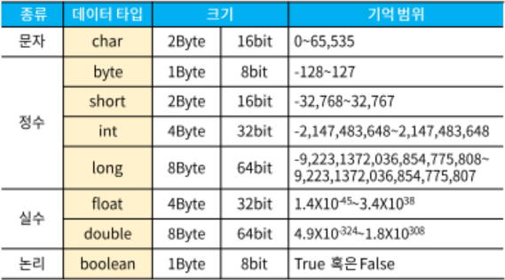
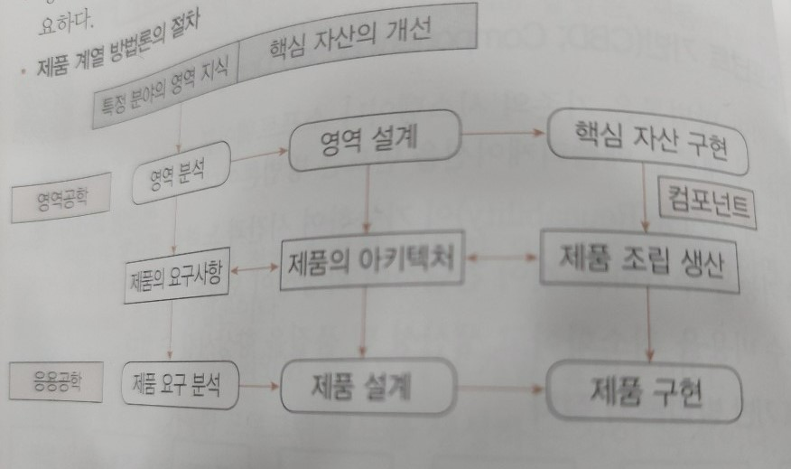

# 시나공 필기 2권

# 프로그래밍 언어 활용

- 서버 프로그램 구현 (0.69%)
    - 개발 환경 구축 C
        - 개발 환경 구축의 개요
            - 개발 환경 구축은 응용 소프트웨어 개발을 위해 개발 프로젝트를 이해하고 소프트웨어 및 하드웨어 장비를 구축하는 것을 의미한다.
                - 개발 환경은 응용 소프트웨어가 운영될 환경과 유사한 구조로 구축한다.
                - 개발 프로젝트의 분석 단계의 산출물을 바탕으로 개발에 필요한 하드웨어와 소프트웨어를 선정한다.
                - 하드웨어와 소프트웨어의 성능, 편의성, 라이선스 등의 비즈니스 환경에 적합한 제품들을 최종적으로 결정하여 구축한다.
        - 하드웨어 환경
            - 하드웨어 환경은 사용자와의 인터페이스 역할을 하는 클라이언트(Client) 그리고 클라이언트와 통신하여 서비스를 제공하는 서버(Server)로 구성된다.
                - 클라이언트에는 PC, 스마트폰 등이 있다.
                - 서버는 사용 목적에 따라 웹 서버, 웹 애플리케이션 서버, 데이터베이스 서버, 파일 서버 등으로 나뉜다.
                    - 웹 서버(Web Server) : 클라이언트로부터 직접 요청을 받아 처리하는 서버로, 저용량의 정적 파일들을 제공한다.
                        - Apache HTTP Server, Mircrosoft Internet Information Service, Google Web Server 등
                    - 웹 애플리케이션 서버(WAS; Web Application Server) : 사용자에게 동적 서비스를 제공하기 위해 웹 서버로부터 요청을 받아 데이터 가공 작업을 수행하거나, 웹 서버와 데이터베이스 서버 또는 웹 서버와 파일 서버 사이에서 인터페이스 역할을 수행하는 서버
                        - Apache Tomcat, IBM WebSphere, Oracle WebLogic 등
                    - 데이터베이스 서버(DB Server) : 데이터베이스와 이를 관리하는 DBMS를 운영하는 서버
                        - MySQL Server, Oracle Server, Mircrosoft SQL Server 등
                    - 파일 서버(File Server) : 데이터베이스에 저장하기에는 비효율적이거나, 서비스 제공을 목적으로 유지하는 파일들을 저장하는 서버
                        - AWS S3등
                    - 웹 서버(Web Server)의 기능
                        
                        
                        | HTTP/HTTPS 지원 | 브라우저로부터 요청을 받아 응답할 때 사용되는 프로토콜 |
                        | --- | --- |
                        | 통신 기록
                        (Communication Log) | 처리한 요청들을 로그 파일로 기록하는 기능 |
                        | 정적 파일 관리
                        (Managing Static Files) | HTML, CSS, 이미지 등의 정적 파일들을 저장하고 관리하는 기능 |
                        | 대역폭 제한
                        (Bandwidth Throtting) | 네트워크 트래픽의 포화를 방지하기 위해 응답 속도를 제한하는 긴으 |
                        | 가상 호스팅
                        (Virtual Hosting) | 하나의 서버로 여러 개의 도메인 이름을 연결하는 기능 |
                        | 인증
                        (Authertication) | 사용자가 합법적인 사용자인지를 확인하는 기능 |
        - 소프트웨어 환경
            - 소프트웨어 환경은 클라이언트와 서버 운영을 위한 시스템 소프트웨어와 개발에 사용되는 개발 소프트웨어로 구성된다.
                - 시스템 소프트웨어에는 운영체제(OS), 웹 서버 및 WAS 운용을 위한 서버 프로그램, DBMS 등이 있다.
                - 개발 소프트웨어에는 요구사항 관리 도구, 설계/모델링 도구, 구현 도구, 빌드 도구, 테스트 도구, 형상 관리 도구 등이 있다.
                    - 요구사항 관리 도구 : 요구사항의 수집과 분석, 추적 등을 편리하게 도와주는 소프트웨어
                        - JIRA, IBM DOORS, inteGREAT, Reqtify, Trello 등
                    - 설계/모델링 도구 : UML(통합 모델링 언어)을 지원하며, 개발의 전 과정에서 설계 및 모델링을 도와주는 소프트웨어
                        - DB Designer, PlantUML, ArgoUML 등
                    - 구현 도구 : 개발 언어를 통해 애플리케이션의 실제 구현을 지원하는 소프트웨어
                        - Eclipse, IntelliJ IDEA, Visual Studio, Netbeans, Node.js 등
                    - 빌드 도구 : 구현 도구를 통해 작성된 소스의 빌드 및 배포, 라이브러리 관리를 지원하는 소프트웨어
                        - Ant, Gradle, Maven, Jenkins 등
                    - 테스트 도구 : 모듈들이 요구사항에 적합하게 구현되었는지 테스트하는 소프트웨어
                        - CppUnit, JUnit, HttpUnit, NUnit, Spring Test 등
                    - 형상 관리 도구 : 산출물들을 버전별로 관리하여 품질 향상을 지원하는 소프트웨어
                        - Git, CVS, Subversion, Mercurial 등
                    - 개발 언어의 선정 기준
                        
                        
                        | 적정성 | 개발하려는 소프트웨어의 목적에 적합해야 한다. |
                        | --- | --- |
                        | 효율성 | 코드의 작성 및 구현이 효율적이어야 한다. |
                        | 이식성 | 다양한 시스템 및 환경에 적용이 가능해야 한다. |
                        | 친밀성 | 개발 언어에 대한 개발자들의 이해도와 활용도가 높아야 한다. |
                        | 범용성 | 다른 개발 사례가 존재하고 여러 분야에서 활용되고 있어야 한다. |
    - 서버 개발 C
        - 서버 개발의 개요
            - 서버 개발은 웹 애플리케이션의 로직을 구현할 서버 프로그램을 제작하여 웹 애플리케이션 서버(WAS)에 탑재하는 것을 의미한다.
                - 웹 애플리케이션 서버에 구현된 서버 프로그램은 웹 서버로부터 받은 요청을 처리하여 결과를 반환하는 역할을 수행한다.
                - 서버 개발에 사용되는 프로그래밍 언어에는 Java, JavaScript, Python, PHP, Ruby 등이 있다.
                - 각 프로그래밍 언어에는 해당 언어로 서버 프로그램을 개발할 수 있도록 지원하는 프레임워크가 있다.
        - 서버 개발 프레임워크
            - 서버 개발 프레임워크는 서버 프로그램 개발 시 다양한 네트워크 설정, 요청 및 응답 처리, 아키텍처 모델 구현 등을 손쉽게 처리할 수 있도록 클래스나 인터페이스를 제공하는 소프트웨어를 의미한다.
                - 서버 개발 프레임워크의 대부분은 모듈-뷰-컨트롤러(MVC) 패턴을 기반으로 개발되었다.
                    
                    
                    | 프레임워크 | 특징 |
                    | --- | --- |
                    | Spring | JAVA를 기반으로 만들어진 프레임워크로, 전자정부 표준 프레임워크의 기반 기술로 사용되고 있다. |
                    | Node.js | JavaScript를 기반으로 만들어진 프레임워크로, 비동기 입,출력 처리와 이벤트 위주의 높은 처리 성능을 갖고 있어 실시간으로 입,출력이 빈번한 애플리케이션에 적합하다. |
                    | Django | Python을 기반으로 만들어진 프레임워크로, 컴포넌트의 재사용과 플러그인화를 강조하여 신속한 개발이 가능하도록 지원한다. |
                    | Condeigniter | PHP를 기반으로 만들어진 프레임워크로, 인터페이스가 간편하여 서버 자원을 적게 사용한다. |
                    | Ruby on Rails | Ruby를 기반으로 만들어진 프레임워크로, 테스트를 위한 웹 서버를 지원하며 데이터베이스 작업을 단순화, 자동화시켜 개발 코드의 길이가 짧아 신속한 개발이 가능하다. |
        - 서버 프로그램 구현
            - 서버 프로그램은 응용 소프트웨어와 동일하게 모듈 및 공통 모듈을 개발한 후, 모듈들을 통합하는 방식으로 구현된다.
                - 모듈은 모듈화를 통해 분리된 시스템의 각 기능들로, 서브 루틴, 서브시스템, 소프트웨어 내의 프로그램, 작업 단위 등과 같은 의미로 사용된다.
                - 모듈 개발 시 기능적 독립성을 고려하여 다른 모듈과의 과도한 상호작용을 배제함으로써 특정 모듈의 수정이 다른 모듈들에게 영향을 미치지 않아야 한다.
                - 모듈의 독립성은 결합도(Coupling)와 응집도(Cohesion)에 의해 측정되며, 독립성을 높이려면 모듈의 결합도를 약하게 하고 응집도를 강하게 하며 모듈의 크기를 작게 만들어야 한다.
                - 공통 모듈은 여러 프로그램에서 재사용(Reuse)할 수 있는 모듈을 의미하며, 자주 사용되는 계산식이나 매번 필요한 사용자 인증 같은 기능들이 공통 모듈로 구성될 수 있다.
    - 보안 및 API C
        - 소프트웨어 개발 보안의 개요
            - 소프트웨어 개발 보안은 소프트웨어 개발 과정에서 발생할 수 있는 보안 취약점을 최소화하여 보안 위협으로부터 안전한 소프트웨어를 개발하기 위한 일련의 보안 활동을 의미한다.
                - 소프트웨어 개발 보안은 데이터의 기밀성, 무결성, 가용성을 유지하는 것을 목표로 한다.
                - 정부에서 제공하는 소프트웨어 개발 보안 가이드를 참고하여 소프트웨어 개발 과정에서 점검해야 할 보안 항목들을 점검한다.
        - 소프트웨어 개발 보안 점검 항목
            
            
            | 세션 통제 | - 세션은 서버와 클라이언트의 연결을 말하며, 세션 통제는 세션의 연결과 연결로 인해 발생하는 정보를 관리하는 것을 의미한다. 
            
            - 보안 약점에는 불충분한 세션 관리, 잘못된 세션에 의한 정보 노출 등이 있다. |
            | --- | --- |
            | 입력 데이터 
            검증 및 표현 | - 입력 데이터에 대한 유효성 검증체계를 갖추고, 검증 실패 시 이를 처리할 수 있도록 코딩하는 것을 의미한다.
            
            - 보안 약점에는 SQL 삽입, 경로 조작 및 자원 삽입, 크로스사이트 스크립팅(XSS)등이 있다. |
            | 보안 기능 | - 인증, 접근제어, 기밀성, 암호화 등의 기능을 의미한다. 
            
            - 보안 약점에는 적절한 인증 없는 중요기능 허용, 부적절한 인가 등이 있다.  |
            | 시간 및 상태 | - 동시 수행을 지원하는 병렬 처리 시스템이나 다수의 프로세스가 동작하는 환경에서 시간과 실행 상태를 관리하여 시스템이 원활히 동작되도록 코딩하는 것 
            
            - 보안 약점에는 검사 시점과 사용 시점(TOCTOU) 경쟁 조건, 종료되지 않는 반복문 또는 재귀함수 등이 있다. |
            | 에러처리 | - 소프트웨어 실행 중 발생할 수 있는 오류들을 사전에 정의하여 에러로 인해 발생할 수 있는 문제들을 예방하는 것을 의미한다. 
            
            - 보안 약점에는 오류 메시지를 통한 정보 노출, 오류 상황 대응 부재 등이 있다. |
            | 코드 오류 | - 개발자들이 코딩 중 실수하기 쉬운 형(Type) 변환, 자원의 반환 등을 고려하며 코딩하는 것을 의미 
            
            - 보안 약점에는 널 포인터 역참조, 부적절한 자원 해제 등이 있다. |
            | 캡슐화 | - 데이터(속성)와 데이터를 처리하는 함수를 하나의 객체로 묶어 코딩하는 것
            
            - 보안 약점에는 잘못된 세션에 의한 데이터 정보 노출, 제거되지 않고 남은 디버그 코드 등이 있다. |
            | API 오용 | - API를 잘못 사용하거나 보안에 취약한 API를 사용하지 않도록 고려하여 코딩하는 것
            
            - 보안 약점에는 DNS lookup에 의존한 보안결정, 취약한 API 사용이 있다. |
        - API(Application Programing Interface)
            - API는 응용 프로그램 개발 시 운영체제나 프로그래밍 언어 등에 있는 라이브러리를 이용할 수 있도록 규칙 등을 정의해 놓은 인터페이스를 의미한다.
                - API는 프로그래밍 언어에서 특정한 작업을 수행하기 위해 사용되거나, 운영체제의 파일 제어, 화상 처리, 문자 제어 등의 기능을 활용하기 위해 사용된다.
                - API는 개발에 필요한 여러 도구를 제공하기 때문에 이를 이용하면 원하는 기능을 쉽고 효율적으로 구현할 수 있다.
                - API의 종류에는 Windows API, 단일 유닉스 규격(SUS), Java API, 웹 API 등이 있으며, 누구나 무료로 사용할 수 있게 공개된 API를 Open API라고 한다.
    - 배치 프로그램 B
        - 배치 프로그램(Batch Program)의 개요
            - 배치 프로그램은 사용자와의 상호 작용 없이 여러 작업들을 미리 정해진 일련의 순서에 따라 일괄적으로 처리하는 것을 의미한다.
                - 배치 프로그램이 자동으로 수행되는 주기에 따라 정기 배치, 이벤트성 배치, On-Demand 배치로 구분된다
                    
                    
                    | 정기 배치 | 일, 주, 월과 같이 정해진 기간에 정기적으로 수행된다. |
                    | --- | --- |
                    | 이벤트성 배치 | 특정 조건을 설정해두고 조건이 충족될 때만 수행된다. |
                    | On-Demand 배치 | 사용자 요청 시 수행된다. |
                - 배치 프로그램이 갖추어야 하는 필수 요소
                    
                    
                    | 대용량 데이터 | 대량의 데이터를 가져오거나, 전달하거나, 계산하는 등의 처리가 가능해야 한다. |
                    | --- | --- |
                    | 자동화 | 심각한 오류가 발생하는 상황을 제외하고는 사용자의 개입 없이 수행되어야 한다. |
                    | 견고성 | 잘못된 데이터나 데이터 중복 등의 상황으로 중단되는 일 없이 수행되어야 한다. |
                    | 안정성/신뢰성 | 오류가 발생하면 오류의 발생 위치, 시간 등을 추적할 수 있어야 한다. |
                    | 성능 | 다른 응용 프로그램의 수행을 방해하지 않아야 하고, 지정된 시간 내에 처리가 완료되어야 한다. |
        - 배치 스케줄러(Batch Scheduler)
            - 배치 스케줄러는 일괄 처리(Batch Processing) 작업이 설정된 주기에 맞춰 자동으로 수행되도록 지원해주는 도구이다.
                - 배치 스케줄러는 특정 업무(Job)를 원하는 시간에 처리할 수 있도록 지원한다는 특성 때문에 잡 스케줄러(Job Scheduler)라고도 불린다.
                - 주로 사용되는 배치 스케줄러에는 스프링 배치, Quartz 등이 있다.
            - 스프링 배치(Spring Batch)
                - Spring Source 사와 Accenture 사가 2007년 공동 개발한 오픈 소스 프레임워크이다.
                - 스프링 프레임워크의 특성을 그대로 가져와 스프링이 가지고 있는 다양한 기능들을 모두 사용할 수 있다.
                - 데이터베이스나 파일의 데이터를 교환하는데 필요한 컴포넌트들을 제공한다.
                - 로그 관리, 추적, 트랜잭션 관리, 작업 처리 통계, 작업 재시작 등의 다양한 기능을 제공한다.
                - 스프링 배치의 주요 구성 요소와 역할
                    
                    
                    | Job | 수행할 작업 정의 |
                    | --- | --- |
                    | Job Launcher | 실행을 위한 인터페이스 |
                    | Step | Job 처리를 위한 제어 정보 |
                    | Job Repository | Step의 제어 정보를 포함하여 작업 실행을 위한 모든 정보 저장 |
            - Quartz
                - 스프링 프레임워크로 개발되는 응용 프로그램들의 일괄 처리를 위한 다양한 기능을 제공하는 오픈 소스 라이브러리
                - 수행할 작업과 수행 시간을 관리하는 요소들을 분리하여 일괄 처리 작업에 유연성을 제공한다.
                - Quartz의 주요 구성 요소와 역할
                    
                    
                    | Scheduler | 실행 환경 관리 |
                    | --- | --- |
                    | Job | 수행할 작업 정의 |
                    | JobDetail | Job의 상세 정보 |
                    | Trigger | Job의 실행 스케줄 정의 |
    - 패키지 소프트웨어 D
        - 패키지 소프트웨어(Package Software)의 개요
            - 패키지 소프트웨어는 기업에서 일반적으로 사용하는 여러 기능들을 통합하여 제공하는 소프트웨어를 의미한다.
                - 기업에서는 패키지 소프트웨어를 구입하여 기업 환경에 적합하게 커스터마이징(Customizing)하여 사용한다.
                - 패키지 소프트웨어를 이용하여 시스템을 구축하는 방식을 패키지 개발 방식이라고 한다.
                - 기능 요구사항을 70%이상 충족시키는 패키지 소프트웨어가 있을 때만 사용하는 것이 적합하다.
        - 패키지 소프트웨어의 특징
            - 패키지 소프트웨어는 요구사항을 분석하여 업무 특성에 맞게 전용으로 개발되는 소프트웨어와 비교하여 안정성, 라이선스, 생산성 등에서 차이가 있다.
                - 패키지 소프트웨어는 전문 업체에 의해 품질이 검증되었고, 국제/산업계 표준을 준수하고 있어 안정적인 이용이 가능하다.
                - 소프트웨어에 대한 라이선스가 판매자에게 있기 때문에 시스템 구축 후 기능 추가 및 코드 재사용 등에 제약이 발생한다.
                - 개발 조직을 갖추어야할 필요성이 없어 비용을 절감할 수 있고, 이미 개발된 소프트웨어를 사용하기 때문에 프로젝트 기간이 단축된다.
                - 기존에 보유하고 있던 시스템과의 상호 연동 및 연계가 어려울 수 있다.
                - 결함이 발생한 경우 판매처의 프로세스에 따라 보안되므로 이용자의 사정에 따라 능동적인 대처를 기대하기는 어렵다.
                    
                    
                    |  | 패키지 소프트웨어 | 전용 개발 소프트웨어 |
                    | --- | --- | --- |
                    | 기능 요구사항 | 70%이상 충족시키는 패키지 소프트웨어가 있는 경우 이용 | 모든 기능 요구사항 반영 가능 |
                    | 안정성 | 품질이 검증되었고, 업계 표준 준용 | 개발자의 역량에 따라 달라짐 |
                    | 라이선스 | 판매자 | 회사 |
                    | 생산성 | 개발을 위한 인력과 시간이절약됨 | 개발을 위한 인력과 시간이 필요함 |
                    | 호환성 | 보장이 안됨 | 설계 단계부터 고려하여 개발 |
                    | 유지보수 | 결함 발생 시 즉시 대응이 어려움 | 결함 발생 시 즉시 대응이 가능 |
- 프로그래밍 언어 활용 (44.83%)
    - 데이터 타입 B
        - 데이터 타입
            - 데이터 타입(Data Type)은 변수(Variable)에 저장될 데이터의 형식을 나타내는 것으로, 변수에 값을 저장하기 전에 문자형, 정수형, 실수형 등 어떤 형식의 값을 저장할지 데이터 타입을 지정하여 변수를 선언해야 한다.
                
                
                | 유형 | 기능 | 예 |
                | --- | --- | --- |
                | 정수 타입(Integer Type) | - 정수, 즉 소수점이 없는 숫자를 저장할 때 사용한다. | 1, -1, -10, -100 |
                | 부동 소수점 타입
                (Floating Point Type) | - 소수점 이하가 있는 실수를 저장할 때 사용한다. | 0.123X10², -1.6X2³ |
                | 문자 타입
                (Character Type) | - 한 문자를 저장할 때 사용한다.
                
                - 작은따움표(’’)안에 표시한다 | ‘A’, ‘a’, ‘1’, ‘*’ |
                | 문자열 타입
                (Character String Type) | - 문자열을 저장할 때 사용한다.
                
                - 큰따움표(””)안에 표시한다.  | “Hello!”, “1+2=3” |
                | 불린 타입
                (Boolean Type) | - 조건의 참(True), 거짓(False) 여부를 판단하여 저장할 때 사용한다.
                
                - 기본값은 거짓(False)이다.  | true,false |
                | 배열 타입
                (Array Type) | - 같은 타입의 데이터 집합을 만들어 저장할 때 사용한다.
                
                - 데이터는 중괄호({}) 안에 콤마(,)로 구분하여 값들을 나열한다. | {1, 2, 3, 4, 5} |
        - C/C++의 데이터 타입 크기 및 기억 범위
            
            
            | 종류 | 데이터 타입 | 크기 | 기억 범위 |
            | --- | --- | --- | --- |
            | 문자 | char | 1Byte | -128 ~ 127 |
            | 부호없는 문자형 | unsigned char | 1Byte | 0 ~ 255 |
            | 정수 | short | 2Byte | -32,768 ~ 32,767 |
            | 정수 | int | 4Byte | -2,147,483,648 ~ 2,147,483,647 |
            | 정수 | long | 4Byte | -2,147,483,648 ~ 2,147,483,647 |
            | 정수 | long long | 8Byte | -9,223,372,036,854,775,808 ~ 9,223,372,036,854,775,807 |
            | 부호없는 정수형 | unsigned short | 2Byte | 0 ~ 65,535 |
            | 부호없는 정수형 | unsigned int | 4Byte | 0 ~ 4,294,967,295 |
            | 부호없는 정수형 | unsigned long | 4Byte | 0 ~ 4,294,967,295 |
            | 실수 | float | 4Byte | 1.2 X 10의 -38승 ~ 3.4 X 10의 38승 |
            | 실수 | double | 8Byte | 2.2 X 10의 -308승 ~ 1.8 X 10의 308승 |
            | 실수 | long double | 8Byte | 2.2 X 10의 -308승 ~ 1.8 X 10의 308승 |
            - C언어의 구조체
                - 배열이 자료의 형과 크기가 동일한 변수의 모임이라면 구조체는 자료의 종류가 다른 변수의 모임이다.
                - 구조체를 정의한다는 것은 int나 char 같은 자료형을 하나 만드는 것을 의미한다.
                - 구조체는 ‘structure(구조)’의 약어인 ‘struct’를 사용하여 정의한다.
                    
                    ```cpp
                    struct sawon {
                      char name[10];
                      char position[10];
                      int pay;
                    }
                    ```
                    
        - JAVA의 데이터 타입 크기 및 기억 범위
            
            
            
        - Python의 데이터 타입 크기 및 기억 범위
            
            
            
            - Python의 시퀸스 자료형
                - 시퀸스 자료형(Sequence Type)이란 리스트(List), 튜플(Tuple), range, 문자열처럼 값이 연속적으로 이어진 자료형을 말한다.
                    - 리스트(List) : 다양한 자료형의 값을 연속적으로 저장하며, 필요에 따라 개수를 늘리거나 줄일 수 있다.
                    - 튜플(Tuple) : 리스트처럼 요소를 연속적으로 저장하지만, 요소의 추가, 삭제, 변경은 불가능하다.
                    - range : 연속된 숫자를 생성하는 것으로, 리스트, 반복문 등에서 많이 사용된다.
    - 변수 A
        - 변수의 개요
            - 변수(Variable)는 컴퓨터가 명령을 처리하는 도중 발생하는 값을 저장하기 위한 공간으로, 변할 수 있는 값을 의미한다.
                - 변수는 저장하는 값에 따라 정수형, 실수형, 문자형, 포인터형 등으로 구분한다.
        - 변수명 작성 규칙
            - 영문자, 숫자,  _(under bar)를 사용할 수 있다.
            - 첫 글자는 영문자나 _(under bar)로 시작해야 하며, 숫자는 올 수 없다.
            - 글자 수에 제한이 없다.
            - 공백이나 *, +, -, / 등의 특수문자를 사용할 수 없다.
            - 대, 소문자를 구분한다.
            - 예약어를 변수명으로 사용할 수 없다.
            - 변수 선언 시 문장 끝에 반드시 세미콜론(;)을 붙여야 한다.
            - 변수 선언 시 변수명에 데이터 타입을 명시하는 것을 헝가리안 표기법(Hungarian Notation)이라고 한다.
            - 예약어
                - 예약어는 정해진 기능을 수행하도록 이미 용도가 정해져 있는 단어로, 변수 이름이나 다른 목적으로 사용할 수 없다.
                    
                    
                    
        - 기억 클래스
            - 변수 선언 시 메모리 내에 변수의 값을 저장하기 위한 기억영역이 할당되는데, 할당되는 기억영역에 따라 사용 범위에 제한이 있다. 이러한 기억영역을 결정하는 작업을 기억 클래스(Storage Class)라 한다.
                - C 언어에서 제공하는 기억 클래스
                    
                    
                    | 종류 | 기억영역 | 예약어 | 생존기간 | 사용범위 |
                    | --- | --- | --- | --- | --- |
                    | 자동 변수 | 메모리(스택) | auto | 일시적 | 지역적 |
                    | 레지스터 변수 | 레지스터 | register | 일시적 | 지역적 |
                    | 정적 변수(내부) | 메모리(데이터) | static | 영구적 | 지역적 |
                    | 정적 변수(외부) | 메모리(데이터) | static | 영구적 | 전역적 |
                    | 외부 변수 | 메모리(데이터) | extern | 영구적 | 전역적 |
                - 자동 변수(Automatic Variable)
                    - 자동 변수는 함수나 코드의 범위를 한정하는 블록 내에서 선언되는 변수이다.
                    - 함수나 블록이 실행되는 동안에만 존재하며 이를 벗어나면 자동으로 소멸된다.
                    - 초기화하지 않으면 쓰레기값(Garbage Value)이 저장된다.
                - 외부 변수(External Variable)
                    - 외부 변수는 현재 파일이나 다른 파일에서 선언된 변수나 함수를 참조(reference)하기 위한 변수이다.
                        - 외부 변수는 함수 밖에서 선언한다.
                        - 함수가 종료된 뒤에도 값이 소멸되지 않는다.
                        - 초기화하지 않으면 자동으로 0으로 초기화된다.
                        - 다른 파일에서 선언된 변수를 참조할 경우 초기화 할 수 없다.
                - 정적 변수(Static Variable)
                    - 정적 변수는 함수나 블록 내에서 선언하는 내부 정적 변수와 함수 외부에서 선언하는 외부 정적 변수가 있다.
                        - 내부 정적 변수는 선언한 함수나 블록 내에서만 사용할 수 있고, 외부 정적 변수는 모든 함수에서 사용할 수 있다.
                        - 두 변수 모두 함수나 블록이 종료된 뒤에도 값이 소멸되지 않는다.
                        - 초기화는 변수 선언 시 한 번만 할 수 있으며, 초기화를 생략하면 자동으로 0으로 초기화 된다.
                - 레지스터 변수(Register Variable)
                    - 레지스터 변수는 메모리가 아닌 CPU 내부의 레지스터에 기억영역을 할당받는 변수이다.
                        - 자주 사용되는 변수를 레지스터에 저장하여 처리 속도를 높이기 위해 사용한다.
                        - 함수나 블록이 실행되는 동안에만 존재하며 이를 벗어나면 자동으로 소멸된다.
                        - 레지스터의 사용 개수는 한정되어 있어 데이터를 저장할 레지스터가 없는 경우 자동 변수로 취급되어 메모리에 할당된다.
                        - CPU에 저장되어 메모리 주소를 가질 수 없기 때문에 변수의 주소를 구하는 주소 연산자(&)를 사용할 수 없다.
        - 변수의 선언
            - 변수는 일반적으로 다음과 같은 형식으로 선언한다.
                - 자료형 변수명 = 값;
                    - 자료형 : 변수에 저장될 자료의 형식 지정
                    - 변수명 : 사용자가 원하는 이름을 임의로 지정한다. 단 변수명 작성 규칙에 맞게 지정한다.
                    - 값 : 변수를 선언하면서 초기화할 값을 지정한다. 단 값은 지정하지 않아도 된다.
    - 연산자 A
        - 산술 연산자
            - 산술 연산자는 가, 감, 승, 제 등의 산술 계산에 사용되는 연산자를 말한다.
                - 산술 연산자에는 일반 산술식과 달리 한 변수의 값을 증가시키거나 감소시키는 증감 연산자가 있다.
                    
                    
                    | 연산자 | 의미 | 비고 |
                    | --- | --- | --- |
                    | + | 덧셈 |  |
                    | - | 뺄샘 |  |
                    | * | 곱셈 |  |
                    | / | 나눗셈 |  |
                    | & | 나머지 |  |
                    | ++ | 증가 연산자 | 전치 : 변수 앞에 증감 연산자가 오는 형태로 먼저 변수의 값을 증감시킨 후 변수를 연산에 사용한다(++a, —a) |
                    |  — | 감소 연산자 | 후치 : 변수 뒤에 증감 연산자가 오는 형태로 먼저 변수를 연산에 사용한 후 변수의 값을 증감시킨다 (a++, a—) |
        - 관계 연산자
            - 관계 연산자는 두 수의 관계를 비교하여 참(true) 또는 거짓(false)를 결과로 얻는 연산자이다.
                - 거짓은 0, 참은 1로 사용되지만 0외의 모든 숫자도 참으로 간주된다.
                    
                    
                    | 연산자 | 의미 |
                    | --- | --- |
                    | == | 같다 |
                    | ≠ | 같지 않다 |
                    | > | 크다 |
                    | ≥ | 크거나 같다 |
                    | < | 작다 |
                    | ≤ | 작거나 같아 |
        - 비트 연산자
            - 비트 연산자는 비트별(0, 1)로 연산하여 결과를 얻는 연산자이다.
                
                
                | 연산자 | 의미 | 비고 |
                | --- | --- | --- |
                | & | and | 모든 비트가 1일 때만 1 |
                | ^ | xor | 모든 비트가 같으면 0, 하나라도 다르면 1 |
                | | | or | 모든 비트 중 한 비트라도 1이면 1 |
                | ~ | not | 각 비트의 부정, 0이면 1, 1이면 0 |
                | << | 왼쪽 시프트 | 비트를 왼쪽으로 이동 |
                | >> | 오른쪽 시프트 | 비트를 오른쪽으로 이동 |
        - 논리 연산자
            - 논리 연산자는 두 개의 논리 값을 연산하여 참(true) 또는 거짓(false)을 결과로 얻는 연산자이다. 관계 연산자와 마찬가지로 거짓은 0, 참은 1이다.
                
                
                | 연산자 | 의미 | 비고 |
                | --- | --- | --- |
                | ! | not | 부정 |
                | && | and | 모두 참이면 참 |
                | || | or | 하나라도 참이면 참 |
        - 대입 연산자
            - 연산 후 결과를 대입하는 연산식을 간략하게 입력할 수 있도록 대입 연산자를 제공한다. 대입 연산자는 산술, 관계, 비트, 논리 연산자에 모두 적용할 수 있다.
                
                
                | 연산자 | 예 | 의미 |
                | --- | --- | --- |
                | += | a += 1 | a = a + 1 |
                | -= | a -= 1 | a = a - 1 |
                | *= | a *= 1 | a = a * 1 |
                | /= | a /= 1 | a = a / 1 |
                | &= | a &= 1 | a = a & 1 |
                | <<= | a <<= 1 | a = a << 1 |
                | >>= | a >>= 1 | a = a >> 1 |
        - 조건 연산자
            - 조건 연산자는 조건에 따라 서로 다른 수식을 수행한다.
                - 조건 ? 수식1 : 수식2;
                    - ‘조건’의 수식이 참이면 ‘수식1’을, 거짓이면 ‘수식2’를 실행한다.
        - 기타 연산자
            
            
            | 연산자 | 의미 |
            | --- | --- |
            | sizeof | 자료형의 크기를 표시한다.  |
            | ,(콤마) | - 콤마로 구분하여 한 줄에 두 개 이상의 수식을 작성하거나 변수를 정의한다. 
            
            - 왼쪽에서 오른쪽으로 순서대로 수행되며, 순서 연산자라 부르기도 한다. |
            | (자료형) | - 사용자가 자료형을 다른 자료형으로 변환할 때 사용하는 것으로, cast(캐스트) 연산자라고 부른다. 
            
            - 변환할 자료형을 괄호 안에 넣어서 변환할 값이나 변수명 앞에 놓는다. |
        - 연산자 우선순위
            
            
            
    - 데이터 입,출력 B
        - C언어의 표준 입,출력 함수의 개요
            - 표준 입출력 함수(Input-Output Function)란 키보드로 입력받아 화면으로 출력할 때 사용하는 함수로, 대표적으로 scanf( ), getchar( ), gets( ), printf( ), putchar( ), puts( ) 등이 있다.
        - scanf() 함수
            - scanf( ) 함수는 C언어의 표준 입력 함수로, 키보드로 입력받아 변수에 저장하는 함수이다.
                - 형식
                    - scanf(서식 문자열, 변수의 주소)
                        - 서식 문자열 : 입력받을 데이터의 자료형 지정
                        - 변수의 주소 : 데이터를 입력받을 변수를 적는다. 변수의 주소로 입력 받아야 하기 때문에 변수에 주소연산자 &를 붙인다.
                - 특징
                    - 입력받을 데이터의 자료형, 자릿수 등을 지정할 수 있다.
                    - 한 번에 여러 개의 데이터를 입력 받을 수 있다.
                    - 서식 문자열과 변수의 자료형은 일치해야 한다.
                - 서식 문자열
                    - 서식 문자열은 printf( ) 함수로 출력할 때도 동일하게 적용된다.
                        
                        
                        | 서식 문자열 | 의미 |
                        | --- | --- |
                        | &d | 정수형 10진수를 입,출력하기 위해 지정한다. |
                        | &u | 부호없는 정수형 10진수를 입,출력하기 위해 지정한다. |
                        | %o | 정수형 8진수를 입,출력하기 위해 지정한다. |
                        | %x | 정수형 16진수를 입,출력하기 위해 지정한다. |
                        | %c | 문자를 입,출력하기 위해 지정한다. |
                        | %s | 문자열을 입,출력하기 위해 지정한다. |
                        | %f | 소수점을 포함하는 실수를 입,출력하기 위해 지정한다. |
                        | %e | 지수형 실수를 입,출력하기 위해 지정한다. |
                        | %ld | long형 10진수를 입,출력하기 위해 지정한다. |
                        | %lo | long형 8진수를 입,출력하기 위해 지정한다. |
                        | %lx | long형 16진수를 입,출력하기 위해 지정한다. |
                        | %p | 주소를 16진수로 입,출력하기 위해 지정한다. |
        - printf() 함수
            - printf( ) 함수는 C언어의 표준 출력 함수로, 인수로 주어진 값을 화면에 출력하는 함수이다.
                - 형식
                    - printf(서식 문자열, 변수)
                        - 서식 문자열 : 변수의 자료형에 맞는 서식 문자열을 입력한다.
                        - 변수 : 서식 문자열의 순서에 맞게 출력할 변수를 적는다. scanf( )와 달리 주소 연산자 &를 붙이지 않는다.
                - 주요 제어문자
                    - 제어문자란 입력 혹은 출력 내용을 제어하는 문자이다.
                    
                    | 문자 | 의미 | 기능 |
                    | --- | --- | --- |
                    | \n | new line | 커서를 다음 줄 앞으로 이동한다. |
                    | \b | backspace | 커서를 왼쪽으로 한 칸 이동한다. |
                    | \t | tab | 커서를 일정 간격 띄운다. |
                    | \r | carriage return | 커서를 현재 줄의 처음으로 이동한다. |
                    | \0 | null | 널 문자를 출력한다. |
                    | \’ | single quote | 작은 따움표를 출력한다. |
                    | \* | double quote | 큰 따움표를 출력한다. |
                    | \a | alert | 스피커로 벨 소리를 출력한다. |
                    | \\ | backslash | 역 슬래시를 출력한다. |
                    | \f | form feed | 한 페이지를 넘긴다. |
        - 기타 표준 입,출력 함수
            
            
            | 입력 | getchar ( ) | 키보드로 한 문자를 입력받아 변수에 저장하는 함수 |
            | --- | --- | --- |
            | 입력 | gets( ) | 키보드로 문자열을 입력받아 변수에 저장하는 함수로, Enter를 누르기 전까지를 하나의 문자열로 인식하여 저장 |
            | 출력 | putchar( ) | 인수로 주어진 한 문자를 화면에 출력하는 함수 |
            | 출력 | puts | 인수로 주어진 문자열을 화면에 출력한 후 커서를 자동으로 다음 줄 앞으로 이동하는 함수  |
    - 제어문 B
        - 제어문의 개념
            - 컴퓨터 프로그램은 명령어가 서술된 순서에 따라 무조건 위에서 아래로 실행되는데, 조건을 지정해서 진행 순서를 변경할 수 있다. 이렇게 프로그램의 순서를 변경할 때 사용하는 명령문을 제어문이라고 한다.
                - 제어문의 종류에는 if문, 다중 if문, switch문, goto, 반복문 등이 있다.
        - 단순 if문
            - if문은 조건에 따라서 실행할 문장을 달리하는 제어문이며, 단순 if문은 조건이 한 개일 때 사용하는 제어문이다.
                - 조건이 참일 때만 실행할 문장을 지정할 수도 있고, 참과 거짓에 대해 각각 다른 실행문을 지정할 수도 있다.
        - 다중 if문
            - 다중 if문은 조건이 여러 개 일 때 사용하는 제어문이다.
        - switch문
            - switch문은 조건에 따라 분기할 곳이 여러 곳인 경우 간단하게 처리할 수 있는 제어문이다.
                - case문의 레이블에는 한 개의 상수만 지정할 수 있으며, int, char, enum 형의 상수만 가능하다.
                - case문의 레이블에는 변수를 지정할 수 없다.
                - break문은 생략이 가능하지만 break문이 생략되면 수식과 레이블이 일치할 때 실행할 문장부터 break문 또는 switch문이 종료될 때까지 모든 문장이 실행된다.
        - goto문
            - goto문은 프로그램 실행 중 현재 위치에서 원하는 다른 문장으로 건너뛰어 수행을 계속하기 위해 사용하는 제어문이다.
                - goto문은 원하는 문장으로 쉽게 이동할 수 있지만 많이 사용하면 프로그램의 이해와 유지 보수가 어려워져 거의 사용하지 않는다.
    - 반복문 B
        - 반복문의 개요
            - 반복문은 제어문의 한 종류로 일정한 횟수를 반복하는 명령문을 말한다. 보통 변수의 값을 일정하게 증가시키면서 정해진 수가 될 때까지 명령이나 명령 그룹을 반복 수행한다.
                - 반복문에는 for, while, do~while문이 있다.
        - for문
            - for문은 초기값, 최종값, 증가값을 지정하는 수식을 이용해 정해진 횟수를 반복하는 제어문이다.
                - for문은 초기값을 정한 다음 최종값에 대한 조건이 참이면 실행할 문장을 실행한 후 초기값을 증가값 만큼 증가시키면서 최종값에 대한 조건이 참인 동안 실행할 문장을 반복 수행한다.
                - 초기값, 최종값, 증가값 중 하나 이상을 생략할 수 있고, 각각의 요소에 여러 개의 수식을 지정할 수도 있다.
                - for( ; ; )와 같이 조건에 참여하는 수식을 모두 생략하면 for문은 무한 반복된다.
                - for문은 처음부터 최종값에 대한 조건식을 만족하지 못하면 한 번도 수행하지 않는다.
                - 문자도 for문을 수행할 수 있다.
        - while문
            - while문은 조건이 참인 동안 실행할 문장을 반복 수행하는 제어문이다.
            - while문은 조건이 참인동안 실행할 문장을 반복 수행하다가 조건이 거짓이면 while문을 끝낸 후 다음 코드를 실행한다.
            - while문은 조건이 처음부터 거짓이면 한 번도 수행하지 않는다.
        - do ~ while문
            - do ~ while문은 조건이 참인 동안 정해진 문장을 반복 수행하다가 조건이 거짓이면 반복문을 벗어나는 while문과 같은 동작을 하는데, 다른 점은 do ~ while문은 실행할 문장을 무조건 한 번 실행한 다음 조건을 판단하여 탈출 여부를 결정한다는 것이다.
            - do ~ while문은 실행할 문장을 우선 실행한 후 조건을 판별하여 조건이 참이면 실행할 문장을 계속 반복 수행하고, 거짓이면 do ~ while문을 끝낸 후 다음 코드를 실행한다.
        - break, continue
            - switch문이나 반복문의 실행을 제어하기 위해 사용되는 예약어이다.
                - break : switch문이나 반복문 안에서 break가 나오면 블록을 벗어난다.
                - continue
                    - continue 이후의 문장을 실행하지 않고 제어를 반복문의 처음으로 옮긴다.
                    - 반복문에서만 사용된다.
    - 배열과 문자열 A
        - 배열의 개념
            - 배열은 동일한 데이터 유형을 여러 개 사용해야 할 경우 이를 손쉽게 처리하기 위해 여러 개의 변수들을 조합해서 하나의 이름으로 정의해 사용하는 것을 말한다.
                - 배열은 하나의 이름으로 여러 기억장소를 가리키기 때문에 배열에서 개별적인 요소들의 위치는 첨자를 이용하여 지정한다.
                - 배열은 변수명 뒤에 대괄호 [ ]를 붙이고 그 안에 사용할 개수를 지정한다.
                - C 언어에서 배열의 위치는 0부터 시작된다.
                - 배열은 행 우선으로 데이터가 기억장소에 할당된다.
                - C  언어에서 배열 위치를 나타내는 첨자 없이 배열 이름을 사용하면 배열의 첫 번째 요소의 주소를 지정하는 것과 같다.
        - 1차원 배열
            - 1차원 배열은 변수들을 일직선상의 개념으로 조합한 배열이다.
            - 형식 : 자료형 변수명[개수];
                - 자료형 : 배열에 저장할 자료의 형을 지정한다.
                - 변수명 : 사용할 배열의 이름으로 사용자가 임의로 지정한다.
                - 개수 : 배열의 크기를 지정하는 것으로 생략할 수 있다.
            - JAVA에서의 배열 처리
                - JAVA에서는 향상된 for문을 사용할 수 있는데, 향상된 for문은 객체를 대상으로만 가능하다. JAVA에서는 배열을 객체로 취급하며, 배열을 이용하여 작업할 때 필요할 만한 내용은 이미 API로 만들어 두었기 때문에 잘 골라서 사용하면 된다.
        - 2차원 배열
            - 2차원 배열은 변수들을 평면, 즉 행과 열로 조합한 배열이다.
            - 형식 : 자료형 변수명[행개수][열개수]
                - 자료형 : 배열에 저장할 자료의 형을 지정한다.
                - 변수명 : 사용할 배열의 이름으로 사용자가 임의로 지정한다.
                - 행개수 : 배열의 핼 크기를 지정한다.
                - 열개수 : 배열의 열 크기를 지정한다.
        - 배열의 초기화
            - 배열 선언 시 초기값을 지정할 수 있다.
            - 배열을 선언할 때 배열의 크기를 생략하는 경우에는 반드시 초기값을 지정해야 초기값을 지정한 개수 만큼의 배열이 선언된다.
            - 배열의 개수보다 적은 수로 배열을 초기화하면 입력된 값만큼 지정한 숫자가 입력 되고, 나머지 요소에는 0이 입력된다.
        - 배열 형태의 문자열 변수
            - C언어에서는 큰따움표(””)로 묶인 글자는 글자 수에 관계없이 문자열로 처리된다.
            - C언어에는 문자열을 저장하는 자료형이 없기 때문에 배열, 또는 포인터를 이용하여 처리한다.
            - 형식 : char 배열이름[크기] = “문자열”
            - 배열에 문자열을 저장하면 문자열의 끝을 알리기 위한 널 문자(’\0’)가 문자열 끝에 자동으로 삽입된다.
            - 배열에 문자열을 저장할 때는 배열 선언 시 초기값으로 지정해야 하며, 이미 선언된 배열에는 문자열을 저장할 수 없다.
            - 문자열 끝에 자동으로 널 문자(’\0’)가 삽입되므로, 널 문자까지 고려하여 배열 크기를 지정해야 한다.
            - JAVA의 문자열
                - C언어에서는 문자열을 배열에 넣고 배열의 이름을 이용하든지 포인터 변수를 이용해 처리했지만 JAVA에서는 주소를 컨트롤하는 기능이 없기 때문에 불가능하다. 하지만 JAVA에서는 문자열을 처리할 수 있도록 클래스를 제공한다.
    - 포인터 B
        - 포인터와 포인터 변수
            - 포인터는 변수의 주소를 말하며, C언어에서는 주소를 제어할 수 있는 기능을 제공한다.
                - C언어에서 변수의 주소를 저장할 때 사용하는 변수를 포인터 변수라 한다.
                - 포인터 변수를 선언할 때는 자료의 형을 먼저 쓰고 변수명 앞에 간접 연산자 *를 붙인다.
                - 포인터 변수에 주소를 저장하기 위해 변수의 주소를 알아낼 때는 변수 앞에 번지 연산자 &를 붙인다.
                - 실행문에서 포인터 변수에 간접 연산자 *를 붙이면 해당 포인터 변수가 가리키는 곳의 값을 말한다.
                - 포인터 변수는 필요에 의해 동적으로 할당되는 메모리 영역인 힙 영역에 접근하는 동적 변수이다.
                - 포인터 변수의 용도
                    - 연결된 자료 구조를 구성하기 위해 사용한다.
                    - 동적으로 할당된 자료 구조를 지정하기 위해 사용한다.
                    - 배열을 인수로 전달하기 위해 사용한다.
                    - 문자열을 표현하기 위해 사용한다.
                    - 커다란 배열에서 요소를 효율적으로 저장하기 위해 사용한다.
                    - 메모리에 직접 접근하기 위해 사용한다.
        - 포인터와 배열
            - 배열을 포인터 변수에 저장한 후 포인터를 이용해 배열의 요소에 접근할 수 있다.
                - 배열 위치를 나타내는 첨자를 생략하고 배열의 대표명만 지정하면 배열의 첫 번째 요소의 주소를 지정하는 것과 같다.
                - 배열 요소에 대한 주소를 지정할 때는 일반 변수와 동일하게 & 연산자를 사용한다.
                - 배열의 요소가 포인터인 포인터형 배열을 선언할 수 있다.
    - Python의 기초 B
        - Python의 기본 문법
            - 변수의 자료형에 대한 선언이 없다.
            - 문장의 끝을 의미하는 세미콜론(;)을 사용할 필요가 없다.
            - 변수에 연속하여 값을 저장하는 것이 가능하다.
            - if나 for와 같이 코드 블록을 포함하는 명령문을 작성할 때 코드 블록은 콜론(:)과 여백으로 구분한다.
            - 여백은 일반적으로 4칸 또는 한 개의 탭만큼 띄워야하며, 같은 수준의 코드들은 반드시 동일한 여백을 가져야 한다.
        - Python의 데이터 입,출력 함수
            - input( ) 함수
                - input( )함수는 Python의 표준 입력 함수로, 키보드로 입력받아 변수에 저장하는 함수이다.
                - 입력되는 값은 문자열로 취급되어 저장된다.
            - print( ) 함수
                - print( )함수는 Python의 표준 출력 함수이다.
            - 입력 값의 형변환(Casting)
                - input( )함수는 입력되는 값을 무조건 문자열로 저장하므로, 숫자로 사용하기 위해서는 형변환이 필요하다.
        - 리스트(List)
            - C와 Java에서는 여러 요소들을 하나의 이름으로 처리할 때 배열을 사용하지만 Python에서는 리스트를 사용한다.
            - 리스트는 필요에 따라 개수를 늘이거나 줄일 수 있기에 리스트를 선언할 때 크기를 적지 않는다.
            - 배열과 달리 하나의 리스트에 정수, 실수, 문자열 등 다양한 자료형을 섞어서 저장할 수 있다.
            - Python에서 리스트의 위치는 0부터 시작한다.
        - 딕셔너리(Dictionary)
            - 딕셔너리는 연관된 값을 묶어서 저장하는 용도로 사용한다.
            - 리스트는 저장된 요소에 접근하기 위한 키로 위치에 해당하는 0, 1, 2 등의 숫자를 사용하지만 딕셔너리는 사용자가 원하는 값을 키로 지정해 사용한다.
            - 딕셔너리에 접근할 때는 딕셔너리 뒤에 대괄호([ ])를 사용하며, 대괄호([ ])안에 키를 지정한다.
        - Range
            - Range는 연속된 숫자를 생성하는 것으로, 리스트, 반복문 등에서 많이 사용된다.
        - 슬라이스(Slice)
            - 슬라이스는 문자열이나 리스트와 같은 순차형 객체에서 일부를 잘라(Slicing) 반환하는 기능이다.
    - Python의 활용 A
        - if문
            - 형식 1 : 조건이 참일 때만 실행한다.
                
                ```python
                a = 15
                if a > 10:         // #1
                    a = a - 10     // #2
                print(a)           // #3
                ```
                
                - 1 : a가 10보다 크면 2번 문장을 실행하고 아니면 3번 문장으로 이동해서 실행을 계속 한다.
                - 2 : 1번의 조건식이 참일 경우 실행할 문장. a는 5가 된다.
                - 3 : 여기서는 1번의 조건식이 거짓일 경우 실행할 문장이 없다. if문을 벗어나면 무조건 3번으로 온다.
            - 형식 2 : 조건이 참일 때와 거짓일 때 실행할 문장이 다르다.
                
                ```python
                a, b = 10, 20
                if a > b:               # 1
                	
                  cha = a - b           # 2
                	print(cha)            # 3
                
                else :                  # 4
                	cha = b - a           # 5
                  print(cha)            # 6
                ```
                
                - 1 : a가 b보다 크면 2, 3번 문장을 실행하고, 아니면 4번의 다음 문장인 5, 6번 문장을 실행한다.
                - 2 : 1번의 조건식이 참일 경우 실행할 문장. 참이 아닐 경우 초기화시키지 않은 cha에는 알 수 없는 값이 그대로 있게 된다.
                - 4 : 1번의 조건식이 거짓일 경우 실행할 문장의 시작점
                - 5 : 1번의 조건식이 거짓일 경우 실행할 실제 처리문.
                - 6 : 10
            - 형식 3 : 조건이 여러 개이고, 조건마다 실행할 문장이 다르다.
                
                ```python
                jum = 85
                if jum >= 90               # 1
                
                	print('학점은 A입니다.') # 2
                elif jum >= 80             # 3
                
                  print('학점은 B입니다.') # 4
                elif jum >= 70             # 5
                
                  print('학점은 C입니다.') # 6
                else:                      # 7
                 
                  print('학점은 F입니다.') # 8
                
                ```
                
                - 1 : jum이 90 이상이면 2번을, 아니면 3번으로 이동한다.
                - 2 : 학점은 A입니다. 를 출력하고 if문을 종료한다.
                - 7 : 5번의 조건식이 거짓일 경우 실행할 문장의 시작점. 8번을 실행한다.
            - 형식 4 : if문 안에 if문이 포함
                
                ```python
                a, b = 21, 10
                if a % 2 == 0:
                	if b % 2 == 0:
                		print('모두 짝수')
                  else:
                		print('a : 짝수, b : 홀수')
                else:
                  if b % 2 == 0:
                		print('a : 홀수, b : 짝수')
                	else:
                		print('모두 홀수')
                ```
                
        - for문
            - 형식 1 : range를 이용하는 방식
                
                ```python
                for i in range(-10, 20, 2):
                	sum += i
                ```
                
                - i에 -10에서 19까지 2씩 증가하는 숫자를 순서대로 저장하며 실행할 문장을 반복 수행한다.
                - i의 값을 sum에 누적한다. sum에는 -10, -8, -6 —- 16, 18의 합 60이 저장된다.
            - 형식 2 : 리스트(List)를 이용하는 방식
                
                ```python
                a = [ 35, 55, 65, 84, 45 ]  # 1
                hap = 0                     # 2
                for i in a:                 # 3
                	hap += i                  # 4
                avg = hap / len(a)          # 5  
                print(hap, avg)             # 6
                ```
                
                - 리스트 a를 선언하면서 초기값 지정
                - 총점을 저장할 변수 hap을 0으로 초기화
                - 리스트 a의 요소 수만큼 4번을 반복 수행
                - i의 값을 hap에 누적.
                - 결과 : 284, 56.8
        - while문
            
            ```python
            i, hap = 0, 0   # 1
            while i <= 5:    # 2
            	i += 1        # 3
            	hap += i      # 4
            print(hap)      # 5
            ```
            
            - while은 예약어로, 그대로 입력한다.
            - 2 : while문의 조건. i가 5보다 작은 경우 반복 시행
            - 5 : 결과, 15
        - 클래스
            
            ```python
            class 클래스명:
              실행할 문장
            	def 메소드명(self, 인수):
            
            	  실행할 문장
            		return 값
            ```
            
            - class는 예약어로, 그대로 입력하고 클래스명은 사용자가 임의로 지정한다.
            - def는 메소드를 정의하는 예약어로, 그대로 입력하고 메소드명은 사용자가 임의로 지정한다.
            - self는 메소드에서 자기 클래스에 속한 변수에 접근할 때 사용하는 명칭으로, 일반적으로 self를 사용하지만 사용자가 임의로 지정해도 된다.
            - ‘인수’는 메소드를 호출하는 곳에서 보낸 값을 저장할 변수로, 사용자가 임의로 지정한다.
            - return은 메소드를 호출한 위치로 값을 돌려주기 위해 사용하는 예약어로 그대로 입력한다. return 값이 없는 경우 생략 가능하다.
            - ‘값’에는 변수, 객체, 게산식 등이 올 수 있다.
            - 객체의 선언 형식
                
                ```python
                변수명 = 클래스명()
                ```
                
                - 변수명은 사용자가 임의로 지정하고, 사전에 정의한 클래스명과 괄호()를 적는다.
                    
                    ```python
                    	class Cls:
                    		x, y = 10, 20
                    		def chg(self):    # 4
                    			temp = self.x   # 5
                    		  self.x = self.y # 6
                          self.y = temp   # 7
                    a = Cls()             # 1
                    print(a.x, a.y)       # 2
                    a.chg()               # 3
                    print(a.x, a.y)       # 8
                    ```
                    
                - 1 : Cls 클래스의 객체 a를 생성한다. 객체 a는 Cls의 속성 x, y와 메소드 chg()를 갖는다.
                    - a : 사용자 정의 변수
                    - Cls() : 클래스의 이름. 괄호( )를 붙여 그대로 적는다.
                - 2 : a 객체의 속성 x와 y를 출력한다.
                    - 객체와 속성은 .(마침표)로 연결한다.
                    - 출력 : 10, 20
                - 3 : a 객체의 메소드 chg를 호출한다. 4번으로 이동한다.
                    - 객체와 메소드는 .(마침표)로 연결한 후 괄호( )를 붙여 적는다.
                - 4 : a 객체의 메소드 chg의 시작점. 별도로 사용하는 인수가 없으므로 괄호( )에는 self만 적는다.
                - 5 : a 객체의 속성 x의 값을 temp에 저장한다.
                    - self : 메소드 안에서 사용되는 self는 자신이 속한 클래스를 의미한다.
                    - self.x : a.x와 동일하다.
                - 6 : a 객체의 속성 y의 값을 a 객체의 속성 x에 저장한다.
                - 7 : temp의 값을 a 객체의 속성 y에 저장한다. 메소드 chg가 종료되었으므로 메소드를 호출한 다음 문장인 8번으로 제어를 옮긴다.
                - 8 : a 객체의 속성 x와 y를 출력한다.
                    - 결과 : 20, 10
    - 절차적 프로그래밍 언어 C
        - 절차적 프로그래밍 언어의 개요
            - 절차적 프로그래밍 언어는 일련의 처리 절차를 정해진 문법에 따라 순서대로 기술해나가는 언어이다.
                - 절차적 프로그래밍 언어는 프로그램이 실행되는 절차를 중요시 한다.
                - 절차적 프로그래밍 언어는 데이터를 중심으로 프로시저를 구현하며, 프로그램 전체가 유기적으로 연결되어 있다.
                - 절차적 프로그래밍 언어는 자연어에 가까운 단어와 문장으로 구성된다.
                - 절차적 프로그래밍 언어는 과학 계산이나 하드웨어 제어에 주로 사용된다.
        - 절차적 프로그래밍 언어의 장,단점
            - 컴퓨터의 처리 구조와 유사하여 실행 속도가 빠르다.
            - 같은 코드를 복사하지 않고 다른 위치에서 호출하여 사용할 수 있다.
            - 모듈 구성이 용이하며, 구조적인 프로그래밍이 가능하다.
            - 프로그램을 분석하기 어렵다.
            - 유지 보수나 코드의 수정이 어렵다.
        - 절차적 프로그래밍 언어의 종류
            
            
            | 언어 | 특징 |
            | --- | --- |
            | C | - 1972년 미국 벨 연구소의 데니스 리치에 의해 개발되었다.
            
            - 시스템 소프트웨어를 개발하기 편리하여 시스템 프로그래밍 언어로 널리 사용된다. 
            
            - 자료의 주소를 조작할 수 있는 포인터를 제공한다. 
            
            - 고급 프로그래밍 언어이면서 저급 프로그램 언어의 특징을 모두 갖췄다.
            
            - UNIX의 일부가 C 언어로 구현되었다. 
            
            - 컴파일러 방식의 언어이다. 
            
            - 이식성이 좋아 컴퓨터 기종에 관계없이 프로그램을 작성할 수 있다. |
            | ALGOL | - 수치 계산이나 논리 연산을 위한 과학 기술 계산용 언어이다. 
            
            - PASCAL과 C 언어의 모체가 되었다. |
            | COBOL | - 사무 처리용 언어이다. 
            
            - 영어 문장 형식으로 구성되어 있어 이해와 사용이 쉽다. 
            
            - 4개의 DIVISION으로 구성되어 있다. |
            | FORTRAN | - 과학 기술 계산용 언어이다. 
            
            - 수학과 공학 분야의 공식이나 수식과 같은 형태로 프로그래밍 할 수 있다. |
    - 객체지향 프로그래밍 언어 C
        - 객체지향 프로그래밍 언어의 개요
            - 객체지향 프로그래밍 언어는 현실 세계의 개체(Entity)를 기계의 부품처럼 하나의 객체로 만들어, 기계적인 부품들을 조립하여 제품을 만들 듯이 소프트웨어를 개발할 때도 객체들을 조립해서 프로그램을 작성할 수 있도록 한 프로그래밍 기법이다.
                - 프로시저보다는 명령과 데이터로 구성된 객체를 중심으로 하는 프로그래밍 기법으로, 한 프로그램을 다른 프로그램에서 이용할 수 있도록 한다.
        - 객체지향 프로그래밍 언어의 장,단점
            - 상속을 통한 재사용과 시스템의 확장이 용이하다.
            - 코드의 재활용성이 높다.
            - 자연적인 모델링에 의해 분석과 설계를 쉽고 효율적으로 할 수 있다.
            - 사용자와 개발자 사이의 이해를 쉽게 해준다.
            - 대형 프로그램의 작성이 용이하다.
            - 소프트웨어 개발 및 유지보수가 용이하다.
            - 프로그래밍 구현을 지원해 주는 정형화된 분석 및 설계 방법이 없다.
            - 구현 시 처리 시간이 지연된다.
        - 객체지향 프로그래밍 언어의 종류
            
            
            | 언어 | 특징 |
            | --- | --- |
            | JAVA | - 분산 네트워크 환경에 적용이 가능하며, 멀티스레드 기능을 제공하므로 여러 작업을 동시에 처리할 수 있다. 
            
            - 운영체제 및 하드웨어에 독립적이며, 이식성이 강하다. 
            
            - 캡슐화가 가능하고 재사용성이 높다. |
            | C++ | - C 언어에 객체지향 개념을 적용한 언어이다. 
            
            - 모든 문제를 객체로 모델링하여 표현한다. |
            | Smalltalk | - 1세대 객체지향 프로그래밍 언어 중 하나로 순수한 객체지향 프로그래밍 언어이다.
            
            - 최초로 GUI를 제공한 언어이다. |
        - 객체지향 프로그래밍 언어의 구성 요소
            - 객체지향 프로그래밍 언어의 구성 요소에는 객체(Object), 클래스(Class), 메시지(Message)가 있다.
                
                
                | 객체(Object) | - 데이터(속성)와 이를 처리하기 위한 연산(메소드)을 결합시킨 실체이다. 
                
                - 데이터 구조와 그 위에서 수행되는 연산들을 가지고 있는 소프트웨어 모듈이다. 
                
                - 속성(Attribute) : 한 클래스 내에 속한 객체들이 가지고 있는 데이터 값들을 단위별로 정의하는 것으로서 성질, 분류, 식별, 수량 또는 현재 상태 등을 표현한다. 
                
                - 메소드(Method) : 객체가 메시지를 받아 실행해야 할 때 구체적인 연산을 정의하는 것으로, 객체의 상태를 참조하거나 변경하는 수단이 된다. |
                | --- | --- |
                | 클래스(Class) | - 두 개 이상의 유사한 객체들을 묶어서 하나의 공통된 특성을 표현하는 요소이다. 즉 공통된 특성과 행위를 갖는 객체의 집합이라고 할 수 있다. 
                
                - 객체의 유형 또는 타입(Object Type)을 의미한다. |
                | 메시지(Message) | - 객체들 간에 상호작용을 하는데 사용되는 수단으로 객체의 메소드(동작, 연산)를 일으키는 외부의 요구 사항이다. 
                
                - 메시지를 받은 객체는 대응하는 연산을 수행하여 예상된 결과를 반환하게 된다. |
        - 객체지향 프로그래밍 언어의 특징
            
            
            | 캡슐화
            (Encapsulation) | - 데이터(속성)와 데이터를 처리하는 함수를 하나로 묶는 것
            
            - 캡슐화된 객체의 세부 내용이 외부에 은폐(정보 은닉)되어, 변경이 발생할 때 오류의 파급 효과가 적다. 
            
            - 캡슐화된 객체들은 재사용이 용이하다. |
            | --- | --- |
            | 정보 은닉
            (Information Hiding) | - 캡슐화에서 가장 중요한 개념으로, 다른 객체에게 자신의 정보를 숨기고 자신의 연산만을 통하여 접근을 허용하는 것이다. |
            | 추상화
            (Abstraction) | - 불필요한 부분을 생략하고 객체의 속성 중 가장 중요한 것에만 중점을 두어 개략화하는 것, 즉 모델화하는 것이다. 
            
            - 데이터의 공통된 성질을 추출하여 슈퍼 클래스를 선정하는 개념이다.  |
            | 상속성
            (Inheritance) | - 이미 정의된 상위 클래스(부모 클래스)의 모든 속성과 연산을 하위 클래스가 물려받는 것. 
            
            - 상속성을 이용하면 하위 클래스는 상위 클래스의 모든 속성과 연산을 자신의 클래스 내에서 다시 정의하지 않고서도 즉시 자신의 속성으로 사용할 수 있다. |
            | 다형성
            (Polymorphism) | - 메시지에 의해 객체(클래스)가 연산을 수행하게 될 때 하나의 메시지에 대해 각 객체(클래스)가 가지고 있는 고유한 방법(특성)으로 응답할 수 있는 능력을 의미한다. 
            
            - 객체(클래스)들은 동일한 메소드명을 사용하며 같은 의미의 응답을 한다. |
    - 스크립트 언어 B
        - 스크립트 언어(Script Language)의 개요
            - 스크립트 언어는 HTML 문서 안에 직접 프로그래밍 언어를 삽입하여 사용하는 것으로, 기계어로 컴파일 되지 않고 별도의 번역기가 소스를 분석하여 동작하게 하는 언어이다.
                - 게시판 입력, 상품 검색, 회원 가입 등과 같은 데이터베이스 처리 작업을 수행하기 위해 주로 사용한다.
                - 스크립트 언어는 클라이언트의 웹 브라우저에서 해석되어 실행되는 클라이언트용 스크립트 언어와 서버에서 해석되어 실행된 후 결과만 클라이언트로 보내는 서버용 스크립트 언어가 있다.
                    - 서버용 스크립트 언어 : ASP, JSP, PHP, 파이썬
                    - 클라이언트용 스크립트 언어 : 자바 스크립트(JAVA Script), VB 스크립트(Visual Basic Script)
        - 스크립트 언어의 장,단점
            - 컴파일 없이 바로 실행하므로 결과를 바로 확인할 수 있다.
            - 배우고 코딩하기 쉽다
            - 개발 시간이 짧다
            - 소스 코드를 쉽고 빠르게 수정할 수 있다.
            - 코드를 읽고 해석해야 하므로 실행 속도가 느리다
            - 런타임 오류가 많이 발생한다.
        - 스크립트 언어의 종류
            
            
            | 자바 스크립트
            (JAVA Script) | - 웹 페이지의 동작을 제어하는 데 사용되는 클라이언트용 스크립트 언어
            
            - 클래스 기반의 객체 상속을 지원하여 객체지향 프로그래밍 언어의 성격도 가지고 있다. 
            
            - Prototype Link와 Prototype Object를 통해 프로토타입 개념을 활용할 수 있다.  |
            | --- | --- |
            | VB 스크립트
            (Visual Basic Script) | - 마이크로소프트 사에서 자바 스크립트에 대응하기 위해 제작한 언어로, Active X를 사용하여 마이크로소프트 사의 애플리케이션들을 컨트롤할 수 있다. |
            | ASP
            (Active Server Page) | - 서버 측에서 동적으로 수행되는 페이지를 만들기 위한 언어로 마이크로소프트 사에서 제작
            
            - Windows 계열에서만 수행 가능한 프로그래밍 언어 |
            | JSP
            (Java Server Page) | - JAVA로 만들어진 서버용 스크립트로, 다양한 운영체제에서 사용 가능 |
            | PHP
            (Professinoal
            Hypertext
            Preprocessor) | - 서버용 스크립트 언어로, Linux, Unix, Windows 운영체제에서 사용 가능
            
            - C, Java 등과 문법이 유사하므로 배우기 쉬워 웹 페이지 제작에 많이 사용된다.  |
            | 파이썬
            (Python) | - 귀도 반 로섬(Guido van Rossum)이 발표한 대화형 인터프리터 언어
            
            - 객체지향 기능을 지원하고 플랫폼에 독립적이며 문법이 간단하여 배우기 쉽다.  |
            | 쉘 스크립트 | - Unix/Linux 계열의 Shell에서 사용되는 명령어들의 조합으로 구성된 스크립트 언어
            
            - 컴파일 단계가 없어 실행 속도가 빠르다 
            
            - 저장 시 확장자로 ‘.sh가 붙는다 
            
            - 쉘의 종류 : Bash Shell, Bourne Shell, C Shell, Korn Shell 등
            
            - 쉘 스크립트에서 사용되는 제어문 
              - 선택형 : if, case
              - 반복형 : for, while, until |
            | Basic | - 절차지향 기능을 지원하는 대화형 인터프리터 언어로, 초보자도 쉽게 사용할 수 있는 문법 구조를 가지고 있다. |
    - 선언형 언어 C
        - 선언형 언어
            - 선언형 언어는 명령형 언어와 반대되는 개념의 언어로, 명령형 언어가 문제를 해결하기 위한 방법을 기술한다면 선언형 언어는 프로그램이 수행해야 하는 문제를 기술하는 언어이다.
                - 선언형 언어는 목표를 명시하고 알고리즘은 명시하지 않는다.
                - 선언형 언어에는 함수형 언어와 논리형 언어 등이 있다.
                    
                    
                    | 함수형 언어 | - 수학적 함수를 조합하여 문제를 해결하는 언어로, 알려진 값을 함수에 적용하는 것을 기반으로 한다. 
                    
                    - 적응형 언어라고도 한다. 
                    
                    - 재귀호출이 자주 이용된다. 
                    
                    - 병렬 처리에 유리한다. 
                    
                    - 종류 : LISP |
                    | --- | --- |
                    | 논리형 언어 | - 기호 논리학에 기반을 둔 언어로, 논리 문장을 이용하여 프로그램을 표현하고 계산을 수행한다.
                    
                    - 선언적 언어라고 한다. 
                    
                    - 반복문이나 선택문을 사용하지 않는다.
                    
                    - 비절차적 언어이다.
                    
                    - 종류 : PROLOG |
                - 명령형 언어
                    - 명령형 언어는 순차적인 명령 수행을 기본으로 하는 언어로, 문제를 처리하기 위한 방법에 초점을 두고 코드를 작성한다.
                        - 폰 노이만 구조에 개념적인 기초를 두고 있다.
                        - 명령형 언어는 알고리즘을 명시하고 목표는 명시하지 않는다
                        - 특정 구문의 연산을 이용하여 상태를 변경시키고 프로그램을 동작시킨다
                        - 개체의 동작과 상태를 중요시 한다.
                        - 명령형 언어에는 절차적 언어와 객체지향 언어가 있다
                        - 종류 : FORTRAN, COBOL, C, JAVA 등
        - 선언형 언어의 장,단점
            - 가독성이나 재사용성이 좋다
            - 작동 순서를 구체적으로 작성하지 않기 때문에 오류가 적다
            - 프로그램 동작을 변경하지 않고도 관련 값을 대체할 수 있다.
        - 선언형 프로그래밍 언어 종류
            
            
            | HTML | - 인터넷의 표준 문서인 하이퍼텍스트 문서를 만들기 위해 사용하는 언어로, 특별한 데이터 타입이 없는 단순한 텍스트이므로 호환성이 좋고 사용이 편리하다. |
            | --- | --- |
            | LISP | - 인공지능 분야에 사용되는 언어이다. 
            
            - 기본 자료 구조가 연결 리스트 구조이며, 재귀(Recurision) 호출을 많이 사용한다. |
            | PROLOG | - 논리학을 기초로 한 고급 언어로, 인공 지능 분야에서의 논리적인 추론이나 리스트 처리 등에 주로 사용된다. |
            | XML | - 기존 HTML의 단점을 보완하여 웹에서 구조화된 폭넓고 다양한 문서들을 상호 교환할 수 있도록 설계된 언어이다. 
            
            - HTML에 사용자가 새로운 태그(Tag)를 정의할 수 있으며, 문서의 내용과 이를 표현하는 방식이 독립적이다. |
            | Haskell | - 함수형 프로그래밍 언어로 부작용(Side Effect)이 없다. 
            
            - 코드가 간결하고 에러 발생 가능성이 낮다. |
    - 라이브러리 A
        - 라이브러리의 개념
            - 라이브러리는 프로그램을 효율적으로 개발할 수 있도록 자주 사용하는 함수나 데이터들을 미리 만들어 모아 놓은 집합체이다.
                - 자주 사용하는 함수들의 반복적인 코드 작성을 피하기 위해 미리 만들어 놓은 것으로, 필요할 때는 언제든지 호출하여 사용할 수 있다.
                - 프로그래밍 언어에 따라 일반적으로 도움말, 설치 파일, 샘플 코드 등을 제공한다.
                - 라이브러리는 모듈과 패키지 모두를 의미한다.
                    - 모듈 : 하나의 기능이 한 개의 파일로 구현된 형태
                    - 패키지 : 하나의 패키지 폴더 안에 여러 개의 모듈을 모아 놓은 형태
                - 라이브러리에는 표준 라이브러리와 외부 라이브러리가 있다.
                - 표준 라이브러리 : 프로그래밍 언어에 기본적으로 포함되어 있는 라이브러리로, 여러 종류의 모듈이나 패키지 형태이다.
                - 외부 라이브러리 : 개발자들이 필요한 기능들을 만들어 인터넷 등에 공유해 놓은 것으로, 외부 라이브러리를 다운받아 설치한 후 사용한다.
        - C언어의 대표적인 표준 라이브러리
            - C언어는 라이브러리를 헤더 파일로 제공한다. 각 헤더 파일에는 응용 프로그램 개발에 필요한 함수들이 정리되어 있다.
                - C언어에서 헤더 파일을 사용하려면 ‘#include <stdio.h>’와 같이 iunclude 문을 이용해 선언한 후 사용해야 한다.
                    
                    
                    | 헤더 파일 | 기능 |
                    | --- | --- |
                    | stdio.h | - 데이터의 입, 출력에 사용되는 기능들을 제공한다.
                    
                    - 주요 함수 : printf, scanf, tprintf, scanf, fclose, fopen 등 |
                    | math.h | - 수학 함수들을 제공한다. 
                    
                    - 주요 함수 : sqrt, pow, abs 등 |
                    | string.h | - 문자열 처리에 사용되는 기능들을 제공한다.
                    
                    - 주요 함수 : strlen, strcpy, strcmp 등 |
                    | stdlib.h | - 자료형 변환, 난수 발생, 메모리 할당에 사용되는 기능들을 제공한다. 
                    
                    - 주요 함수 : atoi, atof, srand, rand, malloc, free 등 |
                    | time.h | - 시간 처리에 사용되는 기능들을 제공한다.
                    
                    - 주요 함수 : time, clock 등 |
        - JAVA의 대표적인 표준 라이브러리
            - JAVA는 라이브러리를 패키지에 포함하여 제공하는데, 각 패키지에는 JAVA 응용 프로그램 개발에 필요한 메소드들이 클래스로 정리되어 있다.
                - JAVA에서 패키지를 사용하려면 ‘import java.util’과 같이 import 문을 이용해 선언한 후 사용해야 한다.
                - import로 선언된 패키지 안에 있는 클래스의 메소드를 사용할 때는 클래스와 메소드를 마침표(.)로 구분하여 ‘Math.abs()’와 같이 사용한다.
                    
                    
                    | 패키지 | 기능 |
                    | --- | --- |
                    | java.lang | - 자바에 기본적으로 필요한 인터페이스, 자료형, 예외 처리 등에 관련된 기능을 제공한다. 
                    
                    - import문 없이도 사용할 수 있다. 
                    
                    - 주요 클래스 : String, System, Process, Runtime, Math, Error 등 |
                    | java.util | - 날짜 처리, 난수 발생, 복잡한 문자열 처리 등에 관련된 기능을 제공한다.
                    
                    - 주요 클래스 : Date, Calender, Random, StringTokenizer 등 |
                    | java.io | - 파일 입,출력과 관련된 기능 및 프로토콜을 제공한다. 
                    
                    - 주요 클래스 : InputStream, OuputStream, Reader, Writer 등 |
                    | java.net | - 네트워크와 관련된 기능을 제공한다. 
                    
                    - 주요 클래스 : Socket, URL, InetAddress 등 |
                    | java.awt | - 사용자 인터페이스(UI)와 관련된 기능을 제공한다.
                    
                    - 주요 클래스 : Frame, Panel, Dialog, Button, Checkbox 등 |
    - 예외 처리 C
        - 예외 처리의 개요
            - 프로그램의 정상적인 실행을 방해하는 조건이나 상태를 예외(Exception)라고 하며, 이러한 예외가 발생했을 때 프로그래머가 해당 문제에 대비해 작성해 놓은 처리 루틴을 수행하도록 하는 것을 예외 처리(Exception Handling)라고 한다.
                - 예외가 발생했을 때 일반적인 처리 루틴은 프로그램을 종료시키거나 로그를 남기도록 하는 것
                - C++, Ada, JAVA, 자바스크립트와 같은 언어에는 예외 처리 기능이 내장되어 있으며, 그 외의 언어에서는 필요한 경우 조건문을 이용해 예외 처리 루틴을 작성한다.
                - 예외의 원인에는 컴퓨터 하드웨어 문제, 운영체제의 설정 실수, 라이브러리 손상, 사용자의 입력 실수, 받아들일 수 없는 연산, 할당하지 못하는 기억장치 접근 등 다양한다.
        - JAVA의 예외 처리
            - JAVA는 잘못된 동작이나 결과에 영향을 줄 수 있는 예외를 객체로 취급하며, 예외와 관련된 클래스를 java.lang 패키지에서 제공한다.
                - JAVA에서는 try ~ catch 문을 이용해 예외를 처리한다.
                - try 블록 코드를 수행하다 예외가 발생하면 예외를 처리하는 catch 블록으로 이동하여 예외 처리 코드를 수행하므로 예외가 발생한 이후의 코드는 실행되지 않는다.
                - catch 블록에서 선언한 변수는 해당 catch 블록에서만 유효하다.
                - try ~ catch 문 안에 또 다른 try ~ catch 문을 포함할 수 있다.
                - try ~ catch 문 안에서는 실행 코드가 한 줄이라도 중괄호({ })를 생략할 수 없다.
        - JAVA의 주요 예외 객체
            
            
            | 예외 객체 | 발생 원인 |
            | --- | --- |
            | ClassNotFoundException | 클래스를 찾지 못한 경우 |
            | NoSuchMethodException | 메소드를 찾지 못한 경우 |
            | FileNotFoundException | 파일을 찾지 못한 경우 |
            | InterruptedIOException | 입,출력 처리가 중단된 경우 |
            | ArtihmeticException | 0으로 나누는 등의 산술 연산에 대한 예외가 발생한 경우 |
            | IIegalArgumentException | 잘못된 인자를 전달한 경우 |
            | NumberFormatException | 숫자 형식으로 변환할 수 없는 문자열을 숫자 형식으로 변환한 경우 |
            | ArrayIndexOutOfBoundsException | 배열의 범위를 벗어난 접근을 시도한 경우 |
            | NegativeArraySizeException | 0보다 작은 값으로 배열의 크기를 지정한 경우 |
            | NullPointerException | 존재하지 않는 객체를 참조한 경우 |
    - 프로토타입 C
        - 프로토타입(Prototype)의 개념
            - 프로그래밍 언어에서 프로토타입이란 함수 원형(Function Prototype)이라는 의미로, 컴파일러에게 사용될 함수에 대한 정보를 미리 알리는 것이다.
                - 함수가 호출되기 전에 함수가 미리 정의되는 경우에는 프로토타입을 정의하지 않아도 된다.
                - 프로토타입은 본문이 없다는 점을 제외하고 함수 정의와 형태가 동일하다
                - 프로토타입에 정의된 반환 형식은 함수 정의에 지정된 반환 형식과 반드시 일치해야 한다.
        - C언어에서의 프로토타입 선언
            - C언에에서 프로토타입은 main() 함수 바깥쪽에 선언해야 한다.
                - 기본 형식
                    - int func(int i, int j);
                        - int : 반환될 값의 자료형을 적는다. 반활될 값이 없으면 void
                        - func : 사용할 함수의 이름이다. 사용자가 임의로 지정한다.
                        - (int i, int j) : 함수에서 사용할 매개변수. 호출하는 곳에서 보내준 값의 순서와 자료형이 일치해야 한다.
- 응용 SW 기초 기술 활용 (54.38%
    - 운영체제의 개념 B
        - 운영체제(OS; Operating System)의 정의
            - 운영체제는 컴퓨터 시스템의 자원들을 효율적으로 관리하며, 사용자가 컴퓨터를 편리하고 효과적으로 사용할 수 있도록 환경을 제공하는 여러 프로그램의 모임이다.
                - 컴퓨터 사용자와 컴퓨터 하드웨어 간의 인터페이스로서 동작하는 시스템 소프트웨어의 일종으로, 다른 응용 프로그램이 유용한 작업을 할 수 있도록 환경을 제공 해 준다.
                    
                    
                    
        - 운영체제의 목적
            
            
            | 처리 능력(Throughput) | 일정 시간 내에 시스템이 처리하는 일의 양 |
            | --- | --- |
            | 반환 시간(Turn Around Time) | 시스템에 작업을 의뢰한 시간부터 처리가 완료될 때까지 걸린 시간 |
            | 사용 가능도(Availability) | 시스템을 사용할 필요가 있을 때 즉시 사용 가능한 정도 |
            | 신뢰도(Realiability) | 시스템이 주어진 문제를 정확하게 해결하는 정도 |
        - 운영체제의 구성
            - 제어 프로그램
                
                
                | 감시 프로그램
                (Supervisor Program) | 제어 프로그램 중 가장 핵심적인 역할을 하는 것으로, 자원의 할당 및 시스템 전체의 작동 상태를 감시하는 프로그램 |
                | --- | --- |
                | 작업 관리 프로그램
                (Job Management Program) | 작업이 정상적으로 처리될 수 있도록 작업의 순서와 방법을 관리하는 프로그램 |
                | 데이터 관리 프로그램
                (Data Management Program) | 작업에 사용되는 데이터와 파일의 표준적인 처리 및 전송을 관리하는 프로그램 |
            - 처리 프로그램
                
                
                | 언어 번역 프로그램 | - 사용자가 고급언어로 작성한 원시 프로그램을 기계어 형태의 목적 프로그램으로 변환시키는 것으로, 컴파일러, 어셈블러, 인터프리터 등이 있음 |
                | --- | --- |
                | 서비스 프로그램 | - 사용자가 컴퓨터를 더욱 효율적으로 사용할 수 있도록 제작된 프로그램
                
                - 분류/병합(Sort/Merge), 유틸리티 프로그램 등이 여기에 해당함 |
        - 운영체제의 기능
            - 프로세서(처리기, Processor), 기억장치(주기억장치, 보조기억장치), 입,출력 장치, 파일 및 정보 등의 자원을 관리한다.
            - 자원을 효율적으로 관리하기 위해 자원의 스케줄링 기능을 제공한다.
            - 사용자와 시스템 간의 편리한 인터페이스를 제공한다.
            - 시스템의 각종 하드웨어와 네트워크를 관리,제어한다.
            - 데이터를 관리하고, 데이터 및 자원의 공유 기능을 제공한다.
            - 시스템의 오류를 검사하고 복구한다.
            - 자원 보호 기능을 제공한다.
            - 입,출력에 대한 보조 기능을 제공한다.
            - 가상 계산기 기능을 제공한다.
    - Windows C
        - WIndows의 개요
            - Windows는 1990년대 마이크로소프트(Microsoft)사가 개발한 운영체제
                - Windows의 버전에는 95, 98, me, XP, Vista, 7, 8, 10 등이 있다
                - WIndows의 주요 특징에는 GUI, 선점형 멀티태스킹, OLE, PnP등이 있다.
        - 그래픽 사용자 인터페이스(GUI; Graphic User Interface)
            - 그래픽 사용자 인터페이스는 키보드로 명령어를 직접 입력하지 않고, 마우스로 아이콘이나 메뉴를 선택하여 모든 작업을 수행하는 방식
                - 초보자도 쉽게 사용할 수 있는 그래픽 사용자 인터페이스(GUI)를 채용하였다.
        - 선점형 멀티태스킹(Preemptive Multi-Tasking)
            - 선점형 멀티태스킹은 동시에 여러 개의 프로그램을 실행하는 멀티태스킹을 하면서 운영체제가 각 작업의 CPU 이용 시간을 제어하여 응용 프로그램 실행중 문제가 발생하면 해당 프로그램을 강제 종료시키고 모든 시스템 자원을 반환하는 방식을 말한다.
                - 하나의 응용 프로그램이 CPU를 독점하는 것을 방지할 수 있어 시스템 다운 현상 없이 더욱 안정적인 작업을 할 수 있다.
        - PnP(Plug and Play, 자동 감지 기능)
            - PnP는 컴퓨터 시스템에 프린터나 사운드 카드 등의 하드웨어를 설치했을 때, 해당 하드웨어를 사용하는 데 필요한 시스템 환경을 운영체제가 자동으로 구성해 주는 기능이다.
                - 운영체제가 하드웨어의 규격을 자동으로 인식하여 동작하게 해주므로 PC 주변장치를 연결할 때 사용자가 직접 환경을 설정하지 않아도 된다.
                - PnP기능을 활용하기 위해서는 하드웨어와 소프트웨어 모두 PnP를 지원하여야 한다.
        - OLE(Object Linking and Embedding)
            - OLE는 다른 여러 응용 프로그램에서 작성된 문자나 그림 등의 개체(Object)를 현재 작성 중인 문서에 자유롭게 연결(Linking)하거나 삽입(Embedding)하여 편집할 수 있게 하는 기능이다.
            - OLE로 연결된 이미지를 원본 프로그램에서 수정하거나 편집하면 그 내용이 그대로 해당 문서에 반영된다.
        - 255자의 긴 파일명
            - Windows에서는 파일 이름을 지정할 때 VFAT(Virtual File Allocation Table)를 이용하여 최대 255자까지 지정할 수 있다.
                - 파일 이름으로는 \ / : * ? “ < > | 를 제외한 모든 문자 및 공백을 사용할 수 있으며, 한글은 127자까지 저장할 수 있다.
        - Single-User 시스템
            - 컴퓨터 한 대를 한 사람만이 독점해서 사용한다.
    - UNIX / LINUX / MacOS A
        - UNIX의 개요 및 특징
            - UNIX는 1960년대 AT&T 벨(Bell) 연구소, MIT, General Electic이 공동 개발한 운영체제이다.
                - 시분할 시스템(Time SHaring System)을 위해 설계된 대화식 운영체제로, 소스가 공개된 개방형 시스템(Open System)이다.
                - 대부분 C 언어로 작성되어 있어 이식성이 높으며 장치, 프로세스 간의 호환성이 높다.
                - 크기가 작고 이해하기 쉽다.
                - 다중 사용자(Multi-User), 다중 작업(Multi-Tasking)을 지원한다.
                - 많은 네트워킹 기능을 제공하므로 통신망(Network)관리용 운영체제로 적합하다
                - 트리 구조의 파일 시스템을 갖는다.
                - 전문적인 프로그램 개발에 용이하다.
                - 다양한 유틸리티 프로그램들이 존재한다.
                - 다중 사용자(Multi-User), 다중 작업(Multi-Tasking)
                    - 다중 사용자(Multi-User)는 여러 사용자가 동시에 시스템을 사용하는 것이고, 다중 작업(Multi-Tasking)은 여러 개의 작업이나 프로그램을 동시에 수행하는 것을 의미한다.
                    - 하나 이상의 작업을 백그라운드에서 수행하므로 여러 작업을 동시에 처리할 수있다.
        - UNIX 시스템의 구성
            
            
            
            - 커널(Kernel)
                - UNIX의 가장 핵심적인 부분
                - 컴퓨터가 부팅될 때, 주기억장치에 적재된 후 상주하면서 실행된다.
                - 하드웨어를 보호하고, 프로그램과 하드웨어 간의 인터페이스 역할을 담당한다.
                - 프로세스(CPU 스케줄링) 관리, 기억장치 관리, 파일 관리, 입,출력 관리, 프로세스간 통신, 데이터 전송 및 변환 등 여러 가지 기능을 수행한다.
            - 쉘(Shell)
                - 사용자의 명령어를 인식하여 프로그램을 호출하고 명령을 수행하는 명령어 해석기
                - 시스템과 사용자 간의 인터페이스를 담당한다
                - ODS의 COMMAND.COM과 같은 기능을 수행한다.
                - 주기억장치에 상주하지 않고, 명령어가 포함된 파일 형태로 존재하며 보조 기억장치에서 교체 처리가 가능하다
                - 파이프라인 기능을 지원하고 입,출력 재지정을 통해 출력과 입력의 방향을 변경할 수 있다.
                - 공용 SHell(Bourn Shell, C Shell, Korn Shell)이나 사용자 자신이 만든 Shell을 사용할 수 있다.
            - Utility Program
                - 일반 사용자가 작성한 응용 프로그램을 처리할 때 사용한다.
                - DOS에서의 외부 명령어에 해당한다
                - 유틸리티 프로그램에는 에디터, 컴파일러, 인터프리터, 디버거 등이 있다.
                    - UNIX에서의 프로세스 간 통신
                        - 각 프로세스는 시스템 호출을 통해 커널의 기능을 사용하며, 프로세스 간 통신은 시그널, 파이프, 소켓 등을 사용한다.
                            - 시그널(Signal) : 간단한 메시지를 이용하여 통신하는 것으로 초기 UNIX 시스템에서 사용된다.
                            - 파이프(Pipe) : 한 프로세스의 출력이 다른 프로세스의 입력으로 사용되는 단방향 통신 방식
                            - 소켓(Socket) : 프로세스 사이의 대화를 가능하게 하는 통신 방식
        - LINUX의 개요 및 특징
            - LINUX는 1991년 리누스 토발즈(Linus Torvalds)가 UNIX를 기반으로 개발한 운영체제
                - 프로그램 소스 코드가 무료로 공개되어 있기 때문에 프로그래머가 원하는 기능을 추가할 수 있고, 다양한 플랫폼에 설치하여 사용이 가능하며, 재배포가 가능하다
                - UNIX와 완벽하게 호환된다.
                - 대부분의 특징이 UNIX와 동일하다
        - MacOS의 개요 및 특징
            - MacOS는 1980년대 애플(Appple)사가 UNIX를 기반으로 개발한 운영체제
                - 아이맥(iMac)과 맥북(MacBook) 등 애플 사에서 생산하는 제품에서만 사용이 가능하다
                - 드라이버 설치 및 Install과 uninsatll의 과정이 단순하다.
                - 파일 디스크립터(File Descriptor, 파일 서술자)
                    - 파일을 관리하기 위한 시스템(운영체제)이 필요로 하는 파일에 대한 정보를 가진 제어 블록, 파일 제어 블록(FCB; File Control Block)이라고도 한다.
                        - 파일 디스크립터는 보통 보조기억장치 내에 저장되어 있다가 해당 파일이 Open될 때 주기억장치로 옮겨진다.
                        - 파일 디스크립터는 파일 시스템이 관리하므로 사용자가 직접 참조할 수 없다.
    - 기억장치 관리의 개요 B
        - 기억장치 계층 구조의 특징
            - 기억장치는 레지스터, 캐시 기억장치, 주기억장치, 보조기억장치를 다음과 같이 계층 구조로 분류할 수 있다.
                
                
                
                - 계층 구조에서 상위의 기억장치일수록 접근 속도와 접근 시간이 빠르지만, 기억용량이 적고 고가이다.
                - 주기억장치는 각기 자신의 주소를 갖는 워드 또는 바이트들로 구성되어 있으며, 주소를 이용하여 액세스할 수 있다.
                - 레지스터, 캐시 기억장치, 주기억장치의 프로그램과 데이터는 CPU가 직접 액세스 할 수 있으나 보조기억장치에 있는 프로그램이나 데이터는 직접 액세스할 수 없다
                - 보조기억장치에 있는 데이터는 주기억장치에 적재된 후 CPU에 의해 액세스될 수 있다.
        - 기억장치 관리 전략의 개요
            - 기억장치의 관리 전략은 보조기억장치의 프로그램이나 데이터를 주기억장치에 적재시키는 시기, 적재 위치 등을 지정하여 한정된 주기억장치의 공간을 효율적으로 사용하기 위한 것으로 반입(Fetch) 전략, 배치(Placement) 전략, 교체(Replacement) 전략이 있다.
        - 반입(Fetch) 전략
            - 반입 전략은 보조기억장치에 보관중인 프로그램이나 데이터를 언제 주기억장치로 적재할 것인지를 결정하는 전략이다.
                - 요구 반입(Demand Fetch) : 실행 중인 프로그램이 특정 프로그램이나 데이터 등의 참조를 요구할 때 적재하는 방법
                - 예상 반입(Anticipatory Fetch) : 실행 중인 프로그램에 의해 참조될 프로그램이나 데이터를 미리 예상하여 적재한 방법
        - 배치(Placement) 전략
            - 배치 전략은 새로 반입되는 프로그램이나 데이터를 주기억장치의 어디에 위치시킬 것인지를 결정하는 전략
                - 최초 적합(First Fit) : 프로그램이나 데이터가 들어갈 수 있는 크기의 빈 영역 중에서 첫 번째 분할 영역에 배치시키는 방법
                - 최적 적합(Best Fit) : 프로그램이나 데이터가 들어갈 수 있는 크기의 빈 영역 중에서 단편화를 가장 작게 남기는 분할 영역에 배치시키는 방법
                - 최악 적합(Worst Fit) : 프로그램이나 데이터가 들어갈 수 있는 크기의 빈 영역 중에서 단편화를 가장 많이 남기는 분할 영역에 배치시키는 방법
        - 교체(Replacement) 전략
            - 교체 전략은 주기억장치의 모든 영역이 이미 사용중인 상태에서 새로운 프로그램이나 데이터를 주기억장치에 배치하려고 할 때, 이미 사용되고 있는 영역 중에서 어느 영역을 교체하여 사용할 것인지를 결정하는 전략
                - 교체 전략에는 FIFO, OPT, LRU, LFU, NUR, SCR 등이 있다.
    - 주기억장치 할당 기법 C
        - 주기억장치 할당의 개념
            - 주기억장치 할당 기법은 프로그램이나 데이터를 실행시키기 위해 주기억장치에 어떻게 할당할 것인지에 대한 내용이다.
                
                
                | 연속 할당 기법 | - 프로그램을 주기억장치에 연속으로 할당하는 기법으로, 단일 분할 할당 기법과 다중 분할 할당 기법이 있다. 
                  - 단일 분할 할당 기법 : 오버레이, 스와핑
                  - 다중 분할 할당 기법 : 고정 분할 할당 기법, 동적 분할 할당 기법 |
                | --- | --- |
                | 분산 할당 기법 | - 프로그램을 특정 단위의 조각으로 나누어 주기억장치 내에 분산하여 할당하는 기법으로, 페이징 기법과 세그멘테이션 기법으로 나눌 수 있다. |
        - 단일 분할 할당 기법
            - 단일 분할 할당 기법은 주기억장치를 운영체제 영역과 사용자 영역으로 나누어 한 순간에는 오직 한 명의 사용자만이 주기억장치의 사용자 영역을 사용하는 기법
                - 가장 단순한 기법으로 초기의 운영체제에서 많이 사용하던 기법
                - 운영체제를 보호하고, 프로그램이 사용자 영역만을 사용하기 위해 운영체제 영역과 사용자 영역을 구분하는 경계 레지스터(Boundary Register)가 사용된다.
                - 프로그램의 크기가 작을 경우 사용자 영역이 낭비될 수 있다.
                - 초기에는 주기억장치보다 큰 사용자 프로그램은 실행할 수 없었으나 오버레이 기법을 사용하면서 이 문제가 해결되었다.
                - 오버레이(Overlay) 기법
                    - 오버레이 기법은 주기억장치보다 큰 사용자 프로그램을 실행하기 위한 기법
                        - 보조기억장치에 저장된 하나의 프로그램을 여러 개의 조각으로 분할한 후 필요한 조각을 차례로 주기억장치에 적재하여 프로그램을 실행한다.
                        - 프로그램이 실행되면서 주기억장치의 공간이 부족하면 주기억장치에 적재된 프로그램의 조각 중 불필요한 조각이 위치한 장소에 새로운 프로그램의 조각을 중첩(Overlay)하여 적재한다.
                        - 프로그램을 여러 개의 조각으로 분할하는 작업은 프로그래머가 수행해야 하므로 프로그래머는 시스템 구조나 프로그램 구조를 알아야 한다.
                            
                            
                            
                - 스와핑(Swapping) 기법
                    - 스와핑 기법은 하나의 프로그램 전체를 주기억장치에 할당하여 사용하다 필요에 따라 다른 프로그램과 교체하는 기법
                        - 주기억장치에 있는 프로그램이 보조기억장치로 이동되는 것을 Swap Out, 보조기억장치에 있는 프로그램이 주기억장치로 이동되는 것을 Swap In이라고 한다.
                        - 하나의 사용자 프로그램이 완료될 때까지 교체 과정을 여러 번 수행할 수 있다.
                        - 가상기억장치의 페이징 기법으로 발전되었다.
                            
                            
                            
        - 다중 분할 할당 기법
            - 고정 분할 할당(Multiple contiguous Fixed parTition allocation, MFT)기법 = 정적 할당(Static Allocation) 기법
                - 고정 분할 할당은 프로그램을 할당하기 전에 운영체제가 주기억장치의 사용자 영역을 여러 개의 고정된 크기로 분할하고 준비상태 큐에서 준비중인 프로그램을 각 영역에 할당하여 수행하는 기법
                    - 프로그램을 실행하려면 프로그램 전체가 주기억장치에 위치해야 한다.
                    - 프로그램이 분할된 영역보다 커서 영역 안에 들어갈 수 없는 경우가 발생할 수 있다.
                    - 일정한 크기의 분할 영역에 다양한 크기의 프로그램이 할당되므로 내부 단편화 및 외부 단편화가 발생하여 주기억장치의 낭비가 많다
                    - 실행할 프로그램의 크기를 미리 알고 있어야 한다.
                    - 다중 프로그래밍을 위해 사용되었으나 현재는 사용되지 않는다.
                        - 절대 번역과 적재, 재배치 번역과 적재
                            - 고정 분할 할당 기법은 절대 번역과 적재, 재배치 번역과 적재로 구분할 수 있다.
                                - 절대 번역과 적재 : 프로그램이 할당될 분할 영역을 어셈블러나 컴파일러가 지정하는 방식으로, 각 프로그램은 분할된 각 영역의 준비상태 큐에서 기다리며, 다른 분할 영역이 비어 있다 하더라도 지정된 분할 영역만을 사용해야 한다.
                                - 재배치 번역과 적재 : 프로그램이 할당될 영역이 미리 지정되지 않고, 하나의 준비상태 큐에서 기다린 순서대로 분할 영역에 할당되는 방식
            - 가변 분할 할당(Multiple contiguous Variable parTition allocation, MVT) 기법 = 동적 할당(Dynamic Allocation) 기법
                - 고정 분할 할당 기법의 단편화를 줄이기 위한 것으로, 미리 주기억장치를 분할해 놓는 것이 아니라 프로그램을 주기억장치에 적재하면서 필요한 만큼의 크기로 영역을 분할하는 기법이다.
                    - 주기억장치를 효율적으로 사용할 수 있으며, 다중 프로그래밍의 정도를 높일 수 있다.
                    - 고정 분할 할당 기법에 비해 실행될 프로세스 크기에 대한 제약이 적다.
                    - 단편화를 상당 부분 해결할 수 있으나 영역과 영역 사이에 단편화가 발생할 수 있다.
    - 가상기억장치 구현 기법 / 페이지 교체 알고리즘 A
        - 가상기억장치의 개요
            - 가상기억장치는 보조기억장치(하드디스크)의 일부를 주기억장치처럼 사용하는 것으로, 용량이 작은 주기억장치를 마치 큰 용량을 가진 것처럼 사용하는 기법이다.
                - 프로그램은 여러 개의 작은 블록 단위로 나누어서 가상기억장치에 보관해 놓고, 프로그램 실행 시 요구되는 블록만 주기억장치에 불연속적으로 할당하여 처리한다.
                - 주기억장치의 용량보다 큰 프로그램을 실행하기 위해 사용한다.
                - 주기억장치의 이용률과 다중 프로그래밍의 효율을 높일 수 있다.
                - 가상기억장치에 저장된 프로그램을 실행하려면 가상기억장치의 주소를 주기억장치의 주소로 바꾸는 주소 변환 작업이 필요하다.
                - 블록 단위로 나누어 사용하므로 연속 할당 방식에서 발생할 수 있는 단편화를 해결할 수 있다.
                - 가상기억장치의 일반적인 구현 방법에는 블록의 종류에 따라 페이징 기법과 세그먼테이션 기법으로 나눌 수 있다.
        - 페이징(Paging) 기법
            - 페이징 기법은 가상기억장치에 보관되어 있는 프로그램과 주기억장치의 영역을 동일한 크기로 나눈 후 나눠진 프로그램(페이지)을 동일하게 나눠진 주기억장치의 영역(페이지 프레임)에 적재시켜 실행하는 기법
                - 프로그램을 일정한 크기로 나눈 단위를 페이지(Page)라고 하고, 페이지 크기로 일정하게 나누어진 주기억장치의 단위를 페이지 프레임(Page Frame)이라고 한다.
                - 외부 단편화는 발생하지 않으나 내부 단편화는 발생할 수 있다.
                - 주소 변환을 위해서 페이지의 위치 정보를 가지고 있는 페이지 맵 테이블(Page Map Table)이 필요하다.
                - 페이지 맵 테이블 사용으로 비용이 증가되고, 처리 속도가 감소된다.
        - 세그먼테이션(Segmentation) 기법
            - 세그멘테이션의 개요
                - 세그멘테이션 기법은 가상기억장치에 보관되어 있는 프로그램을 다양한 크기의 논리적인 단위로 나눈 후 주기억장치에 적재시켜 실행시키는 기법
                    - 프로그램을 배열이나 함수 등과 같은 논리적인 크기로 나눈 단위를 세그먼트(Segment)라고 하며, 각 세그먼트는 고유한 이름과 크기를 갖는다.
                    - 기억장치의 사용자 관점을 보존하는 기억장치 관리 기법
                    - 세그먼테이션 기법을 이용하는 궁극적인 이유는 기억공간을 절약하기 위해서이다.
                    - 주소 변환을 위해서 세그먼트가 존재하는 위치 정보를 가지고 있는 세그먼트 맵 테이블(Segment Map Table)이 필요하다.
                    - 세그먼트가 주기억장치에 적재될 때 다른 세그먼트에게 할당된 영역을 침범할 수 없으며, 이를 위해 기억장치 보호키(Storage Protection Key)가 필요하다.
                    - 내부 단편화는 발생하지 않으나 외부 단편화는 발생할 수 있다.
            - 세그먼테이션 기법의 일반적인 주소 변환
                - 주소 형식에 따른 주소와 세그먼트 맵 테이블의 구성
                    - 가상주소는 세그먼트 번호를 나타내는 s와 세그먼트 내에 실제 내용이 위치하고 있는 곳까지의 거리를 나타내는 범위값 d로 구성된다.
                    - 실기억주소는 완전주소 형태를 사용하며 이는 세그먼트의 기준번지와 범위값을 더함으로써 얻을 수 있다.
                    - 세그먼트 맵 테이블(Segment Map Table)은 세그먼트 번호 s와 세그먼트의 크기 L(한계번지), 주기억장치 상의 기준번지(시작주소) b로 구성된다.
                - 주소 변환 순서
                    1. 가상주소의 세그먼트 번호로 세그먼트 맵 테이블에서 해당 세그먼트의 기준번지와 세그먼트 크기를 구한다. 세그먼트 번호는 세그먼트 맵 테이블에 대한 색인으로 사용된다.
                    2. 가상주소의 범위값과 세그먼트의 크기를 비교한다.
                    3. 변위값이 작거나 같으면 기준번지와 변위값을 더하여 실기억주소를 만들어 주기억장치를 액세스한다.
                    4. 변위값이 크면 다른 영역을 침범하게 되므로 실행 권한을 운영체제에게 넘기고 트랩을 발생시킨다(변위값이 크다는 것은 현재 찾는 세그먼트의 위치가 해당 세그먼트의 크기(한계번지)를 초과했다는 의미)
        - 페이지 교체 알고리즘
            - 페이지 교체 알고리즘은 페이지 부재(Page Fault)가 발생했을 때 가상기억장치의 필요한 페이지를 주기억장치에 적재해야 하는데, 이때 주기억장치의 모든 페이지 프레임이 사용중이면 어떤 페이지 프레임을 선택하여 교체할 것인지를 결정하는 기법
                - OPT(OPTimal replacement, 최적 교체)
                    - OPT는 앞으로 가장 오랫동안 사용하지 않을 페이지를 교체하는 기법
                    - 벨레이디(Belady)가 제안한 것으로, 페이지 부재 횟수가 가장 적게 발생하는 가장 효율적인 알고리즘
                - FIFIO(First In First Out)
                    - FIFO는 각 페이지가 주기억장치에 적재될 때마다 그때의 시간을 기억시켜 가장 먼저 들어와서 가장 오래 있었던 페이지를 교체하는 기법
                    - 이해하기 쉽고, 프로그래밍 및 설계가 간단하다.
                - LRU(Least Recently Used)
                    - LRU는 최근에 가장 오랫동안 사용하지 않은 페이지를 교체하는 기법
                    - 각 페이지마다 계수기(Counter)나 스택(Stack)을 두어 현 시점에서 가장 오랫동안 사용하지 않은, 즉 가장 오래 전에 사용된 페이지를 교체한다.
                - LFU(Least Frequently Used)
                    - LFU는 사용 빈도가 가장 적은 페이지를 교체하는 기법
                    - 활발하게 사용되는 페이지는 사용 횟수가 많아 교체되지 않고 사용된다.
                    - NUR(Not Used Recently)
                        - NUR은 LRU와 비슷한 알고리즘으로, 최근에 사용하지 않은 페이지를 교체하는 기법
                        - 최근에 사용되지 않은 페이지는 향후에도 사용되지 않을 가능성이 높다는 것을 전제로, LRU에서 나타나는 시간적인 오버헤드를 줄일 수 있다.
                        - 최근의 사용 여부를 확인하기 위해서 각 페이지마다 두 개의 비트, 즉 참조 비트(Reference Bit)와 변형 비트(Modified Bit, Dirty Bit)가 사용된다.
                - SCR(Second Chance Replacement, 2차 기회 교체)
                    - SCR은 가장 오랫동안 주기억장치에 있던 페이지 중 자주 사용되는 페이지의 교체를 방지하기 위한 것으로, FIFIO 기법의 단점을 보완하는 기법
    - 가상기억장치 기타 관리 사항 B
        - 페이지 크기
            - 페이징 기법을 사용하면 프로그램을 페이지 단위로 나누게 되는데, 페이지의 크기에 따라 시스템에 미치는 영향이 다르다. 페이지 크기에 따른 특징은 다음과 같다.
                - 페이지 크기가 작을 경우
                    - 페이지 단편화가 감소되고, 한 개의 페이지를 주기억장치로 이동하는 시간이 줄어든다.
                    - 불필요한 내용이 주기억장치에 적재될 확률이 적으므로 효율적인 워킹 셋을 유지할 수 있다.
                    - Locality에 더 일치할 수 있기 때문에 기억장치 효율이 높아진다.
                    - 페이지 정보를 갖는 페이지 맵 테이블의 크기가 커지고, 매핑 속도가 늦어진다.
                    - 디스크 접근 횟수가 많아져서 전체적인 입,출력 시간은 늘어난다.
                - 페이지 크기가 클 경우
                    - 페이지 정보를 갖는 페이지 맵 테이블의 크기가 작아지고, 매핑 속도가 빨라진다.
                    - 디스크 접근 횟수가 줄어들어 전체적인 입, 출력의 효율성이 증가된다.
                    - 페이지 단편화가 증가되고, 한 개의 페이지를 주기억장치로 이동하는 시간이 늘어난다.
                    - 프로세스(프로그램) 수행에 불필요한 내용까지도 주기억장치에 적재될 수 있다.
        - Locality
            - Locality(국부성, 지역성, 구역성, 국소성)는 프로세스가 실행되는 동안 주기억장치를 참조할 때 일부 페이지만 집중적으로 참조하는 성질이 있다는 이론이다.
                - 스래싱을 방지하기 위한 워킹 셋 이론의 기반이 되었다.
                - 프로세스가 집중적으로 사용하는 페이지를 알아내는 방법 중 하나로, 가상기억장치 관리의 이론적인 근거가 된다.
                - 데닝(Denning)교수에 의해 구역성의 개념이 증명되었으며 캐시 메모리 시스템의 이론적 근거이다.
                - Locality의 종류에는 시간 구역성(Temporal Locality)과 공간 구역성(Spatial Locality)이 있다.
                - 시간 구역성(Temporal Locality)
                    - 시간 구역성은 프로세스가 실행되면서 하나의 페이지를 일정 시간 동안 집중적으로 액세스하는 현상이다.
                    - 한 번 참조한 페이지는 가까운 시간 내에 계속 참조할 가능성이 높음을 의미한다.
                    - 시간 구역성이 이뤄지는 기억 장소 : Loop(반복, 순환), 스택(Stack), 부 프로그램(Sub Routine), Counting(1씩 증감), 집계(Totaling)에 사용되는 변수(기억장소)
                - 공간 구역성(Spatial Locality)
                    - 공간 구역성은 프로세스 실행 시 일정 위치의 페이지를 집중적으로 액세스하는 현상이다.
                    - 어느 하나의 페이지를 참조하면 그 근처의 페이지를 계속 참조할 가능성이 높음을 의미한다.
                    - 공간 구역성이 이루어지는 기억장소 : 배열 순회(Array Traversal, 배열 순례), 순차적 코드의 실행, 프로그래머들이 관련된 변수(데이터를 저장할 기억장소)들을 서로 근처에 선언하여 할당되는 기억장소, 같은 영역에 있는 변수를 참조할 때 사용
        - 워킹 셋(Working Set)
            - 워킹 셋은 프로세스가 일정 시간 동안 자주 참조하는 페이지들의 집합이다.
                - 데닝(Denning)이 제안한 프로그램의 움직임에 대한 모델로, 프로그램의 Locality 특징을 이용한다.
                - 자주 참조되는 워킹 셋을 주기억장치에 상주시킴으로써 페이지 부재 및 페이지 교체 현상이 줄어들어 프로세스의 기억장치 사용이 안정된다.
                - 시간이 지남에 따라 자주 참조하는 페이지들의 집합이 변화하기 때문에 워킹 셋은 시간에 따라 변경된다.
        - 페이지 부재 빈도 방식
            - 페이지 부재(Page Fault)는 프로세스 실행 시 참조할 페이지가 주기억장치에 없는 현상이며, 페이지 부재 빈도(PFF; Page Fault Frequency)는 페이지 부재가 일어나는 횟수를 의미한다.
                - 페이지 부재 빈도 방식은 페이지 부재율(Page Fault Rate)에 따라 주기억장치에 있는 페이지 프레임의 수를 늘리거나 줄여 부재율을 적정 수준으로 유지하는 방식이다.
                - 운영체제는 프로세스 실행 초기에 임의의 페이지 프레임을 할당하고, 페이지 부재율을 지속적으로 감시하고 있다가 부재율이 상한선을 넘어가면 좀더 많은 페이지 프레임을 할당하고, 부재율이 하한선을 넘어가면 페이지 프레임을 회수하는 방식을 사용한다.
        - 프리페이징(Prepaging)
            - 프리페이징은 처음의 과도한 페이지 부재를 방지하기 위해 필요할 것 같은 모든 페이지를 한꺼번에 페이지 프레임에 적재하는 기법이다.
                - 기억장치에 들어온 페이지들 중에서 사용되지 않는 페이지가 많을 수도 있다.
        - 스래싱(Thrashing)
            - 스레싱은 프로세스의 처리 시간보다 페이지 교체에 소요되는 시간이 더 많아지는 현상이다.
                - 다중 프로그래밍 시스템이나 가상기억장치를 사용하는 시스템에서 하나의 프로세스 수행 과정중 자주 페이지 부재가 발생함으로써 나타나는 현상으로, 전체 시스템의 성능이 저하된다.
                - 다중 프로그래밍의 정도가 높아짐에 따라 CPU의 이용률은 어느 특정 시점까지는 높아지지만, 다중 프로그래밍의 정도가 더욱 커지면 스래싱이 나타나고, CPU의 이용률은 급격히 감소하게 된다.
                - 스래싱 현상 방지 방법
                    - 다중 프로그래밍의 정도를 적정 수준으로 유지한다.
                    - 페이지 부재 빈도(Page Fault Frequency)를 조절하여 사용한다.
                    - 워킹 셋을 유지한다.
                    - 부족한 자원을 증설하고, 일부 프로세스를 중단시킨다.
                    - CPU 성능에 대한 자료의 지속적 관리 및 분석으로 임계치를 예상하여 운영한다.
    - 프로세스의 개요 A
        - 프로세스(Process)의 정의
            - 프로세스는 일반적으로 프로세서(처리기, CPU)에 의해 처리되는 사용자 프로그램, 시스템 프로그램, 즉 실행중인 프로그램을 의미하며, 작업(Job), 태스크(Task)라고도 한다.
            - 프로세스는 다음과 같이 여러 형태로 정의할 수 있다.
                - PCB를 가진 프로그램
                - 실기억장치에 저장된 프로그램
                - 프로세서가 할당되는 실체로서, 디스패치가 가능한 단위
                - 프로시저가 활동중인 것
                - 비동기적 행위를 일으키는 주체
                - 지정된 결과를 얻기 위한 일련의 계통적 동작
                - 목적 또는 결과에 따라 발생되는 사건들의 과정
                - 운영체제가 관리하는 실행 단위
        - PCB(Process Control Block, 프로세스 제어 블록)
            - PCB는 운영체제가 프로세스에 대한 중요한 정보를 저장해 놓는 곳으로, Task Control Block 또는 Job Control Block이라고도 한다.
                - 각 프로세스가 생성될 때마다 고유의 PCB가 생성되고, 프로세스가 완료되면 PCB는 제거된다.
                - PCB에 저장되어 있는 정보는 다음과 같다.
                    
                    
                    | 저장 정보 | 설명 |
                    | --- | --- |
                    | 프로세스의 현재 상태 | - 준비, 대기, 실행 등의 프로세스 상태 |
                    | 포인터 | - 부모 프로세스에 대한 포인터 : 부모 프로세스의 주소 기억
                    
                    - 자식 프로세스에 대한 포인터 : 자식 프로세스의 주소 기억
                    
                    - 프로세스가 위치한 메모리에 대한 포인터 : 현재 프로세스가 위치한 주소 기억
                    
                    - 할당된 자원에 대한 포인터 : 프로세스에 할당된 각 자원에 대한 주소 기억 |
                    | 프로세스 고유 식별자 | -프로세스를 구분할 수 있는 고유의 번호 |
                    | 스케줄링 및 프로세스의 우선순위 | - 스케줄링 정보 및 프로세스가 실행될 우선순위 |
                    | CPU 레지스터 정보 | - Accumulator(누산기), 인덱스 레지스터, 범용 레지스터, 프로그램 카운터(PC) 등에 대한 정보 |
                    | 주기억장치 관리 정보 | - 기준 레지스터(Base Register), 페이지 테이블(Page Table)에 대한 정보 |
                    | 입,출력 상태 정보 | - 입, 출력장치, 개방된 파일 목록 |
                    | 계정 정보 | - CPU 사용 시간, 실제 사용 시간, 한정된 시간 |
        - 프로세스 상태 전이
            - 프로세스 상태 전이는 프로세스가 시스템 내에 존재하는 동안 프로세스의 상태가 변하는 것이다.
                
                
                
                - 프로세스의 상태는 제출, 접수, 준비, 실행, 대기 상태로 나눌 수 있으며, 이 중 주요 세 가지 상태는 준비, 실행, 대기 상태이다.
                    - 제출(Submit) : 작업을 처리하기 위해 사용자가 작업을 시스템에 제출한 상태
                    - 접수(Hold) : 제출된 작업이 스풀 공간인 디스크의 할당 위치에 저장된 상태
                    - 준비(Ready)
                        - 프로세스가 프로세서를 할당받기 위해 기다리고 있는 상태
                        - 프로세스는 준비상태 큐에서 실행을 준비하고 있다.
                        - 접수 상태에서 준비 상태로의 전이는 Job 스케줄러에 의해 수행
                    - 실행(Run)
                        - 준비상태 큐에 있는 프로세스가 프로세서를 할당받아 실행되는 상태이다.
                        - 프로세스 수행이 완료되기 전에 프로세스에게 주어진 프로세서 할당 시간이 종료(Timer Run Out)되면 프로세스는 준비 상태로 전이된다.
                        - 실행중인 프로세스에 입,출력 처리가 필요하면 실행중인 프로세스는 대기 상태로 전이된다.
                        - 준비 상태에서 실행 상태로의 전이는 CPU(프로세서) 스케줄러에 의해 수행된다.
                    - 대기(Wait), 보류, 블록(Block) : 프로세스에 입,출력 처리가 필요하면 현재 실행 중인 프로세스가 중단되고, 입, 출력 처리가 완료될 때까지 대기하고 있는 상태이다.
                    - 종료(Terminated, Exit) : 프로세스의 실행이 끝나고 프로세스 할당이 해제된 상태
        - 프로세스 상태 전이 관련 용어
            - Dispatch : 준비 상태에서 대기하고 있는 프로세스 중 하나가 프로세서를 할당받아 실행 상태로 전이되는 과정이다.
            - Wake Up : 입,출력 작업이 완료되어 프로세스가 대기 상태에서 준비 상태로 전이 되는 과정
            - Spooling : 입,출력장치의 공유 및 상대적으로 느린 입,출력장치의 처리 속도를 보완하고 다중 프로그래밍 시스템의 성능을 향상시키기 위해 입,출력할 데이터를 직접 입,출력장치에 보내지 않고 나중에 한꺼번에 입,출력하기 위해 디스크에 저장하는 과정이다.
            - 교통량 제어기(Traffic Controller) : 프로세스의 상태에 대한 조사와 통보를 담당한다.
        - 스레드(Thread)
            - 스레드는 프로세스 내에서의 작업 단위로서 시스템의 여러 자원을 할당받아 실행하는 프로그램의 단위
                - 하나의 프로세스에 하나의 스레드가 존재하는 경우에는 단일 스레드, 하나 이상의 스레드가 존재하는 경우에는 다중 스레드라고 한다.
                - 프로세스의 일부 특성을 갖고 있기 때문에 경량(Light Weight) 프로세스라고도 한다.
                - 스레드 기반 시스템에서 스레드는 독립적인 스케줄링의 최소 단위로서 프로세스의 역할을 담당한다.
                - 동일 프로세스 환경에서 서로 독립적인 다중 수행이 가능하다.
                    
                    
                    | 사용자 수준의 스레드 | - 사용자가 만든 라이브러리를 사용하여 스레드를 운용한다.
                    
                    - 커널 모드로의 전환이 없어 오버헤드가 줄어든다. 
                    
                    - 속도는 빠르지만 구현이 어렵다.  |
                    | --- | --- |
                    | 커널 수준의 스레드 | - 운영체제의 커널에 의해 스레드를 운용한다. 
                    
                    - 한 프로세스가 운영체제를 호출할 때 전체 프로세스가 대기하지 않으므로 시스템의 성능을 높일 수 있다. 
                    
                    - 여러 스레드가 커널에 동시 접근할 수 있다. 
                    
                    - 스레드의 독립적인 스케줄링이 가능하다. 
                    
                    - 구현은 쉽지만 속도가 느리다 |
                - 스레드 사용의 장점
                    - 하나의 프로세스를 여러 개의 스레드로 생성하여 병행성을 증진시킬 수 있다.
                    - 하드웨어, 운영체제의 성능과 응용 프로그램의 처리율을 향상시킬 수 있다.
                    - 응용 프로그램의 응답 시간(Response Time)을 단축시킬 수 있다.
                    - 실행 환경을 공유시켜 기억장소의 낭비가 줄어든다.
                    - 프로세스들 간의 통신이 향상된다.
                    - 스레드는 공통적으로 접근 가능한 기억장치를 통해 효율적으로 통신한다.
    - 스케줄링 C
        - 스케줄링(Scheduling)의 개요
            - 스케줄링은 프로세스가 생성되어 실행될 때 필요한 시스템의 여러 자원을 해당 프로세스에게 할당하는 작업을 의미한다.
                - 프로세스가 생성되어 완료될 때까지 프로세스는 여러 종류의 스케줄링 과정을 거치게 된다.
                - 스케줄링의 종류에는 장기 스케줄링, 중기 스케줄링, 단기 스케줄링이 있다.
                    
                    
                    | 장기 스케줄링 | - 어떤 프로세스가 시스템의 자원을 차지할 수 있도록 할 것인가를 결정하여 준비상태 큐로 보내는 작업
                    
                    - 작업 스케줄링(Job Scheduling), 상위 스케줄링이라고도 하며, 작업 스케줄러에 의해 수행된다.  |
                    | --- | --- |
                    | 중기 스케줄링 | - 어떤 프로세스들이 CPU를 할당받을 것인지 결정하는 작업
                    
                    - CPU를 할당받으려는 프로세스가 많을 경우 프로세스를 일시 보류시킨 후 활성화 해서 일시적으로 부하를 조절한다.  |
                    | 단기 스케줄링 | - 프로세스가 실행되기 위해 CPU를 할당받는 시기와 특정 프로세스를 지정하는 작업을 의미한다. 
                    
                    - 프로세서 스케줄링(Processor Scheduling), 하위 스케줄링이라고도 한다 .
                    
                    - 프로세서 스케줄링 및 문맥 교환은 프로세서 스케줄러에 의해 수행된다.  |
                - 문맥 교환(Context Switching)
                    - 문맥 교환은 하나의 프로세스에서 다른 프로세스로 CPU가 할당되는 과정에서 발생하는 것으로 새로운 프로세스에 CPU를 할당하기 위해 현재 CPU가 할당된 프로세스의 상태 정보를 저장하고, 새로운 프로세스의 상태 정보를 설정한 후 CPU를 할당하여 실행되도록 하는 작업
        - 프로세스 스케줄링의 기법
            - 비선점(Non-Preemptive) 스케줄링
                - 이미 할당된 CPU를 다른 프로세스가 강제로 빼앗아 사용할 수 없는 스케줄링 기법
                - 프로세스가 CPU를 할당받으면 해당 프로세스가 완료될 때까지 CPU를 사용한다.
                - 모든 프로세스에 대한 요구를 공정하게 처리할 수 있다.
                - 프로세스 응답 시간의 예측이 용이하며, 일괄 처리 방식에 적합하다
                - 중요한 작업(짧은 작업)이 중요하지 않은 작업(긴 작업)을 기다리는 경우가 발생할 수 있다
                - 비선점 스케줄링의 종류에는 FCFS, SJF, 우선순위, HRN, 기한부 등의 알고리즘이 있다.
            - 선점(Preemptive) 스케줄링
                - 하나의 프로세스가 CPU를 할당받아 실행하고 있을 때 우선순위가 높은 다른 프로세스가 CPU를 강제로 빼앗아 사용할 수 있는 스케줄링 기법
                - 우선순위가 높은 프로세스를 빠르게 처리할 수 있다
                - 주로 빠른 응답 시간을 요구하는 대화식 시분할 시스템에 사용된다
                - 많은 오버헤드(Overhead)를 초래한다
                - 선점이 가능하도록 일정 시간 배당에 대한 인터럽트용 타이머 클록(Clock)이 필요하다
                - 선점 스케줄링의 종류에는 Round Robin, SRT, 선점 우선순위, 다단계 큐, 다단계 피드백 큐 등의 알고리즘이 있다.
    - 주요 스케줄링 알고리즘 A
        - FCFS(First Come First Service, 선입 선출) = FIFO(First In First Out)
            - FCFS는 준비상태 큐(대기 큐, 준비 완료 리스트, 작업준비 큐, 스케줄링 큐)에 도착한 순서에 따라 차례로 CPU를 할당하는 기법으로, 가장 간단한 알고리즘이다.
                - 먼저 도착한 것이 먼저 처리되어 공평성은 유지되지만 짧은 작업이 긴 작업을, 중요한 작업이 중요하지 않은 작업을 기다리게 된다.
        - SJF(Shortest Job First, 단기 작업 우선)
            - SJF는 준비상태 큐에서 기다리고 있는 프로세스들 중에서 실행 시간이 가장 짧은 프로세스에게 먼저 CPU를 할당하는 기법
            - 가장 적은 평균 대기 시간을 제공하는 최적 알고리즘이다
            - 실행 시간이 긴 프로세스는 실행 시간이 짧은 프로세스에게 할당 순위가 밀려 무한 연기 상태가 발생할 수 있다.
        - HRN(Hightest Response-ratio Next)
            - 실행 시간이 긴 프로세스에 불리한 SJF 기법을 보완하기 위한 것으로, 대기 시간과 서비스(실행)시간을 이용하는 기법
                - 우선순위 계산 공식을 이용하여 서비스(실행) 시간이 짧은 프로세스나 대기 시간이 긴 프로세스에게 우선순위를 주어 CPU를 할당한다
                - 서비스 실행 시간이 짧거나 대기 시간이 긴 프로세스일 경우 우선순위가 높아진다
                - 우선순위를 계산하여 그 숫자가 가장 높은 것부터 낮은 순으로 우선순위가 부여된다
                - 우선순위 계산식 = 대기 시간 + 서비스 시간 / 서비스 시간
    - 환경 변수 B
        - 환경 변수의 개요
            - 환경 변수(Environment Variable)란 시스템 소프트웨어의 동작에 영향을 미치는 동적인 값들의 모임
                - 환경 변수는 변수명과 값으로 구성된다.
                - 환경 변수는 시스템의 기본 정보를 저장한다
                - 환경 변수는 자식 프로세스에 상속된다
                - 환경 변수는 시스템 전반에 걸쳐 적용되는 시스템 환경 변수와 사용자 계정 내에서만 적용되는 사용자 환경 변수로 구분된다.
        - Windows의 주요 환경 변수
            - Windows에서 환경 변수를 명령어나 스크립트에서 사용하려면 변수명 앞뒤에 ‘%’를 붙여야 한다.
                - Windows에서 set을 입력하면 모든 환경 변수와 값을 출력한다.
                    
                    
                    | 환경 변수 | 용도 |
                    | --- | --- |
                    | %ALLUSERPROFILE% | 모든 사용자의 프로필이 저장된 폴더 |
                    | %APPDATA% | 설치된 프로그램의 필요 데이터가 저장된 폴더 |
                    | %ComSpec% | 기본 명령 프롬프트로 사용할 프로그램명 |
                    | %HOMEDRIVE% | 로그인한 계정의 정보가 저장된 드라이브 |
                    | %HOMEPATH% | 로그인한 계정의 기본 폴더 |
                    | %LOGOSERVER% | 로그인한 계정이 접속한 서버명 |
                    | %PATH% | 실행 파일을 찾는 경로 |
                    | %PATHEXT% | cmd에서 실행할 수 있는 파일의 확장자 목록 |
                    | %PROGRAMFILES% | 기본 프로그램의 설치 폴더 |
                    | %SYSTEMDRIVE% | Windows가 부팅된 드라이브 |
                    | %SYSTEMROOT% | 부팅된 운영체제가 들어 있는 폴더 |
                    | %TEMP% 또는 %TMP% | 임시 파일이 저장되는 폴더 |
                    | %USERDOMAIN% | 로그인한 시스템의 도메인명 |
                    | %USERNAME% | 로그인한 계정 이름 |
                    | %USERPROFILE% | 로그인한 유저의 프로필이 저장된 폴더명 |
        - UNIX / Linux의 주요 환경 변수
            - UNIX나 LINUX에서 환경 변수를 명령어나 스크립트에서 사용하려면 변수명 앞에 ‘$’를 입력해야 한다.
                - UNIX나 LINUX에서는 set, env, printenv, setenv 중 하나를 입력하면 모든 환경 변수와 값을 표시한다.
                    
                    
                    | 환경 변수 | 용도 |
                    | --- | --- |
                    | $DISPLAY | 현재 X 윈도 디스플레이 위치 |
                    | $HOME | 사용자의 홈 디렉터리 |
                    | $LANG | 프로그램 사용 시 기본적으로 지원되는 언어 |
                    | $MAIL | 메일을 보관하는 경로 |
                    | $PATH | 실행 파일을 찾는 경로 |
                    | $PS1 | 쉘 프롬프트 정보 |
                    | $PWD | 현재 작업하는 디렉터리 |
                    | $TERM | 로긴 터미널 타입 |
                    | $USER | 사용자의 이름 |
    - 운영체제 기본 명령어 B
        - 운영체제 기본 명령어의 개요
            - 운영체제를 제어하는 방법은 크게 CLI와 GUI로 구분할 수 있다.
            - CLI(Command Line Interface)는 키보드로 명령어를 직접 입력하여 작업을 수행하는 사용자 인터페이스를 의미한다.
            - GUI(Graphic User Interface)는 키보드로 명령어를 직접 입력하지 않고, 마우스로 아이콘이나 메뉴를 선택하여 작업을 수행하는 그래픽 사용자 인터페이스를 의미한다.
        - Windows 기본 명령어
            - CLI 기본 명령어 : 명령 프롬프트(Command) 창에 명령어를 입력하여 작업을 수행하는 것으로, 주요 기본 명령어는 다음과 같다.
                
                
                | 명령어 | 기능 |
                | --- | --- |
                | DIR | 파일 목록을 표시한다 |
                | COPY | 파일을 복사한다 |
                | TYPE | 파일의 내용을 표시한다 |
                | REN | 파일의 이름을 변경한다 |
                | DEL | 파일을 삭제한다 |
                | MD | 디렉터리를 생성한다 |
                | CD | 디렉터리의 위치를 변경한다 |
                | CLS | 화면의 내용을 지운다 |
                | ATTRIB | 화면의 속성을 변경한다 |
                | FIND | 파일을 찾는다 |
                | CHKDSK | 디스크 상태를 점검한다 |
                | FORMAT | 디스크 표면을 트랙과 섹터로 나누어 초기화한다. |
                | MOVE | 파일을 이동한다 |
            - GUI 기본 명령어 : 바탕 화면이나 Windows 탐색기에서 마우스로 아이콘을 더블클릭하여 프로그램 실행, 파일의 복사 및 이동, 제어판의 기능 실행 등 모든 작업이 GUI 명령어에 해당한다.
        - UNIX / LINUX 기본 명령어
            - CLI 기본 명령어 : 쉘(Shell)에 명령어를 입력하여 작업을 수행하는 것으로, UNIX/LINUX의 주요 기본 명령어는 다음과 같다.
                
                
                | 명령어 | 기능 |
                | --- | --- |
                | cat | 파일 내용을 화면에 표시한다 |
                | chdir | 현재 사용할 디렉터리의 위치 변경 |
                | chmod | 파일의 보호 모드를 설정하여 파일의 사용 허가 지정 |
                | chown | 소유자 변경 |
                | cp | 파일 복사 |
                | exec | 새로운 프로세스 수행 |
                | find | 파일을 찾는다  |
                | fork | 새로운 프로세스를 생성한다(하위 프로세스 호출, 프로세스 복제 명령) |
                | fsck | 파일 시스템을 검사하고 보수한다 |
                | getpid | 자신의 프로세스 아이디를 얻는다 |
                | getppid | 부모 프로세스 아이디를 얻는다  |
                | ls |  디렉터리 내의 파일 목록을 확인한다 |
                | mount/unmount | 파일 시스템을 마운팅 한다 / 마운팅 해제한다 |
                | rm | 파일을 삭제한다 |
                | uname | 시스템의 이름과 버전, 네트워크 호스트명 등의 시스템 정보를 표시한다. |
                | wait | fork 후 exec에 의해 실행되는 프로세스의 상위 프로세스가 하위 프로세스 종료 등의 event를 기다린다. |
            - GUI 기본 명령어 : UNIX와 LINUX는 기본적으로 CLI를 기반으로 운영되는 시스템이지만 X Windows라는 별도의 프로그램을 설치하여 GUI 방식으로 운영할 수 있다.
    - 인터넷 A
        - 인터넷(Internet)의 개요
            - 인터넷이란 TCP/IP 프로토콜을 기반으로 하여 전 세계 수많은 컴퓨터와 네트워크들이 연결된 광범위한 컴퓨터 통신망이다.
                - 인터넷은 미 국방성의 ARPANET에서 시작되었다
                - 인터넷은 유닉스 운영체제를 기반으로 한다
                - 통신망과 컴퓨터가 있는 곳이라면 시간과 장소에 구애받지 않고 정보를 교환할 수 있다
                - 인터넷에 연결된 모든 컴퓨터는 고유한 IP 주소를 갖는다
                - 컴퓨터 또는 네트워크를 서로 연결하기 위해서는 브리지, 라우터, 게이트웨이가 사용된다.
                - 다른 네트워크 또는 같은 네트워크를 연결하여 중추적 역할을 하는 네트워크로, 보통 인터넷의 주가 되는 기간망을 일컫는 용어를 백본(Backbone)이라고 한다.
        - IP 주소(Internet Protocol Address)
            - IP 주소는 인터넷에 연결된 모든 컴퓨터 자원을 구분하기 위한 고유한 주소이다.
                - 숫자로 8비트씩 4부분, 총 32비트로 구성되어 있다.
                - IP 주소는 네트워크 부분의 길이에 따라 A 클래스부터 E 클래스까지 총 3단계로 구성되어 있다.
                    
                    
                    
        - 서브네팅(Subnetting)
            - 서브네팅은 할당된 네트워크 주소를 다시 여러 개의 작은 네트워크로 나누어 사용하는 것을 말한다.
                - 4바이트의 IP 주소 중 네트워크 주소와 호스트 주소를 구분하기 위한 비트를 서브넷 마스크(Subnet Mask)라고 하며, 이를 변경하여 네트워크 주소를 여러 개로 분할하여 사용한다.
                - 서브넷 마스크는 각 클래스마다 다르게 사용된다.
        - IPv6(Internet Protocol version 6)의 개요
            - IPv6은 현재 사용하고 있는 IP 주소 체계인 IPv4의 주소 부족 문제를 해결하기 위해 개발되었다
                - 128비트의 긴 주소를 사용하여 주소 부족 문제를 해결할 수 있으며, IPv4에 비해 자료 전송 속도가 빠르다
                - 인증성, 기밀성, 데이터 무결성의 지원으로 보안 문제를 해결할 수 있다
                - IPv4와 호환성이 뛰어나다
                - 주소의 확장성, 융통성, 연동성이 뛰어나며, 실시간 흐름 제어로 향상된 멀티미디어 기능을 지원한다
                - Traffic Class, Flow Label을 이용하여 등급별, 서비스별로 패킷을 구분할 수 있어 품질 보장이 용이하다
                - 패킷 크기를 확장할 수 있으므로 패킷 크기에 제한이 없다
                - 기본 헤더 뒤에 확장 헤더를 더함으로써 더욱 다양한 정보의 저장이 가능해져 네트워크 기능 확장이 용이하다
                - 미리 예약된 알고리즘을 통해 고유성이 보장된 주소를 자동으로 구성할 수 있다. 즉 자동으로 네트워크 환경 구성이 가능하다
        - IPv6의 구성
            - 16비트씩 8부분, 총 128비트로 구성되어 있다
            - 각 부분을 16진수로 표현하고, 콜론(:)으로 구분한다
            - IPv6는 다음의 세 가지 주소 체계로 나누어진다.
                
                
                | 유니캐스트(Unicast) | 단일 송신자와 단일 수신자 간의 통신(1 대 1 통신에 사용) |
                | --- | --- |
                | 멀티캐스트(Multicast) | 단일 송신자와 다중 수신자 간의 통신(1 대 다 통신에 사용) |
                | 애니캐스트(Anycast) | 단일 송신자와 가장 가까이 있는 단일 수신자 간의 통신(1 대 1 통신에 사용) |
        - 도메인 네임(Domain Name)
            - 도메인 네임은 숫자로 된 IP 주소를 사람이 이해하기 쉬운 문자 형태로 표현한 것이다.
                - 호스트 컴퓨터 이름, 소속 기관 이름, 소속 기관의 종류, 소속 국가명 순으로 구성되며, 왼쪽에서 오른쪽으로 갈수록 상위 도메인을 의미한다
                - 문자로 된 도메인 네임을 컴퓨터가 이해할 수 있는 IP 주소로 변환하는 역할을 하는 시스템을 DNS(Domain Name System)라고 하며 이런 역할을 하는 서버를 DNS 서버라고 한다.
    - OSI 참조 모델 A
        - OSI(Open System Interconnection) 참조 모델의 개요
            - OSI 참조 모델은 다른 시스템 간의 원활한 통신을 위해 ISO(국제표준화기구)에서 제안한 통신 규약(Protocol)이다.
                - 개방형 시스템(Open System) 간의 데이터 통신 시 필요한 장비 및 처리 방법 등을 7단계로 표준화하여 규정했다.
                - OSI 7계층은 1~3 계층을 하위 계층, 4~7 계층을 상위 계층이라고 한다.
                    - 하위 계층 : 물리 계층 → 데이터 링크 계층 → 네트워크 계층
                    - 상위 계층 : 전송 계층 → 세션 계층 → 표현 계층 → 응용 계층
                        
                        
                        
        - OSI 참조 모델의 목적
            - 서로 다른 시스템 간을 상호 접속하기 위한 개념을 규정한다.
            - OSI 규격을 개발하기 위한 범위를 정한다.
            - 관련 규정의 적합성을 조절하기 위한 공통적 기반을 제공한다.
        - OSI 참조 모델에서의 데이터 단위
            - 프로토콜 데이터 단위(PDU; Protocol Data Unit)
                - 프로토콜 데이터 단위는 동일 계층 간에 교환되는 정보의 단위이다.
                - 물리 계층 : 비트
                - 데이터 링크 계층 : 프레임
                - 네트워크 계층 : 패킷
                - 전송 계층 : 세그먼트
                - 세션, 표현, 응용 계층 : 메시지
            - 서비스 데이터 단위(SDU; Service Data Unit)
                - 서비스 데이터 단위는 서비스 접근점(SAP)을 통해 상,하위 계층끼리 주고받는 정보의 단위이다.
        - 물리 계층(Physical Layer)
            - 물리 계층은 전송에 필요한 두 장치 간의 실제 접속과 절단 등 기계적, 전기적, 기능적, 절차적 특성에 대한 규칙을 정의한다.
                - 물리적 전송 매체와 전송 신호 방식을 정의하며, RS-232C, X.21 등의 표준이 있다.
                - 관련 장비 : 리피터, 허브
        - 데이터 링크 계층(Data Link Layer)
            - 데이터 링크 계층은 두 개의 인접한 개방 시스템들 간에 신뢰성 있고 효율적인 정보 전송을 할 수 있도록 시스템 간 연결 설정과 유지 및 종료를 담당한다.
                - 송신 측과 수신 측의 속도 차이를 해결하기 위한 흐름 제어 기능을 한다.
                - 프레임의 시작과 끝을 구분하기 위한 프레임의 동기화 기능을 한다.
                - 오류의 검출과 회복을 위한 오류 제어 기능을 한다.
                - 프레임의 순서적 전송을 위한 순서 제어 기능을 한다.
                - HDLC, LAPB, LLC, MAC, LAPD, PPP 등의 표준이 있다.
                - 관련 장비 : 랜카드, 브리지, 스위치
        - 네트워크 계층(Network Layer, 망 계층)
            - 네트워크 계층은 개방 시스템들 간의 네트워크 연결을 관리하는 기능과 데이터의 교환 및 중계 기능을 한다 .
                - 네트워크 연결을 설정, 유지, 해제하는 기능을 한다.
                - 발신지와 목적지의 논리 주소가 추가된 패킷을 최종 목적지까지 전달하는 책임을 진다.
                - 경로 설정(Rounting), 데이터 교환 및 중계, 트래픽 제어, 패킷 정보 전송을 수행한다.
                - X.25, IP 등의 표준이 있다.
                - 관련 장비 : 라우터
        - 전송 계층(Transport Layer)
            - 전송 계층은 논리적 안정과 균일한 데이터 전송 서비스를 제공함으로써 종단 시스템(End-to-End) 간에 투명한 데이터 전송을 가능하게 한다.
                - OSI 7계층 중 하위 3계층과 상위 3계층의 인터페이스(Interface)를 담당한다.
                - 종단 시스템(End-to-End) 간의 전송 연결 설정, 데이터 전송, 연결 해제 기능을 한다.
                - 주소 설정, 다중화(분할 및 재조립), 오류 제어, 흐름 제어를 수행한다.
                - TCP, UDP 등의 표준이 있다.
                - 관련 장비 : 게이트웨이
        - 세션 계층(Session Layer)
            - 세션 계층은 송,수신 측 간의 관련성을 유지하고 대화 제어를 담당한다.
                - 대화(회화) 구성 및 동기 제어, 데이터 교환 관리 기능을 한다.
                - 송,수신 측 간의 데이터 전송, 연결 해제, 동기 처리 등의 대화를 관리하기 위해 토큰이 사용된다.
                - 송,수신 측 간의 대화 동기를 위해 전송하는 정보의 일정한 부분에 체크점을 두어 정보의 수신 상태를 체크하며, 이때의 체크점을 동기점(Synchronization Point)이라고 한다.
                - 동기점은 오류가 있는 데이터의 회복을 위해 사용하는 것으로, 종류에는 소동기점과 대동기점이 있다.
        - 표현 계층(Presentation Layer)
            - 표현 계층은 응용 계층으로부터 받은 데이터를 세션 계층에 보내기 전에 통신에 적당한 형태로 변환하고, 세션 계층에서 받은 데이터는 응용 계층에 맞게 변환하는 기능을 한다.
                - 서로 다른 데이터 표현 형태를 갖는 시스템 간의 상호 접속을 위해 필요한 계층이다.
                - 코드 변환, 데이터 암호화, 데이터 압축, 구문 검색, 정보 형식(포맷) 변환, 문맥 관리 기능을 한다.
        - 응용 계층(Application Layer)
            - 응용 계층은 사용자(응용 프로그램)가 OSI 환경에 접근할 수 있도록 서비스를 제공한다.
                - 응용 프로세스 간의 정보 교환, 전자 사서함, 파일 전송, 가상 터미널 등의 서비스를 제공한다.
    - 네트워크 관련 장비 B
        - 네트워크 인터페이스 카드(NIC; Network Interface Card)
            - 네트워크 인터페이스 카드는 컴퓨터와 컴퓨터 또는 컴퓨터와 네트워크를 연결하는 장치로, 정보 전송 시 정보가 케이블을 통해 전송될 수 있도록 정보 형태를 변경한다.
                - 이더넷 카드(LAN 카드) 혹은 네트워크 어댑터라고도 한다.
        - 허브(Hub)
            - 허브는 한 사무실이나 가까운 거리의 컴퓨터들을 연결하는 장치로, 각 회선을 통합적으로 관리하며, 신호 증폭 기능을 하는 리피터의 역할도 포함된다.
                - 허브의 종류에는 더미 허브, 스위칭 허브가 있다.
                - 더미 허브(Dummy Hub)
                    - 네트워크에 흐르는 모든 데이터를 단순히 연결하는 기능만을 제공한다.
                    - LAN이 보유한 대역폭을 컴퓨터 수만큼 나누어 제공한다.
                    - 네트워크에 연결된 각 노드를 물리적인 성형 구조로 연결한다.
                - 스위칭 허브(Switching Hub)
                    - 네트워크상에 흐르는 데이터의 유무 및 흐름을 제어하여 각각의 노드가 허브의 최대 대역폭을 사용할 수 있는 지능형 허브이다.
                    - 최근에 사용되는 허브는 대부분 스위칭 허브이다.
        - 리피터(Repeater)
            - 리피터는 전송되는 신호가 전송 선로의 특성 및 외부 충격 등의 요인으로 인해 원래의 형태와 다르게 왜곡되거나 약해질 경우 원래의 신호 형태로 재생하여 다시 전송하는 역할을 수행한다.
                - OSI 참조 모델의 물리 계층에서 동작하는 장비이다.
                - 근접한 네트워크 사이에 신호를 전송하는 역할로, 전송 거리의 연장 또는 배선의 자유도를 높이기 위한 용도로 사용한다.
        - 브리지(Bridge)
            - 브리지는 LAN과 LAN을 연결하거나 LAN 안에서의 컴퓨터 그룹(세그먼트)을 연결하는 기능을 수행한다.
                - 데이터 링크 계층 중 MAC(Media Access Control) 계층에서 사용되므로 MAC 브리지라고도 한다.
                - 네트워크 상의 많은 단말기들에 의해 발생되는 트래픽 병목 현상을 줄일 수 있다.
                - 네트워크를 분산적으로 구성할 수 있어 보안성을 높일 수 있다.
                - 브리지를 이용한 서브넷(Subnet) 구성 시 전송 가능한 회선 수는 브리지가 n개일 때, n(n-1)/2개이다.
        - 스위치(Switch)
            - 스위치는 브리지와 같이 LAN과 LAN을 연결하여 훨씬 더 큰 LAN을 만드는 장치이다.
                - 하드웨어를 기반으로 처리하므로 전송 속도가 빠르다.
                - 포트마다 각기 다른 전송 속도를 지원하도록 제어할 수 있고, 수십에서 수백 개의 포트를 제공한다.
                - OSI 참조 모델의 데이터 링크 계층에서 사용된다.
        - 라우터(Router)
            - 라우터는 브리지와 같이 LAN과 LAN의 연결 기능에 데이터 전송의 최적 경로를 선택할 수 있는 기능이 추가된 것으로, 서로 다른 LAN이나 LAN과 WAN의 연결도 수행한다.
                - OSI 참조 모델의 네트워크 계층에서 동작하는 장비
                - 접속 가능한 경로에 대한 정보를 라우팅 제어표(Routing Table)에 저장하여 보관한다.
                - 3계층(네트워크 계층)까지의 프로토콜 구조가 다른 네트워크 간의 연결을 위해 프로토콜 변환 기능을 수행한다.
                    - 브라우터(Brouter) : 브리지와 라우터의 기능을 모두 수행하는 장치로, 브리지 기능은 내부 네트워크를 분리하는 용도로 사용하고 라우터 기능은 외부 네트워크에 연결하는 용도로 사용한다.
        - 게이트웨이(Gateway)
            - 게이트웨이는 전 계층(1~7 계층)의 프로토콜 구조가 다른 네트워크 연결을 수행한다.
                - 세션 계층, 표현 계층, 응용 계층 간을 연결하여 데이터 형식 변환, 주소 변환, 프로토콜 변환 등을 수행한다.
                - LAN에서 다른 네트워크에 데이터를 보내거나 다른 네트워크로부터 데이터를 받아들이는 출입구 역할을 한다.
                    - 전처리기(FEP; Front End Processor)
                        - 통신 회선 및 단말장치 제어, 메시지의 조립과 분해, 전송 메시지 검사 등을 미리 수행하여, 컴퓨터의 부담을 줄여주는 역할을 한다.
                        - 호스트 컴퓨터와 단말장치 사이에 고속 통신 회선으로 설치된다.
    - 프로토콜의 개념 C
        - 프로토콜(Protocol)의 정의
            - 프로토콜은 서로 다른 기기들 간의 데이터 교환을 원활하게 수행할 수 있도록 표준화 시켜 놓은 통신 규약
                - 통신을 제어하기 위한 표준 규칙과 절차의 집합으로 하드웨어와 소프트웨어, 문서를 모두 규정한다.
        - 프로토콜의 기본 요소
            - 구문(Syntax) : 전송하고자 하는 데이터의 형식, 부호화, 신호 레벨 등을 규정
            - 의미(Semantics) : 두 기기 간의 효율적이고 정확한 정보 전송을 위한 협조 사항과 오류 관리를 위한 제어 정보를 규정
            - 시간(Timing) : 두 기기 간의 통신 속도, 메시지의 순서 제어 등을 규정
        - 프로토콜의 기능
            
            
            | 단편화와 재결합 | - 송신 측에서 전송할 데이터를 전송에 알맞은 일정 크기의 작은 블록으로 자르는 작업을 단편화(Fragmentation)라 하고, 수신 측에서 단편화된 블록을 원래의 데이터로 모으는 것을 재결합(Reassembly)이라 한다.
            
            - 단편화를 통해 세분화된 데이터 블록을 프로토콜 데이터 단위(PDU; Protocol Data Unit)라고 한다. 
            
            _ 데이터를 단편화하여 전송하면 전송 시간이 빠르고, 통신중의 오류를 효과적으로 제어할 수 있다. 
            
            - 너무 작은 블록으로 단편화할 경우 재결합 시 처리 시간이 길어지고, 실제 데이터 외에 부수적인 데이터가 많아지므로 비효율적이다. |
            | --- | --- |
            | 캡슐화 | - 캡슐화(Encapsulation)는 단편화된 데이터에 송,수신지 주소, 오류 검출 코드, 프로토콜 기능을 구현하기 위한 프로토콜 제어 정보 등의 정보를 부가하는 것으로, 요약화라고도 한다. 
            
            - 대표적인 예가 데이터 링크 제어 프로토콜의 HDLC 프레임이다. 
            
            - 정보 데이터를 오류 없이 정확하게 전송하기 위해 캡슐화를 수행한다. |
            | 흐름 제어 | - 흐름 제어(Flow Countrol)는 수신 측의 처리 능력에 따라 송신 측에서 송신하는 데이터의 전송량이나 전송 속도를 조절하는 기능이다. 
            
            - 정지-대기(Stop-and-Wait), 슬라이딩 윈도우(Sliding Window) 방식을 이용한다. |
            | 오류 제어 | - 오류 제어(Error Control)는 전송중에 발생하는 오류를 검출하고 정정하여 데이터나 제어 정보의 파손에 대비하는 기능이다. |
            | 동기화 | - 동기화(Synchronization)는 송,수신 측이 같은 상태를 유지하도록 타이밍(Timing)을 맞추는 기능이다. |
            | 순서 제어 | - 순서 제어(Sequencing)는 전송되는 데이터 블록(PDU)에 전송 순서를 부여하는 기능으로, 연결 위주의 데이터 전송 방식에만 사용한다. 
            
            - 송신 데이터들이 순차적으로 전송되도록 함으로써 흐름 제어 및 오류 제어를 용이하게 하는 기능을 한다. |
            | 주소 지정 | - 주소 지정(Addressing)은 데이터가 목적지까지 정확하게 전송될 수 있도록 목적지 이름, 주소, 경로를 부여하는 기능이다. 
            
            - 목적지 이름은 전송할 데이터가 가리키는 곳, 주소는 목적지의 위치, 경로는 목적지에 도착할 수 있는 방법을 의미한다. |
            | 다중화 | - 다중화(Multiplexing)는 한 개의 통신 회선을 여러 가입자들이 동시에 사용하도록 하는 기능ㅇ이다. |
            | 경로 제어 | - 경로 제어(Routing)는 송,수신 측 간의 송신 경로 중에서 최적의 패킷 경로를 설정하는 기능이다. |
            | 전송 서비스 | - 전송하려는 데이터가 사용하도록 하는 별도의 부가 서비스
            
            - 우선 순위 : 특정 메시지를 최대한 빠른 시간 안에 목적지로 전송하기 위하여 메시지 단위에 우선순위를 부여하여 우선순위가 높은 메시지가 먼저 도착하도록 한다. 
            
            - 서비스 등급 : 데이터의 요구에 따라 서비스 등급을 부여하여 서비스한다. 
            
            - 보안성 : 액세스 제한과 같은 보안 쳬제를 구현한다. |
    - TCP/IP A
        - TCP/IP의 개요(Transmission Control Protocol/Internet Protocol)
            - TCP/IP는 인터넷에 연결된 서로 다른 기종의 컴퓨터들이 데이터를 주고받을 수 있도록 하는 표준 프로토콜이다.
                - TCP/IP는 1960년대 말 ARPA에서 개발하여 ARPANET(1972)에서 사용하기 시작했다.
                - TCP/IP는 UNIX의 기본 프로토콜로 사용되었고, 현재 인터넷 범용 프로토콜로 사용된다.
                - TCP/IP는 다음과 같은 기능을 수행하는 TCP 프로토콜과 IP 프로토콜이 결합된 것을 의미한다.
                    
                    
                    | TCP(Transmission 
                    Control Protocol) | - OSI 7계층의 전송 계층에 해당
                    
                    - 신뢰성 있는 연결형 서비스를 제공한다.
                    
                    - 패킷의 다중화, 순서 제어, 오류 제어, 흐름 제어 기능을 제공
                    
                    - 스트림(Stream) 전송 기능 제공
                    
                    -TCP 헤더에는 Source / Destination Port Number, Sequence Number, Acknowledgment Number, Checksum 등이 포함된다. |
                    | --- | --- |
                    | IP(Internet 
                    Protocol) | - OSI 7계층의 네트워크 계층 
                    
                    - 데이터그램을 기반으로 하는 비연결형 서비스 제공
                    
                    - Base Effort 원칙에 따른 전송 기능 제공
                    
                    - 패킷의 분해/조립, 주소 지정, 경로 선택 기능을 제공한다. 
                    
                    - 헤더의 길이는 최소 20Byte에서 최대 60Byte이다. 
                    
                    - IP 헤더에는 Version, Header Length, Total Packet Length, Header Checksum, Source IP Address, Destination IP Address 등이 포함된다. |
        - TCP/IP의 구조
            - TCP/IP는 응용 계층, 전송 계층, 인터넷 계층, 네트워크 액세스 계층으로 이루어져 있다.
                
                
                | OSI | TCP/IP | 기능 |
                | --- | --- | --- |
                | 응용 계층
                표현 계층
                세션 계층 | 응용 계층 | - 응용 프로그램 간의 데이터 송,수신 제공
                
                -TELNET, FTP, SMTP, SNMP, DNS, HTTP 등 |
                | 전송 계층 | 전송 계층 | - 호스트들 간의 신뢰성 있는 통신 제공
                
                - TCP, UDP |
                | 네트워크 계층 | 인터넷 계층 | - 데이터 전송을 위한 주소 지정, 경로 설정을 제공
                
                - IP, ICMP, IGMP, ARP, RARP |
                | 데이터 링크 계층
                물리 계층 | 네트워크 액세스 계층 | - 실제 데이터(프레임)를 송,수신하는 역할을 한다. 
                
                - Ethernet, IEEE 802, HDLC, X.25, RS-232C, ARQ 등 |
        - 응용 계층의 주요 프로토콜
            
            
            | FTP(File Transfer
            Protocol) | - 컴퓨터와 컴퓨터 또는 컴퓨터와 인터넷 사이에서 파일을 주고받을 수 있도록 하는 원격 파일 전송 프로토콜 |
            | --- | --- |
            | SMTP(Simple Mail
            Transfer Protocol) | - 전자 우편을 전송하는 프로토콜 |
            | TELNET | - 멀리 떨어져 있는 컴퓨터에 접속하여 자신의 컴퓨터처럼 사용할 수 있도록 해주는 서비스
            
            - 프로그램을 실행하는 등 시스템 관리 작업을 할 수 있는 가상의 터미널(Virtual Terminal) 기능을 수행한다. |
            | SNMP(Simple Network
            Management Protocol) | - TCP/IP의 네트워크 관리 프로토콜로, 라우터나 허브 등 네트워크 기기의 네트워크 정보를 네트워크 관리 시스템에 보내는 데 사용되는 표준 통신 규약 |
            | DNS(Domain Name
            System) | - 도메인 네임을 IP 주소로 매핑(Mapping)하는 시스템 |
            | HTTP(HyperText
            Transfer Protocol) | - 월드 와이드 웹(WWW)에서 HTML 문서를 송수신 하기 위한 표준 프로토콜 |
            | MQTT(Message Queuing
            Telemetry Transport) | - 발행-구독 기반의 메시징 프로토콜로, IoT 환경에서 자주 사용된다. |
        - 전송 계층의 주요 프로토콜
            
            
            | TCP(Transmission 
            Control Protocol) | - 양방향 연결(Full Duplex Connction)형 서비스를 제공
            
            - 가상 회선 연결(Virtual Circuit Connection)형태의 서비스를 제공
            
            - 스트림 위주의 전달(패킷 단위) 
            
            - 쇤뢰성 있는 경로를 확립하고 메시지 전송을 감독
            
            - 순서 제어, 오류 제어, 흐름 제어 기능
            
            - 패킷의 분실, 손상, 지연이나 순서가 틀린 것 등이 발생할 때 투명성이 보장되는 통신을 제공
            
            - TCP 프로토콜의 헤더는 기본적으로 20Byte에서 60Byte까지 사용 가능하지만 선택적으로 40Byte를 추가하여 최대 100Byte까지 크기 확장 가능 |
            | --- | --- |
            | UDP(User Datagram
            Protocol) | - 데이터 전송 전에 연결을 설정하지 않는 비연결형 서비스를 제공한다.
            
            -TCP에 비해 상대적으로 단순한 헤더 구조를 가지므로, 오버헤드가 적고, 흐름 제어나 순서 제어가 없어 전송 속도가 빠르다. 
            
            - 고속의 안정성 있는 전송 매체를 사용하여 빠른 속도를 필요로 하는 경우, 동시에 여러 사용자에게 데이터를 전달할 경우, 정기적으로 반복해서 전송할 경우에 사용 
            
            - 실시간 전송에 유리하며, 신뢰성보다는 속도가 중요시되는 네트워크에서 사용
            
            - UDP 헤더에는 Source Port Number, Destination Port Number, Length, Checksum등이 포함 |
            | RTCP(Real-Time
            Control Protocol) | - RTP(Real-time Transport Protocol) 패킷의 전송 품질을 제어하기 위한 제어 프로토콜
            
            - 세션(Session)에 참여한 각 참여자들에게 주기적으로 제어 정보 전송
            
            - 하위 프로토콜은 데이터 패킷과 제어 패킷의 다중화(Multiplexing)을 제공
            
            - 데이터 전송을 모니터링하고 최소한의 제어와 인증 기능만을 제공
            
            - RTCP 패킷은 항상 32비트의 경계로 끝난다. |
        - 인터넷 계층의 주요 프로토콜
            
            
            | IP(Internet Protocol) | - 전송할 데이터에 주소를 지정하고, 경로를 설정하는 기능
            
            - 비연결형인 데이터그램 방식을 사용하는 것으로 신뢰성이 보장되지 않음 |
            | --- | --- |
            | ICMP(Internet Control
            Message Protocol, 인터넷
            제어 메시지 프로토콜) | - IP와 조합하여 통신중에 발생하는 오류의 처리와 전송 경로 변경 등을 위한 제이 메시지를 관리하는 역할을 하며, 헤더는 8Byte로 구성 |
            | IGMP(Internet Group
            Management Protocol,
            인터넷 그룹 관리 프로토콜) | - 멀티캐스트를 지원하는 호스트나 라우터 사이에서 멀티캐스트 그룹 유지를 위해 사용 |
            | ARP(Address Resolution
            Protocol, 주소 분석 프로토콜) | - 호스트의 IP 주소를 호스트와 연결된 네트워크 접속 장치의 물리적 주소(MAC Address)로 변경 |
            | RARP(Reverse Address
            Resoulution Protocol) | - ARP와 반대로 물리적 주소를 IP 주소로 변환하는 기능 |
        - 네트워크 액세스 계층의 주요 프로토콜
            
            
            | Ethernet(IEEE 802.3) | CSMA/CD 방식의 LAN |
            | --- | --- |
            | IEEE 802 | LAN을 위한 표준 프로토콜 |
            | HDLC | 비트 위주의 데이터 링크 제어 프로토콜 |
            | X.25 | 패킷 교환망을 통한 DTE와 DCE 간의 인터페이스를 제공하는 프로토콜 |
            | RS-232C | 공중 전화 교환망(PSTN)을 통한 DTE와 DCE 간의 인터페이스를 제공하는 프로토콜 |

# 정보시스템 구축 관리

- 소프트웨어 개발 방법론 활용 (30.39%)
    - 소프트웨어 개발 방법론 B
        - 소프트웨어 개발 방법론의 개요
            - 소프트웨어 개발 방법론은 소프트웨어 개발, 유지보수 등에 필요한 여러 가지 일들의 수행 방법과 이러한 일들을 효율적으로 수행하려는 과정에서 필요한 각종 기법 및 도구를 체계적으로 정리하여 표준화한 것이다.
                - 소프트웨어 개발 방법론의 목적은 소프트웨어의 생산성과 품질 향상이다.
                - 소프트웨어 개발 방법론의 종류에는 구조적 방법론, 정보공학 방법론, 객체지향 방법론, 컴포넌트 기반(CBD) 방법론, 애자일(Agile) 방법론, 제품 계열 방법론 등이 있다.
        - 구조적 방법론
            - 구조적 방법론은 정형화된 분석 절차에 따라 사용자 요구사항을 파악하여 문서화하는 처리(Process) 중심의 방법론이다.
                - 1960년대까지 가장 많이 적용되었던 소프트웨어 개발 방법론이다.
                - 쉬운 이해 및 검증이 가능한 프로그램 코드를 생성하는 것이 목적이다.
                - 복잡한 문제를 다루기 위해 분할과 정복(Divide and Conquer) 원리를 적용한다.
                - 구조적 방법론의 절차
                    - 타당성 검토 단계 → 계획 단계 → 요구사항 단계 → 설계 단계 → 구현 단계 → 시험 단계 → 운영/유지보수 단계
        - 정보공학 방법론
            - 정보공학 방법론은 정보 시스템의 개발을 위해 계획, 분석, 설계, 구축에 정형화된 기법들을 상호 연관성 있게 통합 및 적용하는 자료(Data) 중심의 방법론이다.
                - 정보 시스템 개발 주기를 이용하여 대규모 정보 시스템을 구축하는데 적합하다.
                - 데이터베이스 설계를 위한 데이터 모델링으로 개체 관계도(ERD; Entity-Relationship Diagram)를 사용한다.
                - 정보공학 방법론의 절차
                    - 정보 전략 계획 수립 단계 → 업무 영역 분석 단계 → 업무 시스템 설계 단계 → 업무 시스템 구축 단계
        - 객체지향 방법론
            - 객체지향 방법론은 현실 세계의 개체(Entitiy)를 기계의 부품처럼 하나의 객체(Object)로 만들어, 소프트웨어를 개발할 때 기계의 부품을 조립하듯이 객체들을 조립해서 필요한 소프트웨어를 구현하는 방법론이다.
                - 객체지향 방법론은 구조적 기법의 문제점으로 인한 소프트웨어 위기의 해결책으로 채택되었다.
                - 설계 과정에서 주로 사용되는 모델링 언어에는 패키지 다이어그램(Package Diagram), 배치 다이어그램(Deployment Diagram), 상태 전이도(State Transition Diagram) 등이 있다.
                - 객체지향 방법론의 절차
                    - 요구 분석 단계 → 설계 단계 → 구현 단계 → 테스트 및 검증 단계 → 인도 단계
        - 컴포넌트 기반(CBD; Component Based Design) 방법론
            - 컴포넌트 기반 방법론은 기존의 시스템이나 소프트웨어를 구성하는 컴포넌트를 조합하여 하나의 새로운 애플리케이션을 만드는 방법론이다.
                - 컴포넌트의 재사용(Reusability)이 가능하여 시간과 노력을 절감할 수 있다.
                - 새로운 기능을 추가하는 것이 간단하여 확장성이 보장된다.
                - 유지 보수 비용을 최소화하고 생산성 및 품질을 향상시킬 수 있다.
                - 컴포넌트 기반 방법론의 절차
                    - 개발 준비 단계 → 분석 단계 → 설계 단계 → 구현 단계 → 테스트 단계 → 전개 단계 → 인도 단계
        - 애자일(Agile) 방법론
            - 애자일은 ‘민첩한’, ‘기민한’이라는 의미로, 애자일 방법론은 고객의 요구사항 변화에 유연하게 대응할 수 있도록 일정한 주기를 반복하면서 개발 과정을 진행하는 방법론이다.
                - 소규모 프로젝트, 고도로 숙달된 개발자, 급변하는 요구사항에 적합하다.
                - 애자일 방법론의 대표적인 종류에는 익스트림 프로그래밍(XP; eXtreme Programming), 스크럼(Scrum), 칸반(Kanban), 크리스탈(Crystal)등이 있다.
                - 애자일 방법론의 절차
                    - 사용자 스토리 → (반복 주기) 계획 → 개발 → 승인 테스트 (반복 주기)
        - 제품 계열 방법론
            - 제품 계열 방법론은 특정 제품에 적용하고 싶은 공통된 기능을 정의하여 개발하는 방법론이다.
                - 임베디드 소프트웨어를 만드는데 적합하다
                - 제품 계열 방법론은 영역공학과 응용공학으로 구분된다.
                    - 영역공학 : 영역 분석, 영역 설계, 핵심 자산을 구현하는 영역이다.
                    - 응용공학 : 제품 요구 분석, 제품 설계, 제품을 구현하는 영역이다.
                - 영역공학과 응용 공학의 연계를 위해 제품의 요구사항, 아키텍처, 조립 생산이 필요하다.
                    
                    
                    
    - S/W 공학의 발전적 추세 A
        - 소프트웨어 재사용의 개요
            - 소프트웨어 재사용(Software Reuse)은 이미 개발되어 인정받은 소프트웨어의 전체 혹은 일부분을 다른 소프트웨어 개발이나 유지에 사용하는 것이다.
                - 소프트웨어 개발의 품질과 생산성을 높이기 위한 방법으로, 기존에 개발된 소프트웨어와 경험, 지식 등을 새로운 소프트웨어에 적용한다.
                - 재사용의 이점
                    - 개발 시간과 비용을 단축시킨다.
                    - 소프트웨어 품질을 향상시킨다.
                    - 소프트웨어 개발의 생산성을 향상시킨다.
                    - 프로젝트 실패의 위험을 감소시킨다.
                    - 시스템 구축 방법에 대한 지식을 공유하게 된다.
                    - 시스템 명세, 설계, 코드 등 문서를 공유하게 된다.
        - 소프트웨어 재사용 방법
            
            
            | 합성 중심
            (Composition-Based) | 전자 칩과 같은 소프트웨어 부품, 즉 블록(모듈)을 만들어서 끼워 맞추어 소프트웨어를 완성시키는 방법으로, 블록 구성 방법이라고도 한다. |
            | --- | --- |
            | 생성 중심
            (Generation-Based) | 추상화 형태로 쓰여진 명세를 구체화하여 프로그램을 만드는 방법으로, 패턴 구성 방법이라고도 한다. |
        - 소프트웨어 재공학의 개요
            - 소프트웨어 재공학(Software Reengineering)은 새로운 요구에 맞도록 기존 시스템을 이용하여 보다 나은 시스템을 구축하고, 새로운 기능을 추가하여 소프트웨어 성능을 향상시키는 것이다.
                - 유지보수 비용이 소프트웨어 개발 비용의 대부분을 차지하는 문제를 염두에 두어 기존 소프트웨어의 데이터와 기능들의 개조 및 개선을 통해 유지보수성과 품질을 향상 시키려는 기술이다.
                - 기존 소프트웨어의 기능을 개조하거나 개선하므로, 예방(PReventive) 유지보수 측면에서 소프트웨어 위기를 해결하는 방법이라고 할 수 있다.
                - 소프트웨어의 수명이 연장되고, 소프트웨어 기술이 향상될 뿐만 아니라 소프트웨어의 개발 기간도 단축된다.
                - 소프트웨어에서 발생할 수 있는 오류가 줄어들고, 비용이 절감된다.
                - 주요 활동
                    
                    
                    | 분석
                    (Analysis) | - 기존 소프트웨어의 명세서를 확인하여 소프트웨어의 동작을 이해하고, 재공학할 대상을 선정하는 활동이다. |
                    | --- | --- |
                    | 재구성
                    (Restructuring) | - 기존 소프트웨어의 구조를 향상시키기 위하여 코드를 재구성하는 활동이다. 
                    
                    - 소프트웨어의 기능과 외적인 동작은 바뀌지 않는다.  |
                    | 역공학
                    (Reverse
                    Engineering) | - 기존 소프트웨어를 분석하여 소프트웨어 개발 과정과 데이터 처리 과정을 설명하는 분석 및 설계 정보를 재발견하거나 다시 만들어 내는 활동이다. 
                    
                    - 일반적인 개발 단계와는 반대 방향으로 기존 코드를 복구하거나, 기존 소프트웨어의 구성 요소와 그 관계를 파악하여 설계도를 추출한다.  |
                    | 이식(Migration) | - 기존 소프트웨어를 다른 운영체제나 하드웨어 환경에서 사용할 수 있도록 변환하는 활동이다. |
        - CASE의 개요
            - CASE(Computer Aided Software Engineering)는 소프트웨어 개발 과정에서 사용되는 요구 분석, 설계, 구현, 검사 및 디버깅 과정 전체 또는 일부를 컴퓨터와 전용 소프트웨어 도구를 사용하여 자동화하는 것이다.
                - 객체지향 시스템, 구조적 시스템 등 다양한 시스템에서 활용되는 자동화 도구(CASE Tool) 이다.
                - CASE 도구를 통해 관리되는 공통 모듈을 사용할 수 있어 재사용성을 향상시킬 수 있다.
                - CASE 도구가 모듈 관리를 자동으로 수행하므로 유지보수가 간편해진다.
                - 소프트웨어 개발 도구와 방법론이 결합된 것으로, 정형화된 구조 및 방법(매커니즘)을 소프트웨어 개발에 적용하여 생산성 및 품질 향상을 구현하는 공학 기법
                - 소프트웨어 개발의 모든 단계에 걸쳐 일관된 방법론을 제공하는 자동화 도구들을 지원하고, 개발자들은 이 도구를 사용하여 소프트웨어 개발의 표준화를 지향하며, 자동화의 이점을 얻을 수 있게 해준다.
                - CASE 도구는 요구 분석, 설계 과정을 지원하는 상위 CASE 도구와 구현, 테스트 과정을 지원하는 하위 CASE 도구로 구분할 수 있다.
                - CASE의 주요 기능 : 소프트웨어 생명 주기 전 단계의 연결, 다양한 소프트웨어 개발 모형 지원, 그래픽 지원, 모델들의 모순 검사 및 오류검증, 자료흐름도 작성 등
                - CASE의 원천 기술 : 구조적 기법, 프로토타이핑, 자동 프로그래밍, 정보 저장소, 분산처리
    - 비용 산정 기법 C
        - 소프트웨어 비용 산정의 개요
            - 소프트웨어 비용 산정은 소프트웨어의 개발 규모를 소요되는 인원, 자원, 기간 등으로 확인하여 실행 가능한 계획을 수립하기 위해 필요한 비용을 산정하는 것이다.
                - 소프트웨어 비용 산정을 너무 높게 산정할 경우 예산 낭비와 일의 효율성 저하를 초래할 수 있고, 너무 낮게 산정할 경우 개발자의 부담이 가중되고 품질문제가 발생할 수 있다.
                - 소프트웨어 비용 산정 기법에는 하향식 비용 산정 기법과 상향식 비용 산정 기법이 있다.
        - 소프트웨어 비용 결정 요소
            - 소프트웨어 비용은 개발하는 소프트웨어, 소프트웨어 개발에 투입되는 자원, 소프트웨어 생산성에 따라 결정된다.
                - 소프트웨어 비용을 결정하는 요소에는 프로젝트 요소, 자원 요소, 생산성 요소가 있다.
            - 프로젝트 요소
                - 제품 복잡도 : 소프트웨어의 종류에 따라 발생할 수 있는 문제점들의 난이도
                - 시스템 크기 : 소프트웨어의 규모에 따라 개발해야 할 시스템의 크기
                - 요구되는 신뢰도 : 일정 기간 내 주어진 조건하에서 프로그램이 필요한 기능을 수행하는 정도
            - 자원 요소
                - 인적 자원 : 소프트웨어 개발 관련자들이 갖춘 능력 혹은 자질
                - 하드웨어 자원 : 소프트웨어 개발 시 필요한 장비와 워드프로세서, 프린터 등의 보조 장비
                - 소프트웨어 자원 : 소프트웨어 개발 시 필요한 언어 분석기, 문서화 도구 등의 개발 지원 도구
            - 생산성 요소
                - 개발자 능력 : 개발자들이 갖춘 전문지식, 경험, 이해도, 책임감, 창의력 등
                - 개발 기간 : 소프트웨어를 개발하는 기간
    - 비용 산정 기법 - 하향식 C
        - 하향식 비용 산정 기법의 개요
            - 하향식 비용 산정 기법은 과거의 유사한 경험을 바탕으로 전문 지식이 많은 개발자들이 참여한 회의를 통해 비용을 산정하는 비과학적인 방법
                - 프로젝트의 전체 비용을 산정한 후 각 작업별로 비용을 세분화한다.
                - 하향식 비용 산정 기법에는 전문가 감정 기법, 델파이 기법 등이 있다.
        - 전문가 감정 기법
            - 전문가 감정 기법은 조직 내에 있는 경험이 많은 두 명 이상의 전문가에게 비용 산정을 의뢰하는 기법
                - 가장 편리하고 신속하게 비용을 산정할 수 있으며, 의뢰자로부터 믿음을 얻을 수 있다.
                - 새로운 프로젝트에는 과거의 프로젝트와 다른 요소들이 있다는 것을 간과할 수 있다.
                - 새로운 프로젝트와 유사한 프로젝트에 대한 경험이 없을 수 있다.
                - 개인적이고 주관적일 수 있다.
        - 델파이 기법
            - 델파이 기법은 전문가 감정 기법의 주관적인 편견을 보완하기 위해 많은 전문가의 의견을 종합하여 산정하는 기법
                - 전문가들의 편견이나 분위기에 지배되지 않도록 한 명의 조정자와 여러 전문가로 구성된다.
                - 비용 산정 순서
                    - 조정자는 각 비용 산정 요원에게 시스템 정의서와 산정한 비용 내역을 기록할 서식을 제공한다.
                    - 산정 요원들은 정의서를 분석하여 익명으로 그들 나름대로의 비용을 사너정한다.
                    - 조정자는 산정 요원들의 반응을 요약하여 배포한다.
                    - 산정 요원들은 이전에 산정한 결과를 이용하여 다시 익명으로 산정한다.
                    - 요원들 간의 의견이 거의 일치할 때까지 이 과정을 반복한다.
    - 비용 산정 기법 - 상향식 A
        - 상향식 비용 산정 기법의 개요
            - 상향식 비용 산정 기법은 프로젝트의 세부적인 작업 단위별로 비용을 산정한 후 집게하여 전체 비용을 산정하는 방법이다.
                - 상향식 비용 산정 기법에는 LOC(원시 코드 라인 수) 기법, 개발 단계별 인월수 기법, 수학적 산정 기법 등이 있다.
        - LOC(원시 코드 라인 수, source Line Of Code) 기법
            - LOC 기법은 소프트웨어 각 기능의 원시 코드 라인 수의 비관치, 낙관치, 기대치를 측정하여 예측치를 구하고 이를 이용하여 비용을 산정하는 기법이다.
                - 측정이 용이하고 이해하기 쉬워 가장 많이 사용된다.
                - 예측치를 이용하여 생산성, 노력, 개발 기간 등의 비용을 산정한다.
                    - 예측치 = a + 4m + b / 6 (a : 낙관치, b : 비관치, m : 기대치(중간치)
                - 산정 공식
                    - 노력(인월) = 개발 기간 X 투입 인원
                        - LOC / 1인당 월평균 생산 코드 라인 수
                    - 개발 비용 = 노력(인월) X 단위 비용(1인당 월평균 인건비)
                    - 개발 기간 = 노력(인월) / 투입 인원
                    - 생산성 = LOC / 노력(인월)
        - 개발 단계별 인월수(Effort Per Task) 기법
            - 개발 단계별 인월수 기법은 LOC 기법을 보완하기 위한 기법으로, 각 기능을 구현시키는 데 필요한 노력을 생명 주기의 각 단계별로 산정한다.
                - LOC 기법보다 더 정확하다
    - 수학적 산정 기법 A
        - 수학적 산정 기법의 개요
            - 수학적 산정 기법은 상향식 비용 산정 기법으로, 경험적 추정 모형, 실험적 추정 모형이라고도 하며, 개발 비용 산정의 자동화를 목표로 한다.
                - 비용을 자동으로 산정하기 위해 사용되는 공식은 과거 유사한 프로젝트를 기반으로하여 경험적으로 유도된 것이다.
                - 수학적 산정 기법에는 COCOMO 모형, Putnam 모형, 기능 점수(FP) 모형 등이 있으며 각 모형에서는 지정된 공식을 사용하여 비용을 산정한다.
        - COCOMO 모형 개요
            - COCOMO(Conastructive Cost MOdel) 모형은 보헴(Boehm)이 제안한 것으로, 원시 프로그램의 규모인 LOC(원시 코드 라인 수)에 의한 비용 산정 기법이다.
                - 개발할 소프트웨어의 규모(LOC)를 예측한 후 이를 소프트웨어 종류에 따라 다르게 책정되는 비용 산정 방정식에 대입하여 비용을 산정한다.
                - 비교적 작은 규모의 프로젝트들을 통계 분석한 결과를 반영한 모델이므로 중소 규모 소프트웨어 프로젝트 비용 추정에 적합하다
                - 같은 규모의 프로그램이라도 그 성격에 따라 비용이 다르게 산정된다.
                - 비용 산정 결과는 프로젝트를 완성하는 데 필요한 노력(Man-Month)으로 나타난다.
        - COCOMO의 소프트웨어 개발 유형
            - 소프트웨어 개발 유형은 소프트웨어의 복잡도 혹은 원시 프로그램의 규모에 따라 조직형(Organic Mode), 반분리형(Semi-Detached Mode), 내장형(Embedded Mode)으로 분류할 수 있다.
            - 조직형(Organic Mode)
                - 조직형은 기관 내부에서 개발된 중,소 규모의 소프트웨어로 일괄 자료 처리나 과학 기술 계산용, 비지니스 자료 처리용으로 5만(50KDSI) 라인 이하의 소프트웨어를 개발하는 유형이다.
                    - 사무 처리용, 업무용, 과학용 응용 소프트웨어 개발에 적합하다.
                    - 비용 산정 공식
                        - 노력(MM) = 2.4 X (KDSI)x1.05
                        - 개발 기간(TDEV) = 2.5 X (MM)x0.38
            - 반분리형(Semi-Detached Mode)
                - 반분리형은 조직형과 내장형의 중간형으로 트랜잭션 처리 시스템이나 운영체제, 데이터베이스 관리 시스템 등의 30만(300KDSI) 라인 이하의 소프트웨어를 개발하는 유형이다.
                    - 컴파일러, 인터프리터와 같은 유틸리티 개발에 적합하다
                    - 비용을 산정하는 공식은 다음과 같다.
                        - 노력(MM) = 3.0 X (KDSI)x1.12
                        - 개발 기간(TDEV) = 2.5 X (MM)x0.35
            - 내장형(Embedded Mode)
                - 내장형은 초대형 규모의 트랜잭션 처리 시스템이나 운영체제 등의 30만(300KDSI) 라인 이상의 소프트웨어를 개발하는 유형
                    - 신호기 제어 시스템, 미사일 유도 시스템, 실시간 처리 시스템 등의 시스템 프로그램 개발에 적합하다
                    - 비용 산정 공식
                        - 노력(MM) = 3.6 X (KDSI)x1.20
                        - 개발 기간(TDEV) = 2.5 X (MM)x0.32
        - Putnam 모형
            - Putnam 모형은 소프트웨어 생명 주기의 전 과정 동안에 사용될 노력의 분포를 가정해 주는 모형이다.
                - 푸트남(Putnam)이 제안한 것으로 생명 주기 예측 모형이라고도 한다.
                - 시간에 따른 함수로 표현되는 Rayleigh-Norden 곡선의 노력 분포도를 기초로 한다.
                    
                    
                    
                - 대형 프로젝트의 노력 분포 산정에 이용되는 기법이다.
                - 개발 기간이 늘어날수록 프로젝트 적용 인원의 노력이 감소한다.
                - 산정 공식
                    - 개발 노력(MM) = L³ / Ck³ * Td⁴
        - 기능 점수(FP) 모형
            - 기능 점수(Function Point) 모형은 알브레히트(Albreacht)가 제안한 것으로, 소프트웨어의 기능을 증대시키는 요인별로 가중치를 부여하고, 요인별 가중치를 합산하여 총 기능 점수를 산출하며 총 기능 점수와 영향도를 이용하여 기능 점수(FP)를 구한 후 이를 이용해서 비용을 산정하는 기법\
            - 기능 점수(FP) = 총 기능 점수 X [0.65 + (0.1 X 총 영향도)]
            - 발표 초기에는 관심을 받지 못하였으나 최근에는 그 유용성과 간편성으로 비용 산정 기법 가운데 최선의 평가를 받고 있다.
            - 기능별 가중치
                
                
                
            - 자동화 추정 도구
                - 비용 산정의 자동화를 위해 개발된 도구로는 SLIM과 ESTIMACS가 있다.
                    - SLIM : Rayleigh-Norden 곡선과 Putnam 예측 모델을 기초로 하여 개발된 자동화 추정 도구
                    - ESTIMACS : 다양한 프로젝트와 개인별 요소를 수용하도록 FP 모형을 기초로 하여 개발된 자동화 추정 도구
    - 프로젝트 일정 계획 B
        - 개요
            - 프로젝트 일정(Scheduling) 계획은 프로젝트의 프로세스를 이루는 소작업을 파악하고 예측된 노력을 각 소작업에 분배하며, 소작업의 순서와 일정을 정하는 것
                - 소프트웨어 개발 기간의 지연을 방지하고 프로젝트가 계획대로 진행되도록 일정을 계획한다
                - 계획된 일정은 프로젝트의 진행을 관리하는 데 기초 자료가 된다.
                - 계획된 일정과 프로젝트의 진행도를 비교하여 차질이 있을 경우 여러 조치를 통해 조정할 수 있다.
                - 프로젝트 일정 계획을 위해서는 WBS, PERT/CPM, 간트 차트 등이 사용된다.
        - PERT(Program Evaluation and Preview Technique, 프로그램 평가 및 검토 기술)
            - PERT는 프로젝트에 필요한 전체 작업의 상호 관계를 표시하는 네트워크로 각 작업별로 낙관적인 경우, 가능성이 있는 경우, 비관적인 경우로 나누어 각 단계별 종료 시기를 결정하는 방법이다.
                - 과거에 경험이 없어서 소요 기간 예측이 어려운 소프트웨어에서 사용한다.
                - 노드와 간선으로 구성되며 원 노드에는 작업을, 간선(화살표)에는 낙관치, 기대치, 비관치를 표시한다
                - 결정 경로, 작업에 대한 경계 시간, 작업 간의 상호 관련성 등을 알 수 있다.
                    
                    
                    
        - CPM(Critical Path Method, 임계 경로 기법)
            - CPM은 프로젝트 완성에 필요한 작업을 나열하고 작업에 필요한 소요 기간을 예측하는데 사용하는 기법이다.
            - 원형 노드는 각 작업을 의미하며 각 작업 이름과 소요 기간을 표시하고, 박스 노드는 이정표를 의미하며 박스 노드 위에는 예상 완료 시간을 표시한다.
            - 간선을 나타내는 화살표의 흐름에 따라 각 작업이 진행되며, 전 작업이 완료된 후 다음 작업을 진행할 수 있다.
            - 각 작업의 순서와 의존 관계, 어느 작업이 동시에 수행될 수 있는지를 한눈에 볼 수 있다.
            - 경영층의 과학적인 의사 결정을 지원하며, 효과적인 프로젝트의 통제를 가능하게 해 준다.
            - 병행 작업이 가능하도록 계획할 수 있으며, 이를 위한 자원 할당도 가능하다.
            - 임계 경로는 최장 경로를 의미한다.
                
                
                
            - 일정 계획의 순서
                1. 프로젝트 규모를 추정
                2. 각 단계에서 필요한 작업들 분할
                3. 각 작업의 상호 의존 관계를 CPM 네트워크로 나타낸다. 
                4. 일정 계획을 간트 차트로 나타낸다.
        - 간트 차트(Gantt Chart)
            - 간트 차트는 프로젝트의 각 작업들이 언제 시작하고 언제 종료되는지에 대한 작업 일정을 막대 도표를 이용하여 표시하는 프로젝트 일정표로, 시간선(Time-Line) 차트라고도 한다.
                - 중간 목표 미달성 시 그 이유와 기간을 예측할 수 있게 한다.
                - 사용자와의 문제점이나 예산의 초과 지출 등도 관리할 수 있게 한다.
                - 자원 배치와 인원 계획에 유용하게 사용된다.
                - CPM 네트워크의 데이터를 바탕으로 간트 차트를 제작할 수 있다
                - 작업 경로는 표시할 수 없으며, 계획의 변화에 대한 적응성이 약하다
                - 계획 수립 또는 수정 때 주관적 수치에 기울어지기 쉽다
                - 간트 차트는 이정표, 작업 일정, 작업 기간, 산출물로 구성되어 있다
                - 수평 막대의 길이는 각 작업(Task)의 기간을 나타낸다.
                    
                    
                    
    - 소프트웨어 개발 방법론 결정 B
        - 소프트웨어 개발 방법론 결정의 개요
            - 소프트웨어 개발 방법론의 결정은 프로젝트 관리와 재사용 현황을 소프트웨어 개발 방법론에 반영하고, 확정된 소프트웨어 생명 주기와 개발 방법론에 맞춰 소프트웨어 개발 단계, 활동, 작업, 절차 등을 정의하는 것이다.
            - 프로젝트 관리
                - 프로젝트 관리(Project Management)는 주어진 기간 내에 최소의 비용으로 사용자를 만족시키는 시스템을 개발하기 위한 전반적인 활동
                    
                    
                    | 관리 유형 | 주요 내용 |
                    | --- | --- |
                    | 일정 관리 | 작업 순서, 작업 기간 산정, 일정 개발, 일정 통제 |
                    | 비용 관리 | 비용 산정, 비용 예산 편성, 비용 통제 |
                    | 인력 관리 | 프로젝트 팀 편성, 자원 산정, 프로젝트 조직 정의, 프로젝트 팀 개발, 자원 통제, 프로젝트 팀 관리 |
                    | 위험 관리 | 위험 식별, 위험 평가, 위험 대처, 위험 통제 |
                    | 품질 관리 | 품질 계획, 품질 보증 수행, 품질 통제 수행 |
        - 소프트웨어 개발 방법론 결정
            1. 프로젝트 관리와 재사용 현황을 소프트웨어 개발 방법론에 반영한다.
                - 소프트웨어 개발 방법론에 프로젝트 관리와 재사용 현황을 반영하는 방법을 프로젝트 관련자들에게 설명한다.
                - 소프트웨어 개발 방법론에 프로젝트 관리와 재사용 현황을 반영하고 그 결과를 프로젝트 관련자들에게 설명한 후 결정한다.
            2. 개발 단계별 작업 및 절차를 소프트웨어 생명 주기에 맞춰 수립한다.
                - 소프트웨어의 기본 생명 주기, 지원 생명 주기, 조직 생명 주기별로 주요 프로세스를 확인한다.
                - 소프트웨어의 개발 프로세스, 개발 생명 주기, 프로세스 모형을 정리한다.
            3. 결정된 소프트웨어 개발 방법론의 개발 단계별 활동 목적, 작업 내용, 산출물에 대한 메뉴얼을 작성한다.
    - 소프트웨어 개발 표준 A
        - 소프트웨어 개발 표준의 개요
            - 소프트웨어 개발 표준은 소프트웨어 개발 단계에서 수행하는 품질 관리에 사용되는 국제 표준
                - 대표적인 소프트웨어 개발 표준에는 ISO/IEC 12207, CMMI, SPICE 등이 있다.
        - ISO/IEC 12207
            - ISO/IEC 12207은 ISO(International Organization for Standardization, 국제표준화기구)에서 만든 표준 소프트웨어 생명 주기 프로세스로, 소프트웨어의 개발, 운영, 유지보수 등을 체계적으로 관리하기 위한 소프트웨어 생명 주기 표준을 제공한다.
                - ISO/IEC 12207은 기본 생명 주기 프로세스, 지원 생명 주기 프로세스, 조직 생명 주기 프로세스로 구분한다.
                    
                    
                    | 기본 생명 주기 프로세스 | 획득, 공급, 개발, 운영, 유지보수 프로세스 |
                    | --- | --- |
                    | 지원 생명 주기 프로세스 | 품질 보증, 검증, 확인, 활동, 검토, 감사, 문서화, 형상 관리, 문제 해결 프로세스 |
                    | 조직 생명 주기 프로세스 | 관리, 기반 구조, 훈련, 개선 프로세스 |
        - CMMI(Capability Maturity Model Integration)
            - CMMI(능력 성숙도 통합 모델)는 소프트웨어 개발 조직의 업무 능력 및 조직의 성숙도를 평가하는 모델로, 미국 카네기멜론 대학교의 소프트웨어 공학연구소(SEI)에서 개발하였다.
                - CMMI의 소프트웨어 프로세스 성숙도는 초기, 관리, 정의, 정량적 관리, 최적화의 5단계로 구분한다.
                
                | 단계 | 프로세스 | 특징 |
                | --- | --- | --- |
                | 초기(Intial) | 정의된 프로세스 없음 | 작업자 능력에 따라 성공 유부 결정 |
                | 관리(Managed) | 규칙화된 프로세스 | 특정한 프로젝트 내의 프로세스 정의 및 수행 |
                | 정의(Defined) | 표준화된 프로세스 | 조직의 표준 프로세스를 활용하여 업무 수행 |
                | 정량적 관리
                (Quantitatively Managed) | 예측화된 프로세스 | 프로젝트를 정량적으로 관리 및 통제 |
                | 최적화(Optimizing) | 지속적 개선 프로세스 | 프로세스 역량 향상을 위해 지속적인 프로세스 개선 |
        - SPICE(Software Process Imporvement and Capability dEtermination)
            - SPICE(소프트웨어 처리 개선 및 능력 평가 기준)는 정보 시스템 분야에서 소프트웨어의 품질 및 생산성 향상을 위해 소프트웨어 프로세스를 평가 및 개선하는 국제 표준으로, 공식 명칭은 ISO/IEC 15504이다.
                - SPICE의 목적
                    - 프로세스 개선을 위해 개발 기관이 스스로 평가하는 것
                    - 기관에서 지정한 요구조건의 만족 여부를 개발 조직이 스스로 평가하는 것
                    - 계약 체결을 위해 수락 기관의 프로세스를 평가하는 것
                - SPICE는 5개의 프로세스 범주와 40개의 세부 프로세스로 구성된다.
                    
                    
                    | 범주 | 특징 |
                    | --- | --- |
                    | 고객-공급자
                    (Customer-Supplier)
                    프로세스 | - 소프트웨어를 개발하여 고객에게 전달하는 것을 지원하고, 소프트웨어의 정확한 운용 및 사용을 위한 프로세스로 구성된다. 
                    
                    - 구성 요소 : 인수, 공급, 요구 도출, 운영
                    
                    - 프로세스 수 : 10개 |
                    | 공학(Engineering)
                    프로세스 | - 시스템과 소프트웨어 제품의 명세화, 구현, 유지보수를 하는데 사용되는 프로세스로 구성된다. 
                    
                    - 구성 요소 : 개발, 소프트웨어 유지보수
                    
                    - 프로세스 수 : 9개 |
                    | 지원(Support)
                    프로세스 | - 소프트웨어 생명 주기에서 댜른 프로세스에 의해 이용되는 프로세스로 구성된다.
                    
                    - 구성 요소 : 문서화, 형상, 품질 보증, 검증, 확인, 리뷰, 감사, 품질 문제 해결
                    
                    - 프로세스 수 : 8개 |
                    | 관리(Management)
                    프로세스 | - 소프트웨어 생명 주기에서 프로젝트 관리자에 의해 사용되는 프로세스로 구성된다. 
                    
                    - 구성 요소 : 관리, 프로젝트 관리, 품질 및 위험 관리
                    
                    - 프로세스 수 : 4개 |
                    | 조직(Organization)
                    프로세스 | - 조직의 업무 목적 수립과 조직의 업무 목표 달성을 위한 프로세스로 구성된다. 
                    
                    - 구성 요소 : 조직 배치, 개선 활동 프로세스, 인력 관리, 기반 관리, 측정 도구, 재사용
                    
                    - 프로세스 수 : 9개 |
                - SPICE는 프로세스 수행 능력 단계를 불완전, 수행, 관리, 확립, 예측, 최적화의 6단계로 구분한다.
                    
                    
                    | 단계 | 특징 |
                    | --- | --- |
                    | Level 0 - 불완전(Imcomplete) | 프로세스가 구현되지 않았거나 목적을 달성하지 못한 단계 |
                    | Level 1 - 수행(Performed) | 프로세스가 수행되고 목적이 달성된 단계 |
                    | Level 2 - 관리(Managed) | 정의된 자원의 한도 내에서 그 프로세스가 작업 산출물을 인도하는 단계 |
                    | Level 3 - 확립(Established) | 소프트웨어 공학 원칙에 기반하여 정의된 프로세스가 수행되는 단계 |
                    | Level 4 - 예측(Predictable) | 프로세스가 목적 달성을 위해 통제되고, 양적인 측정을 통해 일관되게 수행되는 단계 |
                    | Level 5 - 최적화(Optimizing) | 프로세스 수행을 최적화하고, 지속적인 개선을 통해 업무 목적을 만족시키는 단계 |
    - 소프트웨어 개발 방법론 테일러링 B
        - 소프트웨어 개발 방법론 테일러링의 개요
            - 소프트웨어 개발 방법론 테일러링은 프로젝트 상황 및 특성에 맞도록 정의된 소프트웨어 개발 방법론의 절차, 사용기법 등을 수정 및 보완하는 작업이다.
                - 관리적 측면에서 볼 때 테일러링은 최단기간에 안정적인 프로젝트 진행을 위해 사전 위험을 식별하고 제거하는 작업이다.
                - 기술적 측면에서 볼 때 테일러링은 프로젝트에 최적화된 기술 요소를 도입하여 프로젝트 특성에 맞는 최적의 기법과 도구를 찾아가는 작업이다.
                - 소프트웨어 개발 방법론 테일러링 수행절차
                    - 프로젝트 특징 정의 → 표준 프로세스 선정 및 검증 → 상위 수준의 커스터마이징 → 세부 커스터마이징 → 테일러링 문서화
        - 소프트웨어 개발 방법론 테일러링 고려사항
            - 소프트웨어 개발 방법론 테일러링 작업 시 고려해야 할 사항에는 내부적 기준과 외부적 기준이 있다.
            - 내부적 기준
                - 목표 환경 : 시스템의 개발 환경과 유형이 서로 다른 경우 테일러링이 필요하다
                - 요구사항 : 프로젝트의 생명 주기 활동에서 개발, 운영, 유지보수 등 프로젝트에서 우선적으로 고려할 요구사항이 서로 다른 경우 테일러링이 필요하다.
                - 프로젝트 규모 : 비용, 인력, 기간 등 프로젝트의 규모가 서로 다른 경우 테일러링이 필요하다
                - 보유 기술 : 프로세스, 개발 방법론, 산출물, 구성원의 능력 등이 서로 다른 경우 테일러링이 필요하다
            - 외부적 기준
                - 법적 제약사항 : 프로젝트별로 적용될 IT Compliance가 서로 다른 경우 테일러링이 필요하다
                - 표준 품질 기준 : 금융, 제도 등 분야별 표준 품질 기준이 서로 다른 경우 테일러링이 필요하다
        - 소프트웨어 개발 방법론 테일러링 기법
            - 프로젝트 규모와 복잡도에 따른 테일러링 기법 : 가장 일반적인 기법으로, 프로젝트 규모를 프로젝트 기간, 작업범위, 참여인원 등에 따라 대, 중, 소로 구분하고, 프로젝트 업무의 난이도에 따라 복잡도를 상, 중, 하로 구분하는 기법이다
            - 프로젝트 구성원에 따른 테일러링 기법 : 프로젝트에 참여하는 구성원들의 기술적 숙련도와 방법론의 이해 정도를 확인하여 테일러링 수준을 결정하는 기법이다.
            - 팀내 방법론 지원에 따른 테일러링 기법 : 프로젝트 수행 시 각 팀별로 방법론 담당 인력을 배정하여 팀의 방법론 교육과 프로젝트 전체의 방법론 운영을 위한 의사소통을 담당하도록 인력을 구성하는 기법
            - 자동화에 따른 테일러링 기법 : 프로젝트 수행 시 작업 부하를 줄이기 위해 중간 단계에서의 산출물을 자동화 도구를 사용하여 산출할 수 있도록 지원하는 기법이다.
    - 소프트웨어 개발 프레임워크 A
        - 소프트웨어 개발 프레임워크의 개요
            - 프레임워크(Framework)는 소프트웨어 개발에 공통적으로 사용되는 구성 요소와 아키텍처를 일반화하여 손쉽게 구현할 수 있도록 여러 가지 기능들을 제공해주는 반제품 형태의 소프트웨어 시스템이다.
                - 선행 사업자의 기술에 의존하지 않은 표준화된 개발 기반으로 인해 사업자 종속성이 해소된다.
                - 개발해야 할 애플리케이션의 일부분이 이미 내장된 클래스 라이브러리로 구현되어 있어 개발자는 이미 존재하는 부분을 확장 및 이용하는 것으로 소프트웨어를 개발할 수 있다.
                - 프레임워크의 주요 기능에는 예외 처리, 트랜잭션 처리, 메모리 공유, 데이터 소스 관리, 서비스 관리, 쿼리 서비스, 로깅 서비스, 사용자 인증 서비스 등이 있다.
                - 프레임워크의 종류에는 스프링 프레임워크, 전자정부 프레임워크, 닷넷 프레임워크 등이 있다.
                - 프레임워크의 특성
                    
                    
                    | 모듈화(Modularity) | -프레임워크는 캡슐화를 통해 모듈화를 강화하고 설계 및 구현의 변경에 따른 영향을 최소화함으로써 소프트웨어의 품질을 향상시킨다 
                    
                    - 프레임워크는 개발표준에 의한 모듈화로 인해 유지 보수가 용이하다 |
                    | --- | --- |
                    | 재사용성(Reusability) | - 프레임워크는 재사용 가능한 모듈들을 제공함으로써 예산 절감, 생산성 향상, 품질 보능이 가능하다 |
                    | 확장성(Extensibility) | - 프레임워크는 다형성(Polymorphism)을 통한 인터페이스 확장이 가능하여 다양한 형태와 기능을 가진 애플리케이션 개발이 가능하다 |
                    | 제어의 역흐름
                    (Inversion of Control) | - 개발자가 관리하고 통제해야 하는 객체들의 제어를 프레임워크에 넘김으로써 생산성을 향상시킨다. |
        - 스프링 프레임워크(Spring Framework)
            - 스프링 프레임워크는 자바 플랫폼을 위한 오픈 소스 경량형 애플리케이션 프레임워크이다.
                - 동적인 웹 사이트의 개발을 위해 다양한 서비스를 제공한다
                - 전자정부 표준 프레임워크의 기반 기술로 사용되고 있다
        - 전자정부 프레임워크
            - 전자정부 프레임워크는 우리나라의 공공부문 정보화 사업 시 효율적인 정보 시스템의 구축을 지원하기 위해 필요한 기능 및 아키텍처를 제공하는 프레임워크이다
                - 전자정부 프레임워크는 개발 프레임워크의 표준 정립으로 응용 소프트웨어의 표준화, 품질 및 재사용성의 향상을 목적으로 한다.
                - 전자정부 프레임워크는 오픈 소스 기반의 범용화가 되고 공개된 기술을 활용함으로써 특정 업체의 종속성을 배제하고 사업별 공통 컴포넌트의 중복 개발을 방지한다
        - 닷넷 프레임워크(.NET Framework)
            - 닷넷 프레임워크는 Windows 프로그램의 개발 및 실행 환경을 제공하는 프레임워크로, Microsoft 사에서 통합 인터넷 전략을 위해 개발하였다
                - 닷넷 프레임워크는 코드 실행을 관리하는 CLR(Common Language Runtime, 공용 언어 런타임)이라는 이름의 가상머신 상에서 작동한다
                - 닷넷 프레임워크는 메모리 관리, 유형 및 메모리 안정성, 보안, 네트워크 작업 등 여러 가지 서비스를 제공한다
- IT프로젝트 정보 시스템 구축 관리 (36.46%)
    - 네트워크 관련 신기술 A
        - 지능형 초연결망
            - 지능형 초연결망은 과학기술정보통신부 주관으로 추진 중인 사업으로, 스마트 시티, 스마트 스테이션 등 4차 산업혁명 시대를 맞아 새로운 변화에 따라 급격하게 증가하는 데이터 트래픽을 효과적으로 수용하기 위해 시행되는 정부 주관 사업이다
                - 지능형 초연결망은 국가 전체 망에 소프트웨어 정의 기술(SDE)을 적용하는 방법으로 네트워크의 데이터 트래픽 증가를 불러올 수 있는 사물 인터넷(IoT), 클라우드, 빅데이터, 5G 등을 효율적으로 수용할 수 있도록 한다.
                - 지능형 초연결망은 기존의 초고속정보통신망, 광대역통합망(BcN), 광대역융합망(UBcN)을 잇는 중장기 네트워크 발전 전략이다.
        - 소프트웨어 정의 기술(SDE; SDx; Software-Defined Everything)
            - 소프트웨어 정의 기술은 네트워크, 데이터 센터 등에서 소유한 자원을 가상화하여 개별 사용자에게 제공하고, 중앙에서는 통합적으로 제어가 가능한 기술이다.
                
                
                | 용어 | 의미 |
                | --- | --- |
                | 소프트웨어 정의 네트워킹
                (SDN; Software Defined
                Networking) | - 네트워크를 컴퓨터처럼 모델링하여 여러 사용자가 각각의 소프트웨어들로 네트워킹을 가상화하여 제어하고 관리하는 네트워크이다 
                
                - 하드웨어에 의존하는 네트워크 체계에 비해 보다 효율적으로 네트워크를 제어, 관리할 수 있다. 
                
                - 기존 네트워크에는 영향을 주지 않으면서 특정 서비스의 전송 경로 수정을 통하여 인터넷상에서 발생하는 문제를 처리할 수 있다. |
                | 소프트웨어 정의 데이터 센터
                (SDDC; Software Defined
                Data Center) | - 데이터 센터의 모든 자원을 가상화하여 인력의 개입없이 소프트웨어 조작만으로 관리 및 제어되는 데이터 센터 |
                | 소프트웨어 정의 스토리지
                (SDS; SOftware-Defined
                Storage) | - 물리적인 데이터 스토리지(Data Storage)를 가상화하여 여러 스토리지를 하나처럼 관리하거나, 하나의 스토리지를 여러 스토리지로 나눠 사용할 수 있는 기술 |
        - IoT(Internet of Things, 사물 인터넷)
            - IoT는 정보 통신 기술을 기반으로 실세계(Physical World)와 가상 세계(Virtual World)의 다양한 사물들을 인터넷으로 서로 연결하여 진보된 서비스를 제공하기 위한 서비스 기반 기술이다
                - 유비쿼터스 공간을 구현하기 위한 컴퓨팅 기기들이 환경과 사물에 심겨 환경이나 사물 그 자체게 지능화되는 것부터 사람과 사물, 사물과 사물 간에 지능 통신을 할 수 있는 엠투엠(M2M; Machine to Machine)의 개념을 인터넷으로 확장하여 사물은 물론, 현실과 가상 세계의 모든 정보와 상호 작용하는 IoT 개념으로 진화했다
                - IoT의 주요 기술로는 스마트 센싱 기술, 유무선 통신 및 네트워크 인프라 기술, 사물 인터넷 인터페이스 기술, 사물 인터넷을 통한 서비스 기술 등이 있다.
                - IoT 기반 서비스는 개방형 아키텍처를 필요로 하기 때문에 정보 공유에 대한 부작용을 최소화하기 위한 정보 보안 기술의 적용이 중요하다
        - IoT 관련 용어
            
            
            | 용어 | 의미 |
            | --- | --- |
            | M2M(Machine to
            Machine, 사물 통신) | - 무선 통신을 이용한 기계와 기계 사이의 통신
            
            - 변압기 원격 감시, 전기, 가스 등의 원격 검침, 무선 신용카드 조회기, 무선 보안 단말기, 버스 운행 시스템, 위치 추적 시스템, 시설물 관리 등을 무선으로 통합하여 상호 작용한다. |
            | 메시 네트워크
            (Mash Network) | - 차세대 이동통신, 홈네트워킹, 공공 안전 등 특수 목적을 위한 네트워크 
            
            - 수십에서 수천 개의 디바이스를 그물망(Mesh)과 같이 유기적으로 연결하여 모든 구간을 동일한 무선망처럼 구성하여 사용자가 안정적인 네트워크를 사용할 수 있게 한다. |
            | 와이선(Wi-SUN) | - 스마트 그리드와 같은 장거리 무선 통신을 필요로 하는 사물 인터넷(IoT) 서비스를 위한 저전력 장거리(LPWA; Low-Power Wide Area) 통신 기술이다. 
            
            - 낮은 지연 속도, 메시 네트워크 기반 확장성, 펌웨어 업그레이드 용이성 등으로 짧은 시간 동안 데이터 전송이 빈번한 검침 분야에 유용하다 |
            | UWB(Ultra WideBand,
            초광대역) | - 짧은 거리에서 많은 양의 디지털 데이터를 낮은 전력으로 전송하기 위한 무선 기술로 무선 디지털 펄스라고도 하며, 블루투수와 비교되는 기술
            
            - 땅 속이나 벽면 뒤로도 전송이 가능하여 지진 등 재해가 일어났을 때 전파 탐지기 기능으로 인명 구조를 할 수 있는 등 응용 범위가 광범위하다.  |
            | 피코넷(PICONET) | - 여러 개의 독립된 통신장치가 블루투스 기술이나 UWB 통신 기술을 사용하여 통신망을 형성하는 무선 네트워크 기술
            
            - 주로 수십 미터 이내의 좁은 공간에서 네트워크를 형성한다는 점, 정지 또는 이동 중에 있는 장치 모두를 포함한다는 특징이 있다 |
            | USN(Ubiquitous
            Sensor Network,
            유비쿼터스 센서 
            네트워크) | - 각종 센서로 다양한 정보를 무선으로 수집할 수 있도록 구성한 네트워크 
            
            - 필요한 모든 것(곳)에 RFID 태그를 부착하고, 이를 통하여 사물의 인식 정보는 물론 주변의 환경정보까지 탐지한 모든 데이터를 관리할 수 있다 |
            | SON(Self Organizing
            Network, 자동 구성 
            네트워크) | - 주변 상황에 맞추어 스스로 망을 구성하는 네트워크 
            
            - 갑작스러운 사용자의 증가나 감소 시에는 자동으로 주변 셀과의 협력을 통해 셀 용량을 변화시키며, 장애가 발생했을 때 자체적인 치유도 가능하다 |
            | 저전력 블루투스 기술
            (BLE; Bluetooth Low
            Energy) | - 일반 블루투스와 동일한 2.4GHz 주파수 대역을 사용하지만 연결되지 않은 대기 상태에서는 절전 모드를 유지하는 기술이다 
            
            - 주로 낮은 전력으로 저용량 데이터를 처리하는 시계, 장난감, 비컨(Beacon), 그리고 착용 컴퓨터 등의 극소형 사물 인터넷에 매우 적합하다 |
            | NFC(Near Field
            Communication, 
            근거리 무선 통신) | - 고주파(HF)를 이용한 근거리 무선 통신 기술로, 아주 가까운 거리에서 양방향 통신을 지원하는 RFID 기술의 일종이다 
            
            - 13.56MHz 주파수를 이용해 10cm 내에서 최고 424Kbps의 속도로 데이터 전송을 지원하며, 모바일 기기를 통한 결제뿐만 아니라 여행 정보 전송, 교통, 출입 통제, 잠금장치 따위에 광범위하게 활용된다.  |
        - 클라우드 컴퓨팅(Cloud Computing)
            - 클라우드 컴퓨팅은 각종 컴퓨팅 자원을 중앙 컴퓨터에 두고 인터넷 기능을 갖는 단말기로 언제 어디서나 인터넷을 통해 컴퓨터 작업을 수행할 수 있는 환경을 의미한다.
                - 중앙 컴퓨터는 복수의 데이터 센터를 가상화 기술로 통합한 대형 데이터 센터로, 각종 소프트웨어, 데이터, 보안 솔루션 기능 등 컴퓨팅 자원을 보유하고 있다
                - 사용자는 키보드와 모니터, 마우슬르 갖추고 통신 포트만 연결하면 업무 수행이 가능하다
                - 클라우드 컴퓨팅이 그리드 컴퓨팅(Grid Computing)과 다른 점은 그리드 컴퓨팅이 수많은 컴퓨터를 하나의 컴퓨터처럼 묶어 분산 처리하는 방식으로 기상 예측이나 우주 문제 등 대규모 연산에 사용된다면, 클라우드 컴퓨팅은 중앙의 대형 데이터 센터의 컴퓨팅 자원을 필요한 이들에게 필요한 순간에 빌려주는 방식이다.
                    
                    
                    | 용어 | 의미 |
                    | --- | --- |
                    | 모바일 클라우드 컴퓨팅
                    (MCC; Mobile Cloud
                    Computing) | - 클라우드 서비스를 이용하여 소비자와 소비자의 파트너가 모바일 기기로 클라우드 컴퓨팅 인프라를 구성하여 여러 가지 정보와 자원을 공유하는 기술 |
                    | 인터클라우드 컴퓨팅
                    (Inter-Cloud Computing) | - 각기 다른 클라우드 서비스를 연동하거나 컴퓨팅 자원의 동적 할당이 가능하도록 여러 클라우드 서비스 제공자들이 제공하는 클라우드 서비스나 자원을 연결하는 기술이다 
                    
                    - 인터클라우드 컴퓨팅의 서비스 형태
                      - 대등 접속(Peering) : 클라우드 서비스 제공자 간 직접 연계하는 형태
                      - 연합(Federation) : 자원 공유를 기본으로 사용 요구량에 따른 동적 자원 할당을 지원함으로써 논리적으로 하나의 서비스를 제공하는 형태
                      - 중개(Intermediary) : 서비스 제공자 간의 직,간접적인 자원 연계 또는 단일 서비스 제공자를 통한 중개 서비스를 제공하는 형태 |
                    | 클라우드 기반 HSM
                    (Cloud-based Hardware
                    Security Module) | - 클라우드를 기반으로 암호화 키의 생성, 저장, 처리 등의작업을 수행하는 보안기기를 가리키는 용어이다. 
                    
                    - 클라우드에 인증서를 저장하므로 스마트폰과 같은 개별 기기에 인증서를 저장할 필요가 없다
                    
                    - 암호화 키 생성이 하드웨어적으로 구현되기 때문에 소프트웨어적으로 구현된 암호 기술이 가지는 보안 취약점을 무시할 수 있다  |
                    | 파스-타(PaaS-TA) | - 소프트웨어 개발 환경을 제공하기 위해 개발한 개방형 클라우드 컴퓨팅 플랫폼이다 
                    
                    - 국내 IT 서비스 경쟁력 강화를 목표로 과학기술정보통신부와 한국정보화진흥원이 연구개발(R&D)을 지원하였으며, 인프라 제어 및 관리 환경, 실행 환경, 개발 환경, 서비스 환경, 운영 환경으로 구성되어 있다.  |
        - 기타 용어
            
            
            | 용어 | 의미 |
            | --- | --- |
            | 징(Zing) | - 10cm 이내 거리에서 3.5Gbps 속도의 데이터 전송이 가능한 초고속 근접무선통신(NFC)이다 
            
            - 휴대용 스마트 기기, 노트북, 쇼핑몰-거리 등의 광고나 키오스크에 접목하여 사용할 수 있다. |
            | NDN(Named Data
            Networking) | - 콘텐츠 자체의 정보와 라우터 기능만으로 데이터 전송을 수행하는 기술이다 
            
            - 콘텐츠 중심 네트워킹(CCN: Content Centric Networking)과 같은 개념이며, 해시 테이블(Hash Table)에 기반을 두는 P2P(Peer-to-Peer) 시스템과 같이 콘텐츠에 담겨 있는 정보와 라우터 기능만으로 목적지를 확장한다  |
            | NGN(Next Generation
            Network, 차세대 통신망) | - ITU-T에서 개발하고 있는 유선망 기반의 차세대 통신망이다. 
            
            - 이동통신에서 제공하는 완전한 이동성(Full Mobility)과 하나의 망으로 모든 정보와 서비스(음성, 데이터, 비디오와 같은 모든 형식의 미디어)를 패킷으로 압축하여 전송하는 것을 목표로 한다 |
            | 올(all)-IP | - 유선 전화망, 무선 망, 패킷 데이터 망 등 기존의 통신망을 모두 IP 기반의 망으로 통합한 차세대 네트워크이다.  |
            | WBAN(Wireless Body
            Area Network) | - 웨어러블(Wearable) 또는 몸에 심는(Implant) 형태의 센서나 기기를 무선으로 연결하는 개인 여역 네트워킹 기술이다.  |
            | GIS(Geographic
            Information System,
            지리 정보 시스템) | - 지리적인 자료를 수집, 저장, 분석, 출력할 수 있는 컴퓨터 응용 시스템으로, 위성을 이용해 모든 사물의 위치 정보를 제공해 주는 것을 말한다.  |
            | 애드 훅 네트워크
            Ad-hoc Network) | - 재난 현장과 같이 별도의 고정된 유선망을 구축할 수 없는 장소에서 모바일 호스트(Mobile-Host)만을 이용하여 구성한 네트워크
            
            - 유선망과 기지국이 필요 없고 호스트의 이동에 제약이 없어 빠른 망 구성과 저렴한 비용이 장점이다 |
            | 네트워크 슬라이싱
            (Network Slicing) | - 5G(IMT-2020)의 핵심기술 중 하나로, 하나의 물리적인 네트워크를 다수의 가상 네트워크로 분리하여 각각의 네트워크를 통해 다양한 고객 맞춤형 서비스를 제공하는 것을 목적으로 하는 네트워크 기술 |
            | 파장 분할 다중화(WDM,
            Wavelength Division
            Multiplexing) | - 광섬유를 이용한 통신 기술의 하나로, 파장이 다른 광선끼리는 서로 간섭을 일으키지 않는 성질을 이용하여 서로 다른 복수의 신호를 보냄으로써 여러 대의 단말기가 동시에 통신 회선을 사용할 수 있도록 하는 기술이다  |
            | 개방형 링크드 데이터
            (LOD, Linked Open
            Data) | - Linked Data와 Open Data의 합성어로, 누구나 사용할 수 있도록 웹상에 공개된 연계 데이터를 의미한다 
            
            - 웹상에 존재하는 데이터를 개별 URI로 식별하고, 각 URI에 링크 정보를 부여함으로써 상호 연결된 웹을 지향하는 모형이다.  |
            | SSO(Single Sign On) | - 한 번의 로그인으로 개인이 가입한 모든 사이트를 이용할 수 있게 해주는 시스템이다. 
            
            - 개인정보를 각 사이트마다 일일이 기록해야 하던 불편함을 해소할 수 있다 
            
            - 기업에서는 회원에 대한 통합관리가 가능해 마케팅을 극대화시킬 수 있다  |
            | 스마트 그리드
            (Smart Grid) | - 정보 기술을 전력에 접목해 효율성을 높인 시스템으로, 전력 IT라고도 부른다. 
            
            - 전력선을 기반으로 모든 통신, 정보, 관련 애플리케이션 인프라를 하나의 시스템으로 통합하여 관리함으로써 효율적인 에너지 관리가 가능하다  |
    - 네트워크 구축 A
        - 네트워크(Network) 설치 구조
            - 통신망(Communication Network)은 정보를 전달하기 위해서 통신 규약에 의해 연결한 통신 설비의 집합이다. 네트워크 설치 구조는 통신망을 구성하는 요소들을 공간적으로 배치하는 방법, 즉 장치들의 물리적 위치에 따라서 성형, 링형, 버스형, 계층형, 망형으로 나누어진다.
        - 성형(Star, 중앙 집중형)
            - 성형은 중앙에 중앙 컴퓨터가 있고, 이를 중심으로 단말장치들이 연결되는 중앙 집중식의 네트워크 구성 형태이다.
                - 포인트 투 포인(Point-to-Point) 방식으로 회선을 연결한다.
                - 각 단말장치들은 중앙 컴퓨터를 통하여 데이터를 교환한다.
                - 단말장치의 추가와 제거가 쉽다.
                - 하나의 단말장치가 고정나더라도 다른 단말장치에는 영향을 주지 않지만, 중앙 컴퓨터가 고장나면 전체 통신망의 기능이 정지된다.
                - 중앙 집중식이므로 교환 노드의 수가 가장 적다.
        - 링형(Ring, 루프형)
            - 링형은 컴퓨터와 단말장치들을 서로 이웃하는 것끼리 포인트 투 포인트(Point-to-Point) 방식으로 연결시킨 형태이다.
                - 분산 및 집중 제어 모두 가능하다
                - 단말장치의 추가/제거 및 기밀 보호가 어렵다
                - 각 단말장치에서 전송 지연이 발생할 수 있다.
                - 중계기의 수가 많아진다.
                - 데이터는 단방향 또는 양방향으로 전송할 수 있으며, 단방향 링의 경우 컴퓨터, 단말장치, 통신 회선 중 어느 하나라도 고장나면 전체 통신망에 영향을 미친다.
        - 버스형(Bus)
            - 버스형은 한 개의 통신 회선에 여러 대의 단말장치가 연결되어 있는 형태이다.
                - 물리적 구조가 간단하고, 단말장치의 추가와 제거가 용이하다
                - 단말장치가 고장나더라도 통신망 전체에 영향을 주지 않기 때문에 신뢰성을 높일 수 있다.
                - 기밀 보장이 어렵고, 통신 회선의 길이에 제한이 있다.
        - 계층형(Tree, 분산형)
            - 계층형은 중앙 컴퓨터와 일정 지역의 단말장치까지는 하나의 통신 회선으로 연결시키고, 이웃하는 단말장치는 일정 지역 내에 설치된 중앙 단말장치로부터 다시 연결시키는 형태이다.
                - 분산 처리 시스템을 구성하는 방식이다.
        - 망형(Mesh)
            - 망형은 모든 지점의 컴퓨터와 단말장치를 서로 연결한 형태로, 노드의 연결성이 높다.
                - 많은 단말장치로부터 많은 양의 통신을 필요로 하는 경우에 유리하다
                - 보통 공중 데이터 통신망에서 사용되며, 통신 회선의 총 경로가 가장 길다.
                - 통신 회선 장애 시 다른 경로를 통하여 데이터를 전송할 수 있다.
                - 모든 노드를 망형으로 연결하려면 노드의 수가 n개일 때, n(n-1)/2개의 회선이 필요하고 노드당 n-1개의 포트가 필요하다.
        - 네트워크 분류
            - 네트워크는 각 사이트들이 분포되어 있는 지리적 범위에 따라 LAN과 WAN으로 분류된다.
                
                
                | 근거리 통신망
                (LAN; Local Area
                Network) | - 회사, 학교, 연구소 등에서 비교적 가까운 거리에 있는 컴퓨터, 프린터, 테이프 등과 같은 자원을 연결하여 구성한다. 
                
                - 주로 자원 공유를 목적으로 사용한다.
                
                - 사이트 간의 거리가 짧아 데이터의 전송 속도가 빠르고, 에러 발생율이 낮다. 
                
                - 근거리 통신망에서는 주로 버스형이나 링형 구조를 사용한다. |
                | --- | --- |
                | 광대역 통신망
                (WAN:  Wide Area
                Network) | - 국가와 국가 혹은 대륙과 대륙 등과 같이 멀리 떨어진 사이트들을 연결하여 구성한다. 
                
                - 사이트 간의 거리가 멀기 때문에 통신 속도가 느리고, 에러 발생률이 높다. 
                
                - 일정한 지역에 있는 사이트들을 근거리 통신망으로 연결한 후 각 근거리 통신망을 연결하는 방식을 사용한다. |
            - VLAN(Virtual Local Area Network)
                - VLAN은 LAN의 물리적인 배치와 상관없이 논리적으로 분리하는 기술로, 접속된 장비들의 성능 및 보안성을 향상시킬 수 있다.
        - LAN의 표준안
            - IEEE 802의 주요 표준 규격
                
                
                | 표준 규격 | 내용 |
                | --- | --- |
                | 802.1 | 전체의 구성, OSI 참조 모델과의 관계, 통신망 관리 등에 관한 규약 |
                | 802.2 | 논리 링크 제어(LLC) 계층에 관한 규약 |
                | 802.3 | CSMA/CD 방식의 매체 접근 제어 계층에 관한 규약 |
                | 802.4 | 토큰 버스 방식의 매체 접근 제어 계층에 관한 규약 |
                | 802.5 | 토큰 링 방식의 매체 접근 제어 계층에 관한 규약 |
                | 802.6 | 도시형 통신망(MAN)에 관한 규약 |
                | 802.9 | 종합 음성/데이터 네트워크에 관한 규약 |
                | 802.11 | 무선 LAN에 관한 규약 |
            - 802.11의 버전
            - CSMA/CA(Carrier Sense Mutiple Access/Collision Avoidance)
    - 스위치 C
        - 스위치(Switch)의 분류
            - 스위치는 브리지와 같이 LAN과 LAN을 연결하여 훨씬 더 큰 LAN을 만드는 장치로, OSI 7계층의 Layer에 따라 L2, L3, L4, L7으로 분류된다. .
                
                
                | L2 스위치 | - OSI의 2계층에 속하는 장비
                
                - 일반적으로 부르는 스위치는 L2 스위치를 의미
                
                - MAC 주소를 기반으로 프레임 전송
                
                - 동일 네트워크 간의 연결만 가능 |
                | --- | --- |
                | L3 스위치 | - OSI의 3계층에 속하는 장비
                
                - L2 스위치에 라우터 기능이 추가된 것으로, IP 주소를 기반으로 패킷 전송
                
                - 서로 다른 네트워크 간의 연결이 가능 |
                | L4 스위치 | - OSI 4계층에 속하는 장비
                
                - 로드밸런서가 달린 L3 스위치로, IP 주소 및 TCP/UDP를 기반으로 사용자들의 요구를 서버의 부하가 적은 곳에 배분하는 로드밸런싱 기능 제공 |
                | L7 스위치 | - OSI 7계층에 속하는 장비
                
                - IP 주소, TCP/UDP 포트 정보에 패킷 내용까지 참조하여 세밀하게 로드밸런싱 |
        - 스위칭(Switch) 방식
            
            
            | Store and Forwarding | 데이터를 모두 받은 후 스위칭하는 방식 |
            | --- | --- |
            | Cut-Through | 데이터의 목적지 주소만을 확인한 후 바로 스위칭 하는 방식 |
            | Fragment Free | Store and Forwarding과 Cut-through 방식의 장점을 결함한 방식 |
        - 백본 스위치(Backbone Switch)
            - 여러 네트워크들을 연결할 때 중추적 역할을 하는 네트워크를 백본(Backbone)이라 하고, 백본에서 스위칭 역할을 하는 장비를 백본 스위치라고 한다
                - 백본 스위치는 모든 패킷이 지나가는 네트워크의 중심에 배치한다
                - 대규모 트래픽을 처리하려면 고성능의 백본 스위치를 사용한다
                - 주로 L3 스위치가 백본 스위치의 역할을 한다.
                - Hierarchical 3 Layer 모델
                    
                    
                    | 액세스 계층
                    (Access Layer) | - 사용자가 네트워크에 접속할 때 최초로 연결되는 지점으로, 사용자들로부터 오는 통신을 집약해서 디스트리뷰션 계층으로 전송
                    
                    - 액세스 계층에 배치되는 장비는 성능은 자아도 되지만 포트수는 사용자수만큼 있어야 한다 
                    
                    - L2 스위치를 사용한다 |
                    | --- | --- |
                    | 디스트리뷰션 계층
                    (Distribution Layer) | - 액세스 계층의 장치들이 연결되는 지점으로, 액세스 계층에서 오는 통신을 집약해서 코어 계층으로 전송 
                    
                    - LAN 간에 라우팅 기능 수행
                    
                    - 라우터, L3 스위치를 사용 |
                    | 코어 계층
                    (Core Layer) | - 디스트리뷰션 계층에서 오는 통신을 집약해 인터넷에 연결하는 계층으로, 백본 계층이라고도 한다 
                    
                    - 전자우편, 인터넷 접속, 화상 회의 등의 기능을 수행한다
                    
                    - 백본 스위치를 사용 |
                    
                    
                    
    - 경로 제어 / 트래픽 제어 A
        - 경로 제어(Routing)의 개요
            - 경로 제어는 송,수신 측 간의 전송 경로 중에서 최적 패킷 교환 경로를 결정하는 기능
                - 최적 패킷 교환 경로란 어느 한 경로에 데이터의 양이 집중하는 것을 피하면서, 최저의 비용으로 최단 시간에 송신할 수 있는 경로를 의미한다
                - 경로 제어는 경로 제어표(Routing Table)를 참조하여 이루어지며, 라우터에 의해 수행된다.
                - 경로 제어 요소 : 성능 기준, 경로의 결정 시간과 장소, 정보 발생지, 경로 정보의 갱신 시간
        - 경로 제어 프로토콜(Routing Protocol)
            - 경로 제어 프로토콜이란 효율적인 경로 제어를 위해 네트워크 정보를 생성, 교환, 제어하는 프로토콜을 총칭한다.
                
                
                | IGP(Interior Gateway Protocol, 내부 게이트웨이 
                프로토콜) | - 하나의 자율 시스템(AS) 내의 라우팅에 사용되는 프로토콜 
                - RIP(Routing Information Protocol)
                
                  - 현재 가장 널리 사용되는 라우팅 프로토콜로 거리 벡터 라우팅 프로토콜이라고도 불리며, 최단 경로 탐색에 Bellman-Ford 알고리즘이 사용된다. 
                
                  - 소규모 동종의 네트워크(자율 시스템, AS) 내에서 효율적인 방법 
                
                  - 최대 홉(Hop) 수를 15로 제한하므로 15를 초과하는 경우는 도달할 수 없는 네트워크를 의미하는데 이것은 대규모 네트워크에서는 RIP를 사용할 수 없음을 의미한다 
                
                  - 라우팅 정보를 30초마다 네트워크 내의 모든 라우터에 알리며, 180초 이내에 새로운 라우팅 정보가 수신되지 않으면 해당 경로를 이상 상태로 간주한다. 
                
                - OSPF(Open Shortest Path First protocol)
                
                  - RIP의 잔점을 해결하여 새로운 기능을 지원하는 인터넷 프로토콜로, 대규모 네트워크에서 많이 사용된다. 
                
                  - 인터넷 망에서 이요자가 최단 경로를 선정할 수 있도록 라우팅 정보에 노드 간의 거리 정보, 링크 상태 정보를 실시간으로 반영하여 최단 경로로 라우팅을 지원한다 
                
                  - 최단 경로 탐색에 다익스트라(Dijkstra) 알고리즘을 사용한다 
                
                  - 라우팅 정보에 변화가 생길 경우 변화된 정보만 네트워크 내의 모든 라우터에 알린다 
                
                  - 하나의 자율 시스템(AS)에서 동작하면서 내부 라우팅 프로토콜의 그룹에 도달한다. |
                | --- | --- |
                | EGP(Exterior Gateway Protocol,
                외부 게이트웨이 
                프로토콜) | - 자율 시스템(AS) 간의 라우팅, 즉 게이트웨이 간의 라우팅에 사용되는 프로토콜 |
                | BGP(Border
                Gateway Protocol) | - 자율 시스템(AS) 간의 라우팅 프로토콜로, EGP의 단점을 보안하기 위해 만들어졌다. 
                
                - 초기에 BGP 라우터들이 연결될 때에는 전체 경로 제어표(라우팅 테이블)를 교환하고, 이후에는 변화된 정보만을 교환한다. |
        - 트래픽 제어(Traffic Control)
            - 트래픽 제어는 네트워크의 보호, 성능 유지, 네트워크 자원의 효율적인 이용을 위해 전송되는 패킷의 흐름 또는 그 양을 조절하는 기능으로 흐름 제어, 폭주(혼합) 제어, 교착상태 방지 기법이 있다.
        - 흐름 제어(Flow Control)
            - 흐름 제어란 네트워크 내의 원활한 흐름을 위해 송,수신 측 사이에 전송되는 패킷의 양이나 속도를 규제하는 기능
                - 송신 측과 수신 측 간의 처리 속도 또는 버퍼 크기의 차이에 의해 생길 수 있는 수신 측 버퍼의 오버플로(Overflow)를 방지하기 위한 기능이다.
                    
                    
                    | 정지-대기
                    (Stop-and-Wait) | - 수신 측의 확인 신호(ACK)를 받은 후에 다음 패킷을 전송하는 방식
                    
                    - 한 번에 하나의 패킷만을 전송할 수 있다.  |
                    | --- | --- |
                    | 슬라이딩 윈도우
                    (Sliding Window) | - 확인 신호, 즉 수신 통지를 이용하여 송신 데이터의 양을 조절하는 방식
                    
                    - 수신 측의 확인 신호를 받지 않더라도 미리 정해진 패킷의 수만큼 연속적으로 전송하는 방식으로, 한 번에 여러 개의 패킷을 전송할 수 있어 전송 효율이 좋다. 
                    
                    - 송신 측은 수신 측으로부터 확인 신호(ACK) 없이도 보낼 수 있는 패킷의 최대치를 미리 약속받는데, 이 패킷의 최대치가 윈도우 크기(Window Size)를 의미한다. 
                    
                    - 윈도우 크기는 상황에 따라 변한다. 즉, 수신 측으로부터 이전에 송신한 패킷에 대한 긍정 수신 응답(ACK)이 전달된 경우 윈도우 크기는 증가하고, 수신 측으로부터 이전에 송신한 패킷에 대한 부정 수신 응답(NAK)이 전달된 경우 윈도우의 크기는 감소한다.  |
        - 폭주(혼잡) 제어(Congestion Control)
            - 흐름 제어(Flow Control)가 송, 수신 측 사이의 패킷 수를 제어하는 기능이라면, 폭주 제어는 네트워크 내의 패킷 수를 조절하여 네트워크의 오버플로(Overflow)를 방지하는 기능을 한다.
                
                
                | 느린 시작
                (Slow Start) | - 윈도우의 크기를 1, 2, 4, 8 — 과 같이 2배씩 지수적으로 증가시켜 초기에는 느리지만 갈수록 빨라진다 
                
                - 전송 데이터의 크기가 임계 값에 도달하면 혼잡 회피 단계로 넘어간다.  |
                | --- | --- |
                | 혼잡 회피
                (Congestion
                Avoidance) | - 느린 시작(Slow Start)의 지수적 증가가 임계 값에 도달되면 혼잡으로 간주하고 회피를 위해 윈도우의 크기를 1씩 선형적으로 증가시켜 혼잡을 예방하는 방식이다. |
        - 교착상태(Dead Lock) 방지
            - 교착상태란 교환기 내에 패킷들을 축적하는 기억 공간이 꽉 차 있을 때 다음 패킷들이 기억 공간에 들어가기 위해 무한정 기다리는 현상을 말한다.
                - 패킷이 같은 목적지를 갖지 않도록 할당하고, 교착상태 발생 시에는 교착상태에 있는 한 단말장치를 선택하여 패킷 버퍼를 폐기한다.
    - SW 관련 신기술 A
        
        
        | 인공지능
        (AI; Artificial Intelligence) | - 인간의 두뇌와 같이 컴퓨터 스스로 추론, 학습, 판단 등 인간지능적인 작업을 수행하는 시스템
        - 인공지능의 응용 분야 : 신경망, 퍼지, 패턴 인식, 전문가 시스템, 자연어 인식, 이미지 처리, 컴퓨터 시각 로봇 공학등 |
        | --- | --- |
        | 뉴럴링크(Neurallink) | - 미국의 전기자동차 회사 테슬라(Tesla)의 CEO 일론 머스크(Elon Musk)가 사람의 뇌와 컴퓨터를 결합하는 기술을 개발하기 위해 2017년 3월 설립한 회사
        - 뉴럴링크가 개발하고 있는 기술은 ‘신경 레이스(Neural Lace)’로 작은 전극을 뇌에 이식함으로써 생각을 업로드하고 다운로드하는 것을 목표로 삼고 있음 |
        | 딥 러닝
        (Deep Learning) | - 인간의 두뇌를 모델로 만들어진 인공 신경망(ANN; Artificial Neural Network)을 기반으로 하는 기계 학습 기술
        
        - 마치 사람처럼 스스로 학습할 수 있어 많은 데이터를 정혀오하하지 않고도 스스로 필요한 데이터를 수집, 분석하여 고속으로 처리할 수 있다. |
        | 전문가 시스템
        (Expert System) | - 의료 진단 등과 같은 특정 분야의 전문가가 수행하는 고도의 업무를 지원하기 위한 컴퓨터 응용 프로그램
        
        - 지식 베이스(Knowledge Base) 라는 데이터베이스와 지식 베이스에 기초하여 추론을 실행하는 추론 기구(Inference Engine)을 활용하여 결정을 내리거나 문제를 해결 |
        | 가상현실
        (VR; Virtual Reality) | - 컴퓨터 등을 사용하여 실제와 유사하지만 실제가 아닌 환경이나 상황을 구현하는 기술 |
        | 증강현실(AR;
        Augmented Reality) | - 실제 촬영한 화면에 가상의 정보를 부가하여 보여주는 기술 |
        | 혼합현실(MR;
        Mixed Reality) | - 가상현실과 현실 세계를 합쳐, 현실의 물리적인 객체와 가상의 객체가 상호 작용할 수 있는 환경을 구현하는 기술이다.  |
        | 그레이웨어(Grayware) | - 소프트웨어를 제공하는 입장에서는 악의적이지 않은 유용한 소프트웨어라고 주장할 수 있지만 사용자 입장에서는 유용할 수도 있고 악의적일 수도 있는 애드웨어, 트랙웨어, 기타 악성 코드나 악성 공유웨어 |
        | 매시업(Mashup) | - 웹에서 제공하는 정보 및 서비스를 이용하여 새로운 소프트웨어나 서비스, 데이터베이스 등을 만드는 기술 |
        | 리치 인터넷 애플리케이션
        (RIA; Rich Intenet
        Application) | - 플래시 애니메이션 기술과 웹 서버 애플리케이션 기술을 통합하여 기존 HTML 보다 역동적이고 인터랙티브한 웹페이지를 제공하는 신개념의 플래시 웹페이지 제작 기술 |
        | 시맨틱 웹
        (Semantic Web) | - 컴퓨터가 사람을 대신하여 정보를 읽고 이해하고 가공하여 새로운 정보를 만들어 낼 수 있도록 이해하기 쉬운 의미를 가진 차세대 지능형 웹
        
        - 시맨틱 웹을 구성하는 핵심 기술로는 웹 자원(Resource)을 서술하기 위한 자원 서술 기술, 온톨로지(Ontology)를 통한 지식 서술 기술, 통합적으로 운영하기 위한 에이전트(Agent) 기술들을 들 수 있다. |
        | 증발품(Vaporware) | - 판매 계획 또는 배포 계획은 발표되었으나 실제로 고객에게 판매되거나 배포되지 않고 있는 소프트웨어 |
        | 오픈 그리드 서비스
        아키텍처(OGSA; Open
        Grid Service Architecture) | - 애플리케이션 공유를 위한 웹 서비스를 그리드 상에서 제공하기 위해 만든 개방형 표준
        
        - 웹 서비스 표준을 적극적으로 따르고 기존의 웹 개발 툴들을 그대로 사용할 수 있다는 장점이 있다. |
        | 서비스 지향 아키텍처
        (SOA; Service Oriented
        Architecture) | - 기업의 소프트웨어 인프라인 정보시스템을 공유와 재사용이 가능한 서비스 단위나 컴포넌트 중심으로 구축하는 정보기술 아키텍처
        
        - 기업의 IT 시스템을 비즈니스에 맞춰 유연하게 사용할 수 있다는 것이 장점이다 
        
        - SOA 기반 애플리케이션 구성 계층 : 표현(Presentation) 계층, 업무 프로세스(Biz-Process) 계층, 서비스 중간(Service Intermediary) 계층, 애플리케이션(Application) 계층, 데이터 저장(Persistency) 계층 |
        | 서비스형 소프트웨어(SaaS; Service Oriented
        Architecture) | - 소프트웨어의 여러 기능 중에서 사용자가 필요로 하는 서비스만 이용할 수 있도록 한 소프트웨어
        
        - 공급업체가 하나의 플랫폼을 이용해 다수의 고객에게 소프트웨어 서비스를 제공하고, 사용자는 이용한 만큼 돈을 지급하는 방식 |
        | 복잡 이벤트 처리
        (CEP; Complex Event
        Processing) | - 실시간으로 발생하는 많은 사건들 중 의미가 있는 것만을 추출할 수 있도록 사건 발생 조건을 정의하는 데이터 처리 방법 
        
        - 금융, 통신, 전력, 물류, 국방 등에서 대용량 데이터 스트림에 대한 요구에 실시간으로 대응하기 위하여 개발된 기술 |
        | 디지털 트윈(Digital Twin) | - 현실속의 사물을 소프트웨어로 가상화한 모델로, 실제 자산의 특성에 대한 정확한 정보를 얻을 수 있고, 최적화, 돌발사고 최소화, 생산성 증가 등 설게부터 제조, 서비스에 이르는 모든 과정의 효율성을 향상시킬 수 있다. 
        
        - 주로 현실속의 사물을 대신해 다양한 상황을 모의 실험하기 위한 용도로 사용 |
        | 텐서플로(TensorFlow) | - 구글의 구글 브레인(Google Brain) 팀이 만든, 다양한 작업에 대해 데이터 흐름 프로그래밍을 위한 오픈소스 소프트웨어 라이브러리 
        
        - C++ 언어로 제작되었고, 구글 검색, 음성 인식, 번역 등의 구글 서비스 전반에서 다양하게 사용되고 있다.  |
        | 도커(Docker) | - 컨테이너 기술을 자동화하여 쉽게 사용할 수 있게 하는 오픈소스 프로젝트 
        
        - 소프트웨어 컨테이너 안에 응용 프로그램들을 배치시키는 일을 자동화해주는 역할을 수행한다 |
        | 스크래피(Scrapy) | - Python 기반의 웹 크롤링 프레임워크로, 코드 재사용성을 높이는 데 도움이 되며, 대규모의 크롤링 프로젝트에 적합하다. |
    - 보안 관련 신기술 A
        
        
        | 용어 | 의미 |
        | --- | --- |
        | 블록체인(Blockchain) | - P2P 네트워크를 이용하여 온라인 금융 거래 정보를 온라인 네트워크 참여자(Peer)의 디지털 장비에 분산 저장하는 기술 |
        | 분산 원장 기술(DLT; Distributed
        Ledger Technology) | - 중앙 관리자나 중앙 데이터 저장소가 존재하지 않고 P2P 망내의 참여자들에게 모든 거래 목록이 분산 저장되어 거래가 발생할 때마다 지속적으로 갱신되는 디지털 원장
        
        - 대표적인 사례로 블록체인(Blockchain)이 있다.  |
        | 양자 암호키 분배
        (QKD; Quantum Key Distribution) | - 양자 통신을 위해 비밀키를 분배하여 관리하는 기술
        
        - 두 시스템이 암호 알고리즘 동작을 위한 비밀키를 안전하게 공유하기 위해 양자 암호키 분배 시스템을 설치하여 운영하는 방식으로 활용 |
        | 프라이버시 강화
        기술(PET; Privacy
        Enhancing 
        Technology) | - 개인정보 위험 관리 기술로, 암호화, 익명화 등 개인정보를 보호하는 기술에서 사용자가 작접 개인정보를 통제하기 위한 기술까지 다양한 사용자 프라이버시 보호 기술을 통칭한다 |
        | 공통 평가 기준
        (CC; Common Criteria) | - ISO 15408 표준으로 채택된 정보 보호 제품의 평가 기준
        
        - 시스템의 평가 원칙과 평가 모델, 시스템 보안 기능 요구사항(11개), 시스템의 7등급 평가를 위한 보증 요구사항(8개)로 구성되어 있다 |
        | 개인정보 영향평가 제도
        (PIA; Privacy Impact
        Assessment) | - 개인 정보를 활용하는 새로운 정보시스템의 도입 및 기존 정보시스템의 중요한 변경 시 시스템의 구축, 운영이 기업의 고객은 물론 국민의 사생활에 미칠 영향에 대해 미리 조사, 분석, 평가하는 제도 |
        | 소프트웨어 에스크로(임치)
        (Software Escrow) | - 소프트웨어 개발자의 지식재산권을 보호하고 사용자는 저렴한 비용으로 소프트웨어를 안정적으로 사용 및 유지보수 받을 수 있도록 소스 프로그램과 기술 정보 등을 제 3의 기관에 보관하는 것이다 |
        | 서비스형 블록체인
        (BaaS; Blockchain as a Service) | - 블록체인(Blockchain) 앱의 개발 환경을 클라우드 기반으로 제공하는 서비스 
        
        - 블록체인 네트워크에 노드의 추가 및 제거가 용이하고, 블록체인 플랫폼마다 다른 블록체인 기술을 보다 편리하게 사용할 수 있게 한다  |
        | OWASP(the Open
        Web Application 
        Security Project,
        오픈 웹 애플리케이션 보안 프로젝트) | - 웹 정보 노출이나 악성 코드, 스크립트, 보안이 취약한 부분을 연구하는 비영리 단체
        
        - 보안 취약점 중 보안에 미치는 영향이 큰 것을 기준으로 선정한 10대 웹 애플리케이션 취약점을 3~4년에 한 번씩 발표한다 |
        | TCP 래퍼(TCP Wrapper) | - 외부 컴퓨터의 접속 인가 여부를 점검하여 접속을 허용 및 거부하는 보안용 도구 
        
        - 네트워크에 접속하면 로그인한 다른 컴퓨터 사용자의 ID 및 로그를 조회하여 악용이 가능한 데, 이것을 방지하기 위한 방화벽 역할 수행 |
        | 허니팟(Honeypot) | - 비정상적인 접근을 탐지하기 위해 설치해 둔 시스템
        
        - 침입자를 속여 실제 공격을 당하는 것처럼 보여줌으로써 추적 및 공격기법에 대한 정보를 수집한다  |
        | DPI(Deep Packet 
        Inspection) | - OSI 7 Layer 전 계층의 프로토콜과 패킷 내부의 콘텐츠를 파악하여 침입 시도, 해킹 등을 탐지하고, 트래픽을 조정하기 위한 패킷 분석 기술이다.  |
    - 소프트웨어 개발 보안 관련 기관과 직무별 보안 활동 C
        - 소프트웨어 개발 보안의 개요
            - 소프트웨어 개발 보안은 소프트웨어 개발 과정에서 발생할 수 있는 보안 취약점을 최소화하여 보안 위협으로부터 안전한 소프트웨어를 개발하기 위한 일련의 보안 활동을 의미한다
        - 소프트웨어 개발 보안 관련 기관
            
            
            | 활동 주체 | 역할 |
            | --- | --- |
            | 행정안전부 | - 소프트웨어 개발 보안 정책을 총괄
            
            - 소프트웨어 개발 보안 관련 법규, 지침, 제도를 정비
            
            - 소프트웨어 보안 약점을 진단하는 사람의 양성 및 관련 업무 수행 |
            | 한국인터넷진흥원
            (KISA) | - 소프트웨어 개발 보안 정책 및 가이드 개발
            
            - 소프트웨어 개발 보안에 대한 기술 지원, 교육과정 및 자격제도 운영 |
            | 발주기관 | - 소프트웨어 개발 보안의 계획 수립
            
            - 소프트웨어 개발 보안 사업자 및 감리법인 선정
            
            -  소프트웨어 개발 보안의 준수 여부 점검 |
            | 사업자 | -  소프트웨어 개발 보안 관련 기술 수준 및 적용 계획 명시
            
            _  소프트웨어 개발 보안 인력을 대상으로 교육 실시 
            
            -  소프트웨어 개발 보안 가이드를 참조하여 개발
            
            - 자체적으로 보안 약점을 진단하고 제거
            
            -  소프트웨어 보안 약점과 관련된 시정 요구사항 이행 |
            | 감리법인 | - 감리 계획을 수립하고 협의
            
            - 소프트웨어 보안 약점의 제거 여부 및 조치 결과 확인 |
        - 소프트웨어 개발 직무별 보안 활동
            
            
            | 직무 | 보안활동 |
            | --- | --- |
            | 프로젝트 관리자
            (Project Manager) | - 응용 프로그램에 대한 보안 전략을 조직 구성원들에게 전달
            
            - 조직 구성원들에게 응용 프로그램 보안 영향을 이해시킨다
            
            - 조직의 상태를 모니터링 |
            | 요구사항 분석가
            (Requirement
            Specifier) | - 아키텍트가 고려해야 할 보안 관련 비즈니스 요구사항 설명
            
            - 프로젝트 팀이 고려해야 할 구조 정의 및 해당 구조에 존재하는 자원에 대한 보안 요구사항 정의 |
            | 아키텍트
            (Architect) | - 보안 오류가 발생하지 않도록 보안 기술 문제를 이해
            
            - 시스템에 사용되는 모든 리소스 정의 및 각 리소스별로 적절한 보안 요구사항 적용 |
            | 설계자
            (Designer) | - 특정 기술에 대해 보안 요구사항의 만족성 여부 확인
            
            - 소프트웨어에서 발견된 보안 위협에 대해 적절히 대응
            
            - 다른 소프트웨어와 통합할 때 발생할 수 있는 보안 위험에 대해 이해 |
            | 구현 개발자
            (Implementer) | - 구조화된 소프트웨어 개발 환경에서 프로그램을 원활히 구현할 수 있도록 시큐어 코딩 표준을 준수하여 개발
            
            - 다른 사람이 소프트웨어의 안전 여부를 쉽게 확인할 수 있도록 문서화 |
            | 테스트 분석가
            (Test Analyst) | - 소프트웨어 개발 요구사항과 구현 결과를 반복적으로 확인 
            
            - 테스트 분석가가 반드시 보안 전문가일 필요는 없지만 보안 위험에 대한 학습이나 툴(Tool) 사용법 정도는 숙지하고 있어야 한다  |
            | 보안 감시자
            (Security Auditor) | - 소프트웨어 개발 프로젝트의 현재 상태의 보안을 보장 
            
            - 요구사항 검토 시 요구사항의 적합성과 안전성 확인
            
            - 소프트웨어 개발 프로젝트의 전체 단계에서 활동 |
    - 소프트웨어 개발 보안 활동 관련 법령 및 규정 C
        - 개인정보 보호 관련 법령
            - 개인정보 보호법
                - 개인정보의 처리 및 보호에 관한 사항을 정함으로써 개인의 자유과 권리를 보호
            - 정보통신망 이용촉진 및 정보보호 등에 관한 법률
                - 정보통신망의 이용 촉진 및 정보 통신 서비스를 이용하는 이용자들의 개인정보를 보호
            - 신용정보의 이용 및 보호에 관한 법률
                - 개인 신용정보의 효율적 이용과 체계적인 관리를 통해 정보의 유출이나 오남용을 방지
            - 표준 개인정보 보호 지침
                - 개인정보의 처리에 관한 기준, 개인정보 침해의 유형 및 에방조치 등에 관한 세부사항을 규정
            - 개인정보의 안전성 확보 조치 기준
                - 개인정보 처리자가 개인정보를 처리하는데 있어 개인정보가 분실, 도난, 유출, 위조, 변조, 훼손되지 않도록 안정성 확보에 필요한 기술적, 관리적, 물리적 안전조치에 관한 최소한의 기준을 규정
            - 개인정보 영향평가에 관한 고시
                - 개인정보 영향평가를 위한 평가기관의 지정, 영향 평가의 절차 등에 관한 세부기준을 규정
        - IT 기술 관련 규정
            - RFID 프라이버시 보호 가이드라인
                - RFID 시스템의 이용자들의 프라이버시를 보호하고 안전한 FRID 이용 환경을 조성하기 위한 가이드라인
            - 위치정보의 보호 및 이용 등에 관한 법률
                - 개인 위치정보의 유출 및 오남용을 방지하기 위한 법률
            - 위치정보의 관리적, 기술적 보호조치 권고 해설서
                - 개인 위치정보의 누출, 변조, 훼손등을 방지하기 위해 위치정보 사업자 및 위치기반 서비스 사업자가 준수해야 하는 관리적, 기술적 보호조치의 구체적인 기술
            - 바이오정보 보호 가이드라인
                - 개인 바이오정보의 보호와 안전한 활용을 위한 원칙 및 조치사항
            - 뉴미디어 서비스 개인정보 보호 가이드라인
                - 뉴미디어 서비스 이용 및 제공 시 개인 정보의 침해사고를 예방하기 위한 준수사항
    - HW 관련 신기술 B
        - 고가용성 솔루션(HACMP; High Availability Clustering Multi Processing)
            - 고가용성 솔루션은 긴 시간동안 안정적인 서비스 운영을 위해 장애 발생 시 즉시 다른 시스템으로 대체 가능한 환경을 구축하는 메커니즘을 의미한다
                - 각 시스템 간에 공유 디스크를 중심으로 클러스터링으로 엮어 다수의 시스템을 동시에 연결할 수 있다
                - 2개의 서버를 연결하는 이중화를 통해 서버의 안정성을 높일 수 있다.
        - 3D Printing(Three Dimension Printing)
            - 3D Printing은 대상을 평면에 출력하는 것이 아니라 손으로 만질 수 있는 실제 물체로 만들어내는 것을 말한다
                - 3D Printing은 아주 얇은 두께로 한층한층 적층시켜 하나의 형태를 만들어내는 기술을 이요한다
                - 3D Printing은 건축가나 항공우주, 전자, 공구 제조, 자동차, 디자인, 의료 분야에서 사용되고 있다.
        - 4D Printing(Fourth Dimension Printing)
            - 4D Printing은 특정 시간이나 환경 조건이 갖추어지면 스스로 형태를 변화시키거나 제조되는 자가 조립(Self-Assembly) 기술이 적용된 제품을 3D  Printing 하는 기술을 의미한다
                - 4D Printing은 2013년 4월 TED(Technology, Entertainment, Design) 강연에서 미국 MIT 자가 조립 연구소(Self-Assembly Lab)의 스카일러 티빗츠(Skylar Tibbits) 교수에 의해 처음 공개되었다
                - 4D Printing을 위해서는 인간의 개입 없이 열, 진동, 습도, 중력 등 다양한 환경이나 에너지원에 자극 받아 변화하는 스마트 소재가 필요하며, 이는 형상기억합금이나 나노 기술을 통해 전기회로를 내장하는 방법 등으로 제조된다.
                - 4d Printing으로 제조된 제품에 전기로 열을 가하면 기존에 설정한 모향으로 접히는 종이접기 로봇이나, 접힌 상태에서 출력되어 완전한 형태로 변화하는 키네메틱스 드레스(Kinematics Dress) 등이 선보여진 바 있다.
        - RAID(Redundant Array of Inexpensive Disk, Redundant Array of Independent Disk)
            - 여러 개의 하드디스크로 디스크 배열을 구성하여 파일을 구성하고 있는 데이터 블록들을 서로 다른 디스크들에 분산 저장할 경우 그 블록들을 여러 디스크에서 동시에 읽거나 쓸 수 있으므로 속도가 매우 향상되는데, 이 기술을 RAID라고 한다.
                - RAID는 어느 한 디스크에만 결함이 발생해도 전체 데이터에 파일이 손상되는 문제가 발생한다. 이러한 문제점을 해결하기 위해 디스크 배열에 오류 검출 및 복구를 위한 여분의 디스크들을 추가하여 오류가 발생해도 원래의 데이터를 복구할 수 있게 했다 .
                - RAID는 오류 검출 및 정정 방법에 따라 RAID1 ~ RAID5까지 다섯 종류가 있다.
        - 4K 해상도
            - 4K 해상도는 차세대 고화질 모니터의 해상도를 지칭하는 용어
                - 4K 해상도는 가로 픽셀 수가 3640, 세로 픽셀 수가 2160인 영상의 해상도를 말하는데, 이는 Full HDTV(1920 X 1080)의 가로, 세로 2배, 총 4배에 해당하는 초고화질의 영상이다.
                - UHDTV는 차세대 TV 규격으로, HDTV 해상도의 4배에 해당하는 4K, 16배에 해당하는 8K 해상도를 채택하고 있다.
        - 앤 스크린(N-Screen)
            - 앤 스크린은 N개의 서로 다른 단말기에서 동일한 콘텐츠를 자유롭게 이용할 수 있는 서비스를 말한다.
                - 앤 스크린은 PC, TV, 휴대폰에서 동일한 콘텐츠를 끊김 없이 이용할 수 있는 것은 물론 사용자가 가지고 있는 여러 개의 단말기에서도 동일한 콘텐츠를 끊김 없이 이용할 수 있다.
        - 컴패니언 스크린(Companion Screen)
            - 컴패니언 스크린은 앤 스크린(N Screen)의 한 종류로, TV 방송 시청 시 방송 내용을 공유하며 추가적인 기능을 수행할 수 있느 ㄴ스마트폰, 태블릿 PC등을 의미한다. 세컨드 스크린(Second Screen)이라고도 불린다.
                - 컴패니언 스크린 이용자는 IP(Internet Protocol)망을 통해 TV와 스마트폰, PC 등을 연결하여 시청 중인 방송 프로그램의 관련 정보, 가수의 영상(VOD), 음원 (AOD)등을 이용하는 것이 가능하며, 소셜 TV와 같이 시청 중에 SNS를 통해 다른 사람들과 의견을 공유할 수도 있다.
        - 신 클라이언트 PC(Thin Client PC)
            - 신 클라이언트 PC는 하드디스크나 주변 장치 없이 기본적인 메모리만 갖추고 서버와 네트워크로 운용되는 개인용 컴퓨터를 말하는 것으로, 서버 기반 컴퓨팅과 관계가 깊다.
                - 클라이언트는 프로그램이 필요할 때마다 서버에 접속하여 소프트웨어를 내려받기만 하면 되며, 기억장치가 없으므로 데이터는 서버 측에서 한꺼번에 관리한다.
                - 신 클라이언트 PC는 기억장치를 따로 두지 않기 때문에 PC를 분실하더라도 정보가 유출될 우려가 없다
                - 신 클라이언트 PC는 원래 유지보수 등에 발생하는 비용을 절감하기 위해 고안되었지만, 정보 유출 방지를 위해 이용되면서 재택근무 도입을 검토하고 있는 기업들의 주목을 받고 있다.
        - 패블릿(Phablet)
            - 패블릿은 폰(Phone)과 태블릿(Tablet)의 합성어로, 태블릿 기능을 포함한 5인치 이상의 대화면 스마트폰을 말한다
                - 대화면 스마트폰은 동영상 시청, 웹 브라우징 등 각종 서비스가 월등하므로 대화면 기기를 한 번 사용해보면 작은 기기를 사용할 수 없다는 이른바 ‘톱니 효과(Ratchet Effect)’ 가 적용될 수 있다는 점에서 의미 있는 프리미엄 제품이다.
        - C형 유에스비(Universal Serial Bus Type-C, USB Type-C, USB-C)
            - C형 유에스비는 범용 인터페이스 규격인 유에스비(USB; Universal Serial Bus)의 표준 중 하나로, 2014년 8월 USB IF(Implementers Forum)에서 발표되었다.
                - C형 유에스비는 기존 A형에 비하여 크기가 작고, 24핀으로 위아래의 구분이 없어 어느 방향으로든 연결이 가능하다
                - C형 유에스비의 데이터 전송 속도는 초당 10기가비트(Gbps)이며, 전력은 최대 100W까지 전송이 가능하다
                - 전력 전송량이 증대됨에 따라 전원 케이블을 필요로 하던 주변기기들을 C형 유에스비만으로 연결할 수 있게 되면서 기기 간 연결의 편의성이 증대되었다.
        - 멤스(MEMS; Micro-Electro Mechanical Systems)
            - 멤스는 초정밀 반도체 제조 기술을 바탕으로 센서, 액추에이터(Actuator)등 기계 구조를 다양한 기술로 미세 가공하여 전기기계적 동작을 할 수 있도록 한 초미세 장치이다
                - 멤스는 일반적으로 작은 실리콘 칩 위에 마이크로 단위의 작은 부품과 이들을 입체적으로 연결하는 마이크로 회로들로 구성되며, 정보기기의 센서나 프린터 헤드, HDD 자기 헤드, 기타 환경, 의료 및 군사 용도로 이용된다.
                - 최근의 초소형이면서 고도로 복잡한 동작을 하는 마이크로시스템이나 마이크로머신들은 대부분 멤스 기술을 사용한다.
        - 트러스트존 기술(TrustZone Technology)
            - 트러스트존 기술은 칩 설계회사인 ARM(Advanced RISC Machine)에서 개발한 기술로, 하나의 프로세서(Processror) 내에 일반 애플리케이션을 처리하는 일반 구역(Normal World)과 보안이 필요한 애플리케이션을 처리하는 보안 구역(Secure World)으로 분할하여 관리하는 하드웨어 기반의 보안 기술이다.
                - 트러스트존 기술을 적용한 프로세서를 사용하면 결제, 인증서, 기밀문서 등과 같이 보안이 필요한 데이터들을 취급하는 애플리케이션을 외부 공격에 노출하지 않고 운영체제(OS) 수준에서 안전하게 보호하는 것이 가능하다.
        - 엠디스크(M-DISC; Millennial DISC)
            - 엠디스크는 한 번의 기록만으로 자료를 영구 보관할 수 있는 광 저장 장치
                - 엠디스크는 디스크 표면의 무기물층에 레이저를 이용해 자료를 조각해서 기록한다. 기존의 염료층에 표시한느 방식과 달리 물리적으로 조각하는 방식 덕분에 시간이 가도 변하지 않는 금속 활자처럼 빛, 열, 습기 드의 외부 요인에 영향을 받지 않는다.
                - 엠디스크는 미국의 밀레니어터(Millenniata)사에서 개발되었으며, 디지털 비디오 디스크(DVD)와 블루레이 디스크(Blue-ray Disk)에 적용된다.
        - 멤리스터(Memristor)
            - 멤리스터는 메모리(Memory)와 레지스터(Register)의 합성어로, 전류의 방향과 양등 기존의 경험을 모두 기억하는 특별한 소자
                - 멤리스터는 레지스터(Register), 커패시터(Capacitor), 인덕터(Inductor)에 이어 네 번째 전자회로 구성 요소라 불리고 있다.
                - 멤리스터는 전원 공급이 끊어졌을 때도 직전에 통과한 전류의 방향과 양을 기억하기 때문에 다시 전원이 공급되면 기존의 상태가 그대로 복원된다. 컴퓨터를 예로 들면, 문서 작업을 하다 전원을 끈 뒤 다시 켜면 작업했던 상태 그대로 남아 있는 것이다. 이를 이용하면 수 분이 걸리는 부팅 시간을 몇 초로 줄일 수 있다.
    - Secure OS B
        - Secure OS의 개요
            - Secure OS는 기존의 운영체제(OS)에 내재된 보안 취약점을 해소하기 위해 보안 기능을 갖춘 커널을 이식하여 외부의 침입으로부터 시스템 자원을 보호하는 운영체제
                - 보안 커널은 보안 기능을 갖춘 커널을 의미하며, TCB를 기반으로 참조 모니터의 개념을 구현하고 집행한다
                - 보안 커널의 보호 대상에는 메모리와 보조기억장치, 그리고 그곳에 저장된 데이터, 하드웨어 장치, 자료 구조, 명령어, 각종 보호 메커니즘 등이 있다
                - 보호 방법을 구현하기 복잡한 것부터 차례로 분류하면 다음과 같다.
                    - 암호적 분리(Cryptographic Separation) : 내부 정보를 암호화하는 방법
                    - 논리적 분리(Logical Separation) : 프로세스의 논리적 구역을 지정하여 구역을 벗어나는 행위를 제한하는 방법
                    - 시간적 분리(Temporal Separation) : 동일 시간에 하나의 프로세스만 수행되도록 하여 동시 실행으로 발생하는 보안 취약점을 제거하는 방법
                    - 물리적 분리(Physical Separation) : 사용자별로 특정 장비만 사용하도록 제한하는 방법
                    - 참조 모니터(Reference Monitor)
                        - 참조 모니터는 보호대상의 객체에 대한 접근통제를 수행하는 추상머신이며, 이것을 실제로 구현한 것이 보안 커널이다.
                            - 참조 모니터는 보안 커널 데이터베이스(SKDB; Security Kernel Database)를 참조하여 객체에 대한 접근 허가 여불르 결정한다.
                            - 참조 모니터와 보안 커널은 다음의 3가지 특징을 갖는다.
                                - 격리성(Isolation) : 부정 조작이 불가능해야 한다.
                                - 검증가능성(Verifiability) : 적절히 구현되었다는 것을 확인할 수 있어야 한다.
                                - 완전성(Completencess) : 우회가 불가능해야 한다.
        - Secure OS의 보안 기능
            
            
            | 식별 및 인증 | - 각 접근 주체에 대한 안전하고 고유한 식별 및 인증 기능 |
            | --- | --- |
            | 임의적 접근통제 | - 소속 그룹 또는 개인에 따라 부여된 권한에 따라 접근을 통제하는 기능 
            
            - DAC(Discretionary Access Control) 또는 신분 기반 정책이라고도 한다. |
            | 강제적 접근통제 | - 접속 단말 및 접속 방법, 권한, 요청 객체의 특성 등 여러 보안 속성이 고려된 규칙에 따라 강제적으로 접근을 통제하는 기능
            
            - MAC(Mandatory Access Control) 또는 규칙 기반 정책이라고도 한다 |
            | 객체 재사용 보호 | - 메모리에 기존 데이터가 남아있지 않도록 초기화하는 기능 |
            | 완전한 조정 | - 우회할 수 없도록 모든 접근 경로를 완전하게 통제하는 기능 |
            | 신뢰 경로 | - 비밀번호 변경 및 구너한 설정 등과 같은 보안 작업을 위한 안전한 경로를 제공하는 기능 |
            | 감사 및 감사기록 축소 | - 모든 보안 관련 사건 및 작업을 기록(Log)한 후 보호하는 기능
            
            - 막대한 양의 기록들을 분석하고 축소하는 기능 |
    - DB 관련 신기술 A
        - 빅데이터(Big Data)
            - 빅데이터는 기존의 관리 방법이나 분석 체계로는 처리하기 어려운 막대한 양의 정형 또는 비정형 데이터 집합으로, 스마트 단말의 빠른 확산, 소셜 네트워크 서비스의 활성화, 사물 네트워크의 확대로 데이터 폭발이 가속화되고 있다.
                - 빅데이터가 주목받고 있는 이유는 기업이나 정부, 포털 등이 빅데이터를 효과적으로 분석함으로써 미래를 예측해 최적의 대응 방안을 찾고, 이를 수익으로 연결하여 새로운 가치를 창출하기 때문이다.
        - 브로드 데이터(Broad Data)
            - 브로드 데이터는 다양한 채널에서 소비자와 상호 작용을 통해 생성된, 기업 마케팅에 있어 효율적이고 다양한 데이터이며, 이전에 사용하지 않거나 알지 못했던 새로운 데이터나, 기존 데이터에 새로운 가치가 더해진 데이터를 말한다.
                - 브로드 데이터는 대량의 자료를 뜻하는 빅데이터(Big Data)와는 달리 다양한 정보를 뜻하는 것으로, 소비자의 SNS 활동이나 위치 정보 등이 이에 속한다
                - IBM은 아시아 유통 데이터 분석 리포트를 통해 브로드 데이터의 중요성을 강조하기도 했다.
        - 메타 데이터(Meta Data)
            - 메타 데이터는 일련의 데이터를 정의하고 설명해 주는 데이터이다. 컴퓨터에서는 데이터 사전의 내용, 스키마 등을 의미하고, HTML 문서에서는 메타 태그 내의 내용이 메타 데이터이다. 방송에서는 방대한 분량의 저작물을 신속하게 검색하기 위한 촬영 일시, 장소, 작가, 출연자 등과 음원의 검색을 위한 작곡가나 가수명 등을 메타 데이터로 처리한다.
                - 메타 데이터는 여러 용도로 사용되나 주로 빠르게 검색하거나 내용을 간략하고 체계적으로 하기 위해 많이 사용된다.
        - 디지털 아카이빙(Digital Archiving)
            - 디지털 아카이빙은 디지털 정보 자원을 장기적으로 보존하기 위한 작업을 말한다. 아날로그 콘텐츠는 디지털로 변환한 후 압축해서 저장하고, 디지털 콘텐츠도 체계적으로 분류하고 메타 데이터를 만들어 DB화하는 작업이다.
                - 디지털 아카이빙은 늘어나는 정보 자원의 효율적인 관리와 이용을 위해 필요한 작업이다.
        - 하둡(Hadoop)
            - 하둡은 오픈 소스를 기반으로 한 분산 컴퓨팅 플랫폼이다.
                - 하둡은 일반 PC급 컴퓨터들로 가상화된 대형 스토리지를 형성하고 그 안에 보관된 거대한 데이터 세트를 병렬로 처리할 수 있도록 개발된 자바 소프트웨어 프레임워크로, 구글, 야후 등에 적용되고 있다.
                - 하둡과 관계형 데이터베이스(RDB) 간 대용량 데이터를 전송할 때 스쿱(Sqoop)이라는 도구를 이용한다.
        - 맵리듀스(MapReduce)
            - 맵리듀스는 대용량 데이터를 분산 처리하기 위한 목적으로 개발된 프로그래밍 모델로, 흩어져 있는 데이터를 연관성 있는 데이터 분류로 묶는 Map 작업을 수행한 후 중복 데이터를 제거하고 원하는 데이터를 추출하는 Reduce 작업을 수행한다.
                - Google에 의해 고안되었으며, 대표적인 대용량 데이터 처리를 위한 병렬 처리 기법으로 많이 사용되고 있다.
        - 타조(Tajo)
            - 타조는 오픈 소스 기반 분산 컴퓨팅 플랫폼인 아파치 하둡(Apache Hadoop) 기반의 분산 데이터 웨어하우스 프로젝트로, 우리나라가 주도하여 개발하고 있다.
                - 타조는 하둡(Hadoop)의 빅데이터를 분석할 때 맵리듀스(MapReduce)를 사용하지 않고 구조화 질의 언어(SQL)를 사용하여 하둡 분산 파일 시스템(HDFS; Hadoop Distributed File System) 파일을 바로 일거낼 수 있다.
                - 타조는 대규모 데이터 처리와 실시간 상호 분석에 모두 사용할 수 있다.
        - 데이터 다이어트(Data Diet)
            - 데이터 다이어트는 데이터를 삭제하는 것이 아니라 압축하고, 중복된 정보는 중복을 배제하고, 새로운 기준에 따라 나누어 저장하는 작업이다.
                - 데이터 다이어트는 인터넷과 이동통신 이용이 늘면서 각 기관, 기업의 데이터베이스에 쌓인 방대한 정보를 효율적으로 관리하기 위해 대두된 방안으로, 같은 단어가 포함된 데이터들을 한 곳에 모아 두되 필요할 때 제대로 찾아내는 체계를 갖추는 것이 중요하다.
        - 데이터 마이닝(Data Mining)
            - 데이터 마이닝은 데이터 웨어하우스에 저장된 데이터 집합에서 사용자의 요구에 따라 유용하고 가능성 있는 정보를 발견하기 위한 기법이다.
                - 대량의 데이터를 분석하여 데이터 속에 내재되어 있는 변수 사이의 상호관계를 규명하여 패턴화함으로써 효율적인 데이터 추출이 가능하다.
        - OLAP(Online Analytical Processing)
            - OLAP는 다차원으로 이루어진 데이터로부터 통계적인 요약 정보를 분석하여 의사결정에 활용하는 방식을 말한다.
                - OLAP 시스템은 데이터 웨어하우스나 데이터 마트와 같은 시스템과 상호 연관되는 정보 시스템이다.
                - OLAP 연산 : Roll-up, Drill-down, Drill-through, Drill-across, Pivoting, Slicing, Dicing
    - 회복 / 병행제어 A
        - 회복(Recovery)
            - 회복은 트랜잭션들을 수행하는 도중 장애가 발생하여 데이터베이스가 손상되었을 때 손상되기 이전의 정상 상태로 복구하는 작업이다.
            - 장애의 유형
                - 트랜잭션 장애 : 입력 데이터 오류, 불명확한 데이터, 시스템 자원 요구의 과다 등 트랜잭션 내부의 비정상적인 상황으로 인하여 프로그램 실행이 중지되는 현상
                - 시스템 장애 : 데이터베이스에 손상을 입히지는 않으나 하드웨어 오동작, 소프트웨어의 손상, 교착상태 등에 의해 모든 트랜잭션의 연속적인 수행에 장애를 주는 현상
                - 미디어 장애 : 저장장치인 디스크 블록의 손상이나 디스크 헤드의 충돌 등에 의해 데이터베이스의 일부 또는 전부가 물리적으로 손상된 상태
            - 회복 관리기(Recovery Management)
                - 회복 관리기는 DBMS의 구성 요소
                - 회복 관리기는 트랜잭션 실행이 성공적으로 완료되지 못하면 트랜잭션이 데이터베이스에 생성했던 모든 변화를 취소(Undo) 시키고, 트랜잭션 수행 이전의 원래 상태로 복구하는 역할을 담당한다
                - 메모리 덤프, 로그(Log)를 이용하여 회복을 수행
        - 회복 기법
            
            
            | 연기 갱신 기법
            (Deferred
            Update) | - 트랜잭션이 성공적으로 완료될 때까지 데이터베이스에 대한 실질적인 갱신을 연기하는 방법이다. 
            
            - 트랜잭션이 수행되는 동안 갱신된 내용은 일단 Log에 보관된다. 
            
            - 트랜잭션의 부분 완료(성공적인 완료 직전) 시점에 Log에 보관된 갱신 내용을 실제 데이터베이스에 기록한다. 
            
            - 트랜잭션이 부분 완료되기 전에 장애가 발생하여 트랜잭션이 Rollback 되면 트랜잭션이 실제 데이터베이스에 영향을 미치지 않았기 때문에 어떠한 갱신 내용도 취소(Undo)시킬 필요 없이 무시하면 된다. 
            
            - Redo 작업만 가능하다. |
            | --- | --- |
            | 즉각 갱신 기법
            (Immediate 
            Update) | - 트랜잭션이 데이터를 갱신하면 트랜잭션이 부분 완료되기 전이라도 즉시 실제 데이터베이스에 반영하는 방법이다. 
            
            - 장애가 발생하여 회복 작업할 경우를 대비하여 갱신된 내용들은 Log에 보관시킨다. 
            
            - 회복 작업을 할 경우에는 Redo와 Undo 모두 사용 가능하다. |
            | 그림자 페이지 
            대체 기법
            (Shadow Paging) |  - 갱신 이전의 데이터베이스를 일정 크기의 페이지 단위로 구성하여 각 페이지마다 복사본인 그림자 페이지로 별도 보관해 놓고, 실제 페이지를 대상으로 트랜잭션에 의한 갱신 작업을 하다가 장애가 발생하여 트랜잭션 작업을 Rollback 시킬 때, 갱신된 이후의 실제 페이지 부분에 그림자 페이지를 대체하여 회복시키는 기법 
            
            - 로그 , Undo 및 Redo 알고리즘이 필요 없다 |
            | 검사점 기법
            (Check Point) | - 트랜잭션 실행 중 특정 단계에서 재실행할 수 있도록 갱신 내용이나 시스템에 대한 상황 등에 관한 정보와 함께 검사점을 로그에 보관해 두고, 장애 발생 시 트랜잭션 전체를 철회하지 않고 검사점부터 회복 작업을 하여 회복시간을 절약하도록 하는 기법이다. |
        - 병행제어(concurrency Control)
            - 병행제어란 다중 프로그램의 이점을 활용하여 동시에 여러 개의 트랜잭션을 병행수행할 때, 동시에 실행되는 트랜잭션들이 데이터베이스의 일관성을 파괴하지 않도록 트랜잭션 간의 상호 작용을 제어하는 것이다.
                - 병행제어의 목적
                    - 데이터베이스의 공유를 최대화한다
                    - 시스템의 활용도를 최대화한다.
                    - 데이터베이스의 일관성을 유지한다
                    - 사용자에 대한 응답 시간을 최소화한다.
        - 병행제어 기법의 종류
            
            
            | 로킹(Locking)
             | - 주요 데이터의 액세스를 상호 배타적으로 하는 것
            
            - 트랜잭션들이 어떤 로킹 단위를 액세스하기 전에 Lock(잠금)을 요청해서 Lock이 허락되어야만 그 로킹 단위를 액세스할 수 있도록 하는 기법 |
            | --- | --- |
            | 타임 스탬프 순서
            (Time Stamp
            Ordering) | - 직렬상 순서를 결정하기 위해 트랜잭션 간의 처리 순서를 미리 선택하는 기법들 중에서 가장 보편적인 방법
            
            - 트랜잭션과 트랜잭션이 읽거나 갱신한 데이터에 대해 트랜잭션이 실행을 시작하기 전에 시간표(Time Stamp)를 부여하여 부여된 시간에 따라 트랜잭션 작업을 수행하는 기법 
            
            - 교착상태가 발생하지 않는다.  |
            | 최적 병행수행
            (검증 기법, 확인
            기법, 낙관적 기법) | - 병행수행하고자 하는 대부분의 트랜잭션이 판독 전용(Read Only) 트랜잭션일 경우, 트랜잭션 간의 충돌률이 매우 낮아서 병행제어 기법을 사용하지 않고 실행되어도 이 중의 많은 트랜잭션은 시스템의 상태를 일관성 있게 유지한다는 점을 이용한 기법  |
            | 다중 버전 기법 | - 타임 스탬프의 개념을 이용하는 기법으로, 다중 버전 타임 스탬프 기법이라고도 한다. 
            
            - 타임 스탬프 기법은 트랜잭션 및 데이터들이 이용될 때의 시간을 시간표로 관리하지만, 다중 버전 기법은 갱신될 때마다의 버전을 부여하여 관리한다. |
            - 로킹 단위(Locking Granularity)
                - 병행제어에서 한꺼번에 로킹할 수 있는 객체의 크기
                - 데이터베이스, 파일, 레코드, 필드 등이 로킹 단위가 될 수 있다.
                - 로킹 단위가 크면 로크 수가 작아 관리하기 쉽지만 병행성 수준이 낮아지고, 로킹 단위가 작으면 로크 수가 많아 관리하기 복잡해 오버헤드가 증가하지만 병행성 수준이 높아진다.
        - 병행수행의 문제점
            
            
            | 문제점 | 의미 |
            | --- | --- |
            | 갱신 분실
            (Lost Update) | - 두 개 이상의 트랜잭션이 같은 자료를 공유하여 갱신할 때 갱신 결과의 일부가 없어지는 현상 |
            | 비완료 의존성
            (Uncommitted
            Dependency) | - 하나의 트랜잭션 수행이 실패한 후 회복되기 전에 다른 트랜잭션이 실패한 갱신 결과를 참조하는 현상
            
            - 임시 갱신이라고도 한다 |
            | 모순성
            (Inconsistency) | - 두 개의 트랜잭션이 병행수행될 때 원치 않는 자료를 이용함으로써 발생하는 문제 
            
            - 불일치 분석(Inconsistent Analysis)이라고도 한다.  |
            | 연쇄 복귀
            (Cascading 
            Rollback) | - 병행수행되던 트랜잭션들 중 어느 하나에 문제가 생겨 Rollback 하는 경우 다른 트랜잭션들도 함께 Rollback되는 현상 |
    - 교착상태 B
        - 교착상태의 개요
            - 교착상태(Dead Lock)는 상호 배제에 의해 나타나는 문제점으로, 둘 이상의 프로세스들이 자원을 점유한 상태에서 서로 다른 프로세스가 점유하고 있는 자원을 요구하며 무한정 기다리는 현상을 의미한다.
        - 교착상태 발생의 필요 충분 조건
            
            
            | 상호 배제
            (Mutual Exclusion) | - 한 번에 한 개의 프로세스만이 공유 자원을 사용할 수 있어야 한다. |
            | --- | --- |
            | 점유와 대기
            (Hold and Wait) | - 최소한 하나의 자원을 점유하고 있으면서 다른 프로세스에 할당되어 사용되고 있는 자원을 추가로 점유하기 위해 대기하는 프로세스가 있어야 한다. |
            | 비선점
            (Non-preemption) | - 다른 프로세스에 할당된 자원은 사용이 끝날 때까지 강제로 빼앗을 수 없어야 한다. |
            | 환형 대기
            (Circular Wait) | - 공유 자원과 공유 자원을 사용하기 위해 대기하는 프로세스들이 원형으로 구성되어 있어 자신에게 할당된 자원을 점유하면서 앞이나 뒤에 있는 프로세스의 자원을 요구해야 한다. |
        - 교착상태의 해결 방법
            
            
            | 예방 기법
            (Prevention) | - 교착상태가 발생하지 않도록 사전에 시스템을 제어하는 방법으로, 교착상태 발생의 네가지 조건 중에서 어느 하나를 제거(부정)함으로써 수행된다. 
            
            - 자원의 낭비가 가장 심한 기법이다.. |
            | --- | --- |
            | 회피 기법
            (Avoidance) | - 교착상태가 발생할 가능성을 배제하지 않고 교착상태가 발생하면 적절히 피해나가는 방법으로, 주로 은행원 알고리즘(Banker’s Algorithm) 이 사용된다. 
            
            - 은행원 알고리즘 : E. J. Dijkstra가 제안한 것으로, 은행에서 모든 고객의 요구가 충족되도록 현금을 할당하는 데서 유래한 기법 |
            | 발견 기법
            (Detection) | - 시스템에 교착상태가 발생했는지 점검하여 교착상태에 있는 프로세스와 자원을 발견하는 것
            
             -교착상태 발견 알고리즘과 자원 할당 그래프 등을 사용할 수 있다.  |
            | 회복 기법
            (Recovery) | - 교착상태를 일으킨 프로세스를 종료하거나 교착상태의 프로세스에 할당된 자원을 선점하여 프로세스나 자원을 회복하는 것을 의미한다. |
    - 데이터 표준화 C
        - 데이터 표준화의 정의
            - 데이터 표준화는 시스템을 구성하는 데이터 요소의 명칭, 정의, 형식, 규칙에 대한 원칙을 수립하고 적용하는 것을 의미한다.
                - 데이터 표준화 작업을 통해 사용자가 데이터를 정확히 이해하고 활용할 수 있도록 데이터 용어 및 항목 이름이 중복되지 않고 직관적이며 공통된 의미로 전달되도록 표준 항목명을 부여해야 한다.
                - 데이터 표준화 작업을 통해 엔티티, 속성, 테이블, 컬럼 등 데이터 요소에서 사용되는 단어에 대해 일정한 규칙이 적용되도록 해야 한다.
                - 데이터 표준화의 구성 요소에는 데이터 표준, 데이터 관리 조직, 데이터 표준화 절차가 있다.
        - 데이터 표준
            - 데이터 표준은 데이터 모델이나 DB에서 정의할 수 있는 모든 오브젝트를 대상으로 데이터 표준화를 수행해야 한다.
                - 데이터 표준의 종류
                    - 표준 단어 : 업무에서 사용하고 일정한 의미를 갖고 있는 최소 단위의 단어를 의미한다.
                    - 표준 도메인 : 문자형, 숫자형, 날짜형, 시간형과 같이 컬럼을 성질에 따라 그룹핑한 개념이다
                    - 표준 코드 : 선택할 수 있는 값을 정형화하기 위해 기준에 맞게 이미 정의된 코드 값으로, 도메인의 한 유형이다.
                    - 표준 용어 : 단어, 도메인, 코드 표준이 정의되면 이를 바탕으로 표준 용어를 구성한다.
        - 데이터 관리 조직
            - 데이터 관리 조직은 데이터 표준 원칙이나 데이터 표준의 준수 여부 등을 관리하는 사람들로, 대표적으로 데이터 관리자가 있다.
                - 데이터 관리자는 조직 내의 데이터에 대한 정의, 체계화, 감독 등의 업무를 담당한다
                - 데이터 관리자와 데이터베이스 관리자 비교
                    
                    
                    | 구분 | 데이터 관리자(DA) | 데이터베이스 관리자(DBA) |
                    | --- | --- | --- |
                    | 관리 대상 | - 데이터 모델, 각종 표준 | 데이터베이스 |
                    | 주요 업무 | - 추가, 수정 등 사용자의 요구사항을 데이터에 반영
                    
                    - 메타 데이터 정의  | 데이터베이스 관리 |
                    |  관리 | - 데이터 표준 관리 및 적용 | 데이터의 정합성 관리 |
        - 데이터 표준화 절차
            
            
            | 데이터 표준화 요구사항 수집 | - 데이터 표준화와 관련된 요구사항 수집
            
            - 시스템별 데이터 표준 수집
            
            - 표준화 현황 진단 |
            | --- | --- |
            | 데이터 표준 정의 | - 표준화 원칙 정의
            
            - 표준 용어, 표준 단어, 표준 도메인, 표준 코드 등 데이터 표준 정의 |
            | 데이터 표준 확정 | - 데이터 표준 검토, 확정, 공표 |
            | 데이터 표준 관리 | - 데이터 표준 적용, 변경, 준수 검사 등 데이터 표준 관리 절차 수립
            
            - 데이터 표준 이행 |
        - 데이터 표준화의 대상
            
            
            | 데이터 명칭 | - 데이터를 유일하게 구별할 수 있는 유일성, 의미 전달의 충분성, 그리고 업무적 보편성을 갖는 이름으로 정의해야 한다. |
            | --- | --- |
            | 데이터 정의 | - 데이터를 제3자의 입장에서도 쉽게 이해할 수 있도록 해당 데이터가 의미하는 범위 및 자격 요건 등을 규정한다.  |
            | 데이터 형식 | - 업무 규칙 및 사용 목적과 유사한 데이터에 대해 일관되게 데이터 형식을 정의함으로써 데이터 입력 오류, 통제 위험 등을 최소화한다. |
            | 데이터 규칙 | - 기본 값, 허용 값, 허용 범위 등과 같이 발생할 수 있는 데이터 값을 사전에 지정함으로써 데이터의 정합성 및 완전성을 향상시킨다. |
        - 데이터 표준화의 기대 효과
            - 동일한 데이터에 대해 동일한 명칭을 지정하면 명확한 의사소통이 가능하다
            - 표준화된 데이터를 사용하면 필요한 데이터의 의미나 위치 등을 쉽게 파악할 수 있다
            - 데이터 표준에 따라 데이터 형식 및 규칙을 적용하면 입력 오류를 방지하고 잘못된 데이터로 인한 의사 결정의 오류를 줄여 데이터 품질을 향상시킬 수 있다.
            - 데이터 표준에 따라 데이터를 전사적으로 관리하면 시스템 간 데이터 공유 시 데이터 변환이나 정제 작업을 수행하지 않아도 된다.
            - 향후 데이터 유지보수 및 운영의 효율성, 관리 비용을 절감할 수 있다.
- 소프트웨어 개발 보안 구축 (19.34%)
    - Secure SDLC A
        - Secure SDLC의 개요
            - Secure SDLC는 보안상 안전한 소프트웨어를 개발하기 위해 SDLC에 보안 강화를 위한 프로세스를 포함한 것을 의미한다.
                - Secure SDLC는 소프트웨어의 유지 보수 단계에서 보안 이슈를 해결하기 위해 소모되는 많은 비용을 최소화하기 위해 등장하였다
                - Secure SDLC는 요구사항 분석, 설계, 구현, 테스트, 유지 보수 등 SDLC 전체 단계에 걸쳐 수행되어야 할 보안 활동을 제시한다.
                    
                    
                    | CLASP | - Secure Software 사에서 개발하였으며, SDLC의 초기 단계에서 보안을 강화하기 위해 개발된 방법론이다. 
                    
                    - 활동 중심, 역할 기반의 프로세스로 구성되어 있으며, 현재 운용 중인 시스템에 적용하기에 적합하다 |
                    | --- | --- |
                    | SDL | - 마이크로소프트 사에서 안전한 소프트웨어 개발을 위해 기존의 SDLC를 개선한 방법론이다. 
                    
                    - 전통적인 나선형 모델을 기반으로 한다 |
                    | Seven
                    Touchpoints | - 소프트웨어 보안의 모범사례를 SDLC에 통합한 방법론
                    
                    - 설계 및 개발 과정의 모든 산출물에 대해 위험 분석 및 테스트를 수행한다
                    
                    - SDLC의 각 단계에 관련된 7개의 보안 강화 활동을 수행한다. |
        - 요구사항 분석 단계에서의 보안 활동
            - 요구사항 분석 단계에서는 보안 항목에 해당하는 요구사항을 식별하는 작업을 수행한다
                - 전산화되는 정보가 가지고 있는 보안 수준을 보안 요소별로 등급을 구분하여 분류한다.
                - 조직의 정보보호 고나련 보안 정책을 참고하여 소프트웨어 개발에 적용할 수 있는 보안 정책 항목들의 출처, 요구 수준, 세부 내용 등을 문서화한다.
                - 보안 요소
                    
                    
                    | 기밀성 | - 시스템 내의 정보와 자원은 인가된 사용자에게만 접근 허용
                    
                    - 정보가 전송 중에 노출되더라도 데이터를 읽을 수 없다 |
                    | --- | --- |
                    | 무결성 | - 시스템 내의 정보는 오직 인가된 사용자만 수정 가능 |
                    | 가용성 | - 인가받은 사용자는 언제라도 사용할 수 있다 |
                    | 인증 | - 시스템 내의 정보와 자원을 사용하려는 사용자가 합법적인 사용자인지를 확인하는 모든 행위 
                    
                    - 대표적 방법으로는 패스워드, 인증용 카드, 지문 검사 등이 있다. |
                    | 부인 방지 | - 데이터를 송,수신한 자가 송,수신 사실을 부인할 수 없도록 송,수신 증거를 제공 |
        - 설계 단계에서의 보안 활동
            - 설계 단계에서는 식별된 보안 요구사항들을 소프트웨어 설계서에 반영하고, 보안 설계서를 작성한다.
                - 소프트웨어에서 발생할 수 있는 위협을 식별하여 보안대책, 소요 예산, 사고 발생 시 영향 범위와 대응책 등을 수립한다.
                - 네트워크, 서버, 물리적 보안, 개발 프로그램 등 환경에 대한 보안통제 기준을 수립하여 설계에 반영한다.
                    - 네트워크 : 외부의 사이버 공격으로부터 개발 환경을 보호하기 위해 네트워크를 분리하거나 방화벽을 설치한다.
                    - 서버 : 보안이 뛰어난 운영체제를 사용하고 보안 업데이트, 외부접속에 대한 접근통제 등을 실시한다.
                    - 물리적 보안 : 출입통제, 개발 공간 제한, 폐쇄회로 등의 감시설비를 설치한다
                    - 개발 프로그램 : 허가되지 않은 프로그램을 통제하고 지속적인 데이터 무결성 검사를 실시한다.
        - 구현 단계에서의 보안 활동
            - 구현 단계에서는 표준 코딩 정의서 및 소프트웨어 개발 보안 가이드를 준수하며, 설계서에 따라 보안 요구사항들을 구현한다
                - 개발 과정 중에는 지속적인 단위 테스트를 통해 소프트웨어에 발생할 수 있는 보안 취약점을 최소화해야 한다
                - 코드 점검 및 소스 코드 진단 작업을 통해 소스 코드의 안전성을 확보해야 한다.
                - 시큐어 코딩(Secure Coding)
                    - 시큐어 코딩은 소프트웨어의 구현 단계에서 발생할 수 있는 보안 취약점들을 최소화하기 위해 보안 요소들을 고려하며 코딩하는 것
                        - 보안 취약점을 사전에 대응하여 안정성과 신뢰성을 확보하기 위해 사용
                        - 보안 정책을 바탕으로 시큐어 코딩 가이드를 작성하고, 개발 참여자에게는 시큐어 코딩 교육을 실시해야 한다
        - 테스트 단계에서의 보안 활동
            - 테스트 단계에서는 설계 단계에서 작성한 보안 설계서를 바탕으로 보안 사항들이 정확히 반영되고 동작되는지 점검한다.
                - 동적 분석 도구 또는 모의 침투테스트를 통해 설계 단계에서 식별된 위협들의 해결여부를 검증한다.
                - 설계 단계에서 식별된 위협들 외에도 구현 단계에서 추가로 제시된 위협들과 취약점들을 점검할 수 있도록 테스트 계획을 수립하고 시행한다
                - 테스트 단계에서 수행한 모든 결과는 문서화하여 보존하고, 개발자에게 피드백 되어야 한다.
        - 유지보수 단계에서의 보안 활동
            - 유지보수 단계에서는 이전 과정을 모두 수행하였음에도 발생할 수 있는 보안사고들을 식별하고, 사고 발생 시 이를 해결하고 보안 패치를 실시한다.
    - 세션 통제 B
        - 세션 통제의 개요
            - 세션은 서버와 클라이언트의 연결을 의미하고, 세션 통제는 세션의 연결과 연결로 인해 발생하는 정보를 관리하는 것을 의미한다.
                - 세션 통제는 소프트웨어 개발 과정 중 요구사항 분석 및 설계 단계에서 진단해야 하는 보안 점검 내용이다
                - 세션 통제의 보안 약점에는 불충분한 세션 관리, 잘못된 세션에 의한 정보 노출이 있다.
        - 불충분한 세션 관리
            - 불충분한 세션 관리는 일정한 규칙이 존재하는 세션 ID가 발급되거나 타임아웃이 너무 길게 설정되어 있는 경우 발생할 수 있는 보안 약점이다
                - 세션 관리가 충분하지 않으면 침입자는 세션 하이재킹과 같은 공격을 통해 획득한 세션ID로 인가되지 않은 시스템의 기능을 이용하거나 중요한 정보에 접근할 수 있다.
                - 세션 하이재킹(Session Hijacking)
                    - 세션 하이재킹은 서버에 접속하고 있는 클라이언트들의 세션 정보를 가로채는 공격 기법으로, 세션 가로채기라고도 한다
                        - 정상적인 연결을 RST(Reset) 패킷을 통해 종료시킨 후 재연결 시 희생자가 아닌 공격자에게 연결하는 방식
                        - 공격자는 서버와 상호 간의 동기화된 시퀸스 번호를 이용하여 인가되지 않은 시스템의 기능을 이용하거나 중요한 정보에 접근할 수 있게 된다.
                        - 탐지 방법에는 비동기화 상태 탐지, ACK Storm 탐지, 패킷의 유실 탐지, 예상치 못한 접속의 리셋 탐지가 있다.
        - 잘못된 세션에 의한 정보 노출
            - 잘못된 세션에 의한 정보 노출은 다중 스레드(Multi-Thread) 환경에서 멤버 변수에 정보를 저장할 때 발생하는 보안 약점이다
                - 싱글톤 패턴에서 발생하는 레이스컨디션으로 인해 동기화 오류가 발생하거나, 멤버 변수의 정보가 노출될 수 있다.
                - 멤버 변수보다 지역 변수를 활용하여 변수의 범위를 제한함으로써 방지할 수 있다.
        - 세션 설계시 고려 사항
            - 시스템의 모든 페이지에서 로그아웃이 가능하도록 UI(User Interface)를 구성한다
            - 로그아웃 요청 시 할당된 세션이 완전히 제거되도록 한다
            - 세션 타임아웃은 중요도가 높으면 2~5분, 낮으면 15~30분으로 설정한다
            - 이전 세션이 종료되지 않으면 새 세션이 생성되지 못하도록 설계한다
            - 중복 로그인을 허용하지 않은 경우 클라이언트의 중복 접근에 대한 세션 관리 정책을 수립한다
            - 패스워드 변경 시 활성화된 세션을 삭제하고 재할당한다
        - 세션 ID의 관리 방법
            - 세션ID는 안전한 서버에서 최소 128비트의 길이로 생성한다
            - 세션ID의 예측이 불가능하도록 안전한 난수 알고리즘을 적용한다
            - 세션ID가 노출되지 않도록 URL Rewirte 기능을 사용하지 않는 방향으로 설계한다
            - 로그인 시 로그인 전의 세션ID를 삭제하고 재할당한다
            - 장기간 접속하고 있는 세션ID는 주기적으로 재할당되도록 설계한다
    - 입력 데이터 검증 및 표현 A
        - 입력 데이터 검증 및 표현의 개요
            - 입력 데이터 검증 및 표현은 입력 데이터로 인해 발생하는 문제들을 예방하기 위해 구현 단계에서 검증해야 하는 보안 점검 항목들이다
                - 입력 데이터로 인해 발생하는 문제를 예방하기 위해서는 소프트웨어 개발의 구현 단게에서 유효성 검증 체계를 갖추고, 검증되지 않은 데이터가 입력되는 경우 이를 처리할 수 있도록 구현해야 한다.
                - 입력 데이터를 처리하는 객체에 지정된 자료형이 올바른지 확인하고, 일관된 언어셋을 사용하도록 코딩한다.
        - 입력 데이터 검증 및 표현의 보안 약점
            
            
            | SQL 삽입
            (SQL Injection) | - 웹 응용 프로그램에 SQL을 삽입하여 내부 데이터베이스(DB) 서버의 데이터를 유출 및 변조하고, 관리자 인증을 우회하는 보안 약점이다
            
            - 동적 쿼리에 사용되는 입력 데이터에 예약어 및 특수문자가 입력되지 않게 필터링 되도록 설정하여 방지할 수 있다 |
            | --- | --- |
            | 경로 조작 및
            자원 삽입 | - 데이터 입출력 경로를 조작하여 서버 자원을 수정, 삭제할 수 있는 보안 약점
            
            - 사용자 입력값을 식별자로 사용하는 경우, 경로 순회 공격을 막는 필터를 삽입하여 방지할 수 있다.  |
            | 크로스사이트
            스크립팅(XSS;
            Cross Site
            Scripting) | - 웹페이지에 악의적인 스크립트를 삽입하여 방문자들의 정보를 탈취하거나, 비정상적인 기능 수행을 유발하는 보안 약점
            
            - HTML 태그의 사용을 제한하거나 스크립트에 삽입되지 않도록 ‘<’, ‘>’, ‘&’ 등의 문자를 다른 문자로 치환함으로써 방지할 수 있다.  |
            | 운영체제
            명령어 삽입 | - 외부 입력값을 통해 시스템 명령어의 실행을 유도함으로써 권한을 탈취하거나 시스템 장애를 유발하는 보안 약점
            
            - 웹 인터페이스를 통해 시스템 명령어가 전달되지 않도록 하고, 외부 입력값을 검증 없이 내부 명령어로 사용하지 않음으로써 방지할 수 있다.  |
            | 위험한 형식 
            파일 업로드 | - 악의적인 명령어가 포함된 스크립트 파일을 업로드함으로써 시스템에 손상을 주거나, 시스템을 제어할 수 있는 보안 약점
            
            - 업로드 되는 파일의 확장자 제한, 파일명의 암호화, 웹사이트와 파일 서버의 경로 분리, 실행 속성을 제거하는 등의 방법으로 방지할 수 있다.  |
            | 신뢰되지 않는
            URL 주소로
            자동접속 연결 | - 입력 값으로 사이트 주소를 받는 경우 이를 조작하여 방문자를 피싱 사이트로 유도하는 보안 약점
            
            - 연결되는 외부 사이트의 주소를 화이트 리스트로 관리함으로써 방지할 수 있다. |
            | 메모리 버퍼
            오버플로 | - 연속된 메모리 공간을 사용하는 프로그램에서 할당된 메모리의 범위를 넘어선 위치에서 자료를 읽거나 쓰려고 할 때 발생하는 보안 약점
            
            - 프로그램의 오동작을 유발시키거나, 악의적인 코드를 실행시켜 공격자가 프로그램을 통제할 수 있는 권한을 획득하게 한다 
            
            - 메모리 버퍼를 사용할 경우 적절한 버퍼의 크기를 설정하고, 설정된 범위의 메모리 내에서 올바르게 읽거나 쓸 수 있도록 함으로써 방지할 수 있다. |
    - 보안 기능 B
        - 보안 기능의 개요
            - 보안 기능은 소프트웨어 개발의 구현 단계에서 코딩하는 기능인 인증, 접근제어, 기밀성, 암호화 등을 올바르게 구현하기 위한 보안 점검 항목들이다.
                - 각 보안 기능들은 서비스 환경이나 취급 데이터에 맞게 처리될 수 있도록 구현해야 한다
                - 소프트웨어의 기능 또는 데이터에 접근하려는 사용자별로 중요도를 구분하고, 차별화된 인증 방안을 적용한다
                - 인증된 사용자가 이용할 기능과 데이터에 대해 개별적으로 접근 권한을 부여하여 인가되지 않은 기능과 데이터로의 접근을 차단한다
                - 개인정보나 인증정보와 같은 중요한 정보의 변조, 삭제, 오남용 등을 방지하기 위해 안전한 암호화 기술을 적용한다.
        - 보안 기능의 보안 약점
            
            
            | 적절한 인증 없이
            중요기능 허용 | - 보안검사를 우회하여 인증과정 없이 중요한 정보 또는 기능에 접근 및 변경이 가능하다 
            
            - 중요정보나 기능을 수행하는 페이지에서는 재인증 기능을 수행하도록 하여 방지할 수 있다.  |
            | --- | --- |
            | 부적절한 인가 | - 접근제어 기능이 없는 실행경로를 통해 정보 또는 권한을 탈취할 수 있다. 
            
            - 모든 실행경로에 대해 접근제어 검사를 수행하고, 사용자에게는 반드시 필요한 접근 권한만을 부여하여 방지할 수 있다.  |
            | 중요한 자원에 
            대한 잘못된 권한
            설정 | - 권한 설정이 잘못된 자원에 접근하여 해당 자원을 임의로 사용할 수 있다. 
            
            - 소프트웨어 관리자만 자원들을 읽고 쓸 수 있도록 설정하고, 인가되지 않은 사용자의 중요 자원에 대한 접근 여부를 검사함으로써 방지할 수 있다.  |
            | 취약한 암호화
            알고리즘 사용 | - 암호화된 환경설정 파일을 해독하여 비밀번호 등의 중요정보를 탈취할 수 있다. 
            
            - 안전한 암호화 알고리즘을 이용하고, 업무관련 내용이나 개인정보 등에 대해서는 IT 보안인증사무국이 안정성을 확인한 암호모듈을 이용함으로써 방지할 수 있다.  |
            | 중요정보 평문
            저장 및 전송 | - 암호화되지 않은 평문 데이터를 탈취하여 중요한 정보를 획득할 수 있다. 
            
            - 중요한 정보를 저장하거나 전송할 때는 반드시 암호화 과정을 거치도록 하고, HTTPS 또는 SSL 과 같은 보안 채널을 이용함으로써 방지할 수 있다. |
            | 하드코드 된
            비밀번호 | - 소스코드 유출 시 내부에 하드코드된 패스워드를 이용하여 관리자 권한을 탈취할 수 있다. 
            
            - 패스워드는 암호화하여 별도의 파일에 저장하고, 디폴트 패스워드나 디폴트 키의 사용을 피함으로써 방지할 수 있다. |
    - 시간 및 상태 D
        - 시간 및 상태의 개요
            - 시간 및 상태는 동시 수행을 지원하는 병렬 처리 시스템이나 다수의 프로세스가 동작하는 환경에서 시간과 실행 상태를 관리하여 시스템이 원활하게 동작되도록 하기 위한 보안 검증 항목들이다.
                - 시간 및 상태를 점검하지 않은 코딩이 유발하는 보안 약점에는 TOCTOU 경쟁 조건, 종료되지 않는 반복문, 재귀함수 등이 있다.
                - 시간 및 상태의 점검 미비로 발생하는 각종 오류들은 공격자에 의해 악용될 수 있다.
        - TOCTOU 경쟁 조건
            - TOCTOU 경쟁 조건은 검사 시점(Time Of Check)과 사용 시점(Time Of Use)을 고려하지 않고 코딩하는 경우 발생하는 보안 약점이다.
                - 검사 시점에는 사용이 가능했던 자원이 사용 시점에는 사용할 수 없게 된 경우에 발생한다.
                - 프로세스가 가진 자원 정보와 실제 자원 상태가 일치하지 않는 동기화 오류, 교착 상태 등이 발생할 수 있다.
                - 코드 내에 동기화 구문을 사용하여 해당 자원에는 한 번에 하나의 프로세스만 접근 가능하도록 구성함으로써 방지할 수 있다.
                - 동기화 구문은 성능 감소를 동반하기 때문에 반드시 필요한 부분에 한정하여 사용해야 한다.
        - 종료되지 않는 반복문 또는 재귀함수
            - 반복문이나 재귀함수에서 종료 조건을 정의하지 않았거나 논리 구조상 종료될 수 없는 경우 발생하는 보안 약점이다
                - 반복문이나 재귀함수가 종료되지 않을 경우 시스템 자원이 끊임없이 사용되어 자원고갈로 인한 서비스 장애 또는 시스템 장애가 발생한다
                - 모든 반복문이나 재귀함수의 수행 횟수를 제한하는 설정을 추가하거나, 종료 조건을 점검하여 반복 또는 호출의 종료 여부를 확인함으로써 방지할 수 있다.
    - 에러 처리 C
        - 에러처리의 개요
            - 예외처리는 소프트웨어 실행 중 발생할 수 있는 오류(Error)들을 사전에 정의하여 오류로 인해 발생할 수 있는 문제들을 예방하기 위한 보안 점검 항목들이다.
                - 각 프로그래밍 언어의 예외처리 구문을 통해 오류에 대한 사항을 정의한다
                - 예외처리 구문으로 처리하지 못한 오류들은 중요정보를 노출시키거나, 소프트웨어의 실행이 중단되는 등 예기치 못한 문제를 발생시킬 수 있다.
                - 예외처리의 미비로 인한 코딩이 유발하는 보안 약점에는 오류 메시지를 통한 정보 노출, 오류 상황 대응 부재, 부적절한 예외처리가 있다.
        - 오류 메시지를 통한 정보노출
            - 오류 메시지를 통한 정보노출은 오류 발생으로 실행 환경, 사용자 정보, 디버깅 정보 등의 중요 정보를 소프트웨어가 메시지로 외부에 노출하는 보안 약점이다
                - 오류 메시지를 통해 노출되는 경로 및 디버깅 정보는 해커의 악의적인 행위를 도울 수 있다.
                - 예외처리 구문에 예외의 이름이나 스택 트레이스를 출력하도록 코딩한 경우 해커는 소프트웨어의 내부구조를 쉽게 파악할 수 있다.
                - 오류 발생 시 가능한 한 내부에서만 처리되도록 하거나 메시지를 출력할 경우 최소한의 정보 또는 사전에 준비된 메시지만 출력되도록 함으로써 방지할 수 있다.
        - 오류 상황 대응 부재
            - 오류 상황 대응 부재는 소프트웨어 개발 중 예외처리를 하지 않았거나 미비로 인해 발생하는 보안 약점이다
                - 예외처리를 하지 않은 오류들로 인해 소프트웨어의 실행이 중단되거나 의도를 벗어난 동작이 유도될 수 있다
                - 오류가 발생할 수 있는 부분에 예외처리 구문을 작성하고, 제어문을 활용하여 오류가 악용되지 않도록 코딩함으로써 방지할 수 있다.
        - 부적절한 예외처리
            - 부적절한 예외처리는 함수의 반환값 또는 오류들을 세분화하여 처리하지 않고 광범위하게 묶어 한 번에 처리하거나, 누락된 예외가 존재할 때 발생하는 보안 약점이다.
                - 모든 오류들을 세세하게 정의하여 처리할 필요는 없지만, 모든 오류들을 광범위한 예외처리 구문으로 정의해 버리면 예기치 않은 문제가 발생할 수 있다.
                - 함수 등이 예상했던 결과와 다른 값을 반환하여 예외로 처리되지 않은 경우 잘못된 값으로 인해 다양한 문제가 발생할 수 있다.
                - 모든 함수의 반환값이 의도대로 출력되는지 확인하고, 세분화된 예외처리를 수행함으로써 방지할 수 있다.
    - 코드 오류 B
        - 코드 오류의 개요
            - 코드 오류는 소프트웨어 구현 단계에서 개발자들이 코딩 중 실수하기 쉬운 형(Type) 변환, 자원 반환 등의 오류를 예방하기 위한 보안 점검 항목들이다.
                - 코드 오류로 발생할 수 있는 보안 약점에는 널 포인터 역참조, 부적절한 자원 해제, 해제된 자원 사용, 초기화되지 않는 변수 사용이 있다.
        - 널 포인터(Null Pointer) 역참조
            - 널 포인터 역참조는 널 포인터가 가리키는 메모리에 어떠한 값을 저장할 때 발생하는 보안 약점이다.
                - 많은 라이브러리 함수들이 오류가 발생할 경우 널 값을 반환하는데, 이 반환값을 포인터로 참조하는 경우 발생한다.
                - 대부분의 운영체제에서 널 포인터는 메모리의 첫 주소를 가리키며, 해당 주소를 참조할 경우 소프트웨어가 비정상적으로 종료될 수 있다.
                - 공격자가 널 포인터 역참조로 발생하는 예외 상황을 악용할 수 있다.
                - 널이 될 수 있는 포인터를 이용하기 전에 널 값을 갖고 있는지 검사함으로써 방지할 수 있다.
                - 스택 가드(Stack Guard)
                    - 널 포인터 역참조와 같이 주소가 저장되는 스택에서 발생하는 보안 약점을 막는 기술 중 하나
                    - 메모리상에서 프로그램의 복귀 주소와 변수 사이에 특정 값을 저장한 후 그 값이 변경되었을 경우 오버플로우 상태로 판단하여 프로그램 실행을 중단함으로써 잘못된 복귀 주소의 호출을 막는 기술이다.
        - 부적절한 자원 해제
            - 부적절한 자원 해제는 자원을 반환하는 코드를 누락하거나 프로그램 오류로 할당된 자원을 반환하지 못했을 때 발생하는 보안 약점이다.
                - 힙 메모리(Heap Memory), 소켓(Socket) 등의 유한한 시스템 자원이 계속 점유하고 있으면 자원 부족으로 인해 새로운 입력을 처리하지 못 할 수 있다.
                - 프로그램 내에 자원 반환 코드가 누락되었는지 확인하고, 오류로 인해 함수가 중간에 종료되었을 때 예외처리에 관계없이 자원이 반환되도록 코딩함으로써 방지할 수 있다.
        - 해제된 자원 사용
            - 해제된 자원 사용은 이미 사용이 종료되어 반환된 메모리를 참조하는 경우 발생하는 보안 약점이다.
                - 반환된 메모리를 참조하는 경우 예상하지 못한 값 또는 코드를 수행하게 되어 의도하지 않은 결과가 발생할 수 있다.
                - 반환된 메모리에 접근할 수 없도록 주소를 저장하고 있는 포인터를 초기화함으로써 방지할 수 있다.
        - 초기화되지 않은 변수 사용
            - 초기화되지 않은 변수 사용은 변수 선언 후 값이 부여되지 않은 변수를 사용할 때 발생하는 보안 약점이다.
                - 변수가 선언되어 메모리가 할당되면 해당 메모리에 이전에 사용하던 내용이 계속 남아있어 변수가 외부에 노출되는 경우 중요정보가 악용될 수 있다.
                - 변수 선언 시 할당된 메모리를 초기화함으로써 방지할 수 있다.
    - 캡슐화 B
        - 캡슐화의 개요
            - 캡슐화는 정보 은닉이 필요한 중요한 데이터와 기능을 불충분하게 캡슐화하거나 잘못 사용함으로써 발생할 수 있는 문제를 예방하기 위한 보안 점검 항목들이다.
                - 캡슐화로 인해 발생할 수 있는 보안 약점에는 잘못된 세션에 의한 정보 노출, 제거되지 않고 남은 디버그 코드, 시스템 데이터 정보 노출 등이 있다.
        - 잘못된 세션에 의한 정보 노출
            - 잘못된 세션에 의한 정보 노출은 다중 스레드(Multi-Thread) 환경에서 멤버 변수에 정보를 저장할 때 발생하는 보안 약점이다.
                - 싱글톤 패턴에서 발생하는 레이스컨디션으로 인해 동기화 오류가 발생하거나, 멤버 변수의 정보가 노출될 수 있다.
                - 멤버 변수보다 지역 변수를 활용하여 변수의 범위를 제한함으로써 방지할 수 있다.
        - 제거되지 않고 남은 디버그 코드
            - 제거되지 않고 남은 디버그 코드는 개발 중에 버그 수정이나 결과값 확인을 위해 남겨둔 코드들로 인해 발생하는 보안 약점이다.
                - 소프트웨어 제어에 사용되는 중요한 정보가 디버그 코드로 인해 노출될 수 있다.
                - 디버그 코드에 인증 및 식별 절차를 생략하거나 우회하는 코드가 포함되어 있는 경우 공격자가 이를 악용할 수 있다.
                - 소프트웨어를 배포하기 전에 코드 검사를 통해 남아있는 디버그 코드를 삭제함으로써 방지할 수 있다.
        - 시스템 데이터 정보 노출
            - 시스템 데이터 정보 노출은 시스템의 내부 정보를 시스템 메시지 등을 통해 외부로 출력하도록 코딩했을 때 발생하는 보안 약점이다.
                - 시스템 메시지를 통해 노출되는 메시지는 최소한의 정보만을 제공함으로써 방지할 수 있다.
        - Public 메소드로부터 반환된 Private 배열
            - 선언된 클래스 내에서만 접근이 가능한 Private 배열을 모든 클래스에서 접근이 가능한 Public 메소드에서 반환할 때 발생하는 보안 약점이다.
                - Public 메소드가 Private 배열을 반환하면 배열의 주소가 외부로 공개되어 외부에서 접근할 수 있게 된다.
                - Private 배열을 별도의 메소드를 통해 조작하거나, 동일한 형태의 복제본으로 반환받은 후 값을 전달하는 방식으로 방지할 수 있다.
        - Private 배열에 Public 데이터 할당
            - Private 배열에 Public으로 선언된 데이터 또는 메소드의 파라미터를 저장할 때 발생하는 보안 약점이다.
                - Private 배열에 Public 데이터를 저장하면 Private 배열을 외부에서 접근할 수 있게 된다.
                - Public으로 선언된 데이터를 Private 배열에 저장할 때, 레퍼런스가 아닌 값을 직접 저장함으로써 방지할 수 있다.
    - API 오용 C
        - API 오용의 개요
            - API 오용은 소프트웨어 구현 단계에서 API를 잘못 사용하거나 보안에 취약한 API를 사용하지 않도록 하기 위한 보안 검증 항목들이다.
                - API 오용으로 발생할 수 있는 보안 약점에는 DNS Lookup에 의존한 보안 결정, 취약한 API 사용이 있다.
        - DNS Lookup에 의존한 보안 결정
            - 도메인명에 의존하여 인증이나 접근 통제 등의 보안 결정을 내리는 경우 발생하는 보안 약점이다.
                - DNS 엔트리를 속여 동일한 도메인에 속한 서버인 것처럼 위장하거나, 사용자와 서버 간의 네트워크 트래픽을 유도하여 악성 사이트를 경유하도록 조작할 수 있다.
                - 공격자는 DNS Lookup을 악용하여 인증이나 접근 통제를 우회하는 수법으로 권한을 탈취한다.
                - DNS 검색을 통해 도메인 이름을 비교하지 않고 IP 주소를 직접 입력하여 접근함으로써 방지할 수 있다.
        - 취약한 API 사용
            - 보안 문제로 사용이 금지된 API를 사용하거나, 잘못된 방식으로 API를 사용했을 때 발생하는 보안 약점이다.
                - 보안 문제로 금지된 대표적인 API에는 C언어의 문자열 함수 strcat( ), strcpy( ), strintf( ) 등이 있다.
                - 보안 상 안전한 API라고 하더라도 자원에 대한 직접 연결이나, 네트워크 소켓을 통한 직접 호출과 같이 보안에 위협을 줄 수 있는 인터페이스를 사용하는 경우 보안 약점이 노출된다.
                - 보안 문제로 금지된 함수는 안전한 함수로 대체하고, API의 메뉴얼을 참고하여 보안이 보장되는 인터페이스를 사용함으로써 방지할 수 있다.
    - 암호 알고리즘 A
        - 암호 알고리즘의 개요
            - 암호 알고리즘은 패스워드, 주민번호, 은행계좌와 같은 중요정보를 보호하기 위해 평문을 암호화된 문장으로 만드는 절차 또는 방법을 의미한다.
                - 암호 알고리즘은 해시(Hash)를 사용하는 단방향 암호화 방식과, 개인키 및 공개키로 분류되는 양방향 암호화 방식이 있다.
                - 암호 방식 분류
                    
                    
                    
        - 개인키 암호화(Private Key Encryption) 기법
            - 개인키 암호화 기법은 동일한 키로 데이터를 암호화하고 복호화한다.
                - 데이터베이스 사용자는 평문의 정보 M을 암호화 알고리즘 E와 개인키(Private Key) K를 이용하여 암호문 C로 바꾸어 저장시켜 놓으면 사용자는 그 데이터베이스에 접근하기 위해 복호화 알고리즘 D와 개인키 K를 이용하여 다시 평문의 정보 M으로 바꾸어 이용하는 방법이다.
                    
                    
                    
                - 개인키 암호화 기법에서 암호화 대상이 n개일 때 사용되는 키의 개수는 n(n-1)/2이다.
                - 개인키 암호화 기법은 대칭 암호 기법 또는 비밀키 암호화 기법이라고도 한다
                - 개인키 암호화 기법은 한 번에 하나의 데이터 블록을 암호화 하는 블록 암호화 방식과, 평문과 동일한 길이의 스트림을 생성하여 비트/바이트/워드 단위로 암호화하는 스트림 암호화 방식으로 분류된다.
                - 종류
                    - 블록 암호화 방식 : DES, SEED, AED, ARIA, IDEA
                    - 스트림 암호화 방식 : LFSR, RC4
                - 장점 : 암호화/복호화 속도가 빠르며, 알고리즘이 단순하고, 공개키 암호 기법보다 파일의 크기가 작다
                - 단점 : 사용자의 증가에 따라 관리해야 할 키의 수가 상대적으로 많아진다.
        - 공개키 암호화(Public Key Encryption) 기법
            - 공개키 암호화 기법은 데이터를 암호화할 때 사용하는 공개키(Public Key)는 데이터베이스 사용자에게 공개하고, 복호화할 때의 비밀키(Secret Key)는 관리자가 비밀리에 관리한다.
                - 데이터베이스 사용자는 평문의 정보 M을 암호화 알고리즘 E와 공개키(Public Key) P를 이용하여 암호문 C로 바꾸어 저장시켜 놓고, 이를 복호화하기 위해서는 비밀키와 복호화 알고리즘에 권한이 있는 사용자만이 복호화 알고리즘 D와 비밀키(Secret Key) S를 이용하여 다시 평문의 정보 M으로 바꿀 수 있는 기법이다.
                    
                    
                    
                - 공개키 암호화 기법에서 암호화 대상이 n개일 때 사용되는 키의 개수는 2n이다.
                - 공개키 암호화 기법은 비대칭 암호 기법이라고도 하며, 대표적으로는 RSA(Rivest Shamir Adleman) 기법이 있다.
                - 자신만이 보관하는 비밀키를 이용하여 인증, 전자서명 등에 적용이 가능하다.
                - 장점 : 키의 분배가 용이하고, 관리해야 할 키의 개수가 적다
                - 단점 : 암호화/복호화 속도가 느리며, 알고리즘이 복잡하고, 개인키 암호화 기법보다 파일의 크기가 크다.
                - 공개키 기반 구조(PKI; Public Key Infrastructure)
                    - 공개키 기반 구조는 공개키 암호 시스템을 안전하게 사용하고 관리하기 위한 정보 보호 표준 방식으로 ITU-T의 X.509방식과 비 X.509방식으로 구분된다.
                    - X.509 방식 : 인증기관에서 발생하는 인증서를 기반으로 상호 인증을 제공
                    - 비 X.509 방식 : 국가별, 지역별로 맞게 보안 및 개발
                - 양방향 알고리즘 종류
                    
                    
                    | SEED | - 1999년 한국인터넷진흥원(KISA)에서 개발한 블록 암호화 알고리즘
                    
                    - 블록 크기는 128비트이며, 키 길이에 따라 128, 256으로 분류된다. |
                    | --- | --- |
                    | ARIA(Academy,
                    Research Institute,
                    Agency) | - 2004년 국가정보원과 산학연협회가 개발한 블록 암호화 알고리즘
                    
                    - ARIA는 학계(Academy), 연구기관(Research Institute), 정부(Agency)의 영문 앞 글자로 구성
                    
                    - 블록 크기는 128비트이며, 키 길이에 따라 128, 192, 256으로 분류 |
                    | DES(Data ncryption
                    Standard) | - 1975년 미국 NBS에서 발표한 개인키 암호화 알고리즘 
                    
                    - DES를 3번 적용하여 보안을 더우 ㄱ강화한 3DES(Triple DES)도 있다. 
                    
                    - 블록 크기는 64비트이며, 키 길이는 56비트 |
                    | AES(Advanced
                    Encryption Standard) | - 2001년 미국 표준 기술 연구소(NIST)에서 발표한 개인키 암호화 알고리즘 
                    
                    - DES의 한계를 느낀 NIST에서 공모한 후 발표
                    
                    - 블록 크기는 128비트이며, 키 길이에 따라 128, 192, 256으로 분류 |
                    | RSA(Rivest Shamir
                    Adleman) | - 1978년 MIT의 라이베스트(Rivest), 샤미르(Shamir), 애들먼(Adleman)에 의해 제안된 공개키 암호화 알고리즘
                    
                    - 큰 숫자를 소인수분해 하기 어렵다는 것에 기반하여 만들어짐 
                    
                    - 공개키와 비밀키를 사용하는데, 여기서 키란 메시지를 열고 잠그는 상수(Constant)를 의미한다. |
        - 해시(Hash)
            - 해시는 임의의 길이의 입력 데이터나 메시지를 고정된 길이의 값이나 키로 변환하는 것을 의미한다.
                - 해시 알고리즘을 해시 함수라고 부르며, 해시 함수로 반환된 값이나 키를 해시값 또는 해시키라고 부른다.
                - 무결성 검증을 위해 사용될 뿐만 아니라 정보보호의 다양한 분야에서 활용된다.
                - 복호화가 거의 불가능한 일방향 함수에 해당한다
                - 해시 함수의 종류에는 SHA 시리즈, MD5, N-NASH, SNEFRU 등이 있다.
                    
                    
                    | SHA 시리즈 | - 1993년 미국 국가안보국(NSA)이 처음 설계했으며, 미국 국립표준기술연구소(NIST)에 의해 발표
                    
                    - 초기 개발된 SHA-0 이후 SHA-1이 발표되었고, 다시 SHA-2라고 불리는 SHA-224, SHA-256, SGA-384, SHA-512가 발표되었다. |
                    | --- | --- |
                    | MD5 | - 1991년 R.Rivest가 MD4를 대체하기 위해 고안한 암호화 해시 함수이다. 
                    
                    - 블록 크기는 512비트이며, 키 길이는 128비트 |
                    | N-NASH | - 1989년 일본의 전신전화주식회사(NTT)에서 발표한 암호화 해시 함수
                    
                    - 블록 크기와 키 길이가 모두 128비트 |
                    | SNEFRU | - 1990년 R.C.Merkle가 발표한 해시 함수
                    
                    - 32비트 프로세서에서 구현을 용이하게 할 목적으로 개발
                    
                    - 블록 크기는 512비트이며, 키 길이에 따라 128과 256으로 분류 |
                - 솔트(Salt)
                    - 암호화를 수행하기에 앞서 원문에 무작위의 값을 덧붙이는 과정을 수행하는데, 이 때 덧붙이는 무작위의 값을 솔트(Slat)라고 한다.
                    - 솔트(Slat)를 사용하면 같은 패스워드에 대해 암호화를 수행하더라도 서로 다른 결과가 나타나게 되어 더 안전하게 암호화된 데이터를 관리할 수 있다.
- 시스템 보안 구축 (13.81%)
    - 서비스 공격 유형 A
        - 서비스 거부(DoS; Denial of Service) 공격의 개념
            - 서비스 거부 공격이란 표적이 되는 서버의 자원을 고갈시킬 목적으로 다수의 공격자 또는 시스템에서 대량의 데이터를 한 곳의 서버에 집중적으로 전송함으로써, 표적이 되는 서버의 정상적인 기능을 방해하는 것이다.
                - 서비스 거부 공격의 유형에는 Ping of Death, SMURFING, SYN Flooding, TearDrop, Land, DDoS 등이 있다.
        - Ping of Death(죽음의 핑)
            - Ping of Death는 Ping 명령을 전송할 때 패킷의 크기를 인터넷 프로토콜 허용 범위(65,536 바이트) 이상으로 전송하여 공격 대상의 네트워크를 마비시키는 서비스 거부 공격 방법이다.
                - 공격에 사용되는 큰 패킷은 수백 개의 패킷으로 분할되어 전송되는데, 공격 대사은 분할된 대량의 패킷을 수신함으로써 분할되어 전송된 패킷을 재조립해야 하는 부담과 분할되어 전송된 각각의 패킷들의 ICMP Ping 메시지에 대한 응답을 처리하느라 시스템이 다운되게 된다.
                - jolt, sPING, ICMP bug, IceNewk 등의 변종 공격에 대비하여 ICMP Ping 메시지가 전송되지 못하도록 방화벽에서 차단하는 기술이 개발되었다.
        - SMURFING(스머핑)
            - SMURFING은 IP나 ICMP의 특성을 악용하여 엄청난 양의 데이터를 한 사이트에 집중적으로 보냄으로써 네트워크를 불능 상태로 만드는 공격 방법이다.
                - 공격자는 송신 주소를 공격 대상지의 IP 주소로 위장하고 해당 네트워크 라우터의 브로드캐스트 주소를 수신지로 하여 패킷을 전송하면, 라우터의 브로드캐스트 주소로 수신된 패킷은 해당 네트워크 내의 모든 컴퓨터로 전송된다.
                - 해당 네트워크 내의 모든 컴퓨터는 수신된 패킷에 대한 응답 메시지를 송신 주소인 공격 대상지로 집중적으로 전송하게 되는데, 이로 인해 공격 대상지는 네트워크 과부하로 인해 정상적인 서비스를 수행할 수 없게 된다.
                - SMURFING 공격을 무력화하는 방법 중 하나는 각 네트워크 라우터에서 브로드 캐스트 주소를 사용할 수 없게 미리 설정해 놓는 것이다.
        - SYN Flooding
            - TCP(Transmission Control Protocol)는 신뢰성 있는 전송을 위해 3-way-handshake를 거친 후에 데이터를 전송하게 되는데, SYN Flooding은 공격자가 가상의 클라이언트로 위장하여 3-way-handshake 과정을 의도적으로 중단시킴으로써 공격 대상지인 서버가 대기 상태에 놓여 정상적인 서비스를 수행하지 못하게 하는 공격 방법이다.
                - 공격자는 사용할 수 없는 IP 주소를 이용해 가상의 클라이언트로 위장하여 공격 대상지인 서버로 ‘SYN’ 신호를 보내 3-way-handshake의 첫 번째 과정을 수행한다.
                - 공격 대상지인 서버는 ‘SYN’ 신호에 대한 응답으로 ‘SYN+ACK’신호를 가상의 클라이언트로 보내면서 클라이언트의 접속을 받아들이기 위해 메모리의 일정 공간을 확보한다.
                - 가상의 클라이언트는 본래 사용할 수 없는 주소였으므로 서버가 보낸 응답이 전송되지 않을 뿐만 아니라 가상의 클라이언트로부터 3-way-handshake의 마지막 과정인 ‘ACK’ 신호도 전송되지 않으므로 공격 대상지인 서버는 메모리 공간을 확보한 상태에서 대기하게 된다.
                - 공격자가 사용할 수 없는 IP 주소를 이용해 공격 대상지 서버로 반복적인 3-way-handshake 과정을 요청하면 공격 대상지 서버는 메모리 공간을 점점 더 많이 확보한 상태에서 대기하게 되며, 결국 서버에 설정된 동시 사용자 수가 모두 대기 상태로 채워지게 되어 더 이상 정상적인 서비스를 수행할 수 없게 된다.
                - SYN Flooding에 대비하기 위해 수신지의 ‘SYN’ 수신 대기 시간을 줄이거나 침입 차단 시스템을 활용한다.
        - TearDrop
            - 데이터의 송,수신 과정에서 패킷의 크기가 커 여러 개로 분할되어 전송될 때 분할 순서를 알 수 있도록 Fragment Offset 값을 함께 전송하는데, TearDrop은 이 Offset값을 변경시켜 수신 측에서 패킷을 재조립할 때 오류로 인한 과부하를 발생시킴으로써 시스템이 다운되도록 하는 공격 방법이다.
                - TearDrop에 대비하기 위해 Fragment Offset이 잘못된 경우 해당 패킷을 폐기하도록 설정한다.
        - Land
            - Land는 패킷을 전송할 때 송신 IP 주소와 수신 IP 주소를 모두 공격 대상의 IP 주소로 하여 공격 대상에게 전송하는 것으로, 이 패킷을 받은 공격 대상은 송신 IP 주소가 자신이므로 자신에게 응답을 수행하게 되는데, 이러한 패킷이 계속해서 전송될 경우 자신에 대해 무한히 응답하게 하는 공격이다.
                - Land에 대비하기 위해 송신 IP 주소와 수신 IP 주소의 적절성을 검사한다.
        - DDoS(Distributed Denial of Service, 분산 서비스 거부) 공격
            - DDoS 공격은 여러 곳에 분산된 공격 지점에서 한 곳의 서버에 대해 분산 서비스 공격을 수행하는 것으로, 네트워크에서 취약점이 있는 호스트들을 탐색한 후 이들 호스트들에 분산 서비스 공격용 툴을 설치하여 에이전트(Agent)로 만든 후 DDoS 공격에 이용한다.
                - 공격의 범위를 확대하기 위해 일부 호스트에 다수의 에이전트를 관리할 수 있는 핸들러(Handler) 프로그램을 설치하여 마스터(Master)로 지정한 후 공격에 이용하기도 한다.
                    
                    
                    
        - 네트워크 침해 공격 관련 용어
            
            
            | 용어 | 의미 |
            | --- | --- |
            | 스미싱(Smishing) | - 문자 메시지(SMS)를 이용해 사용자의 개인 신용 정보를 뺴내는 수법
            
            - 초기에는 문자 메시지를 이용해 개인 비밀정보나 소액 결재를 유도하는 형태로 시작
            
            - 현재는 각종 행사 안내, 경품 안내 등의 문자 메시지에 링크를 걸어 안드로이드 앱 설치 파일인 apk 파일을 설치하도록 유도하여 사용자 정보를 빼가는 수법으로 발전하고 있다.  |
            | 스피어 피싱
            (Spear Phishing) | - 사회 공학의 한 기법으로, ㅌ그정 대상을 선정한 후 그 대상에게 일반적인 이멜로 위장한 메일을 지속적으로 발송하여, 발송 메일의 본문 링크나 첨부된 파일을 클릭하도록 유도해 사용자의 개인 정보를 탈취한다. |
            | APT(Advanced
            Persistent Threats,
            지능형 지속 위협) | - 다양한 IT 기술과 방식들을 이용해 조직적으로 특정 기업이나 조직 네트워크에 침투해 활동 거점을 마련한 뒤 때를 기다리면서 보안을 무력화시키고 정보를 수집한 다음 외부로 빼돌리는 형태의 공격이다. 
            
            - 공격 방법
              - 내부자에게 악성코드가 포함된 이메일을 오랜 기간 동안 꾸준히 발송해 한 번이라도 클릭되길 기다리는 형태 
            
              - 스턱스넷(Stuxnet)과 같이 악성코드가 담긴 이동식 디스크(USB) 등으로 전파하는 형태이다. 
            
              - 악성코드에 감염된 P2P 사이트에 접속하면 악성코드에 감염되는 형태 등이 있다. |
            | 무작위 대입 공격
            (Brute Force Attack) | - 암호화된 문서의 암호키를 찾아내기 위해 적용 가능한 모든 값을 대입하여 공격하는 방식 |
            | 큐싱(Qshing) | - QR 코드(Quick Response Code)를 통해 악성 앱의 다운로드를 유도하거나 악성 프로그램을 설치하도록 하는 금융사기 기법의 하나로, QR코드와 개인정보 및 금융정보를 낚는다(Fishing)는 의미의 합성 신조어이다.  |
            | Phishing | - 개인 정보(Private Data)와 낚시(Fishing)의 합성어로, 이메일이나 메신저 등을 통해 공기관이나 금융 기관을 사칭하여 개인 정보를 빼내는 기법 |
            | Ping Flood | - 특정 사이트에 매우 많은 ICMP 메시지를 보내 이에 대한 응답(Respond) 으로 시스템 자원을 모두 사용하게 해 시스템이 정상적으로 동작하지 못하도록 하는 공격 방법이다.  |
            | Evil Twin Attack | - 실제 존재하는 동일한 이름의 무선 WiFi 신호를 송출하여 로그온한 사람들의 계정 정보나 신용 정보 등을 빼내는 기법 |
            | 스위치 재밍
            (Switch Jamming) | - 위조된 매체 접근 제어(MAC) 주소를 지속적으로 네트워크로 흘려보내, 스위치 MAC 주소 테이블의 저장 기능을 혼란시켜 더미 허브(Dummy Hub)처럼 작동하게 하는 공격이다. |
            - 블루투스(Bluetooth) 관련 공격
                
                
                | 용어 | 의미 |
                | --- | --- |
                | 블루버그(BlueBug) | - 블루투스 장비 사이의 취약한 연결 관리를 악용한 공격으로, 휴대폰을 원격 조정하거나 통화를 감청할 수 있다. |
                | 블루스나프
                (BlueSnarf) | - 블루투스의 취약점을 활용하여 장비의 파일에 접근하는 공격으로, 인증 없이 간편하게 정보를 교환할 수 있는 OPP(Object Push Profile)를 사용하여 정보를 열람한다 |
                | 블루프린팅
                (BluePrintin) | - 공격 대상이 될 블루투스 장비를 검색하는 활동을 의미한다 |
                | 블루재킹
                (BlueJacking) | - 블루투스를 이용해 스팸처럼 메시지를 익명으로 퍼뜨리는 공격 |
        - 정보 보안 침해 공격 관련 용어
            
            
            | 용어 | 의미 |
            | --- | --- |
            | 좀비(Zombie) PC | - 악성코드에 감염되어 다른 프로그램이나 컴퓨터를 조종하도록 만들어진 컴퓨터로, C&C(Command & Control) 서버의 제어를 받아 주로 DDoS 공격 등에 이용된다.  |
            | C&C 서버 | - 해커가 원격지에서 감염된 좀비 PC에 명령을 내리고 악성코드를 제어하기 위한 용도로 사용하는 서버를 말한다 |
            | 봇넷(Botnet) | - 악성 프로그램에 감염되어 악의적인 의도로 사용될 수 있는 다수의 컴퓨터들이 네트워크로 연결된 형태를 말한다 |
            | 웜(Worm) | - 네트워크를 통해 연속적으로 자신을 복제하여 시스템의 부하를 높임으로써 결국 시스템을 다운시키는 바이러스의 일종으로, 분산 서비스 거부 공격, 버퍼 오버플로 공격, 슬래머 등이 웜 공격의 한 형태이다.  |
            | 제로 데이 공격
            (Zero Day Attack) | - 보안 취약점이 발견되었을 때 발견된 취약점의 존재 자체가 널리 공표되기도 전에 해당 취약점을 통하여 이루어지는 보안 공격으로, 공격의 신속성을 의미한다. |
            | 키로거 공격
            (Key Logger Attack) | - 컴퓨터 사용자의 키보드 움직임을 탐지해 ID, 패스워드, 계좌번호, 카드번호 등과 같은 개인의 중요한 정보를 몰래 빼가는 해킹 공격 |
            | 랜섬웨어
            (Ransomware) | - 인터넷 사용자의 컴퓨터에 잠입해 내부 문서나 파일 등을 암호화해 사용자가 열지 못하게 하는 프로그램으로, 암호 해독용 프로그램의 전달을 조건으로 사용자에게 돈을 요구하기도 한다.  |
            | 백도어
            (Back Door, Trap
            Door) | - 시스템 설계자가 서비스 기술자나 유지 보수 프로그램 작성자(Programmer)의 액세스 편의를 위해 시스템 보안을 제거하여 만들어놓은 비밀 통로로, 컴퓨터 범죄에 악용되기도 한다. 
            
            - 백도어 탐지 방법 : 무결성 검사, 열린 포트 확인, 로그 분석, SetUID 파일 검사 등 |
            | 트로이 목마
            (Trojan Horse) | - 정상적인 기능을 하는 프로그램으로 위장하여 프로그램 내에 숨어 있다가 해당 프로그램이 동작할 때 활성화되어 부작용을 일으키는 것으로, 자기 복제 능력은 없다.  |
    - 서버 인증 B
        - 보안 서버의 개념
            - 보안 서버란 인터넷을 통해 개인정보를 암호화하여 송,수신할 수 있는 기능을 갖춘 서버를 말한다.
                - ‘개인정보의 기술적, 관리적 보호조치 기준’에 따르면 보안 서버는 다음과 같은 기능을 갖춰야 한다.
                    - 서버에 SSL(Secure Socket Layer) 인증서를 설치하여 전송 정보를 암호화하여 송,수신하는 기능
                    - 서버에 암호화 응용 프로그램을 설치하고 전송 정보를 암호화하여 송,수신하는 기능
                - 스니핑(Sniffing)을 이용한 정보 유출, 피싱(Phishing)을 이용한 위조 사이트 등에 대비하기 위해 보안 서버 구축이 필요하다.
        - 인증(認證, Authentication)의 개념
            - 인증은 다중 사용자 컴퓨터 시스템이나 네트워크 시스템에서 로그인을 요청한 사용자의 정보를 확인하고 접근 권한을 검증하는 보안 절차이다.
                - 인증에는 네트워크를 통해 컴퓨터에 접속하는 사용자의 등록 여부를 확인하는 것과 전송된 메시지의 위,변조 여부를 확인하는 것이 있다.
                - 인증의 주요 유형
                    - 지식 기반 인증(Something You Know)
                    - 소유 기반 인증(Something You Have)
                    - 생체 기반 인증(Something You Are)
                    - 위치 기반 인증(Somewhere You Are)
        - 지식 기반 인증(Something You Know)
            - 지식 기반 인증(Something You Know)은 사용자가 기억하고 있는 정보를 기반으로 인증을 수행하는 것이다.
                - 지식 기반 인증은 사용자의 기억을 기반으로 하므로 관리 비용이 저렴하다.
                - 사용자가 인증 정보를 기억하지 못하면 본인이라도 인증 받지 못한다.
                - 고정된 패스워드(Password) : 사용자가 알고 있는 비밀번호를 접속할 때 마다 반복해서 입력한다.
                - 패스 프레이즈(Passphrase) : ‘iloveyoy’와 같이 일반 패스워드보다 길이가 길고 기억하기 쉬운 문장을 활용하여 비밀번호를 구성하는 방법
                - 아이핀(i-PIN) : 인터넷에서 주민등록번호 대신 쓸 수 있도록 만든 사이버 주민등록번호로, 사용자에 대한 신원확인을 완료한 후에 본인확인기관에서 온라인으로 발행한다.
        - 소유 기반 인증(Something You Have)
            - 소유 기반 인증은 사용자가 소유하고 있는 것을 기반으로 인증을 수행하는 것이다.
                - 소유 기반 인증은 소유물이 쉽게 도용될 수 있으므로 지식 기반 인증 방식이나 생체 기반 인증 방식과 함께 사용된다.
                - 신분증 : 사용자의 사진이 포함된 주민등록증, 운전면허증, 여권 등을 사용하여 사용자의 신분을 확인한다.
                - 메모리 카드(토큰) : 마그네틱 선에 보안 코드를 저장해서 사용하는 것으로, 카드 리더기를 통해서만 읽을 수 있다.
                - 스마트 카드 : 마이크로프로세서, 카드 운영체제, 메모리 등으로 구성되어 사용자의 정보뿐만 아니라 특정 업무를 처리할 수 있는 기능이 내장되어 있다.
                - OTP(One Time Password) : 사용자가 패스워드를 요청할 때마다 암호 알고리즘을 통해 새롭게 생성된 패스워드를 사용하는 것으로, 한 번 사용된 패스워드는 폐기된다.
        - 생체 기반 인증(Something You Are)
            - 생체 기반 인증은 사용자의 고유한 생체 정보를 기반으로 인증을 수행하는 것이다.
                - 생체 기반 인증은 사용이 쉽고 도난의 위험도 적으며 위조가 어렵다
                - 생체 인증 대상 : 지문, 홍체/망막, 얼굴, 정맥 등
        - 기타 인증 기법
            - 행위 기반 인증(Something You Do) : 사용자의 행동 정보를 이용해 인증 수정
            - 위치 기반 인증(Somewhere You Are) : 인증을 시도하는 위치의 적절성 확인
    - 보안 아키텍처 / 보안 프레임워크 B
        - 보안 아키텍처(Security Architecture)
            - ,보안 아키텍처란 정보 시스템의 무결성(Integrity), 가용성(Availability), 기밀성(Confidentiality)을 확보하기 위해 보안 요소 및 보안 체계를 식별하고 이들 간의 관계를 정의한 구조를 말한다.
                - 보안 아키텍처를 통해 관리적, 물리적, 기술적 보안 개념의 수립, 보안 관리 능력의 향상, 일관된 보안 수준의 유지를 기대할 수 있다.
                - 보안 아키텍처는 보안 수준에 변화가 생겨도 기본 보안 아키텍처의 수정 없이 지원할 수 있어야 한다.
                - 보안 아키텍처는 보안 요구사항의 변화나 추가를 수용할 수 있어야 한다.
                - 보안 아키텍처 모델의 대표적인 표준에는 ITU-T, X.805가 있다.
                - 관리적/물리적/기술적 보안
                    - 관리적 보안 : 정보보호 정책, 정보보호 조직, 정보자산 분류, 정보보호 교육 및 훈련, 인적 보안, 업무 연속성 관리 등의 정의
                    - 물리적 보안 : 건물 및 사무실 출입 통제 지침, 전산실 관리 지침, 정보 시스템 보호 설치 및 관리 지침, 재해 복구 센터 운영 등의 정의
                    - 기술적 보안 : 사용자 인증, 접근 제어, PC, 서버, 네트워크, 응용 프로그램, 데이터(DB) 등의 보안 지침 정의
        - 보안 프레임워크(Security Framework)
            - 프레임워크는 ‘뼈대’, ‘골조’를 의미하는 용어이며, 보안 프레임워크는 안전한 정보 시스템 환경을 유지하고 보안 수준을 향상시키기 위한 체계를 말한다.
                - ISO 27001은 정보보안 관리를 위한 국제 표준으로, 일종의 보안 인증이자 가장 대표적인 보안 프레임워크이다.
                - ISO 27001은 영국의 BSI(British Standards Institute)가 제정한 BS 7799를 기반으로 구성되어 있다.
                - ISO 27001은 조직에 대한 정보보안 관리 규격이 정의되어 있어 실제 심사/인증용으로 사용된다.
    - 로그 분석 C
        - 로그(Log)의 개념
            - 로그란 시스템 사용에 대한 모든 내역을 기록해 놓은 것으로, 이러한 로그 정보를 이용하면 시스템 침해 사고 발생 시 해킹 흔적이나 공격 기법을 파악할 수 있다.
                - 로그 정보를 정기적으로 분석하면 시스템에 대한 침입 흔적이나 취약점을 확인할 수 있다.
        - 리눅스(LINUX) 로그
            - 리눅스에서는 시스템의 모든 로그를 var/log 디렉터리에서 기록하고 관리한다.
                - 로그 파일을 관리하는 syslogd 데몬은 etc/syslog.conf 파일을 읽어 로그 관련 파일들의 위치를 파악한 후 로그 작업을 시작한다.
                - stslog.conf 파일을 수정하여 로그 관련 파일들의 저장 위치와 파일명을 변경할 수 있다.
        - 리눅스의 주요 로그 파일
            
            
            | 로그 | 데몬 | 파일명 | 내용 |
            | --- | --- | --- | --- |
            | 커널 로그 | kernel | /dev/console | - 커널에 관련된 내용을 관리자에게 알리기 위해 파일로 저장하지 않고 지정된 장치에 표시 |
            | 커널 로그 | kernel | var/log/wtmp | - 성공한 로그인/로그아웃에 대한 로그
            
            - 시스템의 시작/종료 시간에 대한 로그 |
            | 커널 로그 | kernel | var/run/utmp | - 현재 로그인한 사용자의 상태에 대한 로그 |
            | 커널 로그 | kernel | var/log/btmp | - 실패한 로그인에 대한 로그 |
            | 커널 로그 | kernel | var/log/lastlog | - 마지막으로 성공한 로그인에 대한 로그 |
            | 부팅 로그 | boot | /var/log/boot | - 부팅 시 나타나는 메시지들을 기록 |
            | 크론 로그 | crond | /var/log/cron | - 작업 스케줄러인 crond의 작업 내역 기록 |
            | 시스템 로그 | syslogd | /var/log/messages | - 커널(Kernel)에서 실시간으로 보내오는 메시지들을 기록 |
            | 보안 로그 | xinetd | /var/log/secure | - 시스템의 접속에 대한 로그를 기록 |
            | FTP 로그 | ftpd | /var/log/xferlog | FTP로 접속하는 사용자에 대한 로그 기록 |
        - 윈도우(Windows) 로그
            - Windows 시스템에서는 이벤트 로그 형식으로 시스템의 로그를 관리한다.
                - Windows의 이벤트 뷰어를 이용하여 이벤트 로그를 확인할 수 있다.
                - WInodws의 이벤트 뷰어는 [제어판] → [관리 도구] → [이벤트 뷰어]를 선택하여 실행한다
        - Windows 이벤트 뷰어의 로그
            
            
            | 로그 | 내용 |
            | --- | --- |
            | 응용 프로그램 | - 응용 프로그램에서 발생하는 이벤트가 기록된다. 
            
            - 기록되는 이벤트는 응용 프로그램 개발자에 의해 결정된다.  |
            | 보안 | - 로그온 시도, 파일이나 객체 생성, 조회, 제거 등의 리소스 사용과 관련된 이벤트가 기록된다.  |
            | 시스템 | - Windows 시스템 구성 요소에 의해 발생하는 이벤트가 기록된다.  |
            | Setup | - 프로그램 설치와 관련된 이벤트가 기록된다.  |
            | Forwarded Events | - 다른 컴퓨터와의 상호작용으로 발생하는 이벤트가 기록된다.  |
    - 보안 솔루션 A
        - 보안 솔루션의 개념
            - 보안 솔루션이란 접근 통제, 침입 차단 및 탐지 등을 수행하여 외부로부터의 불법적인 침입을 막는 기술 및 시스템을 말한다.
                - 주요 보안 솔루션에는 방화벽, 침입 탐지 시스템(IDS), 침입 방지 시스템(IPS), 데이터 유출 방지(DLP), 웹 방화벽, VPN, NAC 등이 있다.
        - 방화벽(Firewall)
            - 방화벽은 기업이나 조직 내부의 네트워크와 인터넷 간에 전송되는 정보를 선별하여 수용, 거부, 수정하는 기능을 가진 침입 차단 시스템이다.
                - 내부 네트워크에서 외부로 나가는 패킷은 그대로 통과시키고, 외부에서 내부 네트워크로 들어오는 패킷은 내용을 엄밀히 체크하여 인증된 패킷만 통과시키는 구조
                - 해킹 등에 의한 외부로의 정보 유출을 막기 위해 사용된다.
        - 침입 탐지 시스템(IDS; Intrusion Detection System)
            - 침입 탐지 시스템은 컴퓨터 시스템의 비정상적인 사용, 오용, 남용 등을 실시간으로 탐지하는 시스템이다.
                - 방화벽과 같은 침입 차단 시스템만으로는 내부 사용자의 불법적인 행동과 외부 해킹에 100% 완벽하게 대처할 수는 없다.
                - 문제가 발생한 경우 모든 내,외부 정보의 흐름을 실시간으로 차단하기 위해 해커 침입 패턴에 대한 추적과 유해 정보 감시가 필요하다.
                - 오용 탐지(Misuse Detection) : 미리 입력해 둔 공격 패턴이 감지되면 이를 알려준다.
                - 이상 탐지(Anomaly Detection) : 평균적인 시스템의 상태를 기준으로 비정상적인 행위나 자원의 사용이 감지되면 이를 알려준다.
                - 침입 탐지 시스템의 종류
                    - HIDS(Host-Based Intrusion Detection)
                        - 시스템의 내부를 감시하고 분석하는데 중점을 둔 침입 탐지 시스템
                        - 내부 시스템의 변화를 실시간으로 감시하여 누가 접근해서 어떤 작업을 수행했는지 기록하고 추적한다.
                        - 종류 : OSSEC, md5deep, AIDE, Samhain 등
                    - NIDS(Network-Based Intrusion Detection System)
                        - 외부로부터의 침입을 감시하고 분석하는데 중점을 둔 침입 탐지 시스템
                        - 네트워크 트래픽을 감시하여 서비스 거부 공격, 포트 스캔 등의 악의적인 시도를 탐지한다.
                        - 종류 : Snort, Zeek 등
                    - 침입 탐지 시스템의 위치
                        - 패킷이 라우터로 들어오기 전 : 네트워크에 시도되는 모든 공격을 탐지할 수 있다.
                        - 라우터 뒤 : 라우터에 의해 패킷 필터링을 통과한 공격을 탐지할 수 있다.
                        - 방화벽 뒤 : 내부에서 외부로 향하는 공격을 탐지할 수 있다.
                        - 내부 네트워크 : 내부에서 내부 네트워크의 해킹 공격을 탐지할 수 있다.
                        - DMZ : DMZ는 외부 인터넷에 서비스를 제공하는 서버가 위치하는 네트워크로, 강력한 외부 공격이나 내부 공격으로부터 중요 데이터를 보호하거나 서버의 서비스 중단을 방지할 수 있다.
        - 침입 방지 시스템(IPS; Intrusion Prevention System)
            - 침입 방지 시스템은 방화벽과 침입 탐지 시스템을 결합한 것이다.
                - 비정상적인 트래픽을 능동적으로 차단하고 격리하는 등의 방어 조치를 취하는 보안 솔루션이다.
                - 침입 탐지 기능으로 패킷을 하나씩 검사한 후 비정상적인 패킷이 탐지되면 방화벽 기능으로 해당 패킷을 차단한다.
        - 데이터 유출 방지(DLP; Data Leakage/Loss Prevention)
            - 데이터 유출 방지는 내부 정보의 외부 유출을 방지하는 보안 솔루션이다.
                - 사내 직원이 사용하는 PC와 네트워크상의 모든 정보를 검색하고 메일, 메신저, 웹 하드, 네트워크 프린터 등의 사용자 행위를 탐지,통제해 외부로의 유출을 사전에 막는다.
        - 웹 방화벽(Web Firewall)
            - 웹 방화벽은 일반 방화벽이 탐지하지 못하는 SQL 삽입 공격, Cross-Site Scripting(XSS) 등의 웹 기반 공격을 방어할 목적으로 만들어진 웹 서버에 특화된 방화벽이다.
                - 웹 관련 공격을 감시하고 공격이 웹 서버에 도달하기 전에 이를 차단해 준다.
        - VPN(Virtual Private Network, 가상 사설 통신망)
            - VPN은 가상 사설 네트워크로서 인터넷 등 통신 사업자의 공중 네트워크와 암호화 기술을 이용하여 사용자가 마치 자신의 전용 회선을 사용하는 것처럼 해주는 보안 솔루션이다.
                - VPN은 암호화된 규격을 통해 인터넷망을 전용선의 사설망을 구축한 것처럼 이용하므로 비용 부담을 줄일 뿐만 아니라 원격지의 지사, 영업소, 이동 근무자가 지역적인 제한 없이 업무를 수행할 수 있다.
        - NAC(Network Access Control)
            - NAC은 네트워크에 접속하는 내부 PC의 MAC 주소를 IP 관리 시스템에 등록한 후 일관된 보안 관리 기능을 제공하는 보안 솔루션이다.
                - 내부 PC의 소프트웨어 사용 현황을 관리하여 불법적인 소프트웨어 설치를 방지한다.
                - 일괄적인 배포 관리 기능을 이용해 백신이나 보안 패치 등의 설치 및 업그레이드를 수행한다.
                - 네트워크에 접속한 비인가된 시스템을 자동으로 검출하여 자산을 관리한다.
        - SSH(Secure SHell, 시큐어 셸)
            - SSH는 다른 컴퓨터에 로그인, 원격 명령 실행, 파일 복사 등을 수행할 수 있도록 다양한 기능을 지원하는 프로토콜 또는 이를 이용한 응용 프로그램이다.
                - 데이터 암호화와 강력한 인증 방법으로 보안성이 낮은 네트워크에서도 안전하게 통신할 수 있다.
                - 키(Key)를 통한 인증 방법을 사용하려면 사전에 클라이언트의 공개키를 서버에 등록해야 한다.
                - 기본적으로는 22번 포트를 사용한다.
    - 취약점 분석, 평가 C
        - 취약점 분석, 평가의 개요
            - 취약점 분석, 평가란 사이버 위협으로부터 정보 시스템의 취약점을 분석 및 평가한 후 개선하는 일련의 과정을 말한다.
                - 안정적인 정보 시스템의 운영을 방해하는 사이버 위협에 대한 항목별 세부 점검항목을 파악하여 취약점 분석을 수행한다.
                - 취약점이 발견되면, 위험 등급을 부여하고 개선 방향을 수립한다.
        - 취약점 분석, 평가 범위 및 항목
            - 취약점 분석, 평가의 범위는 정보 시스템과 정보 시스템 자산에 직,간접적으로 관여된 물리적, 관리적, 기술적 분야를 포함한다.
            - 취약점 분석, 평가의 기본 항목은 상, 중, 하 3단계로 중요도를 분리한다.
            - 취약점 분석, 평가의 기본 항목의 중요도가 ‘상’인 항목은 필수적으로 점검한다.
            - 취약점 분석, 평가의 기본 항목의 중요도가 ‘중’, ‘하’인 항목은 회사의 사정에 따라 선택적으로 점검한다.
        - 수행 절차 및 방법
            1. 취약점 분석,평가 계획 수립
                - 취약점 분석, 평가를 위한 수행 주체, 수행 절차, 소요 예산, 산출물 등의 세부 계획을 수립한다.
            2. 취약점 분석, 평가 대상 선별
                - 정보 시스템의 자산을 식별하고, 유형별로 그룹화하여 취약점 분석, 평가 대상 목록을 작성한다.
                - 식별된 대상 목록의 각 자산에 대해 중요도를 산정한다.
            3. 취약점 분석 수행
                - 취약점 분석 평가를 위한 관리적, 물리적, 기술적 세부 점검 항목표를 작성한다.
                - 관리적 점검은 정보보호 정책이나 지침 등 관련 문서 확인과 정보보호 담당자, 시스템 관리자, 사용자 등과의 면담을 통해 수행한다.
                - 물리적 점검은 전산실, 발전실 등 통제구역을 직접 찾아가 현장 점검 형태로 수행한다.
                - 기술적 점검은 점검 도구, 모의 해킹 등을 통해 수행한다.
            4. 취약점 평가 수행
                - 취약점 분석 세부 결과를 작성한다
                - 파악된 취약점별로 위험등급을 상, 중, 하 3단계로 표시한다.
                - 위험등급 ‘상’은 조기 개선, 위험등급 ‘중’, ‘하’ 는 중기 또는 장기 개선으로 구분하여 개선 방향을 수립한다.