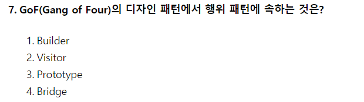

# 2020.06.06

- 7번
    
    
    
    - 생성 패턴(Creational Pattern)
        - 추상 팩토리(Abstract Factory)
        - 빌더(Builder)
        - 팩토리 메소드(Factory Method)
        - 프로토타입(Prototype)
        - 싱글톤(Singleton)
    - 구조 패턴(Structural Pattern)
        - 어댑터(Adapter)
        - 브리지(Bridge)
        - 컴포지트(Composite)
        - 데코레이터(Decorator)
        - 퍼싸드(Facade)
        - 플라이웨이트(Flyweight)
        - 프록시(Proxy)
    - 행위 패턴(Behavioral Pattern)
        - 책임 연쇄(Chain of Responsibility)
        - 커맨드(Command)
        - 인터프리터(Interpreter)
        - 반복자(Iterator)
        - 중재자(Mediaotr)
        - 메멘토(Memento)
        - 옵서버(Observer)
        - 상태(State)
        - 전략(Strategy)
        - 탬플릿 메소드(Template Method)
        - 방문자(Visitor)
- 14번
    
    
    
    - 럼바우 객체지향 분석 절차
        - 객체 → 동적 → 기능
- 16번
    
    
    
    - 집단화 is part of : 클래스 간의 구조적인 집약 관계
    - 일반화 is a : 클래스들 간의 개념적인 포함 관계
- 29번
    
    
    
    - 반 정규화 유형 중 중복 테이블 추가 방법
        - 진행 테이블 추가
        - 집계 테이블 추가
        - 중복 테이블 추가
        - 이력 테이블 추가
        - 특정 부분만을 포함하는 테이블 추가
- 30번
    
    
    
    - 기능성 하위 특성
        - 적합성, 정확성, 상호 운용성, 보안성, 준수성
    - 신뢰성 하위 특성
        - 성숙성, 결함허용성, 복구성
    - 사용성 하위 특성
        - 이해성, 학습성, 운용성, 준수성
    - 효율성 하위 특성
        - 시간 반응성, 자원 효율성, 준수성
    - 유지보수성 하위 특성
        - 분석성, 변경성, 안정성, 시험성, 준수성
    - 이식성 하위 특성
        - 적응성, 설치성, 공존성, 대체성, 준수성
- 46번
    
    
    
    - 데이터 베이스의 논리적 설계 단계에서 수행하는 작업
        - 특정 DBMS가 지원하는 논리적 자료 구조로 변환
        - 논리적 구조의 데이터로 모델화
        - 개념 스마를 평가 및 정제하고 DBMS에 따라 서로 다른 스키마를 설계하는 단계
        - 트랜잭션의 인터페이스 설계
        - 관계형 데이터베이스라면 테이블 설계
        - 특정목표 DBMS에 따른 스키마 설계
        - 스키마의 평가 및 정제
    - 물리적 설계 단계에서 수행하는 작업
        - 논리적 구조로 표현된 데이터를 물리적 구조의 데이터로 변환
        - 데이터 베이스 파일의 저장 구조 및 엑세스 경로 설정
        - 데이터가 컴퓨터에 저장되는 방법을 묘사
        - 저장 레코드의 양식 설계
        - 레코드 집중의 분석 및 설계
        - 접근 경로 설계
- 68번
    
    
    
    - 물리 계층 : 전송에 필요한 두 장치 간의 실제 접속과 절단 등 기계적, 전기적 기능적 절차 특성에 대한 규칙 정의
    - 데이터링크 계층 : 두 개의 인접한 개방 시스템들 간 신뢰성있고 효율적인 정보 전송
    - 네트워크 계층 : 개방 시스템들 간의 네트워크 연결을 관리 및 데이터 교환 및 중계
    - 전송 계층 : 논리적 안정 및 균일한 데이터 전송 서비스를 제공함으로써 종단 시스템간 투명한 데이터 전송 가능
    - 세션 계층 : 송 수신 측 간의 관련성을 유지하고 대화 제어를 담당
    - 표현 계층 : 응용 계층으로부터 받은 데이터를 세션 계층에 보내기 전에 통신에 적당한 형태로 변환, 세션 계층에서 받은 데이터는 응용계층에 맞게 변환
    - 응용 계층 : 사용자가 OSI 환경에 접근할 수 있도록 서비스 제공
- 74번
    
    
    
    - IEEE 802.11 : 워킹 그룹 무선 LAN 표준화. 2.4GHz, CSMA/CA
    - IEEE 802.11a : OFDM 기술을 사용해 최대 54Mbps까지의 전송 속도 지원. 5GHz
    - IEEE 802.11b : Wi-Fi, 11의 스루풋 확장. 11mbps
    - IEEE 802.11d : 지역 간 로밍용 확장 기술
    - IEEE 802.11e : QoS, MAC 구현 수정. Voice over WLAN, 스트리밍을 위한 기술
    - IEEE 802.11f : 인터 액세스 포인트 프로토콜
    - IEEE 802.11g : 11b의 스루풋 확장. 54mbps
    - IEEE 802.11h : DFS, TPC, 5GHz 타장비(레이다) 간섭 해결
    - IEEE 802.11i : WPA2
    - IEEE 802.11j : 일본용 전송 방식
    - IEEE 802.11k : 전파 자원 측정 확장 기술
    - IEEE 802.11n : 40MHz 대역폭. g의 스루풋 화장. 600mbps
    - IEEE 802.11p : 빠르게 움직이는 운송 수단을 위한 무선 접속 기술
    - IEEE 802.11r : 빠른 로밍
    - IEEE 802.11s : ESS 메쉬 네트워킹
    - IEEE 802.11t : 무선 성능 에측 (WPP)
    - IEEE 802.11u : 802.11 기반이 아닌 네트워크와의 상호 연동
    - IEEE 802.11v : 무선 네트워크 관리
    - IEEE 802.11w : 보호된 관리 프레임
- 81번
    
    
    
    - 비용 산정 기법
        - 전문가 감정 기법 : 조직 내에 있는 경험 많은 두 명 이상의 전문가에게 비용 산정을 의뢰하는 기법
        - 델파이 기법 : 전문가 감정 기법의 주관적 편견을 보완하기 위해 많은 전문가의 의견을 종합
        - LOC 기법 : 원시 코드 라인 수 기법으로서 원시 코드 라인 수의 비관치 낙관치 기대치를 측정하여 산정하는 기법
        - 개발 단계별 인월수 기법 : LOC를 보완하기 위한 기법, 필요 노력을 생명 주기의 각 단계별로 선정
        - COCOMO : 보헴이 제안한 것으로 LOC에 의한 비용 산정 기법
    - 유형별 COCOMO
        - Organic : 조직형 / 소규모 소프트웨어 일괄 자료 처리 / 5만 라인 이하
        - Semi-detached : 반분리형 / 트랜잭션 처리 시스템이나 운영체제, DB / 30만 라인 이하
        - Embedded : 내장형 / 최대형 규모 트랜잭션 처리 시스템이나 운영체제 / 30만 라인 이상
    - COCOMO 종류
        - Basic (기본) : 소프트웨어 크기 및 개발 유형만 이용
        - Intermediate (중간) : 기본형의 공식 토대로 사용하나 4가지 특성 및 15가지 요인에 의해 비용 산정
    - 제품 특성
        - 신뢰도 / DB 크기 / 복잡도
    - 컴퓨터 특성
        - 수행시간제한 / 기억장소 제한 / 가상 기계의 안정성 / Turn Around Time
    - 개발요원의 특성
        - 분석가 능력 / 개발 분야 경험 / 가상 기계 경험 / 프로그래머 능력 및 언어 경험
    - 프로젝트 특성
        - 소프트웨어 도구 이용 / 프로젝트 개발 일정 / 최신 프로그래밍 기법 이용
    - Detailed(발전)
        - 중간형 COCOMO 보완하여 만들어진 방법으로 개발 공정별보다 자세하고 정확하게 비용 산정
    - Putnam 기법
        - 소프트웨어 생명 주기의 전 과정 동안에 사용될 곡선의 노력 분포를 가정해주는 모형
        - Rayleigh-Norden 곡선의 노력 분포도를 기초로 한다.
    - FP 기법
        - 기능 점수 모형으로 알브레히트가 제안
        - 요인별 가중치를 합산하여 총 기능 점수를 산출하여 점수와 영향도를 이용, 비용 산정
- 87번
    
    
    
    - Tripwire
        - 크래커가 침입하여 백도어를 만들어 놓거나 설정 파일을 변경했을 때 분석하는 도구
        - MD5, CRC-32, SHA 등의 알고리즘 사용
    - Aide
        - Tripwire를 대신할 수 있는 도구로 파일의 무결성을 검사하는데 사용
    - sXid
        - MD5 체크섬을 사용하여 suid, sgid 파일을 추적. 루트키트가 설치되어있는지 검사. Cron 작업형태로 수행.; 자동으로 파일을 추적하고 경고
    - Claymore
        - 침입탐지 및 무결성 모니터링 도구로 크론테이블을 이용하여 주기적으로 파일시스템의 변조유무를 확인하고 변조되었을 경우 관리자에게 메일로 통보해 주는 기능
    - Samhain
        - 시스템의 무결성을 점검하는 도구로 여러 시스템을 관리할 수 있는 수단 제공. 모니터링 에이전트와 중앙 로그서버로 구성
    - Slipwire
        - 파일시스템의 무결성을 검사하는 도구로 파일의 SHA-1 hashes 값을 비교하여 변경될 경우 사용자에게 경고하는 기능
    - Fcheck
        - 유닉스 파일 시스템의 변조유무를 점검하기 위한 PERL script 도구로 syslog, console 등으로 관리자에게 파일 시스템 변화를 경고. tripwire와 비슷한 도구로 설치 및 운용이 수월함
    - cron
        - 작업 예약 스케줄러