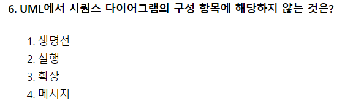

# 2020.08.22

- 6번
    
    
    
    - 시퀸스 다이어그램 구성 항목
        - Actor, 활성 객체(Object), 라이프라인(생명선), 메세지, 제어 삼각형
- 20번
    
    
    
    - 인터페이스 요구사항 검토(검증) 방법
        - 동료 검토(Peer Review) : 요구사항 명세서 작성자가 요구사항 명세서를 설명하고 이해관계자들이 설명을 들으면서 결함을 발견
        - 워크스루(Walk Through) : 검토 회의 전, 명세서를 미리 배포하여 사전검토 후에 짧은 검토 회의를 통해 결함 발견
        - 인스펙션(Inspection) : 요구사항 명세서 작성자를 제외한 다른 검토 전문가들이 명세서를 확인하면서 결함 발견
- 26번
    
    
    
    - cyclomatic : Edge - Node + 2
        - ⇒ 6 - 4 + 2 ⇒ 4
- 27번
    
    
    
    - 1회전 : 14 - 37 - 17 - 40 - 35
    - 2회전 : 14 - 17 - 37 - 40 - 35
    - 3회전 : 14 - 17 - 35 - 40 - 37
    - 4회전 : 14 - 17 - 35 - 37 - 40
- 35번
    
    
    
    - 파티션 유형
        - 범위 분할(Range Partitioning) : 지정한 열의 값을 기준으로 분할
        - 해시 분할(Hash Partitioning) : 해시 함수를 적용한 결과 값에 따라 데이터 분할
        - 조합 분할(Composite Partitioning) : 범위 분할 후 해시 함수를 적용하여 다시 분할
- 44번
    
    
    
    - 정규화 순서
        - 1NF → 2NF → 3NF → BCNF → 4NF → 5NF
- 66번
    
    
    
    - HRN 방식의 우선순위 산정 공식
        - (대기시간 + 서비스시간) / 서비스 시간 (값이 클 수록 우선순위가 높음)
- 72번
    
    
    
    - 결합도 강한 것부터 내용 → 공통 → 외부 → 제어 → 스탬프 → 자료 (내공외제스자)
- 74번
    
    
    
    - 서브넷팅 24 ⇒ C클래스
        - → 200.1.1.0
- 84번
    
    
    
    - FP 기능별 가중치 산정요소
        - 자료 입력(입력 양식)
        - 정보 출력(출력 보고서)
        - 명령어(사용자 질의수)
        - 데이터 파일
        - 필요한 외부 루틴과의 인터페이스
- 85번
    
    
    
    - 블록 암호화 방식 : DES, SEED, AES, ARIA
    - 스트림 암호화 방식 : LFSR, RC4
- 88번
    
    
    
    - COCOMO
        - 유형 : 조직형(Organic) / 반분리형(semi-detached) / 내장형 (Embedded)
        - 종류 : 기본형(basic) / 중간형(intermediate) / 발전형(detailed)
- 96번
    
    
    
    - 합성 중심(Composition-Based) : 전자 칩과 같은 소프트웨어 부품, 즉 블록(모듈)을 만들어서 끼워 맞추어 소프트웨어를 완성시키는 방법으로, 블록 구성 방법이라고도 한다
    - 생성 중심(Generation-Based) : 추상화 형태로 쓰여진 명세를 구체화하여 프로그램을 만드는 방법으로, 패턴 구성 방법이라고도 한다.