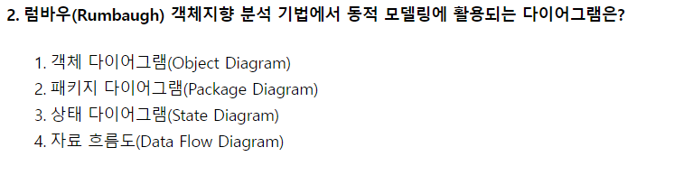

# 2020.09.26

- 2번
    
    
    
    - 동적 모델링(Dynamic Modeling)은 상태 다이어그램(상태도)를 이용해 시간 흐름에 따른 객체들 간의 제어 흐름, 상호 작용, 동작 순서 등의 동적인 행위를 표현하는 모델링이다.
        - ⇒ 럼바우(Rumbaugh) 객체지향 분석 기법에서의 동적 모델링
            - ⇒ 상태 다이어그램(State Diagram), 동적인 흐름 행위
- 12번
    
    
    
    - 소프트웨어의 상위 설계
        - 아키텍처 설계, 데이터 설계, 시스템 분할, 인터페이스 정의, 사용자 인터페이스 설계(UI 설계)
    - 소프트웨어의 하위 설계
        - 모듈 설계, 인터페이스 작성
- 23번
    
    
    
    - 정적 분석 도구
        - pmd, cppcheck, SonarQube, ccm
    - 동적 분석 도구
        - valance, Avalanche, ValgrindA
- 29번
    
    
    
    - 인터페이스 구현 검증 도구
        - xUnit, STAF, FitNesse, NTAF, Selenium, Watir
- 36번
    
    
    
    - 콘텐츠 분배자(Contents Distributor) : 암호화된 콘텐츠를 유통하는 곳 또는 사람
    - 콘텐츠 제공자(Contents Provider) : 콘텐츠를 제공하는 저작권자
    - 클리어링 하우스(Clearing House) : 저작권에 대한 사용 권한, 라이센스 발급, 암호화된 키 관리, 사용량에 따른 결제 관리 등을 수행
    - DRM 컨트롤러(DRM Controller) : 배포된 콘텐츠의 이용권한을 통제하는 프로그램
    - 패키터(Packager) : 콘텐츠를 메타 데이터와 함께 배포 가능한 형태로 묶어 암호화하는 프로그램
- 38번
    
    
    
    - 제산법 : 레코드키를 해시표로 나눈 나머지를 홈 주소로 사용
    - 기수변환법 : 키 숫자의 진수를 다른 진수로 변환시켜 주소 크기를 초과한 높은 자릿수 절단, 다시 주소 범위에 맞게 조정
    - 숫자분석법 : 키 값을 이루는 숫자의 분포를 분석하여 비교적 고른 자리를 필요한 만큼 선택
- 48번
    
    
    
    - 후보키(Condidate Key) : 릴레이션을 구성하는 속성 중 튜플을 유일하게 식별하기 위한 기본키로 사용할 수 있는 속성들
    - 기본키(Primary Key) : 후보키 중에서 선택된 주키(Main Key)
    - 슈퍼키(Super Key) : 한 릴레이션 내에 있는 속성들의 집합으로 구성된 키. 슈퍼키는 릴레이션에 있는 튜플에 대해 유일성을 만족시키지만, 최소성은 만족 시키지 못한다.
    - 외래키(Foregin Key) : 관계를 맺고 있는 릴레이션 R1, R2에서 릴레이션 R1이 참조하고 있는 릴레이션 R2의 기본키와 같은 R1 릴레이션의 속성
- 50번
    
    
    
    - 관계대수
        - 관계대수는 관계형 데이터베이스에서 원하는 정보와 그 정보를 검색하기 위해서 어떻게 유도하는가를 기술하는 절차적인 언어
        - 관계대수는 릴레이션을 처리하기 위해 연산자와 연산규칙을 제공하는 언어로 피연산자가 릴레이션이고 결과도 릴레이션이다
        - 질의에 대한 해를 구하기 위해 수행해야 할 연산의 순서를 명시한다
        - 대표적으로 순수 관계 연산자와 일반 집합 연산자가 있다
    - 관계해석
        - 관계 데이터 모델의 제안자인 코드가 수학에 가까운 기반을 두고 관계 데이터베이스를 위해 제안하여 탄생
        - 관계해석은 관계 데이터의 연산을 표현하는 방법으로, 원하는 정보를 정의할 때는 계산 수식을 사용한다
        - 관계해석은 원하는 정보가 무엇이라는 것만 정의하는 비절차적 특성을 지닌다
        - 튜플 관계해석과 도메인 관계해석이 있다.
        - 기본적으로 관계해석과 관계대수는 관계 데이터베이스를 처리하는 기능과 능력면에서 동등하며 관계대수로 표현한 식은 관계해석으로 표현할 수 있다.
        - 질의어로 표현한다.
- 59번
    
    
    
    - 스키마 : 속성(attribute)의 집합
    - 인스턴스 : 튜플의 집합 (행, 레코드)
    - 속성의 개수 : 차수
    - 튜플의 개수 : 카디널리티(cardinality)
- 61번
    
    
    
    - configenv : 파이썬에서 사용
    - printenv : 환경 변수의 값을 출력하는 명령어
    - env : 환경 변수 보기 및 변경
    - setenv : 환경 변수 추가 또는 업데이트
- 64번
    
    
    
    - 커널(Kernel) : 프로세스(CPU 스케줄링) 관리, 기억장치 관리, 파일관리, 입출력 관리, 프로세스간 통신, 데이터 전송 및 변환 등
    - 쉘(shell) : 시스템과 사용자간의 인터페이스 담당, 명령어 해석기
- 66번
    
    
    
    - who : 현재 시스템에 로그인 한 유저의 목록 출력
    - |(파이프) : 앞의 who 명령어의 출력 결과를 뒤의 grep 명령어로 전달
    - grep : who 명령문의 결과 중 wow 유저가 로그인하면 그 결과를 필터링하여 출력
    - sleep : 뒤의 숫자(초)만큼 대기
    - untill … do : 조건문이 참이 될 때까지 실행
- 80번
    
    
    
    - @ : 에러 제어 연산자
    - < > : 관계 연산자
    - === : 관계 연산자
- 82번
    
    
    
    - CMM(Capabillity Maturity Model, 능력 성숙도 모델) 레벨
        - Initial(초기) 단계 : 표준화된 프로세스 없이 프로젝트 수행결과 예측이 곤란한 조직
        - Managed(관리) 단계 : 기본적인 프로세스 구축에 의해 프로젝트가 관리되고 있는 조직
        - Defined(정의) 단계 : 세부표준 프로세스가 있어 프로젝트가 통제되는 조직
        - Quantitatively Managed(정량적 관리) 단계 : 프로젝트 활동이 정량적으로 관리 통제되고 성과 예측이 가능한 조직
        - Optimizing(최적화) 단계 : 지속적인 개선활동이 정착화 되고 최적의 관리로 프로젝트가 수행되는 조직
- 87번
    
    
    
    - SERM(Software Requirements Enginering Methodlogy) : TRW 사가 우주 국방 시스템 그룹에 의해 실시간 처리 소프트웨어 시스템에서 요구사항을 명확히 기술하도록 할 목적으로 개발한 것. RSL과 REVS를 사용하는 자동화 도구
    - PSL/PSA : 미시간 대학에서 개발한 것으로 PSL과 PSA를 사용하는 자동화 도구
    - HIPO(Hieracgy Input Process Output) : 하향식 소프트웨어 개발을 위한 문서화 도구
    - SADT(Structure Analysis and Design Technique) : SoftTech 사에서 개발된 것으로 구조적 요구 분석을 위해 블록 다이어그램을 채택한 자동화 도구
- 89번
    
    
    
    - 접근통제 기술
        - MAC : 강제(Mandatory) 접근 통제
        - DAC : 임의(Discretionary) 접근 통제
        - RBAC : 역할 기반(Role Based) 접근 통제
- 91번
    
    
    
    - PERT : 프로젝트 일정 관리 기법
- 96번
    
    
    
    - 소프트웨어 정의 데이터센터(SDDC; Software Defined Data Center)
        - 데이터 센터의 모든 자원을 가상화
        - 다양한 소프트웨어 정의 기술 사용
        - 유연한 제어 기능
        - 비용 절감 가능
        - 운영이 편리
        - 하드웨어에 독립적
- 98번
    
    
    
    - NS(Nassi-Schneiderman) chart
        - 논리의 기술에 중점을 둔 도형을 이용한 표현 방법
        - 그리기가 어렵다. (전문성 필요)
        - 순차, 선택, 반복으로 표현
        - 임의의 제어 이동이 어렵다
        - goto 구조가 어렵다
        - 그래픽 설계 도구이다
        - 상자 도표라고도 한다
        - 프로그램으로 구현이 쉽다
        - 조건이 복합되어 있는 곳의 처리를 명확히 식별하기에 적합하다
        - if문이 여러개일 때 가능