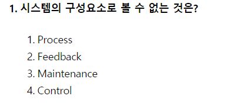

# 2021.05.15

- 1번
    
    
    
    - 시스템 구성요소
        - 입력(Input) : 처리 방법, 처리할 데이터, 조건을 시스템에 투입하는 것
        - 처리(Process) : 입력된 데이터를 처리 방법과 조건에 따라 처리하는 것
        - 출력(Output) : 처리된 결과를 시스템에서 산출하는 것
        - 제어(Control) : 자료를 입력하여 출력될 때까지의 처리 과정이 올바르게 진행되는지 감독하는 것
        - 피드백(Feedback) : 출력된 결과가 예정된 목표를 만족시키지 못할 경우 목표 달성을 위해 반복 처리하는 것
- 3번
    
    
    
    - 요구사항 개발 프로세스
        - 도출(Elicitation) → 분석(Analysis) → 명세(Specification) → 확인(Validation)
- 9번
    
    
    
    - 송신 시스템
        - 연계할 데이터를 DB와 애플리케이션으로부터 연계 테이블 또는 파일 형태로 생성하여 송신
    - 수신 시스템
        - 수신한 연계 테이블, 파일 데이터를 수신 시스템에서 관리하는 데이터 형식에 맞게 변환하여 DB에 저장하거나 애플리케이션에서 활용할 수 있도록 제공
    - 중계 서버
        - 송/수신 시스템 사이에서 데이터를 송수신하고, 연계 데이터의 송수신 현황을 모니터링 함, 연계 데이터의 보안 강화 및 다중 플랫폼 지원 등이 가능
- 15번
    
    
    
    - Dependency(의존) : 한 사물의 명세서가 바뀌면 그것을 사용하는 다른 사물에게 영향을 끼치는 것
    - Realization(실체화) : 한 객체가 다른 객체에 의해 오퍼레이션을 수행하도록 지정
    - Generalization(일반화) : 일반화된 사물과 좀 더 특수화된 사물 사이의 관계 (is-a)
    - Association(연관) : 두 사물간의 구조적 관계로, 어느 한 사물 객체가 다른 사물 객체와 연결되어 있음을 의미(has-a)
- 17번
    
    
    
    - 기존 시스템과 신규 시스템의 성능 비교는 개발, 설계 등 구현 단계에서 필요
- 26번
    
    
    
    - 명세 기반 테스트 : 주어진 명세를 빠짐없이 테스트 케이스로 구현하고 있는지 확인하는 테스트
    - 구조 기반 테스트 : 프로그램 내부 구조 및 복잡도를 검증하는 화이트박스 테스트 시행, 제어 흐름과 조건 결정 등이 목적
    - 성능 테스트 도구(Performance Test Tools) : 애플리케이션의 처리량, 응답시간, 경과시간, 자원 사용률 등 성능 목표 달성 여부 확인
        - ⇒ 인위적으로 적용한 가상 사용자를 만들어 테스트 수행
- 35번
    
    
    
    - 인터페이스 구현 검증 도구
        - xUnit, STAF, Fitnesse, NTAF, Selenium, watir
    - Foxbase는 프로그래밍 언어이다.
- 41번
    
    
    
    - 수평 분할에서 활용되는 분할 기법 유형
        - range, hash, list, composite, round robin
    - 수직 분할에서 활용되는 분할 기법 유형
        - 로우 체이닝(Row Chaining), 로우 마이그레이션(Row Migration)
- 49번
    
    
    
    - 병행제어 기법의 종류
        - 로킹 기법
        - 타임 스탬프 기법
        - 최적 병행 수행 기법 (검증 기법, 확인 기법, 낙관적 기법)
        - 다중 버전 기법
    - 시분할 기법은 운영체제 운영기법이다.
- 56번
    
    
    
    - 차수 = Degree = Attribute의 수 = 속성의 수 = DB의 열
    - 기수 = Cardinality = Tuple의 수 = 대응수 = DB의 행
- 61번
    
    
    
    - CSMA/CA(Carrier-sense mutiple access with collision avoidance), 충돌 방지
        - ⇒ 무선 랜에서 데이터 전공 시, 매체가 비어있음을 확인한 후 충돌을 회피하기 위해 임의 시간을 기다린 후 데이터를 전송하는 방식. 네트워크에 데이터의 전송이 없는 경우라도 동시 전송에 의한 충돌에 대비해 확인 신호를 전송한다
    - CSMA/CD(Carrier-sense mutiple access with collision detection), 충돌 감지
        - ⇒ 이더넷에서 각 단말이 전송 공유 매체에 규칙있게 접근하기 위한 매체 엑세스 제어 방식
    - Collision Domain, 충돌 도메인
        - 충돌 발생을 검출할 수 있는 브리지 간 혹은 다른 계층 장치 간의 Ithernet Segment 범위
- 62번
    
    
    
    - 결합도는 강한 ⇒ 약한 순서
        - 내용(content) > 공통(common) > 외부(external) > 제어(control) > 스탬프(stamp) > 자료(data)
- 63번
    
    
    
    - 4는 이진수 0100, 7은 이진수 0111
        - |  연산은 or 연산, 4 | 7 ⇒ 111
        - 답은 7
- 76번
    
    
    
    - TCP Protocol
        - 흐름 제어(Flow Control) 기능 수행
        - 전이 중(Full Duplex) 방식의 양방향 가상회선 제공
        - 전송 데이터와 응답 데이터를 함께 전송
        - Segment의 전송 및 오류 제어
- 78번
    
    
    
    - stdlib.h ⇒ C의 표준 라이브러리로 문자열 변환, 난수 생성, 동적 메모리 관리 등의 함수를 포함하고 있다.
- 81번
    
    
    
    - SAN
        - 광저장장치영역 네트워크
        - 특수 목적용 고속 네트워크
        - 대규모 네트워크 사용자들을 위해 이기종 간의 데이터 저장장치를 관련 데이터 서버와 함께 연결해 별도의 네트워크를 구성해 관리하는 스토리지 디바이스 네트워크
    - MBR (Memory Buffer Register)
        - 기억장치를 출입하는 데이터가 잠시 기억되는 레지스터
    - NAC(Network Access Control)
        - PC의 MAC 주소를 IP 관리 시스템에 등록, 일관된 보안관리 기능을 제공
    - NIC
        - 물리 계층과 데이터 계층의 서비스 제공
- 83번
    
    
    
    - CBD 방법론의 개발 공정
        - 요구 파악
            - 요구사항 기술서, 용어 사전, 개념 모델, 유즈케이스 모델
        - 분석 및 설계
            - 객체 모델, UI 설계서, 아키텍처 기술서, 인터페이스 명세서, 컴포넌트 명세서, 컴포넌트 설계서, 데이터베이스 설계서
        - 구현
            - 개발 표준 정의서, 플랫폼 종속적 코드
        - 테스트
            - 테스트 계획서, 컴포넌트 테스트 보고서, 통합 테스트 보고서, 인수테스트 보고서
- 87번
    
    
    
    - COCOMO : 시스템의 비용을 산정하기 위해 시스템을 구성하고 있는 모듈과 서브 시스템의 비용 합계를 계산하는 방식
    - Putnam : 소프트웨어 개발 주기의 각 단계별로 요구할 인력의 분포를 가장하는 모형
    - Function-Point(FP) : 요구 기능을 증가시키는 인자별로 가중치를 부여하여 기능의 점수를 계산하여 비용을 산정하는 방식
    - PERT : 계획 평가 및 재검토 기술, 프로젝트 관리를 분석하거나 주어진 완성 프로젝트를 포함한 일을 묘사하는데 쓰이는 모델
- 88번
    
    
    
    - Transcription Error, 필사 오류 : 입력 시 임의의 한 자리를 잘못 기록한 경우
    - Omission Error , 생략 오류 : 입력 시 한 자리를 빼놓고 기록한 경우
    - Transposition Error, 전위 오류 : 입력 시 좌우 자리를 바꾸어 기록한 경우
    - Double Transposition Error : 전위 오류가 두 가지 이상 발생한 경우
    - Addition Error : 입력 시 한자리를 추가로 기록한 경우
    - Random Error : 위의 오류가 두 가지 이상 결합하여 발생한 경우
- 89번
    
    
    
    - 기본 생명 주기 프로세스
        - 획득, 공급, 개발, 운영, 유지보수 프로세스
    - 지원 생명 주기 프로세스
        - 품질 보증, 검증, 확인, 활동 검토, 문제 해결 프로세스
    - 조직 생명 주기 프로세스
        - 관리, 기반 구조, 훈련, 개선 프로세스
- 96번
    
    
    
    - Screen Subnet, 스크린 서브넷 : 외부 네트워크와 내부 네트워크 사이에 두는 완충적인 통신망
- 98번
    
    
    
    - 답은 nmap
- 100번
    
    
    
    - 암호화 키와 복호화 키가 동일한 암호화 알고리즘 ⇒ 개인키 (대칭키, 단일키) 암호화 알고리즘
        - ⇒ AES