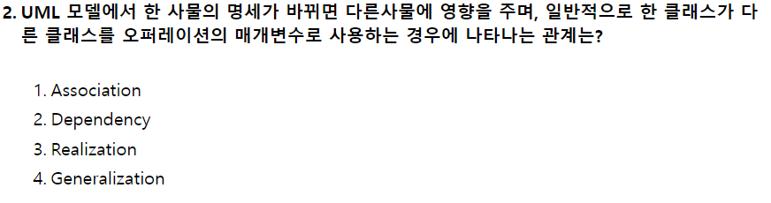

# 2021.08.14

- 2번
    
    
    
    - Dependency(의존) : 한 사물의 명세서가 바뀌면 그것을 사용하는 다른 사물에게 영향을 끼치는 것
    - Realization(실체화) : 한 객체가 다른 객체에 의해 오퍼레이션을 수행하도록 지정
    - Generalization(일반화) : 일반화된 사물과 좀 더 특수화된 사물 사이의 관계 (is-a)
    - Association(연관) : 두 사물간의 구조적 관계로, 어느 한 사물 객체가 다른 사물 객체와 연결되어 있음을 의미(has-a)
- 7번
    
    
    
    - 기능적 요구사항
        - 시스템이 수행해야 하는 행위들을 구체화한 것
        - 시스템에서 제공해야 할 기능을 정의한 것
        - 입력 기능, 출력 기능, 데이터베이스 기능, 통신 기능 등
    - 비기능적 요구사항
        - 시스템이 가져야 하는 기능 이외의 요구사항
        - 시스템의 전체적인 품질이나 고려해야 하는 제약사항 등
        - 사용 용이성, 효율성, 신뢰성, 이식성, 유연성, 확장성 등
        - 성능적인 면 : 응답 속도, 자원 사용량 등
        - 보안 측면 : 침입 대응, 침입 탐지, 사용자 인증, 권한 부여 등
- 8번
    
    
    
    - Instance : 실행 중인 임의의 프로세스, 클래스의 현재 생성된 객체, 클래스로 정의된 객체의 복사본
    - Operation : 클래스의 동작, 클래스에 속하는 객체에 대하여 적용될 메서드
    - Item : 어떤 조직의 구성원, 객체에서는 객체에 속하는 데이터나 메서드를 지칭, 데이터베이스에서는 테이블의 열
    - Hiding : 정보 은폐, 캡슐화된 항목을 다른 객체로부터 숨기는 것
- 15번
    
    
    
    - 객체 모델링 ⇒ 객체 다이어그램
    - 동적 모델링 ⇒ 상태 다이어그램
    - 기능 모델링 ⇒ 자료 흐름도
- 16번
    
    
    
    - 시퀸스 다이어그램은 동적 다이어그램이다.
- 38번
    
    
    
    - 중위 : 왼쪽 → 중앙
- 54번
    
    
    
    - DDL ⇒ CREATE, ALTER, DROP
    - DML ⇒ SELECT, INSERT, UPDATE, DELETE
    - DCL ⇒ COMMIT, ROLLBACK, GRANT, REVOKE
- 60번
    
    
    
    - Y는 X에 함수 종속이다. ⇒ X를 결정자, Y를 종속자.
        - X → Y (X를 통해 Y를 안다)
- 61번
    
    
    
    - Temporal Cohesion(시간적 응집도) : 모듈 내 구성 요소들이 서로 다른 기능을 같은 시간대에 함께 실행하는 경우의 응집도
    - Logical Cohesion(논리적 응집도) : 모듈 내 구성 요소들이 같은 범주에 속하는 기능끼리 묶인 경우
    - Coincidental Cohesion(우연적 응집도) : 모듈 내 구성 요소들이 뚜렷한 관계 없이 묶인 경우
    - Sequential Cohesion(순차적 응집도) : 모듈 내 구성 요소들이 이전의 명령어로부터 나온 출력결과를 그 다음 명령어의 입력자료로 사용하는 경우
- 67번
    
    
    
    - -- > % > & > =
- 78번
    
    
    
    - OPT(Optimal) : 앞으로 가장 오랫동안 사용하지 않을 페이지 교체
    - FIFO(First In First Out)
    - LRU(Least Recently Used) : 가장 오랫동안 사용되지 않은 페이지 교체
    - LFU(Least Frequently Used) : 참조 횟수가 가장 적은 페이지 교체
    - MFU(Most Frequently Used) : 참조 횟수가 가장 많은 페이지 교체
    - NUR(Not Used Recently) : 최근에 사용하지 않은 페이지 교체
- 80번
    
    
    
    - File Descriptor
        - 파일마다 따로 있으며 시스템에 따라 다른 구조를 가질 수 있다.
        - 파일 시스템에서 관리하므로 사용자는 직접 참조할 수 없다
        - 파일 이름, 위치, 파일 구조, 보조기억장치의 유형, 파일 유형, 시간, 액세스 등의 정보를 담고 있다.
        - 보조기억장치에 저장되어 있다가 파일이 개방(open)되면 주기억장치로 이동한다.
        - 파일 제어 블록(File Control Block)이라고도 한다.
- 81번
    
    
    
    - 이상 탐지(Anomaly Detection) → Behavior, Statistical Detection라고도 불리며 평균적 시스템의 상태 기준으로 비정상적인 행위나 자원의 사용이 감지되면 이를 알려준다.
    - 오용탐지(Misuse Detection) → Signature Base나 Knowledge Base로 불리며 미리 입력해둔 공격 패턴이 감지되면 이를 알려준다.
    - HIDS(Host-Based Intrusion Detection)는 운영체제에 설정된 사용자 계정에 따라 어떤 사용자가 어떤 접근을 시도하고 어떤 작업을 했는지에 대한 기록을 남기고 추적한다
- 82번
    
    
    
    - Mandatory Access Control(강제 접근 통제) : 주체와 객체의 등급을 비교하여 접근 권한을 부여하는 방식
    - Discretionary Access Control(임의 접근 통제) : 접근하는 사용자의 신원에 따라 접근 권한을 부여하는 방식
    - User Access Control(사용자 계정 컨트롤) : 프로그램에서 관리자 수준의 권한이 필요한 작업을 수행할 때 사용자에게 알려서 제어할 수 있도록 돕는 기능
    - Data-Label Access Control, Label-Based Access Control(자료별 접근 통제) : 개별 행, 열에 대한 쓰기 권한, 읽기 권한을 가졌는지를 명확하게 결정하는 제어 방식
- 99번
    
    
    
    - Effort Per Task 기법 : LOC 기법을 보안하기 위한 기법. 각 기능을 구현시키는 데 필요한 노력을 생명 주기의 각 단계별로 산정
    - 전문가 감정 기법 : 두 명 이상의 전문가에게 비용 산정을 의뢰하는 기법, 개인적이고 주관적이다
    - 델파이 기법 : 전문가 감정 기법의 주관적인 편견을 보완하기 위한 기법. 한 명의 조정자와 여러 전문가의 의견을 종합하여 산정하는 기법
    - LOC 기법 : 원시 코드 라인 수(Cource Line of Code)의 비관치, 낙관치, 기대치를 측정하여 예측치를 구함.