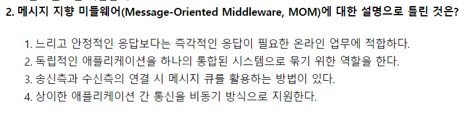

# 2023.04.24

- 2번
    
    
    
    - MOM(Message Oriented Middleware)
        - 메시지 기반의 비동기형 메시지를 전달하는 방식의 미들웨어
        - 온라인 업무보다는 이기종 분산 데이터 시스템의 데이터 동기를 위해 많이 사용한다
        - MOM은 즉각적인 응답을 원하는 경우가 아닌, 다소 느리고 안정적인 응답을 필요로 하는 경우에 많이 사용된다.
- 4번
    
    
    
    - 연관 관계(Association) : 유스케이스와 액터 간의 상호작용이 있음을 표현
    - 포함 관계(Include) : 하나의 유스케이스가 다른 유스케이스의 실행을 전제로 할 때 형성되는 관계
    - 확장 관계(Extend) : 확장 기능 유스케이스와 확장 대상 유스케이스 사이에 형성 되는 관계
    - 일반화 관계(Generalization) : 유사한 유스케이스 또는 액터를 모아 추상화한 유스케이스 또는 액터와 연결시켜 그룹을 만들어 이해도를 높이기 위한 관계
- 5번
    
    
    
    - 기능적 요구사항 : 시스템이 실제로 어떻게 동작하는지에 관점을 둔 요구사항
    - 비기능적 요구사항 : 시스템 구축에 대한 성능, 보안, 품질, 안정 등에 대한 성능, 보안 품질, 안정성 등으로 실제 수행에 보조적인 요구사항
        - ⇒ 차량 대여 시스템이 제공하는 모든 화면이 3초 이내에 사용자에게 보여야 한다 : 비기능적 요구사항
- 22번
    
    
    
    - 이진 검색 은 low, middle, high 값을 사용, 찾고자 하는 데이터를 중앙에 위치한 중간값과 비교한다
    - 중간값은 내림으로 계산한다
        - (1 + 15) / 2 ⇒ 8
        - (9 + 15) / 2 ⇒ 12
        - (13 + 15) /2 ⇒ 14
            - ⇒ 탐색 성공
- 33번
    
    
    
    - Inspection 과정
        - (계획 → 사전 교육 → 준비 → Inspection 회의 -> 수정) → 후속 조치
- 37번
    
    
    
    - PreOrder : Root → Left → Right
    - InOrder : Left → Root → Right
    - PostOrder : Left → Right → Root
- 40번
    
    
    
    - CppUnit : C++ 프로그래밍 언어용 단위 테스트 도구
    - JUnit : Java 프로그래밍 언어용 단위 테스트 도구
    - HttpUnit : 웹 브라우저 없이 웹 사이트 테스트를 수행하는 데 사용되는 오픈 소스 소프트웨어 테스트 프레임워크
    - IgpUnit : 존재하지 않는 유닛
- 43번
    
    
    
    - 분산 데이터베이스의 목표
        - 위치 투명성(Location Transparency) : 하드웨어와 소프트웨어의 물리적 위치를 사용자가 알 필요 없다
        - 중복(복제) 투명성(Replication Transparency) : 사용자에게 통지할 필요 없이 시스템 안에 파일들과 자원들의 부가적인 복사를 자유롭게 할 수 있다
        - 병행 투명성(Concurrency Transparency) : 다중 사용자들이 자원들을 자동으로 공유할 수 있다
        - 장애 투명성(Faiure Transparency) : 사용자들은 어느 위치의 시스템에 장애가 발생했는지 알 필요가 없다
- 53번
    
    
    
    - Super Key : 슈퍼키
    - Candidate Key : 후보키
- 54번
    
    
    
    - 트랜잭션 인터페이스를 설계 및 작성은 논리적 설계 과정에서 이루어진다. 개념적 설계 단계에서는 트랜잭션 모델링이 이루어진다.
- 62번
    
    
    
    - C언어에서는 0이 아닌 모든 값은 1(TRUE)로 본다.
    - 따라서 a, b, c 변수는 논리 연산 수행 시 1로 계산한다
    - t1 = 1, t2 = 1, t3 = 0
    - ⇒ t1 + t2 + t3 ⇒ 2
- 64번
    
    
    
    - Total Packet Length (16 bits) : IP 헤더 및 데이터를 포함한 IP 패킷 전체 길이를 바이트 단위로 표시. 최댓값은 2^16 - 1
- 70번
    
    
    
    - Sequence - List : 순서 있는 가변형 데이터 타입
    - Sequence - Tuple : 순서 있는 불변형 데이터 타입
    - Set - Set : 순서가 없고 중복이 허용되지 않는 데이터 타입
    - Map - Dict : 순서가 없고 key-value 쌍
- 75번
    
    
    
    - IP Protocol은 Data Chcecksum을 제공하지 않으며, Header Checksum만 제공한다.
- 77번
    
    
    
    - 1, 2, 3번은 Kernel 수준 Thread의 장점이다.
- 100번
    
    
    
    - 1, 2, 3은 GANTT 차트에 대한 설명이다.