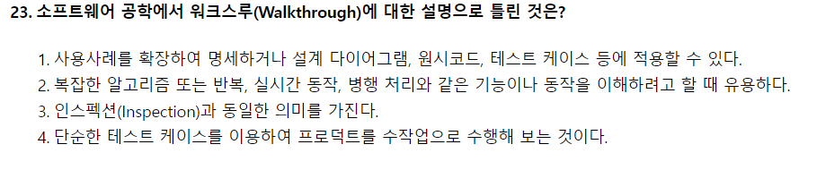

# 모의고사 1회

- 23번
    
    
    
    - Walkthrough(워크스루) : 요구사항 명세서 작성자를 포함하여 사전 검토한 후에 짧은 검토 회의를 통해 결함을 발견
    - Inspection(인스펙션) : 요구사항 명세서 작성자를 제외한 다른 검토 전문가들이 요구사항 명세서를 확인하면서 결함을 발견
- 26번
    
    
    
    - 명세 기반 테스트 : 주어진 명세를 빠짐없이 테스트 케이스로 구현하고 있는지 확인하는 테스트
    - 구조 기반 테스트 : 프로그램 내부 구조 및 복잡도를 검증하는 화이트박스 테스트 시행, 제어 흐름과 조건 결정 등이 목적
    - 성능 테스트 도구(Performance Test Tools) : 애플리케이션의 처리량, 응답시간, 경과시간, 자원 사용률 등 성능 목표 달성 여부 확인
        - ⇒ 인위적으로 적용한 가상 사용자를 만들어 테스트 수행
- 30번
    
    
    
    - ISO/IEC 9126 제품특성
        - 기능성 : 적합성, 정확성, 상호운용성, 보안성, 준수성
        - 신뢰성 : 성숙성, 결함허용성, 복구성
        - 사용성 : 이해성, 학습성, 운용성, 준수성
        - 효율성 : 시간반응성, 자원효율성, 준수성
        - 유지보수성 : 분석성, 변경성, 안정성, 시험성, 준수성
        - 이식성 : 적응성, 설치성, 공존성, 대체성, 준수성
- 31번
    
    
    
    - 화이트박스 테스트 종류 : 기초경로 검사, 조건 검사, 루프 검사, 데이터 흐름 검사
    - 블랙박스 테스트 종류 : 오류 예측 검사, 동치분할 검사, 경계값 분석, 비교 검사, 원인-효과 그래프 검사
- 38번
    
    
    
    - 제산법 : 레코드키를 해시표로 나눈 나머지를 홈 주소로 사용
    - 폴딩법 : 해싱함수 중 레코드 키를 여러 부분으로 나누고 나눈 부분의 각 숫자를 더하거나 XOR 한 값을 홈 주소로 사용
    - 기수변환법 : 키 숫자의 진수를 다른 진수로 변환시켜 주소 크기를 초과한 높은 자릿수 절단, 다시 주소 범위에 맞게 조정
    - 숫자분석법 : 키 값을 이루는 숫자의 분포를 분석하여 비교적 고른 자리를 필요한 만큼 선택
- 55번
    
    
    
    - 데이터 모델 구성 요소 : 논리적 데이터 구조, 연산, 제약 조건
- 81번
    
    
    
    - SAN(Storage Area Network) : 각기 다른 운영체제를 가진 여러 기종들이 네트워크상에서 동일 저장장치의 데이터를 공유하게 함으로써, 여러 개의 저장장치나 백업 장비를 단일화시킨 시스템
    - MBR(Memory Buffer Register) : 기억장치를 출입하는 데이터가 잠시 기억되는 레지스터
    - NAC(Network Access Control) : PC의 MAC 주소를 IP 관리 시스템에 등록, 일관된 보안관리 기능을 제공
    - NIC(Network Interface Card) : 물리 계층과 데이터 계층의 서비스를 제공
- 87번
    
    
    
    - SREM(Software Requirements Enginering Methdology):TRW사가 우주 국방 시스템 그룹에 의해 실시간 처리 소프트웨어 시스템에서 요구사항을 명확히 기술하도록 할 목적으로 개발한 것으로, RSL과 REVS를 사용하는 자동화 도구
    - PSL/PSA:미시간 대학에서 개발한 것으로 PSL과 PSA를 사용하는 자동화 도구
    - HIPO(Hieracgy Input Process Output):하향식 소프트웨어 개발을 위한 문서화 도구
    - SADT(Structure Analysis and Design Technique): SoftTech사에서 개발된 것으로 구조적 요구 분석을 위해 블록 다이어그램을 채택한 자동화 도구