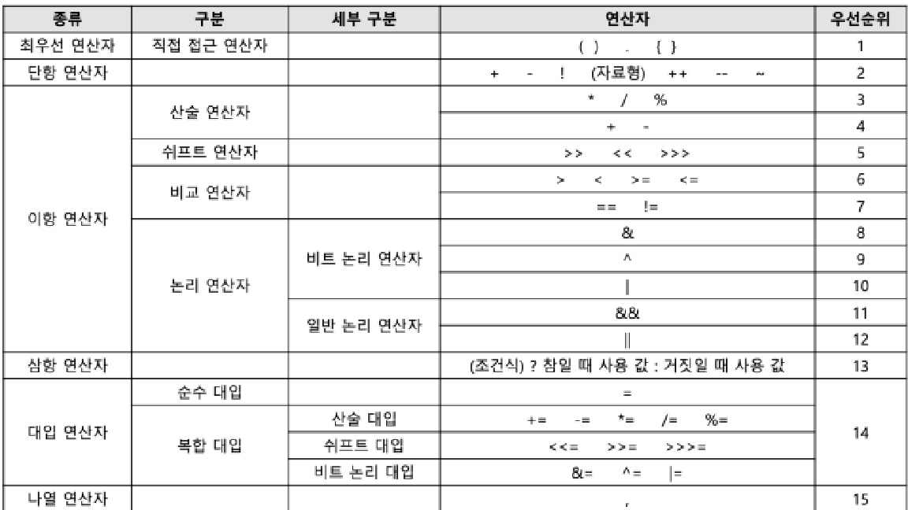

# 정보처리산업기사 - 시나공

# 응용 SW 기초 기술 활용

- 운영체제의 개념 (B)
    - OS(Operating System)는 컴퓨터 시스템의 자원들을 효율적으로 관리하며, 사용자가 컴퓨터를 편리하고 효과적으로 사용할 수 있도록 환경을 제공하는 여러 프로그램의 모임이다.
    - 운영체제의 목적에는 처리 능력 향상, 사용 가능도 향상, 신뢰도 향상, 반환 시간 단축 등이 있다. 
    1. 처리 능력(Throughput) : 일정 시간 내에 시스템이 처리하는 일의 양
    2. 반환 시간(Turn Around Time) : 시스템에 작업을 의뢰한 시간부터 처리가 완료될 때까지 걸린 시간
    3. 사용 가능도(Availability) : 시스템을 사용할 필요가 있을 때 즉시 사용 가능한 정도
    4. 신뢰도(Reliability) : 시스템이 주어진 문제를 정확하게 해결하는 정도
    - 운영체제의 기능은 다음과 같다.
        1.  프로세서(Processor, 처리기), 기억장치(주기억장치, 보조기억장치), 입,출력장치, 파일 및 정보 등의 자원 관리
        2. 자원을 효율적으로 관리하기 위한 자원의 스케쥴링 기능 제공
        3. 사용자와 시스템 간의 편리한 인터페이스 제공
        4. 시스템의 각종 하드웨어와 네트워크 관리/제어 
        5. 데이터 관리, 데이터 및 자원의 공유 기능 제공
        6. 시스템의 오류 검사 및 복구
        7. 자원 보호 기능 제공
        8. 입/출력에 대한 보조 기능 제공
        9. 가상 계산기 기능 제공
    - 운영체제 운용 기법은 다음과 같다.
        1. 일괄 처리(Batch Processing) 시스템   (1세대)
        → 초기의 컴퓨터 시스템에서 사용한 형태, 일정량 또는 일정 기간 동안 데이터를 모은 뒤 한꺼번에 처리하는 방식. 
        2. 다중 프로그래밍(Multi-Programming) 시스템   (2세대)
        → 하나의 CPU와 주기억장치를 이용하여 여러 개의 프로그램을 동시에 처리하는 방식
        3. 시분할(TIme Sharing) 시스템   (2세대)
        → 여러 명의 사용자가 사용하는 시스템에서 컴퓨터가 사용자들의 프로그램을 번갈아 가며 처리해 줌으로써 각 사용자에게 독립된 컴퓨터를 사용하는 느낌을 주는 방식, 라운드 로빈(Round Robin) 방식이라고도 한다.
        4. 다중 처리(Multi Processing) 시스템 (2세대)
        → 여러 개의 CPU와 하나의 주기억장치를 이용하여 여러 개의 프로그램을 동시에 처리하는 방식
        5. 실시간 처리(Real TIme Processing) 시스템 (2세대)
        → 데이터 발생 즉시, 또는 데이터 처리 요구가 있는 즉시 처리하여 결과를 산출하는 방식
        6. 다중 모드 처리(Multi Mode Processing)  (3세대)
        → 일괄 처리 시스템, 시분할 시스템, 다중 처리 시스템, 실시간 처리 시스템을 한 시스템에서 모두 제공하는 방식
        7. 분산 처리(Distributed Processing) 시스템 (4세대)
        → 여러 개의 컴퓨터(프로세서)를 통신 회선으로 연결하여 하나의 작업을 처리하는 방식
- 프로세스 관리 (A)
    - 프로세스(Process)는 일반적으로 프로세서(처리기, CPU)에 의해 처리되는 사용자 프로그램, 시스템 프로그램, 즉 실행중인 프로그램을 의미하며, 운영체제가 관리하는 최소 단위의 작업(Job), 테스트(Task)이다.
    - 프로세스는 다음과 같은 형태로 정의할 수 있다.
        1. PCB를 가진 프로그램
        2. 실기억장치(주기억장치)에 저장된 프로그램
        3. 프로세서가 할당하는 실체
        4. 프로시저가 활동중인 것 
        5. 비동기적 행위를 일으키는 주체
        6. 지정된 결과를 얻기 위한 일련의 계통적 동작
        7. 목적 또는 결과에 따라 발생되는 사건들의 과정
    - 프로세서 상태 전이는 프로세스가 시스템 내에 존재하는 동안 프로세스의 상태가 변하는 것을 의미하며, 프로세스의 상태를 다음과 같은 상태 전이도로 표시할 수 있다.
        
        
        
        1. 제출(Submit) : 작업을 처리하기 위해 사용자가 작업을 시스템에 제출한 상태
        2. 접수(Hold) : 제출된 작업이 스폴(Spool) 공간인 디스크의 할당 위치에 저장된 상태
        3. 준비(Ready) : 프로세스가 프로세서를 할당받기 위해 기다리고 있는 상태
        4. 실행(Run) : 준비상태 큐에 있는 프로세스가 프로세서를 할당받아 실행되는 상태
        5. 대기(Wait), 보류, 블록(Block) : 프로세스에 입/출력 처리가 필요하면 현재 실행 중인 프로세스가 중단되고, 입/출력 처리가 완료될 때까지 대기하고 있는 상태
        6. 종료(Terminated, Exit) : 프로세서의 실행이 끝나고 프로세스 할당이 해제된 상태
    - 스레드(Thread)는 프로세스 내에서의 작업 단위로서 시스템의 여러 자원을 할당받아 실행하는 프로그램의 단위이다.
    - 하나의 프로세스에 하나의 스레드가 존재하는 경우에는 단일 스레드, 하나 이상의 스레드가 존재하는 경우에는 다중 스레드라고 한다.
    - 프로세스의 일부 특성을 갖고 있기 때문에 경량(Light Weight)프로세스라고도 한다.
    - 자신만의 스택(Stack)과 레지스터(Register)를 가지며 독립된 제어 흐름을 가진다.
- 스케줄링 (A)
    - 스케줄링(Scheduling)은 프로세스가 생성되어 실행될 때 필요한 시스템의 여러 자원을 해당 프로세스에게 할당하는 작업을 의미한다.
    - 프로세서(스) 스케줄링의 기법은 다음과 같다.
        1. 비선점(Non-preemptive) 스케줄링 : 이미 할당된 CPU를 다른 프로세스가 강제로 빼앗아 사용할 수 없는 스케줄링 기법이다. 
        비선점 스케줄링의 종류에는 FCFS(FIFO), SJF, 우선순위, HRN, 기한부 등의 알고리즘이 있다. 
        2. 선점(Preemptive) 스케줄링 : 하나의 프로세스가 CPU를 할당받아 실행하고 있을 때 우선순위가 높은 다른 프로세스가 CPU를 강제로 빼앗아 사용할 수 있는 스케줄링 기법이다. 
        선점 스케줄링의 종류에는 Round Robin, SRT, 선점 우선순위, 다단계 큐(MQ), 다단계 피드백 큐(MFQ)등의 알고리즘이 있다. 
    - FCFS(First Come First Service, 선입 선출, FIFO)는 준비상태 큐(대기 큐, 준비 완료 리스트, 작업준비 큐, 스케줄링 큐)에 도착한 순서에 따라 차례로 CPU를 할당하는 기법으로, 가장 간단한 알고리즘이다.
    - SJF(Shorted Job First, 단기 작업 우선)은 준비상태 큐에서 기다리고 있는 프로세스들 중에서 실행 시간이 가장 짧은 프로세스에게 먼저 CPU를 할당하는 기법이다.
    - HRN(Highest Response-ratio Next)는 실행 시간이 긴 프로세스에 불리한 SJF 기법을 보완하기 위한 것으로, 대기 시간과 서비스(실행)시간을 이용하는 기법이다.
        
        
        
    - RR(Round Robin)은 시분할 시스템을 위해 고안된 방식으로, FCFS 알고리즘을 선점(Preemptive) 형태로 변형한 기법이다. 
    할당되는 시간이 클 경우 FCFS 기법과 같아지고, 할당되는 시간이 작을 경우 문맥 교환 및 오버헤드가 자주 발생된다.
- 병행 프로세스와 상호 배제 (B)
    - 병행 프로세스(Concurrent Process)는 두 개 이상의 프로세스들이 동시에 존재하며 실행 상태에 있는 것을 의미한다.
    - 임계 구역(Critical Section)은 다중 프로그래밍 운영체제에서 여러 개의 프로세스가 공유하는 데이터 및 자원에 대하여 어느 한 시점에서는 하나의 프로세스만 자원 또는 데이터를 사용하도록 지정된 공유 자원(영역)을 의미한다.
    - 임계 구역에는 하나의 프로세스만 접근할 수 있으며, 해당 프로세스가 자원을 반납한 후에만 다른 프로세스가 자원이나 데이터를 사용할 수 있다.
    - 임계 구역의 문제를 해결하기 위해서는 상호 배제(Muntual Exclusion), 진행(Process), 한계 대기(Bounded Waiting)의 3가지 조건을 충족해야 한다.
    - 동기화 기법(Synchronization)은 두 개 이상의 프로세스를 한 시점에서는 동시에 처리할 수 없으므로 각 프로세스에 대한 처리 순서를 결정하는 것으로, 상호 배제의 한 형태이다.
    - 세마포어(Semaphore)는 각 프로세스에 제어 신호를 전달하여 순서대로 작업을 수행하도록 하는 기법이다. 다익스트라(E J. Diijkstra)가 제안했으며, P와 V라는 두 개의 연산에 의해서 동기화를 유지시키고 상호 배제의 원리를 보장한다.
    - 모니터(Monitor)는 동기화를 구현하기 위한 특수 프로그램 기법으로 특정 공유 자원을 프로세스에게 할당하는 데 필요한 데이터와 이 데이터를 처리하는 프로시저로 구성된다.  자료 추상화와 정보 은폐 개념을 기초로 하며 공유 자원을 할당하기 위한 병행성 구조로 이루어져 있다.
    - 교착상태(Dead Lock)는 상호 배제에 의해 나타나는 문제점으로, 둘 이상의 프로세스들이 자원을 점유한 상태에서 서로 다른 프로세스가 점유하고 있는 자원을 요구하며 무한정 기다리는 현상을 의미한다.
    - 교착상태가 발생하기 위해서는 다음의 네 가지 조건이 모두 충족되어야 한다.
        1. 상호 배제(Mutual Exclusion) : 한 번에 한 개의 프로세스만이 공유 자원을 사용할 수 있어야 한다. 
        2. 점유와 대기(Hold and Wait) : 최소한 하나의 자원을 점유하고 있으면서 다른 프로세스에 할당되어 사용되고 있는 자원을 추가로 점유하기 위해 대기하는 프로세스가 있어야 한다. 
        3. 비선점(Non-preemption) : 다른 프로세스에 할당된 자원은 사용이 끝날 때까지 강제로 빼앗을 수 없어야 한다. 
        4. 환형 대기(Circular Wait) : 공유 자원과 공유 자원을 사용하기 위해 대기하는 프로세스들이 원형으로 구성되어 있어 자신에게 할당된 자원을 점유하면서 앞이나 뒤에 있는 프로세스의 자원을 요구해야 한다.
- 기억장치 관리 (A)
    - 기억장치의 관리 전략은 보조기억장치의 프로그램이나 데이터를 주기억장치에 적재 시키는 시기, 적재 위치 등을 지정하여 한정된 주기억장치의 공간을 효율적으로 사용하기 위한 것으로 반입 전략, 배치 전략, 교체 전략이 있다.
        - 반입(Fetch) 전략 : 보조기억장치에 보관중인 프로그램이나 데이터를 언제 주기억장치로 적재할 것인지를 결정하는 전략이다.
        - 배치(Placement) 전략 : 서로 반입되는 프로그램이나 데이터를 주기억장치의 어디에 위치시킬 것인지를 결정하는 전략이다.
            - 최초 적합(First Fit) : 프로그램이나 데이터가 들어갈 수 있는 크기의 빈 영역 중에서 첫 번째 분할 영역에 배치시키는 방법
            - 최적 적합(Blest Fit) : 프로그램이나 데이터가 들어갈 수 있는 크기의 빈 영역 중에서 단편화를 가장 작게 남기는 분할 영역에 배치시키는 방법
            - 최악 적합(Worst Fit) : 프로그램이나 데이터가 들어갈 수 있는 크기의 빈 영역 중에서 단편화를 가장 많이 남기는 분할 영역에 배치시키는 방법
        - 교체 적합(Replacement) 전략 : 주기억장치의 모든 영역이 이미 사용중인 상태에서 새로운 프로그램이나 데이터를 주기억장치에 배치하려고 할 때, 이미 사용되고 있는 영역 중에서 어느 영역을 교체하여 사용할 것인지를 결정하는 전략이다.
            - 교체 전략에는 FIFO, OPT, LRU, LFU, NUR, SCR등이 있다.
    - 가상 기억장치는 보조기억장치(하드디스크)의 일부를 주기억장치처럼 사용하는 것으로, 용량이 작은 주기억장치를 마치 큰 용량을 가진 것처럼 사용하는 기법
        - 프로그램을 여러 개의 작은 블록 단위로 나누어서 가상 기억장치에 보관해 놓고, 프로그램 실행 시 요구되는 블록만 주기억장치에 불연속적으로 할당하여 처리한다.
        - 주기억장치의 용량보다 큰 프로그램을 실행하기 위해 사용한다.
        - 가상 기억장치의 일반적인 구현 방법은 블록의 종류에 따라 페이징 기법과 세그먼테이션 기법으로 나눌 수 있다.
        - 페이징 기법
            - 가상 기억장치에 보관되어 있는 프로그램과 주기억장치의 영역을 동일한 크기로 나눈 후 나눠진 프로그램(페이지)을 동일하게 나눠진 주기억장치의 영역(페이지, 프레임)에 적재시켜 실행하는 기법이다.
            - 프로그램을 일정한 크기로 나눈 단위를 페이지(Page)라고 하고, 페이지 크기로 일정하게 나누어진 주기억장치의 단위를 페이지 프레임(Page Frame)이라고 한다.
            - 외부 단편화는 발생하지 않으나 내부 단편화는 발생할 수 있다.
            - 주소 변환을 위해서 페이지의 위치 정보를 가지고 있는 페이지 맵 테이블(Page Map Table)이 필요하다.
            - 페이지 맵 테이블 사용으로 비용이 증가되고, 처리 속도가 감소된다.
        - 세그맨테이션(Segementation) 기법
            - 가상 기억장치에 보관되어 있는 프로그램을 다양한 크기의 논리적인 단위로 나눈 후 주기억장치에 적재시켜 실행시키는 기법이다.
            - 프로그램을 배열이나 함수 등과 같은 논리적인 크기로 나눈 단위를 세그먼트라고 하며, 각 세그먼트는 고유한 이름과 크기를 갖는다.
            - 기억장치의 사용자 관점을 보존하는 기억장치 관리 기법이다.
            - 세그맨테이션 기법을 이용하는 궁극적인 이유는 기억공간을 절약하기 위해서다.
            - 주소 변환을 위해서 세그먼트가 존재하는 위치 정보를 가지고 있는 세그먼트 맵 테이블(Segment Map Table)이 필요하다.
            - 세그먼트가 주기억장치에 적재될 때 다른 세그먼트에게 할당된 영역을 침범할 수 없으며, 이를 위해 기억장치 보호키(Storage Protection Key)가 필요하다.
    - 페이지 교체 알고리즘은 페이지 부재(Page Fault)가 발생했을 때 가상기억장치의 필요한 페이지를 주기억장치에 적재해야 하는데, 이때 주기억장치의 모든 페이지 프레임이 사용 중이면 어떤 페이지 프레임을 선택하여 교체할 것인지를 결정하는 기법이다.
        - 페이지 교체 알고리즘은 OPT, FIFO, LRU, LFU, NUR, SCR등이 있다.
        - FIFO(First In First Out) : 각 페이지가 주기억장치에 적재될 때마다 그때의 시간을 기억시켜 가장 먼저 들어와서 가장 오래있었던 페이지를 교체하는 기법
        - LRU(Least Recently Used) : 가장 오랫동안 사용하지 않은 페이지를 교체하는 기법.
        - NUR(Not Used Recently) : LRU와 유사한 개념으로, 최근에 사용하지 않은 페이지를 교체하는 기법.
- 디스크 스케쥴링 (A)
    - Disk Scheduling은 사용할 데이터가 디스크 상의 여러 곳에 저장되어 있을 경우 데이터를 엑세스하기 위해 디스크 헤드가 움직이는 경로를 결정하는 기법이다.
    - FCFS, SSTF, SCAN, C-SCAN, N-Step SCAN, 에센바흐, SLTF 스케줄링 기법 등이 있다.
        - FCFS(Fist Come First Service) : 디스크 대기 큐에 가장 먼저 들어온 트랙에 대한 요청을 먼저 서비스하는 기법.
        - SSTF(Shortest Seek Time First) : 탐색 거리(Seek Distance)가 가장 짧은 트랙에 대한 요청을 먼저 서비스하는 기법.
- 정보 관리  (A)
    - 파일 시스템은 파일의 저장, 엑세스, 공유, 보호 등 보조기억장치에서의 파일을 총괄하는 파일 관리 기술이다.
        - 파일 시스템의 기능 및 특징
            - 사용자와 보조기억장치 사이에서 인터페이스를 제공한다.
            - 사용자가 파일을 생성, 수정, 제거할 수 있도록 한다.
            - 적절한 제어 방식을 통해 타인의 파일을 공동으로 사용할 수 있도록 한다.
            - 파일 공유를 위해서 판독만 허용, 기록만 허용, 수행만 허용 또는 이들을 여러 형태로 조합한 것 등 여러 종류의 엑세스 제어 방법을 제공한다.
            - 사용자가 적합한 구조로 파일을 구성할 수 있도록 한다.
            - 불의의 사태를 대비하여 파일의 예비(Backup)와 복구(Recovery)등의 기능을 제공한다.
            - 사용자가 물리적 장치 이름 대신에 기호화된 이름을 사용할 수 있도록 한다.
            - 사용자가 파일을 편리하게 사용할 수 있도록 파일의 논리적 상태(디렉터리)를 보여주어야 한다.
            - 파일을 안전하게 사용할 수 있도록 하고, 파일이 보호되어야 한다.
            - 파일의 정보가 손실되지 않도록 데이터 무결성을 유지해야 한다.
    - 파일 디스크립터(File Descriptor)는 파일을 관리하기 위한 시스템이 필요로 하는 파일에 대한 정보를 가지고 있는 제어 블록이다. 파일 제어 블록(FCB, File Control Block)이라고도 한다.
    - 파일 디스크립터는 보통 보조기억장치 내에 저장되어 있다가 해당 파일이 Open될 때 주기억장치로 옮겨진다.
    - 파일 디스크립터는 파일 시스템이 관리하므로 사용자가 직접 참조할 수 없다.
        - 파일 디스크립터의 정보
            - 파일 이름 및 파일의 크기
            - 보조기억장치에서의 파일 위치
            - 파일 구조 : 순차 파일, 색인 순차 파일, 색인 파일 등
            - 보조기억장치의 유형 : 자기 디스크, 자기 테이프 등
            - 엑세스 제어 정보
            - 파일 유형 : 텍스트 파일, 목적 프로그램 파일 (2진 파일, 기계어 파일, 실행 파일) 등
            - 생성 날짜와 시간, 제거 날짜와 시간
            - 최종 수정 날짜 및 시간
            - 엑세스한 횟수 : 파일 사용 횟수
    - 파일의 구조는 파일을 구성하는 레코드들이 보조기억장치에 편성되는 방식을 의미하는 것으로, 편성 방법에 따라 순차 파일, 색인 순차 파일, 랜덤 파일, 분할 파일 등이 있다.
        - 순차 파일(Sequential File)
            - 레코드를 논리적인 처리 순서에 따라 연속된 물리적 저장공간에 기록하는 것을 의미한다.
            - 파일의 레코드들이 순차적으로 기록되어 판독할 때도 순차적으로 접근하기에 순차 접근 방식(SAM, Seqeuntial Access Method)라고 한다.
            - 급여 업무처럼 전체 자료를 처리 대상으로 일괄 처리하는 업무에 사용된다.
            - 순차 접근이 가능한 자기 테이프를 모형화한 구조이다.
        - 직접 파일(Direct File)
            - 파일을 구성하는 레코드를 임의의 물리적 저장공간에 기록하는 것이다.
            - 레코드에 특정 기준으로 키가 할당되며, 해싱 함수(Hashing Function)을 이용하여 이 키에 대한 보조기억장치의 물리적 상대주소를 계산한 후 해당하는 주소에 레코드를 저장한다.
            - 레코드는 해싱 함수에 의해 계산된 물리적 주소를 통해 접근이 가능하다.
            - 임의 접근이 가능한 자기 디스크나 자기 드럼을 사용한다.
        - 색인 순차 파일(Indexed Sequential File)
            - 순차 파일과 직접 파일에서 지원하는 편성 방법이 결합된 형태이다.
            - 인덱스를 이용한 순차적인 접근 방법을 제공하여 색인 순차 접근 방식(SAM, Index Sequential Access Method)이라고도 한다.
            - 각 레코드를 키 값 순으로 논리적으로 저장하고, 시스템은 각 레코드의 실제 주소가 저장된 색인을 관리한다.
            - 레코드를 참조하려면 색인을 탐색한 후 색인이 가리키는 포인터를 사용하여 참조할 수 있다.
            - 일반적으로 자기 디스크에서 많이 사용되며 자기 테이프에서는 사용할 수 없다.
            - 색인 순차 파일은 기본 영역, 색인 영역, 오버플로 영역으로 구성된다.
                - 기본 영역(Prime Area) : 실제 레코드가 기록되는 데이터 영역으로, 각 레코드들은 키 값 순으로 저장된다.
                - 색인 영역(Index Area) : 기본 영역에 있는 레코드들의 위치를 찾아가는 색인이 기록되는 영역으로, 트랙 색인 영역, 실린더 색인 영역, 마스터 색인 영역으로 분류한다.
                - 오버플로 영역(Overflow Area) : 기본 영역에 빈 공간이 없어서 새로운 레코드의 삽입이 불가능할 때를 대비하여 예비로 확보해 둔 영역이다.
    - 디렉터리는 파일 시스템 내부에 있는 것으로, 효율적인 파일 사용을 위해 디스크에 존재하는 파일에 대한 여러 정보를 가지고 있는 특수한 형태의 파일이다.
        - 디렉터리 구조의 종류
            - 1단계 디렉터리 : 가장 간단하고 모든파일이 하나의 디렉터리 내에 위치하여 관리되는 구조이다. 모든 파일들이 유일한 이름을 가지고 있어야 한다.
            - 2단계 디렉터리 : 중앙에 마스터 파일 디렉터리가 있고, 그 아래에 사용자별로 서로 다른 파일 디렉터리가 있는 2계층 구조이다. 마스터 파일 디렉터리는 사용자 파일 디렉터리를 관리하고, 사용자 파일 디렉터리는 사용자별 파일을 관리한다.
            - 트리 디렉터리 : 하나의 루트 디렉터리와 여러 개의 종속 디렉터리로 구성된 구조. DOS, Window, UNIX 등의 운영체제에서 사용되는 디렉터리 구조로, 디렉터리 탐색은 포인터에 의해 계층적으로 이루어진다.
            - 비순환 그래프 디렉터리 : 하위 파일이나 하위 디렉터리를 공동으로 사용할 수 있는 것으로, 사이클이 허용되지 않는 구조이다. 공유된 파일을 삭제할 경우 고아 포인터(Dangling Pointer)가 발생할 수 있다.
            - 일반적인 그래프 디렉터리 : 트리 구조에 링크(Link)를 첨가시켜 순환을 허용하는 그래프 구조이다. 불필요한 파일을 제거하여 사용 공간을 늘리기 위한 참조 계수기가 필요하다.
    - 자원 보호는 컴퓨터 시스템에서 사용자, 프로세스 등과 같은 주체가 프로세스, CPU, 기억장치 등과 같은 객체(자원)에 불법적으로 접근하는 것을 제어하고, 객체(자원)의 물리적인 손상을 예방하는 기법을 의미한다.
    - 자원을 보호하기 위한 기법으로는 접근 제어 행렬, 전역 테이블, 접근 제어 리스트, 권한(자격) 리스트가 있다.
        - 보호 기법 리스트 목록
            - 접근 제어 행렬(Access Control Matrix) : 자원 보호의 일반적인 모델로, 객체에 대한 접근 권한을 행렬로써 표시한 기법이다. 행(Row)은 영역(사용자, 프로세스), 열(Column)은 객체, 각 항은 접근 권한의 집합으로 구성된다.
            - 전역 테이블(Global Table) : 가장 단순한 구현 방법으로, 세 개의 순서쌍인 영역, 객체, 접근 권한의 집합을 목록 형태로 구성한 기법이다. 테이블이 매우 커서 주기억장치에 저장할 수 없으므로 가상기억장치 기법을 사용해야 하며, 주기억장치에 저장될 경우 공간을 낭비하게 된다.
            - 접근 제어 리스트(Access Control List) : 접근 제어 행렬에 있는 각 열, 즉 객체를 중심으로 접근 리스트를 구성한 것이다. 각 객체에 대한 리스트는 영역, 접근 권한의 순서쌍으로 구성되며, 객체에 대한 접근 권한을 갖는 모든 영역을 정의한다. 접근 권한이 없는 영역은 제외된다.
            - 권한(자격) 리스트(Capability List) : 접근 제어 행렬에 있는 각 행, 즉 영역을 중심으로 권한 리스트를 구성한 것이다. 각 영역에 대한 권한 리스트는 객체와 그 객체에 허용된 조작 리스트로 구성된다. 권한 리스트는 영역과 결합되어 있지만 그 영역에서 수행중인 프로세스가 직접 접근할 수는 없다. 왜냐면 권한 리스트는 운영체제에 의해 유지되며 사용자에 의해서 간접적으로만 접근되는 보호된 객체이기 때문이다.
- 분산 운영체제 (B)
    - 다중 처리기(Multi-Processor)는 하나의 시스템에 여러 개의 처리기(프로세서)를 두어 하나의 작업을 각 처리기에게 할당하여 수행하도록 하는 것을 의미한다.
        - 다중 처리기는 프로세서간 상호작용이 밀접한 강결합 시스템이다.
        - 여러 작업을 동시에 처리하여 실행 시간 감소, 전체 효율이 향상된다.
        - 일반적으로 다중 처리기는 프로세서 간 상호 작용이 밀접한 강결합 시스템인 공유-기억장치 시스템을 의미한다.
        - 다중 처리기의 운영체제 구조는 Master/Slave 처리기, 분리 실행 처리기, 대칭적 처리기로 분류한다.
    - Master/Slaver(주/종) 처리기
        - 하나의 프로세서를 Master(주 프로세서)로, 나머지를 Slave(종 프로세서)로 지정한다.
        - 주 프로세서가 고장나면 전체 프로세서가 다운된다.
        - 비대칭 구조를 가진다.
        - 주 프로세서는 입출력과 연산을 담당, 운영체제를 수행한다.
        - 종 프로세서는 연산만 담당, 입출력 발생 시 주 프로세서에게 서비스를 요청한다. 사용자 프로그램만 담당한다.
    - 약결합(Loosely Coupled) 시스템
        - 각 프로세서마다 독립된 메모리를 가진 시스템으로, 분산 처리 시스템이라고도 한다.
        - 둘 이상의 독립된 컴퓨터 시스템을 통신망(통신 링크)을 통하여 연결한 시스템이다.
        - 각 시스템마다 독자적인 운영체제를 가지고 있다.
        - 각 시스템은 독립적으로 작동할 수도 있고, 필요한 경우 상호 통신할 수도 있다.
        - 프로세서 간의 통신은 메시지 전달이나 원격 프로시저 호출을 통해 이루어진다.
        - 각 시스템마다 독자적인 운용이 가능하므로 CPU간 결합력이 약하다
    - 강결합 시스템(Tightly Coupled)
        - 동일 운영체제하에서 여러 개의 프로세서가 하나의 메모리를 공유하여 사용하는 시스템으로, 다중(병렬)처리 시스템이라고도 한다.
        - 하나의 운영체제가 모든 프로세서와 시스템 하드웨어를 제어한다.
        - 프로세서 간의 통신은 공유 메모리를 통해 이루어진다.
        - 하나의 메모리를 사용하므로 CPU간 결합력이 강하다
    - 분산 처리 시스템(Distributed Processing System)은 약결합 시스템으로, 독립적인 처리 능력을 가진 컴퓨터 시스템을 통신망으로 연결한 시스템이다.
        - 설계 목적
            - 자원 공유 : 각 시스템이 통신망을 통해 연결되어 있으므로 유용한 자원을 공유하여 사용할 수 있다.
            - 연산 속도 향상 : 하나의 일을 여러 시스템에 분산시켜 처리함으로써 연산 속도가 향상된다.
            - 신뢰도 향상 : 여러 시스템 중 하나의 시스템에 오류가 발생하더라도 다른 시스템은 계속 일을 처리할 수 있으므로 신뢰도가 향상된다.
            - 컴퓨터 통신 : 지리적으로 멀리 떨어져 있더라도 통신망을 통해 정보 교환 가능
            - 장점
                - 여러 사용자들 간에 통신이 용이하다.
                - 제한된 장치를 여러 지역의 사용자가 공유할 수 있다.
                - 여러 사용자들이 데이터를 공유할 수 있다.
                - 중앙 컴퓨터의 과부하를 줄일 수 있다.
                - 사용자는 각 컴퓨터의 위치를 몰라도 자원을 사용할 수 있다.
                - 업무량의 증가에 따른 시스템의 점진적 확장이 용이하다.
                - 하나의 일을 여러 시스템이 처리함으로써 연산 속도, 신뢰도, 사용 가능도가 향상되고 결함 허용이 가능하다.
            - 단점
                - 중앙 집중형 시스템에 비해 개발이 어렵다.
                - 중앙 집중형 시스템에 비해 보안 정책이 복잡하다.
                - 시스템 유지상 통일성을 잃기 쉽다.
                - 시스템 설계가 복잡하고, 데이터 처리 서비스의 질이 떨어진다.
    - 위상에 따른 분산 처리 시스템 분류
        - 스타(Star)형/성형
            - 모든 사이트가 하나의 중앙 사이트에 Point-To-Point 형태로 연결, 그 외 다른 사이트와는 연결되지 않음
            - 기본 비용은 사이트의 수에 비례, 통신 비용은 적게 소요
            - 구조가 간단, 보수 및 관리 용이
            - 중앙 사이트를 제외한 사이트의 고장은 사이트에 영향을 미치지 않지만, 중앙 사이트의 오류는 모든 통신 단절
            - 사이트 증가에 따라 통신 회선 증가
        - 망형 - 완전 연결(Fully Connection)형
            - 각 사이트들이 시스템 내의 다른 모든 사이트들과 직접 연결된 구조
            - 사이트의 수가 n개라면 링크 수는 n(n-1)/2개
            - 기본 비용은 높지만 통신 비용은 적고, 신뢰성이 높다.
        - 망형 - 부분 연결형
            - 시스템 내의 일부 사이트들 간에만 직접 연결, 그 외 사이트는 연결된 다른 사이트를 통해 통신
            - 기본 비용은 완전 연결형보다는 적고, 통신 비용은 완전 연결형보다 많이 소요
            - 완전 연결형에 비해 신뢰성 적음
        - 트리(Tree) / 계층(Hierarchy)형
            - 분산 처리 시스템의 가장 대표적인 형태. 각 사이트들은 트리 형태로 연결
            - 기본 비용은 부분 연결형보다 적고, 통신 비용은 트리의 깊이에 비례
            - 부모 사이트의 자식 사이트들은 부모 사이트를 통해 통신
            - 부모 사이트가 고장나면 자식 사이트 통신 불가
        - 링(Ring)형 / 환형
            - 시스템 내의 각 사이트가 인접하는 다른 두 사이트와만 직접 연결
            - 정보는 단방향과 양방향 전달 가능
            - 기본 비용은 사이트 수에 비례, 목적 사이트에 데이터를 전달하기 위해 링을 순환할 경우 통신 비용 증가
        - 다중 접근 버스 연결(Multi Access Bus Connection) 형
            - 시스템 내의 모든 사이트들이 공유 버스에 연결된 구조
            - 기본 비용은 사이트 수에 비례, 통신 비용은 일반적으로 저렴
            - 사이트 고장은 다른 사이트의 통신에 영향을 주지 않지만, 버스의 고장은 전체 시스템에 영향
            - 물리적 구조가 단순, 사이트의 추가 및 삭제 용이
            - 통신 회선 길이에 제한이 있다.
- 운영체제의 실체 (B)
    - UNIX의 개요 및 특징
        - 1960년대 AT&T 벨(Bell)연구소, MIT, General Electric이 공동 개발한 운영체제
        - 시분할 시스템에 의해 설계된 대화식 운영체제로, 소스가 공개된 개방형 시스템
        - 대부분 C언어로 작성되어 있어 이식성이 높으며, 장치와 프로세스 간의 호환성이 높다.
        - 크기가 작고 이해하기 쉽다.
        - 다중 사용자, 다중 작업 지원
        - 많은 네트워킹 기능을 제공하므로 통신망 관리용 운영체제로 적합
        - 트리 구조의 파일 시스템을 갖는다.
        - 전문적인 프로그램 개발에 용이
        - 다양한 유틸리티 프로그램 존재
    - UNIX 시스템의 구성
        - 커널(Kernel)
            - UNIX의 가장 핵심적인 부분
            - 컴퓨터가 부팅될 때 주기억장치에 적재된 후 상주하면서 실행
            - 하드웨어를 보호하고, 프로그램과 하드웨어 간의 인터페이스 역할 담당
            - 프로세스(CPU 스케줄링) 관리, 기억장치 관리, 파일 관리, 입 출력 관리, 프로세스 간 통신, 데이터 전송 및 변환 등 여러가지 기능을 수행한다.
        - 쉘(Shell)
            - 사용자의 명령어를 인식하여 프로그램을 호출하고 명령을 수행하는 명령어 해석기
            - 시스템과 사용자 간의 인터페이스 담당
            - DOS의 COMMAND.COM과 같은 기능 수행
            - 주기억장치에 상주하지 않고, 명령어가 포함된 파일 형태로 존재하며 보조기억장치에서 교체 처리 가능
            - 공용 Shell(Bourne Shell, C Shell, Korn Shell)이나 사용자 자신이 만든 Shell을 사용할 수 있다.
        - 유틸리티 프로그램(Utility Program)
            - 일반 사용자가 작성한 응용 프로그램을 처리하는 데 사용
            - DOS의 외부 명령어에 해당
            - 에디터, 컴파일러, 인터프리터, 디버거 등이 있다.
    - UNIX 파일 시스템 구조는 디스크를 블록으로 분류하여 배치한 구조. 부트 블록(Boot Block, 부팅 시 필요한 코드 저장), 슈퍼 블록(Super Block, 전체 파일 시스템에 대한 정보 저장), I-node(Index node, 각 파일이나 디렉터리에 대한 모든 정보를 저장하고 있는 블록) 블록, 데이터 블록(Data Block, 디렉터리별로 디렉터리 엔트리와 실제 파일에 대한 데이터가 저장된 블록)으로 구성된다.
        
        <aside>
        💡 정보 : 파일 소유자의 사용자 번호(UID) 및 그룹 번호(GID), 파일 크기, 파일 타입(일반, 디렉터리, 특수 파일 등), 생성 시기, 최종 변경 시기, 최근 사용 시기, 파일의 보호 권한, 파일 링크 수, 데이터가 저장된 블록의 시작 주소
        
        </aside>
        
    - UNIX/LINUX 기본 명령어
        - UNIX와 LINUX는 CLI를 기반으로 운영되지만, X Window라는 별도 프로그램을 설치하여 GUI 방식으로 운영할 수도 있다.
        - CLI(Command Line Interface) 기본 명령어
            - Shell에 명령어를 입력하여 작업을 수행하는 것.
            - fork : 새로운 프로세스 생성 (하위 프로세스 호출, 프로세스 복제 명령)
            - exec : 새로운 프로세스 수행
            - kill : 프로세스 제거
            - $ : 백그라운드 처리를 위해 명령의 끝에 입력
            - ps : 현재 작업중인 프로세스의 상태 정보 확인
            - cp : 파일 복사
            - mv : 파일 이동 및 이름 변경
            - rm : 파일 삭제
            - cat : 파일 내용 화면에 표시
            - chmod : 파일의 보호 모드를 설정하여 사용 허가 지정
            - mkfs : 파일 시스템 생성
            - ls : 현재 디렉터리 내의 파일 목록 확인
            - finger : 사용자 정보 표시
            - chown 소유자 변경
    - windows 개요
    - 1990년대 마이크로소프트(Microsoft)사가 개발한 운영체제.
        - 주요 특징
            - GUI(Graphic User Interface) : 키보드로 명령어를 입력하지 않고, 마우스로 아이콘이나 메뉴를 선택하여 모든 작업을 수행하는 방식
            - 선점형 멀티태스킹(Preemptive Multi-Tasking) : 멀티태스킹을 하면서 운영체제가 각 작업의 CPU 이용 시간을 제어, 응용 프로그램 실행 중 문제가 발생하면 해당 프로그램을 강제 종료시키고 모든 시스템 자원을 반환하는 방식
            - PnP(Plug and Play, 자동 감지 지능) : 컴퓨터 시스템에 프린터나 사운드 카드 등의 하드웨어를 설치했을 때, 해당 하드웨어를 사용하는 데 필요한 시스템 환경을 운영체제가 자동으로 구성해 주는 기능. 하드웨어와 소프트웨어 모두 PnP 기능을 지원해야 한다.
            - OLE(Object Linking and Embedding) : 다른 여러 응용 프로그램에서 작성된 문자나 그림 등의 객체(Object)를 현재 작성 중인 문서에 자유롭게 연결(Linking) 하거나 삽입(Embedding)하여 편집할 수 있는 기능
        - 기본 명령어
            - 명령 프롬프트(Command) 창에 명령어를 입력하여 작업을 수행하는 것.
            - DIR : 파일 목록 표시
            - COPY : 파일 복사
            - TYPE : 파일 내용 표시
            - REN : 파일 이름 변경
            - DEL : 파일 삭제
            - MD : 디렉터리 생성
            - CD : 디렉터리 위치 변경
            - CLS : 화면 내용 지우기
            - ATTRIB : 파일 속성 변경
            - FIND : 파일 찾기
            - CHKDSK : 디스크 상태 점검
            - FORMAT : 디스크 표면을 트랙과 섹터로 나누어 초기화
            - MOVE : 파일 이동
- 정보 통신의 기본 (B)
    
    
    
    
    
    - 단말 장치(DTE, Data Terminal Equipment)는 통신 시스템과 사용자의 접점에 위치하여 컴퓨터(Host)에 의해 처리될 데이터를 입력하거나 처리된 결과를 출력하는 기능을 한다.
    - 신호 변환장치는 컴퓨터나 단말장치의 데이터를 통신회선에 적합한 신호로 변경하거나 통신회선의 신호를 컴퓨터나 단말장치에 적합한 데이터로 변경하는 신호 변환 기능을 수행한다. 전송 회선의 양쪽 끝에 위치하므로 데이터 회선 종단장치(DCE, Data Circuitterminal Equipment)라고도 한다.
        - 모뎀(MODEM) : 컴퓨터나 단말장치로부터 전송되는 디지털 데이터를 아날로그 회선에 적합한 아날로그 신호로 변환하는 변조(MOdulation) 과정과 그 반대의 복조(DEModulation) 과정을 수행한다. 디지털 데이터를 공중 전화 교환망(PSTN)과 같은 아날로그 통신망을 이용하여 전송할 때 사용하며, 변조, 복조 기능. 자동 응답 기능. 반복 호출 기능. 자동 속도 조절 기능. 모뎀 시험 기능이 있다.
        - DSU(Digital Service Unit) : 컴퓨터나 단말장치로부터 전송되는 디지털 데이터를 디지털 회선에 적합한 디지털 신호로 변환하는 과정과 그 반대의 과정을 수행한다. 신호의 변조 과정이 없이 단순히 유니폴라(단극성) 신호를 바이폴라(양극성) 신호로 변환하여 주는 기능만 제공하기 때문에 모뎀에 비해 구조가 단순하다. 디지털 데이터를 공중 데이터 교환망(PSDN)과 같은 디지털 통신망을 이용하여 전송할 때 사용하며, 송 수신 기능과 타이밍 회복 기능을 DSU 자체에서 수행한다. 속도가 빠르고 오류율이 낮다.
        - 코덱(CODEC) : 아날로그 데이터를 디지털 통신 회선에 적합한 디지털 신호로 변환하는 변조 과정과 그 반대의 복조 과정을 수행한다. 펄스 코드 변조(PCM) 방식을 이용하여 데이터를 변환한다.
    - DTE/DCE 접속 규격이란 단말장치(DTE)와 회선 종단장치(DCE) 간의 접속을 정확하게 수행하기 위한 기계적, 전기적, 물리적, 논리적 조건을 사전에 정의해 놓은 규칙으로, OSI 참조 모델의 물리 계층에 관계된다.
        - ITU-T V 시리즈 : 공중 전화 교환망(PSTN)을 통한 DTE/DCE 접속 규격.
            - V.24 : 기능적, 절차적 조건에 대한 규정
            - V.28 : 전기적 조건에 대한 규정
        - ITU-T X 시리즈 : 공중 데이터 교환망(PSDN)을 통한 DTE/DCE 접속 규격
            - X.20 : 비동기식 전송을 위한 DTE/DCE 접속 규격
            - X.21 : 동기식 전송을 위한 DET/DCE 접속 규격
            - X.24: DTE/DCE 간의 상호 접속 회로에 대한 규격
            - X.25 : 패킷 전송을 위한 DTE/DCE 접속 규격
        - EIA RS-232C : 공중 전화 교환망(PSTN)을 통한 DTE/DCE 접속 규격. V.24, V.28, ISO2110을 사용하는 접속 규격과 기능적 호환, 현재 가장 많이 사용된다.
            - 25핀으로 구성된 커넥터로, 전송 거리는 15m이하이다.
            - 데이터 신호 속도는 최고 20Kbps이다.
            - 전이중/반이중, 동기/비동기 모두에 대응한다.
        - EIA RS-449 : 고속 데이터 통신을 위한 DTE/DCE 접속 규격. RS-232C의 단점을 보완하기 위한 새로운 표준으로 거리 제한이 없으며 RS-232C에 비해 속도가 빠르다.
    - 다중화기(MUX, Multiplexer)는 하나의 통신 회선에 여러 개의 단말장치가 동시에 접속하여 사용할 수 있도록 하는 장치이다.
    - 주파수 분할 다중화기(FDM, Frequency Division Multiplexer)는 통신 회선의 주파수를 여러 개로 분할하여 여러 대의 단말기가 동시에 사용할 수 있도록 한 것이다.
        - 전송 신호에 필요한 대역폭보다 전송 매체의 유효 대역폭이 큰 경우에 사용한다.
        - 다중화기 자체에 변-복조 기능이 내장되어 있어 모뎀을 설치할 필요가 없다.
        - 시분할 다중화기에 비해 구조가 간단하고 가격이 저렴하다.
        - 대역폭을 나누어 사용하는 각 채널들 간의 상호 간섭을 방지하기 위한 보호 대역(Guard Band)이 필요하다.
        - 보호 대역 사용으로 인한 대역폭의 낭비가 초래된다.
        - 저속(1,200bps 이하)이며, 비동기식 전송으로만 이용된다.
        - 멀티 포인트(Multi-Point)방식, 아날로그 신호 전송에 적합하다.
    - 시분할 다중화기(TDM, Time Division Multiplexer)는 통신 회선의 대역폭을 일정한 시간 폭(Time Slot)으로 나누어 여러 대의 단말장치가 동시에 사용할 수 있도록 한 것이다.
        - 디지털 회선에서 주로 이용하며, 대부분의 데이터 통신에 사용된다.
        - 대역폭(Bandwidth)의 이용도가 높아 고속 전송에 용이하다.
        - 동기식 시분할 다중화기(STDM, Synchronous TDM) : 일반적인 다중화기로, 모든 단말장치에 균등한(고정된) 시간폭(Time Slot)을 제공한다. 다중화기의 내부 속도와 단말장치의 속도 차이를 보완해 주는 버퍼가 필요하며, 전송할 데이터가 없는 경우에도 시간폭이 제공되므로 효율성이 떨어진다.
        - 비동기식 시분할 다중화기(ATDM, Asynchronous TDM) : 마이크로프로세서를 이용하여 접속된 단말장치 중 전송할 데이터가 있는 단말장치에만 시간폭을 제공한다. 버퍼가 필요하며 데이터 전송량이 많아질 경우 전송 지연이 생길 수 있다. 지능 다중화기, 확률적 다중화기, 통계적 다중화기라고도 한다.
- 정보 전송 기술 (B)
    - 광섬유 케이블(Optical Fiber Cable)은 유리를 원료로 제작된 가느다란 광섬유를 여러 가닥 묶어서 케이블의 형태로 만든 것으로, 광 케이블이라고도 한다.
        - 데이터를 빛으로 바꾸어 빛의 반사(전반사)원리를 이용하여 전송한다.
        - 유선 매체 중 가장 빠른 속도와 높은 주파수 대역폭을 제공한다.
        - 대용량, 장거리 전송이 가능하다.
        - 도청이 어려워 보안성이 뛰어나다.
        - 저손실성, 무누화의 성질을 가진다.
        - 무유도 성질이므로 전자기적 잡음에 강하다.
        - 감쇠율이 적어 리피터의 설치 간격이 넓으므로 리피터의 소요가 적다.
        - 온도 변화에 안정적이고 신뢰성이 높다.
        - 설치 비용은 비싸지만 단위 비용은 저렴하다.
        - 광섬유 간의 연결이 어려워 설치 시 고도의 기술이 필요하다.
        - 단일 모드, 계단형 다중 모드, 언덕형 다중모드가 있다.
        - 코어(Core), 클래드(Clad), 재킷(Jacket)으로 구성된다.
            - 코어는 빛이 전파되는 영역으로, 클래드보다 높은 굴절률을 가진다.
            - 클래드는 코어보다 약간 낮은 굴절률을 가지므로 코어의 빛을 반사시켜 외부로 빠져나가지 못하게 하고, 코어를 외부의 압력으로부터 보호한다.
            - 재킷은 습기, 마모, 파손 등의 위험으로부터 내부를 보호한다.
    - 변조 속도는 1초 동안 몇 개의 신호 변화가 있었는가를 나타내는 것으로, 단위는 baud를 사용한다. 1개의 신호가 변조되는 시간을 T초라고 할 때, 변조 속도는 1/T이다.
    - 데이터 신호 속도(bps)는 변조 속도 X 변조 시 상태 변화수 로 구한다.
    - 따라서, 변조 속도는 데이터 신호 속도 / 변조 시 상태 변화 수가 된다.
        - 변조 시 상태 변화 수 : 
        모노비트(Monobit) : 1비트 
        디비트(Dibit) : 2비트
        트리비트(Tribit) : 3비트
        쿼드비트(quadbit) : 4비트
    - 통신 용량은 단위 시간 동안 전송 회선이 최대로 전송할 수 있는 통신 정보량을 의미한다.
    - 샤논(Shannon)의 정의는 잡음 여부에 따라 통신 용량을 정의한다.
        - 잡음이 있는 경우
            
            
            
        - 잡음이 없는 경우
        C = 2Blog₂(M)
        → M : 신호 레벨
    - 전송로의 통신 용량은 주파수 대역폭을 늘리고, 신호 세력을 높이고, 잡음 세력을 줄이는 방법으로 늘릴 수 있다.
    - 디지털 변조는 디지털 데이터를 아날로그 신호로 변환하는 것을 의미하며, 모뎀을 이용한다.
        - 진폭 편이 변조(ASK) : 2진수 0과 1을 서로 다른 진폭의 신호로 변조한다. 신호 변동과 잡음에 약해 데이터 전송용으로는 거의 사용되지 않는다.
        - 주파수 편이 변조( FSK) : 2진수 0과 1을 서로 다른 주파수로 변조한다. 1,200Bps 이하의 저속도 비동기식 모뎀에서 사용한다.
        - 위상 편이 변조(PSK) : 2진수 0과 1을 서로 다른 위상을 갖는 신호로 변조한다. 한 위상에 1비트(2위상), 2비트(4위상), 또는 3비트(8위상)을 대응시켜 전송하므로, 속도를 높일 수 있다. 중-고속의 동기식 모뎀에 많이 사용되며, 반송파 간의 위상차는 2π/M (M은 위상) 이다.
        - 직교 진폭 변조(QAM, 진폭 위상 변조, 직교 위상 변조) 는 반송파의 진폭과 위상을 상호 변환하여 신호를 얻는 변조 방식이다. 고속 전송 기능, 9,600Bps 모뎀의 표준 방식으로 권고된다.
    - 펄스 코드 변조(PCM, Pulse Code Modulation)은 화상, 음성, 동영상 비디오, 가상 현실 등과 같이 연속적인 시간과 진폭을 가진 아날로그 데이터를 디지털 신호로 변환하는 것으로, 코덱을 사용한다. 송신 측에서 아날로그 데이터를 표본화하여 PAM 신호로 만든 후 양자화, 부호화 단계를 거쳐 디지털 형태(2진수)로 전송하는 방식이다. 펄스 코드 변조 순서는 송신 측의 표본화 → 양자화 → 부호화, 수신 측의 복호화 → 여파화의 과정을 거친다.
        - 표본화(Sampling) : 음성, 영상 등의 연속적인 신호 파형을 일정 시간 간격으로 검출하는 단계. 표본화에 의해 검출된 신호를 PAM 신호라고 하며, 아날로그 형태이다.
        - 양자화(Quantizing) : 표본화된 PAM 신호를 유한 개의 부호에 대한 대표값으로 조정하는 과정이다. 실수 형태의 APM 신호를 반올림하여 정수형으로 만든다.
            - 양자화 잡음 : 표본 측정값과 양자화 파형과의 오차, 주로 PCM 단국장치에서 발생한다.
        - 부호화(Encoding) : 양자화된 PCM 펄스의 진폭 크기를 2진수(1또는 0)로 표시하는 과정이다.
        - 복호화(Decoding) : 수신된 디지털 신호(PCM 신호)를 PAM 신호로 되돌리는 과정으로 복호기(Decoder)를 이용해 복원한다.
        - 여과하(Filtering) : PAM 신호를 원래의 입력 신호인 아날로그 신호로 복원하는 과정이다.
- 전송 방식 / 전송 제어 (A)
    - 단방향(Simplex) 통신 : 한쪽 방향으로만 전송 가능한 방식. EX) 라디오, TV
    - 반이중(Half-Duplex) 통신 : 양방향 전송이 가능하지만 동시에는 불가능. 2선식 선로를  사용하며 송신과 수신을 번갈아 전송한다. EX) 무전기, 모뎀
    - 전이중(Full-Duplex) 통신 : 동시에 양방향 전송이 가능한 방식. 4선식 선로를 사용하며, 주파수 분할을 이용할 경우 2선식도 가능. 전송량과 매체의 용량이 클 때 사용. EX) 전화, 전용선을 이용한 데이터 통신
    - 동기식 전송은 미리 정해진 수만큼의 문자열을 한 블록(프레임)으로 만들어 일시에 전송하는 방식이다.
        - 블록과 블록 사이에는 휴지 시간(Idle Time)이 없다.
        - 프레임 단위로 전송하므로 전송 속도가 빠르다.
        - 시작/종료 비트로 인한 오버헤드가 없고, 휴지 시간이 없으므로, 전송 효율이 좋다.
        - 주로 원거리 전송에 사용한다.
        - 단말기는 반드시 버퍼 기억장치를 내장해야 한다.
    - 비동기식 전송은 한 문자를 나타내는 부호(문자 코드) 앞뒤에 시작 비트(Start Bit)와 정지 비트(Stop Bit)를 붙여 바이트와 바이트를 구별하여 전송하는 방식이다.
        - 비동기식 전송은 시작 비트, 전송 문자(정보 비트), 정지 비트로 구성된 한 문자를 단위로 전송한다. 오류 검출을 위한 패리티 비트(Parity Bit)가 추가되기도 한다.
        - 문자와 문자 사이의 휴지 시간이 불규칙하다.
        - 한꺼번에 많은 데이터를 보내면 프레이밍 에러(Framing Error, 송신과 수신 측의 Sampling 시점이 다를 때 발생하는 에러) 가능성이 높아진다.
        - 2,000bps(약 2Kbps) 이하의 저속, 단거리 전송에 사용한다.
        - 동기화가 단순하고, 가격이 저렴하다.
        - 문자마다 시작과 정지를 알리기 위한 2~3비트가 추가되므로, 효율이 떨어진다.
    - 전송 제어(Transmission Control)는 정확하고 원할한 데이터의 흐름을 위해 입-출력 제어, 회선 제어, 동기 제어, 오류 제어, 흐름 제어 등을 수행하는 것을 말한다.
        - OSI 7 참조 모델의 데이터 링크 계층(2계층)에서 수행하는 기능이다.
        - 전송 제어에 사용되는 프로토콜을 전송 제어 프로토콜 또는 데이터 링크 제어 프로토콜이라고 한다.
        - 전송 제어 절차는 데이터 통신 회선의 접속 → 데이터 링크 설정(확립) → 정보 메세지 전송 → 데이터 링크 종결 → 데이터 통신 회선의 절단의 5단계로 이루어진다.
    - HDLC(High-level Data Link Control)는 비트 위주의 프로토콜로, 각 프레임에 데이터 흐름을 제어하고 오류를 보정할 수 있는 비트 열을 삽입하여 전송한다.
        - 포인트 투 포인트 및 멀티 포인트, 루프 방식에서 모두 사용 가능하다.
        - 단방향, 반이중, 전이중 통신을 모두 지원하며 동기식 전송 방식을 사용한다.
        - 에러 제어를 위해 Go-Back-N ARQ와 선택적 재전송(Selective Repeat) ARQ를 사용한다.
        - 흐름 제어를 위해 슬라이딩 윈도우 방식을 사용한다.
        - 전송 제어상의 제한을 받지 않고 자유로이 비트 정보를 전송할 수 있다. (비트 투과성)
        - 전송 효율과 신뢰성이 높다.
            
            
            
        - 플래그(Flag) : 프레임의 시작과 끝을 나타내는 고유한 비트 패턴(01111110)으로, 프레임의 시작과 끝을 구분, 동기 유지, 비트 투과성을 이용한 기본적인 오류 검출 등의 기능을 수행한다.
        - 주소부(Address Field) : 송-수신국을 식별하기 위해 사용한다. 모든 수신국에 전송되는 방송은 ‘11111111’, 임의로 지정된 수신국에만 전송되는 시험용은 ‘00000000’이다.
        - 제어부(Control Field) : 프레임의 종류를 식별하기 위해 사용한다.
            - 정보 프레임(Information Frame) : 사용자의 데이터를 전달한다.
            - 감독 프레임(Supervisory Frame) : 오류 제어와 흐름 제어를 수행한다.
            - 비(무)번호 프레임(Unnumbered Frame) : 회선의 설정, 유지 및 종결을 담당한다.
        - 정보부(Information Field) : 실제 정보 메시지가 들어 있는 부분
        - FCS(프레임 검사 순서 필드) : 프레임 내용에 대한 오류검출을 위해 사용되는 부분으로, 일반적으로 CRC 코드가 사용된다.
    - HDLC의 데이터 전송 모드는 표준(정규) 응답모드인 NRM, 비동기 응답 모드인 ARM, 비동기 균형(평형) 모드인 ABM이 있다.
    - 전송 과정의 오류 발생의 주요 원인 및 현상
        - 감쇠(Attenuation) : 전송 신호 세력이 전송 매체를 통과하는 과정에서 거리에 따라 약해지는 현상
        - 지연 왜곡(Delay Distortion) : 하나의 전송 매체를 통해 여러 신호를 전달했을 때 주파수에 따라 그 속도가 달라짐으로써 생기는 오류
        - 백색 잡음(White Noise) : 전송 매체 내부에서 온도에 따라 전자의 운동량이 변화함으로써 생기는 잡음으로, 가우스 잡음, 열 잡음이라고도 한다.
        - 상호 변조(간섭) 잡음(Intermodulation Noise) : 서로 다른 주파수들이 하나의 전송 매체를 공유할 때 주파수 간의 합이나 차로 인해 새로운 주파수가 생성되는 잡음
        - 누화 잡음(혼선, Cross talk Noise) : 인접한 전송 매체의 전자기적 상호 유도 작용에 의해 생기는 잡음
        - 충격성 잡음(Impulse Noise) : 번개와 같은 외부적인 충격 또는 통신 시스템의 결함 및 파손 등의 기계적 충격에 의해 순간적으로 생기는 잡음. 디지털 데이터를 전송하는 경우 중요한 오류 발생 요인이 된다.
    - 자동 반복 요청(ARQ, Automatic Repeat reQuest)는 오류 발생 시 수신 측은 오류 발생을 송신 측에 통보하고, 송신 측은 오류 발생 블록을 재전송하는 모든 절차를 의미한다.
        - 정지 대기(Stop and Wait) ARQ : 송신 측에서 한 개의 블록을 전송한 후 수신 측으로부터 응답을 기다린다. 구현 방법이 가장 단순하지만, 전송 효율은 떨어진다.
        - 연속(Continuous) ARQ : 연속적으로 데이터 블록을 보내는 방식.
        - Go-Back-N ARQ : 오류가 발생한 블록 이후의 모든 블록을 재전송하는 방식
        - 선택적 재전송(Selective Repeat) ARQ : 오류가 발생한 블록만을 재전송하는 방식
        - 적응적(Adaptive) ARQ : 블록 길이를 채널의 상태에 따라 그때그때 동적으로 변경하는 방식. 전송 효율이 가장 좋다. 제어 회로가 복잡하고, 비용이 많이 들어 현재 거의 사용되지 않는다.
    - 오류를 검출하는 가장 대표적인 방법은 오류 검출 코드를 이용하는 것이다. 송신 측에서 전송 데이터에 오류 검출 코드를 부가하여 송신하면 수신 측에서는 그 코드를 이용하여 수신된 데이터의 오류를 검출한다.
        - 패리티 검사(Parity Check) : 데이터 블록에 1비트의 검사 비트인 패리티 비트(Parity Bit)를 추가하여 오류를 검출한다. 가장 단순하지만 2개 비트에 동시 오류 발생 시 검출이 불가능하며, 수정은 하지 못한다. 홀수/짝수 수직 패리티 체크와 홀수/짝수 수평 패리티 체크가 있다.
        - 해밍 코드(Hamming Code) : 수신 측에서 오류가 발생한 비트를 검출한 후 직접 수정하는 순방향(전진) 오류 수정 방식으로 자기 정정 부호라고도 한다. 1비트의 오류만 수정 가능하며, 정보 비트 외의 잉여 비트가 많이 필요하다. 전송 비트 중 1을 포함한 2의 제곱 번째 비트를 오류 검출을 위한 패리티 비트로 사용한다.
        - 순환 중복(잉여) 검사 (CRC) : 프레임 단위로 오류 검출을 위한 다항식 코드(FCS)를 사용하여 오류를 검출하는 방식이다. 전송 단위에서 오류 발생 시 송신 측에 재전송을 요구하는 역방향(후진) 오류 수정 방식이다. 동기식 전송에 사용하며, 데이터가 프레임 단위로 전송될 때 사용되는 방식이다. HDLC 프레임의 FCS를 만드는 방법으로 사용된다. 집단 오류 검출이 가능하며, 검출률이 높아 가장 많이 사용된다.
- 통신 프로토콜 (A++)
    - 통신 프로토콜(Communication Protocol)은 서로 다른 기기들 간의 데이터 교환을 정확하고 원활하게 수행할 수 있도록 표준화한 통신 규약이다.  통신을 제어하기 위한 표준 규칙과 절차의 집합으로, 하드웨어와 소프트웨어, 문서를 모두 규정한다.
    - 통신 프로토콜의 기본 요소는 구문, 의미, 시간의 3가지가 있다.
        - 구문(Syntax) : 전송하고자 하는 데이터의 형식, 부호화, 신호 레벨 등을 규정한다.
        - 의미(Semantics) : 두 기기 간의 효율적이고 정확한 정보 전송을 위한 협조 사항과 오류 관리를 위한 제어 정보를 규정한다.
        - 시간(Timing) : 두 기기 간의 통신 속도, 메시지의 순서 제어 등을 규정한다. .
    - 통신 프로토콜의 전송 방식은 전송하고자 하는 데이터 프레임의 구성에 따라 문자 방식, 바이트 방식, 비트 방식으로 구분된다.
        - 문자 전송 방식 : 전송 제어 문자(SOH, STX, ETX, EOT 등)을 사용하여 데이터 프레임의 시작과 끝을 나타내는 방식으로 대표적인 프로토콜은 BSC가 있다.
        - 바이트 방식 : 데이터 프레임의 헤더(Header)에 전송 데이터 프레임의 문자 개수, 메시지 수신 상태 등의 제어 정보를 삽입하여 전송하는 방식으로 대표적인 프로토콜은 DDCM이 있다.
        - 비트 방식 : 데이터 프레임의 시작과 끝을 나타내는 고유한 비트 패턴(플래그)를 삽입하여 전송하는 방식으로, 대표적인 프로토콜은 HDLC, SDLC, ADCCP가 있다.
    - OSI(Open System Interconnection) 참조 모델은 다른 시스템 간의 원활한 통신을 위해 ISO에서 제안한 통신 규약이다.
        - 물리계층(하위 계층, 비트, Physical Layer)
            - 전송에 필요한 두 장치 간의 실제 접속과 절단 등 기계적, 전기적, 기능적, 절차적 특성을 정의한다.
        - 데이터 링크 계층(하위 계층, 프레임, Data Link Layer)
            - 두 개의 인접한 개방 시스템들 간에 신뢰성 있고 효율적인 정보 전송을 할 수 있도록 한다.
            - 흐름 제어 기능, 프레임 동기화 기능, 오류 제어 기능, 순서 제어 기능을 수행한다.
            - 논리 링크 제어 및 매체 엑세스 제어를 담당한다.
            - HDLC, PPP, LLC, ADCCP, LAPB, X.25 등의 프로토콜을 사용한다.
            - 데이터 링크 연결의 설정과 해제를 담당한다.
        - 네트워크 계층(하위 계층, 패킷, Network Layer, 망계층)
            - 개방 시스템들 간의 네트워크 연결 관리(네트워크 연결을 설정, 유지, 해제), 데이터의 교환 및 중계 기능을 수행한다.
            - 경로 설정(Routing), 트래픽 제어, 패킷 정보 전송을 수행한다.
        - 전송 계층(상위 계층, 세그먼트, Transport Layer)
            - 종단 시스템(End-to-End) 간에 투명한 데이터 전송을 가능하게 한다.
            - 전송 연결 설정, 데이터 전송, 연결 해제 기능을 수행한다.
            - 주소 설정, 다중화, 에러 제어, 흐름 제어를 수행한다.
            - TCP, UDP 등의 프로토콜을 사용한다.
        - 세션 계층(상위 계층, 메시지, Session Layer)
            - 송-수신 측간의 관련성을 유지하고 대화 제어를 담당한다.
            - 프로세스들 간의 대화(회화) 구성 및 동기 제어, 데이터 교환 관리 기능을 수행한다.
            - 체크점(동기점) : 오류가 있는 데이터의 회복을 위해 사용한다. 소동기점과 대동기점이 있다.
        - 표현 계층(상위 계층, 메시지, Presentation Layer)
            - 응용 계층으로부터 받은 데이터를 세션 계층에 맞게, 세션 계층에서 받은 데이터는 응용 계층에 맞게 변환하는 기능을 수행한다.
            - 코드 변환, 데이터 암호화, 데이터 압축, 구문 검색, 정보 형식(포맷) 변환, 문맥 관리 기능을 수행한다.
        - 응용 계층(상위 계층, 메시지, Application Layer)
            - 사용자(응용 프로그램)가 OSI 환경에 접근할 수 있도록 서비스를 제공한다.
            - 응용 프로세스 간의 정보 교환, 전자사서함, 파일 전송 등의 서비스를 제공한다.
    - X.25는 DTE(Data Terminal Equipment, 데이터 터미널 장치)와 DCE(Data Circuit-terminating Equipment, 데이터 회선 종단장치) 간의 인터페이스를 제공하는 프로토콜로, 통신을 원하는 두 단말장치가 패킷 교환망을 통해 패킷을 원활히 전달하기 위한 통신을 규정한다.
        - ITU-T에서 제정(1976년 승인)한 국제 표준 프로토콜이며, 우수한 호환성을 가진다.
        - 강력한 오류 체크 기능으로 신뢰성이 높다.
        - 한 회선에 장애가 발생하더라도 정상적인 경로를 선택, 우회 전송이 가능하다.
        - 디지털 전송을 기본으로 전송 품질이 우수하다.
        - 가상 회선 방식을 이용하여 하나의 물리적 회선에 다수의 논리 채널을 할당, 효율성이 높다.
        - 축적 교환 방식을 사용, 전송을 위한 처리 지연이 발생할 수 있다.
        - 물리 계층 : 단말장치(DTE)와 패킷 교환망(DCE) 간의 물리적 접속에 관한 인터페이스를 정의하는 계층으로 X.21을 사용한다.
        - 프레임 계층 : 패킷의 원활한 전송을 위해 데이터 링크의 제어를 수행하는 계층으로, 링크 계층이라고도 한다. OSI 7계층의 데이터 링크 계층에 해당하며, 전송 제어를 위해 HDLC 프로토콜의 변형인 LAPB를 사용한다. 다중화, 순서 제어, 오류 제어, 흐름 제어 기능 등을 사용한다.
        - 패킷 계층 : OSI 7계층의 네트워크 계층에 해당하며, 호 설정(Call Setup) → 데이터 전송(Data Transfer) → 호 해제(Call Cleaning)으로 수행한다. 데이터 전송 시 오류 제어, 순서 제어, 흐름 제어 등의 데이터 전송 제어 기능을 수행한다. 호를 설정한 후 호 해제 시까지 가상 회선을 이용하여 통신 경로를 유지, 패킷을 끝까지 안전하게 전송할 수 있다.
    - TCP/IP(Transmission Control Protocol/Internet Protocol)는 인터넷에 연결된 서로 다른 기종의 컴퓨터들 간에 데이터를 주고받을 수 있도록 하는 표준 프로토콜이다. TCP와 IP 프로토콜이 결합된 형태이다.
        - TCP : OSI 7계층의 전송 계층에 해당, 신뢰성 있는 연결형 서비스를 제공한다. 패킷의 다중화, 순서 제어, 오류 제어, 흐름 제어 기능을 제공한다.
        - IP : OSI 7계층의 네트워크 계층에 해당, 데이터그램을 기반으로 하는 비연결형 서비스를 제공한다. 패킷의 분해/조립, 주소 지정, 경로 선택 기능을 제공한다.
        - 응용 계층 : 응용 프로그램 간의 데이터 송-수신 제공(TELNET, FTP, SMTP, SNMP, E-MAIL 등)
        - 전송 계층 : 호스트들 간의 통신 제공(TCP, UDP)
        - 인터넷 계층 : 데이터 전송을 위한 주소 지정, 경로 배정 제공(IP, ICMP, IGMP, ARP, RARP 등)
        - 네트워크 액세스 계층 : 실제 데이터(프레임)을 송-수신하는 역할(Ethernet, IEEE 802, HDLC, X.25, RS-232C 등)
            - 주요 프로토콜
                - FTP(File Transfer Protocol) : 파일 전송 프로토콜
                - SMTP(Simple Mail Transfer Protocol) : 전자 우편을 전송하기 위한 프로토콜
                - TELNET : 가상 터미널 프로토콜
                - SNMP(Simple Network Management Protocol) : 간이 망 관리 프로토콜
                - UDP(User Datagram Protocol) : 데이터 전송 전에 연결을 설정하지 않는 비연결형 서비스를 한다. 실시간 전송에 유리하며, 신뢰성보다는 속도가 중요시되는 네트워크에서 사용된다.
                - ICMP(Internet Control Message Protocol) : 인터넷 제어 메시지 프로토콜, IP와 조합하여 통신중에 발생하는 오류의 처리와 전송 경로 변경 등을 위한 제어 메시지를 관리하는 역할을 한다.
                - ARP(Address Resolution Protocol) : 주소 분석 프로토콜이라 하며, IP 주소를 호스트와 연결된 네트워크 접속장치의 물리적 주소(MAC Address)로 바꾼다.
                - RARP(Reverse Address Resolution Protocol) : ARP와 반대로 물리적 주소를 IP 주소로 변환하는 기능을 한다.
    - 경로 제어 프로토콜(RountingProtocol)이란 효율적인 경로 제어를 위해 네트워크 정보를 생성, 교환, 제어하는 프로토콜을 총칭한다. IGP, EGP, BGP가 있다.
        - IGP(Interior Gateway Protocol, 내부 게이트웨이 프로토콜) : 하나의 자율 시스템(AS) 내의 라우팅에 사용되는 프로토콜. RIP, OSPF.
        - RIP(Routing Information Protocol)
            - 현재 가장 널리 사용되는 라우팅 프로토콜로, 거리 벡터 라우팅 프로토콜이라고도 불린다.
            - 최단 경로 탐색에 Bellman-Ford 알고리즘이 사용된다. 소규모 동종 네트워크(자율 시스템, AS) 내에서 효율적인 방법이다.
            - 최대 홉(Hop, 데이터가 목적지까지 전달되는 과정에서 거치는 네트워크의 수) 수를 15로 제한하므로 15를 초과하면 도달할 수 없는 네트워크다.
            - 라우팅 정보를 30초마다 네트워크 내의 모든 라우터에 알리며, 180초 이내에 새로운 라우팅 정보가 수신되지 않으면 해당 경로를 이상 상태로 간주한다.
        - OSPF(Open Shortest Path First protocol)
            - RIP의 단점을 해결하여 새로운 기능을 지원하는 인터넷 프로토콜로, 대규모 네트워크에서 많이 사용된다.
            - 인터넷 망에서 이용자가 최단 경로를 선정할 수 있도록 라우팅 정보에 노드 간의 링크 상태 정보를 실시간으로 반영하여 최단 경로로 라우팅을 지원한다.
            - 최단 경로 탐색에 다익스트라(Dijkstra) 알고리즘을 사용한다.
            - 라우팅 정보에 변화가 생길 경우 변화된 정보만 네트워크 내의 모든 라우터에 알린다.
            - 하나의 자율 시스템(AS)에서 동작하면서 내부 라우팅 프로토콜의 그룹에 도달한다.
        - EGP(Exterior Gateway Protocol, 외부 게이트웨이 프로토콜)
            - 자율 시스템(AS)간의 라우팅, 즉 게이트웨이 간의 라우팅에 사용되는 프로토콜
        - BGP(Border Gateway Protocol)
            - 자율 시스템(AS) 간의 라우팅 프로토콜, EGP의 단점을 보완하기 위해 만들어진 거리 벡터 라우팅 프로토콜이다.
            - 초기에 BGP 라우터들이 연결될 때에는 전체 경로 제어표(라우팅 테이블)을 교환하고, 이후에는 변화된 정보만을 교환한다.
- 정보 통신망 기술 (A+)
    - 회선 교환망(Circuit Switched Network)은 통신을 원하는 두 지점을 교환기를 이용하여 물리적으로 접속시키는 방식으로, 기존의 음성 전화망이 대표적이다.
        - 데이터 전송 전에 먼저 통신망을 통한 연결이 필요하다.
        - 접속이 된 후 그 통신 회선은 전용 회선에 의한 통신처럼 데이터가 전달된다.(고정 대역 전송)
        - 접속에는 긴 시간이 소요되나 일단 접속되면 회선 교환기 내에서의 전송 지연이 거의 없어 실시간 전송이 가능하다.
        - 전송된 데이터의 오류 제어나 흐름 제어는 사용자에 의해 수행된다.
        - 통신 과정은 호(링크) 설정 → 데이터 전송 → 호(링크) 해제로 이루어진다.
    - 패킷 교환 방식(Packet Switching)은 메시지를 일정한 길이의 패킷으로 잘라서 전송하는 방식이다.
        - 응답 시간이 빠르므로 대화형 응용이 가능하다.
        - 음성 전송보다 데이터 전송에 더 적합하다.
        - 코드 및 속도 변환이 가능하다.
        - 패킷망 상호 간의 접속을 위한 프로토콜은 X.75이다.
        - 하나의 회선을 여러 사용자가 공유할 수 있으므로 회선 이용률이 높다.
        - 통신량의 제어를 통한 망의 안정성을 높일 수 있다.
        - 전송 시 교환기, 회선 등에 장애가 발생하여도 다른 정상적인 경로를 선택하여 우회할 수 있다.
        - 패킷 교환 방식은 트래픽 용량이 큰 경우, 즉 데이터 교환이 많은 경우 유리하다.
        - 대량의 데이터 전송 시 전송 지연이 많아진다.
        - 대역폭 설정이 유동적이다.
        - 패킷 교환망의 기능은 패킷 다중화, 경로 제어, 논리 채널, 순서 제어, 트래픽 제어, 오류 제어가 있다.
        - 패킷 교환 방식의 종류는 가상 회선 방식, 데이터 그램 방식이 있다.
            - 가상 회선 방식 : 단말기 상호 간에 논리적인 가상 통신 회선을 미리 설정, 송신지와 수신지 사이의 연결을 확립한 후에 설정된 경로를 따라 패킷들을 순서적으로 운반하는 방식이다. 데이터 전송의 안정, 신뢰성이 보장된다. 패킷의 송-수신 순서가 같다.
            - 데이터 그램 방식 : 연결 경로를 설정하지 않고 인접한 노드들의 트래픽(전송량) 상황을 감안하여 각각의 패킷들을 순서에 상관없이 독립적으로 운반하는 방식이다. 패킷마다 전송 경로가 다르며, 송-수신 순서가 다를 수 있다. 부하가 적거나 간헐적인 통신에 적합하다.
    - LAN(근거리 통신망, Local Area Network)은 광대역 통신망과는 달리 학교, 회사, 연구소 등 한 건물이나 일정 지역 내에서 컴퓨터나 단말장치들을 고속 전송 회선으로 연결하여 프로그램 파일 또는 주변장치를 공유할 수 있도록 한 네트워크 형태다.
        - 단일 기관의 소유, 제한된 지역 내의 통신
        - 광대역 전송 매체 사용으로 고속 통신 가능
        - 경로 선택 필요 없음, 오류 발생률 낮음
        - 전송 매체로 꼬임선, 동축 케이블, 광섬유 케이블 등 사용
        - 전송 방식으로 베이스밴드와 브로드밴드 방식이 있다.
        - 망의 구성 형태에 따라 스타형, 버스형, 링형, 트리형, 망형으로 분류한다.
        - LAN의 계층 구조는 물리 계층과 데이터 링크 계층으로 나누어진다.
            - 물리 계층 : OSI 7계층의 물리 계층과 동일
            - 데이터 링크 계층 : 매체 접근 제어(MAC) 계층과 논리 링크 제어(LLC) 계층으로 나뉜다. MAC방식의 종류는 CSMA, CSAMA/CD, 토큰 버스, 토큰 링이 있다.
                - IEEE 802 주요 표준 규격
                    - 802.1 : 전체의 구성
                    - 802.2 : 논리 링크 제어(LLC)
                    - 802.3 : CSMA/CD 방식
                    - 802.4 : 토큰 버스 방식
                    - 802.5 : 토큰 링 방식
                    - 802.6 : 도시형 통신망(MAN), DQDB(이중 버스 통신망)
                    - 802.11 : 무선 LAN
                    - 802.15 : WPAN, 블루투스
    - CSMA/CD(Carrier Sense Multiple Access/Collision Detetion) 방식은 CSMA 방식에서와 같은 충돌이 발생하는 문제점을 해소하기 위해 CSMA 방식에 충돌 검출 기능과 충돌 발생 시 재송신하는 기능을 부가했다.
        - CS(Carrier Sense) : 통신 회선이 사용 중인지를 점검
        - MA(Multiple Access) : 통신 회선이 비어 있으면 누구든지 사용 가능
        - CD(Collision Detection) : 데이터 프레임을 전송하면서 충돌 여부 조사
        - CSMA/CD 방식은 통신 회선이 사용중이면 일정 시간 동안 대기하고, 통신 회선 상에 데이터가 없을 때에만 데이터를 송신하며, 송신중에도 전송로의 상태를 계속 감시한다.
        - 송신 도중 충돌이 발생하면 송신을 중지하고, 모든 노드에 충돌을 알린 후 일정 시간이 지난 다음 데이터를 재송신한다.
        - 성형 또는 버스형 LAN에서 가장 일반적으로 사용된다.
        - 전송량이 적을 때 매우 효율적이고 신뢰성이 높다.
    - 이더넷(Ethernet) : CSMA/CD 방식을 사용하는 LAN으로, 가장 많이 보급된 네트워크다. 제룩스, DEC, 인텔 등에 의해 개발, IEEE 802.3에 정의되었다.
        - 10 BASE T : 10은 전송 속도가 10Mbps, BASE는 베이스밴드 방식, T는 꼬임선(Twisted Pair Wire) 케이블을 의미
        - 10 BASE 2 : 얇은 동축 케이블 이용, 2는 한 세그먼트의 최장 거리가 약 200m을 의미
        - 10 BASE 5 : 굵은 동축 케이블 이용, 한 세그먼트의 최장 거리는 500m
        - 10 BASE F : 광섬유 케이블을 이용하는 이더넷
        - 고속 이더넷(Fast Ethernet) : 100 BASE T, CSMA/CD 사용, UTP(Unshielded Twisted Pair) 케이블을 이용 100Mbps의 속도로 전송한다.
        - 기가비트 이더넷(Gigabit Ethernet) : CSMA/CD를 사용, 1Gbps의 전송 속도 지원, 기존의 이더넷 및 고속 이더넷과 완벽한 호환성
    - 허브(Hub) : 한 사무실이나 가까운 거리의 컴퓨터들을 연결하는 장치, 각 회선을 통합적으로 관리하며 신호 증폭 기능을 하는 리피터의 역할도 한다.
    - 리피터(Repeater) : 물리 계층의 장비로, 전송되는 신호를 재생해준다.
    - 브리지(Bridge) : 데이터 링크 계층의 장비로, LAN과 LAN을 연결하거나 LAN 안에서의 컴퓨터 그룹을 연결한다.
    - 라우터(Router) : 네트워크 계층의 장비로, 동종의 LAN과 LAN 연결 및 경로 선택, 서로 다른 LAN이나 LAN과 WAN을 연결
    - 게이트웨이(Gateway) : 프로토콜 구조가 전혀 다른 네트워크(망)의 연결을 수행하는 장비로, 세션 계층, 표현 계층, 응용 계층 간을 연결하여 데이터 형식 변환, 주소 변화는 프로토콜 변환 수행
    - IP 주소(Internet Protocol Address)는 인터넷에 연결된 모든 컴퓨터의 자원을 구분하기 위한 고유한 주소이다. 숫자로 8비트씩 4부분, 총 32비트로 구성되어 있으며 IP주소는 네트워크 부분의 길이에 따라 A에서 E 클래스까지 총 5단계로 구성되어 있다.
    - IPv6(Internet Protocol version 6)은 현재 사용 중인 IP 주소 체계 IPv4의 주소 부족 문제를 해결하기 위해 개발되었다.
        - 16비트씩 8부분, 총 128비트로 구성되어 있다.
        - 각 부분을 16진수로 표현하고, 콜론(:)으로 구분한다.
        - IPv4에 비해 자료 전송 속도가 빠르다.
        - 인증성, 기밀성, 데이터 무결성의 지원으로 보안 문제 해결이 가능하다.
        - IPv4와 호환성이 뛰어나다.
        - 주소의 확장성, 융통성, 연동성이 뛰어나다.
        - 실시간 흐름 제어로 향상된 멀티미디어 기능을 지원한다.
        - Traffic Class, Flow Label을 이용하여 등급별, 서비스별로 패킷을 구분할 수 있어 품질 보장이 용이하다.
        - 기본 헤더 뒤에 확장 헤더를 더함으로써 더욱 다양한 정보의 저장이 가능해져 네트워크 기능 확장이 용이하다.
        - 유니캐스트, 멀티캐스트, 애니캐스트의 세 가지 주소 체계로 나누어진다.
    - 셀룰러(Cellular) 시스템은 서비스 지역을 셀(Cell)이라는 여러 개의 영역으로 나눈 후 각 셀마다 하나의 기지국을 설치하여 인접 셀 간에는 상호 간섭을 받지 않도록 하고, 어느 정도 떨어진 셀 간에는 동일 주파수 채널을 사용하도록 하는 방식이다.
        - 주파수 재사용(Frequency Reuse) : 인접하지 않는 셀은 같은 주파수를 다시 사용함으로써 통화량을 늘리고, 회선의 사용을 극대화할 수 있다.
        - 핸드오프(Hand-off, Hand-over) : 가입자가 서비스중인 기지국 영역을 벗어나 다른 기지국으로 이동할 때, 통화가 단절되지 않도록 통화 채널을 자동으로 전환하는 기능이다.
        - 로밍(Roaming) 서비스 : 가입자가 자신의 홈 교환국을 벗어나 타 교환국에 있어도 서비스를 받을 수 있는 것을 의미한다. 로밍은 사업자의 교환국 사이에서뿐만 아니라 사업자 간, 국가 간에도 가능하다.
    - ATM(Asynchronous Transfer Mode, 비동기 전송 모드)은 교환 전화 등에 쓰이는 회선 교환과 패킷 교환의 장점을 결합한 교환 및 다중화 기술이다.
        - ATM은 모든 데이터를 셀(Cell)로 분할하여 비동기식 시분할 다중화 방식으로 전송한다.
        - 셀은 53Byte의 작은 크기이며, 고정 길이다.
        - 고속, 광대역, 멀티미디어 통신을 모두 수용할 수 있는 기술이다.
        - 속도가 빠르고, 효율이 높다.
        - 다양한 서비스를 실시간으로 지원한다.

# 애플리케이션 설계


- 소프트웨어 생명 주기 (C)
    - 소프트웨어 생명 주기는 소프트웨어 개발 방법론의 바탕이 되는 것으로, 소프트웨어를 개발하기 위해 정의하고 운용, 유지보수 등의 과정을 각 단계별로 나눈 것이다.
        - 생명 주기는 소프트웨어 개발 단계와 각 단계별 주요 활동, 그리고 활동의 결과에 대한 산출물로 표현한다. 소프트웨어 수명 주기라고도 한다.
        - 생명 주기를 표현하는 형태를 소프트웨어 생명 주기 모형이라고 하며, 소프트웨어 프로세스 모형 또는 소프트웨어 공학 패러다임이라고도 한다.
        - 개발자는 문제의 유형이나 개발 방법 등에 따라 특정 모형을 선택하여 사용하거나, 개별적인 모형을 사용할 수 있다.
        - 일반적으로 사용되는 소프트웨어 생명 주기 모형은 폭포수, 프로토타입, 나선형, 애자일 모형 등이 있다.
    - 소프트웨어 공학은 소프트웨어의 위기를 극복하기 위한 방안으로 연구된 학문이다. 다음의 형태들로 정의한다.
        - IEEE의 소프트웨어 공학 표준 용어사전 : 소프트웨어의 개발, 운용, 유지보수, 폐기 처분에 대한 체계적인 접근 방안
        - Fairley : 지정된 비용과 기간 내에 소프트웨어를 체계적으로 생산하고 유지보수하는 데 관련된 기술적이고 관리적인 원리
        - Boehm : 과학적인 지식을 소프트웨어 설계와 제작에 응용하는 것이며 이를 개발, 운용, 유지보수하는 데 필요한 문서 작성 과정
    - 폭포수 모형(Waterfall Model) : 소프트웨어 개발은 이전 단계로 돌아갈 수 없다는 전제하에 각 단계를 확실히 매듭짓고 그 결과를 철저하게 검토하여 승인 과정을 거친 후에 다음 단계를 진행하는 개발 방법론.
        - 가장 오래되고 가장 폭넓게 사용된 전통적인 소프트웨어 생명 주기 모형으로, 고전적 생명 주기 모형이라고도 한다.
        - 개발 과정의 한 단계가 끝나야 다음 단계로 넘어갈 수 있는 선형 순차적 모형이다.
        - 모형을 적용한 경험과 성공 사례가 많다.
        - 제품의 일부가 될 매뉴얼을 작성해야 한다.
        - 각 단계가 끝난 후에는 다음 단계를 수행하기 위한 결과물이 명확하게 산출되어야 한다.
        - 두 개 이상의 과정이 병행하여 수행되지 않는다.
        - 타당성 검토 → 계획 → 요구 분석 → 설계 → 구현(코딩) → 시험(검사) → 유지보수
    - 프로토타입 모형(Prototype Model, 원형 모델) : 사용자의 요구사항을 정확히 파악하기 위해 실제 개발될 소프트웨어에 대한 견본(시제)품(Prototype)을 만들어 최종 결과물을 예측하는 모형이다.
        - 시제품은 사용자와 시스템 사이의 인터페이스에 중점을 두어 개발한다.
        - 시스템의 일부 혹은 시스템의 모형을 만드는 과정으로서 요구된 소프트웨어를 구현하는데, 이는 추후 구현 단계에서 사용할 골격 코드가 된다.
        - 소프트웨어의 개발이 완료된 시점에서 오류가 발견되는 폭포수 모형의 단점을 보완하기 위한 모형이다.
            
            
            
    - 나선형 모형(Spiral Model, 점진적 모형) : 보헴(Boehm)이 제안한 것으로, 폭포수 모형과 프로토타입 모형의 장점에 위험 분석 기능을 추가한 모형이다.
        - 나선을 따라 돌듯이 여러 번의 소프트웨어 개발 과정을 거쳐 점진적으로 완벽한 최종 소프트웨어를 개발하는 것으로, 점진적 모형이라고도 한다.
        - 소프트웨어를 개발하면서 발생할 수 있는 위험을 관리하고 최소화하는 것을 목적으로 한다.
        - 점진적으로 개발 과정이 반복되므로 누락되거나 추가된 요구사항을 첨가할 수 있고, 정밀하며, 유지보수 과정이 필요 없다.
            
            
            
    - 애자일 모형(Agile Model)은 고객의 요구사항 변화에 유연하게 대응할 수 있도록 일정한 주기를 반복하면서 개발과정을 진행한다.
        - 어느 특정 개발 방법론이 아니라 좋은 것을 빠르고 낭비 없게 만들기 위해 고객과의 소통에 초점을 맞춘 방법론을 통칭한다.
        - 기업 활동 전반에 걸쳐 사용된다.
        - 스프린트(Sprint) 또는 이터레이션(Iteration)이라고 불리는 짧은 개발 주기를 반복하며, 반복되는 주기마다 만들어지는 결과물에 대한 고객의 평가와 요구를 적극 수용한다.
        - 각 개발주기에서는 고객이 요구사항에 우선순위를 부여하여 개발 작업을 진행한다.
        - 소규모 프로젝트, 고도로 숙력된 개발자, 급변하는 요구사항에 적합하다.
        - 스크럼(Scrum), XP(eXtreme Programming), 칸반(Kanban), Lean, 크리스탈(Crystal), ASD(Adaptive Software Development), 기능 중심 개발(FDD, Feature Driven Development), DSDM(Dynamic System Development Method), DAD(disciplined Agile Delivery)등이 애자일 모형을 기반으로 한 소프트웨어 개발 모형이다.
            
            
            
    - 애자일 선언(Agile Manifesto)는 2001년 17명의 애자일 전문 개발자가 공통의 관점을 정리해 만든 애자일 SW 개발 선언문이다. 4가지 핵심 가치와 12가지 실행 지침이 있다.
    - 애자일 개발 4가지 핵심 가치
        - 프로세스와 도구보다는 개인과 상호작용에 더 가치를 둔다.
        - 방대한 문서보다는 실행되는 SW에 더 가치를 둔다.
        - 계약 협상보다는 고객과 협업에 더 가치를 둔다.
        - 계획을 따르기 보다는 변화에 반응하는 것에 더 가치를 둔다.
    - 애자일 개발 12가지 실행 지침
        - 유용한 소프트웨어를 빠르고, 지속적으로 제공하여 고객을 만족시킨다.
        - 개발 막바지라도 요구사항 변경을 적극 수용한다.
        - 몇 개월이 아닌 몇 주 단위로 실행되는 소프트웨어를 제공한다.
        - 고객과 개발자가 프로젝트 기간에 함께 일한다.
        - 개발에 대한 참여 의지가 확실한 사람들로 팀을 구성하고, 필요한 개발 환경과 지원을 제공하며, 일을 잘 끝낼 수 있도록 신뢰한다.
        - 같은 사무실에서 얼굴을 맞대고 의견을 나눈다.
        - 개발의 진척도를 확인하는 1차 기준은 작동하는 소프트웨어이다.
        - 지속 가능한 개발을 장려하고 일정한 속도로 개발을 진행한다.
        - 기술적 우수성과 좋은 설계에 지속적인 관심을 기울이면 민첩성이 향상된다.
        - 단순화를 추구한다.
        - 최상의 아키텍처, 명확한 요구사항, 최상의 설계는 자기 스스로 일을 주도하는 조직적인 팀으로부터 나온다.
        - 더 효과적인 팀이 될 수 있는 방안을 장기적으로 깊이 고민하고 그에 따라 팀의 행동을 조정한다.
- 소프트웨어 개발 방법론 (C)
    - 소프트웨어 개발 방법론은 소프트웨어 개발, 유지보수 등에 필요한 여러 가지 일들의 수행 방법과 이러한 일들을 효율적으로 수행하려는 과정에서 필요한 각종 기법 및 도구를 체계적으로 정리하여 표준화한 것이다.
        - 목적은 소프트웨어의 생산성과 품질 향상에 있다.
        - 종류에는 구조적 방법론, 정보공학 방법론, 객체지향 방법론, 컴포넌트 기반(CBD) 방법론, 애자일(Agile) 방법론, 제품 계열 방법론 등이 있다.
    - 구조적 방법론은 정형화된 분석 절차에 따라 사용자 요구사항을 파악, 문서화하는 처리(Precess) 중심의 방법론이다.
        - 1960년대까지 가장 많이 적용되었다.
        - 쉬운 이해 및 검증이 가능한 프로그램 코드를 생성하는 것이 목적
        - 복잡한 문제를 다루기 위해 분할과 정복(Divide and Conquer) 원리를 적용한다.
        - 타당성 검토 → 계획 → 요구사항 → 설계 → 구현 → 시험 → 운용/유지보수 단계를 거친다.
    - 정보공학 방법론은 정보 시스템의 개발을 위해 계획, 분석, 설계, 구축에 정형화된 기법들을 상호 연관성 있게 통합 및 적용하는 자료(Data) 중심의 방법론이다.
        - 정보 시스템 개발 주기를 이용, 대규모 정보 시스템을 구축하는데 적합하다.
        - 정보 전략 계획 수립 → 업무 영역 분석 → 업무 시스템 설계 → 업무 시스템 구축 단계를 거친다.
    - 객체지향 방법론은 현실 세계의 개체(Entity)를 기계의 부품처럼 하나의 객체(Object)로 만들어, 소프트웨어를 개발할 때 기계의 부품을 조립하듯이 객체들을 조립해서 필요한 소프트웨어를 구현하는 방법론이다.
        - 구조적 기법의 문제점으로 인한 소프트웨어 위기의 해결책으로 채택되었다.
        - 구성 요소는 객체(Object), 클래스(Class), 메시지(Message)등이 있다.
        - 기본 원칙은 캡슐화(Encapsulation), 정보 은닉(Information Hiding), 추상화(Abstraction), 상속성(Inheritance), 다형성(Polymorphism) 등이 있다.
        - 요구 분석 → 설계 → 구현 → 테스트 및 검증 → 인도 단계를 거친다.
    - 컴포넌트 기반(CBD, Component Based Design) 방법론은 기존의 시스템이나 소프트웨어를 구성하는 컴포넌트를 조합하여 하나의 새로운 애플리케이션을 만드는 방법론이다.
        - 컴포넌트의 재사용(Reusability)이 가능하여 시간과 노력을 절감할 수 있다.
        - 새로운 기능을 추가하는 것이 간단하여 확장성이 보장된다.
        - 유지 보수 비용을 최소화하고 생산성 및 품질을 향상시킬 수 있다.
        - 개발 준비 - 분석 → 설계 → 구현 → 테스트 → 전개 → 인도 단계를 거친다.
    - 애자일(Agile) 방법론은 고객의 요구사항 변화에 유연하게 대응할 수 있도록 일정한 주기를 반복하면서 개발 과정을 진행하는 방법론이다.
        - 소규모 프로젝트, 고도로 숙달된 개발자, 급변하는 요구사항에 적합.
        - 사용자 스토리(요구사항)로부터 계획, 개발, 승인 테스트를 반복한다.
    - 제품 계열 방법론은 특정 제품에 적용하고 싶은 공통된 기능을 정의하여 개발하는 방법론이다.
        - 임베디드 소프트웨어(특정 제품의 특정 기능에 맞게 특화되어 제품 자체에 포함된 소프트웨어)를 만드는데 적합하다.
        - 영역 분석, 영역 설계, 핵심 자산을 구현하는 영역공학과 제품 요구 분석, 제품 설계, 제품을 구현하는 응용공학의 영역으로 구분된다.
        - 영역공학과 응용공학의 연계를 위해 제품의 요구사항, 아키텍처, 조립 생산이 필요하다.
            
            
            
            
            
- 스크럼 기법 (D)
    - 스크럼(Scrum)은 팀원 스스로가 스크럼 팀을 구성(self-organizing)해야 하며, 개발 작업에 관한 모든 것을 스스로 해결(cross-functional)할 수 있어야 한다.
    - 스크럼 팀은 제품 책임자, 스크럼 마스터, 개발팀으로 구성된다.
    - 제품 책임자(PO; Product Owner)는 이해관계자들 중 개발될 제품에 대한 이해도가 높고, 요구사항을 책임지고 의사 결정할 사람으로 선정한다. 주로 개발 의뢰자나 사용자가 담당한다. 이해관계자들의 의견을 종합, 제품에 대한 요구사항을 작성한다. 요구사항이 담긴 백로그(Backlog)를 작성하고 우선순위를 지정한다.
    - 스크럼 마스터(SM; Scrum Master)는 스크럼 팀이 스크럼을 잘 수행할 수 있도록 객관적인 시각에서 조언을 해주는 가이드 역할을 수행한다. 일일 스크럼 회의를 주관, 진행 사항을 점검하며 개발 과정에서 발생된 장애 요소를 공론화하여 처리한다.
    - 개발팀(DT; Development Team)은 제품 책임자와 스크럼 마스터를 제외한 모든 팀원이다. 개발자 외에도 디자이너, 테스터 등 모든 사람이 대상이다.
        
        
        
        - 제품 백로그(Product Backlog) : 제품 개발에 필요한 모든 요구사항(User Story)를 우선순위에 따라 나열한 목록이다. 개발 과정에서 새롭게 도출되는 요구사항으로 지속적으로 업데이트된다. 백로그에 작성된 사용자 스토리를 기반으로 전체 일정 계획인 릴리즈 계획(Release Plan)을 수립한다.
        - 스프린트 계획 회의(Sprint Planning Meeting)은 제품 백로그 중 이번 스프린트에서 수행할 작업을 대상으로 단기 일정을 수립하는 것이다. 스프린트에서 처리할 요구사항(User Story)을 개발자들이 나눠서 작업할 수 있도록 태스크(Task)라는 작업 단위로 분할한 후 개발자별로 수행할 작업 목록인 스프린트 백로그(Sprint Backlog)를 작성한다.
        - 스프린트(Sprint) : 실제 개발 작업을 진행하는 과정으로, 보통 2 ~ 4주 정도의 기간 내에서 진행한다. 스프린트 백로그에 작성된 Task를 대상으로 속도(Velocity)을 추정한 후 개발 담당자에게 할당한다. 태스크 할당 시에는 개발자가 원하는 태스크를 직접 선별하여 담당할 수 있도록 하는 것이 좋다. 개발 담당자에게 할당된 태스크는 To Do, In Progress, Done의 상태를 갖는다.
        - 일일 스크럼 회의(Daily Scrum Meeting) 동안 모든 팀원이 매일 약속된 시간에 약 15분 정도의 짧은 시간동안 진행 상황을 점검한다.
        - 회의는 보통 서서 진행하며, 남은 작업 시간은 소멸 차트(Burn-down Chart)에 표시한다.
        - 스크럼 마스터는 발견된 장애 요소를 해결할 수 있도록 도와준다.
        - 스프린트 검토 회의(Sprint Review)는 부분 또는 전체 완성 제품이 요구사항에 잘 부합되는지 사용자가 포함된 참석자 앞에서 테스팅을 수행한다. 스프린트의 한 주당 한 시간 내에서 진행하며, 제품 책임자(Product Owner)는 개선할 사항에 대한 피드백을 정리한 후 다음 스프린트에 반영할 수 있도록 제품 백로그를 업데이트한다.
        - 스프린트 회고(Sprint Retrospective)는 스프린트 주기를 되돌아보며 정해진 규칙을 준수했는지, 개선할 점은 없는지 등을 확인하고 기록한다. 스프린트가 끝난 시점이나 일정 주기로 수행한다.
- XP 기법 (C)
    - XP(eXtreme Programming)는 수시로 발생하는 고객의 요구사항에 유연하게 대응하기 위해 고객의 참여와 개발 과정의 반복을 극대화, 개발 생산성을 향상시키는 방법이다.
        - XP는 짧고 반복적인 개발 주기, 단순한 설계, 고객의 적극적인 참여를 통해 소프트웨어를 빠르게 개발하는 것을 목적으로 한다.
        - 릴리즈의 기간을 짧게 반복하면서 고객의 요구사항 반영에 대한 가시성을 높인다.
        - 릴리즈 테스트마다 고객을 직접 참여시킴으로써 요구한 기능이 제대로 작동하는지 고객이 직접 확인할 수 있다.
        - 비교적 소규모 인원의 개발 프로젝트에 효과적이다.
            - 의사소통(Communication), 단순성(Simplicity), 용기(Courage), 존중(Respect), 피드백(Feedback)이 XP의 5가지 핵심 가치이다.
    
    
    
    - 사용자 스토리(User Story) : 고객의 요구사항을 간단한 시나리오로 표현한 것, 내용은 기능 단위로 구성하며 필요한 경우 간단한 테스트 사항(Test Case)도 기재한다.
    - 릴리즈 계획 수립(Release Planning) : 몇 개의 스토리가 적용되어 부분적으로 기능이 완료된 제품을 제공하는 것을 릴리즈라고 한다. 부분 혹은 전체 개발 완료 시점에 대한 일정을 수립한다.
    - 스파이크(Spike) : 요구사항의 신뢰성을 높이고 기술 문제에 대한 위험을 감소시키기 위해 별도로 만드는 간단한 프로그램. 처리할 문제 외의 다른 조건은 모두 무시하고 작성한다.
    - 이터레이션(Iteration) : 하나의 릴리즈를 더 세분화 한 단위, 일반적으로 1~3주 정도의 기간으로 진행된다. 이 기간 중 새로운 스토리가 작성될 수 있으며, 작성된 스토리는 진행 중인 이터레이션 혹은 다음 이터레이션에 포함될 수 있다.
    - 승인 검사(Acceptance Test, 인수 테스트) : 하나의 이터레이션 안에서 계획된 릴리즈 단위의 부분 완료 제품이 구현되면 수행하는 테스트. 사용자 스토리 작성 시 함께 기재한 테스트 사항에 대해 고객이 직접 수행한다. 테스트 과정에서 발견한 오류 사항은 다음 이터레이션에 포함되며 테스트 이후 새로운 요구 사항이 작성되거나 요구사항의 상대적 우선순위가 변경될 수 있다. 테스트 완료 후 다음 이터레이션을 진행한다.
    - 소규모 릴리즈(Small Release) : 릴리즈를 소규모로 하게 되면, 고객의 반응을 기능별로 확인할 수 있어 요구사항에 좀 더 유연하게 대응할 수 있다. 계획된 릴리즈 기간 동안 진행된 이터레이션이 모두 완료되면 고객에 의한 최종 테스트를 수행한 후 릴리즈, 즉 최종 결과물을 고객에게 전달한다. 릴리즈가 최종 완제품이 아닌 경우 다음 릴리즈 일정에 맞게 개발을 계속 진행한다.
    - XP의 주요 실천 방법(Practice)
        - Pair Programming(짝 프로그래밍) : 다른 사항과 함께 프로그래밍을 수행함으로써 개발에 대한 책임을 공동으로 나눠 갖는 환경을 조성한다.
        - Collective Ownership(공동 코드 소유) : 개발 코드에 대한 권한과 책임을 공동으로 소유한다.
        - Test-Driven Development(테스트 주도 개발) : 개발자가 실제 코드를 작성하기 전에 테스트 케이스를 먼저 작성하므로 자신이 무엇을 해야할지를 정확히 파악한다. 테스트가 지속적으로 진행될 수 있도록 자동화된 테스팅 도구(구조, 프레임워크)를 사용한다.
        - Whole Team(전체 팀) : 개발에 참여하는 모든 구성원(고객 포함)들은 각자 자신의 역할이 있고 그 역할에 대한 책임을 가져야 한다.
        - Continuous Integration(계속적인 통합) : 모듈 단위로 나눠서 개발된 코드들은 하나의 작업이 마무리될 때마다 지속적으로 통합된다.
        - Design Improvement(디자인 개선) 또는 Refactoring(리팩토링) : 프로그램 기능의 변경 없이, 단순화, 유연성 강화 등을 통해 시스템을 재구성한다.
        - Small Releases(소규모 릴리즈) : 릴리즈 기간을 짧게 반복함으로써 고객의 요구 변화에 신속히 대응할 수 있다.
- 요구사항 정의 (C)
    - 요구사항은 소프트웨어가 어떤 문제를 해결하기 위해 제공하는 서비스에 대한 설명과 정상적으로 운영되는데 필요한 제약조건 등을 나타낸다.
        - 요구사항은 소프트웨어 개발이나 유지 보수 과정에서 필요한 기준과 근거를 제공한다.
        - 요구사항은 개발하려는 소프트웨어의 전반적인 내용을 확인할 수 있게 하므로 개발에 참여하는 이해관계자들 간의 의사소통을 원활하게 하는 데 도움을 준다.
        - 요구사항이 제대로 정의되어야만 이를 토대로 이후 과정의 목표와 계획을 수립할 수 있다.
    - 요구사항은 일반적으로 기술하는 내용에 따라 기능 요구사항(Functional requirements)과 비기능 요구사항(Non-functional requirements)으로 구분하며, 기술 관점과 대상의 범위에 따라 시스템 요구사항(System requirements)과 사용자 요구사항(User requirements)으로 나뉜다.
        - 기능 요구사항
            - 시스템이 무엇을 하는지, 어떤 기능을 하는지에 대한 사항
            - 시스템의 입력이나 출력으로 무엇이 포함되어야 하는지, 시스템이 어떤 데이터를 저장하거나 연산을 수행해야 하는지에 대한 사항
            - 시스템이 반드시 수행해야 하는 기능
            - 사용자가 시스템을 통해 제공받기를 원하는 기능
        - 비기능 요구사항
            - 시스템 장비 구성 요구사항 : 하드웨어, 소프트웨어, 네트워크 등의 시스템 장비 구성에 대한 요구사항
            - 성능 요구사항 : 처리 속도 및 시간, 처리량, 동적-정적 적용량, 가용성 등 성능에 대한 요구사항
            - 인터페이스 요구사항 : 시스템 인터페이스와 사용자 인터페이스에 대한 요구사항으로 다른 소프트웨어, 하드웨어 및 통신 인터페이스, 다른 시스템과의 정보 교환에 사용되는 프로토콜과의 연계도 포함하여 기술
            - 데이터 요구사항 : 초기 자료 구축 및 데이터 변환을 위한 대상, 방법, 보안이 필요한 데이터 등 데이터를 구축하기 위해 필요한 요구사항
            - 보안 요구사항 : 시스템의 데이터 및 기능, 운영 접근을 통제하기 위한 요구사항
            - 품질 요구사항 : 관리가 필요한 품질 항목, 품질 평가 대상에 대한 요구사항으로 가용성, 정합성, 상호 호환성, 대응성, 신뢰성, 사용성, 유지-관리성, 이식성, 확장성, 보안성 등으로 구분하여 기술
        - 비기능 요구사항
            - 제약사항 : 시스템 설계, 구축, 운영과 관련하여 사전에 파악된 기술, 표준, 업무, 법-제도 등의 제약조건
            - 프로젝트 관리 요구사항 : 프로젝트의 원활한 수행을 위한 관리 방법에 대한 요구 사항
            - 프로젝트 지원 요구사항 : 프로젝트의 원활한 수행을 위한 지원 사항이나 방안에 대한 요구사항
        - 사용자 요구사항
            - 사용자 관점에서 본 시스템이 제공해야 할 요구사항
            - 사용자를 위한 것으로 친숙한 표현으로 이해하기 쉽게 작성된다.
        - 시스템 요구사항
            - 개발자 관점에서 본 시스템 전체가 사용자와 다른 시스템에 제공해야 할 요구사항
            - 사용자 요구사항에 비해 전문적으로 기술적인 용어로 표현된다.
            - 소프트웨어 요구사항이라고도 한다.
    - 요구사항 개발 프로세스는 개발 대상에 대한 요구사항을 체계적으로 도출하고 이를 분석한 후 분석 결과를 명세서(Specification Document)에 정리한 다음 마지막으로 이를 확인 및 검증하는 일련의 구조화된 활동이다.
        - 요구사항 개발 프로세스가 진행되기 전에 개발 프로세스가 비지니스 목적에 부합되는지, 예산은 적정한지 등에 대한 정보를 수집, 평가한 보고서를 토대로 타당성 조사(Feasibility Study)가 선행되어야 한다.
        - 요구사항 개발은 요구공학(Requirement Engineering)의 한 요소이다.
        - 도출(Elicitation) → 분석(Analysis) → 명세(Specification) → 확인(Validation)
    - 요구공학은 무엇을 개발해야 하는지 요구사항을 정의하고, 분석 및 관리하는 프로세스를 요구하는 학문이다.
        - 요구공학은 요구사항 변경의 원인과 처리 방법을 이해하고 요구사항 관리 프로세스의 품질을 개선하여 소프트웨어 프로젝트 실패를 최소화하는 것을 목표로 한다.
        - 요구사항 도출(Requirement Elicitation, 요구사항 수집)은 시스템, 사용자 그리고 시스템 개발에 관련된 사람들이 서로 의견을 교환하여 요구사항이 어디에 있는지, 어떻게 수집할 것인지를 식별하고 이해하는 과정이다.
            - 요구사항 도출은 소프트웨어가 해결해야 할 문제를 이해하는 첫 번째 단계이다.
            - 요구사항 도출 단계에서 개발자와 고객 사이의 관계가 만들어지고 이해관계자(Stakeholder)가 식별된다.
            - 이 단계에서는 다양한 이해관계자 간의 효율적인 의사소통이 중요하다.
            - 요구사항 도출은 소프트웨어 개발 생명 주기(SDLC; Software Development Life Cycle) 동안 지속적으로 반복된다.
            - 요구사항을 도출하는 주요 기법에는 청취와 인터뷰, 설문, 브레인스토밍, 워크샵, 프로토타이핑, 유스케이스 등이 있다.
        - 요구사항 분석(Requirement Analysis)은 개발 대상에 대한 사용자의 요구사항 중 명확하지 않거나 모호하여 이해되지 않는 부분을 발견하고 이를 걸러내기 위한 과정이다.
            - 사용자 요구사항의 타당성을 조사하고 비용과 일정에 대한 제약을 설정한다.
            - 내용이 중복되거나 하나로 통합되어야 하는 등 서로 상충되는 요구사항이 있으면 이를 중재하는 과정이다.
            - 도출된 요구사항들을 토대로 소프트웨어의 범위를 파악한다.
            - 도출된 요구사항들을 토대로 소프트웨어와 주변 환경이 상호 작용하는 방법을 이해한다.
            - 요구사항 분석에는 자료 흐름도(DFD), 자료 사전(DD) 등의 도구가 사용된다.
        - 요구사항 명세(Requirement Specification)는 분석된 요구사항을 바탕으로 모델을 작성하고 문서화하는 것을 의미한다.
            - 요구사항을 문서화할 때는 기능 요구사항은 빠짐없이 완전하고 명확하게 기술해야 하며, 비기능 요구사항은 필요한 것만 명확하게 기술해야 한다.
            - 요구사항은 사용자가 이해하기 쉬우며, 개발자가 효과적으로 설계할 수 있도록 작성되어야 한다.
            - 설계 과정에서 잘못된 부분이 확인될 경우 그 내용을 요구사항 정의서에서 추적할 수 있어야 한다.
            - 구체적인 명세를 위해 소단위 명세서(Mini-Spec)가 사용될 수 있다.
    - 소프트웨어 요구사항 명세서(SRS; Software Requirement Specification) 는 업계 표준 용어로 소프트웨어가 반드시 제공해야 하는 기능, 특징, 제약조건 등을 명시한다.
        - 시스템의 모든 동작뿐만 아니라 성능, 보안, 사용성과 같은 품질도 기술되어야 한다.
        - 프로젝트 유형에 맞게 양식을 만들어 사용한다.
        - 소프트웨어 요구사항 명세서에 포함되는 시스템 기능, 데이터, 외부 인터페이스, 품질 요구사항은 요구 사항 단위별로 개별 요구사항 명세서를 작성한다.
        - 요구사항 명세 기법은 정형 명세와 비정형 명세로 구분된다.
            
            
            
    - 요구사항 확인(Requirement Validation, 요구사항 검증)은 개발 자원을 요구사항에 할당하기 전에 요구사항 명세서가 정확하고 완전하게 작성되었는지를 검토하는 활동이다.
        - 분석가가 요구사항을 정확하게 이해한 후 요구사항 명세서를 작성했는지 확인(Validation)하는 것이 필요하다.
        - 요구사항이 실제 요구를 반영하는지, 서로 상충되는 요구사항은 없는지 등을 점검한다.
        - 개발이 완료된 후 문제가 발견되면 재작업 비용이 발생할 수 있으므로 요구사항 검증은 매우 중요하다.
        - 요구사항 명세서의 내용이 이해하기 쉬운지, 일관성은 있는지, 회사의 기준에는 맞는지, 그리고 누락된 기능은 없는지 등을 검증(Verification)하는 것이 중요하다.
        - 요구사항 문서는 이해관계자들이 검토해야 한다.
        - 요구사항 검증 과정을 통해 모든 문제를 확인할 수 있는 것은 아니다.
        - 일반적으로 요구사항 관리 도구를 이용하여 요구사항 정의 문서들에 대해 형상 관리를 수행한다.
- 요구사항 분석 (C)
    - 요구사항 분석은 소프트웨어 개발의 실제적인 첫 단계로 개발 대상에 대한 사용자의 요구사항을 이해하고 문서화(명세화)하는 활동을 의미한다.
        - 사용자 요구의 타당성을 조사하고 비용과 일정에 대한 제약을 설정한다.
        - 사용자의 요구를 정확하게 추출하여 목표를 정하고, 어떤 방식으로 해결할 것인지를 결정한다.
        - 요구사항 분석을 통한 결과는 소프트웨어 설계 단계에서 필요한 기본적인 자료가 되므로 사용자의 요구사항을 정확하고 일관성 있게 분석하여 문서화해야 한다.
        - 소프트웨어 분석가에 의해 요구사항 분석이 수행되며, 이 작업 단계를 요구사항 분석 단계라고 한다.
        - 요구사항 분석을 위해 UML(Unified Modeling Language), 자료 흐름도(DFD), 자료 사전(DD), 소단위 명세서(Mini-Spec.), 개체 관계도(ERD), 상태 전이도(STD), 제어 명세서 등의 도구를 이용한다.
    - 구조적 분석 기법은 자료의 흐름과 처리를 중심으로 하는 요구사항 분석 기법이다.
        - 도형 중심의 분석용 도구와 분석 절차를 이용하여 사용자의 요구사항을 파악하고 문서화한다.
        - 도형 중심의 도구를 사용하므로 분석가와 사용자 간의 대화가 용이하다.
        - 하향식 방법을 사용하여 시스템을 세분화할 수 있고, 분석의 중복을 배제할 수 있다.
        - 사용자의 요구사항을 논리적으로 표현하여 전체 시스템을 일관성 있게 이해할 수 있다.
        - 시스템 분석의 질이 향상되고, 시스템 개발의 모든 단계에서 필요한 명세서 작성이 가능하다.
    - 자료 흐름도(DFD; Data Flow Diagram) 는 요구사항 분석에서 자료의 흐름 및 변환 과정과 기능을 도형 중심으로 기술하는 방법으로 자료 흐름 그래프, 버블 차트라고도 한다.
        - 시스템 안의 프로세스와 자료 저장소 사이에 자료의 흐름을 나타내는 그래프로 자료 흐름과 처리를 중심으로 하는 구조적 분석 기법에 이용된다.
        - 자료 흐름도는 자료 흐름과 기능을 자세히 표현하기 위해 단계적으로 세분화된다.
        - 자료는 처리(Process)를 거쳐 변환될 때마다 새로이 이름이 부여되며, 처리는 입력 자료가 발생하면 기능을 수행한 후 출력 자료를 산출한다.
        - 자료 흐름도에서는 자료의 흐름과 기능을 프로세스(Process), 자료 흐름(Flow), 자료 저장소(Data Store), 단말(Terminator)의 네 가지 기본 기호로 표시한다.
            
            
            
    - 자료 사전(DD; Data Dictionary)은 자료 흐름도에 있는 자료를 더 자세히 정의하고 기록한 것이며, 이처럼 데이터를 설명하는 데이터를 데이터의 데이터 또는 메타 데이터(Meta Data)라고 한다.
        - 자료 흐름도에 시각적으로 표시된 자료에 대한 정보를 체계적이고 조직적으로 모아 개발자나 사용자가 편리하게 사용할 수 있다.
            
            
            
    - 소단위 명세서(Mini-Specification)는 자료 흐름도 상의 최하위 처리 절차를 상세하게 기술하는 데 사용하는 도구로, 프로세스 명세서라고도 한다.
        - 자료 흐름도를 지원하기 위하여 작성한다.
        - 수작업 부분과 자동화 부분을 분리하는 내용이나 설계 내용을 미리 판단하기 위한 내용이 포함되어서는 안 된다.
        - 소단위 명세서는 구조적 언어, 의사 결정표(판단표), 의사 결정도를 이용하여 기술한다.
    - 개체 관계도(ERD, Entity Relationship Diagram)는 시스템에서 처리되는 개체(자료)와 개체의 구성과 속성, 개체 간의 관계를 표현하여 개체를 모델화하는 도구다.
        - 개체 관계도는 자료 흐름도의 자료 저장소를 종합적이고, 체계적으로 모델링한다.
        - 개체 관계도는 개체(Entity), 관계(Relationship), 속성(Attribute)등으로 구성된다.
            
            
            
        - 개체(Entity) : 소프트웨어에 의해 인식되는 여러 종류의 정보
        - 관계(Relationship) : 개체 간에 존재하는 상호 작용
        - 속성(Attribute) : 개체에 관련된 특성
    - 상태 전이도(STD, State Transition Diagram)는 시스템에 어떤 일이 발생할 경우 시스템의 상태와 상태의 변화를 모델링하는 것으로, 상태 전이도를 통해 개발자는 시스템의 행위를 정의할 수 있다.
        - 시스템의 상태란 시스템이 수행중인 상태를 의미하는 것으로 직사각형으로 나타낸다.
        - 상태의 변화란 시스템이 어떤 상태에서 다른 상태로 변환되는 과정을 의미하는 것으로 화살표로 나타낸다.
        - 상태의 변화를 일으키는 조건과 그 조건이 상태를 변화시킬 때 시스템이 취하는 행동을 제시해야 한다.
        - 화살표의 시작은 상태 변화를 일으키는 사건을 의미하며, 화살표의 끝은 사건의 결과로 발생하는 내용(행동)이다.
            
            
            
- 요구사항 분석 CASE와 HIPO (C+)
    - 요구사항 분석을 위한 CASE(자동화 도구)는 요구사항을 자동으로 분석하고, 요구사항 분석 명세서를 기술하도록 개발된 도구를 의미한다.  아래는 그 장점이다.
        - 표준화와 보고를 통한 문서화 품질 개선
        - 데이터베이스가 모두에게 이용 가능하다는 점에서 분석자들 간의 적절한 조정
        - 교차 참조도와 보고서를 통한 결함, 생략, 불일치 등의 발견 용이성
        - 변경이 주는 영향 추적의 용이성
        - 명세에 대한 유지보수 비용의 축소
    - 요구사항 분석을 위한 CASE에는 SADT, SREM, PSL/PSA, TAGS, EPOS 등이 있다.
        - SADT(Structured Analysis and Design Technique)
            - SoftTech 사에서 개발한 것으로 시스템 정의, 소프트웨어 요구사항 분석, 시스템/소프트웨어 설계를 위해 널리 이용되어 온 구조적 분석 및 설계 도구이다.
            - 구조적 요구 분석을 하기 위해 블록 다이어그램을 채택한 자동화 도구이다.
        - SREM(Software Requirements Engineering Methodology) = RSL/REVS
            - TRW 사가 우주 국방 시스템 그룹에 의해 실시간 처리 소프트웨어 시스템에서 요구사항을 명확히 기술하도록 할 목적으로 개발한 것으로, RSL과 REVS를 사용하는 자동화 도구이다.
            - RSL(Requirement Statement Language) : 요소, 속성, 관계, 구조들을 기술하는 요구사항 기술 언어.
                - 요소 : 요구사항 명세를 개발하기 위해 사용되는 개체와 개념
                - 속성 : 요소를 수정하거나 수식하기 위한 것
                - 관계 : 개체들 간의 관계
                - 구조 : 정보 흐름을 묘사하기 위한 것.
            - REVS(Requirement Engineering and Validation System) : RSL로 기술된 요구사항들을 자동으로 분석하여 요구사항 분석 명세서를 출력하는 요구사항 분석기
        - PSL/PSA
            - 미시간 대학에서 개발한 것으로 PSL과 PSA를 사용하는 자동화 도구
            - PSL(Problem Statement Language) : 문제(요구사항) 기술 언어
            - PSA(Problem Statement Analyzer) : PSL로 기술한 요구사항을 자동으로 분석하여 다양한 보고서를 출력하는 문제 분석기
        - TAGS(Technology for Automated Generation of Systems)
            - 시스템 공학 방법 응용에 대한 자동 접근 방법으로, 개발 주기의 전 과정에 이용할 수 있는 통합 자동화 도구이다.
            - 구성 : IORL, 요구사항 분석과 IORL 처리를 위한 도구, 기초적인 TAGS 방법론
            - IORL : 요구사항 명세 언어
    - HIPO(Hierarchy Input Process Output)는 시스템의 분석 및 설계나 문서화할 때 사용되는 기법으로, 시스템 실행 과정인 입력, 처리, 출력의 기능을 나타낸다.
        - 기본 시스템 모델은 입력, 처리, 출력으로 구성되며, 하향식 소프트웨어 개발을 위한 문서화 도구이다.
        - 체계적인 문서 관리가 가능하다.
        - 기호, 도표 등을 사용하므로 보기 쉽고 이해하기도 쉽다.
        - 기능과 자료의 의존 관계를 동시에 표현할 수 있다.
        - 변경, 유지보수가 용이하다.
        - 시스템의 기능을 여러 개의 고유 모듈들로 분할하여 이들 간의 인터페이스를 계층 구조로 표현한 것을 HIPO Chart라고 한다.
            - HIPO Chart의 종류에는 가시적 도표(Visual Table of Contents), 총체적 도표(Overview Diagram), 세부적 도표(Detail Diagram)가 있다.
                - 가시적 도표(도식 목차) : 시스템의 전체적인 기능과 흐름을 보여주는 계층(Tree) 구조도
                - 총체적 도표(총괄도표, 개요 도표) : 프로그램을 구성하는 기능을 기술한 것으로 입력, 처리, 출력에 대한 전박적인 정보를 제공하는 도표
                - 세부적 도표(상세 도표) : 총체적 도표에 표시된 기능을 구성하는 기본 요소들을 상세히 기술하는 도표
- UML(Unified Modeling Language) (B)
    - UML은 시스템 분석, 설계, 구현 등 시스템 개발 과정에서 시스템 개발자와 고객 또는 개발자 상호간의 의사소통이 원활하게 이어지도록 표준화한 대표적인 객체지향 모델링 언어다.
        - UML은 Rumbaugh(OMT), Booch, Jacobson 등의 객체지향 방법론의 장점을 통합하였으며, 객체 지술에 관한 국제표준화기구인 OMG(Object Management Group)에서 표준으로 지정하였다.
        - UML을 이용하여 시스템의 구조를 표현하는 6개의 구조 다이어그램과 시스템의 동작을 표현하는 7개의 행위 다이어그램을 작성할 수 있다.
        - 각각의 다이어그램은 사물과 사물 간의 관계를 용도에 맞게 표현한다.
        - UML의 구성 요소에는 사물(Things), 관계(Relationships), 다이어그램(Diagram)등이 있다.
    - 사물(Things)은 모델을 구성하는 가장 중요한 기본 요소로, 다이어그램 안에서 관계가 형성될 수 있는 대상들을 말한다.
        - 구조 사물(Structural Things) : 시스템의 개념적, 물리적 요소를 표현. 클래스(Class), 유스케이스(Use Case), 컴포넌트(Component), 노드(Node) 등
        - 행동 사물(Behavioral Things) : 시간과 공간에 따른 요소들의 행위를 표현. 상호작용(Interaction), 상태 머신(State Machine) 등
        - 그룹 사물(Grouping Things) : 요소들을 그룹으로 묶어서 표현, 패키지(Package)
        - 주해 사물(Annotation Things) : 부가적인 설명이나 제약조건 등을 표현, 노트(Note)
    - 관계(Relationships)는 사물과 사물 사이의 연관성을 표현하는 것으로, 연관 관계, 집합 관계, 포함 관계, 일반화 관계, 의존 관계, 실체화 관계 등이 있다.
        - 연관(Association) 관계는 2개 이상의 사물이 서로 관련되어 있음을 표현한다.
            - 사물 사이를 실선으로 연결하여 표현하며, 방향성은 화살표로 표현한다.
            - 서로에게 영향을 주는 양방향 관계의 경우 화살표를 생략하고 실선으로만 연결한다.
            - 연관에 참여하는 객체의 개수를 의미하는 다중도(Multiplicity)를 선 위에 표기한다.
                - 다중도 1 : 1개의 객체가 연관되어 있다.
                - n : n개의 객체가 연관되어 있다.
                - 0.1 : 연관된 객체가 없거나 1개만 존재한다.
                - 0..* (*) : 연관된 객체가 적어도 1개 이상이다.
                - n..* : 연관된 객체가 적어도 n개 이상이다.
                - n..m : 연관된 객체가 최소 n개에서 최대 m개이다.
        - 집합(Aggregation) 관계는 하나의 사물이 다른 사물에 포함되어 있는 관계를 표현한다.
            - 포함하는 쪽(전체, Whole)과 포함되는 쪽(부분, Part)은 서로 독립적이다.
            - 포함되는 쪽(부분, Part)에서 포함하는 쪽(전체, Whole)으로 속이 빈 마름모를 연결하여 표현한다.
        - 포함(Composition) 관계는 집합 관계의 특수한 형태로, 포함하는 사물의 변화가 포함되는 사물에게 영향을 미치는 관계를 표현한다.
            - 포함하는 쪽(전체, Whole)과 포함되는 쪽(부분, Part)은 서로 독립될 수 없고 생명주기를 함께한다.
            - 포함되는 쪽(부분, Part)에서 포함하는 쪽(전체, Whole)으로 속이 채워진 마름모를 연결하여 표현한다.
        - 일반화(Generalization) 관계는 하나의 사물이 다른 사물에 비해 더 일반적인지 구체적인지를 표현한다.
            - 예를 들어 사람은 여자와 남자보다 일반적인 개념이고 반대로 여자와 남자는 사람보다 구체적인 개념이다.
            - 보다 일반적인 개념을 상위(부모), 보다 구체적인 개념을 하위(자식)라고 부른다.
            - 구체적(하위)인 사물에서 일반적(상위)인 사물 쪽으로 속이 빈 화살표를 연결하여 표현한다.
        - 의존(Dependency) 관계는 연관 관계와 같이 사물 사이에 서로 연관은 있으나 필요에 의해 서로에게 영향을 주는 짧은 시간 동안만 연관을 유지하는 관계를 표현한다.
            - 하나의 사물과 다른 사물이 소유 관계는 아니지만 사물의 변화가 다른 사물에도 영향을 미치는 관계이다.
            - 일반적으로 한 클래스가 다른 클래스를 오퍼레이션의 매개 변수로 사용하는 경우에 나타나는 관계이다.
            - 영향을 주는 사물(이용자)이 영향을 받는 사물(제공자) 쪽으로 점선 화살표를 연결하여 표현한다.
        - 실체화(Realization) 관계는 사물이 할 수 있거나 해야 하는 기능(오퍼레이션, 인터페이스)으로 서로를 그룹화 할 수 있는 관계를 표현한다.
            - 한 사물이 다른 사물에게 오퍼레이션을 수행하도록 지정하는 의미적 관계이다.
            - 사물에서 기능 쪽으로 속이 빈 점선 화살표를 연결하여 표현한다.
        - 다이어그램(Diagram)은 사물과 관계를 도형으로 표현한 것이다.
            - 여러 관점에서 시스템을 가시화한 뷰(View)를 제공함으로써 의사소통에 도움을 준다.
            - 정적 모델링에서는 주로 구조적 다이어그램을 사용하고 동적 모델링에서는 주로 행위 다이어그램을 사용한다.
            - 구조적(Structural) 다이어그램의 종류
                - 클래스 다이어그램(Class Diagram) : 클래스와 클래스가 가지는 속성, 클래스 사이의 관계를 표현한다. 시스템의 구조를 파악하고 구조상의 문제점을 도출할 수 있다.
                - 객체 다이어그램(Object Diagram) : 클래스에 속한 사물(객체)들, 즉 인스턴스(instance)를 특정 시점의 객체와 객체 사이의 관계로 표현한다. 럼바우(Rumbaugh) 객체지향 분석 기법에서 객체 모델링에 활용된다.
                - 컴포넌트 다이어그램(Component Diagram) : 결과물, 프로세스, 컴포넌트 등 물리적 요소들의 위치를 표현한다. 노드와 의사소통(통신) 경로로 표현한다. 구현 단계에서 사용되는 다이어그램이다.
                - 복합체 구조 다이어그램(Composite Structure Diagram) : 클래스나 컴포넌트가 복합 구조를 갖는 경우 그 내부 구조를 표현한다.
                - 패키지 다이어그램(Package Diagram) : 유스케이스나 클래스 등의 모델 요소들을 그룹화한 패키지들의 관계를 표현한다.
            - 행위(Behavioral) 다이어그램의 종류
                - 유스케이스 다이어그램(Use Case Diagram) : 사용자의 요구를 분석하는 것으로 기능 모델링 작업에 사용한다. 사용자(Actor)와 사용 사례(Use Case)로 구성되며, 사용 사례 간에는 여러 형태의 관계로 이루어진다.
                - 순차 다이어그램(Sequence Diagram) : 상호 작용하는 시스템이나 객체들이 주고받는 메시지를 표현한다.
                - 커뮤니케이션 다이어그램(Communication Diagram) : 하나의 객체가 자신이 속한 클래스의 상태 변화 혹은 다른 객체와의 상호 작용에 따라 상태가 어떻게 변화하는지를 표현한다. 럼바우(Rumbaugh) 객체지향 분석기법에서 동적 모델링에 활용된다.
                - 활동 다이어그램(Activity Diagram) : 시스템이 어떤 기능을 수행하는지 객체의 처리 로직이나 조건에 따른 처리의 흐름을 순서에 따라 표현한다.
                - 상호작용 개요 다이어그램(Interaction Overview Diagram) : 상호작용 다이어그램 간의 제어 흐름을 표현한다.
                - 타이밍 다이어그램(Timing Diagram) : 객체 상태 변화와 시간 제약을 명시적으로 표현한다.
    - 스트레오 타입(Stereotype)은 UML에서 표현하는 기본 기능 외에 추가적인 기능을 표현하기 위해 사용한다. 길러멧(Guilemet)이라고 부르는 겹화살괄호(<<>>) 사이에 표현할 형태를 기술한다.
        - <<include>> : 연결된 다른 UML 요소에 대해 포함 관계에 있는 경우
        - <<extend>> : 연결된 다른 UML 요소에 대해 확장 관계에 있는 경우
        - <<Iinterface>> : 인터페이스를 정의하는 경우
        - <<exception>> : 예외를 정의하는 경우
        - <<constructor>> : 생성자 역할을 수행하는 경우
- 주요 UML 다이어그램 (C)
    - 유스케이스 다이어그램은 개발된 시스템과 관련된 외부 요소들, 즉 사용자와 다른 외부 시스템들이 개발될 시스템을 이용해 수행할 수 있는 기능을 사용자의 관점(View)에서 표현한 것이다.
        - 외부 요소와 시스템 간의 상호 작용을 확인할 수 있다.
        - 사용자의 요구사항을 분석하기 위한 도구로 사용된다.
        - 시스템의 범위를 파악할 수 있다.
    - 유스케이스 다이어그램은 시스템 범위, 액터, 유스케이스, 관계로 구성된다.
        - 시스템(System)/시스템 범위(System Scope) : 시스템 내부에서 수행되는 기능들을 외부 시스템과 구분하기 위해 시스템 내부의 유스케이스들을 사각형으로 묶어 시스템의 범위를 표현한다.
        - 엑터(Actor) : 시스템과 상호작용을 하는 모든 외부 요소로, 사람이나 외부 시스템을 의미한다.
            - 주액터 : 시스템을 사용함으로써 이득을 얻는 대상으로, 주로 사람이 해당한다.
            - 부액터 : 주액터의 목적 달성을 위해 시스템에 서비스를 제공하는 외부 시스템으로, 조직이나 기관 등이 될 수 있다.
        - 유스케이스(Use Case) : 사용자가 보는 관점에서 시스템이 엑터에게 제공하는 서비스 또는 기능을 표현한 것.
        - 관계(Relationship) : 유스케이스 다이어그램에서 관계는 액터와 유스케이스, 유스케이스와 유스케이스 사이에서 나타날 수 있으며, 연관 관계, 포함 관계, 확장 관계, 일반화 관계를 표현할 수 있다.
    - 클래스 다이어그램은 시스템을 구성하는 클래스, 클래스의 특성인 속성과 오퍼레이션, 속성과 오퍼레이션에 대한 제약조건, 클래스 사이의 관계를 표현한 것이다.
        - 클래스 다이어그램은 시스템을 구성하는 요소에 대해 이해할 수 있는 구조적 다이어그램이다.
        - 클래스 다이어그램은 시스템 구성 요소를 문서화하는 데 사용된다.
        - 코딩에 필요한 객체의 속성, 함수 등의 정보를 잘 표현하고 있어 시스템을 모델링 하는 데 자주 사용된다.
    - 클래스 다이어그램은 클래스, 제약조건, 관계 등으로 구성된다.
        - 클래스(Class)는 각각의 객체들이 갖는 속성과 오퍼레이션(동작)을 표현한다. 일반적으로 3개의 구획(Compartment)으로 나눠 클래스의 이름, 속성, 오퍼레이션을 표기한다.
            - 속성(Attribute) : 클래스의 상태나 정보를 표현
            - 오퍼레이션(Operation) : 클래스가 수행할 수 있는 동작으로, 함수(메소드, Method)라고도 한다.
        - 제약조건 : 속성에 입력될 값에 대한 제약조건이나 오퍼레이션 수행 전후에 지정해야 할 조건이 있다면 이를 적는다.
        - 관계(Relationships) : 관계는 클래스와 클래스 사이의 연관성을 표현한다. 클래스 다이어그램에 표현하는 관계는 연관, 집합, 포함, 일반화, 의존 관계가 있다.
    - 접근제어자는 속성과 오퍼레이션에 동일하게 적용되며, 표현법은 아래와 같다.
        - public : +, 어떤 클래스에서라도 접근 가능
        - private : -, 해당 클래스 내부에서만 접근 가능
        - protected : #, 동일 패키지 내의 클래스 또는 해당 클래스를 상속 받은 외부 패키지의 클래스에서 접근 가능
        - package : ~, 동일 패키지 내부에 있는 클래스에서만 접근 가능
    - 순차(Sequence) 다이어그램은 시스템이나 객체들이 메시지를 주고받으며 시간의 흐름에 따라 상호 작용하는 과정을 액터, 객체, 메시지 등의 요소를 사용하여 그림으로 표현한다.
        - 순차 다이어그램은 시스템이나 객체들의 상호 작용 과정에서 주고받는 메시지를 표현한다.
        - 순차 다이어그램을 통해 각 동작에 참여하는 시스템이나 객체들의 수행 기간을 확인할 수 있다.
        - 순차 다이어그램은 클래스 내부에 있는 객체들을 기본 단위로 하여 그들의 상호 작용을 표현한다.
        - 순차 다이어그램은 주로 기능 모델링에서 작성한 유스케이스 명세서를 하나의 표현 범위로 하지만, 하나의 클래스에 포함된 오퍼레이션을 하나의 범위로 표현하기도 한다.
    - 순차 다이어그램은 액터, 객체, 생명선, 실행, 메시지 등으로 구성된다.
        - 액터(Actor) : 시스템으로부터 서비스를 요청하는 외부 요소로, 사람이나 외부 시스템을 의미한다.
        - 객체(Object) : 메시지를 주고받는 주체
        - 생명선(Lifeline) : 객체가 메모리에 존재하는 기간으로, 객체 아래쪽에 점선을 그어 표현한다.
        - 실행 상자(Active Box) : 객체가 메시지를 주고받으며 구동되고 있음을 표현한다.
        - 메시지(Message) : 객체가 상호 작용을 위해 주고받는 메시지
- 소프트웨어 아키텍쳐 (A+)
    - 소프트웨어 아키텍처는 소프트웨어의 골격이 되는 기본 구조이자, 소프트웨어를 구성하는 요소들 간의 관계를 표현하는 시스템의 구조 또는 구조체.
        - 소프트웨어 아키텍처는 소프트웨어 개발 시 적용되는 원칙과 지침이며, 이해 관계자들의 의사소통 도구로 활용된다.
        - 소프트웨어 아키텍처는 이해하기 쉽고, 명확하게 작성되어야 한다.
        - 소프트웨어 아키텍처의 설계는 좋은 품질을 유지하면서 사용자의 비 기능적 요구사항으로 나타난 제약을 반영하고, 기능적 요구사항을 구현하는 방법을 찾는 해결 과정이다.
        - 애플리케이션의 분할 방법과 분할된 모듈에 할당될 기능, 모듈 간의 인터페이스 등을 결정한다.
        - 소프트웨어 아키텍쳐 설계의 기본 원리로는 모듈화, 추상화, 단계적 분해, 정보 은닉이 있다.
    - 소프트웨어 아키텍쳐 뷰(View)에는 유스케이스 뷰, 논리적 뷰, 구현 뷰, 배포 뷰, 프로세스 뷰가 있다.
        - 유스케이스(Use Case) 뷰 : 시스템 외부 사용자의 관점에서 사용 사례와 이들 간의 관계를 정의하며, 다른 뷰를 검증하는 용도로 사용한다.
        - 논리적(Logical) 뷰 : 설계자의 관점에서 시스템의 기능적인 요구사항이 제공되는 방법을 설명한다.
        - 구현(Implementation) 뷰 : 개발자의 관점에서 실제 구현할 수 있는지 여부를 확인하기 위해 소프트웨어 구성을 보여준다.
        - 프로세스(Process) 뷰 : 시스템 통합자의 관점에서 자원의 효율적인 사용, 이벤트 처리 등을 표현한다.
        - 배포(Deployment) 뷰 : 테스터의 관점에서 컴포넌트가 어떻게 배치되고 연결되는지를 보여준다.
    - 모듈화(Modularity)란 소프트웨어의 성능을 향상시키거나 시스템의 수정 및 재사용, 유지 관리 등이 용이하도록 시스템의 기능들을 모듈 단위로 나누는 것을 의미한다.
        - 자주 사용되는 계산식이나 사용자 인증과 같은 기능들을 공통 모듈로 구성하여 프로젝트의 재사용성을 향상시킬 수 있다.
        - 모듈의 크기를 너무 작게 나누면 개수가 많아져 모듈 간의 통합 비용이 많이 들고, 너무 크게 나누면 개수가 적어 통합 비용은 적게 들지만 모듈 하나의 개발 비용이 많이 든다.
    - 추상화(Abstraction)는 문제의 전체적이고 포괄적인 개념을 설계한 후 차례로 세분화하여 구체화 시켜 나가는 것이다.
        - 완전한 시스템을 구축하기 전에 그 시스템과 유사한 모델을 만들어 여러 가지 요인들을 테스트할 수 있다.
        - 최소의 비용으로 실제 상황에 대처할 수 있고, 시스템의 구조 및 구성을 대략적으로 파악할 수 있게 해준다.
            - 과정 추상화 : 자세한 수행 과정을 정의하지 않고, 전반적인 흐름만 파악할 수 있게 설계하는 방법
            - 데이터 추상화 : 데이터의 세부적인 속성이나 용도를 정의하지 않고, 데이터 구조를 대표할 수 있는 표현으로 대체하는 방법
            - 제어 추상화 : 이벤트 발생의 정확한 절차나 방법을 정의하지 않고, 대표할 수 있는 표현으로 대체하는 방법
        - 단계적 분해(Stepwise Refinement)는 Niklaus Wirth에 의해 제한된 하향식 설계 전략으로, 문제를 상위의 중요 개념으로부터 하위의 개념으로 구체화시키는 분할 기법이다.
            - 추상화의 반복에 의해 세분화된다.
            - 소프트웨어의 기능에서부터 시작하여 점차적으로 구체화하고, 알고리즘, 자료 구조 등 상세한 내역은 가능한 한 뒤로 미루어 진행한다.
    - 정보 은닉(Information Hiding)은 한 모듈 내부에 포함된 절차와 자료들의 정보가 감추어져 다른 모듈이 접근하거나 변경하지 못하도록 하는 기법이다.
        - 어떤 모듈이 소프트웨어 기능을 수행하는데 반드시 필요한 기능이 있어 정보 은닉된 모듈과 커뮤니케이션할 필요가 있을 때는 필요한 정보만 인터페이스를 통해 주고 받는다.
        - 정보 은닉을 통해 모듈을 독립적으로 수행할 수 있고, 하나의 모듈이 변경되더라도 다른 모듈에 영향을 주지 않으므로 수정, 시험, 유지보수가 용이하다.
    - 소프트웨어 아키텍처의 품질 속성은 소프트웨어 아키텍처가 이해 관계자들이 요구하는 수준의 품질을 유지 및 보장할 수 있게 설계되었는지를 확인하기 위해 품질 평가 요소들을 시스템 측면, 비지니스 측면, 아키텍처 측면으로 구분하여 구체화시켜 놓은 것이다.
        - 시스템 측면
            - 성능 : 사용자의 요청과 같은 이벤트가 발생했을 때, 이를 적절하고 빠르게 처리하는 것.
            - 보안 : 허용되지 않은 접근을 막고, 허용된 접근에는 적절한 서비스 제공.
            - 가용성 : 장애 없이 정상적으로 서비스를 제공
            - 기능성 : 사용자가 요구한 기능을 만족스럽게 구현하는 것.
            - 사용성 : 사용자가 소프트웨어를 사용하는데 헤매지 않도록 명확하고 편리하게 구현
            - 변경 용이성 : 소프트웨어가 처음 설계 목표와 다른 하드웨어나 플랫폼에서도 동작할 수 있도록 구현
            - 확장성 : 시스템의 용량, 처리능력 등을 확장시켰을 때 이를 효과적으로 활용할 수 있도록 구현
            - 기타 속성 : 테스트 용이성, 배치성, 안정성 등
        - 비지니스 측면
            - 시장 적시성 : 정해진 시간에 맞춰 프로그램 출시
            - 비용과 혜택 : 개발 비용을 더 투자하여 유연성이 높은 아키텍처를 만들 것인지를 결정하는 것. 유연성이 떨어지는 경우 유지보수에 많은 비용이 소모될 수 있음을 고려해야 한다.
            - 예상 시스템 수명 : 시스템을 얼마나 오랫동안 사용할 것인지를 고려하는 것. 수명이 길어야 한다면 시스템 품질의 변경 용이성, 확장성을 중요하게 고려해야 한다.
            - 기타 속성 : 목표 시장, 공개 일정, 기존 시스템과의 통합 등
        - 아키텍처 측면
            - 개념적 무결성 : 전체 시스템과 시스템을 이루는 구성요소들 간의 일관성을 유지
            - 정확성, 완결성 : 요구사항과 요구사항을 구현하기 위해 발생하는 제약사항들을 모두 충족시키는 것.
            - 구축 가능성 : 모듈 단위로 구분된 시스템을 적절하게 분배하여 유연하게 일정을 변경할 수 있도록 하는 것.
            - 기타 속성 : 변경성, 시험성, 적응성, 일치성, 대체성 등
    - 소프트웨어 아키텍처의 설계 과정은 설계 목표 설정, 시스템 타입 결정, 아키텍처 패턴 적용, 서브시스템 구체화, 검토 순으로 진행된다.
        - 설계 목표 설정 : 시스템의 개발 방향을 명확히 하기 위해 설계에 영향을 주는 비지니스 목표, 우선순위 등의 요구사항을 분석하여 전체 시스템의 설계 목표를 설정한다.
        - 시스템 타입 결정 : 시스템과 서브시스템의 타입을 결정하고, 설계 목표와 함께 고려하여 아키텍처 패턴을 선택한다.
        - 아키텍처 패턴 적용 : 아키텍처 패턴을 참조하여 시스템의 표준 아키텍처를 설계한다.
        - 서브시스템 구체화 : 서브시스템의 기능 및 서브시스템 간의 상호작용을 위한 동작과 인터페이스를 정의한다.
        - 검토 : 아키텍처가 설계 목표에 부합하는지, 요구사항이 잘 반영되었는지, 설계의 기본 원이를 만족하는지 등을 검토한다.
    - 시스템 타입의 구분
        - 대화형 시스템 : 사용자의 요구가 발생하면 시스템이 이를 처리하고 반응하는 시스템
        - 이벤트 중심 시스템 : 외부의 상태 변화에 따라 동작하는 시스템
        - 변환형 시스템 : 데이터가 입력되면 정해진 작업들을 수행하여 결과를 출력하는 시스템
        - 객체 영속형 시스템 : 데이터베이스를 사용하여 파일을 효과적으로 저장/검색/갱신할 수 있는 시스템
    - 협약(Contract)에 의한 설계 : 컴포넌트를 설계할 때 클래스에 대한 여러 가정을 공유할 수 있도록 명세한 것으로, 소프트웨어 컴포넌트에 대한 정확한 인터페이스를 명세한다.
        - 선행 조건(Precondition) : 오퍼레이션이 호출되기 전에 참이 되어야 할 조건
        - 결과 조건(Postcondition) : 오퍼레이션이 수행된 후 만족되어야 할 조건
        - 불변 조건(Invariant) : 오퍼레이션이 실행되는 동안 항상 만족되어야 할 조건
- 아키텍처 패턴 (B)
    - 아키텍처 패턴(Patterns)은 아키텍처를 설계할 때 참조할 수 있는 전형적인 해결 방식 또는 예제를 의미한다.
        - 아키텍처 패턴은 소프트웨어 시스템의 구조를 구성하기 위한 기본적인 윤곽을 제시한다.
        - 아키텍처 패턴에는 서브시스템들과 그 역할이 정의되어 있으며, 서브시스템 사이의 관계와 여러 규칙/지침 등이 포함되어 있다.
        - 아키텍처 패턴을 아키텍처 스타일 또는 표준 아키텍처라고도 한다.
            - 시행착오를 줄여 개발 시간을 단축시키고, 고품질의 소프트웨어 생산 가능
            - 검증된 구조로 개발하기에 안정적인 개발 가능
            - 이해관계자들이 공통된 아키텍처를 공유할 수 있어 의사소통이 간편해진다.
            - 시스템의 구조를 이해하는 것이 쉬워 개발에 참여하지 않은 사람도 손쉽게 유지보수 수행 가능
            - 시스템의 특성을 개발 전에 예측하는 것이 가능
        - 아키텍쳐 패턴의 종류에는 레이어 패턴, 클라이언트-서버 패턴, 파이프-필터 패턴, 모델-뷰-컨트롤러 패턴 등이 있다.
    - 레이어 패턴(Layers Parttern)은 시스템을 계층(Layer)으로 구분하여 구성하는 고전적인 방법 중의 하나다.
        - 레이어 패턴은 각각의 서브시스템들이 계층 구조를 이루며, 하위 계층은 상위 계층에 대한 서비스 제공자가 되고, 상위 계층은 하위 계층의 클라이언트가 된다.
        - 레이어 패턴은 서로 마주보는 두 개의 계층 사이에서만 상호작용이 이루어지며, 변경 사항을 적용할 때도 서로 마주보는 두 개의 계층에만 영향을 미치므로 변경 작업이 용이하다.
        - 레이어 패턴은 특정 계층만을 교체해 시스템을 개선하는 것이 가능하다.
        - 대표적으로 OSI 참조 모델이 있다.
            
            
            
    - 클라이언트-서버 패턴(Client-Server Pattern)은 하나의 서버 컴포넌트와 다수의 클라이언트 컴포넌트로 구성되는 패턴이다.
        - 클라이언트-서버 패턴에서 사용자는 클라이언트와만 의사소통을 한다. 즉 사용자가 클라이언트를 통해 서버에 요청하고 클라이언트가 응답을 받아 사용자에게 제공하는 방식으로 서비스를 제공한다.
        - 서버는 클라이언트의 요청에 대비해 항상 대기 상태를 유지해야 한다.
        - 클라이언트나 서버는 요청과 응답을 받기 위해 동기화되는 경우를 제외하고는 서로 독립적이다.
            
            
            
    - 파이프-필터 패턴(Pipe-Filter Pattern)은 데이터 스트림 절차의 각 단계를 필터(Filter) 컴포넌트로 캡슐화하여 파이프(Pipe)를 통해 데이터를 전송하는 패턴이다.
        - 필터 컴포넌트는 재사용성이 좋고, 추가가 쉬워 확장이 용이하다.
        - 필터 컴포넌트들을 재배치하여 다양한 파이프라인을 구축하는 것이 가능하다.
        - 파이프-필터 패턴은 데이터 변환, 버퍼링, 동기화 등에 주로 사용된다.
        - 필터 간 데이터 이동 시 데이터 변환으로 인한 오버헤드가 발생한다.
        - 대표적으로 UNIX의 쉘(Shell)이 있다.
            
            
            
    - 모델-뷰-컨트롤러 패턴(Model-View-Controller Pattern)은 서브시스템을 3개의 부분으로 구조화하는 패턴이다.
        - 모델(Model) : 서브시스템의 핵심 기능과 데이터를 보관한다.
        - 뷰(View) : 사용자에게 정보를 표시한다.
        - 컨트롤러(Controller) : 사용자로부터 입력된 변경 요청을 처리하기 위해 모델에게 명령을 보낸다.
        - 모델-뷰-컨트롤러 패턴의 각 부분은 별도의 컴포넌트로 분리되어 있으므로 서로 영향을 받지 않고 개발 작업을 수행할 수 있다.
        - 모델-뷰-컨트롤러 패턴에서는 여러 개의 뷰를 만들 수 있으므로 한 개의 모델에 대해 여러 개의 뷰를 필요로 하는 대화형 애플리케이션에 적합하다.
            
            
            
    - 마스터-슬래이브 패턴(Master-Slave Pattern)
        - 마스터 컴포넌트는 동일한 구조의 슬레이브 컴포넌트로 작업을 분할한 후, 슬레이브 컴포넌트에서 처리된 결과물을 다시 돌려받는 방식으로 작업을 수행한다.
        - 마스터 컴포넌트는 모든 작업의 주체이고, 슬레이브 컴포넌트는 마스터 컴포넌트의 지시에 따라 작업을 수행하여 결과를 반환한다.
        - 장애 허용 시스템과 병렬 컴퓨팅 시스템에서 주로 활용된다.
    - 브로커 패턴(Broker Pattern)
        - 사용자가 원하는 서비스와 특성을 브로커 컴포넌트에 요청하면 브로커 컴포넌트가 요청에 맞는 컴포넌트와 사용자를 연결해준다.
        - 원격 서비스 호출에 응답하는 컴포넌트들이 여러 개 있을 때 적합한 패턴이다.
        - 분산 환경 시스템에서 주로 활용된다.
    - 피어-투-피어 패턴(Peer-To-Peer Pattern)
        - 피어(Peer)를 하나의 컴포넌트로 간주하며, 각 피어는 서비스를 호출하는 클라이언트가 될 수도, 서비스를 제공하는 서버가 될 수도 있는 패턴이다.
        - 피어-투-피어 패턴에서 클라이언트와 서버는 전형적인 멀티스레딩 방식을 사용한다.
    - 이벤트-버스 패턴(Event-Bus Pattern)
        - 소스가 특정 채널에 이벤트 메시지를 발행(Publish) 하면, 해당 채널을 구독(Subscribe) 한 리스너들이 메시지를 받아 이벤트를 처리하는 방식이다.
            - 이벤트를 생성하는 Source, 이벤트를 수행하는 Listener, 이벤트의 통로인 Channel, 채널을 관리하는 버스(Bus)가 주요 컴포넌트.
    - 블랙보드 패턴(Blackboard Pattern)
        - 모든 컴포넌트들이 공유 데이터 저장소와 블랙보드 컴포넌트에 접근이 가능한 형태로, 컴포넌트들은 검색을 통해 블랙보드에서 원하는 데이터를 찾을 수 있다.
        - 해결책이 명확하지 않은 문제를 처리하는데 유용한 패턴이다.
        - 음성 인식, 차량 식별, 신호 해석 등에 주로 활용한다.
    - 인터프리터 패턴(Interpreter Pattern)
        - 프로그램 코드의 각 라인이 수행하는 방법을 지정하고, 기호마다 클래스를 갖도록 구성된다.
        - 특정 언어로 작성된 프로그램 코드를 해석하는 컴포넌트를 설계할 때 사용된다.
- 객체지향 (B)
    - 객체지향(Object-Oriented)은 현실 세계의 개체(Entity)를 기계의 부품처럼 하나의 객체(Object)로 만들어, 기계적인 부품들을 조립하여 제품을 만들 듯이 소프트웨어를 개발할 때에도 객체들을 조립해서 작성할 수 있는 기법을 말한다.
        - 객체지향 기법은 구조적 기법의 문제점으로 인한 소프트웨어 위기의 해결책으로 채택되어 사용되고 있다.
        - 객체지향은 소프트웨어 재사용 및 확장이 용이하여 고품질의 소프트웨어를 빠르게 개발할 수 있고 유지보수가 쉽다.
        - 객체지향은 복잡한 구조를 단계적/계층적으로 표현하고, 멀티미디어 데이터 및 병렬 처리를 지원한다.
        - 객체지향은 현실 세계를 모형화하므로 사용자와 개발자가 쉽게 이해할 수 있다.
        - 객체지향의 주요 구성 요소와 개념에는 객체(Object), 클래스(Class), 캡슐화(Encapsulation), 상속(Inheritance), 다형성(Polymorphism), 연관성(Relationship)이 있다.
    - 객체(Object)는 데이터와 데이터를 처리하는 함수를 묶어 놓은(캡슐화한) 하나의 소프트웨어 모듈이다.
        - 데이터 : 객체가 가지고 있는 정보로 속성이나 상태, 분류 등을 나타낸다. 속성(Attribute), 상태, 변수, 상수, 자료 구조라고도 한다.
        - 함수 : 객체가 수행하는 기능으로 객체가 갖는 데이터(속성, 상태)를 처리하는 알고리즘이다. 객체의 상태를 참조하거나 변경하는 수단이 되는 것으로 메소드(Method, 행위), 서비스(Service), 동작(Operation), 연산이라고도 한다.
        - 객체는 독립적으로 식별 가능한 이름을 가지고 있다.
        - 객체가 가질 수 있는 조건을 상태(State)라고 하는데, 일반적으로 상태는 시간에 따라 변한다.
        - 객체와 객체는 상호 연관성에 의한 관계가 형성된다.
        - 객체가 반응할 수 있는 메시지(Message)의 집합을 행위라고 하며, 객체는 행위의 특징을 나타낼 수 있다.
        - 객체는 일정한 기억장소를 가지고 있다.
        - 객체의 메소드는 다른 객체로부터 메시지를 받았을 때 정해진 기능을 수행한다.
    - 클래스(Class)는 공통된 속성과 연산(행위)을 갖는 객체의 집합으로, 객체의 일반적인 타입(Type)을 의미한다.
        - 클래스는 각각의 객체들이 갖는 속성과 연산을 정의하고 있는 틀이다.
        - 클래스는 객체지향 프로그램에서 데이터를 추상화하는 단위이다.
        - 클래스에 속한 각각의 객체를 인스턴스(Instance)라 하며, 클래스로부터 새로운 객체를 생성하는 것을 인스턴스화(Instantiation)라고 한다.
        - 동일 클래스에 속한 각각의 객체(인스턴스)들은 공통된 속성과 행위를 가지고 있으면서, 그 속성에 대한 정보가 서로 달라서 동일 기능을 하는 여러 가지 객체를 나타내게 된다.
        - 최상위 클래스는 상위 클래스를 갖지 않는 클래스를 의미한다.
            - 슈퍼 클래스(Super Class) : 특정 클래스의 상위(부모) 클래스
            - 서브 클래스(Sub Class) : 특정 클래스의 하위(자식) 클래스
            - 추상 클래스(Abstract Class) : 구체 클래스에서 구현하려는 기능들의 공통점만을 모아 추상화한 클래스, 인스턴스 생성이 불가능하여 구체 클래스가 추상 클래스를 상속받아 구체화한 후, 구체 클래스의 인스턴스를 생성하는 방식으로 사용한다.
            - 구체 클래스(Concrete Class) : 인스턴스 생성이 가능한 일반적인 클래스를 의미하는 용어로, 추상 클래스와 구분하기 위해 사용되며, 구상 클래스 또는 구현 클래스라고도 한다.
    - 캡슐화(Encapsulation)는 데이터(속성)와 데이터를 처리하는 함수를 하나로 묶는 것을 의미한다.
        - 캡슐화된 객체는 인터페이스를 제외한 세부 내용이 은폐(정보 은닉)되어 외부에서의 접근이 제한적이기 때문에 외부 모듈의 변경으로 인한 파급 효과가 적다.
        - 캡슐화된 객체들은 재사용이 용이하다.
        - 객체들 간의 메시지를 주고받을 때 상대 객체의 세부 내용은 알 필요가 없으므로 인터페이스가 단순해지고, 객체 간의 결합도가 낮아진다.
    - 상속(Inheritance) 은 이미 정의된 상위 클래스의 모든 속성과 연산을 하위 클래스가 물려받는 것이다.
        - 상속을 이용하면 하위 클래스는 상위 클래스의 모든 속성과 연산을 자신의 클래스 내에서 다시 정의하지 않고서도 즉시 자신의 속성으로 사용할 수 있다.
        - 하위 클래스는 상위 클래스로부터 상속받은 속성과 연산 외에 새로운 속성과 연산을 첨가하여 사용할 수 있다.
        - 상위 클래스의 속성과 연산을 하위 클래스가 사용할 수 있기 때문에 객체와 클래스의 재사용, 즉 소프트웨어의 재사용(Reuse)을 높이는 중요한 개념이다.
            - 다중 상속(Multtiple Inheritance) : 한 개의 클래스가 두 개 이상의 상위 클래스로부터 속성과 연산을 상속받는 것.
    - 다형성(Polymorphism)은 메시지에 의해 객체(클래스)가 연산을 수행하게 될 때 하나의 메시지에 대해 각각의 객체(클래스)가 가지고 있는 고유한 방법(특성)으로 응답할 수 있는 능력이다.
        - 객체(클래스)들은 동일한 메소드명을 사용하며 같은 의미의 응답을 한다.
        - 응용 프로그램 상에서 하나의 함수나 연산자가 두 개 이상의 서로 다른 클래스의 인스턴스들을 같은 클래스에 속한 인스턴스처럼 수행할 수 있도록 하는 것.
            - 오버로딩(Overloading) 기능은 메소드의 이름은 같지만 인수를 받는 자료형과 개수를 달리하여 여러 기능을 정의하는 것.
            - 오버라이딩(Overriding)기능은 상위 클래스에서 정의한 메소드와 이름은 같지만 메소드 안의 실행 코드를 달리하여 자식 클래스에서 재정의하여 사용하는 것.
    - 연관성(Relationship)은 두 개 이상의 객체들이 상호 참조하는 관계를 말한다.
        - is member of : 연관화(Association), 2개 이상의 객체가 상호 관련되어 있음
        - is instance of : 분류화(Classfication), 동일한 형의 특성을 갖는 객체들을 모아 구성
        - is part of : 집단화(Aggregation), 관련 있는 객체들을 묶어 하나의 상위 객체로 구성
        - is a : 일반화(Generalization), 공통적인 성질들로 추상화한 상위 객체를 구성
        - is a : 특수화/상세화(Specialization), 상위 객체를 구체화하여 하위 객체를 구성
- 객체지향 분석 및 설계  (C+)
    - 객체지향 분석(OOA; Object Oriented Analysis)은 사용자의 요구사항을 분석하여 요구된 문제와 관련된 모든 클래스(객체), 이와 연관된 속성과 연산, 그들 간의 관계등을 정의하여 모델링하는 작업이다.
        - 소프트웨어를 개발하기 위한 비지니스(업무)를 개체와 속성, 클래스와 멤버, 전체와 부분 등으로 나누어서 분석한다.
        - 분석가에게 주요한 모델링 구성 요소인 클래스, 객체, 속성, 연산들을 표현해서 문제를 모형화할 수 있게 해준다.
        - 객체는 클래스로부터 인스턴스화되고, 이 클래스를 식별하는 것이 객체지향 분석의 주요한 목적이다.
    - 객체지향 분석 방법론
        - Rumbaugh(럼바우) 방법 : 가장 일반적으로 사용되는 방법으로 분석 활동을 객체 모델, 동적 모델, 기능 모델로 나누어 수행하는 방법.
        - Booch(부치) 방법 : 미시적(Micro) 개발 프로세스와 거시적(Macro) 개발 프로세스를 모두 사용하는 분석 방법으로, 클래스와 객체들을 분석 및 식별하고 클래스의 속성과 연산을 정의한다.
        - Jacobson 방법 : Use Case를 강조하여 사용하는 분석 방법
        - Coad와 Yourdon 방법 : E-R 다이어그램을 사용하여 객체의 행위를 모델링하며, 객체 식별, 구조 식별, 주제 정의, 속성과 인스턴스 연결 정의, 연산과 메시지 연결 정의 등의 과정으로 구성하는 기법.
        - Wirfs-Brock 방법 : 분석과 설계 간의 구분이 없고, 고객 명세서를 평가해서 설계 작업까지 연속적으로 수행하는 기법
    - 럼바우의 분석 기법은 모든 소프트웨어 구성 요소를 그래픽 표기법을 이용하여 모델링하는 기법으로, 객체 모델링 기법(OMT, Object-Modeling Technique)이라고도 한다.
        - 객체 모델링(Object Modeling) : 정보 모델링이라고도 하며, 시스템에서 요구되는 객체를 찾아내어 속성와 연산 식별 및 객체들 간의 관계를 규정하여 객체 다이어그램으로 표시하는 것.
        - 동적 모델링(Dynamic Modeling) : 상태 다이어그램(상태도)을 이용하여 시간의 흐름에 따른 객체들 간의 제어 흐름, 상호 작용, 동작 순서 등의 동적인 행위를 표현하는 모델링
        - 기능 모델링(Functional Modeling) : 자료 흐름도(DFD)를 이용하여 다수의 프로세스들 간의 자료 흐름을 중심으로 처리 과정을 표현한 모델링
    - 객체지향 설계 원칙은 시스템 변경이나 확장에 유연한 시스템을 설계하기 위해 지켜야 할 다섯 가지 원칙으로, SOLID 원칙이라고도 불린다.
        - 단일 책임 원칙(SRP, Single Responsibility Principle) : 객체는 단 하나의 책임만 가져야 한다. 응집도는 높고, 결합도는 낮게 설계한다.
        - 개방-폐쇄 원칙(OCP; Open-Closed Principke) : 기존의 코드를 변경하지 않고 기능을 추가할 수 있도록 설계해야 한다. 공통 인터페이스를 하나의 인터페이스로 묶어 캡슐화하는 방법이 대표적이다.
        - 리스코프 치환 원칙(LSP; Liskov Substitution Principle) : 자식 클래스는 최소한 자신의 부모 클래스에서 가능한 행위는 수행할 수 있어야 한다. 자식 클래스는 부모 클래스의 책임을 무시하거나 재정의하지 않고 확장만 수행하도록 해야 한다.
        - 인터페이스 분리 원칙(ISP; Interface Segregation Principle) : 자신이 사용하지 않는 인터페이스와 의존 관계를 맺거나 영향을 받지 않아야 한다. 단일 책임 원칙이 객체가 가지는 하나의 책임이라면, ISP는 인터페이스가 갖는 하나의 책임이다.
        - 의존 역전 원칙(DIP; Dependency Inversion Principle) : 각 객체들 간의 의존 관계가 성립될 때, 추상성이 낮은 클래스보다 추상성이 높은 클래스와 의존 관계를 맺어야 한다. 일반적으로 인터페이스 활용으로 원칙을 준수한다.
- 디자인 패턴 (A++)
    - 디자인 패턴은 각 모듈의 세분화된 역할이나 모듈들 간의 인터페이스와 같은 코드를 작성하는 수준의 세부적인 구현 방안을 설계할 때 참조할 수 있는 전형적인 해결 방식 또는 예제를 의미한다.
        - 디자인 패턴은 문제 및 배경, 실제 적용된 사례, 재사용이 가능한 샘플 코드 등으로 구성되어 있다
        - 개발 과정 중에 문제가 발생하면 새로 해결책을 구상하는 것보다 문제에 해당하는 디자인 패턴을 참고하여 적용하는 것이 더 효율적이다.
        - 디자인 패턴은 한 패턴에 변형을 가하거나 특정 요구사항을 반영하면 유사한 형태의 다른 패턴으로 변화하는 특징이 있다.
        - 디자인 패턴은 1995년 GoF(Gang of Four)가 처음으로 구체화 및 체계화했다.
        - GoF의 디자인 패턴은 수많은 디자인 패턴들 중 가장 일반적인 사례에 적용될 수 있는 패턴들을 분류하여 정리함으로써, 지금까지도 소프트웨어 공학이나 현업에서 가장 많이 사용되는 디자인 패턴이다.
        - GoF의 디자인 패턴은 유형에 따라 생성 패턴 5개, 구조 패턴 7개, 행위 패턴 11개 총 23개의 패턴으로 구성된다.
    - 아키텍처 패턴과 디자인 패턴의 차이
        - 아키택처 패턴은 디자인 패턴보다 상위 수준의 설계에 사용된다.
        - 아키택처 패턴이 전체 시스템의 구조를 설계하기 위한 참조 모델이라면, 디자인 패턴은 서브시스템에 속하는 컴포넌트들과 그 관계를 설계하기 위한 참조 모델이다.
        - 몇몇 디자인 패턴은 특정 아키텍처 패턴을 구현하는데 유용하게 사용된다.
    - 디자인 패턴의 장점
        - 범용적인 코딩 스타일로 인해 구조 파악이 용이하다.
        - 객체지향 설계 및 구현의 생산성을 높이는 데 적합하다.
        - 검증된 구조의 재사용을 통해 개발 시간과 비용이 절약된다.
        - 개발자 간의 원활한 의사소통이 가능하다.
        - 설계 변경 요청에 대한 유연한 대처가 가능하다
    - 디자인 패턴의 단점
        - 초기 투자 비용이 부담될 수 있다.
        - 객체지향을 기반으로 한 설계와 구현을 다루므로 다른 기반의 애플리케이션 개발에는 적합하지 않다.
    - 생성 패턴(Creational Pattern)은 객체의 생성과 관련된 패턴으로, 객체의 생성과 참조 과정을 캡슐화 하여 객체가 생성되거나 변경되어도 프로그램의 구조에 영향을 크게 받지 않도록 하여 프로그램에 유연성을 더해준다.
        - 추상 팩토리(Abstract Factory) : 구체적인 클래스에 의존하지 않고, 인터페이스를 통해 서로 연관/의존하는 객체들의 그룹으로 생성하여 추상적으로 표현한다. 연관된 서브 클래스를 묶어 한 번에 교체하는 것이 가능하다.
        - 빌더(Builder) : 작게 분리된 인스턴스를 건축 하듯이 조합하여 객체를 생성한다. 객체의 생성 과정과 표현 방법을 분리하고 있어, 동일한 객체 생성에서도 서로 다른 결과를 만들어 낼 수 있다.
        - 팩토리 메소드(Factory Method) : 객체 생성을 서브 클래스에서 처리하도록 분리하여 캡슐화한 패턴이다. 상위 클래스에서 인터페이스만 정의하고, 실제 생성은 서브 클래스가 담당한다. 가상 생성자(Vitrual Constructor)  패턴이라고도 한다.
        - 프로토타입(Prototype) : 원본 객체를 복제하는 방법으로 객체를 생성한다. 일반적인 방법으로 객체를 생성하며, 비용이 큰 경우 주로 이용한다.
        - 싱글톤(Singleton) : 하나의 객체를 생성하면 생성된 객체를 어디서든 참조할 수 있지만, 여러 프로세스가 동시에 참조할 수는 없다. 클래스 내에서 인스턴스가 하나뿐임을 보장하며, 불필요한 메모리 낭비를 최소화할 수 있다.
    - 구조 패턴(Structural Pattern)은 클래스나 객체들을 조합하여 더 큰 구조로 만들 수 있게 해주는 패턴으로 총 7개의 패턴이 있다. 복잡한 시스템을 개발하기 쉽게 도와준다.
        - 어댑터(Adapter) : 호환성이 없는 클래스들의 인터페이스를 다른 클래스가 이용할 수 있도록 반환 해주는 패턴이다. 기존의 클래스를 이용하고 싶지만 인터페이스가 일치하지 않을 때 이용한다.
        - 브리지(Bridge) : 구현부에서 추상층을 분리하여, 서로가 독립적으로 확장할 수 있도록 구성한 패턴이다. 기능과 구현을 두 개의 별도 클래스로 구현한다.
        - 컴포지트(Composite) : 여러 객체를 가진 복합 객체와 단일 객체를 구분 없이 다루고자 할 때 사용하는 패턴이다. 객체들을 트리 구조로 구성하여 복합 객체 안에 복합 객체가 포함되는 구조를 구현할 수 있다.
        - 데코레이터(Decorator) : 객체 간의 결합을 통해 능동적으로 기능들을 확장할 수 있는 패턴. 임의의 객체에 부가적인 기능을 추가하기 위해 다른 객체들을 덧붙이는 방식으로 구현한다.
        - 퍼싸드(facade) : 복잡한 서브 클래스들을 피해 더 상위에 인터페이스를 구성함으로써 서브 클래스들의 기능을 간편하게 사용할 수 있도록 하는 패턴이다. 서브 클래스들 사이의 통합 인터페이스를 제공하는 Wrapper 객체가 필요하다.
        - 플라이웨이트(Flyweight) : 인스턴스가 필요할 때마다 매번 생성하는 것이 아닌, 가능한 한 공유해서 사용함으로써 메모리를 절약하는 패턴. 다수의 유사 객체를 생성하거나 조작할 때 유용하게 사용한다.
        - 프록시(Proxy) : 접근이 어려운 객체와 여기에 연결하려는 객체 사이에서 인터페이스 역할을 수행하는 패턴.  네트워크 연결, 메모리의 대용량 객체로의 접근 등에 주로 이용
    - 행위 패턴(Behavioral Pattern)은 클래스나 객체들이 서로 상호작용하는 방법이나 책임 분배 방법을 정의하는 패턴으로 11개가 있다. 하나의 객체로 수행할 수 없는 작업을 여러 객체로 분해하면서 결합도를 최소화 할 수 있도록 도운다.
        - 책임 연쇄(Chain of Responsibility) : 요청을 처리할 수 있는 객체가 둘 이상 존재하여 한 객체가 처리하지 못하면 다음 객체로 넘어가는 형태의 패턴. 요청을 처리할 수 있는 각 객체들이 고리(Chain)로 묶여 있어 요청이 해결될 때까지 고리를 따라 책임이 넘어간다.
        - 커맨드(command) : 요청을 객체의 형태로 캡슐화하여 재이용하거나 취소할 수 있도록 요청에 필요한 정보를 저장하거나 로그에 남기는 패턴이다. 요청에 사용되는 각종 명령어들을 추상 클래스와 구체 클래스로 분리하여 단순화한다.
        - 인터프리터(Interpreter) : 언어의 문법 표현을 정의하는 패턴.  SQL이나 통신 프로토콜과 같은 것을 개발할 때 사용한다.
        - 반복자(Iterator) : 자료 구조와 같이 접근이 잦은 객체에 대해 동일한 인터페이스를 사용하도록 하는 패턴. 내부 표현 방법의 노출 없이 순차적인 접근 가능
        - 중재자(Mediator) : 수많은 객체들 간의 복잡한 상호작용을 캡슐화하여 객체로 정의하는 패턴. 객체 사이의 의존을 줄여 결합도를 감소시킨다. 중재자는 객체 간의 통제와 지시의 역할을 수행한다.
        - 메멘토(Memento) : 특정 시점에서의 객체 내부 상태를 객체화함으로써 이후 요청에 따라 객체를 해당 시점의 상태로 돌릴 수 있는 기능을 제공한다.
        - 옵저버(Observer) : 한 객체의 상태가 변화하면 객체에 상속되어 있는 다른 객체들에게 변화된 상태를 전달하는 패턴. 주로 분산된 시스템 간에 이벤트를 생성-발행(Publish)하고, 이를 수신(Subscribe)해야 할 때 이용한다.
        - 상태(State) : 객체의 상태에 따라 동일한 동작을 다르게 처리해야 할 때 사용하는 패턴, 객체 상태를 캡슐화하고 이를 참조하는 방식으로 처리한다.
        - 전략(Strategy) : 동일한 계열의 알고리즘들을 개별적으로 캡슐화하여 상호 교환할 수 있게 정의하는 패턴이다. 클라이어트는 독립적으로 원하는 알고리즘을 선택해 사용할 수 있으며, 클라이언트에 영향 없이 알고리즘의 변경이 가능하다.
        - 템플릿 메소드(Template Method) : 상위 클래스에서 골격을 정의하고, 하위 클래스에서 세부 처리를 구체화하는 구조의 패턴. 유사한 서브 클래스를 묶어 공통된 내용을 상위 클래스에서 정의함으로써 코드의 양을 줄이고 유지보수를 용이하게 해준다.
        - 방문자(Visitor) : 각 클래스들의 데이터 구조에서 처리 기능을 분리하여 별도의 클래스로 구성하는 패턴이다. 분리된 처리 기능은 각 클래스를 방문(Visit)하여 수행한다.

# 테스트 및 배포

- 개발 지원 도구(C+)
    - 통합 개발 환경(IDE, Integrated Devlopment Environment)는 코딩, 디버그, 컴파일, 배포 등 프로그램 개발과 관련된 모든 작업을 하나의 프로그램에서 처리할 수 있도록 제공하는 소프트웨어적인 개발 환경을 말한다.
        - 기존 소프트웨어 개발에서는 편집기(Editor), 컴파일러(Compiler), 디버거(Debugger)등의 다양한 툴을 별도로 사용했으나 현재는 하나의 인터페이스로 통합하여 제공한다.
        - 통합 개발 환경 도구는 통합 개발 환경을 제공하는 소프트웨어를 의미한다.
        - 통합 개발 환경을 지원하는 도구는 플랫폼, 운영체제, 언어별로 다양하게 존재한다.
            - 이클립스(Eclipse)
                - 개발사 : Eclipse Foundation, IBM 개발
                - 플랫폼 : 크로스 플랫폼
                - 운영체제 : Windows, Linux, MacOs 등
                - 지원 언어 : Java, C, C++, PHP, JSP 등
            - 비주얼 스튜디오(Visual Studio)
                - 개발사 : Microsoft
                - 플랫폼 : Win32, Win64
                - 운영체제 : Windows
                - 지원 언어 : Basic C, C++, C#, NEW 등
            - 엑스 코드(Xcode)
                - 개발사 : Apple
                - 플랫폼 : Mac, iPhone
                - 운영체제 : MacOs, iOS
                - 지원 언어 : C, C++, C#, Java, AppleScript 등
            - 안드로이드 스튜디오(Android Studio)
                - 개발사 : Google
                - 플랫폼 : Android
                - 운영체제 : Windows, Linux, MacOS
                - 지원 언어 : Java, C, C++
            - IDEA
                - 개발사 : JetBrains (이전 IntelliJ)
                - 플랫폼 : 크로스 플랫폼
                - 운영체제 : Windows, Linux, MacOS
                - 지원 언어 : Java, JSP, XML, Go, Kotilin, PHP 등
        - 통합 개발 환경 도구의 대표적인 기능
            - 코딩(Coding) : C, Java 등의 프로그래밍 언어로 컴퓨터 프로그램 개발
            - 컴파일(Compile) : 개발자가 작성한 고급 언어로 된 프로그램을 컴퓨터가 이해할 수 있는 목적 프로그램으로 번역하여 컴퓨터에서 실행 가능한 형태로 변환하는 기능
            - 디버깅(Debugging) : 소프트웨어나 하드웨어의 오류나 잘못된 동작, 즉 버그(Bug)를 찾아 수정하는 기능
            - 배포(Deployment) : 소프트웨어를 사용자에게 전달하는 기능
    - 빌드는 소스 코드 파일들을 컴퓨터에서 실행할 수 있는 제품 소프트웨어로 변환하는 과정 또는 결과물을 말한다.
        - 빌드 도구는 소스 코드를 소프트웨어로 변환하는 과정에 필요한 전처리(Preprocessing), 컴파일(Compile) 등의 작업들을 수행하는 소프트웨어를 말한다.
            - Ant(Another Neat Tool)
                - 아파치 소프트웨어 재단에서 개발한 소프트웨어로 자바 프로젝트의 공식적인 빌드 도구
                - XML 기반의 빌드 스크립트를 사용하며, 자유도와 유연성이 높아 복잡한 빌드 환경에도 대처 가능
                - 정해진 규칙이나 표준이 없어 개발자가 모든 것을 정의하며, 스크립트의 재사용이 어렵다.
            - Maven
                - Ant와 동일한 아파치 소프트웨어 재단에서 개발된 것으로, Ant의 대안으로 개발되었다.
                - 규칙이나 표준이 존재하여 예외 사항만 기록하면 되며, 컴파일과 빌드를 동시에 수행할 수 있다.
                - 의존성(Dependency)를 설정하여 라이브러리를 관리한다.
            - Gradle
                - 기존의 Ant와  Maven을 보완하여 개발된 빌드 도구
                - 한스 도커(Hans Dockter) 외 6인의 개발자가 모여 공동 개발
                - 안드로이드 스튜디오의 공식 빌드 도구로 채택된 소프트웨어
                - Maven과 동일하게 의존성을 활용, 그루비(Groovy)기반의 빌드 스크립트 사용
    - 협업 도구는 개발에 참여하는 사람들이 서로 다른 작업 환경에서 원활히 프로젝트를 수행할 수 있도록 도와주는 도구(Tool)로, 협업 소프트웨어, 그룹웨어(Groupware) 등으로도 불린다.
        - 프로젝트 및 일정 관리
            - 전체 프로젝트와 개별 업무들의 진행 상태, 일정 등을 공유하는 기능을 제공한다.
            - 구글 캘린더(Google Calendar), 분더리스트(Wunderlist), 트렐로(Trello), 지라(Jira), 플로우(Flow) 등
        - 정보 공유 및 커뮤니케이션
            - 주제별로 구성원들을 지목하여 방을 개설한 후 정보를 공유하고 대화하는 것이 가능하다.
            - 파일 관리가 간편하고, 의사소통이 자유롭다.
            - 슬랙(Slack), 잔디(Jandi), 태스크월드(Taskworld) 등
        - 디자인
            - 디자이너가 설계한 UI나 이미지의 정보들을 코드화하여 개발자에게 전달하는 기능을 제공한다.
            - 스케치(Sketch), 제플린(Zeplin) 등
        - 기타
            - 아이디어 공유에 사용되는 에버노트(Evernote)
            - API를 문서화하여 개발자들 간 협업을 도와주는 스웨거(Swagger)
            - 깃(Git)의 웹호스팅 서비스인 깃허브(GitHub)
- 애플리케이션 테스트 (D)
    - 애플리케이션 테스트는 애플리케이션에 잠재되어 있는 결함을 찾아내는 일련의 행위 또는 절차이다.
        - 애플리케이션 테스트는 개발된 소프트웨어가 고객의 요구사항을 만족시키는지 확인(Validation)하고 소프트웨어가 기능을 정확히 수행하는지 검증(Verification) 한다.
        - 애플리케이션 테스트를 실행하기 전에 개발한 소프트웨어의 유형을 분류하고 특성을 정리해서 중점적으로 테스트할 사항을 정리해야 한다.
    - 테스트의 필요성
        - 애플리케이션 테스트를 통해 프로그램 실행 전에 오류를 발견하여 예방할 수 있다.
        - 애플리케이션 테스트는 프로그램이 사용자의 요구사항이나 기대 수준 등을 만족시키는지 반복적으로 테스트하므로 제품의 신뢰도를 향상시킨다.
        - 애플리케이션의 개발 초기부터 애플리케이션 테스트를 계획하고 시작하면 단순한 오류 발견뿐만 아니라 새로운 오류의 유입도 예방할 수 있다.
        - 테스트를 효과적으로 수행하면 최소한의 시간과 노력으로 많은 결함을 찾을 수 있다.
    - 기본 원리
        - 애플리케이션 테스트는 소프트웨어의 잠재적인 결함을 줄일 수 있지만 소프트웨어에 결함이 없다고 증명할 수는 없다. 즉, 완벽한 소프트웨어 테스팅은 불가능하다.
        - 애플리케이션의 결함은 대부분 개발자의 특성이나 애플리케이션의 기능적 특징 때문에 특정 모듈에 집중되어 있다. 애플리케이션의 20%에 해당하는 코드에서 전체 80%의 결함이 발견된다고 하여 파레토 법칙을 적용하기도 한다.
        - 테스트에서는 동일한 테스트 케이스로 동일한 테스트를 반복하면 더 이상 결함이 발견되지 않는 살충제 패러독스(Pesticide Paradox) 현상이 발생한다. 살충제 패러독스를 방지하기 위해서 테스트 케이스를 지속적으로 보완 및 개선해야 한다.
        - 테스트는 소프트웨어 특징, 테스트 환경, 테스터 역량 등 정황(Context)에 따라 테스트 결과가 달라질 수 있으므로, 정황에 따라 테스트를 다르게 수행해야 한다.
        - 소프트웨어의 결함을 모두 제거해도 사용자의 요구사항을 만족시키지 못하면 해당 소프트웨어는 품질이 높다고 말할 수 없다. 이것을 오류-부재의 궤변(Absence of Errors Fallacy)이라고 한다.
        - 테스트와 위험은 반비례한다. 테스트를 많이 하면 할수록 미래에 발생할 위험을 줄일 수 있다.
        - 테스트는 작은 부분에서 시작하여 점점 확대하며 진행해야 한다.
        - 테스트는 개발자와 관계없는 별도의 팀에서 수행해야 한다.
- 애플리케이션 테스트의 분류 (C)
    - 정적 테스트
        - 프로그램을 실행하지 않고 명세서나 소스 코드를 대상으로 분석하는 테스트
        - 소프트웨어 개발 초기에 결함을 발견할 수 있어 소프트웨어 개발 비용을 낮추는데 도움이 된다.
            - 워크스루, 인스펙션, 코드 검사 등
    - 동적 테스트
        - 프로그램을 실행하여 오류를 찾는 테스트로, 소프트웨어 개발의 모든 단계에서 테스트를 수행할 수 있다.
            - 블랙박스 테스트, 화이트박스 테스트
    - 명세 기반 테스트
        - 사용자의 요구사항에 대한 명세를 빠짐없이 테스트 케이스로 만들어 구현하고 있는지 확인하는 테스트이다.
            - 동등 분할, 경계 값 분석 등
    - 구조 기반 테스트
        - 소프트웨어 내부의 논리 흐름에 따라 테스트 케이스를 작성하고 확인하는 테스트
            - 구문 기반, 결정 기반, 조건 기반 등
    - 경험 기반 테스트
        - 유사 소프트웨어나 기술 등에 대한 테스터의 경험을 기반으로 수행하는 테스트
        - 경험 기반 테스트는 사용자의 요구사항에 대한 명세가 불충분하거나 테스트 시간에 제약이 있는 경우 수행하면 효과적이다.
            - 에러 추정, 체크 리스트, 탐색적 테스팅
    - 검증(Verification) 테스트
        - 개발자의 시각에서 제품의 생산 과정을 테스트하는 것으로, 제품이 명세서대로 완성 됐는지를 테스트한다.
    - 확인(Validation) 테스트
        - 사용자의 시각에서 생산된 제품의 결과를 테스트하는 것으로, 사용자가 요구한대로 제품이 완성됐는지, 제품이 정상적으로 동작하는지를 테스트한다.
    - 회복(Recovery) 테스트
        - 시스템에 여러 가지 결함을 주어 실패하도록 한 후 올바르게 복구되는지를 확인하는 테스트
    - 안전(Security) 테스트
        - 시스템에 설치된 시스템 보호 도구가 불법적인 침입으로부터 시스템을 보호할 수 있는지를 확인하는 테스트
    - 강도(Stress) 테스트
        - 시스템에 과도한 정보량이나 빈도 등을 부과하여 과부하 시에도 소프트웨어가 정상적으로 실행되는지를 확인하는 테스트
    - 성능(Performance) 테스트
        - 소프트웨어의 실시간 성능이나 전체적인 효율성을 진단하는 테스트로, 소프트웨어의 응답 시간, 처리량 등을 테스트한다.
    - 구조(Structure) 테스트
        - 소프트웨어 내부의 논리적인 경로, 소스 코드의 복잡도 등을 평가하는 테스트
    - 회귀(Regression) 테스트
        - 소프트웨어의 변경 또는 수정된 코드에 새로운 결함이 없음을 확인하는 테스트
    - 병행(Parallel) 테스트
        - 변경된 소프트웨어와 기존 소프트웨어에 동일한 데이터를 입력하여 결과를 비교하는 테스트
- 테스트 기법에 따른 애플리케이션 테스트 (B+)
    - 화이트박스 테스트(White Box Test)는 모듈의 원시 코드를 오픈시킨 상태에서 원시 코드의 논리적인 모든 경로를 테스트하여 테스트 케이스를 설계하는 방법이다.
        - 화이트박스 테스트는 설계된 절차에 초점을 둔 구조적 테스트로 프로시저 설계의 제어 구조를 사용하여 테스트 케이스를 설계하며, 테스트 과정의 초기에 적용된다.
        - 모듈 안의 작동을 직접 관찰한다.
        - 원시 코드(모듈)의 모든 문장을 한 번 이상 실행함으로써 수행된다.
        - 프로그램의 제어 구조에 따라 선택, 반복 등의 분기점 부분들을 수행함으로써 논리적 경로를 제어한다.
        - 테스트 종류
            - 기초 경로 검사(Base Path Testing)
                - 대표적인 화이트박스 테스트 기법
                - 테스트 케이스 설계자가 절차적 설계의 논리적 복잡성을 측정할 수 있게 해주는 테스트 기법으로, 테스트 측정 결과는 실행 경로의 기초를 정의하는 데 지침으로 사용된다.
            - 제어 구조 검사(Control Structure Testing)
                - 조건 검사(Condition Testing) : 프로그램 모듈 내에 있는 논리적 조건을 테스트하는 테스트 케이스 설계 기법
                - 루프 검사(Loop Testing) : 프로그램의 반복(Loop) 구조에 초점을 맞춰 실시하는 테스트 케이스 설계 기법
                - 데이터 흐름 검사(Data Flow Testing) : 프로그램에서 변수의 정의와 변수 사용의 위치에 초점을 맞춰 실시하는 테스트 케이스 설계 기법
        - 검증 기준
            - 문장 검증 기준(Statement Coverage) : 소스 코드의 모든 구문이 한 번 이상 수행되도록 테스트 케이스 설계
            - 분기 검증 기준(Branch Coverage) : 결정 검증 기준(Decision Coverage)이라고도 불리며, 소스 코드의 모든 조건문에 대해 조건이 True인 경우와 False인 경우가 한 번 이상 수행되도록 테스트 케이스 설계
            - 조건 검증 기준(Condition Coverage) : 소스 코드의 조건문에 포함된 개별 조건식의 결과가 True인 경우와 False인 경우가 한 번 이상 수행되도록 테스트 케이스 설계
            - 분기/조건 기준(Branch/Condition Coverage) : 분기 검증 기준과 조건 검증 기준을 모두 만족하는 설계로, 조건문이 True인 경우와 False인 경우에 따라 조건 검증 기준의 입력 데이터를 구분하는 테스트 케이스 설계
        - 검증 기준(Coverage)의 종류
            - 기능 기반 커버리지 : 실제 테스트가 수행된 기능의 수 /  전체 기능의 수
            - 라인 커버리지(Line Coverage) : 테스트 시나리오가 수행한 소스 코드의 라인 수 / 전체 소스 코드의 라인 수
            - 코드 커버리지(Code Coverage) : 소스 코드의 구문, 분기, 조건 등의 구조 코드 자체가 얼마나 테스트 되었는지를 측정하는 방법
    - 블랙박스 테스트(Black Box Test)는 소프트웨어가 수행할 특정 기능을 알기 위해서 각 기능이 완전히 작동되는 것을 입증하는 테스트로, 기능 테스트라고도 한다.
        - 사용자의 요구사항 명세를 보면서 테스트하는 것으로, 주로 구현된 기능을 테스트한다.
        - 소프트웨어 인터페이스에서 실시되는 테스트이다.
        - 부정확하거나 누락된 기능, 인터페이스 오류, 자료 구조나 외부 데이터베이스 접근에 따른 오류, 행위나 성능 오류, 초기화와 종료 오류 등을 발견하기 위해 사용되며, 테스트 과정의 후반부에 적용된다.
        - 블랙박스 테스트의 종류에는 동치 분할 검사, 경계값 분석, 원인-효과 그래프 검사, 오류 예측 검사, 비교 검사 등이 있다.
        - 블랙박스 테스트의 종류
            - 동치 분할 검사(Equivalence Partitioning Testing, 동치 클래스 분해)
                - 입력 자료에 초점을 맞춰 테스트 케이스(동치 클래스)를 만들고 검사하는 방법으로 동등 분할 기법이라고도 한다.
                - 프로그램의 입력 조건에 타당한 입력 자료와 타당하지 않은 입력 자료의 개수를 균등하게 하여 테스트 케이스를 정하고, 해당 입력 자료에 맞는 결과가 출력되는지 확인하는 기법이다.
            - 경계값 분석(Boundary Value Analysis)
                - 입력 자료에만 치중한 동치 분할 기법을 보안하기 위한 기법
                - 입력 조건의 중간값보다 경계값에서 오류가 발생될 확률이 높다는 점을 이용하여 입력 조건의 경계값을 테스트 케이스로 선정하여 검사하는 기법이다.
            - 원인-효과 그래프 검사(Cause-Eftect Graphing Testing)
                - 입력 데이터 간의 관계와 출력에 영향을 미치는 상황을 체계적으로 분석한 다음 효용성이 높은 테스트 케이스를 선정하여 검사하는 기법
            - 오류 예측 검사(Error Guessing)
                - 과거의 경험이나 확인자의 감각으로 테스트하는 기법
                - 다른 블랙 테스트 기법으로는 찾아낼 수 없는 오류를 찾아내는 일련의 보충적 검사 기법이며, 데이터 확인 검사라고도 한다.
            - 비교 검사(Comparison Testing)
                - 여러 버전의 프로그램에 동일한 테스트 자료를 제공하여 동일한 결과가 출력되는지 테스트하는 기법
- 개발 단계에 따른 애플리케이션 테스트 (B)
    - 애플리케이션 테스트는 소프트웨어 개발 단계에 따라 단위 테스트, 통합 테스트, 시스템 테스트, 인수 테스트로 분류된다. 이렇게 분류된 것을 테스트 레벨이라고 한다.
        - 애플리케이션 테스트는 소프트웨어의 개발 단계에서부터 테스트를 수행하므로 단순히 소프트웨어에 포함된 코드 상의 오류뿐만 아니라 요구 분석의 오류, 설계 인터페이스 오류 등도 발견할 수 있다.
        - 애플리케이션 테스트와 소프트웨어 개발 단계를 연결하여 표현한 것을 V-모델이라고 한다.
        
        
        
    - 단위 테스트(Unit Test)는 코딩 직후 소프트웨어 설계의 최소 단위인 모듈이나 컴포넌트에 초점을 맞춰 테스트하는 것이다.
        - 단위 테스트에서는 인터페이스, 외부적 I/O, 자료 구조, 독립적 기초 경로, 오류 처리 경로, 경계 조건 등을 검사한다.
        - 단위 테스트는 사용자의 요구사항을 기반으로 한 기능성 테스트를 최우선으로 수행한다.
        - 단위 테스트는 구조 기반 테스트와 명세 기반 테스트로 나뉘지만 주로 구조 기반 테스트를 시행한다.
        - 단위 테스트로 발견 가능한 오류 :
            - 알고리즘 오류에 따른 원치 않는 결과
            - 탈출구가 없는 반복문의 사용
            - 틀린 계산 수식에 의한 잘못된 결과
        - 구조 기반 테스트
            - 테스트 내용 : 프로그램 내부 구조 및 복잡도를 검증하는 화이트 박스 테스트 시행
            - 테스트 목적 : 제어 흐름, 조건 결정
        - 명세 기반 테스트
            - 테스트 내용 : 목적 및 실행 코드 기반의 블랙박스 테스트 시행
            - 테스트 목적 : 동등 분할, 경계 값 분석
    - 통합 테스트(Integration Test, 결합 테스트)는 단위 테스트가 완료된 모듈들을 결합하여 하나의 시스템으로 완성시키는 과정에서의 테스트를 의미한다. 모듈 간 또는 통합된 컴포넌트 간의 상호 작용 오류를 검사한다.
    - 시스템 테스트(System Test)는 개발된 소프트웨어가 해당 컴퓨터 시스템에서 완벽하게 수행되는가를 점검하는 테스트이다.
        - 환경적인 장애 리스크를 최소화하기 위해서는 실제 사용 환경과 유사하게 만든 테스트 환경에서 테스트를 수행해야 한다.
        - 시스템 테스트는 기능적 요구사항과 비기능적 요구사항으로 구분하여 각각을 만족하는지 테스트한다.
            - 기능적 요구사항 : 요구사항 명세서, 비지니스 절차, 유스케이스 등 명세서 기반의 블랙박스 테스트 시행
            - 비기능적 요구사항 : 성능 테스트, 회복 테스트, 보안 테스트, 내부 시스템의 메뉴 구조, 웹 페이지의 네비게이션 등 구조적 요소에 대한 화이트 박스 테스트 시행
    - 인수 테스트(Acceptance Test)는 개발한 소프트웨어가 사용자의 요구사항을 충족하는지에 중점을 두고 테스트하는 방법이다.
        - 인수 테스트는 개발한 소프트웨어를 사용자가 직접 테스트한다.
        - 인수 테스트에 문제가 없으면 사용자는 소프트웨어를 인수하게 되고, 프로젝트는 종료된다.
            - 사용자 인수 테스트 : 사용자가 시스템 사용의 적절성 여부를 확인한다.
            - 운영상의 인수 테스트 : 시스템 관리자가 시스템 인수 시 수행하는 테스트 기법으로, 백업/복원 시스템, 재난 복구, 사용자 관리, 정기 점검 등을 확인한다.
            - 계약 인수 테스트 : 계약상의 인수/검수 조건을 준수하는지 여부를 확인한다.
            - 규정 인수 테스트 : 소프트웨어가 정부 지침, 법규, 규정 등 규정에 맞게 개발되었는지를 확인한다.
            - 알파 테스트 : 개발자의 장소에서 사용자가 개발자 앞에서 행하는 테스트 기법으로 테스트는 통제된 환경에서 행해지며, 오류와 사용상의 문제점을 사용자와 개발자가 함께 확인하면서 기록한다.
            - 베타 테스트 : 선정된 최종 사용자가 여러 명의 사용자 앞에서 행하는 테스트 기법으로 필드 테스팅(Field Testing)이라고도 불린다. 실업무를 가지고 사용자가 직접 테스트하는 것으로, 개발자에 의해 제어되지 않은 상태에서 테스트가 행해지며, 발견된 오류와 사용상의 문제점을 기록하고 개발자에게 주기적으로 보고한다.
- 통합 테스트 (B+)
    - 통합 테스트(Integration Test)는 단위 테스트가 끝난 모듈을 통합하는 과정에서 발생하는 오류 및 결함을 찾는 테스트 기법이다.
        - 비점진적 통합 방식
            - 단계적으로 통합하는 절차 없이 모든 모듈이 미리 결합되어 있는 프로그램 전체를 테스트하는 방법으로, 빅뱅 통합 테스트 방식이 있다.
            - 규모가 작은 소프트웨어에 유리하며 단시간 내에 테스트가 가능하다.
            - 전체 프로그램을 대상으로 하기 때문에 오류 발견 및 장애 위치 파악 및 수정이 어렵다.
        - 점진적 통합 방식
            - 모듈 단위로 단계적으로 통합하면서 테스트하는 방법으로, 하향식, 상향식, 혼합식 통합 방식이 있다.
            - 오류 수정이 용이하고 인터페이스와 연관된 오류를 완전히 테스트할 가능성이 높다.
    - 하향식 통합 테스트(Top Down Integration Test) 는 프로그램의 상위 모듈에서 하위 모듈 방향으로 통합하면서 테스트하는 기법이다.
        - 주요 제어 모듈을 기준으로 하여 아래 단계로 이동하면서 통합하는데, 이때 깊이 우선 통합법이나 넓이 우선 통합법을 사용한다.
        - 테스트 초기부터 사용자에게 시스템 구조를 보여줄 수 있다.
        - 상위 모듈에서는 테스트 케이스를 사용하기 어렵다.
            - 주요 제어 모듈은 작성된 프로그램을 사용하고, 주요 제어 모듈의 종속 모듈들은 스텁(Stub)으로 대체한다.
            - 깊이 우선 또는 넓이 우선 등의 통합 방식에 따라 하위 모듈인 스텁들이 한 번에 하나씩 실제 모듈로 교체된다.
            - 모듈이 통합될 때마다 테스트를 실시한다.
            - 새로운 오류가 발생하지 않음을 보증하기 위해 회귀 테스트를 실시한다.
    - 상향식 통합 테스트(Bottom Up Integration Test) 는 프로그램의 하위 모듈에서 상위 모듈 방향으로 통합하면서 테스트하는 기법이다.
        - 가장 하위 단계의 모듈부터 통합 및 테스트가 수행되므로 스텁은 필요하지 않지만, 하나의 주요 제어 모듈과 관련된 종속 모듈의 그룹인 클러스터(Cluster)가 필요하다.
            - 하위 모듈들을 클러스터로 결합한다.
            - 상위 모듈에서 데이터 입-출력을 확인하기 위해 더미 모듈인 드라이버(Driver)를 작성한다.
            - 통합된 클러스터 단위로 테스트한다.
            - 테스트가 완료되면 클러스터는 프로그램 구조의 상위로 이동하여 결합하고 드라이버는 실제 모듈로 대체된다.
    - 테스트 드라이버와 테스트 스텁의 차이점
        - 드라이버(Driver)
            - 개념 : 테스트 대상의 하위 모듈을 호출하는 도구로, 매개 변수를 전달하고, 모듈 테스트 수행 후의 결과를 도출함
            - 필요 시기 : 상위 모듈 없이 하위 모듈이 있는 경우 하위 모듈 구동
            - 테스트 방식 : 상향식(Bottom Up) 테스트
            - 개념도
                
                
                
            - 공통점 : 소프트웨어 개발과 테스트를 병행할 경우 이용
            - 차이점 : 이미 존재하는 하위 모듈과 존재하지 않는 상위 모듈 간의 인터페이스 역할을 한다. 소프트웨어 개발이 완료되면 드라이버는 본래의 모듈로 교체된다.
        - 스텁(Stub)
            - 개념 : 제어 모듈이 호출하는 타 모듈의 기능을 단순히 수행하는 도구로, 일시적으로 필요한 조건만을 가지고 있는 시험용 모듈
            - 필요 시기 : 상위 모듈은 있지만 하위 모듈이 없는 경우 하위 모듈 대체
            - 테스트 방식 : 하향식(Top-Down) 방식
            - 개념도
                
                
                
            - 공통점 : 소프트웨어 개발과 테스트를 병행할 경우 이용
            - 차이점 : 일시적으로 필요한 조건만을 가지고 임시로 제공되는 가짜 모듈의 역할을 한다. 시험용 모듈이기에 일반적으로 드라이버보다 작성하기 쉽다.
    - 혼합식 통합 테스트는 하위 수준에서는 상향식 통합, 상위 수준에서는 하향식 통합을 사용하여 최적의 테스트를 지원하는 방식으로, 샌드위치(Sandwich)식 통합 테스트 방법이라고도 한다.
    - 회귀 테스팅(Regression Testing) 은 이미 테스트된 프로그램의 테스팅을 반복하는 것으로, 통합 테스트로 인해 변경된 모듈이나 컴포넌트에 새로운 오류가 있는지 확인하는 테스트
        - 회귀 테스트는 수정한 모듈이나 컴포넌트가 다른 부분에 영향을 미치는지, 오류가 생기지 않았는지 테스트하여 새로운 오류가 발생하지 않음을 보증하기 위해 반복 테스트한다.
        - 회귀 테스트는 모든 테스트 케이스를 이용해 테스팅하는 것이 가장 좋지만 시간과 비용이 많이 필요하므로 기존 테스트 케이스 중 변경된 부분을 테스트할 수 있는 테스트 케이스만을 선정하여 수행한다.
        - 테스트 케이스 선정 방법
            - 모든 애플리케이션의 기능을 수행할 수 있는 대표적인 테스트 케이스를 선정한다.
            - 애플리케이션 기능 변경에 의한 파급 효과를 분석하여 파급 효과가 높은 부분이 포함된 테스트 케이스를 선정한다.
            - 실제 수정이 발생한 모듈 또는 컴포넌트에서 시행하는 테스트 케이스를 선정한다.
- 결함 관리 (D)
    - 결함(Fault)은 오류 발생, 작동 실패 등과 같이 소프트웨어가 개발자가 설계한 것과 다르게 동작하거나 다른 결과가 발생되는 것을 의미한다.
        - 사용자가 예상한 결과와 실행 결과 간의 차이나 업무 내용과의 불일치 등으로 인해 변경이 필요한 부분도 모두 결함에 해당된다.
    - 결함 관리 프로세스는 애플리케이션 테스트에서 발견된 결함을 처리하는 것으로, 처리 순서는 다음과 같다.
        - 결함 관리 계획 : 전체 프로세스에 대한 결함 관리 일정, 인력, 업무 프로세스 등을 확보하여 계획을 수립하는 단계
        - 결함 기록 : 테스터는 발견된 결함을 결함 관리 DB에 등록한다.
        - 결함 검토 : 테스터, 프로그램 리더, 품질 관리(QA) 담당자 등은 등록된 결함을 검토하고 결함을 수정할 개발자에게 전달한다.
        - 결함 수정 : 개발자는 전달받은 결함을 수정한다.
        - 결함 재확인 : 테스터는 개발자가 수정한 내용을 확인하고 다시 테스트를 수행한다.
        - 결함 상태 추적 및 모니터링 활동 : 결함 관리 DB를 이용하여 프로젝트별 결함 유형, 발생률 등을 한눈에 볼 수 있는 대시보드 또는 게시판 형태의 서비스를 제공한다.
        - 최종 결함 분석 및 보고서 작성 : 발견된 결함에 대한 정보와 이해관계자들의 의견이 반영된 보고서를 작성하고 결함 관리를 종료한다.
        
        
        
    - 테스트에서 발견된 결함은 지속적으로 상태 변화를 추적하고 관리해야 한다.
        - 발견된 결함에 대해 결함 관리 측정 지표의 속성 값들을 분석하여 향후 결함이 발견될 모듈 또는 컴포넌트를 추정할 수 있다.
        - 결함 관리 측정 지표
            - 결함 분포 : 모듈 또는 컴포넌트의 특정 속성에 해당하는 결함 수 측정
            - 결함 추세 : 테스트 진행 시간에 따른 결함 수의 추이 분석
            - 결함 에이징 : 특정 결함 상태로 지속되는 시간 측정
    - 결함 추적은 결함이 발견된 때부터 결함이 해결될 때까지 전 과정을 추적하는 것이다. 순서는 다음과 같다.
        - 결함 등록(Open) : 테스터와 품질 관리(QA) 담당자에 의해 발견된 결함이 등록된 상태
        - 결함 검토(Reviewed) : 등록된 결함을 테스터, 품질 관리(QA)담당자, 프로그램 리더, 담당 모듈 개발자에 의해 검토된 상태
        - 결함 할당(Assigned) : 결함을 수정하기 위해 개발자와 문제 해결 담당자에게 결함이 할당된 상태
        - 결함 수정(Resolved) : 개발자가 결함 수정을 완료한 상태
        - 결함 조치 보류(Deferred) : 결함의 수정이 불가능해 연기된 상태로, 우선순위, 일정 등에 따라 재오픈을 준비중인 상태
        - 결함 종료(Closed) : 결함이 해결되어 테스터와 품질 관리(QA) 담당자가 종료를 승인한 상태
        - 결함 해제(Clarified) : 테스터, 프로그램 리더, 품질 관리 담당자가 종료 승인한 결함을 검토하여 결함이 아니라고 판명한 상태
    - 테스트에서 발견되는 결함을 유형별로 분류하면 다음과 같다.
        - 시스템 결함 : 시스템 다운, 애플리케이션 작동 정지, 종료, 응답 시간 지연, 데이터베이스 에러 등 주로 애플리케이션 환경이나 데이터베이스 처리에서 발생된 결함
        - 기능 결함 : 사용자의 요구사항 미반영/불일치, 부정확한 비지니스 프로세스, 스크립트 오류, 타 시스템 연동 시 오류 등 애플리케이션의 기획, 설계, 업무 시나리오 등의 단계에서 유입된 결함
        - GUI 결함 : UI 비일관성, 데이터 타입의 표시 오류, 부정확한 커서/메시지 오류 등 사용자 화면 설계에서 발생된 결함
        - 문서 결함 : 사용자의 요구사항과 기능 요구사항의 불일치로 인한 불완전한 상태의 문서, 사용자의 온라인/오프라인 매뉴얼의 불일치 등 기획자, 사용자, 개발자 간의 의사소통 및 기록이 원활하지 않아 발생된 결함
    - 테스트 단계별 유입 결함
        - 기획 시 유입되는 결함 : 사용자 요구사항의 표준 미준수로 인한 테스트 불가능,  요구사항 불명확/불완전/불일치 결함 등
        - 설계 시 유입되는 결함 : 설계 표준 미준수로 인한 테스트 불가능, 기능 설계 불명확/불완전/불일치 결함 등
        - 코딩 시 유입되는 결함 : 코딩 표준 미준수로 인한 기능의 불일치/불완전, 데이터 결함, 인터페이스 결함 등
        - 테스트 부족으로 유입되는 결함 : 테스트 수행 시 테스트 완료 기준의 미준수, 테스트팀과 개발팀의 의사소통 부족, 개발자의 코딩 실수로 인한 결함 등
    - 결함 심각도는 애플리케이션에 발생한 결함이 전체 시스템에 미치는 치명도를 나타내는 척도이다.
        - High : 핵심 요구사항 미구현, 장시간 시스템 응답 지연, 시스템 다운 등과 같이 더 이상 프로세스를 진행할 수 없도록 만드는 결함
        - Medium : 부정확한 기능이나 데이터베이스 에러 등과 같이 시스템 흐름에 영향을 미치는 결함
        - Low : 부정확한 GUI 및 메시지, 에러 시 메시지 미출력, 화면상의 문법/철자 오류 등과 같이 시스템 흐름에는 영향을 미치지 않는 결함
    - 결함의 우선순위는 발견된 결함 처리에 대한 신속성을 나타내는 척도로, 결함의 중요도와 심각도에 따라 설정되고 수정 여부가 결정된다.
        - 일반적으로 결함의 심각도가 높으면 우선순위도 높지만 애플리케이션의 특성에 따라 우선순위가 결정될 수도 있기 때문에 심각도가 높다고 반드시 우선순위가 높은 것은 아니다.
        - 결함 우선순위는 결정적(Critical), 높음(High), 보통(Medium), 낮음(Low) 또는 즉시 해결, 주의 요망, 대기, 개선 권고 등으로 분류된다.
    - 결함 관리 도구는 소프트웨어에 발생한 결함을 체계적으로 관리할 수 있도록 도와주는 도구로, 다음과 같은 것들이 있다.
        - Mantis : 결함 및 이슈 관리 도구로, 소프트웨어 설계 시 단위별 작업 내용을 기록할 수 있어 결함 추적도 가능하다.
        - Trac : 결함 추적은 물론 결함을 통합하여 관리할 수 있는 도구
        - Redmine : 프로젝트 관리 및 결함 추적이 가능한 도구
        - Bugzilla : 결함 신고, 확인 처리 등 결함을 지속적으로 관리할 수 있는 도구로, 결함의 심각도와 우선 순위를 지정할 수도 있다.
- 사용자 인터페이스 (A+)
    - 사용자 인터페이스(UI, User Interface)는 사용자와 시스템 간의 상호작용이 원활하게 이뤄지도록 도와주는 장치나 소프트웨어를 의미한다.
        - 초기의 사용자 인터페이스는 단순히 사용자와 컴퓨터 간의 상호작용에만 국한되었지만 점차 사용자가 수행할 작업을 구체화시키는 기능 위주로 변경되었고, 최근에는 정보 내용을 전달하기 위한 표현 방법으로 변경되었다.
            - 정보 제공과 전달을 위한 물리적 제어에 관한 분야
            - 콘텐츠의 상세적인 표현과 전체적인 구성에 관한 분야
            - 모든 사용자가 편리하고 간편하게 사용하도록 하는 기능에 관한 분야
    - 사용자 인터페이스의 특징
        - 사용자의 만족도에 가장 큰 영향을 미치는 중요한 요소로, 소프트웨어 영역 중 변경이 가장 많이 발생한다.
        - 사용자의 편리성과 가독성을 높임으로써 작업 시간을 단축시키고 업무에 대한 이해도를 높여준다.
        - 최소한의 노력으로 원하는 결과를 얻을 수 있게 한다.
        - 사용자 중심으로 설계되어 사용자 중심의 상호 작용이 되도록 한다.
        - 수행 결과의 오류를 줄인다.
        - 사용자의 막연한 작업 기능에 대해 구체적인 방법을 제시해 준다.
        - 정보 제공자와 공급자 간의 매개 역할을 수행한다.
        - 사용자 인터페이스를 설계하기 위해서는 소프트웨어 아키텍처를 반드시 숙지해야 한다.
    - UX(User Experience)는 사용자가 시스템이나 서비스를 이용하면서 느끼고 생각하게 되는 총체적인 경험을 말한다. 단순히 기능이나 절차상의 만족뿐만 아니라 사용자가 참여, 사용, 관찰하고, 상호 교감을 통해서 알 수 있는 가치 있는 경험을 말한다.
        - UX는 기술을 효용성 측면에서만 보는 것이 아니라 사용자의 삶의 질을 향상시키는 하나의 방향으로 보는 새로운 개념이다.
        - UI가 사용성, 접근성, 편의성을 중시한다면 UX는 이러한 UI를 통해 사용자가 느끼는 만족이나 감정을 중시한다.
        - UX의 특징
            - 주관성(Subjectivity) : 사람들의 개인적, 신체적, 인지적 특성에 따라 다르므로 주관적이다.
            - 정황성(Contextuality) : 경험이 일어나는 상황 또는 주변 환경에 영향을 받는다.
            - 총체성(Holistic) : 개인이 느끼는 총체적인 심리적, 감성적인 결과이다.
    - UI의 구분
        - CLI(Command Line Interface) : 명령과 출력이 텍스트 형태로 이뤄지는 인터페이스
        - GUI(Graphical User Interface) : 아이콘이나 메뉴를 마우스로 선택하여 작업을 수행하는 그래픽 환경의 인터페이스
        - NUI(Natural User Interface) : 사용자의 말이나 행동으로 기기를 조작하는 인터페이스
        - VUI(Voise User Interface) : 사람의 음성으로 기기를 조작하는 인터페이스
        - OUI(Organic User Interface) : 모든 사물과 사용자 간의 상호작용을 위한 인터페이스로, 소프트웨어가 아닌 하드웨어 분야에서 사물 인터넷(Internet of Things), 가상 현실(Virtual Reality), 증강 현실(Augmented Reality), 혼합현실(Mixed Reality) 등과 함께 대두되고 있다.
    - 주요 모바일 제스처(Mobile Gesture)
        - Tab(누르기) : 화면을 가볍게 한 번 터치하는 동작
        - Double Tab(두번 누르기) : 화면을 빠르게  두 번 터치하는 동작
        - Drag(누른 채 움직임) : 화면의 특정 위치에 손가락을 댄 상태에서 정해진 방향으로 움직인 후 손가락을 떼는 동작
        - Pan(누른 채 게속 움직임) : 화면에 손가락을 댄 후 손가락을 떼지 않고 게속적으로 움직이는 동작으로 움직이는 방향이나 시간에 제한이 없으며, 손가락을 뗄 때까지의 동작을 패닝(Panning)이라고 한다.
        - Press(오래 누르기) : 화면의 특정 위치를 손가락으로 꾹 누르는 동작
        - Flick(빠르게 스크롤) : 화면에 손가락을 터치하면서 수평 또는 수직으로 빠르게 드래그하는 동작
        - Pinch(두 손가락으로 넓히기/좁히기) : 두 손가락으로 화면을 터치한 후 두 손가락을 서로 다른 방향으로 움직이는 동작
    - 사용자 인터페이스의 기본 원칙
        - 직관성 : 누구나 쉽게 이해하고 사용할 수 있어야 한다.
        - 유효성 : 사용자의 목적으로 정확하고 완벽하게 달성해야 한다.
        - 학습성 : 누구나 쉽게 배우고 익힐 수 있어야 한다.
        - 유연성 : 사용자의 요구사항을 최대한 수용하고 실수를 최소화해야 한다.
    - 사용자 인터페이스의 설계 지침
        - 사용자 중심 : 사용자가 쉽게 이해하고 편리하게 사용할 수 있는 환경을 제공하며, 실사용자에 대한 이해가 바탕이 되어야 한다.
        - 사용성 : 사용자가 소프트웨어를 얼마나 빠르고 쉽게 이해할 수 있는지, 얼마나 편리하고 효율적으로 사용할 수 있는지를 말하는 것으로, 사용자 인터페이스 설계시 가장 우선적으로 고려해야 한다.
        - 일관성 : 버튼이나 조작 방법 등을 일관성 있게 제공하므로 사용자가 쉽게 기억하고 습득할 수 있게 설계해야 한다.
        - 단순성 : 조작 방법을 단순화시켜 인지적 부담을 감소시켜야 한다.
        - 결과 예측 가능 : 작동시킬 기능만 보고도 결과를 미리 예측할 수 있게 설계해야 한다.
        - 가시성 : 메인 화면에 주요 기능을 노출시켜 최대한 조작이 쉽도록 설계해야 한다.
        - 심미성 : 디자인적으로 완성도 높은 글꼴, 색상을 적용하고 그래픽 요소를 배치하여 가독성을 높일 수 있도록 설계해야 한다.
        - 표준화 : 기능 구조와 디자인을 표준화하여 한 번 학습한 이후에는 쉽게 사용할 수 있도록 설계해야 한다.
        - 접근성 : 사용자의 연령, 성별, 인종 등 다양한 계층이 사용할 수 있도록 설계해야 한다.
        - 명확성 : 사용자가 개념적으로 쉽게 인지할 수 있도록 설계해야 한다.
        - 오류 발생 해결 : 오류가 발생하면 사용자가 쉽게 인지할 수 있도록 설계해야 한다.
    - 사용자 인터페이스 개발 시스템의 기능
        - 사용자의 입력을 검증할 수 있어야 한다.
        - 에러 처리와 그와 관련된 에러 메시지를 표시할 수 있어야 한다.
        - 도움과 프롬프트(Prompt)를 제공해야 한다.
- UI 표준 및 지침 (D)
    - UI 표준과 지침을 토대로 기술의 중립성(웹 표준), 보편적 표현 보장성(웹 접근성), 기능의 호환성(웹 호환성)이 고려되었는지를 확인한다.
        - UI 표준 : 전체 시스템에 포함된 모든 UI에 공통적으로 적용될 내용으로, 화면 구성이나 화면 이동 등이 포함된다.
        - UI 지침 : UI 요구사항, 구현 시 제약사항 등 UI 개발 과정에서 꼭 지켜야 할 공통의 조건을 의미한다.
    - 웹의 3요소
        - 웹 표준(Web Standards) : 웹에서 사용되는 규칙 또는 기술을 의미하는 것으로, 웹 사이트 작성 시 이용하는 HTML, JavaScript 등에 대한 규정. 웹 페이지가 다른 기종이나 플랫폼에서도 구현되도록 제작하는 기법 등을 포함한다.
        - 웹 접근성(Web Accessibility) : 누구나, 어떠한 환경에서도 웹 사이트에서 제공하는 모든 정보를 접근하여 이용할 수 있도록 보장하는 것
        - 웹 호환성(Cross Browsing) : 하드웨어나 소프트웨어 등이 다른 환경에서도 모든 이용자에게 동등한 서비스를 제공하는 것을 의미한다.
    - 한국형 웹 콘텐츠 접근성 지침(KWCAG; Korean Web Content Accessibility Guidelines) : 장애인이 비장애인과 동등하게 접근할 수 있는 웹 콘텐츠의 제작 방법 제시
        - 목적 : 웹 콘텐츠 저작자, 웹 사이트 설계자 등이 접근성이 보장된 웹 콘텐츠를 쉽게 제작할 수 있도록 도와주는 것
        - 웹 접근성의 준수 여부를 평가할 수 있는 요구조건과 이를 모두 준수할 경우 얻을 수 있는 기대 효과가 제시되어 있다.
        - 인식의 용이성
            - 대체 텍스트 : 텍스트가 아닌 이미지 등의 콘텐츠에는 그 의미를 인식할 수 있는 대체 텍스트를 제공해야 한다.
            - 멀티미디어 대체 수단 : 동영상, 음성 등 멀티미디어 콘텐츠에 대한 이해도를 높일 수 있도록 대체 수단을 제공해야 한다.
            - 명료성 : 콘텐츠는 색이나 명도, 방향, 모양, 크기, 소리 등에 관계없이 명확하게 전달될 수 있어야 한다.
        - 운용의 용이성
            - 키보드 접근성 : 콘텐츠는 키보드만으로도 접근할 수 있어야 한다.
            - 충분한 시간 제공 : 콘텐츠를 읽고 사용하는 데 충분한 시간을 제공해야 한다.
            - 광과민성 발작 예방 : 광과민성 발작을 일으킬 수 있는 콘텐츠는 제공하지 않아야 한다.
            - 쉬운 내비게이션 : 반복되는 영역은 건너뛸 수 있도록 하거나 용도나 목적을 이해할 수 있도록 링크 텍스트를 제공하는 등 콘텐츠를 쉽고 편리하게 내비게이션 할 수 있어야 한다.
        - 이해의 용이성
            - 가독성 : 콘텐츠는 읽고 이해하기 쉬워야 한다.
            - 예측 가능성 : 콘텐츠의 기능과 실행 결과는 예측이 가능해야 한다.
            - 콘텐츠의 논리성 : 콘텐츠는 선형 구조로 작성되어야 하고, 논리적인 순서를 제공해야 한다.
            - 입력 도움 : 입력 오류를 방지하거나 정정할 수 있어야 한다.
        - 견고성
            - 문법 준수 : 웹 콘텐츠는 마크업 언어의 문법을 준수해야 한다.
            - 접근성 : 웹 애플리케이션은 접근성이 있어야 한다.
    - 내비게이션(Navigation) : 사용자가 사이트에서 원하는 정보를 빠르게 찾을 수 있도록 안내하는 것으로, 사용자가 중심이 되어야 한다.
        - 내비게이션은 원하는 정보를 쉽고 빠르게 찾을 수 있도록 다양한 경로나 방법을 제공해야 한다.
        - 내비게이션은 메뉴, 사이트 맵, 버튼, 링크 등으로 구성되는데, 이들 구성 요소는 사용자가 직관적으로 찾아 사용할 수 있도록 설계되어야 하고, 사용자가 혼동하지 않도록 전체 페이지에서 일관성이 있어야 한다.
        - 내비게이션 구조의 요소
            - 메뉴(단추) : 계층 구조를 표현하는 기본 요소로, 사용자가 원하는 페이지로 이동할 수 있게 한다.
            - 링크 : 원하는 페이지로 이동할 수 있게 하는 하이퍼링크
            - 이미지 맵 : 그림에 하이퍼링크를 연결하여 원하는 페이지로 이동
            - 사이트 맵 : 사이트의 전체 구조를 한 눈에 알아볼 수 있도록 트리 구조 형태로 만든 것
            - 사이트 메뉴바 : 사이트의 좌측이나 우측에 메뉴, 링크 등을 모아둔 것
            - 내비게이션 바 : 메뉴를 한 곳에 모아 놓은 그래픽이나 문자열 모음
            - 디렉터리 : 주제나 항목을 카테고리별로 표현한 방식
    - 전자정부 웹 표준 준수 지침은 정부기관의 홈페이지 구축 시 반영해야 할 최소한의 규약으로, 모든 사람이 시스템 환경에 구애받지 않고 정부기관의 홈페이지를 이용할 수 있도록 하기 위한 것이다.
        - 내용의 문법 준수
            - 모든 웹 문서는 적절한 문서타입을 명시해야 한다.
            - 명시한 문서타입에 맞는 문법을 준수해야 한다.
            - 모든 페이지는 사용할 인코딩 방식을 표기해야 한다.
        - 내용과 표현의 분리
            - 논리적인 마크업 언어를 사용하여 웹 문서를 구조화해야 한다.
            - 사용된 스타일 언어는 표준적인 문법을 준수해야 한다.
        - 동작의 기술 중립성 보장
            - 스크립트의 비표준 문법을 확장하는 것은 배제해야 한다.
            - 스크립트의 비사용자를 위해 대체 텍스트나 정보를 제공해야 한다.
        - 플러그인의 호환성
            - 플러그인은 다양한 웹 브라우저에서 호환되는 것을 사용해야 한다.
        - 콘텐츠의 보편적 표현
            - 메뉴는 다양한 브라우저에서 접근할 수 있어야 한다.
            - 웹 사이트를 다양한 인터페이스로 이용할 수 있어야 한다.
        - 운영체제에 독립적인 콘텐츠 제공
            - 제공되는 미디어는 운영체제에 종속적이지 않은 범용적인 포맷을 사용해야 한다.
        - 부가 기능의 호환성 확보
            - 실명인증, 전자인증 등의 부가 기능은 다양한 브라우저에서 사용할 수 있어야 한다.
        - 다양한 프로그램 제공
            - 정보를 열람하는 기능은 다양한 브라우저에서 사용할 수 있어야 한다.
            - 별도의 다운로드가 필요한 프로그램은 윈도우, 리눅스, 맥킨토시 중 2개 이상의 운영체제를 지원해야 한다.
- UI 설계 도구 (C)
    - UI 설계 도구는 사용자의 요구사항에 맞게 UI의 화면 구조나 화면 배치 등을 설계할 때 사용하는 도구로, 와이어프레임, 목업, 스토리보드, 프로토타입, 유스케이스 등이 있다.
        - UI 설계 도구로 작성된 결과물은 사용자의 요구사항이 실제 구현되었을 때 화면은 어떻게 구성되는지, 어떤 방식으로 수행되는지 등을 기획단계에서 미리 보여주기 위한 용도로 사용된다.
    - 와이어프레임(Wireframe)은 기획 단계의 초기에 제작하는 것으로, 페이지에 대한 개략적인 레이아웃이나 UI 요소 등에 대한 뼈대를 설계하는 단계이다.
        - 와이어프레임을 제작할 때는 각 페이지의 영역 구분, 콘텐츠, 텍스트 배치 등을 화면 단위로 설계한다.
        - 개발자나 디자이너 등이 레이아웃을 협의하거나 현재 진행 상태 등을 공유하기 위해 와이어프레임을 사용한다.
            - 툴 : 손그림, 파워포인트, 키노트, 스케치, 일러스트, 포토샵 등
    - 목업(Mockup)은 디자인, 사용 방법 설명, 평가 등을 위해 와이어프레임보다 좀 더 실제 화면과 유사하게 만든 정적인 형태의 모형이다.
        - 시각적으로만 구성 요소를 배치하는 것으로 실제로 구현되지는 않는다.
            - 툴 : 파워 목업, 발사믹 목업 등
    - 스토리보드(Story Board)는 와이어프레임에 콘텐츠에 대한 설명, 페이지 간 이동 흐름 등을 추가한 문서이다.
        - 디자이너와 개발자가 최종적으로 참고하는 작업 지침서로, 정책, 프로세스, 콘텐츠 구성, 와이어프레임, 기능 정의 등 서비스 구축을 위한 모든 정보가 들어 있다.
        - 스토리보드는 상단이나 우측에는 제목, 작성자 등을 입력하고, 좌측에는 UI 화면, 우측에는 디스크립션(Description)을 기입한다.
        - 디스크립션은 화면에 대한 설명, 전반적인 로직, 분기처리, 예외처리 등을 작성하는 부분으로, 명확하고 세부적으로 작성해야 한다.
            - 툴 : 파워포인트, 키노트, 스케치, Axure 등
                
                
                
    - 프로토타입(Prototype)은 와이어프레임이나 스토리보드 등에 인터랙션을 적용함으로서 실제 구현된 것처럼 테스트가 가능한 동적인 형태의 모형이다.
        - 프로토타입은 사용성 테스트나 작업자 간 서비스 이해를 위해 작성하는 샘플이다.
        - 프로토타입은 작성 방법에 따라 페이퍼 프로토타입과 디지털 프로토타입으로 나뉜다.
            - 툴 : HTML/CSS, Axure, Flinto, 네이버 프로토나우, 카카오 오븐 등
    - 유스케이스(Use Case)는 사용자 측면에서의 요구사항으로, 사용자가 원하는 목표를 달성하기 위해 수행할 내용을 기술한다.
        - 사용자의 요구사항을 빠르게 파악함으로써 프로젝트의 초기에 시스템의 기능적인 요구를 결정하고 그 결과를 문서화할 수 있다.
        - 유스케이스는 자연어로 작성된 사용자의 요구사항을 구조적으로 표현한 것으로, 일반적으로 다이어그램 형식으로 묘사된다.
        - 유스케이스 다이어드램이 완성되면, 각각의 유스케이스에 대해 유스케이스 명세서를 작성한다.
- UI 테스트 기법의 종류 (C)
    - UI 테스트는 구현된 UI의 사용성을 검증하기 위해 테스트를 수행하고, 결과에 따라 개선 및 결과 보고서를 작성하는 행위 또는 그 절차를 의미한다.
        - UI 테스트는 사용자가 미리 작성된 시나리오에 따라 직접 제품을 사용하면서 진행하는 사용자 중심의 테스트이다.
        - UI 테스트는 사용자의 요구사항과 행동을 관찰할 수 있는 유용한 진단 방법이다.
        - UI 테스트 중에 발생되는 산출물은 사용자 메뉴얼 작성 시 중요한 참고 자료가 된다.
    - UI 테스트 기법의 종류
        - 휴리스틱 평가(Heuristic Evaluation)
            - 최소 3명 이상의 디자인 전문가가 사전에 작성된 원칙에 따라 제품을 평가하는 기법
            - UI의 구현 정도에 관계없이 평가가 가능하다.
            - 전문가의 능력에 따라 평가 시간과 수준이 달라진다.
            - 주로 Jakob Nielsen의 10개 원칙이 평가에 사용된다.
        - 페이퍼 프로토타입(Paper Prototype)
            - 종이로 해당 서비스를 간단하게 만들어 실제 구현되는 것처럼 표현하고, 이를 이용하여 테스트하는 평가 방법
            - 프로토타입 작성 시 포함되어야 할 중요한 내용을 체크리스트로 작성한다.
            - 테스트 기법 중 가장 빠른 방법으로, 제품의 전반적인 컨셉과 흐름을 보여준다.
            - 테스트 참가자들이 최종 제품에 대한 기대를 갖지 않고 더 자유롭게 의견을 내는 경향이 있다.
        - 선호도 평가(Preference Evaluation)
            - “A보다 B가 더 좋다”와 같이 선호도에 영향을 주는 속성들을 파악하고 예측하기 위한 기법이다.
            - 사용자의 감성을 분석하기 위해 과학적인 시점에서 객관적으로 해석한다.
            - 자료의 특성에 따라 점수, 순위, 태도 기반 선호도, 속성 기반 선호도 중 알맞은 추정법을 적용하여 분석한다.
        - 성능 평가(Performance Evaluation)
            - 개발의 마지막 단계에서 제품의 학습성, 효율성, 기억용이성, 오류, 만족도 등을 평가한 결과를 바탕으로 성능을 개선하는 기법이다.
                - 학습성 : 쉽게 배울 수 있는가?
                - 효율성 : 이용에 필요 이상의 노력이 필요하지는 않은가?
                - 기억용이성 : 사용했던 기능을 다시 사용하는데 어렵지는 않은가?
                - 오류 : 오류가 발생하거나, 발생했을 때 극복이 가능한가?
                - 만족도 : 사용에 불만족스러운 부분은 없었는가?
- 소프트웨어 버전 등록 (B)
    - 소프트웨어 패키징의 형상 관리(SCM; Sofrware Configuration Management)는 소프트웨어의 개발 과정에서 소프트웨어의 변경 사항을 관리하기 위해 개발된 일련의 활동이다.
        - 소프트웨어 변경의 원인을 알아내고 제어하며, 적절히 변경되고 있는지 확인하여 해당 담당자에게 통보한다.
        - 형상 관리는 소프트웨어 개발의 전 단계에 적용되는 활동이며, 유지보수 단계에서도 수행된다.
        - 형상 관리는 소프트웨어 개발의 전체 비용을 줄이고, 개발 과정의 여러 방해 요인이 최소화되도록 보증하는 것을 목적으로 한다.
        - 관리 항목에는 소스 코드뿐만 아니라 프로젝트 계획, 분석서, 설계서, 지침서, 프로그램, 테스트 케이스 등이 포함된다.
        - 형상 관리를 통해 가시성과 추적성을 보장함으로써 소프트웨어의 생산성과 품질을 높일 수 있다.
        - 대표적인 형상 관리 도구에는 Git, CVS, Subversion 등이 있다.
    - 형상 관리의 중요성
        - 지속적인 소프트웨어의 변경 사항을 체계적으로 추적하고 통제할 수 있다.
        - 제품 소프트웨어에 대한 무절제한 변경을 방지할 수 있다.
        - 제품 소프트웨어에서 발견된 버그나 수정 사항을 추적할 수 있다.
        - 소프트웨어는 형태가 없어 가시성이 결핍되므로 진행 정도를 확인하기 위한 기준으로 사용될 수 있다.
        - 소프트웨어의 배포본을 효율적으로 관리할 수 있다.
        - 소프트웨어를 여러 명의 개발자가 동시에 개발할 수 있다.
    - 형상 관리는 품질 보증을 위한 중요한 요소로서 다음과 같은 기능을 수행한다.
        - 형상 식별 : 형상 관리 대상에 이름과 관리 번호를 부여하고, 계층(Tree) 구조로 구분하여 수정 및 추적이 용이하도록 하는 작업
        - 버전 제어 : 소프트웨어 업그레이드나 유지 보수 과정에서 생성된 다른 버전의 형상 항목을 관리하고, 이를 위해 특정 절차와 도구(Tool)를 결합시키는 작업
        - 형상 통제(변경 관리) : 식별된 형상 항목에 대한 변경 요구를 검토하여 현재의 기준선(Base Line)이 잘 반영될 수 있도록 조정하는 작업
        - 형상 감사 : 기준성의 무결성을 평가하기 위해 확인, 검증, 검열 과정을 통해 공식적으로 승인하는 작업
        - 형상 기록(상태 보고) : 형상의 식별, 통제, 감사 작업의 결과를 기록, 관리하고 보고서를 작성하는 작업
    - 소프트웨어 개발 과정에서 코드와 라이브러리, 관련 문서 등의 버전을 관리하기 위해 자료를 등록하고 갱신하는 과정에서 사용되는 주요 용어와 의미
        - 저장소(Repository) : 최신 버전의 파일들과 변경 내역에 대한 정보들이 저장되어 있는 곳
        - 가져오기(Import) : 버전 관리가 되고 있지 않은 아무것도 없는 저장소(Repository)에 처음으로 파일을 복사
        - 체크아웃(Check-Out) : 프로그램을 수정하기 위해 저장소에서 파일을 받아온다. 소스 파일과 함께 버전 관리를 위한 파일들도 받아온다.
        - 체크인(Check-In) : 체크아웃 한 파일의 수정을 완료한 후 저장소의 파일을 새로운 버전으로 갱신한다.
        - 커밋(Commit) : 체크인을 수행할 때 이전에 갱신된 내용이 있는 경우에는 충돌(Commit)을 알리고 diff 도구를 이용해 수정한 후 갱신을 완료한다.
            - diff 도구 : 비교 대상이 되는 파일들의 내용(소스 코드)을 비교하여 서로 다른 부분을 찾아 표시해 주는 도구
        - 동기화(Update) : 저장소에 있는 최신 버전으로 자신의 작업 공간을 동기화
    - 소프트웨어 버전 등록 과정
        - 가져오기(Import) : 개발자가 저장소에 신규로 파일 추가
        - 인출(Check-Out) : 수정 작업을 진행할 개발자가 저장소에 추가된 파일을 자신의 작업 공간으로 인출
        - 예치(Commit) : 인출한 파일을 수정한 후 설명을 붙여 저장소에 예치
        - 동기화(Update) : 커밋 후 새로운 개발자가 자신의 작업 공간을 동기화한다. 이때 기존 개발자가 추가했던 파일이 전달된다.
        - 차이(Diff) : 새로운 개발자가 추가된 파일의 수정 기록(Change Log)을 확인하면서 이전 개발자가 처음 추가한 파일과 이후 변경된 파일의 차이를 확인한다.
- 소프트웨어 버전 관리 도구 (C)
    - 공유 폴더 방식
        - 버전 관리 자료가 로컬 컴퓨터의 공유 폴더에 저장되어 관리되는 방식
        - 개발자들은 개발이 완료된 파일을 약속된 공유 폴더에 매일 복사한다.
        - 담당자는 공유 폴더의 파일을 자기 PC로 복사한 후 컴파일 하여 이상 유무를 확인한다.
        - 이상 유무 확인 과정에서 파일의 오류가 확인되면, 해당 파일을 등록한 개발자에게 수정을 의뢰한다.
        - 파일에 이상이 없다면 다음날 각 개발자들이 동작 여부를 다시 확인한다.
        - 파일을 잘못 복사하거나 다른 위치로 복사하는 것에 대비하기 위해 파일의 변경 사항을 데이터베이스에 기록하여 관리한다.
        - SCCS, RCS, PVCS,. QVCS 등이 있다.
    - 클라이언트/서버 방식
        - 버전 관리 자료가 중앙 시스템(서버)에 저장되어 관리되는 방식
        - 서버의 자료를 개발자별로 자신의 PC(클라이언트)로 복사하여 작업한 후 변경된 내용을 서버에 반영한다.
        - 모든 버전 관리는 서버에서 수행된다.
        - 하나의 파일을 서로 다른 개발자가 작업할 경우 경고 메시지를 출력한다.
        - 서버에 문제가 생기면, 서버가 복구되기 전까지 다른 개발자와의 협업 및 버전 관리 작업은 중단된다.
        - CVS, SVN(Subversion), CVSNT, Clear Case, CMVC, Perforce 등이 있다.
    - 분산 저장소 방식
        - 버전 관리 자료가 하나의 원격 저장소와 분산된 개발자 PC의 로컬 저장소에 함께 저장되어 관리되는 방식
        - 개발자별로 원격 저장소의 자료를 자신의 로컬 저장소로 복사하여 작업한 후 변경된 내용을 로컬 저장소에서 우선 반영(버전 관리)한 다음 이를 원격 저장소에 반영
        - 로컬 저장소에서 버전 관리가 가능하므로 원격 저장소에 문제가 생겨도 로컬 저장소의 자료를 이용하여 작업할 수 있다.
        - Git, GNU arch, DCVS, Bazaar, Mercurial, Team Ware, Bitkeeper, Plastic SCM 등이 있다.
    - Subversion(서브버전, SVN)
        - CVS를 개선한 것으로, 아파치 소프트웨어 재단에서 2000년에 발표하였다.
        - 클라이언트/서버 구조로, 서버(저장소)에는 최신 버전의 파일들과 변경 내역이 관리된다.
        - 서버의 자료를 클라이언트로 복사해와 작업한 후 변경 내용을 서버에 반영(Commit)한다.
        - 모든 개발 작업은 trunk 디렉터리에서 수행되며, 추가 작업은 branches 디렉터리 안에 별도의 디렉터리를 만들어 작업을 완료한 후 trunk 디렉터리와 병합(merge)한다.
        - 커밋(Commit)할 때마다 리비전(Revision)이 1씩 증가한다.
        - 클라이언트는 대부분의 운영체제에서 사용되지만, 서버는 주로 유닉스를 사용한다.
        - 소스가 오픈되어 있어 무료로 사용할 수 있다.
        - CVS의 단점이었던 파일이나 디렉터리의 이름 변경, 이동 등이 가능하다.
        - 주요 명령어
            - add : 새로운 파일이나 디렉터리를 버전 관리 대상으로 등록. add로 등록되지 않은 대상은 commit이 적용되지 않는다.
            - commit : 버전 관리 대상으로 등록된 클라이언트의 소스 파일을 서버의 소스 파일에 적용한다.
            - update : 서버의 최신 commit 이력을 클라이언트의 소스 파일에 적용. commit 전에는 매번 update를 수행하여 클라이언트에 적용되지 않은 서버의 변동 내역을 클라이언트에 적용한다.
            - checkout : 버전 관리 정보와 소스 파일을 서버에서 클라이언트로 받아온다.
            - lock/unlock : 서버의 소스 파일이나 디렉터리를 잠그거나 해제한다.
            - import : 아무것도 없는 서버의 저장소에 맨 처음 소스 파일을 저장하는 명령으로, 한 번 사용하면 다시 사용하지 않는다.
            - export : 버전 관리에 대한 정보를 제외한 순수한 소스 파일만을 서버에서 받아온다.
            - info : 지정한 파일에 대한 위치나 마지막 수정 일자 등에 대한 정보를 표시한다.
            - diff : 지정된 파일이나 경로에 대해 이전 리비전과의 차이를 표시한다.
            - merge : 다른 디렉터리에서 작업된 버전 관리 내역을 기본 개발 작업과 병합한다.
    - Git(깃)
        - 리누스 토발즈(Linus Torvalds)가 2005년 리눅스 커널 개발에 사용할 관리 도구로 개발한 이후 주니오 하마노(Junio Hamano)에 의해 유지 보수되고 있다.
        - Git은 분산 버전 관리 시스템으로 2개의 저장소, 즉 지역(로컬) 저장소와 원격 저장소가 존재한다.
        - 지역 저장소는 개발자들이 실제 개발을 진행하는 장소로, 버전 관리가 수행된다.
        - 원격 저장소는 여러 사람들이 협업을 위해 버전을 공동 관리하는 곳으로, 자신의 버전 관리 내역을 반영하거나 다른 개발자의 변경 내역을 가져올 때 사용한다.
        - 버전 관리가 지역 저장소에서 진행되므로 버전 관리가 신속하게 처리되고, 원격 저장소나 네트워크에 문제가 있어도 작업이 가능하다.
        - 브랜치를 이용하면 기본 버전 관리 틀에 영향을 주지 않으면서 다양한 형태의 기능 테스팅이 가능하다.
        - 파일의 변화를 스냅샷(Snapshot)으로 저장하는데, 스냅샷은 이전 스냅샷의 포인터를 가지므로 버전의 흐름을 파악할 수 있다.
        - 주요 명령어
            - add : 작업 내역을 지역 저장소에 저장하기 위해 스테이징 영역(Staging Area)에 추가한다. ‘—all’ 옵션으로 작업 디렉터리의 모든 파일을 스테이징 영역에 추가할 수 있다.
            - commit : 작업 내역을 지역 저장소에 저장한다.
            - branch : 새로운 브랜치를 생성한다. 최초 commit 시 마스터(master) 브랜치가 생성된다. commit 할 때마다 해당 브랜치는 가장 최근의 commit 한 내용을 가리킨다. ‘—d’ 옵션으로 브랜치를 삭제할 수 있다.
            - checkout : 지정한 브랜치로 이동한다. 현재 작업 중인 브랜치는 HEAD 포인터가 가리키는데, checkout 명령을 통해 HEAD 포인터를 지정한 브랜치로 이동시킨다.
            - merge : 지정한 브랜치의 변경 내역을 현재 HEAD 포인터가 가리키는 브랜치에 반영함으로써 두 브랜치를 병합한다.
            - init : 지역 저장소를 생성한다.
            - remote add : 원격 저장소에 연결한다.
            - push : 로컬 저장소의 변경 내역을 원격 저장소에 반영한다.
            - fetch : 원격 저장소의 변경 이력만을 지역 저장소로 가져와 반영한다.
            - clone : 원격 저장소의 전체 내용을 지역 저장소로 복제한다.
- 빌드 자동화 도구 (A+)
    - 빌드란 소스 코드 파일들을 컴파일한 후 여러 개의 모듈을 묶어 실행 파일로 만드는 과정이며, 이러한 빌드를 포함하여 테스트 및 배포를 자동화하는 도구를 빌드 자동화 도구라고 한다.
        - 에자일 환경에서는 하나의 작업이 마무리될 때마다 모듈 단위로 나눠서 개발된 코드들이 지속적으로 통합되는데, 이러한 지속적인 통합(continuous Integration) 개발 환경에서 빌드 자동화 도구는 유용하게 활용된다.
        - Ant, Make, Maven, Gradle, Jenkins 등이 있으며, 이중 Jenkins와 Gradle이 가장 대표적이다.
    - Jenkins
        - Java 기반의 오픈 소스 형태로, 가장 많이 사용되는 빌드 자동화 도구이다.
        - 서블릿 컨테이너에서 실행되는 서버 기반 도구이다.
        - SVN, Git 등 대부분의 형상 관리 도구와 연동이 가능하다.
        - 친숙한 Web GUI 제공으로 사용이 쉽다.
        - 여러 대의 컴퓨터를 이용한 분산 빌드나 테스트가 가능하다.
    - Gradle
        - Groovy를 기반으로 한 오픈 소스 형태의 자동화 도구로, 안드로이드 앱 개발 환경에서 사용된다.
        - 안드로이드 뿐만 아니라 플러그인을 설정하면, JAVA, C/C++, Python 등의 언어도 빌드가 가능하다.
        - Groovy를 사용해서 만든 DSL(Domain Specific Language)을 스크립트 언어로 사용한다.
        - 실행할 처리 명령들을 모아 태스크(Task)로 만든 후 태스크 단위로 실행한다.
        - Gradle Wrapper를 이용하면 빌드 환경이 변해도 환경에 필요한 추가적인 설치 없이 Gradle을 사용할 수 있다.
        - 이전에 사용했던 태스크를 재사용하거나 다른 시스템의 태스크를 공유할 수 있는 빌드 캐시 기능을 지원하므로 빌드의 속도를 향상시킬 수 있다.

# 정보시스템 기반 기술 용어

- SW/보안 관련 신기술 (A+)
    - SW 관련 용어
        - 인공지능(AI : Artifical Intelligence)
            - 인간의 두뇌와 같이 컴퓨터 스스로 추론, 학습, 판단 등 인간지능적인 작업을 수행하는 시스템
            - 응용 분야에는 신경망, 퍼지, 패턴 인식, 전문가 시스템, 자연어 인식, 이미지 처리, 컴퓨터 시각, 로봇 공학 등이 있다.
        - 뉴럴링크(Neuralink)
            - 미국의 전기자동차 회사 테슬라의 CEO 일론 머스크가 사람의 뇌와 컴퓨터를 개발하는 기술을 개발하기 위해 설립한 회사.
            - 작은 전극을 뇌에 이식함으로써 생각을 업로드하고 다운로드하는 것을 목표로 삼고 있다.
        - 딥 러닝(Deep Learning)
            - 인간의 두뇌를 모델로 만들어진 인공 신경망(ANN; Artifical Neural Network)를 기반으로 하는 기계 학습 기술
            - 마치 사람처럼 스스로 학습할 수 있어 많은 데이터를 정형화하지 않고도 스스로 필요한 데이터를 수집, 분석하여 고속으로 처리할 수 있다.
        - 전문가 시스템(Expert System)
            - 의료 진단 등과 같은 특정 분야의 전문가가 수행하는 고도의 업무를 지원하기 위한 컴퓨터 응용 프로그램
            - 지식 베이스(Knowledge Base)라는 데이터베이스와 지식 베이스에 기초하여 추론을 실행하는 추론 기구(Interence Engine)을 활용하여 결정을 내리거나 문제를 해결한다.
        - 가상현실(VR; Virtual Reality)
            - 컴퓨터 등을 사용하여 실제와 유사하지만 실제가 아닌 환경이나 상황을 구현하는 기술
        - 증강현실(AR; Argmented Reality)
            - 실제 촬영한 화면에 가상의 정보를 부가하여 보여주는 기술이다.
        - 혼합현실(MR; Mixed Reality)
            - 가상현실과 현실 세계를 합쳐, 현실의 물리적인 객체와 가상의 객체가 상호 작용할 수 있는 환경을 구현하는 기술
        - 그레이웨어(Grayware)
            - 소프트웨어를 제공하는 입장에서는 악의적이지 않은 유용한 소프트웨어라고 주장할 수 있지만 사용자 입장에서는 유용할 수도 있고 악의적일 수도 있는 애드웨어, 트랙웨어, 기타 악성 코드나 악성 공유웨어.
        - 매시업(Mashup)
            - 웹에서 제공하는 정보 및 서비스를 이용하여 새로운 소프트웨어나 서비스, 데이터베이스 등을 만드는 기술이다.
        - 리치 인터넷 애플리케이션(RIA; Rich Internet Application)
            - 플래시 애니메이션 기술과 웹 서버 애플리케이션 기술을 통합하여 기존 HTML보다 역동적이고 인터랙티브한 웹페이지를 제공하는 신개념의 플래시 웹페이지 제작 기술이다.
        - 시멘틱 웹(Semantic Web)
            - 컴퓨터가 사람을 대신하여 정보를 읽고 이해하고 가공하여 새로운 정보를 만들어 낼 수 있도록 이해하기 쉬운 의미를 가진 차세대 지능형 웹
            - 시멘틱 웹을 구성하는 핵심 기술로는 웹 자원(Resource)을 서술하기 위한 자원 서술 기술, 온톨리지(Ontology)를 통한 지식 서술 기술, 통합적으로 운영하기 위한 에이전트(Agent) 기술들을 들 수 있다.
        - 증발폼(Vaporware)
            - 판매 계획 또는 배포 계획은 발표되었으나 실제로 고객에게 판매되거나 배포되지 않고 있는 소프트웨어
        - 오픈 그리드 서비스 아키텍쳐(OGSA; Open Grid Service Architecture)
            - 애플리케이션 공유를 위한 웹 서비스를 그리드 상에서 제공하기 위해 만든 개방형 표준.
            - 웹 서비스 표준을 적극적으로 따르고 기존의 웹 개발 툴들을 그대로 사용할 수 있다는 장점이 있다.
        - 서비스 지향 아키텍처(SOA; Service Oriented Architecture)
            - 기업의 소프트웨어 인프라인 정보시스템을 공유와 재사용이 가능한 서비스 단위나 컴포넌트 중심으로 구축하는 정보기술 아키텍쳐이다.
            - 기업의 IT 시스템을 비지니스에 맞춰 유연하게 사용할 수 있다는 것이 장점이다.
            - SOA 기반 애플리케이션 구성 계층 :
                - 표현(Presentation) 계층
                - 업무 프로세스(Biz-Process)계층
                - 서비스 중간(Service Intermediary) 계층
                - 애플리케이션(Application) 계층
                - 데이터 저장(Persistency) 계층
        - 서비스형 소프트웨어(SaaS; Software as a Service)
            - 소프트웨어의 여러 기능 중에서 사용자가 필요로 하는 서비스만 이용할 수 있도록 한 소프트웨어이다.
            - 공급업체가 하나의 플랫폼을 이용해 다수의 고객에게 소프트웨어 서비스를 제공하고, 사용자는 이용한 만큼 돈을 지급하는 방식이다.
        - 복잡 이벤트 처리(CEP; Complex Event Processing)
            - 실시간으로 발생하는 많은 사건들 중 의미가 있는 것만을 추출할 수 있도록 사건 발생 조건을 정의하는 데이터 처리 방법이다.
            - 금융, 통신, 전력, 물류, 국방 등에서 대용량 데이터 스트림에 대한 요구에 실시간으로 대응하기 위하여 개발된 기술이다.
        - 디지털 트윈(Digital Twin)
            - 현실속의 사물을 소프트웨어로 가상화한 모델로, 실제 자산의 특성에 대한 정확한 정보를 얻을 수 있고, 최적화, 돌발사고 최소화, 생산성 증가 등 설계부터 제조, 서비스에 이르는 모든 과정의 효율성을 향상시킬 수 있다.
            - 주로 현실속의 사물을 대신해 다양한 상황을 모의 실험하기 위한 용도로 사용한다.
        - 텐서플로(TensorFlow)
            - 구글의 구글 브레인(Google Brain) 팀이 만든, 다양한 작업에 대해 데이터 흐름 프로그래밍을 위한 오픈소스 소프트웨어 라이브러리이다.
            - C++ 언어로 제작되었고, 구글 검색, 음성 인식, 번역 등의 구글 서비스 전반에서 다양하게 사용되고 있다.
        - 시큐어 코딩(Secure Coding)
            - 소프트웨어의 구현 단계에서 발생할 수 있는 보안 취약점들을 최소화하기 위해 보안 요소들을 고려하며 코딩하는 것.
            - 보안 취약점을 사전에 대응하여 안정성과 신뢰성을 확보하기 위해 사용된다.
            - 보안 정책을 바탕으로 시큐어 코딩 가이드를 작성하고, 개발 참여자에게는 시큐어 코딩 교육을 실시해야 한다.
    - 보안 관련 용어
        - 블록체인(Blockchain)
            - P2P 네트워크를 이용하여 온라인 금융 거래 정보를 온라인 네트워크 참여자(Peer)의 디지털 장비에 분산 저장하는 기술
        - 분산 원장 기술(DLT; Distributed Ledger Technology)
            - 중앙 관리자나 중앙 데이터 저장소가 존재하지 않고 P2P 망내의 참여자들에게 모든 거래 목록이 분산 저장되어 거래가 발생할 때마다 지속적으로 갱신되는 디지털 원장이다.
            - 대표적인 사례로 블록체인(Blockchain)이 있다.
        - 양자 암호키 분배(QKD; Quantum Key Distribution)
            - 양자 통신을 위해 비밀키를 분배하여 관리하는 기술
            - 두 시스템이 암호 알고리즘 동작을 위한 비밀키를 안전하게 공유하기 위해 양자 암호키 분배 시스템을 설치하여 운용하는 방식으로 활용된다.
        - 프라이버시 강화 기술(PET; Privacy Enhancing Technology)
            - 개인정보 위험 관리 기술로, 암호화, 익명화 등 개인정보를 보호하는 기술에서 사용자가 직접 개인정보를 통제하기 위한 기술까지 다양한 사용자 프라이버시 보호 기술을 통칭한다.
        - 공통 평가 기준(CC; Common Criteria)
            - ISO 15408 표준으로 채택된 정보 보호 제품의 평가 기준이다.
            - 시스템의 평가 원칙과 평가 모델, 시스템 보안 기능 요구사항(11개), 시스템의 7등급 평가를 위한 보증 요구사항(8개)으로 구성되어 있다.
        - 개인정보 영향평가 제도(PIA; Privacy Impact Assessment)
            - 개인 정보를 활용하는 새로운 정보시스템의 도입 및 기존 정보시스템의 중요한 변경 시스템의 구축-운영이 기업의 고객은 물론 국민의 사생활에 미칠 영향에 대해 미리 조사-분석-평가하는 제도이다.
        - 소프트웨어 에스크로(임치)(Software Escrow)
            - 소프트웨어 개발자의 지식재산권을 보호하고 사용자는 저렴한 비용으로 소프트웨어를 안정적으로 사용 및 유지보수 받을 수 있도록 소스 프로그램과 기술 정보 등의 제3의 기관에 보관하는 것이다.
        - 서비스형 블록체인(BaaS; Blockchain as a Service)
            - 블록체인 앱의 개발 환경을 클라우드 기반으로 제공하는 서비스
            - 블록체인 네트워크에 노드의 추가 및 제거가 용이하고, 블록체인 플랫폼마다 다른 블록체인 기술을 보다 편리하게 사용할 수 있게 한다.
        - OWASP(the Open Web Application Security Project, 오픈 웹 애플리케이션 보안 프로젝트)
            - 웹 정보 노출이나 악성 코드, 스크립트, 보안이 취약한 부분을 연구하는 비영리 단체
            - 보안 취약점 중 보안에 미치는 영향이 큰 것을 기준으로 선정한 10대 웹 애플리케이션 취약점을 3~4년에 한 번씩 발표하고 있다.
- HW 관련 신기술 (C)
    - 고가용성(HA; High Availability)
        - 고가용성은 긴 시간동안 안정적인 서비스 운영을 위해 장애 발생 시 즉시 다른 시스템으로 대체 가능한 환경을 구축하는 메커니즘을 의미한다.
        - 가용성(Availability)을 극대화하는 방법으로는 클러스터, 이중화 등이 있다.
    - 3D Printing(Three Dimension Printing)
        - 3D Printing은 대상을 평면에 출력하는 것이 아닌 손으로 만질 수 있는 실제 물체로 만들어내는 것을 말한다.
        - 3D Printing은 아주 얇은 두께로 한층한층 적층시켜 하나의 형태를 만들어내는 기술을 이용한다.
        - 3D Printing은 건축가나 항공우주, 전자, 공구 제조, 자동차, 디자인, 의료 분야에서 사용되고 있다.
    - 4D Printing(Fourth Dimension Printing)
        - 4D Printing은 특정 시간이나 환경 조건이 갖추어지면 스스로 형태를 변화시키거나 제조되는 자가 조립(Self-Assembly) 기술이 적용된 제품을 3D Printing하는 기술을 의미한다.
        - 4D Printing은 2013년 4월 TED 강연에서 미국 MIT 자가 조립 연구소의 스카일러 티빗츠 교수에 의해 처음 공개되었다.
        - 4D Printing을 위해서는 인간의 개입 없이 열-진동-습도-중력 등 다양한 환경이나 에너지원에 자극 받아 변화하는 스마트 소재가 필요하며, 이는 형상기억합금이나 나노 기술을 통해 전기회로를 내장하는 방법 등으로 제조된다.
        - 4D Printing으로 제조된 제품에 전기로 열을 가하면 기존에 설정한 모양으로 접히는 종이접기 로봇이나, 접힌 상태에서 출력되어 완전한 형태로 변화하는 키네메틱스 드레스(Kinematics Dress)등이 선보여진 바 있다.
    - RAID(Redundant Array of Inexpensive Disk, Redundant Array of Independent Disk)
        - 여러 개의 하드디스크로 디스크 배열을 구성하여 파일을 구성하고 있는 데이터 블록들을 서로 다른 디스크들에 분산 저장할 경우 그 블록들을 여러 디스크에서 동시에 읽거나 쓸 수 있으므로 디스크의 속도가 매우 향상되는데, 이 기술을 RAID라고 한다.
        - RAID는 어느 한 디스크에만 결함이 발생해도 전체 데이터에 파일이 손상되는 문제가 발생한다. 이러한 문제점을 해결하기 위해 디스크 배열에 오류 검출 및 복구를 위한 여분의 디스크들을 추가하여 오류가 발생해도 원래의 데이터를 복구할 수 있게 했다.
        - RAID는 오류 검출 및 정정 방법에 따라 RAID1 ~ RAID5까지 다섯 종류가 있다.
    - 4K 해상도
        - 4K 해상도는 차세대 고화질 모니터의 해상도를 지칭하는 용어다.
        - 4K 해상도는 가로 픽셀 수가 3840이고, 세로 픽셀 수가 2160인 영상의 해상도를 말하는데, 이는 FULL HDTV(1920 X 1080)의 가로-세로 총 2배, 총 4배에 해당하는 초고화질의 영상이다.
        - UHDTV는 차세대 TV 규격으로, HDTV의 해상도의 4배에 해당하는 4K, 16배에 해당하는 8K 해상도를 채택하고 있다.
    - 앤 스크린(N_Screen)
        - 앤 스크린은 N개의 서로 다른 단말기에서 동일한 콘텐츠를 자유롭게 이용할 수 있는 서비스를 말한다.
        - 앤 스크린은 PC, TV, 휴대폰에서 동일한 콘텐츠를 끊김 없이 이용할 수 있는 것은 물론 사용자가 가지고 있는 여러 개의 단말기에서도 동일한 콘텐츠를 끊김 없이 이용할 수 있다.
    - 컴패니언 스크린(Companion Screen)
        - 컴패니언 스크린은 앤 스크린의 한 종류로, TV 방송 시청 시 방송 내용을 공유하며 추가적인 기능을 수행할 수 있는 스마트폰, 태블릿PC등을 의미한다. 세컨드 스크린(Second Screen)이라고도 불린다.
        - 컴패니언 스크린 이용자는 IP(Internet Protocol)망을 통해 TV와 스마트폰, PC등을 연결하여 시청 중인 방송 프로그램의 관련 정보, 가수의 영상(VOD), 음원(AOD) 등을 이용하는 것이 가능하며, 소셜 TV와 같이 시청 중에 SNS를 통해 다른 사람들과 의견을 공유할 수도 있다.
    - 신 클라이언트 PC(Thin Clinet PC)
        - 신 클라이언트 PC는 하드디스크나 주변 장치 없이 기본적인 메모리만 갖추고 서버와 네트워크로 운용되는 개인용 컴퓨터를 말하는 것으로, 서버 기반 컴퓨팅과 관계가 깊다.
        - 클라이언트는 프로그램이 필요할 때마다 서버에 접속하여 소프트웨어를 내려받기만 하면 되며, 기억장치가 없으므로 데이터는 서버 측에서 한꺼번에 관리한다.
        - 신 클라이언트 PC는 기억장치를 따로 두지 않기 때문에 PC를 분실하더라도 정보가 유출될 우려가 없다.
        - 신 클라이언트 PC는 원래 유지보수 등에 발생하는 비용을 절감하기 위해 고안되었지만, 정보 유출 방지를 위해 이용되면서 재택근무 도입을 검토하고 있는 기업들의 주목을 받고 있다.
    - 패블릿(Phablet)
        - 패블릿은 폰(Phone)과 태블릿(Tablet)의 합성어로, 태블릿 기능을 포함한 5인치 이상의 대화면 스마트폰을 말한다.
        - 대화면 스마트폰은 동영상 시청, 웹 브라우징 등 각종 서비스가 월등하므로 대화면 기기를 한 번 사용해보면 작은 기기를 사용할 수 없다는 이른바 ‘톱니 효과(Ratchet Effect)’가 적용될 수 있다는 점에서 의미 있는 프리미엄 제품이다.
    - C형 유에스비(Universal Serial Bus Type-C, USB Type-C, USB-C)
        - C형 유에스비는 범용 인터페이스 규격인 유에스비의 표준 중 하나로, 2014년 8월 USB IF(Implenenters Forum)에서 발표되었다.
        - C형 유에스비는 기존 A형에 비하여 크기가 작고, 24핀으로 위아래의 구분이 없어 어느 방향으로든 연결이 가능하다.
        - C형 유에스비의 데이터 전송 속도는 초당 10기가비트(Gbps)이며, 전력은 최대 100W까지 전송이 가능하다.
        - 전력 전송량이 증대됨에 따라 전원 케이블을 필요로 하던 주변기기들을 C형 유에스비만으로 연결할 수 있게 되면서 기기 간 연결의 편의성이 증대되었다.
    - 멤스(MEMS; Micro-Electro Mechanical Systems)
        - 멤스는 초정밀 반도체 제조 기술을 바탕으로 센서, 액추에이터(Actuator)등 기계 구조를 다양한 기술로 미세 가공하여 전기기계적 동작을 할 수 있도록 한 초미세 장치이다.
        - 멤스는 일반적으로 작은 실리콘 칩 위에 마이크로 단위의 작은 부품과 이들을 입체적으로 연결하는 마이크로 회로들로 구성되며, 정보기기의 센서나 프린터 헤드, HDD 자기 헤드, 기타 환경, 의료 및 군사 용도로 이용된다.
        - 최근의 초소형이면서 고도의 복잡한 동작을 하는 마이크로시스템이나 마이크로머신들은 대부분 멤스 기술을 사용한다.
    - 트러스트존 기술(TrustZone Technology)
        - 트러스트존 기술은 칩 설계회사인 ARM(Advanced RISC Machine)에서 개발한 기술로, 하나의 프로세서(Processor) 내에 일반 애플리케이션을 처리하는 일반 구역(Normal World)과 보안이 필요한 애플리케이션을 처리하는 보안 구역(Secure World)으로 분할하여 관리하는 하드웨어 기반의 보안 기술이다.
        - 트러스트존 기술을 적용한 프로세서를 사용하면 결제, 인증서, 기밀문서 등과 같이 보안이 필요한 데이터들을 취급하는 애플리케이션을 외부 공격에 노출하지 않고 운영체제(OS)수준에서 안전하게 보호하는 것이 가능하다.
    - 엠디스크(M-DISC; Millennial DISC)
        - 엠디스크는 한 번의 기록만으로 자료를 영구 보관할 수 있는 광 저장 장치이다.
        - 엠디스크는 디스크 표면의 무기질층에 레이저를 이용해 자료를 조각해서 기록한다. 기존의 염료층에 표시하는 방식과 달리 물리적으로 조각하는 방식 덕분에 시간이 가도 변하지 않는 금속 활자처럼 빛, 열, 습기 등의 외부 요인에 영향을 받지 않는다.
        - 엠디스크는 미국의 밀레니어터(Millenniata)사에서 개발되었으며, 디지털 비디오 디스크(DVD)와 블루레이 디스크(Blue-ray Disk)에 적용된다.
    - 멤리스터(Memristor)
        - 멤리스터는 메모리(Memory)와 레지스터(Resister)의 합성어로, 전류의 방향과 양 등 기존의 경험을 모두 기억하는 특별한 소자이다.
        - 멤리스터는 레지스터(Resister), 커패시터(Capacitor), 인덕터(Inductor)에 이어 네 번째 전자회로 구성 요소라 불리고 있다.
        - 멤리스터는 전원 공급이 끊어졌을 때도 직전에 통과한 전류의 방향과 양을 기억하기 때문에 다시 전원이 공급되면 기존의 상태가 그대로 복원된다. 컴퓨터를 예로 들면, 문서 작업을 하다 전원을 끈 뒤 다시 켜면 작업했던 상태 그대로 남아 있는 것이다. 이를 이용하면 수분이 소용되는 부팅 시간이 몇 초로 줄어들 수 있다.
- DB 관련 신기술 (C)
    - 빅데이터(Big Data)
        - 빅데이터는 기존의 관리 방법이나 분석 체계로는 처리하기 어려운 막대한 양의 정형 또는 비정형 데이터 집합으로, 스마트 단말의 빠른 확산, 소셜 네트워크 서비스의 활성화, 사물 네트워크의 확대로 데이터 폭발이 더욱 가속화되고 있다.
        - 빅데이터가 주목받고 있는 이유는 기업이나 정부, 포털 등이 빅데이터를 효과적으로 분석함으로써 미래를 예측해 최적의 대응 방안을 찾고, 이를 수익으로 연결하여 새로운 가치를 창출하기 때문이다.
    - 브로드 데이터(Broad Data)
        - 브로드 데이터는 다양한 채널에서 소비자와 상호 작용을 통해 생성된, 기업 마케팅에 있어 효율적이고 다양한 데이터이며, 이전에 사용하지 않거나 알지 못했던 새로운 데이터나, 기존 데이터에 새로운 가치가 더해진 데이터를 말한다.
        - 브로드 데이터는 대량의 자료를 뜻하는 빅데이터와는 달리 다양한 정보를 뜻하는 것으로, 소비자의 SNS 활동이나 위치 정보 등이 이에 속한다.
        - IBM은 아시아 유통 데이터 분석 리포트를 통해 브로드 데이터의 중요성을 강조하기도 했다.
    - 메타 데이터(Meta Data)
        - 메타 데이터는 일련의 데이터를 정의하고 설명해 주는 데이터이다. 컴퓨터에서는 데이터 사전의 내용, 스키마 등을 의미하고, HTML 문서에서는 메타 태그 내의 내용이 메타 데이터이다. 방송에서는 방대한 분량의 저작물을 신속하게 검색하기 위한 촬영 일시, 장소, 작가, 출연자 등과 음원의 검색을 위한 작곡자나 가수명 등을 메타 데이터로 처리한다.
        - 메타 데이터는 여러 용도로 사용되나 주로 빠르게 검색하거나 내용을 간략하고 체계적으로 하기 위해 많이 사용된다.
    - 디지털 아카이빙(Digital Archiving)
        - 디지털 아카이빙은 디지털 정보 자원을 장기적으로 보존하기 위한 작업을 말한다. 아날로그 콘텐츠는 디지털로 변환한 후 압축해서 저장하고, 디지털 콘텐츠도 체계적으로 분류하고 메타 데이터를 만들어 DB화하는 작업이다.
        - 디지털 아카이빙은 늘어나는 정보 자원의 효율적인 관리와 이용을 위해 필요한 작업이다.
    - 하둡(Hadoop)
        - 하둡은 오픈 소스를 기반으로 한 분산 컴퓨팅 플랫폼이다.
        - 하둡은 일반 PC급 컴퓨터들로 가상화된 대형 스토리지를 형성하고 그 안에 보관된 거대한 데이터 세트를 병렬로 처리할 수 있도록 개발된 자바 소프트웨어 프레임워크로, 구글, 야후 등에 적용되고 있다.
        - 하둡과 관계형 데이터베이스(RDB) 간 대용량 데이터를 전송할 때 스쿱(Sqoop)이라는 도구를 이용한다.
    - 맵리듀스(MapReduce)
        - 맵리듀스는 대용량 데이터를 분산 처리하기 위한 목적으로 개발된 프로그래밍 모델로, 흩어져 있는 데이터를 연관성 있는 데이터 분류로 묶는 Map 작업을 수행한 후 중복 데이터를 제거하고 원하는 데이터를 추출하는 Reduce 작업을 수행한다.
        - Google에 의해 고안되었으며, 대표적인 대용량 데이터 처리를 위한 병령 처리 기법으로 많이 사용되고 있다.
    - 타조(Tajo)
        - 타조는 오픈 소스 기반 분산 컴퓨팅 플랫폼인 아파치 하둡(Apache Hadoop) 기반의 분산 데이터 웨어하우스 프로젝트로, 한국이 주도하여 개발하고 있다.
        - 타조는 하둡의 빅데이터를 분석할 때 맵리듀스를 사용하지 않고 구조화 질의 언어(SQL)을 사용하여 하둡 분산 파일 시스템(HDFS; Hadoop Distributed File System) 파일을 바로 읽어낼 수 있다.
        - 타조는 대규모 데이터 처리와 실시간 상호 분석에 모두 사용할 수 있다.
    - 데이터 다이어트(Data Diet)
        - 데이터 다이어트는 데이터를 삭제하는 것이 아니라 압축하고, 중복된 정보는 중복을 배제하고, 새로운 기준에 따라 나누어 저장하는 작업이다.
        - 데이터 다이어트는 인터넷과 이동통신 이용이 늘면서 각 기관-기업의 데이터베이스에 쌓인 방대한 정보를 효율적으로 관리하기 위해 대두된 방안으로, 같은 단어가 포함된 데이터들을 한 곳에 모아 두되 필요할 때 제대로 찾아내는 체계를 갖추는 것이 중요하다.
    - 데이터 마이닝(Data Mining)
        - 데이터 마이닝은 데이터 웨어하우스에 저장된 데이터 집합에서 사용자의 요구에 따라 유용하고 가능성 있는 정보를 발견하기 위한 기법이다.
        - 대량의 데이터를 분석하여 데이터 속에 내재되어 있는 변수 사이의 상호관계를 규명하여 패턴화함으로써 효율적인 데이터 추출이 가능하다.
    - OLAP(Online Analytical Processing)
        - OLAP는 다차원으로 이루어진 데이터로부터 통계적인 요약 정보를 분석하여 의사결정에 활용하는 방식을 말한다.
        - OLAP 시스템은 데이터 웨어하우스나 데이터 마트와 같은 시스템과 상호 연관되는 정보 시스템이다.
        - OLAP 연산
            - Roll-up
            - Drill-down
            - Drill-through
            - Drill-across
            - Pivoginh
            - Slicing
            - Dicing
- 네트워크 관련 신기술 (C)
    - 지능형 초연결망
        - 지능형 초연결망은 과학기술정보통신부 주관으로 추진 중인 사업으로, 스마트 시티, 스마트 스테이션 등 4차 산업혁명 시대를 맞아 새로운 변화에 따라 급격하게 증가하는 데이터 트래픽을 효과적으로 수용하기 위해 시행되는 정부 주관 사업이다.
        - 지능형 초연결망은 국가 전체 망에 소프트웨어 정의 기술(SDE)을 적용하는 방법으로 네트워크의 데이터 트래픽 증가를 불러올 수 있는 사물 인터넷(IoT), 클라우드, 빅데이터, 5G등을 효율적으로 수용할 수 있도록 한다.
        - 지능형 초연결망은 기존의 초고속정보통신망, 광대역통합망(BcN), 광대역융합망(UBcN)을 잇는 중장기 네트워크 발전 전략이다.
    - 소프트웨어 정의 기술(SDE, SDx; Software-Defined Everything)
        - 소프트웨어 정의 기술은 네트워크, 데이터 센터 등에서 소유한 자원을 가상화하여 개별 사용자에게 제공하고, 중앙에서는 통합적으로 제어가 가능한 기술이다.
        - 소프트웨어 정의 네트워킹(SDN; Software Defined Neetworking)
            - 네트워크를 컴퓨터처럼 모델링하여 여러 사용자가 각각의 소프트웨어들로 네트워킹을 가상화하여 제어하고 관리하는 네트워크이다.
            - 네트워크 비용 및 복잡성을 해결할 수 있는 기술로 간주되어 기존 네트워킹 기술의 폐쇄형 하드웨어 및 소프트웨어 기술을 개방형으로 변화시키는 미래 인터넷 기술로 떠오르고 있다.
        - 소프트웨어 정의 데이터 센터(SDDC; Software Defined Data Center)
            - 데이터 센터의 모든 자원을 가상화하여 인력의 개입없이 소프트웨어 조작만으로 관리 및 제어되는 데이터 센터이다.
        - 소프트웨어 정의 스토리지(SDS; Software-Defined Storage)
            - 물리적인 데이터 스토리지(Data Storage)를 가상화하여 여러 스토리지를 하나처럼 관리하거나, 하나의 스토리지를 여러 스토리지로 나눠 사용할 수 있는 기술이다.
    - IoT(Internet of Things, 사물 인터넷)
        - IoT는 정보 통신 기술을 기반으로 실세계(Physical World)와 가상 세계(Virtual World)의 다양한 사물들을 인터넷으로 서로 연결하여 진보된 서비스를 제공하기 위한 서비스 기반 기술이다.
        - 유비쿼터스 공간을 구현하기 위한 컴퓨팅 기기들이 환경과 사물에 심겨 환경이나 사물 그 자체가 지능화되는 것부터 사람과 사물, 사물과 사물 간에 지능 통신을 할 수 있는 엠투엠(M2M; Machine to Machine)의 개념을 인터넷으로 확장하여 사물은 물론, 현실과 가상 세계의 모든 정보와 상호 작용하는 IoT 개념으로 진화했다.
        - IoT의 주요 기술로는 스마트 센싱 기술, 유무선 통신 및 네트워크 인프라 기술, 사물 인터넷 인터페이스 기술, 사물 인터넷을 통한 서비스 기술 등이 있다.
        - IoT 기반 서비스는 개방형 아키텍처를 필요로 하기 때문에 정보 공유에 대한 부작용을 최소화하기 위한 정보 보안 기술의 적용이 중요하다.
    - IoT 관련 용어
        - M2M(Machine to Machine, 사물 통신)
            - 무선 통신을 이용한 기계와 기계 사이의 통신이다.
            - 변압기 원격 감시, 전기, 가스 등의 원격 검침, 무선 신용카드 조회기, 무선 보안 달말기, 버스 운행 시스템, 위치 추적 시스템, 시설물 관리 등을 무선으로 통합하여 상호 작용한다.
        - 메시 네트워크(Mesh Network)
            - 차세대 이동통신, 홈네트워킹, 공공 안전 등 특수 목적을 위한 네트워크이다.
            - 수십에서 수천 개의 디바이스를 유기적으로 연결하여 모든 구간을 동일한 무선망처럼 구성하여 사용자가 안정적인 네트워크를 사용할 수 있게 한다.
        - 와이션(Wi-SUN)
            - 스마트 그리드와 같은 장거리 무선 통신을 필요로 하는 사물 인터넷(IoT) 서비스를 위한 저전력 장거리(LPWA; Low-Power Wide Area) 통신 기술이다.
            - 낮은 지연 속도, 메시 네트워크 기반 확장성, 펌웨어 업그레이드 용이성 등으로 짧은 시간 동안 데이터 전송이 빈번한 검침 분야에 유용하다.
        - UWB(Ultra Wide Band, 초광대역)
            - 짧은 거리에서 많은 양의 디지털 데이터를 낮은 전력으로 전송하기 위한 무선 기술로 무선 디지털 펄스라고도 하며, 블루투스와 비교되는 기술이다.
            - 땅 속이나 벽면 뒤로도 전송이 가능하여 지진 등 재해가 일어났을 때 전파 탐지기 기능으로 인명 구조를 할 수 있는 등 응용 범위가 광범위하다.
        - 피코넷(PICONET)
            - 여러 개의 독립된 통신장치가 블루투스 기술이나 UWB 통신 기술을 사용하여 통신망을 형성하는 무선 네트워크 기술이다.
            - 주로 수십 미터 이내의 좁은 공간에서 네트워크를 형성한다는 점, 정지 또는 이동 중에 있는 장치 모두를 포함한다는 특징이 있다.
        - USN(Ubiquiitous Sensor Network, 유비쿼터스 센서 네트워크)
            - 각종 센서로 다양한 정보를 무선으로 수집할 수 있도록 구성한 네트워크이다.
            - 필요한 모든 것(곳)에 RFID 태그를 부착하고, 이를 통하여 사물의 인식 정보는 물론 주변의 환경정보까지 탐지한 모든 데이터를 관리할 수 있다.
                - RFID(Radio Requency IDentification) : 사물에 전자 태그를 부착하고 무선 통신을 이용하여 사물의 정보 및 주변 정보를 감지하는 센서 기술이다.
        - SON(Self Organizing Network, 자동 구성 네트워크)
            - 주변 상황에 맞추어 스스로 망을 구성하는 네트워크
            - 갑작스러운 사용자의 증가나 감소 시에는 자동으로 주변 셀과의 협력을 통해 셀 용량을 변화시키며, 장애가 발생했을 때 자체적인 치유도 가능하다.
        - 저전력 블루투스 기술(BLE; Bluetooth Low Energy)
            - 일반 블루투스와 동일한 2.4GHz 주파수 대역을 사용하지만 연결되지 않은 대기 상태에서는 절전 모드를 유지하는 기술이다.
            - 주로 낮은 전력으로 저용량 데이터를 처리하는 시계, 장난감, 비컨(Beacon), 그리고 착용 컴퓨터 등의 극소형 사물 인터넷에 매우 적합하다.
        - NFC(Near Field Communication, 근거리 무선 통신)
            - 고주파(HF)를 이용한 근거리 무선 통신 기술로, 아주 가까운 거리에서 양방향 통신을 지원하는 RFID 기술의 일종이다.
            - 13.56MHz 주파수를 이용해 10cm 내에서 최고 424Kbps의 속도로 데이터 전송을 지원하며, 모바일 기기를 통한 결제뿐만 아니라 여행 정보 전송, 교통, 출입 통제, 잠금장치 따위에 광범위하게 활용된다.
    - 클라우드 컴퓨팅(Cloud Computing)
        - 클라우드 컴퓨팅은 각종 컴퓨팅 자원을 중앙 컴퓨터에 두고 인터넷 기능을 갖는 단말기로 언제 어디서나 인터넷을 통해 컴퓨터 작업을 수행할 수 있는 환경
        - 중앙 컴퓨터는 복수의 데이터 센터를 가상화 기술로 통합한 대형 데이터 센터로, 각종 소프트웨어, 데이터, 보안 솔루션 기능 등 컴퓨팅 자원을 보유하고 있다.
        - 사용자는 키보드와 모니터, 마우스를 갖추고 통신 포트만 연결하면 업무 수행이 가능하다.
        - 클라우드 컴퓨팅이 그리드 컴퓨팅(Grid Computing)과 다른 점은 그리드 컴퓨팅이 수많은 컴퓨터를 하나의 컴퓨터처럼 묶어 분산 처리하는 방식으로 기상 예측이나 우주 문제 등 대규모 연산에 사용된다면, 클라우드 컴퓨팅은 중앙의 대형 데이터 센터의 컴퓨팅 자원을 필요한 이들에게 필요한 순간에 빌려주는 방식이다.
        - 모바일 클라우드 컴퓨팅(MCC; Mobile Cloud Computing)
            - 클라우드 서비스를 이용하여 소비자와 소비자의 파트너가 모바일 기기로 클라우드 컴퓨팅 인프라를 구성하여 여러 가지 정보와 자원을 공유하는 기술이다.
        - 인터클라우드 컴퓨팅(Inter-Cloud Computing)
            - 각기 다른 클라우드 서비스를 연동하거나 컴퓨팅 자원의 동적 할당이 가능하도록 여러 클라우드 서비스 제공자들이 제공하는 클라우드 서비스나 자원을 연결하는 기술이다.
            - 인터클라우드 컴퓨팅의 서비스 형태
                - 대등 접속(Peering) : 클라우드 서비스 제공자 간 직접 연계하는 형태
                - 연합(Federation) : 자원 공유를 기본으로 사용 요구량에 따른 동적 자원 할당을 지원함으로써 논리적으로 하나의 서비스를 제공하는 형태
                - 중개(Intermediary) : 서비스 제공자 간의 직-간접적인 자원 연계 또는 단일 서비스 제공자를 통한 중개 서비스를 제공하는 형태
            - 파스-타(PaaS-TA)
                - 소프트웨어 개발 환경을 제공하기 위해 개발한 개방형 클라우드 컴퓨팅 플랫폼이다.
                - 국내 IT 서비스 경쟁력 강화를 목표로 과학기술정보통신부와 한국정보화진흥원이 연구개발(R&D)을 지원하였으며, 인프라 제어 및 권리 환경, 실행 환경, 개발 환경, 서비스 환경, 서비스 환경, 운영 환경으로 구성되어 있다.
    - 기타 용어
        - 모바일 컴퓨팅(Mobile Computing)
            - 휴대형 기기로 이동하면서 자유로이 네트워크에 접속하여 업무를 처리할 수 있는 환경을 말한다.
        - NDN(Named Data Networking)
            - 콘텐츠 자체의 정보와 라우터 기능만으로 데이터 전송을 수행하는 기술이다.
            - 콘텐츠 중심 네트워킹(CCN; Content Centric Networking)과 같은 개념이며, 해시 테이블(Hash Table)에 기반을 두는 P2P(Peer-to-Peer) 시스템과 같이 콘텐츠에 담겨 있는 정보와 라우터 기능만으로 목적지를 확정한다.
        - NGN(Next Generation Network, 차세대 통신망)
            - ITU-T에서 개발하고 있는 유선망 기반의 차세대 통신망이다.
            - 이동통신에서 제공하는 완전한 이동성(Full Mobility)과 하나의 망으로 모든 정보와 서비스(음성, 데이터, 비디오와 같은 모든 형식의 미디어)를 패킷으로 압축하여 전송하는 것을 목표로 한다.
        - 올(all)-IP
            - 유선 전화망, 무선 망, 패킷 데이터 망 등 기존의 통신망을 모두 IP 기반의 망으로 통합한 차세대 네트워크이다.
        - WBAN(Wireless Body Area Network)
            - 웨어러블(Wearable) 또는 몸에 심는(Implant) 형태의 센서나 기기를 무선으로 연결하는 개인 영역 네트워킹 기술이다.
        - GIS(Geographic Information System, 지리 정보 시스템)
            - 지리적인 자료를 수집, 저장, 분석, 출력할 수 있는 컴퓨터 응용 시스템으로, 위성을 이용해 모든 사물의 위치 정보를 제공해 주는 것을 말한다.
        - 애드 혹 네트워크(Ad-hoc Network)
            - 재난 현장과 같이 별도의 고정된 유선망을 구축할 수 없는 장소에서 모바일 호스트(Mobile Host)만을 이용하여 구성한 네트워크
            - 유선망과 기지국이 필요 없고 호스트의 이동에 제약이 없어 빠른 망 구성과 저렴한 비용이 장점이다.
        - 네트워크 슬라이싱(Network Slicing)
            - 5G(IMT-2020)의 핵심기술 중 하나로, 하나의 물리적인 네트워크를 다수의 가상 네트워크로 분리하여 각각의 네트워크를 통해 다양한 고객 맞춤형 서비스를 제공하는 것을 목적으로 하는 네트워크 기술이다.
        - 파장 분할 다중화(WDM; Wavelength Division Multiplexing)
            - 광섬유를 이용한 통신 기술의 하나로, 파장이 다른 광선끼리는 서로 간섭을 일으키지 않는 성질을 이용하여 서로 다른 복수의 신호를 보냄으로써 여러 대의 단말기가 동시에 통신 회선을 사용할 수 있도록 하는 기술
        - 개방형 링크드 데이터(LOD; Linked Open Data)
            - Linked Data와 Open Data의 합성어로, 누구나 사용할 수 있도록 웹상에 공개된 연계 데이터를 의미한다.
            - 웹상에 존재하는 데이터를 개별 URI로 식별하고, 각 URI에 링크 정보를 부여함으로써 상호 연결된 웹을 지향하는 모형이다.
        - SSO(Single Sign On)
            - 한 번의 로그인으로 개인이 가입한 모든 사이트를 이용할 수 있게 해주는 시스템이다.
            - 개인정보를 각 사이트마다 일일이 기록해야 하던 불편함을 해소할 수 있다.
            - 기업에서는 회원에 대한 통합관리가 가능해 마케팅을 극대화시킬 수 있다.
        - 스마트 그리드(Smart Grid)
            - 정보 기술을 전력에 접목해 효율성을 높인 시스템으로, 전력 IT라고도 부른다.
            - 전력선을 기반으로 모든 통신, 정보, 관련 애플리케이션 인프라를 하나의 시스템으로 통합하여 관리함으로서 효율적인 에너지 관리가 가능하다.

# 프로그래밍 언어 활용

- 데이터 타입 (B)
    - 데이터 타입(Data Type)은 변수에 저장될 데이터의 형식을 나타내는 것으로, 변수에 값을 저장하기 전에 문자형, 정수형, 실수형 등 어떤 형식의 값을 저장할지 데이터 타입을 지정하여 변수를 선언해야 한다.
        - 정수 타입(Integer Type)
            - 정수, 즉 소수점이 없는 숫자를 저장할 때 사용한다.
        - 부동 소수점 타입(Floating Point Type)
            - 소수점 이하가 있는 실수를 저장할 때 사용한다.
        - 문자 타입(Character Type)
            - 한 문자를 저장할 때 사용한다.
            - 작은 따움표(’’)안에 표시한다.
        - 문자열 타입(Character String Type)
            - 문자열을 저장할 때 사용한다.
            - 큰 따움표(””)안에 표시한다.
        - 불린 타입(Boolean Type)
            - 조건의 참(True), 거짓(False) 여부를 판단하여 저장할 때 사용한다.
            - 기본값은 거짓(False)이다.
        - 배열 타입(Array Type)
            - 같은 타입의 데이터 집합을 만들어 저장할 때 사용한다.
            - 데이터는 중괄호({ }) 안에 콤마(,)로 구분하여 값들을 나열한다.
    - C/C++의 데이터 타입 크기 및 기억 범위
        
        
        
    - JAVA의 데이터 타입 크기 및 기억 범위
        
        
        
    - Python의 데이터 타입 크기 및 기억 범위
        
        
        
- 변수 (A+)
    - 변수의 개요
        - 변수(Variavle)는 컴퓨터가 명령을 처리하는 도중 발생하는 값을 저장하기 위한 공간으로, 변할 수 있는 값을 의미한다.
        - 변수는 저장하는 값에 따라 정수형, 실수형, 문자형, 포인터형 등으로 구분된다.
    - 변수명 작성 규칙
        - 영문자, 숫자, _(under bar)를 사용할 수 있다.
        - 첫 글자는 영문자나 _로 시작해야 하며, 숫자는 올 수 없다.
        - 글자 수에 제한이 없다.
        - 공백이나 *, +, -, / 등의 특수문자를 사용할 수 없다.
        - 대-소문자를 구분한다.
        - 예약어를 변수명으로 사용할 수 없다.
            - 예약어는 정해진 기능을 수행하도록 이미 용도가 정해져 있는 단어로, 변수 이름이나 다른 목적으로 사용할 수 없다.
        - 변수 선언 시 문장 끝에 반드시 세미콜론(;)을 붙여야 한다.
        - 변수 선언 시 변수명에 데이터 타입을 명시하는 것을 헝가리안 표기법(Hungarian Notation)이라고 한다.
    - 상수
        - 변수는 프로그램을 실행하는 도중 발생한 값을 저장하기 위한 공간으로, 변수의 값은 변경될 수 있다.
        - 변수에 저장된 값을 프로그램이 종료될 때까지 변경되지 않도록 C언어 기준 const 또는 #define을 이용 상수로 만들 수 있다.
        - 변수처럼 상수에 이름을 붙여 기호화하여 사용한다고 하여 심볼릭(Symbolic) 상수라고도 한다.
    - 기억 클래스
        - 변수 선언 시 메모리 내에 변수의 값을 저장하기 위한 기억영역이 할당되는데, 할당 되는 기억 영역에 따라 사용 범위에 제한이 있다. 이러한 기억영역을 결정하는 작업을 기억 클래스(Strage Class)라고 한다.
        - C언어에서 제공하는 기억 클래스
            
            
            
        - 자동 변수(Automatic Variable)
            - 자동 변수는 함수나 코드의 범위를 한정하는 블록 내에서 선언되는 변수이다.
            - 함수나 블록이 실행되는 동안에만 존재하며 이를 벗어나면 자동으로 소멸된다.
            - 초기화하지 않으면 쓰레기값(Garbage Value)이 저장된다.
        - 외부 변수(External Variable)
            - 외부 변수는 현재 파일이나 다른 파일에서 선언된 변수나 함수를 참조(reference)하기 위한 변수이다.
            - 외부 변수는 함수 밖에서 선언한다.
            - 함수가 종료된 뒤에도 값이 소멸되지 않는다.
            - 초기화하지 않으면 자동으로 0으로 초기화 된다.
            - 다른 파일에서 선언된 변수를 참조할 경우 초기화 할 수 없다.
        - 정적 변수(Static Variable
            - 정적 변수는 함수나 블록 내에서 선언하는 내부 정적 변수와 함수 외부에서 선언하는 외부 정적 변수가 있다.
            - 내부 정적 변수는 선언한 함수나 블록 내에서만 사용할 수 있고, 외부 정적 변수는 모든 함수에서 사용할 수 있다.
            - 두 변수 모두 함수나 블록이 종료된 뒤에도 값이 소멸되지 않는다.
            - 초기화는 변수 선언 시 한 번만 할 수 있으며, 초기화를 생략하면 자동으로 0으로 초기화 된다.
        - 레지스터 변수(Register Variable)
            - 레지스터 변수는 메모리가 아닌 CPU 내부의 레지스터에 기억영역을 할당받는 변수이다.
            - 자주 사용되는 변수를 레지스터에 저장하여 처리 속도를 높이기 위해 사용한다.
            - 함수나 블록이 실행되는 동안에만 존재하며 이를 벗어나면 자동으로 소멸된다.
            - 레지스터의 사용 개수는 한정되어 있어 데이터를 저장할 레지스터가 없는 경우 자동 변수로 취급되어 메모리에 할당된다.
            - CPU에 저장되어 메모리 주소를 가질 수 없기 때문에 변수의 주소를 구하는 주소 연산자(&)를 사용할 수 없다.
                - 가비지 콜렉터(Garbage Collector)
                    - 변수를 선언만 하고 사용하지 않으면 이 변수들이 점유한 메모리 공간은 다른 프로그램들이 사용할 수 없게 됩니다. 이렇게 선언만 하고 사용하지 않는 변수들이 점유한 메모리 공간을 강제로 해제하여 다른 프로그램들이 사용할 수 있도록 하는 것을 가비지 콜렉션(Garbage Collection)이라고 하며, 이 기능을 수행하는 모듈을 가비지 콜렉터(Garbage Collector)라고 합니다.
    - 변수의 선언
        - 변수는 일반적으로 자료형 변수명 = 값; 의 형식으로 선언한다.
            - 자료형 : 변수에 저장될 자료의 형식을 지정한다.
            - 변수명 : 사용자가 원하는 이름을 임의로 지정한다. 단 변수명 작성 규칙에 맞게 지정해야 한다.
            - 값 : 변수를 선언하면서 초기화할 값을 지정한다. 단 값은 지정하지 않아도 된다.
- 연산자 (A)
    - 산술 연산자
        - 산술 연산자는 가, 감, 승, 제 등의 산술 계산에 사용되는 연산자를 말한다.
        - 산술 연산자에는 일반 산술식과 달리 한 변수의 값을 증가하거나 감소시키는 증감 연산자가 있다.
            
            
            
    - 관계 연산자
        - 관계 연산자는 두 수의 관계를 비교하여 참(true) 또는 거짓(false)을 결과로 얻는 연산자이다.
        - 거짓은 0, 참은 1로 사용되지만 0외의 모든 숫자도 참으로 간주된다.
            
            
            
    - 비트 연산자
        - 비트 연산자는 비트별(0, 1)로 연산하여 결과를 얻는 연산자이다.
            
            
            
    - 논리 연산자
        - 논리 연산자는 두 개의 논리 값을 연산하여 참(true) 또는 거짓(false)을 결과로 얻는 연산자이다. 관계 연산자와 마찬가지로 거짓은 0, 참은 1이다.
            
            
            
    - 대입 연산자
        - 연산 후 결과를 대입하는 연산식을 간략하게 입력할 수 있도록 대입 연산자를 제공한다. 대입 연산자는 산술, 관계, 비트, 논리 연산자에 모두 적용할 수 있다.
            
            
            
    - 조건 연산자
        - 조건 연산자는 조건에 따라 서로 다른 수식을 수행한다.
        - 형식 : 조건 ? 수식1 : 수식2;
            - ‘조건’의 수식이 참이면 ‘수식1’을, 거짓이면 ‘수식2’를 실행한다.
    - 기타 연산자
        
        
        
    - 연산자 우선순위
        - 한 개의 수식에 여러 개의 연산자가 사용되면 기본적으로 아래 표의 순서대로 처리된다.
            
            
            
- 데이터 입출력 (A)
    - C언어의 표준 입-출력 함수의 개요
        - 표준 입출력 함수(Input-Output Function)은 키보드로 입력받아 화면으로 출력할 때 사용하는 함수로, 대표적으로 scanf(), getchar(), gets(), printf(), putchar(), puts() 등이 있다.
    - scanf() 함수
        - scanf() 함수는 C언어의 표준 입력 함수로, 키보드로 입력받아 변수에 저장하는 함수이다.
        - scanf(서식 문자열, 변수의 주소)
            - 서식 문자열 : 입력받을 데이터의 자료형을 지정한다.
            - 변수의 주소 : 데이터를 입력받을 변수를 적는다. 변수의 주소로 입력 받아야 하기 때문에 변수에 주소연산자 &를 붙인다.
                - scanf(”%3d”, &a);
                    - % : 서식 문자임을 지정
                    - 3 : 입력 자릿수를 3자리로 지정
                    - d : 10진수로 입력
                    - &a : 입력받은 데이터를 변수 a의 주소에 저장
            - 특징
                - 입력받을 데이터의 자료형, 자릿수 등을 지정할 수 있다.
                - 한 번에 여러 개의 데이터를 입력 받을 수 있다.
                - 원하는 자료형으로 변환이 가능하다.
                - 서식 문자열과 변수의 자료형은 일치해야 한다.
        - 서식 문자열
            - 서식 문자열은 printf() 함수로 출력할 때도 동일하게 적용된다.
            - %d : 정수형 10진수를 입-출력하기 위해 지정한다.
            - %u : 부호없는 정수형 10진수를 입-출력하기 위해 지정한다.
            - %0 : 정수형 8진수를 입-출력하기 위해 지정한다.
            - %x : 정수형 16진수를 입-출력하기 위해 지정한다.
            - %c : 문자를 입-출력하기 위해 지정한다.
            - %s : 문자열을 입-출력하기 위해 지정한다.
            - %f : 소수점을 포함하는 실수를 입-출력하기 위해 지정한다.
            - %e : 지수형 실수를 입-출력하기 위해 지정한다.
            - %d : long형 10진수를 입-출력하기 위해 지정한다.
            - %lo : long형 8진수를 입-출력하기 위해 지정한다.
            - %lx : long형 16진수를 입-출력하기 위해 지정한다.
            - %p : 주소를 16진수로 입-출력하기 위해 지정한다.
    - JAVA에서의 표준 입력
        - Java에서 키보드로 입력받은 값을 변수에 저장하려면 먼저 Scanner 클래스를 이용해 키보드로부터 값을 입력받는 객체 변수를 생성한 후 이를 사용해야 한다.
        - `Scanner scan01 = new Sacnner(System.in);`
        - `inNum = scan01.nextInt();`
            - 객체 변수 생성
                - Scanner : 입력에 사용할 객체 변수를 생성할 때 사용하는 클래스 이름.
                - scan01 : 객체 변수명
                - new : 객체 생성 예약어.
                - Scanner() : 클래스의 이름
                - System.in : 표준 입력장치, 즉 키보드를 의미. 키보드로부터 값을 입력받는 객체 변수를 생성할 것이므로 그대로 적어준다.
            - 객체 변수 활용
                - inNum : 입력받은 값을 저장할 변수
                - scan01.nextInt()
                    - scan01 : 입력에 사용할 객체 변수 이름. 객체 변수 생성 시 사용한 객체 변수 이름과 동일해야 한다.
                    - nextInt() : 입력받은 값을 정수형으로 반환한다.
    - printf() 함수
        - printf() 함수는 C언어의 표준 출력 함수로, 인수로 주어진 값을 화면에 출력하는 함수
        - printf(서식 문자열, 변수)
            - 서식 문자열 : 변수의 자료형에 맞는 서식 문자열을 입력
            - 변수 : 서식 문자열의 순서에 맞게 출력할 변수를 적는다. scanf()와 달리 주소 연산자 &를 붙이지 않는다.
            - `printf("%-8.2f", 200.2);`
                - → 200.20VV (V는 빈 칸)
                - % : 서식 문자임을 지정
                - - : 왼쪽부터 출력
                - 8 : 출력 자릿수를 8자리로 지정
                - 2 : 소수점 이하를 2자리로 지정
                - f : 실수로 출력
            - 주요 제어문자
                - 제어문자란 입력 혹은 출력 내용을 제어하는 문자이다.
                    - \n : new line : 커서를 다음 줄 앞으로 이동한다.
                    - \b : backspace : 커서를 왼쪽으로 한 칸 이동한다.
                    - \t : tab : 커서를 일정 간격 띄운다.
                    - \r : carriage return : 커서를 현재 줄의 처음으로 이동한다.
                    - \0 : null : 널 문자를 출력한다.
                    - \’ : single quote : 작은따움표를 출력한다.
                    - \” : double quote : 큰따움표를 출력한다.
                    - \a : alert : 스피커로 벨 소리를 출력한다.
                    - \\ : backslash : 역 슬래시를 출력한다.
                    - \f : form feed : 한 페이지를 넘긴다.
                    - ex) printf(”%d\n”, a); : a의 값을 정수형 10진수로 출력한 후 다음 줄로 이동한다.
    - JAVA에서의 표준 출력
        - JAVA에서 값을 화면에 출력할 때는 System 클래스의 서브 클래스인 out 클래스의 메소드 print(), println(), printf() 등을 사용해 출력한다.
            - System.out.printf(서식 문자열, 변수)
                - printf() 메소드는 C언어의 printf() 함수와 사용법이 동일
                - System.out.printf(”%-8.2f”, 200.2);
                    - → 200.20VV
                    - % : 서식 문자임을 지정
                    - - : 왼쪽부터 출력
                    - 8 : 출력 자릿수를 8자리로 지정
                    - 2 : 소수점 이하를 2자리로 지정
                    - f : 실수로 출력
    - 기타 표준 입-출력 함수
        - 입력
            - getchar() : 키보드로 한 문자를 입력받아 변수에 저장하는 함수
            - gets() : 키보드로 문자열을 입력받아 변수에 저장하는 함수로, enter 키를 누르기 전까지 하나의 문자열로 인식하여 저장함.
        - 출력
            - putchar() : 인수로 주어진 한 문자를 화면에 출력하는 함수
            - puts() : 인수로 주어진 문자열을 화면에 출력한 후 커서를 자동으로 다음 줄 앞으로 이동 하는 함수
    - 파일 입-출력 함수
        - 파일 입-출력 함수는 파일을 통해 데이터의 입-출력을 수행할 때 사용하는 함수로, fopen(), fclose(), fscanf(), fgets(), fgetc(), fprintf(), fputs(), fputc() 등이 있다.
            - 파일 입-출력 함수를 사용하기 위해서는 파일을 메모리에 저장한 후 그 위치를 가리키는 파일 포인터 변수가 있어야 한다.
            - 파일의 입-출력은 기본적으로 ‘파일 포인터 변수 선언 → 파일 입-출력 작업 → 파일 포인터 변수 닫기’ 순서로 수행된다.
        - 주요 파일 입-출력 함수
            - 공통
                - fopen(파일명, 모드)
                    - 파일을 메모리에 저장한 후 그 시작 주소를 반환하는 함수
                        - 파일명 : 입-출력에 사용할 파일의 이름
                        - 모드 : 파일로 수행할 작업에
                - fclose(파일 포인터)
                    - 파일 포인터 변수가 사용중인 메모리를 해제하는 함수
                        - 파일 포인터 : 파일 포인터 변수의 이름
            - 입력
                - fscanf(파일 포인터, 서식 문자열, 변수의 주소);
                    - 파일 포인터 변수가 가리키는 위치에서 데이터를 가져와 변수에 저장하는 함수이다.
                        - 서식 문자열 : 가져올 데이터의 자료형을 지정한다.
                        - 변수의 주소 : 데이터를 입력받을 변수에 주소 연산자 &를 붙여 입력한다.
            - 출력
                - fprintf(파일 포인터, 서식 문자열, 변수)
                    - 파일 포인터 변수가 가리키는 위치에 변수에 저장된 데이터를 출력하는 함수이다.
                        - 서식 문자열 : 출력할 변수의 자료형을 지정한다.
                        - 변수 : 서식 문자열의 순서에 맞게 출력할 변수를 입력한다.
        - 기타 파일 입-출력 함수
            - 입력
                - fgetc()
                    - 파일로부터 한 문자를 입력받아 변수에 저장하는 함수
                - fgets()
                    - 파일로부터 문자열을 입력받아 변수에 저장하는 함수로, enter를 누르기 전까지를 하나의 문자열로 인식하여 저장한다.
            - 출력
                - fputc()
                    - 인수로 주어진 한 문자를 파일에 출력하는 함수
                - fputs()
                    - 인수로 주어진 문자열을 파일에 출력한 후 위치를 자동으로 다음 줄 앞으로 이동하는 함수
- 제어문 (B)
    - 제어문의 개념
        - 컴퓨터 프로그램은 명령어가 서술된 순서에 따라 무조건 위에서 아래로 실행되는데, 조건을 지정해서 진행 순서를 변경할 수 있다. 이렇게 프로그램의 순서를 변경할 때 사용하는 명령문을 제어문이라고 한다.
        - 제어문의 종류에는 if문, 다중 if문, switch문, goto, 반복문 등이 있다.
    - 단순 if문
        - if문은 조건에 따라서 실행할 문장을 달리하는 제어문이며, 단순 if문은 조건이 한 개일 때 사용하는 제어문이다.
        - 조건이 참일 때만 실행할 문장을 지정할 수도 있고, 참과 거짓에 대해 각각 다른 실행문을 지정할 수도 있다.
            
            ```java
            if(조건){
              실행할 문장 1;
              else 실행할 문장2;
            }
            ```
            
    - 다중 if문
        - 조건이 여러 개 일 때 사용하는 제어문이다.
            
            ```java
            if(조건1) {
              실행할 문장1; 
              else if(조건2) 실행할 문장2; 
              else if(조건3) 실행할 문장3;  
              else 실행할 문장 4;
            }
            ```
            
    - switch문
        - switch문은 조건에 따라 분기할 곳이 여러 곳인 경우 간단하게 처리할 수 있는 제어문이다.
            
            ```java
            switch(수식) { 
              case 레이블 1; 
                실행할 문장1;
                break; 
              case 레이블 2; 
                실행할 문장 2;
                break; —-
              default;
                실행할 문장 3;
            }
            ```
            
        - case문의 레이블에는 한 개의 상수만 지정할 수 있으며, int, char; enum 형의 상수만 가능하다.
        - case문의 레이블에는 변수를 지정할 수 없다.
        - break문은 생략이 가능하지만 break문이 생략되면 수식과 레이블이 일치할 때 실행할 문장부터 break문 또는 switch문이 종료될 때까지 모든 문장이 실행된다.
    - goto문
        - goto문은 프로그램 실행 중 현재 위치에서 원하는 다른 문장으로 건너뛰어 수행을 계속하기 위해 사용하는 제어문이다.
        - goto문은 원하는 문장으로 쉽게 이동할 수 있지만 많이 사용하면 프로그램의 이해와 유지보수가 어려워져 거의 사용하지 않는다.
            
            ```csharp
            #include <stdio.h>
            main()
            {
              int a;
            again: 
              scanf("%d", &a);
              if( a <= 10)
                goto again;
              else 
                printf("%d는 10보다 큽니다.", a);
            }
            ```
            
- 반복문 (B)
    - 반복문의 개요
        - 반복문은 제어문의 한 종류로 일정한 횟수를 반복하는 명령문을 말한다. 보통 변수의 값을 일정하게 증가시키면서 정해진 수가 될 때까지 명령이나 명령 그룹을 반복 수행한다.
        - 반복문에는 for, while, do~while문이 있다.
    - for문
        - for문은 초기값, 최종값, 증가값을 지정하는 수식을 이용해 정해진 횟수를 반복하는 제어문이다.
        - for문은 초기값을 정한 다음 최종값에 대한 조건이 참이면 실행할 문장을 실행한 후 초기값을 증가값 만큼 증가시키면서 최종값에 대한 조건이 참인 동안 실행할 문장을 반복 수행한다.
        - 초기값, 최종값, 증가값 중 하나 이상을 생략할 수 있고, 각각의 요소에 여러 개의 수식을 지정할 수도 있다.
        - for( ; ; )와 같이 조건에 참여하는 수식을 모두 생략하면 for문은 무한 반복한다.
        - for문은 처음부터 최종값에 대한 조건식을 만족하지 못하면 한 번도 수행하지 않는다.
        - 문자도 for문을 수행할 수 있다.
    - while문
        - while문은 조건이 참인 동안 실행할 문장을 반복 수행하는 제어문이다.
        - while문은 조건이 참인동안 실행할 문장을 반복 수행하다가 조건이 거짓이면 while문을 끝낸 후 다음 코드를 실행한다.
        - while문은 조건이 처음부터 거짓이면 한 번도 수행하지 않는다.
    - do ~ while문
        - do ~ while문은 조건이 참인 동안 정해진 문장을 반복 수행하다가 조건이 거짓이면 반복문을 벗어나는 while문과 같은 동작을 하는데, 다른 점은 do ~ while문은 실행할 문장을 무조건 한 번 실행한 다음 조건을 판단하여 탈출 여부를 결정한다는 것이다.
        - do ~ while문은 실행할 문장을 우선 실행한 후 조건을 판별하여 조건이 참이면 실행할 문장을 계속 반복 수행하고, 거짓이면 do ~ while문을 끝낸 후 다음 코드를 실행한다.
    - break, continue
        - switch 문이나 반복문의 실행을 제어하기 위해 사용되는 예약어이다.
            - break : swtich문이나 반복문 안에서 break가 나오면 블록을 벗어난다.
            - continue : continue 이후의 문장을 실행하지 않고 제어를 반복문의 처음으로 옮긴다. 반복문에서만 사용된다.
- 배열과 문자열 (B)
    - 배열의 개념
        - 배열은 동일한 데이터 유형을 여러 개 사용해야 할 경우 이를 손쉽게 처리하기 위해 여러 개의 변수들을 조합해서 하나의 이름으로 정의해 사용하는 것을 말한다.
        - 배열은 하나의 이름으로 여러 기억장소를 가리키기 때문에 배열에서 개별적인 요소들의 위치는 첨자를 이용하여 지정한다.
        - 배열은 변수명 뒤에 대괄호 [ ]를 붙이고 그 안에 사용할 개수를 지정한다.
        - C 언어에서 배열의 위치는 0부터 시작된다.
        - 배열은 행 우선으로 데이터가 기억장소에 할당된다.
        - C  언어에서 배열 위치를 나타내는 첨자 없이 배열 이름을 사용하면 배열의 첫 번째 요소의 주소를 지정하는 것과 같다.
    - 1차원 배열
        - 1차원 배열은 변수들을 일직선상의 개념으로 조합한 배열이다.
        - 자료형 변수명[개수];
            - 자료형 : 배열에 저장할 자료의 형을 지정한다.
            - 변수명 : 사용할 배열의 이름으로 사용자가 임의로 지정한다.
            - 개수 : 배열의 크기를 지정하는 것으로 생략할 수 있다.
            
            ```cpp
            #include <stdio.h>
            main()
            {
              int a[5];
              int i;
              for (i = 0; i < 5; i++)
            
                a[i] = i + 10;
            
              for (i = 0; i < 5; i++){
              
                printf("%d ", a[i]);
            }
            ```
            
    - JAVA에서의 배열 처리
        - JAVA에서는 향상된 for문을 사용할 수 있는데, 향상된 for문은 객체를 대상으로만 가능하다. JAVA에서는 배열을 객체로 취급하며, 배열을 이용하여 작업할 때 필요할 만한 내용은 이미 API로 만들어 두었기 때문에 잘 골라서 사용하면 된다.
            
            ```java
            public class Example {
              public static void main(String[] args){
                int a[] = new int[5];
                int i;
                  for (i = 0; i < 5; i++)
                    a[i] = i + 10;
                  for (i = 0; i < 5; i++)
                    System.out.printf("%d ", a[i]);
              }
            }
            ```
            
    - 2차원 배열
        - 2차원 배열은 변수들을 평면, 즉 행과 열로 조합한 배열이다.
        - 자료형 변수명[행개수][열개수]
            - 자료형 : 배열에 저장할 자료의 형을 지정한다.
            - 변수명 : 사용할 배열의 이름으로 사용자가 임의로 지정한다.
            - 행개수 : 배열의 핼 크기를 지정한다.
            - 열개수 : 배열의 열 크기를 지정한다.
            
            ```cpp
            #include <stdio.h>
            main()
            {
              int a[3][4];
              int i, j, k = 0;
              for(i = 0; i < 3; i++)
            
              {
                for(j = 0; j < 4; j++)
            
                {
                  k++;
                  a[i][j] = k;
                }
              }
            }
            ```
            
    - 배열의 초기화
        - 배열 선언 시 초기값을 지정할 수 있다.
        - 배열을 선언할 때 배열의 크기를 생략하는 경우에는 반드시 초기값을 지정해야 초기값을 지정한 개수 만큼의 배열이 선언된다.
        - 배열의 개수보다 적은 수로 배열을 초기화하면 입력된 값만큼 지정한 숫자가 입력 되고, 나머지 요소에는 0이 입력된다.
            
            ```cpp
            #include <stdio.h>
            main()
            {
              int a[2][4] = {
              {10, 20, 30, 40},
              {50, 60, 70, 80}
              };
             
              printf("%d ", a[0][0]);
              printf("%d\n", a[1][1]);
            }
            ```
            
    - 배열 형태의 문자열 변수
        - C언어에서는 큰따움표(””)로 묶인 글자는 글자 수에 관계 없이 문자열로 처리된다.
        - C언어에는 문자열을 저장하는 자료형이 없기 때문에 배열, 또는 포인터를 이용하여 처리한다.
        - char 배열이름[크기] = “문자열”
        - 배열에 문자열을 저장하면 문자열의 끝을 알리기 위한 널 문자(’\0’)가 문자열 끝에 자동으로 삽입된다.
        - 배열에 문자열을 저장할 때는 배열 선언 시 초기값으로 지정해야 하며, 이미 선언된 배열에는 문자열을 저장할 수 없다.
        - 문자열 끝에 자동으로 널 문자(’\0’)가 삽입되므로, 널 문자까지 고려하여 배열 크기를 지정해야 한다.
            
            ```cpp
            #include <stdio.h>
            main()
            {
              char a = 'A';
            
              char b[9] = "SINAGONG";
            
              char *c = "SINAGONG";
            
              printf("%c\n", a);
              printf("%s\n", b);
              printf("%s\n", c);
            }
            ```
            
    - JAVA의 문자열
        - C언어에서는 문자열을 배열에 넣고 배열의 이름을 이용하든지 포인터 변수를 이용해 처리했지만 JAVA에서는 주소를 컨트롤하는 기능이 없기 때문에 불가능하다. 하지만 JAVA에서는 문자열을 처리할 수 있도록 클래스를 제공한다.
- 포인터 (B+)
    - 포인터와 포인터 변수
        - 포인터는 변수의 주소를 말하며, C언어에서는 주소를 제어할 수 있는 기능을 제공한다.
        - C언어에서 변수의 주소를 저장할 때 사용하는 변수를 포인터 변수라고 한다.
        - 포인터 변수를 선언할 때는 자료의 형을 먼저 쓰고 변수명 앞에 간접 연산자 *를 붙인다. (ex: int *a)
        - 포인터 변수에 주소를 저장하기 위해 변수의 주소를 알아낼 때는 변수 앞에 번지 연산자 &를 붙인다. (ex: a = &b;)
        - 실행문에서 포인터 변수에 간접 연산자 *를 붙이면 해당 포인터 변수가 가리키는 곳의 값을 말한다.
        - 포인터 변수는 필요에 의해 동적으로 할당되는 메모리 영역인 힙 영역에 접근하는 동적 변수이다.
        - 포인터 변수의 용도
            - 연결된 자료 구조를 구성하기 위해 사용한다.
            - 동적으로 할당된 자료 구조를 지정하기 위해 사용한다.
            - 배열을 인수로 전달하기 위해 사용한다.
            - 문자열을 표현하기 위해 사용한다.
            - 커다란 배열에서 요소를 효율적으로 저장하기 위해 사용한다.
            - 메모리에 직접 접근하기 위해 사용한다.
            - 예를 들어, a 변수에 100을 저장시키고, a 변수의 주소를 포인터 변수 b에 기억시켰다면 다음 그림과 같이 표현하고 말할 수 있다.
                
                
                
                - a는 메모리의 4번지에 대한 이름이다.
                - a 변수의 주소는 4다.
                - a 변수에는 100이 기억되어 있다.
                - 4번지에는 100이 기억되어 있다.
                - &a는 a 변수의 주소를 말한다. 즉 &a는 4다.
                - 포인터 변수 b는 a 변수의 주소를 기억하고 있다.
                - 포인터 변수가 가리키는 곳의 값을 말할 때는 *를 붙인다.
                - *b는 b에 저장된 주소가 가리키는 곳에 저장된 값을 말하므로 100이다.
                
                ```cpp
                main()
                {
                  int a = 50;               // 1
                  int *b;                   // 2
                  b = &a;                   // 3
                  *b = *b + 20;             // 4
                  
                  printf("%d, %d", a, *b);  // 5
                  //(-> 70, 70)
                }
                ```
                
                - 위 코드의 실행 과정에 따른 메모리의 변화는 다음과 같다.
                    - 1, 2번 수행 : 주기억장치의 빈 공간 어딘가에 a라는 이름을 붙이고 그 곳에 50을 저장한다.
                    - 3번 수행 : 변수 a의 주소가 b에 기억된다는 것은 b가 변수 a의 주소를 가리키고 있다는 의미이다.
                    - 4번 수행 : b가 가리키는 곳의 값에 20을 더해 다시 b가 가리키는 곳에 저장한다. 그곳은 변수 a의 주소이므로 변수 a의 값도 저절로 변경되는 것이다.
    - 포인터와 배열
        - 배열을 포인터 변수에 저장한 후 포인터를 이용해 배열의 요소에 접근할 수 있다.
        - 배열 위치를 나타내는 첨자를 생략하고 배열의 대표명만 지정하면 배열의 첫 번째 요소의 주소를 지정하는 것과 같다.
        - 배열 요소에 대한 주소를 지정할 때는 일반 변수와 동일하게 & 연산자를 사용한다.
        - EX) int a[5], *b
            - b = a → 배열의 대표명을 적었으므로 a 배열의 시작 주소인 a[0]의 주소를 b에 저장한다.
            - b = &a[0] → a 배열의 첫 번째 요소인 a[0]의 주소 (&)를 b에 저장한다.
        - 배열의 요소가 포인터인 포인터형 배열을 선언할 수 있다.
        
        ```c
        main()
        {
            int a[5];
        
            int i;
            int *p;                     // 1
            for(i = 0; i < 5; i++)
                a[i] = i + 10;          // 2
            p = a;                      // 3
            for(i = 0; i < 5; i++)
        
            printf("%d", *(p+i));       // 4
        }
        ```
        
        - 코드의 실행 과정에 따라 메모리의 변화를 그려보면 다음과 같다.
        - 1 : 정수형 변수가 저장된 곳의 주소를 기억할 정수형 포인터 변수 p를 선언한다.
        - 배열 a의 i번째에 i+10을 저장한다. i는 0~4까지 변하므로 배열 a에 저장된 값은 10 ~ 14가 된다.
        - 배열명 a는 배열의 주소이므로 포인터 변수 p에는 배열 a의 시작 위치가 기억된다. 배열의 이름은 주소이므로 ‘p = &a’처럼 입력하지 않도록 주의해야 한다.
        - p에 저장된 값은 정수형 배열의 시작 주소이다. p의 값을 1 증가 시킨다는 것은 현재 p가 가리키고 있는 정수형 자료의 주소에서 다음 정수형 자료의 주소로 가리키는 주소를 증가시킨다는 것이다. 정수형 자료의 크기는 4바이트이므로 다음 물리적 메모리의 주소는 4Byte 증가한 곳을 가리키는 것이다. p에 저장된 배열의 시작 주소에서 1번지씩, 즉 4Byte씩 증가시키는 것을 그림으로 표현하면 다음과 같다.
            
            
            
            - p + 0 : 배열의 시작 주소에 0을 더했으므로, 배열의 시작 주소인 ‘1000’번지 그대로이다.
            - *(p+0) : ‘1000’번지의 값은 10이다. 10을 출력한다.
            - p+1 : ‘1000’에서 한 번지 증가한 주소는 ‘1004’번지이다.
            - *(p+1) : ‘1004’번지의 값은 11이다. 11을 출력한다.
            - p+2 : ‘1000’에서 두 번지 증가한 주소는 ‘1008’번지이다.
- 사용자 정의 함수 (A)
    - C언어는 함수 지향 언어로 처음 시작할 때 입력하는 main()도 함수다. 함수에는 C언어에 내장되어 있는 내장 함수와 사용자가 만들어 사용하는 사용자 정의 함수가 있다.
    - 포인터와 배열
        - 사용자 정의 함수는 사용자가 필요한 기능을 취향대로 만들어 사용할 수 있는 함수이다. 사용자 정의 함수를 사용하면 프로그램 구조가 간단해지고 이해하기가 쉬워진다. 무엇보다 동일한 코드를 반복 입력하는 수고를 줄일 수 있다.
        
        ```c
        #include <stdio.h>
          void func(int i, int j);          // #1
        
        main()
        {
            int a = 3, b = 12;              // #2
            func(a, b);                     // #3
        
            printf("%d, %d\n", a, b);       // #11
        }
        
            void func(i, j)                 // #4
        
            int i, j;                       // #5
            {                               // #6
                i *= 3;                     // #7
                j /= 3;                     // #8
                printf("%d, %d\n", i, j);   // #9
            }                               // 10
        ```
        
        - 1 : 사용자 정의 함수를 선언하는 곳. 4번에서 작성한 사용자 정의 함수를 이곳에서 정의한다.
            - void : 사용할 함수의 리턴 값이 없음을 의미
            - func : 사용할 함수의 이름
            - (int i, int j) : 함수에서 사용할 인수. 호출하는 곳에서 보내준 인수의 순서와 자료형이 일치해야 한다.
        - 2 : 정수형 변수 a와 b를 선언하고, 초기값으로 3과 12를 각각 할당한다.
        - 3 : a, b, 즉 3과 12를 인수로 하여 func 함수를 호출한다. 4번으로 이동한다.
        - 4 : 3번에서 ‘func(a, b)’라고 했으므로 i는 a의 값 3을 받고, j는 b의 값 12를 받는다.
        - 5 : 인수로 받은 i와 j가 정수형 변수임을 선언한다. 필수
        - 6 : 6 ~ 10이 func 함수의 scope가 된다.
        - 7 : i는 9가 된다.
        - 8 : j는 4가 된다.
        - 9 : 결과 : 9, 4
        
        ```
        #include <stdio.h>
        void func(int *i, int *j)               // #3
        {                                       // #4
            *i *= 3;                            // #5
            *j /= 3;                            // #6
            printf("%d, %d\n", *i, *j);         // #7
        }                                       // #8
        
        main()                                  
        {
            int a = 3, b = 12;                  // #1
            func(&a, &b);                       // #2
            printf("%d, %d\n", a, b);           // #9
        }
        ```
        
        - 1 : 정수형 변수 a와 b를 선언하고 초기값을 할당한다.
        - 2 : 정수형 변수 a와 b의 주소를 인수로 하여 func 함수를 호출한다. 3번으로 이동한다.
        - 3 : 함수의 리턴 값이 없으므로 void를 붙인다. i는 a의 주소를 받고, j는 b의 주소를 받는다. 이제 i는 a 변수의 주소를 가리키고, j는 b 변수의 주소를 가리킨다.
        - 5 : *i *=3은 i가 가리키는 곳의 값에 3을 곱해 그곳에 저장하므로, 9가 된다.
        - 6 : *j /= 3은 j가 가리키는 곳의 값에 3을 나눠 그곳에 저장하므로, 4가 된다.
        - 7 : i가 가리키는 곳의 값 9와 j가 가리키는 곳의 값 4를 출력한다.
        - 8 : 함수를 마치고 9번으로 돌아간다.
        - 9 : a 변수와 b 변수는 모두 값을 돌려받지 않았지만 a변수와 b 변수의 주소에 있는 값이 변경되었으므로, 변경된 값 9와 4를 출력한다.
- Python의 기초 (A)
    - Python의 기본 문법
        - 변수의 자료형에 대한 선언이 없다.
        - 문장의 끝을 의미하는 세미콜론(;)을 사용할 필요가 없다.
        - 변수에 연속하여 값을 저장하는 것이 가능하다.
        - if나 for와 같이 코드 블록을 포함하는 명령문을 작성할 때 코드 블록은 콜론(:)과 여백으로 구분한다.
        - 여백은 일반적으로 4칸 또는 한 개의 탭만큼 띄워야하며, 같은 수준의 코드들은 반드시 동일한 여백을 가져야 한다.
        - 문자열을 표현할 때 작은따움표(’’), 큰 따움표(””)를 모두 사용할 수 있으며, 문자열에 따움표가 포함되는 경우 다른 따움표를 이용하여 문자열을 묶어줘야 한다.
    - Python의 데이터 입-출력 함수
        - input() 함수
            - input() 함수는 Python의 표준 입력 함수로, 키보드로 입력받아 변수에 저장하는 함수이다.
            - 입력되는 값은 문자열로 취급되어 저장된다.
            - 변수 = input(출력문자)
                - ‘출력문자’는 생략이 가능하며, ‘변수’는 사용자가 임의로 지정할 수 있다.
                - 값을 입력하고 Enter를 누르면, 입력한 값이 ‘변수’에 저장된다.
            - 변수1, 변수2 —- = input(출력문자).split(분리문자)
                - 화면에 ‘출력문자’가 표시되고 입력받은 값을 ‘분리문자’로 구분하여 각각 변수 1, 변수 2, —- 에 저장한다.
                - ‘분리문자’를 생략하면 공백으로 값들을 구분한다.
        - print() 함수
            
            ```python
            print(82, 24, sep = '-', end = ',')
            -> 82-24,
            ```
            
            - ‘출력값’에는 숫자, 문자, 문자열, 변수 등 다양한 값이나 식이 올 수 있다.
            - ‘sep’는 여러 값을 출력할 때 값과 값 사이를 구분하기 위해 출력하는 문자로, 생략할 경우 기본값은 공백 한 칸(’ ‘)이다.
            - ‘end’는 맨 마지막에 표시할 문자로, 생략할 경우 기본값은 줄 나눔이다.
            
            ```python
            print('%-8.2f' % 200.20)
            ```
            
            - C와 Java에서 사용했던 서식 문자열이 동일하게 적용된다.
            - 출력값이 한 개일 경우 출력값에 대한 괄호를 생략할 수 있다.
                - % : 서식 문자임을 지정
                - - : 왼쪽부터 출력
                - 8 : 출력 자릿수를 8자리로 지정
                - 2 : 소수점 이하를 2자리로 지정
                - f : 실수로 출력
    - Range
        - Range는 연속된 숫자를 생성하는 것으로, 리스트, 반복문 등에서 많이 사용된다.
            
            ```python
            a = list(range(1, 15, 3)
            ```
            
        - 1에서 14까지 3씩 증가하는 숫자들을 리스트 a로 저장
    - 슬라이스(Slice)
        - 슬라이스는 문자열이나 리스트와 같은 순차형 객체에서 일부를 잘라(slicing) 반환하는 기능이다.
            - 순차형 객체(Sequential Object) : 문자열이나 리스트와 같이 메모리에 순차적으로 데이터가 저장되는 자료 구조의 객체
        - 객체명[초기위치:최종위치:증가값]
            - ‘초기위치’에서 ‘최종위치’ -1까지 ‘증가값’만큼 증가하면서 해당 위치의 요소들을 가져온다.
            - ‘증가값’이 음수인 경우 ‘초기위치’에서 ‘최종위치’ + 1 까지 ‘증가값’만큼 감소하면서 해당 위치의 요소들을 가져온다.
        - 슬라이스는 일부 인수를 생략하여 사용할 수 있다.
            - 객체명[:] 또는 객체명[::]
                - 객체의 모든 요소 반환
            - 객체명[초기위치:]
                - 객체의 ‘초기위치’에서 마지막 위치까지의 요소들을 반환
            - 객체명[:최종위치]
                - 객체의 0번째 위치에서 최종위치 - 1까지 요소들을 반환
            - 객체명[::증가값]
                - 객체의 0번째 위치에서 마지막 위치까지 증가값만큼 증가하면서 해당 위치의 요소들을 반환
- Python의 활용 (A)
    - if문
        - 형식 1 : 조건이 참일 때만 실행한다.
            
            ```python
            a = 15
            if a > 10:         // #1
                a = a - 10     // #2
            print(a)           // #3
            ```
            
            - 1 : a가 10보다 크면 2번 문장을 실행하고 아니면 3번 문장으로 이동해서 실행을 계속 한다.
            - 2 : 1번의 조건식이 참일 경우 실행할 문장. a는 5가 된다.
            - 3 : 여기서는 1번의 조건식이 거짓일 경우 실행할 문장이 없다. if문을 벗어나면 무조건 3번으로 온다.
        - 형식 2 : 조건이 참일 때와 거짓일 때 실행할 문장이 다르다.
            
            ```python
            a, b = 10, 20
            if a > b:               # 1
            	
              cha = a - b           # 2
            	print(cha)            # 3
            
            else :                  # 4
            	cha = b - a           # 5
              print(cha)            # 6
            ```
            
            - 1 : a가 b보다 크면 2, 3번 문장을 실행하고, 아니면 4번의 다음 문장인 5, 6번 문장을 실행한다.
            - 2 : 1번의 조건식이 참일 경우 실행할 문장. 참이 아닐 경우 초기화시키지 않은 cha에는 알 수 없는 값이 그대로 있게 된다.
            - 4 : 1번의 조건식이 거짓일 경우 실행할 문장의 시작점
            - 5 : 1번의 조건식이 거짓일 경우 실행할 실제 처리문.
            - 6 : 10
        - 형식 3 : 조건이 여러 개이고, 조건마다 실행할 문장이 다르다.
            
            ```python
            jum = 85
            if jum >= 90               # 1
            
            	print('학점은 A입니다.') # 2
            elif jum >= 80             # 3
            
              print('학점은 B입니다.') # 4
            elif jum >= 70             # 5
            
              print('학점은 C입니다.') # 6
            else:                      # 7
             
              print('학점은 F입니다.') # 8
            
            ```
            
            - 1 : jum이 90 이상이면 2번을, 아니면 3번으로 이동한다.
            - 2 : 학점은 A입니다. 를 출력하고 if문을 종료한다.
            - 7 : 5번의 조건식이 거짓일 경우 실행할 문장의 시작점. 8번을 실행한다.
        - 형식 4 : if문 안에 if문이 포함
            
            ```python
            a, b = 21, 10
            if a % 2 == 0:
            	if b % 2 == 0:
            		print('모두 짝수')
              else:
            		print('a : 짝수, b : 홀수')
            else:
              if b % 2 == 0:
            		print('a : 홀수, b : 짝수')
            	else:
            		print('모두 홀수')
            ```
            
    - for문
        - 형식 1 : range를 이용하는 방식
            
            ```python
            for i in range(-10, 20, 2):
            	sum += i
            ```
            
            - i에 -10에서 19까지 2씩 증가하는 숫자를 순서대로 저장하며 실행할 문장을 반복 수행한다.
            - i의 값을 sum에 누적한다. sum에는 -10, -8, -6 —- 16, 18의 합 60이 저장된다.
        - 형식 2 : 리스트(List)를 이용하는 방식
            
            ```python
            a = [ 35, 55, 65, 84, 45 ]  # 1
            hap = 0                     # 2
            for i in a:                 # 3
            	hap += i                  # 4
            avg = hap / len(a)          # 5  
            print(hap, avg)             # 6
            ```
            
            - 리스트 a를 선언하면서 초기값 지정
            - 총점을 저장할 변수 hap을 0으로 초기화
            - 리스트 a의 요소 수만큼 4번을 반복 수행
            - i의 값을 hap에 누적.
            - 결과 : 284, 56.8
    - while문
        
        ```python
        i, hap = 0, 0   # 1
        while i <= 5:    # 2
        	i += 1        # 3
        	hap += i      # 4
        print(hap)      # 5
        ```
        
        - while은 예약어로, 그대로 입력한다.
        - 2 : while문의 조건. i가 5보다 작은 경우 반복 시행
        - 5 : 결과, 15
    - 클래스
        - 정의 형식
            
            ```python
            class 클래스명:
              실행할 문장
            	def 메소드명(self, 인수):
            
            	  실행할 문장
            		return 값
            ```
            
            - class는 예약어로, 그대로 입력하고 클래스명은 사용자가 임의로 지정한다.
            - def는 메소드를 정의하는 예약어로, 그대로 입력하고 메소드명은 사용자가 임의로 지정한다.
            - self는 메소드에서 자기 클래스에 속한 변수에 접근할 때 사용하는 명칭으로, 일반적으로 self를 사용하지만 사용자가 임의로 지정해도 된다.
            - ‘인수’는 메소드를 호출하는 곳에서 보낸 값을 저장할 변수로, 사용자가 임의로 지정한다.
            - return은 메소드를 호출한 위치로 값을 돌려주기 위해 사용하는 예약어로 그대로 입력한다. return 값이 없는 경우 생략 가능하다.
            - ‘값’에는 변수, 객체, 게산식 등이 올 수 있다.
        - 객체의 선언 형식
            
            ```python
            변수명 = 클래스명()
            ```
            
            - 변수명은 사용자가 임의로 지정하고, 사전에 정의한 클래스명과 괄호()를 적는다.
            
            ```python
            	class Cls:
            		x, y = 10, 20
            		def chg(self):    # 4
            			temp = self.x   # 5
            		  self.x = self.y # 6
                  self.y = temp   # 7
            a = Cls()             # 1
            print(a.x, a.y)       # 2
            a.chg()               # 3
            print(a.x, a.y)       # 8
            ```
            
            - 1 : Cls 클래스의 객체 a를 생성한다. 객체 a는 Cls의 속성 x, y와 메소드 chg()를 갖는다.
                - a : 사용자 정의 변수
                - Cls() : 클래스의 이름. 괄호( )를 붙여 그대로 적는다.
            - 2 : a 객체의 속성 x와 y를 출력한다.
                - 객체와 속성은 .(마침표)로 연결한다.
                - 출력 : 10, 20
            - 3 : a 객체의 메소드 chg를 호출한다. 4번으로 이동한다.
                - 객체와 메소드는 .(마침표)로 연결한 후 괄호( )를 붙여 적는다.
            - 4 : a 객체의 메소드 chg의 시작점. 별도로 사용하는 인수가 없으므로 괄호( )에는 self만 적는다.
            - 5 : a 객체의 속성 x의 값을 temp에 저장한다.
                - self : 메소드 안에서 사용되는 self는 자신이 속한 클래스를 의미한다.
                - self.x : a.x와 동일하다.
            - 6 : a 객체의 속성 y의 값을 a 객체의 속성 x에 저장한다.
            - 7 : temp의 값을 a 객체의 속성 y에 저장한다. 메소드 chg가 종료되었으므로 메소드를 호출한 다음 문장인 8번으로 제어를 옮긴다.
            - 8 : a 객체의 속성 x와 y를 출력한다.
                - 결과 : 20, 10
    - C언어의 사용자 정의 함수처럼, 클래스 없이 메소드만 단독으로 사용할 수 있다.
- 웹 프로그래밍 언어 - HTML (A)
    - HTML의 개요
        - HTML(HyperText Markup language)은 인터넷 표준 문서인 하이퍼텍스트 문서를 만들 때 사용하는 마크업 언어이다.
            - 마크업 언어 : 다른 문서의 처리를 위해 문서의 논리 구조나 체계를 정의하는 언어
        - 웹 브라우저에 표시되는 화면이 바로 HTML로 작성된 문서이다.
        - HTML은 태그로 구성되는데, 상위 태그 아래에 여러 개의 하위 태그가 있는 트리 구조이다.
        - 태그는 속성(Attribute)을 사용하여 기능을 구체화할 수 있으며, 대-소문자를 구분하지 않는다.
        - 속성에 값을 지정할 때는 일반적으로 큰따움표(” “)로 묶는다.
        - 값을 작은따움표(’ ‘)로 묶거나 그냥 값만 입력할 수도 있지만, 값에 띄어쓰기가 포함된 경우에는 반드시 따움표로 묶어야 한다.
    - HTML의 기본 구조
        
        ```html
        <html>
        	<head>
        		<title>Gilbut Sinagong</title>
        	</head>
        	<body>
        		Hello! Students!
        	</body>
        </html>
        ```
        
    - 기본 태그
        - HTML 문서로 내용을 표시할 때 사용하는 기본적인 태그의 종류는 다음과 같다.
            - 
                - 이미지 파일을 표시한다.
                - 관련 속성
                    - src : 이미지 파일이 저장된 경로와 파일 이름을 지정하는 것으로, 경로의 구분자로 ‘/’를 사용한다.
                    - -width, height
                        - 이미지의 너비와 높이를 지정한다.
                        - 정수를 입력하면 픽셀 단위로 지정되고, 백분율(%)를 입력하면 입력한 비율대로 너비와 높이가 지정된다.
                    - title
                        - 이미지 위에 마우스를 놓으면 표시될 텍스트를 지정한다.
            - <h1> —- <h6>
                - 입력된 내용에 제목 스타일을 적용한다.
                - 제목 스타일은 h1부터 h6까지 있으며, ‘h’뒤에 붙는 숫자가 클수록 글자 크기가 작아진다.
            - <br>
                - 커서를 다음 줄로 이동한다.
                - 키보드의 Enter와 같은 의미
            - <p>
                - 입력된 내용을 하나의 문단(Paragraph)로 지정한다.
                - 문단으로 지정되면 출력된 내용의 위와 아래에 여백이 삽입된다.
            - <a>
                - 텍스트나 이미지를 클릭했을 때 연결할 URL을 설정한다.
                - 관련 속성
                    - -href
                        - 연결할 URL을 지정한다.
                    - -target
                        - 웹 페이지가 열리는 방식을 지정한다.
                        - 생략하거나 “_self”를 입력하면 현재 창에, “_blank”를 입력하면 새로운 창에 연결된 웹 페이지가 표시된다.
    - HTML 문서에서 <, >, “, ‘ 등의 특수 문자는 태그나 속성을 구분하는 문자로 사용된다. 이러한 특수문자가 포함된 문자열을 표시하려면 다음의 예약어가 필요하다.
        - (공백 한 칸)  : &nbsp;
        - <                  : &lt;
        - >                  : &gt;
        - &                 : &amp;
        - “                  : &quot;
        - ‘                  : &apos;
    - 프레임(Frame)
        - 프레임은 화면을 몇 개의 영역으로 분할했을 때 분할된 각각의 영역을 의미한다.
        - 주요 태그 및 속성
            - <frameset>
                - 화면을 분할한다.
                - <frameset> — </frameset> 태그 사이에는 분할한 프레임의 개수만큼 <frame> 태그를 사용한다.
            - <frame>
                - 분할한 각각의 프레임에 표시할 HTML 문서를 지정한다.
                - <frameset>으로 분할한 영역에 <frame> 태그가 적용되는 순서는 다음과 같다.
                    - 화면을 가로로 분할한 경우 : 왼쪽 → 오른쪽
                    - 화면을 세로로 분할한 경우 : 왼쪽 → 오른쪽
                - 분할한 프레임의 개수는 <frameset>의 rows 또는 cols 속성으로 알 수 있다.
                - 관련 속성
                    - rows
                        - 화면을 가로로 분할한다.
                        - 분할할 프레임들의 크기를 쉼표(,)로 구분하여 지정한다.
                    - cols
                        - 화면을 세로로 분할한다.
        
        ```html
        <html>
            <frameset rows="100, *">
                <frame src="top.html">
                <frameset cols="25%, *, 25%">
                    <frame src="left.html">
                    <frame src="center.html">
                    <frame src="right.html">
                </frameset>
            </frameset>
        </html>
        ```
        
        
        
    - 테이블(Table)
        - HTML에서 테이블은 행과 열로 이루어진 표를 의미한다.
        - 주요 태그 및 속성
            - <table>
                - 테이블에 관한 세부사항을 설정한다.
            - <thead>
                - 테이블의 머리글 부분을 정의한다.
            - <tbody>
                - 테이블의 본문 부분을 정의한다.
            - <tfoot>
                - 테이블의 바닥글 부분을 정의한다.
            - <tr>
                - 행을 만든다.
            - <td>
                - 셀을 만든다.
            - <th>
                - 셀을 만들면서 제목 스타일을 적용한다.
            - <style>
                - 서식을 지정하는 태그로, <head> 부분에 지정하면 테이블 전체에 공통으로 적용된다.
                - 서식 지정 형식
                    - 요소이름: 선택자 { 속성1 : 속성값1; 속성n:속성값n }
                        - 요소이름 : 태그 이름에서 ‘<’ 와 ‘>’를 제외하고 입력한다.
                        - 선택자 : 요소 중 일부에만 서식을 지정할 때 사용하는 옵션으로, 생략 가능하다.
                            - first-child : 첫 번째 요소에 적용
                            - last-child : 마지막 요소에 적용
                            - nth-child(N) : N번째 요소마다 적용
                        - 속성:속성값 : 요소에 적용할 속성과 속성값을 입력한다. 2개 이상의 속성을 지정할 때는 세미콜론(;)을 이용하여 구분한다.
                            - border : 외곽선을 지정하는 속성.
                            - font-weight : 글꼴으 ㅣ굵기 지정
                            - background-color : 배경색 지정
    - 폼(Form)
        - 폼은 사용자로부터 정보를 입력받고 입력받은 데이터를 서버로 전송하기 위해 사용하는 틀을 의미한다.
        - 주요 태그 및 속성
            - <form>
                - 사용자로부터 정보를 입력받는 틀을 정의한다.
                - 관련 속성
                    - mtehod
                        - 데이터 전송 방식을 지정한다.
                            - get : 입력받은 데이터를 URL에 첨부하여 전송
                            - post : 입력받은 데이터를 메시지 형식으로 전송
                    - action
                        - 데이터를 전송할 URL을 지정한다.
            - <input>
                - 데이터 입력에 사용할 요소를 생성한다.
                - 관련 속성
                    - type
                        - 요소의 종류를 지정한다.
                            - text : 텍스트 상자를 의미
                            - password : 암호 입력용 텍스트 상자.
                            - radio : 라디오 버튼을 지정
                            - checkbox : 확인란을 지정
                            - submit : 폼에 입력된 데이터를 전송하라는 의미의 속성값
                        - name
                            - 데이터를 참조할 때 사용할 이름을 지정
                        - value
                            - 기본값을 지정
                        - checked
                            - type이 radio 또는 checkbox일 때 기본으로 선택되어야 할 항목을 지정
                        - required
                            - 반드시 입력되어야 하는 요소를 지정
- 웹 프로그래밍 언어 - JavaScript (A)
    - JavaScript의 기본 문법
        - JavaScript는 객체지향의 스크립트 언어로, 주로 웹 페이지의 동작을 구현한다.
        - C언어 문법을 기반으로 제작된 언어이므로, 제어문, 반복문 등의 함수 사용 방법이 C언어와 같다.
        - 변수는 자료형에 관계없이 ‘var’ 예약어를 사용하여 선언한다.
        - 코드 입력 방법은 <script> 와 </script> 태그 사이에 코드를 직접 입력하거나, <script> 태그 내부에 코드가 저장된 파일명(.js)를 입력하는 방법이 있다.
    - JavaScript의 입-출력
        - 대화상자
            - 대화상자는 화면에서 데이터를 입력받거나 내용을 표시하는 용도로 사용하는 창이다.
            - 관련된 메소드는 window 객체에 정의되어 있으며, 메소드 사용 시 객체명은 생략할 수 있다.
            - 대화상자가 표시되면 대화상자를 종료할 때까지 웹 페이지를 조작할 수 없다.
            - 대화상자는 alert(내용); 과 confirm(내용);, prompt(내용, 기본값)이 있다.
        - 콘솔
            - 콘솔은 개발자 도구의 콘솔 탭의 기능을 사용할 수 있게 하는 전역 객체이다.
            - 웹 브라우저에서 개발자 도구 창의 콘솔 탭에서 결과를 확인할 수 있다.
            - 콘솔의 출력 메소드에는 log(), info(), warn(), error()가 있으며 사용 형식은 모두 같다.
                - console.log(내용);
    - 배열(Array)
        - 배열은 여러 개의 데이터를 하나의 이름으로 정의하여 사용하는 데이터의 집합이다.
        - 동일한 자료형만 저장할 수 있는 C나 Java의 배열과 달리 다양한 자료형을 저장할 수 있다.
        - 변수 선언시 자료형에 관계없이 ‘var’ 예약어를 사용한다.
        - 변수명은 사용할 배열의 이름으로 사용자가 임의로 지정한다.
        - 초기값으로 지정한 개수대로 배열의 요소가 생성된다.
        - 형식
            - var 변수명 = [ 값1, 값2, — ];
            - var 변수명 = Array( 값1, 값2, — );
            - var 변수명 = new Array( 값1, 값2, —-);
        - 배열 요소의 추가
            - 배열명.unshift(값);
                - 배열의 맨 앞에 ‘값’을 추가
            - 배열명.push(값);
                - 배열의 맨 뒤에 값을 추가
            - 배열명[위치] = 값;
                - 배열의 위치에 값을 추가
        - 배열 요소의 삭제
            - 배열명.shift();
                - 배열의 첫 번째 요소 삭제
            - 배열명.pop();
                - 배열의 마지막 요소를 반환한 후 삭제
            - 배열명.splice(위치, 개수, 값1, 값2, —-);
                - 배열의 위치에서 개수만큼 요소를 삭제한 후, 값을 저장
        - 배열의 일부 요소 추출
            - 배열명.slice(초기위치:최종위치);
                - 배열의 초기위치부터 최종위치-1 까지의 요소들을 추출
            - 배열명.slice(최종위치);
                - ‘초기위치’가 없으면 첫 번째 요소부터 최종위치 -1 까지의 요소들을 추출
        - 배열 요소를 문자열로 반환
            - 배열명.join(구분자);
                - 배열의 요소들을 구분자로 구분된 하나의 문자열로 반환
- 절차적 프로그래밍 언어 (C)
    - 절차적 프로그래밍 언어의 개요
        - 절차적 프로그래밍 언어는 일련의 처리 절차를 정해진 문법에 따라 순서대로 기술해 나가는 언어이다.
        - 절차적 프로그래밍 언어는 프로그램이 실행되는 절차를 중요시 한다.
        - 절차적 프로그래밍 언어는 데이터를 중심으로 프로시저를 구현하며, 프로그램 전체가 유기적으로 연결되어 있다.
        - 절차적 프로그래밍 언어는 자연어에 가까운 단어와 문장으로 구성된다.
        - 절차적 프로그래밍 언어는 과학 계산이나 하드웨어 제어에 주로 사용된다.
    - 절차적 프로그래밍 언어의 장-단점
        - 컴퓨터의 처리 구조와 유사하여 실행 속도가 빠르다.
        - 같은 코드를 복사하지 않고 다른 위치에서 호출하여 사용할 수 있다.
        - 모듈 구성이 용이하며, 구조적인 프로그래밍이 가능하다.
        - 프로그램을 분석하기 어렵다.
        - 유지 보수나 코드의 수정이 어렵다.
    - 절차적 프로그래밍 언어의 종류
        - C
            - 1972년 미국 벨 연구소의 데니스 리치에 의해 개발
            - 시스템 소프트웨어를 개발하기 편리하여 시스템 프로그래밍 언어로 널리 사용
            - 자료의 주소를 조작할 수 있는 포인터 제공
            - 고급 프로그래밍 언어이면서 저급 프로그램 언어의 특징을 모두 갖춤
            - UNIX의 일부가 C언어로 구현되었다.
            - 컴파일러 방식의 언어이다.
            - 이식성이 좋아 컴퓨터 기종에 관계없이 프로그램을 작성할 수 있다.
        - ALGOL
            - 수치 계산이나 논리 연산을 위한 과학 기술 계산용 언어
            - PASCAL과 C 언어의 모체
        - COBOL
            - 사무 처리용 언어
            - 영어 문장 형식으로 구성되어 있어 이해와 사용이 쉽다.
            - 4개의 DIVISION으로 구성되어 있다.
        - FORTRAN
            - 과학 기술 계산용 언어
            - 수학과 공학 분야의 공식이나 수식과 같은 형태로 프로그래밍 가능
- 객체지향 프로그래밍 언어 (A)
    - 객체지향 프로그래밍 언어의 개요
        - 객체지향 프로그래밍 언어는 현실 세계의 개체(Entity)를 기계의 부품처럼 하나의 객체로 만들어, 기계적인 부품들을 조립하여 제품을 만들 듯이 소프트웨어를 개발할 때도 객체들을 조립해서 프로그램을 작성할 수 있도록 한 프로그래밍 기법
        - 프로시저보다는 명령과 데이터로 구성된 객체를 중심으로 하는 프로그래밍 기법으로, 한 프로그램을 다른 프로그램에서 이용할 수 있도록 한다.
    - 객체지향 프로그래밍 언어의 장-단점
        - 상속을 통한 재사용성과 시스템의 확장 용이
        - 코드의 재활용성이 높다.
        - 자연적인 모델링에 의해 분석과 설계를 쉽고 효율적으로 할 수 있다.
        - 사용자와 개발자 사이의 이해를 쉽게 해준다.
        - 대형 프로그램의 작성이 용이하다.
        - 소프트웨어 개발 및 유지보수가 용이하다.
        - 프로그래밍 구현을 지원해 주는 정형화된 분석 및 설계 방법이 없다.
        - 구현 시 처리 시간이 지연된다.
    - 객체지향 프로그래밍 언어의 종류
        - JAVA
            - 분산 네트워크 환경에 적용이 가능하며, 멀티스레드 기능을 제공하므로 여러 작업을 동시에 처리할 수 있다.
            - 운영체제 및 하드웨어에 독립적이며, 이식성이 강하다.
            - 캡슐화가 가능하고 재사용성이 높다.
        - C++
            - C언어에 객체지향 개념을 적용한 언어
            - 모든 문제를 객체로 모델링하여 표현한다.
        - Smalltalk
            - 1세대 객체지향 프로그래밍 언어 중 하나로 순수한 객체지향 프로그래밍 언어
            - 최초로 GUI를 제공한 언어
    - 객체지향 프로그래밍 언어의 구성 요소
        - 객체(Object)
            - 데이터(속성)와 이를 처리하기 위한 연산(메소드)을 결합시킨 실체
            - 데이터 구조와 그 위에서 수행되는 연산들을 가지고 있는 소프트웨어 모듈
            - 속성(Attribute)
                - 한 클래스 내에 속한 객체들이 가지고 있는 데이터 값들을 단위 별로 정의하는 것으로서 성질, 분류, 식별, 수량 또는 현재 상태 등을 표현한다.
            - 메소드(Method)
                - 객체가 메시지를 받아 실행해야 할 때 구체적인 연산을 정의하는 것으로, 객체의 상태를 참조하거나 변경하는 수단
        - 클래스(Class)
            - 두 개 이상의 유사한 객체들을 묶어서 하나의 공통된 특성을 표현하는 요소. 즉 공통된 특성과 행위를 갖는 객체의 집합
            - 객체의 유형 또는 타입(Object Type)을 의미한다.
        - 메시지(Message)
            - 객체들 간에 상호작용을 하는데 사용되는 수단으로 객체의 메소드(동작, 연산)를 일으키는 외부의 요구 사항
            - 메시지를 받은 객체는 대응하는 연산을 수행하여 예상된 결과를 반환하게 된다.
    - 객체지향 프로그래밍 언어의 특징
        - 캡슐화(Encapsulation)
            - 데이터(속성)와 데이터를 처리하는 함수를 하나로 묶는 것
            - 캡슐화된 객체의 세부 내용이 외부에 은폐(정보 은닉)되어, 변경이 발생할 때 오류의 파급 효과가 적다.
            - 캡슐화된 객체들은 재사용성이 용이하다.
        - 정보 은닉(Information Hiding)
            - 캡슐화에서 가장 중요한 개념으로, 다른 객체에게 자신의 정보를 숨기고 자신의 연산만을 통하여 접근을 허용하는 것
        - 추상화(Abstraction)
            - 불필요한 부분을 생략하고 객체의 속성 중 가장 중요한 것에만 중점을 두어 개략화하는 것, 즉 모델화하는 것
            - 데이터의 공통된 성질을 추출하여 슈퍼 클래스를 선정하는 개념
        - 상속성(Inheritance)
            - 이미 정의된 상위 클래스(부모 클래스)의 모든 속성과 연산을 하위 클래스가 물려받는 것
            - 상속성을 이용하면 하위 클래스는 상위 클래스의 모든 속성과 연산을 자신의 클래스 내에서 다시 정의하지 않고서도 즉시 자신의 속성으로 사용할 수 있다.
        - 다형성(Polymorphism)
            - 메시지에 의해 객체(클래스)가 연산을 수행하게 될 때 하나의 메시지에 대해 각 객체(클래스)가 가지고 있는 고유한 방법(특성)으로 응답할 수 있는 능력을 의미
            - 객체(클래스)들은 동일한 메소드명을 사용하며 같은 의미의 응답을 한다.
- 스크립트 언어 (C)
    - 스크립트 언어(Script Language)의 개요
        - 스크립트 언어는 HTML 문서 안에 직접 프로그래밍 언어를 삽입하여 사용하는 것으로, 기계어로 컴파일 되지 않고 별도의 번역기가 소스를 분석하여 동작하게 하는 언어다.
        - 게시판 입력, 상품 검색, 회원 가입 등과 같은 데이터베이스 처리 작업을 수행하기 위해 주로 사용한다.
        - 스크립트 언어는 클라이언트의 웹 브라우저에서 해석되어 실행되는 클라이언트용 스크립트 언어와 서버에서 해석되어 실행된 후 결과만 클라이언트로 보내는 서버용 스크립트 언어가 있다.
        - 서버용 스크립트 언어
            - ASP, JSP, PHP, 파이썬
        - 클라이언트용 스크립트 언어
            - 자바 스크립트, VB 스크립트(Visual Basic Script)
    - 스크립트 언어의 장-단점
        - 컴파일 없이 바로 실행하므로 결과를 바로 확인할 수 있다.
        - 배우고 코딩하기 쉽다.
        - 개발 시간이 짧다.
        - 소스 코드를 쉽고 빠르게 수정할 수 있다.
        - 코드를 읽고 해석해야 하므로 실행 속도가 느리다.
        - 런타임 오류가 많이 발생한다.
    - 스크립트 언어의 종류
        - 자바스크립트(JAVA Script)
            - 웹 페이지의 동작을 제어하는 데 사용되는 클라이언트용 스크립트 언어이다.
            - 클래스 기반의 객체 상속을 지원하여 객체지향 프로그래밍 언어의 성격도 갖고 있다.
            - Prototype Link와 Prototype Object를 통해 프로토타입 개념을 활용할 수 있다.
                - Prototype Link : 생성된 객체와 원형을 연결하는 링크
                - Prototype Object : 객체가 생성될 때 생성된 객체의 원형
        - VB 스크립트(Visual Basic Script)
            - 마이크로소프트 사에서 자바 스크립트에 대응하기 위해 제작한 언어로, Active X를 사용하여 마이크로소프트 사의 애플리케이션들을 컨트롤 할 수 있다.
        - ASP(Active Server Page)
            - 서버 측에서 동적으로 수행되는 페이지를 만들기 위한 언어로 마이크로 소프트 사에서 제작되었다.
            - Windows 계열에서만 수행 가능한 프로그래밍 언어
        - JSP(Java Server Page)
            - JAVA로 만들어진 서버용 스크립트로, 다양한 운영체제에서 사용이 가능하다.
        - PHP(Professional Hypertext Preprocessor)
            - 서버용 스크립트 언어로, Linux, Unix, Windows 운영체제에서 사용 가능하다.
            - C, Java 등과 문법이 유사하므로 배우기 쉬워 웹 페이지 제작에 많이 사용된다.
        - 파이썬(Python)
            - 귀도 반 로섬(Guido van Rossum)이 발표한 대화형 인터프리터 언어이다.
                - 인터프리터 언어 : 원시 프로그램을 줄 단위로 번역하여 바로 실행 해 주는 언어로, 목적 프로그램을 생성하지 않고 즉시 실행 결과를 출력한다.
            - 객체지향 기능을 지원하고 플랫폼에 독립적이며 문법이 간단하여 배우기 쉽다.
        - 쉘 스크립트
            - 유닉스/리눅스 계열의 쉘(Shell)에서 사용되는 명령어들의 조합으로 구성된 스크립트 언어
            - 컴파일 단계가 없어 실행 속도가 빠르다.
            - 저장 시 확장자로 ‘.sh’가 붙는다.
            - 쉘의 종류
                - Bash Shell, Bourne Shell, C Shell, Korn Shell 등
            - 쉘 스크립트에서 사용되는 제어문
                - 선택형 : if, case
                - 반복형 : for, while, until
        - Basic
            - 절차지향 기능을 지원하는 대화형 인터프리터 언어로 초보자도 쉽게 사용할 수 있는 문법 구조를 갖는다.
    - JavaScript 프레임워크의 종류
        - 프레임워크는 소프트웨어 개발 시 다양한 클래스나 인터페이스를 제공하는 소프트웨어이다.
        - jQuery
            - 웹 브라우저 간의 호환성 문제를 해결하고 명령어를 단순화한 프레임워크
            - 출시 초기에는 주목받았으나, 현재는 다양한 기능을 제공하는 React, Angular 등에 밀려 잘 사용되지 않는다.
        - React
            - 메타(META)에서 개발한 프레임워크
            - 페이스북, 트위터, 인스타그램 등에서 사용한다.
        - Angular
            - Google 사에서 개발한 프레임워크
            - 웹 페이지에 필요한 모든 요소를 갖추고 있어 편리하지만, 학습하는 데 많은 시간이 필요하다.
        - Node.js
            - 인터넷 브라우저 외에도 JavaScript가 동작하도록 하는 런타임 환경을 제공
        - Ember
            - 하나의 웹 페이지로 웹 애플리케이션을 구현할 수 있도록 다양한 기능 제공
            - PC 앱이나 모바일 앱의 개발도 가능
            - 디스코드, Vine, 트위치 등에서 사용
- 라이브러리 (B)
    - 라이브러리의 개념
        - 라이브러리는 프로그램을 효율적으로 개발할 수 있도록 자주 사용하는 함수나 데이터들을 미리 만들어 모아 놓은 집합체이다.
        - 자주 사용하는 함수들의 반복적인 코드 작성을 피하기 위해 미리 만들어 놓은 것으로, 필요할 때는 언제든지 호출하여 사용할 수 있다.
        - 프로그래밍 언어에 따라 일반적으로 도움말, 설치 파일, 샘플 코드 등을 제공한다.
        - 라이브러리는 모듈과 패키지 모두를 의미한다.
            - 모듈 : 하나의 기능이 한 개의 파일로 구현된 형태
            - 패키지 : 하나의 패키지 폴더 안에 여러 개의 모듈을 모아 놓은 형태
        - 라이브러리에는 표준 라이브러리와 외부 라이브러리가 있다.
            - 표준 라이브러리 : 프로그래밍 언어에 기본적으로 포함되어 있는 라이브러리로, 여러 종류의 모듈이나 패키지 형태이다.
            - 외부 라이브러리 : 개발자들이 필요한 기능들을 만들어 인터넷 등에 공유해 놓은 것으로, 외부 라이브러리를 다운받아 설치한 후 사용한다.
    - C언어의 대표적인 표준 라이브러리
        - C언어는 라이브러리를 헤더 파일로 제공하는데, 각 헤더 파일에는 응용 프로그램 개발에 필요한 함수들이 정리되어 있다.
        - C언어에서 헤더 파일을 사용하려면 ‘#include <stdio.h>’와 같이 include 문을 이용해 선언한 후 사용해야 한다.
            - stdio.h
                - 데이터의 입-출력에 사용되는 기능들을 제공한다.
                - 주요 함수
                    - printf, scanf, fprintf, fscanf, fclose, fopen 등
            - math.h
                - 수학 함수들을 제공한다.
                - 주요 함수
                    - sqrt, pow, abs 등
            - string.h
                - 문자열 처리에 사용되는 기능들을 제공한다.
                - 주요 함수
                    - strlen, strcpy, sstrcmp 등
            - stdlib.h
                - 자료형 변환, 난수 발생, 메모리 할당에 사용되는 기능들을 제공한다.
                - 주요 함수
                    - atoi, atof, srand, rand, malloc, free 등
            - time.h
                - 시간 처리에 사용되는 기능들을 제공한다.
                - 주요 함수
                    - time, clock 등
    - JAVA의 대표적인 표준 라이브러리
        - JAVA는 라이브러리를 패키지에 포함하여 제공하는데, 각 패키지에는 JAVA 응용 프로그램 개발에 필요한 메소드들이 클래스로 정리되어 있다.
        - JAVA에서 패키지를 사용하려면 ‘import java.util’과 같이 import 문을 이용해 선언한 후 사용해야 한다.
        - import로 선언된 패키지 안에 있는 클래스의 메소드를 사용할 때는 클래스와 메소드를 마침표(.)로 구분하여 ‘Math.abs()’와 같이 사용한다.
            - java.lang
                - 자바에 기본적으로 필요한 인터페이스, 자료형, 예외 처리 등에 관련된 기능을 제공한다.
                - import문 없이도 사용할 수 있다.
                - 주요 클래스
                    - String, System, Process, Runtime, Math, Error 등
            - java.util
                - 날짜 처리, 난수 발생, 복잡한 문자열 처리 등에 관련된 기능을 제공한다.
                - 주요 클래스
                    - Date, Calender, Random, StringTokenizer등
            - java.io
                - 파일 입-출력과 관련된 기능 및 프로토콜을 제공한다.
                - 주요 클래스
                    - inputStream, OutputStream, Reader, Writer 등
            - java.net
                - 네트워크와 관련된 기능을 제공한다.
                - 주요 클래스
                    - Socket, URL, InetAddress 등
            - java.awt
                - 사용자 인터페이스(UI)와 관련된 기능을 제공한다.
                - 주요 클래스
                    - Frame, Panel, Dialog, Button, Checkbox 등
- 예외 처리 (B)
    - 예외 처리의 개요
        - 프로그램의 정상적인 실행을 방해하는 조건이나 상태를 예외(Exception)이라고 하며, 이러한 예외가 발생했을 때 프로그래머가 해당 문제에 대비해 작성해 놓은 처리 루틴을 수행하도록 하는 것을 예외 처리(Exception Handling)라고 한다.
        - 에외가 발생했을 때 일반적인 처리 루틴은 프로그램을 종료시키거나 로그를 남기도록 하는 것이다.
        - C++, JAVA 등에서는 try ~ catch 문을 이용하여 예외를 처리하며, try ~ catch 문과 같은 예외 처리 기능이 내장되어 있지 않은 언어에서는 조건문을 이용해 예외 처리 루틴을 작성한다.
        - 예외의 원인에는 컴퓨터 하드웨어 문제, 운영체제의 설정 실수, 라이브러리 손상, 사용자의 입력 실수, 받아들일 수 없는 연산, 할당하지 못하는 기억장치 접근 등 다양하다.
    - try ~ catch 문
        - try ~ catch문은 C++, C#, Java, JavaScript 등의 언어에서 예외 처리 기능을 수행하는 명령문이다.
        - try 블록 코드를 수행하다 예외가 발생하면 에외를 처리하는 catch 블록으로 이동하여 예외 처리 코드를 수행하므로 예외가 발생한 이후의 코드는 실행되지 않는다.
        - catch 블록에서 선언한 변수는 해당 catch 블록에서만 유효하다.
        - try ~ catch 문 안에 또 다른 try ~ catch 문을 포함할 수 있다.
        - try ~ catch 문 안에서는 실행 코드가 한 줄이라도 중괄호({ })를 생략할 수 없다.
        - finally 블록은 예외의 발생과 관계없이 무조건 수행되는데, C++에서는 사용할 수 없다.
    - JAVA의 주요 예외 객체
        - ClassNotFoundException : 클래스를 찾지 못한 경우
        - NoSuchmethodException : 메소드를 찾지 못한 경우
        - FileNotFoundException : 파일을 찾지 못한 경우
        - InterruptedIOException : 입-출력 처리가 중단된 경우
        - ArithmeticException : 0으로 나누는 등의 산술 연산에 대한 예외가 발생한 경우
        - IllegalArgumentException : 잘못된 인자를 전달한 경우
        - NumberFormatException : 숫자 형식으로 변환할 수 없는 문자열을 숫자 형식으로 변환한 경우
        - ArrayIndexOutOfBoundsException : 배열의 범위를 벗어난 접근을 시도한 경우
        - NegativeArraySizeException : 0보다 작은 값으로 배열의 크기를 지정한 경우
        - NullPointerException : 존재하지 않는 객체를 참조한 경우
- 프로토타입 (C)
    - 프로토타입(Prototype)의 개념
        - 프로그래밍 언어에서 프로토타입이란 함수 원형(Function Prototype)이라는 의미로, 컴파일러에게 사용될 함수에 대한 정보를 미리 알리는 것이다.
        - 함수가 호출되기 전에 함수가 미리 정의되는 경우에는 프로토타입을 정의하지 않아도 된다.
        - 프로토타입은 본문이 없다는 점을 제외하고 함수 정의와 형태가 동일하다.
        - 프로토타입에 정의된 반환 형식은 함수 정의에 지정된 반환 형식과 반드시 일치해야 한다.
    - C언어에서의 프로토타입 선언
        - C언어에서 프로토타입은 main() 함수 바깥쪽에 선언해야 한다.
        - 기본 형식
            - int func(int i, int j);
                - int : 반환될 값의 자료형을 적는다. 반환될 값이 없으면 void
                - func : 사용할 함수의 이름
                - (int i, int j) : 함수에서 사용할 매개변수
                
                ```c
                int func(int i, int j)
                {
                	func 함수 코드;
                }
                
                main()
                {
                	메인 함수 코드;
                }
                ```
                
                ```c
                int func(int i, int j)
                main()
                {
                	메인 함수 코드;
                }
                
                int func(int i, int j)
                {
                	func 함수 코드;
                }
                
                ```
                

# 프로그램 구현

- 개발 환경 구축 (C)
    - 개발 환경 구축의 개요
        - 개발 환경 구축은 응용 소프트웨어 개발을 위해 개발 프로젝트를 이해하고 소프트웨어 및 하드웨어 장비를 구축하는 것을 의미한다.
        - 개발 환경은 응용 소프트웨어가 운영될 환경과 유사한 구조로 구축한다.
        - 개발 프로젝트의 분석 단계의 산출물을 바탕으로 개발에 필요한 하드웨어와 소프트웨어를 선정한다.
        - 하드웨어와 소프트웨어의 성능, 편의성, 라이선스 등의 비즈니스 환경에 적합한 제품들을 최종적으로 결정하여 구축한다.
    - 하드웨어 환경
        - 하드웨어 환경은 사용자와의 인터페이스 역할을 하는 클라이언트 그리고 클라이언트와 통신하여 서비스를 제공하는 서버로 구성된다.
        - 클라이언트에는 PC, 스마트폰 등이 있다.
        - 서버는 사용 목적에 따라 웹 서버, 웹 애플리케이션 서버, 데이터베이스 서버, 파일 서버 등으로 나뉜다.
        - 웹 서버(Web Server)
            - 클라이언트로부터 직접 요청을 받아 처리하는 서버로, 저용량의 정적 파일들을 제공한다.
            - Apache HTTP Server, Microsoft Internet Information Service, Google Web Server 등
        - 웹 애플리케이션 서버(WAS; Web Application Server)
            - 사용자에게 동적 서비스를 제공하기 위해 웹 서버로부터 요청을 받아 데이터 가공 작업을 수행하거나, 웹 서버와 데이터베이스 서버 또는 웹 서버와 파일 서버 사이에서 인터페이스 역할을 수행하는 서버이다.
            - Apache Tomcat, IBM WebSphere, Oracle WenLogic 등
        - 데이터베이스 서버(DB Server)
            - 데이터베이스와 이를 관리하는 DBMS를 운영하는 서버이다.
            - MySQL Server, Oracle Server, Microsoft SQL Server 등
        - 파일 서버(File Server)
            - 데이터베이스에 저장하기에는 비효율적이거나, 서비스 제공을 목적으로 유지하는 파일들을 저장하는 서버
            - AWS S3 등
    - 웹 서버(Web Server)의 기능
        - HTTP/HTTPS 지원 : 브라우저로부터 요청을 받아 응답할 때 사용되는 프로토콜
        - 통신 기록(Communication Log) : 처리한 요청들을 로그 파일로 기록하는 기능
        - 정적 파일 관리(Managing Static Files) : HTML, CSS, 이미지 등의 정적 파일들을 저장하고 관리하는 기능
        - 대역폭 제한(Bandwidth Throttling) : 네트워크 트래픽의 포화를 방지하기 위해 응답 속도를 제한하는 기능
        - 가상 호스팅(Virtual Hosting) : 하나의 서버로 여러 개의 도메인 이름을 연결하는 기능
        - 인증(Authentication) : 사용자가 합법적인 사용자인지를 확인하는 기능
    - 소프트웨어 환경
        - 소프트웨어 환경은 클라이언트와 서버 운영을 위한 시스템 소프트웨어와 개발에 사용되는 개발 소프트웨어로 구성된다.
        - 시스템 소프트웨어에는 운영체제(OS), 웹 서버 및 WAS 운용을 위한 서버 프로그램, DBMS 등이 있다.
        - 개발 소프트웨어에는 요구사항 관리 도구, 설계/모델링 도구, 구현 도구, 빌드 도구, 테스트 도구, 형상 관리 도구 등이 있다.
            - 요구사항 관리 도구
                - 요구사항의 수집과 분석, 추적 등을 편리하게 도와주는 소프트웨어
                - JIRA, IBM DOORS, inteGREAT, Reqtify, Trello 등
            - 설계/모델링 도구
                - UML을 지원하며, 개발의 전 과정에서 설계 및 모델링을 도와주는 소프트웨어
                - DB Designer, PlantUML, ArgoUML 등
            - 구현 도구
                - 개발 언어를 통해 애플리케이션의 실제 구현을 지원하는 소프트웨어
                - Eclipse, InteliJ IDEA, Visual Studio, Netbeans, Node.js 등
            - 빌드 도구
                - 구현 도구를 통해 작성된 소스의 빌드 및 배포, 라이브러리 관리를 지원하는 소프트웨어
                - Ant, Gradle, Maven, Jenkins 등
            - 테스트 도구
                - 모듈들이 요구사항에 적합하게 구현되었는지 테스트하는 소프트웨어
                - CppUnit, JUnit, HttpUnit, NUnit, SpringTest 등
            - 형상 관리 도구
                - 산출물들을 버전별로 관리하여 품질 향상을 지원하는 소프트웨어
                - GIT, CVS, Subversion, Mercurial 등
    - 개발 언어의 선정 기준
        - 적정성 : 개발하려는 소프트웨어의 목적에 적합해야 한다.
        - 효율성 : 코드의 작성 및 구현이 효율적이어야 한다.
        - 이식성 : 다양한 시스템 및 환경에 적용이 가능해야 한다.
        - 친밀성 : 개발 언어에 대한 개발자들의 이해도와 활용도가 높아야 한다.
        - 범용성 : 다른 개발 사례가 존재하고 여러 분야에서 활용되고 있어야 한다.
- 서버 개발 (B+)
    - 서버 개발의 개요
        - 서버 개발은 웹 애플리케이션의 로직을 구현할 서버 프로그램을 제작하여 웹 애플리케이션 서버(WAS)에 탑재하는 것을 의미한다.
        - 웹 애플리케이션 서버에 구현된 서버 프로그램은 웹 서버로부터 받은 요청을 처리하여 결과를 반환하는 역할을 수행한다.
        - 서버 개발에 사용되는 프로그래밍 언어에는 Java, javaScript, Python, PHP, Ruby 등이 있다.
        - 각 프로그래밍 언어에는 해당 언어로 서버 프로그램을 개발할 수 있도록 지원하는 프레임워크가 있다.
    - 서버 개발 프레임워크
        - 서버 개발 프레임워크는 서버 프로그램 개발 시 다양한 네트워크 설정, 요청 및 응답 처리, 아키텍처 모델 구현 등을 손쉽게 처리할 수 있도록 클래스나 인터페이스를 제공하는 소프트웨어를 의미한다.
        - 서버 개발 프레임워크에 따라 지원하는 프로그래밍 언어가 제한적이므로 선정할 수 있는 프레임워크도 제한적이다.
        - 서버 개발 프레임워크의 대부분은 모델-뷰-컨트롤러(MVC) 패턴을 기반으로 개발되었다.
        - 대표적인 서버 개발 프레임워크의 종류는 다음과 같다.
            - Spring
                - Java를 기반으로 만들어진 프레임워크로, 전자정부 표준 프레임워크의 기반 기술로 사용되고 있다.
            - Node.js
                - JavaScript를 기반으로 만들어진 프레임워크로, 비동기 입-출력 처리와 이벤트 위주의 높은 처리 성능을 갖고 있어 실시간으로 입-출력이 빈번한 애플리케이션에 적합하다.
            - Django
                - Phython을 기반으로 만들어진 프레임워크로, 컴포넌트의 재사용과 플러그인화를 강조하여 신속한 개발이 가능하도록 지원한다.
            - Codeigniter
                - PHP를 기반으로 만들어진 프레임워크로, 인터페이스가 간편하며 서버 자원을 적게 사용한다.
            - Ruby on Rails
                - Ruby를 기반으로 만들어진 프레임워크로, 테스트를 위한 웹 서버를 지원하며 데이터베이스 작업을 단순화, 자동화시켜 개발 코드의 길이가 짧아 신속한 개발이 가능하다.
    - 서버 프로그램 구현
        - 서버 프로그램은 응용 소프트웨어와 동일하게 모듈 및 공통 모듈을 개발한 후, 모듈들을 통합하는 방식으로 구현된다.
        - 모듈은 모듈화를 통해 분리된 시스템의 각 기능들로, 서브 루틴, 서브시스템, 소프트웨어 내의 프로그램, 작업 단위 등과 같은 의미로 사용된다.
        - 모듈 개발 시 기능적 독립성을 고려하여 다른 모듈과의 과도한 상호작용을 배제함으로써 특정 모듈의 수정이 다른 모듈들에게 영향을 미치지 않아야 한다.
        - 모듈의 독립성은 결합도(Copling)와 응집도(Cohesion)에 의해 측정되며, 독립성을 높이려면 모듈의 결합도를 약하게 하고 응집도를 강하게 하며 모듈의 크기를 작게 만들어야 한다.
            - 결합도 : 모듈 간에 상호 의존하는 정도 또는 두 모듈 사이의 연관 관계를 의미한다.
            - 응집도 : 정보 은닉 개념을 확장한 것으로, 명령어나 호출문 등 모듈의 내부 요소들의 서로 관련되어 있는 정도, 즉 모듈이 독립적인 기능으로 정의되어 있는 정도를 의미한다.
        - 공통 모듈은 여러 프로그램에서 재사용(Reuse)할 수 있는 모듈을 의미하며, 자주 사용되는 계산식이나 매번 필요한 사용자 인증 같은 기능들이 공통 모듈로 구성될 수 있다.
            - 재사용 : 이미 개발된 기능들을 파악하고 재구성하여 새로운 시스템 또는 기능 개발에 사용하기 적합하도록 최적화 시키는 작업이다.
    - 프레임워크의 특성
        - 모듈화(Modularity)
            - 프레임워크는 캡슐화를 통해 모듈화를 강화하고 설계 및 구현의 변경에 따른 영향을 최소화함으로써 소프트웨어의 품질을 향상시킨다.
            - 프레임워크는 개발표준에 의한 모듈화로 인해 유지 보수가 용이하다.
        - 재사용성(Reusability)
            - 프레임워크는 재사용 가능한 모듈들을 제공함으로써 예산 절감, 생산성 향상, 품질 보증이 가능하다.
        - 확장성(Extensibility)
            - 프레임워크는 다형성을 통한 인터페이스 확장이 가능하여 다양한 형태와 기능을 가진 애플리케이션 개발이 가능하다.
        - 제어의 역흐름(Inversion of Control)
            - 개발자가 관리하고 통제해야 하는 객체들의 제어를 프레임워크에 넘김으로써 생산성을 향상시킨다.
- 모듈 (A++)
    - 모듈의 개요
        - 모듈은 모듈화를 통해 분리된 시스템의 각 기능들로, 서브루틴, 서브시스템, 소프트웨어 내의 프로그램, 작업 단위 등과 같은 의미로 사용된다.
        - 모듈은 단독으로 컴파일이 가능하며, 재사용 할 수 있다.
        - 모듈의 기능적 독립성은 소프트웨어를 구성하는 각 모듈의 기능이 서로 독립됨을 의미하는 것으로, 모듈이 하나의 기능만을 수행하고 다른 모듈과의 과도한 상호작용을 배제함으로써 이루어진다.
        - 독립성이 높은 모듈일수록 모듈을 수정하더라도 다른 모듈들에게는 거의 영향을 미치지 않으며, 오류가 발생해도 쉽게 발견하고 해결할 수 있다.
        - 모듈의 독립성은 결합도(Coupling)와 응집도(Cohesion)에 의해 측정되며, 독립성을 높이려면 모듈의 결합도는 약하게, 응집도는 강하게, 모듈의 크기는 작게 만들어야 한다.
    - 결합도(Coupling)
        - 결합도는 모듈 간에 상호 의존하는 정도 또는 두 모듈 사이의 연관 관계를 의미한다.
        - 다양한 결합으로 모듈을 구성할 수 있으나 결합도가 약할수록 품질이 높고, 강할수록 품질이 낮다.
        - 결합도가 강하면 시스템 구현 및 유지보수 작업이 어렵다.
        - 결합도의 종류에는 자료 결합도, 스탬프 결합도, 제어 결합도, 외부 결합도, 공통 결합도, 내용 결합도가 있으며 결합도의 정도는 내용 → 공통 → 외부 → 제어 → 스탬프 → 자료 결합도의 순서로 약하다.
            - 내용 결합도(Content Coupling)
                - 한 모듈이 다른 모듈의 내부 기능 및 그 내부 자료를 직접 참조하거나 수정할 때의 결합도이다.
                - 한 모듈에서 다른 모듈의 내부로 제어가 이동하는 경우에도 내용 결합도에 해당한다.
            - 공통(공유) 결합도(Common Coupling)
                - 공유되는 공통 데이터 영역을 여러 모듈이 사용할 때의 결합도이다.
                - 공통 데이터 영역의 내용을 조금만 변경하더라도 이를 사용하는 모든 모듈에 영향을 미치므로 모듈의 독립성을 약하게 만든다.
            - 외부 결합도(External Coupling)
                - 어떤 모듈에서 선언한 데이터(변수)를 외부의 다른 모듈에서 참조할 때의 결합도이다.
                - 참조되는 데이터의 범위를 각 모듈에서 제한할 수 있다.
            - 제어 결합도(Control Coupling)
                - 어떤 모듈이 다른 모듈 내부의 논리적인 흐름을 제어하기 위해 제어 신호를 이용하여 통신하거나 제어 요소(Function Code, Switch, Tag, Flag)를 전달하는 결합도이다.
                - 한 모듈이 다른 모듈의 상세한 처리 절차를 알고 있어 이를 통제하는 경우나 처리 기능이 두 모듈에 분리되어 설계된 경우에 발생한다.
                - 하위 모듈에서 상위 모듈로 제어 신호가 이동하여 하위 모듈이 상위 모듈에게 처리 명령을 내리는 권리 전도현상이 발생하게 된다.
            - 스탬프(검인) 결합도(Stamp Coupling)
                - 모듈 간의 인터페이스로 배열이나 레코드 등의 자료 구조가 전달될 때의 결합도이다.
                - 두 모듈이 동일한 자료 구조를 조회하는 경우의 결합도이며, 자료 구조의 어떠한 변화, 즉 포맷이나 구조의 변화는 그것을 조회하는 모든 모듈 및 변화되는 필드를 실제로 조회하지 않는 모듈에까지도 영향을 미치게 된다.
            - 자료 결합도(Data Coupling)
                - 모듈 간의 인터페이스가 자료 요소로만 구성될 때의 결합도이다.
                - 어떤 모듈이 다른 모듈을 호출하면서 매개 변수나 인수로 데이터를 넘겨주고, 호출 받은 모듈은 받은 데이터에 대한 처리 결과를 다시 돌려주는 방식이다.
                - 모듈 간의 내용을 전혀 알 필요가 없는 상태로서 한 모듈의 내용을 변경하더라도 다른 모듈에는 전혀 영향을 미치지 않는 가장 바람직한 결합도
    - 응집도(Cohesion)
        - 정보 은닉 개념을 확장한 것으로, 명령어나 호출문 등 모듈의 내부 요소들의 서로 관련되어 있는 정도, 즉 모듈이 독립적인 기능으로 정의되어 있는 정도를 의미한다.
        - 다양한 기준으로 모듈을 구성할 수 있으나 응집도가 강할수록 품질이 높고, 약할수록 품질이 낮다.
        - 응집도의 종류에는 기능적 응집도, 순차적 응집도, 교환(통신)적 응집도, 절차적 응집도, 시간적 응집도, 논리적 응집도, 우연적 응집도가 있다. 응집도의 정도는 기능 → 우연적 응집도 순서로 응집도가 약하다.
            - 기능적 응집도(Functional Cohesion)
                - 모듈 내부의 모든 기능 요소들이 단일 문제와 연관되어 수행될 경우의 응집도
            - 순차적 응집도(Sequential Cohesion)
                - 모듈 내 하나의 활동으로부터 나온 출력 데이터를 그 다음 활동의 입력 데이터로 사용할 경우의 응집도
            - 교환(통신)적 응집도(Communication Cohesion)
                - 동일한 입력과 출력을 사용하여 서로 다른 기능을 수행하는 구성 요소들이 모였을 경우의 응집도
            - 절차적 응집도(Procedural Cohesion)
                - 모듈이 다수의 관련 기능을 가질 때 모듈 안의 구성 요소들이 그 기능을 순차적으로 수행할 경우의 응집도
            - 시간적 응집도(Temporal Cohesion)
                - 특정 시간에 처리되는 몇 개의 기능을 모아 하나의 모듈로 작성할 경우의 응집도
            - 논리적 응집도(Logical Cohesion)
                - 유사한 성격을 갖거나 특정 형태로 분류되는 처리 요소들로 하나의 모듈이 형성되는 경우의 응집도
            - 우연적 응집도(Coincidental Cohesion)
                - 모듈 내부의 각 구성 요소들이 서로 관련 없는 요소로만 구성된 경우의 응집도
    - 팬인(Fan-In) / 팬아웃(Fan-Out)
        - 팬인은 어떤 모듈을 제어(호출)하는 모듈의 수를 나타낸다.
        - 팬아웃은 어떤 모듈에 의해 제어(호출)되는 모듈의 수를 나타낸다.
        - 팬인과 팬아웃을 분석하여 시스템의 복잡도를 알 수 있다.
        - 팬인이 높다는 것은 재사용 측면에서 설계가 잘 되어있다고 볼 수 있으나, 단일 장애점이 발생할 수 있으므로 중점적인 관리 및 테스트가 필요하다.
            - 단일 장애점(SPOF; Single Point Of Failure)
        - 팬아웃이 높은 경우 불필요하게 다른 모듈을 호출하고 있는지 검토하고, 단순화시킬 수 있는지 여부에 대한 검토가 필요하다.
        - 시스템의 복잡도를 최적화하려면 팬인은 높게, 팬아웃은 낮게 설계해야 한다. ‘
            
            
            
    - N-S 차트(Nassi-Schneiderman Chart)
        - 논리의 기술에 중점을 둔 도형을 이용한 표현 방법으로 박스 다이어그램, Chaping Chart라고도 한다.
        - 연속, 선택 및 다중 선택, 반복 등의 제어 논리 구조를 표현한다.
        - GOTO나 화살표를 사용하지 않는다.
        - 조건이 복합되어 있는 곳의 처리를 시각적으로 명확히 식별하는 데 적합하다.
        - 선택과 반복 구조를 시각적으로 표현한다.
        - 이해하기 쉽고, 코드 변환이 용이하다.
        - 읽기는 쉽지만 작성하기가 어려우며, 임의로 제어를 전이하는 것이 불가능하다.
        - 총체적인 구조 표현과 인터페이스를 나타내기가 어렵다.
        - 단일 입구와 단일 출구로 표현한다.
- 공통 모듈 (A)
    - 공통 모듈의 게요
        - 공통 모듈은 여러 프로그램에서 공통적으로 사용할 수 있는 모듈을 의미한다.
        - 자주 사용되는 계산식이나 매번 필요한 사용자 인증과 같은 기능들이 공통 모듈로 구성될 수 있다.
        - 모듈의 재사용성 확보와 중복 개발 회피를 위해 설계 과정에서 공통 부분을 식별하고 명세를 작성할 필요가 있다.
        - 공통 모듈을 구현할 때는 다른 개발자들이 해당 기능을 명확히 이해할 수 있도록 다음의 명세 기법을 준수해야 한다.
            - 정확성(Correctness) : 시스템 구현 시 해당 기능이 필요하다는 것을 알 수 있도록 정확히 작성한다.
            - 명확성(Clarity) : 해당 기능을 이해할 때 중의적으로 해석되지 않도록 명확하게 작성한다.
            - 완전성(Completeness) : 시스템 구현을 위해 필요한 모든 것을 기술한다.
            - 일관성(Consistency) : 공통 기능들 간 상호 충돌이 발생하지 않도록 작성한다.
            - 추적성(Traceability) : 기능에 대한 요구사항의 출처, 관련 시스템 등의 관계를 파악할 수 있도록 작성한다.
    - 재사용(Reuse)
        - 재사용은 비용과 개발 시간을 절약하기 위해 이미 개발된 기능들을 파악하고 재구성하여 새로운 시스템 또는 기능 개발에 사용하기 적합하도록 최적화 시키는 작업이다.
        - 재사용성을 위해서는 누구나 이해할 수 있고 사용이 가능하도록 사용법을 공개해야 한다.
        - 재사용되는 대상은 외부 모듈과의 결합도는 낮고, 응집도는 높아야 한다.
        - 재사용 규모에 따른 분류
            - 함수와 객체 : 클래스나 메소드 단위의 소스 코드를 재사용한다.
            - 컴포넌트 : 컴포넌트 자체에 대한 수정 없이 인터페이스를 통해 통신하는 방식으로 재사용한다.
            - 애플리케이션 : 공통된 기능들을 제공하는 애플리케이션을 공유하는 방식으로 재사용한다.
    - 효과적인 모듈 설계 방안
        - 결합도는 줄이고 응집도는 높여서 모듈의 독립성과 재사용성을 높인다.
        - 모듈의 제어 영역 안에서 그 모듈의 영향 영역을 유지시킨다.
        - 복잡도와 중복성을 줄이고 일관성을 유지시킨다.
        - 모듈의 기능은 예측이 가능해야 하며 지나치게 제한적이어서는 안 된다.
        - 유지보수가 용이해야 한다.
        - 모듈 크기는 시스템의 전반적인 기능과 구조를 이해하기 쉬운 크기로 분해한다.
        - 하나의 입구와 하나의 출구를 갖도록 해야 한다.
        - 인덱스 번호나 기능 코드들이 전반적인 처리 논리 구조에 예기치 못한 영향을 끼치지 않도록 모듈 인터페이스를 설계해야 한다.
        - 효과적인 제어를 위해 모듈 간의 계층적 관계를 정의하는 자료가 제시되어야 한다.
- 보안 및 API (A+)
    - 소프트웨어 개발 보안의 개요
        - 소프트웨어 개발 보안은 소프트웨어 개발 과정에서 발생할 수 있는 보안 취약점(Security Vulnerability)을 최소화하여 보안 위협으로부터 안전한 소프트웨어를 개발하기 위한 일련의 보안 활동을 의미한다.
        - 소프트웨어 개발 보안은 데이터의 기밀성, 무결성, 가용성을 유지하는 것을 목표로 한다.
        - 정부에서 제공하는 소프트웨어 개발 보안 가이드를 참고하여 소프트웨어 개발 과정에서 점검해야 할 보안 항목들을 점검한다.
    - 보안 요소
        - 보안 요소는 소프트웨어 개발에 있어 충족시켜야할 요소 및 요건을 의미한다.
            - 기밀성
                - 시스템 내의 정보와 자원은 인가된 사용자에게만 접근이 허용된다.
                - 정보가 전송 중에 노출되더라도 데이터를 읽을 수 없게 한다.
            - 무결성
                - 시스템 내의 정보는 오직 인가된 사용자만 수정할 수 있다.
            - 가용성
                - 인가받은 사용자는 언제라도 사용할 수 있다.
            - 인증
                - 시스템 내의 정보와 자원을 사용하려는 사용자가 합법적인 사용자인지를 확인하는 모든 행위
                - 대표적 방법으로는 패스워드, 인증용 카드, 지문 검사 등이 있다.
            - 부인 방지
                - 데이터를 송-수신한 자가 송-수신 사실을 부인할 수 없도록 송-수신 증거를 제공
    - 소프트웨어 개발 보안 점검 항목
        - 소프트웨어 개발 보안 점검 항목은 소프트웨어 개발의 각 단계에서 점검되어야 할 보안 항목들을 말한다.
            - 세션 통제
                - 세션은 서버와 클라이언트의 연결을 말하며, 세션 통제는 세션의 연결과 연결로 인해 발생하는 정보를 관리하는 것을 의미한다.
                - 보안 약점에는 불충분한 세션 관리, 잘못된 세션에 의한 정보 노출 등이 있다.
            - 입력 데이터 검증 및 표현
                - 입력 데이터에 대한 유효성 검증체계를 갖추고, 검증 실패 시 이를 처리할 수 있도록 코딩 하는 것
                - 보안 약점에는 SQL 삽입, 경로 조작 및 자원 삽입, 크로스사이트 스크립팅(XSS) 등이 있다.
            - 보안 기능
                - 인증, 접근 제어, 기밀성, 암호화 등의 기능을 의미한다.
                - 보안 약점에는 적절한 인증 없는 중요기능 허용, 부적절한 인가 등이 있다.
            - 시간 및 상태
                - 동시 수행을 지원하는 병렬 처리 시스템이나 다수의 프로세스가 동작하는 환경에서 시간과 실행 상태를 관리하여 시스템이 원활히 동작하도록 코딩하는 것을 의미한다.
                - 보안 약점에는 검사 시점과 사용 시점(TOCTOU) 경쟁조건, 종료되지 않는 반복문 또는 재귀함수 등이 있다.
            - 에러처리
                - 소프트웨어 실행 중 발생할 수 있는 오류들을 사전에 정의하여 에러로 인해 발생할 수 있는 문제들을 예방하는 것을 의미한다.
                - 보안 약점에는 오류 메시지를 통한 정보 노출, 오류 상황 대응 부재 등이 있다.
            - 코드 오류
                - 개발자들이 코딩 중 실수하기 쉬운 형(Type) 변환, 자원의 반환 등을 고려하며 코딩하는 것을 의미.
                - 보안 약점에는 널 포인터 역참조, 부적절한 자원 해제 등이 있다.
            - 캡슐화
                - 데이터(속성)와 데이터를 처리하는 함수를 하나의 객체로 묶어 코딩하는 것을 의미
                - 보안 약점에는 잘못된 세션에 의한 데이터 정보 노출, 제거되지 않고 남은 디버그 코드 등이 있다.
            - API 오용
                - API를 잘못 사용하거나 보안에 취약한 API를 사용하지 않도록 고려하여 코딩하는 것을 의미
                - 보안 약점에는 DNS lookup에 의존한 보안결정, 취약한 API 사용이 있다.
    - API(Application Programming Interface)
        - API는 응용 프로그램 개발 시 운영체제나 프로그래밍 언어 등에 있는 라이브러리를 이용할 수 있도록 규칙 등을 정의해 놓은 인터페이스를 의미한다.
        - API는 프로그래밍 언어에서 특정한 작업을 수행하기 위해 사용되거나, 운영체제의 파일 제어, 화상 처리, 문자 제어 등의 기능을 활용하기 위해 사용된다.
        - API는 개발에 필요한 여러 도구를 제공하기 때문에 이를 이용하면 원하는 기능을 쉽고 효율적으로 구현할 수 있다.
        - API의 종류에는 Windows API, 단일 유닉스 규격(SUS), Java API, 웹 API 등이 있으며, 누구나 무료로 사용할 수 있게 공개된 API를 Open API라고 한다.

# 데이터베이스 이해


- 자료 구조 (A+)
    - 자료 구조의 정의
        - 효율적인 프로그램을 작성할 때 가장 우선적인 고려사항은 저장 공간의 효율성과 실행시간의 신속성이다. 자료 구조는 프로그램에서 사용하기 위한 자료를 기억장치의 공간 내에 저장하는 방법과 저장된 그룹 내에 존재하는 자료 간의 관계, 처리 방법 등을 연구 분석하는 것을 말한다.
            
            
            
    - 배열(Array)
        - 배열은 동일한 자료형의 데이터들이 같은 크기로 나열되어 순서를 갖고 있는 집합이다.
        - 배열은 정적인 자료 구조로 기억장소의 추가가 어렵고, 데이터 삭제 시 데이터가 저장되어 있던 기억장소는 빈 공간으로 남아있어 메모리의 낭비가 발생한다.
        - 배열은 첨자를 이용하여 데이터에 접근한다.
        - 배열은 반복적인 데이터 처리 작업에 적합한 구조이다.
        - 배열은 데이터마다 동일한 이름의 변수를 사용하여 처리가 간편하다.
        - 배열은 사용한 첨자의 개수에 따라 n차원 배열이라고 부른다.
    - 선형 리스트(Linear List)
        - 선형 리스트는 일정한 순서에 의해 나열된 자료 구조이다.
        - 선형 리스트는 배열을 이용하는 연속 리스트(Contiguous List)와 포인터를 이용하는 연결 리스트(Linked List)로 구분된다.
            - 연속 리스트(Contiguous List)
                - 연속 리스트는 배열과 같이 연속되는 기억장소에 저장되는 자료 구조이다.
                - 연속 리스트는 기억장소를 연속적으로 배정받기 때문에 기억장소 이용 효율은 밀도가 1로서 가장 좋다.
                - 연속 리스트는 중간에 데이터를 삽입하기 위해서는 연속된 빈 공간이 있어야 하며, 삽입-삭제 시 자료의 이동이 필요하다.
                    
                    
                    
            - 연결 리스트(Linked List)
                - 연결 리스트는 자료들을 반드시 연속적으로 배열시키지는 않고 임의의 기억공간에 기억시키되, 자료 항목의 순서에 따라 노드의 포인터 부분을 이용하여 서로 연결시킨 자료 구조이다.
                - 연결 리스트는 노드의 삽입-삭제 작업이 용이하다.
                - 기억 공간이 연속적으로 놓여 있지 않아도 저장할 수 있다.
                - 연결 리스트는 연결을 위한 링크(포인터) 부분이 필요하기 때문에 순차 리스트에 비해 기억 공간의 이용 효율이 좋지 않다.
                - 연결 리스트는 연결을 위한 포인터를 찾는 시간이 필요하기 때문에 접근 속도가 느리다.
                - 연결 리스트는 중간 노드 연결이 끊어지면 그 다음 노드를 찾기 힘들다.
                    
                    
                    
    - 스택(Stack)
        - 스택은 리스트의 한쪽 끝으로만 자료의 삽입, 삭제 작업이 이루어지는 자료 구조이다.
        - 스택은 가장 나중에 삽입된 자료가 가장 먼저 삭제되는 후입선출(LIFO; Last In First Out) 방식으로 자료를 처리한다.
        - Stack의 응용분야 : 함수 호출의 순서 제어, 인터럽트의 처리, 수식 계산 및 수식 표기법, 컴파일러를 이용한 언어 번역, 부 프로그램 호출 시 복귀 주소 저장, 서브 루틴 호출 및 복귀 주소 저장
        - 스택의 모든 기억 공간이 꽉 채워져 있는 상태에서 데이터가 삽입되면 오버플로(Overflow)가 발생하며, 더 이상 삭제할 데이터가 없는 상태에서 데이터를 삭제하면 언더플로(Underflow)가 발생한다.
            
            
            
            - TOP : 스택으로 할당된 기억 공간에 가장 마지막으로 삽입된 자료가 기억된 위치를 가리키는 요소
            - Bottom : 스택의 가장 밑바닥
            - (자료의 삽입) PUSH :
                
                ```java
                Top = Top + 1       // 스택 포인터(Top)을 1 증가
                if Top > M Then     // 스택 포인터가 스택의 크기보다 크면
                	Overflow          // Overflow 처리
                Else                // 아니면
                	X(Top) <-Item     // Item이 가지고 있는 값을 스택의 Top 위치에 삽입
                ```
                
                - M : 스택의 크기
                - Top : 스택 포인터
                - X : 스택의 이름
                - Overflow : 스택으로 할당받은 메모리 부분의 마지막 주소가 M번지라고 할 때, Top Pointer의 값이 M보다 커지면 스택의 모든 기억장소가 꽉 채워져 있는 상태이므로 더 이상 자료를 삽입할 수 없어 Overflow를 발생시킨다.
            - (자료의 삭제) Pop UP
                
                ```java
                If Top = 0 Then     // 스택 포인터가 0이면
                  Underflow         // Underflow 처리
                Else                // 그렇지 않으면
                  Item <- X(Top)    // Top 위치에 있는 값을 Item으로 옮기고
                  Top = Top - 1     // 스택 포인터를 1 감소시킨다. 
                
                ```
                
                - Stack에 기억되어 있는 자료를 삭제시킬 때는 제일 먼저 삭제할 자료가 있는지 없는지부터 확인해야 한다.
                - Underflow : Top Pointer가 주소 0을 가지고 있다면 스택에는 삭제할 자료가 없으므로 Underflow를 발생시킨다.
    - 큐(Queue)
        - 큐는 리스트의 한쪽에서는 삽입 작업이 이루어지고 다른 한쪽에서는 삭제 작업이 이루어지도록 구성한 자료 구조이다.
        - 큐는 가장 먼저 삽입된 자료가 가장 먼저 삭제되는 선입선출(FIFO; First In First Out) 방식으로 처리한다.
        - 큐는 시작과 끝을 표시하는 두 개의 포인터가 있다.
            
            
            
        - 프런트(F, Front) 포인터 : 가장 먼저 삽입된 자료의 기억 공간을 가리키는 포인터, 삭제 작업을 할 때 사용
        - 리어(R, Rear) 포인터 : 가장 마지막에 삽입된 자료가 위치한 기억 공간을 가리키는 포인터, 삽입 작업을 할 때 사용
        - 큐는 운영체제의 작업 스케줄링에 주로 사용한다.
    - 데크(Deque)
        - 삽입과 삭제가 리스트의 양쪽 끝에서 모두 발생할 수 있는 자료 구조.
        - Double Ended Queue의 약자
        - Stack과 Queue의 장점만 따서 구성한 것
            
            
            
        - 입력이 한쪽에서만 발생하고 출력은 양쪽에서 일어날 수 있는 입력 제한과, 입력은 양쪽에서 일어나고 출력은 한 곳에서만 이루어지는 출력 제한이 있다.
            - 입력 제한 데크 : Scroll
            - 출력 제한 데크 : Shelf
    - 그래프(Graph)
        - 그래프 G는 정점 V(Vertex)와 간선 E(Edge)의 두 집합으로 이루어진다.
        - 간선의 방향성 유무에 따라 방향 그래프와 무방향 그래프로 구분된다.
        - 통신망(Network), 교통망, 이항관계, 연립방정식, 유기화학 구조식, 무향선분 해법 등에 응용된다.
        - 트리(Tree)는 사이클이 없는 그래프(Graph)이다.
            
            
            
    - 방향/무방향 그래프의 최대 간선 수
        - n개의 정점으로 구성된 무방향 그래프에서 최대 간선 수는 n(n-1)/2이고, 방향 그래프에서 최대 간선 수는 n(n-1)이다.
- 트리 (B+)
    - 트리는 정점(Node, 노드)과 선분(Branch, 가지)을 이용하여 사이클을 이루지 않도록 구성한 그래프(Graph)의 특수한 형태이다.
    - 트리는 하나의 기억 공간을 노드(Node)라고 하며, 노드와 노드를 연결하는 선을 링크(Link)라고 한다.
    - 트리는 가족의 계보(족보), 조직도 등을 표현하기에 적합하다.
    - 트리 관련 용어
        
        
        
        - 노드(Node)
            - 트리의 기본 요소로서 자료 항목과 다른 항목에 대한 가지(Branch)를 합친 것.
            - A, B, C, D, E, F, G, H, I, J, K, L, M
        - 근 노드(Root Node)
            - 트리의 맨 위에 있는 노드
            - A
        - 디그리(Degree, 차수)
            - 각 노드에서 뻗어 나온 가지의 수
            - A = 3, B = 2, C = 1, D = 3
        - 단말 노드(Terminal Node) = 잎 노드(Leaf Node)
            - 자식이 하나도 없는 노드, 즉 디그리가 0인 노드
            - K, L, F, G, M, I, J
        - 자식 노드(Son Node)
            - 어떤 노드에 연결된 다음 레벨의 노드들
            - D의 자식 노드 : H, I, J
        - 부모 노드(Parent Node)
            - 어떤 노드에 연결된 이전 레벨의 노드들
            - E, F의 부모 노드 : B
        - 형제 노드(Brother Node, Sibling)
            - 동일한 부모를 갖는 노드들
            - H의 형제 노드 : I, J
        - 트리의 디그리
            - 노드들의 디그리 중에서 가장 많은 수
            - 노드 A나 D가 3개의 디그리를 가지므로 위 트리의 디그리는 3
    - 트리의 운행법
        - 트리를 구성하는 각 노드들을 찾아가는 방법을 운행법(Traversal)이라 한다.
        - 이진 트리를 운행하는 방법은 산술식의 표기법과 연관성을 갖는다.
        - 이진 트리의 운행법은 다음 세 가지가 있다.
            - Preorder  운행 : Root → Left → Right 순으로 운행
            - Inorder 운행 : Left → Root → Right 순으로 운행
            - Postorder 운행 : Left → Right → Root 순으로 운행
    - 수식의 표기법
        - 산술식을 계산하기 위해 기억공간에 기억시키는 방법으로 이진 트리를 많이 사용한다. 이진 트리로 만들어진 수식을 인오더, 프리오더, 포스트오더로 운행하면 각각 중위(Infix), 전위(Prefix), 후위(Postfix) 표기법이 된다.
            - 전위 표기법(PreFix) :  Root→ Left → Right
            - 중위 표기법(InFix) : Left → Root → Right
            - 후위 표기법(PostFix) : Left → Right → Root
        - InFix 표기 변경
            - X = A / B * (C + D) + E
                - 연산 우순선위에 따른 괄호 묶기 진행
                    - (X = (((A/B) * (C+D)) + E))
                - 연산자를 해당 괄호의 앞(왼쪽)으로 이동
                    - = (X + ( *(/(AB) + (CD)) E))
                - 필요 없는 괄호 제거
                    - prefix : =X +*/AB + CDE
                    - postfix : X A B / C D + * E + =
- 정렬 (A++)
    - 삽입 정렬(Insertion Sort)
        - 삽입 정렬은 가장 간단한 정렬 방식으로 이미 순서화된 파일에 새로운 하나의 레코드를 순서에 맞게 삽입시켜 정렬한다.
        - 두 번째 키와 첫 번째 키를 비교해 순서대로 나열(1회전)하고, 이어서 세 번째 키를 첫 번째, 두 번째 키와 비교해 순서대로 나열(2회전)하고, 계속해서 N번째 키를 앞의 N-1개의 키와 비교하여 알맞은 순서에 삽입하여 정렬하는 방식이다.
        - 평균과 최악 모두 수행 시간 복잡도는 O(n^2)이다.
            
            
            
    - 쉘 정렬(Shell Sort)
        - 쉡 정렬은 삽입 정렬을 확장한 개념이다.
        - 입력 파일을 어떤 매개변수(h)의 값으로 서브파일을 구성하고, 각 서브파일을 Insertion 정렬 방식으로 순서 배열하는 과정을 반복하는 정렬 방식(보통 h = ₃√n), 즉 임의의 레코드 키와 h값만큼 떨어진 곳의 레코드 키를 비교하여 순서화되어 있지 않으면 서로 교환하는 것을 반복하는 정렬 방식이다.
        - 입력 파일이 부분적으로 정렬되어 있는 경우에 유리한 방식이다.
        - 평균 수행 시간 복잡도는 O(n^1.5)이고, 최악의 수행 시간 복잡도는 ****O(n^2)이다.
    - 선택 정렬(Selection Sort)
        - 선택 정렬은 n개의 레코드 중에서 최소값을 찾아 첫 번째 레코드 위치에 놓고, 나머지 (n-1)개 중에서 다시 최소값을 찾아 두 번째 레코드 위치에 놓는 방식을 반복하여 정렬하는 방식이다.
        - 평균과 최악 모두 수행 시간 복잡도는 O(n^2)이다.
            
            
            
    - 버블 정렬(Bubble Sort)
        - 버블 정렬은 주어진 파일에서 인접한 두 개의 레코드 키 값을 비교하여 그 크기에 따라 레코드 위치를 서로 교환하는 정렬 방식이다.
        - 계속 정렬 여부를 플래그 비트(f)로 결정한다.
        - 평균과 최악 모두 수행 시간 복잡도는 O(n^2)이다.
            
            
            
    - 퀵 정렬(Quick Sort)
        - 퀵 정렬은 레코드의 많은 자료 이동을 없애고 하나의 파일을 부분적으로 나누어 가면서 정렬하는 방법으로 키를 기준으로 작은 값은 왼쪽에, 큰 값은 오른쪽 서브파일로 분해시키는 방식으로 정렬한다.
        - 위치에 관계없이 임의의 키를 분할 원소로 사용할 수 있다.
        - 정렬 방식 중에서 가장 빠른 방식이다.
        - 프로그램에서 되부름을 이용하기 때문에 스택(Stack)이 필요하다.
        - 분할(Divide)과 정복(Conquer)를 통해 자료를 정렬한다.
            - 분할(Divide) : 기준값인 피봇(Pivot)을 중심으로 정렬할 자료들을 2개의 부분집합으로 나눈다.
            - 정복(Conquer) : 부분집합의 원소들 중 피봇(Pivot)보다 작은 원소들은 왼쪽, 피봇(Pivot)보다 큰 원소들은 오른쪽 부분집합으로 정렬한다.
        - 부분집합의 크기가 더 이상 나누어질 수 없을 때까지 분할과 정복을 반복 수행한다.
        - 평균 수행 시간 복잡도는 O(nlog₂n)이고, 최악의 수행 시간 복잡도는 O(n^2)이다.
    - 힙 정렬(Heap Sort)
        - 힙 정렬은 전이진 트리(Complete Binary Tree)를 이용한 정렬 방식이다.
        - 구성된 전이진 트리를 Heap Tree로 변환하여 정렬한다.
        - 평균과 최악 모두 시간 복잡도는 O(nlog₂n)이다.
            
            
            
    - 2-Way 합병 정렬(Merge Sort)
        - 2-Way Merge Sort는 이미 정렬되어 있는 두 개의 파일을 한 개의 파일로 합병하는 정렬방식이다. 아래는 그 방법이다.
            - 두 개의 키들을 한 쌍으로 하여 각 쌍에 대하여 순서를 정한다.
            - 순서대로 정렬된 각 쌍의 키들을 합병하여 하나의 정렬된 서브리스트로 만든다.
            - 위 과정에서 정렬된 서브리스트들을 하나의 정렬된 파일이 될 때까지 반복한다.
            - 평균과 최악 모두 시간 복잡도는 O(nlog₂n)이다.
                - 71, 2, 38, 5, 7, 61, 11, 26, 53, 42
                    - (71, 2) (38, 5) (7, 61) (11, 26) (53, 42)
                        - (2, 71) (5, 38) (7, 61) (11, 26) (42,  53)
                    - ((2, 71) (5,38)) ((7, 61) (11, 26)) (42, 53)
                        - (2, 5, 38, 71) (7, 11, 26, 61) (42, 53)
                    - (2, 5, 38, 71, 7, 11, 26, 61) (42, 53)
                        - (2, 5, 7, 11, 26, 38, 61, 71) (42, 53)
                    - (2, 5, 7, 11, 26, 38, 61, 71, 42, 53)
                        - (2, 5, 7, 11, 26, 38, 42, 53, 61, 71)
    - 기수 정렬(Radix Sort) = Bucket Sort
        - 기수 정렬은 Queue를 이용하여 자릿수(Digit) 별로 정렬하는 방식이다.
        - 레코드의 키 값을 분석하여 같은 수 또는 같은 문자끼리 그 순서에 맞는 버킷에 분배 하였다가 버킷(Bucket)의 순서대로 레코드를 꺼내어 정렬한다.
        - 평균과 최악 모두 시간 복잡도는 O(dn)이다.
- 검색 - 이분 검색 / 해싱 (B)
    - 이분 검색
        - 이분 검색(이진 검색, Binary Search)은 전체 파일을 두 개의 서브파일로 분리해 가면서 Key 레코드를 검색하는 방식이다.
        - 이분 검색은 반드시 순서화된 파일이어야 검색할 수 있다.
        - 찾고자 하는 Key 값을 파일의 중간 레코드 Key 값과 비교하면서 검색한다.
        - 비교 횟수를 거듭할 때마다 검색 대상이 되는 데이터의 수가 절반으로 줄어듦으로 탐색 효율이 좋고 탐색 시간이 적게 소요된다.
        - 중간 레코드 번호 M = (F + L)/2 (단, F : 첫 번째 레코드 번호, L : 마지막 레코드 번호)
    - 해싱
        - 해싱(Hashing)은 해시 테이블(Hash Table)이라는 기억공간을 할당하고, 해시 함수(Hash Function)를 이용하여 레코드 키에 대한 해시 테이블 내의 홈 주소(Home Address)를 계산한 후 주어진 레코드를 해당 기억장소에 저장하거나 검색 작업을 수행하는 방식이다.
        - 해시 테이블(hash Table)
            - 레코드를 한 개 이상 보관할 수 있는 버킷들로 구성된 기억공간. 보조기억장치에 구성할 수도, 주기억장치에 구성할 수도 있다.
            - 버킷(Bucket)
                - 하나의 주소를 갖는 파일의 한 구역
                - 버킷의 크기는 같은 주소에 포함될 수 있는 레코드 수
            - 슬롯(Slot)
                - 한 개의 레코드를 저장할 수 있는 공간으로 n개의 슬롯이 모여 하나의 버킷을 형성한다.
            - Collision(충돌 현상)
                - 서로 다른 두 개 이상의 레코드가 같은 주소를 갖는 현상
            - Synonym
                - 충돌로 인해 같은 Home Address를 갖는 레코드들의 집합
            - Overflow
                - 계산된 Home Address의 Bucket 내에 저장할 기억공간이 없는 상태로, Bucket을 구성하는 Slot이 여러 개일 때 Collision은 발생해도 Overflow는 발생하지 않을 수 있다.
        - 해싱 함수(Hashing Function)
            - 제산법(Division)
                - 레코드 키(K)를 해시표(Hash Table)의 크기보다 큰 수 중에서 가장 작은 소수(Prime, Q)로 나눈 나머지를 홈 주소로 삼는 방식, 즉 h(K) = K mod Q
            - 제곱법(Mid-Square)
                - 레코드 키 값(K)을 제곱한 후 그 중간 부분의 값을 홈 주소로 삼는 방식
            - 폴딩법(Folding)
                - 레코드 키 값을 여러 부분으로 나눈 후 각 부분의 값을 더하거나 XOR(배타적 논리합)한 값을 주소로 삼는 방식이다.
            - 기수 변환법(Radix)
                - 키 숫자의 진수를 다른 진수로 변환시켜 주소 크기를 초과한 높은 자릿수는 절단하고, 이를 다시 주소 범위에 맞게 조정하는 방법
            - 대수적 코딩법(Algebraic Coding)
                - 키 값을 이루고 있는 각 자리의 비트 수를 한 다항식의 계수로 간주하고, 이 다항식을 해시표의 크기에 의해 정리된 다항식으로 나누어 얻은 나머지 다항식의 계수를 홈 주소로 삼는 방식
            - 숫자 분섯법(Digit Anaysis, 계수 분석법)
                - 키 값을 이루는 숫자의 분포를 분석하여 비교적 고른 자리를 필요한 만큼 택해서 홈 주소로 삼는 방식
            - 무작위법(Random)
                - 난수(Ramdom Number)를 발생시켜 나온 값을 홈 주소로 삼는 방식
- 데이터베이스 개요 (B++)
    - 데이터저장소
        - 데이터저장소는 소프트웨어 개발 과정에서 다루어야 할 데이터들을 논리적인 구조로 조직화하거나, 물리적인 공간에 구축한 것을 의미한다.
        - 데이터저장소는 논리 데이터장소와 물리 데이터장소로 구분된다.
        - 논리 데이터저장소는 데이터 및 데이터 간의 연관성, 제약조건을 식별하여 논리적인 구조로 조직화한 것을 의미한다.
        - 물리 데이터저장소는 논리 데이터저장소에 저장된 데이터와 구조들을 소프트웨어가 운용될 환경의 물리적 특성을 고려하여 하드웨어적인 저장장치에 저장한 것을 의미한다.
        - 논리 데이터저장소를 거쳐 물리 데이터저장소를 구축하는 과정은 데이터베이스를 구축하는 과정과 동일하다.
    - 데이터베이스의 정의
        - 데이터베이스는 특정 조직의 업무를 수행하는 데 필요한 상호 관련된 데이터들의 모임으로 다음과 같이 정의할 수 있다.
            - 통합된 데이터(Integrated Data) : 자료의 중복을 배제한 데이터의 모임
            - 저장된 데이터(Stored Data) : 컴퓨터가 접근할 수 있는 저장 매체에 저장된 자료
            - 운영 데이터(Operational Data) : 조직의 고유한 업무를 수행하는 데 존재 가치가 확실하고 없어서는 안 될 반드시 필요한 자료
            - 공용 데이터(Shared Data) : 여러 응용 시스템이 공통으로 소유하고 유지하는 자료
    - 데이터베이스의 특징
        - 실시간 접근성(real-Time Accessibility) : 수시적이고 비정형적인 질의(조회)에 대하여 실시간 처리에 의한 응답이 가능해야 한다.
        - 계속적인 변화(Continuous Evolution) : 데이터베이스의 상태는 동적이다. 즉 새로운 데이터의 삽입(Insertion), 삭제(Deletion), 갱신(Update)으로 항상 최신의 데이터를 유지해야 한다.
        - 동시 공용(Concurrent Sharing) : 데이터베이스는 서로 다른 목적을 가진 여러 응용자들을 위한 것이므로 다수의 사용자가 동시에 같은 내용의 데이터를 이용할 수 있어야 한다.
        - 내용에 의한 참조(Content Reference) : 데이터베이스에 있는 데이터를 참조할 때 데이터 레코드의 주소나 위치에 의해서가 아니라, 사용자가 요구하는 데이터 내용으로 데이터를 찾는다.
    - DBMS(DataBase Management System, 데이터베이스 관리 시스템)
        - DBMS란 사용자와 데이터베이스 사이에서 사용자의 요구에 따라 정보를 생성해주고, 데이터베이스를 관리해 주는 소프트웨어이다.
        - DBMS는 기존의 파일 시스템이 갖는 데이터의 종속성과 중복성의 문제를 해결하기 위해 제안된 시스템으로, 모든 응용 프로그램들이 데이터베이스를 공용할 수 있도록 관리해 준다.
        - DBMS는 데이터베이스의 구성, 접근 방법, 유지관리에 대한 모든 책임을 진다.
        - DBMS의 필수 기능에는 정의(Definition), 조작(Manipulation), 제어(Control) 기능이 있다.
            - 정의 기능
                - 모든 응용 프로그램들이 요구하는 데이터 구조를 지원하기 위해 데이터베이스에 저장될 데이터의 형(Type)과 구조에 대한 정의, 이용 방식, 제약 조건 등을 명시하는 기능
            - 조작 기능
                - 데이터 검색, 갱신, 삽입, 삭제 등을 체계적으로 처리하기 위해 사용자와 데이터베이스 사이의 인터페이스 수단을 제공하는 기능
            - 제어 기능
                - 데이터베이스를 접근하는 갱신, 삽입, 삭제 작업이 정확하게 수행되어 데이터의 무결성이 유지되도록 제어해야 한다.
                - 정당한 사용자가 허가된 데이터만 접근할 수 있도록 보안(Security)을 유지하고 권한(Authority)를 검사할 수 있어야 한다.
                - 여러 사용자가 데이터베이스를 동시에 접근하여 데이터를 처리할 때 처리 결과가 항상 정확성을 유지하도록 병행 제어(Concurrentcy Control)를 할 수 있어야 한다.
    - DBMS의 장-단점
        - 장점
            - 데이터의 논리적, 물리적 독립성 보장
            - 데이터의 중복을 피할 수 있어 기억 공간 절약
            - 저장된 자료를 공동으로 이용 가능
            - 데이터의 일관성 유지
            - 데이터의 무결성 유지
            - 보안 유지 가능
            - 데이터 표준화 가능
            - 데이터 통합 관리 가능
            - 최신의 데이터 유지 가능
            - 데이터의 실시간 처리 가능
        - 단점
            - 데이터베이스의 전문가 부족
            - 전산화 비용 증가
            - 대용량 디스크로의 집중적인 Access로 과부하(Overhead)가 발생
            - 파일의 예비(Backup)와 회복(Recovery)이 어렵다.
            - 시스템이 복잡하다.
    - 데이터의 독립성
        - 종속성에 대비되는 말로 DBMS의 궁극적 목표이기도 하다.
            - 논리적 독립성 : 응용 프로그램과 데이터베이스를 독립시킴으로써, 데이터의 논리적 구조를 변경시키더라도 응용 프로그램은 변경되지 않는다.
            - 물리적 독립성 : 응용 프로그램과 보조기억장치 같은 물리적 장치를 독립시킴으로써, 데이터베이스 시스템의 성능 향상을 위해 새로운 디스크를 도입하더라도 응용 프로그램에는 영향을 주지 않고 데이터의 물리적 구조만을 변경 가능
    - 스키마
        - 스키마(Schema)는 데이터베이스의 구조와 제약 조건에 관한 전박적인 명세(Specification)를 기술(Description)한 메타데이터(Meta-Data)의 집합이다.
        - 스키마는 데이터베이스를 구성하는 데이터 객체(Entity), 속성(Attribute), 관계(Relationship) 및 데이터 조작 시 데이터 값들이 갖는 제약 조건 등에 관해 전반적으로 정의한다.
        - 스키마는 사용자의 관점에 따라 외부 스키마, 개념 스키마, 내부 스키마로 나누어진다.
        - 외부 스키마
            - 사용자나 응용 프로그래머가 각 개인의 입장에서 필요로 하는 데이터베이스의 논리적 구조를 정의한 것
        - 개념 스키마
            - 데이터베이스의 전체적인 논리적 구조로서, 모든 응용 프로그램이나 사용자들이 필요로 하는 데이터를 종합한 조직 전체의 데이터베이스로, 하나만 존재한다.
            - 일반적으로 스키마라고 하면 개념 스키마를 의미한다.
            - 개체 간의 관계와 제약 조건을 나타내고, 데이터베이스의 접근 권한, 보안 및 무결성 규칙에 관한 명세를 정의한다.
        - 내부 스키마
            - 물리적 저장장치의 입장에서 본 데이터베이스 구조로서, 실제로 데이터베이스에 저장될 레코드의 형식을 정의하고 저장 데이터 항목의 표현 방법, 내부 레코드의 물리적 순서 등을 나타낸다.
            - 실제 데이터베이스가 기억장치 내에 저장되어 있어 저장 스키마(Storage Schema)라고도 불린다.
- 데이터베이스 설계 (B+)
    - 데이터베이스 설계의 개념
        - 데이터베이스 설계란 사용자의 요구를 분석하여 그것들을 컴퓨터에 저장할 수 있는 데이터베이스의 구조에 맞게 변형한 후 특정 DBMS로 데이터베이스를 구현하여 일반 사용자들이 사용하게 하는 것이다.
    - 데이터베이스 설계 시 고려사항
        - 무결성 : 삽입, 삭제, 갱신 등의 연산 후에도 데이터베이스에 저장된 데이터가 정해진 제약 조건을 항상 만족해야 한다.
        - 일관성 : 데이터베이스에 저장된 데이터들 사이나, 특정 질의에 대한 응답이 처음부터 끝까지 변함없이 일정해야 한다.
        - 회복 : 시스템에 장애가 발생했을 때 장애 발생 직전의 상태로 복구할 수 있어야 한다.
        - 보안 : 불법적인 데이터의 노출 또는 변경이나 손실로부터 보호할 수 있어야 한다.
        - 효율성 : 응답시간의 단축, 시스템의 생산성, 저장 공간의 최적화 등이 가능해야 한다.
        - 데이터베이스 확장 : 데이터베이스 운영에 영향을 주지 않으면서 지속적으로 데이터를 추가할 수 있어야 한다.
    - 데이터베이스 설계 순서
        1. 요구 조건 분석 : 요구 조건 명세서 작성
        2. 개념적 설계 : 개념 스키마, 트랜잭션 모델링, E-R 모델
        3. 논리적 설계 : 목표 DBMS에 맞는 논리 스키마 설계, 트랜잭션 인터페이스 설계 
        4. 물리적 설계 : 목표 DBMS에 맞는 물리적 구조의 데이터로 변환
        5. 구현 : 목표 DBMS의 DDL(데이터 정의어)로 데이터베이스 생성, 트랜잭션 생성
    - 요구 조건 분석
        - 요구 조건 분석은 데이터베이스를 사용할 사람들로부터 필요한 용도를 파악하는 것이다.
        - 데이터베이스 사용자에 따른 수행 업무와 필요한 데이터의 종류, 용도, 처리 형태, 흐름, 제약 조건 등을 수집한다.
        - 수집된 정보를 바탕으로 요구 조건 명세를 작성한다.
    - 개념적 설계(정보 모델링, 개념화)
        - 개념적 설계란 정보의 구조를 얻기 위하여 현실 세계의 무한성과 계속성을 이해하고, 다른 사람과 통신하기 위하여 현실 세계에 대한 인식을 추상적 개념으로 표현하는 과정이다.
        - 개념적 설계 단계에서는 개념 스키마 모델링과 트랜잭션 모델링을 병행 수행한다.
        - 개념적 설계 단계에서는 요구 분석 단계에서 나온 결과인 요구 조건 명세를 DBMS에 독립적인 E-R 다이어그램으로 작성한다.
        - DBMS에 독립적인 개념 스키마를 설계한다.
    - 논리적 설계(데이터 모델링)
        - 논리적 설계란 현실 세계에서 발생하는 자료를 컴퓨터가 이해하고 처리할 수 있는 물리적 저장장치에 저장할 수 있도록 변환하기 위해 특정 DBMS가 지원하는 논리적 자료 구조로 변환(mapping)시키는 과정이다.
        - 개념 세계의 데이터를 필드로 기술된 데이터 타입과 이 데이터 타입들 간의 관계로 표현되는 논리적 구조의 데이터로 모델화한다.
        - 개념적 설계가 개념 스키마를 설계하는 단계라면 논리적 설계에서는 개념 스키마를 평가 및 정제하고 DBMS에 따라 서로 다른 논리적 스키마를 설계하는 단계이다.
        - 트랜잭션의 인터페이스를 설계한다.
        - 관계형 데이터베이스라면 테이블을 설계하는 단계이다.
    - 물리적 설계(데이터 구조화)
        - 물리적 설계란 논리적 설계 단게에서 논리적 구조로 표현된 데이터를 디스크 등의 물리적 저장장치에 저장할 수 있는 물리적 구조의 데이터로 변환하는 과정이다.
        - 물리적 설계 단계에서는 다양한 데이터베이스 응용에 대해 처리 성능을 얻기 위해 데이터베이스 파일의 저장 구조 및 엑세스 경로를 결정한다.
        - 저장 레코드의 형식, 순서, 접근 경로와 같은 정보를 사용하여 데이터가 컴퓨터에 저장되는 방법을 묘사한다.
        - 물리적 데이터베이스 구조의 기본적인 데이터 단위는 저장 레코드(Stored Record)이다.
        - 물리적 데이터베이스 구조는 여러 가지 타입의 저장 레코드 집합이라는 면에서 단순한 파일과 다르다.
        - 물리적 데이터베이스 구조는 데이터베이스 시스템의 성능에 중대한 영향을 미친다.
            - 물리적 설계 단계에 꼭 포함되어야 할 것
                - 저장 레코드의 양식 설계
                - 레코드 집중(Record Clustering)의 분석 및 설계
                - 접근 경로 설계 등
            - 물리적 설계 시 고려 사항
                - 인덱스의 구조
                - 레코드 크기
                - 파일에 존재하는 레코드 개수
                - 파일에 대한 트랜잭션의 갱신과 참조 성향
                - 성능 향상을 위한 개념 스키마의 변경 여부 검토
                - 빈번한 질의와 트랜잭션들의 수행속도를 높이기 위한 고려
                - 시스템 운용 시 파일 크기의 변화 가능성
            - 물리적 설계 옵션 선택 시 고려 사항
                - 물리적 설계 옵션이란 특정 DBMS에서 제공되는 것으로, 데이터베이스 파일에 대한 저장 구조와 접근 경로에 대한 다양한 옵션을 말한다.
                    - 반응 시간(Response Time) : 트랜잭션 수행을 요구한 시점부터 처리 결과를 얻을때까지의 경과 시간
                    - 공간 활용도(Space Utilization) : 데이터베이스 파일과 엑세스 경로 구조에 의해 사용되는 저장공간의 양
                    - 트랜잭션 처리량(Transaction Throughput) : 단위시간 동안 데이터베이스 시스템에 의해 처리될 수 있는 트랜잭션의 평균 개수
    - 데이터베이스 구현
        - 데이터베이스 구현 단계란 논리적 설계 단계와 물리적 설계 단계에서 도출된 데이터베이스 스키마를 파일로 생성하는 과정이다.
        - 사용하려는 특정 DBMS의 DDL을 이용하여 데이터베이스 스키마를 기술한 후 컴파일하여 빈 데이터베이스 파일을 생성한다.
        - 생성된 빈 데이터베이스 파일에 데이터를 입력한다.
        - 응용 프로그램을 위한 트랜잭션을 작성한다.
        - 데이터베이스 접근을 위한 응용 프로그램을 작성한다.
- 데이터 모델의 개념 (C)
    - 데이터 모델의 정의
        - 데이터 모델은 현실 세계의 정보들을 컴퓨터에 표현하기 위해서 단순화, 추상화하여 체계적으로 표현한 개념적 모형이다.
        - 데이터 모델은 데이터, 데이터의 관계, 데이터의 의미 및 일관성, 제약 조건 등을 기술하기 위한 개념적 도구들의 모임이다.
        - 현실 세계를 데이터베이스에 표현하는 중간 과정, 즉 데이터베이스 설계 과정에서 데이터의 구조(Schema)를 논리적으로 표현하기 위해 사용되는 지능적 도구이다.
        - 데이터 모델 종류
            - 개념적 데이터 모델, 논리적 데이터 모델, 물리적 데이터 모델
        - 데이터 모델에 표시할 요소
            - 구조, 연산, 제약 조건
        - 데이터 모델 구성 요소
            - 개체, 속성, 관계
    - 개념적 데이터 모델
        - 개념적 데이터 모델은 현실 세계에 대한 인간의 이해를 돕기 위해 현실 세계에 대한 인식을 추상적 개념으로 표현하는 과정이다.
        - 개념적 데이터 모델은 속성들로 기술된 개체 타입과 이 개체 타입들 간의 관계를 이용하여 현실 세계를 표현한다.
        - 개념적 데이터 모델은 현실 세계에 존재하는 개체를 인간이 이해할 수 있는 정보 구조로 표현하기 때문에 정보 모델이라고도 한다.
        - 대표적인 개념적 데이터 모델로는 E-R 모델이 있다.
    - 논리적 데이터 모델
        - 논리적 데이터 모델은 개념적 모델링 과정에서 얻은 개념적 구조를 컴퓨터가 이해하고 처리할 수 있는 컴퓨터 세계의 환경에 맞도록 변환하는 과정이다.
        - 논리적 데이터 모델은 필드로 기술된 데이터 타입과 이 데이터 타입들 간의 관계를 이용하여 현실 세계를 표현한다.
        - 단순히 데이터 모델이라고 하면 논리적 데이터 모델을 의미한다.
        - 특정 DBMS는 특정 논리적 데이터 모델 하나만 선정하여 사용한다.
        - 논리적 데이터 모델은 데이터 간의 관계를 어떻게 표현하느냐에 따라 관계 모델, 계층 모델, 네트워크 모델로 구분한다.
    - 데이터 모델에 표시할 요소
        - 구조(Structure) : 논리적으로 표현된 개체 타입들 간의 관계로서 데이터 구조 및 정적 성질을 표현한다.
        - 연산(Operation) : 데이터베이스에 저장된 실제 데이터를 처리하는 작업에 대한 명세로서 데이터베이스를 조작하는 기본 도구이다.
        - 제약 조건(Constraint) : 데이터베이스에 저장될 수 있는 실제 데이터의 논리적인 제약 조건이다.
    - 데이터 모델의 구성 요소
        - 개체(Entity)
            - 개체는 데이터베이스에 표현하려는 것으로, 사람이 생각하는 개념이나 정보 단위 같은 현실 세계의 대상체이다.
            - 개체는 실세계에 독립적으로 존재하는 유형, 무형의 정보로서 서로 연관된 몇 개의 속성으로 구성된다.
            - 파일 시스템의 레코드에 대응하는 것으로 어떤 정보를 제공하는 역할을 수행한다.
            - 독립적으로 존재하거나 그 자체로서도 구별 가능하다.
        - 관계(Relationship)
            - 개체 간의 관계 또는 속성 간의 관계이다.
            - 관계의 형태
                - 일 대 일(1:1) : 개체 집합 A의 각 원소가 객체 집합 B의 원소 한 개와 대응하는 관계
                - 일 대 다(1:N) : 개체 집합 A의 각 원소는 개체 집합 B의 원소 여러 개와 대응하고 있지만, 개체 집합 B의 각 원소는 개체 집합 A의 원소 한 개와 대응하는 관계
                - 다 대 다 (N:M) : 개체 집합 A의 각 원소는 개체 집합 B의 원소 여러 개와 대응하고, 개체 집합 B의 각 원소도 개체 집합 A의 원소 여러 개와 대응하는 관계
- E-R(개체-관계) 모델 (A)
    - E-R(Entity-Relationship, 개체-관계) 모델의 개요
        - E-R 모델은 개념적 데이터 모델의 가장 대표적인 것으로, 1976년 피터 첸(Peter Chen)에 의해 제안되고 기본적인 구성 요소가 정립되었다.
        - E-R 모델은 개체와 개체 간의 관계를 기본 요소로 이용하여 현실 세계의 무질서한 데이터를 개념적인 논리 데이터로 표현하기 위한 방법으로 많이 사용되고 있다.
        - E-R 모델은 개체 타입(Entity Type)과 이들 간의 관계 타입(Relationship Type)을 이용해 현실 세계를 개념적으로 표현한다.
        - E-R 모델에서는 데이터를 개체(Entity), 관계(Relationship), 속성(Attribute)으로 묘사한다.
        - E-R 모델은 특정 DBMS를 고려한 것은 아니다.
        - E-R 다이어그램으로 표현하며, 1:1, 1:N, N:M 등의 관계 유형을 제한 없이 나타낼 수 있다.
        - 최초에는 개체, 관계, 속성과 같은 개념들로 구성되었으나 나중에는 일반화 계층 같은 복잡한 개념들이 첨가되어 확장된 모델로 발전했다.
    - E-R 다이어그램
        - E-R 모델의 기본 아이디어를 시각적으로 표현하기 위한 그림으로, 실체 간의 관계는 물론 조직, 사용자, 프로그램, 데이터 등 시스템 내에서 역할을 가진 모든 실체들을 표현한다.
        
        
        
- 관계형 데이터베이스의 구조 (A+)
    - 관계형 데이터베이스의 개요
        - 1970년 IBM에 근무하던 코드(E. F. Codd)에 의해 처음 제안되었다.
        - 관계형 데이터베이스를 구성하는 개체(Entity)나 관계(Relationship)을 모두 릴레이션(Relation)이라는 표(Table)로 표현한다.
        - 릴레이션은 개체를 표현하는 개체 릴레이션, 관계를 나타내는 관계 릴레이션으로 구분할 수 있다.
            - 장점 : 간결하고 보기 편리하며, 다른 데이터베이스로의 변환이 용이하다.
            - 단점 : 성능이 다소 떨어진다.
    - 관계형 데이터베이스의 Relation 구조
        - 릴레이션은 데이터들을 표(Table)의 형태로 표현한 것으로 구조를 나타내는 릴레이션 스키마와 실제 값들인 릴레이션 인스턴스로 구성된다.
            
            
            
        - 튜플(Tuple)
            - 튜플은 릴레이션을 구성하는 각각의 행을 말한다.
            - 튜플은 속성의 모임으로 구성된다.
            - 파일 구조에서 레코드와 같은 의미이다.
            - 튜플의 수를 카디널리티(Cardinality) 또는 기수, 대응수라고 한다.
        - 속성(Attribute)
            - 속성은 데이터베이스를 구성하는 가장 작은 논리적 단위이다.
            - 파일 구조상의 데이터 항목 또는 데이터 필드에 해당된다.
            - 속성은 개체의 특성을 기술한다.
            - 속성의 수를 디그리(Degree) 또는 차수라고 한다.
        - 도메인(Domain)
            - 도메인은 하나의 애트리뷰트가 취할 수 있는 같은 타입의 원자(Atomic) 값들의 집합이다.
            - 도메인은 실제 애트리뷰트 값이 나타날 때 그 값의 합법 여부를 시스템이 검사하는데에도 이용된다.
    - 릴레이션의 특징
        - 한 릴레이션에는 똑같은 튜플이 포함될 수 없으므로 릴레이션에 포함된 튜플들은 모두 상이하다.
        - 한 릴레이션에 포함된 튜플 사이에는 순서가 없다.
        - 튜플들의 삽입, 삭제 등의 작업으로 인해 릴레이션은 시간에 따라 변한다.
        - 릴레이션 스키마를 구성하는 속성들 간의 순서는 중요하지 않다.
        - 속성의 유일한 식별을 위해 속성의 명칭은 유일해야 하지만, 속성을 구성하는 값은 동일한 값이 있을 수 있다.
        - 릴레이션을 구성하는 튜플을 유일하게 식별하기 위해 속성들의 부분집합을 키(Key)로 설정한다.
        - 속성의 값은 논리적으로 더 이상 쪼갤 수 없는 원자값만을 저장한다.
- 관계형 데이터베이스의 제약 조건 - 키(Key) (B)
    
    <aside>
    💡 제약 조건이란 데이터베이스에 저장되는 데이터의 정확성을 보장하기 위하여 키(Key)를 이용하여 입력되는 데이터에 제한을 주는 것으로 개체 무결성 제약, 참조 무결성 제약 등이 해당된다.
    
    </aside>
    
    - 키(Key)의 개념 및 종류
        - 키는 데이터베이스에서 조건에 만족하는 튜플을 찾거나 순서대로 정렬할 때 튜플들을 서로 구분할 수 있는 기준이 되는 애트리뷰트를 말한다.
        - 키의 종류에는 후보키, 기본키, 대체키, 슈퍼키, 외래키 등이 있다.
    - 후보키(Candidate Key)
        - 후보키는 릴레이션을 구성하는 속성들 중에서 튜플을 유일하게 식별하기 위해 사용하는 속성들의 부분집합, 즉 기본키로 사용할 수 있는 속성들을 말한다.
        - 하나의 릴레이션내에서는 중복된 튜플들이 있을 수 없으므로 모든 릴레이션에는 반드시 하나 이상의 후보키가 존재한다.
        - 후보키는 릴레이션에 있는 모든 튜플에 대해서 유일성과 최소성을 만족시켜야 한다.
            - 유일성(Unique) : 하나의 키 값으로 하나의 튜플만을 유일하게 식별할 수 있어야 한다.
            - 최소성(Minimality) : 모든 레코드들을 유일하게 식별하는 데 꼭 필요한 속성으로만 구성되어야 한다.
    - 기본키(Primary Key)
        - 기본키는 후보키 중에서 특별히 선정된 주키(Main Key)로 중복된 값을 가질 수 없다.
        - 한 릴레이션에서 특정 튜플을 유일하게 구별할 수 있는 속성이다.
        - 기본키는 후보키의 성질을 갖는다. 즉, 유일성과 최소성을 가지며 튜플을 식별하기 위해 반드시 필요한 키이다.
        - 기본키는 NULL 값을 가질 수 없다. 즉 튜플에서 기본키로 설정된 속성에는 NULL 값이 있어서는 안 된다.
    - 대체키(Alternate Key)
        - 대체키는 후보키가 둘 이상일 때 기본키를 제외한 나머지 후보키를 의미한다.
        - 보조키라고도 한다.
    - 슈퍼키(Super Key)
        - 슈퍼키는 한 릴레이션 내에 있는 속성들의 집합으로 구성된 키로서 릴레이션을 구성하는 모든 튜플들 중 슈퍼키로 구성된 속성의 집합과 동일한 값은 나타나지 않는다.
        - 슈퍼키는 릴레이션을 구성하는 모든 튜플에 대해 유일성은 만족시키지만, 최소성은 만족시키지 못 한다.
    - 외래키(Foreign Key)
        - 외래키는 다른 릴레이션의 기본키를 참조하는 속성 또는 속성들의 집합을 의미한다.
        - 외래키는 참조되는 릴레이션의 기본키와 대응되어 릴레이션 간에 참조 관계를 표현하는데 중요한 도구이다.
        - 한 릴레이션에 속한 속성 A와 참조 릴레이션의 기본키인 B가 동일한 도메인 상에서 정의되었을 때의 속성 A를 외래키라고 한다.
        - 외래키로 지정되면 참조 릴레이션의 기본키에 없는 값은 입력할 수 없다.
- 관계형 데이터베이스의 제약 조건 - 무결성 (A)
    - 무결성(Integrity)의 개념 및 종류
        - 무결성이란 데이터베이스에 저장된 데이터 값과 그것이 표현하는 현실 세계의 실제값이 일치하는 정확성을 의미한다.
        - 무결성 제약 조건은 데이터베이스에 들어 있는 데이터의 정확성을 보장하기 위해 부정확한 자료가 데이터베이스 내에 저장되는 것을 방지하기 위한 제약 조건을 말한다.
        - 무결성의 종류에는 개체 무결성, 도메인 무결성, 참조 무결성, 사용자 정의 무결성 등이 있다.
    - 개체 무결성(Entity Integrity, 실체 무결성)
        - 개체 무결성은 기본 테이블의 기본키를 구성하는 어떤 속성도 Null 값이나 중복값을 가질 수 없다는 규정이다.
    - 도메인 무결성(Domain Integrity, 영역 무결성)
        - 도메인 무결성은 주어진 속성 값이 정의된 도메인에 속한 값이어야 한다는 규정이다.
    - 참조 무결성(Referential Integrity)
        - 참조 무결성은 외래키 값은 Null이거나 참조 릴레이션의 기본키 값과 동일해야 한다. 즉 릴레이션은 참조할 수 없는 외래키 값을 가질 수 없다는 규정이다.
        - 외래키와 참조하려는 테이블의 기본키는 도메인과 속성 개수가 같아야 한다.
    - 사용자 정의 무결성
        - 사용자 정의 무결성(User-Defined Integrity)은 속성 값들이 사용자가 정의한 제약 조건에 만족해야 한다는 규정이다.
    - 데이터 무결성 강화
        - 데이터 무결성은 데이터 품질에 직접적인 영향을 미치므로 데이터 특성에 맞는 적절한 무결성을 정의하고 강화해야 한다.
        - 프로그램이 완성되고 데이터가 저장된 상태에서 무결성을 정의할 경우 많은 비용이 발생하므로 데이터베이스 구축 과정에서 정의한다.
        - 데이터 무결성은 애플리케이션, 데이터베이스 트리거, 제약 조건을 이용하여 강화할 수 있다.
            - 애플리케이션
                - 데이터 생성, 수정, 삭제 시 무결성 조건을 검증하는 코드를 데이터를 조작하는 프로그램 내에 추가한다.
                - 코드를 이용한 복잡한 규칙 등을 검토하는 무결성 검사는 데이터베이스에서 수행하기 어려우므로 애플리케이션 내에서 처리한다.
                - 장점 : 사용자 정의 같은 복잡한 무결성 조건의 구현이 가능하다.
                - 단점 : 소스 코드에 분산되어 있어 관리가 힘들고, 개별적인 시행으로 인해 적정성 검토가 어렵다.
            - 데이터베이스 트리거
                - 트리거 이벤트에 무결성 조건을 실행하는 절차형 SQL을 추가한다.
                - 장점 : 통합 관리가 가능하고, 복잡한 요구 조건의 구현이 가능하다.
                - 단점 : 운영 중 변경이 어렵고, 사용상 주의가 필요하다.
            - 제약 조건
                - 데이터베이스에 제약 조건을 설정하여 무결성을 유지한다.
                - 장점 : 통합 관리 가능, 간단한 선언으로구현 가능, 변경 용이, 오류 데이터 발생 방지 등이 있다.
                - 단점 : 복잡한 제약 조건의 구현과 예외적인 처리가 불가능하다.
- 관계대수 및 관계해석 (A+)
    - 관계대수의 개요
        - 관계대수는 관계형 데이터베이스에서 원하는 정보와 그 정보를 검색하기 위해서 어떻게 유도하는가를 기술하는 절차적인 언어다.
        - 관계대수는 릴레이션을 처리하기 위해 연산자와 연산규칙을 제공하는 언어로 피연산자가 릴레이션이고, 결과도 릴레이션이다.
        - 질의에 대한 해를 구하기 위해 수행해야 할 연산의 순서를 명시한다.
        - 관계대수에는 관계 데이터베이스에 적용하기 위해 특별히 개발한 순수 관계 연산자와 수학적 집합 이론에서 사용하는 일반 집합 연산자가 있다.
            - 순수 관계 연산자
                - Select, Project, Join, Division
            - 일반 집합 연산자
                - UNION, INTERSECTION, DIFFERENCE, CARTESIAN PRODUCT
    - 순수 관계 연산자
        - 순수 관계 연산자란 관계 데이터베이스에 적용할 수 있도록 특별히 개발한 관계 연산자를 말한다.
            - SELECT
                - 릴레이션에 존재하는 튜플 중에서 선택 조건을 만족하는 튜플의 부분집합을 구하여 새로운 릴레이션을 만드는 연산
                - 릴레이션의 행(가로)에 해당하는 튜플을 구하는 것이므로 수평 연산이라고도 한다.
                - 시그마(σ)로 표현한다.
            - Project
                - 주어진 릴레이션에서 속성 리스트(Attribute List)에 제시된 속성 값만을 추출하여 새로운 릴레이션을 만드는 연산이다. 단 연산 결과에 중복이 발생하면 중복이 제거된다.
                - 릴레이션의 열(세로)에 해당하는 속성을 추출하는 것이므로 수직 연산자라고도 한다.
                - 파이(π)로 표현한다.
            - Join
                - 공통 속성을 중심으로 두 개의 릴레이션을 하나로 합쳐서 새로운 릴레이션을 만드는 연산이다.
                - ▷◁로 표현한다.
            - Division
                - Y⊆X인 두 개의 릴레이션 R(X)와 S(Y)가 있을 때, R의 속성이 S의 속성 값을 모두 가진 튜플에서 S가 가진 속성을 제외한 속성만을 구하는 연산이다.
                - ÷로 표현한다.
    - 일반 집합 연산자
        - 일반 집합 연산자는 수학적 집합 이론에서 사용하는 연산자로서 릴레이션 연산에도 그대로 적용할 수 있다.
        - 일반 집합 연산자 중 합집합(UNION). 교집합(INTERSECTION), 차집합(DIFFERENCE)을 처리하기 위해서는 합병 조건을 만족해야 한다.
            - 합병 조건 : 합병하려는 두 릴레이션 간에 속성의 수가 같고, 대응되는 속성별로 도메인이 같아야 한다.
        - 합병 가능한 두 릴레이션 R과 S가 있을 때, 각 연산의 특징은 다음과 같다.
            - 합집합 UNION U
                - 기능 및 수학적 표현
                    - 두 릴레이션에 존재하는 튜플의 합집합을 구하되, 결과로 생성된 릴레이션에서 중복되는 튜플은 제거되는 연산이다.
                    - R∪S={t|t∈R ∨ t∈S}
                        - t는 릴레이션 R 또는 S에 존재하는 튜플이다.
                - 카디널리티
                    - |R∪S| ≤ |R| + |S|
                    - 합집합의 카디널리티는 두 릴레이션 카디널리티의 합보다 크지 않다.
            - 교집합 INTERSECTION ∩
                - 기능 및 수학적 표현
                    - 두 릴레이션에 존재하는 튜플의 교집합을 구하는 연산이다.
                    - R∩S={t|t∈R ∧ t∈S}
                        - t는 릴레이션 R 그리고 S에 동시에 존재하는 튜플
                - 카디널리티
                    - |R∩S| ≤ Min{|R|, |S|}
                    - 교집합의 카디널리티는 두 릴레이션 중 카디널리티가 적은 릴레이션의 카디널리티보다 크지 않다.
            - 차집합 DIFFERENCE -
                - 기능 및 수학적 표현
                    - 두 릴레이션에 존재하는 튜플의 차집합을 구하는 연산
                    - R-S={t|t∈R ∧ t∉S}
                        - t는 릴레이션 R에는 존재하고 S에 없는 튜플이다.
                - 카디널리티
                    - |R-S| ≤ |R|
                    - 차집합의 카디널리티는 릴레이션 R의 카디널리티 보다 크지 않다.
            - 교차곱 CARTESIAN PRODUCT X
                - 기능 및 수학적 표현
                    - 두 릴레이션에 있는 튜플들의 순서쌍을 구하는 연산
                    - R×S={r · s|r∈R ∧ s∈S}
                        - r은 R에 존재하는 튜플이고, s는 S에 존재하는 튜플이다.
                - 카디널리티
                    - |R×S| = |R|×|S|
                    - 교차곱의 디그리는 두 릴레이션의 디그리를 더한 것과 같고, 카디널리티는 두 릴레이션의 카디널리티를 곱한 것과 같다.
    - 관계해석(Relational Calculus)
        - 관계해석은 관계 데이터 모델의 제안자인 코드(E. F. Codd)가 수학의 Predicate Calculus(술어 해석)에 기반을 두고 관계 데이터베이스를 위해 제안했다.
        - 관계해석은 관계 데이터의 연산을 표현하는 방법으로, 원하는 정보를 정의할 때는 계산 수식을 사용한다.
        - 관계해석은 원하는 정보가 무엇이라는 것만 정의하는 비절차적 특성을 지닌다.
        - 튜플 관계해석과 도메인 관계해석이 있다.
        - 기본적으로 관계해석과 관계대수는 관계 데이터베이스를 처리하는 기능과 능력면에서 동등하며, 관계대수로 표현한 식은 관계해석으로 표현할 수 있다.
        - 질의어로 표현한다.
- 정규화 (A++)
    
    <aside>
    💡 도부이걸다조!
    
    </aside>
    
    - 정규화(Normalization)의 개요
        - 정규화란 함수적 종속성 등의 종속성 이론을 이용하여 잘못 설계된 관계형 스키마를 더 작은 속성의 세트로 쪼개어 바람직한 스키마로 만들어 가는 과정이다.
        - 하나의 종속성이 하나의 릴레이션에 표현될 수 있도록 분해해가는 과정이라 할 수 있다.
        - 정규형에는 제1정규형, 제2정규형, 제3정규형, BCNF형, 제4정규형, 제5정규형이 있으며, 차수가 높아질수록 만족시켜야 할 제약 조건이 늘어난다.
        - 정규화는 데이터베이스의 논리적 설계 단계에서 수행한다.
        - 정규화는 논리적 처리 및 품질에 큰 영향을 미친다.
        - 정규화된 데이터 모델은 일관성, 정확성, 단순성, 비중복성, 안정성 등을 보장한다.
        - 정규화 수준이 높을수록 유연한 데이터 구축이 가능하고 데이터의 정확성이 높아지는 반면 물리적 접근이 복잡하고 너무 많은 조인으로 인해 조회 성능이 저하된다.
    - 정규화의 목적
        - 데이터 구조의 안정성 및 무결성을 유지한다.
        - 어떠한 릴레이션이라도 데이터베이스 내에서 표현 가능하게 만든다.
        - 효과적인 검색 알고리즘을 생성할 수 있다.
        - 데이터 중복을 배제하여 이상(Anomaly)의 발생 방지 및 자료 저장 공간의 최소화가 가능하다.
        - 데이터 삽입 시 릴레이션을 재구성할 필요성을 줄인다.
        - 데이터 모형의 단순화가 가능하다.
        - 속성의 배열 상태 검증이 가능하다.
        - 개체와 속성의 누락 여부 확인이 가능하다.
        - 자료 검색과 추출의 효율성을 추구한다.
    - 이상(Anomaly)의 개념 및 종류
        - 정규화를 거치지 않으면 데이터베이스 내에 데이터들이 불필요하게 중복되어 릴레이션 조작 시 예기치 못한 곤란한 현상이 발생하는데, 이를 이상(Anomaly)이라 하며 삽입 이상, 삭제 이상, 갱신 이상이 있다.
            - 삽입 이상(Insertion Anomaly) : 릴레이션에 데이터를 삽입할 때 의도와는 상관없이 원하지 않는 값들도 함께 삽입되는 현상
            - 삭제 이상(Deletion Anomaly) : 릴레이션에서 한 튜플을 삭제할 때 의도와는 상관없는 값들도 함께 삭제되는 연쇄가 일어나는 현상
            - 갱신 이상(Update Anomaly) : 릴레이션에서 튜플에 있는 속성값을 갱신할 때 일부 튜플의 정보만 갱신되어 정보에 모순이 생기는 현상.
    - 정규화의 원칙
        - 정보의 무손실 표현, 즉 하나의 스키마를 다른 스키마로 변환할 때 정보의 손실이 있어서는 안 된다.
        - 분리의 원칙, 즉 하나의 독립된 관계성은 하나의 독립된 릴레이션으로 분리시켜 표현해야 한다.
        - 데이터의 중복성이 감소되어야 한다.
    - 정규화 과정
        
        <aside>
        💡 함수적 종속(Functional Dependency)
        
        함수적 종속은 데이터들이 어떤 기준값에 의해 종속되는 것을 의미한다. 
        예를 들어 <수강> 릴레이션이 (학번, 이름, 과목명)으로 되어 있을 때, ‘학번’이 결정되면 ‘과목명’에 상관없이 ‘학번’에는 항상 같은 ‘이름’이 대응된다. ‘학번’에 따라 ‘이름’이 결정될 때 ‘이름’을 ‘학번’에 함수 종속적이라고 하며 ‘학번 → 이름’과 같이 쓴다.
        
        </aside>
        
        - 1NF(제1정규형)
            - 릴레이션에 속한 모든 도메인이 원자값(Atomic Value)만으로 되어 있는 정규형이다. 즉, 릴레이션의 모든 속성 값이 원자 값으로만 되어 있는 정규형이다.
                - 릴레이션의 모든 속성이 단순 영역에서 정의된다.
        - 2NF(제2정규형)
            - 릴레이션 R이 1NF이고, 기본키가 아닌 모든 속성이 기본키에 대해 완전 함수적 종속을 만족하는 정규형이다.
                - 완전 함수적 종속 : 어떤 테이블 R에서 속성 A가 다른 속성 집합 B 전체에 대해 함수적 종속이지만 속성 집합 B의 어떠한 진 부분 집합 C(즉, C ⊂ B)에는 함수적 종속이 아닐 때 속성 A는 속성 집합 B에 완전 함수적 종속이라고 한다.
                - 부분 함수적 종속 : 어떤 테이블 R에서 속성 A가 다른 속성 집합 B 전체에 대해 함수적 종속이면서 속성 집합 B의 어떠한 진 부분 집합에도 함수적 종속일 때, 속성 A는 속성 집합 B에 부분 함수적 종속이라고 한다.
        - 3NF(제3정규형)
            - 릴레이션 R이 2NF이고, 기본키가 아닌 모든 속성이 기본키에 대해 이행적 종속을 만족하지 않는 정규형이다.
                - 이행적 종속(Transitive Dependency) : A → B이고 B → C일 때 A → C를 만족하는 관계
            - 무손실 조인 또는 종속성 보존을 저해하지 않고도 항상 3NF 설계를 얻을 수 있다.
        - BCNF(Boyce-Codd 정규형)
            - 릴레이션 R에서 결정자가 모두 후보키인 정규형
            - 3NF에서 후보키가 여러 개 존재하고 서로 중첩되는 경우에 적용하는, 강한 제 3정규형이라고도 한다.
            - 모든 BCNF가 종속성을 보존하는 것은 아니다.
            - BCNF의 제약 조건
                - 키가 아닌 모든 속성은 각 키에 대하여 완전 종속해야 한다.
                - 키가 아닌 모든 속성은 그 자신이 부분적으로 들어가 있지 않은 모든 키에 대하여 완전 종속해야 한다.
                - 어떤 속성도 키가 아닌 속성에 대해서는 완전 종속할 수 없다.
        - 4NF(제4정규형)
            - 릴레이션 R에 다치 종속 A →> B가 성립하는 경우 R의 모든 속성이 A에 함수적 종속 관계를 만족하는 정규형이다.
                - 다치 종속(Bulti Valued Dependency, 다가 종속)
                    - A, B, C 3개의 속성을 가진 릴레이션 R에서 어떤 복합 속성(A, C)에 대응하는 B 값의 집합이 A 값에만 종속되고 C 값에는 무관하면, B는 A에 다치 종속이라 하고, ‘A →> B’로 표현한다.
        - 5NF(제 5정규형, PJ/NF)
            - 릴레이션 R의 모든 조인 종속이 R의 후보키를 통해서만 성립되는 정규형이다.
            
            
            
- 반정규화 (C)
    - 반정규화(Denormalization)의 개념
        - 반정규화란 시스템의 성능 향상, 개발 및 운영의 편의성 등을 위해 정규화된 데이터 모델을 통합, 중복, 분리하는 과정으로, 의도적으로 정규화 원칙을 위배하는 행위이다.
        - 반정규화를 수행하면 시스템의 성능이 향상되고 관리 효율성은 증가하지만 데이터의 일관성 및 정합성이 저하될 수 있다.
        - 과도한 반정규화는 오히려 성능을 저하시킬 수 있다.
        - 반정규화를 위해서는 사전에 데이터의 일관성과 무결성을 우선으로 할지, 데이터베이스의 성능과 단순화를 우선으로 할지를 결정해야 한다.
        - 반정규화 방법에는 테이블 통합, 테이블 분할, 중복 테이블 추가, 중복 속성 추가 등이 있다.
    - 테이블 통합
        - 테이블 통합은 두 개의 테이블이 조인(Join)되는 경우가 많아 하나의 테이블로 합쳐 사용하는 것이 성능 향상에 도움이 될 경우 수행한다.
        - 두 개의 테이블에서 발생하는 프로세스가 동일하게 자주 처리되는 경우, 두 개의 테이블을 이용하여 항상 조회를 수행하는 경우 테이블 통합을 고려한다.
        - 테이블 통합의 종류에는 1:1 관계 테이블 통합, 1:N 관계 테이블 통합, 슈퍼타입/서브타입 테이블 통합이 있다.
        - 테이블 통합 시 고려 사항
            - 데이터 검색은 간편하지만 레코드 증가로 인해 처리량이 증가한다.
            - 테이블 통합으로 인해 입력, 수정, 삭제 규칙이 복잡해질 수 있다.
            - Not Null, Default, Check 등의 제약조건을 설계하기 어렵다.
    - 테이블 분할
        - 테이블 분할은 테이블을 수직 또는 수평으로 분할하는 것이다.
        - 수평 분할(Horizontal Partitioning)
            - 수평 분할은 레코드(Record)를 기준으로 테이블을 분할하는 것이다.
            - 레코드별로 사용 빈도의 차이가 큰 경우 사용 빈도에 따라 테이블을 분할한다.
        - 수직 분할(Vertical Partitioning)
            - 수직 분할은 하나의 테이블에 속성이 너무 많을 경우 속성을 기준으로 테이블을 분할하는 것이다.
            - 갱신 위주의 속성 분할 : 데이터 갱신 시 레코드 잠금으로 인해 다른 작업을 수행 할 수 없으므로 갱신이 자주 일어나는 속성들을 수직 분할하여 사용한다.
                - 레코드 잠금 : 데이터의 무결성을 유지하기 위해 어떤 프로세스가 데이터 값을 변경하려고 하면 변경 작업이 완료될 때까지 다른 프로세스가 해당 데이터 값을 변경하지 못하도록 하는 것
            - 자주 조회되는 속성 분할 : 테이블에서 자주 조회되는 속성이 극히 일부일 경우 자주 사용되는 속성들을 수직 분할하여 사용한다.
            - 크기가 큰 속성 분할 : 이미지나 2GB 이상 저장될 수 있는 텍스트 형식 등으로 된 속성들을 수직 분할하여 사용한다.
            - 보안을 적용해야 하는 속성 분할 : 테이블 내의 특정 속성에 대해 보안을 적용할 수 없으므로 보안을 적용해야 하는 속성들을 수직 분할하여 사용한다.
        - 테이블 분할 시 고려 사항
            - 기본키의 유일성 관리가 어려워진다.
            - 데이터 양이 적거나 사용 빈도가 낮은 경우 테이블 분할이 필요한지를 고려해야 한다.
            - 분할된 테이블로 인해 수행 속도가 느려질 수 있다.
            - 데이터 검색에 중점을 두어 테이블 분할 여부를 결정해야 한다.
    - 중복 테이블 추가
        - 여러 테이블에서 데이터를 추출해서 사용해야 하거나 다른 서버에 저장된 테이블을 이용해야 하는 경우 중복 테이블을 추가하여 작업의 효율성을 향상시킬 수 있다.
        - 중복 테이블을 추가하는 경우
            - 정규화로 인해 수행 속도가 느려지는 경우
            - 많은 범위의 데이터를 자주 처리해야 하는 경우
            - 특정 범위의 데이터만 자주 처리해야 하는 경우
            - 처리 범위를 줄이지 않고는 수행 속도를 개선할 수 없는 경우
        - 중복 테이블을 추가하는 방법
            - 집계 테이블의 추가 : 집계 데이터를 위한 테이블을 생성하고, 각 원본 테이블에 트리거를 설정하여 사용하는 것으로, 트리거의 오버헤드(Overhead)에 유의해야 한다.
            - 진행 테이블의 추가 : 이력 관리 등의 목적으로 추가하는 테이블로, 적절한 데이터 양의 유지와 활용도를 높이기 위해 기본키를 적절히 설정한다.
            - 특정 부분만을 포함하는 테이블의 추가 : 데이터가 많은 테이블의 특정 부분만을 사용 하는 경우 해당 부분만으로 새로운 테이블을 생성한다.
    - 중복 속성 추가
        - 중복 속성 추가는 조인해서 데이터를 처리할 때 데이터를 조회하는 경로를 단축하기 위해 자주 사용하는 속성을 하나 더 추가하는 것이다.
        - 중복 속성을 추가하면 데이터의 무결성 확보가 어렵고, 디스크 공간이 추가로 필요하다.
        - 중복 속성을 추가하는 경우
            - 조인이 자주 발생하는 속성인 경우
            - 접근 경로가 복잡한 속성인 경우
            - 엑세스의 조건으로 자주 사용되는 속성인 경우
            - 기본키의 형태가 적절하지 않거나 여러 개의 속성으로 구성된 경우
        - 중복 속성 추가 시 고려 사항
            - 테이블 중복과 속성의 중복을 고려한다.
            - 데이터 일관성 및 무결성에 유의해야 한다.
            - SQL 그룹 함수를 이용하여 처리할 수 있어야 한다.
            - 저장 공간의 지나친 낭비를 고려한다.
- 인덱스 (C)
    - 인덱스(Index)의 개념
        - 인덱스는 데이터 레코드를 빠르게 접근하기 위해 <키 값, 포인터> 쌍으로 구성되는 데이터 구조이다.
            
            
            
        - 인덱스는 데이터가 저장된 물리적 구조와 밀접한 관계가 있다.
        - 인덱스는 레코드가 저장된 물리적 구조에 접근하는 방법을 제공한다.
        - 인덱스를 통해서 파일의 레코드에 대한 엑세스를 빠르게 수행할 수 있다.
        - 레코드의 삽입과 삭제가 수시로 일어나는 경우에는 인덱스의 개수를 최소로 하는 것이 효율적이다.
        - 데이터 정의어(DDL)를 이용하여 사용자가 생성, 변경, 제거할 수 있다.
        - 인덱스가 없으면 특정한 값을 찾기 위해 모든 데이터 페이지를 확인하는 TABLE SCAN이 발생한다.
        - 기본키를 위한 인덱스를 기본 인덱스라 하고, 기본 인덱스가 아닌 인덱스들을 보조 인덱스라고 한다. 대부분의 관계형 데이터베이스 관리 시스템에서는 모든 기본키에 대해서 자동적으로 기본 인덱스를 생성한다.
        - 레코드의 물리적 순서가 인덱스의 엔트리 순서와 일치하게 유지되도록 구성되는 인덱스를 클러스터드(Clustered) 인덱스라고 한다.
        - 인덱스는 인덱스를 구성하는 구조나 특징에 따라 트리 기반 인덱스, 비트맵 인덱스, 함수 기반 인덱스, 비트맵 조인 인덱스, 도메인 인덱스 등으로 분류된다.
    - 클러스터드 인덱스(Clustered Index)
        - 인덱스 키의 순서에 따라 데이터가 정렬되어 저장되는 방식이다.
        - 실제 데이터가 순서대로 저장되어 있어 인덱스를 검색하지 않아도 원하는 데이터를 빠르게 찾을 수 있다.
        - 데이터 삽입 삭제 발생 시 순서를 유지하기 위해 데이터를 재정렬해야 한다.
        - 한 개의 릴레이션에 하나의 인덱스만 생성할 수 있다.
    - 넌클러스터드 인덱스(Non-Clustered Index)
        - 인덱스의 키 값만 정렬되어 있을 뿐 실제 데이터는 정렬되지 않는 방식이다.
        - 데이터를 검색하기 위해서는 먼저 인덱스를 검색하여 실제 데이터의 위치를 확인해야 하므로 클러스터드 인덱스에 비해 검색 속도가 떨어진다.
        - 한 개의 릴레이션에 여러 개의 인덱스를 만들 수 있다.
    - 트리 기반 인덱스
        - 트리 기반 인덱스는 인덱스를 저장하는 블록들이 트리 구조를 이루고 있는 것으로, 상용 DBMS에서는 트리 구조 기반의 B+트리 인덱스를 주로 활용한다.
        - B 트리 인덱스
            - 일반적으로 사용되는 인덱스 방식으로, 루트 노드에서 하위 노드로 키 값의 크기를 비교해 나가면서 단말 노드에서 찾고자 하는 데이터를 검색한다.
            - 키 값과 레코드를 가리키는 포인터들이 트리 노드에 오름차순으로 저장된다.
            - 모든 리프 노드는 같은 레벨에 있다.
            - 브랜치 블록(Branch Block)과 리프 블록(Leaf Block)으로 구성된다.
                - 브랜치 블록 : 분기를 위한 목적으로 사용되고, 다음 단계를 가리키는 포인터를 가지고 있다.
                - 리프 블록 : 인덱스를 구성하는 컬럼 데이터와 해당 데이터의 행 위치를 가리키는 레코드 식별자로 구성된다.
            - B+ 트리 인덱스
                - B+ 트리는 B 트리의 변형으로 단말 노드가 아닌 노드로 구성된 인덱스 세트(Index Set)와 단말 노드로만 구성된 순차 세트(Sequence Set)로 구분된다.
                - 인덱스 세트에 있는 노드들은 단말 노드에 있는 키 값을 찾아갈 수 있는 경로로만 제공되며, 순차 세트에 있는 단말 노드가 해당 데이터 레코드의 주소를 가리킨다.
                - 인덱스 세트에 있는 모든 키 값이 단말 노드에 다시 나타나므로 단말 노드만을 이용한 순차 처리가 가능하다.
    - 비트맵 인덱스
        - 비트맵 인덱스는 인덱스 컬럼의 데이터를 Bit 값인 0 또는 1로 변환하여 인덱스 키로 사용하는 방법이다.
        - 비트맵 인덱스의 목적은 키 값을 포함하는 로우(Row)의 주소를 제공하는 것이다
            - 로우의 주소 : 비트맵에서 비트의 위치는 테이블에서 로우의 상대적인 위치를 의미한다. 해당 테이블이 시작되는 물리적인 주소를 기반으로 실제 로우의 물리적 위치를 계산할 수 있다.
        - 비트맵 인덱스는 분포도가 좋은 컬럼에 적합하며, 성능 향상 효과를 얻을 수 있다.
            - 분포도(선택성(Selectivity)
                - (조건에 맞는 레코드 수 / 전체 릴레이션 레코드 수) * 100
                - 전체 레코드 중 조건에 맞는 레코드의 숫자가 적은 경우 분포도가 좋다고 말한다.
                - 분포도가 10 ~ 15%인 경우 효율적인 인덱스 검색을 할 수 있다.
        - 데이터가 Bit로 구성되어 있기 때문에 효율적인 논리 연산이 가능하고 저장 공간이 작다.
        - 비트맵 인덱스는 다중 조건을 만족하는 튜플의 개수 계산에 적합하다.
        - 비트맵 인덱스는 동일한 값이 반복되는 경우가 많아 압축 효율이 좋다.
    - 함수 기반 인덱스
        - 함수 기반 인덱스는 컬럼의 값 대신 컬럼에 특정 함수나 수식(Expression)을 적용하여 산출된 값을 사용하는 것으로, B+ 트리 인덱스 또는 비트맵 인덱스를 생성하여 사용한다.
        - 함수 기반 인덱스는 데이터를 입력하거나 수정할 때 함수를 적용해야 하므로 부하가 발생할 수 있다.
        - 사용된 함수가 사용자 정의 함수일 경우 시스템 함수보다 부하가 더 크다.
        - 함수 기반 인덱스는 대소문자, 띄어쓰기 등에 상관없이 조회할 때 유용하게 사용된다.
        - 적용 가능한 함수의 종류 : 산술식(Arithmetic Expression), 사용자 정의 함수, PL/SQL Function, SQL Function, Package, C callout 등
    - 비트맵 조인 인덱스
        - 비트맵 조인 인덱스는 다수의 조인된 객체로 구성된 인덱스로, 단일 객체로 구성된 일반적인 인덱스와 엑세스 방법이 다르다.
        - 비트맵 조인 인덱스는 비트맵 인덱스와 물리적 구조가 동일하다.
    - 도메인 인덱스
        - 도메인 인덱스는 개발자가 필요한 인덱스를 직접 만들어 사용하는 것으로, 확장형 인덱스(Extensible Index)라고도 한다.
        - 개발자가 필요에 의해 만들었지만 프로그램에서 제공하는 인덱스처럼 사용할 수도 있다.
        - 오라클의 8i 버전에서부터 도입된 새로운 개념의 인덱스다.
    - 인덱스 대상 컬럼 선정 기준
        - 인덱스 컬럼의 분포도가 10 ~ 15% 이내인 컬럼
        - 분포도가 10 ~ 15% 이상이어도 부분 처리를 목적으로 하는 컬럼
        - 입-출력 장표 등에서 조회 및 출력 조건으로 사용되는 컬럼
        - 인덱스가 자동 생성되는 기본키와 Unique키 제약 조건을 사용한 컬럼
        - 가능한 한 수정이 빈번하지 않은 커러럼
        - ORDER BY, GROUP BY, UNION이 빈번한 컬럼
        - 분포도가 좁은 컬럼은 단독 인덱스로 생성
        - 인덱스들이 자주 조합되어 사용되는 경우 하나의 결합 인덱스(Concatenate Index)로 생성
            - 결합 인덱스
                - 한 릴레이션 내에 존재하는 여러 컬럼들을 묶어 하나의 인덱스로 만드는 것
                - 결합 인덱스는 컬럼 순서에 따라 엑세스하는 범위가 달라질 수 있으므로 유의해야 한다.
                - 컬럼 순서 우선순위
                    1. 항상 사용되는 컬럼
                    2. ‘=’ 연산이 되는 컬럼
                    3. 분포도가 좋은 컬럼
                    4. 정렬이 자주 발생하는 컬럼
    - 인덱스 설계 시 고려 사항
        - 새로 추가되는 인덱스는 기존 엑세스 경로에 영향을 미칠 수 있다.
        - 인덱스를 지나치게 많이 만들면 오버헤드가 발생한다.
        - 넓은 범위를 인덱스로 처리하면 많은 오버헤드가 발생한다.
        - 인덱스를 만들면 추가적인 저장 공간이 필요하다.
        - 인덱스와 테이블 데이터의 저장 공간이 분리되도록 설계한다.
- 뷰 (A+)
    - 뷰(View)의 개요
        - 뷰는 사용자에게 접근이 허용된 자료만을 제한적으로 보여주기 위해 하나 이상의 기본 테이블로부터 유도된, 이름을 가지는 가상 테이블이다.
        - 뷰는 저장장치 내에 물리적으로 존재하지 않지만, 사용자에게는 있는 것처럼 간주된다.
        - 뷰는 테이블 보정 작업, 처리 과정 시험 등 임시적인 작업을 위한 용도로 활용된다.
        - 뷰는 조인문의 사용 최소화로 사용상의 편의성을 최대화한다.
        - 뷰를 생성하면 뷰 정의가 시스템 내에 저장되었다가 생성된 뷰 이름을 질의어에서 사용할 경우 질의어가 실행될 때 뷰에 정의된 기본 테이블로 대체되어 기본 테이블에 대해 실행된다.
    - 뷰의 특징
        - 뷰는 기본 테이블로부터 유도된 테이블이기 때문에 기본 테이블과 같은 형태의 구조를 사용하며, 조작도 기본 테이블과 거의 같다.
        - 뷰는 가상 테이블이기 때문에 물리적으로 구현되어 있지 않다.
        - 데이터의 논리적 독립성을 제공할 수 있다.
        - 필요한 데이터만 뷰로 정의해서 처리할 수 있기 때문에 관리가 용이하고 명령문이 간단해진다.
        - 뷰를 통해서만 데이터에 접근하게 하면 뷰에 나타나지 않는 데이터를 안전하게 보호하는 효율적인 기법으로 사용할 수 있다.
        - 기본 테이블의 기본키를 포함한 속성(열) 집합으로 뷰를 구성해야만 삽입, 삭제, 갱신 연산이 가능하다.
        - 일단 정의된 뷰는 다른 뷰의 정의에 기초가 될 수 있다.
        - 뷰가 정의된 기본 테이블이나 뷰를 삭제하면 그 테이블이나 뷰를 기초로 정의된 다른 뷰도 자동으로 삭제된다.
        - 뷰를 정의할 때는 CREATE문, 제거할 때는 DROP 문을 사용한다.
    - View의 장점
        - 논리적 데이터 독립성을 제공한다.
        - 통일 데이터에 대해 동시에 여러 사용자의 상이한 응용이나 요구를 지원해 준다.
        - 사용자의 데이터 관리를 간단하게 해준다.
        - 접근 제어를 통한 자동 보안이 제공된다.
    - View의 단점
        - 독립적인 인덱스를 가질 수 없다.
        - 뷰의 정의를 변경할 수 없다.
        - 뷰로 구성된 내용에 대한 삽입, 삭제, 갱신 연산에 제약이 따른다.
    - 뷰 설계 시 고려 사항
        - 테이블 구조가 단순화 될 수 있도록 반복적으로 조인을 설정하여 사용하거나 동일한 조건절을 사용하는 테이블을 뷰로 생성한다.
        - 동일한 테이블이라도 업무에 따라 테이블을 이용하는 부분이 달라질 수 있으므로 사용할 데이터를 다양한 관점에서 제시해야 한다.
        - 데이터의 보안 유지를 고려하여 설계한다.
- 시스템 카탈로그 / 트랜잭션 (A+)
    - 시스템 카탈로그
        - 시스템 카탈로그(System Catalog)는 시스템 그 자체에 관련이 있는 다양한 객체에 관한 정보를 포함하는 시스템 데이터베이스이다.
        - 시스템 카탈로그 내의 각 테이블은 사용자를 포함하여 DBMS에서 지원하는 모든 데이터 객체에 대한 정의나 명세에 관한 정보를 유지 관리하는 시스템 테이블이다.
        - 데이터 정의어의 결과로 구성되는 기본 테이블, 뷰, 인덱스, 패키지, 접근 권한 등의 데이터베이스 구조 및 통계 정보를 저장한다.
        - 카탈로그들이 생성되면 자료 사전(Data Dictionary)에 저장되기 때문에 좁은 의미로는 카탈로그를 자료 사전이라고도 한다.
        - 카탈로그에 저장된 정보를 메타 데이터(Meta-Data)라고 한다.
        - 카탈로그 자체도 시스템 테이블로 구성되어 있어 일반 이용자도 SQL을 이용하여 내용을 검색해 볼 수 있다.
        - INSERT, DELETE, UPDATE문으로 카탈로그를 갱신하는 것은 허용되지 않는다.
        - 데이터베이스 시스템에 따라 상이한 구조를 갖는다.
        - 카탈로그는 DBMS가 스스로 생성하고 유지한다.
        - 카탈로그는 사용자가 SQL문을 실행시켜 기본 테이블, 뷰, 인덱스 등에 변화를 주면 시스템이 자동으로 갱신한다.
    - 트랜잭션
        - 트랜잭션(Transaction)은 데이터베이스의 상태를 변환시키는 하나의 논리적 기능을 수행하기 위한 작업의 단위 또는 한꺼번에 모두 수행되어야 할 일련의 연산들을 의미한다.
        - DBMS의 트랜잭션이 가져야 할 특성
            - 원자성(Atomicity)
                - 트랜잭션의 연산은 데이터베이스에 모두 반영되도록 완료(Commit) 되든지 아니면 전혀 반영되지 않도록 복구(Rollback)되어야 한다.
                - 트랜잭션 내의 모든 명령은 반드시 완벽히 수행되어야 하며, 모두가 완벽히 수행되지 않고 어느 하나라도 오류가 발생하면 트랜잭션 전부가 취소되어야 한다.
            - 일관성(Consistency)
                - 트랜잭션이 그 실행을 성공적으로 완료하면 언제나 일관성 있는 데이터베이스 상태로 변한다.
                - 시스템이 가지고 있는 고정 요소는 트랜잭션 수행 전과 트랜잭션 수행 완료 후의 상태가 같아야 한다.
            - 독립성, 격리성, 순수성(Isolation)
                - 둘 이상의 트랜잭션이 동시에 병행 실행되는 경우 어느 하나의 트랜잭션 실행 중에 다른 트랜잭션의 연산이 끼어들 수 없다.
                - 수행중인 트랜잭션은 완전히 완료될 때까지 다른 트랜잭션에서 수행 결과를 참조할 수 없다.
            - 영속성, 지속성(Durability)
                - 성공적으로 완료된 트랜잭션의 결과는 시스템이 고장나더라도 영구적으로 반영되어야 한다.

# SQL 활용

- SQL의 개념 (A)
    - SQL(Structured Query Language)의 개요
        - 1974년 IBM 연구소에서 개발한 SEQUEL에서 유래한다.
        - 국제 표준 데이터베이스 언어이며, 많은 회사에서 관계형 데이터베이스(RDB)를 지원하는 언어로 채택하고 있다.
        - 관계대수와 관계해석을 기초로 한 혼합 데이터 언어이다.
        - 질의어지만 질의 기능만 있는 것이 아니라 데이터 구조의 정의, 데이터 조작, 데이터 제어 기능을 모두 갖추고 있다.
        - SQL은 DDL, DML, DCL로 분류된다.
    - DDL(Data Define Language, 데이터 정의어)
        - DDL은 SCHEMA, DOMAIN, TABLE, VIEW, INDEX를 정의하거나 변경 또는 삭제할 때 사용하는 언어이다.
        - 논리적 데이터 구조와 물리적 데이터 구조의 사상을 정의한다.
        - 데이터베이스 관리자나 데이터베이스 설계자가 사용한다.
        - DDL의 세 가지 유형
            - CREATE : SCHEMA, DOMAIN, TABLE, VIEW, INDEX를 정의한다.
            - ALTER : TABLE에 대한 정의를 변경하는 데 사용한다.
            - DROP : SCHEMA, DOMAIN, TABLE, VIEW, INDEX를 삭제한다.
    - DML(Data Manipulation Language, 데이터 조작어)
        - DML은 데이터베이스 사용자가 응용 프로그램이나 질의어를 통하여 저장된 데이터를 실질적으로 처리하는 데 사용되는 언어이다.
        - 데이터베이스 사용자와 데이터베이스 관리 시스템 간의 인터페이스를 제공한다.
        - DML의 네 가지 유형
            - SELECT : 테이블에서 조건에 맞는 튜플을 검색한다.
            - INSERT : 테이블에 새로운 튜플을 추가한다.
            - DELETE : 테이블에서 조건에 맞는 튜플을 삭제한다.
            - UPDATE : 테이블에서 조건에 맞는 튜플의 내용을 변경한다.
    - DCL(Data Control Lnaguage, 데이터 제어어)
        - DCL은 데이터의 보안, 무결성, 회복, 병행 수행 제어 등을 정의하는 데 사용되는 언어다.
        - 데이터베이스 관리자가 데이터 관리를 목적으로 사용한다.
        - DCL의 종류
            - COMMIT : 명령에 의해 수행된 결과를 실제 물리적 디스크로 저장하고, 데이터베이스 조작 작업이 정상적으로 완료되었음을 관리자에게 알려준다.
            - ROLLBACK : 데이터베이스 조작 작업이 비정상적으로 종료되었을 때 원래의 상태로 복구한다.
            - GRANT : 데이터베이스 사용자에게 사용 권한을 부여한다.
            - REVOKE : 데이터베이스 사용자의 사용 권한을 취소한다.
- DDL (C)
    - DDL의 개념
        - DDL은 DB 구조, 데이터 형식, 접근 방식 등 DB를 구축하거나 수정할 목적으로 사용하는 언어이다.
        - DDL은 번역한 결과가 데이터 사전(Data Dictionary)이라는 특별한 파일에 여러 개의 테이블로서 저장된다.
        - DDL에는 CREATE SCHEMA, CREATE DOMAIN, CREATE TABLE, CREATE VIEW, CREATE INDEX, ALTER TABLE, DROP 등이 있다.
    - CREATE SCHEMA
        - 스키마를 정의하는 명령문이다.
        - 스키마의 식별을 위해 스키마 이름과 소유권자나 허가권자를 정의한다.
        - 표기 형식
            - CREATE SCHEMA 스키마명 AUTHORIZATION 사용자_id;
                
                ```sql
                CREATE SCHEMA 대학교 AUTHORIZATION 홍길동;
                ```
                
    - CREATE DOMAIN
        - 도메인을 정의하는 명령문
        - 임의의 속성에서 취할 수 있는 값의 범위가 SQL에서 지원하는 전체 데이터 타입의 값이 아니고 일부분일 때, 사용자는 그 값의 범위를 도메인으로 정의할 수 있다.
        - 정의된 도메인은 일반적인 데이터 타입처럼 사용한다.
        - 표기 형식
            - CREATE DOMAIN 도메인명[AS] 데이터_타입 
                         [DEFAULT 기본값]
                         [CONSTRAINT 제약조건명 CHECK (범위값)];
                - 데이터 타입 : SQL에서 지원하는 데이터 타입
                - 기본값 : 데이터를 입력하지 않았을 때 자동으로 입력되는 값
                    
                    ```sql
                    CREATE DOMAIN SEX CHAR(1)
                    		   DEFAULT '남'
                    			 CONSTRAINT VALID_SEX CHECK(VALUE IN ('남', '여'));
                    ```
                    
    - CREATE TABLE
        - 테이블을 정의하는 명령문이다.
        - 기본 테이블에 포함될 모든 속성에 대하여 속성명과 그 속성의 데이터 타입, 기본 값, NOT NULL 여부 등을 지정한다.
            
            ```sql
            CREATE TABLE 학생
            			 (이름 VARCHAR(15) NOT NULL,
                    학번 CHAR(8),
                    전공 CHAR(5),
                    성별 SEX,
            				성년월일 DATE.
            				PRIMARY KEY(학번),
            				FOREIGN KEY(전공) REFERENCES 학과(학과코드)
            		
            					ON DELETE SET NULL
            					ON UPDATE CASCADE,
            
            				CONSTRAINT 생년월일제약
            					CHECK(생년월일 >= '1980-01-01'));
            ```
            
    - CREATE VIEW
        - 뷰를 정의하는 명령문이다.
        - 표기 형식
            - CREATE VIEW 뷰명[(속성명[, 속성명, —-])]
            AS SELECT문;
                - SELECT문을 서브 쿼리로 사용하여 SELECT문의 결과로서 뷰를 생성한다.
                - 서브 쿼리인 SELECT문에는 UNION이나 ORDER BY 절을 사용할 수 없다.
                - 속성명을 기술하지 않으면 SELECT 문의 속성명이 자동으로 사용된다.
    - CREATE INDEX
        - 인덱스를 정의하는 명령문
        - 표기 형식
            - CREATE [UNIQUE] INDEX 인덱스명
            ON 테이블명(속성명 [ASC | DESC] [, 속성명 [ASC | DESC]])
            [CLUSTER];
                - UNIQUE
                    - 사용된 경우 : 중복 값이 없는 속성으로 인덱스 생성
                    - 생략된 경우 : 중복 값을 허용하는 속성으로 인덱스 생성
                - 정렬 여부 지정
                    - ASC : 오름차순
                    - DESC : 내림차순
                    - 생략 : 오름차순
                - CLUSTER : 사용시 인덱스가 클러스터드 인덱스로 설정
    - ALTER TABLE
        - 테이블에 대한 정의를 변경하는 명령문
        - 표기 형식
            - ALTER TABLE 테이블명 ADD 속성명 데이터_타입 [DEFAULT ‘기본값’];
            - ALTER TABLE 테이블명 ALTER 속성명 [SET DEFAULT ‘기본값’];
            - ALTER TABLE 테이블명 DROP COLUMN 속성명 [CASCADE];
                - ADD : 새로운 속성(열)을 추가할 때 사용
                - ALTER : 특정 속성의  Defalut 값을 변경할 때 사용
                - DROP COLUMN : 특정 속성을 삭제할 때 사용
    - DROP
        - 스키마, 도메인, 기본 테이블, 뷰 테이블, 인덱스, 제약 조건 등을 제거하는 명령문
        - DROP SCHEMA : 스키마 제거
        - DROP DOMAIN : 도메인 제거
        - DROP TABLE : 테이블 제거
        - DROP VIEW : 뷰 제거
        - DROP INDEX : 인덱스 제거
        - DROP CONSTRAINT : 제약 조건 제거
        - [CASCADE] : 제거할 요소를 참조하는 다른 모든 개체를 함께 제거.
        - [RESTRICT] : 다른 개체가 제거할 요소를 참조중일 때는 제거 취소
- DCL (C)
    - DCL(Data Control Language, 데이터 제어어)의 개념
        - DCL은 데이터의 보안, 무결성, 회복, 병행 제어 등을 정의하는 데 사용하는 언어이다.
        - DCL은 데이터베이스 관리자(DBA)가 데이터 관리를 목적으로 사용한다.
        - DCL에는 GRANT, REVOKE, COMMIT, ROLLBACK, SAVEPOINT 등이 있다.
    - GRANT / REVOKE
        - 데이터베이스 관리자가 데이터베이스 사용자에게 권한을 부여하거나 취소하기 위한 명령어이다.
        - GRANT : 권한 부여를 위한 명령어
        - REVOKE : 권한 취소를 위한 명령어
        - 사용자 등급 지정 및 해제
            
            ```sql
            GRANT RESOURCE TO NABI;
            GRANT CONNECT TO STAR;
            ```
            
        - 테이블 및 속성에 대한 권한 부여 및 취소
            
            ```sql
            GRANT 권한_리스트 ON 개체 TO 사용자 [WITH GRANT OPTION];
            REVOKE [GRANT OPTION FOR] 권한_리스트 ON 개체 FROM 사용자 [CASCADE];
            ```
            
            - 권한 종류 : ALL, SELECT, INSERT, DELETE, UPDATE, ALTER 등
            - WITH GRANT OPTION : 부여받은 권한을 다른 사용자에게 다시 부여할 수 있는 권한을 부여함.
            - GRANT OPTION FOR : 다른 사용자에게 권한을 부여할 수 있는 권한을 취소
            - CASCADE : 권한 취소 시 권한을 부여받았던 사용자가 다른 사용자에게 부여한 권한도 연쇄적으로 취소함.
    - COMMIT
        - 트랜잭션이 성공적으로 끝나면 데이터베이스가 새로운 일관성(Consistency)상태를 가지기 위해 변경된 모든 내용을 데이터베이스에 반영하여야 하는데, 이 때 사용하는 명령이 COMMIT이다.
        - COMMIT 명령을 실행하지 않아도 DML문이 성공적으로 완료되면 자동으로 COMMIT되고, DML이 실패하면 자동으로 ROLLBACK이 되도록 Auto Commit 기능을 설정할 수 있다.
            - Auto Commit
                - ORACLE
                    - 설정 : set autocommit on;
                    - 해제 : set autocommit off;
                    - 확인 : show autocommit;
                - MySQL
                    - 설정 : set autocommit = true;
                    - 해제 : set autocommit = false;
                    - 확인 : select @@autocommit;
    - ROLLBACK
        - ROLLBACK은 아직 COMMIT 되지 않은 변경된 모든 내용들을 취소하고 데이터베이스를 이전 상태로 되돌리는 명령어이다.
        - 트랜잭션 전체가 성공적으로 끝나지 못하면 일부 변경된 내용만 데이터베이스에 반영되는 비일관성(Inconsistency)상태를 가질 수 있기 때문에 일부분만 완료된 트랜잭션은 롤백된다.
    - SAVEPOINT
        - SAVEPOINT는 트랜잭션 내에 ROLLBACK 할 위치인 저장점을 지정하는 명령어다.
        - 저장점을 지정할 때는 이름을 부여하며, ROLLBACK 시 지정된 저장점까지의 트랜잭션 내용이 취소된다.
            - ROLLBACK TO S2[SAVEPOINT NAME]
- DML (B)
    - DML(Data Manipulation Language; 데이터 조작어)의 개념
        - DML은 데이터베이스 사용자가 응용 프로그램이나 질의어를 통해 저장된 데이터를 실질적으로 관리하는데 사용되는 언어다.
        - DML은 데이터베이스 사용자와 데이터베이스 관리 시스템 간의 인터페이스를 제공한다.
        - DML의 유형
            - SELECT : 테이블에서 튜플을 검색
            - INSERT : 테이블에서 새로운 튜플 삽입
            - DELETE : 테이블에서 튜플을 삭제
            - UPDATE : 테이블에서 튜플의 내용을 갱신
    - 삽입문(ISNERT INTO ~ )
        - 삽입문은 기본 테이블에 새로운 튜플을 삽입할 때 사용한다.
        - 일반 형식
            - INSERT INTO 테이블명([속성명1, 속성명2, —-])
                
                VALUES (데이터1, 데이터2, —-);
                
                - 대응하는 속성과 데이터는 개수와 데이터 유형이 일치해야 한다.
                - 기본 테이블의 모든 속성을 사용할 때는 속성명을 생략할 수 있다.
                - SELECT문을 사용하여 다른 테이블의 검색 결과를 삽입할 수 있다.
    - 삭제문(DELETE FROM ~ )
        - 삭제문은 기본 테이블에 있는 튜플들 중에서 특정 튜플(행)을 삭제할 때 사용한다.
        - 일반 형식
            - DELETE
            FROM 테이블명
            [WHERE 조건];
                - 모든 레코드를 삭제할 때는 WHERE절을 생략한다.
                - 모든 레코드를 삭제하더라도 테이블 구조는 남아 있기 때문에 디스크에서 테이블을 완전히 제거하는 DROP과는 다르다.
    - 갱신문(UPDATE ~ SET ~ )
        - 갱신문은 기본 테이블에 있는 튜플들 중에서 특정 튜플의 내용을 변경할 때 사용한다.
        - 일반 형식
            - UPDATE 테이블명
            SET 속성명 = 데이터[, 속성명 = 데이터, —-]
            [WHERE 조건];
- DML - SELECT -1 (A)
    - 일반 형식
        
        ```sql
        SELECT [PREDICATE] [테이블명.]속성명[AS 별칭][, [테이블명.]속성명, ---]
        [, 그룹함수(속성명) [AS 별칭]]
        [, Window함수 OVER (PARTITION BY 속성명1, 속성명2 ---
                            ORDER BY 속성명3, 속성명4, ---)]
        FROM 테이블명[, 테이블명, ---]
        [WHERE 조건]
        [GROUP BY 속성명, 속성명, ---]
        [HAVING 조건]
        [ORDER BY 속성명 [ASC | DESC]];
        ```
        
        - SELECT절
            - PREDICATE : 불러올 튜플 수를 제한할 명령어를 기술한다.
                - ALL : 모든 튜플을 검색할 때 지정하는 것으로, 주로 생략한다.
                - DISTINCT : 중복된 튜플이 있으면 그 중 첫 번째 한 개만 검색한다.
                - DISTINCTROW : 중복된 튜플을 제거하고 한 개만 검색하지만 선택된 속성의 값이 아닌, 튜플 전체를 대상으로 한다.
            - 속성명 : 검색하여 불러올 속성(열) 또는 속성을 이용한 수식을 지정한다.
                - 기본 테이블을 구성하는 모든 속성을 지정할 때는 ‘*’를 기술한다.
                - 두 개 이상의 테이블을 대상으로 검색할 때는 ‘테이블명.속성명’으로 표현 한다.
            - AS : 속성 및 연산의 이름을 다른 제목으로 표시하기 위해 사용된다.
        - FROM 절 : 질의에 의해 검색될 데이터들을 포함하는 테이블명을 기술한다.
        - WHERE절 : 검색할 조건을 기술한다.
        - ORDER BY절 : 특정 속성을 기준으로 정렬하여 검색할 때 사용한다.
            - 속성명 : 정렬의 기준이 되는 속성명을 기술한다.
            - [ASC | DESC] : 정렬 방식으로서 ‘ASC’는 오름차순, ‘DESC’는 내림차순이다. 생략시 ASC로 지정된다.
    - 조건 연산자
        - 비교 연산자
            - = : 같다
            - <> : 같지 않다
            - > 크다
            - < 작다
            - ≥ 크거나 같다
            - ≤ 작거나 같다
        - 논리 연산자 : NOT, AND, OR
        - LIKE 연산자 : 대표 문자를 이용해 지정된 속성의 값이 문자 패턴과 일치하는 튜플을 검색하기 위해 사용된다.
            - % : 모든 문자를 대표한다.
            - _ 문자 하나를 대표한다.
            - # 숫자 하나를 대표한다.
    - 연산자 우선순위
        - 산술 연산자
            - X, /, +, - : 왼쪽에서 오른쪽으로 갈수록 낮아진다.
        - 관계 연산자
            - -, < >, >, ≥, <, ≤ : 모두 같다.
        - 논리 연산자
            - NOT, AND, OR : 왼쪽에서 오른쪽으로 갈수록 낮아진다.
    - 기본 검색
        - SELECT 절에 원하는 속성을 지정하여 검색한다.
            
            ```sql
            SELECT * FROM 사원;
            SELECT 사원.* FROM 사원;
            SELECT 이름, 부서, 생일, 주소, 기본급 FROM 사원;
            SELECT 사원.이름, 사원.부서, 사원.생일, 사원.주소, 사원.기본급 FROM 시원;
            
            SELECT DISTINCT 주소 FROM 사원;
            SELECT 부서 + '부서의' AS 부서2, 이름 + '의 월금' AS 이름2, 기본급 + 10 AS 기본급2 FROM 사원; 
            ```
            
    - 조건 지정 검색
        - WHERE 절에 조건을 지정하여 조건에 만족하는 튜플만 검색한다.
            
            ```sql
            SELECT * 
              FROM 사원
             WHERE 부서 = '기획';
            
            SELECT * 
              FROM 사원
             WHERE 부서 = '기획' AND 주소 = '대흥동';
            
            SELECT *
              FROM 사원
             WHERE 부서 = '기획' OR 부서 = '인터넷';
            
            SELECT * 
              FROM 사원
             WHERE 이름 LIKE "김%";
            
            SELECT *
              FROM 사원
             WHERE 생일 BETWEEN #01/01/69# AND #12/31/73$;
            
            SELECT *
              FROM 사원
             WHERE 주소 IS NULL;
            
            ```
            
    - 정렬 검색
        - ORDER BY 절에 특정 속성을 지정하여 지정된 속성으로 자료를 정렬하여 검색한다.
            
            ```sql
            SELECT TOP 2 *
              FROM 사원
             ORDER BY 주소 DESC;
            
            SELECT *
              FROM 사원
             ORDER BY 부서 ASC, 이름 DESC;
            ```
            
    - 하위 질의
        - 하위 질의는 조건절에 주어진 질의를 먼저 수행하여 그 검색 결과를 조건절의 피연산자로 사용한다.
            
            ```sql
            SELECT 이름, 주소
              FROM 사원
             WHERE 이름 = (SELECT 이름 FROM 여가활동 WHERE 취미 = '나이트댄스');
            
            SELECT *
              FROM 사원
             WHERE 이름 NOT IN (SELECT 이름 FROM 여가활동);
            
            SELECT 부서
              FROM 사원
             WHERE EXISTS (SELECT 이름 FROM 여가활동 WHERE 여가활동.이름 = 사원.이름);
            ```
            
    - 복수 테이블 검색
        - 여러 테이블을 대상으로 검색을 수행한다.
            
            ```sql
            SELECT 사원.이름, 사원.부서, 여가활동.취미, 여가활동.경력
              FROM 사원, 여가활동
             WHERE 여가활동.경력 >= 10 AND 사원.이름 = 여가활동.이름;
            ```
            
- DML - SELECT -2 (B)
    - 일반 형식
        
        ```sql
        SELECT [PREDICATE] [테이블명.]속성명 [AS 별칭][, [테이블명.]속성명, ---]
        [, 그룹함수(속성명) [AS 별칭]]
        [, WINDOW함수 OVER (PARTITION BY 속성명1, 속성명2, ---
                      ORDER BY 속성명3, 속성명4, ---)[AS 별칭]]
          FROM 테이블명[, 테이블명, ---]
         [WHERE 조건]
         [GROUP BY 속성명, 속성명, ---]
         [HAVING 조건]
         [ORDER BY 속성명 [ASC | DESC]];
        ```
        
        - 그룹함수 : GROUP BY절에 지정된 그룹별로 속성의 값을 집계할 함수를 기술한다.
        - WINDOW 함수 : GROUP BY 절을 이용하지 않고 속성의 값을 집계할 함수를 기술한다.
            - PARTITION BY : WINDOW 함수가 적용될 범위로 사용할 속성을 지정한다.
            - ORDER BY : PARTITION 안에서 정렬 기준으로 사용할 속성을 지정한다.
        - GROUP BY절 : 특정 속성을 기준으로 그룹화하여 검색할 때 사용한다. 일반적으로 GROUP BY절은 그룹 함수와 함께 사용된다.
        - HAVING절 : GROUP BY와 함께 사용되며, 그룹에 대한 조건을 지정한다.
    - GROUP 함수
        - GROUP BY절에 지정된 그룹별로 속성의 값을 집계할 때 사용된다.
            - COUNT(속성명) : 그룹별 튜플 수를 구하는 함수
            - SUM(속성명) : 그룹별 합계를 구하는 함수
            - AVG(속성명) : 그룹별 평균을 구하는 함수
            - MAX(속성명) : 그룹별 최대값을 구하는 함수
            - MIN(속성명) : 그룹별 최소값을 구하는 함수
            - STDDEV(속성명) : 그룹별 표준편차를 구하는 함수
            - VARANCE(속성명) : 그룹별 분산을 구하는 함수
            - ROLLUP(속성명, 속성명, —-) : 인수로 주어진 속성을 대상으로 그룹별 소개를 구하는 함수. 속성의 개수가 n개면 n+1 레벨까지, 하위 레벨에서 상위 레벨 순으로 데이터가 집계된다.
            - CUBE(속성명, 속성명, —) : ROLLUP과 유사한 형태이나 인수로 주어진 속성을 대상으로 모든 조합의 그룹별 소개를 구하는 함수. 속성의 개수가 n개면 n^2 레벨까지, 상위 레벨에서 하위 레벨 순으로 데이터가 집계된다.
    - WINDOW 함수
        - ROW_NUMBER() : 윈도우별로 각 레코드에 대한 일련 번호를 반환
        - RANK() : 윈도우별로 순서를 반환하며, 공동 순위를 반영
        - DENSE_RANK() : 윈도우별로 순위를 반환하며, 공동 순위를 무시하고 순위 부여
    - WINDOW 함수 이용 검색
        - GROUP BY절을 이용하지 않고 함수의 인수로 지정한 속성을 범위로 하여 속성의 값을 집계한다.
            
            ```sql
            SELECT 상여내역, 상여금, 
                   ROW_NUMBER() OVER (PARTITION BY 상여내역 ORDER BY 상여금 DESC) AS NO
              FROM 상여금;
            
            SELECT 상여내역, 상여금, 
                   RANK() OVER (PARTITION BY 상여내역 ORDER BY 상여금 DESC) AS 상여금순위
              FROM 상여금;
            ```
            
    - 그룹 지정 검색
        - GROUP BY절에 지정한 속성을 기준으로 자료를 그룹화하여 검색한다.
            
            ```sql
            SELECT 부서, AVG(상여금) AS 평균
              FROM 상여금
             GROUP BY 부서;
            
            SELECT 부서, COUNT(*) AS 사원수
              FROM 상여금
             GROUP BY 부서;
            
            SELECT 부서, COUNT(*) AS 사원수
              FROM 상여금
             WHERE 상여금 >= 100
             GROUP BY 부서
             HAVING COUNT(*) >= 2;
            
            SELECT 부서, 상여내역, SUM(상여금) AS 상여금합계
              FROM 상여금
             GROUP BY ROLLUP(부서, 상여내역); 
            
            SELECT 부서, 상여내역, SUM(상여금) AS 상여금합계
              FROM 상여금
             GROUP BY CUBE(부서, 상여내역);  
            ```
            
    - 집합 연산자를 이용한 통합 질의
        - 집합 연산자를 사용하여 2개 이상의 테이블의 데이터를 하나로 통합한다.
        - 표기 형식
            
            ```sql
            SELECT 속성명1, 속성명2, ---
              FROM 테이블명
             UNION | UNION ALL | INTERSECT | EXCEPT
              FROM 테이블명
            [ORDER BY 속성명 [ASC | DESC]];  
            ```
            
            - 두 개의 SELECT 문에 기술한 속성들은 개수와 데이터 유형이 서로 동일해야 한다.
            - 집합 연산자의 종류(통합 질의의 종류)
                - UNION
                    - 합집합
                    - 두 SELECT 문의 조회 결과를 통합하여 모두 출력
                    - 중복된 행은 한 번만 출력
                        
                        ```sql
                        SELECT * 
                          FROM 사원
                         UNION 
                        SELECT *
                          FROM 직원;
                        ```
                        
                - UNION ALL
                    - 합집합
                    - 두 SELECT 문의 조회 결과를 통합하여 모두 출력
                    - 중복된 행도 그대로 출력
                - INTERSECT
                    - 교집합
                    - 두 SELECT문의 조회 결과 중 공통된 행만 출력한다.
                        
                        ```sql
                        SELECT * 
                          FROM 사원 
                        INTERSECT 
                        SELECT *
                          FROM 직원
                        ```
                        
                - EXCEPT
                    - 차집합
                    - 첫 번째 SELECT문의 조회 결과에서 두 번째 SELECT문의 조회 결과를 제외한 행을 출력한다.
- DML - JOIN (C)
    - JOIN의 개념
        - JOIN은 2개의 테이블에 대해 연관된 튜플들을 결합하여, 하나의 새로운 릴레이션을 반환한다.
        - JOIN은 크게 INNER JOIN과 OUTER JOIN으로 구분된다.
        - JOIN은 일반적으로 FROM절에 기술하지만, 릴레이션이 사용되는 어느 곳에서나 사용할 수 있다.
    - INNER JOIN
        - INNER JOIN은 일반적으로 EQUI JOIN과 NON-EQUI JOIN으로 구분된다.
        - 조건이 없는 INNER JOIN을 수행하면 CROSS JOIN과 동일한 결과를 얻을 수 있다.
        - EQUI JOIN
            - EQUI JOIN은 JOIN 대상 테이블에서 공통 속성을 기준으로 ‘=’(equal) 비교에 의해 같은 값을 가지는 행을 연결하여 결과를 생성하는 JOIN 방법이다.
            - EQUI JOIN에서 JOIN 조건이 ‘=’일 때 동일한 속성이 두 번 나타나게 되는데, 이 중 중복된 속성을 제거하여 같은 속성을 한 번만 표기하는 방법을 NATURAL JOIN이라고 한다.
            - EQUI JOIN에서 연결 고리가 되는 공통 속성을 JOIN 속성이라고 한다.
            - WHERE절을 이용한 EQUI JOIN의 표기 형식
                
                ```sql
                SELECT [테이블명1.]속성명, [테이블명2.]속성명, ---
                  FROM 테이블명1, 테이블명2, ---
                 WHERE 테이블명1.속성명 = 테이블명2.속성명;
                ```
                
            - NATURAL JOIN절을 이용한 EQUI JOIN의 표기 형식
                
                ```sql
                SELECT [테이블명1.]속성명, [테이블명2.]속성명, ---
                  FROM 테이블명1 NATURAL JOIN 테이블명2;
                ```
                
            - JOIN ~ USING 절을 이용한 EQUI JOIN의 표기 형식
                
                ```sql
                SELECT [테이블명1.]속성명, [테이블명2.]속성명, ---
                  FROM 테이블명1 JOIN 테이블명2 USING(속성명);
                ```
                
        - NON-EQUI JOIN
            - NON-EQUI JOIN은 JOIN 조건에 ‘=’ 조건이 아닌 나머지 비교 연산자, 즉 >, <, <>, ≥, ≤ 연산자를 사용하는 JOIN 방법이다.
                
                ```sql
                SELECT [테이블명1.]속성명, [테이블명2.]속성명, ---
                  FROM 테이블명1, 테이블명2, ---
                 WHERE (NON-EQUI JOIN 조건);
                
                SELECT 학번, 이름, 성적, 등급
                  FROM 학생, 성적등급
                 WHERE 학생.성적 BETWEEN 성적등급.최조 AND 성적등급.최고
                ```
                
    - OUTER JOIN
        - OUTER JOIN은 릴레이션에서 JOIN 조건에 만족하지 않는 튜플도 결과로 출력하기 위한 JOIN 방법으로, LEFT OUTER JOIN, RIGHT OUTER JOIN, FULL OUTER JOIN이 있다.
            - LEFT OUTER JOIN : INNER JOIN의 결과를 구한 후, 우측 항 릴레이션의 어떤 튜플과도 맞지 않는 좌측 항의 릴레이션에 있는 튜플들에 NULL 값을 붙여서 INNER JOIN의 결과에 추가한다.
                
                ```sql
                SELECT [테이블명1.]속성명, [테이블명2].속성명, ---
                  FROM 테이블명1 LEFT OUTER JOIN 테이블명2
                    ON 테이블명1.속성명 = 테이블명2.속성명;
                
                SELECT [테이블명1.]속성명, [테이블명2].속성명, ---
                  FROM 테이블명1, 테이블명2
                 WHERE 테이블명1.속성명 = 테이블명2.속성명(+);
                ```
                
            - RIGHT OUTER JOIN : INNER JOIN의 결과를 구한 후, 좌측 항 릴레이션의 어떤 튜플과도 맞지 않는 우측 항의 릴레이션에 있는 튜플들에 NULL값을 붙여서 INNER JOIN의 결과에 추가한다.
                
                ```sql
                SELECT [테이블명1.]속성명, [테이블명2].속성명, ---
                  FROM 테이블명1 RIGHT OUTER JOIN 테이블명2
                    ON 테이블명1.속성명 = 테이블명2.속성명;
                
                SELECT [테이블명1.]속성명, [테이블명2].속성명, ---
                  FROM 테이블명1, 테이블명2
                 WHERE 테이블명1.속성명(+) = 테이블명2.속성명;
                ```
                
    - FULL OUTER JOIN
        - LEFT OUTER JOIN과 RIGHT OUTER JOIN을 합쳐 놓은 것
        - INNER JOIN의 결과를 구한 후, 좌측 항의 릴레이션의 튜플들에 대해 우측 항의 릴레이션의 어떤 튜플과도 맞지 않는 튜플들에 NULL 값을 붙여서 INNER JOIN 결과에 추가한다. 그리고 유사하게 우측 항의 릴레이션의 튜플들에 대해 좌측 항의 릴레이션의 어떤 튜플과도 맞지 않는 튜플들에 NULL 값을 붙여서 INNER JOIN의 결과에 추가한다.
            
            ```sql
            SELECT [테이블명1.]속성명, [테이블명2].속성명, ---
              FROM 테이블명1 FULL OUTER JOIN 테이블명2
                ON 테이블명1.속성명 = 테이블명2.속성명;
            ```
            
    - SELF JOIN
        - SELF JOIN은 같은 테이블에서 2개의 속성을 연결하여 EQUI JOIN을 하는 JOIN 방법이다.
        
        ```sql
        SELECT [별칭1.]속성명, [별칭2].속성명, ---
          FROM 테이블명1 [AS] 별칭1 JOIN 테이블명1 [AS] 별칭2
            ON 별칭1.속성명 = 별칭2.속성명
        
        SELECT [별칭1.]속성명, [별칭2].속성명, ---
          FROM 테이블명1 [AS] 별칭1, 테이블명1 [AS] 별칭2
         WHERE 별칭1.속성명 = 별칭2.속성명;
        ```
        

# 데이터베이스 프로그래밍

- 절차형 SQL (B+)
    - 절차형 SQL의 개요
        - 절차형 SQL은 C, JAVA 등의 프로그래밍 언어와 같이 연속적인 실행이나 분기, 반복 등의 제어가 가능한 SQL을 의미한다.
        - 절차형 SQL은 일반적인 프로그래밍 언어에 비해 효율은 떨어지지만 단일 SQL 문장으로 처리하기 어려운 연속적인 작업들을 처리하는데 적합하다.
        - 절차형 SQL을 활용하여 다양한 기능을 수행하는 저장 모듈을 생성할 수 있다.
        - 절차형 SQL은 DBMS 엔진에서 직접 실행되기 때문에 입-출력 패킷이 적은 편이다.
        - BEGIN ~ END 형식으로 작성되는 블록(Block) 구조로 되어 있기 때문에 기능별 모듈화가 가능하다.
        - 절차형 SQL의 종류에는 프로시저, 트리거, 사용자 정의 함수가 있다.
            - 프로시저(Procedure) : 특정 기능을 수행하는 일종의 트랜잭션 언어로, 호출을 통해 실행되어 미리 저장해 놓은 SQL 작업을 수행한다.
            - 트리거(Trigger) : 데이터베이스 시스템에서 데이터의 입력, 갱신, 삭제 등의 이벤트(Event)가 발생할 때마다 관련 작업이 자동으로 수행된다.
            - 사용자 정의 함수 : 프로시저와 유사하게 SQL을 사용하여 일련의 작업을 연속적으로 처리하며, 종료 시 예약어 Return을 사용하여 처리 결과를 단일값으로 반환한다.
    - 절차형 SQL의 테스트와 디버깅
        - 절차형 SQL은 디버깅을 통해 기능의 적합성 여부를 검증하고, 실행을 통해 결과를 확인하는 테스트 과정을 수행한다.
        - 절차형 SQL은 테스트 전에 생성을 통해 구문 오류(Syntax Error)나 참조 오류의 존재 여부를 확인한다.
        - 많은 코드로 구성된 절차형 SQL의 특성상 오류 및 경고 메시지가 상세히 출력되지 않으므로 SHOW 명령어를 통해 내용을 확인하고 문제를 수정한다.
        - 정상적으로 생성된 절차형 SQL은 디버깅을 통해 로직을 검증하고, 결과를 통해 최종적으로 확인한다.
        - 절차형 SQL의 디버깅은 실제로 데이터베이스에 변화를 줄 수 있는 삽입 및 변경 관련 SQL문을 주석으로 처리하고, 출력문을 이용하여 화면에 출력하여 확인한다.
- 프로시저 (D)
    - 프로시저(Procedure)의 개요
        - 프로시저란 절차형 SQL을 활용하여 특정 기능을 수행하는 일종의 트랜잭션 언어로, 호출을 통해 실행되어 미리 저장해 놓은 SQL 작업을 수행한다.
        - 프로시저를 만들어 데이터베이스에 저장하면 여러 프로그램에서 호출하여 사용할 수 있다.
        - 프로시저는 데이터베이스에 저장되어 수행되기 때문에 스토어드(Stored) 프로시저라고도 불린다.
        - 프로시저는 시스템의 일일 마감 작업, 일괄(Batch)작업 등에 주로 사용된다.
        - 구성도
            
            
            
            - DECLARE : 프로시저의 명칭, 변수, 인수, 데이터 타입을 정의하는 선언부이다.
            - BEGIN / END : 프로시저의 시작과 종료를 의미한다.
            - CONTROL : 조건문 또는 반복문이 삽입되어 순차적으로 처리된다.
            - SQL : DML, DCL이 삽입되어 데이터 관리를 위한 조회, 추가, 수정, 삭제 작업을 수행한다.
            - EXCEPTION : BEGIN ~ END 안의 구문 실행 시 예외가 발생하면 이를 처리하는 방법을 정의한다.
            - TRANSACTION : 수행될 데이터 작업들을 DB에 적용할지 취소할지를 결정하는 처리부이다.
    - 프로시저 생성
        - 프로시저를 생성하기 위해서는 CREATE PROCEDURE 명령어를 사용한다.
        - 표기 형식
            
            ```sql
            CREATE [OR REPLACE] PROCEDURE 프로시저명(파라미터)
            [지역변수 선언]
            BEGIN 
              프로시저 BODY;
            END;
            ```
            
            - OR REPLACE : 선택적인(Optional) 예약어이다. 이 예약어를 사용하면 동일한 프로시저 이름이 이미 존재하는 경우, 기존의 프로시저를 대체할 수 있다.
            - 프로시저명 : 생성하려는 프로시저의 이름을 지정한다.
            - 파라미터 : 프로시저 파라미터로는 다음과 같은 것들이 올 수 있다.
                - IN : 호출 프로그램이 프로시저에게 값을 전달할 때 지정한다.
                - OUT : 프로시저가 호출 프로그램에게 값을 반환할 때 지정한다.
                - INOUT : 호출 프로그램이 프로시저에게 값을 전달하고, 프로시저 실행 후 호출 프로그램에 값을 반환할 때 지정한다.
                - 매개변수명 : 호출 프로그램으로부터 전달받은 값을 저장할 변수의 이름을 지정한다.
                - 자료형 : 변수의 자료형을 지정한다.
            - 프로시저 BODY
                - 프로시저의 코드를 기록하는 부분이다.
                - BEGIN에서 시작하여 END로 끝나며, BEGIN과 END 사이에는 적어도 하나의 SQL문이 있어야 한다.
    - 프로시저 실행
        - 프로시저를 실행하기 위해서는 EXECUTE 명령어 또는 CALL 명령어를 사용하며, EXECUTE 명령어를 줄여서 EXEC로 사용하기도 한다.
            
            ```sql
            EXECUTE 프로시저명;
            EXEC 프로시저명;
            CALL 프로시저명;
            ```
            
    - 프로시저 제거
        - 프로시저를 제거하기 위해서는 DROP PROCEDURE 명령어를 사용한다.
            
            ```sql
            DROP PROCEDURE 프로시저명;
            ```
            
- 쿼리 성능 최적화 (C)
    - 쿼리 성능 최적화의 개요
        - 쿼리 성능 최적화는 데이터 입-출력 애플리케이션의 성능 향상을 위해 SQL 코드를 최적화하는 것이다.
        - 쿼리 성능을 최적화하기 전에 성능 측정 도구인 APM을 사용하여 최적화 할 쿼리를 선정해야 한다.
            - APM(Application Performance Management/Monitoring)
                - 애플리케이션의 성능 관리를 위해 접속자, 자원 현황, 트랜잭션 수행 내역, 장애 진단 등 다양한 모니터링 기능을 제공하는 도구를 의미한다.
                - APM은 리소스 방식, 엔드투엔드(End-to-End)의 두 가지 유형이 있다.
                    - 리소스 방식 : Nagios, Zabbix, Cacti 등
                    - End-to-End 방식 : VisualVM, 제니퍼, 스카우터 등
        - 최적화할 쿼리에 대해 옵티마이저가 수립한 실행 계획을 검토하고 SQL 코드와 인덱스를 재구성한다.
    - 옵티마이저(Optimizer)
        - 옵티마이저는 작성된 SQL이 가장 효율적으로 수행되도록 최적의 경로를 찾아 주는 모듈이다.
        - 옵티마이저의 종류에는 RBO(Rule Based Optimizer)와 CBO(Cost Based Optimizer)가 있으며, 실무에서는 주로 CBO가 사용된다.
        - RBO
            - 최적화 기준 : 규칙에 정의된 우선순위
            - 성능 기준 : 개발자의 SQL 숙련도
            - 특징 : 실행 계획 예측이 쉬움
            - 고려사항 : 개발자의 규칙 이해도, 규칙의 효율성
        - CBO
            - 최적화 기준 : 엑세스 비용
            - 성능 기준 : 옵티마이저의 예측 성능
            - 특징 : 성능 통계치 정보 활용, 예측이 복잡함
            - 고려사항 : 비용 산출 공식의 정확성
    - 실행 계획(Execution Plan)
        - 실행 계획은 DBMS의 옵티마이저가 수립한 SQL 코드의 실행 절차와 방법을 의미한다.
        - 실행 계획은 EXPLAIN 명령어를 통해 확인할 수 있으며, 그래픽이나 텍스트로 표현된다.
        - 실행 계획에는 요규사항들을 처리하기 위한 연산 순서가 적혀있으며, 연산에는 조인, 테이블 검색, 필터, 정렬 등이 있다.
            
            ```sql
            SELECT 
                   e.id, e.name, d.dept, SUM(s.num * p.price) as sale
              FROM DEPARTMENT AS d,
                   EMPLOYEE AS e,
                   SALES AS s,
                   PRODUCT AS p
             WHERE e.dept_id = d.id AND
                   s.emp_chg = e.id AND
                   p.id = s.goods
             GROUP BY e.id
             ORDER BY e.id
            ```
            
            
            
            1. d 테이블에서 5개의 튜플을 대상으로 Full Table Scan을 수행하며, 이 작업에는 0.75의 cost가 발생한다.
            2. e 테이블에서 7개의 튜플을 대상으로 Full Table Scan을 수행하며, 이 작업에는 0.75의 cost가 발생한다.
            3. Block Nested Loop(BNL)방식으로 d, e 테이블을 조인하며, 이 작업까지 총 4.5의 cost가 발생하고 5개의 튜플이 반환된다. 
                - NL : A와 B 테이블을 조인했을 때, A 테이블의 튜플만큼 B 테이블의 튜플을 반복하여 조회해 나가는 방식, Nested Loop
                - BNL : 두 테이블 모두 인덱스가 없는 경우 조회 성능 개선을 위해 한 테이블의 일정 양의 튜플을 버퍼 메모리에 저장한 후 NL 방식으로 조회하는 것을 BNL(Block Nested Loop)
            4. s 테이블에서 6개의 튜플을 대상으로 Full Table Scan을 수행하며, 이 작업에는 0.75의 cost가 발생한다.
            5. Block Nested Loop(BNL) 방식으로 3에서 반환된 5개의 튜플과 s 테이블을 조인하며, 이 작업까지 총 7.75의 cost가 발생하고 5개의 튜플들이 반환된다. 
            6. p 테이블에서 6개의 튜플을 대상으로 Full Table Scan을 수행하며, 이 작업에는 0.75의 cost가 발생한다.
            7. Block Nested Loop(BNL) 방식으로 5에서 반환된 5개의 튜플과 p 테이블을 조인하며, 이 작업까지 총 11.0의 cost가 발생하였고 그 결과로 5개의 튜플들이 반환된다. 
            8. 7에서 반환된 5개의 튜플을 임시 테이블(tmp table)로 만들어 ‘filesort’ 방식을 이용해 그룹(GROUP)으로 분류(Sort)한다. 
                - filesort : 분류 작업을 수행하려는 테이블에 인덱스가 없는 경우 메모리 공간 절약을 위해 디스크에 파일 형식으로 테이블을 저장한 후 분류하는 방식
            9. 정렬 작업을 수행한다.
            10. ‘query_block’은 옵티마이저가 한 번에 수행하는 블록 단위이며, ‘#1’에서 실행 계획이 종료된 것이다. <SQL> 코드가 모두 수행되는데 총 16.00의 cost가 발생한다.
    - 쿼리 성능 최적화
        - 쿼리 성능 최적화는 실행 계획에 표시된 연산 순서, 조인 방식, 테이블 조회 방법 등을 참고하여 SQL문이 더 빠르고 효율적으로 작동하도록 SQL 코드와 인덱스를 재구성하는 것을 의미한다.
        - SQL 코드 재구성
            - WHERE 절을 추가하여 일부 레코드만 조회하게 함으로써 조회에 들어가는 비용을 줄인다.
            - WHERE 절에 연산자가 포함되면 INDEX를 활용하지 못하므로 가능한 한 연산자 사용을 자제한다.
            - 서브 쿼리에 특정 데이터가 존재하는지 확인할 때는 IN보다 EXISTS를 활용한다.
            - 옵티마이저의 실행 계획이 잘못되었다고 판단되는 경우 힌트를 활용하여 실행 계획의 엑세스 경로 및 조인 순서를 변경한다.
                - 힌트(Hint) : SQL문에 추가되어 테이블 접근 순서를 변경하거나, 인덱스 사용을 강제하는 등의 실행 계획에 영향을 줄 수 있는 문장
        - 인덱스 재구성
            - SQL 코드에서 조회되는 속성과 조건들을 고려하여 인덱스를 구성한다.
            - 실행 계획을 참고하여 인덱스를 추가하거나 기존 인덱스의 열 순서를 변경한다.
            - 인덱스의 추가 및 변경은 해당 테이블을 참조하는 다른 SQL문에도 영향을 줄 수 있으므로 신중히 결정한다.
            - 단일 인덱스로 쓰거나 수정 없이 읽기로만 사용되는 테이블의 경우 IOT(Index-Organized Table)로 구성하는 것을 고려한다.
            - 불필요한 인덱스를 제거한다.
                
                
                
                1. 조인 작업을 수행할 때 시작 지점의 테이블은 무조건 Full Table Scan을 수행한다. s 테이블은 6개의 튜플을 대상으로 Full Table Scan을 수행하며, 이 작업에는 0.85의 cost가 발생한다.
                2. p 테이블은 유니크 키(Unique Key)를 활용한 검색이 이루어지며, 검색에 활용되는 키는 기본키(Primary Key)이다. 인덱스를 통한 검색은 1개의 튜플을 조회하는 것으로 표시된다. 이 작업에는 2.1의 cost가 발생한다.
                3. Nested Loop(NL)방식으로 s, p 테이블을 조인하며, 이 작업까지 2.95의 cost가 발생하고 6개의 튜플이 반환된다. 
                4. e테이블은 유니크 키(Unique KEy)를 활용한 검색이 이루어지며, 검색에 활용되는 키는 기본키(Primary Key)이다. 이 작업에는 2.1의 cost가 발생한다.
                5. Nested Loop(NL) 방식으로 3에서 반환된 6개의 튜플과 e 테이블을 조인하며, 이 작업까지 5.05의 cost가 발생하고 6개의 튜플이 반환된다. 
                6. d 테이블은 유니크 키(Unique Key)를 활용한 검색이 이루어지며, 검색에 활용되는 키는 기본키(Primary Key)이다. 이 작업에는 2.1의 cost가 발생한다.
                7. Nested Loop(NL) 방식으로 5에서 반환된 6개의 튜플과 d 테이블을 조인하며, 이 작업까지 총 7.15의 cost가 발생하고 6개의 튜플이 반환된다. 
                8. 7에서 반환된 6개의 튜플을 임시 테이블(tmp table)로 만들어 ‘filesort’방식을 이용해 그룹으로 분류한다.
                9. 정렬 작업을 수행한다.
                10. 하나의 블록(query_block #1)으로 처리되었으며, 종료된 <SQL> 코드는 총 13.15의 cost가 발생한다.