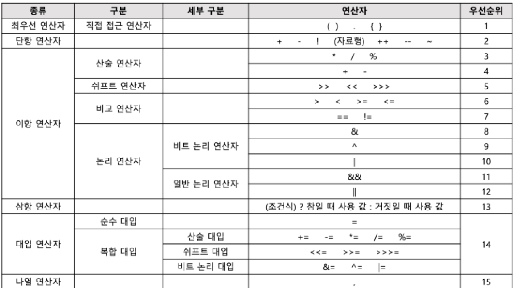

# 정보처리산업기사 - 시나공(실기)

# 응용 SW 기초 기술 활용

- 운영체제의 개념 (B)
    - 운영체제(OS; Operating System)
        - 운영체제는 컴퓨터 시스템의 자원들을 효율적으로 관리하며, 사용자가 컴퓨터를 편리하고 효과적으로 사용할 수 있도록 환경을 제공하는 여러 프로그램의 모임이다.
        - 컴퓨터 사용자와 컴퓨터 하드웨어 간의 인터페이스로 동작하는 시스템 소프트웨어의 일종이다.
        - 다른 응용 프로그램이 유용한 작업을 할 수 있도록 환경을 제공해준다.
        - 운영체제는 프로세스, 기억장치, 주변장치, 파일 등을 관리하는 기능을 수행한다.
        - 운영체제의 종류 : Windows, UNIX, LINUX, MaOS, MS-DOS 등
    - 운영체제의 목적
        - 운영체제의 목적에는 처리 능력 향상, 사용 가능도 향상, 신뢰도 향상, 반환 시간 단축 등이 있다.
            - 처리 능력(Throughput) : 일정 시간 내에 시스템이 처리하는 일의 양
            - 반환 시간(Turn Around Time) : 시스템에 작업을 의뢰한 시간부터 처리가 완료될 때까지 걸린 시간
            - 사용 가능도(Availability) : 시스템을 사용할 필요가 있을 때 즉시 사용 가능한 정도
            - 신뢰도(Reliability) : 시스템이 주어진 문제를 정확하게 해결하는 정도
    - 운영체제의 기능
        - 프로세서(처리기, Processor), 기억장치(주기억장치, 보조기억장치), 입-출력장치, 파일 및 정보 등의 자원을 관리한다.
        - 자원을 효율적으로 관리하기 위해 자원의 스케줄링 기능을 제공한다.
        - 사용자와 시스템 간의 편리한 인터페이스를 제공한다.
        - 시스템의 각종 하드웨어와 네트워크를 관리-제어한다.
        - 데이터를 관리하고, 데이터 및 자원의 공유 기능을 제공한다.
- 운영체제의 종류 (B)
    - Windows
        - Windows는 1990년대 마이크로소프트(Microsoft)사가 개발한 운영체제이다.
        - Windows의 주요 특징
            - 그래픽 사용자 인터페이스(GUI, Graphic User Interface) : 키보드로 명령어를 직접 입력하지 않고, 마우스로 아이콘이나 메뉴를 선택하여 모든 작업을 수행하는 방식
            - 선점형 멀티태스킹(Preemptive Multi-Tasking) : 동시에 여러 개의 프로그램을 실행하는 멀티태스킹을 하면서 운영체제가 각 작업의 CPU 이용 시간을 제어하여 응용 프로그램 실행중 문제가 발생하면 해당 프로그램을 강제 종료시키고 모든 시스템 자원을 반환하는 방식
            - PnP(Plug And Play, 자동 감지 기능) : 컴퓨터 시스템에 프린터나 사운드 카드 등의 하드웨어를 설치했을 때, 해당 하드웨어를 사용하는 데 필요한 시스템 환경을 운영체제가 자동으로 구성해 주는 기능
            - OLE(Object Linking and Embedding) : 다른 여러 응용 프로그램에서 작성된 문자나 그림 등의 개체(Object)를 현재 작성 중인 문서에 자유롭게 연결(Linking)하거나 삽입(Embedding)하여 편집할 수 있게 하는 기능
            - 255자의 긴 파일명 : \ / * ? “ <> |를 제외한 모든 문자 및 공백을 사용하여 최대 255자까지 파일 이름을 지정할 수 있음
            - Single-User 시스템 : 컴퓨터 한 대를 한 사람만이 독점해서 사용함
    - UNIX
        - UNIX는 1960년대 AT&T 벨(Bell) 연구소, MIT, General Electric이 공동 개발한 운영체제이다.
        - 시분할 시스템(Time Sharing System)을 위해 설계된 대화식 운영체제이다.
        - 소스가 공개된 개방형 시스템(Open System)이다.
        - 대부분 C 언어로 작성되어 있어 이식성이 높으며 장치, 프로세스 간의 호환성이 높다.
        - 다중 사용자(Multi-User), 다중 작업(Multi-Tasking)을 지원한다.
        - 트리(Tree) 구조의 파일 시스템을 갖는다.
    - UNIX 시스템의 구성
        - 커널(Kernel)
            - 하드웨어를 보호하고, 프로그램과 하드웨어 간의 인터페이스 역할을 담당
            - UNIX의 가장 핵심적인 부분
            - 프로세스(CPU 스케줄링) 관리, 기억장치 관리, 파일 관리, 입-출력 관리, 프로세스간 통신, 데이터 전송 및 변환 등 여러 가지 기능을 수행함.
        - 쉘(Shell)
            - 사용자의 명령어를 인식하여 프로그램을 호출하고 명령을 수행하는 명령어 해석기
            - 시스템과 사용자 간의 인터페이스를 담당
            - 종류 : Bourne Shell, C Shell, Korn Shell
        - 유틸리티 프로그램(Utility Program)
            - 일반 사용자가 작성한 응용 프로그램을 처리하는 데 사용
            - DOS에서의 외부 명령어에 해당
            - 종류 : 에디터, 컴파일러, 인터프리터, 디버거 등
    - LINUX
        - LINUX는 1991년 리누스 토발즈(Linus Torvalds)가 UNIX를 기반으로 개발한 운영체제이다.
        - 프로그램 소스 코드가 무료로 공개되어 있기 때문에 프로그래머가 원하는 기능을 추가할 수 있다.
        - 다양한 플랫폼에 설치하여 사용이 가능하며, 재배포가 가능하다.
        - UNIX와 완벽하게 호환된다.
        - 대부분의 특징이 UNIX와 동일하다.
    - MacOS
        - MaxOS는 1980년대 애플(Apple)사가 UNIX를 기반으로 개발한 운영체제이다.
        - 아이맥(iMac)과 맥북(MacBook)등 애플 사에서 생산하는 제품에서만 사용이 가능하다.
        - 드라이브 설치 및 install과 uninstall의 과정이 단순하다.
    - Android
        - Android는 구글(Google)사에서 개발한 리눅스 커널 기반의 개방형 모바일 운영체제이다.
        - 모든 코드가 공개된 개방형 소프트웨어이다.
        - 자바와 코틀린으로 애플리케이션을 작성한다.
        - 스마트폰 등의 휴대용 장치에서 주로 사용된다.
    - iOS
        - iOS는 애플(Apple)사에서 개발한 유닉스 기반의 모바일 운영체제이다.
        - 아이폰, 아이팟 터치, 아이패드 등에 내장된다.
        - 애플사 고유의 모바일 운영체제로 타사 제품은 iOS를 탑재할 수 없다.
- 운영체제 기본 명령어 (C)
    - Windows 기본 명령어
        - DIR : 현재 디렉터리의 파일 목록 표시
        - COPY : 파일 복사
        - DEL : 파일 삭제
        - TYPE : 파일 내용 표시
        - REN : 파일 이름 변경
        - MD : 디렉터리 생성
        - CD : 동일한 드라이브에서 디렉터리의 위치 변경
        - CLS : 화면의 내용을 지움
        - ATTRIB : 파일의 속성을 변경
        - FIND : 파일에서 문자열을 찾음
        - CHKDSK : 디스크 상태 점검
        - FORMAT : 디스크 표면을 트랙과 섹터로 나누어 초기화
        - MOVE : 파일을 이동
    - UNIX/LINUX 기본 명령어
        - cat : 파일 내용 화면에 표시
        - cd : 디렉터리 위치 변경
        - chmod : 파일의 보호 모드를 설정하여 파일의 사용 허가 지정
        - chown : 파일 소유자와 그룹 변경
        - cp : 파일 복사
        - rm : 파일 삭제
        - find : 파일 탐색
        - fsck : 파일 시스템을 검사하고 보수
        - kill : PID(프로세스 고유 번호)를 이용하여 프로세스 종료
        - fork : 새로운 프로세스 생성
        - killall : 프로세스의 이름을 이용하여 프로세스 종료
        - Is : 현재 디렉터리의 파일 목록 표시
        - mkdir : 디렉터리 생성
        - rmdir : 디렉터리 삭제
        - mv : 파일 이동
        - ps : 현재 실행중인 프로세스 표시
        - pwd : 현재 작업중인 디렉터리의 경로를 화면에 표시
        - top : 시스템의 프로세스와 메모리 사용 현황을 표시
        - who : 현재 시스템에 접속해 있는 사용자 표시
- 스케줄링 (A)
    - 스케줄링(Scheduling)의 개요
        - 스케줄링은 프로세스가 생성되어 실행될 때 필요한 시스템의 여러 자원을 해당 프로세스에게 할당하는 작업
        - 프로세스가 생성되어 완료될 때까지 프로세스는 여러 종류의 스케줄링 과정을 거치게 된다.
        - 스케줄링 기법은 다음 두 가지로 구분된다.
            - 비선점(Non-preemptive) 스케줄링
                - 이미 할당된 CPU를 다른 프로세스가 강제로 빼앗아 사용할 수 없는 기법
                - 종류 : FCFS(FIFO), SJF, HRN, 기한부, 우선순위 등
            - 선점(Preemptive) 스케줄링
                - 하나의 프로세스가 CPU를 할당받아 실행하고 있을 때 우선순위가 높은 다른 프로세스가 CPU를 강제로 빼앗아 사용할 수 있는 스케줄링 기법
                - 종류 : 선점 우선순위, SRT, Round Robin, 다단계 큐(MQ), 다단계 피드백 큐(MFQ)등
    - 비선점 스케줄링의 종류
        - FCFS(First Come First Service) = FIFO(First In First Out)
            - 준비상태 큐에 도착한 순서에 따라 차례로 CPU를 할당하는 기법
        - SJF(Shortest Job First)
            - 준비상태 큐에서 기다리고 있는 프로세스들 중에서 실행 시간이 가장 짧은 프로세스에게 먼저 CPU를 할당하는 기법
        - HRN(Highest Response-ratio Next)
            - 실행 시간이 긴 프로세스에게 불리한 SJF 기법을 보완하기 위한 것으로, 대기 시간과 서비스(실행) 시간을 이용하는 기법
            - 우선순위를 계산하여 그 숫자가 가장 높은 것부터 낮은 순으로 우선순위가 부여
        - 기한부(Deadline)
            - 프로세스에게 일정한 시간을 주어 그 시간 안에 프로세스를 완료하도록 하는 기법
            - 프로세스가 제한된 시간 안에 완료되지 않을 경우 제거되거나 처음부터 다시 실행해야 한다.
        - 우선순위(Priority)
            - 준비상태 큐에서 기다리는 각 프로세스마다 우선순위를 부여하여 그 중 가장 높은 프로세스에게 먼저 CPU를 할당하는 기법
            - 우선순위가 동일할 경우 FCFS 기법으로 CPU를 할당한다.
    - 선점 스케줄링의 종류
        - 선점 우선순위
            - 준비상태 큐의 프로세스들 중에서 우선순위가 가장 높은 프로세스에게 먼저 CPU를 할당하는 기법
        - SRT(Shortest Remaining Time)
            - 비선점 스케줄링인 SJF 기법을 선점 형태로 변경한 기법으로, 선점 SJF 기법이라고도 한다.
            - 현재 실행중인 프로세스의 남은 시간과 준비상태 큐에 새로 도착한 프로세스의 실행 시간을 비교하여 가장 짧은 실행 시간을 요구하는 프로세스에게 CPU를 할당한다.
        - RR(Round Robin)
            - 시분할 시스템(Time Sharing System)을 위해 고안된 방식으로, FCFS 알고리즘을 선점(Preemptive) 형태로 변형한 기법
            - FCFS 기법과 같이 준비상태 큐에 먼저 들어온 프로세스가 먼저 CPU를 할당받지만 각 프로세스는 시간 할당량(Time Slice, Quantum) 동안만 실행한 수 실행이 완료되지 않으면 다음 프로세스에게 CPU를 넘겨주고 준비상태 큐의 가장 뒤로 배치된다.
        - 다단계 큐 (MQ; Multi-level Queue)
            - 프로세스를 특정 그룹으로 분류할 수 있을 경우 그룹에 따라 각기 다른 준비상태 큐를 사용하는 기법
        - 다단계 피드백 큐(MFQ; Multi-level Feedback Queue)
            - 특정 그룹의 준비상태 큐에 들어간 프로세스가 다른 준비상태 큐로 이동할 수 없는 다단계 큐 기법을 준비상태 큐 사이를 이동할 수 있도록 개선한 기법
- 데이터베이스 개요 (A)
    - 데이터저장소
        - 데이터저장소는 데이터들을 논리적인 구조로 조직화하거나, 물리적인 공간에 구축한 것을 의미한다.
        - 논리 데이터저장소는 데이터 및 데이터 간의 연관성, 제약조건을 식별하여 논리적인 구조로 조직화한 것이다.
        - 물리 데이터저장소는 논리 데이터저장소를 소프트웨어가 운용될 환경의 물리적 특성을 고려하여 실제 저장장치에 저장한 것을 의미한다.
    - 데이터베이스(Database)
        - 데이터베이스는 여러 사람에 의해 공동으로 사용될 데이터를 중복을 배제하여 통합하고, 쉽게 접근하여 처리할 수 있도록 저장장치에 저장하여 항상 사용할 수 있도록 운영하는 운영 데이터이다.
        - 데이터베이스는 다음과 같이 구분하여 정의할 수 있다.
            - 통합된 데이터(Integrated Data) : 자료의 중복을 배제한 데이터의 모임
            - 저장된 데이터(Stored Data) : 컴퓨터가 접근할 수 있는 저장 매체에 저장된 자료
            - 운영 데이터(Operational Data) : 조직의 고유한 업무를 수행하는 데 반드시 필요한 자료
            - 공용 데이터(Shared Data) : 여러 응용 시스템들이 공동으로 소유하고 유지하는 자료
    - DBMS(DataBase Management System; 데이터베이스 관리 시스템)
        - DBMS는 사용자의 요구에 따라 정보를 생성해주고, 데이터베이스를 관리해주는 소프트웨어이다.
        - 기존의 파일 시스템이 갖는 데이터의 종속성과 중복성의 문제를 해결하기 위해 제안된 시스템이다.
        - DBMS의 필수 기능 3가지
            - 정의(Definition) 기능 : 데이터의 형(Type)과 구조에 대한 정의, 이용 방식, 제약 조건 등을 명시하는 기능
            - 조작(Manipulation) 기능 : 데이터 검색, 갱신, 삽입, 삭제 등을 위해 인터페이스 수단을 제공하는 기능
            - 제어(Control) 기능 : 데이터의 무결성, 보안, 권한 검사, 병행 제어를 제공하는 기능
        - 데이터의 독립성
            - 데이터의 독립성은 종속성에 대비되는 말로 논리적 독립성과 물리적 독립성이 있다.
                - 논리적 독립성 : 응용 프로그램과 데이터베이스를 독립시킴으로써, 데이터의 논리적 구조를 변경시키더라도 응용 프로그램은 영향을 받지 않음
                - 물리적 독립성 : 응용 프로그램과 보조기억장치 같은 물리적 장치를 독립시킴으로써, 디스크를 추가/변경하더라도 응용 프로그램은 영향을 받지 않음
        - 스키마(Schema)
            - 스키마는 데이터베이스의 구조와 제약조건에 관한 전반적인 명세를 기술한 것이다.
                - 외부 스키마
                    - 사용자나 응용 프로그래머가 각 개인의 입장에서 필요로 하는 데이터베이스의 논리적 구조를 정의한 것
                - 개념 스키마
                    - 데이터베이스의 전체적인 논리적 구조
                    - 모든 응용 프로그램이나 사용자들이 필요로 하는 데이터를 종합한 조직 전체의 데이터베이스로, 하나만 존재함
                - 내부 스키마
                    - 물리적 저장장치의 입장에서 본 데이터베이스 구조
                    - 실제로 저장될 레코드의 형식, 저장 데이터 항목의 표현 방법, 내부 레코드의 물리적 순서 등을 나타낸다.
- 데이터베이스 설계 (A)
    - 데이터베이스 설계
        - 데이터베이스 설계는 분석하여 그것들을 컴퓨터에 저장할 수 있는 데이터베이스의 구조에 맞게 변형한 후 DBMS로 데이터베이스를 구현하여 일반 사용자들이 사용하게 하는 것이다.
    - 데이터베이스 설계 시 고려사항
        - 무결성 : 삽입, 삭제, 갱신 등의 연산 후에도 데이터베이스에 저장된 데이터가 정해진 제약 조건을 항상 만족해야 함.
        - 일관성 : 데이터베이스에 저장된 데이터들 사이나, 특정 질의에 대한 응답이 처음부터 끝까지 변함없이 일정해야 함.
        - 회복 : 시스템에 장애가 발생했을 때 장애 발생 직전의 상태로 복구할 수 있어야 함.
        - 보안 : 불법적인 데이터의 노출 또는 변경이나 손실로부터 보호할 수 있어야 함.
        - 효율성 : 응답시간의 단축, 시스템의 생산성, 저장 공간의 최적화 등이 가능해야 함.
        - 데이터베이스 확장 : 데이터베이스 운영에 영향을 주지 않으면서 지속적으로 데이터를 추가할 수 있어야 함.
    - 데이터베이스 설계 순서
        1. 요구 조건 분석 : 요구 조건 명세서 작성
        2. 개념적 설계 : 개념 스키마, 트랜잭션 모델링, E-R 모델
        3. 논리적 설계 : 목표 DBMS에 맞는 논리 스키마 설계, 트랜잭션 인터페이스 설계
        4. 물리적 설계 : 목표 DBMS에 맞는 물리적 구조의 데이터로 변환
        5. 구현 : 목표 DBMS의 DDL(데이터 정의어)로 데이터베이스 생성, 트랜잭션 작성
    - 요구 조건 분석
        - 요구 조건 분석은 데이터베이스를 사용할 사람들로부터 필요한 용도를 파악하는 것이다.
        - 데이터베이스 사용자에 따른 수행 업무와 필요한 데이터의 종류, 용도, 처리 형태, 흐름, 제약 조건 등을 수집한다.
        - 수집된 정보를 바탕으로 요구 조건 명세를 작성한다.
    - 개념적 설계(정보 모델링, 개념화)
        - 개념적 설계는 정보의 구조를 얻기 위하여 현실 세계의 무한성과 계속성을 이해하고, 다른 사람과 통신하기 위하여 현실 세계에 대한 인식을 추상적 개념으로 표현하는 과정이다.
        - 개념적 설계에서는 개념 스키마 모델링과 트랜잭션 모델링을 병행 수행한다.
        - 개념적 설계에서는 요구 분석에서 나온 결과인 요구 조건 명세를 DBMS에 독립적인 E-R 다이어그램으로 작성한다.
        - DBMS에 독립적인 개념 스키마를 설계한다.
    - 논리적 설계(데이터 모델링)
        - 논리적 설계는 현실 세계에서 발생하는 자료를 컴퓨터가 이해하고 처리할 수 있는 물리적 저장장치에 저장할 수 있도록 변환하기 위해 특정 DBMS가 지원하는 논리적 자료 구조로 변환(mapping)시키는 과정이다.
        - 개념 세계의 데이터를 필드로 기술된 데이터 타입과 이 데이터 타입들 간의 관계로 표현되는 논리적 구조의 데이터로 모델화한다.
        - 개념적 설계가 개념 스키마를 설계하는 단계라면, 논리적 설계에서는 개념 스키마를 평가 및 정제하고 DBMS에 따라 서로 다른 논리적 스키마를 설계하는 단계이다.
        - 트랜잭션의 인터페이스를 설계한다.
    - 물리적 설계(데이터 구조화)
        - 물리적 설계는 논리적 설계에서 논리적 구조로 표현된 데이터를 디스크 등의 물리적 저장장치에 저장할 수 있는 물리적 구조의 데이터로 변환하는 과정이다.
        - 물리적 설계에서는 다양한 데이터베이스 응용에 대해 처리 성능을 얻기 위해 데이터베이스 파일의 저장 구조 및 엑세스 경로를 결정한다.
        - 저장 레코드의 형식, 순서, 접근 경로, 조회 집중 레코드 등의 정보를 사용하여 데이터가 컴퓨터에 저장되는 방법을 묘사한다.
    - 데이터베이스 구현
        - 데이터베이스 구현은 논리적 설계와 물리적 설계에서 도출된 데이터베이스 스키마를 파일로 생성하는 과정이다.
        - 사용하려는 특정 DBMS의 DDL(데이터 정의어)을 이용하여 데이터베이스 스키마를 기술한 후 컴파일하여 빈 데이터베이스 파일을 생성한다.
        - 응용 프로그램을 위한 트랜잭션을 작성한다.
        - 데이터베이스 접근을 위한 응용 프로그램을 작성한다.
- E-R(개체-관계) 모델 (B)
    - E-R(Entity-Relationship, 개체-관계) 모델
        - E-R 모델은 개체와 개체 간의 관계를 기본 요소로 이용하여 현실 세계의 무질서한 데이터를 개념적인 논리 데이터로 표현하기 위한 방법이다.
        - E-R 모델은 1976년 피터 첸(Peter Chen)에 의해 제안되고 기본적인 구성 요소가 정립되었다.
        - E-R 모델은 개념적 데이터 모델의 가장 대표적인 것이다.
        - E-R 모델은 개체 타입(Entity Type)과 이들 간의 관계 타입(Relationship Type)을 이용해 현실 세계를 개념적으로 표현한다.
        - E-R 모델에서는 데이터를 개체(Entity), 관계(Relationship), 속성(Attribute)으로 묘사한다.
        - E-R 다이어그램으로 표현하며, 1:1, 1:N, N:M 등의 관계 유형을 제한 없이 나타낼 수 있다.
    - E-R 다이어그램
        
        
        
- 관계형 데이터베이스의 구조 / 관계형 데이터 모델  (A)
    - 관계형 데이터베이스
        - 관계형 데이터베이스는 2차원적인 표(Table)을 이용해서 데이터 상호 관계를 정의하는 데이터베이스이다.
        - 1970년 IBM에 근무하던 코드(E. F. Codd)에 의해 처음 제안되었다.
        - 개체(Entity)와 관계(Relationship)를 모두 릴레이션(Relation)이라는 표(Table)로 표현하기 때문에 개체를 표현하는 개체 릴레이션과 관계를 표현하는 관계 릴레이션이 존재한다.
        - 장점 : 간결하고 보기 편리하며, 다른 데이터베이스로의 변환이 용이하다.
        - 단점 : 성능이 다소 떨어진다.
    - 관계형 데이터베이스의 릴레이션 구조
        - 릴레이션(Relation)은 데이터들을 표(Table)의 형태로 표현한 것으로, 구조를 나타내는 릴레이션 스키마와 실제 값들인 릴레이션 인스턴스로 구성된다.
            
            
            
    - 튜플(Tuple)
        - 튜플은 릴레이션을 구성하는 각각의 행을 말한다.
        - 튜플은 속성의 모임으로 구성된다.
        - 파일 구조에서 레코드와 같은 의미이다.
        - 튜플의 수를 카디널리티(Cardinality) 또는 기수, 대응수라고 한다.
    - 속성(Attribute)
        - 속성은 데이터베이스를 구성하는 가장 작은 논리적 단위이다.
        - 파일 구조상의 데이터 항목 또는 데이터 필드에 해당된다.
        - 속성은 개체의 특성을 기술한다.
        - 속성의 수를 디그리(Degree) 또는 차수라고 한다.
    - 도메인(Domain)
        - 도메인은 하나의 애트리뷰트가 취할 수 있는 같은 타입의 원자(Atomic)값들의 집합이다.
        - 도메인은 실제 애트리뷰트 값이 나타날 때 그 값의 합법 여부를 시스템이 검사하는데에도 이용된다.
    - 릴레이션의 특징
        - 한 릴레이션에는 똑같은 튜플이 포함될 수 없으므로 릴레이션에 포함된 튜플들은 모두 상이하다.
        - 한 릴레이션에 포함된 튜플 사이에는 순서가 없다.
        - 튜플들의 삽입, 삭제 등의 작업으로 인해 릴레이션은 시간에 따라 변한다.
        - 릴레이션 스키마를 구성하는 속성들 간의 순서는 중요하지 않다.
        - 속성의 유일한 식별을 위해 속성의 명칭은 유일해야 하지만, 속성을 구성하는 값은 동일한 값이 있을 수 있다.
        - 릴레이션을 구성하는 튜플을 유일하게 식별하기 위해 속성들의 부분집합을 키(Key)로 설정한다.
        - 속성의 값은 논리적으로 더 이상 쪼갤 수 없는 원자값만을 저장한다.
    - 관계형 데이터 모델(Relational Data Model)
        - 관계형 데이터 모델은 2차원적인 표(Table)을 이용해서 데이터 상호 관계를 정의하는 DB 구조를 말한다.
        - 가장 널리 사용되는 데이터 모델이다.
        - 파일 구조처럼 구성한 테이블들을 하나의 DB로 묶어서 테이블 내에 있는 속성들 간의 관계(Relationship)을 설정하거나 테이블 간의 관계를 설정하여 이용한다.
        - 기본키(Primary Key)와 이를 참조하는 외래키(Foreign Key)로 데이터 간의 관계를 표현한다.
        - 계층 모델과 망 모델의 복잡한 구조를 단순화시킨 모델이다.
        - 관계형 모델의 대표적인 언어는 SQL이다.
        - 1:1, 1:N, N:M 관계를 자유롭게 표현할 수 있다.
- 트랜잭션 분석 / CRUD 분석 (A)
    - 트랜잭션(Transaction)
        - 트랜잭션은 데이터베이스의 상태를 변환시키는 하나의 논리적 기능을 수행 하기 위한 작업의 단위 또는 한꺼번에 모두 수행되어야 할 일련의 연산들을 의미한다.
        - 트랜잭션은 데이터베이스 시스템에서 병행 제어 및 회복 작업 시 처리되는 작업의 논리적 단위로 사용된다.
        - 트랜잭션은 사용자가 시스템에 대한 서비스 요구 시 시스템이 응답하기 위한 상태 변환 과정의 작업 단위로 사용된다.
    - 트랜잭션의 특성
        - Atomicity(원자성)
            - 트랜잭션의 연산은 데이터베이스에 모두 반영되도록 완료(Commit)되든지 아니면 전혀 반영되지 않도록 복구(Rollback)되어야 한다.
            - 관련 데이터베이스 기능 : 회복
        - Consistency(일관성)
            - 트랜잭션이 그 실행을 성공적으로 완료하면 언제나 일관성 있는 데이터베이스 상태로 변환한다.
            - 관련 데이터베이스 기능 : 무결성 제약 조건, 동시성 제어
        - Isolation(독립성, 격리성, 순차성)
            - 둘 이상의 트랜잭션이 동시에 병행 실행되는 경우 어느 하나의 트랜잭션 실행 중에 다른 트랜잭션의 연산이 끼어들 수 없다.
            - 관련 데이터베이스 기능 : 동시성 제어
        - Durability(영속성, 지속성)
            - 성공적으로 완료된 트랜잭션의 결과는 시스템이 고장나더라도 영구적으로 반영되어야 한다.
            - 관련 데이터베이스 기능 : 회복
    - CRUD 분석
        - CURD 분석은 프로세스와 테이블 간에 CRUD 매트릭스를 만들어서 트랜잭션을 분석하는 것이다.
        - CRUD 분석을 통해 많은 트랜잭션이 몰리는 테이블을 파악할 수 있으므로 디스크 구성 시 유용한 자료로 활용할 수 있다.
        - CRUD 매트릭스
            - 2차원 형태의 표로서, 행(Row)에는 프로세스를, 열(Column)에는 테이블을, 행과 열이 만나는 위치에는 프로세스가 테이블에 발생시키는 변화를 표시하여 프로세스와 데이터 간의 관계를 분석하는 분석표이다.
            - CRUD 매트릭스를 통해 트랜잭션이 테이블에 수행하는 작업을 검증한다.
            - CRUD 매트릭스의 각 셀에는 Create, Read, Update, Delete의 앞 글자가 들어가며, 복수의 변화를 줄 때는 기본적으로 ‘C > D > U > R’의 우선순위를 적용하여 한 가지만 적지만, 활용 목적에 따라 모두 기록할 수 있다.
            - CRUD 매트릭스가 완성되었다면 C, R, U, D 중 어느 것도 적히지 않은 행이나 열, C나 R이 없는 열을 확인하여 불필요하거나 누락된 테이블 또는 프로세스를 찾는다.
                
                %20e2a1f2fc2ed54fe2bfdae94d14ebee7a/Untitled.png)
                
    - 트랜잭션 분석
        - 트랜잭션 분석은 CRUD 매트릭스를 기반으로 테이블에 발생하는 트랜잭션 양을 분석하여 테이블에 저장되는 데이터의 양을 유추하고 이를 근거로 DB의 용량 산정 및 구조의 최적화를 목적으로 한다.
        - 트랜잭션 분석은 업무 개발 담당자가 수행한다.
        - 트랜잭션 분석을 통해 프로세스가 과도하게 접근하는 테이블을 확인할 수 있으며, 이러한 집중 접근 테이블을 여러 디스크에 분산 배치함으로써 디스크 입-출력 향상을 통한 성능 향상을 가져올 수 있다.
        - 트랜잭션 분석서
            - 단위 프로세스와 CRUD 매트릭스를 이용하여 작성한다.
            - 구성 요소 : 단위 프로세스, CRUD 연산, 테이블명, 컬럼명, 테이블 참조 횟수, 트랜잭션 수, 발생 주기 등
            
            %20e2a1f2fc2ed54fe2bfdae94d14ebee7a/Untitled%201.png)
            
- 인터넷 (A)
    - 인터넷(Internet)
        - 인터넷이란 TCP/IP 프로토콜을 기반으로 하여 전 세계 수많은 컴퓨터와 네트워크들이 연결된 광범위한 컴퓨터 통신망이다.
        - 인터넷에 연결된 모든 컴퓨터는 고유한 IP 주소를 갖는다.
    - IP 주소(Internet Protocol Address)
        - IP 주소는 인터넷에 연결된 모든 컴퓨터 자원을 구분하기 위한 고유한 주소다.
        - 8비트씩 4부분, 총 32비트로 구성되어 있다.
        - IP 주소는 네트워크 부분의 길이에 따라 다음과 같이 A 클래스에서 E 클래스까지 총 5단계로 구성되어 있다.
            
            %20e2a1f2fc2ed54fe2bfdae94d14ebee7a/%25EC%2582%25AC%25EB%25B3%25B8_-KakaoTalk_20230311_231629614.jpg)
            
    - 서브네팅(Subnetting)
        - 서브네팅은 할당된 네트워크 주소를 다시 여러 개의 작은 네트워크로 나누어 사용하는 것을 말한다.
        - 4바이트의 IP 주소 중 네트워크 주소와 호스트 주소를 구분하기 위한 비트를 서브넷 마스크(Subnet Mask)라고 하며, 이를 변경하여 네트워크 주소를 여러 개로 분할하여 사용한다.
        - 서브넷 마스크는 각 클래스마다 다르게 사용된다.
    - IPv6(Internet Protocol version 6)
        - IPv6는 현재 사용하고 있는 IP 주소 체계인 IPv4의 주소 부족 문제를 해결하기 위해 개발되었다.
        - 128비트의 긴 주소를 사용하여 주소 부족 문제를 해결할 수 있다.
        - IPv4에 비해 자료 전송 속도가 빠르다.
        - 인증성, 기밀성, 데이터 무결성의 지원으로 보안 문제를 해결할 수 있다.
        - 주소의 확장성, 융통성, 연동성이 뛰어나다.
        - 실시간 흐름 제어로 향상된 멀티미디어 기능을 지원한다.
        - 패킷 크기를 확장할 수 있으므로 패킷 크기에 제한이 없다.
        - 기본 헤더 뒤에 확장 헤더를 더함으로써 더욱 다양한 정보의 저장이 가능해져 네트워크 기능 확장이 용이하다.
        - IPv4와 호환성이 뛰어나다.
    - IPv6의 구성
        - 16비트씩 8부분, 총 128비트로 구성되어 있다.
        - 각 부분을 16진수로 표현하고, 콜론(:)으로 구분한다.
        - IPv6는 다음과 같이 세 가지 주소 체계로 나누어진다.
            - 유니캐스트(Unicast) : 단일 송신자와 단일 수신자 간의 통신 ( 1:1)
            - 멀티캐스트(Multicast) : 단일 송신자와 다중 수신자 간의 통신 (1 : 다)
            - 애니캐스트(Anycast) : 단일 송신자와 가장 가까이 있는 단일 수신자 간의 통신 (1 : 1)
    - 도메인 네임(Domain Name)
        - 도메인 네임은 숫자로 된 IP 주소를 사람이 이해하기 쉬운 문자 형태로 표현한 것이다.
        - 호스트 컴퓨터 이름, 소속 기관 이름, 소속 기관의 종류, 소속 국가명 순으로 구성되며, 왼쪽에서 오른쪽으로 갈수록 상위 도메인을 의미한다.
        - 문자로 된 도메인 네임을 컴퓨터가 이해할 수 있는 IP주소로 변환하는 역할을 하는 시스템을 DNS(Domain Name System)라고 하며 이런 역할을 하는 서버를 DNS 서버라고 한다.
- OSI 참조 모델 (A)
    - OSI(Open System Interconnection) 참조 모델
        - OSI 참조 모델은 다른 시스템 간의 원활한 통신을 위해 ISO(국제표준화기구)에서 제안한 통신 규약(Protocol)이다.
        - OSI 7계층은 1~3 계층을 하위 계층, 4~7 계층을 상위 계층이라고 한다.
        - 하위 계층 : 물리 계층 → 데이터 링크 계층 → 네트워크 계층
        - 상위 계층 : 전송 계층 → 세션 계층 → 표현 계층 → 응용 계층
    - 물리 계층(Physical Layer)
        - 물리 계층은 전송에 필요한 두 장치 간의 실제 접속과 절단 등 기계적, 전기적, 기능적, 절차적 특성에 대한 규칙을 정의한다.
        - 물리적 전송 매체와 전송 신호 방식을 정의한다.
        - RS-232C, X.21 등의 표준이 있다.
        - 관련 장비 : 리피터, 허브
    - 데이터 링크 계층(Data Link Layer)
        - 데이터 링크 게층은 두 개의 인접한 개방 시스템들 간에 신뢰성 있고 효율적인 정보 전송을 할 수 있도록 시스템 간 연결 설정과 유지 및 종료를 담당한다.
        - 송신 측과 수신 측의 속도 차이 해결을 위한 흐름 제어 기능을 한다.
        - 프레임의 시작과 끝을 구분하기 위한 프레임의 동기화 기능을 한다.
        - 오류의 검출과 회복을 위한 오류 제어 기능을 한다.
        - 프레임의 순서적 전송을 위한 순서 제어 기능을 한다.
        - HDLC, LAPB, LLC, MAC, LAPD, PPP 등의 표준이 있다.
        - 관련 장비 : 랜카드, 브리지, 스위치
    - 네트워크 계층(Network Layer, 망 계층)
        - 네트워크 계층은 개방 시스템들 간의 네트워크 연결을 관리하는 기능과 데이터의 교환 및 중계 기능을 한다.
        - 네트워크 연결을 설정, 유지, 해제하는 기능을 한다.
        - 경로 설정(Rounting), 데이터 교환 및 중계, 트래픽 제어, 패킷 정보 전송을 수행한다.
        - X.25, IP 등의 표준이 있다.
        - 관련 장비 : 라우터
    - 전송 계층(Transport Layer)
        - 전송 계층은 논리적 안정과 균일한 데이터 전송 서비스를 제공함으로써 종단 시스템(End-to-End) 간에 투명한 데이터 전송을 가능하게 한다.
        - OSI 7계층 중 하위 3계층과 상위 3계층의 인터페이스(Interface)를 담당한다.
        - 종단 시스템 간의 전송 연결 설정, 데이터 전송, 연결 해제 기능을 한다.
        - 주소 설정, 다분화(분할 및 재조립), 오류 제어, 흐름 제어를 수행한다.
        - TCP, UDP 등의 표준이 있다.
        - 관련 장비 : 게이트웨이
    - 세션 계층(Session Layer)
        - 세션 계층은 송-수신 간의 관련성을 유지하고 대화 제어를 담당한다.
        - 대화(회화) 구성 및 동기 제어, 데이터 교환 관리 기능을 한다.
        - 동기점은 오류가 있는 데이터의 회복을 위해 사용하는 것으로, 종류에는 소동기점과 대동기점이 있다.
    - 표현 계층(Presentation Layer)
        - 표현 계층은 응용 계층으로부터 받은 데이터를 세션 계층에 보내기 전에 통신에 적당한 형태로 변환하고, 세션 계층에서 받은 데이터는 응용 계층에 맞게 변환하는 기능을 한다.
        - 서로 다른 데이터 표현 형태를 갖는 시스템 간의 상호 접속을 위해 필요한 계층이다.
        - 코드 변환, 데이터 암호화, 데이터 압축, 구문 검색, 정보 형식(포맷) 변환, 문맥관리 기능을 한다.
    - 응용 계층(Application Layer)
        - 응용 계층은 사용자(응용 프로그램)가 OSI 환경에 접근할 수 있도록 서비스를 제공한다.
        - 응용 프로세스 간의 정보 교환, 전자 사서함, 파일 전송, 가상 터미널 등의 서비스를 제공한다.
- 네트워크 관련 장비 (B)
    - 네트워크 인터페이스 카드(NIC; Network Interface Card)
        - 네트워크 인터페이스 카드는 컴퓨터와 컴퓨터 또는 컴퓨터와 네트워크를 연결하는 장치이다.
        - 정보 전송 시 정보가 케이블을 통해 전송될 수 있도록 정보 형태를 변경한다.
        - 이더넷 카드(LAN 카드) 혹은 네트워크 어댑터라고도 한다.
    - 허브(Hub)
        - 허브는 한 사무실이나 가까운 거리의 컴퓨터들을 연결하는 장치로, 각각의 회선을 통합하여 관리한다.
        - 허브는 신호 증폭 기능을 하는 리피터의 역할을 포함한다.
        - 허브 종류
            - 더미 허브(Dummy Hub) : 네트워크에 흐르는 모든 데이터를 단순히 연결하는 기능만 제공하는 허브
            - 스위칭 허브(Switching Hub) : 네트워크상에 흐르는 데이터의 유무 및 흐름을 제어하여 각각의 노드가 허브의 최대 대역폭을 사용할 수 있는 지능형 허브
    - 리피터(Repeater)
        - 리피터는 거리가 증가할수록 감쇠하는 디지털 신호의 장거리 전송을 위해 수신한 신호를 재생시키거나 출력 전압을 높여 전송하는 장치이다.
        - OSI 참조 모델의 물리 계층에서 동작하는 장비이다.
        - 전송 거리의 연장 또는 배선의 자유도를 높이기 위한 용도로 사용된다.
    - 브리지(Bridge)
        - 브리지는 LAN과 LAN을 연결하거나 LAN 안에서의 컴퓨터 그룹을 연결하는 장치이다.
        - 네트워크의 수많은 단말기들에 의해 발생되는 트래픽 병목 현상을 줄일 수 있다.
        - 네트워크를 분산적으로 구성할 수 있어 보안성을 높일 수 있다.
        - 브리지를 이용한 서브넷(Subnet) 구성 시 전송 가능한 회선 수는 브리지가 n개일 때, n(n01)/2이다.
    - 스위치(Switch)
        - 스위치는 브리지와 같이 LAN과 LAN을 연결하여 훨씬 더 큰 LAN을 만드는 장치이다.
        - 하드웨어를 기반으로 처리하므로 전송 속도가 빠르다.
        - 포트마다 서로 다른 전송 속도를 지원하게 제어할 수 있다.
        - 수십에서 수백 개의 포트를 제공한다.
        - OSI 참조 모델의 데이터 링크 계층에서 사용된다.
    - 라우터(Router)
        - 라우터는 브리지와 같이 LAN과 LAN의 연결 기능에 데이터 전송의 최적 경로를 선택하는 기능이 추가된 장치이다.
        - 서로 다른 LAN 또는 LAN과 WAN을 연결하는 기능도 한다.
        - OSI 참조 모델의 네트워크 계층에서 동작하는 장비이다.
        - 3계층, 즉 네트워크 계층까지의 프로토콜 구조가 다른 네트워크 간의 연결을 위해 프로토콜 변환 기능을 수행한다.
    - 게이트웨이(Gateway)
        - 게이트웨이는 OSI 전 계층의 프로토콜 구조가 다른 네트워크를 연결하는 장치이다.
        - LAN에서 다른 네트워크에 데이터를 보내거나 다른 네트워크로부터 데이터를 받아들이는 출입구 역할을 한다.
        - 세션 계층, 표현 계층, 응용 계층 간을 연결하여 데이터 형식 변환, 주소 변환, 프로토콜 변환 등을 수행한다.
- TCP/IP (A)
    - 프로토콜(Protocol)
        - 프로토콜은 서로 다른 기기들 간의 데이터 교환을 원활하게 수행할 수 있도록 표준화시켜 놓은 통신 규약이다.
        - 프로토콜의 기본 요소
            - 구문(Syntax) : 전송하고자 하는 데이터의 형식, 부호화, 신호 레벨 등을 규정함
            - 의미(Semantics) : 두 기기 간의 효율적이고 정확한 정보 전송을 위한 협조 사항과 오류 관리를 위한 제어 정보를 규정함
            - 시간(Timing) : 두 기기 간의 통신 속도, 메시지의 순서 제어 등을 규정함
        - 프로토콜의 기능 : 단편화와 재결합, 캡슐화, 흐름 제어, 오류 제어, 동기화, 순서 제어, 주소 지정, 다중화, 경로 제어, 전송 서비스 등
    - TCP/IP(Transmission Control Protocol/Internet Protocol)
        - TCP/IP는 인터넷에 연결된 서로 다른 기종의 컴퓨터들이 데이터를 주고받을 수 있도록 하는 표준 프로토콜이다.
            - TCP(transmission Control Protocol)
                - OIS 7계층의 전송 계층에 해당한다
                - 가상 회선 방식을 기반으로 연결형 서비스를 제공한다.
                - 패킷의 다중화, 순서 제어, 오류 제어, 흐름 제어 기능을 제공한다.
            - IP (Internet Protocol)
                - OIS 7계층의 네트워크 계층에 해당한다.
                - 데이터그램 방식을 기반으로 하는 비연결형 서비스를 제공한다.
                - 패킷의 분해/조립, 주소 지정, 경로 선택 기능을 제공한다.
    - TCP/IP의 구조
        - TCP/IP 응용 계층
            - OSI 응용 계층, 표현 계층, 세션 계층
            - 응용 프로그램 간의 데이터 송-수신 제공
            - TELNET, FTP, SMTP, SNMP, DNS, HTTP 등
        - TCP/IP 전송 계층
            - OSI 전송 계층
            - 호스트들 간의 신뢰성 있는 통신 제공
            - TCP, UDP, RTCP
        - TCP/IP 인터넷 계층
            - OSI 네트워크 계층
            - 데이터 전송을 위한 주소 지정, 경로 설정을 제공
            - IP, ICMP, IGMP, ARP, RARP
        - TCP/IP 네트워크 액세스 계층
            - OSI 데이트 링크 계층, 물리 계층
            - 실제 데이터(프레임)를 송-수신하는 역할
            - Ethernet, IEEE 802, HDLC, X.25, RS-232C, ARQ 등
    - 응용 계층의 주요 프로토콜
        - FTP(File Transfer Protocol)
            - 컴퓨터와 컴퓨터 또는 컴퓨터와 인터넷 사이에서 파일을 주고받을 수 있도록 하는 원격 파일 전송 프로토콜
            - 기본 포트 번호는 21번이지만 다른 번호로 변경할 수 있다.
        - SMTP(Simple Mail Transfer Protocol)
            - 전자 우편을 교환하는 서비스
        - TELNET
            - 멀리 떨어져 있는 컴퓨터에 접속하여 자신의 컴퓨터처럼 사용할 수 있도록 해주는 서비스
            - 프로그램을 실행하는 등 시스템 관리 작업을 할 수 있는 가상의 터미널(Virtual Termianal) 기능을 수행한다.
        - SNMP(Simple Network Management Protocol)
            - TCP/IP의 네트워크 관리 프로토콜로, 라우터나 허브 등 네트워크 기기의 네트워크 정보를 네트워크 관리 시스템에 보내는데 사용되는 표준 통신 규약
        - DNS(Domain Name System)
            - 도메인 네임을 IP 주소로 매핑(Mapping)하는 시스템
        - HTTP(HyperText Transfer Protocol)
            - 월드 와이드 웹(WWW)에서 HTML 문서를 송수신 하기 위한 표준 프로토콜
    - 전송 계층의 주요 프로토콜
        - TCP(Transmission Control Protocol)
            - 양방향 연결(Full Duplex Connection)형 서비스를 제공한다.
            - 가상 회선 연결(Virtual Circuit Connection) 형태의 서비스를 제공한다.
            - 스트림 위주의 전달(패킷 단위)을 한다.
            - 신뢰성 있는 경로를 확립하고 메시지 전송을 감독한다.
            - 순서 제어, 오류 제어, 흐름 제어 기능을 한다.
            - 패킷의 분실, 손상, 지연이나 순서가 틀린 것 등이 발생할 때 투명성이 보장되는 통신을 제공한다.
            - TCP 프로토콜의 헤더는 기본적으로 20Byte에서 60Byte까지 사용할 수 있는데, 선택적으로 40Byte를 더 추가할 수 있으므로 최대 100Byte까지 크기를 확장할 수 있다.
        - UDP(User Datagram Protocol)
            - 데이터 전송 전에 연결을 설정하지 않는 비연결형 서비스를 제공한다.
            - TCP에 비해 상대적으로 단순한 헤더 구조를 가지므로, 오버헤드가 적고, 흐름 제어나 순서 제어가 없어 전송 속도가 빠르다.
            - 고속의 안정성 있는 전송 매체를 사용하여 빠른 속도를 필요로 하는 경우, 동시에 여러 사용자에게 데이터를 전달할 경우, 정기적으로 반복해서 전송할 경우에 사용한다.
            - 실시간 전송에 유리하며, 신뢰성보다는 속도가 중요시되는 네트워크에서 사용된다.
            - UDP 헤더에는 Source Port Number, Destination Port Number, Length, Checksum 등이 포함된다.
        - RTCP(Real-Time Control Protocol)
            - RTP(Real-time Transport Protocol) 패킷의 전송 품질을 제어하기 위한 제어 프로토콜
            - 세션(Session)에 참여한 각 참여자들에게 주기적으로 제어 정보를 전송한다.
            - 하위 프로토콜은 데이터 패킷과 제어 패킷의 다중화(Multiplexing)를 제공한다.
            - 데이터 전송을 모니터링하고 최소한의 제어와 인증 기능만 제공한다.
            - RTCP 패킷은 항상 32비트의 경계로 끝난다.
    - 인터넷 계층의 주요 프로토콜
        - IP(Internet Protocol)
            - 전송할 데이터에 주소를 지정하고, 경로를 설정하는 기능을 한다.
            - 비연결형인 데이터그램 방식을 사용하는 것으로 신뢰성이 보장되지 않는다.
        - ICMP(Internet Control Message Protocol, 인터넷 제어 메시지 프로토콜)
            - IP와 조합하여 통신중에 발생하는 오류의 처리와 전송 경로 변경 등을 위한 제어 메시지를 관리하는 역할을 한다.
            - 헤더는 8Byte로 구성된다.
        - IGMP(Internet Group Management Protocol, 인터넷 그룹 관리 프로토콜)
            - 멀티캐스트를 지원하는 호스트나 라우터 사이에서 멀티캐스트 그룹 유지를 위해 사용된다.
        - ARP(Address Resolution Protocol, 주소 분석 프로토콜)
            - 호스트의 IP 주소를 호스트와 연결된 네트워크 접속 장치의 물리적 주소(MAC Address)로 바꾼다.
        - RARP(Reverse Address Resolution Protocol)
            - ARP와 반대로 물리적 주소를 IP주소로 변환하는 기능을 한다.
    - 네트워크 액세스 계층의 주요 프로토콜
        - Ethernet(IEEE 802.3)
            - CSMA/CD 방식의 LAN
        - IEEE 802
            - LAN을 위한 표준 프로토콜
        - HDLC
            - 비트 위주의 데이터 링크 제어 프로토콜
        - X.25
            - 패킷 교환망을 통한 DTE와 DCD 간의 인터페이스를 제공하는 프로토콜
        - RS-232C
            - 공중 전화 교환망(PSTN)을 통한 DTE와 DCE 간의 인터페이스를 제공하는 프로토콜
- 스위치 (C)
    - 스위치(Switch) 분류
        - 스위치는 브리지와 같이 LAN과 LAN을 연결하여 훨씬 더 큰 LAN을 만드는 장치이다.
        - 스위치는 OSI 7 계층의 Layer에 따라 L2, L3, L4, L7으로 분류된다.
            - L2 스위치
                - OSI의 2계층에 속하는 장비
                - 일반적으로 부르는 스위치는 L2 스위치를 의미한다.
                - MAC 주소를 기반으로 프레임을 전송한다.
                - 동일 네트워크 간의 연결만 가능함
            - L3 스위치
                - OSI의 3계층에 속하는 장비
                - L2 스위치에 라우터 기능이 추가된 것으로, IP 주소를 기반으로 패킷을 전송한다.
                - 서로 다른 네트워크 간의 연결이 가능하다.
            - L4 스위치
                - OSI 4계층에 속하는 장비
                - 로드밸런서가 달린 L3 스위치로, IP 주소 및 TCP/UDP를 기반으로 사용자들의 요구를 서버의 부하가 적은 곳에 배분하는 로드밸런싱 기능을 제공한다.
            - L7 스위치
                - OSI 7계층에 속하는 장비
                - IP 주소, TCP/UDP 포트 정보에 패킷 내용까지 참조하여 세밀하게 로드밸런싱 한다.
    - 스위칭(switch) 방식
        - Store and Forwarding
            - 데이터를 모두 받은 후 스위칭하는 방식
        - Cut-through
            - 데이터의 목적지 주소만을 확인한 후 바로 스위칭하는 방식
        - Fragment Free
            - Store and Forwarding과 Cut-through 방식의 장점을 결합한 방식
    - 백본 스위치(Backbone Switch)
        - 네트워크들을 연결할 때 중추적 역할을 하는 네트워크를 백본(Backbone)이라 하고, 백본에서 스위칭 역할을 하는 장비를 백본 스위치라고 한다.
        - 백본 스위치는 모든 패킷이 지나가는 네트워크의 중심에 배치한다.
        - 대규모 트래픽을 처리하려면 고성능의 백본 스위치를 사용해야 한다.
        - 주로 L3 스위치가 백본 스위치의 역할을 한다.
    - Hierarchical 3 Layer 모델
        - Hierarchical 3 Layer 모델은 네트워크 구성 시 사용되는 모델의 한 종류로, 액세스 계층, 디스트리뷰션 계층, 코어 계층으로 나뉜다.
            - 액세스 계층(Access Layer)
                - 사용자가 네트워크에 접속할 때 최초로 연결되는 지점으로, 사용자들로부터 오는 통신을 집약해서 디스트리뷰션 계층으로 전송한다.
                - 액세스 계층에 배치되는 장비는 성능은 낮아도 되지만 포트수는 사용자수 만큼 있어야 한다.
                - L2 스위치를 사용한다.
            - 디스트리뷰션 계층(Distribution Layer)
                - 액세스 계층의 장치들이 연결되는 지점으로, 액세스 계층에서 오는 통신을 집약해서 코어 계층으로 전송한다.
                - LAN 간에 라우팅 기능을 수행한다.
                - 라우터, L3 스위치를 사용한다.
            - 코어 계층(Core LAyer)
                - 디스트리뷰션 계층에서 오는 통신을 집약해 인터넷에 연결하는 계층으로, 백본 계층이라고도 한다.
                - 전자우편, 인터넷 접속, 화상 회의 등의 기능을 수행한다.
                - 백본 스위치를 사용한다.
                    
                    %20e2a1f2fc2ed54fe2bfdae94d14ebee7a/Untitled%202.png)
                    
- 경로 제어 / 트래픽 제어 (A)
    - 경로 제어(Routing)
        - 경로 제어는 송-수신 측 간의 전송 경로 중에서 최적 패킷 교환 경로를 결정하는 기능이다.
        - 경로 제어는 경로 제어표(Routing Table)를 참조해서 이루어지며, 라우터에 의해 수행된다.
        - 경로 제어 요소
            - 성능 기준
            - 경로의 결정 시간과 장소
            - 정보 발생지
            - 경로 정보의 갱신 시간
        - 경로 제어 프로토콜(Routing Protocol)
            - IGP(Interior Gateway Protocol, 내부 게이트웨이 프로토콜)
                - 하나의 자율 시스템(AS) 내의 라우팅에 사용되는 프로토콜
                - RIP(Routing Information Protocol)
                    - 현재 가장 널리 사용되는 라우팅 프로토콜로 거리 벡터 라우팅 프로토콜이라고도 불리며, 최단 경로 탐색에 Bellman-Ford 알고리즘이 사용된다.
                    - 소규모 동종의 네트워크(자율 시스템, AS) 내에서 효율적인 방법
                    - 최대 홉(Hop) 수를 15로 제한하므로 15 이상의 경우는 도달할 수 없는 네트워크를 의미하는데 이것은 대규모 네트워크에서는 RIP를 사용할 수 없음을 의미한다.
                    - 라우팅 정보를 30초마다 네트워크 내의 모든 라우터에 알리며, 180초 이내에 새로운 라우팅 정보가 수신되지 않으면 해당 경로를 이상 상태로 간주함.
                - OSPF(Open Shortest Path First protocol)
                    - RIP의 단점을 해결하여 새로운 기능을 지원하는 인터넷 프로토콜로, 대규모 네트워크에서 많이 사용된다.
                    - 인터넷 망에서 이용자가 최단 경로를 선정할 수 있도록 라우팅 정보에 노드 간의 거리 정보, 링크 상태 정보를 실시간으로 반영하여 최단 경로로 라우팅을 지원한다.
                    - 최단 경로 탐색에 다익스트라(Dijkstra) 알고리즘을 사용한다.
                - IGP(Interior Gateway Protocol, 내부 게이트웨이 프로토콜)
                    - 라우팅 정보에 변화가 생길 경우 변화된 정보만 네트워크 내의 모든 라우터에 알림
                    - 하나의 자율 시스템(AS)에서 동작하면서 내부 라우팅 프로토콜의 그룹에 도달한다.
                - EGP(Exterior Gateway Protocol, 외부 게이트웨이 프로토콜)
                    - 자율 시스템(AS)간의 라우팅, 즉 게이트웨이 간의 라우팅에 사용되는 프로토콜
                - BGP(Border Gateway Protocol)
                    - 자율 시스템(AS)간의 라우팅 프로토콜로, EGP의 단점을 보완하기 위해 만들어졌다.
                    - 초기에 BGP 라우터들이 연결될 때에는 전체 경로 제어표(라우팅 테이블)를 교환하고, 이후에는 변화된 정보만을 교환한다.
    - 트래픽 제어(Traffic Control)
        - 트래픽 제어는 네트워크의 보호, 성능 유지, 네트워크 자원의 효율적인 이용을 위해 전송되는 패킷의 흐름 또는 그 양을 조절하는 기능이다.
        - 종류
            - 흐름 제어
            - 폭주(혼합) 제어
            - 교착상태 방지
    - 흐름 제어(Flow Control)
        - 흐름 제어란 네트워크 내의 원활한 흐름을 위해 송-수신 측 사이에 전송되는 패킷의 양이나 속도를 규제하는 기능이다.
            - 정지-대기(Stop-and-Wait)
                - 수신 측의 확인 신호(ACK)를 받은 후에 다음 패킷을 전송하는 방식
                - 한 번에 하나의 패킷만을 전송할 수 있음
            - 슬라이딩 윈도우(Sliding Window)
                - 확인 신호, 즉 수신 통지를 이용하여 송신 데이터의 양을 조절하는 방식
                - 수신 측의 확인 신호를 받지 않더라도, 미리 정해진 패킷의 수만큼 연속적으로 전송하는 방식으로, 한 번에 여러 개의 패킷을 전송할 수 있어 전송 효율이 좋음
                - 송신 측은 수신 측으로부터 확인 신호(ACK) 없이도 보낼 수 있는 패킷의 최대치를 미리 약속받는데, 이 패킷의 최대치가 윈도우 크기(Window Size)를 의미함
                - 윈도우 크기(Window Size)는 상황에 따라 변함. 즉, 수신 측으로부터 이전에 송신한 패킷에 대한 긍정 수신 응답(ACK)이 전달된 경우 윈도우 크기는 증가하고, 수신 측으로부터 이전에 송신한 패킷에 대한 부정 수신 응답(NAK)이 전달된 경우 윈도우 크기는 감소한다.
    - 폭주 제어(Congestion Control)
        - 흐름 제어(Flow Control)가 송-수신 측 사이의 패킷 수를 제어하는 기능이라면, 폭주 제어는 네트워크 내의 패킷 수를 조절하여 네트워크의 오버플로(Overflow)를 방지하는 기능을 한다.
            - 느린 시작(Slow Start)
                - 윈도우의 크기를 1, 2, 4, 8 — 과 같이 2배씩 지수적으로 증가시켜 초기에는 느리지만 갈수록 빨라진다.
                - 전송 데이터의 크기가 임계 값에 도달하면 혼잡 회피 단계로 넘어간다.
            - 혼잡 회피(Congestion Avoidance)
                - 느린 시작(Slow Start)의 지수적 증가가 임계 값에 도달되면 혼잡으로 간주하고 회피를 위해 윈도우의 크기를 1씩 선형적으로 증가시켜 혼잡을 예방하는 방식
- 개발 환경 구축 (D)
    - 개발 환경 구축
        - 개발 환경 구축은 응용 소프트웨어 개발을 위해 개발 프로젝트를 이해하고 소프트웨어 및 하드웨어 장비를 구축하는 것을 의미한다.
        - 개발 환경은 응용 소프트웨어가 운영될 환경과 유사한 구조로 구축한다.
        - 분석 단계의 산출물을 바탕으로 개발에 필요한 하드웨어와 소프트웨어를 선정한다.
        - 하드웨어와 소프트웨어의 성능, 편의성, 라이선스 등의 비지니스 환경에 적합한 제품들을 최종적으로 결정하여 구축한다.
    - 하드웨어 환경
        - 하드웨어 환경은 사용자와의 인터페이스 역할을 하는 클라이언트(Client) 그리고 클라이언트와 통신하여 서비스를 제공하는 서버(Server)로 구성된다.
        - 클라이언트의 종류 : 개인용 컴퓨터(PC), 스마트폰 등
        - 서버의 종류
            - 웹 서버(Web Server)
                - 클라이언트로부터 직접 요청을 받아 처리한다
                - 저용량의 정적 파일들을 제공한다.
            - 웹 애플리케이션 서버(WAS; Web Application Server)
                - 동적 서비스를 제공하거나, 웹 서버와 데이터베이스 서버 또는 웹 서버와 파일 서버 사이에서 인터페이스 역할을 수행한다.
            - 데이터베이스 서버(DB Server)
                - 데이터베이스와 이를 관리하는 DBMS를 운영한다.
            - 파일 서버(File Server)
                - 데이터베이스에 저장하기에는 비효율적이거나, 서비스 제공을 목적으로 유지하는 파일들을 저장한다.
    - 소프트웨어 환경
        - 소프트웨어 환경은 클라이언트와 서버 운영을 위한 시스템 소프트웨어와 개발에 사용되는 개발 소프트웨어로 구성된다.
        - 시스템 소프트웨어의 종류 : 운영체제(OS), 웹 서버 및 WAS 운용을 위한 서버 프로그램, DBMS 등
        - 개발 소프트웨어의 종류
            - 요구사항 관리 도구 : 요구사항의 수집과 분석, 추적 등을 편리하게 도와주는 소프트웨어
            - 설계/모델링 도구 : UML(통합 모델링 언어)을 지원하며, 개발의 전 과정에서 설계 및 모델링을 도와주는 소프트웨어
            - 구현 도구 : 개발 언어를 통해 애플리케이션의 실제 구현을 지원하는 소프트웨어
            - 빌드 도구 : 구현 도구를 통해 작성된 소스의 빌드 및 배포, 라이브러리 관리를 지원하는 소프트웨어
            - 테스트 도구 : 모듈들이 요구사항에 적합하게 구현되었는지 테스트하는 소프트웨어
            - 형상 관리 도구 : 산출물들을 버전별로 관리하여 품질 향상을 지원하는 소프트웨어
    - 웹 서버(Web Server)의 기능
        - HTTP/HTTPS 지원 : 브라우저로부터 요청을 받아 응답할 때 사용되는 프로토콜
        - 통신 기록(Communication Log) : 처리한 요청들을 로그 파일로 기록하는 기능
        - 정적 파일 관리(Managing Static Files) : HTML, CSS, 이미지 등의 정적 파일들을 저장하고 관리하는 기능
        - 대역폭 제한(Bandwidth Throtting) : 네트워크 트래픽의 포화를 방지하기 위해 응답 속도를 제한하는 기능
        - 가상 호스팅(Virtual Hosting) : 하나의 서버로 여러 개의 도메인 이름을 연결하는 기능
        - 인증(Authentication) : 사용자가 합법적인 사용자인지를 확인하는 기능
    - 개발 언어의 선정 기준
        - 적정성 : 개발하려는 소프트웨어의 목적에 적합해야 함
        - 효율성 : 코드의 작성 및 구현이 효율적이어야 함
        - 이식성 : 다양한 시스템 및 환경에 적용이 가능해야 함
        - 친밀성 : 개발 언어에 대한 개발자들의 이해도와 활용도가 높아야 함
        - 범용성 : 다른 개발 사례가 존재하고 여러 분야에서 활용되고 있어야 함
- 개발 지원 도구 (C)
    - 통합 개발 환경(IDE; Integrated Development Environment)
        - 통합 개발 환경은 개발에 필요한 환경, 즉 편집기(Editor), 컴파일러(Compiler), 디버거(Debugger) 등의 다양한 툴을 하나의 인터페이스로 통합하여 제공하는 환경을 말한다.
        - 통합 개발 환경 도구는 통합 개발 환경을 제공하는 소프트웨어를 의미한다.
        - 통합 개발 환경 도구는 코드를 실행하거나 테스트할 때 오류가 발생한 부분을 시각화하므로 수정이 용이하다.
    - 통합 개발 환경 도구의 종류
        - 이클립스(Eclipse)
            - 개발사 : Eclipse Foundation, IBM 개발
            - 플랫폼 : 크로스 플랫폼
            - 운영체제 : Windows, Linux, MacOs 등
            - 지원 언어 : Java, C, C++, PHP, JSP 등
        - 비주얼 스튜디오(Visual Studio)
            - 개발사 : Microsoft
            - 플랫폼 : Win32, Win64
            - 운영체제 : Windows
            - 지원 언어 : Basic C, C++, C#, NEW 등
        - 엑스 코드(Xcode)
            - 개발사 : Apple
            - 플랫폼 : Mac, iPhone
            - 운영체제 : MacOs, iOS
            - 지원 언어 : C, C++, C#, Java, AppleScript 등
        - 안드로이드 스튜디오(Android Studio)
            - 개발사 : Google
            - 플랫폼 : Android
            - 운영체제 : Windows, Linux, MacOS
            - 지원 언어 : Java, C, C++
        - IDEA
            - 개발사 : JetBrains (이전 IntelliJ)
            - 플랫폼 : 크로스 플랫폼
            - 운영체제 : Windows, Linux, MacOS
            - 지원 언어 : Java, JSP, XML, Go, Kotilin, PHP 등
    - 빌드 도구
        - 빌드는 소스 코드 파일들을 컴퓨터에서 실행할 수 있는 제품 소프트웨어로 변환하는 과정 또는 결과물을 말한다.
        - 빌드 도구는 전처리(Preprocessing), 컴파일(Compile) 등의 작업을 수행한다.
        - 대표적인 빌드 도구
            - Ant(Another Neat Tool)
                - 아파치 소프트웨어 재단에서 개발한 소프트웨어로 자바 프로젝트의 공식적인 빌드 도구
                - XML 기반의 빌드 스크립트를 사용하며, 자유도와 유연성이 높아 복잡한 빌드 환경에도 대처 가능
                - 정해진 규칙이나 표준이 없어 개발자가 모든 것을 정의하며, 스크립트의 재사용이 어렵다.
            - Maven
                - Ant와 동일한 아파치 소프트웨어 재단에서 개발된 것으로, Ant의 대안으로 개발되었다.
                - 규칙이나 표준이 존재하여 예외 사항만 기록하면 되며, 컴파일과 빌드를 동시에 수행할 수 있다.
                - 의존성(Dependency)를 설정하여 라이브러리를 관리한다.
            - Gradle
                - 기존의 Ant와  Maven을 보완하여 개발된 빌드 도구
                - 한스 도커(Hans Dockter) 외 6인의 개발자가 모여 공동 개발
                - 안드로이드 스튜디오의 공식 빌드 도구로 채택된 소프트웨어
                - Maven과 동일하게 의존성을 활용, 그루비(Groovy)기반의 빌드 스크립트 사용
    - 기타 협업 도구
        - 협업 도구는 개발에 참여하는 사람들이 서로 다른 작업 환경에서 원활히 프로젝트를 수행할 수 있도록 도와주는 도구이다.
        - 협업 소프트웨어, 그룹웨어(Groupware)등으로도 불린다.
        - 일정 관리, 업무흐름 관리, 정보 공유, 커뮤니케이션 등의 업무 보조 도구가 포함된다.
- 서버 개발 (C)
    - 서버 개발
        - 서버 개발은 웹 애플리케이션의 로직을 구현할 서버 프로그램을 제작하여 웹 애플리케이션 서버(WAS)에 탑재하는 것을 의미한다.
        - 서버 개발에 사용되는 프로그래밍 언어에는 Java, JavaScript, Python, PHP, Ruby 등이 있다.
        - 각 프로그래밍 언어에는 해당 언어로 서버 프로그램을 개발할 수 있도록 지원하는 프레임워크가 있다.
    - 서버 개발 프레임워크
        - 서버 개발 프레임워크는 서버 프로그램 개발 시 다양한 네트워크 설정, 요청 및 응답 처리, 아키텍처 모델 구현 등을 손쉽게 처리할 수 있도록 클래스나 인터페이스를 제공하는 소프트웨어를 의미한다.
        - 서버 개발 프레임워크의 대부분은 모델-뷰-컨트롤러(MVC) 패턴을 기반으로 개발되었다.
        - 서버 개발 프레임워크의 종류
            - Spring
                - JAVA를 기반으로 만든 프레임워크
                - 전자정부 표준 프레임워크의 기반 기술로 사용되고 있다.
            - Node.js
                - JavaScript를 기반으로 만든 프레임워크
                - 비동기 입-출력 처리와 이벤트 위주의 높은 처리 성능을 갖고 있어 실시간으로 입-출력이 빈번한 애플리케이션 개발에 적합하다
            - Django
                - Python을 기반으로 만든 프레임워크
                - 컴포넌트의 재사용과 플러그인화를 강조하여 신속한 개발이 가능하도록 지원한다.
            - Codeigniter
                - PHP를 기반으로 만든 프레임워크
                - 인터페이스가 간편하여 서버 자원을 적게 사용한다
            - Ruby on Rails
                - Ruby를 기반으로 만든 프레임워크
                - 테스트를 위한 웹 서버를 지원하며 데이터베이스 작업을 단순화, 자동화시켜 개발 코드의 길이가 짧아지게 함으로써 신속한 개발이 가능하다.
    - 서버 개발 과정
        - 서버 개발 과정은 DTO/VO, SQL, DAO, Service, Controller를 각각 구현하는 과정이다
        - 구현 순서는 개발자가 임의로 변경할 수 있다.
        - 개발하려는 서버 프로그램의 목적, 개발 언어, 규모 등의 이유로 통합하거나 세분화할 수 있다.
        - 구현 과정
            - DTO/VO 구현
                - 데이터 교환을 위해 사용할 객체를 만드는 과정
                - 송-수신할 데이터의 자료형(Data Type)에 맞는 변수 및 객체를 생성한다.
            - SQL 구현
                - 데이터의 삽입, 변경, 삭제 등의 작업을 수행할 SQL문을 생성하는 과정
                - SQL문은 소스 코드 내에 직접 입력, 또는 별도의 XML 파일로 관리한다.
            - DAO 구현
                - 데이터베이스에 접근하고, SQL을 활용하여 데이터를 실제로 조작하는 코드를 구현하는 과정
            - Service 구현
                - 사용자의 요청에 응답하기 위한 로직을 구현하는 과정
            - Controller 구현
                - 사용자의 요청에 적절한 서비스를 호출하여, 그 결과를 사용자에게 반환하는 코드를 구현하는 과정
- 네트워크 관련 신기술 (A)
    - IoT(Internet of Things, 사물 인터넷)
        - 정보 통신 기술을 기반으로 실세계(Physical World)와 가상 세계(Virtual World)의 다양한 사례들을 인터넷으로 서로 연결하여 진보된 서비스를 제공하기 위한 서비스 기반 기술
    - M2M(Machine to Machine, 사물 통신)
        - 무선 통신을 이용한 기계와 기계 사이의 통신
        - 변압기 원격 감시, 전기, 가스 등의 원격 검침, 무선 신용 카드 조회기, 무선 보안단말기, 버스 운행 시스템, 위치 추적 시스템, 시설물 관리 등을 무선으로 통합하여 상호 작용하는 통신
    - 모바일 컴퓨팅(Mobile Computing)
        - 휴대용 기기로 이동하면서 자유로이 네트워크에 접속하여 업무를 처리할 수 있는 환경
    - 온-프레미스 컴퓨팅(On-premise Computing)
        - 기업이나 조직이 자체적으로 모든 컴퓨팅 자원을 구축한 환경으로, 전통적인 서버나 데이터 센터를 의미함
    - 클라우드 컴퓨팅(Cloud Computing)
        - 각종 컴퓨팅 자원을 중앙 컴퓨터에 두고 인터넷 기능을 갖는 단말기로, 언제 어디서나 인터넷을 통해 컴퓨터 작업을 수행할 수 있는 가상화된 환경
    - 그리드 컴퓨팅(Grid Computing)
        - 지리적으로 분산되어 있는 컴퓨터를 초고속 인터넷망으로 연결하여 공유함으로써 하나의 고성능 컴퓨터처럼 활용하는 기술
    - 모바일 클라우드 컴퓨팅(MCC; Mobile Cloud Computing)
        - 소비자와 소비자의 파트너가 클라우드 서비스를 이용하여 모바일 기기로 클라우드 컴퓨팅 인프라를 구성하여 여러 가지 정보와 자원을 공유하는 ICT 기술
    - 인터클라우드 컴퓨팅(Inter-Cloud Computing)
        - 각기 다른 클라우드 서비스를 연동하거나 컴퓨팅 자원의 동적 할당이 가능하도록 여러 클라우드 서비스 제공자들이 제공하는 클라우드 서비스나 자원을 연결하는 기술
    - 메시 네트워크(Mesh Network)
        - 차세대 이동통신, 홈네트워킹, 공공 안전 등 특수 목적을 위한 새로운 방식의 네트워크 기술
        - 대규모 디바이스의 네트워크 생성에 최적화되어 있음
    - 와이선(Wi-SUN)
        - 스마트 그리드와 같은 장거리 무선 통신을 필요로 하는 사물 인터넷(IoT) 서비스를 위한 저전력 장거리(LPWA; Low-Power Wide Area) 통신 기술
    - NDN(Named Data Networking)
        - 콘텐츠 자체의 정보와 라우터 기능만으로 데이터 전송을 수행하는 기술
        - 클라이언트와 서버가 패킷의 헤더에 내장되어 있는 주소 정보를 이용하여 연결되던 기존의 IP(Internet Protocol)망을 대체할 새로운 인터넷 아키텍처로 떠오르고 있다.
    - NGN(Next Generation Network, 차세대 통신망)
        - ITU-T에서 개발하고 있는 유선망 기반의 차세대 통신망
        - 유선망뿐만 아니라 이동 사용자를 목표로 하며, 이동통신에서 제공하는 완전한 이동성(Full Mobility) 제공을 목표로 개발되고 있다.
    - SDN(Software Defined Networking, 소프트웨어 정의 네트워킹)
        - 네트워크를 컴퓨터처럼 모델링하여 여러 사용자가 각각의 소프트웨어로 네트워킹을 가상화하여 제어하고 관리하는 네트워크
    - NFC(Near Field Communication, 근거리 무선 통신)
        - 고주파(HF)를 이용한 근거리 무선 통신 기술
        - 아주 가까운 거리에서 양방향 통신을 지원하는 RFID가 기술의 일종이다.
    - UWB(Ultra WideBand, 초광대역)
        - 짧은 거리에서 많은 양의 디지털 데이터를 낮은 전력으로 전송하기 위한 무선 기술로 무선 디지털 펄스라고도 한다.
        - 0.5m/W 정도의 저전력으로 많은 양의 데이터를 1km의 거리까지 전송할 수 있을 뿐만 아니라, 땅속이나 벽면 뒤로도 전송이 가능하다.
    - 피코넷(PICONET)
        - 여러 개의 독립된 통신장치가 블루투스 기술이나 UWB 통신 기술을 사용하여 통신망을 형성하는 무선 네트워크 기술
    - GIS(Geographic Information System, 지리 정보 시스템)
        - 지리적인 자료를 수집, 저장, 분석, 출력할 수 있는 컴퓨터 응용 시스템
        - 위성을 이용해 모든 사물의 위치 정보를 제공해 준다.
    - USN(Ubiquitous Sensor Network, 유비쿼터스 센서 네트워크)
        - 각종 센서로 수집한 정보를 무선으로 수집할 수 있도록 구성한 네트워크
        - 필요한 모든 것에 FRID 태그를 부착하고, 이를 통하여 사물의 인식정보는 물론 주변의 환경정보까지 탐지하여 이를 네트워크에 연결하여 정보를 관리한다
    - SON(Self Organizing Network, 자동 구성 네트워크)
        - 주변 상황에 맞추어 스스로 망을 구성하는 네트워크
        - SON의 목적은 통신망 커버리지 및 전송 용량 확장의 경제성 문제를 해결하고, 망의 운영과 관리의 효율성을 높이는 것이다.
    - 애드 훅 네트워크(Ad-hoc Network)
        - 재난 현장과 같이 별도의 고정된 유선망을 구축할 수 없는 장소에서 모바일 호스트(Mobile Host)만을 이용하여 구성한 네트워크
        - 망을 구성한 후 단기간 사용되는 경우나 유선망을 구성하기 어려운 경우에 적합하다.
    - 네트워크 슬라이싱(Network Slicing)
        - 네트워크에서 하나의 물리적인 코어 네트워크 인프라(Infrastructure)를 독립된 다수의 가상 네트워크로 분리하여 각각의 네트워크를 통해 다양한 고객 맞춤형 서비스를 제공하는 것을 목적으로 하는 네트워크 기술
        - 3GPP를 포함한 여러 글로벌 이동통신 표준화 단체가 선정한 5G(IMT-2020)의 핵심기술 중 하나
    - 저전력 블루투스 기술(BLE; Bluetooth Low Energy)
        - 일반 블루투스와 동일한 2.4GHz 주파수 대역을 사용하지만 연결되지 않은 대기 상태에서는 절전모드를 유지하는 기술
    - 지능형 초연결망
        - 스마트 시티, 스마트 스테이션 등 4차 산업혁명 시대를 맞아 새로운 변화에 따라 급격하게 증가하는 데이터 트래픽을 효과적으로 수용하기 위해 시행되는 과학기술정보통신부 주관 사업
    - 파장 분할 다중화(WDM, Wavelength Division Multiplexing)
        - 광섬유를 이용한 통신기술의 하나로, 파장이 서로 다른 복수의 신호를 보냄으로써 여러 대의 단말기가 동시에 통신 회선을 사용할 수 있도록 하는 것
        - 파장이 다른 광선끼리는 서로 간섭을 일으키지 않는 성질을 이용한 기술
    - 소프트웨어 정의 데이터 센터(SDDC, Software Defined Data Center)
        - 데이터 센터의 모든 자원을 가상화하여 인력의 개입없이 소프트웨어 조작만으로 관리 및 제어되는 데이터 센터
        - 컴퓨팅, 네트워킹, 스토리지, 관리 등을 모두 소프트웨어로 정의함
        - 다양한 소프트웨어 정의 기술이 사용된다.
    - 개방형 링크드 데이터(LOD, Linked Open Data)
        - Linked Data와 Open Data의 합성어로, 누구나 사용할 수 있도록 웹상에 공개된 연계 데이터를 의미한다.
        - 웹상에 존재하는 데이터를 개별 URI(인터넷 식별자)로 식별하고, 각 URI에 링크 정보를 부여함으로써 상호 연결된 웹을 지향하는 모형
- SW 관련 신기술 (A)
    - SW 관련 신기술
        - 인공지능(AI; Artificial Intelligence)
            - 인간의 두뇌와 같이 컴퓨터 스스로 추론, 학습, 판단 등 인간지능적인 작업을 수행하는 시스템
            - 인공지능의 응용 분야 : 패턴 인식, 전문가 시스템, 로봇 공학등
        - 뉴럴링크(Neuralink)
            - 미국의 전기자동차 회사 테슬라(Tesla)의 CEO 일론 머스크(Elon Musk)가 사람의 뇌와 컴퓨터를 결합하는 기술을 개발하기 위해 2017년 3월 설립한 회사
            - 뉴럴링크가 개발하고 있는 기술은 ‘신경 레이스(Neural Lace)’로 작은 전극을 뇌에 이식함으로써 생각을 업로드하고 다운로드하는 것을 목표로 삼고 있음
        - 딥 러닝(Depp Learning)
            - 인간의 두뇌를 모델로 만들어진 인공 신경망(ANN; Artificial Neural Network)을 기반으로 하는 기계 학습 기술
        - 전문가 시스템(Expert System)
            - 의료 진단 등과 같은 특정 분야의 전문가가 수행하는 고도의 업무를 지원하기 위한 컴퓨터 응용 프로그램
        - 증강현실(AR; Augmented Reality)
            - 실제 촬영한 화면에 가상의 정보를 부가하여 보여주는 기술로, 혼합 현실(MR; Mixed Reality)이라고도 물림
        - 블록체인(Blockchain)
            - P2P 네트워크를 이용하여 온라인 금융 거래 정보를 온라인 네트워크 참여자(Peer)의 디지털 장비에 분산 저장하는 기술
        - 분산 원장 기술(DLT; Distributed Ledger Technology)
            - 중앙 관리자나 중앙 데이터 저장소가 존재하지 않고 P2P 망내의 참여자들에게 모든 거래 목록이 분산 저장되어 거래가 발생할 때마다 지속적으로 갱신되는 디지털 원장
        - 해시(Hash)
            - 임의의 길이의 입력 데이터나 메시지를 고정된 길이의 값이나 키로 변환하는 것
        - 양자 암호키 분배(QKD; Quantum key Distribution)
            - 양자 통신을 위해 비밀키를 분배하여 관리하는 기술
            - 두 시스템이 암호 알고리즘 동작을 위한 비밀키를 안전하게 공유하기 위해 양자 암호키 분배 시스템을 설치하여 운용하는 방식으로 활용
        - 프라이버시 강화 기술(PET; Privacy Enhancing Technology)
            - 개인정보 침해 위험을 관리하기 위한 핵심 기술
            - 암호화, 익명화 등 개인정보를 보호하는 기술에서 사용자가 직접 개인정보를 통제하기 위한 기술까지 다양한 사용자 프라이버시 보호 기술을 통칭한다.
        - 공통 평가 기준(CC; Common Criteria)
            - 1999년 6월 8일 ISO 15408 표준으로 채택된 정보 보호 제품 평가 기준
            - 정보화 순기능 역할을 보장하기 위해 정보화 제품의 정보 보호 기능과 이에 대한 사용 환경 등급을 정한 기준
        - 개인정보 영향평가 제도(PIA; Privacy Impact Assessment)
            - 개인 정보를 활용하는 새로운 정보시스템의 도입 및 기존 정보시스템의 중요한 변경 시 시스템의 구축-운영이 기업의 고객은 물론 국민의 사생활에 미칠 영향에 대해 미리 조사-분셕-평가하는 제도
        - 그레이웨어(Grayware)
            - 소프트웨어를 제공하는 입장에서는 악의적이지 않은 유용한 소프트웨어라고 주장할 수 있지만 사용자 입장에서는 유용할 수도 있고 악의적일 수도 있는 애드웨어, 트랙웨어, 기타 악성 코드나 악성 공유웨어를 말함
        - 매시업(Mashup)
            - 웹에서 제공하는 정보 및 서비스를 이용하여 새로운 소프트웨어나 서비스, 데이터베이스 등을 만드는 기술. 즉 다수의 정보원이 제공하는 콘텐츠를 조합하여 하나의 서비스로 제공하는 웹 사이트 또는 애플리케이션을 말함
        - 리치 인터넷 애플리케이션(RIA; Rich Internet Application)
            - 플래시 애니메이션 기술과 웹 서버 애플리케이션 기술을 통합하여 기존 HTML 보다 역동적이고 인터랙티브한 웹 페이지를 제공하는 신개념의 플래시 웹 페이지 제작 기술
        - 시맨틱 웹(Semantic Web)
            - 컴퓨터가 사람을 대신하여 정보를 읽고 이해하고 가공하여 새로운 정보를 만들어 낼 수 있도록 이해하기 쉬운 의미를 가진 차세대 지능형 웹
        - 증발품(Vaporware)
            - 판매 계획 또는 배포 계획은 발표되었으나 실제로 고객에게 판매되거나 배포되지 않고 있는 소프트웨어
        - 오픈 그리드 서비스 아키텍처(OGSA; Open Grid Service Architecture)
            - 애플리케이션 공유를 위한 웹 서비스를 그리드 상에서 제공하기 위해 만든 개방형 표준
        - 서비스 지향 아키텍처(SOA; Service Oriented Architecture)
            - 기업의 소프트웨어 인프라인 정보시스템을 공유와 재사용이 가능한 서비스 단위나 컴포넌트 중심으로 구축하는 정보기술 아키텍처
            - SOA 기반 애플리케이션 구상 계층
                - 표현(Presentation) 계층
                - 업무 프로세스(Biz-Process) 계층
                - 서비스 중간(Service Intermediary) 계층
                - 애플리케이션(Application) 계층
                - 데이터 저장(Persistency) 계층
        - 서비스형 소프트웨어(SaaS; Software as a Service)
            - 소프트웨어의 여러 기능 중에서 사용자가 필요로 하는 서비스만 이용할 수 있도록 한 소프트웨어
        - 소프트웨어 에스크로(Software Escrow)
            - 소프트웨어 개발자의 지식재산권을 보호하고 사용자는 저렴한 비용으로 소프트웨어를 안정적으로 사용 및 유지보수 할 수 있도록 소스 프로그램과 기술 정보 등을 제3의 기관에 보관하는 것
        - 복잡 이벤트 처리(CEP; Complex Event Processing)
            - 실시간으로 발생하는 많은 사건들 중 의미가 있는 것만을 추출할 수 있도록 사건 발생 조건을 정의하는 데이터 처리 방법
        - 디지털 트윈(Digital Twin)
            - 현실속의 사물을 소프트웨어로 가상화된 모델
            - 자동차, 항공, 에너지, 국방, 헬스케어 등 여러 분야에서 주목 받고 있다.
            - 실제 물리적인 자산을 소프트웨어로 가상화함으로써 실제 자산의 특성에 대한 정확한 정보를 얻을 수 있다.
            - 자산 최적화, 돌발사고 최소화, 생산성 증가 등 설계부터 제조, 서비스에 이르는 모든 과정의 효율성을 향상시킬 수 있다.
- HW 관련 신기술 (B)
    - HW 관련 신기술
        - 고가용성(HA;  High Availability)
            - 긴 시간동안 안정적인 서비스 운영을 위해 장애 발생 시 즉시 다른 시스템으로 대체 가능한 환경을 구축하는 메커니즘
        - 3D Printing(Three Dimension Printing)
            - 대상을 평면에 출력하는 것이 아니라 손으로 만질 수 있는 실제 물체로 만들어내는 것
            - 아주 얇은 두께로 한층한층 쌓아 하나의 형태를 만들어내는 기술을 이용함
        - 4D Printing(Fouth Dimension Printing)
            - 특정 시간이나 환경 조건이 갖추어지면 스스로 형태를 변화시키거나 제조되는 자가 조립(Self-Assembly) 기술이 적용된 제품을 3D Printing 하는 기술
        - RAID(Redundant Array of Inexpensive Disk, Redundant Array of Independent Disk)
            - 여러 개의 하드디스크로 디스크 배열을 구성하여 파일을 구성하고 있는 데이터 블록들을 서로 다른 디스크들에 분산 저장할 경우, 그 블록들을 여러 디스크에서 동시에 읽거나 쓸 수 있으므로 디스크의 속도가 매우 향상되는데, 이 기술을 RAID라고 함
        - 4K 해상도
            - 차세대 고화질 모니터의 해상도를 지칭하는 용어
            - 가로 픽셀 수가 3840이고, 세로 픽셀 수가 2160인 영상의 해상도를 말하는데, 이는 Full HDTV(1920 X 1080)의 가로-세로 2배, 총 4배에 해당하는 초고화질의 영상이다.
        - 앤 스크린(N-Screen)
            - N개의 서로 다른 단말기에서 동일한 콘텐츠를 자유롭게 이용할 수 있는 서비스
        - 컴패니언 스크린(Companion Screen)
            - TV 방송 시청 시 방송 내용을 공유하며 추가적인 기능을 수행할 수 있는 스마트폰, 태블릿PC 등을 의미한다.
            - 앤 스크린(N Screen)의 한 종류로, 세컨드 스크린(Second Screen)이라고도 불림
        - 신 클라이언트 PC(Thin Client PC)
            - 하드디스크나 주변장치 없이 기본적인 메모리만 갖추고 서버와 네트워크로 운용되는 개인용 컴퓨터
            - 서버 기반 컴퓨팅과 관계가 깊다
        - 패블릿(Phablet)
            - 폰(Phone)과 태블릿(Tablet)의 합성어로, 태블릿 기능을 포함한 5인치 이상의 대화면 스마트폰
        - C형 유에스비(Universal Serial Bus Type-C, USB Type-C, USB-C)
            - 범용 인터페이스 규격인 USB(Universal Serial Bus)의 표준 중 하나
            - 기존 A형에 비하여 크기가 작고, 24핀으로 위아래의 구분이 없어 어느 방향으로든 연결이 가능하다.
        - 멤스(MEMS; Micro-Electro Mechanical Systems)
            - 초정밀 반도체 제조 기술을 바탕으로 센서, 액추에이터(Actuator)등 기계 구조를 다양한 기술로 미세 가공하여 전기기계적 동작을 할 수 있도록 한 초미세 장치
        - 트러스트존 기술(TrustZone Technology)
            - 하나의 프로세서(Processor)내에 일반 애플리케이션을 처리하는 일반 구역(Normal World)과 보안이 필요한 애플리케이션을 처리하는 보안 구역(Secure World)으로 분할하여 관리하는 하드웨어 기반의 보안 기술
        - 엠디스크(M-DISC, Millennial DISC)
            - 한 번의 기록만으로 자료를 영구 보관할 수 있는 광 저장장치
            - 디스크 표면의 무기물층에 레이저를 이용해 자료를 조각해서 기록함
            - 시간이 지나도 변하지 않는 금속 활자처럼 빛, 열, 습기 등의 외부 요인에 영향을 받지 않음
        - 멤리스터(Memristor)
            - 메모리(Memory)와 레지스터(Resister)의 합성어로, 전류의 방향과 양 등 기존의 경험을 모두 기억하는 특별한 소자
            - 레지스터(Resister), 커패시터(Capacitor), 인덕터(Inductor)에 이어 네 번째 전자회로 구성 요소라 불리고 있다.
- DB 관련 신기술 / 용어 (A)
    - DB 관련 신기술
        - 빅데이터(Big Data)
            - 기존의 관리 방법이나 분석 체계로는 처리하기 어려운 막대한 양의 정형 또는 비정형 데이터 집합
            - 빅데이터가 주목받고 있는 이유는 기업이나 정부, 포털 등이 빅데이터를 효과적으로 분석함으로써 미래를 예측해 최적의 대응 방안을 찾고, 이를 수익으로 연결하여 새로운 가치를 창출하기 때문
        - 브로드 데이터(Broad Data)
            - 다양한 채널에서 소비자와 상호 작용을 통해 생성된 것으로, 기업 마케팅에 있어 효율적이고 다양한 데이터이며, 이전에 사용하지 않거나 알지 못했던 새로운 데이터나 기존 데이터에 새로운 가치가 더해진 데이터
        - 메타 데이터(Meta Data)
            - 일련의 데이터를 정의하고 설명해 주는 데이터
            - 컴퓨터에서는 데이터 사전의 내용, 스키마 등을 의미함
            - HTML 문서에서는 메타 태그 내의 내용이 메타 데이터임
        - 디지털 아카이빙(Digital Archiving)
            - 디지털 정보 자원을 장기적으로 보존하기 위한 작업
            - 아날로그 콘텐츠는 디지털로 변환한 후 압축해서 저장하고, 디지털 콘텐츠도 체계적으로 분류하고 메타 데이터를 만들어 DB화하는 작업
        - 하둡(Hadoop)
            - 오픈 소스를 기반으로 한 분산 컴퓨팅 플랫폼
            - 일반 PC급 컴퓨터들로 가상화된 대형 스토리지를 형성하고 그 안에 보관된 거대한 데이터 세트를 병렬로 처리할 수 있도록 개발된 자바 소프트웨어 프레임워크
            - 구글, 야후 등에 적용되고 있음
        - 맵리듀스(MapReduce)
            - 대용량 데이터를 분산 처리하기 위한 목적으로 개발된 프로그래밍 모델
            - 흩어져 있는 데이터를 연관성 있는 데이터 분류로 묶는 Map 작업을 수행한 후 중복 데이터를 제거하고 원하는 데이터를 추출하는 Reduce 작업을 수행한다.
            - Google에 의해 고안되었으며, 대표적인 대용량 데이터 처리를 위한 병렬 처리 기법으로 많이 사용되고 있다.
        - 타조(Tajo)
            - 오픈 소스 기반 분산 컴퓨팅 플랫폼인 아파치 하둡(Apache Hadoop) 기반의 분산 데이터 웨어하우스 프로젝트
        - 데이터 다이어트(Data Diet)
            - 데이터를 삭제하는 것이 아니라 압축하고, 중복된 정보는 중복을 배제하고, 새로운 기준에 따라 나누어 저장하는 작업
        - 데이터 마이닝(Data Mining)
            - 대량의 데이터를 분석하여 데이터에 내재된 변수 사이의 상호 관계를 규명하여 일정한 패턴을 찾아내는 기법
        - OLAP(Online Analytical Processing)
            - 다차원으로 이루어진 데이터로부터 통계적인 요약 정보를 분석하여 의사결정에 활용하는 방식
            - OLAP 연산 : Roll-up, Drill-down, Drill-through, Drill-across, Plvoting, Slicing, Dicing
        - 가상 데이터 웨어하우스(VDW; Vitual Data Warehouse)
            - 물리적으로 데이터 웨어하우스를 구축하지 않아도 실제 구현한 것과 같은 효과를 내는 가상 시스템
            - 실제 데이터 웨어하우스를 구축하는 것에 비해 노력과 시간이 절약되나 신뢰성 및 안정성에 문제가 발생할 수 있다.
    - DB관련 용어
        - 스택(Stack)
            - 리스트의 한쪽 끝으로만 삽입, 삭제 작업이 이루어지는 자료 구조
            - 후입선출(LIFO; Last In First Out) 방식으로 자료를 처리
        - 큐(Queue)
            - 리스트의 한쪽에서는 삽입 작업이 이루어지고 다른 한쪽에서는 삭제 작업이 이루어지도록 구성한 자료 구조
            - 선입선출(FIFO; First In First Out) 방식으로 처리함
        - 정규화(Normalization)
            - 함수적 종속성 등의 종속성 이론을 이용하여 잘못 설계된 관계형 스키마를 더 작은 속성의 세트로 쪼개어 바람직한 스키마로 만들어가는 과정
        - 반정규화(Denormalization)
            - 시스템의 성능 향상, 개발 및 운영의 편의성 등을 위해 정규화된 데이터 모델을 통합, 중복, 분리하는 과정으로, 의도적으로 정규화 원칙을 위배하는 행위
        - 이상(Anomaly)
            - 정규화를 거치지 않으면 데이터베이스 내에 데이터들이 불필요하게 중복되어 릴레이션 조작 시 예기치 못한 곤란한 현상이 발생하는데, 이를 이상(Anomaly)이라 하며, 삽입 이상, 삭제 이상, 갱신 이상이 있다.
        - 인덱스(Index)
            - 데이터 레코드를 빠르게 접근하기 위해 <키 값, 포인터> 쌍으로 구성되는 데이터 구조
        - 뷰(View)
            - 사용자에게 접근이 허용된 자료만을 제한적으로 보여주기 위해 하나 이상의 기본 테이블로부터 유도된, 이름을 가지는 가상 테이블
        - 파티션(Partition)
            - 데이터베이스에서 파티션은 대용량의 테이블이나 인덱스를 작은 논리적 단위인 파티션으로 나누는 것을 의미한다.
        - 관계대수
            - 관계형 데이터베이스에서 원하는 정보와 그 정보를 검색하기 위해서 어떻게 유도하는가를 기술하는 절차적인 언어
        - 관계해석
            - 관계 데이터의 연산을 표현하는 방법으로, 관계 데이터 모델의 제안자인 코드(E. F. Codd)가 수학의 Predicate Calculus(술어 해석)에 기반을 두고 관계 데이터베이스를 위해 제안했음
        - 후보키(Candidate Key)
            - 릴레이션을 구성하는 속성들 중에서 튜플을 유일하게 식별하기 위해 사용하는 속성들의 부분집합, 즉 기본키로 사용할 수 있는 속성들을 의미
            - 릴레이션에 있는 모든 튜플에 대해 유일성과 최소성을 만족시켜야 한다.
        - 기본키(Primary Key)
            - 후보키 중에서 특별히 선정된 주키(Main Key)로, 중복된 값을 가질 수 없다.
        - 대체키(Alternate key)
            - 후보키가 둘 이상일 때 기본키를 제외한 나머지 후보키를 의미하며, 보조키라고도 한다.
        - 슈퍼키(Super Key)
            - 한 릴레이션 내에 있는 속성들의 집합으로 구성된 키로, 릴레이션을 구성하는 모든 튜플에 대해 유일성은 만족시키지만, 최소성은 만족시키지 못한다.
        - 외래키(Foreign Key)
            - 다른 릴레이션의 기본키를 참조하는 속성 또는 속성들의 집합
        - 개체 무결성(Entitty Integrity)
            - 기본 테이블의 기본키를 구성하는 어떤 속성도 NULL값이나 중복값을 가질 수 없다는 규정
        - 참조 무결성(Referential Integrity)
            - 외래키 값은 NULL이거나 참조 릴레이션의 기본키 값과 동일해야 한다. 즉 릴레이션은 참조할 수 없는 외래키 값을 가질 수 없다.
- 보안 솔루션 (A)
    - 보안 솔루션
        - 보안 솔루션이란 접근 통제, 침입 차단 및 탐지 등을 수행하여 외부로부터의 불법적인 침입을 막는 기술 및 시스템을 말한다.
        - 주요 보안 솔루션에는 방화벽, 침입 탐지 시스템, 침입 방지 시스템, 데이터 유출 방비, 웹 애플리케이션 방화벽 등이 있다.
    - 주요 보안 솔루션
        - 방화벽(Firewall)
            - 기업이나 조직 내부의 네트워크와 인터넷 간에 전송되는 정보를 선별하여 수용-거부-수정하는 기능을 가진 침입 차단 시스템
            - 내부 네트워크에서 외부로 나가는 패킷은 그대로 통과시키고, 외부에서 내부 네트워크로 들어오는 패킷은 내용을 엄밀히 체크하여 인증된 패킷만 통과시킨다.
        - 침입 탐지 시스템(IDS; Intrusion Detection System)
            - 컴퓨터 시스템의 비정상적인 사용, 오용, 남용 등을 실시간으로 탐지하는 시스템
                - 오용 탐지(Misuse Detection) : 미리 입력해 둔 공격 패턴이 감지되면 이를 알림
                - 이상 탐지(Anomaly Detection) : 평균적인 시스템의 상태를 기준으로 비정상적인 행위나 자원의 사용이 감지되면 이를 알림
        - 침입 방지 시스템(IPS; Intrusion Prevention System)
            - 방화벽과 침입 탐지 시스템을 결합한 것으로, 비정상적인 트래픽을 능동적으로 차단하고 격리하는 등의 방어 조치를 취하는 보안 솔루션
        - 데이터 유출 방지(DLP; Data Leakage/Loss Prevention)
            - 사내 직원이 사용하는 PC와 네트워크상의 모든 정보를 검색하고 메일, 메신저, 웹하드, 네트워크 프린터 등의 사용자 행위를 탐지-통제하여 내부 정보가 외부로 유출되지 않도록 사전에 탐지함
        - 웹 애플리케이션 방화벽(WAF; Web Application Firewall)
            - 일반 방화벽이 탐지하지 못하는 SQL 삽입, Cross-Site Scripting(XSS) 등의 웹 기반 공격을 방어할 목적으로 만들어진 웹 서버에 특화된 방화벽
        - VPN(Vitual Private Network, 가상 사설 통신망)
            - 인터넷 등 통신 사업자의 공중 네트워크와 암호화 기술을 이용하여 사용자가 마치 자신의 전용 회선을 사용하는 것처럼 해주는 보안 솔루션
            - 암호화된 규격을 통해 인터넷망을 전용선의 사설망을 구축한 것처럼 이용할 수 있다.
        - NAC(Network Access Control)
            - 네트워크에 접속하는 내부 PC의 MAC 주소를 IP 관리 시스템에 등록한 후 일관된 보안 관리 기능을 제공하는 보안 솔루션
            - 내부 PC의 소프트웨어 사용 현황을 관리하여 불법적인 소프트웨어 설치를 방지한다.
        - SIEM
            - 다양한 장비에서 발생하는 로그 및 보안 이벤트를 통합하여 관리하는 보안 솔루션
            - 방화벽, IDS, IPS, 웹 방화벽, VPN 등에서 발생한 로그 및 보안 이벤트를 통합 및 연동하여 종합적인 보안 관리 체계를 수립할 수 있음

# UI 테스트

- 사용자 인터페이스 (B)
    - 사용자 인터페이스(UI, User Interface)
        - 사용자 인터페이스는 사용자와 시스템 간의 상호작용이 원활하게 이뤄지도록 도와주는 장치나 소프트웨어를 의미한다.
        - 사용자 인터페이스의 세 가지 분야
            - 정보 제공과 전달을 위한 물리적 제어에 관한 분야
            - 콘텐츠의 상세적인 표현과 전체적인 구성에 관한 분야
            - 모든 사용자가 편리하고 간편하게 사용하도록 하는 기능에 관한 분야
    - 사용자 인터페이스의 구분
        - CLI(Command Line Interface)
            - 명령과 출력이 텍스트 형태로 이뤄지는 인터페이스
            - CLI는 다음 두 인터페이스로 세분화할 수 있음
                - 텍스트 인터페이스 : 자연어 형태의 텍스트로 이뤄지는 인터페이스
                - 명령어 인터페이스 : 문법적 명령어 형태의 텍스트로 이뤄지는 인터페이스
        - GUI(Graphical User Interface)
            - 아이콘이나 메뉴를 마우스로 선택하여 작업을 수행하는 그래픽 환경의 인터페이스
        - NUI(Natural User Interface)
            - 사용자의 말이나 행동으로 기기를 조작하는 인터페이스
        - WUI(Web User Interface)
            - 인터넷이나 웹 브라우저에서 웹 페이지를 조작하는 인터페이스
    - 사용자 인터페이스의 기본 원칙
        - 직관성 : 누구나 쉽게 이해하고 사용할 수 있어야 한다.
        - 유효성 : 사용자의 목적을 정확하고 완벽하게 달성해야 한다
        - 학습성 : 누구나 쉽게 배우고 익힐 수 있어야 한다.
        - 유연성 : 사용자의 요구사항을 최대한 수용하고 실수를 최소화해야 한다.
- 사용성 테스트 (B)
    - 사용성 테스트(Usability Test)
        - 사용성 테스트는 시스템에 구현된 UI를 일반 사용자가 사용하면서 문제점이나 개선점을 도출해 내는 방식의 테스트이다.
        - UI의 만족도나 완성도, 효율성 등을 확인하고 향상시키기 위해 수행한다.
        - 사용자가 접근하고 이용하는 측면에서 선호할 만한 기능을 테스트한다.
        - 요구사항의 반영 여부를 점검한다.
        - 테스트 과정에서 발생한 새로운 요구사항은 소프트웨어 구현 과정에서 반영한다.
            - 사용성(Usability)
                - 사용성은 사용자와 컴퓨터 사이에 발생하는 어떠한 행위에 대하여 사용자가 정확하게 이해하고 사용하며, 향후 다시 사양하고 싶은 정도를 나타낸다.
                - 사용성에 대한 다른 정의
                    - Jabok Nielsen
                        - 학습용이성, 사용효율성, 기억용이성, 최소한의 에러, 주관적 기쁨의 요건을 충족시킴으로써 얻어지는 시스템의 특성
                    - UPA(Usability Professionals’ Association)
                        - 회사가 비용을 절감시키고 사용자의 요구에 부합하는 제품을 만들기 위해 개발 사이클 전체에 걸쳐 사용자의 피드백을 받는 제품 개발 방식
    - 사용성 테스트 기법의 종류
        - 파일럿 테스트(Pilot Test)
            - 구현 전에 소규모로 시험 작동해 보거나, 모의로 시행해 보는 기법
        - NEM 기법(Novice Expert ratio Method)
            - 초심자와 대상 제품의 설계 및 개발에 참여한 숙련자를 테스트에 참여시킨 후 수행시간을 비교하여 문제점을 찾는 기법
        - 심층 인터뷰(In Depth Interview)
            - 테스트에 참여한 사용자와 일대일 면접을 통해 심리를 파악하는 기법으로, 조사원의 숙련도에 따라 결과의 신뢰성과 타당성이 변할 수 있음
        - 포커스 그룹 인터뷰(FGI; Focus Group Intervice)
            - 제품 사용이 예상되는 사용자를 6 ~ 12명 정도 선발하여 면접자의 진행 아래 조사 목적과 관련된 토론을 통해 의견을 수집하는 기법
        - 맥락적 인터뷰(Contextual Inquiry/Interviews)
            - 제품의 사용 과정 가운데 특정 상황이나 맥락을 정한후 사용자가 해당 환경에서 사용하는 동안 인터뷰를 진행하면서 의견을 수집하는 기법
    - 사용성 평가 분석서
        - 사용성 평가 분석서는 사용성 테스트의 결과 데이터들을 취합하고 분석하여 문서화한 것
            - 분석된 데이터는 가이드 자료로 활용하거나, UI의 수정-보완 등의 향후 적용 계획에 반영한다.
            - 사용성 평가 분석서로 인해 변경된 설계가 UI 테스트에 적용될 수 있어야 한다.
            - 사용성 평가 분석서에 사용되는 분석 기법
                - 에러 매트릭스
                    - 테스트 수행 중에 사용자가 범한 실수를 수집하여 분석하는 기법
                - 효율성 매트릭스
                    - 테스트 수행 시간, 테스트의 완료까지 사용자가 수행한 행동의 개수, 테스트 성공률 등을 분석하는 기법
                - 시간 기반 태스크 매트릭스
                    - 테스트의 각 구간 마다 수행 시간을 기록하여 분석하는 기법
- UI 테스트 기법의 종류 (C)
    - UI 테스트
        - UI 테스트는 구현된 UI의 사용성을 검증하기 위해 테스트를 수행하고, 결과에 따라 개선 및 결과 보고서를 작성하는 행위 또는 그 절차를 의미한다.
            - UI 테스트는 사용자가 미리 작성된 시나리오에 따라 직접 제품을 사용하면서 진행하는 사용자 중심의 테스트이다.
            - UI 테스트는 사용자의 요구사항과 행동을 관찰할 수 있는 유용한 진단 방법이다.
            - UI 테스트 중에 발생되는 산출물은 사용자 메뉴얼 작성 시 중요한 참고 자료가 된다.
    - UI 테스트 기법의 종류
        - 휴리스틱 평가(Heuristic Evaluation)
            - 최소 3명 이상의 디자인 전문가가 사전에 작성한 원칙에 따라 제품을 평가하는 기법
            - UI의 구현 정도에 관계없이 평가가 가능하다.
            - 전문가의 능력에 따라 평가 시간이나 수준이 달라진다.
            - 주로 Jakob Nielsen의 10개 원칙이 평가에 사용된다.
        - 페이퍼 프로토타입(Paper Prototype)
            - 종이로 해당 서비스를 간단하게 만들어 실제 구현되는 것처럼 표현하고, 이를 이용하여 테스트하는 평가 방법
            - 프로토타입 작성 시 포함되어야 할 중요한 내용을 체크리스트로 작성한다.
            - 테스트 기법 중 가장 빠른 방법으로, 제품의 전반적인 컨셉과 흐름을 보여준다.
            - 테스트 참가자들이 최종 제품에 대한 기대를 갖지 않고 더 자유롭게 의견을 내는 경향이 있다.
        - 선호도 평가(Preference Evaluation)
            - “A보다 B가 더 좋다”와 같이 선호도에 영향을 주는 속성들을 파악하고 예측하기 위한 기법이다.
            - 사용자의 감성을 분석하기 위해 과학적인 시점에서 객관적으로 해석한다
            - 자료의 특성에 따라 점수, 순위, 태도 기반 선호도, 속성 기반 선호도 중 알맞은 추정법을 적용하여 분석한다.
        - 성능 평가(Performance Evaluation)
            - 개발의 마지막 단계에서 제품의 학습성, 효율성, 기억용이성, 오류, 만족도 등을 평가한 결과를 바탕으로 성능을 개선하는 기법이다.
                - 학습성 : 쉽게 배울 수 있는가
                - 효율성 : 이용에 필요 이상의 노력이 필요하지는 않은가
                - 기억용이성 : 사용했던 기능을 다시 사용하는데 어렵지는 않은가
                - 오류 : 오류가 발생하거나, 발생했을 때 극복이 가능한가
                - 만족도 : 사용에 불만족스러운 부분은 없었는가
        - 컨셉 모델(Concept Model)
            - 추상적인 컨셉들과 그 사이의 관계를 간편하게 시각화하여 표현하는 모형
            - 종류
                - UI 컨셉션(UI Conception) : 주요 화면에 대한 컨셉 모델
                - GUI 컨셉션(GUI Conception) : UX에 대한 컨셉 모델로, 주요 화면에 대한 시안을 디자인 하거나 컨셉 보드를 제작함
        - 멘탈 모델(Mental Modle)
            - 사람들의 행동 동기와 사고 과정을 표현한 후 의미상 가까운 것끼리 모은 다음 행동들의 패턴을 찾아 정의하는 모형
        - 카드 소팅(Card Sorting)
            - 아이디어와 컨셉을 카드에 적은 후 분류 및 정렬하여 그룹화시킴으로써 정보를 구조화하는 방법
- UI 테스트 결과 보고 (C)
    - UI 테스트 결과 보고
        - UI 테스트 결과 보고는 사용성 및 UI 테스트를 통해 도출된 결과에 대해 개선 방안을 마련하고 이를 토대로 수정 계획을 수립하여 수행한 후 작성된 결과 보고서를 관련 부서와 공유하기까지의 과정을 의미한다.
            - 각 과정에서는 컨셉 모델, 멘탈 모델 등의 기법을 활용하여 UI의 구조와 아이디어를 효율적으로 전달한다.
    - UI 테스트 결과 보고 프로세스
        - UI 개선 방안 및 수정 계획 수립
            - 사용성 및 UI 테스트를 통해 도출된 결과를 대상으로 개선이 필요한 항목을 선정한다.
            - 하나의 개선 항목을 개선할 경우 다른 항목에 미치는 영향의 상관관계를 분석하여 개선 방안에 반영한다.
        - UI 개선 및 수정 수행
            - 이전 과정에서 수립된 개선 방안 및 수정 계획을 바탕으로 UI를 개선한다.
        - UI 개선 결과 보고서 작성 및 공유
            - 개선된 UI는 ISO/IEC 9126 등의 표준을 활용하여 품질을 측정한다.
            - 개선된 UI의 사용자 반응 확인을 위해 정량적-정성적 리서치를 수행한다.
            - 결과 보고서를 작성하여 관련 부서에 공유한다.
- 품질 요구사항 (C)
    - 품질 요구사항
        - 소프트웨어 품질은 소프트웨어에 대한 요구사항이 사용자의 입장에서 얼마나 충족하는가를 나타내는 소프트웨어 특성의 총체이다.
        - 소프트웨어 품질은 사용자의 요구사항을 충족시킴으로써 확립된다.
        - 소프트웨어 품질 관련 표준
            - ISO/IEC 9126 : 소프트웨어의 품질 특성과 평가를 위한 국제 표준
            - ISO/IEC 25010 : ISO/IEC 9126에 호환성과 보안성을 강화하여 개정한 소프트웨어 제품에 대한 국제 표준
            - ISO/IEC 12119 : 패키지 소프트웨어의 일반적인 제품 품질 요구사항 및 테스트를 위한 국제 표준
            - ISO/IEC 14598 : 소프트웨어 품질의 측정과 평가에 필요 절차를 규정한 표준
    - ISO/IEC 9126의 소프트웨어 품질 특성
        - 기능성(Functionality)
            - 소프트웨어가 사용자의 요구사항을 정확하게 만족하는 기능을 제공하는지 여부를 나타낸다.
            - 하위 특성 : 적절성/적합성, 정밀성/정확성, 상호 운용성, 보안성, 준수성
        - 신뢰성(Reliability)
            - 주어진 시간동안 주어진 기능을 오류 없이 수행할 수 있는 정도를 나타낸다.
            - 하위특성 : 성숙성, 고장 허용성, 회복성
        - 사용성(Usability)
            - 사용자와 컴퓨터 사이에 발생하는 어떠한 행위에 대하여 사용자가 정확하게 이해하고 사용하며, 향후 다시 사용하고 싶은 정도를 나타낸다.
            - 하위 특성 : 이해성, 학습성, 운용성, 친밀성
        - 효율성(Efficiency)
            - 사용자가 요구하는 기능을 얼마나 빠르게 처리할 수 있는지 정도를 나타낸다.
            - 하위특성 : 시간 효율성, 자원 효율성
        - 유지 보수성(Maintainability)
            - 환경의 변화 또는 새로운 요구사항이 발생했을 때 소프트웨어를 개선하거나 확장할 수 있는 정도
            - 하위 특성 : 분석성, 변경성, 안정성, 시험성
        - 이식성(Portability)
            - 소프트웨어가 다른 환경에서도 얼마나 쉽게 적용할 수 있는지 정도를 나타냄
            - 하위 특성 : 적용성, 설치성, 대체성, 공존성

# 화면 구현

- UI 표준 및 지침 (C)
    - UI 표준 및 지침
        - UI 표준 : 전체 시스템에 포함된 모든 UI에 공통적으로 적용될 내용으로, 화면 구성이나 화면 이동 등이 포함된다.
        - UI 지침 : UI 요구사항, 구현 시 제약사항 등 UI 개발 과정에서 꼭 지켜야 할 공통의 조건을 의미한다.
    - UI 스타일 가이드
        - UI 스타일 가이드는 개발자나 디자이너들이 UI를 작성할 때 기준이 되는 규칙들이다.
        - 구동 환경, 레이아웃, 네비게이션 등을 정의한다.
    - UI 스타일 가이드 작성 순서
        - 구동 환경 정의
            - 컴퓨터 OS, 웹 브라우저, 모니터 해상도, 프레임 세트 등을 사용 환경에 적합하도록 규정함
        - 레이아웃 정의
            - 화면 구조를 정의하고 각 영역의 메뉴를 구성함
        - 네비게이션 정의
            - 네비게이션의 메뉴 타입을 선택하여 적용
        - 기능 정의
            - 시스템에 적용할 업무 과정에서 일어나는 모든 활동이나 필요한 데이터 간의 관계 등을 논리적인 모델로 상세화함
        - 구성 요소 정의
            - 화면에 표시될 그리드나 버튼 등을 정의함
- UI 설계 도구 (C)
    - 와이어프레임(Wireframe)
        - 와이어프레임은 페이지에 대한 개략적인 레이아웃이나 UI 요소 등에 대한 뼈대를 설계하는 도구
        - 와이어프레임은 기획 단계의 초기에 제작한다
        - 개발자나 디자이너 등이 레이아웃을 협의하거나 현재 진행 상태 등을 공유하기 위해 사용한다.
        - 페이지의 영역 구분, 콘텐츠, 텍스트 배치 등을 화면 단위로 설계한다.
        - 와이어프레임 툴 : 손그림, 파워포인트, 키노트, 스케치, 일러스트, 포토샵 등
    - 목업(Mockup)
        - 목업은 와이어프레임보다 좀 더 실제 화면과 유사하게 만든 정적인 형태의 모형이다.
        - 디자인, 사용 방법 설명, 평가 등을 위해 만든다.
        - 시각적으로만 구성 요소를 배치하는 것으로 실제로 구현되지는 않는다.
        - 목업 툴 : 파워 목업, 발사믹 목업 등
    - 스토리보드(Story Board)
        - 스토리 보드는 와이어프레임에 콘텐츠에 대한 설명, 페이지 간 이동 흐름 등을 추가한 문서이다.
        - 디자이너와 개발자가 최종적으로 참고하는 작업 지침서이다.
        - 서비스 구축을 위한 모든 정보가 들어 있다.
        - 스토리보드 툴 : 파워포인트, 키노트, 스케치, Axure 등
    - 프로토타입(Prototype)
        - 프로토타입은 와이어프레임이나 스토리보드 등에 인터랙션을 적용함으로써 실제 구현된 것처럼 테스트가 가능한 동적인 형태의 모형이다.
        - 사용자의 요구사항을 개발자가 맞게 해석했는지 검증하기 위한 것이다.
        - 일부 핵심적인 기능만을 제공한다.
        - 페이퍼 프로토타입
            - 스케치, 그림, 글 등을 이용하여 손으로 직접 작성하는 아날로그적인 방법
            - 제작 기간이 짧을 경우, 제작 비용이 적을 경우, 업무 협의가 빠를 경우 사용함
        - 디지털 프로토타입
            - 파워포인트, 아크로뱃, 비지오, 옴니그래플 등과 같은 프로그램을 사용하여 작성하는 방법
            - 재사용이 필요한 경우, 산출물과 비슷한 효과가 필요한 경우, 숙련된 전문가가 있을 경우 사용
    - 유스케이스(Use Case)
        - 유스케이스는 사용자의 요구사항을 기능 단위로 표현하는 것
        - 사용자가 원하는 목표를 달성하기 위해 수행할 내용을 기술한다.
        - 사용자의 요구사항을 빠르게 파악함으로써 프로젝트의 초기에 시스템의 기능적인 요구를 결정하고 그 결과를 문서화할 수 있다.
        - 일반적으로 다이어그램 형식으로 묘사된다.
- UI 설계 (C)
    - UI 설계서
        - UI 설계서는 사용자의 요구사항을 바탕으로 UI 설계를 구체화하여 작성하는 문서
        - UI 설계서는 기획자, 개발자, 디자이너 등과의 원활한 의사소통을 위해 작성한다.
        - UI 설계서 작성 순서
            - UI 설계서 표지 작성
                - 다른 문서와 혼동되지 않도록 프로젝트명 또는 시스템명을 포함하여 작성
            - UI 설계서 개정 이력 작성
                - UI 설계서가 수정될 때마다 어떤 부분이 어떻게 수정되었는지를 정리
            - UI 요구사항 정의서 작성
                - 사용자의 요구사항을 확인하고 정리
            - 시스템 구조 작성
                - UI 요구사항과 UI 프로토타입에 기초하여 전체 시스템의 구조를 설계
            - 사이트 맵 작성
                - 사이트에 표시할 콘텐츠를 메뉴별로 구분하여 설계
            - 프로젝트 정의서 작성
                - 사용자가 요구하는 프로세스들을 작업 진행 순서에 맞춰 정리
            - 화면 설계
                - 필요한 화면을 페이지별로 설계
    - UI 흐름 설계
        - UI 흐름 설계는 업무의 진행 과정이나 수행 절차에 따른 흐름을 파악하여 화면과 폼을 설계하는 단계
        - UI 흐름 설계 순서
            - 기능 작성
                - 화면에 표현할 기능을 작성
            - 입력 요소 확인
                - 화면에 표현되어야 할 기능을 확인 후 화면에 입력할 요소 확인
            - 유스케이스 설계
                - UI 요구사항을 기반으로 UI 유스케이스 설계
            - 기능 및 양식 확인
                - 텍스트 박스, 콤보 박스, 라디오 박스, 체크 박스 등을 확인하고 규칙을 정의
    - UI 상세 설계
        - UI 상세 설계는 UI 설계서를 바탕으로 실제 설계 및 구현을 위해 모든 화면에 대해 자세하게 설계를 진행하는 단계이다.
        - UI 상세 설계를 할 때는 반드시 시나리오를 작성해야 한다.
        - UI 상세 설계 순서
            - 요구사항 확인
                - UI 상세 설계를 위한 요구사항을 최종적으로 확인
            - UI 설계서 표지 및 개정 이력 작성
                - 표지 : 다른 문서와 혼동되지 않도록 프로젝트명이나 시스템명을 포함
                - 개정 이력 : UI 설계서의 수정사항을 정리
            - UI 구조 설계
                - UI 요구사항과 UI 프로토타입에 기초하여 UI 구조를 설계
            - 메뉴 구조 설계
                - 사이트 맵 구조를 설계한 후 이를 바탕으로 사용자 기반 메뉴 구조를 설계
            - 화면 설계
                - UI 프로토타입과 UI 프로세스를 참고하여 필요한 화면을 페이지별로 설계
    - UI 시나리오 문서
        - UI 시나리오 문서는 사용자 인터페이스의 기능 구조, 대표 화면, 화면 간 인터랙션의 흐름, 다양한 상황에서의 예외 처리 등을 정리한 문서
        - 사용자가 최종 목표를 달성하기 위한 방법이 순차적으로 묘사되어 있다.
        - UI 시나리오 문서의 요건
            - 완전성(Complete)
                - 누락되지 않도록 최대한 상세하게 기술해야 한다.
            - 일관성(Consistent)
                - 서비스 목표, 시스템 및 사용자의 요구사항, UI 스타일 등이 모두 일관성을 유지해야 한다.
            - 이해성(Understandable)
                - 누구나 쉽게 이해할 수 있도록 설명해야 한다.
            - 가독성(Readable)
                - 표준화된 템플릿 등을 활용하여 문서를 쉽게 읽을 수 있도록 해야 한다.
            - 수정 용이성(Modifiable)
                - 시나리오의 수정이나 개선이 쉬워야 한다.
            - 추적 용이성(Traceable)
                - 변경 사항은 언제, 어떤 부분이, 왜 발생했는지 쉽게 추적할 수 있어야 한다.
- HCI / UX / 감성공학 (B)
    - HCI(Human Computer Interaction or Interface)
        - HCI는 사람이 시스템을 보다 편리하고 안전하게 사용할 수 있도록 연구하고 개발하는 학문
        - 최종 목표는 시스템을 사용하는데 있어 최적의 사용자 경험(UX)을 만드는 것
        - HCI는 어떤 제품이 좋은 제품인지, 어떻게 하면 좋은 제품을 만들 수 있는지 등을 연구한다.
    - UX(User Expreience, 사용자 경험)
        - UX는 사용자가 시스템이나 서비스를 이용하면서 느끼고 생각하게 되는 총체적인 경험
        - UI가 사용성, 접근성, 편의성을 중시한다면 UX는 이러한 UI를 통해 사용자가 느끼는 만족이나 감정을 중시한다.
        - UX는 기술을 효용성 측면에서만 보는 것이 아니라 사용자의 삶의 질을 향상시키는 하나의 방향으로 보는 새로운 개념이다.
        - UX의 특징
            - 주관성(Subjectivity)
                - 사람들의 개인적, 신체적, 인지적 특성에 따라 다르므로 주관적이다.
            - 정황성(Contextuality)
                - 경험이 일어나는 상황 또는 주변 환경에 영향을 받는다.
            - 총체성(Holistic)
                - 개인이 느끼는 총체적인 심리적, 감성적인 결과
    - 감성공학
        - 감성공학은 제품이나 작업환경을 사용자의 감성에 알맞도록 설계 및 제작하는 기술
        - 인문사회과학, 공학, 의학 등 여러 분야의 학문이 공존하는 종합과학이다.
        - 감성공학의 목적은 인간의 삶을 편리하고 안전하며 쾌적하게 만드는 것이다.
        - 감성공학은 인간의 감성을 구체적으로 제품 설계에 적용하기 위해 공학적인 접근 방법을 사용한다.

# 프로그래밍 언어 활용

- 데이터 입-출력 (A)
    - 데이터 입-출력의 개요
        - 데이터 입-출력은 키보드로부터 데이터를 입력 받아 화면이나 파일로 출력하는 것을 의미한다.
    - C 문제
        - 다음은 키보드로 6과 4를 입력 받아 두 수의 덧셈 결과를 출력하는 프로그램이다. 출력 결과를 확인하시오.
            
            ```c
            #include <stdio.h>
            main()
            {
            	int i, j, k;
            	scanf("%d %d", &i, &j);
            	k = i + j;
            	printf("%d\n", k);
            }
            ```
            
            - scanf() 함수로 i, j를 10진수로 입력 받는다.
            - i와 j는 6과 4.
            - k = i + j 이므로 k == 10
            - printf(”%d\n”, k) 는 10을 출력한다.
    - Java 문제
        - 다음은 입력 받은 정수를 가지고 여러 연산을 수행한 후 출력하는 프로그램이다. 4가 입력되었다고 가정했을 때 출력 결과를 확인하시오.
            
            ```java
            import java.util.Scanner;
            public class Test
            {
            	public static void main(Strring[] args)
            	{
            		Scanner scan = new Scanner(System.in);
            		int a = scan.nextInt();
            		System.out.printf("a * 3 = %d\n", a * 3);
            		System.out.println("a / 2 = " + (a / 2));
            		System.out.print("a - 1 = " + (a - 1));
            		scan.close();
            	}
            }
            ```
            
            - scan.nextInt()로 입력 받은 4를 a 변수에 할당한다
            - 출력 결과는 다음과 같다.
                - a * 3 = 12
                - a / 2 = 2
                - a - 1 = 3
    - 헝가리안 표기법(Hungarina Notation)
        - 헝가리안 표기법이란 변수명 작성 시 변수의 자료형을 알 수 있도록 자료형을 의미하는 문자를 포함하여 작성하는 방법이다.
        - 주요 자료형
            
            
            | 종류 | 자료형 | 크기(C) | 크기(Java) |
            | --- | --- | --- | --- |
            | 정수형 | int | 4Byte | 4Byte |
            | 문자형 | char | 1Byte | 2Byte |
            | 실수형 | float | 4Byte | 4Byte |
            | 실수형 | double | 8Byte | 8Byte |
        - 주요 서식 문자열
            
            
            | 서식 문자열 | 의미 |
            | --- | --- |
            | %d | 정수형 10진수의 입-출력에 사용 |
            | %o | 정수형 8진수의 입-출력에 사용 |
            | %x | 정수형 16진수의 입-출력에 사용 |
            | %c | 문자의 입-출력에 사용 |
            | %s | 문자열의 입-출력에 사용 |
            | %! | 소수점을 포함한 실수의 입-출력에 사용
            출력 시 소수점 이하는 기본적으로 6자리가 출력된다. |
        - 주요 제어 문자
            
            
            | 제어문자 | 기능 |
            | --- | --- |
            | \n | 커서를 다음 줄의 처음으로 이동 |
            | \t | 커서를 일정 간격 띄움 |
            | \0 | 널 문자 출력 |
        - 연산자 우선순위
            
            
            
- 제어문 (A)
    - 제어문의 개요
        - 제어문은 서술된 순서에 따라 무조건 위에서 아래로 실행되는 프로그램의 순서를 변경할 때 사용하는 명령문이다.
    - C 문제
        
        ```c
        #include <stdio.h>
        main() {
        				int score[] = { 86, 53, 95, 76, 61 };
        				char grade;
        				char str[] = "Rank";
        				for(int i = 0; i < 5; i++){
        					switch (score[i] / 10) {
        						case 10 :
        						case 9:
        							grade = 'A';
        							break;
        						case 8:
        							grade ='B';
        							break;
        						case 7:
        							grade ='C';
        							break;
        						default: grade = 'F';
        				}
        			if (grade != 'F') 
        				printf("%d is %c %s\n", i + 1, grade, str);
        			}
        }
        ```
        
        - for문 안에서 switch 문을 시행한다.
        - score[i] / 10이 7 미만인 경우 grade = ‘F’ 이고, if문을 통해 grade가 F가 아닌 경우만 출력하므로 86, 95, 76에 대해서만 출력한다.
        - printf를 통해 출력은 (i+1) is grade Rank 의 형태를 가진다. (개행 포함)
        - 각각의 랭크는 B, A, C이므로 정답은
        - 1 is B Rank
        - 3 is A Rank
        - 4 is C Rank 가 된다.
    - Java 문제
        
        ```java
        public class Test{
        	public static void main(String[] args) {
        		String str = "agile";
        		int x[] = { 1, 2, 3, 4, 5 };
        		char y[] = new char[5];
        		int i = 0;
        		while(i < str.length()) {
        			y[i] = str.charAt(i);
        			i++;
        		}
        		for(int p : x) {
        			i--;
        			System.out.print(y[i]);
        			System.out.print(p + " ");
        		}
        	}
        }
        ```
        
        - while문을 통해 y[] 배열 변수에 값이 할당된다. 할당되는 값들은 a, g, i, l, e
        - 다음 for-each 문을 통해 x 배열 변수에 대해 for문을 시행한다.
        - 증감된 i 변수에서 내려가며 출력되므로, 출력문은 e1 l2 i3 g4, a5 가 된다.
- 포인터 (A)
    - 포인터의 개요
        - 포인터 변수는 기억 장소의 어느 위치에 대한 이름이다. C언어에서는 변수의 주소를 포인터라고 하고, 포인터를 저장할 수 있는 변수를 포인터 변수라고 한다. 변수의 주소인 포인터는 출력할 수도 있고 포인터가 가리키는 곳에 값을 저장하거나 읽어 오는 등 다양한 조작이 가능하다. 이런 기능 때문에 C언어는 주소를 제어할 수 있는 기능이 있다고 말한다.
    - C 문제
        
        ```c
        #include <stdio.h>
        main() {
        	int a = 50;
        	int *b = &a;
        	*b = *b + 20;
        	printf("%d, %d\n", a, *b);
        	char *s;
        	s = "gilbut";
        	for(int i = 0; i < 6; i+= 2) {
        		printf("%c, ", s[i]);
        		printf("%c, ", *(s + i));
        		printf("%s\n", s + i);
        	}
        }
        ```
        
        - a 변수에 50을 할당한 후, a의 포인터 주소의 값(50)을 b에 할당한다.
        - b의 포인터 주소가 가리키고 있는 곳의 값에 20을 더하므로, a와 b 모두 70이 된다.
        - 이후 for문에서는 문자열 배열 s의 값들, 문자열 (s+i)이 가리키는 곳의 값과 쉼표, s의 전체 문자열을 표시한다.  출력은 다음과 같다.
        - g, g, gilbut
        - i, i, ibut
        - u, u, ut
        - 
- 구조체 (B)
    - 구조체의 개요
        - 배열이 자료의 형과 크기가 동일한 변수의 모임이라면 구조체는 자료의 종류가 다른 변수의 모임이라고 할 수 있다. 예를 들어 이름, 직위, 급여 등의 필드가 필요한 사원 자료를 하나의 단위로 관리하려면 문자와 숫자가 혼용되므로 배열로는 처리할 수 없다. 이런 경우 구조체를 사용하면 간단하게 처리할 수 있다.
        - 구조체의 정의
            - 구조체를 정의한다는 것은 int나 char 같은 자료형을 하나 만드는 것을 의미한다.
                
                ```c
                struct sawon {
                	char name[10];
                	char jikwi[10];
                	int pay;
                };
                ```
                
        - 구조체 변수의 선언
            - 정수형 변수를 사용하려면 ‘int a’와 같이 선언한 후 사용하는 것처럼 구조체 변수를 사용하려면 전저 정의한 구조체에 대한 변수를 선언해야 한다.
                
                ```c
                struct sawon ansan, *seoul
                ```
                
        - 구조체 멤버의 지정
            - 구조체의 멤버는 모든 요소들이 개별적인 이름을 가지고 있으므로 구조체 멤버를 지정할 때는 구조체 변수와 함께 멤버 이름을 지정해야 한다.
                - ‘.’에 의한 지정 :  구조체 일반 변수를 이용해 구조체 멤버를 지정할 때
                    
                    ```c
                    ansan.name = "김한국";
                    ansan.jikwi = "대리";
                    ansan.pay = 4000000
                    ```
                    
                - ‘→’에 의한 지정
                    
                    ```c
                    seoul->name = "홍길동";
                    seoul->jikwi = "과장";
                    seoul->pay = 5000000;
                    ```
                    
                - 구조체의 포인터 변수는 일반 포인터 변수처럼 *를 사용하여 멤버를 지정할 수도 있다.
                    
                    ```c
                    (*seoul).name = "홍길동";
                    (*ansan).jikwi = "과장";
                    (*ansan).pay = 5000000;
                    ```
                    
    - C 문제
        
        ```c
        #include <stdio.h>
        	struct jsu {
        	char nae[12];
        	int os, db, hab, hhab;
        }
        
        int main() {
        	struct jsu st[3] = { {"데이터1", 95, 88},
        											 {"데이터2", 84, 91},
        										   {"데이터3", 86, 75} };
        	
        	struct jsu* p;
        	p = &st[0];
        	(p + 1)->hab = (p + 1)->os + (p + 2) ->db;
        	(p + 1)->hhab = (p + 1)->hab + p->os + p->db;
        	printf("%d", (p + 1)->hab + (p + 1)->hhab);
        ```
        
        - jsu 의 2번째 os인 84 + js의 3번째 db인 75를 더한 159가 hab이 된다.
        - hab에 jsu의 첫 번째 os인 95, 첫 번째 db인 88을 더한다. 159 + 95 + 88 = 342. 342를 hhab에 할당한다.
        - 159 + 342 = 501.
        - printf()는 501을 출력한다.
- 사용자 정의 함수 (A)
    - 사용자 정의 함수의 개요
        - 사용자 정의 함수는 말 그대로 사용자가 직접 만들어 사용하는 함수이다.
    - C문제
        
        ```c
        #indlude <stdio.h>
        int factorial (int n);
        
        main() {
        	int (*pf) (int);
        	pf = factorial;
        	printf("%d", pf(3));
        
        int factorial(int n) {
        	if(n <= 1)
        		return 1;
        	else 
        		return n * factorial(n - 1);
        }
        ```
        
        - 3을 매개변수로 factorial 함수를 호출한다. 답은 6.
- Java의 클래스 (A)
    - Java 클래스의 개요
        - 클래스는 객체 생성을 위한 필드(속성)와 메소드(함수)를 정의하는 설계도로, Java는 아무리 작은 프로그램이라도 클래스를 만들어서 사용한다.
        - 클래스를 만드는 순서는 다음과 같다.
            - 클래스 이름을 정하고 객체 생성을 위한 필드와 메소드를 정의한다.  사용하는 명령이 class
            - 객체를 생성한다. 사용하는 명령이 new
    - Java 문제 1
        
        ```java
        class ClassA {
        	int a = 10;
        	int funcAdd(int x, int y) {
        		return x + y + a;
        	}
        }
        public class Test {
        	public static void main(String[] args) {
        	int x = 3, y = 6, r;
        	classA cal = new ClassA();
        	r = cal.runcAdd(x, y);
        	System.out.print(r);
        	}
        }
        ```
        
        - 답은 19
    - Java 문제 2
        
        ```java
        class ClassA {
        	classA() {
        		System.out.print('A');
        		this.prn();
        	}
        	void prn() {
        		System.out.print('B');
        	}
        }
        class ClassB extends ClassA {
        	ClassB() {
        		super();
        		System.out.print('D');
        	}
        	void prn() {
        		System.out.print('E');
        	}
        	void prn(int x) {
        		System.out.print(x);
        	}
        }
        public class Test {
        	public static void main(String[] args) {
        		int x = 7;
        		ClassB cal = new ClassB();
        		cal.prn(x);
        	}
        }
        
        ```
        
        - 답은 AED7
- Java의 활용 (B)
    - 추상 클래스와 형 변환의 개요
        - 추상 Method는 자식 클래스에서 재정의해야만 사용할 수 있는 Method를 의미하며, 이런 Method를 하나 이상 포함하는 Class를 추상 Class라고 한다. 그리고 이렇게 재정의한 Method를 부모 클래스의 객체 변수를 통해 사용하려면 부모 클래스의 객체 변수를 선언할 때 자식 클래스의 생성자를 이용해야 하는데, 이것을 클래스의 형 변환이라고 한다.
    - Java 문제
        
        ```java
        abstract class Animal {
        	String a = " is animal";
        	abstract void look();
        	void show() {
        		System.out.println("Zoo");
        	}
        }
        class Chicken extends Animal {
        	Chicken() {
        		look();
        	}
        	void look() {
        		System.out.println("Chicken" + a);
        	}
        	void display() {
        		System.out.println("two wings");
        	}
        }
        public class Test {
        	public static void main(String[] args) {
        		Animal a = new Chicken();
        		a.show();
        	}
        }
        ```
        
        - Animal a = new chicken();을 통해 Animal 클래스를 상속받는 chicken 클래스의 인스턴스 변수를 생성한다.
        - 이 때 Chicken 클래스의 생성자인 Chicken으로부터 look() 클래스를 호출한다.
        - look 클래스를 통해 Chicken is animal이 출력된다. (부모 객체 a)
        - 이후 a.show()를 통해 Chicken 객체의 부모인 Animal 객체의  show 메서드를 호출, Zoo가 출력된다.
            - 답은 Chicken is animal \n Zoo
- Python의 활용 1 (A)
    - Phthon은 객체지향 기능을 지원하는 스크립트 언어로, 다른 언어에 비해 문법이 간단하다는 장점이 있다.
    - Phython을 C, Java와 비교했을 때 기본 작성법의 차이점은 다음과 같다.
        - 변수의 자료형에 대한 선언이 없다.
        - 문자와 문자열을 작은따움표, 큰따움표로 구분 없이 사용할 수 있으며 3개의 작은따움표, 3개의 큰따움표로도 묶어 표현할 수 있다.
        - 문장의 끝을 의미하는 세미콜론(;)을 사용할 필요가 없다.
        - if나 for와 같이 코드 블록을 포함하는 명령문을 작성할 때 중괄호{} 대신 콜론(:) 과 여백으로 구분한다.
    - Phython 문제 1
        - 입력은 xyz321
        
        ```python
        x = input('입력 : ')
        a = [ 'abc123', 'def456', 'ghi789' ]
        a.append(x)
        a.remove('def456')
        print(a[1][-3:], a[2][:-3], sep = ',')
        for i in range(3, 6):
        	print(i, end= ' ')
        ```
        
        - 답은 789, xyz \n 3 4 5
    - Phython 문제 2
        
        ```python
        a = {'apple', 'lemon', 'banana' }
        a.update( {'kiwi', 'banana'} )
        a.remove('lemon')
        a.add('apple')
        for i in a:
        	print(i)
        ```
        
        - 답은 apple \n banana \n kiwi
            - phython의 update는 중복 요소를 추가하지 않는다.
- Python의 활용 2 (A)
    - Python 문제 1
        
        ```python
        a = [1, 2, 3, 4, 5]
        x = 100
        if x == 10:
        	a = list(map(lambda num : num + 10, a) )
        elif x == 50:
        	a = list(map(lambda num : num + 50, a) )
        else :
        	a = list(map(lambda num : num + 100, a) )
        print(a)
        ```
        
        - 답은 101, 102, 103, 104, 105
    - 람다 식(Lambda Expression)
        - 어떤 문제를 해결하기 위한 과정을 수학적으로 표현한 것.
        - 프로그래밍 언어에서 람다 식은 수학적 연산을 수행하는 함수나 메소드를 간소화할 때 사용한다.
        - 형식
            - lambda 변수명 : 수학식
                - 변수명 : 인수로 전달받은 값을 저장할 변수의 이름을 지정
                - 수학식 : 수행할 연산을 하나의 식으로 풀어 입력
    - Python 문제 2
        
        ```python
        class cls:
        
        	x, y = 10, 20
        
          def chg(self):
        
        		temp = self.x
        		self.x = self.y
        		self.y = temp
        	
        	a = Cls()
        	print(a.x, a.y)
        	a.chg()
        	print(a.x, a.y)
        ```
        
        - 답은 10, 20 \n 20, 10
    - Python은 클래스 없이 메소드만 단독으로 사용할 수 있다.
- 절차적 프로그래밍 언어 (C)
    - 절차적 프로그래밍 언어
        - 절차적 프로그래밍 언어는 일련의 처리 절차를 정해진 문법에 따라 순서대로 기술하는 언어다.
        - 프로그램이 실행되는 절차를 중요시 한다.
        - 데이터를 중심으로 프로시저를 구현하며, 프로그램 전체가 유기적으로 연결되어 있다.
        - 자연어에 가까운 단어와 문장으로 구성된다.
        - 과학 계산이나 하드웨어 제어에 주로 사용된다.
    - 절차적 프로그래밍 언어의 종류
        - C
            - 1972년 미국 벨 연구소의 데니스 리치에 의해 개발
            - 시스템 프로그래밍 언어로 널리 사용
            - 고급 프로그래밍 언어이면서 저급 프로그램 언어의 특징을 모두 가짐
            - 이식성이 좋아 컴퓨터 기종에 관계없이 프로그램을 작성할 수 있음
        - ANGOL
            - 수치 계산이나 논리 연산을 위한 과학 기술 계산용 언어
            - PASCAL과 C언어의 모체가 됨
        - COBOL
            - 사무 처리용 언어
            - 영어 문장 형식으로 구성되어 있어 이해와 사용이 쉬움
            - 4개의 DIVISION으로 구성
        - FORTRAN
            - 과학 기술 계산용 언어
            - 수학과 공학 분야의 공식이나 수식과 같은 형태로 프로그래밍 가능
- 객체지향 프로그래밍 언어 (C)
    - 객체지향 프로그래밍 언어
        - 객체지향 프로그래밍 언어는 현실 세계의 개체를 기계의 부품처럼 하나의 객체로 만들어, 기계의 부품들을 조립하여 제품을 만들 듯이 소프트웨어를 개발할 때도 객체들을 조립해서 프로그램을 작성하는 기법
        - 프로시저보다는 명령과 데이터로 구성된 객체를 중심으로 하는 프로그래밍 기법
        - 한 프로그램을 다른 프로그램에서 이용할 수 있도록 함
    - 객체지향 프로그래밍 언어의 종류
        - JAVA
            - 분산 네트워크 환경에 적용 가능
            - 멀티스레드 기능을 제공함으로 여러 작업을 동시 처리 가능
            - 운영체제 및 하드웨어에 독립적, 이식성이 강함
        - C++
            - C언어에 객체지향 개념을 적용한 언어
            - 모든 문제를 객체로 모델링하여 표현
        - Smalltalk
            - 1세대 객체지향 프로그래밍 언어로, 순수한 객체지향 프로그래밍 언어
            - 최초로 GUI를 제공함
- 스크립트 언어 (C)
    - 스크립트 언어(Script Language)
        - 스크립트 언어는 HTML 문서 안에 직접 프로그래밍 언어를 삽입하여 사용하는 언어
        - 기계어로 컴파일되지 않고 별도의 번역기가 소스를 분석하여 동작
        - 게시판 입력, 상품 검색, 회원 가입 등과 같은 데이터베이스 처리 작업을 수행하기 위해 주로 사용
        - 스크립트 언어의 분류
            - 서버용 스크립트 언어
                - 서버에서 해석되어 실행된 후 결과만 클라이언트로 전송
                - ASP, JSP, PHP, 파이썬
            - 클라이언트용 스크립트 언어
                - 클라이언트의 웹 브라우저에서 해석되어 실행됨
                - Java Script, Visual Basic Script
    - 스크립트 언어의 종류
        - Java Script
            - 웹 페이지의 동작을 제어하는 데 사용되는 클라이언트용 스크립트 언어
            - 클래스가 존재하지 않으며 변수 선언도 필요 없다.
            - 서버에서 데이터를 전송할 때 아이디, 비밀번호, 수량 등의 입력 사항을 확인하기 위한 용도로 많이 사용
        - Visual Basic Script
            - 마이크로소프트 사에서 자바 스크립트에 대응하기 위해 제작한 언어
            - Active X를 사용하여 마이크로소프트 사의 애플리케이션들을 컨트롤 할 수 있다.
        - ASP(Active Server Page)
            - 서버 측에서 동적으로 수행되는 페이지를 만들기 위한 언어
            - 마이크로소프트 사에서 제작
            - Windows 계열에서만 수행 가능
        - JSP(Java Server Page)
            - Java로 만들어진 서버용 스크립트 언어
            - 다양한 운영체제에서 사용 가능
        - PHP(Professional Hypertext Preprocessor)
            - Linux, Unix, Windows 운영체제에서 사용 가능한 서버용 스크립트 언어
            - C, java등과 문법이 유사하므로 배우기 쉬워 웹 페이지 제작에 많이 사용
        - 파이썬(Python)
            - 객체지향 기능을 지원하는 대화형 인터프리터 언어
            - 플랫폼에 독립적이고 문법이 간단하여 배우기 쉬움
        - 쉘 스크립트
            - 유닉스/리눅스 계열의 쉘(Shell)에서 사용되는 명령어들의 조합으로 구성된 스크립트 언어
            - 쉘 스크립트에서 사용되는 제어문
                - 선택형 : if, case
                - 반복형 : for, while, until
        - Basic
            - 절차지형 기능을 지원하는 대화형 인터프리터 언어
            - 초보자도 쉽게 사용할 수 있는 문법 구조
- 라이브러리 (C)
    - 라이브러리
        - 라이브러리는 프로그램을 효율적으로 개발할 수 있도록 자주 사용하는 함수나 데이터들을 미리 만들어 모아 놓은 집합체
        - 자주 사용하는 함수들의 반복적인 코드 작성을 피하기 위해 미리 만들어 놓은 것으로, 필요할 때는 언제든 호출하여 사용할 수 있다.
        - 라이브러리의 분류
            - 표준 라이브러리
                - 프로그래밍 언어에 기본적으로 포함되어 있는 라이브러리
                - 여러 종류의 모듈이나 패키지 형태
            - 외부 라이브러리
                - 개발자들이 필요한 기능들을 만들어 인터넷 등에 공유해 놓은 라이브러리
                - 외부 라이브러리를 다운받아 설치한 후 사용
    - C언어의 대표적인 표준 라이브러리
        - C언어는 라이브러리를 헤더 파일로 제공
        - C언어에서 헤더 파일을 사용하려면 include문을 이용해 선언 후 사용해야 한다.
            - stdio.h
                - 데이터의 입-출력에 사용되는 기능들을 제공한다.
                - 주요 함수
                    - printf, scanf, fprintf, fscanf, fclose, fopen 등
            - math.h
                - 수학 함수들을 제공한다.
                - 주요 함수
                    - sqrt, pow, abs 등
            - string.h
                - 문자열 처리에 사용되는 기능들을 제공한다.
                - 주요 함수
                    - strlen, strcpy, sstrcmp 등
            - stdlib.h
                - 자료형 변환, 난수 발생, 메모리 할당에 사용되는 기능들을 제공한다.
                - 주요 함수
                    - atoi, atof, srand, rand, malloc, free 등
            - time.h
                - 시간 처리에 사용되는 기능들을 제공한다.
                - 주요 함수
                    - time, clock 등
    - Java의 대표적인 표준 라이브러리
        - Java는 라이브러리를 패키지에 포함하여 제공
        - Java에서 패키지를 사용하려면 import문을 이용해 선언 후 사용
        - import로 선언된 패키지 안에 있는 클래스의 메소드를 사용할 때는 클래스와 메소드를 마침표(.)로 구분하여 사용
            - java.lang
                - 자바에 기본적으로 필요한 인터페이스, 자료형, 예외 처리 등에 관련된 기능을 제공한다.
                - import문 없이도 사용할 수 있다.
                - 주요 클래스
                    - String, System, Process, Runtime, Math, Error 등
            - java.util
                - 날짜 처리, 난수 발생, 복잡한 문자열 처리 등에 관련된 기능을 제공한다.
                - 주요 클래스
                    - Date, Calender, Random, StringTokenizer등
            - java.io
                - 파일 입-출력과 관련된 기능 및 프로토콜을 제공한다.
                - 주요 클래스
                    - inputStream, OutputStream, Reader, Writer 등
            - java.net
                - 네트워크와 관련된 기능을 제공한다.
                - 주요 클래스
                    - Socket, URL, InetAddress 등
            - java.awt
                - 사용자 인터페이스(UI)와 관련된 기능을 제공한다.
                - 주요 클래스
                    - Frame, Panel, Dialog, Button, Checkbox 등
    - Python의 대표적인 표준 라이브러리
        - Python에서 라이브러리를 사용하려면 ‘import random’과 같이 선언하고, 사용할 때는 마침표(.)로 구분하여 사용
            - 내장 함수
                - Python에 기본적인 인터페이스로, import문이나 클래스명 없이도 사용 가능
                - 주요 메소드
                    - abs(), slice(), pow(), print() 등
            - os
                - 운영체제와 상호 작용하기 위한 기능 제공
                - 주요 메소드
                    - getcwd(), chdir(), system() 등
            - re
                - 고급 문자열 처리를 위한 기능 제공
                - 주요 메소드
                    - findall(), sub() 등
            - math
                - 복잡한 수학 연산을 위한 기능 제공
                - 주요 메소드
                    - cos(), log() 등
            - random
                - 무작위 선택을 위한 기능 제공
                - 주요 메소드
                    - choice(), sample(), random(), randrange() 등
            - statistics
                - 통계값 산출을 위한 기능 제공
                - 주요 메소드
                    - mean(), median(), variance() 등
            - datetime
                - 날짜와 시간 조작을 위한 기능 제공
                - 주요 메소드
                    - today(), date(), strttime() 등

# SQL 활용

- SQL - DDL (A)
    - DDL(Data Define Language, 데이터 정의어)
        - DDL은 DB 구조, 데이터 형식, 접근 방식 등 DB를 구축하거나 수정할 목적으로 사용하는 언어이다.
        - 번역한 결과가 데이터 사전(Data Dictionary)이라는 특별한 파일에 여러 개의 테이블로 저장된다.
        - DDL의 3가지 유형
            - CREATE
                - SCHEMA, DOMAIN, TABLE, VIEW, INDEX를 정의한다
            - ALTER
                - TABLE에 대한 정의를 변경하는 데 사용
            - DROP
                - SCHEMA, DOMAIN, TABLE, VIEW, INDEX를 삭제한다
    - CREATE SCHEMA
        - CREATE SCHEMA는 스키마를 정의하는 명령문이다.
        - 표기 형식
            - CREATE SCHEMA 스키마명 AUTHORIZATION 사용자_id;
    - CREATE DOMAIN
        - CREATE DOMAIN은 도메인을 정의하는 명령문이다.
        - 표기 형식
            - CREATE DOMAIN 도메인명[AS] 데이터_타입
                         [DEFAULT 기본값]
                         [CONTRAINT 제약조건명 CHECK (범위값)];
            - 데이터 타입 : SQL에서 지원하는 데이터 타입
            - 기본값 : 데이터를 입력하지 않았을 때 자동으로 입력되는 값
    - CREATE TABLE
        - CREATE TABLE은 테이블을 정의하는 명령문이다.
        - 표기 형식
            
            ```sql
            CREATE TABLE 학생
            			 (이름 VARCHAR(15) NOT NULL,
                    학번 CHAR(8),
                    전공 CHAR(5),
                    성별 SEX,
            				성년월일 DATE.
            				PRIMARY KEY(학번),
            				FOREIGN KEY(전공) REFERENCES 학과(학과코드)
            		
            					ON DELETE SET NULL
            					ON UPDATE CASCADE,
            
            				CONSTRAINT 생년월일제약
            					CHECK(생년월일 >= '1980-01-01'));
            ```
            
            - 기본 테이블에 포함될 모든 속성에 대하여 속성명과 그 속성의 데이터 타입, 기본값, NOT NULL 여부를 지정한다.
            - PRIMARY KEY : 기본키로 사용할 속성 지정
            - UNIQUE : 대체키로 사용할 속성 지정
            - FOREIGN KEY ~ REFERENCES : 외래키로 사용할 속성 지정
                - ON DELETE 옵션 : 참조 테이블의 튜플이 삭제되었을 때 기본 테이블에 취해야 할 사항 지정
                - ON UPDATE 옵션 : 참조 테이블의 참조 속성 값이 변경되었을 때 기본 테이블에 취해야 할 사항 지정
                - CONSTRAINT : 제약 조건의 이름 지정
                - CHECK : 속성 값에 대한 제약 조건 지정
    - CREATE VIEW
        - CREATE VIEW는 뷰(view)를 정의하는 명령문이다.
        - 표기 형식
            - CREATE VIEW 뷰명(속성명[, 속성명, —])
            AS SELECT문;
    - CREATE INDEX
        - CREATE INDEX는 인덱스를 정의하는 명령문이다.
        - 표기 형식
            - DEFAULT [UNIQUE] INDEX 인덱스명 
            ON 테이블명(속성명 [ASC | DESC] [, 속성명[ASC | DESC])
            [CLUSTER];
                - UNIQUE :
                    - 사용된 경우 : 중복 값이 없는 속성으로 인덱스 생성
                    - 생략된 경우 : 중복 값을 허용하는 속성으로 인덱스 생성
                - 정렬 여부 지정
                    - ASC : 오름차순 정렬
                    - DESC : 내림차순 정렬
                    - 생략 : 오름차순 정렬
                - CLUSTER : 사용하면 인덱스가 클러스터드 인덱스로 설정
    - ALTER TABLE
        - ALTER TABLE은 테이블에 대한 정의를 변경하는 명령문이다.
            - 표기 형식
                - ALTER TABLE 테이블명 ADD 속성명 데이터_타입 [DEFAULT ‘기본값’];
                - ALTER TALBE 테이블명 ALTER 속성명 [SET DEFAULT ‘기본값’];
                - ALTER TABLE 테이블명 DROP DOLUMN 속성명 [CASCADE];
                    - ADD : 새로운 속성(열)을 추가할 때 사용
                    - ALTER : 특정 속성의 DEFAULT 값 변경할 때 사용
                    - DROP DOLUMN : 특정 속성 삭제할 때 사용
    - DROP
        - DROP은 스키마, 도메인, 기본 테이블, 뷰 테이블, 인덱스, 제약 조건 등을 제거하는 명령문
        - 표기 형식
            - DROP SCHEMA 스키마명 [CASCADE | RESTRICT];
            - DROP DOMAIN 도메인명[CASCADE | RESTRICT];
            - DROP TABLE 테이블명[CASCADE | RESTRICT];
            - DROP VIEW 뷰명[CASCADE | RESTRICT];
            - DROP INDEX 인덱스명[CASCADE | RESTRICT];
            - DROP CONSTRAINT 제약조건명
                - CASCADE : 제거할 요소를 참조하는 다른 모든 객체를 함께 제거
                - RESTRICT : 다른 개체가 제가할 요소를 참조중일 때는 제거 취소
- SQL - DCL (B)
    - DCL(Data Control Language, 데이터 제어어)
        - DCL은 데이터의 보안, 무결성, 회복, 병행 제어 등을 정의하는 데 사용하는 언어이다.
        - DCL은 데이터베이스 관리자(DBA)가 데이터 관리를 목적으로 사용한다.
        - DCL의 종류
            - COMMIT
                - 명령에 의해 수행된 결과를 실제 물리적 디스크로 저장하고, 데이터베이스 조작 작업이 정상적으로 완료되었음을 관리자에게 알려준다.
            - ROLLBACK
                - 데이터베이스 조작 작업이 비정상적으로 종료되었을 때 원래의 상태로 복구
            - GRANT
                - 데이터베이스 사용자에게 사용 권한 부여
            - REVOKE
                - 데이터베이스 사용자의 사용 권한 취소
    - GRANT / REVOKE
        - 데이터베이스 관리자가 데이터베이스 사용자에게 권한을 부여하거나 취소하기 위한 명령어
        - GRANT : 권한 부여를 위한 명령어
        - REVOKE : 권한 취소를 위한 명령어
        - 사용자등급 지정 및 해제
            - GRANT 사용자등급 TO 사용자_ID_리스트 [IDENTIFIED BY 암호];
            - REVOKE 사용자등급 FROM 사용자_ID_리스트;
        - 테이블 및 속성에 대한 권한 부여 및 취소
            - GRANT 권한_리스트 ON 개체 TO 사용자 [WITH GRANT OPTION]l
            - REVOKE [GRANT OPTION FOR] 권한_리스트 ON 개체 FROM 사용자 [CASCADE];
                - 권한 종류 : ALL, SELECT, INSERT, DELETE, UPDATE 등
                - WITH GRANT OPTION : 부여받은 권한을 다른 사용자에게 다시 부여할 수 있는 권한 부여
                - GRANT OPTION FOR : 다른 사용자에게 권한을 부여할 수 있는 권한을 취소
                - CASCADE : 권한 취소 시 권한을 부여받았던 사용자가 다른 사용자에게 부여한 권한도 연쇄적으로 취소
    - COMMIT
        - COMMIT은 트랜잭션 처리가 정상적으로 완료된 후 트랜잭션이 수행한 내용을 데이터베이스에 반영하는 명령
        - COMMIT 명령을 실행하지 않아도 DML문이 성공적으로 완료되면 자동으로 COMMIT 되고, DML이 실패하면 자동으로 ROLLBACK이 되도록 Auto Commit 기능을 설정할 수 있다.
    - ROLLBACK
        - ROLLBACK은 변경되었으나 아직 COMMIT 되지 않은 모든 내용들을 취소하고 데이터베이스를 이전 상태로 되돌리는 명령어
        - 트랜잭션 전체가 성공적으로 끝나지 못하면 일부 변경된 내용만 데이터베이스에 반영되는 비일관성(Inoconsistency) 상태가 될 수 있기 때문에 일부분만 완료된 트랜잭션은 롤백(Rollback)되어야 한다.
    - SAVEPOINT
        - SAVEPOINT는 트랜잭션 내에 ROLLBACK할 위치인 저장점을 지정하는 명령어
        - 저장점을 지정할 때는 이름을 부여
        - ROLLBACK할 때 지정된 저장점까지의 트랜잭션 처리 내용이 모두 취소된다.
- SQL - DML (A)
    - DML(DAta Manipulation Language, 데이터 조작어)
        - DML은 데이터베이스 사용자가 저장된 데이터를 실질적으로 관리하는 데 사용되는 언어
        - DML은 데이터베이스 사용자와 데이터베이스 관리 시스템 간의 인터페이스를 제공
        - DML의 유형
            - SELECT : 테이블에서 튜플 검색
            - INSERT : 테이블에 새로운 튜플 삽입
            - DELETE : 테이블에서 튜플 삭제
            - UPDATE : 테이블에서 튜플 내용 갱신
    - 삽입문(INSERT INTO ~ )
        - 삽입문은 기본 테이블에 새로운 튜플을 삽입할 때 사용
        - 일반 형식
            - INSERT INTO 테이블명([속성명1, 속성명2, —])
            VALUES (데이터1, 데이터2, —);
            - 대응하는 속성과 데이터는 개수와 데이터 유형이 일치해야 한다.
            - 기본 테이블의 모든 속성을 사용할 때는 속성명을 생략할 수 있다.
            - SELECT문을 사용하여 다른 테이블의 검색 결과를 삽입할 수 있다.
    - 삭제문(DELETE FROM ~ )
        - 삭제문은 기본 테이블에 있는 튜플들 중에서 특정 튜플(행)을 삭제할 때 사용
        - 일반 형식
            - DELETE 
            FROM 테이블명
            [WHERE 조건];
            - 모든 레코드를 삭제할 때는 WHERE절을 생략
            - 모든 레코드를 삭제하더라도 테이블 구조는 남아 있기 때문에 디스크에서 테이블을 완전히 제고하는 DROP과는 다르다.
    - 갱신문(UPDATE ~ SET ~)
        - 갱신문은 기본 테이블에 있는 튜플들 중에서 특정 튜플의 내용을 변경할 때 사용된다.
        - 일반 형식
            - UPDATE 테이블명
            SET 속성명 = 데이터[, 속성명 = 데이터, —]
            [WHERE 조건];
- DML - SELECT - 1 (A)
    - 일반 형식
        
        ```sql
        SELECT [PREDICATE] [테이블명.]속성명[AS 별칭][, [테이블명.]속성명, ---]
        [, 그룹함수(속성명) [AS 별칭]]
        [, Window함수 OVER (PARTITION BY 속성명1, 속성명2 ---
                            ORDER BY 속성명3, 속성명4, ---)]
        FROM 테이블명[, 테이블명, ---]
        [WHERE 조건]
        [GROUP BY 속성명, 속성명, ---]
        [HAVING 조건]
        [ORDER BY 속성명 [ASC | DESC]];
        ```
        
        - SELECT절
            - PREDICATE : 불러올 튜플 수를 제한할 명령어를 기술한다.
                - ALL : 모든 튜플을 검색할 때 지정하는 것으로, 주로 생략한다.
                - DISTINCT : 중복된 튜플이 있으면 그 중 첫 번째 한 개만 검색한다.
                - DISTINCTROW : 중복된 튜플을 제거하고 한 개만 검색하지만 선택된 속성의 값이 아닌, 튜플 전체를 대상으로 한다.
            - 속성명 : 검색하여 불러올 속성(열) 또는 속성을 이용한 수식을 지정한다.
                - 기본 테이블을 구성하는 모든 속성을 지정할 때는 ‘*’를 기술한다.
                - 두 개 이상의 테이블을 대상으로 검색할 때는 ‘테이블명.속성명’으로 표현 한다.
            - AS : 속성 및 연산의 이름을 다른 제목으로 표시하기 위해 사용된다.
        - FROM 절 : 질의에 의해 검색될 데이터들을 포함하는 테이블명을 기술한다.
        - WHERE절 : 검색할 조건을 기술한다.
        - ORDER BY절 : 특정 속성을 기준으로 정렬하여 검색할 때 사용한다.
            - 속성명 : 정렬의 기준이 되는 속성명을 기술한다.
            - [ASC | DESC] : 정렬 방식으로서 ‘ASC’는 오름차순, ‘DESC’는 내림차순이다. 생략시 ASC로 지정된다.
    - 조건 연산자
        - 비교 연산자
            - = : 같다
            - <> : 같지 않다
            - > 크다
            - < 작다
            - ≥ 크거나 같다
            - ≤ 작거나 같다
        - 논리 연산자 : NOT, AND, OR
        - LIKE 연산자 : 대표 문자를 이용해 지정된 속성의 값이 문자 패턴과 일치하는 튜플을 검색하기 위해 사용된다.
            - % : 모든 문자를 대표한다.
            - _ 문자 하나를 대표한다.
            - # 숫자 하나를 대표한다.
    - 기본 검색
        - SELECT 절에 원하는 속성을 지정하여 검색한다.
    - 조건 지정 검색
        - WHERE절에 조건을 지정하여 조건에 만족하는 튜플만 검색한다.
    - 정렬 검색
        - ORDER BY 절에 특정 속성을 지정하여 지정된 속성으로 자료를 정렬하여 검색한다.
    - 하위 질의
        - 하위 질의는 조건절에 주어진 질의를 먼저 수행하여 그 검색 결과를 조건절의 피연산자로 사용한다.
    - 복수 테이블 검색
        - 여러 테이블을 대상으로 검색을 수행한다.
- DML - SELECT - 2 (A)
    - 일반 형식
        
        ```sql
        SELECT [PREDICATE] [테이블명.]속성명 [AS 별칭][, [테이블명.]속성명, ---]
        [, 그룹함수(속성명) [AS 별칭]]
        [, WINDOW함수 OVER (PARTITION BY 속성명1, 속성명2, ---
                      ORDER BY 속성명3, 속성명4, ---)[AS 별칭]]
          FROM 테이블명[, 테이블명, ---]
         [WHERE 조건]
         [GROUP BY 속성명, 속성명, ---]
         [HAVING 조건]
         [ORDER BY 속성명 [ASC | DESC]];
        ```
        
        - 그룹함수 : GROUP BY절에 지정된 그룹별로 속성의 값을 집계할 함수를 기술
        - WINDOW 함수 : GROUP BY 절을 이용하지 않고 속성의 값을 집계할 함수를 기술
            - PARTITION BY : WINDOW 함수의 적용 범위가 될 속성을 지정
            - ORDER BY : PARTITION 안에서 정렬 기준으로 사용할 속성을 지정
        - GROUP BY절 : 특정 속성을 기준으로 그룹화하여 검색할 때 사용. 일반적으로 GROUP BY 절은 그룹 함수와 함께 사용
        - HAVING절 : GROUP BY와 함께 사용되며, 그룹에 대한 조건을 지정
    - 그룹 함수
        - 그룹 함수는 GROUP BY 절에 지정된 그룹별로 속성의 값을 집계할 때 사용된다.
        - COUNT(속성명) : 그룹별 튜플 수를 구하는 함수
        - SUM(속성명) : 그룹별 합계를 구하는 함수
        - AVG(속성명) 그룹별 평균을 구하는 함수
        - MAX(속성명) 그룹별 최대값을 구하는 함수
        - MIN(속성명) : 그룹별 최소값을 구하는 함수
        - STDDEV(속성명) 그룹별 표준편차를 구하는 함수
        - VARIANCE(속성명) 그룹별 분산을 구하는 함수
        - ROLLUP(속성명, 속성명, —)
            - 인수로 주어진 속성을 대상으로 그룹별 소계를 구하는 함수
            - 속성의 개수가 n개이면, n+1 레벨까지, 하위 레벨에서 상위 레벨 순으로 데이터 집계
        - CUBE(속성명, 속성명, —)
            - ROLLUP과 유사한 형태지만 CUBE는 인수로 주어진 속성을 대상으로 모든 조합의 그룹별 소계를 구함
            - 속성의 개수가 n개이면 2n 레벨까지, 상위 레벨에서 하위 레벨 순으로 데이터가 집계됨
    - WINDOW 함수
        - WINDOWS 함수는 GROUP BY 절을 이용하지 않고 함수의 인수로 지정한 속성의 값을 집계한다.
        - 함수의 인수로 지정한 속성이 집계할 범위가 되는데, 이를 윈도우(WINDOW)라고 부른다.
        - WINDOW 함수
            - ROW_NUMBER() : 윈도우별로 각 레코드에 대한 일련번호를 반환한다.
            - RANK() : 윈도우별로 순위를 반환하며, 공동 순위를 반영한다.
            - DENSE_RANK() : 윈도우별로 순위를 반환하며, 공동 순위를 무시하고 순위를 부여
    - WINDOW 함수 이용 검색
        - GROUP BY 절을 이용하지 않고 함수의 인수로 지정한 속성을 범위로 하여 속성의 값을 집계한다.
    - 그룹 지정 검색
        - GROUP BY절에 지정한 속성을 기준으로 자료를 그룹화하여 검색한다.
    - 집합 연산자를 이용한 통합 질의
        - 집합 연산자를 사용하여 2개 이상의 테이블의 데이터를 하나로 통합
        - 표기 형식
            
            ```sql
            SELECT 속성명1, 속성명2, ---
              FROM 테이블명
             UNION | UNION ALL | INTERSECT | EXCEPT
              FROM 테이블명
            [ORDER BY 속성명 [ASC | DESC]];  
            ```
            
- DML - JOIN (B)
    - JOIN
        - JOIN은 2개의 릴레이션에서 연관된 튜플들을 결합하여, 하나의 새로운 릴레이션을 반환한다.
        - JOIN은 일반적으로 FROM 절에 기술하지만, 릴레이션이 사용되는 곳 어디에나 사용할 수 있다.
        - JOIN은 크게 INNER JOIN과 OUTER JOIN으로 구분된다.
    - INNER JOIN
        - INNER JOIN은 일반적으로 EQUI JOIN과 NON-EQUI JOIN으로 구분된다.
        - 조건이 없는 INNER JOIN을 수행하면 CROSS JOIN과 동일한 결과를 얻을 수 있다.
        - EQUI JOIN
            - EQUI JOIN은 JOIN 대상 테이블에서 공통 속성을 기준으로 ‘=’(equal) 비교에 의해 같은 값을 가지는 행을 연결하여 결과를 생성하는 JOIN 방법이다.
            - EQUI JOIN에서 JOIN 조건이 ‘=’일 때 동일한 속성이 두 번 나타나게 되는데, 이 중 중복된 속성을 제거하여 같은 속성을 한 번만 표기하는 방법을 NATURAL JOIN이라고 한다.
            - EQUI JOIN에서 연결 고리가 되는 공통 속성을 JOIN 속성이라고 한다.
            - WHERE절을 이용한 EQUI JOIN의 표기 형식
                
                ```sql
                SELECT [테이블명1.]속성명, [테이블명2.]속성명, ---
                  FROM 테이블명1, 테이블명2, ---
                 WHERE 테이블명1.속성명 = 테이블명2.속성명;
                ```
                
            - NATURAL JOIN절을 이용한 EQUI JOIN의 표기 형식
                
                ```sql
                SELECT [테이블명1.]속성명, [테이블명2.]속성명, ---
                  FROM 테이블명1 NATURAL JOIN 테이블명2;
                ```
                
            - JOIN ~ USING 절을 이용한 EQUI JOIN의 표기 형식
                
                ```sql
                SELECT [테이블명1.]속성명, [테이블명2.]속성명, ---
                  FROM 테이블명1 JOIN 테이블명2 USING(속성명);
                ```
                
        - NON-EQUI JOIN
            - NON-EQUI JOIN은 JOIN 조건에 ‘=’ 조건이 아닌 나머지 비교 연산자, 즉 >, <. <>, ≥, ≤ 연산자를 사용하는 JOIN방법
                
                ```sql
                SELECT [테이블명1.]속성명, [테이블명2.]속성명, ---
                  FROM 테이블명1, 테이블명2, ---
                 WHERE (NON-EQUI JOIN 조건);
                
                SELECT 학번, 이름, 성적, 등급
                  FROM 학생, 성적등급
                 WHERE 학생.성적 BETWEEN 성적등급.최조 AND 성적등급.최고
                ```
                
    - OUTER JOIN
        - OUTER JOIN은 릴레이션에서 JOIN조건에 만족하지 않는 튜플도 결과로 출력하기 위한 JOIN 방법으로, LEFT OUTER JOIN, RIGHT OUTER JOIN, FULL OUTER JOIN이 있다.
            - LEFT OUTER JOIN: INNER JOIN의 결과를 구한 후, 우측 항 릴레이션의 어떤 튜플과도 맞지 않는 좌측 항의 릴레이션에 있는 튜플들에 NULL 값을 붙여서 INNER JOIN의 결과에 추가한다.
                
                ```sql
                SELECT [테이블명1.]속성명, [테이블명2].속성명, ---
                  FROM 테이블명1 LEFT OUTER JOIN 테이블명2
                    ON 테이블명1.속성명 = 테이블명2.속성명;
                
                SELECT [테이블명1.]속성명, [테이블명2].속성명, ---
                  FROM 테이블명1, 테이블명2
                 WHERE 테이블명1.속성명 = 테이블명2.속성명(+);
                ```
                
            - RIGHT OUTER JOIN : INNER JOIN의 결과를 구한 후, 좌측 항 릴레이션의 어떤 튜플과도 맞지 않는 우측 항의 릴레이션에 있는 튜플들에 NULL 값을 붙여서 INNER JOIN 결과에 추가한다.
                
                ```sql
                SELECT [테이블명1.]속성명, [테이블명2].속성명, ---
                  FROM 테이블명1 RIGHT OUTER JOIN 테이블명2
                    ON 테이블명1.속성명 = 테이블명2.속성명;
                
                SELECT [테이블명1.]속성명, [테이블명2].속성명, ---
                  FROM 테이블명1, 테이블명2
                 WHERE 테이블명1.속성명(+) = 테이블명2.속성명;
                ```
                
            - FULL OUTER JOIN
                - LEFT OUTER JOIN과 RIGHT OUTER JOIN을 합쳐 놓은 것
                - INNER JOIN의 결과를 구한 후, 좌측 항의 릴레이션의 튜플들에 대해 우측 항의 릴레이션의 어떤 튜플과도 맞지 않는 튜플들에 NULL 값을 붙여서 INNER JOIN 결과에 추가한다. 그리고 유사하게 우측 항의 릴레이션의 튜플들에 대해 좌측 항의 릴레이션의 어떤 튜플과도 맞지 않는 튜플들에 NULL 값을 붙여서 INNER JOIN의 결과에 추가한다.
                    
                    ```sql
                    SELECT [테이블명1.]속성명, [테이블명2].속성명, ---
                      FROM 테이블명1 FULL OUTER JOIN 테이블명2
                        ON 테이블명1.속성명 = 테이블명2.속성명;
                    ```
                    
- 데이터 사전 (C)
    - 데이터 사전(Data Dictionary)
        - 데이터 사전은 데이터베이스에 저장되어 있는 모든 데이터 개체들에 대한 정보의 집합체
            - 내용 변경 권한은 데이터베이스 관리 시스템(DBMS)이 가지며, 사용자는 단순 조회만 가능
            - 메타 데이터로 구성되어 있으며, 시스템 카탈로그(System Catalog)라고도 한다.
            - 데이터 사전은 테이블 형태로 저장되어 있으므로 SELECT문을 이용하여 조회 가능
            - 대표적인 데이터 사전 테이블
                - TABLE : 테이블에 대한 정보, My-SQL, Oracle
                - VIEWS : 뷰에 대한 정보, My-SQL, Oracle
                - COLUMNS, TAB_COULMNS : 속성에 대한 정보, My-SQL, Oralce
                - TRIGGERS : 트리거에 대한 정보, My-SQL, Oracle
    - My-SQL의 데이터 사전 조회
        - My-SQL에서 데이터 사전 테이블을 조회하려면 먼저 테이블들이 모여있는 INFORMATION_SCHEMA 스키마로 이동해야 하며, SHOW 명령어로 스키마 내의 테이블 목록을 확인할 수 있다.
            
            ```sql
            USE INFORMATION_SCHEMA;
            SHOW TABLES;
            SELECT * FROM [테이블];
            ```
            
            - USE INFORMATION_SCHEMA; ‘INFORMATION_SCHEMA’로 이동
            - SHOW TABLES;
                - ‘INFORMATION_SCHEMA’에 저장된 데이터 사전 테이블들의 목록을 조회
                - <TABLES>, <VIEWS>, <COLUMNS> 등 메타 데이터를 저장하고 있는 데이터 사전 테이블이 조회된다.
                - SELECT * FROM [테이블]; [테이블]에 있는 모든 속성 조회
    - Oracle의 데이터 사전 조회
        - Oracle에서는 데이터 사전 테이블 앞에 ‘영역’을 지정하여 정보를 조회한다.
            
            ```sql
            SELECT * FROM [영역]_[테이블];
            ```
            
            - SELECT * : 모든 속성을 표시
            - FROM [영역]_[테이블] : <[영역]_[테이블]>에 해당하는 정보 조회
                - [영역] : DBA, ALL, USER 중 필요한 접근 권한 입력
        

# 애플리케이션 테스트 수행

- 애플리케이션 테스트 (C)
    - 애플리케이션 테스트
        - 애플리케이션 테스트는 애플리케이션에 잠재되어 있는 결함을 찾아내는 일련의 행위 또는 절차이다.
        - 애플리케이션 테스트는 개발된 소프트웨어가 고객의 요구사항을 만족시키는지 확인(Validation)하고, 소프트웨어가 기능을 정확히 수행하는지 검증(Verification) 한다.
    - 애플리케이션 테스트의 기본 원리
        - 완벽한 테스트 불가능
            - 소프트웨어의 잠재적인 결함을 줄일 수 있지만 소프트웨어에 결함이 없다고 증명할 수는 없음
        - 파레토 법칙(Pareto Principle)
            - 애플리케이션의 20%에 해당하는 코드에서 전체 결함의 80%가 발견된다는 법칙
        - 살충제 패러독스(Pesticide Paradox)
            - 동일한 테스트 케이스로 동일한 테스트를 반복하면 더 이상 결함이 발견되지 않는 현상
        - 테스트는 정황(Contexst) 의존
            - 소프트웨어의 특징, 테스트 환경, 테스터의 역량 등 정황(context)에 따라 테스트 결과가 달라질 수 있으므로, 정황에 따라 테스트를 다르게 수행해야 함.
        - 오류-부재의 궤변(Absence of Errors Fallacy)
            - 소프트웨어의 결함을 모두 제거해도 사용자의 요구사항을 만족시키지 못하면 해당 소프트웨어는 품질이 높다고 말할 수 없는 것
        - 테스트와 위험은 반비례
            - 테스트를 많이 하면 할수록 미래에 발생할 위험을 줄일 수 있음
        - 테스트의 점진적 확대
            - 테스트는 작은 부분에서 시작하여 점점 확대하며 진행해야 함
        - 테스트의 별도 팀 수행
            - 테스트는 개발자와 관계없는 별도의 팀에서 수행해야 함
- 애플리케이션 테스트의 분류 (B)
    - 프로그램 실행 여부에 따른 테스트
        - 정적 테스트
            - 프로그램을 실행하지 않고 명세서나 소스 코드를 대상으로 분석하는 테스트
            - 소스 코드에 대한 코딩 표준, 코딩 스타일, 코드 복잡도, 남은 결함 등을 발견하기 위해 사용
            - 종류 : 워크스루, 인스팩션, 코드 검사 등
        - 동적 테스트
            - 프로그램을 실행하여 오류를 찾는 테스트
            - 소프트웨어 개발의 모든 단계에서 테스트를 수행
            - 종류 : 블랙박스 테스트, 화이트박스 테스트
    - 테스트 기반(Test Bases)에 따른 테스트
        - 명세 기반 테스트
            - 사용자의 요구사항에 대한 명세를 빠짐없이 테스트 케이스로 만들어 구현하고 있는지 확인하는 테스트
            - 종류 : 구문 기반, 결정 기반, 조건 기반 등
        - 경험 기반 테스트
            - 유사 소프트웨어나 기술 등에 대한 테스터의 경험을 기반으로 수행하는 테스트
            - 사용자의 요구사항에 대한 명세가 불충분하거나 테스트 시간에 제약이 있는 경우 수행하면 효과적
            - 종류 : 에러 추정, 체크 리스트, 탐색적 테스팅
    - 시각에 따른 테스트
        - 검증(Verification) 테스트
            - 개발자의 시각에서 제품의 생산 과정을 테스트하는 것
            - 제품이 명세서대로 완성됐는지를 테스트
        - 확인(Validation) 테스트
            - 사용자의 시각에서 생산된 제품의 결과를 테스트하는 것
            - 사용자가 요구한대로 제품이 완성됐는지, 제품이 정상적으로 동작하는지를 테스트
    - 목적에 따른 테스트
        - 회복(Recovery) 테스트
            - 시스템에 여러 가지 결함을 주어 실패하도록 한 후 올바르게 복구되는지를 확인하는 테스트
        - 안전(Security) 테스트
            - 시스템에 설치된 시스템 보호 도구가 불법적인 침입으로부터 시스템을 보호할 수 있는지를 확인하는 테스트
        - 강도(Stress) 테스트
            - 시스템에 과도한 정보량이나 빈도 등을 부과하여 과부하 시에도 소프트웨어가 정상적으로 실행되는지를 확인하는 테스트
        - 성능(Performance) 테스트
            - 소프트웨어의 실시간 성능이나 전체적인 효율성을 진단하는 테스트로, 소프트웨어의 응답 시간, 처리량 등을 테스트
        - 구조(Structure) 테스트
            - 소프트웨어 내부의 논리적인 경로, 소스 코드의 복잡도 등을 평가하는 테스트
        - 회귀(Regression) 테스트
            - 소프트웨어의 변경 또는 수정된 코드에 새로운 결함이 없음을 확인하는 테스트
        - 병행(Parallel) 테스트
            - 변경된 소프트웨어와 기존 소프트웨어에 동일한 데이터를 입력하여 결과를 비교하는 테스트
- 테스트 기법에 따른 애플리케이션 테스트 (A)
    - 화이트박스 테스트(White Box Test)
        - 화이트박스 테스트는 모듈의 원시 코드를 오픈시킨 상태에서 원시 코드의 논리적인 모든 경로를 테스트하여 테스트 케이스를 설계하는 방법
        - 모듈 안의 작동을 직접 관찰한다.
        - 원시 코드(모듈)의 모든 문장을 한 번 이상 실행함으로써 수행된다.
    - 화이트박스 테스트의 종류
        - 기초 경로 검사(Base Path Testing)
            - 테스트 케이스 설계자가 절차적 설계의 논리적 복잡성을 측정할 수 있게 해주는 테스트 기법
            - 대표적인 화이트박스 테스트 기법
        - 제어 구조 검사(Control Structure Testing)
            - 조건 검사(Condition Testing)
                - 프로그램 모듈 내에 있는 논리적 조건을 테스트하는 테스트 케이스 설계 기법
            - 루프 검사(Loop Testing)
                - 프로그램의 반복(Loop) 구조에 초점을 맞춰 실시하는 테스트 케이스 설계 기법
            - 데이터 흐름 검사(Data Flow Testing)
                - 프로그램에서 변수의 정의와 변수 사용의 위치에 초점을 맞춰 실시하는 테스트 케이스 설계 기법
    - 화이트박스 테스트의 검증 기준
        - 문장 검증 기준(Statement Coverage)
            - 소스 코드의 모든 구문이 한 번 이상 수행되도록 테스트 케이스를 설계함
        - 분기 검증 기준(Branch Coverage)
            - 소스 코드의 모든 조건문에 대해 조건식의 결과가 True인 경우와 False인 경우가 한 번 이상 수행되도록 테스트 케이스를 설계
            - 결정 검증 기준(Decision Coverage)라고도 한다
        - 조건 검증 기준(Condition Coverage)
            - 소스 코드의 조건문에 포함된 개별 조건식의 결과가 True인 경우와 False인 경우가 한 번 이상 수행되도록 테스트 케이스를 설계
        - 분기/조건 기준(Branch/Condition Coverage)
            - 분기 검증 기준과 조건 검증 기준을 모두 만족하는 설계로, 조건문이 True인 경우와 False인 경우에 따라 조건 검증 기준의 입력 데이터를 구분하는 테스트 케이스를 설계함
    - 블랙박스 테스트(Black Box Test)
        - 블랙박스 테스트는 소프트웨어가 수행할 특정 기능을 알기 위해서 각 기능이 완전히 작동하는 것을 입증하는 테스트로, 기능 테스트라고도 한다.
        - 사용자의 요구사항 명세를 보면서 테스트한다.
        - 주로 구현된 기능을 테스트한다.
        - 소프트웨어 인터페이스를 통해 실시된다.
    - 블랙박스 테스트의 종류
        - 동치 분할 검사(Equivalence Partitioning Testing, 동치 클래스 분해)
            - 프로그램의 입력 조건에 타당한 입력 자료와 타당하지 않은 입력 자료의 개수를 균등하게 하여 테스트 케이스를 정하고, 해당 입력 자료에 맞는 결과가 출력되는지 확인하는 기법
            - 동등 분할 기법이라고도 한다.
        - 경계값 분석(Boundary Value Analysis)
            - 입력 조건의 중간값보다 경계값에서 오류가 발생할 확률이 높다는 점을 이용하여 입력 조건의 경계값을 테스트 케이스로 선정하여 검사하는 기법
        - 원인-효과 그래프 검사(Cause-Effect Graphing Testing)
            - 입력 데이터 간의 관계와 출력에 영향을 미치는 상황을 체계적으로 분석한 다음 효율성이 높은 테스트 케이스를 선정하여 검사하는 기법
        - 오류 예측 검사(Erorr Guessing)
            - 과거의 경험이나 확인자의 감각으로 테스트하는 기법
        - 비교 검사(Comparsion Testing)
            - 여러 버전의 프로그램에 동일한 테스트 자료를 제공하여 동일한 결과가 출력되는지 테스트하는 기법
- 개발 단계에 따른 애플리케이션 테스트 (A)
    - 개발 단계에 따른 애플리케이션 테스트
        - 소프트웨어의 개발 단계에 따라 단위 테스트, 통합 테스트, 시스템 테스트, 인수 테스트로 분류된다. 이렇게 분류된 것을 테스트 레벨이라고 한다.
        - 애플리케이션 테스트와 소프트웨어 개발 단계를 연결하여 표현한 것을 V-모델이라고 한다.
            
            
            
    - 단위 테스트(Unit Test)
        - 단위 테스트는 코딩 직후 소프트웨어 설계의 최소 단위인 모듈이나 컴포넌트에 초점을 맞춰 수행하는 테스트로, 모듈 테스트라고도 불린다.
        - 인터페이스, 외부적 I/O, 자료 구조, 독립적 기초 경로, 오류 처리 경로, 경계 조건 등을 검사한다.
        - 사용자의 요구사항을 기반으로 한 기능성 테스트를 최우선으로 수행한다.
        - 테스트를 수행하기 위해서는 모듈을 단독으로 실행할 수 있는 환경과 테스트 데이터가 필요하다.
    - 통합 테스트(Intergration Test)
        - 통합 테스트는 단위 테스트가 완료된 모듈들을 결합하여 하나의 시스템으로 완성시키는 과정에서의 테스트를 의미한다.
        - 모듈 간 또는 통합된 컴포넌트 간의 상호 작용 오류를 검사한다.
    - 시스템 테스트(System Test)
        - 시스템 테스트는 개발된 소프트웨어가 해당 컴퓨터 시스템에서 완벽하게 수행되는가를 점검하는 테스트
        - 기능적 요구사항과 비기능적 요구사항으로 구분하여 각각을 만족하는지 테스트한다.
    - 인수 테스트(Acceptance Test)
        - 인수 테스트는 개발한 소프트웨어가 사용자의 요구사항을 충족하는지에 중점을 두고 테스트하는 기법이다.
        - 인수 테스트는 개발한 소프트웨어를 사용자가 직접 테스트한다.
        - 인수 테스트는 다음과 같이 6가지의 종류로 구분해서 테스트한다.
            - 사용자 인수 테스트 : 사용자가 시스템 사용의 적절성 여부를 확인한다.
            - 운영상의 인수 테스트 : 시스템 관리자가 시스템 인수 시 수행하는 테스트 기법으로, 백업/복원 시스템, 재난 복구, 사용자 관리, 정기 점검 등을 확인한다.
            - 계약 인수 테스트 : 계약상의 인수/검수 조건을 준수하는지 여부를 확인한다.
            - 규정 인수 테스트 : 소프트웨어가 정부 지침, 법규, 규정 등 규정에 맞게 개발되었는지를 확인한다.
            - 알파 테스트 : 개발자의 장소에서 사용자가 개발자 앞에서 행하는 테스트 기법으로 테스트는 통제된 환경에서 행해지며, 오류와 사용상의 문제점을 사용자와 개발자가 함께 확인하면서 기록한다.
            - 베타 테스트 : 선정된 최종 사용자가 여러 명의 사용자 앞에서 행하는 테스트 기법으로 필드 테스팅(Field Testing)이라고도 불린다. 실업무를 가지고 사용자가 직접 테스트하는 것으로, 개발자에 의해 제어되지 않은 상태에서 테스트가 행해지며, 발견된 오류와 사용상의 문제점을 기록하고 개발자에게 주기적으로 보고한다.
- 통합 테스트 (B)
    - 통합 테스트(Intergration Test)
        - 통합 테스트는 단위 테스트가 끝난 모듈을 통합하는 과정에서 발생하는 오류 및 결함을 찾는 테스트 기법
            - 비점진식 통합 방식
                - 단계적으로 통합하는 절차 없이 모든 모듈이 미리 결합되어 있는 프로그램 전체를 테스트하는 방법
                - 종류 : 빅뱅 통합 테스트 방식
            - 점진적 통합 방식
                - 모듈 단위로 단계적으로 통합하면서 테스트하는 방법
                - 종류 : 하향식 통합 테스트, 상향식 통합 테스트, 혼합식 통합 테스트
    - 하향식 통합 테스트(Top Down Intergration Test)
        - 하향식 통합 테스트는 프로그램의 상위 모듈에서 하위 모듈 방향으로 통합하면서 테스트하는 기법이다
        - 깊이 우선 통합법이나 넓이 우선 통합법을 사용한다.
        - 하향식 통합 테스트 절차
            - 주요 제어 모듈은 작성된 프로그램을 사용하고, 주요 제어 모듈의 종속 모듈들은 스텁(Stub)으로 대체한다.
            - 깊이 우선 또는 넓이 우선 등의 통합 방식에 따라 하위 모듈인 스텁들이 한 번에 하나씩 실제 모듈로 교체된다.
            - 모듈이 통합될 때마다 테스트를 실시한다.
            - 새로운 오류가 발생하지 않음을 보증하기 위해 회귀 테스트를 실시한다.
    - 상향식 통합 테스트(Bottom Up Intergration Test)
        - 상향식 통합 테스트는 프로그램의 하위 모듈에서 상위 모듈 방향으로 통합하면서 테스트하는 기법이다.
        - 상향식 통합 테스트 절차
            - 하위 모듈들을 클러스터(Cluster)로 결합한다.
            - 상위 모듈에서 데이터의 입출력을 확인하기 위해 더미 모듈인 드라이버(Driver)를 작성한다.
            - 통합된 클러스터 단위로 테스트한다.
            - 테스트가 완료되면 클러스터는 프로그램 구조의 상위로 이동하여 결합하고 드라이버는 실제 모듈로 대체된다.
    - 혼합식 통합 테스트
        - 혼합식 통합 테스트는 하위 수준에서는 상향식 통합, 상위 수준에서는 하향식 통합을 사용하여 최적의 테스트를 지원하는 방식이다.
        - 샌드위치(Sandwich)식 통합 테스트 방법이라고도 한다.
    - 회귀 테스팅(Regression Testing)
        - 회귀 테스트는 통합 테스트로 인해 변경된 모듈이나 컴포넌트에 새로운 오류가 있는지 확인하는 테스트이다.
        - 이미 테스트된 프로그램의 테스팅을 반복하는 것
        - 회귀 테스트는 수정한 모듈이나 컴포넌트가 다른 부분에 영향을 미치는지, 오류가 생기지 않았는지 테스트하여 새로운 요류가 발생하지 않음을 보증하기 위해 반복 테스트한다.
- 테스트 케이스/ 테스트 시나리오 / 테스트 오라클 (B)
    - 테스트 케이스(Test Case)
        - 테스트 케이스는 구현된 소프트웨어가 사용자의 요구사항을 정확하게 준수했는지를 확인하기 위한 테스트 항목에 대한 명세서이다.
        - 테스트 케이스를 이용하지 않은 테스트는 특정 요소에 대한 검증이 누락되거나 불필요한 검증의 반복으로 인해 인력과 시간을 낭비할 수 있다.
        - ISO/IEC/IEEE 29119-3 표준에 따른 테스트 케이스의 구성 요소
            - 식별자(Identifier) : 항목 식별자, 일련번호
            - 테스트 항목(Test Item) : 테스트 대상(모듈 또는 기능)
            - 입력 명세(input Specification) : 입력 데이터 또는 테스트 조건
            - 출력 명세(Output Specification) : 테스트 케이스 수행 시 예상되는 출력 결과
            - 환경 설정(Environmental Needs) : 필요한 하드웨어나 소프트웨어의 환경
            - 특수 절차 요구(Special Procedure Requirement) : 테스트 케이스 수행 시 특별히 요구되는 절차
            - 의존성 기술(Inter-case Dependencies) : 테스트 케이스 간의 의존성
    - 테스트 시나리오(Test Scenario)
        - 테스트 시나리오는 테스트 케이스를 적용하는 순서에 따라 여러 개의 테스트 케이스를 묶은 집합이다.
        - 테스트 케이스를 적용하는 구체적인 절차를 명세한다.
        - 테스트 순서에 대한 구체적인 절차, 사전 조건, 입력 데이터 등이 설정되어 있다.
    - 테스트 오라클(Test Oracle)
        - 테스트 오라클은 테스트 결과가 올바른지 판단하기 위해 사전에 정의된 참값을 대입하여 비교하는 기법 및 활동을 말한다.
        - 결과를 판단하기 위해 테스트 케이스에 대한 예상 결과를 계산하거나 확인한다.
        - 테스트 오라클의 특징
            - 제한된 검증 : 테스트 오라클을 모든 테스트 케이스에 적용할 수 없음
            - 수학적 기법 : 테스트 오라클의 값을 수학적 기법을 이용하여 구할 수 있음
            - 자동화 기능 : 테스트 대상 프로그램의 실행, 결과 비교, 커버리지 측정 등을 자동화 할 수 있음
    - 테스트 오라클의 종류
        - 참(True) 오라클
            - 모든 테스트 케이스의 입력 값에 대해 기대하는 결과를 제공하는 오라클
            - 발생된 모든 오류를 검출할 수 있음
        - 샘플링(Sampling) 오라클
            - 특정한 몇몇 테스트 케이스의 입력 값들에 대해서만 기대하는 결과를 제공하는 오라클로 전수 테스트가 불가능한 경우 사용
        - 추정(Hueuristic) 오라클
            - 특정 테스트 케이스의 입력 값에 대해 기대하는 결과를 제공하고, 나머지 입력 값들에 대해서는 추정으로 처리하는 오라클
        - 일관성 검사(Consistent) 오라클
            - 애플리케이션에 변경이 있을 때, 테스트 케이스의 수행 전과 후의 결과 값이 동일한지를 확인하는 오라클
- 테스트 자동화 도구 (C)
    - 테스트 자동화
        - 테스트 자동화는 사람이 반복적으로 수행하던 테스트 절차를 스크립트 형태로 구현하는 자동화 도구를 적용함으로써 쉽고 효율적으로 테스트를 수행할 수 있도록 한 것이다.
        - 테스트 유형에 따른 테스트 자동화 도구의 종류
            - 정적 분석 도구
            - 테스트 실행 도구
            - 성능 테스트 도구
            - 테스트 통제 도구
    - 정적 분석 도구(Static Analysis Tools)
        - 정적 분석 도구는 프로그램을 실행하지 않고 분석하는 도구이다.
        - 소스 코드에 대한 코딩 표준, 코딩 스타일, 코드 복잡도 및 남은 결함 등을 발견하기 위해 사용된다.
    - 테스트 실행 도구(Test Execution Tools)
        - 테스트 실행 도구는 스크립트 언어를 사용하여 테스트를 실행하는 도구이다.
        - 테스트 데이터와 테스트 수행 방법 등이 포함된 스크립트를 작성한 후 실행한다.
        - 데이터 주도 접근 방식 : 스프레드시트에 테스트 데이터를 저장하고, 이를 읽어 실행하는 방식
        - 키워드 주도 접근 방식 : 스프레드시트에 테스트를 수행할 동작을 나타내는 키워드와 테스트 데이터를 저장하여 실행하는 방식
    - 성능 테스트 도구(Performance Test Tools)
        - 성능 테스트 도구는 애플리케이션의 처리량, 응답 시간, 경과 시간, 자원 사용률 등을 인위적으로 적용한 가상의 사용자를 만들어 테스트를 수행함으로써 성능의 목표 달성 여부를 확인하는 도구
    - 테스트 통제 도구(Test Control Tools)
        - 테스트 통제 도구는 테스트 게획 및 관리, 테스트 수행, 결함 관리 등을 수행하는 도구
        - 종류 : 형상 관리 도구, 결함 추적/관리 도구 등
    - 테스트 하네스 도구(Test Harness Tools)
        - 테스트 하네스 도구는 테스트가 실행될 환경을 시뮬레이션 하여 컴포넌트 및 모듈이 정상적으로 테스트되도록 하는 도구이다.
        - 테스트 하네스(Test Harness) : 애플리케이션의 컴포넌트 및 모듈을 테스트하는 환경의 일부분으로, 테스트를 지원하기 위해 생성된 코드와 데이터를 의미
    - 테스트 하네스의 구성 요소
        - 테스트 드라이버(Test Driver)
            - 테스트 대상의 하위 모듈을 호출하고, 파라미터를 전달하고, 모듈 테스트 수행 후의 결과를 도출하는 도구
        - 테스트 스텁(Test Stub)
            - 제어 모듈이 호출하는 타 모듈의 기능을 단순히 수행하는 도구로, 일시적으로 필요한 조건만을 가지고 있는 테스트용 모듈
        - 테스트 슈트(Test Suites)
            - 테스트 대상 컴포넌트나 모듈, 시스템에 사용되는 테스트 케이스의 집합
        - 테스트 케이스(Test Case)
            - 사용자의 요구사항을 정확하게 준수했는지 확인하기 위한 입력값, 실행 조건, 기대 결과 등으로 만들어진 테스트 항목의 명세서
        - 테스트 스크립트(Test Script)
            - 자동화된 테스트 실행 절차에 대한 명세서
        - 목 오브젝트(Mock Object)
            - 사전에 사용자의 행위를 조건부로 입력해 두면, 그 상황에 맞는 예정된 행위를 수행하는 객체
    - 테스트 수행 단계별 테스트 자동화 도구
        - 테스트 계획
            - 요구사항 관리
                - 사용자의 요구사항 정의 및 변경 사항 등을 관리하는 도구
        - 테스트 분석 / 설계
            - 테스트 케이스 생성
                - 테스트 기법에 따른 테스트 데이터 및 테스트 케이스 작성을 지원하는 도구
        - 테스트 수행
            - 테스트 자동화
                - 테스트의 자동화를 도와주는 도구로 테스트의 효율성을 높임
            - 정적 분석
                - 코딩 표준, 런타임 오류 등을 검증하는 도구
            - 동적 분석
                - 대상 시스템의 시뮬레이션을 통해 오류를 검출하는 도구
            - 성능 테스트
                - 가상의 사용자를 생성하여 시스템의 처리 능력을 측정하는 도구
            - 모니터링
                - CPU, Memory 등과 같은 시스템 자원의 상태 확인 및 분석을 지원하는 도구
        - 테스트 관리
            - 커버리지 분석
                - 테스트 완료 후 테스트의 충분성 여부 검증을 지원하는 도구
            - 형상 관리
                - 테스트 수행에 필요한 다양한 도구 및 데이터를 관리하는 도구
            - 결함 추적/ 관리
                - 테스트 시 발생한 결함 추적 및 관리 활동을 지원하는 도구
- 결함 관리 (C)
    - 결함(Fault)
        - 결함은 오류 발생, 작동 실패 등과 같이 소프트웨어가 개발자가 설계한 것과 다르게 동작하거나 다른 결과가 발생되는 것을 의미한다.
        - 사용자가 예상한 결과와 실행 결과 간의 차이나 업무 내용과의 불일치 등으로 인해 변경이 필요한 부분도 모두 결함에 해당된다.
    - 결함 관리 프로세스
        - 결함 관리 계획 : 전체 프로세스에 대한 결함 관리 일정, 인력, 업무 프로세스 등을 확보하여 계획을 수립하는 단계
        - 결함 기록 : 테스터는 발견된 결함을 결함 관리 DB에 등록한다.
        - 결함 검토 : 테스터, 프로그램 리더, 품질 관리(QA) 담당자 등은 등록된 결함을 검토하고 결함을 수정할 개발자에게 전달한다.
        - 결함 수정 : 개발자는 전달받은 결함을 수정한다.
        - 결함 재확인 : 테스터는 개발자가 수정한 내용을 확인하고 다시 테스트를 수행한다.
        - 결함 상태 추적 및 모니터링 활동 : 결함 관리 DB를 이용하여 프로젝트별 결함 유형, 발생률 등을 한눈에 볼 수 있는 대시보드 또는 게시판 형태의 서비스를 제공한다.
        - 최종 결함 분석 및 보고서 작성 : 발견된 결함에 대한 정보와 이해관계자들의 의견이 반영된 보고서를 작성하고 결함 관리를 종료한다.
            
            
            
    - 결함 상태 추적
        - 테스트에서 발견된 결함은 지속적으로 상태 변화를 추적하고 관리해야 한다.
        - 발견된 결함에 대해 결함 관리 측정 지표의 속성 값들을 분석하여 향후 결함이 발견될 모듈 또는 컴포넌트를 추정할 수 있다.
        - 결함 관리 측정 지표
            - 결함 분포 : 모듈 또는 컴포넌트의 특정 속성에 해당하는 결함 수 측정
            - 결함 추세 : 테스트 진행 시간에 따른 결함 수의 추이 분석
            - 결함 에이징 : 특정 결함 상태로 지속되는 시간 측정
    - 결함 추적 순서
        - 결함 등록(Open) : 테스터와 품질 관리(QA) 담당자에 의해 발견된 결함이 등록된 상태
        - 결함 검토(Reviewed) : 등록된 결함을 테스터, 품질 관리(QA)담당자, 프로그램 리더, 담당 모듈 개발자에 의해 검토된 상태
        - 결함 할당(Assigned) : 결함을 수정하기 위해 개발자와 문제 해결 담당자에게 결함이 할당된 상태
        - 결함 수정(Resolved) : 개발자가 결함 수정을 완료한 상태
        - 결함 조치 보류(Deferred) : 결함의 수정이 불가능해 연기된 상태로, 우선순위, 일정 등에 따라 재오픈을 준비중인 상태
        - 결함 종료(Closed) : 결함이 해결되어 테스터와 품질 관리(QA) 담당자가 종료를 승인한 상태
        - 결함 해제(Clarified) : 테스터, 프로그램 리더, 품질 관리 담당자가 종료 승인한 결함을 검토하여 결함이 아니라고 판명한 상태
    - 결함 분류
        - 시스템 결함
            - 애플리케이션 환경이나 데이터베이스 처리에서 발생된 결함
        - 기능 결함
            - 애플리케이션의 기획, 설계, 업무 시나리오 등의 단계에서 유입된 결함
        - GUI 결함
            - 사용자 화면 설계에서 발생된 결함
        - 문서 결함
            - 기획자, 사용자, 개발자 간의 의사소통 및 기록이 원활하지 않아 발생된 결함
    - 결함 심각도
        - 결함 심각도는 애플리케이션에 발생된 결함이 전체 시스템에 미치는 치명도를 나타내는 척도이다.
        - High, Medium, Low 또는 치명적(Critical), 주요(Major), 보통(Normal), 경미(Minor), 단순(Simple) 등으로 분류된다.
    - 결함 우선순위
        - 결함 우선순위는 발견된 결함 처리에 신속성을 나타내는 척도이다.
        - 결함의 중요도와 심각도에 따라 설정되고 수정 여부가 결정된다.
        - 결정적(Critical), 높음(High), 보통(Medium), 낮음(Low) 또는 즉시 해결, 주의 요망, 대기, 개선 권고 등으로 분류된다.
    - 결함 관리 도구
        - Mantis
            - 결함 및 이슈 관리 도구로, 소프트웨어 설계 시 단위별 작업 내용을 기록할 수 있어 결함 추적도 가능한 도구
        - Trac
            - 결함 추적은 물론 결함을 통합하여 관리할 수 있는 도구
        - Redmine
            - 프로젝트 관리 및 결함 추적이 가능한 도구
        - Bugzilla
            - 결함 신고, 확인, 처리 등 결함을 지속적으로 관리할 수 있는 도구
            - 결함의 심각도와 우선순위를 지정할 수도 있음
- 애플리케이션 성능 개선 (B)
    - 소스 코드 최적화
        - 소스 코드 최적화는 나쁜 코드(Bad Code)를 배제하고, 클린 코드(Clean Code)로 작성하는 것이다.
            - 클린 코드(Clean Code) : 누구나 쉽게 이해하고 수정 및 추가할 수 있는 단순, 명료한 코드, 즉 잘 작성된 코드
            - 나쁜 코드(Bad Code) :
                - 프로그램의 로직(Logic)이 복잡하고 이해하기 어려운 코드
                - 대표적인 나쁜 코드
                    - 스파게티 코드 : 코드의 로직이 서로 복잡하게 얽혀 있는 코드
                    - 외계인 코드 : 아주 오래되거나 참고문서 또는 개발자가 없어 유지보수 작업이 어려운 코드
                - 나쁜 코드로 작성된 애플리케이션의 코드를 클린 코드로 수정하면 애플리케이션의 성능이 개선된다.
    - 클린 코드 작성 원칙
        - 가독성
            - 누구든지 코드를 쉽게 읽을 수 있도록 작성
            - 코드 작성 시 이해하기 쉬운 용어를 사용하거나 들여쓰기 기능 등을 사용
        - 단순성
            - 코드를 간단하게 작성
            - 한 번에 한 가지를 처리하도록 코드를 작성하고 클래스/메소드/함수 등을 최소 단위로 분리
        - 의존성 배제
            - 코드가 다른 모듈에 미치는 영향을 최소화
            - 코드 변경 시 다른 부분에 영향이 없도록 작성함
        - 중복성 최소화
            - 코드의 중복을 최소화함
            - 중복된 코드는 삭제하고 공통된 코드를 사용
        - 추상화
            - 상위 클래스/메소드/함수에서는 간략하게 애플리케이션의 특성을 나타내고, 상세 내용은 하위 클래스/메소드/함수에서 구현
    - 소스 코드 최적화 유형
        - 클래스 분할 배치
            - 하나의 클래스는 하나의 역할만 수행하도록 응집도를 높이고, 크기를 작게 작성
        - 느슨한 결함(Loosely Coupled)
            - 인터페이스 클래스를 이용하여 추상화된 자료 구조와 메소드를 구현함으로써 클래스 간의 의존성을 최소화
    - 소스 코드 품질 분석 도구
        - 소스 코드 품질 분석 도구는 소스 코드의 코딩 스타일, 코드에 설정된 코딩 표준, 코드의 복잡도, 코드에 존재하는 메모리 누수 현상, 스레드 결함 등을 발견하기 위해 사용하는 분석 도구이다.
        - 정적 분석 도구와 동적 분석 도구로 나뉜다.
            - 정적 분석 도구
                - 작성한 소스 코드를 실행하지 않고 코딩 표준이나 코딩 스타일, 결함 등을 확인하는 코드 분석 도구
                - 종류 : pmd, cppcheck, SpnarQube, checkstyle, ccm, cobertura 등
            - 동적 분석 도구
                - 작성한 소스 코드를 실행하여 코드에 존재하는 메모리 누수, 스레드 결함 등을 분석하는 도구
                - 종류 : Avalanche, Valgrind 등
    - 소스 코드 품질 분석 도구의 종류
        - pmd
            - 소스 코드에 대한 미사용 변수, 최적화되지 않은 코드 등 결함을 유발할 수 있는 코드를 검사
            - Linux, Windows
        - cppcheck
            - C/C++ 코드에 대한 메모리 누수, 오버플로우 등 분석
            - WIndows
        - SonarQube
            - 중복 코드, 복잡도, 코딩 설계 등을 분석하는 소스 분석 통합 플랫폼
            - Cross-Platform
        - checkstyle
            - 자바 코드에 대해 소스 코드 표준을 따르고 있는지 검사함
            - 다양한 개발 도구에 통합하여 사용 가능
            - Cross-Platform
        - ccm
            - 다양한 언어의 코드 복잡도를 분석
            - Cross-Platform
        - cobetura
            - 자바 언어의 소스 코드 복잡도 분석 및 테스트 커버리지 측정
            - Corss-Platform
        - Avalanche
            - Valgrind 프레임워크 및 STP 기반으로 구현됨
            - 프로그램에 대한 결함 및 취약점 등을 분석함
            - Linux, Android
        - Valgrind
            - 프로그램 내에 존재하는 메모리 및 쓰레드 결함 등을 분석
            - Cross-Platform

# 애플리케이션 배포

- 소프트웨어 패키징 (C)
    - 소프트웨어 패키징
        - 소프트웨어 패키징이란 모듈별로 생성한 실행파일들을 묶어 배포용 설치 파일을 만드는 것을 말한다.
        - 개발자가 아니라 사용자를 중심으로 진행한다.
        - 소스 코드는 향후 관리를 고려하여 모듈화하여 패키징한다.
    - 패키징 작업 순서
        - 기능 식별
            - 작성된 코드의 기능 확인
        - 모듈화
            - 확인된 기능 단위로 코드들을 분류
        - 빌드 진행
            - 모듈 단위별로 실행 파일 생성
        - 사용자 환경 분석
            - 웹, 모바일, PC 등 소프트웨어가 사용될 환경이나 운영체제, CPU, RAM 등의 최소 운영 환경을 정의
        - 패키징 및 적용 시험
            - 빌드된 실행 파일들을 정의된 환경에 맞게 배포용 파일 형식으로 패키징
            - 정의된 환경과 동일한 환경에서 패키징 결과를 테스팅한 후 소프트웨어에 대한 불편사항을 사용자 입장에서 확인
        - 패키징 변경 개선
            - 확인된 불편 사항을 반영하기 위한 패키징의 변경 및 개선을 진행
        - 배포
            - 배포 수행 시 오류가 발생하면 해당 개발자에게 전달하여 수정 요청
    - 주요 배포용 파일 형식
        - msi
            - Windows용 패키지 형식
        - dmg
            - Mac OS용 패키지 형식
        - jar
            - Java 응용 소프트웨어나 라이브러리를 배포하기 위한 패키지 형식
        - war
            - Java Servlet, Java Class, xml 및 웹 애플리케이션 서비스를 제공하기 위한 패키지 형식
        - ear
            - jar와 war를 묶어 하나의 애플리케이션 서비스를 제공할 수 있는 패키지 형식
        - apk
            - 안드로이드용 웹 패키지 형식
        - ipa
            - iOS용 앱 패키지 형식
- 소프트웨어 버전 등록 (B)
    - 소프트웨어 패키징의 형상 관리
        - 형상 관리(SCM; Software Configuration Management)는 개발 과정에서 소프트웨어의 변경 사항을 관리하기 위해 개발된 일련의 활동
        - 형상 관리는 소프트웨어 개발의 전 단계에 적용되는 활동이며, 유지보수 단계에서도 수행된다.
        - 형상 관리는 소프트웨어 개발의 전체 비용을 줄이고, 개발 과정의 여러 방해 요인이 최소화되도록 보증하는 것을 목적으로 한다.
    - 형상 관리 기능
        - 형상 식별
            - 형상 관리 대상에 이름과 관리 번호를 부여하고, 계층(Tree) 구조로 구분하여 수정 및 추적이 용이하도록 하는 작업
        - 버전 제어
            - 소프트웨어 업그레이드나 유지 보수 과정에서 생성된 다른 버전의 형상 항목을 관리하고, 이를 위해 특정 절차와 도구(Tool)를 결합시키는 작업
        - 형상 통제
            - 식별된 형상 항목에 대한 변경 요구를 검토하여 현재의 기준선(Base Line)이 잘 반영될 수 있도록 조정하는 작업
        - 형상 감사
            - 기준성의 무결성을 평가하기 위해 확인, 검증, 검열 과정을 통해 공식적으로 승인하는 작업
        - 형상 기록
            - 형상의 식별, 통제, 감사 작업의 결과를 기록, 관리하고 보고서를 작성하는 작업
    - 소프트웨어 버전 등록 관련 주요 기능
        - 저장소(Repository) : 최신 버전의 파일들과 변경 내역에 대한 정보들이 저장되어 있는 곳
        - 가져오기(Import) : 버전 관리가 되고 있지 않은 아무것도 없는 저장소(Repository)에 처음으로 파일을 복사
        - 체크아웃(Check-Out) : 프로그램을 수정하기 위해 저장소에서 파일을 받아온다. 소스 파일과 함께 버전 관리를 위한 파일들도 받아온다.
        - 체크인(Check-In) : 체크아웃 한 파일의 수정을 완료한 후 저장소의 파일을 새로운 버전으로 갱신한다.
        - 커밋(Commit) : 체크인을 수행할 때 이전에 갱신된 내용이 있는 경우에는 충돌(Commit)을 알리고 diff 도구를 이용해 수정한 후 갱신을 완료한다.
            - diff 도구 : 비교 대상이 되는 파일들의 내용(소스 코드)을 비교하여 서로 다른 부분을 찾아 표시해 주는 도구
        - 동기화(Update) : 저장소에 있는 최신 버전으로 자신의 작업 공간을 동기화
    - 소프트웨어 버전 등록 과정
        - 가져오기(Import) : 개발자가 저장소에 신규로 파일 추가
        - 인출(Check-Out) : 수정 작업을 진행할 개발자가 저장소에 추가된 파일을 자신의 작업 공간으로 인출
        - 예치(Commit) : 인출한 파일을 수정한 후 설명을 붙여 저장소에 예치
        - 동기화(Update) : 커밋 후 새로운 개발자가 자신의 작업 공간을 동기화한다. 이때 기존 개발자가 추가했던 파일이 전달된다.
        - 차이(Diff) : 새로운 개발자가 추가된 파일의 수정 기록(Change Log)을 확인하면서 이전 개발자가 처음 추가한 파일과 이후 변경된 파일의 차이를 확인한다.
- 소프트웨어 버전 관리 도구 (C)
    - 공유 폴더 방식
        - 공유 폴더 방식은 버전 관리 자료가 지역 컴퓨터의 공유 폴더에 저장되어 관리 되는 방식
        - 파일을 잘못 복사하거나 다른 위치로 복사하는 것에 대비하기 위해 파일의 변경 사항을 데이터베이스에 기록하여 관리한다
        - 종류 : SCCS, RCS, PVCS, QVCS 등
    - 클라이언트/서버 방식
        - 클라이언트/서버 방식은 버전 관리 자료가 서버에 저장되어 관리 되는 방식이다.
        - 모든 버전 관리는 서버에서 수행된다.
        - 서버에 문제가 생기면 서버가 복구되기 전까지 다른 개발자와의 협업 및 버전 관리 작업은 중단된다.
        - 종류 : CVS, SVN(Subversion), CVSNT, Clear Case, CMVC, Perforce 등
    - 분산 저장소 방식
        - 분산 저장소 방식은 버전 관리 자료가 하나의 원격 저장소와 분산된 개발자 PC의 지역 저장소에 함께 저장되어 관리되는 방식이다
        - 지역 저장소에서 버전 관리가 가능하므로 원격 저장소에 문제가 생겨도 지역 저장소의 자료를 이용하여 작업할 수 있다.
        - 종류 : Git, GNU arch, DCVS, Bazaar, Mercurial, TeamWare, Bitkeeper, Plastic SCM 등
    - Subversion(서브버전, SVN)
        - Subversion은 CVS를 개선한 것으로, 아파치 소프트웨어 재단에서 2000년에 발표하였다
        - 클라이언트/서버 구조로, 서버(저장소, Repository)에는 최신 버전의 파일들과 변경 사항이 관리된다.
        - 소스가 오픈되어 있어 무료로 사용할 수 있다.
        - CVS의 단점이었던 파일이나 디렉터리의 이름 변경, 이동 등이 가능하다.
        - Subversion의 주요 명령어
            - add : 새로운 파일이나 디렉터리를 버전 관리 대상으로 등록. add로 등록되지 않은 대상은 commit이 적용되지 않는다.
            - commit : 버전 관리 대상으로 등록된 클라이언트의 소스 파일을 서버의 소스 파일에 적용한다.
            - update : 서버의 최신 commit 이력을 클라이언트의 소스 파일에 적용. commit 전에는 매번 update를 수행하여 클라이언트에 적용되지 않은 서버의 변동 내역을 클라이언트에 적용한다.
            - checkout : 버전 관리 정보와 소스 파일을 서버에서 클라이언트로 받아온다.
            - lock/unlock : 서버의 소스 파일이나 디렉터리를 잠그거나 해제한다.
            - import : 아무것도 없는 서버의 저장소에 맨 처음 소스 파일을 저장하는 명령으로, 한 번 사용하면 다시 사용하지 않는다.
            - export : 버전 관리에 대한 정보를 제외한 순수한 소스 파일만을 서버에서 받아온다.
            - info : 지정한 파일에 대한 위치나 마지막 수정 일자 등에 대한 정보를 표시한다.
            - diff : 지정된 파일이나 경로에 대해 이전 리비전과의 차이를 표시한다.
            - merge : 다른 디렉터리에서 작업된 버전 관리 내역을 기본 개발 작업과 병합한다.
    - Git(깃)
        - Git은 리누스 토발즈(Linus Torvalds)가 2005년 리눅스 커널 개발에 사용할 관리 도구로 개발한 이후 주니오 하마노(Junio Hamanao)에 의해 유지 보수 되고 있다.
        - Git은 분산 버전 관리 시스템으로 2개의 저장소, 즉 지역 저장소와 원격 저장소가 존재한다.
        - 버전 관리가 지역 저장소에서 진행되므로 버전 관리가 신속하게 처리되고, 원격 저장소나 네트워크에 문제가 있어도 작업이 가능하다.
        - Git의 주요 명령어
            - add : 작업 내역을 지역 저장소에 저장하기 위해 스테이징 영역(Staging Area)에 추가한다. ‘—all’ 옵션으로 작업 디렉터리의 모든 파일을 스테이징 영역에 추가할 수 있다.
            - commit : 작업 내역을 지역 저장소에 저장한다.
            - branch : 새로운 브랜치를 생성한다. 최초 commit 시 마스터(master) 브랜치가 생성된다. commit 할 때마다 해당 브랜치는 가장 최근의 commit 한 내용을 가리킨다. ‘—d’ 옵션으로 브랜치를 삭제할 수 있다.
            - checkout : 지정한 브랜치로 이동한다. 현재 작업 중인 브랜치는 HEAD 포인터가 가리키는데, checkout 명령을 통해 HEAD 포인터를 지정한 브랜치로 이동시킨다.
            - merge : 지정한 브랜치의 변경 내역을 현재 HEAD 포인터가 가리키는 브랜치에 반영함으로써 두 브랜치를 병합한다.
            - init : 지역 저장소를 생성한다.
            - remote add : 원격 저장소에 연결한다.
            - push : 로컬 저장소의 변경 내역을 원격 저장소에 반영한다.
            - fetch : 원격 저장소의 변경 이력만을 지역 저장소로 가져와 반영한다.
            - clone : 원격 저장소의 전체 내용을 지역 저장소로 복제한다.
- 빌드 자동화 도구 (D)
    - 빌드 자동화 도구
        - 빌드 자동화 도구는 빌드를 포함하여 테스트 및 배포를 자동화하는 도구
        - 에자일(Agile)과 같은 지속적인 통합(Continuous Integration) 개발 환경에서 유용하게 활용된다.
        - 빌드 자동화 도구에는 Ant, Make, Maven, Gradle, Jenkins 등이 있으며, 이중 Jenkins와 Gradle이 가장 대표적
    - Jenkins
        - Jenkins는 JAVA 기반의 오픈 소스 형태로, 서블릿 컨테이너에서 실행되는 서버 기반 도구이다.
        - 가장 많이 사용되는 빌드 자동화 도구이다.
        - SVN, Git 등 대부분의 형상 관리 도구와 연동이 가능하다.
        - 친숙한 Web GUI 제공으로 사용이 쉽다.
    - Gradle
        - Gradle은 Groovy를 기반으로 한 오픈 소스 형태의 자동화 도구이다.
        - 안드로이드 앱 개발 환경에서 사용된다.
        - 안드로이드뿐만 아니라 플러그인을 설정하면, JAVA, C/C++, Python 등의 언어도 빌드할 수 있다.
        - Groovy를 사용해서 만든 DSL(Domain Specific Language)을 스크립트 언어로 사용한다.