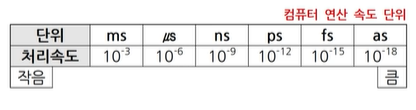

# 독고리 유투브 강의

# 컴퓨터 일반

- 컴퓨터(EDPS)
    - 컴퓨터(EDPS)
        - 자료를 가공해서 유용한 가치 있는 정보로 변환해 주는 장치
        - 컴퓨터의 특징 : 자동성, 정확성, 범용성, 신속성, 호환성, 대용량성
            - 데이터마이닝 : 대량의 데이터를 분석하여 일정한 패턴을 찾아내어 가치 있는 정보를 추출하는 기술
            - 애니악(ENIAC) : 세계최초의 전자계산기(외장방식이용 : RAM 없음)
            - 애드삭(EDSAC) : 세계최초의 프로그램 내장 방식(RAM 있음)
            - 애드박(EDVAC) : 내장방식과 2진법 채택(폰 노이만)
            - 유니박(UNIVAC) : 최초의 상업용 컴퓨터
    - 컴퓨터 세대별 특징
        - 1세대
            - 진공관, 자기드럼
            - 일괄처리, 기계어, HW 개발, 오프라인
        - 2세대
            - 트랜지스터(TR)
            - 실시간처리, 고급언어, 운영체제(OS) 도입, 다중프로그래밍, 온라인
        - 3세대
            - 직접회로(IC), 크기는 작아지고, 내용은 많이 입력되게 한다.
            - 시분할처리(TSS), OCR, OMR, MICR, 경영정보기법(MIS)
        - 4세대
            - 고밀도 직접회로(LSI)
            - 분산처리(작업을 나누어서 처리), 개인용 컴퓨터(PC), 마이크로프로세서 네트워크 발달
        - 5세대
            - 초고밀도 직접회로(VLSI)
            - 인터넷, 인공지능(AI), 퍼지이론, 전문가시스템 개발, 신기술 도입
    - 자료(데이터)에 따른 분류(디지털, 아날로그, 하이브리드)
        - 디지털 컴퓨터 : 문자나 숫자화 된 비연속적인 데이터(디지털형)를 처리하는 컴퓨터(셀 수 있는 자료 취급)
        - 아날로그 컴퓨터 : 온도, 전류, 속도 등과 같이 연속적으로 변화하는 데이터(아날로그형)를 처리하는 특수 목적용 컴퓨터(셀 수 없는 자료 취급)
        - 하이브리드 컴퓨터 : 디지털 컴퓨터와 아날로그 컴퓨터의 장점을 혼합하여 만든 컴퓨터
        - 입력 형태
            - 디지털 컴퓨터 : 숫자/문자(셀 수 있는)
            - 아날로그 컴퓨터 : 연속적인 자료(셀 수 없는)
        - 출력 형태
            - 디지털 컴퓨터 : 숫자/문자
            - 아날로그 컴퓨터 : 그래프(연속적인 결과)
        - 연산 형식
            - 디지털 컴퓨터 : 산술/논리 연산
            - 아날로그 컴퓨터 : 미/적분 연산
        - 구성 회로
            - 디지털 컴퓨터 : 논리 회로
            - 아날로그 컴퓨터 : 증폭 회로
        - 프로그래밍
            - 디지털 컴퓨터 : 필요(사용자가 설치)
            - 아날로그 컴퓨터 : 불필요 (미리 설치되어 있음)
        - 정밀도
            - 디지털 컴퓨터 : 필요한 한도까지
            - 아날로그 컴퓨터 : 제한적(정해져 있음)
        - 기억 기능
            - 디지털 컴퓨터 : 있음
            - 아날로그 컴퓨터 : 없음
        - 적용성
            - 디지털 컴퓨터 : 범용(개인용)
            - 아날로그 컴퓨터 : 특수 목적용(군사용, 과학용)
    - 처리능력에 따른 분류(슈퍼, 메인, 미니, 워크스테이션)
        - 슈퍼 컴퓨터 : 높은 정밀도, 정확한 계산, 인공위성, 일기예보, 우주 항공 산업에 이용
        - 메인 프레임 : 대규모 시스템으로, 수백 명의 사용자가 동시에 사용 가능
        - 미니 컴퓨터 : 중규모 시스템으로 학교, 연구소 등의 업무 처리나 과학기술 계산에 사용
        - 워크스테이션 : RISC 프로세스를 사용, 네트워크에서 서버역할, 고성능 그래픽 처리 등에 사용
        - 데스크톱 컴퓨터 : 일반적인 개인용 컴퓨터(CISC), 가정이나 사무실에서 사용
        - 휴대용 컴퓨터 : 휴대가 가능한 컴퓨터
    - HZ, MIPS, FLOPS, 연산 속도 단위
        - HZ : 1초에 1번 주기가 반복됨(1KHZ : 1초에 1000번)
        - MIPS : 1초에 백만 개의 명령어 실행
        - FLOPS : 초당 부동소수점 연산 횟수
            
            
            
    - 정보처리형태에 따른 분류
        - 일괄처리 : 한꺼번에 모아서, 일정기간 모아서 처리. 1세대
        - 실시간처리 : 자료가 발생하자마자 즉시 처리, 2세대, 온라인
        - 다중프로그래밍 : 한 번에 여러 개 프로그램 실행
        - 분산처리 : 작업을 나누어서 처리, 4세대
        - 동배간처리(P2P) : 내가 서버/클라이언트가 될 수 있는 방식
        - 임베디드 : 응용프로그램을 탑재하여 컴퓨터 기능을 수행
        - 다중처리 : 여러 개 CPU를 설치하여 실행
        - 클러스터링 : 여러 대 컴퓨터를 단일시스템으로 사용하는 기능
        - 듀얼 : 두 개의 CPU가 동시 동작하다가 하나가 고장 나면 다른 컴퓨터가 계속 업무를 처리하는 방식
        - 듀플렉스 : 두 개의 CPU중에 한쪽이 고장 나면 대기 중인 다른 컴퓨터가 그 기능을 수행하는 방식
    - 자료구성의 단위
        - 비트(bit)
        - 니블(Nibble) 4비트
        - 바이트(byte)8비트, 문자
        - 워드(word), 단어
        - 필드(Field), 특정항목
        - 레코드, 자료
        - 블록, 레코드의 모임
        - 파일
        - 데이터베이스, 자료의 최종 목적
    - 자료표현코드
        - 문자표현방식
            - ASCII 코드 : 데이터 통신용코드(존 3bit, 디짓 4bit) 2의 7승 128개 표현
            - EBCDIC코드 : BCD 확장코드(존 4bit, 디짓 4bit) 2의 8승 256개 표현
            - 유니코드 : KS X 1005-1, 모든 문자 2바이트로 표현, 국제표준코드
            - 완성형한글코드 : KS X 1001, 정보교환용
            - 조합형한글코드 : KS X 1001, 정보처리용
        - 에러체크방식
            - 패리티체크 : 에러 검출만 가능, 교정은 못함(기수 : 홀수, 우수 : 짝수)
            - 정마크부호 : 패리티검사가 코드 자체에서 이루어진다.
            - 해밍코드 : 에러 검출 및 교정이 가능
            - CRC 체크 : 다항식으로 에러 검사(우수함)
            - BSC 검사 : 패리티 단점을 보안한 검사
        - 숫자표현방식
            - 고정 소수점
                - 정수표현, 구조가 단순, 속도가 빠름.
                - 2진 연산(부호와 절대치, 1의 보수, 2의 보수)
                - 10진 연산 : 팩형식, 언팩형식
            - 부동 소수점
                - 실수표현, 속도가 느림, 매우 큰 수, 매우 작은 수 표현
                - 부호(1비트)
                - 지수부(7비트),
                - 가수부(소수표현)
    - 진법
        - 10진수
            - 사용 숫자 : 0 ~ 9
            - 2진수변환방법 : 10진수를 2로 나누어서 계속 나누어질 때까지 계산, 나머지만 취합. 밑에서 위로 취합
        - 2진수
            - 사용 숫자 : 0 ~ 1
            - 10진수변환방법 : 해당 자릿수에 오른쪽 숫자부터 1 2 4 8… 소수점 기준으로 2의 -1승, 2의 -2승, 2의 -3승… 1에 해당하는 숫자에 해당 숫자를 곱한 값들의 합을 구한다.
        - 음수표현방법
            - 부호와 절대치 : 맨 앞의 숫자를 1로 바꾸고, 나머지는 그대로
            - 1의 보수 : 원래 수를 반대로(0 > 1로, 1은 0으로)
            - 2의 보수 : 1의 보수 + 1
            
            
            
    - 중앙처리장치(CPU)
        - CPU : 레지스터 + 제어장치 + 연산장치
        - 주변장치 : 입력장치 + 출력장치
        - 레지스터(Register)
            - CPU내에서 임시기억장치(속도가 제일 빠르다), 병렬구조
            - 레지스터의 크기 : 한 번에 처리 가능한 데이터(메모리, 워드 크기)
            - 기억장치 접근 속도 비교(빠름 > 느림)
            - 레지스터 > 캐시 > DRAM > ROM > 하드디스크 > Zip Disk > CD-ROM > 플로피디스크 > 자기테이프(백업용)
        - 제어장치 CU
            - 컴퓨터의 모든 동작을 지시하고 제어하는 장치
            - 프로그램 카운터(Program Counter) : 다음에 실행할 명령어의 번지(주소)를 기억, PC
            - 명령 레지스터(Instruction Register) : 현재 실행 중인 명령의 내용을 기억, IR
            - 명령 해독기(Decoder) : 명령 레지스터에 있는 명령어를 해독하는 회로(10진수로 변환)
            - 부호기(Encoder) : 해독된 명령에 따라 각 장치로 보낼 제어 신호를 생성하는 회로(2진수로 변환)
            - 메모리 버퍼 레지스터(MBR) : 데이터를 기억
            - 메모리 주소 레지스터(MAR) : 주소를 기억
        - 연산 장치 ALU
            - 가산기 : 덧셈하는 장치
            - 누산기 : 연산의 중간 결과 기억
            - 보수기(음수로 변환) : 뺄샘하기 위해 사용하는 장치
            - 상태 레지스터 : 연산중에 발생하는 여러 상태값, (올림수, 부호..)을 기억(PSW)
        - 중앙처리장치(CPU) 성능에 영향을 미치는 요인 : 클럭주파수, 캐시메모리, 워드크기
        - 중앙처리장치(CPU) 성능 단위
            - 클럭(Clock : 주파수가 높을수록 고속)
            - 밉스(MIPS : 1초에 백만 개 명령어 실행)
            - 해르츠(Hz : 시스템 클럭속도)
            - 플롭스(Flops : 1초당 부동소수점 연산횟수)
        - CPU 업그레이드시 : 메인보드 지원 여부 확인
    - RISC/CISC
        - RISC : Reduced Instruction Set Computer
        - CISC : Complex Instruction Set Computer
        - 마이크로 프로세서 : 제어장치 + 연산장치
        - 명령어
            - RISC : 적음
            - CISC : 많음
        - 주소 지정
            - RISC : 간단
            - CISC : 복잡
        - 레지스터
            - RISC : 많음
            - CISC : 적음
        - 전기소모
            - RISC : 적음
            - CISC : 많음
        - 처리속도
            - RISC : 빠름
            - CISC : 느림
        - 용도
            - RISC : 서버, 워크스테이션
            - CISC : 개인용 컴퓨터(PC)
    - 주기억 장치
        - ROM : 비 휘발성 메모리로, 입-출력 시스템(BIOS), 글자 폰트, 자가 진단 프로그램(POST) 저장
        - RAM : 휘발성 메모리로, 현재 사용중인 프로그램이나 데이터 저장
    - DRAM과 SRAM 비교
        - DRAM : 동적 램
        - SRAM : 정적 램
        - 구성 소자
            - DRAM : 콘덴서
            - SRAM : 플립플롭
        - 재충전
            - DRAM : 필요
            - SRAM : 불필요
        - 전기소모
            - DRAM : 적음
            - SRAM : 많음
        - 속도
            - DRAM : 느림
            - SRAM : 빠름
        - 가격
            - DRAM : 저가
            - SRAM : 고가
        - 용도
            - DRAM : 주기억장치
            - SRAM : 캐시메모리
    - ROM
        - 플래시 메모리(EEPROM) : MP3 플레이어, PDA, 디지털카메라, SD카드, 전기를 이용, 여러 번 읽고 쓰기 가능
        - MASK ROM(제조회사에서 1번 기록 후 이후에는 수정 못함)
        - PROM(사용자가 1번 기록 후 수정 못함)
        - EPROM(자외선을 이용, 여러 번 읽고 쓰기 가능)
    - RAM, 메모리 등
        - 캐시메모리(SRAM) : CPU와 주기억장치 사이에 위치, 속도를 향상
        - 가상 메모리 : 보조기억장치(하드디스크)를 주기억장치처럼 사용
        - 버퍼메모리 : 데이터를 주고받을 때 속도차이를 해결하는 임시기억공간(복사하기, 잘라내기, 붙이기할 때 사용)
        - 연관 메모리(Associative Memory) : 주소가 아닌 내용의 일부를 이용해서 데이터를 가져오는 방식
        - 펌웨어(Firmware) : 하드웨어의 동작을 지시하는 소프트웨어, 주로 ROM에 저장, 하드웨어 제어(통제), 관리
            - 하드웨어 교체 없이 소프트웨어 업그레이드로 성능을 높일 수 있다.
        - 메모리 용량이 부족할 경우
            - 불필요한 프로그램 종료, 가상메모리 크기조절, 램(RAM)추가설치
    - 보조기억장치
        - 비휘발성, 주기억장치에 비해 속도가 느림. 대용량, 단위당 가격이 저렴
        - 기억 용량 단위 : 2의 10승, 1024
            
            
            
        - 하드디스크 연결 방식
            - IDE : 2개
            - EIDE : 4개
            - SCSI : 7개
            - 현재는 SATA 방식에 외장형 하드디스크 증가 추세
        - RAID : 여러 개 하드디스크를 한 개의 하드디스크처럼 관리하는 방법(속도향상, 안전, 복구가 쉬움)
            - 미러링 : 2개의 디스크에 동일하게 기록
            - 스트라이핑 : 나누어서 기록, 한 개라도 손상되면 사용할 수 없음
            - 패리티 : 장애발생시 패리티를 사용해서 복구함(가장 많이 사용)
        - SSD : 하드디스크와는 달리 기계적장치가 없는 반도체를 이용하여 정보를 저장하는 매체, 소형화, 경량화, 부팅속도가 빠름(5초 내외), 충격에 강함(배드섹터가 발생하지 않음), 발열, 소음, 전기가 적게 든다.
            - 파티션 : 한 개의 하드디스크를 여러 개 논리적 영역으로 나누는 작업, (C 드라이브, D 드라이브)
        - 광디스크
            - DVD : 4.7 ~ 17GB의 대용량 저장(영화 저장)
            - CD-R : 한번만 기록 가능한 CD
        - 블루레이 : 고선명(HD) 비디오를 저장, DVD에 10배 기록(25G ~ 50G), DVD를 블루레이에서는 사용 불가능(반대는 가능)
    - 입출력장치
        - 입력장치 : OMR(답안지), OCR(공공요금청구서), MICR(수표), 키보드, 마우스, 트랙볼
        - 출력장치 : 프린터, 플로터
        - 표시장치 : 모니터
        - LCD(액정) : 유리판에 전기를 더하여 화면을 보여주는 장치
        - 픽셀(Pixel, 화소)은 모니터 화면을 구성하는 가장 작은 단위
        - 해상도(선명도) : 얼마나 선명하게 표시할 지 나타내는 단위
        - 해상도는 픽셀(Pixel, 화소)의 수에 따라 결정된다.
    - 기타장치
        - 메인보드
            - AGP슬롯 : 그래픽카드 끼우는 부분
            - 칩셋 : 각 부품들 간의 흐름을 제어, 메인보드의 핵심
            - 롬 바이오스(ROM BIOS) : 컴퓨터가 시작될 때 컴퓨터 제어 및 기본 작업을 처리하는 프로그램. 컴퓨터의 기본정보, 부팅에 대한 방법이 기록되어 있음
            - 포트
                - 직렬포트 : 한번에 1비트씩 전송
                - 병렬포트 : 한번에 8비트씩 전송
                - USB 포트 : 주변장치를 최대 127개 연결
                - IEEE1394 : 가전기기를 컴퓨터에 연결하는 방식
                - IRDA : 케이블 없이(무선)적외선으로 연결하는 방식
                - HDMI : 영상과 음성을 하나의 케이블로 전송하는 디지털 포트(셋톱박스, HDTV, 모니터)
    - 관련용어
        - 인터럽트 : 실행 도중 갑자기 예기치 않은 상황이 발생할 경우 현재 작업을 중단하고 발생된 상황의 문제를 해결한 후 다시 실행중인 작업으로 복귀하여 계속 처리하는 것
        - 외부 인터럽트 : 입-출력 장치, 타이밍 장치, 전원 등의 외부적인 요인에 의해 발생
        - 내부 인터럽트 : 잘못된 명령이나 데이터를 사용, 트랩(TRAP)
        - 가장 높은 우선순위 인터럽트 : 정전
        - 가장 낮은 우선순위 인터럽트 : SVC (사용자 의도 인터럽트)
        - 채널 : CPU로부터 권한을 넘겨받아 CPU 대신 입-출력을 관리
            - 입-출력 작업이 끝나면 CPU에게 인터럽트 신호를 보낸다.
        - 채널종류
            - 셀렉터(Select) 채널(고속)
            - 멀티플렉서(Multiplexer) 채널(저속)
            - 블록 멀티플렉서(Block Multiplexer) 채널
        - DMA(Direct Memory Access) : 직접메모리접근, CPU 참여 없이 입출력장치가 데이터를 주고받는 형식, 시스템 속도가 향상
            - 데드락 : 실행 도중 갑자기 예기치 않은 상황이 발생할 경우, 발생된 상황의 문제가 해결되지 않은 채 멈춰있는 현상
                - 상호 배제, 점유와 대기, 비선점, 환형대기
            - IRQ : 주변장치(입출력장치)에서 CPU에게 보내는 신호
    - 소프트웨어
        - 애드웨어 : 광고를 보는 댓가로 프로그램 이용
        - 데모버전 : 홍보를 위해 일부기능만 제공하는 프로그램
        - 알파버전 : 회사 내 직원들이 테스트하는 프로그램
        - 번들 : 구매할 때 끼워주는 프로그램
        - 쉐어웨어 : 일정기간 /’일정기능을 무료로 사용해 볼 수 있는 프로그램
        - 상용소프트웨어 : 비용을 주고 사는 프로그램
        - 패치프로그램 : 배포 후 발생된 에러를 수정하고 다시 재배포하는 프로그램
        - 트라이얼버전 : 체험판 프로그램
        - 베타버전 : 출시되기 전 일반사용자가 테스트하는 프로그램
        - 공개소프트웨어 : 무료로 사용하는 프로그램
        - 오픈소스프로그램 : 프로그램 소스가 공개되어 수정 및 변경이 가능한 프로그램
    - 언어번역과정
        
        
        
        - 컴파일(compile) : 고급언어로 작성된 프로그램을 기계어로 변환하는 것, 목적프로그램을 생성
        - 인터프리터 : 원시프로그램을 줄 단위로 번역, 컴파일과정 없음. 바로 실행
        - 링커 : 목적프로그램을 실행가능한 모듈(실행파일)로 만듦
        - 로더 : 실행가능한 모듈을 메모리(주기억장치)에 적재(진짜 실행)
        - 로더의 기능 4가지 : 할당, 연결, 재배치, 적재
    - 프로그래밍언어
        - 자바(JAVA) : 객체지향언어, 분산네트워크, 독립적, 이식성, 바이트코드 생성, 플랫폼에 관계 없음
        - C언어 : 유닉스 운영체제 제작, 저급언어 + 고급언어 특징, 구조적프로그래밍, 하드웨어제어가능, 영문자의 경우 대소문자 구별
        - C++ : C언어에 객체지향 개념을 적용(필요한 프로그램만 사용)
        - 구조적 언어 : 입력과 출력이 각각 1개로 이루어진 구조
            - PASCAL, ADA
            - 순서, 선택, 반복 구조
        - 객체지향 언어 : 객체/자료를 바탕, SMALL TALK, C++, JAVA (필요한 프로그램만 사용)
            - 특징 : 추상화, 캡슐화, 계층성, 모듈성, 다형성, 정보은폐, 상속성, 재사용성
        - 비주얼 프로그래밍 : 문자방식의 명령어 형태를 아이콘 형태로 바꿔 프로그래밍 하는 기법
            - VISUAL STUDIO, 델파이, 파워빌더
        - 인공지능 언어 : LISP, PROLOG, SNOBOL
        - 버그 : 에러
        - 디버깅 : 에러 찾는 과정
    - 웹프로그래밍 언어
        - HTML5 : W3C에서 제안, ActiveX 없이 브라우저에서 쉽게 재생
        - DHTML : 동적(실시간으로 변하는)인 웹페이지 생성
        - SHML : 멀티미디어전자문서를 손실없이 효율적으로 전송, 구조가 복잡
        - XML : 기존 HTML의 단점을 보완, 새로운 태그를 정의(확장)
        - WML : XML에 기반을 둔 무선단말기에서 쓰는 언어
        - UML : 모델링언어의 표준화를 위한 언어
        - VRML : 3차원 가상세계 표현가능 언어 (아파트 모델하우스)
        - PERL : 문자처리 강력함, 운영체제에 상관없이 동작
        - ASP, JSP : 서버측에서 동작(PHP도 서버측에서 실행)
        - JAVA : 네트워크에서 분산작업이 가능하도록 개발된 언어.
- 운영체제/Windows10
    - 운영체제(OS)
        - 하드웨어와 소프트웨어의 자원을 효율적으로 관리
        - 운영체제 목적 : 처리능력 향상, 응답시간 단축, 사용가능도 증대, 신뢰도 향상
        - 제어프로그램(감시, 작업 관리, 데이터 관리) + 처리 프로그램(언어 번역, 서비스, 문제 처리)
            - 발전 단계 : 일괄 처리 > 실시간 처리 > 다중 프로그래밍 > 시분할 처리 > 다중 처리 > 분산 처리 시스템
        - 부팅순서 : ROM BIOS / CMOS 점검 → POST(자가진단) → MBR부트섹터/커널 윈도우 로그온 → Explorer.exe(바탕화면 표시(
    - 한글 Windows10 특징
        - GUI(그래픽 사용자 인터페이스) : 마우스를 이용한다. Dos는 CUI, 64비트 데이터처리
        - 선점형 멀티태스킹 : 여러가지 앱 실행중 문제가 발생하면 강제로 종료
        - 플러그 앤 플레이(PnP) : 컴퓨터에 하드웨어 설치 시 자동인식 및 환경설정이 자동으로 이루어진다.
            - PnP 지원이 안될 때 실행창 hdwwiz : 하드웨어 추가마법사 실행
        - OLE : 그림과 개체를 자유롭게 삽입하는 기능
        - 255자 파일이름 : 공백포함(\ / : * ? “ < > | 를 제외)
        - NTFS(New Technology File System) : 성능, 보안, 안정성, 속도가 뛰어남, 최대크기 256TB(파일의 최대크기 16TB), 파일폴더의 엑세스 제어기능, 디스크오류의 자동복구기능
        - 에어로 스냅(Aero Snap) : 창의 크기가 조정되는 기능, window키 + ←, → ↑, ↓
        - 에어로 쉐이크(Aero Shake) : 창의 제목표시줄을 흔들면 나머지창이 최소화, 다시 복원, window키 + Home키
    - 라이브러리(문서, 음악, 사진, 비디오)
        - 라이브러리 : 이곳저곳 나눠진 자료를 한 곳에서 보고 정리할 수 있게 하는 가상의 폴더
        - 실제로 파일이 아니라 원본에 연결해서 보여주는 기능 (최대 50개 폴더포함)
        - 라이브러리 폴더를 제거 시 폴더를 삭제하는 것은 아니다. (삭제 시 복구 : 바로가기 메뉴 > 기본 라이브러리 복원 클릭)
        - 라이브러리에 포함된 폴더나 파일을 제거하면 원본이 삭제된다.
            - 이동식 미디어(CD, DVD)는 라이브러리에 포함될 수 없다. (USB 메모리는 포함 가능)
    - 바로가기 키
        
        
        
        
        
    - 바로가기 아이콘
        
        
        
        - 자주 사용하는 문서나 앱을 빠르게 실행시키기 위한 아이콘으로, 원본 파일의 위치 정보만 가지고 있음
        - 컴퓨터에서 사용되는 모든 개체에 대해 만들 수 있음, 바로 가기 아이콘 좌측 하단에 화살표가 표시됨
        - 확장자는 .LNK, [속성]창에서 바로가기 키 지정 및 연결정보(파일, 형식, 위치)에 대한 정보 확인
        - 바로 가기 아이콘을 삭제하더라도 원본 파일은 삭제되지 않음
    - 작업표시줄
        - 현재 실행중인 앱이 표시되는 부분
        - 위치조절가능, 크기조절가능(최대 화면의 50%), 자동 숨김 기능
            
            
            
    - 시작메뉴
        
        
        
        - 모든 작업이 시작되는 곳
        - 컴퓨터에 설치된 프로그램, 앱을 시작화면/작업표시줄에 고정하고 해당 파일의 위치를 열 수 있다.(마우스 우측 > 시작 화면에 고정 클릭)
    - 시작프로그램
        - Windows10이 시작될 때 자동으로 실행되는 프로그램
        - 윈도우 키 + R (실행창 열기) > shell:startup > 시작프로그램 폴더에 프로그램 등록
            
            
            
    - 레지스트리
        - 컴퓨터에 설치된 모든 HW/SW의 실행 정보를 한 군데 모아 관리하는 데이터베이스(추가/편집/백업/복원)
        - 실행 : [시작] → [Windows 시스템] → [실행]을 선택한 후 입력란에 ‘Regedit’ 또는 ‘msconfig’ 입력 후 실행
            - IRQ, I/O 주소, DMA 등의 하드웨어 자원과 프로그램의 실행정보를 관리
            - 레지스트리에 이상이 생기면 치명적인 손상이 생길 수 있다. (변경 시 백업 필수)
    - 작업 관리자(Ctrl + Shift + Esc)
        - 응답하지 않는 프로그램을 종료할 때 사용한다. (선점형 멀티태스킹) Ctrl + Alt + Delete
    - 파일 탐색기(윈도우 키 + E)
        - 시스템의 모든 디스크 드라이브 및 파일/폴더 관리를 할 수 있는 기능
        - 폴더의 생성과 데이터의 이동/복사/삭제작업을 할 수 있는 계층적(트리) 디렉토리 구조를 가진다.
        - [바로가기] 창 : 파일 탐색기가 실행되면 자주 사용하는 파일과 폴더, 최근에 사용된 파일과 폴더가 표시된다.
            
            
            
        - 리본메뉴(여러개의 탭으로 구성, 명령단추/옵션)
            - 파일 / 홈/ 공유 / 보기 등으로 구성되며 선택한 파일에 따라 탭 메뉴가 각각 다르게 나타난다.
                
                
                
        - 옵션 단추 : 여러 개 중 하나만 선택 가능, 꼭 1개는 선택해야 한다.
            
            
            
        - 선택 단추 : 여러 개 중 여러개 선택가능, 선택 안 해도 가능
            
            
            
        - 파일 / 폴더 선택
            
            
            
    - 파일 및 폴더
        - 파일 : 파일명(255자 사용가능, 공백/하이픈(-)/언더바(_)사용가능)과 확장자(파일의 성격)로 구분.
            
            
            
        - 폴더 : 관련된 파일을 모아놓는 곳(동일한 위치에 동일한 이름의 폴더는 있을 수 없다.
            - 폴더 만들기 바로가기 키 : Ctrl + Shift + N, 이름 바꾸기(한 번에 한 개씩) : F2
                
                
                
    - 휴지통(C:\$Recycle.Bin)
        - 삭제된 파일이나 폴더가 임시 보관되는 장소로, 복원이 가능. 복원할 경우 원래 위치로 복원
        - 휴지통이름 변경 가능(F2), 휴지통 내 파일 이름은 변경 불가능
        - 크기는 기본적으로 드라이브 용량의 5 ~ 10%로 설정, 변경 가능(각 드라이브마다 따로 설정 가능)
        - 휴지통의 용량을 초과되면 가장 오래전에 삭제된 파일부터 제거
        - 휴지통에 보관되지 않는 경우(완전 삭제)
            - USB, DOS 모드, 네트워크 드라이브에서 삭제, Shift + Delete를 사용하여 삭제한 항목
            - 휴지통속성창에서 ‘파일을 휴지통에 버리지 않고 삭제할 때 바로 제거’를 선택
            - 휴지통의 크기를 0%로 설정한 경우, 휴지통 비우기, 같은 이름의 항목을 복사/이동 작업으로 덮어쓴 경우
    - 인쇄
        - 로컬 프린터 : 컴퓨터에 직접 연결되어 있는 프린터 / 네트워크 프린터 : 다른 컴퓨터에 연결된 프린터 (공유 가능)
        - 기본 프린터 : 인쇄명령 시 자동으로 인쇄 작업을 수행하는 프린터(기본 프린터는 1개만 지정 가능)
            - 스풀(병행처리) : 컴퓨터처리효율이 높아지고 속도가 빨라지지 않음
        - 인쇄 관리자
            - 인쇄명령 시 작업표시줄의 알림 영역에 프린터 모양의 아이콘이 표시되며 인쇄가 완료되면 아이콘은 사라진다.
            - 인쇄 켰다가 다시 재 인쇄할 수 있음, 인쇄 작업이 시작된 문서도 중간에 강제로 종료시키거나, 잠시 중지할 수 있으며 강제로 인쇄 작업을 종료할 수 있다.
                - 프린터 공유 : 프린터 속성 > ‘공유’탭에서 설정
                    
                    
                    
    - Windows 10 보조프로그램
        - Windows10 보조프로그램 및 유니버설 앱
            - 메모장
                - 전체에 대해서만 글꼴, 속성, 크기를 변경할 수 있음(부분변경 불가, 글자색은 지원 안됨)
                - .LOG(반드시 대문자입력)를 입력하면 다음에 불러올 때 현재시간과 날짜가 보임, F5
                - 자동 줄바꿈, 찾기/바꾸기 기능 가능, OLE 기능(그림, 표 삽입) 불가능, Ctrl + G : 특정 줄로 이동
            - 워드패드
                - RTF, TXT, DOC, WRI 등의 확장자를 가진 문서를 작업, OLE 기능 가능
            - 그림판
                - 윈도우 10에서 제공되는 그림편집 프로그램, 기본 확장자는 .png(OLE 개체 삽입 가능)
                - 그림판 3D 열기 지원, Shift 누른 상태에서 정사각형, 정원 그리기 가능
                - .jpg, .bmp, .gif, .tif, .dib 등의 그래픽파일 열기 가능, 바탕 화면의 배경으로 사용 가능
            - Print 3D
                - 3D 프린터를 연결해 3D 입체모형으로 출력하는 앱(재료, 레이아웃)
                - .stl, .obj, .3mf, .wrl, .ply
            - 단계 레코더
                - 컴퓨터에서 작업을 수행할 때 클릭 드래그 키보드 입력 하나 하나를 녹화하는 앱.  MHTM문서(.mht)를 생성하여 압축파일(.zip)로 저장
            - 빠른 지원
                - 다른 사용자의 컴퓨터에 접속하여 상대방의 문제 해결을 할 수 있도록 하는 앱
            - 원격 데스크톱 연결
                - 다른 컴퓨터에 연결하여 컴퓨터에 있는 앱/파일/네트워크 리소스에 액세스 하는 기능
    - 컴퓨터 시스템의 여러 가지 각종 설정
        - 윈도우 10 설정 실행 : Windows10의 작업에 맞는 환경설정 및 변경을 수행하는 기능
            - 실행방법
                
                
                
                - 시스템
                    - 디스플레이
                        - 화면에 표시되는 텍스트, 앱의 크기, 해상도, 디스플레이 방향을 설정
                            - 야간모드 : 차가운 빛을 밤에는 눈에 편한 따듯한 색으로 표시
                    - 소리
                        - 입력 / 출력장치 설정, 마스터 볼륨 조절, 고급 사운드 옵션 (앱 볼륨)
                    - 알림 및 작업
                        - 잠금 화면에 알림 표시, Windows 팁 표시, 앱 알림 받기
                    - 전원 및 절전
                        - 화면(다음 시간이 경과하면 끄기), 절전 모드(절전 상태로 전환)
                    - 저장소
                        - 임시파일, 휴지통 파일을 제거하여 공간을 자동으로 확보
                    - 집중지원
                        - 중요한 작업/게임을 할 때 알림의 방해를 받지 않도록 설정
                    - 원격 데스크톱
                        - 원격 장치에서 이 PC에 연결하고 제어할 수 있다.
                    - 정보
                        - 현재 정보(바이러스, 방화벽, 계정보호)확인, 장치 사양 / Windows 사양
                - 개인 설정
                    - 배경
                        - 배경 화면, 고대비 설정(텍스트와 앱을 보기 쉽게 설정)
                    - 잠금 화면
                        - 화면 보호기, 잠금 화면에서 사용할 앱 선택
                    - 색
                        - 데스크톱 또는 배경색 설정, 작업표시줄 색상 변경
                    - 작업표시줄
                        - 작업표시줄 잠금, 숨기기, 위치, 단추 하나로 표시, 피플(연락처 표시)
                - 게임
                    - 게임 바
                        - 게임바를 사용하여 게임 클립, 스크린샷 및 브로드캐스트 레코드
                    - 캡처
                        - 스크린 샷 및 게임클립을 통해 게임을 캡쳐하는 방법을 제어한다.
                    - 브로드캐스팅
                        - 브로드 캐스팅할 때 게임의 모양을 제어한다.
                    - 게임 모드
                        - 게임 모드를 키면 Windows가 PC를 게임 플레이에 최적화한다.
                - 업데이트 및 보안
                    - Windows 업데이트
                        - 윈도우 업데이트(스토리지 점검, OS 빌드 정보 : 장치, Windows 사양)
                    - 전송 최적화
                        - 다른 PC에서 다운로드 허용 켜고/끄기
                    - Windows 보안
                        - 장치의 보안 및 상태를 관리(바이러스, 방화벽, 장치, 가족 옵션)
                    - 복구
                        - 이 PC 초기화, 고급시작옵션(USB, DVD로 부팅), 복구 드라이브 만들기
                    - 백업
                        - 파일 히스토리를 사용하여 백업, 이전 백업
                    - 정품 인증
                        - 정품인증 정보, 업그레이드, Microsoft 계정 추가
                    - 내 장치 찾기
                        - 장치를 분실했을 때 장치의 위치를 추적
                - 장치
                    - Blutooth 및 기타 디바이스
                        - 블루투스 또는 기타장치 추가, 프린터, 스캐너, 오디오 연결 제어
                    - 프린터 및 스캐너
                        - 프린터 및 스캐너 추가
                    - 마우스
                        - 기본 단추 선택(왼쪽/오른쪽), 한 번에 스크롤 하는 줄 수 선택
                    - 자동 실행
                        - 모든 미디어 장치에 자동 실행 사용 켜고/끄기
                - 앱
                    - 앱 및 기능
                        - 컴퓨터에 설치된 앱을 제거 또는 수정, 앱을 가져올 위치 선택
                    - 기본 앱
                        - 컴퓨터에서 이뤄지는 각 작업들에 대한 기본 앱을 설정(메일, 뷰어, 비디오)
                    - 시작 프로그램
                        - 로그인 할 때 앱이 시작할 수 있도록, 백그라운드 작업이 실행될 때 시작
                - 접근성
                    - 디스플레이
                        - 텍스트 확대, 모든 항목 크게 보기, 밝게 보기
                    - 커서 및 포인터
                        - 마우스 포인터 크기, 커서 두께 변경, 터치 피드백 변경
                    - 색상 필터
                        - 사진 및 색을 보기 쉽게 변경한다.
                    - 내레이터
                        - 화면의 내용을 설명하는 화면 읽기 프로그램 Window 키 + Ctrl + Enter
                    - 돋보기
                        - 디스플레이 일부를 확대 윈도우 키 + +키, Window키 + -키,
                    - 고대비
                        - 텍스트와 앱을 보기 쉽게 설정한다.
                    - 음성명령
                        - 키보드 입력 대신 말하기 윈도우 키 + H, 음성만 사용하여 텍스트 입력 및 장치 제어
                    - 아이 컨트롤
                        - 시선 추적 기술을 사용하여 마우스/화상키보드 제어, TTS(텍스트 음성 변환)
                - 전화
                    - Android, Iphone 연결
                        - 사용자의 PC에 바로 문자를 보내고 휴대폰의 최근 사진을 볼 수 있다.
                - 계정
                    - 사용자 정보
                        - 관리자 로컬계정 정보 확인, Microsoft 계정으로 로그인
                    - 이메일 및 계정
                        - 이메일, 일정 및 연락처에서 사용하는 계정(추가), 회사 또는 학교 계정 추가
                    - 로그인 옵션
                        - 로그인 방법(얼굴, 지문, PIN, 보안키, 비밀번호, 사진 암호), 로그인 필요시기
                - 검색
                    - 사용 권한과 기록
                        - 유해 정보 차단(엄격, 중간, 끔), 클라우드 콘텐츠 검색(OneDrive, Outlook)
                    - Windows 검색
                        - 인덱싱 상태, 내 파일 찾기 : 클래식(라이브러리/바탕화면), 고급(전체)
                - 네트워크 및 인터넷
                    - 상태
                        - 네트워크 상태, 네트워크 설정 변경(어댑터, 공유 옵션, 문제 해결사)
                        - 네트워크 속성 보기, Windows 방화벽, 네트워크 공유센터, 네트워크 초기화
                    - 이더넷
                        - 컴퓨터가 현재 연결된 네트워크 통신망
                    - 데이터 사용량
                        - 데이터 제한(데이터를 초과하지 않도록), 백그라운드 데이터(사용량 줄이기 위해)
                - 시간 및 언어
                    - 날짜 및 시간
                        - 표준시간대 설정(자동/수동), 인터넷으로 시간 동기화(time.windows.com)
                    - 지역
                        - 국가 또는 지역, 사용지역 언어, 사용지역 언어 데이터(일정, 한주의 시작, 데이터 형식변경(시작 요일, 간단한 날짜, 자세한 날짜))
                    - 언어
                        - Windows 표시 언어, 기본 설정 언어(추가 가능)
                - 개인 정보
                    - 일반
                        - 개인 정보 옵션 변경(맞춤형 광고 표시, 관련 콘텐츠, 검색 결과 제공)
                    - 피드백 및 진단
                        - 진단 데이터 : Windows를 안전한 최신 상태로 유지하고 문제를 해결하고 제품을 향상시키는데 사용한다.
                    - 활동 기록
                        - 사용자가 방문한 웹사이트, 앱, 서비스를 사용하는 방법에 대한 정보를 저장
                        - 활동기록 저장, 보내기, 지우기 가능
        - 여러가지 설정
            
            
            
        - 관리 도구
            
            
            
        - 백업
            - 원본손실에 대비하여 하나 더 만들어두는 기능
                - [백업 옵션] → [고급 설정 보기] : 개인 파일 복원, 드라이브 선택, 폴더 제외, 고급 설정
        - 복구
            - 윈도우를 초기화 / 문제 해결을 위한 다양한 옵션을 제공
                - 이 PC 초기화, 고급 시작 옵션(USB 또는 DVD 장치에서 시작, 펌웨어 변경, 이미지 복구)
        - 드라이브 오류검사
            - HDD/SDD에 논리적, 물리적 오류를 검사하고 이를 복구해 주는 기능
                - 네트워크 드라이브, CD-ROM 드라이브는 디스크 검사를 수행할 수 없음
                    - → CD-ROM 드라이브는 읽기만 가능
        - 명령 프롬프트
            - 실행방법 : 실행창(Window키 + R) > CMD 입력 후 Enter
            - MS DOS 명령 또는 기타 명령 실행 가능 (범위 설정 : Ctrl + M)
            - 명령 프롬프트 창 종료 : EXIT 명령
            - 전체화면 모드 (Alt + Enter)
        - 사용자 계정 정보
            - ms-settings:yourinfo
                - 표준 : 설치된 SW를 사용, 다른 사용자 또는 보안에 영향을 저해 하지 않는 시스템 설정 변경 가능
                - 관리자 : 컴퓨터에 대한 모든 제어 및 권한을 가짐
        - Windows 보안
            - 바이러스 및 위협 방지
                - 악성코드 및 바이러스를 실시간으로 보호하며 감염 시 치료
                - 주기적으로 검사 : 바이러스 및 위협 방지 설정 > 켜기
                - 설정관리 : 실시간 보호(켬), 제외, 알림
            - 계정 보호
                - 계정 및 로그인에 대한 보안
            - 방화벽 및 네트워크 보호
                - 도메인 네트워크, 개인 네트워크, 공용 네트워크
            - 기타기능 : 앱 및 브라우저 컨트롤 / 장치보안 / 장치성능 및 상태 / 가족 옵션
        - 글꼴
            - 설정 > 개인 설정
                - 확장자 : .ttf,  .ttd,  .fon
                - Cleartype : 읽기 쉽게 가독성을 높여줌
                - 설치 폴더 : C\\Windows\Fonts (글꼴 복사 > 붙여넣기 : 설치)
- 네트워크/인터넷
    - 네트워크
        - 네트워크 : 여러 대의 컴퓨터를 통신회선으로 연결한 형태
            - 목적 : 데이터/장치/프로그램 공유
        - 무선 LAN(WLAN)
            - AP : 기존의 네트워크 사이에 중계기 역할을 담당(내장 안테나로 전송거리 확장)
            - 안테나
                - 무지향성 : 모든 방향으로 전파를 확장
                - 지향성 : 특정 지점을 연결하기 위한 장비
            - 무선랜카드 : 무선으로 사용하기 위한 장비
    - 프로토콜
        - 프로토콜 : 네트워크에서 서로 다른 컴퓨터들간에 정보 교환을 할 수 있게 해주는 통신 규약(통신규칙)
        - 프로토콜 기능 : 단편화/재조합/주소지정/순서지정/캡슐화/연결제어/오류제어/동기화/홈제어/멀티플렉싱 송서비스
        - TCP/IP : 인터넷 표준 프로토콜
            - HTTP
                - 하이퍼텍스트 전송 프로토콜(인터넷, HTTPS://)
            - DHCP
                - IP 주소를 자동으로 할당
                - 동적으로 IP주소를 부여함으로써 네트워크 상황에 따른 문제를 해결
            - TCP
                - 메시지를 송수신자의 주소와 정보로 묶어 패킷(정보전송단위) 단위로 분류, 흐름제어, 데이터의 에러 유무 검사, OSI 7계층 중 전송 계층에 해당
            - IP
                - 패킷 주소를 해석, 경로를 결정
                - OSI 7계층 중 네트워크 계층에 해당
            - ICMP
                - 컴퓨터나 네트워크기기의 상태를 확인하기 위해 보내는 인터넷 제어메시지 프로토콜
                    - ACK : 긍정
                    - NAK : 부정
            - ARP
                - IP 주소를 물리적주소로 변경 (반대는 RARP)
            - UDP
                - 한 컴퓨터에서 다른 컴퓨터로 데이터를 전송하는 프로토콜
    - 네트워크
        - 클라이언트 : 파일/프린터 등의 공유 자원을 사용할 수 있게 하는 소프트웨어
        - 프로토콜 : 다른 컴퓨터들끼리 정보교환을 할 수 있게 하는 통신규칙
        - 서비스 : 내 컴퓨터의 자원을 다른 컴퓨터에서 사용할 수 있도록 함
        - 어댑터 : 컴퓨터를 물리적으로 연결하는 하드웨어(랜카드)
        - 서브넷 마스크 : IPv4 주소의 네트워크 주소와 호스트주소를 구별, 여러 개의 LAN에 접속할 경우 하나의 LAN을 의미 (C클래스 : 255.255.255.0)
        - 게이트웨이 : 프로토콜이 서로 다른 통신망을 접속하기 위한 장치
    - 네트워크 관련 장비
        
        
        
    - 네트워크 관련 용어
        - 모뎀 : 변복조장치(디지털 → 아날로그(변조) 아날로그 → 디지털(복조))
        - 변조속도(BAUD) : 보, 1초당 신호 변환, 상태 변환 수
        - 전송속도(BPS) : 1초당 전송되는 비트수
        - 인트라넷(Intranet) : 회사 내 각종 업무, 전자우편 시스템, 전자결재 시스템의 기술을 기업내부에 적용한 것
        - 엑스트라넷(Extranet) : 기업과 외부기업끼리 인트라넷을 서로 연결하여 자기 회사와 관련 있는 기업체와의 원할한 통신을 위해 인트라넷의 이용 범위를 확대한 것
        - 그룹웨어(Groupware) : 여러 사람이 공통의 업무를 수행하는 데 있어 사용할 수 있는 프로그램.
            - 마이크로소프트사의 익스체인지(Exchange), 넷미팅(Netmettin)
        - 코덱 : 영상처리나 음성처리를 컴퓨터에 알맞게 변환시키는 방법
            - 펄스코드변조(PCM)과정 : 아날로그 → 부호화 → 디지털 → 복호화 → 아날로그
                - 아날로그 영상을 디지털로, 다시 아날로그 영상으로 변환하는 과정
    - 인터넷
        - 1969년 미국 국방성의 ARPANET에서 시작(군사목적으로 사용)
        - 인터넷은 TCP/IP 프로토콜을 사용하여 상호 접속하는 네트워크로 유닉스(UNIX)운영체제를 기반으로 하고 있다.
    - 인터넷 주소
        - IPv4 : 8비트씩 4부분, 마침표, 10진수, 32비트(A클래스(대규모통신망) ~ E클래스(실험용))
        - IPv6 : 16비트씩 8부분, 콜론, 16진수, 총 128비트, 방식(유니캐스트(1:1), 멀티캐스트(1: 다), 애니캐스트(1:1))
        - IP주소 : 숫자 주소(인터넷 고유주소)
            - 고정 IP(다음 IP 주소 사용(고정 IP)
            - 자동으로 IP 주소 받기 (유동 IP)
        - 도메인네임 : 숫자로 된 IP 고유의 주소를 이해하기 쉽게 문자로 표현한 주소
            - 주소관리 : 고유국내(KRNIC), 전세계(ICANN)
            - DNS : 문자 주소를 숫자 주소로 변환하는 기법(백업목적으로 사용함, 2개)
        - URL : 인터넷 상의 각정 자원을 나타내는 인터넷 표준주소체계
            
            
            
    - 웹브라우저
        - 웹 페이지에 접근하면 http프로토콜을 이용해 해당 웹 문서를 사용자에게 보여주는 프로그램
        - 별도의 플러그인 설치 가능, 히스토리(최근에 접속한 사이트목록), 즐겨찾기(자주 방문하는 사이트 저장)
        - 종류 : 인터넷 익스플로러, 크롬, 넷스케이프, 오페라, 파이어폭스
        - 웹페이지 저장
            
            
            
    - 인터넷 익스플로러 인터넷 옵션
        
        
        
    - 인터넷 관련 용어
        
        
        
        
        
    - E-MAIL
        - 전자우편, 7비트 아스키코드, ID@호스트주소
        - 전자우편프로토콜 : SMTP(전송), POP3(수신), MIME(멀티미디어 전자우편, 동영상/음악/카드 메일)
            - 받는 사람에 여러 사람 주소들은 세미콜론(;) 사용
        - 참조와 숨은 참조의 차이점 : 숨은 참조는 수신자가 표시되지 않음
        - 첨부 : 파일을 이메일에 함께 보내는 기능
        - 회신 : 받은 메일에 대해 답장을 작성해서 전송하는 것
        - 전달 : 받은 메일 그대로 다른 사람에게 보내는 기능
        - 동보 : 동일한 메일을 여러 사람에게 보내는 기능
        - 옵트인(Opt-In) 메일 : 광고메일을 보낼 때 사전에 허가를 받고 보내는 메일
        - 스팸 메일 : 불특정 다수에게 동의 없이 보내는 광고성 이메일
    - OSI 7계층
        - 물리(1) → 데이터 → 네트워크 → 전송 → 세션 → 표현 → 응용(7)
            
            
            
    - 네트워크 명령어
        - Ping : 원격컴퓨터가 현재 네트워크에 정상적으로 작동여부 확인
        - IPCONFIG : 현재 PC의 물리적 주소, IP 주소, Subnet Mask, 게이트웨이 확인
        - Tracert ip 주소 : 상대방 컴퓨터까지의 경로 추적
        - NETSTATE : 현재 자신의 컴퓨터에 연결된 다른 컴퓨터의 정보를 확인(포트, 이더넷, TCP 연결)
        - NETSTAT : 중복되는 IP 주소로 인해 주소가 충돌하는 지점 확인
        - NET VIEW : 특정 컴퓨터에 공유된 정보를 확인
        - NSLOOKUP : URL 주소로 IP 주소 확인, DNS 동작여부 확인
- 멀티미디어
    - 멀티미디어
        - Multi(다중)와 Media(매체)의 합성어
        - 텍스트, 그래픽, 사운드 등의 매체를 디지털로 통합하여 전달함(전송방식 : 비동기)
        - 멀티미디어 특징 : 디지털화, 쌍방향성, 비선형성, 정보의 통합성
    - 멀티미디어 관련용어
        - 하이퍼텍스트(HyperText) : 문서와 문서가 연결된 상태, 문서내의 특정 문자를 선택하면 이와 연결된 문서로 이동하는 문서 형식
        - 하이퍼미디어(Hypermedia) : 하이퍼텍스트와 멀티미디어를 합한 개념, 클릭 시 음악, 동영상 등의 자료가 보이는 것
        - 노드(Node) : 하이퍼텍스트에서 각 문서에 연결된 페이지
        - 앵커(Anchor) : 노드에서 다른 노드로 넘어가게 하는 키워드
        - 하이퍼링크 : 노드와 노드의 연결점
        - AVI : 윈도우즈 표준 동영상 파일(별도의 장치 없이 재생 가능)
        - MPEG-2 :  HD TV. 위성방송, DVD
        - MPEG-4 : IMT 2000 영상정보
        - MPEG-7 : 정보검색가능, 전자상거래, 동영상
        - MPEG-21 : 디지털 컨텐츠의 제작, 유통, 보안등 전 과정을 관리
        - 저작 소프트웨어 : 간단한 메뉴 조작만으로도 멀티미디어 자료를 구현할 수 있는 프로그램(디렉터, 툴 북, 플래시)
        - H.264 : 국내 지상파 및 위성 DMB 비디오기술의 표준, MPEG-4
        - 사운드카드 기록용량 : (샘플링 시간 * 주파수 * 비트수 * 채널수 / 8)Byte
        - 비디오 오버레이보드 : 외부비디오신호를 컴퓨터화면과 같이 표현
        - VCS : 화상회의 시스템
        - VOD : 주문형 비디오 시스템
        - 샘플링 : 아날로그 신호(음성)를 디지털신호로 변환하는 단계
        - 가상현실 : VR(게임, 아파트 모델하우스)
        - 스트리밍(Streaming) : 멀티미디어 데이터를 다운로드하면서 동시에 재생해 주는 기술(ASF, WMV, RAM), 실시간 방송
        - CAI : 컴퓨터를 이용한 수업 방식
        - 압축파일 : 파일크기 줄어듦, 전송시간 절약, 여러개로 나눠서 압축가능, 디스크 공간 효율적으로 사용
        - 비트맵 : 고해상도, 실제(사실적)  이미지, 용량이 큼, 확대하면 계단 현상
        - 백터 방식 : 확대해도 테두리가 거칠어지지 않음(일러스트)
        - MOD : 실시간 음원 방송(멜론, 지니, 바이브)
        - MIME : 멀티미디어 전자우편 (동영상 메일, 음악 메일, 카드메일)
        - PACS : 원격진료(독도, 울릉도)
        - JPEG : 정지영상 국제표준 압축(손실, 무손실 지원)
        - MPEG : 동영상 국제표준 압축(손실 압축만 사용)
        - GIF : 256 색상 (무손실 지원, 애니메이션 표현 가능)
        - PNG : 웹상에서 최적이미지 표현, GIF의 단점보안(플래시에 사용)
        - WAVE : 실제 소리저장, 용량이 매우 큼(1곡당 50MByte)
        - MP3 : 1/12로 압축, MPEG-1 압축기술 사용, 음질 뛰어남
        - MIDI : 컴퓨터 악기간의 표준 프로토콜 (소리 저장 안됨), 작곡가
        - IMAP : 이메일의 제목만 다운로드 하는 방식
        - 사운드 압축 복원 관련 기술 : FLAC(압축시 스트림 손실이 없음), AIFF(애플, 오디오 CD), WAV (윈도우 표준)
        - MHGC : ISO 위원회 명칭, 멀티미디어 콘텐츠 등을 기술하는 언어의 표준을 정함
- 정보통신
    - 통신망 운용방식
        - 중앙집중식 : 모든 처리는 중앙컴퓨터가, 입출력은 단말기가 행동
        - 클라이언트 / 서버 : 자료를 요청하고 / 자료를 제공하는 (분산처리 방식)
        - 동배간처리 : p2p방식, 서버도 될 수 있고 클라이언트도 될 수 있다.
    - 통신망의 종류
        - LAN (근거리 통신망) : 전송거리가 짧은 학교, 연구소, 병원 등의 구내에서 사용
        - VAN (부가가치 통신망) : 통신 사업자로부터 통신 회선을 빌려 기존의 정보에 새로운 가치를 더해 다수의 이용자에게 판매하는 통신망 (유료사이트)
        - MAN (도시권 통신망) : 도시를 중심으로 연결한 통신망
        - WAN (광역 통신망) : 넓은 지역을 연결한 통신망 (전 세계)
        - IMT-2000 : 한 대의 휴대폰으로 전 세계 어디에서나 사용하는 규격
        - ADSL : 속도가 달라서(다운로드/업로드) 비대칭 디지털 가입자 라인이라 한다.
        - ISDN (종합정보통신망) : 문자, 음성, 동영상 등 다양한 데이터를 통합하여 디지털화된 하나의 통신 회선으로 전송하는 통신망
        - B-ISDN (광대역 통신망) : ISDN에 광통신을 결합한 통신망
    - 통신망의 구성형태
        
        
        
    - 정보전송방식
        - 단향 : SIMPLEX, 한쪽은 송신만, 한쪽은 수신만(라디오, TV)
        - 반이중 : HALF DUPLEX, 양쪽 모두 송수신, 동시 불가능(무전기)
        - 전이중 : FULL DUPLEX : 양쪽 모두 동시에 송수진(전화)
    - 전기장치
        - UPS : 무정전 전원 공급 장치, 정전에 대비해 일정시간 전원을 공급
        - AVR : 자동전압조절기, 항상 일정한 출력 전압을 유지
        - CVCF : 정전압정주파장치, 전압도 일정하게 주파수도 일정하게
    - 정보통신 관련용어
        - N 스크린 : 하나의 멀티미디어 콘텐츠를 여러 스마트기기 (핸드폰, TV, 태블릿)에 연결해서 활용하는 서비스
        - UX : 기기를 사용하면서 생각하고 느끼는 총체적인 경험을 바탕으로 삶의 질을 높이려는 접근방법
        - WI-FI : 무선랜의 표준으로 무선 접속 장치
        - SNS : 온라인에서 서로의 관심사를 공유하는 서비스
        - NFC : 비 접촉식 근거리 무선 통신 모듈
        - 앱스토어 : 스마트폰에 설치할 프로그램을 판매하는 곳
        - 와이브로 : 무선 광대역 인터넷서비스. 이동 하면서 인터넷 사용
        - 테더링 : 다른 기기에 인터넷을 연결해 주는 기능
        - 핫스팟 : 자신의 인터넷 무선 데이터이용기능을 일정공간 안에서 다른 이들에게 사용할 수 있게 하는 공유 서비스
        - 클라우드 서비스 : 자신의 콘텐츠를 서버에 저장해 두고 어느 기기에든 사용할 수 있게 하는 기술
        - 사물 인터넷 : IOT, 인간 대 사물, 사물과 사물이 서로 소통이 가능하게 하는 기술, 통신비용 증가, 보안기능은 약해짐
        - 3D 프린트 : X Y Z 축을 이용하여 작성된 3D 도면을 바탕으로 목표한 형태와 똑같이 나오게 하는 장치(적층형, 절삭형)
- 보안
    - 정보사회와 보안
        - 개념 : 정보가 원동력이 되는 사회, 능률과 생산성이 증대, 새로운 인간관계문화 형성, 시간과 공간제약 극복, 상품의 생명력이 짧아짐(다 품종, 소량 시스템으로 변화)
    - 정보사회의 부작용
        - 정보의 과다로 인한 혼란과 이에 따른 계층간의 정보차이 발생
        - 정보기술을 이용한 새로운 범죄, 개인정보 노출, VDT 증후군
            - VDT 증후군 : 장시간 모니터를 보면서 생겨나는 증상(불안감)
        - 비 인간화(현실도피), 사회적 혼란초래, 테크노스트레스
        - 정보소외현상(정보 이용 기회의 불균등)
    - 저작권법
        - 저작자의 권리를 보호하고 저작물에 대한 공정한 이용을 도모함으로 관련 산업의 발전에 이바지한다.
    - 저작권 보호기간
        - 2013년 7월 1일부터 시행
        - 시작일 : 사망일 또는 공표한 날 다음해 1월 1일부터
        - 저작재산권은 저작자의 사망 후 70년간 존속하는 것을 원칙으로 한다.
        - 공동저작물인 경우 마지막으로 사망한 자를 기준으로 하여 70년간 존속한다.
        - 무명 또는 이명 저작물일 때 공표된 시점을 기준으로 70년간 존속한다.
    - 보안 위협 형태
        - 스푸핑 : 웹 사이트 구축 → 정보를 빼냄
        - 스니핑 : 패킷을 엿보면서 아이디, 패스워드 정보를 빼냄
        - 스파이웨어 : 사용자 동의 없이 사용자 정보를 수집
        - 혹스 : Hoax, 악성코드인 것처럼 가장
        - DDoS : 여러 대 컴퓨터가 동시에 특정사이트를 공격함
        - 웜 : Worm, 네트워크를 통해 연속적으로 자신을 복제, 시스템 부하를 일으켜 시스템이 다운되는 현상
        - 메모리 해킹 : 메모리(RAM)에 있는 데이터를 위조/변조하는 해킹
        - 스미싱 : 문자메시지(SMS)와 피싱(Phisging)의 합성어, 쿠폰, 초대장 등의 문자메시지를 보내고 수신한자가 클릭하면 악성코드가 설치되어 금융정보를 빼내는 행위
        - 백도어 : 보안이 제거된 비밀통로
        - 파밍 : 허위 사이트로 유도하여 금융정보를 빼내는 행위
        - 눈속임 : Spoof, 정상인 것처럼 속임수를 사용
        - 피싱 : 가짜 이메일을 보내고 개인금융정보를 빼내는 행위
    - 방화벽
        - 외부의 불법침입으로부터 막아줌(내부자산을 보호)
        - 역 추적기능이 있어 외부침입자의 흔적을 찾을 수 있음 (내부 해킹은 못 막는다.)
    - 암호화
        - 지정한 수신자 이외에는 그 내용을 알 수 없도록 변환하는 것 - 도청, 부정 접근 등의 위험을 대비
        - 비밀키
            - 동일한 키로 데이터를 암호화하고 복호화 함
            - 대표적으로 DES(Data Encryption Standard)가 있으며, 동일한 키로 암호화하고 복호화 한다.
            - 속도가 빠르며, 알고리즘이 단순하고 크기가 작다
            - 사용자의 증가에 따라 관리해야 할 키의 수가 많아진다.
        - 공개키
            - 서로 다른 키로 데이터를 암호화하고 복호화 함
            - 암호화할 때는 공개, 복호화 할 때는 비밀키로 한다.
            - 대표적으로 RSA(Rivest Shamir Adleman)가 있다.
            - 키의 분배가 쉽고 관리해야 할 키의 개수가 적다.
            - 속도가 느리고, 알고리즘이 복잡, 파일 크기가 크다.
    - 보안요건
        - 기밀성 : 정보와 자원은 허가된 사용자만 이용
        - 무결성 : 허가된 사용자만 수정 가능
        - 가용성 : 허가된 사용자는 언제든지 사용 가능
        - 인증 : 정보를 보낸 사람의 신원 확인
        - 부인방지 : 부인 할 수 없도록 송, 수신 사실의 증거를 제공
    - 컴퓨터 범죄 유형
        - 소프트웨어 불법복제, 컴퓨터를 이용한 사기, 시스템 해킹
        - 개인 신용정보 유출, 음란물 유통 및 배포, 바이러스 제작 유포
    - 컴퓨터범죄예방 및 대책
        - 백신의 기능 3가지 : 검사, 치료, 예방
        - 대책 : 보안 관련프로그램 보급, 보안교육 실시, 비밀번호 수시 변경, 백신프로그램 설치 및 자동업데이트 설정, 램(RAM)에 상주, 불분명한 이메일은 열어보지 않는다, 삭제한다, 중요한 자료는 백업 처리 한다.
    - 바이러스 종류
        - 파일바이러스 : 실행파일 감염(예루살렘, CIH)
        - 부트바이러스 : 부트섹터를 손상(브레인, 미켈란젤로)
        - 은닉바이러스 : 메모리(RAM)에 상주하는 바이러스
        - 클러스터 : 감염된 디스크에서 실행하면 동시에 실행되는 바이러스
        - 부트/파일 : 파일과 부트 바이러스의 특징, Invader, 에볼라
        - 스크립트 : 파일 안에 스크립트를 감염시킴
        - 매크로바이러스 : 엑셀문서를 감염시키는 바이러스, 멜리사, Laroux
        - 다형성 : 실행될 때마다 코드를 변경
        - 폭탄 바이러스 : 일정한 조건을 만족하면 실행, 미켈란젤로, 예루살렘, CIH
        - 공유폴더의 속성을 숨김으로 해도 네트워크 감염을 방지 할 수 없다 (읽기전용으로 설정 해야 한다.)

# 스프레드시트 일반

- 스프레드시트
    - 스프레드시트
        - 개념 : 표 형식으로 데이터의 조직, 분석, 계산, 처리, 저장을 가능케 하는 상호작용 컴퓨터 애플리케이션.
    - 엑셀(EXCEL)의 기본 기능
        - ‘파일’ 메뉴 > ‘옵션’ 단추
            - 일반 탭
                - 선택 영역에 미니 도구 모음 표시 : 범위 잡으면 미니 메뉴 표시
                - 실시간 미리 보기 사용
                - 새 통합 문서 만들기 : 글꼴과 크기, 포함할 시트 수
            - 고급 탭
                - Enter키 누른 후 다음 셀 이동, 행 및 열머리글 표시
                - 소수점 자동 삽입, 채우기 핸들, 자동%, 눈금선 표시
                - 셀 내용 자동완성, 직접편집, 계산결과대신 수식을 셀에 표시
                - 사용자 지정 목록 편집(내가 원하는 데이터목록을 만들 수 있다.)
            - 리본 사용자 지정
                - [파일] → [옵션] → [리본 사용자 지정] → [개발도구] 체크
                    - 엑셀에 개발도구 탭이 보이지 않을 때 사용
                - 리본메뉴 나타내기 : Ctrl + F1
            - 언어 교정
                - [파일] → [옵션] → [언어교정] → 자동고침옵션 →[한영 자동고침] 체크 해제
                    - 영어 입력 시 한글로 강제 변경될 때
            - 빠른실행도구모음
                - 명령을 추가하면 일련번호로 된 바로가기키가 지정됨
                    - [파일] → [옵션] → [빠른실행 도구모음]
    - 통합문서
        - 통합문서 메뉴
            
            
            
        - 통합문서 공유(다른 사람과 같이 사용)
            - [검토] → [변경 내용] → [통합문서공유]
            - 데이터 입력, 편집 가능, 조건부서식, 차트, 시나리오, 데이터 표, 피벗테이블, 부분합 등의 작업 변경은 불가능
            - 엑셀 상위버전에서 작성한 문서는 하위버전에서 사용 불가능
    - 저장기능
        - 암호지정
            - 암호는 대-소문자를 구분, 문자, 숫자, 기호 등을 포함
            - 실행 : [파일] → [다른 이름으로 저장] → [도구] → [일반 옵션]
            - 백업 파일 항상 만들기 : 통합 문서를 저장할 때마다 백업 복사본을 만든다.
            - 열기 암호 : 암호를 모르면 통합 문서를 열 수 없다. 255자까지
            - 쓰기 암호 : 암호를 모르더라도 읽기전용으로 열어 수정할 수 있으나, 원래 문서에는 저장할 수 없다. 15자까지
            - 읽기 전용 권장 : 문서를 열 때마다 통합 문서를 읽기 전용으로 연다.
        - 엑셀문서 저장 형식
            - .XLSX : 통합문서 파일
            - .XLSM : 매크로가 포함된 통합문서 파일
            - .XLTX : 서식파일
            - .XLTM : 매크로가 포함된 서식 파일
            - .XLK : 백업파일
            - .XLW : 작업영역 저장 파일
            - .HTML : 웹페이지 형식 파일
            - .XLS : 엑셀 97 ~ 2003 통합 문서 파일
            - .PRN : 공백으로 분리된 아스키파일
            - .CSV : 쉼표로 분리된 아스키 파일
            - .TXT : 탭으로 분리된 아스키 파일
    - 포인터이동
        
        
        
    - 셀 범위 지정
        - 연속된 셀
            - 선택할 영역을 마우스로 드래그,
            - 범위로 지정할 첫 번째 셀을 클릭 후, Shift를 누른 상태에서 범위로 지정할 마지막 셀 클릭
            - Shift를 누른 상태에서 방향키를 눌러 범위 지정
        - 떨어진 셀
            - 첫 번째 셀 범위를 지정한 후, 두 번째 셀 범위부터는 Ctrl을 누른 상태에서 원하는 셀을 클릭하거나 드래그
        - 행과 열
            - 선택하려는 해당 행 머리글이나 열 머리글 선택
            - 행 전체 : Shift + Space Bar, 열 전체 : Ctrl + Space Bar
        - 워크시트 전체
            - A열 머리글 왼쪽의 <모두 선택> 단추 클릭
            - Ctrl + A나 Ctrl + Shift + Space Bar를 누른다.
    - 메모삽입
        - 메모 삽입 : [검토] → [메모] → [새 메모] (Shift + F2)
        - 메모가 삽입된 셀에는 오른쪽 상단에 빨간색 삼각형 점이 표시
        - 데이터를 지워도 메모는 그대로 있음
        - 메모만 따로 모아서 시트 끝에 인쇄 가능
    - 윗주
        
        
        
        - 데이터 위쪽에 표시되며, 문자 데이터에만 삽입할 수 있다.
        - 윗주를 삽입한 후 [홈] → [글꼴] → [윗주 필드 표시/숨기기]를 선택해 주어야 윗주가 화면에 표시됨
        - 윗주 삽입, 수정 : [홈] → [글꼴] → [윗주 필드 표시/숨기기] → [윗주편집]
        - 윗주 글꼴, 맞춤 : [홈] → [글꼴] → [윗주 필드 표시/숨기기] → [윗주설정]
        - 윗주서식은 윗주 전체에 대해서만 적용 또는 변경 가능
    - 행, 열 삽입/삭제
        
        
        
    - 행, 열 크기 변경
        - 행 높이 변경
            - 행 높이는 해당 행의 글꼴크기중 가장 큰 것에 맞춰 자동으로 조절
            - 여러 개의 행을 선택한 후 높이를 조절하면 모두 동일하게 조절
            - 높이를 변경할 행을 선택한 다음 [서식] → [행 높이]
            - 행 머리글의 바로 가기 메뉴에서 [행 높이]를 선택
        - 열 너비 변경
            - 여러 개의 열을 선택하고, 너비를 조절하면 모두 동일한 너비로 조절된다.
            - 너비를 변경할 열을 선택하고 [서식] → [열 너비]
            - 열 머리글의 바로 가기 메뉴에서 [열 너비]를 선택
    - 이름정의
        - 이름상자에 클릭하고 이름 입력한 다음 엔터키, Ctrl + F3
        - 정의된 이름은 절대참조, 셀 주소 대신 함수에 사용가능
        - 반드시 문자로 시작, 공백을 포함할 수 없다.
        - 대, 소문자를 구분하지 않는다. 중복 되어선 안 된다.
        - 최대 255자 가능
    - 워크시트 기능
        - 워크시트 : 가로 16,384개, 세로 1,048,576개의 셀
        - 워크시트 선택
            - 여러 개의 시트를 선택하고 데이터를 입력하면 선택한 모든 시트에 동일한 데이터가 입력된다.
            - 연속적인 여러 개 시트 선택 : 첫번째 시트를 클릭하고 [Shift]를 누른 채 마지막 시트를 클릭
            - 서로 떨어져 있는 여러 개 시트 선택 : 첫번째 시트를 클릭하고 [Ctrl]을 누른 채 원하는 시트를 차례로 클릭
            - 모든 시트 선택 : 시트 탭의 바로 가기 메뉴에서 [모든 시트 선택]을 선택
        - 워크시트 삽입 (Shift+F11)
            - 하나의 통합 문서에는 기본적으로 3개의 워크시트가 포함되어 있으나 최대 255개까지 추가가능
            - 시트를 삽입하면 선택한 시트의 왼쪽에 삽입, 여러 개 시트를 연속적으로 선택 후 시트를 삽입하면 선택한 수 만큼의 시트가 삽입되고 서로 떨어져 있는 시트를 선택한 경우에는 삽입될 수 없다.
        - 워크시트 삭제
            - 삭제된 시트는 되살릴 수 없다.
            - 여러 개의 시트를 선택하여 한꺼번에 삭제할 수 있다.
        - 워크시트 이동/복사
            - 시트를 복사할 때마다 원래의 시트 이름에 ()가 삽입되면서 (2), (3) 으로 일련번호가 붙는다.
            - 이동할 시트를 선택한 후 드래그하면 이동된다.
            - 복사할 시트를 선택한 후 Ctrl을 누른 채 드래그하면 복사된다.
            - [홈] - [셀] - [서식] - [시트 이동/복사]
- 데이터 입력, 수정, 편집
    - 문자 데이터
        - 기본적으로 셀의 왼쪽으로 정렬
        - 숫자 데이터 앞에 문자 접두어(’)를 입력하면 문자로 인식
        - 입력 데이터가 셀의 너비보다 긴 경우 #####
        - 한 셀에 2줄 입력 : Alt + Enter, 범위를 설정 후 모두 입력 : Ctrl + Enter
    - 숫자 데이터
        - 기본적으로 셀의 오른쪽으로 정렬
        - 데이터 중간에 공백이나 특수 문자가 있으면 문자로 인식
        - 음수 표현 : 숫자 앞에 - 기호를 붙이거나, 괄호( )로 묶음
        - 분수는 0을 입력하고, 한 칸 띄운 다음 입력(EX : 0 3/4)
        - 셀의 너비보다 긴 경우 지수 형식으로 표시됨 (EX : 12345 → 1.2345 * 10000 ⇒ 1.2345E+04)
    - 날짜 데이터
        - 기본적으로 셀의 오른쪽으로 정렬, 하이픈(-)이나 슬래시(/)를 이용하여 연, 월, 일을 구분
        - 시간 데이터 : 콜론(:)을 이용하여 시, 분, 초를 구분, 12시간제 표시 : 시간 입력 후 AM이나 PM 입력
        - 연도가 두자리일 때 30이상은 1900년대, 29이하면 2000년대
        - 오늘날짜입력 : Ctrl + ; 현재시간입력 : Ctrl + Shift + ;
    - 채우기 핸들
        - 숫자 데이터
            - 한 셀 : 드래그할 경우 동일한 데이터가 복사, Ctrl을 누르고 드래그하면 값이 1씩 증가하며 입력
            - 두 셀 : 첫 값과 두 번째 값의 차이만큼 증가/감소
        - 문자 데이터
            - 동일한 데이터가 복사됨
        - 날짜 데이터
            - 한 셀 : 1일 단위로 증가
            - 두 셀 : 두 셀의 차이만큼 년, 월, 일 단위로 증가
        - 혼합 데이터
            - 한 셀 : 가장 오른쪽에 있는 숫자는 1씩 증가, 나머지는 그대로 입력
            - 두 셀 : 숫자 데이터는 차이만큼 증가/감소하고 문자는 그대로 입력
        - 사용자 정의목록
            - 사용자 정의 목록에 등록된 문자 데이터 중 하나를 입력하고 채우기 핸들을 드래그하면 사용자 정의 목록에 등록된 문자 순서대로 반복되어 입력
            - [파일] → [옵션] → [고급] → [사용자지정목록편집탭] 등록
    - 데이터 수정
        - 전체수정
            - 데이터가 있는 셀에 새로운 데이터를 입력하고 Enter
            - 여러 데이터 동시 수정 : 수정할 여러 개의 셀을 선택하고, 새로운 내용을 입력한 후 Ctrl  + Enter
        - 부분수정
            - 마우스로 더블클릭 또는 F2를 누른 다음 수정
            - 수식 입력줄을 클릭하여 수정
        - 삭제
            - 삭제할 셀을 선택한 후 Del 입력
            - 삭제할 셀의 바로 가기 메뉴에서 [내용 지우기] 선택
            - [홈] → [편집] →[지우기]에서 [모두], [서식], [내용], [메모], [하이퍼링크] 중 선택
    - 선택하여 붙여넣기
        - 수식 : 수식만 복사한다
        - 값 : 화면에 표시된 값만 복사한다.
        - 서식 : 셀 서식만 복사한다
        - 연산 : 복사한 데이터와 붙여넣기할 위치에 있는 데이터를 지정한 연산자로 계산한다. (더하기, 빼기, 곱하기, 나누기)
        - 행/열 바꿈 : 행과 열의 위치를 서로 바꾼다.
        - 연결하여 붙여넣기 : 원본 셀의 데이터가 수정되면 붙여넣기한 셀도 자동으로 수정된다.
    - 셀 서식
        - 서식
            - 조건 지정
                - 순서 : 양수, 음수, 0값, 텍스트 순
                    - 각 구역은 세미콜론(;)으로 구분, #,### ; [빨강](#,###) ; 0.00 ; @”학생”
                        - 양수     음수               0값     텍스트
                - 숫자
                    - # : 유효한 자릿수만 표시, 유효하지않은 0은 표시하지 않음
                    - 0 : 유효하지 않은 자릿수를 0으로 표시
                    - ? : 유효하지 않은 자릿수에 공백을 입력하여 자릿수 확보
                    - , : 천 단위 구분 기호 표시
                    - % : 숫자에 100을 곱한 다음 %를 붙임
                - 135
                    
                    
                    
                - 문자
                    - @ : 문자 데이터의 표시 위치 지정
                    - * : * 기호 다음에 있는 특정 문자를 셀의 너비만큼 반복채움
                - 날짜
                    - YY : 년도를 2자리 표시
                    - YYYY : 년도를 4자리만 표시
                    - M : 월을 1 ~ 12로 표시
                    - MM : 월을 01 ~ 12로 표시
                    - MMM : 월을 Jan ~ Dec로 표시
                    - MMMM : 월을 January ~ December로 표시
                    - D : 일을 1 ~ 31로 표시
                    - DD : 일을 01 ~ 31로 표시
                    - DDD : 요일을 Sun ~ Sat로 표시
                    - DDDD : 요일을 Sunday ~ Saturday로 표시
                    - AAAA : 요일을 일요일 ~ 토요일로 표시
                    - AAA : 요일을 일, 월, 화로 표시
                - 시간
                    - [h] : 경과된 시간
                    - [m] : 경과된 분
                    - [s] : 경과된 초
        - 숫자 도구상자
            
            
            
        - 맞춤
            - 텍스트 줄바꿈
                - 데이터의 길이가 긴 경우 너비에 맞게 여러 줄로 표시
            - 셀에 맞춤
                - 길이가 열의 너비보다 긴 경우 : 글자 크기를 줄여 한 셀에 표시
                - 열의 너비를 조절하면 열의 너비에 따라 글자크기가 자동조절
            - 셀 병합
                - 여러 개의 셀을 하나의 셀로 합친다.
                - 여러 개의 셀을 병합하면 첫 행 왼쪽 셀의 내용만 남고, 모두 삭제
            - 방향
                - 데이터에 회전 각도를 지정하여 기울기 설정
        - 자동서식
            - 자동 서식
                - 미리 만들어 놓은 서식 모음을 이용하여 원하는 유형을 선택, 쉽고 빠르게 서식을 적용한다.
            - 스타일
                - 표시형식 : 맞춤, 글꼴, 테두리 등을 하나의 스타일로 정의하여, 필요한 경우 간단하게 적용할 수 있는 기능
            - 조건부 서식
                - 조건에 만족하는 셀에만 셀 서식 적용, 조건의 개수는 무제한
                - 셀 값이 변경되어 조건을 만족하지 않으면 적용된 서식이 해제된다.
                    - 행 전체에 조건부 서식 : ($B4 열고정, 행변화), 열 전체에 조건부 서식(B$4 행고정, 열변화)
    - 찾기
        - 문자, 숫자, 특수 문자, 수식, 메모, 서식 등을 찾음, 워크시트 전체를 대상으로, 범위를 지정해서도 찾을 수 있다.
        - 여러 개의 워크시트를 선택하고 찾기를 실행할 수 있다.
        - 거꾸로(역순)으로 검색하려면 Shift를 누른 상태에서 [다음 찾기]
        - 실행 : [홈] → [편집] → [찾기 및 선택] → [찾기] 또는 Ctrl + F
        - 찾을 내용을 입력하고 <다음 찾기>를 한번이라도 수행한 후에는 ‘찾기’ 대화상자를 닫아도 F4를 눌러 찾을 수 있다.
        - S* : S로 시작하는, S : S로 끝나는, *S* : S를 포함하는, S??? : S로 시작하면서 뒤에 3글자
    - 바꾸기
        - [홈] → [편집] → [찾기 및 선택] → [바꾸기]
        - [옵션]에서 원하는 서식으로 찾아서, 원하는 서식으로 바꿀 수 있다.
    - 하이퍼링크
        - 텍스트나 그래픽개체에 웹페이지, 현재문서, 새 통합문서, 전자메일주소에 연결시키는 기능
        - 바로가기 키 : Ctrl + K
        - 삽입 탭 - 하이퍼링크
        - 도형 및 개체는 연결되나 단추 개체에는 하이퍼링크가 안된다.
    - 시트보호
        - [검토] → [변경내용] → [시트보호] / [시트보호해제]
        - 지정한 시트에 입력된 데이터, 차트 등을 바꿀 수 없도록 한다.
        - 특정 항목을 제외하고 시트보호를 지정할 수 있다.
        - 내가 지정한 시트만 보호하고 나머지는 변경할 수 있다.
        - 보호된 워크시트에는 행/열을 삽입/삭제가 안 된다.
    - 통합 문서 보호
        - [검토] → [변경 내용] → [통합 문서 보호] → [구조 및 창 보호]
        - 문서를 보호, 시트에 관련한 작업을 못함
            - 보호할 대상 : 구조를 선택하면 워크시트 이름을 바꿀 수 없다.
        - 암호설정 가능
- 수식
    - 수식
        - 수식은 등호(=)나 +, - 기호로 시작한다.
        - 문자열 쌍 따움표(””)로 묶어 줘야 한다.
        - 수식은 같은 워크시트의 다른 셀이나, 다른 시트에 있는 셀, 다른 통합 문서의 시트에 있는 셀을 참조할 수 있다.
        - 수식이 입력된 셀에는 수식의 결과 값이 표시되고, 수식은 수식입력 줄에 표시된다.
        - 전체 수식 보기 : Ctrl + ~, 특정 수식을 선택 후 F9를 누르면 선택한 수식이 계산되어 표시된다.
    - 셀 참조
        - 상대 참조
            - 수식을 입력한 셀의 위치가 변동되면 주소가 변경됨, EX : A1
        - 절대 참조
            - 수식을 입력한 셀의 위치와 관계 없이 고정된 주소. 변경 안 됨
            - 표기 EX : $A$1
        - 혼합 참조
            - 열 고정 혼합 참조 : 열만 절대 참조가 적용됨 EX : $A1
            - 행 고정 혼합 참조 : 행만 절대 참조가 적용됨 EX : A$1
        - 다른 워크시트의 셀 참조
            - 시트 이름과 셀 주소 사이를 느낌표(!)로 구분, EX : =Sheet3!A7
            - 시트 이름에 한글, 영문 외의 다른 문자가 있을 경우 따움표 ‘ ‘로 묶음
        - 다른 통합문서의 셀 참조
            - 통합 문서의 이름을 대괄호 ([ ] )로 묶어 표기
            - 표기 EX : =[성적현황]Sheet3!B7
        - 참조 전환
            - [F4]를 이용하면 $를 직접 입력하지 않고 셀 주소를 변환
            - [F4]를 한 번씩 누를 때마다
                - 절대 참조 → 행 고정 혼합 참조 → 열 고정 혼합 참조 → 상대 참조 순으로 전환
    - 오류 메시지
        - ##### : 셀 너비보다 큰 데이터가 있을 때
        - #NULL! : 교차하지 않는 두 영역의 교점을 지정하였을 때
        - #DIV/0! : 나누는 수가 빈 셀이나 0이 있는 셀을 참조한 때 (피연산자가 빈 셀이면 0으로 간주함)
        - #NUM! : 표현할 수 있는 숫자의 범위를 벗어났을 때
        - #N/A : 함수나 수식에 사용할 수 없는 값을 지정했을 때
        - #REF! : 셀 참조가 유효하지 않을 때
        - #Name? : 인식할 수 없는 텍스트를 수식에 사용했을 때
        - #VALUE : 잘못된 인수나 피연산자를 사용 또는 자동 고침 기능으로 수식을 고칠 수 없을 때
    - 수학/삼각함수
        - SUM(범위) : 범위의 합계
        - MOD(인수1, 인수2) : 인수1을 인수2로 나눈 나머지
        - SUMIF(조건범위, 조건, 합할범위) : 조건에 맞는 셀들의 합계
        - SIGN(인수) : 인수가 양수면 1, 0이면 0, 음수면 -1
        - SUMIFS(합할범위, 조건범위, 조건, 조건범위, 조건) : 여러 조건에 맞는 합계 구하기
        - ROUND(인수, 자릿수) : 지정한 자릿수로 반올림
        - ROUNDUP(인수, 자릿수) : 지정한 자릿수로 올림
        - ABS(인수) : 인수의 절대값, 항상 양수
        - RAND() : 0과 1 사이의 난수(랜덤)를 발생
        - RANDBETWEEN(수1, 수2) : 수 1과 수2 사이의 난수 발생
        - INT(인수) : 인수보다 크지 않은 정수를 구함. EX : INT(-3.5) : -4
        - ROUNDDOWN(인수, 자릿수) : 지정한 자릿수로 내림
        - POWER(인수, 제곱값) : 인수의 거듭 제곱 값 EX : POWER(3, 2) = 9
        - QUOTIENT(인수1, 인수2) : 인수1을 인수2로 나눈 몫을 구한다.
    - 날짜/시간 함수
        - YEAR(날짜) : 년
        - MONTH(날짜) : 월
        - DAY(날짜) : 일
        - HOUR(시간) : 시간
        - MINUTE(시간) : 분
        - SECOND(시간) : 초
        - WEEKDAY(날짜, 번호) : 날짜에 해당하는 요일 표시
            - 번호 : 1 또는 생략 → 일요일.
            - 번호 : → 월요일이 스타트
        - DATE(년, 월, 일) : 년, 월, 일에 대한 일련번호(정수)를 구함
        - DAYS(날짜, 날짜) : 두 날짜 사이의 일수계산
        - TIME(시, 분, 초) : 시간에 대한 일련번호를 구함(0 ~ 0.999) 소수
        - TODAY() : 현재 날짜 표시
        - NOW() : 현재 날짜와 시간 표시
        - EDATE(날짜, 월) : 날짜를 기준으로 몇 개월 이전, 이후 날짜를 구함
        - EOMONTH(날짜, 월) : 몇 개월 이전, 이후 마지막 날짜를 구함
        - WORKDAY(날짜, 일수, 쉬는 날짜) : 날짜에서 쉬는 날짜(공휴일, 토요일, 일요일)을 제외하고 일수를 더한 날짜를 구함
    - 통계 함수
        - AVERAGE(범위) : 범위 중 평균 값
        - MAX(범위) : 범위 중 최댓값
        - MIN(범위) : 범위 중 최솟값
        - AVERAGEIF(조건 범위, 조건, 평균 구할 범위) : 조건에 맞는 셀들의 평균
        - AVERAGEIFS(평균 구할 범위, 조건 범위, 조건, 조건 범위, 조건) : 여러 조건에 맞는 평균 구하기
        - MODE(범위) : 범위 중  가장 많이 나온 수
        - COUNT(범위) : 범위에서 숫자가 들어있는 셀의 개수
        - COUNTBLANK(범위) : 범위에서 빈칸이 있는 셀의 개수
        - COUNTIF(범위, 조건) : 범위에서 조건에 맞는 셀의 개수
        - VAR(범위) : 범위의 분산
        - STDEV(범위) : 범위의 표준편차
        - MEDIAN(범위) : 범위들의 중앙값
        - LARGE(범위, n번째) : 범위에서 n번째로 큰 값
        - SMALL(범위, n번째) : 범위에서 n번째로 작은 값
        - RANK.EQ(인수, 범위, 논리값)
            - 지정된 범위 안에서의 인수의 순위를 구함, 순위가 같으면 같은 등수를 가짐
            - 논리값이 0이거나 생략되면 큰값(내림차순), 0 이외의 값은 작은값(오름차순)
        - RANK.AVG(인수, 범위, 논리값)
            - 지정된 범위 안에서의 인수의 순위를 구함, 순위가 같으면 등수의 평균값으로 등수를 매김. EX : 5등이 3명일 때 등수는 6등, 그 다음 등수는 8등이 나옴
            - 논리값이 0이거나 생략되면 큰값(내림차순), 0이외의 값은 작은값(오름차순)
    - 텍스트 함수
        - LEFT(텍스트, 개수) : 텍스트의 왼쪽부터 지정한 개수만큼 표시
        - MID(텍스트, 시작 위치, 개수) : 텍스트의 시작 위치부터 개수만큼 표시
        - RIGHT(텍스트, 개수) : 텍스트의 오른쪽부터 지정한 개수만큼 표시
            - -LEFT, MID, RIGHT 모두 숫자이더라도 문자로 계산
        - LOWER(텍스트) : 모두 소문자로
        - UPPER(텍스트) : 모두 대문자로
        - LEN(텍스트) : 글자의 길이를 구한다.
        - PROPER(텍스트) : 텍스트의 첫 글자만 대문자로 표시(띄어쓰기 기준으로)
        - TRIM(텍스트) : 텍스트의 양쪽 공백 제거(공백을 1칸만 남기고)
        - FIND(텍스트 1, 텍스트 2, 시작 위치), FINDB(텍스트 1, 텍스트 2, 시작 위치)
            - 텍스트 2의 시작 위치부터 텍스트 1을 찾아 위치를 표시
            - FIND는 각각 한 글자로 계산하고 FINDB는 숫자, 영어는 한 글자, 한글과 특수 문자 등은 두 글자로 계산
            - 대/소문자를 구분. 와일드카드(*, ?)를 사용할 수 없음
        - SEARCH(텍스트 1, 텍스트 2, 시작 위치), SEARCHB(텍스트 1, 텍스트 2, 시작 위치)
            - 텍스트 2의 시작 위치부터 텍스트 1을 찾아 위치를 표시
            - SEARCH는 각각 한 글자로 계산하고 SEARCHB는 숫자, 영어는 한 글자, 한글과 특수 문자 등은 두 글자로 계산
            - 대/소문자를 구분하지 않음, 와일드카드(*, ?)를 사용 할 수 있음
    - 논리 함수
        - IF(조건, 참, 거짓) : 조건이 참이면 참, 거짓이면 거짓을 실행
        - AND(조건1, 조건2, —-) : 조건들이 모두 참이면 참
        - OR(조건1, 조건2, —-) 조건들 중 하나라도 참이면 참
        - NOT(인수) : 인수에 대한 논리값의 반대값 표시
        - FALSE() : 논리값 FALSE를 표시, 0
        - TRUE() : 논리값 TRUE를 표시, 1(보통 0 이외의 숫자)
        - IFERROR(수식, 오류일 때 표시할 값) : 수식에 에러가 있다면 표시할 값에 해당하는 것을 표시
        - 문자는 앞뒤에 “ “가 붙고 숫자는 “ “가 붙지 않는다.
        - 하지만 LEFT, RIGHT, MID로 가져오는 숫자는 “ “가 붙는다.
    - 찾기/참조 함수
        - 옵션 0 : 정확하게 일치하는, 1 : 비슷하게 일치하는
        - VLOOKUP(찾을 값, 찾을 범위, 번째, 옵션)
            - 옵션 0 : 정확하게 일치하는, 옵션 1 : 비슷하게 일치하는
            - 찾을 범위의 첫 번째 열에서 찾을 값과 같은 데이터를 찾은 후, 번째 위치에 해당하는 데이터 표시
        - HLOOKUP(찾을 값, 찾을 범위, 번째, 옵션)
            - 옵션 0 : 정확하게 일치하는, 1 : 비슷하게 일치하는
            - 찾을 범위의 첫 번째 행에서 찾을 값과 같은 데이터를 찾은 후, 번째 위치에 해당하는 데이터 표시
        - CHOOSE(인수 또는 계산식, 첫 번째, 두 번째, -—) : 인수로 정해진 번째의 데이터 표시, 2번째 칸부터 답만 적는다.
        - MATCH(찾을값, 찾을 범위, 0 또는 1) : 찾을 값이 범위에서 몇 번째에 위치하는지 구함, 자기보다 큰 값 찾을 때 : -1
        - INDEX(순수 범위, 행 번호, 열 번호) : 지정된 범위에서 행 번호와 열 번호에 있는 데이터 표시
        - COLUMN(셀) : 셀의 열 번호
        - ROW(셀) : 셀의 행 번호
        - COLUMNS(범위) : 범위의 열 개수
        - ROWS(범위) : 범위의 행 개수
    - 데이터베이스 함수
        - 제목 포함 전체 범위, 계산할 제목(열 번호), 제목 포함 조건
        - DSUM : 조건
        - DCOUNT : 조건에 맞는 숫자 개수(계산할 제목은 숫자나 날짜)
        - DCOUNTA : 조건에 맞는 숫자 또는 문자 개수 구하기(계산할 제목은 아무 제목이나 클릭)
        - DAVERAGE : 조건에 맞는 평균 구하기
        - DMAX : 조건에 맞는 최댓값 구하기
        - DMIN : 조건에 맞는 최솟값 구하기
- 데이터 관리/분석
    - 고급 필터
        - 실행 방법 : [데이터] → [정렬 및 필터]  → [고급]
        - 자동 필터에 비해 복잡한 조건을 사용하거나 여러 필드를 결합하여 조건을 지정할 경우 사용한다.
        - 원본 데이터와 다른 위치에 추출된 결과를 표시할 수 있고, 조건에 맞는 특정한 필드(열)만을 추출할 수도 있다.
        - 조건을 같은 행에 입력하면 AND로, 다른 행에 입력하면 OR
        - 한 필드에 3개 이상의 조건을 지정할 수 있다.
        - 고급 필터를 사용하기 위해서는 가장 먼저 워크시트에 조건을 입력해야 한다.
    - 자동 필터
        - 실행방법 : [데이터] → [정렬 및 필터] → [자동 필터]
        - 자동 필터는 단순한 비교 조건을 사용하여 간단한 데이터 추출 작업에 사용되는 필터이다.
        - 자동 필터 목록 단추를 이용하여 빠르게 조건을 설정할 수 있다.
        - 데이터 목록에 반드시 필드명(열 이름표)이 있어야 한다.
        - 자동 필터를 사용하여 추출한 결과는 원본 목록(데이터 목록)의 위치에 표시된다.
            - → 다른 곳에 추출 불가능
        - 두 개 이상의 필드(열)에 조건이 설정된 경우 AND 조건으로 정해짐, (동일한 필드에는 OR 조건이 가능)
    - 텍스트 나누기
        - 실행 방법 : [데이터] → [데이터 도구] → [텍스트 나누기]
        - 할 셀에 입력되어 있는 데이터를 여러 셀에 나누어서 입력되게 하는 기능
        - 탭, 세미콜론, 쉼표, 공백 등의 구분 기호가 제공되며, 사용자가 구분 기호를 정의할 수 있다.
        - 실행 : [오피스단추] → [열기] 메뉴, [데이터] → [데이터 도구] → [텍스트 나누기] 중 하나를 이용한다.
            - 구분선 삽입 : 마우스로 클릭, 구분선 삭제 : 마우스 더블클릭
    - 데이터 정렬
        - 실행 방법 : [데이터] → [정렬 및 필터] → [정렬]
        - 정렬 기준은 최대 64개까지 지정, 기본적으로 행 단위로 정렬
        - 정렬 방식에는 오름차순, 내림차순, 사용자지정목록이 있다.
        - [정렬 옵션] : 대/소문자 구분, 위쪽에서 아래쪽(열을 기준으로 행 단위), 왼쪽에서 오른쪽(행을 기준으로 열 단위)
        - 오름차순 시 소문자가 우선순위를 갖는다.
        - 오름차순은 숫자 > 문자  > 논리값 > 오류값 > 빈 셀, 내림 차순은 오류값 > 논리값 > 문자 > 숫자 > 빈 셀 순서.
        - 문자는 오름차순 시 특수문자 > 영문자(소문자, 대문자) > 한글 순이다.
            - [정렬기준] : 값, 셀 색, 글꼴 색, 셀 아이콘
    - 부분합
        - 실행방법 : [데이터] → [윤곽선] → [부분합]
        - 부분합을 작성하려면 기준이 되는 필드가 반드시 오름차순이나 내림차순으로 정렬되어 있어야 한다.
        - 사용할 수 있는 함수 : 합계, 개수, 평균, 최댓값, 최솟값, 곱, 수치 개수, 표준편차, 분산
        - 중첩 부분합을 작성하려면 중첩할 부분합 그룹의 기준 필드들이 정렬(2차 정렬 기준)되어야 하고, ‘부분합’ 대화상자에서 반드시 ‘새로운 값으로 대치’를 해제해야 한다.
        - 부분합을 작성하면 워크시트 왼쪽에 부분합을 계산한 하위 그룹 단위로 윤곽이 설정되고, 윤곽 기호가 나타난다.
        - 윤곽 기호는 윤곽이 설정된 부분합 워크시트의 모양을 바꿀 때 사용하는 기호로 123, +, -가 있다.
        - 윤곽 기호를 이용하여 워크시트에서 하위 수준(그룹)을 숨기거나 나타낼 수 있다.
            
            
            
    - 데이터 표
        - 실행방법 : [데이터] → [예측] → [가상분석] → [데이터 표]
        - 특정값의 변화에 따른 결과의 변화과정을 표의 형태로 표시해주는 도구
        - 단일 표(한개)와 이중 표(두개)로 구분된다.
        - 모서리에 계산식을 넣어줘야 하며 (행입력셀, 열입력셀에 입력) 일부분만 수정할 수 없다.
    - 데이터 통합
        - 실행방법 : [데이터] → [데이터 도구] → [통합]
        - 비슷한 형식의 여러 데이터를 하나의 표로 통합하여 표시해주는 도구
        - 데이터의 형태가 다르더라도 같은 이름을 사용하면 항목을 기준으로 통합할 수 있다.
        - 사용할 수 있는 함수 : 합계, 개수, 평균, 최댓값, 최솟값, 곱, 수치 개수, 표준편차, 분산
        - 통합할 여러 데이터의 순서와 위치가 동일할 경우 위치를 기준으로 통합할 수 있다.
        - 원본데이터에 연결 : 통합할 데이터의 워크시트와 결과가 작성될 워크시트가 서로 다른 경우에만 적용됨
            - → 시트가 동일하면 불 가능
        - 첫 행과 왼쪽 열 체크(상황에 따라서)
    - 피벗테이블(요약분석보고서)
        - 실행방법 : [삽입] → [표] → [피벗 테이블]
        - 엑셀 목록, 데이터베이스, 외부 데이터, 다중 통합 범위, 다른 피벗 테이블 등의 데이터를 사용할 수 있다.
        - 각 필드에 다양한 조건을 지정할 수 있으며, 일정한 그룹별로 데이터 집계가 가능하다.
        - 함수 : 합계, 개수, 평균, 최댓값, 최솟값, 곱, 수치, 개수, 표본 표준 편차, 표준 편차, 표본 분산, 분산
        - 원본 데이터가 변경되면 데이터 모두 새로고침 아이콘을 이용해 피벗테이블의 데이터도 변경할 수 있다.
            - → 자동으로 변경되지 않는다.
        - 값 영역에 있는 필드의 계산함수는 변경할 수 있어도 값 영역에 표시된 데이터는 수정하거나 삭제할 수 없다.
        - 값 영역에서 특정항목을 더블클릭하면 해당항목에 대한 원본데이터가 새로운 시트에 표시된다.
            - 계산식을 입력할 때 : [계산] → [필드항목 및 집합] → [계산 필드]
            - 피벗 차트는 피벗테이블이 있어야 만들 수 있다.
    - 목표값 찾기
        - 실행 방법 : [데이터] → [예측] → [가상 분석] → [목표값 찾기]
        - 수식에서 원하는 결과(목표)값은 알고 있지만 그 결과값을 계산하기 위해 필요한 입력값을 모를 경우 사용
        - 주어진 결과값에 대해 하나의 입력값만 변경할 수 있다. 결과값은 입력값을 참조하는 수식으로 작성되어야 한다.
        - ‘목표값 찾기’ 대화상자의 ‘찾는 값’ 항목은 키보드를 통한 입력만 가능하며 특정 셀을 선택하여 지정할 수 없다.
    - 시나리오(요약 버튼)
        - 실행 방법 : [데이터] → [예측] → [가상분석] → [시나리오 관리자]
        - 다양한 상황과 변수에 따른 여러 가지 결과 값의 변화를 가상의 상황을 통해 예측하여 분석해주는 도구이다.
        - 결과 셀은 반드시 변경 셀을 참조하는 수식으로 입력되어야 한다.
        - 하나의 시나리오에는 최대 32개의 변경 셀을 지정할 수 있다.
        - 작업시트의 입력된 값을 변경하면 원래의 값은 되살릴 수 없다.
        - 시나리오 병합을 통하여 다른 통합문서나 워크시트에 저장된 시나리오를 가져올 수 있다.
    - 데이터 유효성 검사
        - 데이터를 정확하게 입력할 수 있게 하는 기능
        - 실행 방법 : [데이터] → [데이터 도구] → [데이터 유효성 검사]
            
            
            
- 인쇄
    - 인쇄
        - 프린터 종류, 인쇄범위, 인쇄대상(선택영역, 선택한 시트, 전체통합문서, 표), 인쇄 매수를 설정
        - 인쇄 미리보기 : (Ctrl + P, Ctrl + F2), -인쇄 미리보기 종료 : ESC 키
        - 차트를 선택한 상태에서 인쇄하면 차트만 인쇄 된다.
        - 워크시트에 포함된 도형을 제외하고 인쇄하려면 도형의 바로가기메뉴에서 [크기 및 속성] → [속성]탭 → [개체 인쇄 옵션] 선택을 해제한다.
    - 페이지설정
        - 페이지, 여백, 머리글/바닥글, 시트에 관한 설정
        - 실행 : [페이지 레이아웃] → [페이지 설정]
            
            
            
        - 페이지
            - 용지방향, 축소/확대 배율(10 ~ 400%) 확대 축소 인쇄
            - 용지 크기, 인쇄품질, 시작페이지 등을 설정
            - 자동맞춤 : 용지너비 1, 용지 높이 1 (한 페이지에 모아서 인쇄)
        - 여백
            - 용지의 상-하, 좌-우 여백 머리글/바닥글의 여백 조정
            - 페이지의 가로, 세로 정 가운데에 출력되도록 설정
        - 머리글/바닥글
            - 문서 제목, 페이지 번호, 사용자 이름, 작성 날짜 등 반복되게 표시되는 머리글이나 바닥글 입력
                
                
                
        - 시트
            - 인쇄영역 설정(숨겨진 행/열은 인쇄대상에서 제외)
            - 인쇄제목(1~4행 반복 : 반복할 행에 $1 : $4, A ~ B열 반복 : $A:$B)
            - 눈금선 인쇄 여부, 메모 인쇄 여부
            - 간단하게 인쇄 : 셀 눈금선과 그림은 인쇄되지 않음
    - 페이지 나누기 미리보기
        - 인쇄 영역, 페이지 구성을 화면에 표시
        - 행 높이와 열 너비를 변경하면 자동으로 설정된 페이지 나누기 위치/구분선의 위치가 자동으로 변경된다.
        - 수동으로 삽입 : 실선, 자동으로 삽입된 경우 : 파선
    - 창 나누기
        - [보기]→[창]→[나누기]
        - 서로 떨어져 있는 데이터를 한 화면에 표시할 수 있다.
        - 화면에 표시되는 창 나누기 형태는 인쇄에 적용되지 않는다.
        - 셀 포인터의 왼쪽과 위쪽으로 구분선이 표시된다.
        - 취소할 때는 [보기] → [창] → [나누기] 클릭하거나 창 구분선 더블클릭
    - 틀 고정
        - [보기] → [창] → [틀 고정]/[틀 고정취소]
        - 데이터양이 많은 경우, 특정한 범위의 열 또는 행을 고정, 셀 포인터와 상관없이 화면에 항상 표시할 경우 사용
        - 화면에 표시되는 틀 고정 형태는 인쇄 시 적용되지 않는다.
        - 틀 고정을 수행하면 셀 포인터의 왼쪽과 위쪽으로 고정선이 표시된다.
    - 화면 제어
        - 현재 사용하는 워크시트 화면 확대, 축소하는 기능(10% ~ 400%)
        - 창 정렬 옵션 : 바둑판식, 가로, 세로, 계단식
- 차트
    
    
    
    - 차트의 특징
        - 바로가기키 : Alt + F1
        - 현재시트 F11 : 차트시트
        - 차트를 작성하기 위해서는 반드시 원본 데이터가 있어야 한다.
        - 원본 데이터가 바뀌면 자동으로 차트의 모양도 바뀐다.
        - 차트는 2차원과 3차원 차트로 구분된다.
        - 차트만 별도로 표시하는 차트(Chart)시트를 만들 수 있다.
    - 추세선
        - [차트도구] → [레이아웃] → [분석] → [추세선]
        - 3차원, 원형, 방사형, 도넛형, 표면형에는 추가할 수 없다.
        - 종류 : 선형, 로그, 다항식, 거듭제곱, 지수, 이동평균
        - 2개 이상의 추세선을 동시에 표시할 수 있다.
    - 오차막대(분산형, 거품형 차트)
        - 데이터 계열의 오차량을 그림으로 표시한 것
        - 3차원은 오차막대를 표시할 수 없다.
    - 차트의 종류
        - 기본 차트는 묶은 세로 막대형 차트
        - 세로 막대형
            - 각 항목 간의 값을 막대의 길이로 비교,분석
            - X(항목) 축은 수평, Y(값) 축은 수직
        - 가로 막대형
            - 각 항목 간의 값을 막대의 길이로 비교, 분석
            - X축은 수직, Y축은 수평
        - 꺽은선형
            - 일정기간 동안 데이터 변화 추세를 확인, 변화율에 중점
        - 원형
            - 전체 항목의 합에 대한 각 항목의 비율을 표시
            - 항상 한 개의 데이터 계열로 축이 없다.
            - 중요한 요소를 강조할 때 사용
        - 콤보
            - 데이터를 이해하기 쉽게 하기 위해 두 개 이상의 차트 종류를 결합해서 표시(보조 축 설정)
        - 주식형
            - 고가-저가-종가 나타내는데 유용
        - 트리맵
            - 계층구조(데이터에 빈셀이 있는 경우 적합)
        - 히스토그램
            - 분포내의 빈도를 나타냄(세부적으로 분석가능)
        - 분산형
            - XY좌표로 이루어진 한 계열로 두 개의 숫자그룹 표시
            - 데이터의 불규칙한 간격이나 묶음을 보여줌, 과학용
        - 영역형
            - 시간에 따른 각 값의 변화량을 비교할 때 사용
            - 전체와 부분간의 관계를 표현
        - 도넛형
            - 전체에 대한 각 부분의 관계를 비율로 나타냄
            - 원형차트와는 달리 여러개의 데이터 계열을 갖는다.
        - 방사형
            - 많은 데이터 계열의 집합적인 값을 나타낼 때 사용
        - 폭포
            - 데이터의 누계(누적) 합계를 표시
        - 선버스트
            - 계층 구조(하나의 고리가 어떻게 구성되어 있는가?)
        - 상자 수염 그림
            - 데이터 분포를 사분위수로 나타냄
        - → 트리맵, 선버스트, 상자 수염, 폭포 차트는 하위 차트 종류가 없음.
    - 차트 편집
        - 차트의 편집은 [디자인] → [차트 레이아웃] → [차트 요소 추가]
        - 차트 종류
            - [디자인] → [종류] → [차트 종류 변경]
            - 바로가기 메뉴 → 차트 종류 변경
        - 원본데이터 변경
            - [디자인] → [데이터] → [데이터 선택]
            - 바로가기 메뉴 - 데이터 선택
        - 위치
            - [디자인] → [위치] → [차트 이동]
            - 바로가기 메뉴 - 차트 이동
        - 크기 조절
            - ALT키 누른 채로 드래그(셀에 맞게 크기 조절)
            - CTRL키 누른 채로 드래그(중심에 맞게 크기 조절)
        - 차트 제목 : [디자인] → [차트 레이아웃] → 차트 제목
        - 범례 : [디자인] → [차트 레이아웃] → 범례
        - 축제목 : [디자인] → [차트 레이아웃] → 축제목
        - 데이터레이블 : [디자인] → [차트 레이아웃] → 데이터레이블
        - 데이터표 : [디자인] → [차트 레이아웃] → 데이터표
        - 눈금선 : [디자인] → [차트 레이아웃] → 눈금선
        - 데이터 계열 순서 변경
            - 차트영역 바로가기 메뉴 → 데이터 선택 → 범례항목 계열 선택 후 위아래 화살표 이용
        - 간격너비/계열 겹치기
            - 바로가기 메뉴 - 데이터 계열 서식 - 간격 너비(0% ~ 500%)
            - 바로가기 메뉴 - 데이터 계열 서식 - 계열 겹치기(-100% ~ 100%)
- 매크로
    - 매크로
        - 반복적인 작업들을 순서대로 기록해 두었다가 필요할 때 해당키나 도구를 이용하여 호출하면 기록해 둔 처리 과정이 실행되도록 해주는 기능
        - VBA문을 이용하여 직접 코드를 작성할 수도 있다.
        - Visual Basic 모듈에 기록된 내용은 추가, 삭제, 변경할 수 있다.
    - 매크로기록
        - 매크로1, 매크로2, —등과 같이 자동으로 부여되는 이름을 지우고 사용자가 임의로 지정할 수 있다.
        - 이름 지정 시 첫 글자는 반드시 문자로 지정, 두 번째부터 문자, 숫자, 밑줄(언더바_) 문자 등의 사용이 가능
        - / ? ‘’ , - * 등과 같은 문자와 공백은 매크로 이름으로 사용 불가능
        - 바로 가기 키는 영문자만 가능하고, 입력하지 않아도 매크로를 기록할 수 있다.
        - 바로 가기 키는 Ctrl(기본)과 조합하여 사용하나 대문자를 지정할 때에는 Shift가 자동으로 추가 지정된다.
    - 매크로 저장위치
        - 개인용 매크로 통합 문서 : PERSONAL.XLS에 저장되어 있는 엑셀을 실행시킬 때마다 사용 가능
            - → 언제든지 실행 가능할 때 사용하는 위치
        - 새 통합 문서 : 새로운 통합 문서에 매크로를 만들어 사용
        - 현재통합문서 : 현재 작업하고 있는 문서에만 적용시킬 때 사용
    - 매크로 대화상자
        - 한 단계씩 코드실행 : 한 줄씩 실행 (왜 : 디버깅할 때, 에러 찾을 때)
        - 편집 : 매크로 이름, 명령을 편집
        - 만들기 : VISUAL BASIC 에디터를 이용해 매크로 작성
        - 옵션 : 선택한 매크로의 바로가기 키, 설명을 수정할 때 사용
    - 매크로 실행 방법
        - [개발도구] - [매크로] 또는 Alt + F8
        - 매크로를 기록할 때 지정한 바로가기 키를 눌러 실행
        - 그리기로 그린 개체(도형)에 대한 매크로를 연결하여 실행
        - 양식도구모음의 매크로 실행 버튼에 매크로를 연결하여 실행
        - 도구 모음이나 메뉴에 삽입한 단추에 매크로를 연결하여 실행
        - Auto_Open 매크로 이름 : 파일을 열 때 지정한 작업이 자동으로 실행됨
        - 바로 가기 메뉴에는 매크로 실행이 없음.
        - Visual Basic에서 매크로 실행하는 키
            
            