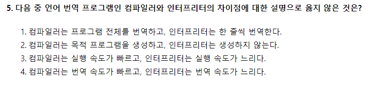

# 2018.03.03

- 5번
    
    
    
    - 컴파일러는 번역 속도가 느리지만 실행 속도가 빠르다.
    - 인터프리터는 번역 속도가 빠르지만 실행 속도가 느리다.
        
        
        
- 28번
    
    
    
    - HLOOKUP : 가로로 되어있는 목표 값이 있을 때 사용
        - → Horizontal LOOK UP
    - VLOOKUP : 세로로 되어있는 목표 값이 있을 때 사용
        - → Vertical LOOK UP
    - TRUE : 목표 값과 근사한 값을 찾음
    - FALSE : 정확한 목표 값을 찾음
- 33번
    
    
    
    - [차트 도구] - [레이아웃] - [레이블] 그룹에서 삽입할 수 있는 항목
        - 축 제목, 차트 제목, 범례, 데이터 레이블, 데이터 표
    - 텍스트 상자는 [삽입] 탭의 텍스트 그룹에 있는 기능
        - [삽입] - [텍스트] - [텍스트 상자]
- 38번
    
    
    
    - ‘문서에 맞게 배율 조정’은 인쇄될 워크시트가 아닌 머릿글/바닥글의 내용을 워크시트의 실제 크기의 백분율에 따라 확대-축소할 때 사용한다.
    - 머릿글/바닥글을 표시하기에 충분한 여백을 확보할 때는 ‘페이지 여백에 맞추기’를 선택
- 40번
    
    
    
    - 보기 2번은 거품형 차트에 대한 설명으로, 거품형 차트는 분산형의 한 종류로 데이터 계열 간의 항목 비교에 주로 사용된다.