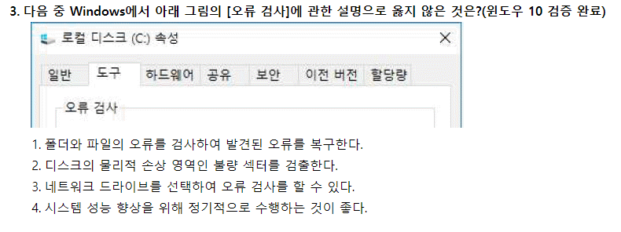

# 2018.09.01

- 3번
    
    
    
    - 네트워크 드라이브, CD 드라이브는 디스크 오류 검사를 할 수 없다.
- 34번
    
    
    
    - 원형 차트는 차트 계열 요소들의 값을 ‘데이터 표’로 나타낼 수 없다.
    - 원형 차트 :
        - 전체에 대한 각 값의 기여도 표시
        - 항목의 값들이 합계의 비율로 표시되므로 중요한 요소를 강조할 때 사용
        - 항상 한 개의 데이터 계열만을 가지고 있으므로 축이 없다.
        - 차트의 각 조각을 분리하거나, 첫째 조각의 각을 조정할 수 있다.
        - 차트 계열 요소의 값들을 ‘데이터 표’로 나타낼 수 없다.
            - → 원형, 도넛형, 분산형은 전체에 대한 부분비율이나 상호관계를 나타내는 것이 주된 목적이기에 데이터 표 메뉴를 사용하지 않는다.
- 38번
    
    
    
    - 입력된 자료들을 그룹별로 분류하고, 해당 그룹별로 원하는 함수를 이용한 계산 결과를 볼 수 있는 기능은 부분합이다.
    - 시나리오
        - 다양한 상황, 결과 값의 변화, 가상의 상황 예측/분석하는 도구
        - 결과셀은 반드시 변경셀을 참조하는 수식으로 되어 있다.
        - 하나에 최대 32개의 변경셀을 지정할 수 있다.
        - 시나리오 병합을 통해 다른통합문서나 워크시트에 저장된 시나리오를 가져올 수 있다.
        - 특정 셀에 연결된 결과셀 값이 자동으로 변경되어 결과값을 즉시 예측할 수 있다.
        - 결과는 요약보고서나 피벗테이블보고서로 작성할 수 있다.
        - 시나리오를 사용하여 작업시트에 입력된 값을 변경시키면 원래값을 되살릴 수 없다.
    - 부분합
        - 입력된 자료들을 그룹별로 분류하고 그룹별로 원하는 함수를 이용한 결과를 볼 수 있다.
        - 기준되는 필드(들)가 꼭 먼저 정렬되어야 한다.
        - 특정 데이터만 표시된 상태에서 차트를 작성하면 그것만 차트가 작성된다. ‘
        - 두 개 이상의 함수를 이용하려면 함수종류만큼 부분합을 반복 실행해야 한다. (두 번째 함수 사용부터 ‘새로운 값으로 대치’ 해제)