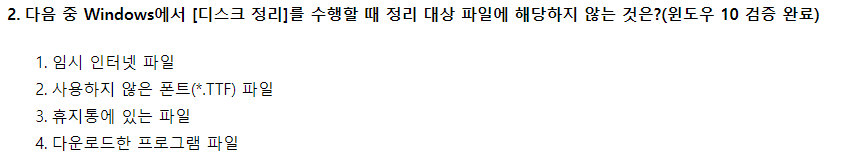

# 2019.03.02

- 2번
    
    
    
    - 디스크 정리 수행 시 정리 대상 파일 목록
        - 임시 파일
        - 휴지통에 있는 파일
        - 다운로드 한 프로그램 파일
        - 임시 인터넷 파일
        - 오프라인 웹 페이지
- 14번
    
    
    
    - 포맷 창 설정 가능 항목
        - 용량
        - 파일 시스템 설정
        - 할당 단위 크기
        - 볼륨 레이블 입력
        - 빠른 포맷 설정
    - 파티션 제거의 경우
        - 제어판 - 시스템 및 관리 - 관리 도구 - 컴퓨터 관리 - 저장소 - 디스크 관리
- 18번
    
    
    
    - 키보드 속성 창 설정 내용
        - 문자 반복을 위한 재입력 시간
        - 문자 반복을 위한 반복 속도
        - 커서 깜박임 속도
    - 포인터 자국 표시
        - 시작 - 제어판 - 마우스 - 마우스 속성 - 포인트 옵션
- 23번
    
    
    
    - 1번 : 천 단위 구분 기호 적용
        - 2,234,543
    - 2번 : 천 단위 구분 기호 적용 + 소수점 2자리까지 표시
        - 2,234,543.00
    - 3번 : 천 단위 구분 기호 적용 + 100의 배수만큼 자릿수 없애기 + 반올림 표현 +  천원
        - 2,235천원
    - 4번
        - 셀 값에 100을 곱해서 나온 값과 함께 %기호 붙이기
            - 223454300%
- 24번
    
    
    
    - 문자와 숫자가 혼합된 셀의 채우기 핸들에 Ctrl 키 누르고 드래그 : 동일 내용 복사
    - 숫자가 입력된 첫 번째 셀과 두 번째 셀을 범위로 설정 후 채우기 핸들 : 두 셀의 차이만큼 숫자 증가
    - 숫자가 입력된 셀에서 Ctrl 키 누른 채 채우기 핸들 오른쪽 드래그 : 숫자 1씩 증가. (오른쪽이건 왼쪽이건)
    - 사용자 정의 목록에 정의된 목록 데이터의 첫 번째 항목 입력 후 Ctrl 키 누른 채 채우기 핸들 : 첫 번째 항목에 입력된 데이터 그대로 복사
        - → 첫 번째 항목 입력 후 채우기 핸들 : 사용자 정의 목록에 지정된 데이터 입력
- 25번
    
    
    
    - 이미 부분합이 계산 되어 있는 상태로 새로운 부분합을 추가할 때는 ‘새로운 값으로 대치’ 설정을 해제애야 한다.
    - [모두 제거] 단추는 부분합을 하기 전 상태로 되돌리는 것.
    - ‘그룹 사이에 페이지 나누기’는 그룹별로 부분합 내용을 표시한 후 페이지 구분선 삽입
    - ‘데이터 아래에 요약 표시’ 는 부분합의 내용을 세부 데이터 아래에 표시, 항목 취소 시 부분합 내용을 먼저 표시하고 세부 데이터를 아래에 표시한다.
- 26번
    
    
    
    - 메모의 인쇄 여부 및 인쇄 위치를 지정하기 위해 선택해야 할 탭 : [시트] 탭
    - [페이지] 탭
        - 용지 방향(세로, 가로)
        - 배율 설정(확대/축소 배율)
        - 자동 맞춤
        - 용지 너비
        - 용지 높이
        - 용지 크기
        - 인쇄 품질
        - 시작 페이지 번호 설정 등
    - [여백] 탭
        - 용지 여백 설정
        - 페이지 가운데 맞춤(가로, 세로)
        - 인쇄 미리 보기 등
    - [머리글/바닥글] 탭
        - 머리글 편집
        - 바닥글 편집
        - 짝수와 홀수 페이지를 다르게 설정
        - 첫 페이지를 다르게 설정
        - 문서에 맞게 배율 조정
        - 페이지 여백에 맞추기 등등
- 28번
    
    
    
    - 원형 차트 : 항상 한 개의 데이터 계열만을 가지고 있는 차트, 한 계열에 대해서 데이터를 표시 해 주는 차트
    - 원본 데이터 : 항목과 계열의 갯수가 많아 원형 제작 시 최소 차트 3개 이상 필요
- 29번
    
    
    
    - IF 함수는 IF(조건문, 조건이 맞으면 표시, 조건이 틀리면 표시) 방식으로 표현
    - 다중 IF 함수의 경우 IF(조건, 참, IF(조건, 참, 거짓)) 형태로 표현
- 30번
    
    
    
    - 텍스트 마법사 대화상자에 있는 데이터 미리 보기에서 나눠진 열에 대해서는 순서를 변경할 수 없다.
- 33번
    
    
    
    - COUNTBLACK(범위) : 범위 안의 비어있는 셀의 갯수를 찾는다
    - COUNT(범위) :  범위 안의 데이터가 들어있는 셀 중에서 문자가 아닌 숫자만 계산한다.
        - ⇒ 엑셀의 날짜는 숫자를 화면상에서 날짜로 보이게 한 방식이기에, COUNT()에 포함된다.
    - 따라서 2 + 2 ⇒ 4.
- 34번
    
    
    
    - 양수인 소수점 위치는 왼쪽에서, 음수인 소수점 위치는 우측에서 붙는다.
    - 따라서 0.005가 된다.