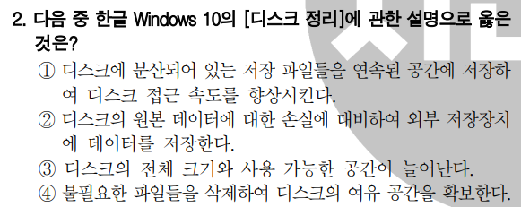

# 2023년 1차 모의고사

- 2번
    
    
    
    - 선택한 문항 : 1번
        - → 디스크 조각 모음과의 혼동.
    - 1번 : 드라이브 조각 모음 및 최적화
    - 2번 : 백업
    - 3번 : 디스크 정리 시 사용 가능한 공간은 늘어나지만 전체 크기는 늘어나지 않음
    - 4번 : 디스크 정리에 대한 설명으로, 정답.
- 3번
    
    
    
    - 선택한 문항 : 4번.
        - 하이브리드 검색 엔진 : 키워드 검색 엔진과 주제별 검색 엔진의 기능을 모두 제공하는 검색 엔진
        - 주제별 검색 엔진 : 정치, 경제, 문화 등과 같이 주제별로 정보를 분류해 놓은 형태로 디렉토리형 검색 엔진이라고도 함.
        - 키워드 검색 엔진 : 찾으려는 정보에 대한 키워드를 입력함으로써 원하는 결과를 얻는 검색 엔진
        - 메타 검색엔진 : 자체 검색 기능은 가지고 있지 않으나, 다른 검색 엔진에 검색을 의뢰하여 그 결과를 보여주는 검색 엔진
- 5번
    
    
    
    - 선택한 문항 : 2번
        - 정답은 4번으로, 멀티미디어 데이터는 문자, 그림, 소리 등의 다양한 아날로그 데이터를 디지털 데이터로 변환하여 통합 처리한다.
- 7번
    
    
    
    - 선택한 문항 : 2번
    - 정답 : 1번
    - 레지스터는 CPU 내부에서 처리할 명령이나 연산의 중간값등을 영구히 보존하는 것이 아닌, 일시적으로 기억하는 임시 기억 장소.
        - 플립플롭(Flip-Flop) : 기억장치를 구성하는 전자 회로로, 1비트의 정보를 기억할 수 있는 능력이 있다.
        - 래치(Latch) : 1비트 이상의 입력된 값을 다음 입력이 있기 전까지 그대로 유지하는 전자 회로
- 12번
    
    
    
    - 선택한 문항 : 2번
    - 정답 : 3번
        - 중앙처리장치의 성능을 나타내는 단위에는 MIPS, FLOPS, 클럭 속도(Hz)가 있다.
        - DPI는 1인치에 출력되는 점의 수로 출력물의 해상도를 나타내는 단위이다.
- 13번
    
    
    
    - 선택한 문항 : 2번
    - 정답 : 4번
    - 벤치마크 테스트 : 소프트웨어나 하드웨어의 성능을 검사하기 위해 실제로 사용되는 조건에서 처리 능력을 테스트 하는 것.
- 14번
    
    
    
    - 선택한 문항 : 2번
    - 정답 : 1번
        - 문항의 의미는 RIFD.
        - 유비쿼터스 : 사용자가 컴퓨터나 네트워크를 의식하지 않고 장소에 상관없이 자유롭게 네트워크에 접속할 수 있는 환경
        - DMB : 디지털 미디어 방송, 음성-영상 등 다양한 멀티미디어 신호를 디지털 방식으로 변조하여 고정 또는 휴대용, 차량용 수신기에 제공하는 방송 서비스
- 19번
    
    
    
    - 선택한 문항 : 4번
    - 정답 : 3번
        - 트랩(Trap)은 내부 인터럽트.
        - 소프트웨어 인터럽트는 프로그램 처리 중 명령의 요청에 의해 발생하는 것으로 가장 대표적인 형태는 운영체제의 감시 프로그램을 호출하는 SVC 인터럽트가 있다.
- 21번
    
    
    
    
    
    - 조건에 따라 다른 결과를 표시하려면 ‘IF(조건, 인수1, 인수2)’ 함수를, 데이터의 중간 자리를 추출하려면 ‘MID(텍스트, 시작 위치, 개수)’ 함수를 사용해야 한다.
        - →3번 문항 : 학번의 세 번째부터 두 자리가 “10”이면 “국문학과”, “20”이면 “영문학과” 그 외의 것은 “기타학과”입력
- 25번
    
    
    
    - <기본 회전>을 클릭하면 대화상자를 닫지 않은 상태에서 각 항목의 설정값들을 기본 설정으로 초기화 한다.
- 28번
    
    
    
    - 그룹화할 항목은 값을 구하는 기준이 되는 항목이다. 현재 그룹화할 항목이 ‘직무’와 ‘직급’이므로 부분합 작성 전에 ‘직무’와 ‘직급’을 기준으로 정렬해야 한다.
- 29번
    
    
    
    - 3번 = “활용능력” 나머지 = “컴퓨터활용”
        - SEARCH(텍스트1, 텍스트2) : 대/소문자 구분없이 텍스트2에서 텍스트 1을 찾아 위치를 표시한다.
        - MID(텍스트, 시작위치, 개수)  : 텍스트의 시작 위치부터 지정한 개수만큼 표시
        - FIND(텍스트1, 텍스트2) : 대/소문자를 구분하여 텍스트2에서 텍스트 1을 찾는다.
            1. “컴퓨터활용능력”에서 1번째 부터 5번째까지⇒ 컴퓨터활용
            2. “컴퓨터활용능력”에서 왼쪽부터 5(1 + 4) 까지 ⇒ 컴퓨터활용
            3. “컴퓨터활용능력”에서 오른쪽부터 4글자 표시 ⇒ 활용능력
            4. “컴퓨터활용능력”에서 1번째 부터 5번째까지 ⇒ 컴퓨터활용
- 31번
    
    
    
    - 수식을 입력하면 수식 데이터는 수식 입력줄에, 수식의 결과값은 워크시트의 셀에 표시된다.
- 37번
    
    
    
    - VLOOKUP(기준값, 범위, 열 번호) : 기준값을 지정된 범위의 첫 번째 열에서 찾은 후, 기준값이 있는 행에서 지정된 열 번호 위치에 있는 데이터를 입력한다.
        - VLOOKUP(3, A2:E5, 4) ⇒ A2:E5의 첫 번째 열에서 3을 찾은 후, 3이 있는 행에서 네 번째 열의 데이터
            - ⇒ 9.1
    - ROUNDUP(인수, 올림 자릿수) : 지정한 자릿수로 올림하는 함수
        - ⇒ ROUNDUP(9.1, 0) ⇒ 9.1을 1의 자릿수로 올림
            - ⇒ 10
- 38번
    
    
    
    - 국어 점수가 영어 점수 보다 10점 이상 높다
        - → 국어 점수 - 영어 점수 ≥ 10
        - → C3-D3≥10