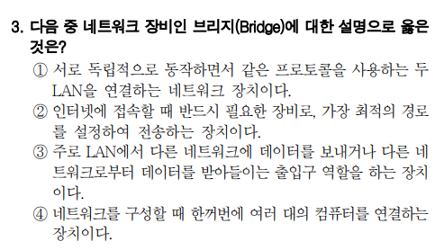

# 2023년 2차 모의고사

- 3번
    
    
    
    - 1번 : 브리지
    - 2번 : 라우터
    - 3번 : 게이트웨이
    - 4번 : 허브
- 5번
    
    
    
    - IPv6는 16비트씩 8부분으로 이루어져있다.
    - IPv6는 클래스 개념을 사용하지 않는다.
    - IPv6는 IPv4와의 호환성 및 주소의 확장성, 융통성, 연동성이 뛰어나다.
- 9번
    
    
    
    - 유니코드는 전세계의 모든 문자 표현 가능
    - 2번 : 해킹 코드
    - 3번 : BCD, ASCII, EBCDIC 등이 Zone 비트와 Digit 비트를 사용한다.
- 11번
    
    
    
    - 아이콘 보기 형식과 정렬은 바탕 화면의 바로 가기 메뉴 중 [보기]와 [정렬 기준]을 이용하여 지정한다.
- 12번
    
    
    
    - 드라이브 조각 모음 및 최적화는 디스크의 용량이 증가하지 않는다.
- 22번
    
    
    
    - MID(텍스트, 시작위치, 개수) : 텍스트의 시작 위치부터 지정한 개수만큼 표시.
    - CHOOSE(인수, 첫 번째, 두 번째) : 인수가 1이면 첫 번째, 인수가 2이면 두 번째
    - HLOOKUP(기준값, 범위, 행 번호, 옵션) : 범위의 첫 번째 행에서 옵션에 맞게 찾을 값과 같은 데이터를 찾은 후, 찾을 값이 있는 열에서 지정된 행 번호에 있는 값 반환
    - INDEX(범위, 행 번호, 열 번호) : 지정된 범위에서 행 번호와 열 번호에 위치한 데이터를 입력
    - RIGHT(텍스트, 개수) : 텍스트의 오른쪽에서 지정한 개수만큼 표시
    - IF(조건, 인수 1, 인수 2) : 조건이 참이면 인수 1, 조건이 거짓이면 인수 2
        - → 1번 : MID(A1, 8, 1) : 1
            - CHOOSE(1, “남”, “여”) : “남”
        - → 2번 : #N/A 오류
        - → 3번 : #REF! 오류
        - → 4번 : RIGHT(A1, 8) : “-1234567”
            - IF(-1234567, “남”, 여”)
                - ⇒ “여”
- 23번
    
    
    
    - 다른 통합 문서에 있는 셀의 데이터를 참조할 경우 통합 문서의 이름을 대괄호 [ ]로 묶어 준다.
    - 다른 워크시트에 있는 셀의 데이터를 참조할 경우 시트 이름과 셀 주소를 느낌표 ! 로 구분한다.
- 24번
    
    
    
    - ‘페이지 나누기 미리 보기’ 상태에서 자동으로 표시된 페이지 구분선은 점선, 수동으로 삽입된 페이지 구분선은 실선으로 표시된다.
- 25번
    
    
    
    - VLOOPUP(찾을 값, 범위, 열 번호, 옵션)
        - 범위의 첫 번째 열에서 찾을 값인 ‘상품코드’와 정확히 일치하는 값을 찾아야 하므로, ‘FALSE’ 또는 ‘0’ 옵션이 필요하다.
        - 답은 3번.
- 27번
    
    
    
    - ‘Excel 옵션’ 대화상자의 ‘고급’ 탭에 있는 ‘소수점 자동 삽입’을 이용하여 소수점 위치를 양수로 입력하면 소수점 이하(오른쪽)의 자릿수를 늘리고, 음수로 입력하면 소수점 이상(왼쪽)의 자릿수를 늘린다.
- 28번
    
    
    
    - 사용자가 차트 요소에 지정한 서식을 원래 스타일로 되돌리려면 해당 요소 선택 후 [차트 도구] → [서식] → [현재 선택 영역] → [스타일에 맞게 다시 설정]을 클릭해야 한다.
- 31번
    
    
    
    - 답은 3번 거품형이라는데… 잘 모르겠다.
- 33번
    
    
    
    1. 기본적으로 워크시트에서 숨기기를 실행한 영역은 인쇄되지 않는다. 
    2. 인쇄 영역에 포함된 도형들을 함께 인쇄하려면 ‘도형 서식’ 창의 [도형 옵션] → [크기 및 속성] → [속성] 에서 ‘개체 인쇄’를 선택한 후 인쇄해야 한다. 
    3. 정답
    4. 여러 시트를 한 번에 인쇄하려면 인쇄할 시트를 모두 선택 한 후 [파일] → [인쇄] 에서 ‘활성 시트 인쇄’를 선택한 후 인쇄해야 한다.
- 34번
    
    
    
    - 텍스트 나누기를 실행하면 ‘텍스트 마법사’ 대화상자가 표시되는데 ‘텍스트 마법사 2단계’ 대화상자에서 두 가지 이상의 구분 기호를 선택하여 텍스트 나누기를 수행할 수 있다.
    - 답은 4번
- 37번
    
    
    
    - 표에 병합된 셀이 포함되어 있을 경우 정렬할 수 없다.