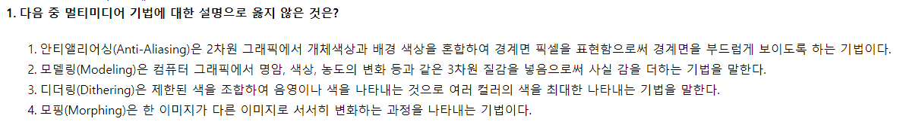

# 인공지능 모의고사

# 1회차

- 1번
    
    
    
    - 2번은 렌더링(Rendering)에 대한 설명이다.
    - 모델링(Modeling) : 물체의 형상을 컴퓨터 내부에서 3차원 그래픽으로 어떻게 표현할 것인지를 정하는 과정
- 4번
    
    
    
    - 허브 : 네트워크를 구성할 때 여러 대의 컴퓨터를 연결하여 각 회선을 통합 관리하는 장비
    - 게이트웨이 : 다른 네트워크과 데이터를 보내고 받기 위한 출입구 역할을 하는 장비
    - DNS : 인터넷 도메인 네임을 숫자로 된 IP 주소로 바꾸어 주는 장비
    - 라우터 : 네트워크 상에서 가장 최적의 IP 경로를 설정하여 전송하는 장비
- 5번
    
    
    
    - TCP/IP 구성요소
        - IP 주소
        - 서브넷 접두사 길이
        - 서브넷 마스크
        - 게이트웨이
        - DNS 서버주소
- 16번
    
    
    
    - 가상 메모리 : 보조기억장치의 일부를 주기억장치처럼 사용하는 메모리
    - 연관 메모리 : 기억된 정보의 내용 일부를 이용하여 주기억장치에 접근하는 장치
    - 플래시 메모리 : EEPROM의 일종으로 비휘발성 메모리
    - 캐시 메모리 : 중앙처리장치(CPU)와 주기억장치 사이에 위치하여 컴퓨터 처리 속도를 향상시키는 메모리
- 23번
    
    
    
    - #,##0
        - 천 단위 구분 기호를 적용 하는 서식. 3자리씩 쉼표를 끊어서 나타낸다.
    - #,##0.00
        - 숫자가 입력된 건 천 단위 구분 기호를 적용하면서 뒤에 소수점 2자리까지 표현해서 나타내라는 서식
    - 0.00
        - 숫자를 그대로 표현한 후, 소수점 2자리 추가
    - #,###, “천원”
        - #,###을 통해 천 단위 구분 기호를 나타낸다.
        - 단, 천 단위 구분 기호 서식 뒤에 쉼표(,)를 통해 1000의 배수만큼 자릿수를 없앤다.
        - 이 때 천 원 단위로 끊을 때 반 올림을 해야 하므로, 서식 적용시 2,235천원이 되야 한다.
    - #%
        - 셀 값에 100을 곱해서 나온 값과 함께 %기호를 붙인다.
- 30번
    
    
    
    - ‘메모’는 (없음), ‘시트 끝’, ‘시트에 표시된 대로’ 중 하나를 선택하여 인쇄할 수 있다.
    - ‘간단하게 인쇄’를 체크할 경우 모든 서식과 구분선, 도형, 개체 등이 제거된 텍스트 만을 인쇄 가능
    - ‘인쇄 영역’ 범위 지정 시 숨겨진 행이나 열은 인쇄되지 않는다.

# 2회차

- 35번
    
    
    
    - 셀 맞춤 키는 Ctrl이 아닌 Alt 키를 사용한다. Alt키를 누르고 드래그 하면 셀 영역에 맞게 위치 시킬 수 있다.

# 3회차

- 6번
    
    
    
    - 무선 랜(WLAN) 시스템 구성 요소
        - 무선 랜카드 : 무선으로 인터넷 사용이 가능한 랜카드
        - AP : 안테나겸 접속장치로 흔히 공유기라 불린다.
        - 안테나 : 무선통신에서 통신의 목적달성을 위해 전파를 방사하거나 전파에 의해 효율적으로 가전력을 유지 시키기 위해 가설한 도선
        - 리피터 : 정보 통신을 위한 디지털 방식의 통신 선로에서 전송신호를 증폭하거나 재생하고 전달하는 중계 장치
- 16번
    
    
    
    - 가상 메모리 : 보조기억장치의 일부를 주기억장치처럼 사용하는 메모리
    - 연관 메모리 : 기억된 정보의 내용 일부를 이용하여 주기억장치에 접근하는 장치
    - 플래시 메모리 : EEPROM의 일종으로 비휘발성 메모리
    - 캐시 메모리 : 중앙처리장치(CPU)와 주기억장치 사이에 위치하여 컴퓨터 처리 속도를 향상시키는 메모리